<!--
author:   Wade Baxter, Ph.D.

email:    LiaScript@web.de

version:  0.0.1

language: en

narrator: US English Female

comment:  CK-12 Chemistry - Intermediate is a NEW high school FlexBook® textbook covering Scientific Method, Matter, Atomic Structure, Elements, Chemical Reactions, Stoichiometry, Chemical Kinetics, Physical States of Matter, Thermodynamics, Nuclear & Organic Chemistry.

logo:     ../cover.jpg

tags:      chemistry, intermediate, flexbook, high school, textbook, science

-->

# CK-12 Chemistry - Intermediate

> This document was automatically translated to LiaScript from
>
> https://www.ck12.org/book/ck-12-chemistry-intermediate/

## 1.0 Introduction to Chemistry

<article>

_Image copyright 3445128471, 2014. www.shutterstock.com. Used under license from Shutterstock.com_

</article>

### 1.1 What is Chemistry?

<article>

Lesson Objectives
-----------------

* Define chemistry.
* Differentiate between the macroscopic and the microscopic as it relates to chemistry.
* Know the relationship between pure chemistry and applied chemistry.
* Identify and describe the five primary disciplines of chemistry.
* Describe some of the concerns of the modern world in which chemistry has played and will continue to play a role.

Lesson Vocabulary
-----------------

* analytical chemistry
* applied chemistry
* biochemistry
* chemistry
* inorganic chemistry
* macroscopic
* matter
* microscopic
* organic chemistry
* physical chemistry
* pure chemistry

Check Your Understanding
------------------------

### Recalling Prior Knowledge

* What are some areas of science with which you are familiar?
* List some of the chemicals that influence your everyday life.

Chemistry is a diverse and fascinating science that impacts our lives each and every day. In this first lesson, you will learn what chemistry is and some of the ways in which chemistry influences the modern world.

A Definition of Chemistry
-------------------------

Science is a general term used to describe the principled, rigorous study of the natural world. Many interconnected disciplines fall under this broader concept. For example, physics is the study of motion and forces. Biology is the study of living things. Geology is the study of the Earth and the rocks and minerals of which it is comprised. In this text, you will learn about the field of chemistry. **Chemistry** _is the study of the composition of matter and the changes that matter undergoes_. **Matter** _is anything that has mass and takes up space_. Virtually everything around us is matter, including both living and nonliving things. Chemistry affects nearly everything we see and every action we take. Chemistry explains why the leaves of deciduous trees turn from green in the summer to various shades of red and yellow in the autumn (**Figure** [below](#x-ck12-SW50LUNoZW0tMDEtMDEtTGVhdmVz)). Chemistry explains why milk that is left in the refrigerator for too long turns sour. Chemistry explains why certain pollutants called chlorofluorocarbons have done lasting damage to the ozone layer of our planet. Chemistry is very much a central, foundational science, and a basic knowledge of chemistry is essential for students who are pursuing studies in biology, geology, environmental science, medicine, and many other subjects.

Chemists are tasked with looking at the world in two ways, often simultaneously. The two worlds of the chemist are the macroscopic world and the microscopic world. **Macroscopic** _refers to substances and objects that can be seen, touched, and measured directly_. **Microscopic** _refers to the small particles that make up all matter_. Chemists must observe matter and do experiments in the macroscopic world and then use their observations to make generalizations and propose explanations that are microscopic in nature. For example, anyone can observe the physical change in appearance that occurs as an iron object rusts, such as a tractor that is left outside for a long enough period of time. However, a chemist looks at the rusting tractor and thinks about what is going on with the individual atoms that make up the iron and how they are changing as a result of exposure to rainwater or oxygen in the air. Throughout your study of chemistry, you will often need to switch back and forth between the macroscopic and microscopic worlds.

### Alchemy

Chemistry is a subject that has its roots in the ancient tradition known as alchemy, from which it derives its name. Alchemy was a combination of philosophy and science that had both practical and mystical aspects. The goals of alchemy were varied and difficult to summarize. In many ways, the alchemists sought to achieve perfection, through such actions as the pursuit of the philosopher’s stone and the elixir of life (**Figure** [below](#x-ck12-SW50LUNoZW0tMDEtMDItQWxjaGVtaXN0)). The philosopher’s stone, it was believed, was a substance that was capable of being used to turn base metals (such as lead) into gold. It was also believed that it could be used to achieve rejuvenation and perhaps immortality. While alchemists did not ultimately succeed in these quests, their work provided the foundation for the modern study of chemistry.

Alchemists laid the groundwork for many chemical processes, such as the refining of ores, the production of gunpowder, the manufacture of glass and ceramics, leather tanning, and the production of inks, dyes, and paints. Alchemists also made the first attempts at organizing and classifying substances so that they could better understand their reactions and be able to predict the products of their experiments. This eventually led to the modern periodic table, which you will learn about in a later chapter. Alchemy began to fully evolve into chemistry in the 17_th_ century, with a greater emphasis on rational thought and experimentation and less emphasis on spirituality and mysticism.

 is titled “The Alchymist, In Search of the Philosopher’s Stone.”")

### Pure and Applied Chemistry

The study of modern chemistry can be split into two categories, called pure chemistry and applied chemistry. Chemists who study pure chemistry do research primarily to advance mankind's understanding of chemistry. **Pure chemistry** _is concerned with a greater understanding of the theories behind how matter is changing in chemical reactions_. Pure chemists tend to be less concerned with direct applications of the research that they are doing. That is not to say that pure chemistry can never lead to a real-world application but, rather, that a potential application is not the primary motivation for doing the research in the first place. **Applied chemistry** _is chemistry that is directed toward a specific practical goal or application_.

The line between pure chemistry and applied chemistry is not always distinct. For example, in the early 1960s, chemists at DuPont were searching for a new lightweight and strong fiber that could be used in tires. Chemist Stephanie Kwolek discovered, somewhat by accident, that a certain solution she had made displayed unique characteristics that were unlike those of other previously developed substances. The rapid expansion in the field of polymer chemistry that has occurred over the past 50 years was partially due to the results of her research. Polymers are very, very large molecules comprised of smaller subunits that are repeated over and over again in extremely long chains. The polymer that was discovered at DuPont was eventually given the name Kevlar. It is used not only in tires but also in bulletproof body armor because of its high strength and light weight. Polymer chemistry continues to be an active and vibrant field of chemistry, as both a pure and an applied discipline.

### Chemistry Disciplines

The study of modern chemistry has many, many branches, but it can generally be broken down into five main disciplines, or areas of study. **Physical chemistry** _is the study of both macroscopic and atomic properties and phenomena in chemical systems_. A physical chemist may study such things as the rates of chemical reactions, the energy transfers that occur during a reaction, or the physical structure of materials at the molecular level. **Organic chemistry** _is the study of carbon-containing chemicals_. Carbon is one of the most abundant elements on Earth and is capable of forming a tremendously vast number of chemicals. Most of the chemicals found in living organisms are based on carbon. **Inorganic chemistry** _is the study of chemicals that do not, in general, contain carbon_. Inorganic chemicals are commonly found in rocks and minerals. **Analytical chemistry** _is the study of the composition of matter, with a focus on separating, identifying, and quantifying chemical samples_. An analytical chemist may use complex instruments to analyze an unknown material in order to determine its various components (**Figure** [below](#x-ck12-SW50LUNoZW0tMDEtMDQtTk1SLU1hY2hpbmU.)). **Biochemistry** _is the study of chemical processes that occur in living things_. Due to the importance of carbon-containing compounds in living organisms, biochemistry and organic chemistry are often closely interrelated.

 is an analytical technique that uses very large magnets in order to learn about the specific makeup of complex chemicals. Pictured is a 900 MHz NMR spectrometer located in Birmingham, UK.")

In practice, chemical research is often not limited to just one of the five major disciplines. For example, a chemist might use biochemistry techniques to isolate a particular chemical from the human body, such as hemoglobin, the oxygen-carrying component of red blood cells. He or she may then proceed to analyze the hemoglobin using methods that would pertain to physical or analytical chemistry. Many chemists specialize in areas that are combinations of these primary disciplines, such as bioinorganic chemistry or physical organic chemistry.

Chemistry in the World Today
----------------------------

Chemistry has played and will continue to play a central role in all areas of science and technology. Before delving into the specifics of chemistry, it is worthwhile to examine a few of the frontiers that chemists are currently exploring and to review how chemistry has helped shape these fields.

### Energy

Virtually all chemical reactions involve a transfer of energy, and the worldwide demand for energy continues to increase every year. The majority of our energy needs since the Industrial Revolution have been met by the burning of fossil fuels. Fossil fuels (coal, petroleum, natural gas) were formed millions of years ago from the remains of plants and animals. Fossil fuels are a nonrenewable energy source, meaning that they cannot be produced or regenerated, so the global supply will eventually be exhausted. Chemists are actively involved in finding ways to conserve energy and to utilize alternative energy sources.

Nuclear energy is obtained by splitting large atoms such as uranium into smaller atoms in a process called nuclear fission. Nuclear fission releases tremendous amounts of energy, much more than burning an equivalent amount of fossil fuels. While nuclear energy is widely used to supplement the energy demands of modern society, it comes with risks and drawbacks. For example, nuclear power generates waste that is dangerously radioactive and difficult to store safely. Chemists are currently searching for better ways to store nuclear waste. Nuclear fusion, the process that occurs in the sun and other stars, is an alternative that does not generate the same type of waste as nuclear fission. Scientists are actively trying to make nuclear fusion a practical source of energy.

Biofuels are an alternative energy source that has gained a great deal of attention in recent years (**Figure** [below](#x-ck12-SW50LUNoZW0tMDEtMDQtU295YmVhbi1PaWwtQnVz)). Various types of biofuels are obtained from vegetable oils, animal fats, and the decomposition of corn or other crops. Although the use of biofuels lessens our dependence on fossil fuels, it still involves the burning of carbon-based chemicals, which contributes to climate change.

Finding alternative energy sources that are renewable and do not harm the environment is a primary goal for scientists working in this field. Renewable energy sources are those that either will not run out or that can be used over and over again. Chemists and other scientists are actively involved in the search for these energy sources and for ways to make their use widespread and practical. Solar energy involves the direct transformation of the energy from the sun into electricity by the use of devices called photovoltaic cells. Energy from wind can be obtained from the use of giant windmills. Wind power is an energy source that has been on the rise in recent years, with an increasing number of “wind farms” being built both on land and offshore. Geothermal energy is energy that is generated and stored deep within the Earth. This energy source can also be tapped and used to generate electricity.

### Medicine

Advances in medicine over the last century have dramatically increased lifespans and improved our quality of life. Chemists are at the forefront of many of these medical breakthroughs and improvements. Medical researchers work with doctors to gain a better understanding of biological processes that occur in the human body. Today, thousands of prescription and over-the-counter drugs are available to treat everything from a simple headache to major infections, high blood pressure, depression, and a host of other ailments. Drugs work because of their interactions with other chemicals in the body. Chemists are constantly working to improve existing drugs, to design new and better drugs, and to further their understanding of the chemical mechanisms by which drugs perform their functions.

Chemists are also involved in designing materials that are used to repair or replace body parts. Artificial hips and knees can be inserted into a person’s body so that he or she can walk without pain (**Figure** [below](#x-ck12-SW50LUNoZW0tMDEtMDUtUHJvc3RoZXRpYy1IaXA.)). Burn victims benefit from replacement skin. Diseased arteries can be replaced with plastic tubing that must be able to withstand the harsh environment found inside a human body without degrading or malfunctioning.

Biotechnology is an emerging field that involves the manipulation of DNA, the chemicals that store the genetic information that gets passed on from one generation to the next. Genes are the pieces of DNA that contain this genetic information. Biochemists can transfer genes from one organism to another in order to take advantage of useful traits. For example, genes from a certain bacteria produce a chemical that confers resistance to certain crop-eating pests. Inserting these genes into the genetic material of corn plants results in genetically modified corn that is able to resist the pest without having to be sprayed with a chemical pesticide. Bacteria can also be used as “chemical factories” to produce useful drugs such as insulin, which is used to treat some forms of diabetes.

### Materials

Chemists are also involved in the design and production of new materials. Some of the materials that chemists have helped discover or develop in recent years include polymers, ceramics, adhesives, coatings, and liquid crystals. Liquid crystals are used in electronic displays, such as those found in watches and calculators. Silicon-based computer chips have revolutionized modern society, and chemists have played a key role in their design and continued development. Many chemists are currently working in the field of superconductivity. Superconductors are materials that can conduct electricity with 100% efficiency. Unlike conventional conducting materials, like copper cables, no energy is lost during electrical transmission through superconductors. Unfortunately, most known superconductors only exhibit this property at extremely low temperatures. A current challenge in this field is to design materials that can act as superconductors at normal temperatures.

### The Environment

There is a great deal of concern about the deleterious effects that humankind has had and continues to have on the natural environment. The burning of fossil fuels pumps millions of tons of carbon dioxide into the atmosphere. Carbon dioxide is a greenhouse gas, which means that it traps the heat from the sun and prevents it from being released back out into space in the form of infrared radiation. As a result, the temperature of Earth is slowly climbing. Chemists, along with environmental scientists, are searching for ways to slow or reverse the effects of global warming. One way, as mentioned previously, is to develop alternative energy sources such as wind power that do not emit carbon dioxide.

Many other chemicals that were once commonly used were later found to be harmful to the environment, to human health, or both. The element lead was once a common additive to gasoline and to paint. Plumbing pipes were once typically made of lead. Only since the 1970s has the danger of lead become apparent. Too much exposure to lead can cause brain damage, and small children (who often chewed on objects painted with lead-based paint) are particularly susceptible to this effect. The use of lead in gasoline, paint, and plumbing pipes is now banned. Mercury is another toxic element whose use was once far more widespread than it is today, especially in many industrial processes. Chemists continue to look for threats to our health and the environment and to search for substitutes so that harmful chemicals can be replaced with equally effective but less harmful alternatives.

### Agriculture

The world’s population has increased dramatically over the last century. It is becoming challenging to feed this population, since the amount of land available to grow food is limited. Even worse, the amount of usable land is declining as some of it is being converted to living areas. Chemists are involved in efforts to make the land that is used for agriculture as efficient and productive as possible. Some factors that decrease productivity include poor soil quality, lack of sufficient water, crop-eating pests, weeds, and diseases. Chemists are involved in the study of soils, including how to improve existing soils and to develop techniques so that soils do not lose their nutrients. Fertilizers are used to provide crop plants with vital nutrients, but the excessive use of fertilizers is harmful to the environment, particularly when the fertilizer runs off the land and into the water supply (**Figure** [below](#x-ck12-SW50LUNoZW0tMDEtMDYtYWxnYWwtYmxvb20.)). Herbicides and insecticides have traditionally been applied to crops in order to reduce losses from weeds and insects. However, pesticides contain toxic chemicals that are potentially harmful to other organisms, including humans. Chemists are involved in developing alternatives to traditional pesticides so that the use of these harmful chemicals can be reduced. Biotechnology was mentioned previously as a way to increase the resistance of crops to pests. Pests can also be attacked by using natural chemicals to disrupt their mating and reproductive mechanisms so that the overall number of pests declines.

Lesson Summary
--------------

* Chemistry is the study of matter and its changes. Chemistry is closely interrelated with other scientific fields, such as biology and geology.
* Chemists examine and explain their observations on both macroscopic and microscopic levels.
* Pure chemistry is devoted to the acquisition of chemical knowledge, while applied chemistry is focused on a specific goal.
* The five main disciplines of chemistry are physical, organic, inorganic, analytical, and biochemistry.
* Chemistry has modern applications in the fields of energy, medicine, materials science, the environment, and agriculture.

Lesson Review Questions
-----------------------

### Reviewing Concepts

1.  Which of the following scientific inquiries involve chemistry? For the others, what field of science is being described?
    1.  how long it takes for an object to fall from a rooftop to the ground
    2.  how fast a flammable liquid burns
    3.  the amount of pollutants in a lake
    4.  the structure of a plant cell
2.  The same event is described in two ways below. Which description focuses on the macroscopic level and which focuses on the microscopic level?
    1.  Chemical bonds between oxygen atoms and hydrogen atoms are broken.
    2.  When an electric current passes through water, a gas is produced.
3.  State whether each of the chemists below is practicing pure chemistry or applied chemistry. Explain.
    1.  He is attempting to formulate a new adhesive that works well in extremely cold temperatures.
    2.  She is studying reactions of the element sodium with different gases.
4.  Which of the five main chemistry disciplines is most closely related to each of the actions described below?
    1.  Studying the digestion of certain types of foods
    2.  Investigating the iron content of different samples of ore
    3.  Measuring how much energy is released in a series of reactions
    4.  Attempting to produce a new carbon-based chemical
    5.  Measuring the amount of mercury contamination in a sample of river water
5.  What is the difference between renewable and nonrenewable energy?
6.  Identify the following energy sources as renewable or nonrenewable.
    1.  fossil fuels
    2.  solar energy
    3.  nuclear power
    4.  wind
    5.  geothermal energy
7.  Name a process that is involved in biotechnology.
8.  What are greenhouse gases, and why is their production considered to be an environmental problem?
9.  What are two alternatives to the traditional use of chemically-based pesticides in agriculture?

Further Reading / Supplemental Links
------------------------------------

* Branches of Chemistry: Overview of the Branches of Chemistry at http://chemistry.about.com/od/branchesofchemistry/a/branchesofchemistry.htm

Points to Consider
------------------

Chemists, like all scientists, rely on a rigorous and systematic approach to studying the world called the scientific method.

* What are the steps of the scientific method?
* How do chemists and other scientists communicate their findings to the public?

</article>

### 1.2 The Scientific Method

<article>

Lesson Objectives
-----------------

* Describe how the Renaissance period in history changed the approach to science.
* Identify the steps of the scientific method.
* Differentiate between the independent variable and the dependent variable in an experiment.
* Describe how scientists work in research groups and communicate their results.

Lesson Vocabulary
-----------------

* control group
* dependent variable
* hypothesis
* independent variable
* scientific law
* scientific method
* theory

Check Your Understanding
------------------------

### Recalling Prior Knowledge

* How did the ancient practice of alchemy differ from the modern science of chemistry?
* What are the properties of a well-designed scientific experiment?

Advancements in science are not always planned. Many groundbreaking discoveries in the history of science were made almost completely by accident. However, science follows a rigorous, time-tested process called the scientific method. By applying the scientific method, scientists can be ready for whatever results their research gives them, and many new and important discoveries can be made.

Experimental Science
--------------------

It may surprise you to know that science is, relatively speaking, a very young subject. The Renaissance, which occurred roughly between the 14_th_ and 17_th_ centuries, was a time of great upheaval in Europe. The Middle Ages were dominated by a dogmatic approach to knowledge. The Renaissance ushered in new ways of thinking and great advancements in art, music, and culture. There also came a new emphasis on obtaining knowledge through the processes of observation and experimentation, as opposed to a reliance on older ideas that were based on a less rigorous scientific process. Two individuals who personified the Renaissance approach to science are Leonardo da Vinci and Nicolaus Copernicus. Many credit da Vinci with being the father of modern science. He is renowned for his observations and drawings of human anatomy (**Figure** [below](#x-ck12-SW50LUNoZW0tMDEtMDctRGEtVmluY2k.)). He also set up controlled experiments to investigate water flow, medical dissection, and the systematic study of movement and aerodynamics. Copernicus was an astronomer who suggested, based on observations, a heliocentric model of the solar system, meaning that Earth and other planets traveled around the Sun. The prevailing doctrine had been that Earth was the center of the Universe and that all celestial bodies must travel around it.

 The famous Vitruvian Man drawing; (right) A document showing the anatomy of the human arm.")

More than any one particular piece of knowledge, the Renaissance represented a change in the way human beings thought about the world around them. Emphasis shifted from a philosophical explanation of the world’s natural processes to one that was instead based on observation and experimentation. The process of scientific discovery that we now call the scientific method originated during the Renaissance. This new method led to great advancements in the fields of astronomy, physics, anatomy, biology, and chemistry.

The Scientific Method
---------------------

The **scientific method** _is a systematic and logical approach to the acquisition of knowledge_ (**Figure** [below](#x-ck12-SW50LUNoZW0tMDEtMDgtU2NpZW50aWZpYy1NZXRob2Q.)). It uses specific techniques to observe and investigate natural phenomena. The scientific method differs from other methods of inquiry in that scientists seek to let reality speak for itself rather than approaching inquiry with any preconceived biases toward one explanation or another. The steps of the scientific method are: (1) formulating a question, (2) making a hypothesis, (3) testing the hypothesis through experimentation, (4) analyzing results, and (5) developing theories or revising the hypothesis.

### Formulating a Question

The formulation of a question represents the first step in scientific inquiry. The type of question can be very specific or more general. Questions are often based on observations. For example, suppose that you observe that a lamp does not light up when you turn on the switch. The natural question is to ask why the lamp does not work. This in turn would lead to an investigation of the possible reasons why the lamp is not working. However, the process begins with a question that needs to be answered.

### Making a Hypothesis

A **hypothesis** _is a testable conjecture that proposes an answer to the question_. A hypothesis for the nonfunctioning lamp could be that the light bulb is burned out. In order to be a valid hypothesis, it must be possible to test it.

### Testing the Hypothesis and Analyzing Results

The light bulb could be easily removed and replaced with another one. If the new light bulb works, then the original hypothesis is confirmed. However, if the lamp still does not work even when the light bulb has been replaced, the hypothesis is now in question. Further experiments with more light bulbs could be done. Eventually, if the lamp continues not to work, the original hypothesis must be discarded. At this point, the scientist may decide to either make a slight change in the hypothesis or abandon the experiment entirely. Perhaps the change could be that there is a problem with the switch for the lamp that is preventing it from working. A new set of experiments could be performed to determine if the original switch was responsible for the lamp not working.

The lamp example oversimplifies the usual process in a real scientific experiment. In most experiments, multiple experimental groups are created in order to test the effect of one variable on another. For example, suppose that you wanted to know how elevated air temperature affects the germination rate of a certain type of bean seed. You would set up multiple pots planted in identical fashion with the same bean seeds. You would establish experimental constants such as the amount of water and the amount of light that each planting would receive. The **independent variable** _in an experiment is the variable that is changed during an experiment_. In this case, the temperature is the independent variable. You would figure out a way to place each of the experimental groups at a different elevated temperature. One planting would be left at room temperature. This is called the control group. A **control group** _is a group that experiences the same conditions as the experimental groups with the exception of the variable that is being tested_. The bean plantings would be observed at regular intervals, perhaps every 12 hours. Data would be collected as to how many bean seeds germinated in each planting and when germination took place. The **dependent variable** _in an experiment is the variable that is observed during an experiment_. In this experiment, germination of the bean seeds is the dependent variable.

In order to be confident about the results of an experiment, it needs to be repeatable. Professional scientists normally repeat experiments many times before they make their findings known to other scientists or to the public.

### Developing Theories

If many experiments are performed and each and every one supports the hypothesis, it may be that the hypothesis can be accepted. A **theory** _is an explanation that has been repeatedly tested and confirmed by multiple researchers and has gained wide acceptance_. The term theory is one that is often misunderstood by people in the general population who are unfamiliar with the scientific method. Though a scientist may state that a theory cannot be proven correct, he or she is certainly not saying that it is in doubt. A scientific theory has generally been confirmed over and over and over again, although small details within a theory may be adjusted from time to time as new discoveries are made. In a later chapter, you will learn about atomic theory and how it has changed over the last few centuries. While the existence of atoms has not been in question for some time, new details about how the atom functions have resulted in many updates and alterations of the essential theory.

### Scientific Laws

A **scientific law** _is a statement that summarizes the results of many observations and experiments and to which there are no known exceptions_. A familiar scientific law is the law of gravity. The force of attraction between two objects is dependent in a very specific way on the masses of those objects and on the distance between them. The law of gravity has been tested and proven countless times. Scientific laws often have a mathematical basis, though that is not necessarily a requirement.

Scientific Communication
------------------------

Today’s scientists rarely work alone. Rather, most scientists collaborate with one another in various settings as part of a group effort. The majority of research scientists work either for a company, such as the DuPont Chemical Company, or for one of many universities, such as the California Institute of Technology. Working as part of a group has many advantages. Most scientific problems are so complex and time-consuming that one person could not hope to address all of the issues by himself or herself. Instead, different members of a research group are each tasked with a particular small aspect of a larger research problem. Collaboration between members of the group is frequent. This occurs informally in the laboratory on an everyday basis. Research groups also typically have regular meetings where one or more members of the group may give a presentation to the others on the status of the research that they are doing. Progress normally occurs in small steps rather than grand, sweeping discoveries, and that progress is helped along by the teamwork that comes from working as part of a group.

Modern scientific research is usually expensive. Lab equipment, chemicals, research space, and the upkeep of technical instrumentation all cost money. Research groups need to raise money in order to continue their work. For research done at universities, much of that money comes from government sources, such as the National Science Foundation or the National Institute of Health. Private companies can fund their own research, but they may seek outside funding as well. Scientists write grant proposals explaining the goals and projected costs of their research, and funding agencies make decisions about which research projects they would like to fund. The long-term viability of most research labs depends on the ability to get and maintain funding.

### Communicating Results

Suppose that your research is a success. What now? Scientists communicate their results to one another and to the public at large in several ways. One is to publish their research findings in publications called scientific journals. There are many hundreds of scientific journals covering every imaginable field of science. A few of the major chemistry journals include the “Journal of the American Chemical Society,” the “Journal of Physical Chemistry,” and “Inorganic Chemistry.” Some journals have a very narrow scope, while others publish articles from many different scientific disciplines and appeal to a wider audience. Examples of the latter include the journals “Science” and “Nature.” Journal articles are often very complex and detailed. They must be accurate, since the research field as a whole uses these journal articles as a way to make scientific progress. Therefore, journal articles are only published after having been extensively reviewed by other professional scientists in the same field. Reviewers have the power to make suggestions about the research or possibly question the validity of the author’s conclusions. Only when the reviewers are satisfied that the research is correct will the journal publish the article. This peer-review process allows scientists to trust the research findings that they read about in journals.

Scientists also communicate with one another by presenting their findings at international conferences. Some scientists are chosen to give lectures at conferences, typically about research that has already been published. Many other scientists at the same conference will present their work at poster sessions (**Figure** [below](#x-ck12-SW50LUNoZW0tMDEtMTAtUG9zdGVyLVNlc3Npb24.)). These poster sessions are more informal and may often represent research that is still in progress.

Lesson Summary
--------------

* The Renaissance, which took place in Europe between the 14_th_ and 17_th_ centuries, was a time of great change in thought and culture. Along with many other changes, science began to follow a more systematic approach based on careful observation and experimentation.
* The steps of the scientific method are to formulate a question, make a hypothesis, perform experiments, analyze the results, and develop theories.
* Professional scientists collaborate with one another by working in research groups and presenting their results in scientific journals and at international conferences.

Lesson Review Questions
-----------------------

### Reviewing Concepts

1.  What were some of the scientific contributions of da Vinci and Copernicus?
2.  What is a key requirement for a hypothesis to be a valid part of the scientific method?
3.  Which of the following is not a part of the scientific method?
    1.  experiment
    2.  hypothesis
    3.  chance
    4.  theory
4.  What is the next step if a particular experiment is inconsistent with the hypothesis?
5.  Why do scientists repeat experiments?
6.  What is the difference between the independent variable and the dependent variable in an experiment?
7.  What makes a theory different from a hypothesis?
8.  What is a scientific journal and what is meant by the term “peer review”?

### Problems

9.  A student decides to test the effect of added salt on the boiling point of water. He collects the following data (**Table** [below](#x-ck12-dGFibGU6c2FsdC1ib2lsaW5nLXBvaW50)).
    1.  What is the independent variable?
    2.  What is the dependent variable?
    3.  What is the purpose of the first experiment, when no salt was added to the water?
    4.  What needs to be kept constant during the experiment in order for the results to be valid?

| Amount of added salt (g) | Boiling Temperature (°C) |
| --- | --- |
| 0   | 100 |
| 20  | 101 |
| 40  | 102 |
| 100 | 105 |

Further Reading / Supplemental Links
------------------------------------

* Scientific Method History: http://scientificmethod.com/sm5_smhistory.html
* Steps of the Scientific Method: An Explanation: http://scientificmethod.com/sm4_stepsofsm.html

Points to Consider
------------------

Chemistry is the study of matter and the changes that it undergoes. Before beginning to examine those changes, it is important to be able to classify matter according to certain common characteristics and be able to recognize when a chemical change is occurring.

* What properties of matter allow it to be classified?
* What clues allow a chemist to recognize a chemical reaction?

</article>

## 2.0 Matter and Change

<article>

_Flickr:jcroninone. www.flickr.com/photos/31867606@N04/4038864078. CC BY 2.0._

</article>

### 2.1 Properties of Matter

<article>

Lesson Objectives
-----------------

* Describe a substance according to its physical properties.
* Distinguish between extensive and intensive properties.
* Describe the three states of matter.
* Identify physical changes to matter.

Lesson Vocabulary
-----------------

* extensive property
* gas
* intensive property
* liquid
* mass
* physical change
* physical property
* pure substance
* solid
* vapor
* volume

Check Your Understanding
------------------------

### Recalling Prior Knowledge

* What are some physical properties that can be used to describe matter?
* What are the three states of matter? Describe their similarities and differences.

The science of chemistry is largely concerned with the understanding and classification of matter. This understanding naturally begins with careful observations. What does a particular sample of matter look like? Is it a solid, liquid, or gas? Is it hard or soft? Is it shiny or dull? These types of questions are where we will begin our study of matter and its properties.

If you would like to refresh your memory about states of matter, go to “The Phantom's Portrait Parlor: Phases of Matter” at [www.miamisci.org/af/sln/phases/watersolid.html](http://www.miamisci.org/af/sln/phases/watersolid.html) and view solids, liquids, and gases at the molecular level.

Description of Matter
---------------------

Recall that matter is considered to be anything that has mass and occupies space. Matter can be best understood in terms of its properties. Some properties of matter can be determined without altering the identity of the matter, and it is there that we will begin.

### Physical Properties

Pictured in the **Figure** [below](#x-ck12-SW50Q2gtMDItMDEtU2lsdmVyLVNhbHQ.) are two very different objects. Each has a different chemical composition, meaning that each is made up of a different type of matter.

 This lamp from the country of Sri Lanka is made of silver. (B) These large salt mounds from Bolivia were produced during a salt mining operation.")

Silver and ordinary table salt are two examples of chemical substances. A **pure substance** _is matter that has a uniform and definite composition_. All samples of pure substances have identical properties.

A **physical property** _is a characteristic of a substance that can be observed or measured without changing the identity of the substance_. For example, silver is a shiny metal that conducts electricity very well. It can also be molded into thin sheets, a property called malleability. These are all physical properties of silver. In contrast, salt is dull and brittle, but it can also conduct electricity after being dissolved in water, which it does quite readily. In addition to color, hardness, malleability, solubility, and electrical conductivity, some other physical properties of matter include density, melting point, and boiling point.

There are many examples of physical properties that can be further investigated on the internet.

* Magnetism is a physical property. Are all metals magnetic? Find out at [www.youtube.com/watch?v=iK-5-BRLn78](http://www.youtube.com/watch?v=iK-5-BRLn78).
* You can view a video of the melting points of various substances at [www.youtube.com/watch?v=NYb2iTNFCsI](http://www.youtube.com/watch?v=NYb2iTNFCsI).
* Do you think metals like lead melt easily? Check out this alloy containing lead melting in boiling water: [www.youtube.com/watch?v=JI9qKbQCukg](http://www.youtube.com/watch?v=JI9qKbQCukg).
* The physical property density can be observed by floating bubbles on carbon dioxide. Watch the video at [www.youtube.com/watch?v=h3EWYrxrsns](http://www.youtube.com/watch?v=h3EWYrxrsns).

### Extensive and Intensive Properties

Some properties of matter depend on the size of the sample, while some do not. An **extensive property** _is a property that depends on the amount of matter in a sample_. The **mass** of an object _is a measure of the amount of matter that an object contains_. A small sample of a certain type of matter will have a small mass, while a larger sample will have a greater mass. Another extensive property is volume. The **volume** of an object _is a measure of the space that is occupied by that object_.

An **intensive property** _is a property of matter that depends only on the type of matter in a sample and not on the amount_. For example, the electrical conductivity of a pure substance is a property that depends only on the type of substance. Silver, gold, and copper are excellent conductors of electricity, while glass and plastic are poor conductors. A larger or smaller piece of glass will not change this property. Other intensive properties include color, temperature, density, and solubility.

States of Matter
----------------

Water is a very common substance that we frequently encounter in all three states of matter (**Figure** [below](#x-ck12-SW50Q2gtMDItMDItV2F0ZXItc3RhdGVz)). When water is in the solid state, we call it ice, while water in the gaseous state is referred to as steam or water vapor. The physical state of matter is a physical property because the identity of a pure substance does not change when it is melted, frozen, or boiled.

 A frozen waterfall in Hungary. (B) The Nile River in Egypt. (C) A steam powered train in Wales.")

### Solid

A **solid** _is a form of matter that has a definite shape and volume_. The shape of a solid does not change if it is transferred from one container to another. The particles of a solid are packed tightly together in fixed positions, usually in an orderly arrangement (**Figure** [below](#x-ck12-SW50Q2gtMDItMDMtU3RhdGVzLW9mLU1hdHRlcg..)). Solids are almost completely incompressible, meaning that solids cannot be squeezed into a smaller volume. When a solid is heated, it expands only slightly.

### Liquid

A **liquid** _is a form of matter that has a definite volume, but an indefinite shape_. As water is poured from one container into another, it adopts the shape of its new container. However, the volume of the sample does not change because the water molecules are still relatively close to one another in the liquid state. Its ability to flow means that water is considered a fluid. Unlike a solid, the arrangement of particles in a liquid is not rigid and orderly. Liquids are also incompressible, and the volume of water expands slightly when heated.

### Gas

A **gas** _is a form of matter that has neither a definite shape nor a definite volume_. A gas takes up the shape and volume of its container. This is because the particles of a gas are very, very far apart from one another compared to the particles that make up solids and liquids. Gases, like liquids, are fluids. Gases are easily compressed because of the large spaces in between gas particles. The term gas is most often used to refer to a substance that is found in the gas state at room temperature, such as hydrogen and nitrogen. However, substances that are solids or liquids at room temperature can also evaporate into the gaseous state. A **vapor** _is the gaseous state of a substance that is a solid or liquid at room temperature_. Examples include water vapor or sodium vapor (**Figure** [below](#x-ck12-SW50Q2gtMDItMDQtU29kaXVtLUxhbXA.)).

For a summary of the phases of matter, visit [www.chem.purdue.edu/gchelp/atoms/states.html](http://www.chem.purdue.edu/gchelp/atoms/states.html).

A fun, interactive simulation about phases of matter can be downloaded at [www.concord.org/activities/states-matter](http://www.concord.org/activities/states-matter).

Another interactive simulation that will help you understand solids, liquids, and gases can be found at http://phet.colorado.edu/en/simulation/states-of-matter. A variety of activity guides can be found by scrolling down.

NASA provides diagrams and explanations of states of matter at http://www.grc.nasa.gov/WWW/k-12/airplane/state.html

NASA explains properties of gases in an informative website at http://www.grc.nasa.gov/WWW/k-12/airplane/gasprop.html.

Physical Changes
----------------

As an ice cube melts and it acquires the ability to flow, its shape changes. However, its composition does not change. Melting is an example of a physical change. A **physical change** _is a change to a sample of matter in which some properties of the material change, but the identity of the matter does not_. Physical changes can further be classified as reversible or irreversible. The melted ice cube may be refrozen, so melting is a reversible physical change. Physical changes that involve a change of state are all reversible. Other changes of state include vaporization (liquid to gas), freezing (liquid to solid), and condensation (gas to liquid). Dissolving is also a reversible physical change. When salt is dissolved in water, the salt is said to have entered the aqueous state. Boiling off the water will cause the salt to reform in its solid state.

An example of an irreversible physical change would be grinding a piece of wood into sawdust. Such a change is irreversible because the sawdust cannot be reconstituted into the same piece of wood that it was before. Cutting the grass or pulverizing a rock would be other irreversible physical changes.

Some other examples of physical changes can be seen on the web:

* The melting and freezing of _tert_\-butanol can be viewed at these two links:
    * Melting: [www.dlt.ncssm.edu/core/Chapter2-Phys\_and\_Chem\_Prop/melt\_tbutanol-lg.htm](http://www.dlt.ncssm.edu/core/Chapter2-Phys_and_Chem_Prop/melt_tbutanol-lg.htm)
    * Freezing: [www.youtube.com/watch?v=lQnrRIDpPlU](http://www.youtube.com/watch?v=lQnrRIDpPlU)
* Iodine undergoes an interesting physical change called sublimation. Click [www.youtube.com/watch?v=4E0sy-FN2M8](http://www.youtube.com/watch?v=4E0sy-FN2M8) to watch!
* Metals expand when heated. This physical change can be seen using a ball and ring at [www.youtube.com/watch?v=QNoE5IoRheQ](http://www.youtube.com/watch?v=QNoE5IoRheQ).

Lesson Summary
--------------

* A pure substance is a sample of matter with a fixed composition and identifiable physical properties that are the same for every sample of a particular substance.
* Extensive properties depend on the size of a sample, while intensive properties do not.
* Solid, liquid, and gas are the three common states of matter.
* Physical changes do not alter the identity of a substance.

Lesson Review Questions
-----------------------

### Reviewing Concepts

1.  Explain why water is considered a pure substance, while milk is not.
2.  List at least three physical properties of silver.
3.  Give an example of an extensive property and an intensive property of an iron nail. Explain.
4.  Compare the arrangements of particles in the three states of matter.
5.  The odor of gasoline is very strong and distinctive. Can gasoline in the gaseous state be referred to as a vapor? Explain.
6.  Describe how the sharpening of a pencil is a different type of physical change than dissolving some sugar in water.

### Problems

Use the **Table** [below](#x-ck12-dGFibGU6U3Vic3RhbmNlcw..) to answer the following questions.

|     |     |     |     |
| --- | --- | --- | --- |Properties of Substances
| Substance | Color | Melting Point (°C) | Boiling Point (°C) |
| --- | --- | --- | --- |
| Bromine | red-brown | \-7 | 59  |
| Chlorine | yellow-green | −101 | −34 |
| Gold | yellow | 1064 | 2856 |
| Iron | silver | 1538 | 2862 |
| Mercury | silvery-white | −117 | 78  |
| Nitrogen | colorless | −210 | −196 |
| Oxygen | colorless | −219 | −183 |
| Sodium chloride | white | 801 | 1413 |
| Water | colorless | 0   | 100 |

7.  What is the physical state of each of the following substances at room temperature?
    1.  oxygen
    2.  iron
    3.  mercury
8.  What is the name of the physical change that occurs in each of the following instances?
    1.  Oxygen is cooled from −150°C to −200°C.
    2.  Iron is cooled from 1600°C to 1500°C.
    3.  Mercury is heated from −130°C to -100°C.
9.  Which colorless substance is a solid at −50°C?
10. Which substance is a liquid at 1000°C?
11. Which substance condenses from a gas to a liquid as the temperature is cooled from 20°C to −50°C?

Further Reading / Supplemental Links
------------------------------------

* Take a quiz on properties of matter at [www.chem.tamu.edu/class/majors/tutorialnotefiles/intext.htm](http://www.chem.tamu.edu/class/majors/tutorialnotefiles/intext.htm).

Points to Consider
------------------

A mixture is different from a pure substance because it does not have a uniform and definite composition. Pure substances include both elements and compounds.

* Can mixtures be further classified into more than one type?
* How are compounds different than elements?

</article>

### 2.2 Classification of Matter

<article>

Lesson Objectives
-----------------

* Define a mixture and understand why mixtures are different than pure substances.
* Classify mixtures as homogeneous or heterogeneous.
* Describe several ways to separate mixtures.
* Distinguish between elements and compounds.

Lesson Vocabulary
-----------------

* chemical change
* chemical formula
* chemical symbol
* compound
* distillation
* element
* filtration
* heterogeneous mixture
* homogeneous mixture
* mixture
* phase

Check Your Understanding
------------------------

### Recalling Prior Knowledge

* What is a pure substance?
* What are some examples of physical changes, and what happens to the identity of a substance when it undergoes a physical change?

In the previous lesson, “Properties of Matter,” we learned about the physical properties of pure substances and about the physical changes that matter can undergo. However, there are many examples of matter that cannot be classified as pure substances because they have a composition that is variable rather than fixed.

Mixtures
--------

Ordinary table salt is called sodium chloride. It is considered a pure substance because it has a uniform and definite composition. All samples of sodium chloride are chemically identical. Water is also a pure substance. Salt easily dissolves in water, but salt water cannot be classified as a pure substance because its composition can vary. You may dissolve a small amount of salt or a large amount into a given sample of water. A **mixture** _is a physical blend of two or more components, each of which retains its own identity and properties_. Only the form of the salt is changed when it is dissolved into water. It retains its composition and chemical properties.

### Homogeneous Mixtures

A **homogeneous mixture** _is a mixture in which the composition is uniform throughout the mixture_. The salt water described above is homogeneous because the dissolved salt is evenly distributed throughout the entire salt water sample. It is often easy to confuse a homogeneous mixture with a pure substance because they are both uniform. The difference is that the composition of the pure substance is always the same. Air is a mixture because the different gases that make up air may be present in varying amounts. A troublesome aspect of modern society is that the burning of fossil fuels in large amounts has increased the amount of carbon dioxide in our atmosphere compared to the levels that were present hundreds of years ago before the industrial revolution. Carbon dioxide acts as a greenhouse gas, trapping heat in our atmosphere. The increase in carbon dioxide levels has led to a corresponding increase in average global temperatures (**Figure** [below](#x-ck12-SW50Q2gtMDItMDUtQ2FyYm9uLWRpb3hpZGU.)).

 have increased dramatically since 1900. The average global temperature has also seen an increase, as seen on the left-hand axis.")

### Heterogeneous Mixtures

A **heterogeneous mixture** _is a mixture in which the composition is not uniform throughout the mixture_. Vegetable soup is a heterogeneous mixture. Any given spoonful of soup will contain varying amounts of the different vegetables and other components of the soup.

A **phase** _is any part of a sample that has a uniform composition and properties_. By definition, a pure substance or a homogeneous mixture consists of a single phase. A heterogeneous mixture consists of two or more phases. When oil and water are combined, they do not mix evenly (**Figure** [below](#x-ck12-SW50Q2gtMDItMDYtT2lsLVdhdGVy)). Instead, they form two separate layers, each of which is considered a phase.

Separation of Mixtures
----------------------

A pizza is a heterogeneous mixture. If you have a pizza slice with green peppers on it and you don’t like green peppers, you could easily pick them off before eating the slice. Other mixtures may not be as easy to separate. The oil and water mixture can be separated by carefully pouring off the oil layer in a process called decanting. The components of all mixtures can be separated by some physical means.

### Filtration

Sand does not dissolve in water. In order to separate sand from water, the mixture can be poured through a filter. The tiny holes of a filter, called pores, allow the water to pass through while trapping the sand grains behind. **Filtration** _is a technique that separates solids from liquids in a heterogeneous mixture_ (**Figure** [below](#x-ck12-SW50Q2gtMDItMDctRmlsdGVy)).

### Distillation

**Distillation** _is a method of separating a mixture based on differences in boiling points_. A distillation apparatus is pictured in the **Figure** [below](#x-ck12-SW50Q2gtMDItMDgtRGlzdGlsbGF0aW9u).

For example, the impure liquid could be a mixture of alcohol and water. As the mixture is heated, the alcohol begins to boil before the water does because of its lower boiling point. The alcohol vapors rise up in the flask and into the long cylindrical tube, which is called a condenser. Cold water is continually pumped into the outside of the condenser, which causes the alcohol vapors to condense back into the liquid state. The purified alcohol then drips into the flask labeled “distilled liquid,” while the water is left behind in the original flask.

Distillation is commonly used to purify water by separating it from the various dissolved minerals that are found in natural water sources.

You can view the distillation of methanol to separate it from a dye at [www.youtube.com/watch?v=74rOJ1GFbC0](http://www.youtube.com/watch?v=74rOJ1GFbC0) (1:16).

!?[video](https://www.youtube.com/watch?v=74rOJ1GFbC0)

Pure Substances
---------------

As described in the lesson, “Properties of Matter,” pure substances have a definite and fixed composition. Pure substances can further be classified as either elements or compounds.

### Elements

An **element** _is the simplest form of matter that has a unique set of properties_. Examples of well-known elements include oxygen, iron, and gold (**Figure** [below](#x-ck12-SW50Q2gtMDItMDktRWxlbWVudHM.)). Elements cannot be broken down into simpler substances. Additionally, one element cannot be chemically converted into a different element.

 An oxygen tank like this is used by people with a need for breathing assistance. (B) A simple skillet can be made from cast iron. (C) Gold bars are formed and used for monetary purposes.")

### Compounds

A **compound** _is a pure substance containing two or more elements that have been chemically combined in a fixed proportion_. The elements carbon and hydrogen combine to form many different compounds. One of the simplest is called methane, which always has four times as many hydrogen particles as carbon particles. Methane is a pure substance because it always has the same composition. However, it is not an element because it can be broken down into simpler substances (the elements carbon and hydrogen). The process of breaking down a compound into its elements is sometimes called decomposition.

Recall that the components of a mixture can be separated from one another by physical means. This is not true for a compound. Table salt is a compound consisting of equal parts of the elements sodium and chlorine. Salt cannot be separated into its two elements by filtering, distillation, or any other physical process. Salt and other compounds can only be decomposed into their elements by a chemical process. A **chemical change** _is a change that produces matter with a different composition_. Many compounds can be decomposed into their elements by heating. When sugar is heated, it decomposes to carbon and water. Water is also a compound, but it cannot be broken down into hydrogen and oxygen by heating. However, the passage of an electrical current through water will produce hydrogen and oxygen gases.

The properties of compounds are generally very different than the properties of the elements from which the compound is formed. Sodium is an extremely reactive soft metal that cannot be exposed to air or water. Chlorine is a deadly gas. The compound sodium chloride is a mostly unreactive white solid that is essential for all living things (**Figure** [below](#x-ck12-SW50Q2gtMDItMTAtU29kaXVtLUNobG9yaWRl)).

 Sodium is so reactive that it must be stored under oil. (B) Chlorine is a poisonous yellow-green gas. (C) Salt crystals are a compound of sodium and chlorine.")

Distinguishing Between Pure Substances and Mixtures
---------------------------------------------------

The flowchart pictured in the **Figure** [below](#x-ck12-SW50Q2gtMDItMTEtRmxvd2NoYXJ0) summarizes the types of matter discussed in this chapter.

Matter can be divided into two categories: pure substances and mixtures. Pure substances can be either elements or compounds. Mixtures can be either homogeneous or heterogeneous. Another term for a homogeneous mixture is a solution. Sometimes it can be difficult to tell the difference between a compound and a homogeneous mixture based solely on appearance. Consider gasoline. It is certainly homogeneous and seems a likely candidate for a compound, meaning that it would have a fixed composition. However, as you may know, gasoline can be purchased at a station in a variety of grades, such as regular or premium grade. Premium grades have a higher octane rating and cost more than regular grades. Gasoline is thus a blend of different compounds, so it is a mixture.

Chemical Symbols and Formulas
-----------------------------

Chemists use symbols and formulas as an abbreviated way of writing chemical reactions and the elements and compounds involved in them. A **chemical symbol** _is a unique one- or two-letter designation of an element_. Some examples of chemical symbols are O for oxygen, Zn for zinc, and Fe for iron. The first letter of a symbol is always capitalized. If the symbol contains two letters, the second letter is lower case. The majority of elements have symbols that are based on their English names. However, some of the elements that have been known since ancient times have maintained symbols that are based on their Latin names (**Table** [below](#x-ck12-dGFibGU6VGFibGUtMi4x)).

|     |     |     |
| --- | --- | --- |Symbols and Latin Names for Various Elements
| Chemical Symbol | Name | Latin Name |
| --- | --- | --- |
| Na  | Sodium | Natrium |
| K   | Potassium | Kalium |
| Fe  | Iron | Ferrum |
| Cu  | Copper | Cuprum |
| Ag  | Silver | Argentum |
| Sn  | Tin | Stannum |
| Sb  | Antimony | Stibium |
| Au  | Gold | Aurum |
| Pb  | Lead | Plumbum |

As stated earlier, compounds are combinations of two or more elements. A **chemical formula** _is an expression that shows the elements in a compound and the relative proportions of those elements_. For example, water is composed of hydrogen and oxygen in a two to one ratio. The chemical formula for water is H2O. Sulfuric acid is one of the most widely produced chemicals in the Unites States and is composed of the elements hydrogen, sulfur, and oxygen. The chemical formula for sulfuric acid is H2SO4.

Lesson Summary
--------------

* Mixtures are physical blends of two or more pure substances and can either be homogeneous or heterogeneous. Mixtures can be separated into their components by physical means such as filtration or distillation.
* Pure substances may be either elements or compounds. Elements are the simplest types of matter, while a compound is a chemical combination of two or more elements. A compound may only be decomposed into its elements by a chemical process.
* Chemical symbols and formulas are used to represent elements and compounds.

Lesson Review Questions
-----------------------

### Reviewing Concepts

1.  Why can’t a mixture be classified as a pure substance?
2.  Classify each of the following as a homogeneous or heterogeneous mixture.
    1.  salad
    2.  iced tea
    3.  soil
    4.  cooking oil
3.  When is filtration used to separate a mixture? When is distillation used?
4.  What is wrong with the following explanation of an experiment? “When it was heated, the sample of carbon decomposed.”
5.  Identify the following as either a chemical symbol or a chemical formula.
    1.  CO
    2.  Co
    3.  W
    4.  Be
    5.  HI

### Problems

6.  Describe a way to separate a mixture of fine sand and table salt without having to directly sort tiny crystals using tweezers.
7.  Name the elements found in each of the following compounds.
    1.  ammonia (NH3)
    2.  saltpeter (KNO3)
    3.  glucose (C6H12O6)
    4.  millerite (NiS)
8.  Identify each of the following items as an element, compound, or mixture. If it is a mixture, further classify it as homogeneous or heterogeneous.
    1.  gasoline
    2.  calcium
    3.  carbon dioxide
    4.  blood

Further Reading / Supplemental Links
------------------------------------

* Another method for separating a mixture is chromatography. You can see how bomb specialists use chromatography to identify the chemical components that were used in the making of the bomb. There is also a chromatography activity that you can do at home! Go to [www.pbs.org/wgbh/nova/bombingactivity/chromatog.html](http://www.pbs.org/wgbh/nova/bombingactivity/chromatog.html).

Points to Consider
------------------

In a chemical reaction, one or more substances are changed into different substances.

* How are chemical changes different from physical changes?
* What are the visual clues that a chemical reaction is taking place?

</article>

### 2.3 Changes in Matter

<article>

Lesson Objectives
-----------------

* Identify the chemical properties of a substance.
* Describe chemical changes and differentiate them from physical changes.
* Use various visual clues to identify whether a chemical reaction is taking place.

Lesson Vocabulary
-----------------

* chemical property
* chemical reaction
* precipitate
* product
* reactant

Check Your Understanding
------------------------

### Recalling Prior Knowledge

* What is a chemical change?
* What are the three common states of matter?

As you have seen, physical changes are those that do not alter the identities of the substances involved. In contrast, chemical changes produce substances with different compositions. In this lesson, you will learn how to recognize chemical changes.

Chemical Changes
----------------

When exposed to air, an object made of iron will eventually begin to rust (**Figure** [below](#x-ck12-SW50Q2gtMDItMTItUnVzdA..)).

 forms on an unprotected iron surface.")

As the rust forms on the surface of the iron, it flakes off to expose more iron, which will continue to rust. Rust is clearly a substance that is different from iron. Rusting is an example of a chemical change.

A **chemical property** _describes the ability of a substance to undergo a specific chemical change_. A chemical property of iron is that it is capable of combining with oxygen to form iron oxide, the chemical name of rust. A more general term for rusting and other similar processes is corrosion. Other terms that are commonly used in descriptions of chemical changes are _burn, rot, explode, decompose, and ferment_. Chemical properties are very useful as a way of identifying substances. However, unlike physical properties, chemical properties can only be observed as the substance is in the process of being changed into a different substance.

A chemical change is also called a chemical reaction. A **chemical reaction** _is a process that occurs when one or more substances are changed into one or more new substances_. Zinc (Zn) is a silver-gray element that can be ground into a powder. If zinc is mixed at room temperature with powdered sulfur (S), a bright yellow element, the result will simply be a mixture of zinc and sulfur. No chemical reaction occurs. However, if energy is provided to the mixture in the form of heat, the zinc will chemically react with the sulfur to form the compound zinc sulfide (ZnS). Pictured below are the substances involved in this reaction (**Figure** [below](#x-ck12-SW50Q2gtMDItMTMtWmluYy1TdWxmaWRl)).

 and sulfur (B) are two elements that undergo a chemical reaction when heated to from the compound zinc sulfide (C).")

The reaction between zinc and sulfur can be depicted in something called a chemical equation. In words, we could write the reaction as:

______zinc + sulfur → zinc sulfide__

zinc + sulfur → zinc sulfide__

__zinc + sulfur → zinc sulfide__

zinc + sulfur → zinc sulfide__

____zinc + sulfur → zinc sulfide__

zinc + sulfur → zinc sulfide__

__zinc + sulfur → zinc sulfide__

zinc + sulfur → zinc sulfide

A more convenient way to express a chemical reaction is to use the symbols and formulas of the substances involved:

______Zn + S → ZnS__

Zn + S → ZnS__

__Zn + S → ZnS__

Zn + S → ZnS__

____Zn + S → ZnS__

Zn + S → ZnS__

__Zn + S → ZnS__

Zn + S → ZnS

The substance(s) to the left of the arrow in a chemical equation are called reactants. A **reactant** _is a substance that is present at the start of a chemical reaction_. The substance(s) to the right of the arrow are called products. A **product** _is a substance that is present at the end of a chemical reaction_. In the equation above, zinc and sulfur are the reactants that chemically combine to form zinc sulfide as a product.

Recognizing Chemical Reactions
------------------------------

How can you tell if a chemical reaction is taking place? Certain visual clues indicate that a chemical reaction is likely (but not necessarily) occurring, including the following examples:

1.  A change of color occurs during the reaction.
2.  A gas is produced during the reaction.
3.  A solid product, called a precipitate, is produced in the reaction.
4.  A visible transfer of energy occurs in the form of light as a result of the reaction.

Mercury(II) oxide is a red solid. When it is heated to a temperature above 500°C, it easily decomposes into mercury and oxygen gas. The red color of the reactant, mercury oxide, is gradually replaced by the silver color of the product, mercury. The color change is one sign that this reaction is occurring. Watch this decomposition take place at http://www.youtube.com/watch?v=_Y1alDuXm6A (1:12).

!?[video](https://www.youtube.com/watch?v=_Y1alDuXm6A)

When zinc reacts with hydrochloric acid, the reaction bubbles vigorously as hydrogen gas is produced (**Figure** [below](#x-ck12-SW50Q2gtMDItMTUtWmluYy1BY2lk)). The production of a gas is also an indication that a chemical reaction may be occurring.

When a colorless solution of lead(II) nitrate is added to a colorless solution of potassium iodide, a yellow solid called a precipitate is instantly produced (**Figure** [below](#x-ck12-SW50Q2gtMDItMTYtUHJlY2lwaXRhdGU.)). A **precipitate** _is a solid product that forms from a reaction and settles out of a liquid mixture_. The formation of a precipitate may also indicate the occurrence of a chemical reaction.

 iodide forms immediately when solutions of lead(II) nitrate and potassium iodide are mixed.")

All chemical changes involve a transfer of energy. When zinc reacts with hydrochloric acid, the test tube becomes very warm as energy is released during the reaction. Some other reactions absorb energy. While energy changes are a potential sign of a chemical reaction, care must be taken to ensure that a chemical reaction is indeed taking place. Physical changes may also involve a transfer of energy. A solid absorbs energy when it melts, and the condensation of a gas releases energy. The only way to be certain that a chemical reaction has occurred is to test the composition of the substances after the change has taken place to see if they are different from the starting substances.

Combustion is a chemical change. Watch as magnesium reacts with oxygen to form magnesium oxide. View this lab-scale fireworks display at [www.youtube.com/watch?v=EZ3JT2nWfMA](http://www.youtube.com/watch?v=EZ3JT2nWfMA) (1:31).

!?[video](https://www.youtube.com/watch?v=EZ3JT2nWfMA)

Lesson Summary
--------------

* The composition of matter changes during a chemical reaction. The ability of a substance to react with other substances is reflected in its chemical properties.
* In a chemical reaction, the reacting substances are called reactants, and the substances that are produced by the reaction are called products. A chemical equation shows reactants becoming products.
* Four clues to a possible chemical reaction include a color change, the production of a gas, the formation of a precipitate, and an observable transfer of energy.

Lesson Review Questions
-----------------------

### Reviewing Concepts

1.  What is the main difference between a physical change and a chemical change?
2.  How must the chemical properties of a given substance be observed?
3.  Give an example of a situation where a color change occurs, but not because of a chemical reaction.

### Problems

4.  Classify the following as physical properties or chemical properties of the element nickel.
    1.  It is gray in color.
    2.  It melts at 1455°C.
    3.  It reacts with sulfuric acid.
    4.  It is a conductor of electricity.
    5.  It forms a compound with oxygen.
5.  Combustion, also called burning, is a reaction with oxygen gas. When propane is combusted, carbon dioxide and water are formed. Identify the reactants and the products of this combustion reaction.
6.  Classify each of the following as a chemical change or a physical change.
    1.  Sugar dissolves in water.
    2.  A peach rots.
    3.  Icicles melt in the warm sunlight.
    4.  A baking cake rises in the oven.
    5.  A leaf changes its color in the fall.
    6.  Food coloring is added to a glass of water.
7.  Describe clues that you might observe during the following situations that would indicate that a chemical reaction is likely occurring.
    1.  A log burns in the fireplace.
    2.  A mixture of baking soda and vinegar fizzes.
    3.  A silver fork tarnishes.
    4.  A plumbing pipe becomes clogged with lime.

Points to Consider
------------------

A chemist must do more than simply make observations about chemical changes that are occurring in his or her experiments. He or she must also take measurements in order to fully understand what is taking place during chemical reactions.

* What types of measurements are routinely made by chemists?
* How does a chemist indicate the degree of confidence in a measurement?
* How are different numerical measurements manipulated when performing calculations?

</article>

## 3.0 Measurements

<article>

_User:Tweenk/Wikimedia Commons. commons.wikimedia.org/wiki/File:Lab\_glassware.jpg. CC BY 3.0._

</article>

### 3.1 The International System of Units

<article>

Lesson Objectives
-----------------

* Identify the seven base units of the International System of Units.
* Know the commonly used metric prefixes.
* Convert between the Celsius and Kelvin temperature scales.
* Understand volume and energy as combinations of SI Units.
* Distinguish between mass and weight.

Lesson Vocabulary
-----------------

* energy
* International System of Units (SI)
* joule
* kinetic energy
* liter
* measurement
* scientific notation
* temperature
* weight

Check Your Understanding
------------------------

### Recalling Prior Knowledge

* Why is the metric system easier to use than the English system of units?
* How is scientific notation used to represent very large or very small numbers?
* What units are used to measure length, mass, and volume in the metric system?

The temperature outside is 52 degrees Fahrenheit. Your height is 67 inches and your weight is 145 pounds. All are examples of measurements. A **measurement** _is a quantity that includes both a number and a unit_. If someone were to describe the height of a building as 85, that would be meaningless. 85 meters? 85 feet? Without a unit, a measurement does not convey enough information to be useful. In this lesson, we will begin an exploration of the units that are typically used in chemistry.

SI Base Units
-------------

All measurements depend on the use of units that are well known and understood. The English system of measurement units (inches, feet, ounces, etc.) is not used in science because of the difficulty in converting from one unit to another. The metric system is used because all metric units are based on multiples of 10, making conversions very simple. The metric system was originally established in France in 1795. The **International System of Units** _is a system of measurement based on the metric system_. The acronym **SI** is commonly used to refer to this system and stands for the French term, _Le Système International d’Unités_. The SI was adopted by international agreement in 1960 and is composed of seven base units (**Table** [below](#x-ck12-dGFibGU6VGFibGUtMy4x)).

|     |     |     |
| --- | --- | --- |SI Base Units of Measurement
| Quantity | SI Base Unit | Symbol |
| --- | --- | --- |
| Length | meter | m   |
| Mass | kilogram | kg  |
| Temperature | kelvin | K   |
| Time | second | s   |
| Amount of a Substance | mole | mol |
| Electric Current | ampere | A   |
| Luminous Intensity | candela | cd  |

The first five units are frequently encountered in chemistry. The amount of a substance, the mole, will be discussed in detail in a later chapter. All other measurement quantities, such as volume, force, and energy, can be derived from these seven base units.

You can learn more about base units at [www.nist.gov/pml/wmd/metric/si-units.cfm](http://www.nist.gov/pml/wmd/metric/si-units.cfm).

### Metric Prefixes and Scientific Notation

As stated earlier, conversions between metric system units are straightforward because the system is based on powers of ten. For example, meters, centimeters, and millimeters are all metric units of length. There are 10 millimeters in 1 centimeter and 100 centimeters in 1 meter. Prefixes are used to distinguish between units of different size. Listed below (**Table** [below](#x-ck12-dGFibGU6VGFibGUtMy4y)) are the most common metric prefixes and their relationship to the central unit, which has no prefix. Length is used as an example to demonstrate the relative size of each prefixed unit.

|     |     |     |     |     |
| --- | --- | --- | --- | --- |SI Prefixes
| Prefix | Unit Abbreviation | Exponential Factor | Meaning | Example |
| --- | --- | --- | --- | --- |
| giga | G   | 10_9_ | 1,000,000,000 | 1 gigameter (Gm) = 10_9_ m |
| mega | M   | 10_6_ | 1,000,000 | 1 megameter (Mm) = 10_6_ m |
| kilo | k   | 10_3_ | 1000 | 1 kilometer (km) = 1000 m |
| hecto | h   | 10_2_ | 100 | 1 hectometer (hm) = 100 m |
| deka | da  | 10_1_ | 10  | 1 dekameter (dam) = 10 m |
|     |     | **10_0_** | **1** | **1 meter (m)** |
| deci | d   | 10_\-1_ | 1/10 | 1 decimeter (dm) = 0.1 m |
| centi | c   | 10_\-2_ | 1/100 | 1 centimeter (cm) = 0.01 m |
| milli | m   | 10_\-3_ | 1/1000 | 1 millimeter (mm) = 0.001 m |
| micro | µ   | 10_\-6_ | 1/1,000,000 | 1 micrometer (µm) = 10_\-6_ m |
| nano | n   | 10_\-9_ | 1/1,000,000,000 | 1 nanometer (nm) = 10_\-9_ m |
| pico | p   | 10_\-12_ | 1/1,000,000,000,000 | 1 picometer (pm) = 10_\-12_ m |

There are more prefixes, although some of them are rarely used. Have you ever heard of a zeptometer? You can learn more about metric prefixes at [www.nist.gov/pml/wmd/metric/prefixes.cfm](http://www.nist.gov/pml/wmd/metric/prefixes.cfm).

The table above (**Table** [above](#x-ck12-dGFibGU6VGFibGUtMy4y)) introduces a very useful tool for working with numbers that are either very large or very small. **Scientific notation** _is a way to express numbers as the product of two numbers: a coefficient and the number 10 raised to a power_. As an example, the distance from Earth to the Sun is about 150,000,000,000 meters—a very large distance indeed. In scientific notation, the distance is written as 1.5 × 10_11_ m. The coefficient is 1.5 and must be a number greater than or equal to 1 and less than 10. The power of 10, or exponent, is 11. Pictured below are two more examples of scientific notation (**Figure** [below](#x-ck12-SW50Q2gtMDMtMDEtU3Vu)). Scientific notation is sometimes referred to as exponential notation.

Very small numbers can also be expressed using scientific notation. The mass of an electron in decimal notation is 0.000000000000000000000000000911 grams. In scientific notation, the mass is expressed as 9.11 × 10_\-28_ g. Notice that the value of the exponent is chosen so that the coefficient is between 1 and 10.

Typical Units in Chemistry
--------------------------

### Length and Volume

The SI basic unit of length, or linear measure, is the meter (m). All measurements of length may be made in meters, though the prefixes listed above (**Table** [above](#x-ck12-dGFibGU6VGFibGUtMy4y)) will often be more convenient. The width of a room may be expressed as about 5 meters (m), whereas a large distance such as the distance between New York City and Chicago is better expressed as 1150 kilometers (km). Very small distances can be expressed in units such as the millimeter or the micrometer. The width of a typical human hair is about 20 micrometers (µm).

Volume is the amount of space occupied by a sample of matter (**Figure** [below](#x-ck12-SW50Q2gtMDMtMDItVm9sdW1lLWNvbXBvc2l0ZQ..)). The volume of a regular object can be calculated by multiplying its length by its width by its height. Since each of those is a linear measurement, we say that units of volume are derived from units of length. The SI unit of volume is the cubic meter (m_3_), which is the volume occupied by a cube that measures 1 m on each side. This very large volume is not very convenient for typical use in a chemistry laboratory. A **liter (L)** _is the volume of a cube that measures 10 cm (1 dm) on each side_. A liter is thus equal to both 1000 cm_3_ (10 cm × 10 cm × 10 cm) and to 1 dm_3_. A smaller unit of volume that is commonly used is the milliliter (mL). A milliliter is the volume of a cube that measures 1 cm on each side. Therefore, a milliliter is equal to a cubic centimeter (cm_3_). There are 1000 mL in 1 L, which is the same as saying that there are 1000 cm_3_ in 1 dm_3_.

 A typical water bottle is 1 liter in volume. (B) These dice measure 1 cm on each side, so each die has a volume of 1 cm_3_ or 1 mL. (C) Volume in the laboratory is often measured with graduated cylinders, which come in a variety of sizes.")

You can watch a video about measuring volume using graduated cylinders at http://www.benchfly.com/video/153/how-to-use-graduated-cylinders/.

### Mass and Weight

Mass is a measure of the amount of matter that an object contains. The mass of an object is made in comparison to the standard mass of 1 kilogram. The kilogram was originally defined as the mass of 1 L of liquid water at 4°C (the volume of a liquid changes slightly with temperature). In the laboratory, mass is measured with a balance (**Figure** [below](#x-ck12-SW50Q2gtMDMtMDMtQmFsYW5jZQ..)), which must be calibrated with a standard mass so that its measurements are accurate.

You can watch a short video about using an analytical balance at http://www.benchfly.com/video/54/how-to-weigh-small-amounts/.

Other common units of mass are the gram and the milligram. A gram is 1/1000th of a kilogram, meaning that there are 1000 g in 1 kg. A milligram is 1/1000th of a gram, so there are 1000 mg in 1 g.

Mass is often confused with the term weight. **Weight** _is a measure of force that is equal to the gravitational pull on an object_. The weight of an object is dependent on its location. On the moon, the force due to gravity is about one sixth that of the gravitational force on Earth. Therefore, a given object will weigh six times more on Earth than it does on the moon. Since mass is dependent only on the amount of matter present in an object, mass does not change with location. Weight measurements are often made with a spring scale by reading the distance that a certain object pulls down and stretches a spring.

### Temperature and Energy

Touch the top of the stove after it has been on and it feels hot. Hold an ice cube in your hand and it feels cold. Why? The particles of matter in a hot object are moving much faster than the particles of matter in a cold object. An object’s **kinetic energy** _is the energy due to motion_. The particles of matter that make up the hot stove have a greater amount of kinetic energy than those in the ice cube (**Figure** [below](#x-ck12-SW50Q2gtMDMtMDQtQ2hhcmNvYWwtU25vdw..)). **Temperature** _is a measure of the average kinetic energy of the particles in matter_. In everyday usage, temperature is how hot or cold an object is. Temperature determines the direction of heat transfer. When two objects at different temperatures are brought into contact with one another, heat flows from the object at the higher temperature to the object at the lower temperature. This occurs until their temperatures are the same.

Temperature can be measured with several different scales. The Fahrenheit scale is typically not used for scientific purposes. The Celsius scale of the metric system is named after Swedish astronomer Anders Celsius (1701-1744). The Celsius scale sets the freezing point and boiling point of water at 0°C and 100°C, respectively. The distance between those two points is divided into 100 equal intervals, each of which is referred to as one degree.

The Kelvin temperature scale is named after Scottish physicist and mathematician Lord Kelvin (1824-1907). It is based on molecular motion, with the temperature of 0 K, also known as absolute zero, being the point where all molecular motion ceases. The freezing point of water on the Kelvin scale is 273.15 K, while the boiling point is 373.15 K. As can be seen by the 100 kelvin difference between the two, a change of one degree on the Celsius scale is equivalent to the change of one kelvin on the Kelvin scale. Converting from one scale to another is easy, as you simply add or subtract 273.15 (**Figure** [below](#x-ck12-SW50Q2gtMDMtMDUtVGhlcm1vbWV0ZXI.)).

$$
\begin{align*}
^\circ\text{C} &= \text{K} - 273.15 \\
\text{K} &= \ ^\circ\text{C} + 273.15
\end{align*}
$$

 and Celsius (right) temperature scales. The two scales differ from one another by 273.15 degrees.")

**Energy** _is defined as the capacity to do work or to produce heat_. As discussed previously, kinetic energy is one type of energy and is associated with motion. Another frequently encountered form of energy is potential energy, which is a type of energy that is stored in matter. The **joule (J)** _is the SI unit of energy_ and is named after English physicist James Prescott Joule (1818-1889). In terms of SI base units, a joule is equal to a kilogram times a meter squared divided by a second squared (kg•m_2_/s_2_). A common non-SI unit of energy that is often used is the calorie (cal), which is equal to 4.184 J.

Lesson Summary
--------------

* Measurements are critical to any field of science and must consist of a quantity and an appropriate unit. The International System of Units consists of seven base units.
* The metric system utilizes prefixes and powers of 10 to make conversions between units easy.
* Length (m), mass (kg), temperature (K), time (s), and amount (mol) are the base units that are most frequently used in chemistry. Quantities such as volume and energy can be derived from combinations of the base units.

Lesson Review Questions
-----------------------

### Reviewing Concepts

1.  Give the SI base unit of measurement for each of the following quantities.
    1.  mass
    2.  length
    3.  time
    4.  temperature
2.  Convert the following numbers into scientific notation.
    1.  85,000,000
    2.  0.00019
3.  Put the following into decimal notation.
    1.  8.72 × 10_\-8_
    2.  3 × 10_4_
4.  Place the following units of mass in order from smallest to largest: g, kg, μg, g, pg, Mg, ng, cg, dg.
5.  Explain what is wrong with the following statement: “This rock weighs 8 kilograms.”
6.  What is absolute zero on the Celsius temperature scale?

### Problems

7.  Calculate the volume in mL of a cube that is 2.20 cm on each side.
8.  A rectangular solid has a volume of 80 cm_3_. Its length is 2.0 cm and its width is 8.0 cm. What is the height of the solid?
9.  Convert the following Celsius temperatures to Kelvin.
    1.  36°C
    2.  −104°
10. Convert the following Kelvin temperatures to degrees Celsius.
    1.  188 K
    2.  631 K
11. Temperature in degrees Fahrenheit can be converted to Celsius by first subtracting 32, then dividing by 1.8. What is the Celsius temperature outside on a warm 88°F day?
12. Two samples of water are at different temperatures. A 2 L sample is at 40°C, while a 1 L sample is at 70°C.
    1.  The particles of which sample have a larger average kinetic energy?
    2.  The water samples are mixed. Assuming no heat loss, what will be the temperature of the 3 L of water?

Further Reading / Supplemental Links
------------------------------------

* E.A. Mechtly, _International System of Units: Fundamental Constants and Conversion Factors_. Stipes Pub Llc, 1977.
* SI Metric System: http://www.simetric.co.uk/sibasis.htm
* You can do an online metric system crossword puzzle at http://education.jlab.org/sciencecrossword/metricsystem_01.html.
* Take a museum tour of weights and measurements at http://museum.nist.gov/exhibits/ex1/index.html.
* You can view a comparison of the sizes of viruses, DNA, and biological molecules, along with information about DNA-based computers, at http://publications.nigms.nih.gov/chemhealth/cool.htm.
* Time is standardized by an atomic clock. You can view a short video about the Amazing Atomic Clock at http://video.pbs.org/video/2167682634.
* Test your metric skills by playing Metric System Hangman. There are two Hangman games.
    * The first is at http://education.jlab.org/vocabhangman/metric_system_01/8.html.
    * The second is at http://education.jlab.org/vocabhangman/metric_system_02/8.html.

Points to Consider
------------------

Conversions between units of the metric system are made easy because they are related by powers of ten and because the prefixes are consistent across various types of measurement (length, volume, mass, etc.).

* What is the mass in grams of a 2.50 kg book?
* What is the length in cm of a field that is 0.65 km?

</article>

### 3.2 Unit Conversions

<article>

Lesson Objectives
-----------------

* Identify and use conversion factors.
* Use the method of dimensional analysis to convert between units.
* Understand density as a physical property of matter.
* Perform calculations with derived units, including density.

Lesson Vocabulary
-----------------

* conversion factor
* density
* derived unit
* dimensional analysis

Check Your Understanding
------------------------

### Recalling Prior Knowledge

* Why are units required when reporting the results of a measured quantity?
* When a quantity with a large unit (such as km) is changed into a quantity with a smaller unit (such as cm), will the numerical value of the quantity increase or decrease?

When traveling in another country, you may be faced with a unit problem. For example, if you are driving, you may encounter a sign saying that the next town is 30 km away. If your car’s odometer measures distances in miles, how far will you need to go to get to that town? In this lesson, you will learn to solve this and other unit-conversion problems with a technique called dimensional analysis.

Conversion Factors
------------------

Many quantities can be expressed in several different ways. For example, the English system measurement of 4 cups is also equal to 2 pints, 1 quart, and 1/4 of a gallon.

______$4 \ \text{cups} = 2 \ \text{pints} = 1 \ \text{quart} = 0.25 \ \text{gallon}$__

$4 \ \text{cups} = 2 \ \text{pints} = 1 \ \text{quart} = 0.25 \ \text{gallon}$__

__$4 \ \text{cups} = 2 \ \text{pints} = 1 \ \text{quart} = 0.25 \ \text{gallon}$__

$4 \ \text{cups} = 2 \ \text{pints} = 1 \ \text{quart} = 0.25 \ \text{gallon}$__

____$4 \ \text{cups} = 2 \ \text{pints} = 1 \ \text{quart} = 0.25 \ \text{gallon}$__

$4 \ \text{cups} = 2 \ \text{pints} = 1 \ \text{quart} = 0.25 \ \text{gallon}$__

__$4 \ \text{cups} = 2 \ \text{pints} = 1 \ \text{quart} = 0.25 \ \text{gallon}$__

$4 \ \text{cups} = 2 \ \text{pints} = 1 \ \text{quart} = 0.25 \ \text{gallon}$

Notice that the numerical component of each quantity is different, while the actual amount of material that it represents is the same. That is because the units are different. We can establish the same set of equalities for the metric system:

______$1 \ \text{meter} = 10 \ \text{decimeters} = 100 \ \text{centimeters} = 1000 \ \text{millimeters}$__

$1 \ \text{meter} = 10 \ \text{decimeters} = 100 \ \text{centimeters} = 1000 \ \text{millimeters}$__

__$1 \ \text{meter} = 10 \ \text{decimeters} = 100 \ \text{centimeters} = 1000 \ \text{millimeters}$__

$1 \ \text{meter} = 10 \ \text{decimeters} = 100 \ \text{centimeters} = 1000 \ \text{millimeters}$__

____$1 \ \text{meter} = 10 \ \text{decimeters} = 100 \ \text{centimeters} = 1000 \ \text{millimeters}$__

$1 \ \text{meter} = 10 \ \text{decimeters} = 100 \ \text{centimeters} = 1000 \ \text{millimeters}$__

__$1 \ \text{meter} = 10 \ \text{decimeters} = 100 \ \text{centimeters} = 1000 \ \text{millimeters}$__

$1 \ \text{meter} = 10 \ \text{decimeters} = 100 \ \text{centimeters} = 1000 \ \text{millimeters}$

The metric system’s use of powers of 10 for all conversions makes this quite simple.

Whenever two quantities are equal, a ratio can be written that is numerically equal to 1. Using the metric examples above:

______$\dfrac{1 \ \text{m}}{100 \ \text{cm}}=\dfrac{100 \ \text{cm}}{100 \ \text{cm}}=\dfrac{1 \ \text{m}}{1 \ \text{m}}=1$__

$\dfrac{1 \ \text{m}}{100 \ \text{cm}}=\dfrac{100 \ \text{cm}}{100 \ \text{cm}}=\dfrac{1 \ \text{m}}{1 \ \text{m}}=1$__

__$\dfrac{1 \ \text{m}}{100 \ \text{cm}}=\dfrac{100 \ \text{cm}}{100 \ \text{cm}}=\dfrac{1 \ \text{m}}{1 \ \text{m}}=1$__

$\dfrac{1 \ \text{m}}{100 \ \text{cm}}=\dfrac{100 \ \text{cm}}{100 \ \text{cm}}=\dfrac{1 \ \text{m}}{1 \ \text{m}}=1$__

____$\dfrac{1 \ \text{m}}{100 \ \text{cm}}=\dfrac{100 \ \text{cm}}{100 \ \text{cm}}=\dfrac{1 \ \text{m}}{1 \ \text{m}}=1$__

$\dfrac{1 \ \text{m}}{100 \ \text{cm}}=\dfrac{100 \ \text{cm}}{100 \ \text{cm}}=\dfrac{1 \ \text{m}}{1 \ \text{m}}=1$__

__$\dfrac{1 \ \text{m}}{100 \ \text{cm}}=\dfrac{100 \ \text{cm}}{100 \ \text{cm}}=\dfrac{1 \ \text{m}}{1 \ \text{m}}=1$__

$\dfrac{1 \ \text{m}}{100 \ \text{cm}}=\dfrac{100 \ \text{cm}}{100 \ \text{cm}}=\dfrac{1 \ \text{m}}{1 \ \text{m}}=1$

The fraction 1 m/100 cm is called a conversion factor. A **conversion factor** _is a ratio of equivalent measurements_. Because both 1 m and 100 cm represent the exact same length, the value of the conversion factor is 1. The conversion factor is read as “1 meter per 100 centimeters.” Other conversion factors from the cup measurement example can be:

______$\dfrac{4 \ \text{cups}}{2 \ \text{pints}}=\dfrac{2 \ \text{pints}}{1 \ \text{quart}}=\dfrac{1 \ \text{quart}}{0.25 \ \text{gallon}}=1$__

$\dfrac{4 \ \text{cups}}{2 \ \text{pints}}=\dfrac{2 \ \text{pints}}{1 \ \text{quart}}=\dfrac{1 \ \text{quart}}{0.25 \ \text{gallon}}=1$__

__$\dfrac{4 \ \text{cups}}{2 \ \text{pints}}=\dfrac{2 \ \text{pints}}{1 \ \text{quart}}=\dfrac{1 \ \text{quart}}{0.25 \ \text{gallon}}=1$__

$\dfrac{4 \ \text{cups}}{2 \ \text{pints}}=\dfrac{2 \ \text{pints}}{1 \ \text{quart}}=\dfrac{1 \ \text{quart}}{0.25 \ \text{gallon}}=1$__

____$\dfrac{4 \ \text{cups}}{2 \ \text{pints}}=\dfrac{2 \ \text{pints}}{1 \ \text{quart}}=\dfrac{1 \ \text{quart}}{0.25 \ \text{gallon}}=1$__

$\dfrac{4 \ \text{cups}}{2 \ \text{pints}}=\dfrac{2 \ \text{pints}}{1 \ \text{quart}}=\dfrac{1 \ \text{quart}}{0.25 \ \text{gallon}}=1$__

__$\dfrac{4 \ \text{cups}}{2 \ \text{pints}}=\dfrac{2 \ \text{pints}}{1 \ \text{quart}}=\dfrac{1 \ \text{quart}}{0.25 \ \text{gallon}}=1$__

$\dfrac{4 \ \text{cups}}{2 \ \text{pints}}=\dfrac{2 \ \text{pints}}{1 \ \text{quart}}=\dfrac{1 \ \text{quart}}{0.25 \ \text{gallon}}=1$

Since the numerator and denominator represent equal quantities in each case, all are valid conversion factors.

Dimensional Analysis
--------------------

Conversion factors are used in solving problems in which a certain measurement must be expressed with different units. When a given measurement is multiplied by an appropriate conversion factor, the numerical value changes, but the actual size of the quantity measured remains the same. **Dimensional analysis** _is a technique that uses the units (dimensions) of the measurement in order to correctly solve problems_. Dimensional analysis is best illustrated with an example.

**Sample Problem 3.1: Dimensional Analysis**

How many seconds are in a day?

_Step 1: List the known quantities and plan the problem_.

Known

* 1 day = 24 hours
* 1 hour = 60 minutes
* 1 minute = 60 seconds

Unknown

* 1 day = ? seconds

The known quantities above represent the conversion factors that we will use. The first conversion factor will have day in the denominator so that the “day” unit will cancel. The second conversion factor will then have hours in the denominator, while the third conversion factor will have minutes in the denominator. As a result, the unit of the last numerator will be seconds and that will be the units for the answer.

_Step 2: Calculate_.

______$1 \ \text{d} \times \frac{24 \ \text{h}}{1 \ \text{d}} \times \frac{60 \ \text{min}}{1 \ \text{h}} \times \frac{60 \ \text{s}}{1 \ \text{min}}=86,400 \ \text{s}$__

$1 \ \text{d} \times \frac{24 \ \text{h}}{1 \ \text{d}} \times \frac{60 \ \text{min}}{1 \ \text{h}} \times \frac{60 \ \text{s}}{1 \ \text{min}}=86,400 \ \text{s}$__

__$1 \ \text{d} \times \frac{24 \ \text{h}}{1 \ \text{d}} \times \frac{60 \ \text{min}}{1 \ \text{h}} \times \frac{60 \ \text{s}}{1 \ \text{min}}=86,400 \ \text{s}$__

$1 \ \text{d} \times \frac{24 \ \text{h}}{1 \ \text{d}} \times \frac{60 \ \text{min}}{1 \ \text{h}} \times \frac{60 \ \text{s}}{1 \ \text{min}}=86,400 \ \text{s}$__

____$1 \ \text{d} \times \frac{24 \ \text{h}}{1 \ \text{d}} \times \frac{60 \ \text{min}}{1 \ \text{h}} \times \frac{60 \ \text{s}}{1 \ \text{min}}=86,400 \ \text{s}$__

$1 \ \text{d} \times \frac{24 \ \text{h}}{1 \ \text{d}} \times \frac{60 \ \text{min}}{1 \ \text{h}} \times \frac{60 \ \text{s}}{1 \ \text{min}}=86,400 \ \text{s}$__

__$1 \ \text{d} \times \frac{24 \ \text{h}}{1 \ \text{d}} \times \frac{60 \ \text{min}}{1 \ \text{h}} \times \frac{60 \ \text{s}}{1 \ \text{min}}=86,400 \ \text{s}$__

$1 \ \text{d} \times \frac{24 \ \text{h}}{1 \ \text{d}} \times \frac{60 \ \text{min}}{1 \ \text{h}} \times \frac{60 \ \text{s}}{1 \ \text{min}}=86,400 \ \text{s}$

Applying the first conversion factor, the “d” unit cancels and 1 × 24 = 24. Applying the second conversion factor, the “h” unit cancels and 24 × 60 = 1440. Applying the third conversion factor, the “min” unit cancels and 1440 × 60 = 86400. The unit that remains is “s” for seconds.

_Step 3: Think about your result_.

A second is a much smaller unit of time than a day, so it makes sense that there are a very large number of seconds in one day.

**_Practice Problems_**

1.  How many minutes are in a year?
2.  How many days are equal to one million seconds?

### Dimensional Analysis and the Metric System

The metric system’s many prefixes allow quantities to be expressed in many different units. Dimensional analysis is useful to convert from one metric system unit to another.

**Sample Problem 3.2: Metric Unit Conversions**

A particular experiment requires 120 mL of a solution. The teacher knows that he will need to make enough solution for 40 experiments to be performed throughout the day. How many liters of solution should he prepare?

_Step 1: List the known quantities and plan the problem_.

Known

* 1 experiment requires 120 mL of solution
* 1 L = 1000 mL

Unknown

* 40 experiments require? L of solution

Since each experiment requires 120 mL of solution and the teacher needs to prepare enough for 40 experiments, multiply 120 by 40 to get 4800 mL of solution needed. Now you must convert mL to L by using a conversion factor.

_Step 2: Calculate_.

______$4800 \ \text{mL} \times \frac{1 \ \text{L}}{1000 \ \text{mL}}=4.8 \ \text{L}$__

$4800 \ \text{mL} \times \frac{1 \ \text{L}}{1000 \ \text{mL}}=4.8 \ \text{L}$__

__$4800 \ \text{mL} \times \frac{1 \ \text{L}}{1000 \ \text{mL}}=4.8 \ \text{L}$__

$4800 \ \text{mL} \times \frac{1 \ \text{L}}{1000 \ \text{mL}}=4.8 \ \text{L}$__

____$4800 \ \text{mL} \times \frac{1 \ \text{L}}{1000 \ \text{mL}}=4.8 \ \text{L}$__

$4800 \ \text{mL} \times \frac{1 \ \text{L}}{1000 \ \text{mL}}=4.8 \ \text{L}$__

__$4800 \ \text{mL} \times \frac{1 \ \text{L}}{1000 \ \text{mL}}=4.8 \ \text{L}$__

$4800 \ \text{mL} \times \frac{1 \ \text{L}}{1000 \ \text{mL}}=4.8 \ \text{L}$

Note that conversion factor is arranged so that the mL unit is in the denominator and thus cancels out, leaving L as the remaining unit in the answer.

_Step 3: Think about your result_.

A liter is much larger than a milliliter, so it makes sense that the number of liters required is less than the number of milliliters.

**_Practice Problems_**

3.  Perform the following conversions.
    1.  0.074 km to m
    2.  24,600 μg to g
    3.  1300 ms to s
    4.  3.8 × 10_\-5_ L to μL

Some metric conversion problems are most easily solved by breaking them down into more than one step. When both the given unit and the desired unit have prefixes, one can first convert to the simple (unprefixed) unit, followed by a conversion to the desired unit. An example will illustrate this method.

**Sample Problem 3.3: Two-Step Metric Conversion**

Convert 4.3 cm to μm.

_Step 1: List the known quantities and plan the problem_.

Known

* 1 m = 100 cm
* 1 m = 10_6_ μm

Unknown

* 4.3 cm = ? μm

You may need to consult the table in the lesson, “The International System of Units," for the multiplication factor represented by each metric prefix. First convert cm to m; then convert m to μm.

_Step 2: Calculate_.

______$4.3 \ \text{cm} \times \frac{1 \ \text{m}}{100 \ \text{cm}} \times \frac{10^6 \ \mu \text{m}}{1 \ \text{m}}=43,000 \ \mu \text{m}$__

$4.3 \ \text{cm} \times \frac{1 \ \text{m}}{100 \ \text{cm}} \times \frac{10^6 \ \mu \text{m}}{1 \ \text{m}}=43,000 \ \mu \text{m}$__

__$4.3 \ \text{cm} \times \frac{1 \ \text{m}}{100 \ \text{cm}} \times \frac{10^6 \ \mu \text{m}}{1 \ \text{m}}=43,000 \ \mu \text{m}$__

$4.3 \ \text{cm} \times \frac{1 \ \text{m}}{100 \ \text{cm}} \times \frac{10^6 \ \mu \text{m}}{1 \ \text{m}}=43,000 \ \mu \text{m}$__

____$4.3 \ \text{cm} \times \frac{1 \ \text{m}}{100 \ \text{cm}} \times \frac{10^6 \ \mu \text{m}}{1 \ \text{m}}=43,000 \ \mu \text{m}$__

$4.3 \ \text{cm} \times \frac{1 \ \text{m}}{100 \ \text{cm}} \times \frac{10^6 \ \mu \text{m}}{1 \ \text{m}}=43,000 \ \mu \text{m}$__

__$4.3 \ \text{cm} \times \frac{1 \ \text{m}}{100 \ \text{cm}} \times \frac{10^6 \ \mu \text{m}}{1 \ \text{m}}=43,000 \ \mu \text{m}$__

$4.3 \ \text{cm} \times \frac{1 \ \text{m}}{100 \ \text{cm}} \times \frac{10^6 \ \mu \text{m}}{1 \ \text{m}}=43,000 \ \mu \text{m}$

Each conversion factor is written so that unit of the denominator cancels with the unit of the numerator of the previous factor.

_Step 3: Think about your result._

A micrometer is a smaller unit of length than a centimeter, so the answer in micrometers is larger than the number of centimeters given.

**_Practice Problems_**

4.  Perform the following conversions.
    1.  4.9 × 10_7_ μg to kg
    2.  84 dm to mm
    3.  355 nm to cm
    4.  70.5 ML to mL

### Dimensional Analysis and Derived Units

Some units are combinations of SI base units. A **derived unit** _is a unit that results from a mathematical combination of SI base units_. We have already discussed volume and energy as two examples of derived units. Some others are listed below (**Table** [below](#x-ck12-dGFibGU6VGFibGUtMy4z)).

|     |     |     |     |     |
| --- | --- | --- | --- | --- |Derived SI Units
| Quantity | Symbol | Unit | Unit Abbreviation | Derivation |
| --- | --- | --- | --- | --- |
| Area | A   | square meter | m_2_ | length × width |
| Volume | V   | cubic meter | m_3_ | length × width × height |
| Density | D   | kilograms per cubic meter | kg/m_3_ | mass / volume |
| Concentration | c   | moles per liter | mol/L | amount / volume |
| Speed (velocity) | v   | meters per second | m/s | length / time |
| Acceleration | a   | meters per second per second | m/s_2_ | speed / time |
| Force | F   | newton | N   | mass × acceleration |
| Energy | E   | joule | J   | force × length |

Using dimensional analysis with derived units requires special care. When units are squared or cubed, as with area or volume, the conversion factors themselves must also be squared. Shown below is the conversion factor for cubic centimeters and cubic meters.

______$\left ( \frac{1 \ \text{m}}{100 \ \text{cm}} \right )^3=\frac{1 \ \text{m}^3}{10^6 \ \text{cm}^3}=1$__

$\left ( \frac{1 \ \text{m}}{100 \ \text{cm}} \right )^3=\frac{1 \ \text{m}^3}{10^6 \ \text{cm}^3}=1$__

__$\left ( \frac{1 \ \text{m}}{100 \ \text{cm}} \right )^3=\frac{1 \ \text{m}^3}{10^6 \ \text{cm}^3}=1$__

$\left ( \frac{1 \ \text{m}}{100 \ \text{cm}} \right )^3=\frac{1 \ \text{m}^3}{10^6 \ \text{cm}^3}=1$__

____$\left ( \frac{1 \ \text{m}}{100 \ \text{cm}} \right )^3=\frac{1 \ \text{m}^3}{10^6 \ \text{cm}^3}=1$__

$\left ( \frac{1 \ \text{m}}{100 \ \text{cm}} \right )^3=\frac{1 \ \text{m}^3}{10^6 \ \text{cm}^3}=1$__

__$\left ( \frac{1 \ \text{m}}{100 \ \text{cm}} \right )^3=\frac{1 \ \text{m}^3}{10^6 \ \text{cm}^3}=1$__

$\left ( \frac{1 \ \text{m}}{100 \ \text{cm}} \right )^3=\frac{1 \ \text{m}^3}{10^6 \ \text{cm}^3}=1$

Because a cube has 3 sides, each side is subject to the conversion of 1 m to 100 cm. Since 100 cubed is equal to 1 million (10_6_), there are 10_6_ cm_3_ in 1 m_3_. Two convenient volume units are the liter, which is equal to a cubic decimeter, and the milliliter, which is equal to a cubic centimeter. The conversion factor would be:

______$\left ( \frac{1 \ \text{dm}}{10 \ \text{cm}} \right)^3=\frac{1 \ \text{dm}^3}{1000 \ \text{cm}^3}=1$__

$\left ( \frac{1 \ \text{dm}}{10 \ \text{cm}} \right)^3=\frac{1 \ \text{dm}^3}{1000 \ \text{cm}^3}=1$__

__$\left ( \frac{1 \ \text{dm}}{10 \ \text{cm}} \right)^3=\frac{1 \ \text{dm}^3}{1000 \ \text{cm}^3}=1$__

$\left ( \frac{1 \ \text{dm}}{10 \ \text{cm}} \right)^3=\frac{1 \ \text{dm}^3}{1000 \ \text{cm}^3}=1$__

____$\left ( \frac{1 \ \text{dm}}{10 \ \text{cm}} \right)^3=\frac{1 \ \text{dm}^3}{1000 \ \text{cm}^3}=1$__

$\left ( \frac{1 \ \text{dm}}{10 \ \text{cm}} \right)^3=\frac{1 \ \text{dm}^3}{1000 \ \text{cm}^3}=1$__

__$\left ( \frac{1 \ \text{dm}}{10 \ \text{cm}} \right)^3=\frac{1 \ \text{dm}^3}{1000 \ \text{cm}^3}=1$__

$\left ( \frac{1 \ \text{dm}}{10 \ \text{cm}} \right)^3=\frac{1 \ \text{dm}^3}{1000 \ \text{cm}^3}=1$

There are thus 1000 cm_3_ in 1 dm_3_, which is the same thing as saying there are 1000 mL in 1 L (**Figure** [below](#x-ck12-SW50Q2gtMDMtMDctQ3ViZQ..)).

You can participate in an interactive version of this cube at [www.dlt.ncssm.edu/core/Chapter1-Introduction/Chapter1-Animations/M3\_DM3\_CM3.html](http://www.dlt.ncssm.edu/core/Chapter1-Introduction/Chapter1-Animations/M3_DM3_CM3.html).

**Sample Problem 3.4: Derived Unit Conversion**

Convert 3.6 mm_3_ to mL.

_Step 1: List the known quantities and plan the problem_.

Known

* 1 m = 1000 mm
* 1 mL = 1 cm_3_
* 1 m = 100 cm

Unknown

* 3.6 mm_3_ = ? mL

This problem requires multiple steps and the technique for converting with derived units. Simply proceed one step at a time: mm_3_ to m_3_ to cm_3_ = mL.

_Step 2: Calculate_.

______$3.6 \ \text{mm}^3 \times \left ( \frac{1 \ \text{m}}{1000 \ \text{mm}} \right )^3 \times \left ( \frac{100 \ \text{cm}}{1 \ \text{m}} \right )^3 \times \frac{1 \ \text{mL}}{1 \ \text{cm}^3}=0.0036 \ \text{mL}$__

$3.6 \ \text{mm}^3 \times \left ( \frac{1 \ \text{m}}{1000 \ \text{mm}} \right )^3 \times \left ( \frac{100 \ \text{cm}}{1 \ \text{m}} \right )^3 \times \frac{1 \ \text{mL}}{1 \ \text{cm}^3}=0.0036 \ \text{mL}$__

__$3.6 \ \text{mm}^3 \times \left ( \frac{1 \ \text{m}}{1000 \ \text{mm}} \right )^3 \times \left ( \frac{100 \ \text{cm}}{1 \ \text{m}} \right )^3 \times \frac{1 \ \text{mL}}{1 \ \text{cm}^3}=0.0036 \ \text{mL}$__

$3.6 \ \text{mm}^3 \times \left ( \frac{1 \ \text{m}}{1000 \ \text{mm}} \right )^3 \times \left ( \frac{100 \ \text{cm}}{1 \ \text{m}} \right )^3 \times \frac{1 \ \text{mL}}{1 \ \text{cm}^3}=0.0036 \ \text{mL}$__

____$3.6 \ \text{mm}^3 \times \left ( \frac{1 \ \text{m}}{1000 \ \text{mm}} \right )^3 \times \left ( \frac{100 \ \text{cm}}{1 \ \text{m}} \right )^3 \times \frac{1 \ \text{mL}}{1 \ \text{cm}^3}=0.0036 \ \text{mL}$__

$3.6 \ \text{mm}^3 \times \left ( \frac{1 \ \text{m}}{1000 \ \text{mm}} \right )^3 \times \left ( \frac{100 \ \text{cm}}{1 \ \text{m}} \right )^3 \times \frac{1 \ \text{mL}}{1 \ \text{cm}^3}=0.0036 \ \text{mL}$__

__$3.6 \ \text{mm}^3 \times \left ( \frac{1 \ \text{m}}{1000 \ \text{mm}} \right )^3 \times \left ( \frac{100 \ \text{cm}}{1 \ \text{m}} \right )^3 \times \frac{1 \ \text{mL}}{1 \ \text{cm}^3}=0.0036 \ \text{mL}$__

$3.6 \ \text{mm}^3 \times \left ( \frac{1 \ \text{m}}{1000 \ \text{mm}} \right )^3 \times \left ( \frac{100 \ \text{cm}}{1 \ \text{m}} \right )^3 \times \frac{1 \ \text{mL}}{1 \ \text{cm}^3}=0.0036 \ \text{mL}$

Numerically, the steps are to divide 3.6 by 10_9_, followed by multiplying by 10_6_. Alternatively, you can shorten the calculation by one step if you first determine the conversion factor between mm and cm. Using the fact that there are 10 mm in 1 cm, you can avoid the intermediate step of converting to meters.

______$3.6 \ \text{mm}^3 \times \left ( \frac{1 \ \text{cm}}{10 \ \text{mm}} \right )^3 \times \frac{1 \ \text{mL}}{1 \ \text{cm}^3} = 0.0036 \ \text{mL}$__

$3.6 \ \text{mm}^3 \times \left ( \frac{1 \ \text{cm}}{10 \ \text{mm}} \right )^3 \times \frac{1 \ \text{mL}}{1 \ \text{cm}^3} = 0.0036 \ \text{mL}$__

__$3.6 \ \text{mm}^3 \times \left ( \frac{1 \ \text{cm}}{10 \ \text{mm}} \right )^3 \times \frac{1 \ \text{mL}}{1 \ \text{cm}^3} = 0.0036 \ \text{mL}$__

$3.6 \ \text{mm}^3 \times \left ( \frac{1 \ \text{cm}}{10 \ \text{mm}} \right )^3 \times \frac{1 \ \text{mL}}{1 \ \text{cm}^3} = 0.0036 \ \text{mL}$__

____$3.6 \ \text{mm}^3 \times \left ( \frac{1 \ \text{cm}}{10 \ \text{mm}} \right )^3 \times \frac{1 \ \text{mL}}{1 \ \text{cm}^3} = 0.0036 \ \text{mL}$__

$3.6 \ \text{mm}^3 \times \left ( \frac{1 \ \text{cm}}{10 \ \text{mm}} \right )^3 \times \frac{1 \ \text{mL}}{1 \ \text{cm}^3} = 0.0036 \ \text{mL}$__

__$3.6 \ \text{mm}^3 \times \left ( \frac{1 \ \text{cm}}{10 \ \text{mm}} \right )^3 \times \frac{1 \ \text{mL}}{1 \ \text{cm}^3} = 0.0036 \ \text{mL}$__

$3.6 \ \text{mm}^3 \times \left ( \frac{1 \ \text{cm}}{10 \ \text{mm}} \right )^3 \times \frac{1 \ \text{mL}}{1 \ \text{cm}^3} = 0.0036 \ \text{mL}$

Both conversion methods give the same result of 0.0036 mL.

_Step 3: Think about your result_.

Cubic millimeters are much smaller than cubic centimeters, so the final answer is much less than the original number of mm_3_.

**_Practice Problems_**

5.  Perform the following conversions.
    1.  0.00722 km_2_ to m_2_
    2.  129 cm_3_ to L
    3.  4.9 × 10_5_ μm_3_ to mm_3_

You can find more help with dimensional analysis by watching this video at [www.chemcollective.org/stoich/dimensionalanalysis.php](http://www.chemcollective.org/stoich/dimensionalanalysis.php).

You can download an instructional packet that explains dimensional analysis step by step and provides practice problems at https://docs.google.com/open?id=0B_ZuEGrhVEfMS09WeUtOMFNTaFk.

Density
-------

A golf ball and a table tennis ball are about the same size. However, the golf ball is much heavier than the table tennis ball. Now imagine a similar size ball made out of lead. That would be very heavy indeed! What are we comparing? By comparing the mass of an object relative to its size, we are studying a property called density. **Density** _is the ratio of the mass of an object to its volume_.

______$\text{Density} = \dfrac{\text{mass}}{\text{volume}} \ \ \ \ \text{or} \ \ \ \ \text{D}=\dfrac{\text{m}}{\text{V}}$__

$\text{Density} = \dfrac{\text{mass}}{\text{volume}} \ \ \ \ \text{or} \ \ \ \ \text{D}=\dfrac{\text{m}}{\text{V}}$__

__$\text{Density} = \dfrac{\text{mass}}{\text{volume}} \ \ \ \ \text{or} \ \ \ \ \text{D}=\dfrac{\text{m}}{\text{V}}$__

$\text{Density} = \dfrac{\text{mass}}{\text{volume}} \ \ \ \ \text{or} \ \ \ \ \text{D}=\dfrac{\text{m}}{\text{V}}$__

____$\text{Density} = \dfrac{\text{mass}}{\text{volume}} \ \ \ \ \text{or} \ \ \ \ \text{D}=\dfrac{\text{m}}{\text{V}}$__

$\text{Density} = \dfrac{\text{mass}}{\text{volume}} \ \ \ \ \text{or} \ \ \ \ \text{D}=\dfrac{\text{m}}{\text{V}}$__

__$\text{Density} = \dfrac{\text{mass}}{\text{volume}} \ \ \ \ \text{or} \ \ \ \ \text{D}=\dfrac{\text{m}}{\text{V}}$__

$\text{Density} = \dfrac{\text{mass}}{\text{volume}} \ \ \ \ \text{or} \ \ \ \ \text{D}=\dfrac{\text{m}}{\text{V}}$

Density is an intensive property, meaning that it does not depend on the amount of material present in the sample. For example, water has a density of 1.0 g/mL. That density is the same whether you have a small glass of water or a swimming pool full of water. Density is a property that is constant for a specific type of matter at a given temperature.

The SI units of density are kilograms per cubic meter (kg/m_3_), because the kg and the m are the SI units for mass and length, respectively. Unfortunately, this unit is awkwardly large for everyday usage in the laboratory. Most solids and liquids have densities that are conveniently expressed in grams per cubic centimeter (g/cm_3_). Since a cubic centimeter is equal to a milliliter, density units can also be expressed as g/mL. Gases are much less dense than solids and liquids, so their densities are often reported in g/L. Densities of some common substances at 20°C are listed below (**Table** [below](#x-ck12-dGFibGU6VGFibGUtMy40)). Since most materials expand as temperature increases, the density of a substance is temperature-dependent and usually decreases as temperature increases.

|     |     |     |     |
| --- | --- | --- | --- |Densities of Some Common Substances
| Liquids and Solids | Density at 20°C (g/mL) | Gases | Density at 20°C (g/L) |
| --- | --- | --- | --- |
| Ethanol | 0.79 | Hydrogen | 0.084 |
| Ice (0°C) | 0.917 | Helium | 0.166 |
| Corn oil | 0.922 | Air | 1.20 |
| Water | 0.998 | Oxygen | 1.33 |
| Water (4°C) | 1.000 | Carbon dioxide | 1.83 |
| Corn syrup | 1.36 | Radon | 9.23 |
| Aluminum | 2.70 |     |     |
| Copper | 8.92 |     |     |
| Lead | 11.35 |     |     |
| Mercury | 13.6 |     |     |
| Gold | 19.3 |     |     |

You know from experience that ice floats in water. This is consistent with the values listed above (**Table** [above](#x-ck12-dGFibGU6VGFibGUtMy40)), which show that ice is less dense than liquid water. Alternatively, corn syrup would sink if placed into water because it has a higher density. The video below shows a number of substances arranged into a density column.

!?[video](https://www.youtube.com/watch?v=-CDkJuo_LYs)

With gases, a balloon filled with helium floats because helium is less dense than air. However, a balloon filled with carbon dioxide sinks because carbon dioxide is denser than air.

**Sample Problem 3.5: Density Calculations**

An 18.2 g sample of zinc metal has a volume of 2.55 cm_3_. Calculate the density of zinc.

_Step 1: List the known quantities and plan the problem_.

Known

* mass = 18.2 g
* volume = 2.55 cm_3_

Unknown

* density = ? g/cm_3_

Use the equation for density, D = m/V, to solve the problem.

_Step 2: Calculate_.

______$\text{D}=\dfrac{\text{m}}{\text{V}}=\dfrac{18.2 \ \text{g}}{2.55 \ \text{cm}^3}=7.14 \ \text{g/cm}^3$__

$\text{D}=\dfrac{\text{m}}{\text{V}}=\dfrac{18.2 \ \text{g}}{2.55 \ \text{cm}^3}=7.14 \ \text{g/cm}^3$__

__$\text{D}=\dfrac{\text{m}}{\text{V}}=\dfrac{18.2 \ \text{g}}{2.55 \ \text{cm}^3}=7.14 \ \text{g/cm}^3$__

$\text{D}=\dfrac{\text{m}}{\text{V}}=\dfrac{18.2 \ \text{g}}{2.55 \ \text{cm}^3}=7.14 \ \text{g/cm}^3$__

____$\text{D}=\dfrac{\text{m}}{\text{V}}=\dfrac{18.2 \ \text{g}}{2.55 \ \text{cm}^3}=7.14 \ \text{g/cm}^3$__

$\text{D}=\dfrac{\text{m}}{\text{V}}=\dfrac{18.2 \ \text{g}}{2.55 \ \text{cm}^3}=7.14 \ \text{g/cm}^3$__

__$\text{D}=\dfrac{\text{m}}{\text{V}}=\dfrac{18.2 \ \text{g}}{2.55 \ \text{cm}^3}=7.14 \ \text{g/cm}^3$__

$\text{D}=\dfrac{\text{m}}{\text{V}}=\dfrac{18.2 \ \text{g}}{2.55 \ \text{cm}^3}=7.14 \ \text{g/cm}^3$

_Step 3: Think about your result_.

If 1 cm_3_ of zinc has a mass of about 7 grams, then a sample that is approximately 2.5 cm_3_ will have a mass between 2 and 3 times its density, which is consistent with the values given in this problem. Additionally, metals are expected to have a density that is greater than that of water, and zinc’s density falls within the range of the other metals listed above (**Table** [above](#x-ck12-dGFibGU6VGFibGUtMy40)).

Since density values are known for many substances, density can be used to determine an unknown mass or an unknown volume. Dimensional analysis will be used to ensure that units cancel appropriately.

**Sample Problem 3.6: Using Density to Determine Mass and Volume**

1.  What is the mass of 2.49 cm_3_ of aluminum?
2.  What is the volume of 50.0 g of aluminum?

_Step 1: List the known quantities and plan the problem_.

Known

* density = 2.70 g/cm_3_
* 1. volume = 2.49 cm_3_
* 2. mass = 50.0 g

Unknown

* 1. mass = ? g
* 2. volume = ? cm_3_

Use the equation for density, D = m/V, and dimensional analysis to solve each problem.

_Step 2: Calculate_.

1.  $2.49 \ \text{cm}^3 \times \dfrac{2.70 \ \text{g}}{1 \ \text{cm}^3} = 6.72 \ \text{g}$
2.  $50.0 \ \text{g} \times \dfrac {1 \ \text{cm}^3}{2.70 \ \text{g}} = 18.5 \ \text{cm}^3$

In problem one, the mass is equal to the density multiplied by the volume. In problem two, the volume is equal to the mass divided by the density.

_Step 3: Think about your results._

Because a 1 cm_3_ sample of aluminum has a mass of 2.70 g, the mass of a 2.49 cm_3_ sample should be greater than 2.70 g. The mass of a 50-g block of aluminum is substantially more than the value of its density in g/cm_3_, so that amount should occupy a volume that is significantly larger than 1 cm_3_.

**_Practice Problems_**

6.  A student finds the mass of a “gold” ring to be 41.7 g and its volume to be 3.29 cm_3_. Calculate the density of the ring. Is it pure gold? (**Table** [above](#x-ck12-dGFibGU6VGFibGUtMy40).)
7.  What is the mass of 125 L of oxygen gas?
8.  The density of silver is 10.5 g/cm_3_. What is the volume of a 13.4 g silver coin?

Finally, conversion problems involving density or other derived units like speed or concentration may involve a separate conversion of each unit. To convert a density in g/cm_3_ to kg/m_3_, two steps must be used. One step converts g to kg, while the other converts cm_3_ to m_3_. They may be performed in either order.

**Sample Problem 3.7: Density Conversions**

The average density of the planet Jupiter is 1.33 g/cm_3_. What is Jupiter’s density in kg/m_3_?

_Step 1: List the known quantities and plan the problem_.

Known

* density = 1.33 g/cm_3_
* 1 kg = 1000 g
* 1 m = 100 cm

Unknown

* density = ? kg/m_3_

Use separate conversion factors to convert the mass from g to kg and the volume from cm_3_ to m_3_.

_Step 2: Calculate_.

______$\dfrac{1.33 \ \text{g}}{\text{cm}^3} \times \dfrac{1 \ \text{kg}}{1000 \ \text{g}} \times \left ( \dfrac{100 \ \text{cm}}{1 \ \text{m}} \right )^3 = 1330 \ \text{kg/m}^3$__

$\dfrac{1.33 \ \text{g}}{\text{cm}^3} \times \dfrac{1 \ \text{kg}}{1000 \ \text{g}} \times \left ( \dfrac{100 \ \text{cm}}{1 \ \text{m}} \right )^3 = 1330 \ \text{kg/m}^3$__

__$\dfrac{1.33 \ \text{g}}{\text{cm}^3} \times \dfrac{1 \ \text{kg}}{1000 \ \text{g}} \times \left ( \dfrac{100 \ \text{cm}}{1 \ \text{m}} \right )^3 = 1330 \ \text{kg/m}^3$__

$\dfrac{1.33 \ \text{g}}{\text{cm}^3} \times \dfrac{1 \ \text{kg}}{1000 \ \text{g}} \times \left ( \dfrac{100 \ \text{cm}}{1 \ \text{m}} \right )^3 = 1330 \ \text{kg/m}^3$__

____$\dfrac{1.33 \ \text{g}}{\text{cm}^3} \times \dfrac{1 \ \text{kg}}{1000 \ \text{g}} \times \left ( \dfrac{100 \ \text{cm}}{1 \ \text{m}} \right )^3 = 1330 \ \text{kg/m}^3$__

$\dfrac{1.33 \ \text{g}}{\text{cm}^3} \times \dfrac{1 \ \text{kg}}{1000 \ \text{g}} \times \left ( \dfrac{100 \ \text{cm}}{1 \ \text{m}} \right )^3 = 1330 \ \text{kg/m}^3$__

__$\dfrac{1.33 \ \text{g}}{\text{cm}^3} \times \dfrac{1 \ \text{kg}}{1000 \ \text{g}} \times \left ( \dfrac{100 \ \text{cm}}{1 \ \text{m}} \right )^3 = 1330 \ \text{kg/m}^3$__

$\dfrac{1.33 \ \text{g}}{\text{cm}^3} \times \dfrac{1 \ \text{kg}}{1000 \ \text{g}} \times \left ( \dfrac{100 \ \text{cm}}{1 \ \text{m}} \right )^3 = 1330 \ \text{kg/m}^3$

_Step 3: Think about your result_.

Since a cubic meter is so much larger (1 million times) than a cubic centimeter, the density of Jupiter is larger in kg/m_3_ than in g/cm_3_.

Lesson Summary
--------------

* Conversion factors are ratios of equivalent quantities expressed in different units. When multiplying by a conversion factor, the numerical value and the unit changes while the actual size of the quantity remains the same.
* Dimensional analysis employs conversion factors to solve problems in which the units are changing. Dimensional analysis can be used to solve metric system conversion problems.
* Density is a derived unit of mass per unit volume and is a physical property of a substance. Density problems can be solved using dimensional analysis.

Lesson Review Questions
-----------------------

### Reviewing Concepts

1.  What must be true for a ratio of two measurements to be a conversion factor?
2.  Which of the following ratios qualify as conversion factors? For the ones that do not, explain why.
    1.  $\dfrac{10 \ \text{pennies}}{1 \ \text{dime}}$
    2.  $\dfrac{3 \ \text{dogs}}{\text{several}}$
    3.  $\dfrac{1 \ \text{hour}}{60 \ \text{seconds}}$
    4.  $\dfrac{1 \ \text{dozen donuts}}{12 \ \text{donuts}}$
3.  How do you decide which unit should go in the denominator of a conversion factor?
4.  What is a derived unit?
5.  Explain what is wrong with this statement: “The density of a heavy bar of pure gold is greater than the density of a small ingot of pure gold.”

### Problems

6.  Make the following conversions.
    1.  128 mL to L
    2.  2.5 × 10_5_ μg to g
    3.  0.481 km to m
    4.  1890 cm to km
    5.  6.2 × 10_\-5_ ms to ns
    6.  75,000 pg to cg
7.  Make the following conversions.
    1.  2800 cm_3_ to m_3_
    2.  5.8 g/cm_3_ to g/L
    3.  A speed of 60.0 miles per hour to m/s (1 mile = 1608 m)
    4.  A flow rate of 125 mL/min to liters per hour
8.  The speed of light is 3.0 × 10_8_ m/s. If the distance from Earth to the Sun is 1.5 × 10_8_ km, how many minutes does it take for light from the Sun to reach Earth?
9.  A regular solid has dimensions of 3.20 cm by 4.90 cm by 5.40 cm. The mass of the solid is 235 g. What is its density in g/cm_3_?
10. What is the mass of a cube of copper that is 1.80 cm on each side? The density of copper is 8.92 g/cm_3_.
11. A balloon is filled with 2300 mL of an unknown gas. The mass of the gas is 3.24 g. Will the balloon float or sink in air?
12. A cube of lead (density = 11.35 g/cm_3_) has a mass of 145.7 g. What is the length of each side of the cube in cm?

Further Reading / Supplemental Links
------------------------------------

* Barber, Jacqueline; Buegler, Marion; Lowell, Laura, _Discovering Density_. GEMS – Regents of the Univ of CA, 1998.
* Huggins, Shawna, _How to Make a Lava Lamp: Exploring Density_. Blue and Green Wonders Publishing, 2011.
* Fun With Dimensional Analysis: http://www.alysion.org/dimensional/fun.htm
* Can you make a golf ball float on water? Find out at [www.youtube.com/watch?v=cXLTSLa3yYs](http://www.youtube.com/watch?v=cXLTSLa3yYs).
* Watch the density of water change when heated at http://www.youtube.com/watch?v=GThtJTncPf0.
* Density differences in liquids and gases can cause convection currents. You can see this at http://www.youtube.com/watch?v=ovSMAujQbz4.
* Test your skills with a unit conversion hangman game at http://education.jlab.org/vocabhangman/measurement_04/1.html.

Points to Consider
------------------

Measurements all must have a certain amount of uncertainty in them, since no measuring tool is 100% accurate. The uncertainty in a measurement must be considered both when reporting measured values and when doing calculations.

* How is the uncertainty in a given measurement indicated in the reported value?
* When a quantity such as density is calculated from two measurements (mass and volume), is it important to measure both accurately or is just one sufficient?
* What are the meanings of the terms precision and accuracy when dealing with measurements?

</article>

### 3.3 Uncertainty in Measurements

<article>

Lesson Objectives
-----------------

* Distinguish between accuracy and precision in measurements.
* Calculate the percent error of a measured quantity.
* Report measured values to the correct number of significant figures based on the measuring tool.
* Perform calculations with measured quantities, rounding the answers to the correct number of significant figures.

Lesson Vocabulary
-----------------

* accepted value
* accuracy
* error
* experimental value
* percent error
* precision
* significant figures

Check Your Understanding
------------------------

### Recalling Prior Knowledge

* Suppose that a baseball pitcher throws very accurately. What does that mean? Is it different from throwing very precisely?
* When you make a measurement with a specific measuring tool, how well can you read that measurement? Will individual measurements have an affect on quantities that are calculated from those measurements?

When making a measurement, there is always going to be some uncertainty. Some of that uncertainty is related to the reliability of the measuring tool, while some of it is related to the skill of the measurer. When you are performing measurements, you should always strive for the greatest accuracy and precision that you possibly can (**Figure** [below](#x-ck12-SW50Q2gtMDMtMTAtU3R1ZGVudHM.)).

Accuracy and Precision
----------------------

In everyday speech, the terms accuracy and precision are frequently used interchangeably. However, their scientific meanings are quite different. **Accuracy** _is a measure of how close a measurement is to the correct or accepted value of the quantity being measured_. **Precision** _is a measure of how close a series of measurements are to one another_. Precise measurements are highly reproducible, even if the measurements are not near the correct value.

Darts thrown at a dartboard are helpful in illustrating accuracy and precision (**Figure** [below](#x-ck12-SW50Q2gtMDMtMDktRGFydHM.)).

Assume that three darts are thrown at the dartboard, with the bulls-eye representing the true, or accepted, value of what is being measured. A dart that hits the bulls-eye is highly accurate, whereas a dart that lands far away from the bulls-eye displays poor accuracy. Pictured above are the four possible outcomes (**Figure** [above](#x-ck12-SW50Q2gtMDMtMDktRGFydHM.)).

(A) The darts have landed far from each other and far from the bulls-eye. This grouping demonstrates measurements that are neither accurate, nor precise.

(B) The darts are close to one another, but far from the bulls-eye. This grouping demonstrates measurements that are precise, but not accurate. In a laboratory situation, high precision with low accuracy often results from a systematic error. Either the measurer makes the same mistake repeatedly or the measuring tool is somehow flawed. A poorly calibrated balance may give the same mass reading every time, but it will be far from the true mass of the object.

(C) The darts are not grouped very near to each other, but they are generally centered around the bulls-eye. This demonstrates poor precision but fairly high accuracy. This situation is not desirable because in a lab situation, we do not know where the "bulls-eye" actually is. Continuing with this analogy, measurements are taken in order to find the bulls-eye. If we could only see the locations of the darts and not the bulls-eye, the large spread would make it difficult to be confident about where the exact center was, even if we knew that the darts were thrown accurately (which would correspond to having equipment that is calibrated and operated correctly).

(D) The darts are grouped together and have hit the bulls-eye. This demonstrates high precision and high accuracy. Scientists always strive to maximize both in their measurements. Turning back to our laboratory situation, where we can see the darts but not the bulls-eye, we have a much narrower range of possibilities for the exact center than in the less precise situation depicted in part C.

### Percent Error

An individual measurement may be accurate or inaccurate, depending on how close it is to the true value. Suppose that you are doing an experiment to determine the density of a sample of aluminum metal. The **accepted value** _of a measurement is the true or correct value based on general agreement with a reliable reference_. For aluminum, the accepted density is 2.70 g/cm_3_. The **experimental value** _of a measurement is the value that is measured during the experiment_. Suppose that in your experiment you determine an experimental value of 2.42 g/cm_3_ for the density of aluminum. The **error** _of an experiment is the difference between the experimental and accepted values_.

______$\text{Error} = \text{experimental value} - \text{accepted value}$__

$\text{Error} = \text{experimental value} - \text{accepted value}$__

__$\text{Error} = \text{experimental value} - \text{accepted value}$__

$\text{Error} = \text{experimental value} - \text{accepted value}$__

____$\text{Error} = \text{experimental value} - \text{accepted value}$__

$\text{Error} = \text{experimental value} - \text{accepted value}$__

__$\text{Error} = \text{experimental value} - \text{accepted value}$__

$\text{Error} = \text{experimental value} - \text{accepted value}$

If the experimental value is less than the accepted value, the error is negative. If the experimental value is larger than the accepted value, the error is positive. Often, error is reported as the absolute value of the difference in order to avoid the confusion of a negative error. The **percent error** _is the absolute value of the error divided by the accepted value and multiplied by 100%_.

______$\text{Percent Error} = \dfrac{\vert \text{experimental value} - \text{accepted value} \vert}{\text{accepted value}} \times 100\%$__

$\text{Percent Error} = \dfrac{\vert \text{experimental value} - \text{accepted value} \vert}{\text{accepted value}} \times 100\%$__

__$\text{Percent Error} = \dfrac{\vert \text{experimental value} - \text{accepted value} \vert}{\text{accepted value}} \times 100\%$__

$\text{Percent Error} = \dfrac{\vert \text{experimental value} - \text{accepted value} \vert}{\text{accepted value}} \times 100\%$__

____$\text{Percent Error} = \dfrac{\vert \text{experimental value} - \text{accepted value} \vert}{\text{accepted value}} \times 100\%$__

$\text{Percent Error} = \dfrac{\vert \text{experimental value} - \text{accepted value} \vert}{\text{accepted value}} \times 100\%$__

__$\text{Percent Error} = \dfrac{\vert \text{experimental value} - \text{accepted value} \vert}{\text{accepted value}} \times 100\%$__

$\text{Percent Error} = \dfrac{\vert \text{experimental value} - \text{accepted value} \vert}{\text{accepted value}} \times 100\%$

To calculate the percent error for the aluminum density measurement, we can substitute the given values of 2.45 g/cm_3_ for the experimental value and 2.70 g/cm_3_ for the accepted value.

______$\text{Percent Error} = \dfrac{\vert 2.45 \ \text{g/cm}^3 - 2.70 \ \text{g/cm}^3 \vert}{2.70 \ \text{g/cm}^3} \times 100. = 9.26\%$__

$\text{Percent Error} = \dfrac{\vert 2.45 \ \text{g/cm}^3 - 2.70 \ \text{g/cm}^3 \vert}{2.70 \ \text{g/cm}^3} \times 100. = 9.26\%$__

__$\text{Percent Error} = \dfrac{\vert 2.45 \ \text{g/cm}^3 - 2.70 \ \text{g/cm}^3 \vert}{2.70 \ \text{g/cm}^3} \times 100. = 9.26\%$__

$\text{Percent Error} = \dfrac{\vert 2.45 \ \text{g/cm}^3 - 2.70 \ \text{g/cm}^3 \vert}{2.70 \ \text{g/cm}^3} \times 100. = 9.26\%$__

____$\text{Percent Error} = \dfrac{\vert 2.45 \ \text{g/cm}^3 - 2.70 \ \text{g/cm}^3 \vert}{2.70 \ \text{g/cm}^3} \times 100. = 9.26\%$__

$\text{Percent Error} = \dfrac{\vert 2.45 \ \text{g/cm}^3 - 2.70 \ \text{g/cm}^3 \vert}{2.70 \ \text{g/cm}^3} \times 100. = 9.26\%$__

__$\text{Percent Error} = \dfrac{\vert 2.45 \ \text{g/cm}^3 - 2.70 \ \text{g/cm}^3 \vert}{2.70 \ \text{g/cm}^3} \times 100. = 9.26\%$__

$\text{Percent Error} = \dfrac{\vert 2.45 \ \text{g/cm}^3 - 2.70 \ \text{g/cm}^3 \vert}{2.70 \ \text{g/cm}^3} \times 100. = 9.26\%$

If the experimental value is equal to the accepted value, the percent error is equal to 0. As the accuracy of a measurement decreases, the percent error of that measurement rises.

Significant Figures in Measurements
-----------------------------------

### Uncertainty

Some error or uncertainty always exists in any measurement. The amount of uncertainty depends both upon the skill of the measurer and upon the quality of the measuring tool. While some balances are capable of measuring masses only to the nearest 0.1 g, other highly sensitive balances are capable of measuring to the nearest 0.001 g or even better. Many measuring tools such as rulers and graduated cylinders have small lines which need to be carefully read in order to make a measurement. Pictured below is an object (indicated by the blue arrow) whose length is being measured by two different rulers (**Figure** [below](#x-ck12-SW50Q2gtMDMtMTEtUnVsZXI.)).

The top ruler contains marks for tenths of a centimeter (millimeters). Now, the same object may be measured as 2.55 cm. The measurer is capable of estimating the hundredths digit because he can be certain that the tenths digit is a 5. Again, another measurer may report the length to be 2.54 cm or 2.56 cm. In this case, there are two certain digits (the 2 and the 5), with the hundredths digit being uncertain. Clearly, the top ruler is a superior ruler for measuring lengths as precisely as possible.

### Determining Significant Figures

The **significant figures** _in a measurement consist of all the certain digits in that measurement plus one uncertain or estimated digit_. In the ruler example, the bottom ruler gave a length with two significant figures, while the top ruler gave a length with three significant figures. In a correctly reported measurement, the final digit is significant but not certain. Insignificant digits are not reported. It would not be correct to report the length as 2.553 cm with either ruler because there is no possible way that the thousandths digit could be estimated. The 3 is not significant and would not be reported.

When you look at a reported measurement, it is necessary to be able to count the number of significant figures. The table below (**Table** [below](#x-ck12-dGFibGU6VGFibGUtMy41)) details the rules for determining the number of significant figures in a reported measurement. For the examples in the table, assume that the quantities are correctly reported values of a measured quantity.

---

&nbsp;

|     |     |
| --- | --- |Significant Figure Rules
| Rule | Examples |
| --- | --- |
| 1. All nonzero digits in a measurement are significant | A. 237 has three significant figures.  B. 1.897 has four significant figures. |
| 2. Zeros that appear between other nonzero digits are always significant. | A. 39,004 has five significant figures.  B. 5.02 has three significant figures. |
| 3. Zeros that appear in front of all of the nonzero digits are called left-end zeros. Left-end zeros are never significant. | A. 0.008 has one significant figure.  B. 0.000416 has three significant figures. |
| 4. Zeros that appear after all nonzero digits are called right-end zeros. Right-end zeros in a number that lacks a decimal point are not significant. | A. 140 has two significant figures.  B. 75,210 has four significant figures. |
| 5. Right-end zeros in a number with a decimal point are significant. This is true whether the zeros occur before or after the decimal point. | A. 620.0 has four significant figures.  B. 19,000. has five significant figures |

&nbsp;

It needs to be emphasized that just because a certain digit is not significant does not mean that it is not important or that it can be left out. Though the zero in a measurement of 140 may not be significant, the value cannot simply be reported as 14. An insignificant zero functions as a placeholder for the decimal point. When numbers are written in scientific notation, this becomes more apparent. The measurement 140 can be written as 1.4 × 10_2_, with two significant figures in the coefficient. A number with left-end zeros, such as 0.000416, can be written as 4.16 × 10_−4_, which has 3 significant figures. In some cases, scientific notation is the only way to correctly indicate the correct number of significant figures. In order to report a value of 15,000,000 with four significant figures, it would need to be written as 1.500 × 10_7_. The right-end zeros after the 5 are significant. The original number of 15,000,000 only has two significant figures.

### Exact Quantities

When numbers are known exactly, the significant figure rules do not apply. This occurs when objects are counted rather than measured. In your science classroom, there may be a total of 24 students. The actual value cannot be 23.8 students, as there is no such thing as 8 tenths of a student. So the 24 is an exact quantity. Exact quantities are considered to have an infinite number of significant figures; the importance of this concept will be seen later when we begin looking at how significant figures are dealt with during calculations. Numbers in many conversion factors, especially for simple unit conversions, are also exact quantities and have infinite significant figures. There are exactly 100 centimeters in 1 meter and exactly 60 seconds in 1 minute. Those values are definitions and are not the result of a measurement.

**Sample Problem 3.8: Counting Significant Figures**

How many significant figures are there in each of the following measurements?

1.  19.5 m
2.  0.0051 L
3.  204.80 g
4.  1.90 × 10_5_ s
5.  14 beakers
6.  700 kg

_Step 1: Plan the problem_.

Follow the rules for counting the number of significant figures in a measurement, paying special attention to the location of zeros in each. Note each rule that applies according to the table above (**Table** [above](#x-ck12-dGFibGU6VGFibGUtMy41)).

_Step 2: Solve_.

1.  three (rule one)
2.  two (rule three)
3.  five (rules two & five)
4.  three (rule five)
5.  infinite
6.  one (rule four)

The 14 beakers is a counted set of items and not a measurement, so it has an infinite number of significant figures.

**_Practice Problems_**

1.  Count the number of significant figures in each measurement.
    1.  0.00090 L
    2.  255 baseballs
    3.  435,210 m
    4.  40.1 kg
    5.  9.026 × 10_−6_ mm
    6.  12.40°C

Significant Figures in Calculations
-----------------------------------

Many reported quantities in science are the result of calculations involving two or more measurements. Density involves mass and volume, both of which are measured quantities. As an example, say that you have a precise balance that gives the mass of a certain object as 21.513 g. However, the volume is measured very roughly by water displacement, using a graduated cylinder that can only be read to the nearest tenth of a milliliter. The volume of the object is determined to be 8.2 mL. On a calculator, the density (mass divided by volume) would come out as 2.623536585 g/mL. Hopefully, it should be apparent that the calculator is giving us far more digits than we actually can be certain of knowing. In fact, the density should be reported as 2.6 g/mL. This is because the result of a calculated answer can be no more precise than the least precise measurement from which it was calculated. Since the volume was known only to two significant figures, the resultant density needs to be rounded to two significant figures.

### Rounding

Before we get to the specifics of the rules for determining the significant figures in a calculated result, we need to be able to round numbers correctly. To round a number, first decide how many significant figures the number should have. Once you know that, round to the correct number of digits, starting from the left. If the number immediately to the right of the last significant digit is less than 5, it is dropped, and the value of the last significant digit remains the same. If the number immediately to the right of the last significant digit is greater than or equal to 5, the last significant digit is increased by 1.

Consider the measurement 207.518 m. Right now, the measurement contains six significant figures. How would we successively round it to fewer and fewer significant figures? Follow the process listed below (**Table** [below](#x-ck12-dGFibGU6Um91bmRpbmc.)).

|     |     |     |
| --- | --- | --- |Significant Figure Rounding
| Number of Significant Figures | Rounded Value | Reasoning |
| --- | --- | --- |
| 6   | 207.518 | All digits are significant |
| 5   | 207.52 | 8 rounds the 1 up to 2 |
| 4   | 207.5 | 2 is dropped |
| 3   | 208 | 5 rounds the 7 up to 8 |
| 2   | 210 | 8 is replaced by a 0 and rounds the 0 up to 1 |
| 1   | 200 | 1 is replaced by a 0 |

### Significant Figures in Addition and Subtraction

Consider two separate mass measurements: 16.7 g and 5.24 g. The first mass measurement (16.7 g) is known only to the tenths place, which is one digit after the decimal point. There is no information about its hundredths place, so that digit cannot be assumed to be zero. The second measurement (5.24 g) is known to the hundredths place, which is two digits after the decimal point.

When these masses are added together, the result on a calculator is 16.7 + 5.24 = 21.94 g. Reporting the answer as 21.94 g suggests that the sum is known all the way to the hundredths place. However that cannot be true because the hundredths place of the first mass was completely unknown. The calculated answer needs to be rounded in such a way as to reflect the certainty of each of the measured values that contributed to it. _For addition and subtraction problems, the answer should be rounded to the same number of decimal places as the measurement with the lowest number of decimal places_. The sum of the above masses would be properly rounded to a result of 21.9 g.

When working with whole numbers, pay attention to the last significant digit that is to the left of the decimal point and round your answer to that same point. For example, consider the subtraction problem 78,500 m – 362 m. The calculated result is 78,138 m. However, the first measurement is known only to the hundreds place, as the 5 is the last significant digit. Rounding the result to that same point means that the final calculated value should be reported as 78,100 m.

### Significant Figures in Multiplication and Division

The density of a certain object is calculated by dividing the mass by the volume. Suppose that a mass of 37.46 g is divided by a volume of 12.7 cm_3_. The result on a calculator would be:

$$
\text{D}=\frac{\text{m}}{\text{V}}=\frac{37.46 \ \text{g}}{12.7 \ \text{cm}^3}=2.94960299 \ \text{g/cm}^3
$$

The value of the mass measurement has four significant figures, while the value of the volume measurement has only three significant figures. _For multiplication and division problems, the answer should be rounded to the same number of significant figures as the measurement with the lowest number of significant figures_. Applying this rule results in a density of 2.95 g/cm_3_, which has three significant figures—the same as the volume measurement.

Note that the rule for multiplication and division problems is different than the rule for addition and subtraction problems. For multiplication and division, it is the number of significant figures that must be considered. For addition and subtraction, it is the position of the decimal place that determines the correct rounding. Review the sample problem below, paying special attention to this distinction.

**Sample Problem 3.9: Significant Figures in Calculations**

Perform the following calculations, rounding the answers to the appropriate number of significant figures.

1.  0.048 m × 32.97 m
2.  21.9 g – 19.417 g
3.  14,570 kg ÷ 5.81 L
4.  71.2 cm + 90 cm

_Step 1: Plan the problem._

Decide which calculation rule applies. Analyze each of the measured values to determine how many significant figures should be in the result. Perform the calculation and round appropriately. Apply the correct units to the answer. When adding or subtracting, the units in each measurement must be identical and then remain the same in the result. When multiplying or dividing, the units are also multiplied or divided.

_Step 2: Calculate._

1.  0.048 m × 32.97 m = 1.6 m_2_ - Round to two significant figures because 0.048 has two.
2.  21.9 g - 19.417 g = 2.5 g - Answer ends at the tenths place because of 21.9.
3.  14,570 kg ÷ 5.81 L = 2510 kg/L - Round to three significant figures because 5.81 has three.
4.  71.2 cm + 90 cm = 160 cm - Answer ends at the tens place because of 90.

**_Practice Problems_**

2.  Solve each problem, rounding each answer to the correct number of significant figures.
    1.  132.3 g ÷ 29.600 mL
    2.  3.27 g/cm_3_ × 0.086 cm_3_
    3.  125 m + 61.3 m + 310 m
    4.  3.0 × 10_4_ L − 1244 L
3.  A rectangular prism has dimensions of 3.7 cm by 4.81 cm by 1.90 cm. The mass of the prism is 49.72 g. Calculate its density. (Hint: Do the entire calculation without rounding until the final answer in order to reduce “rounding error.”)

Lesson Summary
--------------

* Accuracy refers to how close a measured value is to the accepted value, whereas precision indicates how close individual measurements within a set are to each other.
* Percent error is the difference between the experimental and accepted values divided by the accepted value and multiplied by 100.
* The measuring tool dictates how many significant figures can be reported in a measurement. Significant figures include all of the certain digits plus one uncertain digit. A set of rules is followed for determining the number of significant figures in numbers that contain zeros. Counted quantities have infinite significant figures.
* For addition and subtraction problems, the answer should be rounded to the same number of decimal places as the measurement with the lowest number of decimal places. For multiplication and division problems, the answer should be rounded to the same number of significant figures as the measurement with the lowest number of significant figures.

Lesson Review Concepts
----------------------

### Reviewing Concepts

1.  The density of a sample of copper metal was determined by three different students (**Table** [below](#x-ck12-dGFibGU6VGFibGUtQ29wcGVy)). Each performed the measurement three times. Describe the accuracy and precision of each student’s measurements. The accepted value for the density of copper is 8.92 g/cm_3_.

|     |     |     |     |
| --- | --- | --- | --- |Density of copper (g/cm
| Student | Trial 1 | Trial 2 | Trial 3 |
| --- | --- | --- | --- |
| Jane | 8.94 | 8.89 | 8.91 |
| Justin | 8.32 | 8.31 | 8.34 |
| Julia | 8.64 | 9.71 | 9.13 |

2.  What is wrong with the following statement? “My measurement of 8.45 m for the width of the room is very precise.”
3.  Consider the following 5 mL graduated cylinders, which contain identical quantities of liquid. Which cylinder yields a measurement with a greater number of significant figures? How many significant figures can be reported for each cylinder?

    1.  9 potatoes
    2.  4.05 cm
    3.  0.0061 kg
    4.  50 mL
    5.  8.00 × 10_9_ μg
    6.  720.00 s
6.  Round the measured quantity of 31.0753 g to each of the following amounts of significant figures.
    1.  five
    2.  four
    3.  three
    4.  two
    5.  one

### Problems

7.  Kyle measures the mass of a solid sample to be 8.09 g. The accepted value for the mass is 8.42 g. Calculate Kyle’s percent error.
8.  Jamelle performs three separate determinations of the density of a mineral sample. She gets values of 4.58 g/cm_3_, 4.79 g/cm_3_, and 4.55 g/cm_3_.
    1.  Calculate the average value of the density of the mineral.
    2.  The deviation of a measured value is defined as the absolute value of the difference between the measured value and the average value: $\text{Deviation}=\vert \text{measured value} - \text{average value} \vert$. Calculate the deviation for each of the three measurements. According to the deviations, which measurement appears to be poorest compared to the others?
    3.  The average deviation is the sum of all the deviations divided by the total number of measurements. Calculate the average deviation of the three measurements.
    4.  When average deviation is high, does that indicate good precision or poor precision in the measurements? Explain.
9.  Convert a measurement of 2.75 hours to seconds. Are the required conversion factors measured or exact quantities?
10. Convert 466.84 cm to inches, given that 1 inch = 2.54 cm. The conversion factor between centimeters and inches is a measured quantity.
11. Perform the following calculations and round to the correct number of significant figures.
    1.  78.2 g ÷ 32 cm_3_
    2.  3.0 m/s × 9.21 s
    3.  59 g + 4 g + 0.79 g
    4.  34,000 km − 2430 km
    5.  (9.59 g + 1.098 g) ÷ 2.313 mL

Further Reading / Supplemental Links
------------------------------------

* Tutorial on the Use of Significant Figures: http://www.chem.sc.edu/faculty/morgan/resources/sigfigs/index.html
* Another tutorial video can be found at http://www.youtube.com/watch?v=ctj07mSIJ0w.
* Significant Figures Calculator: http://calculator.sig-figs.com/
* Winter, Paul K., _Significant Figures_. International Textbook Company, 1965.

Points to Consider
------------------

Measurements will be a constant consideration throughout your study of chemistry. Next you will begin a study of the atom, its component parts, and the evolution of the atomic model.

* Atoms are extremely small and extremely light. How do you think that the mass and size of an atom can be measured? Do you think the accuracy of these measurements has improved over time?

</article>

## 4.0 Atomic Structure

<article>

![0](media/39.png "Figure 1: Have you ever tried to observe or study something that you could not see? Scientists are faced with this problem each and every day. Geologists must attempt to describe things such as the interior of Earth or the way in which mountains and deserts came to be. Astronomers attempt to map the outer reaches of the Universe. Chemists and physicists across the centuries have been concerned with the smallest particles that make up each and every object in our natural world. Of course, that is the atom. How do scientists study things they can’t see? They make models. A scientific model is a tool constructed by the scientist based on all the known experimental evidence about a particular thing, such as an atom. The picture above is an artistic look at one model of the atom, showing the electrons in orbit around the central nucleus. As time goes by and more experiments are performed, models evolve and change to account for new understanding. In this chapter, you will begin to learn about how the model of the atom was initially developed and how it has changed over time into what we now have come to accept as the modern model of the atom.")

_Image copyright Jezper, 2014. www.shutterstock.com. Used under license from Shutterstock.com._

</article>

### 4.1 Atoms

<article>

Lesson Objectives
-----------------

* Explain the law of conservation of mass, the law of definite proportions, and the law of multiple proportions.
* Describe John Dalton’s atomic theory.

Lesson Vocabulary
-----------------

* atom
* law of conservation of mass
* law of definite proportions
* law of multiple proportions

Check Your Understanding
------------------------

### Recalling Prior Knowledge

* What happens during a chemical reaction?
* What are the reactants and products?

The understanding of the atom and atomic structure has evolved greatly over time. From early Greek philosophy to modern scientific experimentation, our understanding of this most basic unit of matter has changed frequently. This chapter will look at the beginnings of that evolution, focusing on the atomic model of John Dalton and the scientific laws upon which his model was based.

Early Atomic Models
-------------------

Democritus was a Greek philosopher who lived from 460 B.C. until 370 B.C. He was among the first known individuals to suggest the idea of the atom as the basic unit of matter. The word atom comes from the Greek word _atomos_, meaning “indivisible.” Democritus (**Figure** [below](#x-ck12-SW50Q2gtMDQtMDEtRGVtb2NyaXR1cw..)) was indeed ahead of his time, but his ideas were not useful at that time in describing chemical behavior because there was no experimental evidence to support it. His approach was a philosophical one rather than a truly scientific one. Many centuries would pass before the notion of atoms was merged with modern scientific experimentation and thought.

### Beginnings of Atomic Theory

By the late 1700s, chemists had accepted the definition of an element as a substance that cannot be broken down into simpler substances by ordinary chemical means. It was also clear that elements combine with one another to form more complex substances called compounds. The chemical and physical properties of these compounds are different than the properties of the elements from which they were formed. There was some disagreement, however, about whether elements always combined in exactly the same ratio when forming a particular compound.

In the 1790s, a greater emphasis began to be placed on the quantitative analysis of chemical reactions. Accurate and reproducible measurements of the masses of reacting elements and the compounds that they form led to the formulation of several basic laws. One of these is called the **law of conservation of mass**, _which states that during a chemical reaction, the total mass of the products must be equal to the total mass of the reactants_. In other words, mass cannot be created or destroyed during a chemical reaction, but it must always be conserved.

The law of conservation of mass is demonstrated in this video: http://www.youtube.com/watch?v=J5hM1DxaPLw (1:05).

!?[video](https://www.youtube.com/watch?v=J5hM1DxaPLw)

The discovery that mass is always conserved in chemical reactions was soon followed by the **law of definite proportions**, _which states that a given chemical compound always contains the same elements in the exact same proportions by mass_. As an example, any sample of pure water contains 11.19% hydrogen and 88.81% oxygen by mass. It does not matter where the sample of water came from or how it was prepared. Its composition, like that of every other compound, is fixed (**Figure** [below](#x-ck12-SW50Q2gtMDQtMDMtV2F0ZXItZnJvbS10YXA.)).

, water always has the exact same elemental composition: 11.19% of its mass is hydrogen, and 88.81% of its mass is oxygen.")

Experiments also began to demonstrate that the same pairs of certain elements could combine to form more than one compound. Consider the elements carbon and oxygen. Combined in one way, they form the familiar compound called carbon dioxide. In every sample of carbon dioxide, there is 32.0 g of oxygen present for every 12.0 g of carbon. By dividing 32.0 by 12.0, this simplifies to an oxygen/carbon mass ratio of 2.66 to 1. Another compound that forms from the combination of carbon and oxygen is called carbon monoxide. Every sample of carbon monoxide contains 16.0 g of oxygen for every 12.0 g of carbon, which simplifies to an oxygen/carbon mass ratio of 1.33 to 1. In other words, a given mass of carbon needs to combine with exactly twice as much oxygen to make carbon dioxide as it would to produce carbon monoxide. The figure below (**Figure** [below](#x-ck12-SW50Q2gtMDQtMDQtQ2FyYm9uLW94eWdlbi1yYXRpb3M.)) illustrates the **law of multiple proportions**. _Whenever the same two elements form more than one compound, the different masses of one element that combine with the same mass of the other element are in the ratio of small whole numbers._

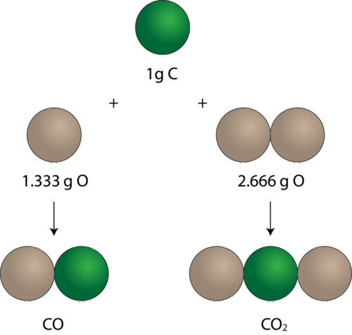

**Sample Problem 4.1: Calculating Mass Ratios**

Copper reacts with chlorine to form two compounds. Compound A contains 4.08 g of copper for every 2.28 g of chlorine. Compound B contains 7.53 g of copper for every 8.40 g of chlorine. What is the lowest whole number mass ratio of copper that combines with a given mass of chlorine?

_Step 1: List the known quantities and plan the problem._

Known

* Compound A = 4.08 g Cu and 2.28 g Cl
* Compound B = 7.53 g Cu and 8.40 g Cl

Apply the law of multiple proportions to the two compounds. For each compound, find the grams of copper that combine with 1.00 g of chlorine by dividing the mass of copper by the mass of chlorine. Then, find the ratio of the masses of copper in the two compounds by dividing the larger value by the smaller value.

_Step 2: Calculate._

$$
\begin{align*}
&\text{Compound A} & \dfrac{4.08 \ \text{g Cu}}{2.28 \ \text{g Cl}} &= \dfrac{1.79 \ \text{g Cu}}{1.00 \ \text{g Cl}} \\
&\text{Compound B} & \dfrac{7.53 \ \text{g Cu}}{8.40 \ \text{g Cl}} &= \dfrac{0.896 \ \text{g Cu}}{1.00 \ \text{g Cl}} \\
\end{align*}
$$

Compare the masses of copper per gram of chlorine in the two samples.

______$\dfrac{1.79 \ \text{g Cu (in compound A)}} {0.896 \ \text{g Cu (in compound B)}} = \dfrac{2.00}{1} = 2:1$__

$\dfrac{1.79 \ \text{g Cu (in compound A)}} {0.896 \ \text{g Cu (in compound B)}} = \dfrac{2.00}{1} = 2:1$__

__$\dfrac{1.79 \ \text{g Cu (in compound A)}} {0.896 \ \text{g Cu (in compound B)}} = \dfrac{2.00}{1} = 2:1$__

$\dfrac{1.79 \ \text{g Cu (in compound A)}} {0.896 \ \text{g Cu (in compound B)}} = \dfrac{2.00}{1} = 2:1$__

____$\dfrac{1.79 \ \text{g Cu (in compound A)}} {0.896 \ \text{g Cu (in compound B)}} = \dfrac{2.00}{1} = 2:1$__

$\dfrac{1.79 \ \text{g Cu (in compound A)}} {0.896 \ \text{g Cu (in compound B)}} = \dfrac{2.00}{1} = 2:1$__

__$\dfrac{1.79 \ \text{g Cu (in compound A)}} {0.896 \ \text{g Cu (in compound B)}} = \dfrac{2.00}{1} = 2:1$__

$\dfrac{1.79 \ \text{g Cu (in compound A)}} {0.896 \ \text{g Cu (in compound B)}} = \dfrac{2.00}{1} = 2:1$

The mass ratio of copper per gram of chlorine in the two compounds is 2:1.

_Step 3: Think about your result._

The ratio is a small whole-number ratio. For a given mass of chlorine, compound A contains twice the mass of copper as compound B.

### Dalton's Atomic Theory

In 1808, an English chemist and schoolteacher named John Dalton (1766-1844) formulated an atomic theory based on the law of conservation of mass, the law of definite proportions, and the law of multiple proportions. His theory can be summarized in the following statements, illustrated below (**Figure** [below](#x-ck12-SW50Q2gtMDQtMDUtRGFsdG9uLXRoZW9yeQ..)).

1.  All matter is composed of extremely small particles called atoms.
2.  Atoms of the same element are identical in terms of size, mass, and other properties. Atoms of one element are different from the atoms of any other element.
3.  Atoms of different elements can chemically combine with one another in simple whole-number ratios to form chemical compounds.
4.  Chemical reactions can be described as the separation, combination, or rearrangement of atoms. Atoms of one element cannot be changed into atoms of a different element as a result of a chemical reaction.

Sizes of Atoms
--------------

The graphite in your pencil is composed of the element carbon. Imagine taking a small piece of carbon and grinding it until it is a fine dust. Each speck of carbon would still have all of the physical and chemical properties of carbon. Now imagine that you could somehow keep dividing the speck of carbon into smaller and smaller pieces. Eventually, you would reach a point where your carbon sample is as small as it could possibly be. This final particle is called an **atom**, _which is defined as the smallest particle of an element that retains the properties of that element_.

Atoms, as you probably know, are extremely small. In fact, the graphite in an ordinary pencil contains about 5 × 10_20_ atoms of carbon. This is an almost incomprehensibly large number. The population of the entire Earth is about 7 × 10_9_ people, meaning that there are about 7 × 10_10_ times as many carbon atoms in your pencil as there are people on Earth! For this to be true, atoms must be extremely small. Can we see atoms? It’s not easy, but a modern instrument called a scanning tunneling microscope allows scientists to visualize the atom (**Figure** [below](#x-ck12-SW50Q2gtMDQtMDYtU1RNLWltYWdlLWdvbGQ.)).

Lesson Summary
--------------

* The Greek philosopher Democritus believed that matter is composed of indivisible and indestructible building blocks, which he called atoms.
* John Dalton transformed the ideas of Democritus into a scientific atomic theory, which began to explain the law of conservation of mass, the law of definite proportions, and the law of multiple proportions.
* Matter cannot be created or destroyed in chemical reactions.
* Elements react to form compounds in fixed proportions by mass.
* Elements combine with one another in simple whole-number ratios.
* An atom is the smallest unit of an element that retains the properties of that element.

Lesson Review Questions
-----------------------

### Reviewing Concepts

1.  Describe the contribution of Democritus to modern atomic theory.
2.  What happens to the total mass of a system during a chemical reaction?
3.  What does “fixed composition” mean with regard to chemical compounds?
4.  What law explains the relationships between different chemical compounds that contain only the elements carbon and oxygen?
5.  What are the four essential points of Dalton’s atomic theory?
6.  Alchemy is an ancient tradition that predated the modern science of chemistry. One goal of the alchemist was to change base metals, such as iron or lead, into valuable metals such as gold or silver. Explain, using Dalton’s theory, why alchemists were unable to do this.

### Problems

7.  If an atom of element A has a mass of 2 units, while an atom of element B has a mass of 5 units, what would be the ratio of element A to element B in a compound that had a mass of 11 units?
8.  Sulfur reacts with oxygen to form two compounds. Compound A consists of 1.89 g of sulfur for every 1.89 g of oxygen. Compound B consists of 3.72 g of sulfur for every 5.57 g of oxygen. What is the lowest whole number mass ratio of sulfur that combines with a given mass of oxygen?
9.  Hydrocarbons are a class of organic compounds that contain only carbon and hydrogen. Methane, an important hydrocarbon fuel, has a carbon/hydrogen mass ratio of 3:1. An 80-g sample of a hydrocarbon compound is analyzed and found to contain 64 g of carbon. Is the hydrocarbon sample methane? Explain.
10. The mass of 6.02 × 10_23_ atoms of iron is 55.85 g. What is the mass of one atom of iron?

Further Reading / Supplemental Links
------------------------------------

* For more information about Dalton's contributions, go to the video Early Ideas About Atoms at http://www.teachertube.com/viewVideo.php?title=John_Dalton_s_Atomic_Theory&video_id=228303.

Points to Consider
------------------

All atoms are known to consist of several subatomic particles. Elements are distinguished from one another by the numbers of those particles that are present.

* Which three subatomic particles are present in all atoms?
* What is the general arrangement of these particles within atoms?

</article>

### 4.2 The Nuclear Model of the Atom

<article>

Lesson Objectives
-----------------

* Distinguish between the three main subatomic particles.
* Understand the contributions of J. J. Thomson, Robert Millikan, and Ernest Rutherford to atomic theory.
* Describe the structure of the nuclear atom.

Lesson Vocabulary
-----------------

* atomic model
* cathode ray
* cathode ray tube
* electron
* neutron
* nucleus
* proton

Check Your Understanding
------------------------

### Recalling Prior Knowledge

* Democritus suggested the idea of atoms. How was his idea different from the ideas of modern scientists?
* What were the main points of the atomic theory proposed by John Dalton?

Introduction
------------

Dalton’s atomic theory represented an improvement over the idea of Democritus because the theory was based on experimental findings and the scientific method. However, his theory did have its shortcomings. He believed that atoms were indivisible, meaning that the atom was the smallest possible component of matter. Further investigations in the late 1800s proved that atoms can indeed be broken down into smaller particles. It is the unique number and arrangement of these subatomic particles that makes atoms of one element different from those of every other element. The three fundamental particles are called the proton, the neutron, and the electron.

Discovery of the Electron
-------------------------

The first discovery of a subatomic particle resulted from experiments into the nature of the relationship between electricity and matter.

### Cathode Rays

In 1897, English physicist J. J. Thomson (1856-1940) experimented with _a device called a_ **cathode ray tube**, _in which an electric current was passed through gases at low pressure_. A cathode ray tube (**Figure** [below](#x-ck12-SW50Q2gtMDQtMDctQ2F0aG9kZS1yYXktdHViZQ..)) consists of a sealed glass tube fitted at both ends with metal disks called electrodes. The electrodes are then connected to a source of electricity. One electrode, called the anode, becomes positively charged while the other electrode, called the cathode, becomes negatively charged. Once this happens, _a beam called a_ **cathode ray** _travels from the cathode to the anode_.

Investigations were carried out to determine the nature of the cathode ray. The results of two further experiments supported the hypothesis that the cathode ray consisted of a stream of particles.

1.  When an object was placed between the cathode and the opposite end of the tube, it cast a shadow on the glass.
2.  A cathode ray tube was constructed with a small metal rail between the two electrodes. Attached to the rail was a paddle wheel capable of rotating along the rail. Upon connecting the cathode ray tube to a power source, the wheel rotated from the cathode toward the anode. This suggested that the cathode ray was made of particles that must have mass.

In order to determine if the cathode ray consisted of charged particles, Thomson used magnets and charged plates to deflect the ray (**Figure** [below](#x-ck12-SW50Q2gtMDQtMDgtQ2F0aG9kZS1yYXktZGVmbGVjdGlvbg..)). His findings are summarized below.

3.  Cathode rays were deflected by a magnetic field in the same manner as a wire carrying an electric current, which was known to be negatively charged.
4.  Cathode rays were deflected away from a negatively charged metal plate and toward a positively charged plate.

Thomson knew that opposite charges attract one another, while like charges repel one another. Together, the results of the cathode ray tube experiments showed that cathode rays are actually streams of tiny negatively charged particles moving at very high speeds. While Thomson originally called these particles corpuscles, they were later named electrons.

Thomson conducted further experiments which allowed him to calculate the charge-to-mass ratio (_e_/_me_) of the electron. In units of coulombs to grams, _e_/_me_ = 1.8 × 10_8_ C/g. He found that this value was a constant and did not depend on the gas used in the cathode ray tube or on the metal used as the electrodes. He concluded that **electrons** _were negatively charged subatomic particles present in atoms of all elements_.

Watch a video of a cathode ray tube experiment at [www.dlt.ncssm.edu/core/Chapter3-Atomic\_Str\_Part1/cathode-rm-lg.htm](http://www.dlt.ncssm.edu/core/Chapter3-Atomic_Str_Part1/cathode-rm-lg.htm).

### Charge and Mass of the Electron

American physicist, Robert Millikan (1868-1953), carried out a series of experiments between 1908 and 1917 that allowed him to determine the charge of a single electron. Millikan’s experiment was called the oil drop experiment (**Figure** [below](#x-ck12-SW50Q2gtMDQtMDktT2lsLWRyb3AtZXhwZXJpbWVudA..)).

When tiny drops of oil were sprayed into a chamber, the oil drops picked up a static charge and were suspended between two charged plates. Millikan was able to observe the motion of the oil drops with a microscope and found that the drops lined up in a specific way between the plates, based on the number of electric charges that they had acquired. From the data gathered in this experiment, he was able to accurately determine the charge of an individual electron. Then, using Thomson’s previous measurement of an electron's charge-to-mass ratio, he was also able to calculate the mass of a single electron.

$$
\begin{align*}
& \text{Charge of one electron} = -1.602 \times 10^{-19} \ \text{C} \\
& \text{Mass of one electron} = 9.11 \times 10^{-28} \ \text{g}
\end{align*}
$$

The incredibly small mass of the electron was found to be approximately 1/1840 the mass of a hydrogen atom, so scientists realized that atoms must also contain other, far more massive particles. Additionally, at least one of these particles must carry a positive charge because complete atoms are electrically neutral.

Participate in a simulation of Millikan's oil drop experiment at this site: http://www.dlt.ncssm.edu/core/Chapter3-Atomic_Str_Part1/Chapter3-Animations/OilDrop.htm.

### Protons and Neutrons

If cathode rays are electrons that are given off by the metal atoms of the cathode, then what remains of the atoms that have lost those electrons? We know several basic things about electrical charges. They are carried by particles of matter. Millikan’s experiment showed that they exist as whole-number multiples of a single basic unit. Atoms have no overall electrical charge, meaning that each and every atom contains an exactly equal number of positively and negatively charged particles. A hydrogen atom, the simplest kind of atom, contains only one electron. When that electron is removed, a positively charged particle should remain.

In 1886, Eugene Goldstein (1850-1930) discovered evidence for the existence of this positively charged particle. Using a cathode ray tube with holes in the cathode, he noticed that there were rays traveling in the opposite direction from the cathode rays. He called these canal rays and showed that they were composed of positively charged particles. The **proton** _is a positively charged subatomic particle that is present in all atoms_. The mass of the proton is about 1840 times the mass of the electron.

In 1932, English physicist, James Chadwick (1891-1974), discovered a third subatomic particle. The **neutron** _is a subatomic particle with no electrical charge and a mass that is approximately the same as the mass of a proton_. Below is a summary of the properties of the three fundamental subatomic particles (**Table** [below](#x-ck12-dGFibGU6UHJvcFN1YlBhcnQ.)).

|     |     |     |     |     |
| --- | --- | --- | --- | --- |Properties of Subatomic Particles
| Particle | Symbol | Relative Electrical Charge | Relative Mass (amu)_∗_ | Actual Mass (g) |
| --- | --- | --- | --- | --- |
| Electron | e_\-_ | 1-  | 1/1840 | 9.11 × 10_\-28_ |
| Proton | p_+_ | 1+  | 1   | 1.67 × 10_\-24_ |
| Neutron | n_0_ | 0   | 1   | 1.67 × 10_\-24_ |

_∗_1 amu (atomic mass unit) = 1.66 × 10_\-24_ g

---

&nbsp;

Discovery of the Atomic Nucleus
-------------------------------

The next step after the discovery of subatomic particles was to figure out how these particles were arranged in the atom. This is a difficult task because of the incredibly small size of the atom. Therefore, scientists set out to design a model of what they believed the atom could look like. The goal of each **atomic model** was to accurately represent all of the experimental evidence about atoms in the simplest way possible. Following the discovery of the electron, J. J. Thomson developed what became known as the “plum pudding” model (**Figure** [below](#x-ck12-SW50Q2gtMDQtMTAtUGx1bS1wdWRkaW5nLW1vZGVs)). In this model, the electrons were suspended in a uniform lump of positive charge like blueberries in a muffin. This model of the atom soon gave way, however, to a new model developed by New Zealander, Ernest Rutherford (1871-1937).

In 1911, Rutherford and coworkers Hans Geiger and Ernest Marsden initiated a series of groundbreaking experiments that would completely change the accepted model of the atom. The experimental setup is shown below (**Figure** [below](#x-ck12-SW50Q2gtMDQtMTEtR29sZC1mb2lsLWV4cA..)). When they bombarded very thin sheets of gold foil with fast moving alpha particles, they got some unexpected results. An alpha particle is a type of positively charged particle whose mass is about four times that of a hydrogen atom. It occurs naturally as a product of radioactive decay.

 The experimental setup for Rutherford’s gold foil experiment: A radioactive element that emitted alpha particles was directed toward a thin sheet of gold foil, which was surrounded by a screen that would allow detection of the deflected particles. (B) According to the plum pudding model (_top_) all of the alpha particles should have passed through the gold foil with little or no deflection. Rutherford found that a small percentage of alpha particles were deflected at large angles, which could be better explained by an atom that contained a very small, dense, positively-charged nucleus (_bottom_).")

According to the accepted atomic model, in which an atom’s mass and charge are uniformly distributed throughout the atom, the scientists expected that all of the alpha particles would pass through the gold foil with only a slight deflection or none at all. Surprisingly, while most of the alpha particles were indeed undeflected, a very small percentage (about 1 in 8000 particles) bounced off the gold foil at very large angles. Some were even redirected back toward the source. Nothing had prepared them for this discovery. In a famous quotation, Rutherford exclaimed that it was “as if you had fired a 15-inch \[artillery\] shell at a piece of tissue paper and it came back and hit you.”

Rutherford needed to come up with an entirely new model of the atom in order to explain his results. Because the vast majority of the alpha particles had passed through the gold, he reasoned that most of the atom was empty space. In contrast, the particles that were highly deflected must have experienced a tremendously powerful force within the atom. He concluded that all of the positive charge and the majority of the mass of the atom must be concentrated in a very small space in the atom’s interior, which he called the nucleus. The **nucleus** _is the tiny, dense, central core of the atom and is composed of protons and neutrons_.

Rutherford’s atomic model became known as the nuclear model. In this model, the protons and neutrons, which comprise nearly all of the mass of the atom, are located in a nucleus at the center of the atom. The electrons are distributed around the nucleus and occupy most of the volume of the atom. It is worth emphasizing just how small the nucleus is compared to the rest of the atom. If we could blow up an atom to be the size of a large professional football stadium, the nucleus would be about the size of a marble.

Rutherford’s model proved to be an important step toward a full understanding of the atom. However, it did not completely address the nature of the electrons and the way in which they occupied the vast space around the nucleus. It was not until some years later that a more complete understanding of the electron was achieved. This proved to be the key to understanding the chemical properties of elements.

Watch a simulation of Rutherford's experiment through The Concord Consortium's Molecular Workbench. You will need to download the Molecular Workbench application from http://mw.concord.org/modeler/index.html. After installing Molecular Workbench, open it. You will see a browser window. In the address bar, type: "http://mw2.concord.org/public/student/motionandforce/rutherford.cml." You will be taken to the simulation.

Lesson Summary
--------------

* The three fundamental subatomic particles are the electron, the proton, and the neutron.
* Thomson used the cathode ray tube to discover the electron and determine its negative charge.
* Millikan determined the charge and mass of the electron with the oil-drop experiment.
* Rutherford’s gold foil experiment provided evidence for the atomic nucleus, a small dense core of the atom which contains the positive charge and most of the mass.
* The nuclear model of the atom is one in which the nucleus is composed of protons and neutrons, while electrons are distributed throughout the rest of the space.

Lesson Review Questions
-----------------------

### Reviewing Concepts

1.  What evidence did Thomson have for each statement below?
    1.  Electrons are negatively charged.
    2.  Electrons are identical and are present in all atoms.
2.  What additional knowledge about electrons did Millikan’s experiment provide?
3.  Compare the mass (in amu) and relative charge of a neutron to that of a proton.
4.  What evidence did Rutherford have for each statement below?
    1.  Atoms are mostly empty space.
    2.  The nucleus of the atom is positively charged.
5.  Trace the development of the atomic model from Dalton to Thomson to Rutherford. Explain what experimental findings led each scientist to alter the previous model and how his new model fit with the new evidence.

### Problems

6.  A hydrogen nucleus, which contains only a single proton, has a diameter of 3.7 × 10_−10_ cm. The equation for the volume of a sphere is $\frac{4}{3} \pi r^3$, where _r_ is the radius of the sphere.
    1.  Assuming that the nucleus is spherical, calculate its volume in cm_3_.
    2.  Calculate the density of the hydrogen nucleus in g/cm_3_.
    3.  The densest element known is osmium, which has a density of 22.6 g/cm_3_. Comment on the difference in density between osmium and a hydrogen nucleus.
7.  How could Rutherford’s experiment be modified in order to determine the relative sizes of different nuclei?
8.  Why was it not possible to detect the existence of the neutron with experiments analogous to those used in the discovery of the electron?
9.  All matter is composed of atoms, which are, in turn, composed mostly of empty space. Why is it not possible to walk through a wall or to put your hand right through your desk?

Further Reading / Supplemental Links
------------------------------------

* A cathode ray is a stream of negatively charged particles, or electrons. An anode ray (also called a canal ray) is composed of positively charged particles. You can view a simulation of a canal ray at http://www.dlt.ncssm.edu/core/Chapter3-Atomic_Str_Part1/Chapter3-Animations/Canal_Ray-CRT.htm.
* You can find other simulations that will help you understand how the structure of the atom was determined without actually being able to see inside:
    * Models of the Hydrogen Atom: http://phet.colorado.edu/en/simulation/hydrogen-atom
    * Rutherford Scattering: http://phet.colorado.edu/en/simulation/rutherford-scattering

Points to Consider
------------------

The number of protons in a given atom must be equal to the number of electrons in that atom so that the atom is electrically neutral. The composition of the nucleus of an atom yield important information about the atom.

* What is the meaning of the atomic number of an atom?
* What are isotopes?

</article>

### 4.3 Isotopes and Atomic Mass

<article>

Lesson Objectives
-----------------

* Define atomic number.
* Define mass number.
* Understand how isotopes differ from one another and be able to designate them by various methods.
* Be able to calculate the average atomic mass of an element.

Lesson Vocabulary
-----------------

* atomic mass
* atomic mass unit
* atomic number
* isotope
* mass number
* nuclide

Check Your Understanding
------------------------

### Recalling Prior Knowledge

* How does the number of protons in an atom compare to the number of electrons?
* What is the charge and mass of the neutron?

Introduction
------------

Atoms are the fundamental building blocks of all matter and are composed of protons, neutrons, and electrons. Because atoms are electrically neutral, the number of positively charged protons must be equal to the number of negatively charged electrons. One of Dalton’s points in his atomic theory was that all atoms of a given element are identical. In this section, we will see how this is not strictly true, thanks to variability in the number of neutrons that an atom may contain.

Atomic Number
-------------

The **atomic number (Z)** _of an element is the number of protons in the nucleus of each atom of that element_. An atom can be classified as a particular element based solely on its atomic number. For example, any atom with an atomic number of 8 (its nucleus contains 8 protons) is an oxygen atom, and any atom with a different number of protons would be a different element. The periodic table (**Figure** [below](#x-ck12-SW50Q2gtMDQtMTItUGVyaW9kaWMtdGFibGU.)) displays all of the known elements and is arranged in order of increasing atomic number. In this table, an element’s atomic number is indicated above the elemental symbol. Hydrogen, at the upper left of the table, has an atomic number of 1. Every hydrogen atom has one proton in its nucleus. Next on the table is helium, whose atoms have two protons in the nucleus. Lithium atoms have three protons, beryllium atoms have four, and so on.

Since atoms are neutral, the number of electrons in an atom is equal to the number of protons. Hydrogen atoms all have one electron occupying the space outside of the nucleus.

Mass Number
-----------

Rutherford’s experiment showed that the vast majority of the mass of an atom is concentrated in its nucleus, which is composed of protons and neutrons. The **mass number** _is defined as the total number of protons and neutrons in an atom_. Consider the table below (**Table** [below](#x-ck12-dGFibGU6Rmlyc3Q2RWxlbQ..)), which shows data from the first six elements of the periodic table.

|     |     |     |     |     |     |     |
| --- | --- | --- | --- | --- | --- | --- |Atoms of the First Six Elements
| Name | Symbol | Atomic Number | Protons | Neutrons | Electrons | Mass Number |
| --- | --- | --- | --- | --- | --- | --- |
| Hydrogen | H   | 1   | 1   | 0   | 1   | 1   |
| Helium | He  | 2   | 2   | 2   | 2   | 4   |
| Lithium | Li  | 3   | 3   | 4   | 3   | 7   |
| Beryllium | Be  | 4   | 4   | 5   | 4   | 9   |
| Boron | B   | 5   | 5   | 6   | 5   | 11  |
| Carbon | C   | 6   | 6   | 6   | 6   | 12  |

Consider the element helium. Its atomic number is 2, so it has two protons in its nucleus. Its nucleus also contains two neutrons. Since 2 + 2 = 4, we know that the mass number of the helium atom is 4. Finally, the helium atom also contains two electrons, since the number of electrons must equal the number of protons. This example may lead you to believe that atoms have the same number of protons and neutrons, but a further examination of the table above (**Table** [above](#x-ck12-dGFibGU6Rmlyc3Q2RWxlbQ..)) will show that this is not the case. Lithium, for example has three protons and four neutrons, giving it a mass number of 7.

Knowing the mass number and the atomic number of an atom allows you to determine the number of neutrons present in that atom by subtraction.

______Number of neutrons = mass number - atomic number__

Number of neutrons = mass number - atomic number__

__Number of neutrons = mass number - atomic number__

Number of neutrons = mass number - atomic number__

____Number of neutrons = mass number - atomic number__

Number of neutrons = mass number - atomic number__

__Number of neutrons = mass number - atomic number__

Number of neutrons = mass number - atomic number

Atoms of the element chromium (Cr) have an atomic number of 24 and a mass number of 52. How many neutrons are in the nucleus of a chromium atom? To determine this, you would subtract as shown:

______52 - 24 = 28 neutrons in a chromium atom__

52 - 24 = 28 neutrons in a chromium atom__

__52 - 24 = 28 neutrons in a chromium atom__

52 - 24 = 28 neutrons in a chromium atom__

____52 - 24 = 28 neutrons in a chromium atom__

52 - 24 = 28 neutrons in a chromium atom__

__52 - 24 = 28 neutrons in a chromium atom__

52 - 24 = 28 neutrons in a chromium atom

The composition of any atom can be illustrated with a shorthand notation using the atomic number and the mass number. Both are written before the chemical symbol, with the mass number written as a superscript and the atomic number written as a subscript. The chromium atom discussed above would be written as:

______${}_{24}^{52}\text{Cr}$__

${}_{24}^{52}\text{Cr}$__

__${}_{24}^{52}\text{Cr}$__

${}_{24}^{52}\text{Cr}$__

____${}_{24}^{52}\text{Cr}$__

${}_{24}^{52}\text{Cr}$__

__${}_{24}^{52}\text{Cr}$__

${}_{24}^{52}\text{Cr}$

Another way to refer to a specific atom is to write the mass number of the atom after the name, separated by a hyphen. The above atom would be written as chromium-52.

Isotopes
--------

As stated earlier, not all atoms of a given element are identical. Specifically, the number of neutrons in the nucleus can vary for many elements. As an example, naturally occurring carbon exists in three forms, which are illustrated below (**Figure** [below](#x-ck12-SW50Q2gtMDQtMTMtVGhyZWUtY2FyYm9uLWlzb3RvcGVz)).

Each carbon atom has the same number of protons (6), which is equal to its atomic number. Each carbon atom also contains six electrons, allowing the atom to remain electrically neutral. However the number of neutrons varies from six to eight. **Isotopes** _are atoms that have the same atomic number but different mass numbers due to a change in the number of neutrons_. The three isotopes of carbon can be referred to as carbon-12 (${}_{\ 6}^{12}\text{C}$), carbon-13 (${}_{\ 6}^{13}\text{C}$), and carbon-14 (${}_{\ 6}^{14}\text{C}$). Naturally occurring samples of most elements are mixtures of isotopes. Carbon has only three natural isotopes, but some heavier elements have many more. Tin has ten stable isotopes, which is the most of any element. The term **nuclide** _refers to the nucleus of a given isotope of an element_. The nucleus of a given carbon atom will be one of the three possible nuclides discussed above.

While the presence of isotopes affects the mass of an atom, it does not affect its chemical reactivity. Chemical behavior is governed by the number of electrons and the number of protons. Carbon-13 behaves chemically in exactly the same way as the more plentiful carbon-12.

**Sample Problem 4.2: Composition of an Atom**

How many protons, neutrons, and electrons are present in each of the nuclides below?

1.  Iron (Fe): atomic number = 26, mass number = 56
2.  Iodine-127 (atomic number = 53)
3.  ${}_{15}^{31}\text{P}$

_Step 1: List the known and unknown quantities and plan the problem._

Known

* Atomic number and mass number for each

Unknown

* Number of protons, electrons, and neutrons

Each shows a different way to specify an isotope of an atom. Use the definitions of atomic number and mass number to calculate the numbers of protons, neutrons, and electrons.

_Step 2: Calculate_.

Number of protons = atomic number

1.  26
2.  53
3.  15

Number of electrons = number of protons

1.  26
2.  53
3.  15

Number of neutrons = mass number - atomic number

1.  56 - 26 = 30
2.  127 - 53 = 74
3.  31 - 15 = 16

_Step 3: Think about your result._

For each atom, the results are consistent with the definitions of atomic number and mass number.

Do the practice problems below. If necessary, refer to the periodic table (**Figure** [above](#x-ck12-SW50Q2gtMDQtMTItUGVyaW9kaWMtdGFibGU.)) for the atomic number or symbol of the given element.

**_Practice Problems_**

1.  How many protons, neutrons, and electrons are there in the atom ${}_{\ 9}^{19}\text{F}$?
2.  How many protons, neutrons, and electrons are there in an atom of lead-207?
3.  A certain atom has an atomic number of 36 and a mass number of 84. Write out the designation for this isotope in both nuclide symbol form and in hyphenated form.
4.  An atom has a mass number of 59 and contains 32 neutrons in its nucleus. What element is it?

Atomic Mass
-----------

The masses of individual atoms are very, very small. However, using a modern device called a mass spectrometer, it is possible to measure such minuscule masses. An atom of oxygen-16, for example, has a mass of 2.66 × 10_−23_ g. While comparisons of masses measured in grams would have some usefulness, it is far more practical to have a system that will allow us to more easily compare relative atomic masses. Scientists decided on using the carbon-12 nuclide as the reference standard by which all other masses would be compared. By definition, one atom of carbon-12 is assigned a mass of exactly 12 atomic mass units (amu). An **atomic mass unit** _is defined as a mass equal to one twelfth the mass of an atom of carbon-12_. The mass of any isotope of any element is expressed in relation to the carbon-12 standard. For example, one atom of helium-4 has a mass of 4.0026 amu. An atom of sulfur-32 has a mass of 31.972 amu.

The carbon-12 atom has six protons and six neutrons in its nucleus for a mass number of 12. Since the nucleus accounts for nearly all of the mass of the atom, a single proton or single neutron has a mass of approximately 1 amu. However, as seen by the helium and sulfur examples, the masses of individual atoms are not quite whole numbers. This is because an atom’s mass is affected very slightly by the interactions of the various particles within the nucleus and also includes the small mass added by each electron.

As stated in the section on isotopes, most elements occur naturally as a mixture of two or more isotopes. Listed below (**Table** [below](#x-ck12-dGFibGU6QXRvbWljTWFzc1BlcmNlbnRBYnVuZGFuY2U.)) are the naturally occurring isotopes of several elements along with the percent natural abundance of each.

|     |     |     |     |     |
| --- | --- | --- | --- | --- |Atomic Masses and Percent Abundances of Some Natural Isotopes
| Element | Isotope (symbol) | Percent natural abundance | Atomic mass (amu) | Average atomic mass (amu) |
| --- | --- | --- | --- | --- |
| Hydrogen | ${}_1^1\text{H}$  ${}_1^2\text{H}$  ${}_1^3\text{H}$ | 99.985  0.015  negligible | 1.0078  2.0141  3.0160 | 1.0079 |
| Carbon | ${}_{6}^{12}\text{C}$  ${}_{6}^{13}\text{C}$  ${}_{6}^{14}\text{C}$ | 98.89  1.11  trace | 12.000  13.003  14.003 | 12.011 |
| Oxygen | ${}_{8}^{16}\text{O}$  ${}_{8}^{17}\text{O}$  ${}_{8}^{18}\text{O}$ | 99.759  0.037  0.204 | 15.995  16.995  17.999 | 15.999 |
| Chlorine | ${}_{17}^{35}\text{Cl}$  ${}_{17}^{37}\text{Cl}$ | 75.77  24.23 | 34.969  36.966 | 35.453 |
| Copper | ${}_{29}^{63}\text{Cu}$  ${}_{29}^{65}\text{Cu}$ | 69.17  30.83 | 62.930  64.928 | 63.546 |

For some elements, one particular isotope is much more abundant than any other isotopes. For example, naturally occurring hydrogen is nearly all hydrogen-1, and naturally occurring oxygen is nearly all oxygen-16. For many other elements, however, more than one isotope may exist in substantial quantities. Chlorine (atomic number 17) is a yellowish-green toxic gas. About three quarters of all chlorine atoms have 18 neutrons, giving those atoms a mass number of 35. About one quarter of all chlorine atoms have 20 neutrons, giving those atoms a mass number of 37. Were you to simply calculate the arithmetic average of the precise atomic masses, you would get approximately 36.

______$(34.969 + 36.966) / 2 = 35.968 \ \text{amu}$__

$(34.969 + 36.966) / 2 = 35.968 \ \text{amu}$__

__$(34.969 + 36.966) / 2 = 35.968 \ \text{amu}$__

$(34.969 + 36.966) / 2 = 35.968 \ \text{amu}$__

____$(34.969 + 36.966) / 2 = 35.968 \ \text{amu}$__

$(34.969 + 36.966) / 2 = 35.968 \ \text{amu}$__

__$(34.969 + 36.966) / 2 = 35.968 \ \text{amu}$__

$(34.969 + 36.966) / 2 = 35.968 \ \text{amu}$

As you can see, the average atomic mass given in the last column of the table above (**Table** [above](#x-ck12-dGFibGU6QXRvbWljTWFzc1BlcmNlbnRBYnVuZGFuY2U.)) is significantly lower. Why? The reason is that we need to take into account the natural abundance percentages of each isotope in order to calculate what is called the weighted average. The **atomic mass** _of an element is the weighted average of the atomic masses of the naturally occurring isotopes of that element_. The sample problem below demonstrates how to calculate the atomic mass of chlorine.

**Sample Problem 4.3: Calculating Atomic Mass**

Use the atomic masses of each of the two isotopes of chlorine along with their percent abundances to calculate the average atomic mass of chlorine.

_Step 1: List the known and unknown quantities and plan the problem._

Known

* chlorine-35: atomic mass = 34.969 amu and % abundance = 75.77%
* chlorine-37: atomic mass = 36.966 amu and % abundance = 24.23%

Unknown

* Average atomic mass of chlorine

Change each percent abundance into decimal form by dividing by 100. Multiply this value by the atomic mass of that isotope. Add together the results for each isotope to get the average atomic mass.

_Step 2: Calculate_.

$$
\begin{align*}
& \text{chlorine-35} && 0.7577 \times 34.969 = 26.50 \ \text{amu} \\
& \text{chlorine-37} && 0.2423 \times 36.966 = 8.957 \ \text{amu} \\
& \text{average atomic mass} && 26.50 + 8.957 = 35.45 \ \text{amu}
\end{align*}
$$

Note: Applying significant figure rules results in the 35.45 amu result without excessive rounding error. In one step:

______$(0.7577 \times 34.969) + (0.2423 \times 36.966) = 35.45 \ \text{amu}$__

$(0.7577 \times 34.969) + (0.2423 \times 36.966) = 35.45 \ \text{amu}$__

__$(0.7577 \times 34.969) + (0.2423 \times 36.966) = 35.45 \ \text{amu}$__

$(0.7577 \times 34.969) + (0.2423 \times 36.966) = 35.45 \ \text{amu}$__

____$(0.7577 \times 34.969) + (0.2423 \times 36.966) = 35.45 \ \text{amu}$__

$(0.7577 \times 34.969) + (0.2423 \times 36.966) = 35.45 \ \text{amu}$__

__$(0.7577 \times 34.969) + (0.2423 \times 36.966) = 35.45 \ \text{amu}$__

$(0.7577 \times 34.969) + (0.2423 \times 36.966) = 35.45 \ \text{amu}$

_Step 3: Think about your result._

The calculated average atomic mass is closer to 35 than to 37 because a greater percentage of naturally occurring chlorine atoms have a mass number of 35. It agrees with the value listed in the table above (**Table** [above](#x-ck12-dGFibGU6QXRvbWljTWFzc1BlcmNlbnRBYnVuZGFuY2U.)).

**_Practice Problem_**

5.  The element bromine consists of two naturally occurring isotopes. The isotope with a mass of 78.92 amu has a percent abundance of 50.69%, while the isotope with a mass of 80.92 amu has a percent abundance of 49.31%. Calculate the average atomic mass of bromine.

The atomic masses for each element on the periodic table are average atomic masses. For later calculations involving atomic mass, we will use these values and round each one to four significant figures.

Lesson Summary
--------------

* The atomic number of an element is equal to the number of protons in its nucleus.
* The mass number of an element is equal to the sum of the protons and the neutrons in its nucleus.
* Isotopes are atoms of the same element that have a different mass number because of a variation in the number of neutrons.
* The average atomic mass of an element can be calculated from the atomic masses and percent natural abundances of each naturally occurring isotope.

Lesson Review Questions
-----------------------

### Reviewing Concepts

1.  Why are all atoms electrically neutral?
2.  How many protons are in the nucleus of each of the following atoms?
    1.  neon
    2.  gold
    3.  strontium
    4.  uranium
3.  What part of Dalton’s atomic theory is disproved by the existence of isotopes?
4.  Which isotope is used as the reference standard for the atomic mass unit?
5.  The average atomic mass of all naturally occurring lithium atoms is 6.941 amu. The two isotopes of lithium are lithium-6 and lithium-7. Are these isotopes equally common? If not, which is more plentiful in nature, and how do you know?

### Problems

6.  A certain atom contains 28 protons, 28 electrons, and 31 neutrons. Provide the following:
    1.  atomic number
    2.  mass number
    3.  name of element
7.  How many protons, neutrons, and electrons are in an atom of cesium-133?
8.  Complete **Table** [below](#x-ck12-dGFibGU6UHJvYjg.):

|     |     |     |     |
| --- | --- | --- | --- |Table for Problem 8
| Isotope | Nuclide Symbol | Atomic Number | Mass Number |
| --- | --- | --- | --- |
| sodium-23 |     |     |     |
|     | ${}_{33}^{75}\text{As}$ |     |     |
| silver-108 |     |     |     |

9.  Which of the following is an isotope of ${}_{18}^{40}\text{Ar}$? Explain.
    1.  ${}_{20}^{40}\text{Ca}$
    2.  ${}_{18}^{39}\text{Ar}$
    3.  ${}_{18}^{40}\text{Ar}$
10. Fill in **Table** [below](#x-ck12-dGFibGU6UHJvYjEw):

|     |     |     |     |     |
| --- | --- | --- | --- | --- |Table for Problem 10
| Isotope | Number of Protons | Number of Electrons | Number of Neutrons | Nuclide Symbol |
| --- | --- | --- | --- | --- |
| hydrogen-1 |     |     |     |     |
| hydrogen-2 |     |     |     |     |
| beryllium-9 |     |     |     |     |
| aluminum-27 |     |     |     |     |

11. Fill in **Table** [below](#x-ck12-dGFibGU6UHJvYjEx):

|     |     |     |     |     |     |     |     |
| --- | --- | --- | --- | --- | --- | --- | --- |Table for Problem 11
| Element | Symbol | Atomic Number | Mass Number | \# of Protons | \# of Electrons | \# of Neutrons | Nuclide Symbol |
| --- | --- | --- | --- | --- | --- | --- | --- |
| Nitrogen |     |     | 14  |     |     |     |     |
|     | B   |     | 11  |     |     |     |     |
|     |     | 30  |     |     |     | 35  |     |
|     |     |     |     |     | 77  | 116 |     |
|     |     |     |     |     |     |     | ${}_{26}^{56}\text{Fe}$ |

12. The element tungsten (W) is known best as a metal that is used as filaments for light bulbs. Naturally occurring tungsten consists of the five isotopes shown below. Calculate the atomic mass of tungsten.

$$
\begin{align*}
\text{tungsten-180} && \text{atomic mass} = 179.947 \ \text{amu} &&& \text{percent abundance} = 0.12. \\
\text{tungsten-182} && \text{atomic mass} = 181.948 \ \text{amu} &&& \text{percent abundance} = 26.50. \\
\text{tungsten-183} && \text{atomic mass} = 182.950 \ \text{amu} &&& \text{percent abundance} = 14.31. \\
\text{tungsten-184} && \text{atomic mass} = 183.951 \ \text{amu} &&& \text{percent abundance} = 30.64. \\
\text{tungsten-186} && \text{atomic mass} = 185.954 \ \text{amu} &&& \text{percent abundance} = 28.43. \\
\end{align*}
$$

Further Reading / Supplemental Links
------------------------------------

There are a lot of websites to help you understand the atom and its history.

Lectures:

* Elements and Atoms: http://www.youtube.com/watch?v=IFKnq9QM6_A
* Introduction to the Atom: http://www.youtube.com/watch?v=1xSQlwWGT8M

Informative websites:

* Atomic History - A Brief Discovery: http://www.pbs.org/wgbh/nova/diamond/insidehistory.html
* All About Atoms: http://education.jlab.org/atomtour/index.html

Simulations:

* Build an Atom: http://phet.colorado.edu/en/simulation/build-an-atom
* Molecular Workbench - Atomic Structure: http://workbench.concord.org/database/activities/47.html
* See Inside a Diamond: http://www.pbs.org/wgbh/nova/diamond/insidewave.html
* Isotopes and Atomic Mass: http://phet.colorado.edu/en/simulation/isotopes-and-atomic-mass
* Atomic Structure: http://freezeray.com/flashFiles/atomicStructure.htm
* Atom Builder: http://freezeray.com/flashFiles/atomBuilder.htm
* Tennis Ball Isotopes: http://www.youtube.com/watch?v=oLnuXpf4hsA

Games:

* Element Math Game: http://education.jlab.org/elementmath/index.html
* Looking For the Top Quark: http://education.jlab.org/topquarkgame/index.html
* Atoms and Matter Crossword Puzzle: http://education.jlab.org/sciencecrossword/atoms_01.html

Points to Consider
------------------

The electrons in an atom are particularly important because it is their arrangement and behavior that dictates the types of compounds that element is likely to form. The atomic model has changed over time in terms of the understanding of electrons.

* How is an understanding of the behavior of light related to electrons?
* What is the Bohr model of the atom?

</article>

## 5.0 Electrons in Atoms

<article>

_Chip Griffin. www.flickr.com/photos/chipgriffin/2210297177/. CC BY 2.0._

</article>

### 5.1 Light

<article>

Lesson Objectives
-----------------

* Describe the relationships between speed, wavelength, and frequency of light.
* Understand the photoelectric effect and how it is related to the wave-particle duality of light.
* Describe how changes in electron energies lead to atomic emission spectra.
* Describe the Bohr model of the atom.

Lesson Vocabulary
-----------------

* atomic emission spectrum
* electromagnetic radiation
* electromagnetic spectrum
* excited state
* frequency
* ground state
* photoelectric effect
* photon
* quantum
* wavelength

Check Your Understanding
------------------------

### Recalling Prior Knowledge

* Where were the electrons thought to be in Rutherford’s nuclear model of the atom?
* What quantities describe a wave?

Properties of Light
-------------------

The nuclear atomic model proposed by Rutherford was a great improvement over previous models, but it was still not complete. It did not fully explain the location and behavior of the electrons in the vast space outside of the nucleus. For example, it was well known that oppositely charged particles attract one another. Rutherford’s model did not explain why the electrons don’t simply move toward, and eventually collide with the nucleus. A number of experiments were conducted in the early twentieth century that focused on the ability of matter to absorb and emit light. These studies showed that certain phenomena associated with light revealed a great deal about the nature of matter, energy, and atomic structure.

Wave Nature of Light
--------------------

In order to begin to understand the nature of the electron, we first need to look at the properties of light. Prior to 1900, scientists thought light behaved solely as a wave. As we will see later, this began to change as new experiments demonstrated that light also has some of the characteristics of a particle. First, we will examine the wavelike properties of light.

Visible light is one type of **electromagnetic radiation**, _which is a form of energy that exhibits wavelike behavior as it moves through space._ Other types of electromagnetic radiation include gamma rays, x-rays, ultraviolet light, infrared light, microwaves, and radio waves. Pictured below (**Figure** [below](#x-ck12-SW50Q2gtMDUtMDEtRU0tU3BlY3RydW0.)) is the **electromagnetic spectrum**, _which includes all forms of electromagnetic radiation._ Notice that visible light makes up only a very, very small portion of the entire electromagnetic spectrum. All electromagnetic radiation moves through a vacuum at a constant speed of 2.998 × 10_8_ m/s. While the presence of air molecules slows the speed of light by a very small amount, it is still equal to 3.00 × 10_8_ m/s when rounded to three significant figures, so this is the value that we will use.

You can tour the electromagnetic spectrum at http://missionscience.nasa.gov/ems/index.html.

Waves are characterized by their repetitive motion. Imagine a toy boat riding the waves in a wave pool. As the water wave passes under the boat, it moves up and down in a regular and repeated fashion. While the wave travels horizontally, the boat only travels vertically up and down. Below are two examples of waves (**Figure** [below](#x-ck12-SW50Q2gtMDUtMDItV2F2ZS1jaGFyYWN0ZXJpc3RpY3M.)).

 A wave consists of an alternation between crests and troughs. The wavelength is defined as the distance between any two consecutive identical points on the waveform. The amplitude is the height of the wave. (B) A wave with a short wavelength (top) has a high frequency because more waves pass a given point in a certain amount of time. A wave with a longer wavelength (bottom) has a lower frequency.")

A wave cycle consists of one complete wave—starting at the zero point, going up to a wave crest, going back down to a wave trough, and back to the zero point again. The **wavelength** _of a wave is the distance between any two corresponding points on adjacent waves._ It is easiest to visualize the wavelength of a wave as the distance from one wave crest to the next. In an equation, wavelength is represented by the Greek letter lambda ($\lambda$). Depending on the type of wave, wavelengths are often measured in meters, centimeters, or nanometers (1 m = 10_9_ nm). The **frequency**, represented by the Greek letter nu ($\nu$), _is the number of waves that pass a certain point in a specified amount of time._ Typically, frequency is measured in units of cycles per second or waves per second. One wave per second is also called a Hertz (Hz), which can be expressed in SI base units as a reciprocal second (s_−1_).

Pictured above (**Figure** [above](#x-ck12-SW50Q2gtMDUtMDItV2F2ZS1jaGFyYWN0ZXJpc3RpY3M.)) is the important relationship between the wavelength and frequency of a wave. The top wave clearly has a shorter wavelength than the second wave. If you picture yourself at a stationary point watching these waves pass by, more waves of the first kind would pass by in a given amount of time. Thus the frequency of the first waves is greater than that of the second waves. Wavelength and frequency are therefore inversely related. As the wavelength of a wave increases, its frequency decreases. The equation that relates the two is:

______$c=\lambda \nu$__

$c=\lambda \nu$__

__$c=\lambda \nu$__

$c=\lambda \nu$__

____$c=\lambda \nu$__

$c=\lambda \nu$__

__$c=\lambda \nu$__

$c=\lambda \nu$

The variable $c$ is the speed at which the wave is traveling. In the case of electromagnetic radiation, $c$ is equal to the speed of light. If the value used for the speed of light has units of m/s, the wavelength must be in meters and the frequency must be in Hertz.

Returning to the figure above (**Figure** [above](#x-ck12-SW50Q2gtMDUtMDEtRU0tU3BlY3RydW0.)), you can see how the electromagnetic spectrum displays a wide variation in wavelength and frequency. Radio waves can have wavelengths that are hundreds of meters long, while the wavelength of gamma rays are on the order of 10_−12_ m. The corresponding frequencies range from 10_6_ to 10_21_ Hz. Visible light can be split into different colors with the use of a prism (**Figure** [below](#x-ck12-SW50Q2gtMDUtMDMtUHJpc20tcmVmcmFjdGlvbg..)), yielding the visible spectrum of light. Red light has the longest wavelength and the lowest frequency, while violet light has the shortest wavelength and the highest frequency. Overall, visible light ranges in wavelength from about 400 – 700 nm and has frequencies in the range of 10_14_ Hz.

 as it passes through a glass prism. The shorter the wavelength of light, the greater the refraction, so white light is separated into its various components according to their wavelengths (colors).")

**Sample Problem 5.1: Wavelength and Frequency**

The color orange within the visible light spectrum has a wavelength of about 620 nm. What is the frequency of orange light?

_Step 1: List the known quantities and plan the problem._

Known

* wavelength ($\lambda$) = 620 nm
* speed of light ($c$) = 3.00 × 10_8_ m/s
* conversion factor 1 m = 10_9_ nm

Unknown

* Frequency ($\nu$)

Convert the wavelength to m, then apply the equation $c=\lambda \nu$ and solve for frequency. Dividing both sides of the equation by $\lambda$ yields:

______$\nu = \dfrac{c}{\lambda}$__

$\nu = \dfrac{c}{\lambda}$__

__$\nu = \dfrac{c}{\lambda}$__

$\nu = \dfrac{c}{\lambda}$__

____$\nu = \dfrac{c}{\lambda}$__

$\nu = \dfrac{c}{\lambda}$__

__$\nu = \dfrac{c}{\lambda}$__

$\nu = \dfrac{c}{\lambda}$

_Step 2: Calculate_.

$$
\begin{align*}
& 620 \ \text{nm} \times \left ( \dfrac{1 \ \text{m}} {10^9 \ \text{nm}} \right ) = 6.2 \times 10^{-7} \ \text{m} \\
& \nu = \dfrac{c}{\lambda} = \dfrac{3.00 \times 10^8 \ \text{m/s}} {6.2 \times 10^{-7} \ \text{m}} = 4.8 \times 10^{14} \ \text{Hz}
\end{align*}
$$

_Step 3: Think about your result._

The value for the frequency falls within the range for visible light.

**_Practice Problems_**

1.  What is the frequency of radiation that has a wavelength of 2.7 × 10_−9_ m? In what region of the electromagnetic spectrum is this radiation?
2.  Calculate the wavelength in nm of visible light that has a frequency of 6.80 × 10_14_ Hz.

Quantum Physics
---------------

German physicist, Max Planck (1858-1947), studied the emission of light by hot objects. You have likely seen a heated metal object glow an orange-red color (**Figure** [below](#x-ck12-SW50Q2gtMDUtMDQtSGVhdGVkLW9iamVjdC1nbG93)).

Classical physics, which explains the behavior of large, everyday objects, predicted that a hot object would emit electromagnetic energy in a continuous fashion. In other words, every possible wavelength of light could potentially be emitted. Instead, what Planck found by analyzing the spectra was that the energy of the hot body could only be lost in small discrete units. A **quantum** _is the minimum quantity of energy that can either be lost or gained by an atom._ An analogy is that a brick wall can only undergo a change in height by units of one or more bricks, so not all height changes are possible (assuming the bricks have a uniform size and cannot be broken into smaller pieces). Planck showed that the amount of radiant energy absorbed or emitted by an object is directly proportional to the frequency of the radiation.

______$E = h \nu$__

$E = h \nu$__

__$E = h \nu$__

$E = h \nu$__

____$E = h \nu$__

$E = h \nu$__

__$E = h \nu$__

$E = h \nu$

In the equation, $E$ is the energy, in joules, of a single quantum of radiation, $\nu$ is the frequency, and $h$ is a fundamental constant called Planck’s constant. The value of Planck’s constant is 6.626 × 10_−34_ J•s. The energy of any system must increase or decrease in units of $h \nu$. The emission or absorption of a single quantum of low-frequency radiation will cause less of a change in energy than emission or absorption of a quantum of high-frequency radiation.

### The Photoelectric Effect and the Particle Nature of Light

In 1905, Albert Einstein (1879-1955) proposed that light could also be described as quanta of energy that behave as particles. A **photon** _is a particle of electromagnetic radiation that has zero mass and carries a single quantum of energy._ The energy of a photon of light is quantized according to the equation $E=h \nu$. Previously, light had been described only as a wave, and scientists trained in classical physics found this wave-particle duality of light to be a difficult idea to accept, particularly because most of the characteristics of light can be fully explained using concepts that only apply to waves. However, the results of some key experiments could not be explained by the prevailing theories, but they could be rationalized if the particle nature of light was accepted. Some of these unexplained results came from experiments on a phenomenon known as the photoelectric effect.

The **photoelectric effect** _is a phenomenon that occurs when light shined onto a metal surface causes the ejection of electrons from that metal._ It was observed that only certain frequencies of light are able to cause the ejection of electrons. If the frequency of the incident light is too low (red light, for example), then no electrons were ejected even if the intensity of the light was very high or it was shone onto the surface for a long time. If the frequency of the light was higher (green light, for example), then electrons were able to be ejected from the metal surface even if the intensity of the light was very low or it was shone for only a short time. This minimum frequency needed to cause the ejection of electrons is referred to as the threshold frequency.

Classical physics was unable to explain why the photoelectric effect would have a threshold frequency. Based on a classical view of light, the electron in the metal should eventually be able to collect enough energy to be ejected from the surface, even if the incoming light had a low frequency. Einstein used the particle theory of light to explain the photoelectric effect (**Figure** [below](#x-ck12-SW50Q2gtMDUtMDUtUGhvdG9lbGVjdHJpYy1lZmZlY3Q.)).

 is unable to cause ejection of electrons from the metal surface. At or above the threshold frequency (green), electrons are ejected. Incoming light that has the same intensity but a higher frequency (blue) causes the ejection of the same number of electrons, but the ejected electrons move at a greater speed.")

Consider the $E = h \nu$ equation. $E$ is the minimum energy that is required in order to eject an electron from the metal surface. If the frequency ($\nu$) of the incoming light is below the threshold frequency, there will never be enough energy to cause an electron to be ejected. If the frequency is equal to or higher than the threshold frequency, electrons will be ejected. As the frequency increases beyond the threshold, the ejected electrons simply move faster. An increase in the intensity of incoming light that is above the threshold frequency causes the number of electrons that are ejected to increase, but they do not travel any faster. The photoelectric effect is applied in devices called photoelectric cells, which are commonly found in everyday items, such as a calculator that uses light to generate electricity (**Figure** [below](#x-ck12-SW50Q2gtMDUtMDYtQ2FsY3VsYXRvci1zb2xhcg..)).

Run a simulation of the photoelectric effect at http://phet.colorado.edu/en/simulation/photoelectric.

**Sample Problem 5.2: Quantized Energy**

What is the energy of a photon of green light with a frequency of 5.75 × 10_14_ Hz?

_Step 1: List the known quantities and plan the problem._

Known

* frequency ($\nu$) = 5.75 × 10_14_ Hz
* Planck’s constant ($h$) = 6.626 × 10_\-34_ J•s

Unknown

* energy ($E$)

Apply the equation $E = h \nu$ to solve for the energy.

_Step 2: Calculate_.

______$E = (6.626 \times 10^{-34} \ \text{J} \cdot \text{s}) \times (5.75 \times 10^{14} \ \text{Hz}) = 3.81 \times 10^{-19} \ \text{J}$__

$E = (6.626 \times 10^{-34} \ \text{J} \cdot \text{s}) \times (5.75 \times 10^{14} \ \text{Hz}) = 3.81 \times 10^{-19} \ \text{J}$__

__$E = (6.626 \times 10^{-34} \ \text{J} \cdot \text{s}) \times (5.75 \times 10^{14} \ \text{Hz}) = 3.81 \times 10^{-19} \ \text{J}$__

$E = (6.626 \times 10^{-34} \ \text{J} \cdot \text{s}) \times (5.75 \times 10^{14} \ \text{Hz}) = 3.81 \times 10^{-19} \ \text{J}$__

____$E = (6.626 \times 10^{-34} \ \text{J} \cdot \text{s}) \times (5.75 \times 10^{14} \ \text{Hz}) = 3.81 \times 10^{-19} \ \text{J}$__

$E = (6.626 \times 10^{-34} \ \text{J} \cdot \text{s}) \times (5.75 \times 10^{14} \ \text{Hz}) = 3.81 \times 10^{-19} \ \text{J}$__

__$E = (6.626 \times 10^{-34} \ \text{J} \cdot \text{s}) \times (5.75 \times 10^{14} \ \text{Hz}) = 3.81 \times 10^{-19} \ \text{J}$__

$E = (6.626 \times 10^{-34} \ \text{J} \cdot \text{s}) \times (5.75 \times 10^{14} \ \text{Hz}) = 3.81 \times 10^{-19} \ \text{J}$

_Step 3: Think about your result._

While the resulting energy may seem very small, this is for only one photon of light. The sources of light that we encounter on a daily basis emit huge quantities of photons. Recall that one hertz is equal to a reciprocal second, so the units agree in this equation.

**_Practice Problem_**

3.  A certain photon of radiation has an energy of 8.72 × 10_−21_ J. Calculate the frequency and wavelength (in m) of this radiation.

Atomic Emission Spectra
-----------------------

The electrons in an atom tend to be arranged in such a way that the energy of the atom is as low as possible. The **ground state** _of an atom is the lowest energy state of the atom._ When an atom is supplied with a sufficient amount of energy, the electrons can absorb that energy and move to a higher energy level. The energy levels of the electrons in atoms are quantized. An atom cannot absorb an arbitrary amount of energy, it can only do so in amounts that are equal to the difference between two allowed energy levels. _An atom is in an_ **excited state** _when its potential energy is higher than that of the ground state._ An atom in an excited state is not stable. When it returns back to the ground state, it releases the energy that it had previously gained in the form of electromagnetic radiation.

How do atoms gain energy in the first place? One way is to pass an electric current through an enclosed sample of a gas at low pressure. Since the electron energy levels are unique for each element, every gas discharge tube will glow with a distinctive color depending on the identity of the gas (**Figure** [below](#x-ck12-SW50Q2gtMDUtMDctQXRvbWljLWVtaXNzaW9uLWdhcy10dWJlcw..)).

“Neon” signs are familiar examples of gas discharge tubes. However, only signs that glow with the red-orange color (**Figure** [above](#x-ck12-SW50Q2gtMDUtMDctQXRvbWljLWVtaXNzaW9uLWdhcy10dWJlcw..)) are actually filled with neon. Signs of other colors contain different gases or mixtures of gases.

Scientists have exhaustively studied the distinctive pink color of the gas discharge created by hydrogen gas. When a narrow beam of this light is viewed through a prism, the light can be separated into four lines of very specific wavelengths (and frequencies, since $\lambda$ and $\nu$ are inversely related). An **atomic emission spectrum** _is the pattern of lines formed when the light emitted from an atom passes through a prism to separate it into the different frequencies of light it contains._ Pictured below is the atomic emission spectrum of hydrogen (**Figure** [below](#x-ck12-SW50Q2gtMDUtMDgtRW1pc3Npb24tc3BlY3RydW0tZGlhZ3JhbQ..)).

 and iron (Fe) are also shown.")

The four visible lines of hydrogen’s atomic emission spectrum are violet (410 nm), blue (434 nm), blue-green (486 nm), and red (656 nm). The pinkish color that our eyes see is a combination of these four colors. Every element has its own unique atomic emission spectrum that can be used to determine the identity of an unknown gas. This technique is used extensively in astronomy to identify the composition of distant stars.

As in the case of the photoelectric effect, classical theories were unable to explain the existence of atomic emission spectra, also known as line-emission spectra. According to classical physics, a ground state atom would be able to absorb any amount of energy, and it would not be limited to discrete wavelengths. Likewise, when the atoms relaxed back to a lower energy state, any amount of energy could be released. This would result in what is known a continuous spectrum, where all wavelengths and frequencies are represented. White light viewed through a prism and a rainbow are examples of continuous spectra. Atomic emission spectra provided further evidence for the quantized nature of light and led to a new model of the atom based on quantum theory.

Work with simulated discharge lamps at http://phet.colorado.edu/en/simulation/discharge-lamps.

The following video shows a lab demonstration of the atomic emission spectra: http://www.youtube.com/watch?v=955snB6HLB4 (1:39).

!?[video](https://www.youtube.com/watch?v=955snB6HLB4)

Bohr Model of the Atom
----------------------

The figure below (**Figure** [below](#x-ck12-SW50Q2gtMDUtMDktRXhjaXRlZC1hdG9tLXJlbGF4)) helps explain the process that occurs when an atom is excited and relaxes back to a lower energy level.

Two energy states of an atom are indicated above (**Figure** [above](#x-ck12-SW50Q2gtMDUtMDktRXhjaXRlZC1hdG9tLXJlbGF4)): a lower energy state ($E_1$) and a higher energy state ($E_2$). As the atom moves from the $E_2$ excited state down to the lower energy $E_1$ state, it loses energy by emitting a photon of radiation. The energy of that photon $(E_{photon} = h \nu)$ is equal to the gap in energy between the two states, $E_2 - E_1$. The observation that the atomic emission spectrum of hydrogen consists of only specific frequencies of light indicates that the possible energy states of the hydrogen atom are fixed. This suggested that the electrons in a hydrogen atom were arranged into specific energy levels.

In 1913, Danish physicist Neils Bohr (1885-1962) proposed a model of the atom that explained the hydrogen atomic emission spectrum. According to the Bohr model, which is often referred to as a planetary model, the electrons encircle the nucleus of the atom in specific allowable paths called orbits. When an electron is in one of these orbits, its energy is fixed. The ground state of the hydrogen atom, where its energy is lowest, occurs when its single electron is in the orbit that is closest to the nucleus. The orbits that are farther from the nucleus are all higher energy states. The electron is not allowed to occupy any of the spaces in between the orbits. An everyday analogy to the Bohr model is the rungs of a ladder. As you move up or down a ladder, you can only occupy specific rungs and cannot be in the spaces between the rungs. Moving up the ladder increases your potential energy, and moving down the ladder decreases your energy.

Bohr’s model explains the spectral lines of the hydrogen atomic emission spectrum. While the electron of the atom remains in the ground state, its energy is unchanged. When the atom absorbs one or more quanta of energy, the electron moves from the ground state orbit to an excited state orbit that is farther away. Energy levels are designated with the variable _n_. The ground state is _n_ = 1, the first excited state is _n_ = 2, and so on. The energy that is gained by the atom is equal to the difference in energy between the two energy levels. When the atom relaxes back to a lower energy state, it releases energy that is again equal to the difference in energy between the two orbits (**Figure** [below](#x-ck12-SW50Q2gtMDUtMTAtQm9oci1tb2RlbA..)).

The change in energy, $\Delta E$, is converted from potential energy within the atom to emitted light, which has a frequency that can be determined using the equation $\Delta E = h \nu$. Recall that the atomic emission spectrum of hydrogen has spectral lines at four different visible frequencies, but these lines are not equally spaced. This can be explained by the Bohr model if we assume that the energies of various electron orbits are also not equally spaced. As the electron gets farther and farther from the nucleus, the differences in energy between successive orbits get smaller and smaller.

Based on the wavelengths of the spectral lines, Bohr was able to calculate the energies that the hydrogen electron would have in each of its allowed energy levels. He then mathematically showed which energy level transitions corresponded to the spectral lines in the atomic emission spectrum (**Figure** [below](#x-ck12-SW50Q2gtMDUtMTEtRWxlY3Ryb24tdHJhbnNpdGlvbi1mb3ItSA..)).

He found that the four visible spectral lines corresponded to transitions from higher energy levels down to the second energy level (_n_ = 2). This is called the Balmer series. Transitions ending in the ground state (_n_ = 1) are called the Lyman series. The energies released by these transitions are larger, resulting in spectral lines that show up in the more energetic ultraviolet region of the spectrum. The transitions referred to as the Paschen series and the Brackett series release smaller amounts of energy, so these spectral lines appear in the less energetic infrared region.

Watch a simulation of the Bohr model of the hydrogen atom at http://www.dlt.ncssm.edu/core/Chapter8-Atomic_Str_Part2/chapter8-Animations/ElectronOrbits.html.

**Sample Problem 5.3: Spectral Lines of the Hydrogen Atom**

In the hydrogen atom, the change in energy ($\Delta E$) for the _n_ = 4 to _n_ = 2 electron transition is equal to 4.09 × 10_\-19_ J. Calculate the wavelength (in nm) of the spectral line that results from this electron transition and identify its color.

_Step 1: List the known quantities and plan the problem._

Known

* $\Delta E$ = 4.09 × 10_\-19_ J
* Planck's constant ($h$) = 6.626 × 10_\-34_ J•s
* speed of light ($c$) = 3.00 × 10_8_ m/s
* conversion factor 1 m = 10_9_ nm

Unknown

* frequency ($\nu$)
* wavelength ($\lambda$)

Apply the equation $\Delta E = h \nu$ to solve for the frequency of the emitted light. Then, use the equation $c = \lambda \nu$ to solve for the wavelength in m. Finally, convert to nm.

_Step 2: Calculate_.

$$
\begin{align*}
& \nu = \frac{\Delta E}{h} = \frac{4.09 \times 10^{-19} \ \text{J}}{6.626 \times 10^{-34} \ \text{J} \cdot \ \text{s}} = 6.17 \times 10^{14} \ \text{Hz} \\
& \lambda = \frac{c}{\nu} = \frac{3.00 \times 10^8 \ \text{m/s}} {6.17 \times 10^{14} \ \text{Hz}} = 4.86 \times 10^{-7} \ \text{m} \\
& 4.86 \times 10^{-7} \ \text{m} \times \left ( \frac{10^9 \ \text{nm}}{1 \ \text{m}} \right ) = 486 \ \text{nm}
\end{align*}
$$

_Step 3: Think about your result._

The 486 nm spectral line corresponds to a blue-green color. Compared to this transition, the _n_ = 3 to _n_ = 2 transition results in a smaller release of energy. This would correspond to the longer wavelength red spectral line, which has a lower frequency. The _n_ = 5 to _n_ = 2 and _n_ = 6 to _n_ = 2 transitions presumably correspond to the shorter wavelength lines.

**_Practice Problems_**

4.  The energy change ($\Delta E$) for the _n_ = 2 to _n_ = 1 transition of the Lyman series is 1.64 × 10_\-18_ J. Calculate the wavelength (in nm) of the resulting spectral line.
5.  The visible red spectral line that results from the _n_ = 3 to _n_ = 2 transition of the hydrogen atom has a wavelength of 656 nm. Calculate the energy change that produces this spectral line.

Bohr’s model was a tremendous success in explaining the spectrum of the hydrogen atom. Unfortunately, when the mathematics of the model was applied to atoms with more than one electron, it was not able to correctly predict the frequencies of the spectral lines. Bohr’s model and the concept of electron transitions between energy levels represented a great advancement in the atomic model, but improvements were still needed in order to fully understand all atoms and their chemical behavior.

Lesson Summary
--------------

* Visible light is one part of the electromagnetic spectrum, and its wave nature can be described by its wavelength and frequency.
* The particle nature of light is illustrated by the photoelectric effect and atomic emission spectra.
* Quantum theory states that the electrons of an atom can only exist at discrete energy levels. When electrons transition from a high energy level to a low energy level, energy is released as electromagnetic radiation.
* In the Bohr model of the atom, electrons are only allowed to exist in certain orbits, each of which has a specific distance from the nucleus and a characteristic energy level.

Lesson Review Questions
-----------------------

### Reviewing Concepts

1.  Answer the following:
    1.  List five examples of electromagnetic radiation.
    2.  What is the speed of all forms of electromagnetic radiations?
    3.  List the colors of the visible spectrum in order from shortest to longest wavelength.
2.  Answer the following:
    1.  How are the wavelength and frequency of light related?
    2.  How are the energy and frequency of light related?
    3.  How are the energy and wavelength of light related?
3.  Consider the following regions of the electromagnetic spectrum: (i) x-ray, (ii) infrared, (iii) microwave, (iv) visible, (v) radio wave, (vi) gamma ray, (vii) ultraviolet.
    1.  Arrange them in order of increasing wavelength.
    2.  Arrange them in order of increasing energy.
4.  Answer the following:
    1.  What is a quantum of energy?
    2.  Explain how the stacking of poker chips is related to quantum theory.
5.  What happens when a hydrogen atom absorbs a quantum of energy? Use the terms ground state and excited state in your answer.
6.  Explain the difference between a continuous spectrum and an atomic emission spectrum.
7.  Answer the following:
    1.  What is the photoelectric effect?
    2.  Why does the photoelectric effect support the idea that light can behave as a particle?
8.  Where are electrons located according to the Bohr model?
9.  Use the Bohr model to explain how the atomic emission spectrum of hydrogen is produced.
10. Answer the following:
    1.  Which series in hydrogen’s atomic emission spectrum is composed of visible light?
    2.  What are the similarities of each line of that series?

### Problems

11. What is the frequency of electromagnetic radiation that has a wavelength of 0.325 cm? In what region of the electromagnetic spectrum is this radiation located?
12. What is the frequency of a photon of light that has an energy of 2.95 × 10_−17_ J?
13. Answer the following:
    1.  Using the equations $E = h \nu$ and $c = \lambda \nu$, derive an equation that expresses $E$ as a function of $\lambda$.
    2.  Use your equation from part a to determine the energy of a photon of yellow light that has a wavelength of 579 nm.
14. The change in energy of a certain electron transition in the Paschen series is 1.82 × 10_−19_ J. Calculate the wavelength (in nm) of the spectral line produced by this transition.

Further Reading / Supplemental Links
------------------------------------

* We are able to see the visible spectrum without help, but special equipment is required to view the infrared spectrum. Have fun watching a demonstration using an infrared camera at http://www.dlt.ncssm.edu/core/Chapter8-Atomic_Str_Part2/irvideo-lg.htm.
* Watch electrons in action as they light a fluorescent light bulb at http://www.youtube.com/watch?v=xFlWGWXjD0o.
* To understand waves better, you can visit these websites:
    * Wave on a String Simulation: http://phet.colorado.edu/en/simulation/wave-on-a-string
    * Radio Waves & Electromagnetic Fields Simulation: http://phet.colorado.edu/en/simulation/radio-waves
    * Measuring the Speed of Light With Chocolate: http://education.jlab.org/frost/speed_of_light.html
    * Become Enlightened About Light: http://education.jlab.org/scienceseries/enlightened_about_light.html
    * Bending Light Refraction: http://www.youtube.com/watch?v=_CL8Qzc0O8c
    * Car Light Bends Animation: http://www.dlt.ncssm.edu/core/Chapter8-Atomic_Str_Part2/chapter8-Animations/Car-LightBends.html
    * Explore how light interacts with the molecules in our atmosphere: http://phet.colorado.edu/en/simulation/molecules-and-light
* Compare the emission spectra of the sun with visible light at http://phet.colorado.edu/en/simulation/blackbody-spectrum.
* Get fired up at this interactive website: [Anatomy of a Firework](http://www.pbs.org/wgbh/nova/tech/anatomy-of-a-firework.html).
* Below are more links to simulations and videos of lab activities involving atomic spectra:
    * Identifying Salts: http://freezeray.com/flashFiles/identifyingSalts.htm
    * Cobalt Blue Glass Sodium Flame Test: http://www.youtube.com/watch?v=wTxPLqP5yGE
    * Flame Tests of Metal Ions: http://www.youtube.com/watch?v=PJ0Vz7Wv9Rg
    * Flame Tests of LiCl and LiNO3: http://www.youtube.com/watch?v=JvuS3J5M9Cw

Points to Consider
------------------

As with light, the electron has been shown to exhibit both wavelike behavior and particle behavior. The quantum mechanical model of the atom fundamentally changed the way in which electrons were viewed, as compared to the Bohr model.

* How can the wavelength of an electron be determined?
* What is the modern interpretation of where electrons exist within the atom?

</article>

### 5.2 The Quantum Mechanical Model

<article>

Lesson Objectives
-----------------

* Understand the de Broglie wave equation and how it illustrates the wave nature of the electron.
* Explain the difference between quantum mechanics and classical mechanics.
* Understand how the Heisenberg uncertainty principle and Schrödinger’s wave equation led to the idea of atomic orbitals.
* Know the four quantum numbers and how they are related to the arrangement of electrons in an atom.
* Describe the interrelationships between principal energy level, sublevel, orbital and electron spin and how they relate to the number of electrons of an atom.

Lesson Vocabulary
-----------------

* angular momentum quantum number
* Heisenberg uncertainty principle
* magnetic quantum number
* orbital
* principal quantum number
* quantum mechanical model
* quantum mechanics
* quantum numbers
* spin quantum number

Check Your Understanding
------------------------

### Recalling Prior Knowledge

* How many electrons are found in an atom of a given element?
* How are electrons arranged within an atom according to the Bohr model?

Wave Nature of the Electron
---------------------------

Bohr’s model of the atom was valuable in demonstrating how electrons are capable of absorbing and releasing energy and how atomic emission spectra are created. However, the model did not really explain why electrons should exist only in fixed circular orbits or why there would not be a limitless number of orbits with a continuum of possible energies. In order to explain why atomic energy states are quantized, scientists needed to rethink the way in which they viewed the nature of the electron and its movement.

de Broglie Wave Equation
------------------------

Planck’s investigations into the emission spectra of hot objects and subsequent studies on the photoelectric effect had proven that light was capable of behaving as a particle, even though it is also known to behave as a wave. It seemed reasonable to wonder if matter that primarily acts as a particle, such as electrons, could also sometimes exhibit behavior that is typical of waves. In 1924, French scientist Louis de Broglie (1892-1987) derived an equation that described the wave nature of any particle. He determined that the wavelength ($\lambda$) of any moving object is given by:

______$\lambda = \dfrac{h}{mv}$__

$\lambda = \dfrac{h}{mv}$__

__$\lambda = \dfrac{h}{mv}$__

$\lambda = \dfrac{h}{mv}$__

____$\lambda = \dfrac{h}{mv}$__

$\lambda = \dfrac{h}{mv}$__

__$\lambda = \dfrac{h}{mv}$__

$\lambda = \dfrac{h}{mv}$

In this equation, $h$ is Planck’s constant, $m$ is the mass of the particle in kg, and $v$ is the velocity of the particle in m/s. The problem below shows how to calculate the wavelength of an electron.

**Sample Problem 5.4: de Broglie Equation**

An electron with a mass of 9.11 × 10_\-31_ kg is moving at nearly the speed of light. Using a velocity of 3.00 × 10_8_ m/s, calculate the wavelength of this electron.

_Step 1: List the known quantities and plan the problem._

Known

* mass ($m$) = 9.11 × 10_\-31_ kg
* Planck's constant ($h$) = 6.626 × 10_\-34_ J•s
* velocity ($v$) = 3.00 × 10_8_ m/s

Unknown

* wavelength ($\lambda$)

Apply the de Broglie wave equation $\lambda = \dfrac{h}{mv}$ to solve for the wavelength of the moving electron.

_Step 2: Calculate_.

______$\lambda = \dfrac{h}{mv} = \dfrac{6.626 \times 10^{-34} \ \text{J} \cdot \ \text{s}}{(9.11 \times 10^{-31} \ \text{kg}) \times (3.00 \times 10^8 \ \text{m/s})} = 2.42 \times 10^{-12} \ \text{m}$__

$\lambda = \dfrac{h}{mv} = \dfrac{6.626 \times 10^{-34} \ \text{J} \cdot \ \text{s}}{(9.11 \times 10^{-31} \ \text{kg}) \times (3.00 \times 10^8 \ \text{m/s})} = 2.42 \times 10^{-12} \ \text{m}$__

__$\lambda = \dfrac{h}{mv} = \dfrac{6.626 \times 10^{-34} \ \text{J} \cdot \ \text{s}}{(9.11 \times 10^{-31} \ \text{kg}) \times (3.00 \times 10^8 \ \text{m/s})} = 2.42 \times 10^{-12} \ \text{m}$__

$\lambda = \dfrac{h}{mv} = \dfrac{6.626 \times 10^{-34} \ \text{J} \cdot \ \text{s}}{(9.11 \times 10^{-31} \ \text{kg}) \times (3.00 \times 10^8 \ \text{m/s})} = 2.42 \times 10^{-12} \ \text{m}$__

____$\lambda = \dfrac{h}{mv} = \dfrac{6.626 \times 10^{-34} \ \text{J} \cdot \ \text{s}}{(9.11 \times 10^{-31} \ \text{kg}) \times (3.00 \times 10^8 \ \text{m/s})} = 2.42 \times 10^{-12} \ \text{m}$__

$\lambda = \dfrac{h}{mv} = \dfrac{6.626 \times 10^{-34} \ \text{J} \cdot \ \text{s}}{(9.11 \times 10^{-31} \ \text{kg}) \times (3.00 \times 10^8 \ \text{m/s})} = 2.42 \times 10^{-12} \ \text{m}$__

__$\lambda = \dfrac{h}{mv} = \dfrac{6.626 \times 10^{-34} \ \text{J} \cdot \ \text{s}}{(9.11 \times 10^{-31} \ \text{kg}) \times (3.00 \times 10^8 \ \text{m/s})} = 2.42 \times 10^{-12} \ \text{m}$__

$\lambda = \dfrac{h}{mv} = \dfrac{6.626 \times 10^{-34} \ \text{J} \cdot \ \text{s}}{(9.11 \times 10^{-31} \ \text{kg}) \times (3.00 \times 10^8 \ \text{m/s})} = 2.42 \times 10^{-12} \ \text{m}$

_Step 3: Think about your result._

This very small wavelength is about 1/20_th_ of the diameter of a hydrogen atom. Looking at the equation, we can see that the wavelengths of everyday objects will be even smaller because their masses will be much larger.

**_Practice Problem_**

1.  Calculate the wavelength of a 0.145 kg baseball thrown at a speed of 40. m/s.

The above practice problem results in an extremely short wavelength on the order of 10_−34_ m. This wavelength is impossible to detect even with advanced scientific equipment. Indeed, while all objects move with wavelike motion, we never notice it because the wavelengths are far too short. On the other hand, particles that are extremely small, such as the electron, can have measurable wavelengths. The wave nature of the electron proved to be a key insight that led to a new way of understanding how the electron functions. An electron that is confined to a particular space around the nucleus of an atom can only move around that atom in such a way that its electron wave “fits” the size of the atom correctly (**Figure** [below](#x-ck12-SW50Q2gtMDUtMTItQ2lyY3VtZmVyZW5jZS1vcmJpdA..)). This means that the frequencies of electron waves are quantized. Based on the $E=h\nu$ equation, the fact that only certain quantized frequencies are allowed for a given electron means that electrons can only exist in an atom at specific energies, as Bohr had previously theorized.

 allows the electron wave to fit perfectly into the orbit. This is an allowed orbit. In (B), the electron wave does not fit properly into the orbit, so this orbit is not allowed.")

The study of motion in terms of large objects like baseballs and cars is called mechanics, or more specifically, classical mechanics. Because of the quantum nature of the electron and other tiny particles moving at high speeds, classical mechanics is inadequate to accurately describe their motion. **Quantum mechanics** _is the study of the motion of objects that are atomic or subatomic in size and thus demonstrate wave-particle duality._ In classical mechanics, the size and mass of the objects involved effectively obscures any quantum effects, so such objects appear to be capable of gaining or losing energy in any amount. Particles whose motion is better described by quantum mechanics can only gain or lose energy in discrete units called quanta.

### Heisenberg Uncertainty Principle

Another feature that is unique to quantum mechanics is the uncertainty principle. The **Heisenberg Uncertainty Principle** _states that it is impossible to determine simultaneously both the position and the velocity of a particle._ The detection of an electron, for example, would be made by way of its interaction with photons of light. Since photons and electrons have nearly the same energy, any attempt to locate an electron with a photon will knock the electron off course, resulting in uncertainty about where the electron is headed (**Figure** [below](#x-ck12-SW50Q2gtMDUtMTMtSGVpc2VuYmVyZy1VbmNlcnRhaW50eQ..)). We do not have to worry about the uncertainty principle with large everyday objects because of their mass. If you are looking for something with a flashlight, the photons coming from the flashlight are not going to cause the thing you are looking for to move. This is not the case with atomic-sized particles, so scientists needed a new way to think about how to envision the location of electrons within atoms.

You can see a funny, animated explanation of Heisenberg's Uncertainty Principle at http://video.pbs.org/video/18121247.

Quantum Mechanical Model
------------------------

In 1926, Austrian physicist Erwin Schrödinger (1887-1961) used the wave-particle duality of the electron to develop and solve a complex mathematical equation that accurately described the behavior of the electron in a hydrogen atom. The **quantum mechanical model** _of the atom comes from the solution to Schrödinger’s equation._ Quantization of electron energies is a requirement in order to solve the equation. This is unlike the Bohr model, in which quantization was simply assumed with no mathematical basis.

Recall that in the Bohr model, the exact path of the electron was restricted to very well defined circular orbits around the nucleus. The quantum mechanical model is a radical departure from that. Solutions to the Schrödinger wave equation, called wave functions, give only the probability of finding an electron at a given point around the nucleus. Electrons do not travel around the nucleus in simple circular orbits.

The location of the electrons in the quantum mechanical model of the atom is often referred to as an electron cloud. The electron cloud can be thought of in the following way. Imagine placing a square piece of paper on the floor with a dot in the circle representing the nucleus. Now take a marker and drop it onto the paper repeatedly, making small marks at each point the marker hits. If you drop the marker many, many times, the overall pattern of dots will be roughly circular. If you aim toward the center reasonably well, there will be more dots near the nucleus and progressively fewer dots as you move away from it. Each dot represents a location where the electron _could be_ at any given moment. Because of the uncertainty principle, there is no way to know exactly where the electron is. An electron cloud has variable densities: a high density where the electron is most likely to be and a low density where the electron is least likely to be (**Figure** [below](#x-ck12-SW50Q2gtMDUtMTQtRWxlY3Ryb24tY2xvdWQ.)).

In order to specifically define the shape of the cloud, it is customary to refer to the region of space within which there is a 90% probability of finding the electron. This is called an **orbital**, which can be defined as _a three-dimensional region of space in which there is a high probability of finding an electron._

Atomic Orbitals and Quantum Numbers
-----------------------------------

Solutions to the Schrödinger wave equation place limits on the energies that an electron is allowed to have. The mathematical representation of those energies results in regions of space called orbitals, which, as we will soon see, can have different sizes and shapes. In order to distinguish between various orbitals and the electrons that occupy them, scientists use quantum numbers. **Quantum numbers** _specify the properties of the atomic orbitals and the electrons in those orbitals._ Understanding quantum numbers is helped by an analogy. Let’s say you are attending a basketball game. Your ticket may specify a gate number, a section number, a row, and a seat number. No other ticket can have the same four parts to it. It may have the same gate, section, and seat number, but if so, it would have to be in a different row. There are also four quantum numbers which describe the range of possible locations for every electron in every atom. No two electrons in a given atom can have the same four quantum numbers. We will describe each of these quantum numbers separately.

### Principal Quantum Number

The **principal quantum number** _is symbolized by the letter n and designates the principal or main energy level occupied by the electron._ The possible values of _n_ begin with _n_ = 1, which is the lowest energy level and is located closest to the nucleus. As the value of _n_ increases to _n_ = 2, 3, and so on, the distance from the nucleus increases. The principal quantum number is essentially the same as the energy levels in the Bohr model of the atom that were used to explain atomic emission spectra. More than one electron may occupy a given principal energy level, but the specific number of electrons that can be held by each energy level varies depending on the value of _n_.

### Angular Momentum Quantum Number

The **angular momentum quantum number** _is symbolized by the letter l and indicates the shape of the orbital._ Orbitals of different shapes exist for most principal energy levels, and for atoms that contain more than one electron, the different shapes result in slightly different energies for the electrons in each orbital. The various orbital shapes split each principal energy level into one or more energy sublevels. The number of possible sublevels in a given principal energy level is equal to the value of _n_. For example, when _n_ = 1, there is only one sublevel, but when _n_ = 2, there are two sublevels. The quantum number _l_ is an integer that varies from 0 up to a value equal to _n_ - 1. If _n_ = 1, the only possible value of _l_ is 0, whereas if _n_ = 4, _l_ can have a value of 0, 1, 2, or 3. The orbitals of each sublevel are also designated by a particular letter, such as _s_, _p_, _d_, or _f_. If _l_ = 0, the orbital is called an _s_ orbital, and if _l_ = 1, the orbital is a _p_ orbital. A summary is shown below (**Table** [below](#x-ck12-dGFibGU6Q2gtMDUtVDEtUXVhbnR1bS1udW1iZXJz)).

|     |     |     |     |
| --- | --- | --- | --- |Principal Energy Levels and Sublevels
| Principal Energy Level | Number of Possible Sublevels | Possible Angular Momentum Quantum Numbers | Orbital Designation by Principal Energy Level and Sublevel |
| --- | --- | --- | --- |
| _n_ = 1 | 1   | _l_ = 0 | 1_s_ |
| _n_ = 2 | 2   | _l_ = 0  _l_ = 1 | 2_s_  2_p_ |
| _n_ = 3 | 3   | _l_ = 0  _l_ = 1  _l_ = 2 | 3_s_  3_p_  3_d_ |
| _n_ = 4 | 4   | _l_ = 0  _l_ = 1  _l_ = 2  _l_ = 3 | 4_s_  4_p_  4_d_  4_f_ |

From the table, you can see that in the 1_st_ principal energy level (_n_ = 1) there is only one sublevel possible—an _s_ sublevel. In the 2_nd_ principal energy level (_n_ = 2), there are two sublevels possible—the _s_ and _p_ sublevels. This continues through the 3_rd_ and 4_th_ principal energy levels, in which we add the _d_ and the _f_ sublevels. In general, for the _n__th_ principal energy level there are _n_ sublevels available. The order of the sublevels is always the same.

### Magnetic Quantum Number

As mentioned above, each of the different orbital types has a different shape. The _s_ orbitals are spherical in shape (**Figure** [below](#x-ck12-SW50Q2gtMDUtMTUtcy1PcmJpdGFsLXNoYXBl)), the _p_ orbitals are dumbbell shaped (**Figure** [below](#x-ck12-SW50Q2gtMDUtMTUtcC1PcmJpdGFsLXNoYXBl)), and the _d_ and _f_ orbitals are more complex shapes that include multiple lobes (**Figure** [below](#x-ck12-SW50Q2gtMDUtMTUtZC1PcmJpdGFsLXNoYXBl)).

View the _p_ orbitals at http://www.dlt.ncssm.edu/core/Chapter8-Atomic_Str_Part2/chapter8-Animations/P-orbitalDiagram.html.

The **magnetic quantum number** _is symbolized by the letter ml and indicates the orientation of the orbital around the nucleus._ Because an _s_ orbital is spherical in shape and is centered on the nucleus, it only has one possible orientation. If _l_ = 0, as would be the case for an _s_ orbital, there is only one possible value for the magnetic quantum number, _ml_ = 0. In the _s_ sublevel of each principal energy level (_n_), there is just one _s_ orbital. The larger the value of _n_, the larger the corresponding _s_ orbital will be. As pictured above (**Figure** [above](#x-ck12-SW50Q2gtMDUtMTUtcC1PcmJpdGFsLXNoYXBl)), the dumbbell-shaped _p_ orbitals have three possible orientations. In one orientation, called _px_, the lobes of the orbital lie along the axis defined as _x_. In the _py_ orbital, they lie along the _y_\-axis, which is at a 90° angle to the _px_ orbital. Finally, the _pz_ orbital lies along the _z_\-axis, which makes a 90° angle relative to the other two orbitals. In any _p_ sublevel, there are always three possible orbitals, so there are also three possible values of the magnetic quantum number: _ml_ = −1, _ml_ = 0, and _ml_ = +1. There is no particular relationship between the coordinates (_x_, _y_, and _z_) and the _ml_ values.

There are five different _d_ orbitals within each _d_ sublevel. The corresponding magnetic quantum numbers are _ml_ = −2, _ml_ = −1, _ml_ = 0, _m_l = +1, and _m_l = +2. Finally, the pattern continues with the _f_ sublevel, which contains seven possible _f_ orbitals and _ml_ values ranging from −3 to +3. If we only consider atoms that are in their ground state, all of the electrons in the atoms of every known element reside in orbitals that belong to one of these four sublevels.

### Spin Quantum Number

Experiments show that electrons spin on their own internal axis, much as Earth does. The spinning of a charged particle creates a magnetic field. The orientation of that magnetic field depends upon the direction that the electron is spinning, either clockwise or counterclockwise. The **spin quantum number** _is symbolized by the letter ms and indicates the direction of electron spin._ The only possible values are $m_s = +\frac{1}{2}$ and $m_s = - \frac{1}{2}$. Each orbital, regardless of its shape and orientation, can hold a maximum of two electrons, and any two electrons that occupy the same orbital must have opposite spins. Listed below (**Table** [below](#x-ck12-dGFibGU6Q2gtMDUtVDItRWxlY3Ryb24tQXJyYW5nZW1lbnQ.)) is a summary of the first few energy levels and sublevels along with the number of electrons that can potentially be contained by each state.

|     |     |     |     |     |     |
| --- | --- | --- | --- | --- | --- |Electron Arrangement Within Energy Levels
| Principal Quantum Number (_n_) | Allowable Sublevels | Number of Orbitals per Sublevel | Number of Orbitals per Principal Energy Level | Number of Electrons per Sublevel | Number of Electrons per Principal Energy Level |
| --- | --- | --- | --- | --- | --- |
| 1   | _s_ | 1   | 1   | 2   | 2   |
| 2   | _s_  _p_ | 1  3 | 4   | 2  6 | 8   |
| 3   | _s_  _p_  _d_ | 1  3  5 | 9   | 2  6  10 | 18  |
| 4   | _s_  _p_  _d_  _f_ | 1  3  5  7 | 16  | 2  6  10  14 | 32  |

Notice that the total number of allowable orbitals in each principal energy level (_n_) is equal to _n__2_. That is, when _n_ = 1, there is _1__2_ = 1 orbital possible. When _n_ = 2, there are 2_2_ = 4 orbitals possible, and so on. Since each orbital holds two electrons, the number of electrons that can exist in a given principal energy level is equal to 2_n__2_.

Lesson Summary
--------------

* de Broglie showed that electrons exhibit characteristics of both waves and particles.
* The behavior of atomic and subatomic sized particles is explained by quantum mechanics, where energy is gained and lost in small, discrete amounts.
* The Heisenberg uncertainty principle states that it is not possible to simultaneously know the location of an electron and its velocity at any precise moment.
* The Schrödinger wave equation proved mathematically that the energy of an electron must be quantized.
* The quantum mechanical model of the atom describes the probability that an atom’s electrons will be located within certain regions called orbitals.
* The arrangement of electrons in an atom is governed by four quantum numbers, which designate a principal energy level, an energy sublevel, an orbital orientation, and a spin for each electron in the atom.

Lesson Review Questions
-----------------------

### Reviewing Concepts

1.  How is the wavelength of a moving object related to its mass?
2.  Why is the de Broglie wave equation meaningful only for submicroscopic particles, such as atoms and electrons but not for larger everyday objects?
3.  How does the Heisenberg uncertainty principle affect the way in which electron locations are viewed in the quantum mechanical model as compared to the Bohr model?
4.  What is an atomic orbital?
5.  How many quantum numbers are used to describe each electron in an atom?
6.  Name two ways in which an electron that occupies the _n_ = 2 principal energy level is different from an electron that occupies the _n_ = 1 principal energy level.
7.  Identify which quantum number describes each of the following.
    1.  the orientation of an orbital in space
    2.  the direction of electron spin
    3.  the main energy of an electron
    4.  the shape of an orbital

### Problems

8.  What is the wavelength (in nm) of an electron moving at 250 m/s? If this wavelength belonged to a photon, in what region of the electromagnetic spectrum would it belong?
9.  What are the possible values of _l_ that an electron in the _n_ = 3 principal energy level can have? Which sublevel does each of those _l_ values represent?
10. What are the possible values of _ml_ that an electron in the _p_ sublevel can have?
11. Which of the following combinations of principal energy level and sublevel _cannot_ exist?
    1.  4_d_
    2.  3_f_
    3.  1_p_
    4.  2_s_
    5.  3_p_
    6.  2_d_
12. How is a _pz_ orbital different from a _px_ orbital? How are they the same?
13. How many orbitals are found in each of the following?
    1.  any _s_ sublevel
    2.  any _f_ sublevel
    3.  the _n_ = 2 principal energy level
    4.  the 4_p_ sublevel
    5.  the _n_ = 3 principal energy level
14. What is the maximum number of electrons that can occupy each of the following?
    1.  any single orbital
    2.  the _n_ = 2 principal energy level
    3.  the 3_d_ sublevel
    4.  the _n_ = 4 principal energy level
    5.  the 2_p_ sublevel

Points to Consider
------------------

Chemistry and chemical reactions are very much concerned with electrons. Electrons are the particles that are responsible for chemical bonds between atoms. During some reactions, certain elements lose electrons, while other elements gain electrons.

* How are electrons arranged around the nuclei of atoms?
* Can chemical and physical properties of elements be explained by their electron arrangement?

</article>

### 5.3 Electron Arrangement in Atoms

<article>

 

Lesson Objectives
-----------------

* Understand how to apply the Aufbau principle, the Pauli exclusion principle, and Hund’s rule to determine ground state electron configurations.
* Be able to write correct orbital filling diagrams and electron configurations for all elements.
* Know how to use the noble gas notation shorthand method.
* Be able to determine the number of valence electrons and the number of unpaired electrons in any atom.
* Understand that some electron configurations are exceptions to the normal Aufbau process.

Lesson Vocabulary
-----------------

* Aufbau principle
* electron configuration
* Hund’s rule
* noble gas notation
* Pauli exclusion principle
* valence electron

Check Your Understanding
------------------------

### Recalling Prior Knowledge

* What are quantum numbers and what is their purpose?
* What is the difference between the ground state and excited state of atoms?

Electrons are critical for a complete understanding of chemical bonding and chemical behavior. In this lesson, you will learn how electrons are arranged in atoms.

Electron Configurations
-----------------------

The quantum mechanical model provides what is now recognized as the modern and accepted model of the atom. An atom’s **electron configuration** _describes the arrangement of all electrons in that atom._ Although we do not know the exact locations of any electrons, each electron will exist primarily in a region of most probable locations that is defined by one of the orbitals described in the previous section. Writing the electron configuration of an atom essentially amounts to listing which orbitals contain electrons and how many electrons are in each type of orbital. Since every element has a different number of electrons, each has a unique electron configuration. Recall that the natural tendency for all systems is to be in the lowest possible energy state, which is also known as the ground state. Thus, the ground state electron configuration for an element is the lowest-energy arrangement of electrons possible for that element. Most ground state electron configurations can be determined from the quantum number guidelines learned in the previous lesson, “The Quantum Mechanical Model,” and a few basic rules.

### Aufbau Principle

To determine the ground state electron configuration for a given atom, it is first necessary to organize the atomic sublevels in order of increasing energy. The figure below (**Figure** [below](#x-ck12-SW50Q2gtMDUtMTYtQXVmYmF1LXByaW5j)) shows the relative energies of various sublevels.

The lowest energy sublevel is always the 1_s_ sublevel, which consists of one orbital. The single electron of the hydrogen atom will occupy the 1_s_ orbital when the atom is in its ground state. As we move on to atoms with more electrons, those electrons are sequentially added to the next lowest sublevels, first 2_s_, then 2_p_, then 3_s_, and so on. The **Aufbau principle** _states that all lower energy orbitals must be filled before electrons can be added to a higher energy orbital._ The Aufbau principle is sometimes referred to as the “building-up” principle. It is worth noting that, in reality, atoms are not built by adding protons and electrons one at a time. This method is merely a way for us to predict and understand the end result.

As illustrated above (**Figure** [above](#x-ck12-SW50Q2gtMDUtMTYtQXVmYmF1LXByaW5j)), the energies of the sublevels in different principal energy levels eventually begin to overlap. After the 3_p_ sublevel, it would seem logical that the 3_d_ sublevel should be the next lowest in energy. However, the 4_s_ sublevel is slightly lower in energy than the 3_d_ sublevel, so the 4_s_ orbital fills first. After the 3_d_ sublevel is filled, the next lowest sublevels are 4_p_, 5_s_, and 4_d_. Note that the 4_f_ sublevel does not fill until just after the 6_s_ sublevel. The figure below (**Figure** [below](#x-ck12-SW50Q2gtMDUtMTctQXVmYmF1LWVhc3k.)) is a useful and simple aid for keeping track of the order in which electrons are first added to each atomic sublevel.

### Pauli Exclusion Principle

Recall that every orbital, no matter which type, is capable of containing two electrons, and the electrons in any completely filled orbital must have opposite spins. This is summed up in an alternate wording by the **Pauli exclusion principle**, _which states that no two electrons in an atom can have the same set of four quantum numbers_. The energy of the electron is specified by the principal, angular momentum, and magnetic quantum numbers. Because there are two possible values for the spin quantum number, each orbital can hold up to two electrons. The **Figure** [below](#x-ck12-SW50Q2gtMDUtMTgtRG91YmxlLWFycm93cy1vcmJpdGFsLWZpbGw.) describes how to depict electron configurations in an orbital filling diagram.

View an animation of electron spin at http://www.dlt.ncssm.edu/core/Chapter8-Atomic_Str_Part2/chapter8-Animations/ElectronSpin.html.

### Hund's Rule

The last of the three rules for determining ground state electron configurations gives information on how to arrange electrons in a set of orbitals that are all within the same sublevel. **Hund’s rule** _states that orbitals of equal energy are each occupied by one electron before any orbital is occupied by a second electron, and all of the unpaired electrons must have the same spin_. A slight preference for keeping electrons in separate orbitals helps minimize the natural repulsive forces that exist between any two electrons. The **Figure** [below](#x-ck12-SW50Q2gtMDUtMTktSHVuZC1ydWxl) shows how a set of three _p_ orbitals would be filled with one, two, three, and four electrons.

, carbon (_Z_ = 6), nitrogen (_Z_ = 7), and oxygen (_Z_ = 8). According to Hund’s rule, as electrons are added to a set of orbitals of equal energy, one electron enters each orbital before any orbital receives a second electron.")

### Orbital Filling Diagrams

An orbital filling diagram provides a more visual way to represent the arrangement of electrons in a particular atom. In an orbital filling diagram, the individual orbitals are shown as circles (or squares), and orbitals within the same sublevel are drawn next to each other horizontally. Sublevels can be shown where energy increases as you move up the page (**Figure** [above](#x-ck12-SW50Q2gtMDUtMTYtQXVmYmF1LXByaW5j)), or, to save space, all sublevels can simply be shown horizontally one after the other. Each sublevel is labeled by its principal energy level and sublevel. Electrons are indicated by arrows inside the circles. An arrow pointing upward indicates one spin direction, while a downward pointing arrow indicates the other direction. The orbital filling diagrams for hydrogen, helium, and lithium are shown below.

### Electron Configuration Notation

Electron configuration notation eliminates the circles and arrows of orbital filling diagrams. Each occupied sublevel is written down, along with a superscript indicating the number of electrons present in that sublevel. For example, the configuration of a hydrogen atom is 1_s__1_, and the configuration of helium is 1_s__2_. Multiple occupied sublevels are written one after another. The electron configuration of lithium is 1_s__2_2_s__1_. The sum of the superscripts in an electron configuration is equal to the number of electrons in that atom, which is in turn equal to its atomic number.

**Sample Problem 5.5: Orbital Filling Diagrams and Electron Configurations**

Draw the orbital filling diagram for carbon and write its electron configuration.

_Step 1: List the known quantities and plan the problem._

Known

* atomic number of carbon, _Z_ = 6

Use the sublevel energy ordering illustrated above (**Figure** [above](#x-ck12-SW50Q2gtMDUtMTctQXVmYmF1LWVhc3k.)) to draw an orbital filling diagram with a total of six electrons. Follow Hund’s rule. Write the electron configuration.

_Step 2: Construct a diagram._

* Orbital filling diagram: 
    
    \[Figure 6\]
    

* Electron configuration: 1_s__2_2_s__2_2_p__2_

_Step 3: Think about your result._

After the 2_s_ sublevel is filled, the 2_p_ sublevel is the next lowest in energy. _p_ sublevels always consist of three orbitals, and all three orbitals need to be drawn, even if one or more is unoccupied. According to Hund’s rule, the sixth electron is placed in the second _p_ orbital and exhibits the same direction of spin as the fifth electron.

You can watch video lectures on this topic from Khan Academy:

* Introduction to Orbitals at http://www.youtube.com/watch?v=yBrp8uvNAhI (13:38)

!?[video](https://www.youtube.com/watch?v=yBrp8uvNAhI)

* More on Orbitals and Electron Configuration at http://www.youtube.com/watch?v=FmQoSenbtnU (14:31)

!?[video](https://www.youtube.com/watch?v=FmQoSenbtnU)

* Electron Configurations at http://www.youtube.com/watch?v=RJlEH5Jz80w (10:04)

!?[video](https://www.youtube.com/watch?v=RJlEH5Jz80w)

* Electron Configurations 2 at http://www.youtube.com/watch?v=YURReI6OJsg (10:18)

!?[video](https://www.youtube.com/watch?v=YURReI6OJsg)

Second Period Elements
----------------------

Periods refer to the horizontal rows of the periodic table. Looking at a periodic table, you will see that the first period contains only the elements hydrogen and helium. This is because the first principal energy level consists of a single _s_ orbital, so only two electrons are required to fill the entire level. Each time a new principal energy level begins to hold electrons, a new period is started on the periodic table. As one moves across the second period, electrons are successively added to orbitals in the second principal energy level. After beryllium (_Z_ = 4), the 2_s_ sublevel is complete, and the 2_p_ sublevel begins to fill starting with boron (_Z_ = 5). Since there are three 2_p_ orbitals and each orbital holds two electrons, the 2_p_ sublevel is filled after six elements. Listed below (**Table** [below](#x-ck12-dGFibGU6Q2gtMDUtVDMtRWxlYy1jb25maWctMm5kLXBlcmlvZA..)) are the electron configurations of the elements in the second period.

---

&nbsp;

|     |     |     |     |
| --- | --- | --- | --- |Electron Configurations of Second-Period Elements
| Element Name | Symbol | Atomic Number | Electron Configuration |
| --- | --- | --- | --- |
| Lithium | Li  | 3   | $1s^22s^1$ |
| Beryllium | Be  | 4   | $1s^22s^2$ |
| Boron | B   | 5   | $1s^22s^22p^1$ |
| Carbon | C   | 6   | $1s^22s^22p^2$ |
| Nitrogen | N   | 7   | $1s^22s^22p^3$ |
| Oxygen | O   | 8   | $1s^22s^22p^4$ |
| Fluorine | F   | 9   | $1s^22s^22p^5$ |
| Neon | Ne  | 10  | $1s^22s^22p^6$ |

Upon reaching the element neon, a 6_th_ electron is added to the 2_p_ sublevel, and the second principal energy level is now filled. We will see that the electrons in the outermost principal energy level are very important for predicting and explaining chemical reactivity, so they are given a special name. **Valence electrons** _are the electrons in the highest occupied principal energy level of an atom._ In the second period elements listed above, the two electrons in the 1_s_ sublevel are called inner-shell electrons, and they are not directly involved in the atom's reactivity or in the formation of compounds. Lithium has a single electron in the second principal energy level, so we say that lithium has one valence electron. Beryllium has two valence electrons. How many valence electrons does boron have? Because the second principal energy level consists of both the 2_s_ and the 2_p_ sublevels, the answer is three. The configuration of neon ends in 2_s__2_2_p__6_, so it has eight valence electrons.

The magnetic properties of various elements are related to the number of unpaired electrons in each atom. For example, hydrogen has only a single electron, so it is necessarily unpaired. Helium has no unpaired electrons because both of its electrons are in the same orbital. To occupy the same orbital, they must have opposite spins, so in terms of their magnetic properties, the two electrons cancel each other out. Proceeding across the second period, we find the following numbers of unpaired electrons:

______Li = 1, Be = 0, B = 1, C = 2, N = 3, O = 2, F = 1, Ne = 0__

Li = 1, Be = 0, B = 1, C = 2, N = 3, O = 2, F = 1, Ne = 0__

__Li = 1, Be = 0, B = 1, C = 2, N = 3, O = 2, F = 1, Ne = 0__

Li = 1, Be = 0, B = 1, C = 2, N = 3, O = 2, F = 1, Ne = 0__

____Li = 1, Be = 0, B = 1, C = 2, N = 3, O = 2, F = 1, Ne = 0__

Li = 1, Be = 0, B = 1, C = 2, N = 3, O = 2, F = 1, Ne = 0__

__Li = 1, Be = 0, B = 1, C = 2, N = 3, O = 2, F = 1, Ne = 0__

Li = 1, Be = 0, B = 1, C = 2, N = 3, O = 2, F = 1, Ne = 0

In order to correctly identify the number of unpaired electrons, you may find it necessary to construct the orbital filling diagram. Correctly following Hund’s rule will have an effect on the number of unpaired electrons. Oxygen’s orbital filling diagram serves as an example:

Third Period Elements
---------------------

Sodium, element number eleven, is the first element in the third period of the periodic table. Its electron configuration is 1_s__2_2_s__2_2_p__6_3_s__1_. The first ten electrons of the sodium atom are the inner-shell electrons, and the configuration of just those ten electrons is exactly the same as the configuration of the element, neon (_Z_ = 10). This provides the basis for a shorthand notation that is commonly used to abbreviate electron configurations for larger atoms. The elements that are found in the last column of the periodic table are an important group of elements called the noble gases. They include helium, neon, argon, krypton, xenon, and radon. The electron configuration of an atom can be abbreviated by using **noble gas notation**, _in which the elemental symbol of the last noble gas prior to that atom is written first, followed by the configuration of the remaining electrons_. For sodium, we can substitute \[Ne\] for the 1_s__2_2_s__2_2_p__6_ part of the configuration. Sodium’s electron configuration can now be written \[Ne\]3_s__1_. The table below (**Table** [below](#x-ck12-dGFibGU6Q2gtMDUtVDQtRWxlY3QtY29uZi0zcmQtcGVyaW9k)) shows the electron configurations of the third period elements.

|     |     |     |     |
| --- | --- | --- | --- |Electron Configurations of Third-Period Elements
| Element Name | Symbol | Atomic Number | Electron Configuration |
| --- | --- | --- | --- |
| Sodium | Na  | 11  | $[\text{Ne}]3s^1$ |
| Magnesium | Mg  | 12  | $[\text{Ne}]3s^2$ |
| Aluminum | Al  | 13  | $[\text{Ne}]3s^23p^1$ |
| Silicon | Si  | 14  | $[\text{Ne}]3s^23p^2$ |
| Phosphorus | P   | 15  | $[\text{Ne}]3s^23p^3$ |
| Sulfur | S   | 16  | $[\text{Ne}]3s^23p^4$ |
| Chlorine | Cl  | 17  | $[\text{Ne}]3s^23p^5$ |
| Argon | Ar  | 18  | $[\text{Ne}]3s^23p^6$ |

Again, the number of valence electrons increases from one to eight across the third period.

Fourth and Fifth Period Elements
--------------------------------

The element potassium begins the fourth period. The last electron in the potassium atom goes into the 4_s_ sublevel, which fills before the 3_d_ sublevel. From this point onward, it is important to consult the diagram above (**Figure** [above](#x-ck12-SW50Q2gtMDUtMTctQXVmYmF1LWVhc3k.)) in order to follow the Aufbau process correctly. The fourth period elements are shown in the table below (**Table** [below](#x-ck12-dGFibGU6Q2gtMDUtVDUtRWxlY3QtY29uZi00dGgtcGVyaW9k)).

|     |     |     |     |
| --- | --- | --- | --- |Electron Configurations of Fourth-Period Elements
| Element Name | Symbol | Atomic Number | Electron Configuration |
| --- | --- | --- | --- |
| Potassium | K   | 19  | $[\text{Ar}]4s^1$ |
| Calcium | Ca  | 20  | $[\text{Ar}]4s^2$ |
| Scandium | Sc  | 21  | $[\text{Ar}]3d^14s^2$ |
| Titanium | Ti  | 22  | $[\text{Ar}]3d^24s^2$ |
| Vanadium | V   | 23  | $[\text{Ar}]3d^34s^2$ |
| Chromium | Cr  | 24  | $[\text{Ar}]3d^54s^1$ |
| Manganese | Mn  | 25  | $[\text{Ar}]3d^54s^2$ |
| Iron | Fe  | 26  | $[\text{Ar}]3d^64s^2$ |
| Cobalt | Co  | 27  | $[\text{Ar}]3d^74s^2$ |
| Nickel | Ni  | 28  | $[\text{Ar}]3d^84s^2$ |
| Copper | Cu  | 29  | $[\text{Ar}]3d^{10}4s^1$ |
| Zinc | Zn  | 30  | $[\text{Ar}]3d^{10}4s^2$ |
| Gallium | Ga  | 31  | $[\text{Ar}]3d^{10}4s^24p^1$ |
| Germanium | Ge  | 32  | $[\text{Ar}]3d^{10}4s^24p^2$ |
| Arsenic | As  | 33  | $[\text{Ar}]3d^{10}4s^24p^3$ |
| Selenium | Se  | 34  | $[\text{Ar}]3d^{10}4s^24p^4$ |
| Bromine | Br  | 35  | $[\text{Ar}]3d^{10}4s^24p^5$ |
| Krypton | Kr  | 36  | $[\text{Ar}]3d^{10}4s^24p^6$ |

Beginning with scandium (_Z_ = 21), the 3_d_ sublevel begins to fill. Note that it is customary for the lower principal energy level (the 3_rd_) to be written first in the electron configuration even though it fills after the outer (4_th_) principal energy level. Titanium and vanadium follow scandium. We would expect that the next element, chromium, would have an outer configuration of 3_d__4_4_s__2_. However, in this case, one of the 4_s_ electrons is shifted to the last of the empty 3_d_ orbitals, resulting in an outer configuration of 3_d__5_4_s__1_. This has a slightly lower energy because having six unpaired electrons instead of four minimizes electron-electron repulsions. As a result, the ground state of chromium has a different arrangement than the one we might expect based on the Aufbau principle.

Proceeding onward, manganese (Mn) pairs up the single electron in the 4_s_ orbital. Iron (Fe), cobalt (Co), and nickel (Ni) follow, with electrons now pairing up in the 3_d_ orbitals. Copper (Cu) is another element with an unexpected configuration. This time, the second 4_s_ electron is shifted into the last available spot in the 3_d_ sublevel, completely filling it. This is the lowest energy configuration for Cu. Electron configurations that do not quite follow the usual order of filling orbitals, like those of Cr and Cu, occur frequently among the heavier elements, and such exceptions are not always easy to explain. It is important to be aware of them, but it is not necessary to memorize every exception. From gallium (Ga) through the noble gas krypton (Kr), electrons fill the 4_p_ sublevel in a straightforward manner.

Recall that valence electrons are only those electrons in the outermost principal energy level. For elements 21-30, electrons are being added to the 3_d_ sublevel. However, the 3_d_ sublevel is not the outermost energy level, because the 4_s_ orbital contains one or more electrons. Therefore, the atoms of elements 21-30 have two valence electrons, except for chromium and copper, which each have only one valence electron. Because the _d_ and _f_ sublevels always fill behind _s_ sublevels of a higher principal energy level, they can never be valence electrons. The maximum possible number of valence electrons in an atom is eight, which results from a full set of _s_ and _p_ orbitals.

The fifth period consists of the elements rubidium (Rb) through xenon (Xe). The pattern of sublevel filling is the same as in the fourth period: 5_s_ followed by 4_d_ followed by 5_p_. Several more exceptional configurations occur, as listed below (**Table** [below](#x-ck12-dGFibGU6Q2gtMDUtVDYtRWxlY3QtY29uZi01dGgtcGVyaW9k)).

|     |     |     |     |
| --- | --- | --- | --- |Electron Configurations of Fifth-Period Elements
| Element Name | Symbol | Atomic Number | Electron Configuration |
| --- | --- | --- | --- |
| Rubidium | Rb  | 37  | $[\text{Kr}]5s^1$ |
| Strontium | Sr  | 38  | $[\text{Kr}]5s^2$ |
| Yttrium | Y   | 39  | $[\text{Kr}]4d^15s^2$ |
| Zirconium | Zr  | 40  | $[\text{Kr}]4d^25s^2$ |
| Niobium | Nb  | 41  | $[\text{Kr}]4d^45s^1$ |
| Molybdenum | Mo  | 42  | $[\text{Kr}]4d^55s^1$ |
| Technetium | Tc  | 43  | $[\text{Kr}]4d^55s^2$ |
| Ruthenium | Ru  | 44  | $[\text{Kr}]4d^75s^1$ |
| Rhodium | Rh  | 45  | $[\text{Kr}]4d^85s^1$ |
| Palladium | Pd  | 46  | $[\text{Kr}]4d^{10}$ |
| Silver | Ag  | 47  | $[\text{Kr}]4d^{10}5s^1$ |
| Cadmium | Cd  | 48  | $[\text{Kr}]4d^{10}5s^2$ |
| Indium | In  | 49  | $[\text{Kr}]4d^{10}5s^25p^1$ |
| Tin | Sn  | 50  | $[\text{Kr}]4d^{10}5s^25p^2$ |
| Antimony | Sb  | 51  | $[\text{Kr}]4d^{10}5s^25p^3$ |
| Tellurium | Te  | 52  | $[\text{Kr}]4d^{10}5s^25p^4$ |
| Iodine | I   | 53  | $[\text{Kr}]4d^{10}5s^25p^5$ |
| Xenon | Xe  | 54  | $[\text{Kr}]4d^{10}5s^25p^6$ |

Sixth and Seventh Period Elements
---------------------------------

The sixth period contains 32 elements and begins with cesium (Cs) filling the 6_s_ sublevel. The 6_s_ sublevel is followed by 4_f_, then 5_d_, and finally 6_p_. Refer to the table below (**Table** [below](#x-ck12-dGFibGU6Q2gtMDUtVDctRWxlY3QtY29uZi02dGgtcGVyaW9k)) for the electron configurations of the sixth period elements, noting again the large number of exceptions.

|     |     |     |     |
| --- | --- | --- | --- |Electron Configurations of Sixth-Period Elements
| Element Name | Symbol | Atomic Number | Electron Configuration |
| --- | --- | --- | --- |
| Cesium | Cs  | 55  | $[\text{Xe}]6s^1$ |
| Barium | Ba  | 56  | $[\text{Xe}]6s^2$ |
| Lanthanum | La  | 57  | $[\text{Xe}]5d^16s^2$ |
| Cerium | Ce  | 58  | $[\text{Xe}]4f^15d^16s^2$ |
| Praseodymium | Pr  | 59  | $[\text{Xe}]4f^36s^2$ |
| Neodymium | Nd  | 60  | $[\text{Xe}]4f^46s^2$ |
| Promethium | Pm  | 61  | $[\text{Xe}]4f^56s^2$ |
| Samarium | Sm  | 62  | $[\text{Xe}]4f^66s^2$ |
| Europium | Eu  | 63  | $[\text{Xe}]4f^76s^2$ |
| Gadolinium | Gd  | 64  | $[\text{Xe}]4f^75d^16s^2$ |
| Terbium | Tb  | 65  | $[\text{Xe}]4f^96s^2$ |
| Dysprosium | Dy  | 66  | $[\text{Xe}]4f^{10}6s^2$ |
| Holmium | Ho  | 67  | $[\text{Xe}]4f^{11}6s^2$ |
| Erbium | Er  | 68  | $[\text{Xe}]4f^{12}6s^2$ |
| Thulium | Tm  | 69  | $[\text{Xe}]4f^{13}6s^2$ |
| Ytterbium | Yb  | 70  | $[\text{Xe}]4f^{14}6s^2$ |
| Lutetium | Lu  | 71  | $[\text{Xe}]4f^{14}5d^16s^2$ |
| Hafnium | Hf  | 72  | $[\text{Xe}]4f^{14}5d^26s^2$ |
| Tantalum | Ta  | 73  | $[\text{Xe}]4f^{14}5d^36s^2$ |
| Tungsten | W   | 74  | $[\text{Xe}]4f^{14}5d^46s^2$ |
| Rhenium | Re  | 75  | $[\text{Xe}]4f^{14}5d^56s^2$ |
| Osmium | Os  | 76  | $[\text{Xe}]4f^{14}5d^66s^2$ |
| Iridium | Ir  | 77  | $[\text{Xe}]4f^{14}5d^76s^2$ |
| Platinum | Pt  | 78  | $[\text{Xe}]4f^{14}5d^96s^1$ |
| Gold | Au  | 79  | $[\text{Xe}]4f^{14}5d^{10}6s^1$ |
| Mercury | Hg  | 80  | $[\text{Xe}]4f^{14}5d^{10}6s^2$ |
| Thallium | Tl  | 81  | $[\text{Xe}]4f^{14}5d^{10}6s^26p^1$ |
| Lead | Pb  | 82  | $[\text{Xe}]4f^{14}5d^{10}6s^26p^2$ |
| Bismuth | Bi  | 83  | $[\text{Xe}]4f^{14}5d^{10}6s^26p^3$ |
| Polonium | Po  | 84  | $[\text{Xe}]4f^{14}5d^{10}6s^26p^4$ |
| Astatine | At  | 85  | $[\text{Xe}]4f^{14}5d^{10}6s^26p^5$ |
| Radon | Rn  | 86  | $[\text{Xe}]4f^{14}5d^{10}6s^26p^6$ |

The seventh period starts with francium (Fr) and the 7_s_ sublevel. This is followed by the 5_f_ and 6_d_ sublevels. The seventh period is incomplete and consists largely of artificial and very unstable elements. Electron configurations for the known seventh period elements are listed below (**Table** [below](#x-ck12-dGFibGU6Q2gtMDUtVDgtRWxlY3QtY29uZi03dGgtcGVyaW9k)).

|     |     |     |     |
| --- | --- | --- | --- |Electron Configurations of Seventh-Period Elements
| Element Name | Symbol | Atomic Number | Electron Configuration |
| --- | --- | --- | --- |
| Francium | Fr  | 87  | $[\text{Rn}]7s^1$ |
| Radium | Ra  | 88  | $[\text{Rn}]7s^2$ |
| Actinium | Ac  | 89  | $[\text{Rn}]6d^17s^2$ |
| Thorium | Th  | 90  | $[\text{Rn}]6d^27s^2$ |
| Protactinium | Pa  | 91  | $[\text{Rn}]5f^26d^17s^2$ |
| Uranium | U   | 92  | $[\text{Rn}]5f^36d^17s^2$ |
| Neptunium | Np  | 93  | $[\text{Rn}]5f^46d^17s^2$ |
| Plutonium | Pu  | 94  | $[\text{Rn}]5f^67s^2$ |
| Americium | Am  | 95  | $[\text{Rn}]5f^77s^2$ |
| Curium | Cm  | 96  | $[\text{Rn}]5f^76d^17s^2$ |
| Berkelium | Bk  | 97  | $[\text{Rn}]5f^97s^2$ |
| Californium | Cf  | 98  | $[\text{Rn}]5f^{10}7s^2$ |
| Einsteinium | Es  | 99  | $[\text{Rn}]5f^{11}7s^2$ |
| Fermium | Fm  | 100 | $[\text{Rn}]5f^{12}7s^2$ |
| Mendelevium | Md  | 101 | $[\text{Rn}]5f^{13}7s^2$ |
| Nobelium | No  | 102 | $[\text{Rn}]5f^{14}7s^2$ |
| Lawrencium | Lr  | 103 | $[\text{Rn}]5f^{14}7s^27p^1$ |
| Rutherfordium | Rf  | 104 | $[\text{Rn}]5f^{14}6d^27s^2$ |
| Dubnium | Db  | 105 | $[\text{Rn}]5f^{14}6d^37s^2$ |
| Seaborgium | Sg  | 106 | $[\text{Rn}]5f^{14}6d^47s^2$ |
| Bohrium | Bh  | 107 | $[\text{Rn}]5f^{14}6d^57s^2$ |
| Hassium | Hs  | 108 | $[\text{Rn}]5f^{14}6d^67s^2$ |
| Meitnerium | Mt  | 109 | $[\text{Rn}]5f^{14}6d^77s^2$ |

Lesson Summary
--------------

* The ground state electron configurations of most atoms can be predicted based on the Aufbau principle, the Pauli exclusion principle, and Hund’s rule.
* Orbital filling diagrams are drawn to show how electrons fill up various energy levels. In these diagrams, orbitals are arranged from lowest to highest energy.
* The electron configuration is unique for each element.
* Valence electrons are the electrons in the outermost principal energy level. An atom can have a maximum of eight valence electrons.
* Unpaired electrons influence the magnetic properties of an atom.
* Some electron configurations, such as those of chromium and copper, do not strictly follow the Aufbau principle.

Lesson Review Questions
-----------------------

### Reviewing Concepts

1.  Electron configurations:
    1.  What do the superscripts in an electron configuration represent?
    2.  What is the atomic number of an element with the electron configuration 1_s__2_2_s__2_2_p__6_3_s__2_3_p__6_3_d__10_4_s__2_4_p__5_?
2.  Arrange these sublevels in order of increasing energy: 3_p_, 5_s_, 4_f_, 2_s_, 3_d_.
3.  Which rule is violated by the electron configuration 1_s__2_2_s__2_2_p__6_3_s__2_3_p__6_3_d__2_? Explain.
4.  Which rule is violated by each of the orbital filling diagrams below? Explain.
    1.  
        
        \[Figure 8\]
        
    2.  
        
        \[Figure 9\]
        

### Problems

5.  Using only the atomic number, construct orbital filling diagrams for the following elements. Note: none are exceptions to the Aufbau principle.
    1.  boron (_Z_ = 5)
    2.  sulfur (_Z_ = 16)
    3.  nickel (_Z_ = 28)
    4.  rubidium (_Z_ = 37)
6.  Using only the atomic number, write full electron configurations for the following elements.
    1.  fluorine (_Z_ = 9)
    2.  calcium (_Z_ = 20)
    3.  zirconium (_Z_ = 40)
    4.  europium (_Z_ = 63)
7.  Write the electron configurations for the four elements in question #6 using noble gas notation.
8.  How many electrons are in the second principal energy level of each element below?
    1.  sodium
    2.  nitrogen
    3.  beryllium
9.  How many principal energy levels are completely filled in atoms of each of the following elements?
    1.  argon
    2.  ruthenium
    3.  barium
10. How many principal energy levels are occupied in atoms of the elements listed in question #9?
11. How many sublevels are occupied in an atom of aluminum? How many are completely filled?
12. Which elements have completely filled _s_ and _p_ sublevels in their outermost principal energy level?
13. Fill in the following table (**Table** [below](#x-ck12-dGFibGU6Q2gtMDUtMDMtUDEz)). Use a periodic table to find the atomic numbers. All elements in this problem follow the conventional Aufbau order for filling sublevels.

|     |     |     |     |     |     |     |     |
| --- | --- | --- | --- | --- | --- | --- | --- |Table for Problem 13
|     | O   | K   | Fe  | Kr  | Cd  | I   | Pu  |
| --- | --- | --- | --- | --- | --- | --- | --- |
| Total number of occupied principal energy levels |     |     |     |     |     |     |     |
| Number of completely filled principal energy levels |     |     |     |     |     |     |     |
| Total number of occupied sublevels |     |     |     |     |     |     |     |
| Number of completely filled sublevels |     |     |     |     |     |     |     |
| Number of unpaired electrons |     |     |     |     |     |     |     |
| Number of valence electrons |     |     |     |     |     |     |     |

Points to Consider
------------------

The periodic table is a diagram showing each and every known element in a very specific arrangement. That arrangement is related to electron configurations and chemical reactivity.

* How was the periodic table developed and by whom?
* What tools are used to identify the placement of elements in the modern periodic table?

</article>

## 6.0 The Periodic Table

<article>

_User:HazelBlk/Wikimedia Commons. commons.wikimedia.org/wiki/File:PknMitre10MEGAinterior.JPG. CC BY 3.0._

</article>

### 6.1 History of the Periodic Table

<article>

Lesson Objectives
-----------------

* Describe some of the early attempts to organize the chemical elements.
* Understand how Mendeleev organized his periodic table.
* Know the improvements that Moseley made to Mendeleev’s table.
* Know the periodic law.
* Describe various components of the modern periodic table, including periods, groups, metals, nonmetals, and metalloids.

Lesson Vocabulary
-----------------

* group
* metal
* metalloid
* nonmetal
* period
* periodic law
* periodic table

Check Your Understanding
------------------------

### Recalling Prior Knowledge

* What is the difference between physical and chemical properties?
* What is atomic number?

While some scientists were attempting to refine the structural characteristics of the atom, others attempted to compare the properties of all of the known elements in order to provide them some kind of order. This chapter reviews the contributions of those early chemists and outlines the main organizing principles of the modern periodic table.

Early Attempts to Organize the Elements
---------------------------------------

By the year 1700, only a handful of elements had been identified and isolated. Several of these, such as copper and lead, had been known since ancient times. As scientific methods improved, the rate of discovery dramatically increased (Figure below).

With the ever-increasing number of elements, chemists recognized that there may be some kind of systematic way to organize the elements. The question was: how?

A logical way to begin to group elements together was by their chemical properties. In other words, putting elements in separate groups based on how they reacted with other elements. In 1829, a German chemist named Johann Dobereiner (1780-1849) placed various groups of three elements into groups called triads. One such triad was lithium, sodium, and potassium. Triads were based on both physical and chemical properties. Dobereiner found that the atomic masses of these three elements, as well as those of other triads, formed a pattern. When the atomic masses of lithium and potassium were averaged together (6.94 + 39.10)/2 = 23.02, it was approximately equal to the atomic mass of sodium (22.99). These three elements also displayed similar chemical reactivity, such as vigorously reacting with the members of another triad: chlorine, bromine, and iodine (**Figure** [below](#x-ck12-SW50Q2gtMDYtMDItSGFsb2dlbnM.)).

While Dobereiner’s system would pave the way for future ideas, a limitation of the triad system was that not all of the known elements could be classified in this way.

English chemist John Newlands (1838-1898) arranged the elements in increasing order of atomic mass and noticed that every eighth element exhibited similar properties. He called this relationship the _Law of Octaves_. Unfortunately, some elements were missing, and the law did not seem to hold for elements that were heavier than calcium. Newlands’ work was largely ignored and even ridiculed by the scientific community in his day. It was not until years later that another more extensive effort to construct a periodic table would gain much greater acceptance, and the pioneering work of John Newlands would be appreciated.

Mendeleev’s Periodic Table
--------------------------

In 1869, Russian chemist and teacher Dmitri Mendeleev (1836-1907) published a periodic table of the elements. The following year, German chemist Lothar Meyer independently published a very similar table. Mendeleev is generally given more credit than Meyer because his table was published first and because of several key insights that he made regarding the table.

Mendeleev was writing a chemistry textbook for his students and wanted to organize all of the known elements at that time according to their chemical properties. He famously organized the information for each element onto separate note cards that were then easy to rearrange as needed. He discovered that when he placed them in order of increasing atomic mass, certain similarities in chemical behavior repeated at regular intervals. This type of a repeating pattern can be referred to as _periodic_. Other examples of periodic behavior include the movement of a pendulum or the orbit of the moon around the Earth. **Figure** [below](#x-ck12-SW50Q2gtMDYtMDMtTWVuZGVsZWV2) shows an early version of Mendeleev’s table.

In this table, atomic mass increases from top to bottom of vertical columns, with successive columns going left to right. As a result, elements that are in the same horizontal row are groups of elements that were known to exhibit similar chemical properties. One of Mendeleev’s insights is illustrated by the elements tellurium (Te) and iodine (I). Notice that tellurium is listed before iodine, even though its atomic mass is higher. Mendeleev reversed the order because he knew that the properties of iodine were much more similar to those of fluorine (F), chlorine (Cl), and bromine (Br) than they were to oxygen (O), sulfur (S), and selenium (Se). He simply assumed that there was an error in the determination of one or both of the atomic masses. As we will see shortly, this turned out not to be the case, but Mendeleev was indeed correct to group these two elements as he did.

Notice that there are several places in the table that have no chemical symbol but are, instead, labeled with a question mark. Between zinc (Zn) and arsenic (As) are two such missing elements. Mendeleev believed that elements with atomic masses of 68 and 70 would eventually be discovered and that their chemical properties would fit the trends associated with each of those spaces. Listed below (**Table** [below](#x-ck12-dGFibGU6VGFibGUtR2FsbGl1bQ..)) are some of the properties that Mendeleev predicted for the first of these two missing elements, which he called “eka-aluminum,” along with the corresponding properties for gallium.

|     |     |     |
| --- | --- | --- |Mendeleev's Predictions for Eka-Aluminum
|     | Eka-Aluminum (Ea) | Gallium (Ga) |
| --- | --- | --- |
| Atomic mass | 68 amu | 69.9 amu |
| Melting point | Low | 30.15°C |
| Density | 5.9 g/cm_3_ | 5.94 g/cm_3_ |
| Formula of oxide | Ea2O3 | Ga2O3 |

---

&nbsp;

The element gallium was discovered four years after the publication of Mendeleev’s table, and its properties matched up remarkably well with eka-aluminum, fitting into the table exactly where he had predicted. This was also the case with the element that followed gallium, which was eventually named germanium.

Mendeleev’s periodic table gained wide acceptance with the scientific community and earned him credit as the discoverer of the periodic law. Element number 101, synthesized in 1955, is named mendelevium after the founder of the periodic table. It would, however, be several years after Mendeleev died before several discrepancies with the atomic masses could be explained and before the reasons behind the repetition of chemical properties were more fully understood.

Interactive periodic table websites:

* Periodic History: http://freezeray.com/flashFiles/periodicHistory.htm
* Discovery Dates: http://freezeray.com/flashFiles/discoveryDates.htm

The Periodic Law
----------------

Recall that Rutherford’s experiments leading to the discovery of the nucleus occurred in 1911, long after Mendeleev’s periodic table was developed. Just two years later, in 1913, English physicist Henry Moseley (1887-1915) examined the x-ray spectra of a number of chemical elements. His results led to the definition of atomic number as the number of protons contained in the nucleus of each atom. He then realized that the elements of the periodic table should be arranged in order of increasing atomic number instead of increasing atomic mass.

When ordered by atomic number, the discrepancies within Mendeleev’s table disappeared. Tellurium has an atomic number of 52, while iodine has an atomic number of 53. Even though tellurium does indeed have a greater average atomic mass than iodine, it is properly placed before iodine in the periodic table. Mendeleev and Moseley are credited with being most responsible for the modern **periodic law**, _which states that when elements are arranged in order of increasing atomic number, there is a periodic repetition of their chemical and physical properties._ The result is the periodic table as we know it today (**Figure** [below](#x-ck12-SW50Q2gtMDYtMDUtUGVyaW9kaWMtVGFibGU.)). We now know that each new horizontal row of the periodic table corresponds to the beginning of a new principal energy level being filled with electrons. Elements with similar chemical properties appear at regular intervals, within the vertical columns called groups.

The Modern Periodic Table
-------------------------

The periodic table has undergone extensive changes in the time since it was originally developed by Mendeleev and Moseley. Many new elements have been discovered, while others have been artificially synthesized. Each fits properly into a group of elements with similar properties. The **periodic table** _is a way of arranging the elements in order of their atomic numbers so that elements with similar properties appear in the same vertical column or group_.

Pictured above (**Figure** [above](#x-ck12-SW50Q2gtMDYtMDUtUGVyaW9kaWMtVGFibGU.)) is the most commonly used form of the periodic table. Each square shows the chemical symbol of the element along with its name. Notice that several of the symbols seem to be unrelated to the name of the element, such as Fe for iron and Pb for lead. Most of these are associated with elements that have been known since ancient times, so their symbols are based on their Latin names. The atomic number of each element is written above the symbol. Each square on this version of the periodic table also shows the average atomic mass of the element.

A **period** _is a horizontal row of the periodic table_. There are seven periods in the periodic table, with each one beginning at the far left. A new period begins when a new principal energy level starts filling with electrons. Period 1 has only two elements (hydrogen and helium), while periods 2 and 3 each have eight elements, and periods 4 and 5 each have 18 elements. Periods 6 and 7 each have 32 elements because the two bottom rows that are separated from the rest of the table belong to those periods. They are pulled out in order to make the table itself fit more easily onto a single page.

A **group** _is a vertical column of the periodic table_. There are a total of 18 groups. Two different numbering systems are commonly used to designate groups, and you should be familiar with both. The traditional system used in the United States involves the use of the letters A and B. The first two groups are 1A and 2A, while the last six groups are 3A through 8A. The middle groups use B in their titles. Unfortunately, a slightly different system was developed in Europe. To eliminate confusion, the International Union of Pure and Applied Chemistry (IUPAC) decided that the official system for numbering groups would be a simple 1 through 18 from left to right. Many periodic tables show both systems.

Most recent depictions of the periodic table show an incomplete seventh period. In fact, many of those seventh period elements were not known before the early twentieth century. Many elements have been synthesized by bombarding known elements with sub-atomic particles such as neutrons or alpha particles. Uranium has been used in this manner to produce elements 93-100. Larger elements (atomic numbers 101 and above) are formed by fusing nuclei of smaller elements together.

These synthetic elements tend to be very unstable, often existing for less than a second, so little is known about them. Elements up to atomic number 112 are known (not in any detail, however), and some evidence for elements 113 and above had been put forth, with elements 114 and 116 being added to the table in 2011. In December 2015, the IUPAC verified the existence of four new elements 113, 115, 117, and 118 and approved their addition to the periodic table.

The following are the new element names and their origins:

* Element 113 was named Nihonium, symbol Nh, proposed by Japanese researchers after the Japanese word Nihon, which means Japan.
* A team of scientists from Russia and the United States named element 115, Moscovium, symbol Mc, after Moscow and element 117, Tennessine, symbol Ts, after Tennessee.
* The Russian team that discovered element 118 named it Oganesson, symbol Og, after Yuri Oganessian, a prolific element hunter.

These elements complete the seventh period or row of the periodic table. 

### Metals, Nonmetals, and Metalloids

Elements can be classified in a number of different ways. Classifying by period and/or group is useful because it is based on electron configuration. Another way is to classify elements based on physical properties. Three broad classes of elements that are categorized in this way include metals, nonmetals, and metalloids.

A **metal** _is an element that is a good conductor of heat and electricity_. Metals are also malleable, which means that they can be hammered into very thin sheets without breaking, and ductile, which means that they can be drawn into wires. When a fresh surface of any metal is exposed, it will be very shiny because it reflects light well. This property is referred to as luster. All metals are solid at room temperature except mercury (Hg), which is a liquid. The melting points of different metals vary widely. Mercury has the lowest melting point of all pure metals (−39°C), and tungsten (W) has the highest (3422°C). On the periodic table (**Figure** [above](#x-ck12-SW50Q2gtMDYtMDUtUGVyaW9kaWMtVGFibGU.)), the metals are shaded blue. About 80 percent of the elements are metals, which you can see examples of below (**Figure** [below](#x-ck12-SW50Q2gtMDYtMDYtTWV0YWxz)).

 is the only metal that is a liquid at room temperature. Even in its liquid form, it still has a high luster. Gold (_middle_) is malleable and can be formed into very thin sheets called gold leaf. Because copper (_right_) is ductile, inexpensive, and a good conductor, it is used extensively in electrical wiring.")

A **nonmetal** _is an element that is generally a poor conductor of heat and electricity_. Many properties of nonmetals are the opposite of those seen in metals. There is a wider variation in properties among the nonmetals than among the metals, as pictured below (**Figure** [below](#x-ck12-SW50Q2gtMDYtMDctTm9ubWV0YWxz)). Nonmetals exist in all three states of matter at room temperature. The majority are gases, such as nitrogen and oxygen. Bromine is a liquid, and a few are solids, such as carbon and sulfur. In the solid state, nonmetals are brittle, meaning that they will shatter if struck with a hammer. The solids are not lustrous, and their melting points are generally much lower than those of metals. On the periodic table above, the nonmetals are shaded green.

 is brittle, and its distinctive yellow color lacks luster. Bromine (_center_) is the only liquid nonmetal and must be carefully handled due to its toxicity. Helium (_right_), a colorless and unreactive gas, is lighter than air and, thus, is used in blimps.")

A **metalloid** _is an element with properties that are intermediate between those of metals and nonmetals_. Silicon is a typical metalloid (**Figure** [below](#x-ck12-SW50Q2gtMDYtMDgtTWV0YWxsb2lkcw..)). It has luster like a metal but is brittle like a nonmetal. Silicon is used extensively in computer chips and other electronics because its electrical conductivity is in between that of a metal and a nonmetal. Metalloids can also be called semimetals. On the periodic table above, the elements that are shaded orange are considered to be metalloids. Notice that aluminum also borders the line, but it is considered to be a metal because its properties closely resemble those of metals.

Explore some interactive periodic tables at:

* Periodic Table: http://chemistry.about.com/library/blperiodictable.htm?nl=1
* It's Elemental (NOVA): http://www.pbs.org/wgbh/nova/physics/periodic-table.html
* It's Elemental! Jefferson Lab: http://education.jlab.org/itselemental/index.html

Watch this Khan Academy video on Groups of the Periodic Table (11:51):

!?[video](https://www.youtube.com/watch?v=LDHg7Vgzses)

&nbsp;

Lesson Summary
--------------

* Mendeleev arranged chemical elements into a periodic table by arranging them in order of increasing atomic mass.
* According to the periodic law, the physical and chemical properties of the elements are periodic functions of their atomic numbers.
* In the modern periodic table, elements are arranged into periods and groups. Elements in the same group have similar properties.
* Elements can be classified as metals, nonmetals, or metalloids.

Lesson Review Questions
-----------------------

### Reviewing Concepts

1.  Compare Dobereiner’s triads to the modern periodic table. What aspects of his idea agreed with the modern table and what aspects did not?
2.  Why did Mendeleev leave empty spaces in his periodic table?
3.  Explain the significance of the discovery of gallium to Mendeleev’s periodic table.
4.  What discovery occurred after Mendeleev’s periodic table was published that allowed Moseley to improve it?
5.  Identify each physical property as more characteristic of a metal or of a nonmetal.
    1.  luster
    2.  malleability
    3.  brittle texture
    4.  low melting point
    5.  good conductor of electric current

### Problems

6.  Use the **Figure** [above](#x-ck12-SW50Q2gtMDYtMDEtUGVyaW9kaWMtVGFibGU.) to answer the following.
    1.  How many elements were known by 1700?
    2.  How many elements were discovered between 1735 and 1843?
7.  The atomic mass of beryllium (Be) is 9.01 amu. The atomic mass of calcium (Ca), which is in the same group as beryllium, is 40.08 amu. Based only on this information, what would you predict to be the atomic mass of magnesium (Mg), which is also in the same group but is between Be and Ca?
8.  Use the periodic table to put the following elements into pairs that would be expected to have similar chemical properties: Ba, S, Br, Ca, K, F, Se, Na
9.  Identify each element below as a metal, nonmetal, or metalloid.
    1.  phosphorus
    2.  boron
    3.  cesium
    4.  xenon
    5.  bismuth
10. Write the name and symbol of the element located at each of the following positions on the periodic table.
    1.  period 2 and group 16
    2.  period 5 and group 9
    3.  period 4 and group 5A
    4.  period 6 and group 12

Further Reading / Supplemental Links
------------------------------------

Games:

* Element Concentration: http://education.jlab.org/elementconcentration/index.html
* Element Crossword Puzzles: http://education.jlab.org/elementcrossword/index.html
* Element Flash Cards: http://education.jlab.org/elementflashcards/index.html
* Element Hangman: http://education.jlab.org/elementhangman/index.html
* Element Matching Game: http://education.jlab.org/elementmatching/index.html
* Element Word Scramble: http://education.jlab.org/elementwordscramble/index.html

Interactive web sites:

* Did you know you have rocks in your kitchen? Visit Rocks In Your Cabinet at http://www.oercommons.org/courses/kids-in-the-hall-of-planet-earth/view.

Tutorial and video:

* Islands of Stability: http://www.pbs.org/wgbh/nova/physics/stability-elements.html

Points to Consider
------------------

The periodic table is more than simply a collection of elements arranged by similarities in chemical reactivity. The information you know about quantum numbers and electron configurations can be integrated into a more complete understanding of the table.

* What is the order of fill of electron sublevels?
* What are valence electrons and how can the number of valence electrons in an atom be determined?

</article>

### 6.2 Electron Configuration and the Periodic Table

<article>

Lesson Objectives
-----------------

* Understand the relationship between the number of orbitals in various energy sublevels and the length of the periods in the periodic table.
* Identify each block of the periodic table and be able to determine which block each element belongs to based on its electron configuration.
* Describe the relationship between outer electron configuration and group number. Be able to determine the number of valence electrons for any element.
* Locate the following groups on the periodic table: alkali metals, alkaline earth metals, halogens, and noble gases.
* Locate the transition elements, lanthanides, and actinides on the periodic table.

Lesson Vocabulary
-----------------

* actinide
* alkali metal
* alkaline earth metal
* halogen
* inner transition element
* lanthanide
* noble gas
* representative (main-group) elements
* transition element

Check Your Understanding
------------------------

### Recalling Prior Knowledge

* What is the difference between a principal energy level and a sublevel?
* How many orbitals are always present in each of the types of sublevels: _s_, _p_, _d_, _f_?

The development of the periodic table was largely based on elements that display similar chemical behavior. In the modern table, these elements are found in vertical columns called groups. In this lesson, you will see how the form of the periodic table is related to electron configurations, which in turn influences chemical reactivity.

Periods and Blocks
------------------

There are seven horizontal rows, or periods, on the periodic table. The length of each period is determined by electron capacity of the sublevels that fill during that period, as seen below (**Table** [below](#x-ck12-dGFibGU6VGFibGUtNi4x)).

|     |     |     |
| --- | --- | --- |Period Length and Sublevels in the Periodic Table
| Period | Number of Elements in Period | Sublevels in Order of Filling |
| --- | --- | --- |
| 1   | 2   | 1_s_ |
| 2   | 8   | 2_s_ 2_p_ |
| 3   | 8   | 3_s_ 3_p_ |
| 4   | 18  | 4_s_ 3_d_ 4_p_ |
| 5   | 18  | 5_s_ 4_d_ 5_p_ |
| 6   | 32  | 6_s_ 4_f_ 5_d_ 6_p_ |
| 7   | 32  | 7_s_ 5_f_ 6_d_ 7_p_ |

Recall that the four different sublevels (_s_, _p_, _d_, and _f_) each consist of a different number of orbitals. The _s_ sublevel has one orbital, the _p_ sublevel has three orbitals, the _d_ sublevel has five orbitals, and the _f_ sublevel has seven orbitals. In the first period, only the 1_s_ sublevel is being filled. Since all orbitals can hold two electrons, the entire first period consists of just two elements. In the second period, the 2_s_ sublevel, with two electrons, and the 2_p_ sublevel, with six electrons, are being filled. Consequently, the second period contains eight elements. The third period is similar to the second, except the 3_s_ and 3_p_ sublevels are being filled. Because the 3_d_ sublevel does not fill until after the 4_s_ sublevel, the fourth period contains 18 elements, due to the 10 additional electrons that can be accommodated by the 3_d_ orbitals. The fifth period is similar to the fourth. After the 6_s_ sublevel fills, the 4_f_ sublevel is populated with up to 14 electrons. This is followed by the 5_d_ and the 6_p_ sublevels. The total number of elements in the sixth period is 32. The seventh period also contains 32 elements, most of which are too unstable to be found in nature. All 32 have been detected or synthesized, although, for some of the later elements in this period, only a handful of atoms have ever been made.

The period to which a given element belongs can easily be determined from its electron configuration. As an example, consider the element nickel (Ni). Its electron configuration is \[Ar\]3_d__8_4_s__2_. The highest occupied principal energy level is the fourth, as indicated by the 4 in the 4_s__2_ portion of the configuration. Therefore, nickel can be found in the fourth period of the periodic table. The **Figure** [below](#x-ck12-SW50Q2gtMDYtOS1QZXJpb2RpYy1UYWJsZQ..) shows a version of the periodic table that includes abbreviated electron configurations.

Based on electron configurations, the periodic table can be divided into blocks denoting which sublevel is in the process of being filled. The _s_, _p_, _d_, and _f_ blocks are illustrated below (**Figure** [below](#x-ck12-SW50Q2gtMDYtMTAtQmxvY2tz)).

The **Figure** [above](#x-ck12-SW50Q2gtMDYtMTAtQmxvY2tz) also illustrates how the _d_ sublevel is always one principal level behind the period in which that sublevel occurs. In other words, the 3_d_ sublevel fills during the fourth period. The _f_ sublevel is always two levels behind. The 4_f_ sublevel belongs to the sixth period.

Representative Elements
-----------------------

We will now examine each of these blocks in more detail. The _s_ and _p_ sublevels for a given principal energy level are filled during the correspondingly numbered period. For example, the 2_s_ and 2_p_ sublevels fill during the second period. The _s-block elements and the p-block elements are together called the_ **representative** or **main-group elements**.  

### The s-block

The _s_\-block consists of the elements in Group 1 and Group 2, which are primarily composed of highly reactive metals. The _elements in Group 1 (lithium, sodium, potassium, rubidium, cesium, and francium) are called the_ **alkali metals**. All of the alkali metals have a single _s_ electron in their outermost principal energy. Recall that such electrons are called valence electrons. The general form for the electron configuration of each alkali metal is _ns__1_, where the _n_ refers to the highest occupied principal energy level. For example, the electron configuration of lithium (Li), the alkali metal of Period 2, is 1_s__2_2_s__1_. This single valence electron is what gives the alkali metals their extreme reactivity. Pictured below (**Figure** [below](#x-ck12-SW50Q2gtMDYtMTEtU29kaXVt)) is the element, sodium.

All alkali metals are very soft and can be cut easily with a knife. Due to their high reactivity, they must be stored under oil to prevent them from reacting with oxygen or water vapor in the air. The reactions between alkali metals and water are particularly vigorous and include the rapid production of large quantities of hydrogen gas. Alkali metals also react easily with most nonmetals. All of the alkali metals are far too reactive to be found in nature in their pure elemental form. For example, all naturally occurring sodium exists as a compound, such as sodium chloride (table salt).

_The elements in Group 2 (beryllium, magnesium, calcium, strontium, barium, and radium) are called the_ **alkaline earth metals** (**Figure** [below](#x-ck12-SW50Q2gtMDYtMTItQWxrYWxpbmUtRWFydGg.)). These elements have two valence electrons, both of which reside in the outermost _s_ sublevel. The general electron configuration of all alkaline earth metals is _ns__2_. The alkaline earth metals are still too reactive to exist in nature as free elements, but they are less reactive than the alkali metals. They tend to be harder, stronger, and denser than the alkali metals, and they also form numerous compounds with nonmetals.

Watch videos of experiments involving the _s_\-block elements:

* Reaction of Lithium with Water at http://www.youtube.com/watch?v=Vxqe_ZOwsHs
* Reaction of Lithium with Oxygen at http://www.youtube.com/watch?v=mXv38UvP_tQ
* Reaction of Sodium with Water at http://www.youtube.com/watch?v=dmcfsEEogxs
* Reaction of Sodium with Oxygen at http://www.youtube.com/watch?v=hxrQrOlWGH0
* Reaction of Potassium with Water at http://www.youtube.com/watch?v=oqMN3y8k9So
* Reaction of Potassium with Oxygen at http://www.youtube.com/watch?v=pT0w6BRfDGs
* Reaction of Magnesium with Oxygen at http://www.youtube.com/watch?v=NnFzHt6l4z8
* Reaction of Calcium with Water at http://www.youtube.com/watch?v=i-rFsFwdkTU

### Hydrogen and Helium

Looking at the block diagram (**Figure** [above](#x-ck12-SW50Q2gtMDYtMTAtQmxvY2tz)), you may be wondering why hydrogen and helium were not included in our discussion of the alkali metal and alkaline earth metal groups. Though hydrogen, with its 1_s__1_ configuration, appears as though it should be similar to the rest of Group 1, it does not share the properties of that group. Hydrogen is a unique element that cannot be reasonably included in any single group of the periodic table. Some periodic tables even separate hydrogen’s square from the rest of Group 1 to indicate its solitary status.

Helium has a configuration of 1_s__2_, which would seem to place it with the alkaline earth metals. However, it is instead placed in Group 18 at the far right of the periodic table. The elements in this group, called the noble gases, are very unreactive because their outermost _s_ and _p_ sublevels are completely filled. Since it is part of the first period, helium does not have a _p_ sublevel. Its filled 1_s_ sublevel makes it very similar to the other members of Group 18.

### The p-block

The _p_\-block consists of the elements in groups 13-18. The _p_ sublevel always fills after the _s_ sublevel of a given principal energy level. Therefore, the general electron configuration for an element in the _p_\-block is _ns__2__np__1-6_. For example, the electron configuration of elements in Group 13 is _ns__2__np__1_, the configuration of elements in Group 15 is _ns__2__np__3_, and so on. _The elements of Group 18 (helium, neon, argon, krypton, xenon, and radon) are called the_ **noble gases**. They are an especially important group of the periodic table because they are almost completely unreactive, due to their completely filled outermost _s_ and _p_ sublevels. As noted above, helium might at first seem to be out of place because it has a configuration of 1_s__2_ instead of the _ns__2__np__6_ configuration that is characteristic of the other noble gases. However, because there are no 1_p_ orbitals, helium also has a completely filled outermost energy level, which leads to the various chemical properties exhibited by the other noble gases. Note that the noble gases were not a part of Mendeleev’s periodic table because they had not yet been discovered. In 1894, English physicist Lord Rayleigh and Scottish chemist Sir William Ramsay detected argon as a small percentage of the atmosphere. Discovery of the other noble gases soon followed. The group was originally called the _inert gases_ because they were believed to be completely unreactive and unable form compounds. However, beginning in the early 1960s, several compounds of xenon were synthesized by treating it with highly reactive fluorine gas. The name of the group was later changed to noble gases.

The number of valence electrons in elements of the _p_\-block is equal to the group number minus 10. As an example, sulfur is located in Group 16, so it has 16 – 10 = 6 valence electrons. Since sulfur is located in period 3, its outer electron configuration is 3_s__2_3_p__4_. In the older system of labeling groups, the representative elements are designated 1A through 8A. Using this system, the number of valence electrons is equal to the number preceding the letter A. Using the same example, sulfur is a member of Group 6A, so it has 6 valence electrons.

The properties of the _p_\-block elements vary widely. The line separating metals from nonmetals runs through the _p_\-block. As a result, this block includes 8 metals, all 7 metalloids, and all nonmetals except for hydrogen. Note that there is some variation among different periodic tables over how to classify the rare elements polonium and astatine. The metals of the _p_\-block are much more stable than the _s_\-block metals. Aluminum and tin are frequently used in packaging, and lead (**Figure** [below](#x-ck12-SW50Q2gtMDYtMTMtTGVhZA..)) is used in car batteries, bullets, and radiation shields.

_The elements of Group 17 (fluorine, chlorine, bromine, iodine, and astatine) are called the_ **halogens**. The halogens all have the general electron configuration _ns__2__np__5_, giving them seven valence electrons. They are one electron short of having full outer _s_ and _p_ sublevels, which makes them very reactive. They undergo especially vigorous reactions with the reactive alkali metals. In their pure elemental forms, chlorine and fluorine are gases at room temperature, bromine is a dark orange liquid, and iodine is a dark purple-gray solid. Astatine is so rare that its properties are mostly unknown.

Watch videos of experiments involving the _p_\-block elements:

* Superconductors! at http://education.jlab.org/frost/superconductor.html
* The Flying Ring at http://education.jlab.org/frost/ring_fling.html
* Superconducting BAYCO Bits at http://education.jlab.org/scienceseries/superconducitng_bayco_bits.html
* Halogen Activity Series at http://www.dlt.ncssm.edu/core/Chapter8-Atomic_Str_Part2/bleachoverlay-lg.htm
* Reaction of Bromine with Aluminum at http://www.youtube.com/watch?v=zZAiYc3WVXM
* Halogen Displacement Reactions at http://www.youtube.com/watch?v=cbFCWFksYoM

Transition Elements
-------------------

**Transition elements** _are the elements that are found in Groups 3-12 on the periodic table_. The _d_ sublevel, which is in the process of being filled, is in a lower principal energy level than the _s_ sublevel filled before it. For example, the electron configuration of scandium, the first transition element, is \[Ar\]3_d__1_4_s__2_. Remember that the configuration is not written in the same order as the sublevels are filled; the 4_s_ sublevel gets filled before electrons are placed into 3_d_ orbitals. Because they are all metals, the transition elements are often called the transition metals (**Figure** [below](#x-ck12-SW50Q2gtMDYtMTQtVHJhbnNpdGlvbi1NZXRhbHM.)). As a group, they display typical metallic properties but are less reactive than the metals in Groups 1 and 2. Some of the more familiar transition metals are unreactive enough to be found in nature as pure elements, such as platinum, gold, and silver.

 and chromium (_right_) are two typical transition metals.")

Many transition elements make compounds that are distinctive for being vividly colored. Electron transitions that occur within the _d_ sublevel absorb some of the wavelengths present in white light, and the wavelengths that are not absorbed are perceived by observers as the color of the compound (**Figure** [below](#x-ck12-SW50Q2gtMDYtMTUtQ29sb3Jz)).

 nitrate, potassium dichromate, potassium chromate, nickel(II) chloride, copper(II) sulfate, and potassium permanganate.")

### The d-block

The transition elements found in Groups 3-12 are also referred to as the _d_\-block, since the _d_ sublevel is in the process of being filled. Since there are five _d_ orbitals, each of which can accommodate two electrons, there are ten elements in each period of the _d_\-block. The general electron configuration for elements in the _d_\-block is (_n_ - 1)_d__1-10__ns__2_. The _d_ sublevel being filled belongs to a principal energy level that is one lower than the _s_ sublevel that has just been filled. For example, the configuration of zirconium (Zr) is \[Kr\]4_d__2_5_s__2_. The group number can easily be determined from the combined number of electrons in the _s_ and _d_ sublevels. Zirconium is in Period 5 and Group 4. Recall that there are several deviations from the expected order of filling the _d_ sublevel that cannot always be easily understood. The element cobalt (Co) is in Period 4 and Group 9. It has the expected electron configuration of \[Ar\]3_d__7_4_s__2_. Directly below cobalt is the element rhodium (Rh). However, its configuration is \[Kr\]4_d__8_5_s__1_, meaning that one of its 5_s_ electrons has moved to the 4_d_ sublevel. The total of nine electrons still allows you to predict that rhodium is a member of Group 9.

Because electrons in the _d_ sublevel do not belong to the outermost principal energy level, they are not valence electrons. Most _d_\-block elements have two valence electrons, which are the two electrons from the outermost _s_ sublevel. Rhodium is an example of a transition metal with only one valence electron, because its configuration deviates from the expected filling order.

### The f-block

The first of the _f_ sublevels is the 4_f_ sublevel. It fills after the 6_s_ sublevel, meaning that _f_ sublevels are two principal energy levels behind. The general electron configuration for elements in the _f_\-block is (_n_ - 2)_f__1-14__ns__2_. The seven orbitals of the _f_ sublevel can each accommodate two electrons, so the _f_\-block is 14 elements in length. It is usually shown pulled out of the main body of the periodic table and is placed at the very bottom. Because of that, the elements of the _f_\-block do not belong to any of the numbered groups; they are wedged in between Groups 3 and 4. The **lanthanides** _are the 14 elements from cerium (atomic number 58) to lutetium (atomic number 71)_. Most lanthanides have a partially filled 4_f_ sublevel. They are all metals and are similar in reactivity to the Group 2 alkaline earth metals.

The **actinides** _are the 14 elements from thorium (atomic number 90) to lawrencium (atomic number 103)_. Most actinides have a partially filled 5_f_ sublevel. The actinides are all radioactive elements, and only the first four have been found to occur naturally on Earth. All of the others have only been artificially made in the laboratory. _The lanthanides and actinides together are sometimes called the_ **inner transition elements**.

**Sample Problem 6.1: Electron Configurations and the Periodic Table**

The electron configurations for atoms of four different elements are shown below. Without consulting the periodic table, name the period, group, and block in which each element is located. Determine the number of valence electrons for each. Then, using a periodic table, name the element and identify it as a metal, nonmetal, or metalloid.

1.  \[Kr\]4_d__10_5_s__2_5_p__3_
2.  \[Rn\]5_f__7_7_s__2_
3.  \[Ar\]4_s__2_
4.  \[Xe\]4_f__14_5_d__6_6_s__2_

_Step 1: Plan the problem._

The period is the highest occupied principal energy level. The group is the vertical column. The block depends on which sublevel is in the process of being filled. The valence electrons are those in the outermost principal energy level. For name and type of element, use a periodic table.

_Step 2: Solutions_.

1.  The highest occupied principal energy level is the fifth, so this element is in Period 5. By adding 10 + 2 + 3 from the given configuration, we can see that the element is in Group 15. Since the _p_ sublevel is partially filled, it is in the _p_\-block. There are five electrons in the outermost energy level, so it has 5 valence electrons. The element is antimony, a metalloid.
2.  The element is in Period 7. Since the _f_ sublevel is partially filled, it is part of the _f_\-block, which means it does not belong to a group. It has 2 valence electrons. The element is americium, a metal from the actinides.
3.  The element is in Period 4 and Group 2. Even though the 4_s_ sublevel is filled, the last electron went into that sublevel, making it a member of the _s_\-block. It has 2 valence electrons. The element is calcium, a metal.
4.  The element is in Period 6. In determining the group, the _f_ electrons can be ignored since they do not affect groups. By adding 6 + 2 = 8, we can place the element in Group 8. The partially filled _d_ sublevel makes it a member of the _d_\-block. It has 2 valence electrons. The element is osmium, a metal (specifically, a transition metal).

_Step 3: Think about your result._

Once you have identified each element, you can use the electron configurations from a periodic table to make sure they have been identified correctly.

**_Practice Problems_**

1.  For each of the following, identify the period, group, and block. Determine the number of valence electrons. Identify the element by name and type (metal, nonmetal, or metalloid).
    1.  \[Kr\]4_d__10_5_s__2_
    2.  \[Ne\]3_s__2_3_p__2_
2.  For the two elements in problem 1 above, how many unpaired electrons are in the atom?
3.  Which two elements have three unpaired electrons in the 3_d_ sublevel?

You can watch video lectures on this topic from Kahn Academy. These videos combine orbital configurations (from the chapter _Electrons in Atoms_) with locations on the periodic table:

* Introduction to Orbitals at http://www.youtube.com/watch?v=yBrp8uvNAhI (13:38)
* More on Orbitals and Electron Configuration at http://www.youtube.com/watch?v=FmQoSenbtnU (14:31)
* Electron Configurations at http://www.youtube.com/watch?v=RJlEH5Jz80w (10:04)
* Electron Configurations 2 at http://www.youtube.com/watch?v=YURReI6OJsg (10:18)

Lesson Summary
--------------

* An element’s placement in the periodic table is determined by its electron configuration.
* The chemical properties of various elements are intimately related to their valence electron configurations.
* The periodic table is divided into four blocks (_s_, _p_, _d_, _f_) based on which sublevel is in the process of being filled.
* Alkali metals, alkaline earth metals, halogens, and noble gases are the common names of groups 1, 2, 17, and 18.
* Transition elements are members of the _d_\-block, while the _f_\-block consists of the lanthanides and the actinides.

Lesson Review Problems
----------------------

### Reviewing Concepts

1.  How many elements are in the second period? The fourth? The sixth?
2.  Use a periodic table to identify the block in which each of the following elements would be found.
    1.  rubidium
    2.  holmium
    3.  palladium
    4.  tellurium
3.  Give the common name for each of the following groups.
    1.  Group 17
    2.  Group 2
    3.  Group 1
    4.  Group 18
4.  Where on the periodic table are the most reactive metals?
5.  Where on the periodic table are the most reactive nonmetals?
6.  Why are the noble gases almost completely unreactive?
7.  Which groups are called the representative elements?
8.  What common name is given to the set of elements located in the _d_\-block?

### Problems

9.  Without referring to the periodic table, write the full electron configuration of the following elements.
    1.  the element in Period 2 and Group 15
    2.  the alkaline earth metal in Period 3
    3.  the noble gas in Period 3
10. Using a periodic table, identify the following elements by name.
    1.  the halogen in Period 5
    2.  the alkali metal in Period 4
    3.  the element in Period 4 that has two electrons in the _p_ sublevel
    4.  the second period element with six valence electrons
    5.  the lanthanide with three _f_ sublevel electrons
    6.  the element in Period 6 with five half-filled _d_ orbitals
11. Which element has five occupied principal energy levels and chemical properties that are similar to those of gallium?
12. Without looking at the periodic table, identify the period, group, and block for elements that have the electron configurations below. Determine the number of valence electrons. Using the periodic table, identify the element by name and type (metal, nonmetal, or metalloid).
    1.  \[Ar\]3_d__10_4_s__2_4_p__6_
    2.  \[Kr\]4_d__6_5_s__1_
    3.  \[He\]2_s__2_2_p__1_
    4.  \[Xe\]4_f__10_6_s__2_
    5.  \[Xe\]4_f__14_5_d__3_6_s__2_
    6.  \[Ne\]3_s__1_
13. Which two elements have one unpaired electron in the 4_p_ sublevel?

Points to Consider
------------------

So far you have learned that the periodic table is based on both electronic structure and similarities in chemical reactivity. Next we will consider how some important physical properties of elements show distinct trends within periods and groups.

* What determines the size of an atom?
* If a valence electron were removed from an atom, what charge would the resulting particle have?

</article>

### 6.3 Periodic Trends

<article>

 

Lesson Objectives
-----------------

* Learn the periodic trends for atomic radius.
* Know the relationship between group number and valence electrons.
* Describe how ions are formed.
* Learn the periodic trends for ionization energy.
* Explain how multiple ionization energies are related to noble gas electron configurations.
* Describe electron affinity.
* Predict the effect that ion formation has on the size of an atom.
* Learn the periodic trends for electronegativity.

Lesson Vocabulary
-----------------

* anion
* atomic radius
* cation
* electron affinity
* electronegativity
* ion
* ionization energy

Check Your Understanding
------------------------

### Recalling Prior Knowledge

* What is the effect that oppositely-charged particles have on one another?
* How is a 2s orbital different than a 1s orbital and how are they the same?

So far, you have learned that the elements are arranged in the periodic table according to their atomic number, and elements in vertical groups share similar electron configurations and chemical properties. In this lesson, we will explore various measurable properties of the elements and how their variation is related to the position of each element on the periodic table. Specifically, we will examine trends within periods and groups. A trend is a general increase or decrease in a particular measurable quantity. For example, as the calendar moves from August to December in the northern hemisphere, the trend is for the average daily temperature to decrease. That doesn’t mean that the temperature drops every single day, just that the overall direction is generally downward.

Atomic Radius
-------------

One way to define the size of an atom might be to determine the distance from the nucleus to the edge of its electron cloud. However, orbital boundaries are fuzzy, and this distance can vary depending on the conditions under which it is measured. A value that is less variable and easier to measure is the distance between the nuclei of atoms that are bonded together. The **atomic radius** _is defined as one-half the distance between the nuclei of identical atoms that are bonded together_ (**Figure** [below](#x-ck12-SW50Q2gtMDYtMTYtQXRvbWljLVJhZGl1cw..)).

 of an atom can be defined as one half the distance (_d_) between two nuclei in a diatomic molecule.")

Atomic radii have been measured for most elements, some of which are shown below (**Figure** [below](#x-ck12-SW50Q2gtMDYtMTctUmFkaWk.)). They are commonly reported in units of picometers (recall that 1 pm = 10_\-12_ m). As an example, the internuclear distance between the two hydrogen atoms in an H2 molecule is measured to be 74 pm. Therefore, the atomic radius of a hydrogen atom is 74/2 = 37 pm.

### Periodic Trend

As you can see from the figure above (**Figure** [above](#x-ck12-SW50Q2gtMDYtMTctUmFkaWk.)), atomic radius generally decreases from left to right across a period, although there are some small exceptions to this trend, such as the relative radii of oxygen and nitrogen. Within a period, protons are added to the nucleus as electrons are being added to the same principal energy level. These electrons are gradually pulled closer to the nucleus because of its increased positive charge. Since the force of attraction between the nuclei and electrons increases, the size of the atoms decreases. The effect lessens as one moves farther to the right in a period because of electron-electron repulsions that would otherwise cause the atom’s size to increase.

### Group Trend

As shown above (**Figure** [above](#x-ck12-SW50Q2gtMDYtMTctUmFkaWk.)), the atomic radius of atoms generally increases from top to bottom within a group. As the atomic number increases down a group, there is again an increase in the positive nuclear charge. However, there is also an increase in the number of occupied principal energy levels. Higher principal energy levels consist of orbitals that are larger in size than the orbitals from lower energy levels. This effect outweighs the increase in nuclear charge, so atomic radius increases down a group.

Pictured below (**Figure** [below](#x-ck12-SW50Q2gtMDYtMTgtVHJlbmRz)) is a graph of atomic radius plotted versus atomic number. Each successive period is shown in a different color. You can see that as the atomic number increases within a period, the atomic radius decreases. However, there is a sudden increase in size whenever a new principal energy level is first occupied by electrons.

Valence Electrons
-----------------

We have previously defined the valence electrons as those in the outermost occupied principal energy level. Since the _d_ and _f_ sublevels do not fill until electrons are placed into orbitals from a higher principal energy level, valence electrons will always be in either _s_ or _p_ sublevels. As a result, the maximum number of valence electrons for an atom in its ground state is eight. Listed below (**Table** [below](#x-ck12-dGFibGU6VGFibGUtNi4y)) is the relationship between valence electrons and group number for the representative elements.

---

&nbsp;

|     |     |     |
| --- | --- | --- |Valence Electrons for the Representative Elements
| Group Number | Outer Electron Configuration | Number of Valence Electrons |
| --- | --- | --- |
| 1   | $ns^1$ | 1   |
| 2   | $ns^2$ | 2   |
| 13  | $ns^2np^1$ | 3   |
| 14  | $ns^2np^2$ | 4   |
| 15  | $ns^2np^3$ | 5   |
| 16  | $ns^2np^4$ | 6   |
| 17  | $ns^2np^5$ | 7   |
| 18  | $ns^2np^6$ | 8   |

You can see that the number of valence electrons and the outer electron configuration is constant within a group. This is the reason why elements within a group share similar chemical properties.

These concepts are expanded upon in the following video lecture:

* Valence Electrons (15:23) at http://www.youtube.com/watch?v=1TZA171yxY4

!?[video](https://www.youtube.com/watch?v=1TZA171yxY4)

Forming Ions
------------

Many chemical compounds consist of particles called ions. An **ion** _is an atom or group of bonded atoms that has a positive or negative charge_. For now, we will only consider monatomic ions, which are single atoms that carry an electrical charge. How do atoms obtain this charge? In theory, there are two possibilities: (1) gaining or losing positively charged protons, or (2) gaining or losing negatively charged electrons. However, the nucleus of an atom is very stable, and the number of protons cannot be changed by chemical reactions. On the other hand, electrons are very capable of movement within an atom. We have already seen this in the form of electron energy level transitions, which are responsible for atomic emission spectra. Ions are formed when an atom gains or loses electrons (**Figure** [below](#x-ck12-SW50Q2gtMDYtMTktSW9ucw..)).

When an atom gains one or more electrons, it becomes negatively charged because it now has more electrons than protons. _A negatively charged ion is called an_ **anion**. The charge of an anion is written in the same way as the charge of a cation, except a minus sign is used instead of a plus sign. A chlorine atom that gains one electron becomes a chloride ion, which is written as Cl_\-_. Note that the names of monatomic anions end with an “-ide” suffix. A sulfur atom that gains two electrons becomes a sulfide ion, which is written as S_2-_.

Ionization Energy
-----------------

To make an electron jump from a lower energy level to a higher energy level, there must be an input of energy. It stands to reason then, that removing the electron from the atom entirely requires even more energy. This is called an ionization process. **Ionization energy** _is the energy required to remove an electron from an atom_. An equation can be written to illustrate this process for a sodium atom.

______$\text{Na} + \text{energy} \rightarrow \text{Na}^+ + e^-$__

$\text{Na} + \text{energy} \rightarrow \text{Na}^+ + e^-$__

__$\text{Na} + \text{energy} \rightarrow \text{Na}^+ + e^-$__

$\text{Na} + \text{energy} \rightarrow \text{Na}^+ + e^-$__

____$\text{Na} + \text{energy} \rightarrow \text{Na}^+ + e^-$__

$\text{Na} + \text{energy} \rightarrow \text{Na}^+ + e^-$__

__$\text{Na} + \text{energy} \rightarrow \text{Na}^+ + e^-$__

$\text{Na} + \text{energy} \rightarrow \text{Na}^+ + e^-$

The equation shows that energy added to a sodium atom results in a sodium ion plus the removed electron (_e__\-_). The lost electron is always a valence electron because the electrons in the outermost principal energy level are farthest from the nucleus. The ionization energies of various elements (**Figure** [below](#x-ck12-SW50Q2gtMDYtMjAtSW9uaXphdGlvbg..)) are influenced by the size of the atom, the nuclear charge, and the electron energy levels. Ionization energies are measured in units of kilojoules per mole (kJ/mol).

### Period Trend

As can be seen in the figures above (**Figure** [above](#x-ck12-SW50Q2gtMDYtMjAtSW9uaXphdGlvbg..) and **Figure** [above](#x-ck12-SW50Q2gtMDYtMjEtVHJlbmRz)), the ionization energy of atoms generally increases from left to right across each row of the periodic table. The reason for this increase in ionization energy is the increase in nuclear charge. A nucleus containing more protons has a larger total positive charge, which results in a greater attractive force being applied to each electron. If the valence electrons are held more tightly to the nucleus by this stronger force, they are more difficult to remove, and more ionization energy is required.

Note that there are several exceptions to the general increase in ionization energy across a period. For example, the Group 13 elements B, Al, and Ga have lower ionization energies than the Group 2 elements from the same period (Be, Mg, and Ca). This is an illustration of a concept called _electron shielding_. Outer electrons are partially shielded from the attractive force of the protons in the nucleus by inner electrons (**Figure** [below](#x-ck12-SW50Q2gtMDYtMjItU2hpZWxkaW5n)).

 shields the outer electrons from the full attractive force of the nucleus. A larger shielding effect results in a decrease in ionization energy.")

To explain how shielding works, consider a lithium atom, which has three protons and three electrons. Two of its electrons are in the first principal energy level, and its valence electron is in the second. The valence electron is partially shielded from the attractive force of the nucleus by the two inner electrons. Removing that valence electron is easier because of this shielding effect. There is also a shielding effect that occurs between sublevels within the same principal energy level. Specifically, an electron in the _s_ sublevel is capable of shielding electrons in the _p_ sublevel of the same principal energy level. This is because of the spherical shape of the _s_ orbital. The reverse is not true—electrons in _p_ orbitals do not shield electrons in _s_ orbitals from the same principal energy level (**Figure** [below](#x-ck12-SW50Q2gtMDYtMjMtT3JiaXRhbC1TaGllbGRpbmc.)).

The first electron to be removed from an Al atom is a 3_p_ electron, which is shielded by the two 3_s_ electrons in addition to all the inner core electrons. The electron being removed from a Mg atom is a 3_s_ electron, which is only shielded by the inner core electrons. Since there is a greater degree of electron shielding in the Al atom, it is slightly easier to remove its first valence electron. As a result, its ionization energy is less than that of Mg, despite the fact that the nucleus of the Al atom contains one more proton than the nucleus of the Mg atom.

Another anomaly can be found between Groups 15 and 16. Atoms of Group 16 (O, S, etc.) often have lower ionization energies than atoms of Group 15 (N, P, etc.). This can be explained in terms of Hund’s rule. In a nitrogen atom, there are three unpaired electrons in the 2_p_ sublevel. In an oxygen atom, there are four electrons in the 2_p_ sublevel, so one orbital must contain a pair of electrons. One electron from this pair will be removed first during the ionization of an oxygen atom. Since electrons repel each other, it is slightly easier to remove an electron from a doubly occupied orbital than to remove an unpaired electron. Consequently, removing a paired electron from oxygen requires slightly less energy than removing an unpaired electron from the nitrogen atom.

### Group Trend

The ionization energies of the representative elements generally decrease from top to bottom within a group. This trend is explained by the increase in size of the atoms within a group. The valence electron that is being removed is farther from the nucleus in the case of a larger atom. The attractive force between the valence electron and the nucleus weakens as the distance between them increases, resulting in a lower ionization energy for the larger atoms within a group. Although the nuclear charge is increased for larger atoms, the shielding effect also increases due to the presence of a larger number of inner electrons. This is particularly easy to see in the alkali metals, where the single valence electron is shielded by all of the inner core electrons.

### Multiple Ionizations

So far, we have described first ionization energy and its trends for various atoms. However, in many cases, multiple electrons can be removed from an atom. If an atom loses two electrons, it acquires a 2+ charge. If an atom loses three electrons, it acquires a 3+ charge, and so on. The energies required for subsequent ionizations are called the second ionization energy (IE2), the third ionization energy (IE3), and so on. The first six ionization energies are shown for the elements of the first three periods listed below (**Table** [below](#x-ck12-dGFibGU6VGFibGUtNi4z)).

|     |     |     |     |     |     |     |
| --- | --- | --- | --- | --- | --- | --- |Ionization Energies (kJ/mol) of the First 18 Elements
| Element | IE1 | IE2 | IE3 | IE4 | IE5 | IE6 |
| --- | --- | --- | --- | --- | --- | --- |
| H   | 1312 |     |     |     |     |     |
| He  | 2373 | 5251 |     |     |     |     |
| Li  | 520 | **7300** | 11,815 |     |     |     |
| Be  | 899 | 1757 | **14,850** | 21,005 |     |     |
| B   | 801 | 2430 | 3660 | **25,000** | 32,820 |     |
| C   | 1086 | 2350 | 4620 | 6220 | **38,000** | 47,261 |
| N   | 1400 | 2860 | 4580 | 7500 | 9400 | **53,000** |
| O   | 1314 | 3390 | 5300 | 7470 | 11,000 | 13,000 |
| F   | 1680 | 3370 | 6050 | 8400 | 11,000 | 15,200 |
| Ne  | 2080 | 3950 | 6120 | 9370 | 12,200 | 15,000 |
| Na  | 496 | **4560** | 6900 | 9540 | 13,400 | 16,600 |
| Mg  | 738 | 1450 | **7730** | 10,500 | 13,600 | 18,000 |
| Al  | 578 | 1820 | 2750 | **11,600** | 14,800 | 18,400 |
| Si  | 786 | 1580 | 3230 | 4360 | **16,000** | 20,000 |
| P   | 1012 | 1904 | 2910 | 4960 | 6240 | **21,000** |
| S   | 1000 | 2250 | 3360 | 4660 | 6990 | 8500 |
| Cl  | 1251 | 2297 | 3820 | 5160 | 6540 | 9300 |
| Ar  | 1521 | 2666 | 3900 | 5770 | 7240 | 8800 |

Notice that the second ionization energy of an element is always higher than the first, the third is always higher than the second, and so on. This is because after one ionization, a positively charged ion is formed. At this point, there is a greater overall attractive force on the remaining electrons because the protons now outnumber the electrons. Removing a second electron is therefore more difficult.

The first ionization energies for the noble gases (He, Ne, Ar) are higher than those of any other element within that period. The noble gases have full outer _s_ and _p_ sublevels, which gives them extra stability and makes them mostly unreactive. The stability of the noble gas electron configuration applies to other elements as well. Consider the element lithium, which has a configuration of 1_s__2_2_s__1_. As an alkali metal, its first ionization energy is very low. After it loses its valence electron (the 2_s_ electron), it becomes a lithium ion, Li_+_, which has an electron configuration of 1_s__2_. This is the electron configuration of the noble gas helium. The second ionization energy of lithium (shaded above) shows an extremely large jump compared to the first because the removal of a second electron requires breaking apart the noble gas electron configuration. The pattern continues across each period of the table. Beryllium shows a large jump after IE2, boron after IE3, and so on.

Watch a video lecture about Ionization Energy (12:13) at http://www.youtube.com/watch?v=ywqg9PorTAw.

!?[video](https://www.youtube.com/watch?v=ywqg9PorTAw)

Electron Affinity
-----------------

In most cases, the formation of an anion by the addition of an electron to a neutral atom releases energy. This can be shown for chloride ion formation below:

______$\text{Cl} + e^- \rightarrow \text{Cl}^- + \text{energy}$__

$\text{Cl} + e^- \rightarrow \text{Cl}^- + \text{energy}$__

__$\text{Cl} + e^- \rightarrow \text{Cl}^- + \text{energy}$__

$\text{Cl} + e^- \rightarrow \text{Cl}^- + \text{energy}$__

____$\text{Cl} + e^- \rightarrow \text{Cl}^- + \text{energy}$__

$\text{Cl} + e^- \rightarrow \text{Cl}^- + \text{energy}$__

__$\text{Cl} + e^- \rightarrow \text{Cl}^- + \text{energy}$__

$\text{Cl} + e^- \rightarrow \text{Cl}^- + \text{energy}$

_The energy change that occurs when a neutral atom gains an electron is called its_ **electron affinity**. When energy is released in a chemical reaction or process, that energy is expressed as a negative number. The figure below (**Figure** [below](#x-ck12-SW50Q2gtMDYtMjQtRWxlY3Ryb24tQWZmaW5pdGllcw..)) shows electron affinities in kJ per mole for the representative elements.

 for representative elements in the first five periods. Electron affinities are written as negative numbers because energy is being released.")

The elements of the halogen group (Group 17) gain electrons most readily, as can be seen from their large negative electron affinities. This means that more energy is released in the formation of a halide ion than for the anions of any other elements. Considering electron configuration, it is easy to see why. The outer configuration of all halogens is _ns__2__np__5_. The addition of one more electron gives the halide ions the same electron configuration as a noble gas, which we have seen is particularly stable.

Period and group trends for electron affinities are not nearly as regular as those for ionization energy. In general, electron affinities increase (become more negative) from left to right across a period and decrease (become less negative) from top to bottom down a group. However, there are many exceptions.

Ionic Radius
------------

The figure below (**Figure** [below](#x-ck12-SW50Q2gtMDYtMjUtSW9uaWMtU2l6ZXM.)) compares the radii of commonly formed ions to the sizes of their parent atoms for Groups 1, 2, 13, 16 and 17. The atoms are shown in gray. Groups 1, 2, and 13 are metals that lose electrons to form cations, which are shown in green. Groups 16 and 17 are nonmetals that gain electrons to form anions, which are shown in purple.

 or purple (for anions).")

The removal of electrons always results in a cation that is smaller than the parent atom. This is true for any cation because the remaining electrons are drawn closer to the nucleus, now that the protons outnumber the electrons. Additionally, if all of the valence electrons from a given atom are removed, the resulting ion has one fewer occupied principal energy levels, so the electron cloud that remains is considerably smaller.

The addition of electrons always results in an anion that is larger than the parent atom. More electrons results in greater electron-electron repulsions, and without any additional protons to cancel this effect, the electron cloud spreads out over a larger volume to minimize repulsive interactions.

### Trends

Period and group trends for ionic radii are similar to the trends for atomic radii for the same basic reasons. Going from left to right across the second period, the cations decrease in size because of greater nuclear charge. Starting in Group 15, a nitrogen atom becomes more stable by gaining three electrons to become a nitride ion, N_3-_, which has a noble gas electron configuration. The nitride ion is larger than the previous cations, but the anions then decrease in size as we move on to Groups 16 and 17. Both types of ions increase in size from top to bottom within a group due to an increase in the number of occupied principal energy levels.

These concepts are expanded upon in the following video lecture:

* Ion Size (3:04) at http://www.youtube.com/watch?v=HBi8xjMchZc

!?[video](https://www.youtube.com/watch?v=HBi8xjMchZc)

Electronegativity
-----------------

Valence electrons of both atoms are always involved when those two atoms come together to form a chemical bond. Chemical bonds are the basis for how elements combine with one another to form compounds. When these chemical bonds form, atoms of some elements have a greater ability to attract the valence electrons involved in the bond than other elements. **Electronegativity** _is a measure of the ability of an atom to attract shared electrons when the atom is part of a compound_. Electronegativity differs from electron affinity because electron affinity is a measure of the actual energy released when an atom gains an electron. In contrast, electronegativity is a relative scale, so it is not measured in units of energy. All elements are compared to one another, and the most electronegative element, fluorine, is assigned an electronegativity value of 3.98. Fluorine attracts electrons better than any other element. Pictured below (**Figure** [below](#x-ck12-SW50Q2gtMDYtMjYtRWxlY3Ryb25lZ2F0aXZpdHk.)) are the electronegativity values of most elements.

 is assigned to fluorine, and all other electronegativity measurements are made relative to that value.")

Since metals have few valence electrons, they tend to increase their stability by losing electrons to become cations. Consequently, the electronegativities of metals are generally low. Nonmetals have more valence electrons and increase their stability by gaining electrons to become anions. The electronegativities of nonmetals are generally high.

### Trends

Electronegativities generally increase from left to right across a period. This is due to an increase in nuclear charge. Alkali metals have the lowest electronegativities, while halogens have the highest. Because most noble gases do not form compounds, they are generally not assigned electronegativity values. Note that there is little variation among the transition metals. Electronegativities generally decrease from top to bottom within a group due to the larger atomic size.

Metallic and Nonmetallic Character
----------------------------------

Pure elements with a high metallic character are generally very reactive. Metals tend to lose electrons in chemical reactions, as indicated by their low ionization energies. Within a compound, metal atoms have a relatively low attraction to shared electrons, as indicated by their low electronegativity values. By following the trend summary pictured below (**Figure** [below](#x-ck12-SW50Q2gtMDYtMjctVHJlbmRz)), you can see that the most reactive metals would reside in the lower left portion of the periodic table. The most reactive metal that occurs naturally in reasonable quantities is cesium, which is always found in nature as a compound, never as a free element. It reacts explosively with water and will ignite spontaneously in air. Francium is below cesium in the alkali metal group, but it is so rare that many of its properties have never even been observed.

Nonmetals tend to gain electrons in chemical reactions and have a high attraction to electrons within a compound. The most reactive nonmetals reside in the upper right portion of the periodic table. Since the noble gases are an unusually unreactive group, the element fluorine is the most reactive nonmetal. It is also not found in nature as a free element. Fluorine gas reacts explosively with many other elements and compounds and is considered to be one of the most dangerous known substances.

Look at the reactivity of metals in the form of Sumo Wrestlers at http://freezeray.com/flashFiles/ReactivitySumo.htm!

Lesson Summary
--------------

* Atomic radius generally decreases from left to right across a period and increases from top to bottom within a group.
* The number of valence electrons varies from one to eight among the groups of representative elements.
* Metals tend to lose electrons easily to form positively-charged cations, while nonmetals tend to gain electrons to form negatively-charged anions.
* Ionization energy is the energy required to remove an electron. It generally increases from left to right across a period and decreases from top to bottom within a group.
* Electron affinity is the energy released when an atom gains an electron. Its values are largest (most negative) for elements in the halogen group.
* Cations are smaller than their parent atom, while anions are larger than their parent atom.
* Electronegativity is a measure of the attraction for electrons. It generally increases from left to right across a period and decreases from top to bottom within a group.
* Metallic reactivity is greatest for elements in the lower left area of the periodic table, while nonmetallic reactivity is greatest for elements in the upper right area.

Lesson Review Questions
-----------------------

### Reviewing Concepts

1.  Answer the following:
    1.  How does atomic radius change from left to right across a period? Explain.
    2.  How does atomic radius change from top to bottom within a group? Explain.
2.  Answer the following:
    1.  How does ionization energy change from left to right across a period? Explain.
    2.  How does ionization energy change from top to bottom within a group? Explain.
3.  Why is the second ionization energy of an element always larger than the first?
4.  Why are most electron affinities negative numbers?
5.  Answer the following:
    1.  Which group of elements has the highest electronegativities?
    2.  Which group of elements has the lowest electronegativities?

### Problems

6.  Which element in each pair below has the larger atomic radius?
    1.  K, Na
    2.  S, Cl
    3.  F, Br
    4.  Ba, Cs
7.  Which equation below shows the second ionization of an alkaline earth metal?
    1.  $\text{Sr} \rightarrow \text{Sr}^+ + e^-$
    2.  $\text{Sr}^+ \rightarrow \text{Sr}^{2+} + e^-$
    3.  $\text{Cs} \rightarrow \text{Cs}^+ + e^-$
    4.  $\text{Cs}^+ \rightarrow \text{Cs}^{2+} + e^-$
8.  Which element in each pair has the higher first ionization energy?
    1.  Mg, P
    2.  Se, O
    3.  Li, Rb
    4.  Ne, N
9.  Why is the difference between the second and third ionization energies (IE2 and IE3) of calcium so much larger than the difference between its first and second ionization energies?
10. Which atom/ion of each pair is larger?
    1.  Na, Na_+_
    2.  Br, Br_−_
    3.  Be_2+_, Ca_2+_
    4.  F_\-_, O_2-_
11. Which element in each pair has a higher electronegativity value?
    1.  F, Cl
    2.  P, S
    3.  Sr, Be
    4.  Al, Na
12. The electron affinity of a halogen atom is the energy released by which of the following processes?
    1.  $\text{Cl} \rightarrow \text{Cl}^+ + e^-$
    2.  $\text{S} + e^- \rightarrow \text{S}^-$
    3.  $\text{Br} + e^- \rightarrow \text{Br}^-$
    4.  $\text{Na} \rightarrow \text{Na}^+ + e^-$
13. Arrange the following elements in order of increasing metallic character: K, Al, Cs, Na.
14. Arrange the following elements in order of increasing nonmetallic character: O, P, F, N.
15. Explain why the Na_2+_ ion is very unlikely to form.

Further Reading / Supplemental Links
------------------------------------

* Watch a video lecture on various Periodic Table Trends at http://www.youtube.com/watch?v=XMLd-O6PgVs (15:39).

!?[video](https://www.youtube.com/watch?v=XMLd-O6PgVs)

Points to Consider
------------------

Compounds result from the chemical combinations of elements. The nature of chemical compounds depends on the types of elements that are combining.

* What type of compounds results when a metal reacts with a nonmetal?
* What type of compound results when two nonmetals react with each other?

</article>

## 7.0 Chemical Nomenclature

<article>

 and his wife. Lavoisier is generally considered to be the founder of modern chemistry. Among his many accomplishments was the recognition that a systematic method was needed for naming the ever-increasing number of chemical compounds that were being created. Such a naming system is called nomenclature. This chapter will teach you the rules of nomenclature and allow you to name and write formulas for many simple chemical compounds.")

_Jacques-Louis David. commons.wikimedia.org/wiki/File:Portrait\_of\_Antoine-Laurent\_Lavoisier\_and\_his\_wife.jpg. Public Domain._

</article>

### 7.1 Ionic Compounds

<article>

 

Lesson Objectives
-----------------

* Distinguish between inorganic and organic chemistry.
* Interpret a molecular formula.
* Explain why an ionic compound is represented by an empirical formula.
* Be able to determine the charges of monatomic ions formed by the representative elements from the position of each element on the periodic table.
* Use the Stock system to identify the charge of transition metal ions.
* Name an ionic compound given its formula.
* Write the correct formula for an ionic compound given its name.

Lesson Vocabulary
-----------------

* binary ionic compound
* empirical formula
* inorganic chemistry
* molecular formula
* monatomic ion
* organic chemistry
* polyatomic ion
* ternary ionic compound

Check Your Understanding
------------------------

### Recalling Prior Knowledge

* Which subatomic particles are lost or gained in order to form ions?
* The elements of which group on the periodic table are particularly stable and unreactive?
* Which groups contain the representative elements and which groups contain the transition elements?

Chemistry can be broadly divided into two main classes based on the identity of the elements present in the chemical compounds. **Organic chemistry** _is the branch of chemistry that deals with compounds containing carbon_. Because of the overwhelmingly large number of organic molecules that exist, the rules for naming organic compounds are complex and will be covered in a later chapter. In this chapter, we will be discussing **inorganic chemistry**, _which is the branch of chemistry dealing with compounds that do not contain carbon_. Note that there are a few exceptions of small molecules that contain carbon but are not subject to the rules for naming organic compounds. We will begin our discussion with an examination of two types of chemical formulas, and the remainder of the lesson will focus on converting back and forth between names and formulas for ionic compounds.

Types of Formulas
-----------------

Recall that a molecule includes two or more atoms that have been chemically combined. _A chemical formula that indicates how many of each type of atom are present in a single molecule_ is referred to as a **molecular formula**. For example, a molecule of ammonia contains one nitrogen atom and three hydrogen atoms, so it has the following molecular formula:

Ionic compounds are quite different from molecular compounds such as water. Water and other molecular compounds exist as collections of individual molecules (**Figure** [below](#x-ck12-SW50Q2gtMDctMDEtV2F0ZXI.)).

Ionic compounds do not exist as discrete molecular units. Instead, an ionic compound consists of a large three-dimensional array of alternating cations and anions. For example, sodium chloride (NaCl) is composed of Na_+_ and Cl_\-_ ions arranged into a structure like the one pictured below (**Figure** [below](#x-ck12-SW50Q2gtMDctMDItU2FsdA..)).

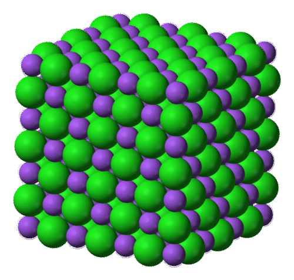

Watch a video about The Structure of Ionic Solids: http://www.youtube.com/watch?v=TLPY9Z6z4Mg (1:35) .

!?[video](https://www.youtube.com/watch?v=TLPY9Z6z4Mg)

The most straightforward way to describe this structure with a chemical formula is to give the lowest whole-number ratio between the two ions. The formulas for ionic compounds are always empirical formulas. In the case of NaCl, there are equal numbers of sodium ions and chloride ions in the salt crystal. In contrast, a crystal of magnesium chloride has twice as many chloride ions as magnesium ions, so it has a formula of MgCl2.

Monatomic Ions
--------------

Many ionic compounds consist of a positively charged metal cation and a negatively charged nonmetal anion that are combined in whatever ratio will produce a compound that is electrically neutral. In other words, the total positive charge is exactly canceled out by the total negative charge. In order to accurately write formulas for ionic compounds, it is necessary to know the charges of the ions involved. We will begin our study with **monatomic ions**, _which are ions that consist of a single atom with either a positive or negative charge_.

### Cations

Cations are positive ions that are formed when a metal atom loses one or more electrons. For the representative elements, cations are generally formed by removing all of the valence electrons from the atom. Since the numbers of valence electrons for the representative elements are constant within a particular group, all we need is the group number of a given element to know its charge when it becomes a cation. Group 1 elements form ions with a 1+ charge, Group 2 metal ions have a 2+ charge, and the ions of Group 13 elements tend to have a 3+ charge. Heavier _p_\-block metals such as tin and lead are special cases and will be discussed with the transition metal ions. Monatomic cations have the same name as their parent element. For example, Na_+_ is the sodium ion, while Al_3+_ is an aluminum ion.

### Anions

Monatomic anions are negative ions that are formed when a nonmetal atom gains one or more electrons. Nonmetallic atoms typically gain enough electrons to obtain the same electron configuration as the nearest noble gas. All the elements in Group 17 have seven valence electrons, which are arranged into a outer configuration of _ns__2__np__5_. To achieve a noble gas configuration (_ns__2__np__6_), each of these elements needs to gain just one electron, resulting in an anion with a 1− charge. Similarly, Group 16 elements can obtain an _ns__2__np__6_ valence configuration by forming ions with a 2− charge, and the Group 15 nonmetals will form ions with a 3− charge. Naming anions is slightly different than naming cations. The ending of the element’s name is dropped and replaced with the –_ide_ suffix. For example, F_\-_ is the fluoride ion, while O_2-_ is the oxide ion. The table below (**Table** [below](#x-ck12-dGFibGU6VGFibGUtNy4x)) shows the names and charges for common monatomic ions of the representative elements.

|     |     |     |     |     |     |
| --- | --- | --- | --- | --- | --- |Common Monatomic Ions
| 1+  | 2+  | 3+  | 3-  | 2-  | 1-  |
| --- | --- | --- | --- | --- | --- |
| lithium, Li_+_ | beryllium, Be_2+_ | aluminum, Al_3+_ | nitride, N_3-_ | oxide, O_2-_ | fluoride, F_\-_ |
| sodium, Na_+_ | magnesium, Mg_2+_ | gallium, Ga_3+_ | phosphide, P_3-_ | sulfide, S_2-_ | chloride, Cl_\-_ |
| potassium, K_+_ | calcium, Ca_2+_ |     | arsenide, As_3-_ | selenide, Se_2-_ | bromide, Br_\-_ |
| rubidium, Rb_+_ | strontium, Sr_2+_ |     |     | telluride, Te_2-_ | iodide, I_\-_ |
| cesium, Cs_+_ | barium, Ba_2+_ |     |     |     |     |

### Transition Metal Ions

Most transition metals differ from the metals of Groups 1, 2, and 13 in that they are capable of forming more than one type of stable cation. For example, iron sometimes loses two electrons to form the Fe_2+_ ion, but it is also common for iron to lose three electrons to form the Fe_3+_ ion. Although they are members of the _p_ block and not the _d_ block, tin and lead also form more than one type of ion. Because the charges of these ions cannot be unambiguously determined by looking at the periodic table, they must have names that also indicate their charge. The Stock system denotes the charge of these ions by using a Roman numeral in parentheses after the name of the ion. For example, the previously mentioned iron ions are named the iron(II) ion and the iron(III) ion. When said out loud, "iron(II) ion" should be read, “iron two ion.” Listed below (**Table** [below](#x-ck12-dGFibGU6VGFibGUtNy4y)) are the names and formulas of some of the more common transition metal ions.

|     |     |     |     |
| --- | --- | --- | --- |Common Transition Metal Ions
| 1+  | 2+  | 3+  | 4+  |
| --- | --- | --- | --- |
| copper(I), Cu_+_ | cadmium, Cd_2+_ | chromium(III), Cr_3+_ | lead(IV), Pb_4+_ |
| gold(I), Au_+_ | chromium(II), Cr_2+_ | cobalt(III), Co_3+_ | tin(IV), Sn_4+_ |
| mercury(I), Hg2_2+_ | cobalt(II), Co_2+_ | gold(III), Au_3+_ |     |
| silver, Ag_+_ | copper(II), Cu_2+_ | iron(III), Fe_3+_ |     |
|     | iron(II), Fe_2+_ |     |     |
|     | lead(II), Pb_2+_ |     |     |
|     | manganese(II), Mn_2+_ |     |     |
|     | mercury(II), Hg_2+_ |     |     |
|     | nickel(II), Ni_2+_ |     |     |
|     | platinum(II), Pt_2+_ |     |     |
|     | tin(II), Sn_2+_ |     |     |
|     | zinc, Zn_2+_ |     |     |

Notice in the table above (**Table** [above](#x-ck12-dGFibGU6VGFibGUtNy4y)) that there are three cations whose names do not include a Roman numeral. Silver, cadmium, and zinc only form one common type of ion, so the charges on ions of these elements are considered to be implied by the name (1+ for silver and 2+ for zinc and cadmium). By convention, the Stock system is not used for these elements, and their cations are named in the same way as those of the representative elements. The mercury(I) ion is a special case that consists of a pair of mercury atoms bonded together. The overall ion has a charge of 2+, so each mercury ion can be thought of as carrying a 1+ charge. In some instances, charges greater than 4+ are seen, but because these are less common, they are not included in the table.

There is an older system for naming some of these cations that is still occasionally used. The Latin root of the metal name is written with one of two suffixes: (1) _–ic_ for the ion with a higher charge, and (2) _–ous_ for the ion with a lower charge. For example, the Latin name for iron is ferrum, so the Fe_3+_ ion is called the ferric ion, and the Fe_2+_ ion is called the ferrous ion. The primary disadvantage of this system is that the suffixes do not tell you exactly what the charge is for a given ion. For copper, the two most common charges are 1+ and 2+, so Cu_2+_ is called the cupric ion and Cu_+_ is the cuprous ion. The Stock system is a much more informative system and will be used as the primary method for naming transition metal compounds throughout this book.

Binary Ionic Compounds
----------------------

A **binary ionic compound** _is a compound made by combining monatomic metal cations with monatomic nonmetal anions_.

### Naming Binary Ionic Compounds

When given the formula of a chemical compound, you must first decide what kind of compound it is before you can determine how it should be named. A binary ionic compound will contain one metallic element and one nonmetallic element. By convention, the metal is generally written before the nonmetal in the chemical formula for this type of compound. To name a binary ionic compound, simply write the name of the cation followed by the name of the anion. Note that subscripts in the formula do not affect the name. Below are three examples (**Table** [below](#x-ck12-dGFibGU6RXgx)).

|     |     |
| --- | --- |Examples of Binary Ionic Compounds
| Formula | Name |
| --- | --- |
| KF  | potassium fluoride |
| Na3N | sodium nitride |
| Ca3P2 | calcium phosphide |

Notice that in each of the formulas above, the overall charge of the compound is zero. Since potassium ions (K_+_) and fluoride ions (F_−_) have charges of equal magnitude, a neutral compound is formed when combining them in a 1:1 ratio, resulting in a formula that contains one of each ion. This would also be the case for a compound such as MgS, which is composed of Mg_2+_ and S_2−_. For sodium nitride, the sodium ion (Na_+_) has a charge of 1+, while the nitride ion (N_3−_) has a charge of 3-. In order to make a neutral compound, three of the 1+ sodium ions are needed to balance out each 3- nitride ion. This is reflected in the chemical formula by giving Na a subscript of 3. Calcium phosphide is composed of calcium ions (Ca_2+_) and phosphide ions (P_3−_). Determining the necessary ratio for ions whose charges both have magnitudes greater than 1 can sometimes be made easier by looking for the least common multiple of the two charges. In this case, the least common multiple of 2 and 3 is 6. To make the compound neutral, three calcium ions (with a total charge of 6+) should be combined with two phosphide ions (with a total charge of 6−). The Ca is given a subscript of 3, while the P is given a subscript of 2.

Practice naming binary ionic compounds with this short crossword puzzle: https://sites.google.com/site/pattihowellsciencespot/uploads/binary%20ionic%20compounds.html?attredirects=0&d=1.

### Naming Compounds Using the Stock System

Naming compounds that involve transition metal cations requires the use of the Stock system. Consider the binary ionic compound FeCl3. The name "iron chloride" would be ambiguous because iron is capable of forming two ions with different charges. The name of any iron-containing compound must reflect which type of iron ion is in the compound. In this case, the subscript in the formula indicates that there are three chloride ions, each with a 1− charge. Therefore, the charge of the single iron ion must be 3+. The correct name of FeCl3 is iron(III) chloride, where the Roman numeral indicates the charge of the cation. Listed below (**Table** [below](#x-ck12-dGFibGU6RXgy)) are a few other examples.

|     |     |
| --- | --- |Examples of Naming Using the Stock System
| Formula | Name |
| --- | --- |
| Cu2O | copper(I) oxide |
| CuO | copper(II) oxide |
| SnO2 | tin(IV) oxide |

The first two are both oxides of copper (**Figure** [below](#x-ck12-SW50Q2gtMDctMDMtQ29wcGVyLW94aWRl)). The ratio of copper ions to oxide ions determines the name. Since the oxide ion is O_2−_, the charges of the copper ion must be 1+ in the first formula and 2+ in the second formula. In the third formula, there is one tin ion for every two oxide ions. This means that the tin must carry a 4+ charge, making the name tin(IV) oxide.

 oxide, a red solid, and copper(II) oxide, a black solid, are different compounds because of the charge of the copper ion.")

You can practice naming multivalent metal compounds by completing this online crossword puzzle: https://sites.google.com/site/pattihowellsciencespot/uploads/multivalent%20metals%20compounds.html?attredirects=0&d=1.

### Writing Formulas for Binary Ionic Compounds

If you know the name of a binary ionic compound, you can write its formula. Start by writing the metal ion and its charge, followed by the nonmetal ion with its charge. Because the overall compound must be electrically neutral, decide how many ions of each type are needed in order for the positive and negative charges to cancel each other out. Consider the compound aluminum nitride. The charges on each of these ions can be determined by looking at the groups in which aluminum and nitrogen are found. The ions are:

______$\text{Al}^{3+} \ \ \ \ \text{N}^{3-}$__

$\text{Al}^{3+} \ \ \ \ \text{N}^{3-}$__

__$\text{Al}^{3+} \ \ \ \ \text{N}^{3-}$__

$\text{Al}^{3+} \ \ \ \ \text{N}^{3-}$__

____$\text{Al}^{3+} \ \ \ \ \text{N}^{3-}$__

$\text{Al}^{3+} \ \ \ \ \text{N}^{3-}$__

__$\text{Al}^{3+} \ \ \ \ \text{N}^{3-}$__

$\text{Al}^{3+} \ \ \ \ \text{N}^{3-}$

Since the ions have charges that are equal in magnitude, 1:1 is the lowest ratio of ions that will produce a neutral compound. As a result, the formula of aluminum nitride is AlN. Another compound, lithium oxide, contains the following ions:

______$\text{Li}^+ \ \ \ \ \text{O}^{2-}$__

$\text{Li}^+ \ \ \ \ \text{O}^{2-}$__

__$\text{Li}^+ \ \ \ \ \text{O}^{2-}$__

$\text{Li}^+ \ \ \ \ \text{O}^{2-}$__

____$\text{Li}^+ \ \ \ \ \text{O}^{2-}$__

$\text{Li}^+ \ \ \ \ \text{O}^{2-}$__

__$\text{Li}^+ \ \ \ \ \text{O}^{2-}$__

$\text{Li}^+ \ \ \ \ \text{O}^{2-}$

In this case, two lithium ions are required to balance out the charge of each oxide ion. The formula of lithium oxide is Li2O.

For compounds in which the ratio of ions is not as obvious, an alternative way to determine the correct formula is to use the crisscross method. In this method, the numerical value of each charge crosses over to become the subscript of the opposite ion. The signs of the charges are dropped. The crisscross method is demonstrated below for aluminum oxide.

For aluminum oxide, the crisscross method directly produces the correct formula, but in some cases, another step is required. Because ionic compounds are always described by their empirical formulas, they must be written as the lowest whole-number ratio of the ions. In the case of aluminum nitride, the crisscross method would yield a formula of Al3N3, which is not correct. A second step must be performed in which the subscripts are reduced but the ratio is kept the same. Al3N3 can be reduced to AlN, because both formulas describe a 1:1 ratio of aluminum ions to nitride ions. Following the crisscross method to write the formula for lead(IV) oxide would involve the following steps:

Click here to watch an animation of ionic bonding: http://www.dlt.ncssm.edu/core/Chapter9-Bonding_and_Geometry/Chapter9-Animations/IonicBonding.html.

**Sample Problem 7.1: Writing Formulas for Binary Ionic Compounds**

Write the correct formulas for the following ionic compounds:

1.  barium chloride
2.  chromium(III) oxide

_Step 1: Plan the problem._

In each case, write the metal cation followed by the nonmetal anion. Crisscross the ion charges in order to make each ionic compound neutral. Reduce to the lowest ratio if necessary.

_Step 2: Solutions_.

1.  
    
    \[Figure 7\]
    
2.  
    
    \[Figure 8\]
    

_Step 3: Think about your result._

The formula for barium chloride is BaCl2. Notice that the charge of the chloride ion needs to be written as 1− rather than just – in order to do the crisscross. However, the number 1 is not used as a subscript. The formula for chromium(III) oxide is Cr2O3.

**_Practice Problems_**

1.  Write formulas for the binary ionic compounds formed by the following pairs of elements:
    1.  cesium and fluorine
    2.  calcium and sulfur
    3.  aluminum and chlorine
    4.  zinc and nitrogen
2.  Write the formula and give the name for the compound formed by each of the following ion pairs:
    1.  Fe_3+_ and O_2-_
    2.  Ni_2+_ and S_2-_
    3.  Au_+_ and Cl_\-_
    4.  Sn_4+_ and I_\-_
3.  Give names for the following compounds:
    1.  Ag2S
    2.  PdO
    3.  PtCl4
    4.  V2O5

Ternary Ionic Compounds
-----------------------

Not all ionic compounds are composed of only monatomic ions. A **ternary ionic compound** _is an ionic compound composed of three or more elements_. In a typical ternary ionic compound, there is still just one type of cation and one type of anion, but the cation or the anion (or sometimes both) is a polyatomic ion.

### Polyatomic Ions

A **polyatomic ion** _is an ion composed of more than one atom_. The ammonium ion consists of one nitrogen atom and four hydrogen atoms. Together, they comprise a single ion with a 1+ charge and a formula of NH4_+_. The carbonate ion consists of one carbon atom and three oxygen atoms, and it carries an overall charge of 2−. The formula of the carbonate ion is CO3_2-_. The atoms of a polyatomic ion are tightly bonded together, so the entire ion behaves as a single unit. The figure below (**Figure** [below](#x-ck12-SW50Q2gtMDctMDQtUG9seWF0b21pYw..)) shows several models, and the table below (**Table** [below](#x-ck12-dGFibGU6VGFibGUtNy4z)) lists many of the most common polyatomic ions.

 The ammonium ion (NH4_+_) is a nitrogen atom (blue) bonded to four hydrogen atoms (white). (B) The hydroxide ion (OH_\-_) is an oxygen atom (red) bonded to a hydrogen atom. (C) The carbonate ion (CO3_2-_) is a carbon atom (black) bonded to three oxygen atoms.")

|     |     |     |     |     |
| --- | --- | --- | --- | --- |Common Polyatomic Ions
| 1-  | 2-  | 3-  | 1+  | 2+  |
| --- | --- | --- | --- | --- |
| acetate, CH3COO_\-_ | carbonate, CO3_2-_ | arsenate, AsO3_3-_ | ammonium, NH4_+_ | dimercury, Hg2_2+_ |
| bromate, BrO3_\-_ | chromate, CrO4_2-_ | phosphite, PO3_3-_ |     |     |
| chlorate, ClO3_\-_ | dichromate, Cr2O7_2-_ | phosphate, PO4_3-_ |     |     |
| chlorite, ClO2_\-_ | hydrogen phosphate, HPO4_2-_ |     |     |     |
| cyanide, CN_\-_ | oxalate, C2O4_2-_ |     |     |     |
| dihydrogen phosphate, H2PO4_\-_ | peroxide, O2_2-_ |     |     |     |
| hydrogen carbonate, HCO3_\-_ | silicate, SiO3_2-_ |     |     |     |
| hydrogen sulfate, HSO4_\-_ | sulfate, SO4_2-_ |     |     |     |
| hydrogen sulfide, HS_\-_ | sulfite, SO3_2-_ |     |     |     |
| hydroxide, OH_\-_ |     |     |     |     |
| hypochlorite, ClO_\-_ |     |     |     |     |
| nitrate, NO3_\-_ |     |     |     |     |
| nitrite, NO2_\-_ |     |     |     |     |
| perchlorate, ClO4_\-_ |     |     |     |     |
| permanganate, MnO4_\-_ |     |     |     |     |

The vast majority of polyatomic ions are anions, many of which end in _–ate_ or _–ite_. Notice that in some cases, such as nitrate (NO3_\-_) and nitrite (NO2_\-_), there are multiple anions that consist of the same two elements. This is particularly common for oxoanions, which are binary anions containing one or more oxygen atoms. A given element may form several oxoanions that all have the same charge but differ in the number of oxygen atoms present. When there are two common oxoanions for a particular element, the one with the greater number of oxygen atoms gets an _–ate_ suffix, while the one with the lower number of oxygen atoms gets an _–ite_ suffix. Some elements form more than two common oxoanions, such as chlorine:

* ClO_\-_, hypochlorite
* ClO2_\-_, chlorite
* ClO3_\-_, chlorate
* ClO4_\-_, perchlorate

For larger families of oxoanions, the ion with one more oxygen atom than the _–ate_ anion is given a _per-_ prefix, and the ion with one fewer oxygen atom than the _–ite_ anion is given a _hypo-_ prefix.

### Naming Ternary Ionic Compounds

As in the case of binary ionic compounds, ternary ionic compounds can be named by writing the name of the cation followed by the name of the anion. Some examples are listed below (**Table** [below](#x-ck12-dGFibGU6RXgz)):

|     |     |
| --- | --- |Examples of Ternary Ionic Compounds
| Formula | Name |
| --- | --- |
| NaNO3 | sodium nitrate |
| NH4Cl | ammmonium chloride |
| Fe(OH)3 | iron(III) hydroxide |

When more than one polyatomic ion is present in a compound, the formula of the entire ion is placed in parentheses, and a subscript outside of the parentheses indicates how many of those ions are in the compound. In the last example above, there is one Fe_3+_ cation present for every three OH_\-_ anions.

### Writing Formulas for Ternary Ionic Compounds

Writing a formula for a ternary ionic compound involves the same steps as for a binary ionic compound. Write the symbol and charge of the cation followed by the symbol and charge of the anion. Use the crisscross method to ensure that the final formula is neutral. Calcium nitrate is composed of calcium cations and nitrate anions.

Note that there are two polyatomic ions that produce unusual formulas. The Hg2_2+_ ion is called either the dimercury ion or, preferably, the mercury(I) ion. When combined with an anion that has a 1− charge, such as chloride, the formula is Hg2Cl2. Because the cation consists of two Hg atoms bonded together, this formula is not reduced to HgCl. Likewise, the peroxide ion, O2_2-_, is also a unit that must stay together in its formulas. For example, the formula for potassium peroxide is K2O2.

**Sample Problem 7.2: Writing Formulas for Ternary Ionic Compounds**

Write the correct formulas for the following ionic compounds:

1.  potassium sulfate
2.  zinc phosphate

_Step 1: Plan the problem._

In each case, write the metal cation followed by the nonmetal anion. Crisscross the ion charges in order to make the ionic compound neutral. Use parentheses around the polyatomic ion if more than one is present in the final formula. Reduce to the lowest ratio if necessary.

_Step 2: Solutions_.

1.  
    
    \[Figure 11\]
    
2.  
    
    \[Figure 12\]
    

_Step 3: Think about your result._

The formula for potassium sulfate is K2SO4. Two potassium cations with 1+ charges balance out the 2− charge of each sulfate ion. The formula for zinc phosphate is Zn3(PO4)2. Three zinc cations with 2+ charges balance out two phosphate anions with 3− charges.

**_Practice Problems_**

4.  Name the following compounds:
    1.  NH4NO3
    2.  Na2Cr2O7
    3.  PbCO3
    4.  Mg(CH3COO)2
5.  Write formulas for the following compounds:
    1.  potassium hydrogen sulfate
    2.  iron(III) oxalate
    3.  sodium peroxide
    4.  tin(IV) chromate

Watch a humorous video lecture about Naming Ionic Compounds from BossChemDude: http://www.youtube.com/watch?v=q2s8hQ5NIpE (8:30)

!?[video](https://www.youtube.com/watch?v=q2s8hQ5NIpE)

Lesson Summary
--------------

* Inorganic chemistry is the study of chemical compounds that do not contain carbon.
* Molecular formulas show the type and number of atoms that occur in a molecule. Empirical formulas show the atoms or ions that make up a compound in their lowest whole-number ratio. Because ionic compounds have an extended three-dimensional structure, only empirical formulas should be used to describe them.
* Atoms of the representative elements generally form monatomic ions by losing or gaining enough electrons to attain the electron configuration of the nearest noble gas.
* Most transition metals are capable of forming multiple cations with different charges. When the charge of an ion cannot be determined by the identity of the element, Roman numerals are used in the name of the ion. Specifying the charge of an ion in this way is referred to as the Stock system.
* Ionic compounds are named by writing the name of the cation followed by the name of the anion.
* Ionic compounds are electrically neutral, so the total amount of positive charge must balance the total amount of negative charge. The crisscross method can be used to determine the correct formulas for ionic compounds.
* Some ionic compounds contain polyatomic ions. A set of parentheses is used when more than one polyatomic ion is present in a formula.

Lesson Review Questions
-----------------------

### Reviewing Concepts

1.  What element is present in all organic compounds?
2.  Write the molecular formula of a compound whose molecules contain one atom of nitrogen and three atoms of fluorine.
3.  A Roman numeral is not used in the names of compounds containing which three transition elements?
4.  Give an example of each of the following: (1) a monatomic cation, (2) a monatomic anion, (3) a polyatomic cation, and (4) a polyatomic anion.
5.  What is the overall charge of an ionic compound?
6.  When are parentheses used in the formula of an ionic compound?

### Problems

7.  Write the empirical formula for each of the following compounds:
    1.  C2H6
    2.  Hg2Cl2
    3.  Sb2O5
    4.  C8H16O2
8.  Using only the periodic table, write the symbol of the common ion formed by each of the following elements:
    1.  Sr
    2.  I
    3.  Se
    4.  Ba
    5.  P
    6.  Rb
    7.  Al
    8.  Br
9.  Name the following monatomic ions:
    1.  O_2-_
    2.  Li_+_
    3.  W_3+_
    4.  Cu_2+_
    5.  Ga_3+_
    6.  F_\-_
10. Write formulas for binary ionic compounds formed from each of the following pairs of elements:
    1.  potassium and sulfur
    2.  silver and chlorine
    3.  calcium and oxygen
    4.  aluminum and iodine
    5.  barium and nitrogen
    6.  sodium and selenium
11. Name the following polyatomic ions:
    1.  SO3_2-_
    2.  MnO4_\-_
    3.  CO3_2-_
    4.  ClO_\-_
    5.  CH3COO_\-_
    6.  H2PO4_\-_
12. Write the symbol and charge for the following polyatomic ions:
    1.  hydrogen sulfide ion
    2.  nitrate ion
    3.  perchlorate ion
    4.  chromate ion
    5.  phosphate ion
    6.  oxalate ion
13. Name the following ionic compounds:
    1.  KClO3
    2.  Cd(NO3)2
    3.  CuCl
    4.  Ca3(PO4)2
    5.  NaCN
    6.  (NH4)2SO3
    7.  Li2O2
    8.  PbS2
    9.  Rb2SO4
    10. Mn3P2
    11. NiCO3
    12. Co(OH)3
    13. Hg2Br2
    14. Zn(NO2)2
14. Write correct formulas for the following ionic compounds:
    1.  copper(II) bromide
    2.  aluminum hydroxide
    3.  silver sulfide
    4.  barium acetate
    5.  mercury(II) nitrate
    6.  lead(II) chromate
    7.  potassium permanganate
    8.  sodium hydrogen carbonate
    9.  calcium silicate
    10. tin(IV) sulfate
    11. ammonium phosphate
    12. gold(III) fluoride
    13. magnesium bromate
    14. chromium(VI) oxide

Further Reading / Supplemental Links
------------------------------------

* Antoine Lavoisier, _Elements of Chemistry_. Dover Publications, 1984.
* An Introduction to Chemistry: Shockwave Tutorials (http://preparatorychemistry.com/Bishop_ionic_nom_Flash1.htm)
* List of inorganic compounds (http://en.wikipedia.org/List_of_inorganic_compounds)

Points to Consider
------------------

The large class of inorganic chemical compounds can be sub-classified into ionic compounds and molecular compounds.

* How is the structure of a molecular compound different from the structure of an ionic compound?
* Relate molecular compounds to the Law of Multiple Proportions.
* What is the nomenclature for molecular compounds?

</article>

### 7.2 Molecular Compounds

<article>

Lesson Objectives
-----------------

* Describe the difference between an ionic compound and a molecular compound.
* Name a molecular compound given its formula.
* Write the correct formula for a molecular compound given its name.

Lesson Vocabulary
-----------------

* binary molecular compound

Check Your Understanding
------------------------

### Recalling Prior Knowledge

* Describe the relationships between the following: atom, element, molecule, and compound.

Inorganic chemical compounds can be broadly classified into two groups: ionic compounds and molecular compounds. In the last lesson, we learned that the structure of all ionic compounds is an extended three-dimensional array of alternating positive and negative ions. Since ionic compounds do not take the form of individual molecules, they are represented by empirical formulas. Now we will begin to examine the formulas and nomenclature of molecular compounds.

Molecular Compounds
-------------------

Molecular compounds are chemical compounds that take the form of discrete molecules. Examples include such familiar substances as water (H2O) and carbon dioxide (CO2) (**Figure** [below](#x-ck12-SW50Q2gtMDctMDUtQ2FyYm9uLURpb3hpZGU.)). These compounds are very different from ionic compounds like sodium chloride (NaCl). Ionic compounds are formed when metal atoms lose one or more of their electrons to nonmetal atoms. The resulting cations and anions are electrostatically attracted to each other. You will learn more about ionic chemical bonding in the chapter, _Ionic and Metallic Bonding_.

So what holds the atoms of a molecule together? Rather than forming ions, the atoms of a molecule share their valence electrons in such a way that a bond forms between pairs of atoms. In a carbon dioxide molecule, there are two of these bonds, each occurring between the carbon atom and one of the two oxygen atoms.

Larger molecules can have many, many bonds that serve to keep the molecule together. In a large sample of a given molecular compound, all of the individual molecules are identical.

Naming Binary Molecular Compounds
---------------------------------

Recall that a molecular formula shows the number of atoms of each element that a molecule contains. A molecule of water contains two hydrogen atoms and one oxygen atom, so its formula is H2O. A molecule of octane, which is a component of gasoline, contains eight atoms of carbon and 18 atoms of hydrogen. The molecular formula of octane is C8H18.

A **binary molecular compound** _is a molecular compound that is composed of two elements_. In general, the elements that combine to form binary molecular compounds are both nonmetals. This contrasts with ionic compounds, which usually involve bonds between metal ions and nonmetal ions. Because ionic charges cannot be used to name them or to write their formulas, a different naming system must be used for molecular compounds. Another difference between ionic and molecular compounds is that two nonmetal atoms will frequently combine with one another in a variety of ratios. This discovery was discussed in the _Atomic Structure_ chapter in the context of the law of multiple proportions. Consider the elements nitrogen and oxygen. They combine to make several binary compounds, including NO, NO2 (**Figure** [below](#x-ck12-SW50Q2gtMDctMDYtTml0cm9nZW4tRGlveGlkZQ..)), and N2O. Obviously they can’t all be called nitrogen oxide! How would someone know which one you were talking about? Each of the three compounds has very different properties and reactivity. A system to distinguish between compounds such as these is necessary.

 is a reddish-brown toxic gas that is a prominent air pollutant produced by internal combustion engines.")

Prefixes are used in the names of binary molecular compounds to identify the number of atoms of each element. Listed below (**Table** [below](#x-ck12-dGFibGU6VGFibGUtNy40)) are the prefixes up to ten.

|     |     |
| --- | --- |Numerical Prefixes
| Number of Atoms | Prefix |
| --- | --- |
| 1   | mono- |
| 2   | di- |
| 3   | tri- |
| 4   | tetra- |
| 5   | penta- |
| 6   | hexa- |
| 7   | hepta- |
| 8   | octa- |
| 9   | nona- |
| 10  | deca- |

The rules for using the prefix system of nomenclature of binary molecular compounds can be summarized as follows.

1.  Generally, the less electronegative element is written first in the formula, though there are a few exceptions. Carbon is always first in a formula, and hydrogen is written after nitrogen in a formula such as NH3. The order in which common nonmetals are written in binary compound formulas is the same as their order in the following series: C, P, N, H, S, I, Br, Cl, O, F.
2.  The first element in the formula is written first in the name of the compound, along with the appropriate prefix. No prefix is used if there is only one atom of the first element.
3.  The second element is named after the first, but the ending of the element’s name is changed to _–ide_. The appropriate prefix is always used for the second element, even if there is only one atom of that element.
4.  The _a_ or _o_ at the end of a prefix is usually dropped from the name when the name of the element begins with a vowel. As an example, four oxygen atoms is tetroxide instead of tetraoxide.

Some examples of molecular compounds are listed below (**Table** [below](#x-ck12-dGFibGU6RXg0)).

|     |     |
| --- | --- |Examples of Molecular Compounds
| Formula | Name |
| --- | --- |
| NO  | nitrogen monoxide |
| N2O | dinitrogen monoxide |
| S2Cl2 | disulfur dichloride |
| Cl2O7 | dichlorine heptoxide |

Notice that the mono- prefix is not used with the nitrogen in the first compound, but is used with the oxygen in both of the first two examples. The example S2Cl2 emphasizes that the formulas for molecular compounds are not reduced to their lowest ratios. The _o_ of mono- and the _a_ of hepta- are dropped from the name when paired with oxide.

### Writing Formulas for Binary Molecular Compounds

When you know the name of a molecular compound, the prefixes directly tell you which subscript to place with that element in the formula. If there is no prefix, only one atom of that element is present and no subscript is used. For example, if given the name diboron hexahydride, you would realize that the molecule must contain two atoms of boron and six atoms of hydrogen. Its formula is B2H6. Notice that metalloids like boron generally form molecular compounds instead of ionic compounds.

Lesson Summary
--------------

* Molecular compounds exist as a collection of individual molecules.
* The formula of a binary molecular compound shows how many of each atom are present in the molecule. The less electronegative element is generally written first.
* Prefixes are used in the names of molecular compounds to designate how many of each atom are in the molecule.

Lesson Review Questions
-----------------------

### Reviewing Concepts

1.  What type of elements typically form binary molecular compounds?
2.  What determines the order of the elements in the formula of a molecular compound?
3.  Based on your answer to number 2, which of the formulas in each pair is correct?
    1.  BrCl or ClBr
    2.  ON2 or N2O
4.  Give the prefix that would be used in the name of a molecular compound for each of the following quantities of atoms.
    1.  6
    2.  3
    3.  9
    4.  5
    5.  8

### Problems

5.  Name these molecular compounds.
    1.  CCl4
    2.  ClF3
    3.  N2O3
    4.  As2O5
    5.  B4H10
    6.  IF7
6.  Write the correct formulas for the following molecular compounds.
    1.  xenon hexafluoride
    2.  tetraphosphorus decasulfide
    3.  oxygen difluoride
    4.  tellurium trioxide
    5.  germanium monoxide
    6.  trisilicon tetranitride
7.  Name the compounds below. Some are ionic and some are molecular.
    1.  N2O
    2.  Na2O
    3.  K2Cr2O7
    4.  P2O5
    5.  CuSO4
    6.  SnO
    7.  BF3
    8.  W2O3
8.  Write formulas for the following compounds. Some are ionic and some are molecular.
    1.  sodium hydrogen sulfide
    2.  carbon disulfide
    3.  tetraselenium tetranitride
    4.  iron(II) dihydrogen phosphate
    5.  scandium(III) nitrate
    6.  ammonium hydroxide
    7.  bromine pentafluoride
    8.  aluminum selenide

Further Reading / Supplemental Links
------------------------------------

* Molecular Compounds (http://www.buzzle.com/articles/molecular-compounds.html)
* Click here for a crossword puzzle to practice naming common molecules: http://education.jlab.org/sciencecrossword/molecules_01.html.
* Click here for a practice quiz on inorganic nomenclature: http://www.funtrivia.com/playquiz/quiz115018d2cfb8.html.

Points to Consider
------------------

Acids and bases are a special and important class of inorganic compounds. When an acid or a base dissolves in water, it breaks apart into ions.

* What ion must be present in its water solution for a compound to be considered an acid? A base?
* How are acids and bases named?

</article>

### 7.3 Acids and Bases

<article>

Lesson Objectives
-----------------

* Define acids and bases in terms of the ions that are produced when each type of compound is dissolved in water.
* Be able to name acids when given their chemical formulas.
* Write the correct formula for an acid when given its name.
* Name and write formulas for bases.

Lesson Vocabulary
-----------------

* acid
* base
* binary acid
* oxoacid

Check Your Understanding
------------------------

### Recalling Prior Knowledge

* What are cations and anions, and how are they formed?
* How do ionic compounds and molecular compounds compare structurally?
* How do you make sure that the formula for an ionic compound is electrically neutral?

Acids and bases are two very important classes of chemicals that you probably use every day. Many foods and beverages contain acids, such as citrus fruits and juices, soda, and vinegar (**Figure** [below](#x-ck12-SW50Q2gtMDctMDctVmluZWdhci1jaXRydXM.)). Bases are very prevalent in cleaners such as ammonia, and most drain cleaners use a strong base as their active ingredient. Acid-base chemistry will be covered in great detail in a later chapter. In this lesson, we will focus on the nomenclature used for these two types of compounds.

Acids
-----

An acid can be defined in several ways. For the purposes of this chapter, the most straightforward description is that an **acid** _is a molecular compound that contains one or more hydrogen atoms and produces hydrogen ions (H_+_) when dissolved in water_.

 Vinegar comes in a variety of types, but they all contain acetic acid. (B) Citrus fruits like grapefruit contain citric and ascorbic acids.")

This is a different type of compound than the others we have seen in this chapter. Acids are molecular, which means that in their pure state, they exist as individual molecules and do not adopt the extended three-dimensional structures exhibited by ionic compounds like NaCl. However, when these molecules are dissolved in water, the chemical bond between the hydrogen atom and the rest of the molecule breaks, leaving a positively-charged hydrogen ion and an anion. For example, the following chemical equation describes what happens when the acid HCl is dissolved in water:

______$\text{HCl} \rightarrow \text{H}^+ + \text{Cl}^-$__

$\text{HCl} \rightarrow \text{H}^+ + \text{Cl}^-$__

__$\text{HCl} \rightarrow \text{H}^+ + \text{Cl}^-$__

$\text{HCl} \rightarrow \text{H}^+ + \text{Cl}^-$__

____$\text{HCl} \rightarrow \text{H}^+ + \text{Cl}^-$__

$\text{HCl} \rightarrow \text{H}^+ + \text{Cl}^-$__

__$\text{HCl} \rightarrow \text{H}^+ + \text{Cl}^-$__

$\text{HCl} \rightarrow \text{H}^+ + \text{Cl}^-$

Since acids produce H_+_ cations upon dissolving in water, the H of an acid is written first in the formula of an inorganic acid. The remainder of the acid (everything except the H) constitutes the anion that is formed after the acid dissolves. Organic acids are also an important class of compounds, but the rules for naming them are different, and they will primarily be discussed in a later chapter. A **binary acid** _is an acid that consists of hydrogen and one other element_. The most common binary acids contain a halogen. An **oxoacid** _is an acid that consists of hydrogen, oxygen, and a third element_. The third element is usually a nonmetal.

### Naming Acids

Since all acids contain hydrogen, the name of an acid is based on the anion that goes with it. Recall from earlier in the chapter that anions can either be monatomic or polyatomic. The names of all monatomic ions end in _–ide_. The majority of polyatomic ions end in either _–ate_ or _–ite_, though there are a few exceptions, such as the cyanide ion (CN_\-_). It is the suffix of the anion that determines how the acid is named, as described in the rules and the table below (**Table** [below](#x-ck12-dGFibGU6VGFibGUtNy41)).

The three different suffixes that are possible for the anions lead to the three rules below.

1.  When the anion ends in _–ide_, the acid name begins with the prefix _hydro-_. The root of the anion name goes in the blank (e.g., _chlor-_ for chloride), followed by the suffix _–ic acid_. HCl is named hydrochloric acid, because Cl_\-_ is a chloride ion. HCN is hydrocyanic acid because CN_\-_ is a cyanide ion.
2.  When the anion ends in _–ate_, the name of the acid is the root of the anion followed by the suffix _–ic acid_. There is no prefix. H2SO4 is sulfuric acid (not sulfic) because SO4_2-_ is the sulfate ion.
3.  When the anion ends in _–ite_, the name of the acid is the root of the anion followed by the suffix _–ous acid_. Again, there is no prefix. HNO2 is nitrous acid because NO2_\-_ is the nitrite ion.

Note that the root for a sulfur-containing oxoacid is _sulfur-_ instead of just _sulf-_. The same is true for a phosphorus-containing oxoacid, which uses _phosphor-_ as its root instead of simply _phosph-_.

|     |     |     |     |
| --- | --- | --- | --- |Naming System for Acids
| Anion Suffix | Example | Name of acid | Example |
| --- | --- | --- | --- |
| _\-ide_ | chloride (Cl_\-_) | hydro\_\_\_\_\_ic acid | hydrochloric acid (HCl) |
| _\-ate_ | sulfate (SO4_2-_) | \_\_\_\_\_ic acid | sulfuric acid H2SO4) |
| _\-ite_ | nitrite (NO2_\-_) | \_\_\_\_\_ous acid | nitrous acid (HNO2) |

### Writing Formulas for Acids

Like other compounds that we have studied, acids are electrically neutral. Therefore, the charge of the anion part of the formula must be exactly balanced out by the H+ ions. Since H_+_ ions carry a single positive charge, the number of H_+_ ions in the formula is equal to the magnitude of the negative charge on the anion. Two examples from the table above (**Table** [above](#x-ck12-dGFibGU6VGFibGUtNy41)) illustrate this point. The chloride ion carries a 1− charge, so only one H is needed in the formula of the acid (HCl). The sulfate ion carries a 2− charge, so two hydrogen atoms are needed in the formula of the acid (H2SO4). Another way to think about writing the correct formula is to utilize the crisscross method, as shown below for sulfuric acid.

-----

The simplest way to define a **base** _is an ionic compound that produces hydroxide ions when dissolved in water_. One of the most commonly used bases is sodium hydroxide (**Figure** [below](#x-ck12-SW50Q2gtMDctMDgtU29kaXVtLUh5ZHJveGlkZQ..)).

 Sodium hydroxide, a base, is a solid that is typically produced as small white pellets. (B) The structure of sodium hydroxide is an extended three-dimensional network. The purple spheres are the sodium ions (Na_+_). The red and white spheres are oxygen and hydrogen atoms, respectively, which are bonded together to form hydroxide ions (OH_\-_).")

### Names and Formulas of Bases

Inorganic bases are named in the same way as other ionic compounds. Since they all contain the OH_\-_ anion, the names of these bases end in hydroxide. Some examples of names and formulas for bases are shown below (**Figure** [below](#x-ck12-dGFibGU6RXg1)).

|     |     |
| --- | --- |Examples of Bases
| Formula | Name |
| --- | --- |
| NaOH | sodium hydroxide |
| Ca(OH)2 | calcium hydroxide |
| NH4OH | ammonium hydroxide |

Notice that because bases are ionic compounds, the number of hydroxide ions in the formula does not affect the name. The compound must be neutral, so the charges of the ions are balanced just as for other ionic compounds. The sodium ion (Na_+_) requires one OH_\-_ ion to balance the charge, so the formula of sodium hydroxide is NaOH. The calcium ion (Ca_2+_) requires two OH_\-_ ions to balance the charge, so the formula of calcium hydroxide is Ca(OH)2. Remember that the hydroxide ion is a polyatomic ion, so it must be put in parentheses when the formula contains more than one.

Lesson Summary
--------------

* Acids are molecular compounds that dissolve in water to produce hydrogen ions and an anion. Bases are ionic compounds consisting of hydroxide ions and a cation.
* The naming rules for acids are based on the suffix of the anion. Formulas for acids are written by balancing out the charge of the anion with the appropriate number of hydrogen ions.
* Naming and formula writing for bases follows the same guidelines as for other ionic compounds.

Lesson Review Questions
-----------------------

### Reviewing Concepts

1.  What ion must be produced when an acid dissolves in water?
2.  What ion must be present for a compound to be considered a base?
3.  Identify each of the following compounds as either an acid, a base, or neither.
    1.  RbOH
    2.  HBr
    3.  MgO
    4.  CH4
    5.  H3PO3
    6.  Sr(OH)2

### Problems

4.  Name the following acids.
    1.  HF
    2.  HClO2
    3.  H2CrO4
    4.  H2SO3
    5.  H3PO4
    6.  HClO4
    7.  H2S
    8.  HNO3
5.  Write correct formulas for the following acids.
    1.  carbonic acid
    2.  hydroiodic acid
    3.  chloric acid
    4.  phosphorous acid
    5.  oxalic acid
    6.  hypochlorous acid
    7.  hydrobromic acid
    8.  permanganic acid
6.  Write names or formulas for these compounds.
    1.  LiOH
    2.  Mg(OH)2
    3.  Fe(OH)3
    4.  nickel(II) hydroxide
    5.  aluminum hydroxide
    6.  silver hydroxide
7.  Identify each compound below as either a (1) ionic compound, (2) molecular compound, (3) acid, or (4) base. Then, name it properly.
    1.  HCN
    2.  KNO3
    3.  N2O4
    4.  Sr(OH)2
    5.  HBrO3
    6.  SO3
    7.  HCH3COO
    8.  CsOH
    9.  Pb3(PO4)2
    10. AsH3

Further Reading / Supplemental Links
------------------------------------

* Kristi Lew, _Acids and Bases_ (_Essential Chemistry_). Chelsea House, 2008.
* Chris Oxlade, _Acids and Bases_. Heinemann-Raintree, 2007.
* An Introduction to Chemistry (http://preparatorychemistry.com/Bishop_acid_nomenclature_help.htm)

Points to Consider
------------------

The extended three-dimensional structure of ionic compounds is commonly called a crystal lattice. The interactions of the ions within a crystal lattice lead directly to many important physical and chemical properties of ionic compounds.

* How is a crystal lattice formed?
* Why is a crystal lattice the most stable structural form for an ionic compound?
* What physical properties do ionic compounds have in common as a result of their structure?

</article>

## 8.0 Ionic and Metallic Bonding

<article>

 carbonate, MnCO3. Metals also have a crystalline structure, which contribute to the familiar properties of metals like malleability and electrical conductivity. We begin with a detailed look at how ions form.")

_John W. Schulze (Flickr:Gruenemann). www.flickr.com/photos/gruenemann/5559115094/. CC BY 2.0._

</article>

### 8.1 Ions

<article>

Lesson Objectives
-----------------

* Be able to determine the number of valence electrons for any element and draw an electron dot diagram for any atom.
* Use the octet rule to predict the charges of the most common ions formed by the representative elements.
* Write electron configurations for ions.
* Identify other atoms or ions that are isoelectronic with a particular ion.
* Know that transition metal ions with either half-filled or completely filled _d_ sublevels are particularly stable.

Lesson Vocabulary
-----------------

* electron dot diagram
* isoelectronic
* octet rule

Check Your Understanding
------------------------

### Recalling Prior Knowledge

* What is the Aufbau principle?
* What is the name of the energy required to remove an electron from a neutral atom?
* How does the energy required to remove the first electron from an atom compare to the energy necessary to remove subsequent electrons?

As you learned in previous chapters, ions are formed when atoms lose or gain electrons. Metal atoms have relatively few valence electrons, so when neutral metals undergo chemical reactions, they tend to lose those valence electrons. Nonmetals have more valence electrons than metals, so when nonmetals undergo reactions with metals, they tend to gain electrons. In this lesson, we take a closer look at ions and the physical and chemical properties of ionic compounds.

---

&nbsp;

Electron Dot Diagrams
---------------------

Recall that the valence electrons of an atom are the electrons that reside in the highest occupied principal energy level. Valence electrons are primarily responsible for the chemical properties of various elements. The number of valence electrons can be easily determined from the electron configuration. Several examples from the second period are shown below (**Table** [below](#x-ck12-dGFibGU6RWxlY3Ryb24tQ29uZmlndXJhdGlvbg..)). Note that for each of the second period elements, the valence electrons are in the second principal energy level.

| Element | Electron Configuration | Number of Valence Electrons |
| --- | --- | --- |
| lithium | $1s^22s^1$ | 1   |
| beryllium | $1s^22s^2$ | 2   |
| nitrogen | $1s^22s^22p^3$ | 5   |
| neon | $1s^22s^22p^6$ | 8   |

For elements in the _s_ and _p_ blocks, the number of valence electrons can easily be determined from the group number. In the _s_ block, Group 1 elements have one valence electron, while Group 2 elements have two valence electrons. In the _p_ block, the number of valence electrons is equal to the group number minus ten. Group 13 elements have three valence electrons, Group 14 elements have four, and so on. The noble gases in Group 18 have eight valence electrons, and the full outer _s_ and _p_ sublevels are what give these elements their special stability.

When examining chemical bonding, it is necessary to keep track of the valence electrons on each atom. An **electron dot diagram** _shows the valence electrons of an atom as dots distributed around the element’s symbol_. For example, a beryllium atom, which has two valence electrons, would have the electron dot diagram below.

) shows the electron dot diagrams for the entire second period.")

|     |     |
| --- | --- |Electron Dot Diagrams for the Second Period Elements
| Group Number | Electron Dot Diagram |
| --- | --- |
| 1   |   \[Figure 2. |
| 2   |   \[Figure 3. |
| 13  |   \[Figure 4. |
| 14  |   \[Figure 5. |
| 15  |   \[Figure 6. |
| 16  |   \[Figure 7. |
| 17  |   \[Figure 8. |
| 18  |   \[Figure 9. |

Electron dot diagrams for all elements in a given group of representative elements are identical (except for the elemental symbol) because each element in one of those groups has the same number of valence electrons. Most transition metals have two valence electrons in their ground state, though some of the elements with unusual electron configurations have only one.

Go to http://hyperphysics.phy-astr.gsu.edu/hbase/pertab/perlewis.html to answer the following question:

______From this periodic table, explain how valence electrons are added to the symbol from one column to the next.__

From this periodic table, explain how valence electrons are added to the symbol from one column to the next.__

__From this periodic table, explain how valence electrons are added to the symbol from one column to the next.__

From this periodic table, explain how valence electrons are added to the symbol from one column to the next.__

____From this periodic table, explain how valence electrons are added to the symbol from one column to the next.__

From this periodic table, explain how valence electrons are added to the symbol from one column to the next.__

__From this periodic table, explain how valence electrons are added to the symbol from one column to the next.__

From this periodic table, explain how valence electrons are added to the symbol from one column to the next.

The Octet Rule
--------------

The noble gases are unreactive because of their electron configurations. American chemist, Gilbert Lewis (1875-1946), used this observation to explain the types of ions and molecules that are formed by other elements. He called his explanation the octet rule. The **octet rule** _states that elements tend to form compounds in ways that give each atom eight valence electrons_. An exception to this rule is the elements in the first period, which are particularly stable when they have two valence electrons. A broader statement that encompasses both the octet rule and this exception is that _atoms react in order to achieve the same valence electron configuration as that of a noble gas_. Most noble gases have eight valence electrons, but because the first principal energy level can hold a maximum of two electrons, the first noble gas (helium) needs only two valence electrons to fill its outermost energy level. As a result, the nearby elements hydrogen, lithium, and beryllium tend to form stable compounds by achieving a total of two valence electrons.

There are two ways in which atoms can satisfy the octet rule. One way is by sharing their valence electrons with other atoms, which will be covered in the next chapter, _Covalent Bonding_. The second way is by transferring valence electrons from one atom to another. Atoms of metallic elements tend to lose all of their valence electrons, which leaves them with an octet from the next lowest principal energy level. Atoms of nonmetallic elements tend to gain electrons in order to fill their outermost principal energy level with an octet.

### Cations

As you have seen before, cations are the positive ions formed when an atom loses one or more electrons. The cations most commonly formed by the representative elements are those that involve the loss of all valence electrons. Consider the alkali metal, sodium (Na). It has one valence electron in the third principal energy level. Upon losing that electron, the sodium ion now has an octet of electrons from the second principal energy level. The equation below illustrates this process.

$$
\begin{align*}
&\text{Na} && \rightarrow &&\text{Na}^+ + e^- \\
&1s^22s^22p^63s^1 && && 1s^22s^22p^6 \ \text{(octet)}
\end{align*}
$$

The electron configuration of the sodium ion is now the same as that of the noble gas, neon. The term **isoelectronic** _is used to describe two atoms or ions that have the same electron configuration_. The sodium ion is isoelectronic with the neon atom. Consider the analogous processes for magnesium and aluminum:

$$
\begin{align*}
&\text{Mg} && \rightarrow &&\text{Mg}^{2+} + 2e^- \\
& 1s^22s^22p^63s^2 && && 1s^22s^22p^6 \ \text{(octet)}
\end{align*}
$$

$$
\begin{align*}
&\text{Al} && \rightarrow &&\text{Al}^{3+} + 3e^- \\
& 1s^22s^22p^63s^23p^1 && && 1s^22s^22p^6 \ \text{(octet)}
\end{align*}
$$

Both of these atoms form ions by losing all of their valence electrons, two in the case of magnesium, and three in the case of aluminum. The same noble gas configuration is achieved by all of these ions. In other words, the Mg_2+_ ion, the Al_3+_ ion, the Na_+_ ion, and the Ne atom are all isoelectronic. Under typical conditions, the representative elements form cations by losing a maximum of three electrons.

We can also show the loss of valence electron(s) with an electron dot diagram.

$$
\text{Na}^{\bullet} \rightarrow \text{Na}^+ + e^-
$$

### Anions

Anions are the negative ions formed by gaining one or more electrons. When nonmetal atoms gain electrons, they often do so until they reach an octet of valence electrons in their outermost principal energy level. This process is illustrated below for the elements fluorine, oxygen, and nitrogen.

$$
\begin{align*}
&\text{F} + e^- && \rightarrow && \text{F}^- \\
&1s^22s^22p^5 && && 1s^22s^22p^6 \ \text{(octet)}
\end{align*}
$$

$$
\begin{align*}
&\text{O} + 2e^- && \rightarrow && \text{O}^{2-} \\
&1s^22s^22p^4 && && 1s^22s^22p^6 \ \text{(octet)}
\end{align*}
$$

$$
\begin{align*}
&\text{N} + 3e^- && \rightarrow && \text{N}^{3-} \\
&1s^22s^22p^3 && && 1s^22s^22p^6 \ \text{(octet)}
\end{align*}
$$

All of these anions are isoelectronic with each other and with neon. They are also isoelectronic with the three cations from the previous section. Under typical conditions, a maximum of three electrons will be gained during the formation of anions.

Outer electron configurations are constant within a group, so this pattern of ion formation repeats itself for Periods 3, 4, and so on (**Figure** [below](#x-ck12-SW50Q2gtMDgtMDEtSW9ucy10YWJsZQ..)).

) because their nuclei contain different numbers of protons. One is an essential ion that is a part of table salt, while the other is an unreactive gas that makes up a very small part of the atmosphere. Likewise, sodium ions are very different than magnesium ions, fluoride ions, and all the other members of this isoelectronic series (N_3-_, O_2-_, F_\-_, Ne, Na_+_, Mg_2+_, Al_3+_).")

You can go to http://www.visionlearning.com/en/library/Chemistry/1/Atomic-Theory-I/50 and http://www.visionlearning.com/en/library/Chemistry/1/Atomic-Theory-II/51 to see animations of atoms and ions.

Learning the octet rule can be fun! Watch this music video about the octet rule: http://www.youtube.com/watch?v=WzWk-mx_14E (6:30)

!?[video](https://www.youtube.com/watch?v=WzWk-mx_14E)

1. How does this song compare an outer energy level with eight electrons to emotions? 2. What are the two exceptions to the octet rule in this song?

### Transition Metal Ions

Transition metals belong to the _d_ block, meaning that the _d_ sublevel of electrons is in the process of being filled with up to 10 electrons. Many transition metals cannot lose enough electrons to attain a noble gas electron configuration. Additionally, you have learned that the majority of transition metals are capable of adopting ions with different charges. Iron, which can form either Fe_2+_ or Fe_3+_ ions, loses electrons, as shown below.

$$
\begin{align*}
&\text{Fe} && \rightarrow && \text{Fe}^{2+} + 2e^- \\
&\text{[Ar]}3d^64s^2 && && \text{[Ar]}3d^6
\end{align*}
$$

$$
\begin{align*}
&\text{Fe} && \rightarrow && \text{Fe}^{3+} + 3e^- \\
&\text{[Ar]}3d^64s^2 && && \text{[Ar]}3d^5
\end{align*}
$$

According to the Aufbau process, the electrons fill the 4_s_ sublevel before beginning to fill the 3_d_ sublevel. However, the outermost _s_ electrons are always the first to be removed when forming transition metal cations. Because most transition metals have two valence electrons, a charge of 2+ is very common for transition metal ions, as we have already seen in the case of iron. A half-filled _d_ sublevel (_d__5_) is also particularly stable. This type of configuration is obtained when an iron atom loses a third electron.

 Iron(III) oxide, Fe2O3, is the primary component of rust. (B) Iron(II) sulfate, FeSO4, has been known since ancient times as green vitriol and was used for centuries in the manufacture of inks.")

Some transition metals that have relatively few _d_ electrons, such as scandium, may be able to attain a noble gas electron configuration.

$$
\begin{align*}
&\text{Sc} && \rightarrow && \text{Sc}^{3+} + 3e^- \\
&\text{[Ar]}3d^14s^2 && && \text{[Ar]}
\end{align*}
$$

Others may attain configurations that include a full _d_ sublevel, such as zinc and copper.

$$
\begin{align*}
&\text{Zn} && \rightarrow && \text{Zn}^{2+} + 2e^- \\
&\text{[Ar]}3d^{10}4s^2 && && \text{[Ar]}3d^{10}
\end{align*}
$$

$$
\begin{align*}
&\text{Cu} && \rightarrow && \text{Cu}^+ + e^- \\
&\text{[Ar]}3d^{10}4s^1 && && \text{[Ar]}3d^{10}
\end{align*}
$$

The resulting configuration above, with 18 electrons in the outermost principal energy level, is referred to as a pseudo noble gas electron configuration. It gives particular stability to the Zn_2+_ and Cu_+_ ions.

Lesson Summary
--------------

* An electron dot diagram shows the chemical symbol of an element with dots that represent valence electrons evenly distributed around the symbol.
* The octet rule states that elements form chemical compounds so that each atom will acquire the electron configuration of a noble gas. Most noble gases have eight valence electrons, except for helium, which has only two.
* Representative metals generally lose all of their valence electrons when forming ions, leaving them with a complete octet of electrons from the next-lowest energy level. Most nonmetals gain electrons when forming ions until their outer energy level has acquired an octet.
* Atoms and ions that have the same electron configuration are called isoelectronic. Common ions of representative elements are isoelectronic with a noble gas.
* When forming ions, transition metals lose their valence _s_\-sublevel electrons before they lose their _d_\-sublevel electrons. Half-filled or completely filled _d_ sublevels give transition metal ions greater stability.

Lesson Review Questions
-----------------------

### Reviewing Concepts

1.  What is the maximum number of valence electrons that an atom can have?
2.  State the number of protons and electrons in each of the following ions.
    1.  K_+_
    2.  F_\-_
    3.  P_3-_
    4.  Ti_4+_
    5.  Cd_2+_
    6.  Cr_3+_
3.  What is wrong with this statement? “When a chlorine atom gains an electron, it becomes an argon atom.”
4.  Why can the majority of transition metals form 2+ ions?
5.  What is a pseudo noble gas electron configuration?

### Problems

6.  How many electrons must each of the atoms below lose to achieve a noble gas electron configuration?
    1.  Li
    2.  Sr
    3.  Al
    4.  Ba
7.  Write the symbol of the most common ion formed by each element in problem 6, and name the noble gas with which each ion is isoelectronic.
8.  How many electrons must each of the atoms below gain to achieve a noble gas electron configuration?
    1.  Br
    2.  S
    3.  N
    4.  I
9.  Write the symbol of the most common ion formed by each element in problem 8, and name the noble gas with which each ion is isoelectronic.
10. Write electron configurations for each of the following atoms. Then write the symbol for the most common ion each would form and the electron configuration of that ion.
    1.  Be
    2.  Cl
    3.  Se
    4.  Rb
11. Write electron configurations for the following ions.
    1.  Cs_+_
    2.  Y_3+_
    3.  Ni_2+_
    4.  As_3-_
    5.  Te_2-_
    6.  Ag_+_
    7.  Pb_4+_
    8.  Mn_2+_
12. For each ion in problem 11, state whether it has (1) a noble gas configuration, (2) a pseudo noble gas configuration, or (3) neither.
13. Split the following ions into isoelectronic groups by noble gas: O_2-_, Sr_2+_, Ca_2+_, H_\-_, V_5+_, I_\-_, Ba_2+_, Na_+_, S_2-_, Al_3+_, La_3+_, Li_+_, As_3-_.

Further Reading / Supplemental Links
------------------------------------

* Ionic (Electrovalent) Bonding (http://www.chemguide.co.uk/atoms/bonding/ionic.html)
* Bonding (http://www.chemteam.info/Bonding/Bonding.html)
* Claude H. Yoder, _Ionic Compounds: Applications of Chemistry to Mineralogy_. Wiley-Interscience, 2006.

Points to Consider
------------------

Ionic compounds adopt the structure of an extended, three-dimensional lattice of alternating positive and negative ions held together by electrostatic attractive forces.

* How strong is an ionic crystal?
* Is an ionic crystal malleable or brittle? Why?
* Will ionic compounds conduct an electric current?

</article>

### 8.2 Ionic Bonds and Ionic Compounds

<article>

Lesson Objectives
-----------------

* Explain how an ionic bond is formed when electrons are transferred from one atom to another in terms of the resulting electrostatic attraction. Draw diagrams showing this process.
* Describe the structural arrangements of ions in a crystal, including coordination number and its relationship to a given compound’s formula unit.
* Explain how various physical properties result from the ionic crystal lattice, such as strength, hardness, high melting points, brittleness, and electrical conductivity.

Lesson Vocabulary
-----------------

* coordination number
* formula unit
* ionic bond
* ionic compound

Check Your Understanding
------------------------

### Recalling Prior Knowledge

* What types of charged particles attract each other and what types repel each other?
* How is an empirical formula different from a molecular formula?
* What is a crystal lattice?

Most of the rocks and minerals that make up the Earth’s crust are composed of positive and negative ions held together by ionic bonding. An **ionic compound** _is an electrically neutral compound consisting of positive and negative ions_. You are very familiar with some ionic compounds, such as sodium chloride (NaCl). A sodium chloride crystal contains equal numbers of positive sodium ions (Na_+_) and negative chloride ions (Cl_\-_).

Ionic Bonds
-----------

Oppositely charged particles attract each other. This attractive force is often referred to as an electrostatic force. An **ionic bond** _is the electrostatic force that holds ions together in an ionic compound_. The strength of an ionic bond is directly dependent upon the magnitudes of the charges and inversely dependent on the distance between the charged particles. For example, a cation with a 2+ charge will make a stronger ionic bond than a cation with a 1+ charge. Additionally, a larger ion will form a weaker ionic bond than a smaller ion, due to the larger distance between its nucleus and the electrons of the oppositely charged ion.

Watch an animation of ionic bonding at http://www.dlt.ncssm.edu/core/Chapter9-Bonding_and_Geometry/Chapter9-Animations/IonicBonding.html.

1.  How does this animation represent the transfer of electrons?
2.  How do the sodium chloride units join together?

### Electron Dot Diagrams

We will use sodium chloride as an example to demonstrate the nature of the ionic bond and how it forms. As you know, sodium is a metal, and it can lose its one valence electron to become a cation. Chlorine is a nonmetal, and it gains one electron to become an anion. By forming ions in this way, both atoms achieve a noble gas electron configuration. However, electrons cannot be simply “lost” to nowhere in particular, nor can they be "gained" without a source. In the case of sodium chloride, a single electron is transferred from the sodium atom to the chlorine atom, as shown below.

 is now empty. The anion is now shown with a complete octet of electrons.")

For a compound such as magnesium chloride, the two elements are not combined in a 1:1 ratio. Because magnesium has two valence electrons, it needs to lose both to achieve a noble gas configuration. Since chlorine only has room for one more electron in its valence level, two chlorine atoms must be present as electron acceptors in order to form each Mg_2+_ ion.

### Formula Units

The **formula unit** _is the lowest whole number ratio of the ions present in an ionic compound_. The formula unit of sodium chloride is NaCl, while the formula unit of magnesium chloride is MgCl2. The formula unit of an ionic compound is always an empirical formula. In a previous chapter, _Chemical Nomenclature_, you learned how to write correct formula units for ionic compounds by employing the crisscross method.

Ionic Compounds
---------------

The electron dot diagrams show the nature of the electron transfer that takes place between metal and nonmetal atoms. However, ionic compounds do not exist as discrete molecules, as the dot diagrams may suggest. In order to minimize the potential energy of the system, as nature prefers, ionic compounds take on the form of an extended three-dimensional array of alternating cations and anions. This maximizes the attractive forces between the oppositely charges ions. The figure below (**Figure** [below](#x-ck12-SW50Q2gtMDgtMDQtU29kaXVtLWNobG9yaWRlLW1vZGVscw..)) shows two different ways of representing the ionic crystal lattice. A ball and stick model makes it easier to see how individual ions are oriented with respect to one another. A space filling diagram is a more accurate representation of how the ions pack together in the crystal.

 In an expanded view, the distances between ions are exaggerated, more easily showing the coordination numbers of each ion. (B) In a space filling model, the electron clouds of the ions are in contact with each other.")

### Coordination Number

The **coordination number** _is the number of ions that immediately surround an ion of the opposite charge within a crystal lattice_. If you examine the figure above (**Figure** [above](#x-ck12-SW50Q2gtMDgtMDQtU29kaXVtLWNobG9yaWRlLW1vZGVscw..)) (A), you will see that there are six chloride ions immediately surrounding a single sodium ion, so the coordination number of sodium is 6. Likewise, six sodium ions immediately surround each chloride ion, making the coordination number of chloride also equal to 6. Because the formula unit of sodium chloride displays a 1:1 ratio between the ions, the coordination numbers must be the same.

The formula unit for cesium chloride is CsCl, also a 1:1 ratio. However, as shown below (**Figure** [below](#x-ck12-SW50Q2gtMDgtMDUtQ2VzaXVtLUNobG9yaWRl)), the coordination numbers are not 6, like they are in NaCl. The center Cs_+_ ion is surrounded by eight Cl_\-_ ions at the corners of the cube. Each Cl_\-_ ion is also surrounded by eight Cs_+_ ions. The coordination numbers in this type of crystal are both 8. CsCl and NaCl do not adopt identical crystal packing arrangements because the Cs_+_ ion is considerably larger than the Na_+_ ion.

 occupies the center, while the chloride ions (green) occupy each corner of the cube. The coordination number for both ions is eight.")

Another type of crystal is illustrated by titanium(IV) oxide, TiO2, which is commonly known as rutile. The rutile crystal is shown below (**Figure** [below](#x-ck12-SW50Q2gtMDgtMDYtUnV0aWxl)).

 oxide forms tetragonal crystals. The coordination number of the Ti_4+_ ions (gray) is 6, while the coordination number of the O_2-_ ions (red) is 3.")

The gray Ti_4+_ ions are each surrounded by six red O_2-_ ions. The O_2-_ ions are each surrounded by three Ti_4+_ ions. The coordination of the titanium(IV) cation is 6, which is twice the coordination number of the oxide anion, which is 3. This fits with the formula unit of TiO2, since there are twice as many O_2-_ ions as Ti_4+_ ions.

The crystal structure of any ionic compound must reflect its formula unit. For example, in a crystal of iron(III) chloride, FeCl3, there are three times as many chloride ions as iron(III) ions.

View an animated example at http://www.dlt.ncssm.edu/core/Chapter9-Bonding_and_Geometry/Chapter9-Animations/IonicBonding.html

1.  How does this animation represent the transfer of electrons?
2.  How do the sodium chloride units join together?

To better understand the structures and properties of ionic compounds, go to http://www.chemguide.co.uk/atoms/structures/ionicstruct.html.

### Physical Properties of Ionic Compounds

Pictured below (**Figure** [below](#x-ck12-SW50Q2gtMDgtMDctQ29sb3JmdWwtaW9uaWMtY29tcG91bmRz)) are a few examples of the color and brilliance of naturally occurring ionic crystals.

 Amethyst—a form of quartz, SiO2, whose purple color comes from iron ions. (B) Cinnabar—the common name for mercury(II) sulfide (HgS), which is the primary ore from which mercury is obtained. (C) Azurite—a copper-containing mineral, Cu3(CO3)2(OH)2. (D) Vanadinite—the primary ore from which vanadium is obtained, Pb5(VO4)3Cl.")

The regular and orderly arrangement of ions in the crystal lattice is responsible for the various shapes of these crystals, while transition metal ions give rise to the colors.

Because of the many simultaneous attractions between cations and anions that occur, ionic crystal lattices are very strong. The process of melting an ionic compound requires the addition of large amounts of energy in order to break all of the ionic bonds in the crystal. For example, sodium chloride has a melting temperature of about 800°C.

Ionic compounds are generally hard but brittle. Why? It takes a large amount of mechanical force, such as striking a crystal with a hammer, to force one layer of ions to shift relative to its neighbor. However, when that happens, it brings ions of the same charge next to each other (**Figure** [below](#x-ck12-SW50Q2gtMDgtMDgtTmFDbC1TaGF0dGVy)). The repulsive forces between ions of the same charge causes the crystal to shatter. When an ionic crystal breaks, it tends to do so along smooth planes because of the regular arrangement of the ions.

 A two-dimensional cross section of a sodium chloride crystal is shown. (B) When struck by a hammer, the negatively-charged chloride ions are forced near each other, and the repulsive force causes the crystal to shatter.")

Another characteristic property of ionic compounds is their electrical conductivity. The figure below (**Figure** [below](#x-ck12-SW50Q2gtMDgtMDktQ29uZHVjdGl2aXR5)) shows three experiments in which two electrodes that are connected to a light bulb are placed in beakers containing three different substances.

 Distilled water does not conduct electricity. (B) A solid ionic compound is also not very conductive. (C) A solution of an ionic compound dissolved in water conducts electricity well.")

In the first beaker, distilled water does not conduct a current because water is a molecular compound. In the second beaker, solid sodium chloride also does not conduct a current. Despite being ionic and thus composed of charges particles, the solid crystal lattice does not allow the ions to move between the electrodes. Mobile charged particles are required for the circuit to be complete and the light bulb to light up. In the third beaker, the NaCl has been dissolved into the distilled water. Now the crystal lattice has been broken apart and the individual positive and negative ions can move. Cations move to one electrode, while anions move to the other, allowing electricity to flow (**Figure** [below](#x-ck12-SW50Q2gtMDgtMTAtQmF0dGVyeQ..)). Melting an ionic compound also frees the ions to conduct a current. _Ionic compounds conduct an electric current when melted or dissolved in water._

Lesson Summary
--------------

* One or more electrons are transferred from a metal atom to a nonmetal atom to form ions. Ionic bonds are the electrostatic attractions between positive and negative ions.
* An ionic compound is a three-dimensional network of alternating cations and anions that are mutually attracted to one another. The coordination number of an ion is the number of nearest neighbors that it has within the crystal lattice.
* Ionic compounds are hard and have high melting points. They are difficult to break but are also very brittle. They conduct electricity only when melted or dissolved in water to form a solution.

Lesson Review Questions
-----------------------

### Reviewing Concepts

1.  Draw an electron dot diagrams for the following atoms and ions.
    1.  S
    2.  S_2-_
    3.  Cs
    4.  Cs_+_
    5.  P
    6.  P_3-_
    7.  Sn
    8.  Sn_2+_
2.  Which of the following pairs of atoms would be expected to combine chemically to form an ionic compound? Explain.
    1.  Li and O
    2.  N and H
    3.  Al and S
    4.  Cl and F
    5.  Sr and Br
    6.  Zn and I
3.  Explain why most ionic compounds are strong and hard, yet brittle.
4.  Explain why potassium fluoride does not conduct an electric current as a solid, but it does conduct after being dissolved in water.

### Problems

5.  Use electron dot diagrams to demonstrate the formation of ionic compounds involving the following elements. Use arrows to show the transfer of electron(s) from one atom to another.
    1.  K and O
    2.  Ca and N
    3.  Ba and S
6.  Write the formula units for each of the ionic compounds from question number 5.
7.  Answer the following:
    1.  What is a coordination number?
    2.  If the coordination numbers for each of the two ions in a crystal lattice are identical, what must be true about the formula unit of the compound?
    3.  An ionic compound forms between metal A and nonmetal B. The coordination number of the cation of element A is 4 and the coordination number of the anion of element B is 8. Write the chemical formula of the compound.
8.  A general ionic bond forms between a cation X_+_ and an anion Y_\-_. How will the strength of the ionic bond change if the following changes are made? In other words, will the resulting bond be stronger or weaker?
    1.  The charge of the cation is doubled.
    2.  The size of the cation is increased.

Further Reading / Supplemental Links
------------------------------------

* Ionic Bond (http://en.wikipedia.org/wiki/Ionic_bond)
* Bonding (http://www.chemteam.info/Bonding/Bonding.html)
* Claude H. Yoder, _Ionic Compounds: Applications of Chemistry to Mineralogy_. Wiley-Interscience, 2006.

Points to Consider
------------------

Metals are also crystalline materials. For a pure metal, each lattice point is an atom of the metal, rather than cations and anions as in an ionic crystal lattice. The familiar properties of metals result from its crystalline structure.

* What are the physical properties of metals?
* What is an alloy?

</article>

### 8.3 Metallic Bonds

<article>

Lesson Objectives
-----------------

* Describe the electron-sea model of metallic bonding.
* Explain how metallic bonding is responsible for the conductivity and luster of metals.
* Explain why metals are malleable and ductile, while crystalline ionic compounds are not.
* Describe how metal atoms are arranged, including the three most common packing systems.
* Identify some common alloys and explain their importance.

Lesson Vocabulary
-----------------

* alloy
* closest packing
* metallic bond

Check Your Understanding
------------------------

### Recalling Prior Knowledge

* How are the cations and anions in an ionic crystal arranged?
* What happens to an ionic crystal when it is put under a large stress?

The bonding that occurs in a metal is responsible for its distinctive properties, including luster, malleability, ductility, and excellent conductivity.

The Metallic Bond
-----------------

Pure metals are crystalline solids, but unlike ionic compounds, every point in the crystal lattice is occupied by an identical atom. The electrons in the outer energy levels of a metal are mobile and capable of drifting from one metal atom to another. This means that the metal is more properly viewed as an array of positive ions surrounded by a “sea of mobile valence electrons.” Electrons which are capable of moving freely throughout the empty orbitals of the metallic crystal are called delocalized electrons (**Figure** [below](#x-ck12-SW50Q2gtMDgtMTEtTWV0YWxsaWMtQm9uZA..)). A **metallic bond** _is the attraction of the stationary metal cations to the surrounding mobile electrons_.

### Properties of Metals

The metallic bonding model explains the physical properties of metals. Metals conduct electricity and heat very well because of their free-flowing electrons. As electrons enter one end of a piece of metal, an equal number of electrons flow outward from the other end. When light is shone onto the surface of a metal, its electrons absorb small amounts of energy and become excited into one of its many empty orbitals. The electrons immediately fall back down to lower energy levels and emit light. This process is responsible for the high luster of metals (**Figure** [below](#x-ck12-SW50Q2gtMDgtMTItQ29pbnM.)).

Recall that ionic compounds are very brittle. Application of a force results in like-charged ions in the crystal coming too close to one another, causing the crystal to shatter. When a force is applied to a metal, the free-flowing electrons can slip in between the stationary cations and prevent them from coming in contact. Imagine ball bearings that have been coated with oil sliding past one another. As a result, metals are very malleable and ductile. They can be hammered into shapes, rolled into thin sheets, or pulled into thin wires.

Watch a demonstration of metallic bonds in pewter balls when dipped in liquid nitrogen at http://education.jlab.org/frost/pewter_bells.html.

Crystal Structures of Metals
----------------------------

If you wanted to make a stack of identical spheres, you might come up with an arrangement like the one shown below (**Figure** [below](#x-ck12-SW50Q2gtMDgtMTMtQ2xvc2VzdC1wYWNraW5n)).

This orderly and regular arrangement of the metal balls minimizes the empty space between them. **Closest packing** _is the most efficient way to pack spherical objects_. The atoms in a metal crystal are arranged in similar patterns, called close-packed structures. Pure metals adopt one of several related close-packed structures, as pictured below (**Figure** [below](#x-ck12-SW50Q2gtMDgtMTQtQ3J5c3RhbC1MYXR0aWNl)).

On the far left is the body-centered cubic (bcc) structure. In that crystal, metal atoms occupy the eight corners of a cube along with one atom in the very center. The coordination number of each atom in the body-centered cubic structure is 8. In the face-centered cubic (fcc) structure, there are eight atoms at each corner of the cube and six atoms in the center of each face. The coordination number of each atom in the face-centered cubic structure is 12. The atoms in a hexagonal close-packed (hcp) structure also have a coordination number of 12, but crystals of this type are hexagonally shaped rather than cubic.

Alloys
------

An **alloy** _is a mixture composed of two or more elements, at least one of which is a metal_. You are probably familiar with some alloys such as brass and bronze (**Figure** [below](#x-ck12-SW50Q2gtMDgtMTUtQnJvbnplLWFuZC1icmFzcw..)). Brass is an alloy of copper and zinc. Bronze is an alloy of copper and tin. Alloys are commonly used in manufactured items because the properties of these metal mixtures are different, and sometimes more useful, than those of a pure metal. For example, bronze is harder than copper and more easily cast. Brass is very malleable, and its acoustic properties make it useful for musical instruments.

Steels are a very important class of alloys. The many types of steels are primarily composed of iron, with various amounts of the elements carbon, chromium, manganese, nickel, molybdenum, and boron. Steels are widely used in building construction because of their strength, hardness, and resistance to corrosion. Most large modern structures like skyscrapers and stadiums are supported by a steel skeleton (**Figure** [below](#x-ck12-SW50Q2gtMDgtMTYtU2t5c2NyYXBlcg..)).

 in Chicago was once the tallest building in the world and is still one of the tallest in the Western Hemisphere. The use of steel columns makes it possible to build taller, stronger, and lighter buildings.")

Alloys can be one of two general types. In one type, called a substitutional alloy, the various atoms simply replace each other in the crystal structure. In another type, called an interstitial alloy, smaller atoms such as carbon fit in between the larger atoms in the crystal packing arrangement.

Lesson Summary
--------------

* A metallic bond involves the attraction of stationary metal cations to a surrounding sea of mobile valence electrons. Metallic bonding directly contributes to properties such as high electrical and thermal conductivity, malleability, ductility, and luster.
* Metal atoms are arranged in regular, orderly patterns that often correspond to various closest packing arrangements for spheres.
* Alloys are mixtures of metals. Many alloys are widely used because their properties are often more useful for certain applications than those of pure metals.

Lesson Review Questions
-----------------------

### Reviewing Concepts

1.  Which of the following elements displays metallic bonding?
    1.  Se
    2.  Ti
    3.  Ru
    4.  Te
2.  Explain the behavior of electrons in a metal.
3.  How does a metallic bond contribute to the electrical conductivity of metals?
4.  Name the three common closest packing arrangements of metal atoms in a crystal. Give an example of a metallic element that crystallizes in each form.

### Problems

5.  Why are ionic crystals brittle, while most metals are malleable?
6.  What are some advantages of using steel rather than iron?
7.  Sodium has one valence electron per atom, while magnesium has two. Predict whether sodium or magnesium has stronger metallic bonds. How do you think that you could test your hypothesis?
8.  What are the coordination numbers of a metal atom in a body-centered cubic structure and in a face-centered cubic structure? In which type are the atoms more closely packed? Iridium is one of the densest known elements at 22.6 g/cm_3_. In which crystal structure do you think iridium is more likely to crystallize?

Further Reading / Supplemental Links
------------------------------------

* Metallic Bonding (http://www.chemguide.co.uk/atoms/bonding/metallic.html)
* V.K. Grigorovich, _The Metallic Bond and the Structure of Metals_. Nova Science Pub. Inc. (1989).

Points to Consider
------------------

Molecular compounds are a class of substances that take the form of individual molecules.

* Which types of elements make up molecular compounds?
* How is the chemical bonding within a molecular compound different from the bonding that occurs in ionic compounds or metals?
* How are the physical properties of molecular compounds different from those of ionic compounds or metals?

</article>

## 9.0 Covalent Bonding

<article>

_Ben Mills (User:Benjah-bmm27/Wikimedia Commons). commons.wikimedia.org/wiki/File:Water-elpot-transparent-3D-balls.png. Public Domain._

</article>

### 9.1 Lewis Electron Dot Structures

<article>

Lesson Objectives
-----------------

* Describe how a covalent bond forms, including the energy change involved in the process.
* Use the octet rule to draw Lewis electron dot structures for simple molecules. Know how and when to incorporate double and triple bonds into the structures.
* Understand how a coordinate covalent bond differs from other covalent bonds.
* Be able to draw Lewis structures for polyatomic ions.
* Understand the concept of resonance.
* Know some common exceptions to the octet rule.
* Relate bond energy to the stability and reactivity of molecules.

Lesson Vocabulary
-----------------

* bond energy
* coordinate covalent bond
* covalent bond
* diatomic molecule
* double covalent bond
* Lewis electron dot structures
* lone pair
* resonance
* single covalent bond
* structural formula
* triple covalent bond

Check Your Understanding
------------------------

### Recalling Prior Knowledge

* What is a molecule?
* What is shown in an electron dot diagram?
* What are polyatomic ions?

In previous chapters, you have learned about several forms that matter can take. Pure metals exist as extended three-dimensional structures of close packed metal cations with mobile valence electrons. Ionic compounds are also crystalline in nature, but with alternating cations and anions held together by attractive electrostatic forces called ionic bonds. The noble gases are monatomic and exist as individual atoms. In this chapter, you will learn about the structure and bonding that occurs in molecular compounds.

The Covalent Bond
-----------------

### Energy and Bond Formation

Molecular compounds are those that take the form of individual molecules. A molecule is generally comprised of two or more nonmetal atoms. Familiar examples include water (H2O), carbon dioxide (CO2), and ammonia (NH3). Recall that a molecular formula shows the quantity of each atom that occurs in a single molecule of that compound. One molecule of water contains two hydrogen atoms and one oxygen atom. Hydrogen (H2) is an example of an element that exists naturally as a diatomic molecule. A **diatomic molecule** _is a molecule that contains exactly two atoms_.

Nature favors chemical bonding because most atoms attain a lower potential energy when they are bonded to other atoms than when they are isolated. Consider two hydrogen atoms that are separated by a distance large enough to prevent any interaction between them. At this distance, the potential energy of the system is said to be equal to zero (**Figure** [below](#x-ck12-SW50Q2gtMDktMDEtcG90ZW50aWFsLXdlbGw.)).

As the atoms approach one another, their electron clouds gradually begin to overlap, giving rise to several new interactions. For example, the single electrons possessed by each hydrogen atom begin to repel each other, causing the potential energy of the system to increase. However, attractive forces also begin to develop between each electron and the positively charged nucleus of the other atom, causing a decrease in potential energy.

As the atoms first begin to interact, the attractive force is stronger than the repulsive force, so the potential energy of the system decreases, as pictured above (**Figure** [above](#x-ck12-SW50Q2gtMDktMDEtcG90ZW50aWFsLXdlbGw.)). Remember, a lower potential energy is indicative of a more stable system. As the two hydrogen atoms move closer and closer together, the potential energy continues to decrease. Eventually, a position is reached where the potential energy is at its lowest possible point. If the hydrogen atoms move any closer together, the repulsive force between the two positively charged nuclei (a third type of interaction) begins to dominate. When like charges are forced this close together, the resulting repulsive force is very strong, as can be seen by the sharp rise in energy at the far left of the diagram.

The point at which the potential energy reaches its minimum represents the ideal distance between hydrogen atoms for a stable chemical bond to occur. This type of chemical bond is called a covalent bond. A **covalent bond** _is a bond in which two atoms share one or more pairs of electrons_. The single electrons from each of the two hydrogen atoms are shared when the atoms come together to form a hydrogen molecule (H2).

Lewis Electron-Dot Structures
-----------------------------

In a previous chapter, you learned that the valence electrons of an atom can be shown in a simple way with an electron dot diagram. A hydrogen atom is shown as H• because of its one valence electron. _The structures of molecules that are held together by covalent bonds can be diagrammed by_ **Lewis electron-dot structures**. The hydrogen molecule is pictured below (**Figure** [below](#x-ck12-SW50Q2gtMDktMDItaHlkcm9nZW4.)).

The shared pair of electrons is shown as two dots in between the two H symbols (H:H). This is called a **single covalent bond**, when _two atoms are joined by the sharing of one pair of electrons_. The single covalent bond can also be shown by a dash in between the two symbols (H–H). A **structural formula** _is a formula that shows the arrangement of atoms in a molecule and represents covalent bonds between atoms by dashes_.

### The Octet Rule and Covalent Bonds

When ions form, they conform to the octet rule by either losing or gaining electrons in order to achieve the electron configuration of the nearest noble gas. Similarly, nonmetal atoms share electrons by forming covalent bonds in such a way that each of the atoms involved in the bond can attain a noble-gas electron configuration. The shared electrons are “counted” for each of the atoms involved in the sharing. For hydrogen (H2), the shared pair of electrons means that each of the atoms is able to attain the electron configuration of the noble gas, helium, which has two electrons.

For atoms other than hydrogen, the sharing of electrons will usually provide each of the atoms with eight valence electrons.

### Single Covalent Bonds

A covalent bond forms when two singly occupied orbitals overlap with each other. For the hydrogen molecule, this can be shown as:

The halogens also form single covalent bonds to produce diatomic molecules. An atom of any halogen, such as fluorine, has seven valence electrons. Fluorine's unpaired electron is located in the 2_p_ orbital.

).")

The diatomic fluorine molecule (F2) contains a single shared pair of electrons. Each F atom also has three pairs of electrons that are not shared with the other atom. A **lone pair** _is a pair of electrons in a Lewis electron-dot structure that is not shared between atoms_. Each F atom has three lone pairs. When combined with the two electrons in the covalent bond, each F atom effectively has eight valence electrons, so both atoms follow the octet rule.

**Sample Problem 9.1: Lewis Electron Dot Structures**

Draw the Lewis electron dot structure for water.

_Step 1: List the known quantities and plan the problem_.

Known

* molecular formula of water = H2O
* 1 O atom = 6 valence electrons
* 2 H atoms = 2 × 1 = 2 valence electrons
* total number of valence electrons = 8

Use the periodic table to determine the number of valence electrons for each atom and the total number of valence electrons in the entire molecule. Arrange the atoms and distribute the electrons so that each atom follows the octet rule. The oxygen atom will have 8 electrons, while the hydrogen atoms will each have 2.

_Step 2: Solve_.

The electron dot diagram for each atom is:

The oxygen atom follows the octet rule with two pairs of bonding electrons and two lone pairs. Each hydrogen atom follows the octet rule with one bonding pair of electrons.

**_Practice Problems_**

1.  Draw the Lewis electron dot structure for each molecule.
    1.  NH3
    2.  CH4
    3.  CH2Cl2

### Multiple Covalent Bonds

Some molecules are not able to satisfy the octet rule by making only single covalent bonds between the atoms. Consider the compound ethene, which has a molecular formula of C2H4. The carbon atoms are bonded together, and each carbon is also bonded to two hydrogen atoms.

______two C atoms = 2 × 4 = 8 valence electrons__

two C atoms = 2 × 4 = 8 valence electrons__

__two C atoms = 2 × 4 = 8 valence electrons__

two C atoms = 2 × 4 = 8 valence electrons__

____total of 12 valence electrons in the molecule__

total of 12 valence electrons in the molecule__

__total of 12 valence electrons in the molecule__

total of 12 valence electrons in the molecule

If the Lewis electron dot structure were drawn with a single bond between the carbon atoms and lone pairs were then added until all atoms satisfied the octet rule, it would look like this:

).")

 The structural model for C2H4 consists of a double covalent bond between the two carbon atoms and single bonds to each of the hydrogen atoms. (B) Molecular model of C2H4.")

Similarly, a **triple covalent bond** _is a covalent bond formed by atoms that share three pairs of electrons_. In its pure form, the element nitrogen exists as a diatomic gas. The majority of Earth’s atmosphere is made up of N2 molecules (**Figure** [below](#x-ck12-SW50Q2hlbS0wOS0wNS1OaXRyb2dlbi1tb2xlY3VsZQ..)). A nitrogen atom has five valence electrons, which can be shown as one pair and three unpaired electrons. When combining with another nitrogen atom to form a diatomic molecule, the three single electrons on each atom combine to form three shared pairs of electrons.

**_Practice Problems_**

2.  Draw Lewis electron dot structures for the molecules below, each of which contains one or more multiple covalent bonds.
    1.  CO2
    2.  C2H2

### Coordinate Covalent Bonds

For all of the covalent bonds that we have looked at so far, each of the atoms involved in the bond has contributed one electron to each shared pair. However, there is an alternate type of covalent bond in which one of the atoms provides both of the electrons in a shared pair. Carbon monoxide, CO, is a toxic gas that is released as a by-product during the burning of fossil fuels. The bonding between the C atom and the O atom can be thought of as follows:

Once formed, a coordinate covalent bond is the same as any other covalent bond. The two "conventional" bonds in the CO molecule are not stronger or different in any other way from the coordinate covalent bond.

### Polyatomic Ions

Recall that a polyatomic ion is a group of covalently bonded atoms that carries an overall electrical charge. For example, the ammonium ion (NH4_+_) is formed when a hydrogen ion (H_+_) attaches to the lone pair of an ammonia (NH3) molecule via a coordinate covalent bond.

______1 N atom = 5 valence electrons__

1 N atom = 5 valence electrons__

__1 N atom = 5 valence electrons__

1 N atom = 5 valence electrons__

____total of 8 valence electrons in the ion__

total of 8 valence electrons in the ion__

__total of 8 valence electrons in the ion__

total of 8 valence electrons in the ion

It is customary to put the Lewis structure of a polyatomic ion into a large set of brackets, with the charge of the ion as a superscript outside the brackets.

**Sample Problem 9.2: Lewis Electron Dot Structure of a Polyatomic Ion**

Draw the Lewis electron dot structure for the sulfate ion.

_Step 1: List the known quantities and plan the problem_.

Known

* molecular formula of the sulfate ion = SO4_2−_
* 1 S atom = 6 valence electrons
* 4 O atoms = 4 × 6 = 24 valence electrons
* add 2 electrons to give the ion an overall charge of 2−
* total of 32 valence electrons

The less electronegative sulfur atom is the central atom in the structure. Place the oxygen atoms around the sulfur atom, each connected to the central atom by a single covalent bond. Distribute lone pairs to each oxygen atom in order to satisfy the octet rule. Count the total number of electrons. If there are too many electrons in the structure, make multiple bonds between the S and O.

_Step 2: Solve_.

The Lewis structure for the sulfate ion consists of a central sulfur atom with four single bonds to oxygen atoms. This yields the expected total of 32 electrons. Since the sulfur atom started with six valence electrons, two of the S-O bonds are coordinate covalent.

**_Practice Problems_**

3.  Draw the Lewis structure for the chlorate ion, ClO3_−_. Chlorine is the central atom.

### Resonance

There are some cases in which more than one viable Lewis structure can be drawn for a molecule. An example is the ozone (O3) molecule. By distributing a total of 18 valence electrons in a way that allows each atom to satisfy the octet rule, both of the following structures can be drawn.

It was once thought that the structure of a molecule, such as O3, consisted of one single bond and one double bond that shifted rapidly back and forth, as shown above. However, further studies showed that the two bonds are identical. Additionally, the properties of each bond are in between those expected for a single bond and a double bond between two oxygen atoms. For example, a double covalent bond between two given atoms is typically stronger and shorter than a single covalent bond between those two atoms. Studies have shown that the two identical bonds in O3 are stronger and shorter than a typical O-O single bond but longer and weaker than an O-O double bond.

**Resonance** _is the use of two or more Lewis structures to represent the covalent bonding in a molecule_. Each of the valid structures is referred to as a resonance structure. It is now understood that the true structure of a molecule that displays resonance is an average or a hybrid of all the resonance structures. In the case of the O3 molecule, each of the covalent bonds between O atoms is best thought of as being “one and a half” bonds, as opposed to either a pure single bond or a pure double bond. This “half-bond” (**Figure** [below](#x-ck12-SW50Q2hlbS0wOS0wNy1Pem9uZS1oYWxmLWJvbmQ.)) can be shown as a dotted line in both the Lewis structure and the molecular model.

Exceptions to the Octet Rule
----------------------------

It is said that all rules are made to be broken, and this saying certainly applies to the octet rule. Exceptions to the octet rule generally fall into one of three categories: (1) an incomplete octet, (2) odd-electron molecules, and (3) an expanded octet.

### Incomplete Octet

In some compounds, the number of electrons surrounding the central atom in a stable molecule is fewer than eight. Beryllium is an alkaline earth metal, so you might expect it to form ionic bonds. However, due to its small size and relatively high ionization energy (compared to other metals), beryllium forms primarily molecular compounds when combined with many other elements. Since beryllium only has two valence electrons, it does not typically attain a full octet by sharing electrons. The Lewis structure of gaseous beryllium hydride (BeH2) consists of two single covalent bonds between Be and two H atoms.

 has six valence electrons as shown below.")

There are a number of molecules whose total number of valence electrons is an odd number. It is not possible for all of the atoms in such a molecule to satisfy the octet rule. An example is nitrogen dioxide (NO2). Each oxygen atom contributes six valence electrons and the nitrogen atom contributes five, for a total of 17. Possible Lewis structures for NO2 are:

Atoms of elements in the second period cannot have more than eight valence electrons around the central atom. However, elements of the third period and beyond are capable of exceeding the octet rule. Starting with the third period, the _d_ sublevel becomes available, so it is possible to use these orbitals in bonding, resulting in more than eight electrons around the central atom.

Phosphorus and sulfur are two elements that react with halogens to make stable compounds in which the central atom has an expanded octet. In phosphorus pentachloride (**Figure** [below](#x-ck12-SW50Q2hlbS0wOS0wOC1QaG9zcGhvcnVzLXBlbnRhY2hsb3JpZGU.)), the central phosphorus atom makes five single bonds to chlorine atoms, so it is surrounded by a total of 10 valence electrons. In sulfur hexafluoride (**Figure** [below](#x-ck12-SW50Q2hlbS0wOS0wOS1TdWxmdXItaGV4YWZsb3VyaWRl)), the central sulfur atom has 12 electrons from its six bonds to the fluorine atoms.

Bond Energy
-----------

As you saw in the first section of this lesson, the formation of a chemical bond results in a decrease in potential energy. Consequently, breaking a chemical bond requires an input of energy. **Bond energy** _is the energy required to break a covalent bond between two atoms_. A high bond energy means that a bond is strong, and a molecule containing such a bond is likely to be more stable and less reactive than similar molecules that contain weaker bonds. Reactive compounds often contain at least one bond that has a low bond energy. Some bond energies are listed below (**Table** [below](#x-ck12-dGFibGU6VGFibGUtOS4x)).

| Bond | Bond Energy (kJ/mol) |
| --- | --- |
| H–H | 436 |
| C–H | 414 |
| C–C | 347 |
| C=C | 620 |
| C≡C | 812 |
| F–F | 157 |
| Cl–Cl | 243 |
| Br–Br | 193 |
| I–I | 151 |
| N≡N | 941 |

The halogen elements all exist naturally as diatomic molecules (F2, Cl2, Br2, and I2). However, relatively small amounts of energy are required to break these bonds, which makes them very reactive.

---

&nbsp;

Comparing the bond energies for various carbon-carbon bonds, you can see that double bonds are substantially stronger than single bonds, and triple bonds are even stronger. The triple bond that exists between the nitrogen atoms in nitrogen gas (N2) makes it very unreactive. All plants and animals require the element nitrogen, but the direct absorption of nitrogen gas from the atmosphere does not provide the element in a readily usable form, due to its strong, unreactive triple bond. However, some species of bacteria have the ability to convert nitrogen gas into other compounds, such as ammonium and nitrate ions, which are then absorbed by plants from the soil. By eating those plants, animals can obtain nitrogen in a form that can be used by the body to manufacture other more complex molecules.

Lesson Summary
--------------

* The chemical bonding that occurs in molecular compounds is a sharing of valence electrons called covalent bonding. Covalent bonds occur primarily between nonmetal atoms. The formation of a covalent bond between two atoms decreases their potential energy, making them more stable than they were as isolated atoms.
* Atoms tend to form covalent bonds in ways that satisfy the octet rule. Lewis electron dot structures are drawn to show how the atoms are arranged in a molecule. Covalent bonds may be single, double, or triple, depending on the number of shared electrons.
* Coordinate covalent bonds occur when one of the atoms involved in the bond contributes both shared electrons.
* The atoms in a polyatomic ion are held together by covalent bonding. Electrons are added to or subtracted from the structure according to the charge of the ion.
* Resonance occurs when more than one valid Lewis structure can be drawn for a molecule. The true structure is an average of the possible resonance structures.
* Exceptions to the octet rule include incomplete octets, odd-electron molecules, and expanded octets.
* Bond energy is the energy required to break a covalent bond. The most stable and unreactive molecules contain bonds with high bond energies.

Lesson Review Questions
-----------------------

### Reviewing Concepts

1.  Identify the compounds below as being most likely ionic or molecular.
    1.  CaBr2
    2.  PCl3
    3.  H2S
    4.  ZnO
2.  Describe the difference between ionic and covalent bonds.
3.  Describe the attractive and repulsive forces that occur as two atoms approach one another and form a covalent bond.
4.  How many electrons are shared between atoms in a single covalent bond? In a double covalent bond? In a triple covalent bond?
5.  How does the bond length between the oxygen atoms in an ozone molecule compare to the bond lengths of oxygen-oxygen single and double bonds? Explain.
6.  Which elements are capable of exceeding the octet rule when forming covalent bonds. Why?

### Problems

7.  Draw Lewis structures for the following molecules, each of which follows the octet rule.
    1.  H2S
    2.  PCl3
    3.  HCN
    4.  H2CO
    5.  OF2
    6.  BrCl
    7.  CS2
    8.  C2H6
8.  Draw Lewis structures for the following polyatomic ions.
    1.  SO3_2-_
    2.  OH_\-_
    3.  PO4_3-_
9.  Draw all resonance structures for the carbonate ion, CO3_2−_.
10. Compounds that contain a C–N and/or a C–O bond are capable of forming a coordinate covalent bond with the H_+_ ion. Compounds that only contain C–C and C–H bonds cannot. Explain this observation.
11. Draw Lewis structures for the following molecules. Which do not follow the octet rule?
    1.  AlH3
    2.  SF4
    3.  BeCl2
    4.  SCl2
    5.  NO
    6.  SiCl4
12. The noble gas xenon is capable of making a few compounds with fluorine and oxygen. Draw Lewis structures for the following xenon-containing compounds. In all cases, xenon is the central atom.
    1.  XeF4
    2.  XeF6
    3.  XeOF4

Further Reading / Supplemental Links
------------------------------------

* Barnabe B. Miburo, Simplified Lewis Structure Drawing for Nonscience Majors, _J. Chem. Ed._, 1998, 75 (3), p. 317.
* Lewis Structures: Multiple-choice Exercise (http://www.sciencegeek.net/Chemistry/taters/Unit3LewisStructures.htm)

Points to Consider
------------------

The physical and chemical properties of various substances are dependent upon their structures and bonds. Some of these properties are related to the arrangement of the atoms within a molecule and the resulting molecular geometry.

* How do the covalent bonds in a molecule allow one to predict molecular shapes?
* How many different basic shapes are possible?

</article>

### 9.2 Molecular Geometry

<article>

Lesson Objectives
-----------------

* Explain the basis of VSEPR theory.
* Predict the shapes of molecules and polyatomic ions using VSEPR theory.
* Account for variations in bond angles based on the relative repulsive forces exerted by lone pairs and bonding pairs of electrons.
* Describe the relationship between molecular geometry and electron domain geometry.

Lesson Vocabulary
-----------------

* electron domain geometry
* molecular geometry
* valence shell
* valence shell electron pair repulsion (VSEPR)

Check Your Understanding
------------------------

### Recalling Prior Knowledge

* How are Lewis electron dot structures determined?
* What are bonding pairs of electrons and what are lone pairs?

**Molecular geometry** _is the three-dimensional arrangement of atoms in a molecule_. The molecular geometry, or shape, of a molecule is an important factor that affects the physical and chemical properties of a compound. Those properties include melting and boiling points, solubility, density, and the types of chemical reactions that a compound undergoes. In this lesson, you will learn a technique to predict molecular geometry based on a molecule’s Lewis electron dot structure.

VSEPR Theory
------------

The **valence shell** _is the outermost occupied shell of electrons in an atom_. This shell holds the valence electrons, which are the electrons that are involved in bonding and shown in a Lewis structure. The **valence-shell electron pair repulsion model**, or VSEPR model, states that _a molecule will adjust its shape so that the valence electron pairs stay as far apart from each other as possible_. This makes sense, based on the fact that negatively charged electrons repel one another. We will systematically classify molecules according to the number of bonding pairs of electrons and the number of nonbonding or lone pairs around the central atom. For the purposes of the VSEPR model, a double or triple bond is no different in terms of repulsion than a single bond. We will begin by examining molecules in which the central atom does not have any lone pairs.

Central Atom with No Lone Pairs
-------------------------------

In order to easily understand the types of molecules possible, we will use a simple system to identify the parts of any molecule.

______A = central atom in a molecule__

B = atoms surrounding the central atom__

__A = central atom in a molecule__

B = atoms surrounding the central atom__

____A = central atom in a molecule__

B = atoms surrounding the central atom__

__A = central atom in a molecule__

B = atoms surrounding the central atom

Subscripts after the B will denote the number of B atoms that are bonded to the central A atom. For example, AB4 is a molecule with a central atom surrounded by four covalently bonded atoms. Again, it does not matter if those bonds are single, double, or triple bonds.

### AB2: Beryllium Hydride (BeH2)

Beryllium hydride consists of a central beryllium atom with two single bonds to hydrogen atoms. Recall that it violates the octet rule.

).")

The H-Be-H bond angle is 180° because of its linear geometry.

Carbon dioxide is another example of a molecule which falls under the AB2 category. Its Lewis structure consists of double bonds between the central carbon atom and each oxygen atom.

 is no different than the repulsion between the two groups of two electrons (one pair) in the BeH2 molecule. Carbon dioxide is also linear.")

### AB3: Boron Trifluoride (BF3)

Boron trifluoride consists of a central boron atom with three single bonds to fluorine atoms. The boron atom also has an incomplete octet.

### AB4: Methane (CH4)

Methane is an organic compound that is the primary component of natural gas. Its structure consists of a central carbon atom with four single bonds to hydrogen atoms.

 Tetrahedron. (_right_) Ball and stick model of methane.")

The molecular geometry of the methane molecule is referred to as _tetrahedral_ (**Figure** [above](#x-ck12-SW50Q2gtMDktMjYtVGV0cmFoZWRyb24tTWV0aGFuZQ..)). The H-C-H bond angles are 109.5°, which is larger than the 90° that they would be if the molecule was planar. When drawing a structural formula for a molecule such as methane, it is advantageous to be able to indicate the three-dimensional character of its shape. The structural formula below (**Figure** [below](#x-ck12-SW50Q2gtMDktMjctTWV0aGFuZS1QZXJzcGVjdGl2ZQ..)) is called a _perspective drawing_. The dotted line bond should be visualized as receding into the page, while the solid triangle bond should be visualized as coming out of the page.

")

The central phosphorus atom in a molecule of phosphorus pentachloride has ten electrons surrounding it, exceeding the octet rule.

 Ball and stick model of phosphorus pentachloride. (_right_) Trigonal bipyramidal.")

In the figure above (**Figure** [above](#x-ck12-SW50Q2gtMDktMTUtVHJpZ29uYWwtQmlweXJpbWlkYWwtUENsNQ..)), the axial chlorine atoms form a vertical axis with the central phosphorus atom. There is a 90° angle between P-Claxial bonds and P-Clequitorial bonds. The molecular geometry of PCl5 is called _trigonal bipyramidal_. A surface covering the molecule would take the shape of two three-sided pyramids pointing in opposite directions.

### AB6: Sulfur Hexafluoride (SF6)

The sulfur atom in sulfur hexafluoride also exceeds the octet rule.

) because a surface covering the molecule would have eight sides. All of the F-S-F angles are 90° in an octahedral molecule, with the exception of the fluorine atoms that are directly opposite one another.")

----------------------------------------

The molecular geometries of molecules change when the central atom has one or more lone pairs of electrons. _The total number of electron pairs, both bonding pairs and lone pairs, leads to what is called the_ **electron domain geometry**. Electron domain geometries are one of the five learned so far: linear, trigonal planar, tetrahedral, trigonal bipyramidal, or octahedral. However, when one or more of the bonding pairs of electrons is replaced with a lone pair, the molecular geometry, or actual shape of the molecule, is altered. In keeping with the A and B symbols established in the previous section, we will use E to represent a lone pair on the central atom (A). A subscript will be used when there is more than one lone pair. Lone pairs on the surrounding atoms (B) do not affect the geometry.

### AB2E: Ozone (O3)

The Lewis structure for ozone consists of a central oxygen atom that has a double bond to one of the outer oxygen atoms and a single bond to the other.

One might expect the O-O-O bond angle to be 120°, as in a trigonal planar molecule. However, within the context of the VSEPR model, lone pairs of electrons can be considered to be slightly more repulsive than bonding pairs of electrons, due to their closer proximity to the central atom. In other words, lone pairs take up more space. Therefore the O-O-O angle is slightly less than 120°.

### AB3E: Ammonia (NH3)

The ammonia molecule contains three single bonds and one lone pair on the central nitrogen atom.

).")

Recall that the bond angles in the tetrahedral CH4 molecule are all equal to 109.5°. Again, the replacement of one of the bonded electron pairs with a lone pair compresses these angles slightly. The H-N-H angle is approximately 107°.

### AB2E2: Water (H2O)

A water molecule consists of two bonding pairs and two lone pairs.

). The H-O-H bond angle is 104.5°, which is smaller than the bond angle in NH3.")

### AB4E: Sulfur Tetrafluoride (SF4)

The Lewis structure for SF4 contains four single bonds and a lone pair on the sulfur atom.

) has five electron groups around it, which corresponds to the trigonal bipyramidal domain geometry, as in PCl5. Recall that the trigonal bipyramidal geometry has three equatorial atoms and two axial atoms attached to the central atom. Because of the greater repulsion of a lone pair, it is one of the equatorial atoms that is replaced by a lone pair. The geometry of the molecule is called a _distorted tetrahedron_ or _seesaw_.")

### AB3E2: Chlorine Trifluoride (ClF3)

The Lewis structure of ClF3 consists of three Cl-F single bonds and two lone pairs on the central chlorine atom.

")

The triiodide ion (**Figure** [below](#x-ck12-SW50Q2gtMDktMjItSTMtQmFsbC1TdGljaw..)) consists of three iodine atoms linked together by covalent bonds. Its overall charge of 1- gives this structure 22 total valence electrons, resulting in a Lewis structure with three lone pairs on the central iodine atom.

### AB5E: Bromine Pentafluoride (BrF5)

The bromine pentafluoride molecule (**Figure** [below](#x-ck12-SW50Q2gtMDktMjMtQnJGNS1CYWxsLVN0aWNr)) has a central bromine atom, five single bonds to fluorine atoms, and one lone pair.

### AB4E2: Xenon Tetrafluoride (XeF4)

Xenon tetrafluoride (**Figure** [below](#x-ck12-SW50Q2gtMDktMjQtWGVGNC1CYWxsLVN0aWNr)) has a Lewis structure consisting of four single bonds and two lone pairs on the central xenon atom.

Summary of VSEPR
----------------

The VSEPR model can be applied to predict the molecular geometry of a given molecular compound. The steps to follow can be summarized as follows:

* Draw the Lewis electron dot structure for the molecule.
* Count the total number of electron pairs around the central atom. This is referred to as the _electron domain geometry_.
* If there are no lone pairs around the central atom, refer to the table below (**Table** [below](#x-ck12-dGFibGU6VGFibGUtOS4y)), to determine the molecular geometry, which is the same as the electron domain geometry.
* If there are one or more lone pairs on the central atom, the molecular geometry (the actual shape of the molecule) will not be the same as the electron domain geometry. Refer to the table below (**Table** [below](#x-ck12-dGFibGU6VGFibGUtOS4z)).
* In predicting bond angles, remember that a lone pair takes up more space than a bonding pair or pairs of electrons.

|     |     |     |     |
| --- | --- | --- | --- |Geometries of Molecules and Ions in Which the Central Atom Has No Lone Pairs
| Number of Electron Pairs Around Central Atom | Electron Domain Geometry | Molecular Geometry | Examples |
| --- | --- | --- | --- |
| 2   | linear | linear | BeCl2, CO2 |
| 3   | trigonal planar | trigonal planar | BF3, CO3_2−_ |
| 4   | tetrahedral | tetrahedral | CH4, NH4_+_ |
| 5   | trigonal bipyramidal | trigonal bipyramidal | PCl5 |
| 6   | octahedral | octahedral | SF6 |

|     |     |     |     |     |     |
| --- | --- | --- | --- | --- | --- |Geometries of Molecules and Ions in Which the Central Atom Has One or More Lone Pairs
| Total Number of Electron Pairs | Number of Bonding Pairs | Number of Lone Pairs | Electron Domain Geometry | Molecular Geometry | Examples |
| --- | --- | --- | --- | --- | --- |
| 3   | 2   | 1   | trigonal planar | bent | O3 |
| 4   | 3   | 1   | tetrahedral | trigonal pyramidal | NH3 |
| 4   | 2   | 2   | tetrahedral | bent | H2O |
| 5   | 4   | 1   | trigonal bipyramidal | distorted tetrahedron (seesaw) | SF4 |
| 5   | 3   | 2   | trigonal bipyramidal | T-shaped | ClF3 |
| 5   | 2   | 3   | trigonal bipyramidal | linear | I3_−_ |
| 6   | 5   | 1   | octahedral | square pyramidal | BrF5 |
| 6   | 4   | 2   | octahedral | square planar | XeF4 |

Practice with basic molecule shapes at http://phet.colorado.edu/en/simulation/molecule-shapes-basics.

Practice building molecules at http://phet.colorado.edu/en/simulation/build-a-molecule.

Build 3D molecules at http://phet.colorado.edu/en/simulation/molecule-shapes.

Lesson Summary
--------------

* Valence shell electron pair repulsion (VSEPR) theory is a technique for predicting the molecular geometry of a molecule. A molecule's shape provides important information that can be used to understand its chemical and physical properties.
* According to VSEPR, electron pairs distribute themselves around a central atom in such a way as to maximize their distance from each other.
* Electron domain geometries are based on the total number of electron pairs, while molecular geometries describe the arrangement of atoms and bonding pairs in a molecule.

Lesson Review Questions
-----------------------

### Reviewing Concepts

1.  Why is it important to know the geometry or shape of a molecule?
2.  What is the difference between electron domain geometry and molecular geometry? Use an example.
3.  In terms of its effect on molecular geometry, how does the repulsion from a lone pair of electrons compare to the repulsion from a bonding pair of electrons?
4.  How many atoms are directly bonded to the central atom in molecules that have the following molecular geometries?
    1.  trigonal bipyramidal
    2.  tetrahedral
    3.  octahedral
    4.  bent
    5.  trigonal pyramidal
    6.  square planar
5.  Explain why the bond angle in an H2O molecule is smaller than the bond angle in an NH3 molecule.
6.  SF4 and CH4 have similar molecular formulas. Why does the SF4 molecule adopt a seesaw geometry, while the CH4 molecule is tetrahedral?

### Problems

7.  Using the VSEPR method, predict the molecular geometries of the following molecules:
    1.  SF2
    2.  PBr3
    3.  AlCl3
    4.  TeCl4
    5.  HCN
8.  Predict the molecular geometries of the following ions:
    1.  NO3_−_
    2.  ICl2_−_
    3.  ClO3_−_
    4.  PO4_3−_
    5.  SeCl3_−_
9.  Predict the H-As-H bond angle in AsH3. Predict the H-B-H bond angle in BH3. Explain the difference.
10. What are the molecular geometry and the bond angle for XeF2?
11. In the XeOF4 molecule, the central xenon atom has a double bond to the oxygen atom and single bonds to the four fluorine atoms. Predict the geometry of this molecule.

Further Reading / Supplemental Links
------------------------------------

* Jeremy K. Burdett, Molecular Shapes: Theoretical Models of Inorganic Stereochemistry, John Wiley & Sons, Inc., 1980.
* Chemistry, Structures & 3D Molecules (http://www.3dchem.com/#)
* Valence Shell Electron Pair Repulsion VSEPR (http://www.meta-synthesis.com/webbook/45_vsepr/VSEPR.html)
* Valence Shell Electron Pair Repulsion (VSEPR): An Interactive Tutorial and Quiz (http://www.chem.ox.ac.uk/vrchemistry/vsepr/intro/vsepr_splash.html)

Points to Consider
------------------

The electronegativity of an atom describes its ability to attract shared electrons. Nonmetal atoms generally have high electronegativities, while metals generally have low electronegativities.

* How can electronegativity be used to predict whether a bond between two atoms will be ionic or covalent?
* Is the sharing of electrons in a covalent bond always equal, or can the sharing be dominated by one of the atoms? How would this affect the properties of the molecule?

</article>

### 9.3 Polarity and Intermolecular Forces

<article>

Lesson Objectives
-----------------

* Describe how the electronegativity difference between two atoms in a covalent bond results in the formation of a nonpolar covalent, polar covalent, or ionic bond.
* Describe how molecular geometry plays a role in determining whether a molecule is polar or nonpolar.
* Distinguish between the following three types of intermolecular forces: dipole-dipole forces, London dispersion forces, and hydrogen bonds.
* Describe how chemical bonding and intermolecular forces influence the properties of various compounds.

Lesson Vocabulary
-----------------

* diatomic element
* dipole
* dipole-dipole forces
* hydrogen bond
* intermolecular forces
* London dispersion forces
* nonpolar covalent bond
* polar covalent bond
* polar molecule
* van der Waals forces

Check Your Understanding
------------------------

### Recalling Prior Knowledge

* How do electrons behave during the formation of an ionic bond, and what properties of ionic compounds result from the bonding?
* What is meant by the electronegativity of an element?

In an ionic bond, one or more electrons are transferred from one atom to another. In a covalent bond, one or more pairs of electrons are shared between atoms. However, bonding between atoms of different elements is rarely purely ionic or purely covalent. The true nature of a chemical bond often falls somewhere in between these two extremes.

Bond Polarity
-------------

Recall from the earlier chapter, _The Periodic Table_, that electronegativity is defined as the relative ability of an atom to attract electrons when present in a compound. The electronegativities of most elements are shown below (**Figure** [below](#x-ck12-SW50Q2gtMDktMjUtRWxlY3Ryb25lZ2F0aXZpdHk.)).

The degree to which a given bond is ionic or covalent is determined by calculating the difference in electronegativity between the two atoms involved in the bond.

As an example, consider the bond that occurs between an atom of potassium and an atom of fluorine. Using the table, the difference in electronegativity is 4.0 – 0.8 = 3.2. Because the difference in electronegativity is relatively large, the bond between the two atoms is primarily ionic. Since the fluorine atom has a much larger attraction for electrons than the potassium atom does, the valence electron from the potassium atom is considered to have completely transferred to the fluorine atom. The figure below (**Figure** [below](#x-ck12-SW50Q2gtMDktMjYtQm9uZC1DaGFyYWN0ZXI.)) shows how the difference in electronegativity relates to the ionic or covalent character of a chemical bond.

 results in a nonpolar covalent bond, an intermediate difference (0.4-1.7) results in a polar covalent bond, and a large difference (&gt;1.7) results in an ionic bond.")

According to **Figure** [above](#x-ck12-SW50Q2gtMDktMjYtQm9uZC1DaGFyYWN0ZXI.), a difference in electronegativity (ΔEN) greater than 1.7 results in a bond that is mostly ionic in character.

### Nonpolar Covalent Bonds

A bond in which the electronegativity difference is less than 1.7 is considered to be mostly covalent in character. However, a distinction is often made between two general types of covalent bonds. A **nonpolar covalent bond** _is a covalent bond in which the bonding electrons are shared equally between the two atoms_. In a nonpolar covalent bond, the distribution of electrical charge is balanced between the two atoms (**Figure** [below](#x-ck12-SW50Q2gtMDktMjctQ292YWxlbnQtQm9uZA..)).

The two chlorine atoms share the pair of electrons in the single covalent bond equally, and the electron density surrounding the Cl2 molecule is symmetrical. Any diatomic molecule in which the two atoms are the same element must be joined by a nonpolar covalent bond.

There are seven **diatomic elements**, which are _elements whose natural form is of a diatomic molecule_. They are hydrogen (H2), nitrogen (N2), oxygen (O2), fluorine (F2), chlorine (Cl2), bromine (Br2), and iodine (I2). By forming a diatomic molecule, both atoms in each of these molecules satisfy the octet rule, resulting in a structure that is much more stable than the isolated atoms.

Notice from the figure above (**Figure** [above](#x-ck12-SW50Q2gtMDktMjYtQm9uZC1DaGFyYWN0ZXI.)) that molecules in which the electronegativity difference is very small (< 0.4) are also considered nonpolar covalent. An example would be a bond between chlorine and bromine (ΔEN = 3.16 – 2.96 = 0.20).

An animation of a nonpolar covalent bond formation can be found at http://www.dlt.ncssm.edu/core/Chapter9-Bonding_and_Geometry/Chapter9-Animations/CovalentBonding.html.

### Polar Covalent Bonds

A bond in which the electronegativity difference between the atoms is between 0.4 and 1.7 is called a polar covalent bond. A **polar covalent bond** _is a covalent bond in which the atoms have an unequal attraction for electrons, so the sharing is unequal_. In a polar covalent bond, sometimes simply called a polar bond, the distribution of shared electrons within the molecule is no longer symmetrical (**Figure** [below](#x-ck12-SW50Q2gtMDktMjgtUG9sYXItQm9uZA..)).

 near the fluorine atom, and a lower density (blue) near the hydrogen atom.")

The hydrogen fluoride molecule has an electronegativity difference of 1.9, which places it in the category of being slightly ionic. However, the hydrogen ion (H_+_) is so very small that it is not capable of adopting the crystal lattice structure of an ionic compound. Hydrogen fluoride is a highly polar molecule. Because of its greater electronegativity, the electron density around the fluorine atom is much higher than the electron density around the hydrogen atom.

An easy way to illustrate the uneven electron distribution in a polar covalent bond is to use the Greek letter, delta (δ) along with a positive or negative sign to indicate that an atom has a partial positive or negative charge.

Which type of bond will form between each of the following pairs of atoms?

1.  C and O
2.  Na and N
3.  B and H

_Step 1: List the known quantities and plan the problem._

Known

Using the electronegativity chart:

1.  C = 2.5, O = 3.5
2.  Na = 0.9, N = 3.0
3.  B = 2.0, H = 2.1

_Step 2: Solve_.

Calculate the difference and use the diagram above (**Figure** [above](#x-ck12-SW50Q2gtMDktMjYtQm9uZC1DaGFyYWN0ZXI.)) to identify the bond type.

1.  3.5 – 2.5 = 1.0 → C-O bond is polar covalent
2.  3.0 – 0.9 = 2.1 → Na-N bond is ionic
3.  2.1 – 2.0 = 0.1 → B-H bond is nonpolar covalent

_Step 3: Think about your result._

Bonds between nonmetal atoms are generally covalent in nature (A and C), while bonds between a metal atom and a nonmetal atom are generally ionic.

**_Practice Problems_**

1.  Place the following bonds in order from least polar to most polar.
    1.  Fe-N
    2.  H-Cl
    3.  Ca-O
    4.  C-S

Watch a video demonstrating the intermolecular forces of water and carbon dioxide at http://www.youtube.com/watch?v=rCbtapphNwA&feature=player_embedded.

Molecular Polarity
------------------

A **polar molecule** _is a molecule in which one end of the molecule is slightly positive, while the other end is slightly negative_. A diatomic molecule that consists of a polar covalent bond, such as HF, is a polar molecule. The two electrically charged regions on either end of the molecule are called poles, similar to a magnet having a north and a south pole. A _molecule with two poles is called a_ **dipole**. Hydrogen fluoride is a dipole. A simplified way to depict polar molecules is pictured below (**Figure** [below](#x-ck12-SW50Q2gtMDktMjktRGlwb2xl)).

When placed between oppositely charged plates, polar molecules orient themselves so that their positive ends are closer to the negative plate and their negative ends are closer to the positive plate (**Figure** [below](#x-ck12-SW50Q2gtMDktMzAtRWxlY3RyaWMtRmllbGQ.)).

. In an electric field, the molecules orient themselves to maximize the attraction between opposite charges (_bottom_).")

Experimental techniques involving electric fields can be used to determine if a certain substance is composed of polar molecules and to measure the degree of polarity.

For molecules with more than two atoms, the molecular geometry must also be taken into account when determining if the molecule is polar or nonpolar. Pictured below (**Figure** [below](#x-ck12-SW50Q2hlbS0wOS0zMS1Nb2xlY3VsYXItR2VvbWV0cnktUG9sYXJpdHk.)) is a comparison between carbon dioxide and water. Carbon dioxide (CO2) is a linear molecule. The oxygen atoms are more electronegative than the carbon atom, so there are two individual dipoles pointing outward from the C atom to each O atom. However, since the dipoles are of equal strength and are oriented in this way, they cancel each other out, and the overall molecular polarity of CO2 is zero.

Water is a bent molecule because of the two lone pairs on the central oxygen atom. The individual dipoles point from the H atoms toward the O atom. Because of the shape, the dipoles do not cancel each other out, and the water molecule is polar. In the figure, the net dipole is shown in blue and points upward.

Some other molecules are shown below (**Figure** [below](#x-ck12-SW50Q2gtMDktMzItUG9sYXItTm9ucG9sYXI.)). Notice that a tetrahedral molecule such as CH4 is nonpolar. However, if one of the peripheral H atoms is replaced by another atom that has a different electronegativity, the molecule becomes polar. A trigonal planar molecule (BF3) may be nonpolar if all three peripheral atoms are the same, but a trigonal pyramidal molecule (NH3) is polar.

Intermolecular Forces
---------------------

Covalent and ionic bonds can be called intramolecular forces: forces that act within a molecule or crystal. Molecules also attract other molecules. **Intermolecular forces** _are attractions that occur between molecules_. Intermolecular forces are weaker than either ionic or covalent bonds. However, the varying strengths of different types of intermolecular forces are responsible for physical properties of molecular compounds such as melting and boiling points.

### Van der Waals Forces

The first type of intermolecular force we will consider are called van der Waals forces, after Dutch chemist, Johannes van der Waals (1837-1923). **Van der Waals forces** _are the weakest intermolecular force and consist of dipole-dipole forces and dispersion forces_.

### Dipole-Dipole Forces

**Dipole-dipole forces** _are the attractive forces that occur between polar molecules_ (**Figure** [below](#x-ck12-SW50Q2gtMDktMzMtRGlwb2xlLURpcG9sZQ..)). A molecule of hydrogen chloride has a partially positive hydrogen atom and a partially negative chlorine atom. A collection of many hydrogen chloride molecules will align themselves so that the oppositely charged regions of neighboring molecules are near each other.

### London Dispersion Forces

Dispersion forces are also considered a type of van der Waals force and are the weakest of all intermolecular forces. They are often called London forces after Fritz London (1900-1954), who first proposed their existence in 1930. **London dispersion forces** _are intermolecular forces that occur between all atoms and molecules due to the random motion of electrons_.

For example, the electron cloud of a helium atom contains two electrons, and, when averaged over time, these electrons will distribute themselves evenly around the nucleus. However, at any given moment, the electron distribution may be uneven, resulting in an _instantaneous dipole_. This weak and temporary dipole can subsequently influence neighboring helium atoms through electrostatic attraction and repulsion. The formation of an induced dipole is illustrated below (**Figure** [below](#x-ck12-SW50Q2gtMDktMzQtTG9uZG9uLURpc3BlcnNpb24.)).

 dipole. The attractive force between instantaneous dipoles and the resulting induced dipoles in neighboring molecules is called the London dispersion force.")

The instantaneous and induced dipoles are weakly attracted to one another. The strength of dispersion forces increases as the total number of electrons in the atoms or nonpolar molecules increases.

The halogen group consists of four elements that all take the form of nonpolar diatomic molecules. Listed below (**Table** [below](#x-ck12-dGFibGU6VGFibGUtOS40)) is a comparison of the melting and boiling points for each.

---

&nbsp;

|     |     |     |     |     |
| --- | --- | --- | --- | --- |Melting and Boiling Points of Halogens
| Molecule | Total Number of Electrons | Melting Point (°C) | Boiling Point (°C) | Physical State at Room Temperature |
| --- | --- | --- | --- | --- |
| F2 | 18  | −220 | −188 | gas |
| Cl2 | 34  | −102 | −34 | gas |
| Br2 | 70  | −7  | 59  | liquid |
| I2 | 106 | 114 | 184 | solid |

The dispersion forces are strongest for iodine molecules because they have the greatest number of electrons. The relatively stronger forces result in melting and boiling points which are the highest of the halogen group. These forces are strong enough to hold iodine molecules close together in the solid state at room temperature. The dispersion forces are progressively weaker for bromine, chlorine, and fluorine, as illustrated by their steadily lower melting and boiling points. Bromine is a liquid at room temperature, while chlorine and fluorine are gases. Because gaseous molecules are so far apart from one another, intermolecular forces are nearly nonexistent in the gas state, and so the dispersion forces in chlorine and fluorine only become measurable as the temperature decreases and they condense into the liquid state.

### Hydrogen Bonding

The attractive force between water molecules is an unusually strong type of dipole-dipole interaction. Water contains hydrogen atoms that are bound to a highly electronegative oxygen atom, making for very polar bonds. The partially positive hydrogen atom of one molecule is then attracted to the oxygen atom of a nearby water molecule (**Figure** [below](#x-ck12-SW50Q2gtMDktMzUtSHlkcm9nZW4tQm9uZA..)).

A **hydrogen bond** _is an intermolecular attractive force in which a hydrogen atom, that is covalently bonded to a small, highly electronegative atom, is attracted to a lone pair of electrons on an atom in a neighboring molecule_. Hydrogen bonds are very strong compared to other dipole-dipole interactions. A typical hydrogen bond is about 5% as strong as a covalent bond.

Hydrogen bonding occurs only in molecules where hydrogen is covalently bonded to one of three elements: fluorine, oxygen, or nitrogen. These three elements are so electronegative that they withdraw the majority of the electron density from the covalent bond with hydrogen, leaving the H atom very electron-deficient. Because the hydrogen atom does not have any electrons other than the ones in the covalent bond, its positively charged nucleus is almost completely exposed, allowing strong attractions to other nearby lone pairs.

The hydrogen bonding that occurs in water leads to some unusual, but very important properties. Most molecular compounds that have a mass similar to water are gases at room temperature. However, because of the strong hydrogen bonds, water molecules are able to stay condensed in the liquid state. The **Figure** [below](#x-ck12-SW50Q2hlbS0wOS0zNi1XYXRlci1IeWRyb2dlbi1Cb25k) shows how its bent shape and the presence of two hydrogen atoms per molecule allows each water molecule to hydrogen bond with several other molecules.

In the liquid state, the hydrogen bonds of water can break and reform as the molecules flow from one place to another. When water is cooled, the molecules begin to slow down. Eventually, when water is frozen to ice, the hydrogen bonds become more rigid and form a well-defined network (**Figure** [below](#x-ck12-SW50Q2gtMDktMzctSWNl)).

The bent shape of the molecules leads to gaps in the hydrogen bonding network of ice. Ice has the very unusual property that its solid state is less dense than its liquid state. As a result, ice floats in liquid water. Virtually all other substances are denser in the solid state than in the liquid state. Hydrogen bonds also play a very important biological role in the physical structures of proteins and nucleic acids.

Boiling Points and Bonding Types
--------------------------------

In order for a substance to enter the gas phase, its particles must completely overcome the intermolecular forces holding them together. Therefore, a comparison of boiling points is essentially equivalent to comparing the strengths of the attractive intermolecular forces exhibited by the individual molecules. For small molecular compounds, London dispersion forces are the weakest intermolecular forces. Dipole-dipole forces are somewhat stronger, and hydrogen bonding is a particularly strong form of dipole-dipole interaction. However, when the mass of a nonpolar molecule is sufficiently large, its dispersion forces can be stronger than the dipole-dipole forces in a lighter polar molecule. Thus, nonpolar Cl2 has a higher boiling point than polar HCl.

---

&nbsp;

|     |     |     |
| --- | --- | --- |Intermolecular Forces and Boiling Points
| Substance | Strongest Intermolecular Force | Boiling Point (°C) |
| --- | --- | --- |
| H2 | dispersion | −253 |
| Ne  | dispersion | −246 |
| O2 | dispersion | −183 |
| Cl2 | dispersion | −34 |
| HCl | dipole-dipole | −85 |
| HBr | dipole-dipole | −66 |
| H2S | dipole-dipole | −61 |
| NH3 | hydrogen bonding | −33 |
| HF  | hydrogen bonding | 20  |
| H2O | hydrogen bonding | 100 |

Molecular and Ionic Compounds
-----------------------------

The physical state and properties of a particular compound depend largely on the type of chemical bonding it displays. Molecular compounds, sometimes called covalent compounds, display a wide range of physical properties due to the different types of intermolecular attractions discussed in this lesson. The melting and boiling points of molecular compounds are generally quite low compared to those of ionic compounds. This is because the energy required to disrupt the intermolecular forces between molecules is far less than the energy required to break the ionic bonds in a crystalline ionic compound. Since molecular compounds are composed of neutral molecules, their electrical conductivity is generally quite poor, whether in the solid or liquid state. Ionic compounds do not conduct electricity well in the solid state because of their rigid structures, but they conduct well when they are molten (in the liquid state) or dissolved in water. The water solubility of molecular compounds is variable and depends primarily on the type of intermolecular forces involved. Substances that exhibit hydrogen bonding or dipole-dipole forces are generally water soluble, whereas those that exhibit only London dispersion forces are generally insoluble. Most, but not all, ionic compounds are quite soluble in water. The table below (**Table** [below](#x-ck12-dGFibGU6VGFibGUtOS42)) summarizes some of the differences between ionic and molecular compounds.

|     |     |     |
| --- | --- | --- |Comparison of Ionic and Molecular Compounds
| Property | Ionic Compounds | Molecular Compounds |
| --- | --- | --- |
| Type of elements | metal and nonmetal | nonmetals only |
| Bonding | ionic – transfer of electron(s) between atoms | covalent – sharing of pair(s) of electrons between atoms |
| Representative unit | formula unit | molecule |
| Physical state at room temperature | solid | gas, liquid, or solid |
| Water solubility | usually high | variable |
| Melting and boiling temperature | generally high | generally low |
| Electrical conductivity | good when molten or in solution | poor |

One type of covalent substance behaves quite differently than the molecular substances already described. A covalent network solid is a compound in which all of the atoms are connected to one another by covalent bonds. For example, diamond is composed entirely of carbon atoms, each of which is bonded to four other carbon atoms in a tetrahedral geometry. Because this type of solid is not composed of discrete molecules, melting a covalent network solid cannot be accomplished by overcoming relatively weak intermolecular forces. Instead, covalent bonds must be broken, a process which requires extremely high temperatures. In fact, diamond does not melt at all. Instead, it vaporizes to a gas at temperatures above 3500°C. The properties of these and other types of solids are discussed further in the chapter, _States of Matter_.

An exciting demonstration of the poor conductivity of covalent bonds in a rubber stopper can be seen at http://education.jlab.org/frost/stopper.html.

Lesson Summary
--------------

* The difference in electronegativity between the two atoms in a bond determines the type of bond that is formed. A small difference means that the sharing of electrons is equal, and the bond is nonpolar covalent. A larger difference means that sharing is unequal, and the bond is polar covalent. A very large difference means that one or more electrons are transferred, and the bond is ionic.
* Polar molecules result when polar bonds are arranged in a nonsymmetrical molecular geometry. A molecule such as CO2 contains polar bonds, but due to their arrangement, the individual dipoles cancel out to make the overall molecule nonpolar.
* Intermolecular forces, such as dipole-dipole forces, London dispersion forces, and hydrogen bonds, are weak forces that exist between molecules.
* The properties of molecular and ionic compounds are generally different because of the different nature of their chemical bonds.

Lesson Review Questions
-----------------------

### Reviewing Concepts

1.  What range of electronegativity differences between the two bonded atoms are classified as polar covalent?
2.  What is a diatomic molecule? Give an example.
3.  What is meant by the symbols δ+ and δ− in a structural formula?
4.  Can a nonpolar molecule contain polar covalent bonds? Explain.
5.  List the three main types of intermolecular forces from weakest to strongest.
6.  For a molecule to undergo hydrogen bonding, it must have a hydrogen atom covalently bonded to an atom of one of three elements. What are those three elements?
7.  Why are molecular compounds poorer conductors of electricity than ionic compounds even when both are dissolved in water?

### Problems

8.  Arrange the following bonds in order from least polar to most polar: Al−N, Br−C, P−H, Cl−F, K−O.
9.  For each molecule below, determine the molecular geometry and state whether the molecule is polar or nonpolar.
    1.  CBr4
    2.  H2S
    3.  BF3
    4.  PCl3
    5.  SeF4
    6.  BeCl2
    7.  ClF3
    8.  CH2Cl2
    9.  SF6
10. Which substance in each of the following pairs would be expected to have the higher boiling point? Explain.
    1.  ICl or Br2
    2.  HCl or HF
    3.  Kr or Ar
    4.  CF4 or CH4
    5.  NH3 or PH3
11. Ethanol and dimethyl ether both have the same molecular formula, C2H6O. However, the boiling point of ethanol is much higher (78°C) than that of dimethyl ether (−25°C). What could be the explanation for this difference?

Further Reading / Supplemental Links
------------------------------------

* Electronegativity (http://www.chemguide.co.uk/atoms/bonding/electroneg.html)
* Intermolecular Bonding – van der Waals Forces (http://www.chemguide.co.uk/atoms/bonding/vdw.html)
* Intermolecular Bonding – Hydrogen Bonds (http://www.chemguide.co.uk/atoms/bonding/hbond.html)

Points to Consider
------------------

Lewis electron-dot structures and VSEPR theory explain the bonding patterns and molecular geometries of molecules, but not the specific way in which electrons in atomic orbitals interact with one another as a covalent bond forms.

* How can atomic orbitals be modified to explain how electrons are arranged in a molecule?
* How are single bonds different from double or triple bonds?

</article>

### 9.4 Hybridization of Atomic Orbitals

<article>

Lesson Objectives
-----------------

* Describe valence bond theory as it pertains to the formation of a covalent bond between atoms.
* Describe the process of electron promotion and hybridization during the formation of hybrid orbitals.
* Explain the relationship between electron domain geometry and the various types of hybrid orbitals.
* Distinguish between sigma and pi bonding.

Vocabulary
----------

* hybridization
* hybrid orbitals
* pi bond (π)
* sigma bond (σ)
* valence bond theory

Check Your Understanding
------------------------

### Recalling Prior Knowledge

* How are electrons arranged in atomic orbitals?
* What is the difference between the electron domain geometry of a molecule and its molecular geometry?

Earlier in this chapter, you learned how to draw Lewis electron-dot structures for molecules and predict their shapes using VSEPR theory. In this lesson, we will see how these concepts relate to the way in which electrons behave in their atomic orbitals when a covalent bond forms.

Valence Bond Theory
-------------------

You have learned that a covalent bond forms when the electron clouds of two atoms overlap with each other. In a simple H2 molecule, the single electron in each atom becomes attracted to the nucleus of the other atom in the molecule as the atoms come closer together. An optimum distance between the two nuclei, equal to the bond length, is eventually attained, and the potential energy reaches a minimum. At this point, a stable single covalent bond has formed between the two hydrogen atoms. Other covalent bonds form in the same way as unpaired electrons from two atoms “match up” to form the bond. In a fluorine atom, there is an unpaired electron in one of the 2_p_ orbitals. When a F2 molecule forms, the 2_p_ orbitals from each of the two atoms overlap to produce the F−F covalent bond. The overlapping orbitals do not have to be of the same type. For example, in a molecule of HF, the 1_s_ orbital of the hydrogen atom overlaps with the 2_p_ orbital of the fluorine atom (**Figure** [below](#x-ck12-SW50Q2gtMDktMzgtSEY.)).

, the covalent bond occurs due to an overlap between the 1_s_ orbital of the hydrogen atom and the 2_p_ orbital of the fluorine atom.")

In essence, any covalent bond results from the overlap of atomic orbitals. This idea forms the basis for a quantum mechanical theory called valence bond (VB) theory. **Valence bond theory** _states that covalent bonds are formed by the overlap of partially filled atomic orbitals_.

Hybrid Orbitals
---------------

The bonding scheme described by valence bond theory must account for molecular geometries as predicted by VSEPR theory. To do that, we must introduce a concept called hybrid orbitals.

### _sp_3__ Hybridization

Unfortunately, overlap of existing atomic orbitals (_s_, _p_, etc.) is not sufficient to explain some of the bonding and molecular geometries that are observed. Consider the carbon atom in the methane (CH4) molecule. An isolated carbon atom has an electron configuration of 1_s__2_2_s__2_2_p__2_, meaning that it has two unpaired electrons in its 2_p_ orbitals, as shown below.

The number of bonds is now correct, but the geometry is wrong. The three _p_ orbitals (_px_, _py_, _pz_) are oriented at 90° angles relative to one another. However, as we saw in our discussion of VSEPR theory, the observed H−C−H bond angle in the tetrahedral CH4 molecule is actually 109.5°. Therefore, the methane molecule cannot be adequately represented by simple overlap of the 2_s_ and 2_p_ orbitals of carbon with the 1_s_ orbitals of each hydrogen atom.

To explain the bonding in methane, it is necessary to introduce the concept of hybridization and hybrid atomic orbitals. **Hybridization** _is the mixing of the atomic orbitals in an atom to produce a set of hybrid orbitals_. When hybridization occurs, it must do so as a result of the mixing of nonequivalent orbitals. For example, _s_ and _p_ orbitals can hybridize, but _p_ orbitals cannot hybridize with other _p_ orbitals. **Hybrid orbitals** _are the atomic orbitals obtained when two or more nonequivalent orbitals from the same atom combine in preparation for bond formation_. In the current case of carbon, the single 2_s_ orbital hybridizes with the three 2_p_ orbitals to form a set of four hybrid orbitals, called _sp_3__ hybrids.

).")

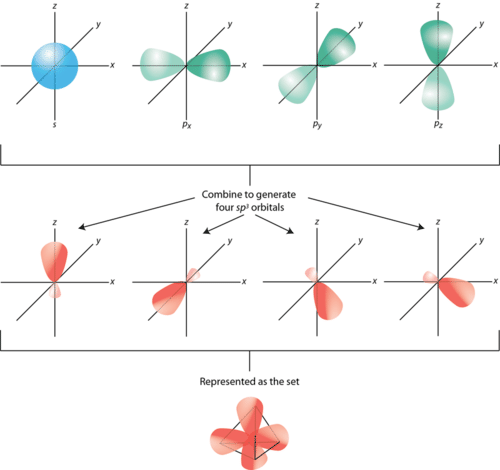

The large lobe from each of the _sp_3__ hybrid orbitals then overlaps with normal unhybridized 1_s_ orbitals on each hydrogen atom to form the tetrahedral methane molecule.

Another example of _sp_3__ hybridization occurs in the ammonia (NH3) molecule. The electron domain geometry of ammonia is also tetrahedral, meaning that there are four groups of electrons around the central nitrogen atom. Unlike methane, however, one of those electron groups is a lone pair. The resulting molecular geometry is trigonal pyramidal. Just as in the carbon atom, the hybridization process starts as a promotion of a 2_s_ electron to a 2_p_ orbital, followed by hybridization to form a set of four _sp_3__ hybrids. In this case, one of the hybrid orbitals already contains a pair of electrons, leaving only three half-filled orbitals available to form covalent bonds with three hydrogen atoms.

 atom. Of the four groups of electrons surrounding the nitrogen atom, three form single covalent bonds to hydrogen atoms, while one group is a lone pair.")

The methane and ammonia examples illustrate the connection between orbital hybridization and the VSEPR model. The electron domain geometry predicted by VSEPR leads directly to the type of hybrid orbitals that must be formed to accommodate that geometry. Both methane and ammonia have tetrahedral electron domain geometries and, thus, both undergo _sp_3__ hybridization.

Likewise, the bent-shaped water molecule (H2O) also involves the formation of _sp_3__ hybrids on the oxygen atom. In this case, however, there are two hybrid orbitals which have lone pairs and two which bond to the hydrogen atoms. Because the electron domain geometry for H2O is tetrahedral, the hybridization is _sp_3__.

### _sp_2__ Hybridization

Boron trifluoride (BF3) is predicted to have a trigonal planar geometry by VSEPR. First, a paired 2_s_ electron is promoted to an empty 2_p_ orbital.

). The angle between any two of the hybrid orbital lobes is 120°. Each can bond with a 2_p_ orbital from a fluorine atom to form the trigonal planar BF3 molecule.")

 to form a set of three _sp2_ hybrid orbitals. Each large lobe of the hybrid orbitals points to one corner of a triangle.")

Other molecules with a trigonal planar electron domain geometry also form _sp_2__ hybrid orbitals. For example, the electron domain geometry of ozone (O3) is trigonal planar, although the presence of a lone pair on the central oxygen atom makes the molecular geometry bent. The hybridization of the central O atom of ozone is _sp_2__.

### _sp_ Hybridization

A beryllium hydride (BeH2) molecule is predicted to be linear by VSEPR. The beryllium atom contains only paired electrons, so it must also undergo hybridization. One of the 2_s_ electrons is first promoted to an empty 2_p_ orbital.

 do not hybridize and remain unoccupied.")

). Each can bond with a 1_s_ orbital from a hydrogen atom to form the linear BeH2 molecule.")

, to form a set of two _sp_ hybrids. The two lobes of the _sp_ hybrids point in opposite directions to produce a linear molecule.")

Other molecules whose electron domain geometry is linear and for whom hybridization is necessary also form _sp_ hybrid orbitals. Examples include CO2 and C2H2, which will be discussed further in the section on hybridization and multiple bonds.

### Hybridization of _s_, _p_, and _d_ orbitals

Elements in the third period and beyond are capable of expanding their octet to form molecules with either trigonal bipyramidal or octahedral electron domain geometries. In order to accomplish this, the previously unoccupied orbitals in the _d_ sublevel of the central atom are involved in the hybridization process.

For phosphorus pentachloride (PCl5), the electron domain and molecular geometries are trigonal bipyramidal. The electron promotion is from the 3_s_ orbital to an empty 3_d_ orbital.

 also display the same hybridization.")

Sulfur hexafluoride (SF6) has an octahedral electron domain and molecular geometry. In this case, a 3_s_ and a 3_p_ electron are each promoted to two empty 3_d_ orbitals.

 also exhibit this type of hybridization. The figure below (**Figure** [below](#x-ck12-SW50Q2gtMDktNzgtVHJpZ29uYWwtQmlweXJhbWlkYWwtT2N0YWhlZHJhbA..)) shows the shape and orientation of the _sp_3_d_ and _sp_3_d_2__ hybrid orbital sets.")

The process of hybridization can be summarized by the following steps:

1.  Draw the Lewis electron-dot structure of the molecule.
2.  Use VSEPR theory to predict both the electron domain geometry and the molecular geometry of the molecule.
3.  Match the electron domain geometry to the appropriate hybridization of the central atom.

Summarized below (**Table** [below](#x-ck12-dGFibGU6VGFibGUtOS43)) are all of the possibilities along with examples of each.

---

&nbsp;

|     |     |     |     |     |
| --- | --- | --- | --- | --- |Summary of Hybrid Orbitals
| Electron Domain Geometry | Hybridization of the Central Atom | Number of Hybrid Orbitals | Possible Molecular Geometries | Examples |
| --- | --- | --- | --- | --- |
| Linear | _sp_ | 2   | linear | BeH2, CO2 |
| Trigonal Planar | _sp_2__ | 3   | trigonal planar, bent | BF3, CO3_2−_, O3 |
| Tetrahedral | _sp_3__ | 4   | tetrahedral, trigonal pyramidal, bent | CH4, NH3, H2O |
| Trigonal Bipyramidal | _sp_3_d_ | 5   | trigonal bipyramidal, seesaw, T-shaped, linear | PCl5, SF4, ClF3, I3_−_ |
| Octahedral | _sp_3_d_2__ | 6   | octahedral, square pyramidal, square planar | SF6, BrF5, XeF4 |

Hybridization in Molecules with Double or Triple Bonds
------------------------------------------------------

The hybridization model helps explain molecules with double or triple bonds. Consider the ethene molecule (C2H4). In the lesson, “Lewis Electron Dot Structures,” we saw that C2H4 contains a double covalent bond between the two carbon atoms and single bonds between the carbon atoms and the hydrogen atoms. The entire molecule is planar.

), the electron domain geometry around each carbon atom is trigonal planar, which corresponds to _sp_2__ hybridization. Previously, we saw carbon undergo _sp_3__ hybridization in a CH4 molecule, so how does it work in this case? As seen below, the electron promotion is the same, but the hybridization occurs only between the single _s_ orbital and two of the three _p_ orbitals. Thus generates a set of three _sp_2__ hybrids along with an unhybridized 2_pz_ orbital. Each orbital contains one electron and is capable of forming a covalent bond.")

It is necessary to distinguish between the two types of covalent bonds in a C2H4 molecule. A **sigma bond (σ bond)** _is a bond formed by the overlap of orbitals in an end-to-end fashion, with the electron density concentrated between the nuclei of the bonding atoms_. A **pi bond (π bond)** _is a bond formed by the overlap of orbitals in a side-by-side fashion, with the electron density concentrated above and below the plane of the nuclei of the bonding atoms_. Pictured below (**Figure** [below](#x-ck12-SW50Q2gtMDktODEtQzJINC1TaWdtYS1QaQ..)) are the two types of bonding in C2H4. The _sp_2__ hybrid orbitals are orange and the _pz_ orbital is green. Three sigma bonds are formed by each carbon atom with its hybrid orbitals. The pi bond is the “second” bond of the double bond between the carbon atoms and is shown as an elongated blue lobe that extends both above and below the plane of the molecule, which contains the six atoms and all of the sigma bonds.

In a conventional Lewis electron-dot structure, a double bond is shown as two lines between the atoms, as in C=C. It is important to realize, however, that the two bonds are different; one is a sigma bond, while the other is a pi bond.

Ethyne (C2H2) is a linear molecule with a triple bond between the two carbon atoms. Since each carbon atom is bonded to two other atoms and has no lone pairs, the hybridization of each carbon is _sp_.

); one pi bond is above and below the line of the molecule, while the other is in front of and behind the page.")

In general, single bonds between atoms are always sigma bonds. Double bonds are comprised of one sigma and one pi bond. Triple bonds are comprised of one sigma bond and two pi bonds.

Lesson Summary
--------------

* Valence bond theory describes the formation of covalent bonds in terms of the overlap of singly occupied atomic orbitals.
* The hybridization of nonequivalent atomic orbitals is necessary to correctly predict the bonding and molecular geometries of many molecules. Hybrid orbitals form on the central atom and can either be _sp_, _sp_2__, _sp_3__, _sp_3_d_, or _sp_3_d_2__. The type of hybrid orbitals that are used is dictated by the electron domain geometry.
* Sigma bonds are formed by the end-to-end overlap of bonding orbitals. Pi bonds are formed by the side-to-side overlap of _p_ orbitals. Single bonds are normally sigma bonds. A double or triple bond consists of one sigma bond and either one or two pi bonds.

Lesson Review Questions
-----------------------

### Reviewing Concepts

1.  How does valence bond theory describe covalent bonding?
2.  What is meant by hybridization of atomic orbitals?
3.  Indicate the hybridizations associated with each of the following electron domain geometries:
    1.  linear
    2.  tetrahedral
    3.  octahedral
    4.  trigonal planar
    5.  trigonal bipyramidal
4.  Can two 2_p_ orbitals of an atom hybridize to give two hybridized orbitals? Explain.
5.  What are the bond angles between two orbitals of each hybrid?
    1.  _sp_2__
    2.  _sp_3_d_2__
    3.  _sp_
    4.  _sp_3__
6.  What is the difference between a sigma bond and a pi bond?

### Problems

7.  Describe the bonding that occurs in each of the following diatomic molecules according to valence bond theory, including which atomic orbitals overlap.
    1.  Br2
    2.  H2S
    3.  N2
8.  Given the following structure: 
    
    \[Figure 24\]
    
    1.  Indicate the hybridization of each of the five carbon atoms.
    2.  How many total sigma bonds and pi bonds are there in the molecule?
9.  State the electron domain geometry and hybridization of the central atom in each of the following molecules. Then, give the molecular geometry of each.
    1.  CS2
    2.  PCl3
    3.  COCl2
    4.  SeF4
    5.  ICl4_−_
    6.  KrF2
    7.  XeOF4
    8.  SO2
    9.  OF2

Further Reading / Supplemental Links
------------------------------------

* Hybridization (http://www.kentchemistry.com/links/bonding/hybridization.htm)
* Sigma and Pi Bonds (http://www.kentchemistry.com/links/bonding/sigmapi.htm)

Points to Consider
------------------

In future chapters, we move away from the microscopic world of chemistry and back to a macroscopic view, focusing on the mathematics involved in the analysis of chemical reactions.

* What are different ways to measure the amount of something?
* Since atoms and molecules are so small, how do chemists keep track of the number of them that are taking part in a given reaction?

</article>

## 10.0 The Mole

<article>

</article>

### 10.1 The Mole Concept

<article>

Lesson Objectives
-----------------

* Identify three methods for measuring the amount of matter in a sample.
* Define the mole and its relationship to Avogadro’s number.
* Use Avogadro’s number to convert between moles and the number of representative particles of a substance.
* Relate the atomic mass of an element to its molar mass.
* Calculate the molar mass of a given compound.

Lesson Vocabulary
-----------------

* Avogadro’s number
* formula mass
* molar mass
* mole
* representative particle

Check Your Understanding
------------------------

### Recalling Prior Knowledge

* What is a conversion factor? What is dimensional analysis?
* What is meant by the atomic mass of an element, and in what units are atomic masses expressed?
* How are the structures of molecular compounds and ionic compounds different?

Chemistry is a quantitative science. It is not enough to simply observe chemical reactions and describe what happens. Chemists always need to know how much. How many liters of carbon dioxide gas are going to be produced for every gallon of gasoline that is burned? How many kilograms of the industrial chemical sulfuric acid are produced in a typical year? How many kilograms of sulfur, oxygen, and water are required to manufacture that much sulfuric acid? These types of questions show the quantitative nature of chemistry and chemical reactions.

How Much Matter?
----------------

If you do any baking, you may have a set of canisters in your kitchen that hold large amounts of flour and sugar so that they are easy to access when preparing some cookies or a cake. Think about how much sugar is in one of those canisters. How would you measure it? There are actually multiple answers to this question. One way to measure the amount of sugar in the canister is to find its mass. Another would be to measure its volume. A third way, and a very time consuming one, would be to count all of the individual grains of sugar. The amount of matter can be measured in three basic ways: mass, volume, and number of particles. In order to fully understand and manipulate chemical reactions, chemists must be able to understand these three ways of measuring matter and the interconnections between them.

### Names for Numbers

How many bananas is a dozen bananas (**Figure** [below](#x-ck12-SW50Q2gtMTAtMDEtQmFuYW5hcw..))? How many elephants is a dozen elephants? How many asteroids is a dozen asteroids? For all of these questions, the answer is obviously twelve. There is nothing that we need to know about the bananas or the elephants or the asteroids in order to answer the question. The term dozen is always used to refer to twelve of something; it is a name that is given to an amount. Other amounts are given special names as well. For example, a pair is always two, and a gross of something is a dozen dozens, which would be 144.

We can use a conversion factor and dimensional analysis to convert back and forth between the number of items and the name given to a certain number. For example, if you wanted to know how many bananas there are in 8 dozens, you could perform the following calculation:

______$8 \ \text{dozen bananas} \times \frac{12 \ \text{bananas}}{1 \ \text{dozen bananas}}=96 \ \text{bananas}$__

$8 \ \text{dozen bananas} \times \frac{12 \ \text{bananas}}{1 \ \text{dozen bananas}}=96 \ \text{bananas}$__

__$8 \ \text{dozen bananas} \times \frac{12 \ \text{bananas}}{1 \ \text{dozen bananas}}=96 \ \text{bananas}$__

$8 \ \text{dozen bananas} \times \frac{12 \ \text{bananas}}{1 \ \text{dozen bananas}}=96 \ \text{bananas}$__

____$8 \ \text{dozen bananas} \times \frac{12 \ \text{bananas}}{1 \ \text{dozen bananas}}=96 \ \text{bananas}$__

$8 \ \text{dozen bananas} \times \frac{12 \ \text{bananas}}{1 \ \text{dozen bananas}}=96 \ \text{bananas}$__

__$8 \ \text{dozen bananas} \times \frac{12 \ \text{bananas}}{1 \ \text{dozen bananas}}=96 \ \text{bananas}$__

$8 \ \text{dozen bananas} \times \frac{12 \ \text{bananas}}{1 \ \text{dozen bananas}}=96 \ \text{bananas}$

The conversion factor of 12 items = 1 dozen items is true regardless of the identity of the item. Alternatively, you could find out how many dozens of asteroids are in a collection of 1242 asteroids.

______$1242 \ \text{asteroids} \times \frac{1 \ \text{dozen asteroids}}{12 \ \text{asteroids}}=103.5 \ \text{dozen asteroids}$__

$1242 \ \text{asteroids} \times \frac{1 \ \text{dozen asteroids}}{12 \ \text{asteroids}}=103.5 \ \text{dozen asteroids}$__

__$1242 \ \text{asteroids} \times \frac{1 \ \text{dozen asteroids}}{12 \ \text{asteroids}}=103.5 \ \text{dozen asteroids}$__

$1242 \ \text{asteroids} \times \frac{1 \ \text{dozen asteroids}}{12 \ \text{asteroids}}=103.5 \ \text{dozen asteroids}$__

____$1242 \ \text{asteroids} \times \frac{1 \ \text{dozen asteroids}}{12 \ \text{asteroids}}=103.5 \ \text{dozen asteroids}$__

$1242 \ \text{asteroids} \times \frac{1 \ \text{dozen asteroids}}{12 \ \text{asteroids}}=103.5 \ \text{dozen asteroids}$__

__$1242 \ \text{asteroids} \times \frac{1 \ \text{dozen asteroids}}{12 \ \text{asteroids}}=103.5 \ \text{dozen asteroids}$__

$1242 \ \text{asteroids} \times \frac{1 \ \text{dozen asteroids}}{12 \ \text{asteroids}}=103.5 \ \text{dozen asteroids}$

The conversion factor is simply inverted in this case so that the units cancel correctly.

Conversion factors can also be used to relate the amount of something to its mass. Suppose that you have a small bunch of bananas consisting of five bananas. You place them on a balance and find that the five bananas have a mass of 850 g. Assuming each banana has the same mass, what would be the mass of 3 dozen bananas? We can employ two conversion factors to find the answer.

______$3 \ \text{dozen bananas} \times \frac{12 \ \text{bananas}}{1 \ \text{dozen bananas}} \times \frac{850 \ \text{g}}{5 \ \text{bananas}}= 6120 \ \text{g}= 6100 \ \text{g}$__

$3 \ \text{dozen bananas} \times \frac{12 \ \text{bananas}}{1 \ \text{dozen bananas}} \times \frac{850 \ \text{g}}{5 \ \text{bananas}}= 6120 \ \text{g}= 6100 \ \text{g}$__

__$3 \ \text{dozen bananas} \times \frac{12 \ \text{bananas}}{1 \ \text{dozen bananas}} \times \frac{850 \ \text{g}}{5 \ \text{bananas}}= 6120 \ \text{g}= 6100 \ \text{g}$__

$3 \ \text{dozen bananas} \times \frac{12 \ \text{bananas}}{1 \ \text{dozen bananas}} \times \frac{850 \ \text{g}}{5 \ \text{bananas}}= 6120 \ \text{g}= 6100 \ \text{g}$__

____$3 \ \text{dozen bananas} \times \frac{12 \ \text{bananas}}{1 \ \text{dozen bananas}} \times \frac{850 \ \text{g}}{5 \ \text{bananas}}= 6120 \ \text{g}= 6100 \ \text{g}$__

$3 \ \text{dozen bananas} \times \frac{12 \ \text{bananas}}{1 \ \text{dozen bananas}} \times \frac{850 \ \text{g}}{5 \ \text{bananas}}= 6120 \ \text{g}= 6100 \ \text{g}$__

__$3 \ \text{dozen bananas} \times \frac{12 \ \text{bananas}}{1 \ \text{dozen bananas}} \times \frac{850 \ \text{g}}{5 \ \text{bananas}}= 6120 \ \text{g}= 6100 \ \text{g}$__

$3 \ \text{dozen bananas} \times \frac{12 \ \text{bananas}}{1 \ \text{dozen bananas}} \times \frac{850 \ \text{g}}{5 \ \text{bananas}}= 6120 \ \text{g}= 6100 \ \text{g}$

By knowing the mass of five bananas, we now have a relationship that we can use to convert between mass and number of bananas for any number or any mass. Note that because 850 g was a measured quantity with two significant figures, the result was also rounded to two significant figures. The amounts 5 and 12 are found by counting, so they are exact quantities and have unlimited significant figures.

The Mole and Avogadro’s Number
------------------------------

It certainly is easy to count bananas or to count elephants (as long as you stay out of their way). However, you would be counting grains of sugar from your sugar canister for a long, long time. Recall from the chapter, _Atomic Structure_ that atoms and molecules are extremely small—far, far smaller than grains of sugar. Counting atoms or molecules is not only unwise, it is absolutely impossible. One drop of water contains about 10_22_ molecules of water. If you counted 10 molecules every second for 50 years without stopping, you would have counted only 1.6 × 10_10_ molecules. At that rate, it would take you over 30 trillion years to count the water molecules in one tiny drop!

Chemists needed a name that can stand for a very large number of items. Amedeo Avogadro (1776-1856), an Italian scientist (**Figure** [below](#x-ck12-SW50Q2gtMTAtMDItQXZvZ2Fkcm8.)), provided just such a number. He is responsible for the counting unit of measure called the mole (**Figure** [below](#x-ck12-SW50Q2gtMTAtMDMtTW9sZS1hbmQtTW9sZS1kYXk.)). A **mole** (mol) _is the amount of a substance that contains 6.02 × 10_23_ representative particles of that substance. The mole is the SI unit for amount of a substance_. Just like the dozen and the gross, it is a name that stands for a number. There are therefore 6.02 × 10_23_ water molecules in a mole of water molecules. There also would be 6.02 × 10_23_ bananas in a mole of bananas, if such a huge number of bananas ever existed.

The number 6.02 × 10_23_ is called **Avogadro’s number**, _the number of representative particles in a mole_. It is an experimentally determined number. A **representative particle** _is the smallest unit in which a substance naturally exists_. For the majority of pure elements, the representative particle is the atom. Samples of pure iron, carbon, and helium consist of individual iron atoms, carbon atoms, and helium atoms, respectively. Seven elements exist in nature as diatomic molecules (H2, N2, O2, F2, Cl2, Br2, and I2), so the representative particle for these elements is the molecule. Likewise, all molecular compounds, such as H2O and CO2, exist as molecules, so the molecule is their representative particle as well. For ionic compounds such as NaCl and Ca(NO3)2, the representative particle is the formula unit. A mole of any substance contains Avogadro’s number (6.02 × 10_23_) of representative particles.

 is very different than the counting unit of the mole. Chemists nonetheless have adopted the mole as their unofficial mascot (_right_). National Mole Day is a celebration of chemistry that occurs on October 23rd (10/23) of each year.")

You can watch a video lecture about moles (the unit) by going to http://www.youtube.com/watch?v=AsqEkF7hcII.

!?[video](https://www.youtube.com/watch?v=AsqEkF7hcII)

Watch a video that shows an experimental calculation of Avogadro's Number: http://www.youtube.com/watch?vp9QYJqFq5s.

!?[video](https://www.youtube.com/watch?v=vp9QYJqFq5s)

Video experiment questions:

1.  Briefly describe this experiment.
2.  Write the calculations shown in this experiment.
3.  What was the experimental result?
4.  What was the percent error?

### Conversions Between Moles and Number of Particles

Just as we did with dozens of bananas, we can use the number of items in a mole to convert back and forth between a number of particles and moles of those particles.

**Sample Problem 10.1: Converting a Number of Particles to Moles**

The element, carbon exists in two primary forms: graphite and diamond. How many moles of carbon atoms are in a sample containing 4.72 × 10_24_ atoms of carbon?

_Step 1: List the known quantities and plan the problem._

Known

* number of C atoms = 4.72 × 10_24_
* 1 mole = 6.02 × 10_23_

Unknown

* 4.72 × 10_24_ C atoms = ? mol C

One conversion factor will allow us to convert from the number of C atoms to moles of C atoms.

_Step 2: Calculate_.

______$4.72 \times 10^{24} \ \text{atoms C} \times \frac{1 \ \text{mol C}}{6.02 \times 10^{23} \ \text{atoms C}} = 7.84 \ \text{mol C}$__

$4.72 \times 10^{24} \ \text{atoms C} \times \frac{1 \ \text{mol C}}{6.02 \times 10^{23} \ \text{atoms C}} = 7.84 \ \text{mol C}$__

__$4.72 \times 10^{24} \ \text{atoms C} \times \frac{1 \ \text{mol C}}{6.02 \times 10^{23} \ \text{atoms C}} = 7.84 \ \text{mol C}$__

$4.72 \times 10^{24} \ \text{atoms C} \times \frac{1 \ \text{mol C}}{6.02 \times 10^{23} \ \text{atoms C}} = 7.84 \ \text{mol C}$__

____$4.72 \times 10^{24} \ \text{atoms C} \times \frac{1 \ \text{mol C}}{6.02 \times 10^{23} \ \text{atoms C}} = 7.84 \ \text{mol C}$__

$4.72 \times 10^{24} \ \text{atoms C} \times \frac{1 \ \text{mol C}}{6.02 \times 10^{23} \ \text{atoms C}} = 7.84 \ \text{mol C}$__

__$4.72 \times 10^{24} \ \text{atoms C} \times \frac{1 \ \text{mol C}}{6.02 \times 10^{23} \ \text{atoms C}} = 7.84 \ \text{mol C}$__

$4.72 \times 10^{24} \ \text{atoms C} \times \frac{1 \ \text{mol C}}{6.02 \times 10^{23} \ \text{atoms C}} = 7.84 \ \text{mol C}$

_Step 3: Think about your result_.

The given number of carbon atoms was greater than Avogadro’s number, so the number of moles of C atoms is greater than 1 mole. Since our starting value is reported to three significant figures, the result of the calculation is also rounded to three significant figures.

**_Practice Problems_**

1.  Convert the given number of particles to moles.
    1.  3.65 × 10_22_ molecules of H2O
    2.  9.18 × 10_23_ formula units of KCl
2.  Convert the given number of moles to the number of representative particles.
    1.  1.25 mol Zn atoms
    2.  0.061 mol CH4 molecules

Suppose that you wanted to know how many hydrogen atoms were in a mole of water molecules. First, you would need to know the chemical formula for water, which is H2O. There are two atoms of hydrogen in each molecule of water. How many atoms of hydrogen would there be in two water molecules? There would be 2 × 2 = 4 hydrogen atoms (**Figure** [below](#x-ck12-SW50Q2gtMTAtMDQtV2F0ZXItbW9sZWN1bGVz)). How about in a dozen? Since a dozen is 12, there would be 12 × 2 = 24 hydrogen atoms in a dozen water molecules. To get the answers, (4 and 24) you had to multiply the given number of molecules by two atoms of hydrogen per molecule. Similarly, to find the number of hydrogen atoms in a mole of water molecules, the problem could be solved using conversion factors.

$1 \ \text{mol H}_2\text{O} \times \frac{6.02 \times 10^{23} \ \text{molecules H}_2\text{O}}{1 \ \text{mol H}_2\text{O}} \times \frac{2 \ \text{atoms H}}{1 \ \text{molecule H}_2\text{O}} = 1.20 \times 10^{24} \ \text{atoms H}$

The first conversion factor converts from moles of particles to the number of particles. The second conversion factor reflects the number of atoms contained within each molecule.

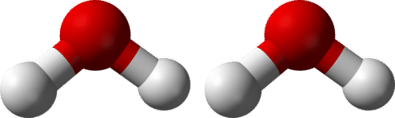

**Sample Problem 10.2: Atoms, Molecules, and Moles**

Sulfuric acid has the chemical formula H2SO4. A certain quantity of sulfuric acid contains 4.89 × 10_25_ atoms of oxygen. How many moles of sulfuric acid are in the sample?

_Step 1: List the known quantities and plan the problem._

Known

* number of O atoms in the sample = 4.89 × 10_25_
* 1 mol H2SO4 = 6.02 × 10_23_ molecules H2SO4

Unknown

* mol of H2SO4 molecules in the sample

Two conversion factors will be used. First, convert atoms of oxygen to molecules of sulfuric acid. Then, convert molecules of sulfuric acid to moles of sulfuric acid.

_Step 2: Calculate_.

$4.89 \times 10^{25} \ \text{atoms O} \times \frac{1 \ \text{molecule H}_2\text{SO}_4}{4 \ \text{atoms O}} \times \frac{1 \ \text{mol H}_2\text{SO}_4}{6.02 \times 10^{23} \ \text{molecules H}_2\text{SO}_4} = 20.3 \ \text{mol H}_2\text{SO}_4$

_Step 3: Think about your result._

The original number of oxygen atoms was about 80 times larger than Avogadro’s number. Since each sulfuric acid molecule contains 4 oxygen atoms, there are about 20 moles of sulfuric acid molecules.

**_Practice Problems_**

3.  How many atoms of carbon are in 0.750 moles of propane, which has a chemical formula of C3H8?
4.  The chemical formula of glucose is C6H12O6. How many moles of glucose are present in a sample that contains 2.46 × 10_24_ atoms of hydrogen?

Molar Mass
----------

Because we are not able to count individual atoms, it is important to have a way to convert between amounts, which are expressed in moles, and a unit of quantity that we can more easily measure, such as mass. We begin by looking at the periodic table, which tells us the relative masses of various elements.

### Molar Masses of Elements

As you learned previously, the atomic masses found on the periodic table are in atomic mass units. For example, one atom of the most abundant isotope of hydrogen has a mass of approximately 1 amu, and one atom of helium has a mass of about 4 amu. Atomic masses are relative masses; they are based on the definition that one amu is equal to 1/12_th_ of the mass of a single atom of carbon-12. Therefore, one atom of carbon-12 has a mass of 12 amu, which is three times heavier than an atom of helium. This ratio would hold for any number of carbon and helium atoms. One hundred carbon-12 atoms would have three times the mass of one hundred helium atoms. By extension, 12.00 g of carbon-12 would contain the same number of atoms as 4.00 g of helium.

The relative scale of atomic masses in amu is also a relative scale of masses in grams. An alternative definition of the mole is that it is the amount of a substance that contains as many representative particles as the number of atoms in exactly 12 g of carbon-12. In other words, exactly 12 g of carbon-12 contains one mole, or 6.02 × 10_23_ atoms of carbon-12. Likewise, 4.00 g of helium also contains one mole, or 6.02 × 10_23_ atoms of helium. _The atomic mass of an element, expressed in grams, is the mass of one mole of that element_. **Molar mass** _is defined as the mass of one mole of representative particles of a substance_. By looking at the periodic table, we can see that the molar mass of lithium is 6.94, the molar mass of zinc is 65.38, and the molar mass of gold is 196.97. Each of these quantities contains 6.02 × 10_23_ atoms of that particular element. The units for molar mass are grams per mole (g/mol). For example, the molar mass of zinc is 65.38 g/mol.

Recall that the atomic masses on the periodic table are generally not whole numbers because each atomic mass is a weighted average of all the naturally occurring isotopes of that element. Since any usable quantity of an element contains a very, very large number of atoms, those weighted averages in grams can be used as the molar mass of the element. For our purposes, we will use the molar masses rounded to the hundredths place (two digits after the decimal point).

### Molar Masses of Compounds

The molecular formula of carbon dioxide is CO2. One molecule of carbon dioxide consists of 1 atom of carbon and 2 atoms of oxygen. We can calculate the mass of one molecule of carbon dioxide by adding together the masses of 1 atom of carbon and 2 atoms of oxygen.

______12.01 amu + 2(16.00 amu) = 44.01 amu__

12.01 amu + 2(16.00 amu) = 44.01 amu__

__12.01 amu + 2(16.00 amu) = 44.01 amu__

12.01 amu + 2(16.00 amu) = 44.01 amu__

____12.01 amu + 2(16.00 amu) = 44.01 amu__

12.01 amu + 2(16.00 amu) = 44.01 amu__

__12.01 amu + 2(16.00 amu) = 44.01 amu__

12.01 amu + 2(16.00 amu) = 44.01 amu

The molecular mass of a compound is the mass of one molecule of that compound. The molecular mass of carbon dioxide is 44.01 amu.

Recall that ionic compounds do not exist as discrete molecules, but rather as an extended three-dimensional network of ions called a crystal lattice. The empirical formula of an ionic compound tells us the ratio of the ions in the crystal. The mass of one formula unit of an ionic compound is called the formula mass. The formula mass of sodium sulfide, Na2S, can be calculated as follows:

______2(22.99 amu) + 32.06 amu = 78.04 amu__

2(22.99 amu) + 32.06 amu = 78.04 amu__

__2(22.99 amu) + 32.06 amu = 78.04 amu__

2(22.99 amu) + 32.06 amu = 78.04 amu__

____2(22.99 amu) + 32.06 amu = 78.04 amu__

2(22.99 amu) + 32.06 amu = 78.04 amu__

__2(22.99 amu) + 32.06 amu = 78.04 amu__

2(22.99 amu) + 32.06 amu = 78.04 amu

The **formula mass** _is the sum of the masses of all the atoms represented in a chemical formula_. The term formula mass is applicable to molecular compounds, ionic compounds, or ions.

The molar mass of any compound is the mass in grams of one mole of that compound. One mole of carbon dioxide molecules has a mass of 44.01 g, while one mole of sodium sulfide formula units has a mass of 78.04 g. Their molar masses are 44.01 g/mol and 78.04 g/mol, respectively. In both cases, that is the mass of 6.02 × 10_23_ representative particles. The representative particle of CO2 is the molecule, while for Na2S, it is the formula unit.

**Sample Problem 10.3: Molar Mass of a Compound**

Calcium nitrate, Ca(NO3)2, is used as a component in fertilizer. Determine the molar mass of calcium nitrate.

_Step 1: List the known and unknown quantities and plan the problem._

Known

* formula = Ca(NO3)2
* molar mass of Ca = 40.08 g/mol
* molar mass of N = 14.01 g/mol
* molar mass of O = 16.00 g/mol

Unknown

* molar mass of Ca(NO3)2

First, we need to analyze the formula. Since Ca lacks a subscript, there is one Ca atom per formula unit. The 2 outside the parentheses means that there are two nitrate ions per formula unit, and each nitrate ion consists of one nitrogen atom and three oxygen atoms. Therefore, there are a total of 1 × 2 = 2 nitrogen atoms and 3 × 2 = 6 oxygen atoms per formula unit. Thus, 1 mol of calcium nitrate contains 1 mol of Ca atoms, 2 mol of N atoms, and 6 mol of O atoms.

_Step 2: Calculate_.

Use the molar mass of each atom together with the quantity of each atom in the formula to find the total molar mass.

$$
\begin{align*}
& 1 \ \text{mol Ca} \times \frac{40.08 \ \text{g Ca}}{1 \ \text{mol Ca}}=40.08 \ \text{g Ca} \\
& 2 \ \text{mol N} \times \frac{14.01 \ \text{g N}}{1 \ \text{mol N}}=28.02 \ \text{g N} \\
& 6 \ \text{mol O} \times \frac{16.00 \ \text{g O}}{1 \ \text{mol O}}=96.00 \ \text{g O}
\end{align*}
$$

molar mass of Ca(NO3)2 = 40.08 g + 28.02 g + 96.00 g = 164.10 g/mol

**Step 3: Think about your result.**

The molar mass is the mass in grams of 1 mol of calcium nitrate. It is expressed to the hundredths place because the numbers being added together are expressed to the hundredths place.

**_Practice Problem_**

5.  Calculate the molar masses of the following compounds.
    1.  C2H6
    2.  (NH4)2SO4

Lesson Summary
--------------

* The amount of matter in a given sample can be measured by its mass, volume, or the number of particles.
* A mole of any substance contains Avogadro’s number (6.02 × 10_23_) representative particles of the substance. A representative particle can be an atom, an ion, a molecule, or a formula unit.
* The molar mass of an element is its atomic mass expressed in grams and is equal to the mass of one mole of atoms of that element.
* The molar mass of a compound is the mass of one mole of representative particles of the compound. Molar mass is calculated by multiplying the molar mass of each element in the compound by the number of atoms of that element present in one formula unit and adding the resulting values together.

Lesson Review Questions
-----------------------

### Reviewing Concepts

1.  What is Avogadro’s number and what does it represent?
2.  What is the representative particle for each of the following substances?
    1.  barium chloride
    2.  silicon
    3.  nitrogen gas
    4.  water
3.  How many oxygen atoms are there in a representative particle of each of the following substances?
    1.  KClO4
    2.  CH3COOH
    3.  Al(NO3)3
4.  What is wrong with the following statements?
    1.  A mole of any substance contains the same number of atoms.
    2.  One mole of water contains Avogadro’s number of atoms.
5.  If the atomic mass of a certain element is 69.72 amu, what is its molar mass?

### Problems

6.  Calculate the number of representative particles in each of the following.
    1.  0.0391 mol Ne
    2.  3.72 mol NH3
    3.  8.00 mol CaF2
    4.  1.35 × 10_−4_ mol Pb_2+_
7.  Calculate the number of moles represented by each of the following quantities.
    1.  3.11 × 10_24_ molecules of NO2
    2.  8.06 × 10_21_ atoms of Pt
8.  How many iodine atoms are in 2.45 mol of BaI2?
9.  Calculate the molar masses of the following substances.
    1.  PCl3
    2.  BaCO3
    3.  Fe2(SO4)3
    4.  Pb(CH3COO)2
10. 3.50 moles of a certain compound contains 1.05 × 10_25_ carbon atoms. How many carbon atoms are in the formula of this compound?

Further Reading / Supplemental Links
------------------------------------

* Kieffer, W.F., _Mole Concept in Chemistry_, Van Nostrand Reinhold Company, 1973.
* National Mole Day Foundation, INC., (http://www.moleday.org/)
* Molar Mass Calculator, (http://www.webpc.org/mmcalc.php)

Points to Consider
------------------

The molar mass of a compound can be used to convert between the mass of a substance (in grams) and its amount (in moles).

* What would the conversion factors for these calculations look like?
* Is there a way to convert between moles and the volume of a substance?

</article>

### 10.2 Mass, Volume, and the Mole

<article>

Lesson Objectives
-----------------

* Use molar mass to make conversions between mass and moles of a substance.
* Explain Avogadro’s hypothesis and how it relates to the volume of a gas at standard temperature and pressure.
* Convert between moles and volume of a gas at STP.
* Calculate the density of gases at STP.
* Use the mole road map to make two-step conversions between mass, number of particles, and gas volume.

Lesson Vocabulary
-----------------

* Avogadro’s hypothesis
* molar volume
* standard temperature and pressure (STP)

Check Your Understanding
------------------------

### Recalling Prior Knowledge

* What is a mole? How is the mole related to the number of particles in a sample of matter?
* What is the molar mass of a substance and how is it calculated?

Chemistry is about the study of chemical reactions. Quantitatively, chemicals react with one another in very specific ratios based upon the number of reacting particles. A more in depth study of chemical reactions requires the ability to make conversions between mass, volume, and moles.

Mole-Mass Relationship
----------------------

You now know that the molar mass of any substance is the mass in grams of one mole of representative particles of that substance. The representative particles can be atoms, molecules, or formula units of ionic compounds. This relationship is frequently used to make calculations in the laboratory. Suppose that you need 3.00 moles of calcium chloride (CaCl2) for a certain experiment. Since calcium chloride is a solid (**Figure** [below](#x-ck12-SW50Q2gtMTAtMDYtQ2FDbDI.)), it would be convenient to measure out this amount by using a balance, but, to do so, you would need to know what mass of CaCl2 is equivalent to 3.00 moles. The molar mass of CaCl2 is 110.98 g/mol, so a conversion factor can be constructed based on the fact that 1 mol CaCl2 = 110.98 g CaCl2. Dimensional analysis will then allow you to calculate the mass of CaCl2 that you should use.

______$3.00 \ \text{mol CaCl}_2 \times \frac{110.98 \ \text{g CaCl}_2}{1 \ \text{mol CaCl}_2} = 333 \ \text{g CaCl}_2$__

$3.00 \ \text{mol CaCl}_2 \times \frac{110.98 \ \text{g CaCl}_2}{1 \ \text{mol CaCl}_2} = 333 \ \text{g CaCl}_2$__

__$3.00 \ \text{mol CaCl}_2 \times \frac{110.98 \ \text{g CaCl}_2}{1 \ \text{mol CaCl}_2} = 333 \ \text{g CaCl}_2$__

$3.00 \ \text{mol CaCl}_2 \times \frac{110.98 \ \text{g CaCl}_2}{1 \ \text{mol CaCl}_2} = 333 \ \text{g CaCl}_2$__

____$3.00 \ \text{mol CaCl}_2 \times \frac{110.98 \ \text{g CaCl}_2}{1 \ \text{mol CaCl}_2} = 333 \ \text{g CaCl}_2$__

$3.00 \ \text{mol CaCl}_2 \times \frac{110.98 \ \text{g CaCl}_2}{1 \ \text{mol CaCl}_2} = 333 \ \text{g CaCl}_2$__

__$3.00 \ \text{mol CaCl}_2 \times \frac{110.98 \ \text{g CaCl}_2}{1 \ \text{mol CaCl}_2} = 333 \ \text{g CaCl}_2$__

$3.00 \ \text{mol CaCl}_2 \times \frac{110.98 \ \text{g CaCl}_2}{1 \ \text{mol CaCl}_2} = 333 \ \text{g CaCl}_2$

When you measure out 333 g of CaCl2, the resulting sample will contain 3.00 moles of CaCl2.

**Sample Problem 10.4: Converting Moles to Mass**

Chromium metal is used for decorative electroplating of car bumpers and other surfaces. Find the mass of 0.560 moles of chromium.

_Step 1: List the known quantities and plan the problem._

Known

* 0.560 mol Cr
* molar mass of Cr = 52.00 g/mol

Unknown

* 0.560 mol Cr = ? g

The molar mass of chromium will allow us to convert from moles of Cr to grams.

_Step 2: Calculate_.

______$0.560 \ \text{mol Cr} \times \frac{52.00 \ \text{g Cr}}{1 \ \text{mol Cr}} = 29.1 \ \text{g Cr}$__

$0.560 \ \text{mol Cr} \times \frac{52.00 \ \text{g Cr}}{1 \ \text{mol Cr}} = 29.1 \ \text{g Cr}$__

__$0.560 \ \text{mol Cr} \times \frac{52.00 \ \text{g Cr}}{1 \ \text{mol Cr}} = 29.1 \ \text{g Cr}$__

$0.560 \ \text{mol Cr} \times \frac{52.00 \ \text{g Cr}}{1 \ \text{mol Cr}} = 29.1 \ \text{g Cr}$__

____$0.560 \ \text{mol Cr} \times \frac{52.00 \ \text{g Cr}}{1 \ \text{mol Cr}} = 29.1 \ \text{g Cr}$__

$0.560 \ \text{mol Cr} \times \frac{52.00 \ \text{g Cr}}{1 \ \text{mol Cr}} = 29.1 \ \text{g Cr}$__

__$0.560 \ \text{mol Cr} \times \frac{52.00 \ \text{g Cr}}{1 \ \text{mol Cr}} = 29.1 \ \text{g Cr}$__

$0.560 \ \text{mol Cr} \times \frac{52.00 \ \text{g Cr}}{1 \ \text{mol Cr}} = 29.1 \ \text{g Cr}$

_Step 3: Think about your result._

Since the desired amount was slightly more than one half of a mole, the mass should be slightly more than one half of the molar mass. The answer has three significant figures because the given value (0.560 mol) also has three significant figures.

**_Practice Problem_**

1.  Find the masses of the following amounts.
    1.  2.15 mol of hydrogen sulfide, H2S
    2.  3.95 × 10_−3_ mol of lead(II) iodide, PbI2

A similar conversion factor based on molar mass can be used to convert the mass of a known substance to moles. In a laboratory situation, you might perform a reaction and produce a certain amount of a product. It will often be necessary to then determine the number of moles of the product that was formed, but this cannot be measured directly. However, you can use a balance to measure the mass of the product, and the number of moles can be easily calculated. The next Sample Problem illustrates this situation.

**Sample Problem 10.5: Converting Mass to Moles**

A certain reaction produces 2.81 g of copper(II) hydroxide, Cu(OH)2. Determine the number of moles produced in the reaction.

_Step 1: List the known quantities and plan the problem._

Known

* mass of Cu(OH)2 produced = 2.81 g

Unknown

* amount of Cu(OH)2 produced in moles

One conversion factor will allow us to convert from mass to moles.

_Step 2: Calculate_.

First, it is necessary to calculate the molar mass of Cu(OH)2 from the molar masses of Cu, O, and H. The molar mass is 97.57 g/mol.

______$2.81 \ \text{g Cu(OH)}_2 \times \frac{1 \ \text{mol Cu(OH)}_2}{97.57 \ \text{g Cu(OH)}_2} = 0.0288 \ \text{mol Cu(OH)}_2$__

$2.81 \ \text{g Cu(OH)}_2 \times \frac{1 \ \text{mol Cu(OH)}_2}{97.57 \ \text{g Cu(OH)}_2} = 0.0288 \ \text{mol Cu(OH)}_2$__

__$2.81 \ \text{g Cu(OH)}_2 \times \frac{1 \ \text{mol Cu(OH)}_2}{97.57 \ \text{g Cu(OH)}_2} = 0.0288 \ \text{mol Cu(OH)}_2$__

$2.81 \ \text{g Cu(OH)}_2 \times \frac{1 \ \text{mol Cu(OH)}_2}{97.57 \ \text{g Cu(OH)}_2} = 0.0288 \ \text{mol Cu(OH)}_2$__

____$2.81 \ \text{g Cu(OH)}_2 \times \frac{1 \ \text{mol Cu(OH)}_2}{97.57 \ \text{g Cu(OH)}_2} = 0.0288 \ \text{mol Cu(OH)}_2$__

$2.81 \ \text{g Cu(OH)}_2 \times \frac{1 \ \text{mol Cu(OH)}_2}{97.57 \ \text{g Cu(OH)}_2} = 0.0288 \ \text{mol Cu(OH)}_2$__

__$2.81 \ \text{g Cu(OH)}_2 \times \frac{1 \ \text{mol Cu(OH)}_2}{97.57 \ \text{g Cu(OH)}_2} = 0.0288 \ \text{mol Cu(OH)}_2$__

$2.81 \ \text{g Cu(OH)}_2 \times \frac{1 \ \text{mol Cu(OH)}_2}{97.57 \ \text{g Cu(OH)}_2} = 0.0288 \ \text{mol Cu(OH)}_2$

_Step 3: Think about your result._

The molar mass is approximately 100 g/mol, so a quick estimate can be obtained by dividing the original value by 100 (moving the decimal point two places to the left). The relatively small mass of product formed results in a small number of moles.

**_Practice Problem_**

2.  Calculate the number of moles represented by the following masses.
    1.  2.00 × 10_2_ g of silver
    2.  37.1 g of silicon dioxide, SiO2

### Conversions Between Mass and Number of Particles

In the last lesson, “The Mole Concept,” you learned how to convert back and forth between moles and the number of representative particles. Now you have seen how to convert back and forth between moles and the mass of a substance in grams. We can also combine these two types of problems. The figure below (**Figure** [below](#x-ck12-SW50Q2gtMTAtMDctQ29udmVyc2lvbg..)) illustrates that mass, number of particles, and moles are all interrelated. In order to convert between mass and number of particles, a conversion to moles is required first.

**Sample Problem 10.6: Converting Mass to Particles**

How many molecules are present in a 20.0 g sample of chlorine gas, Cl2?

_Step 1: List the known quantities and plan the problem._

Known

* sample mass = 20.0 g Cl2
* molar mass of Cl2 = 70.90 g/mol

Unknown

* number of molecules of Cl2

Use two conversion factors. The first converts grams of Cl2 to moles. The second converts moles of Cl2 to the number of molecules.

_Step 2: Calculate_.

$20.0 \ \text{g Cl}_2 \times \frac{1 \ \text{mol Cl}_2}{70.90 \ \text{g Cl}_2} \times \frac{6.02 \times 10^{23} \ \text{molecules Cl}_2}{1 \ \text{mol Cl}_2} = 1.70 \times 10^{23} \ \text{molecules Cl}_2$

The problem is done using two consecutive conversion factors. There is no need to explicitly calculate the moles of Cl2.

_Step 3: Think about your result_.

Since the given mass is less than half of the molar mass of chlorine, the resulting number of molecules is less than half of Avogadro’s number.

**_Practice Problems_**

3.  How many formula units are contained in 270.2 g of zinc nitrate, Zn(NO3)2?
4.  What is the mass of 5.84 × 10_21_ atoms of xenon?

Mole-Volume Relationship
------------------------

### Avogadro’s Hypothesis and Molar Volume

In addition to number of particles and total mass, volume offers a third way to measure the amount of matter in a sample. With liquids and solids, the volume of a given number of particles can vary greatly depending on the density of the substance. This is because solid and liquid particles are packed close together with very little space in between. However, gases are largely composed of empty space between the actual gas particles (**Figure** [below](#x-ck12-SW50Q2gtMTAtMDgtR2FzLW1vbGVjdWxlcy1ib3g.)).

In 1811, Amedeo Avogadro suggested that the amount of gas in a given volume can be easily determined. **Avogadro’s hypothesis** _states that equal volumes of all gases at the same temperature and pressure contain equal numbers of particles_. Since the total volume that a gas occupies is primarily composed of the empty space between the particles, the actual size of the particles themselves is nearly negligible. A given volume of a gas with small light particles, such as hydrogen (H2), contains the same number of particles as the same volume of a heavy gas with larger particles, such as sulfur hexafluoride (SF6).

Gases are compressible, meaning that when put under high pressure, the particles are forced closer to one another. This decreases the amount of empty space and reduces the volume of the gas. Gas volume is also affected by temperature. When a gas is heated, its molecules move faster and the gas expands. Because of the variation in gas volume due to pressure and temperature changes, gas volumes must be compared at the same temperature and pressure. **Standard temperature and pressure (STP)** _is defined as 0°C (273.15 K) and 1 atm of pressure_. The **molar volume** _of a gas is the volume of one mole of the gas at a given temperature and pressure_. At STP, one mole (6.02 × 10_23_ representative particles) of any gas occupies a volume of 22.4 L (**Figure** [below](#x-ck12-SW50Q2gtMTAtMDktU1RQ)).

.")

The figure below (**Figure** [below](#x-ck12-SW50Q2gtMTAtMTAtR2FzZXM.)) illustrates how molar volume can be seen when comparing different gases. The given samples of helium (He), nitrogen (N2), and methane (CH4) are at STP. Each bulb contains 1 mole, or 6.02 × 10_23_ particles. However, because the gases have different molar masses (4.00 g/mol for He, 28.0 g/mol for N2, and 16.0 g/mol for CH4), the mass of each sample is different, even though each has the same number of particles.

You can watch a video experiment in which the molar volume of hydrogen gas at STP is determined at http://www.youtube.com/watch?v=6dmtLj2dLi0.

!?[video](https://www.youtube.com/watch?v=6dmtLj2dLi0)

The lab document for this video can be found at http://www.dlt.ncssm.edu/core/Chapter7-Gas_Laws/Chapter7-Labs/Mg-HCl_Lab_web_01-02.doc.

### Conversions Between Moles and Gas Volume

Molar volume at STP can be used to convert from moles to volume and from volume to moles for gaseous samples. The fact that 1 mole = 22.4 L is the basis for the conversion factor. This equality is only true at STP, so be sure that those are the specified conditions before using this as a conversion factor.

**Sample Problem 10.7: Converting Gas Volume to Moles**

Many metals react with acids to produce hydrogen gas. A certain reaction produces 86.5 L of hydrogen gas at STP. How many moles of H2 were produced?

_Step 1: List the known quantities and plan the problem._

Known

* volume of product = 86.5 L H2
* 1 mol = 22.4 L

Unknown

* moles of H2

Use the molar volume to convert from liters to moles.

_Step 2: Calculate_.

______$86.5 \ \text{L H}_2 \times \frac{1 \ \text{mol H}_2}{22.4 \ \text{L H}_2} = 3.86 \ \text{mol H}_2$__

$86.5 \ \text{L H}_2 \times \frac{1 \ \text{mol H}_2}{22.4 \ \text{L H}_2} = 3.86 \ \text{mol H}_2$__

__$86.5 \ \text{L H}_2 \times \frac{1 \ \text{mol H}_2}{22.4 \ \text{L H}_2} = 3.86 \ \text{mol H}_2$__

$86.5 \ \text{L H}_2 \times \frac{1 \ \text{mol H}_2}{22.4 \ \text{L H}_2} = 3.86 \ \text{mol H}_2$__

____$86.5 \ \text{L H}_2 \times \frac{1 \ \text{mol H}_2}{22.4 \ \text{L H}_2} = 3.86 \ \text{mol H}_2$__

$86.5 \ \text{L H}_2 \times \frac{1 \ \text{mol H}_2}{22.4 \ \text{L H}_2} = 3.86 \ \text{mol H}_2$__

__$86.5 \ \text{L H}_2 \times \frac{1 \ \text{mol H}_2}{22.4 \ \text{L H}_2} = 3.86 \ \text{mol H}_2$__

$86.5 \ \text{L H}_2 \times \frac{1 \ \text{mol H}_2}{22.4 \ \text{L H}_2} = 3.86 \ \text{mol H}_2$

_Step 3: Think about your result_.

The volume of gas produced is nearly four times larger than the molar volume. The fact that the gas is hydrogen plays no role in the calculation.

**_Practice Problems_**

5.  How many moles of gas are present in 57.20 L of argon at a pressure of 1 atm and a temperature of 0°C?
6.  At STP, what is the volume in milliliters of 0.0395 mol of fluorine gas, F2?

### Gas Density

As you know, density is defined as the mass per unit volume of a substance. Since gases all occupy the same volume on a per mole basis, the density of a particular gas at a given temperature and pressure is dependent only on its molar mass. A gas with a small molar mass will have a lower density than a gas with a large molar mass (**Figure** [below](#x-ck12-SW50Q2gtMTAtMTEtQmFsbG9vbnM.)). Recall that gas densities are typically reported in g/L. Gas density can be calculated by combining molar mass and molar volume.

**Sample Problem 10.8: Gas Density**

What is the density of nitrogen gas at STP?

_Step 1: List the known quantities and plan the problem._

Known

* molar mass of N2 = 28.02 g/mol
* 1 mol = 22.4 L

Unknown

* density of N2 = ? g/L

Molar mass divided by molar volume yields the gas density at STP.

_Step 2: Calculate_.

______$\frac{28.02 \ \text{g}}{1 \ \text{mol}} \times \frac{1 \ \text{mol}}{22.4 \ \text{L}} = 1.25 \ \text{g/L}$__

$\frac{28.02 \ \text{g}}{1 \ \text{mol}} \times \frac{1 \ \text{mol}}{22.4 \ \text{L}} = 1.25 \ \text{g/L}$__

__$\frac{28.02 \ \text{g}}{1 \ \text{mol}} \times \frac{1 \ \text{mol}}{22.4 \ \text{L}} = 1.25 \ \text{g/L}$__

$\frac{28.02 \ \text{g}}{1 \ \text{mol}} \times \frac{1 \ \text{mol}}{22.4 \ \text{L}} = 1.25 \ \text{g/L}$__

____$\frac{28.02 \ \text{g}}{1 \ \text{mol}} \times \frac{1 \ \text{mol}}{22.4 \ \text{L}} = 1.25 \ \text{g/L}$__

$\frac{28.02 \ \text{g}}{1 \ \text{mol}} \times \frac{1 \ \text{mol}}{22.4 \ \text{L}} = 1.25 \ \text{g/L}$__

__$\frac{28.02 \ \text{g}}{1 \ \text{mol}} \times \frac{1 \ \text{mol}}{22.4 \ \text{L}} = 1.25 \ \text{g/L}$__

$\frac{28.02 \ \text{g}}{1 \ \text{mol}} \times \frac{1 \ \text{mol}}{22.4 \ \text{L}} = 1.25 \ \text{g/L}$

When these two ratios are multiplied in this way, the mol unit cancels, leaving g/L as the units for the answer.

_Step 3: Think about your result._

The molar mass of nitrogen is slightly larger than molar volume, so its density is slightly greater than 1 g/L.

Alternatively, the molar mass of a gas can be determined if the density of the gas at STP is known.

**Sample Problem 10.9: Molar Mass from Gas Density**

What is the molar mass of a gas whose density is 0.761 g/L at STP?

_Step 1: List the known quantities and plan the problem._

Known

* density = 0.761 g/L
* 1 mol = 22.4 L

Unknown

* molar mass = ? g/mol

Molar mass is equal to density (in g/L) multiplied by molar volume.

_Step 2: Calculate_.

______$\frac{0.761 \ \text{g}}{1 \ \text{L}} \times \frac{22.4 \ \text{L}}{1 \ \text{mol}} = 17.0 \ \text{g/mol}$__

$\frac{0.761 \ \text{g}}{1 \ \text{L}} \times \frac{22.4 \ \text{L}}{1 \ \text{mol}} = 17.0 \ \text{g/mol}$__

__$\frac{0.761 \ \text{g}}{1 \ \text{L}} \times \frac{22.4 \ \text{L}}{1 \ \text{mol}} = 17.0 \ \text{g/mol}$__

$\frac{0.761 \ \text{g}}{1 \ \text{L}} \times \frac{22.4 \ \text{L}}{1 \ \text{mol}} = 17.0 \ \text{g/mol}$__

____$\frac{0.761 \ \text{g}}{1 \ \text{L}} \times \frac{22.4 \ \text{L}}{1 \ \text{mol}} = 17.0 \ \text{g/mol}$__

$\frac{0.761 \ \text{g}}{1 \ \text{L}} \times \frac{22.4 \ \text{L}}{1 \ \text{mol}} = 17.0 \ \text{g/mol}$__

__$\frac{0.761 \ \text{g}}{1 \ \text{L}} \times \frac{22.4 \ \text{L}}{1 \ \text{mol}} = 17.0 \ \text{g/mol}$__

$\frac{0.761 \ \text{g}}{1 \ \text{L}} \times \frac{22.4 \ \text{L}}{1 \ \text{mol}} = 17.0 \ \text{g/mol}$

_Step 3: Think about your result._

Because the density of the gas is less than 1 g/L, the molar mass is less than 22.4 g/mol.

**_Practice Problems_**

7.  What is the density of sulfur dioxide, SO2, at STP?
8.  The density of an unknown noble gas is measured to be 1.78 g/L at STP. Calculate the molar mass and identify the noble gas.

Mole Road Map
-------------

Previously, we saw how the conversions between mass and number of particles required two steps, with moles as the intermediate. This concept can now be extended to also include gas volume at STP. The diagram shown below (**Figure** [below](#x-ck12-SW50Q2gtMTAtMTItQ29udmVyc2lvbi1Sb2FkLU1hcA..)) is referred to as a mole road map.

The mole is the at the center of any calculation involving the amount of a substance. Sample Problem 10.10 is one of many different problems that can be solved using the mole road map.

**Sample Problem 10.10: Mole Road Map**

What is the volume of 79.3 g of neon gas at STP?

_Step 1: List the known quantities and plan the problem._

Known

* molar mass of Ne = 20.18 g/mol
* 1 mol = 22.4 L

Unknown

* sample volume = ? L

This problem can be solved by converting grams → moles → gas volume.

_Step 2: Calculate_.

______$79.3 \ \text{g Ne} \times \frac{1 \ \text{mol Ne}}{20.18 \ \text{g Ne}} \times \frac{22.4 \ \text{L Ne}}{1 \ \text{mol Ne}} = 88.0 \ \text{L Ne}$__

$79.3 \ \text{g Ne} \times \frac{1 \ \text{mol Ne}}{20.18 \ \text{g Ne}} \times \frac{22.4 \ \text{L Ne}}{1 \ \text{mol Ne}} = 88.0 \ \text{L Ne}$__

__$79.3 \ \text{g Ne} \times \frac{1 \ \text{mol Ne}}{20.18 \ \text{g Ne}} \times \frac{22.4 \ \text{L Ne}}{1 \ \text{mol Ne}} = 88.0 \ \text{L Ne}$__

$79.3 \ \text{g Ne} \times \frac{1 \ \text{mol Ne}}{20.18 \ \text{g Ne}} \times \frac{22.4 \ \text{L Ne}}{1 \ \text{mol Ne}} = 88.0 \ \text{L Ne}$__

____$79.3 \ \text{g Ne} \times \frac{1 \ \text{mol Ne}}{20.18 \ \text{g Ne}} \times \frac{22.4 \ \text{L Ne}}{1 \ \text{mol Ne}} = 88.0 \ \text{L Ne}$__

$79.3 \ \text{g Ne} \times \frac{1 \ \text{mol Ne}}{20.18 \ \text{g Ne}} \times \frac{22.4 \ \text{L Ne}}{1 \ \text{mol Ne}} = 88.0 \ \text{L Ne}$__

__$79.3 \ \text{g Ne} \times \frac{1 \ \text{mol Ne}}{20.18 \ \text{g Ne}} \times \frac{22.4 \ \text{L Ne}}{1 \ \text{mol Ne}} = 88.0 \ \text{L Ne}$__

$79.3 \ \text{g Ne} \times \frac{1 \ \text{mol Ne}}{20.18 \ \text{g Ne}} \times \frac{22.4 \ \text{L Ne}}{1 \ \text{mol Ne}} = 88.0 \ \text{L Ne}$

_Step 3: Think about your result._

The given mass of neon is equal to about 4 moles, resulting in a volume that is about 4 times larger than molar volume.

Lesson Summary
--------------

* The molar mass of a substance is used to convert grams to moles and moles to grams. Mass can be converted to the number of representative particles and vice-versa by using a two-step process.
* Avogadro’s hypothesis states that equal volumes of all gases at the same temperature and pressure contain the same number of particles. The volume of 1 mole of any gas is called its molar volume and is equal to 22.4 L at standard temperature and pressure. Molar volume allows conversions to be made between moles and volume of gases at STP.
* Gas density can be calculated from the molar mass and molar volume.
* The mole road map outlines various possible conversions between mass, number of representative particles, and gas volume.

Lesson Review Questions
-----------------------

### Reviewing Concepts

1.  What do you need to know in order to calculate the number of moles of a substance from its mass?
2.  Atoms of xenon gas are much larger than atoms of helium gas. Explain why the volume of 1 mole of xenon is the same as the volume of 1 mole of helium.
3.  Why does the temperature and pressure need to be specified when working with the molar volume of a gas?
4.  How would you expect the molar volume of a gas to change (increase or decrease) with the following changes in conditions?
    1.  The temperature is increased.
    2.  The external pressure exerted on the gas is increased.

### Problems

5.  Given the following two quantities: 0.50 mol of CH4 and 1.0 mol of HCl,
    1.  Which has more atoms?
    2.  Which has more molecules?
    3.  Which has the greater mass?
    4.  Which has the greater volume at the same temperature and pressure (both are gases)?
6.  How many moles of each substance are present in the following samples?
    1.  61.3 g of HBr
    2.  19.8 g of BeF2
    3.  265 g of AgNO3
    4.  0.412 kg of O2
    5.  513 L of CO2 gas at STP
    6.  1300. mL of He gas at STP
7.  What is the mass in grams of each of the following?
    1.  3.20 mol of magnesium
    2.  6.55 × 10_\-3_ mol of (NH4)3PO4
    3.  12.20 mol of SnSO4
    4.  4.05 × 10_23_ atoms of mercury
    5.  6.13 × 10_24_ molecules of I2
    6.  15.4 L of N2O gas at STP
    7.  247 L of C3H8 gas at STP
8.  Determine the volume of the following gas quantities at STP.
    1.  2.78 mol of He
    2.  0.315 mol of CH4
    3.  212 g of N2
    4.  8.91 g of OF2
    5.  3.36 × 10_21_ molecules of NH3
    6.  7.81 × 10_23_ atoms of Kr
9.  Make the following conversions.
    1.  612 g of Zn to atoms
    2.  18.77 L of CO gas (at STP) to molecules
    3.  2.10 g of Ba(NO3)2 to formula units
    4.  25.0 mL of Ne gas (at STP) to atoms
10. What is the density in g/L of each of the following gases at STP?
    1.  Cl2
    2.  He
11. A certain gas has a density of 2.054 g/L at STP. Calculate its molar mass. If the gas is known to consist of only nitrogen and oxygen, what is its formula?
12. Determine the number of C, H, and O atoms in 50.0 g of sucrose, C12H22O11.
13. The density of aluminum metal is 2.70 g/cm_3_. How many aluminum atoms are present in a cube of aluminum that measures 1.50 cm on each side?

Further Reading / Supplemental Links
------------------------------------

* Gram/Mole/Volume Conversions, (http://www.sciencegeek.net/Chemistry/taters/Unit4GramMoleVolume.htm)

Points to Consider
------------------

The chemical formula of an ionic compound is an empirical formula, the simplest ratio between cations and anions in the crystal. The chemical formula of a molecular compound shows the number of each atom present in the compound.

* How is the composition of a compound related to its formula?
* How can mole calculations be used to analyze chemical formulas?

</article>

### 10.3 Chemical Formulas

<article>

Lesson Objectives
-----------------

* Calculate the percent composition of a compound either from mass data or from the chemical formula. Use percent composition to calculate the mass of an element in a certain sample of a compound.
* Calculate the percentage of a hydrate's mass that is due to water.
* Determine the empirical formula of a compound from percent composition data.
* Determine the molecular formula of a compound from the empirical formula and the molar mass.

Lesson Vocabulary
-----------------

* hydrate
* percent composition

Check Your Understanding
------------------------

### Recalling Prior Knowledge

* How is the mass of an element or compound converted to moles?
* What is an empirical formula? What is a molecular formula, and how does it relate to an empirical formula?

In previous chapters, you have learned about chemical nomenclature – naming compounds and writing correct chemical formulas. In this lesson, you will learn how the subscripts in a chemical formula represent the molar ratio between the elements in a compound.

Percent Composition
-------------------

Packaged foods that you eat typically have nutritional information provided on the label. The label of a popular brand of peanut butter (**Figure** [below](#x-ck12-SW50Q2gtMTAtMTMtUGVhbnV0LUJ1dHRlcg..)) reveals that one serving size is considered to be 32 g. The label also gives the masses of various types of compounds that are present in each serving. One serving contains 7 g of protein, 15 g of fat, and 3 g of sugar. This information can be used to determine the composition of the peanut butter on a percent by mass basis. For example, to calculate the percent of protein in the peanut butter, we could perform the following calculation:

______$\dfrac{7 \ \text{g protein}}{32 \ \text{g}} \times 100. = 22. \ \text{protein}$__

$\dfrac{7 \ \text{g protein}}{32 \ \text{g}} \times 100. = 22. \ \text{protein}$__

__$\dfrac{7 \ \text{g protein}}{32 \ \text{g}} \times 100. = 22. \ \text{protein}$__

$\dfrac{7 \ \text{g protein}}{32 \ \text{g}} \times 100. = 22. \ \text{protein}$__

____$\dfrac{7 \ \text{g protein}}{32 \ \text{g}} \times 100. = 22. \ \text{protein}$__

$\dfrac{7 \ \text{g protein}}{32 \ \text{g}} \times 100. = 22. \ \text{protein}$__

__$\dfrac{7 \ \text{g protein}}{32 \ \text{g}} \times 100. = 22. \ \text{protein}$__

$\dfrac{7 \ \text{g protein}}{32 \ \text{g}} \times 100. = 22. \ \text{protein}$

In a similar way, chemists often need to know what elements are present in a compound and in what percentages. The **percent composition** _is the percent by mass of each element in a compound_. It is calculated in a way that is similar to what we just saw for the peanut butter.

______$\% \ \text{by mass} = \frac{\text{mass of element}}{\text{mass of compound}} \times 100\%$__

$\% \ \text{by mass} = \frac{\text{mass of element}}{\text{mass of compound}} \times 100\%$__

__$\% \ \text{by mass} = \frac{\text{mass of element}}{\text{mass of compound}} \times 100\%$__

$\% \ \text{by mass} = \frac{\text{mass of element}}{\text{mass of compound}} \times 100\%$__

____$\% \ \text{by mass} = \frac{\text{mass of element}}{\text{mass of compound}} \times 100\%$__

$\% \ \text{by mass} = \frac{\text{mass of element}}{\text{mass of compound}} \times 100\%$__

__$\% \ \text{by mass} = \frac{\text{mass of element}}{\text{mass of compound}} \times 100\%$__

$\% \ \text{by mass} = \frac{\text{mass of element}}{\text{mass of compound}} \times 100\%$

### Percent Composition from Mass Data

Sample Problem 10.11 shows how the percent composition of a compound can be calculated based on mass data.

**Sample Problem 10.11: Percent Composition from Mass**

A certain newly synthesized compound is known to contain the elements zinc and oxygen. When a 20.00 g sample of the compound is decomposed, 16.07 g of pure zinc remains. Determine the percent composition of the compound.

_Step 1: List the known quantities and plan the problem._

Known

* total mass of sample = 20.00 g
* mass of Zn in the sample = 16.07 g

Unknown

* percent Zn = ? %
* percent O = ? %

First, subtract the mass of the zinc from the total mass to find the mass of oxygen in the sample. Then, divide each element’s mass by the total mass to find the percent by mass.

_Step 2: Calculate_.

Mass of oxygen = 20.00 g – 16.07 g = 3.93 g O

$$
\begin{align*}
& \% \ \text{Zn} = \frac{16.07 \ \text{g Zn}}{20.00 \ \text{g}} \times 100. = 80.35. \ \text{Zn} \\
& \% \ \text{O} = \frac{3.93 \ \text{g O}}{20.00 \ \text{g}} \times 100. = 19.65. \ \text{O}
\end{align*}
$$

_Step 3: Think about your result._

The calculations make sense because the sum of the two percentages adds up to 100%. By mass, the compound is mostly zinc.

**_Practice Problems_**

1.  A sample of a given compound contains 13.18 g of carbon and 3.32 g of hydrogen. What is the percent composition of this compound?
2.  5.00 g of aluminum is reacted with 7.00 g of fluorine to form a compound. When the compound is isolated, its mass is found to be 10.31 g, with 1.69 g of aluminum left unreacted. Determine the percent composition of the compound.

### Percent Composition from a Chemical Formula

The percent composition of a compound can also be determined from its chemical formula. The subscripts in the formula are first used to calculate the mass of each element found in one mole of the compound. That value is then divided by the molar mass of the compound and multiplied by 100%.

______$\% \ \text{by mass} = \frac{\text{mass of element in 1 mol}}{\text{molar mass of compound}} \times 100\%$__

$\% \ \text{by mass} = \frac{\text{mass of element in 1 mol}}{\text{molar mass of compound}} \times 100\%$__

__$\% \ \text{by mass} = \frac{\text{mass of element in 1 mol}}{\text{molar mass of compound}} \times 100\%$__

$\% \ \text{by mass} = \frac{\text{mass of element in 1 mol}}{\text{molar mass of compound}} \times 100\%$__

____$\% \ \text{by mass} = \frac{\text{mass of element in 1 mol}}{\text{molar mass of compound}} \times 100\%$__

$\% \ \text{by mass} = \frac{\text{mass of element in 1 mol}}{\text{molar mass of compound}} \times 100\%$__

__$\% \ \text{by mass} = \frac{\text{mass of element in 1 mol}}{\text{molar mass of compound}} \times 100\%$__

$\% \ \text{by mass} = \frac{\text{mass of element in 1 mol}}{\text{molar mass of compound}} \times 100\%$

The percent composition of a given compound is always the same as long as the compound is pure.

**Sample Problem 10.12: Percent Composition from a Chemical Formula**

Dichlorine heptoxide (Cl2O7) is a highly reactive compound used in some synthesis reactions. Calculate the percent composition of dichlorine heptoxide.

_Step 1: List the known quantities and plan the problem._

Known

* mass of Cl in 1 mol Cl2O7 = 70.90 g
* mass of O in 1 mol Cl2O7 = 112.00 g
* molar mass of Cl2O7 = 182.90 g/mol

Unknown

* percent Cl = ? %
* percent O = ? %

Calculate the percent by mass of each element by dividing the mass of that element in 1 mole of the compound by the molar mass of the compound and multiplying by 100%.

_Step 2: Calculate_.

$$
\begin{align*}
&\% \ \text{Cl} = \frac{70.90 \ \text{g Cl}}{182.90 \ \text{g}} \times 100. = 38.76. \ \text{Cl} \\
&\% \ \text{O} = \frac{112.00 \ \text{g O}}{182.90 \ \text{g}} \times 100. = 61.24. \ \text{O}
\end{align*}
$$

_Step 3: Think about your result._

The percentages add up to 100%.

**_Practice Problem_**

3.  Calculate the percent composition of the following compounds:
    1.  magnesium fluoride, MgF2
    2.  silver nitrate, AgNO3

Percent composition can also be used to determine the mass of a certain element that is contained in a sample whose total mass is known. In the previous sample problem, it was found that the percent composition of dichlorine heptoxide is 38.76% Cl and 61.24% O. Suppose that you needed to know the masses of chlorine and oxygen present in a 12.50 g sample of dichlorine heptoxide. You can set up a conversion factor based on the percent by mass of each element.

$$
\begin{align*}
& 12.50 \ \text{g Cl}_2\text{O}_7 \times \frac{38.76 \ \text{g Cl}}{100 \ \text{g Cl}_2\text{O}_7} = 4.845 \ \text{g Cl} \\
& 12.50 \ \text{g Cl}_2\text{O}_7 \times \frac{61.24 \ \text{g O}}{100 \ \text{g Cl}_2\text{O}_7} = 7.655 \ \text{g O}
\end{align*}
$$

The sum of the two masses is 12.50 g, the mass of the total sample.

### Percent of Water in a Hydrate

Many ionic compounds naturally contain water as part of the crystal lattice structure. A **hydrate** _is a compound that has one or more water molecules bound to each formula unit_. Ionic compounds that contain a transition metal are often highly colored. Interestingly, it is common for the hydrated form of a compound to be of a different color than the anhydrous form, which has no water in its structure. A hydrate can usually be converted to its anhydrous form by heating. The figure below (**Figure** [below](#x-ck12-SW50Q2gtMTAtMTQtQW5oeWRyYXRlLXZzLWh5ZHJhdGU.)) shows that the anhydrous compound cobalt(II) chloride is blue, while its hydrate is a distinctive magenta color.

 chloride (CoCl2). On the right is the hydrated form of the compound, cobalt(II) chloride hexahydrate (CoCl2•6 H2O).")

The hydrated form of cobalt(II) chloride contains six water molecules in each formula unit. The name of the compound is cobalt(II) chloride hexahydrate, and its formula is CoCl2•6 H2O. The formula for water is set apart at the end of the formula with a dot, preceded by a coefficient that represents the number of water molecules per formula unit.

It is sometimes useful to know what percent of a hydrate's mass is water. Sample problem 10.13 demonstrates the procedure for finding this value.

**Sample Problem 10.13: Percent of Water in a Hydrate**

What percent of cobalt(II) chloride hexahydrate (CoCl2•6 H2O) is water?

_Step 1: List the known quantities and plan the problem._

The mass of water in one mole of the hydrate is the coefficient (6) multiplied by the molar mass of H2O. The molar mass of the hydrate is the molar mass of CoCl2 plus the mass of the associated water.

Known

* mass of H2O in 1 mole of hydrate = 108.12 g
* molar mass of hydrate = 237.95 g/mol

Unknown

* percent H2O = ? %

Calculate the percent by mass of water by dividing the mass of H2O in 1 mole of the hydrate by the molar mass of the hydrate and multiplying by 100%.

_Step 2: Calculate_.

______$\% \ \text{H}_2\text{O} = \frac{108.12 \ \text{g H}_2\text{O}}{237.95 \ \text{g}} \times 100. = 45.44. \ \text{H}_2\text{O}$__

$\% \ \text{H}_2\text{O} = \frac{108.12 \ \text{g H}_2\text{O}}{237.95 \ \text{g}} \times 100. = 45.44. \ \text{H}_2\text{O}$__

__$\% \ \text{H}_2\text{O} = \frac{108.12 \ \text{g H}_2\text{O}}{237.95 \ \text{g}} \times 100. = 45.44. \ \text{H}_2\text{O}$__

$\% \ \text{H}_2\text{O} = \frac{108.12 \ \text{g H}_2\text{O}}{237.95 \ \text{g}} \times 100. = 45.44. \ \text{H}_2\text{O}$__

____$\% \ \text{H}_2\text{O} = \frac{108.12 \ \text{g H}_2\text{O}}{237.95 \ \text{g}} \times 100. = 45.44. \ \text{H}_2\text{O}$__

$\% \ \text{H}_2\text{O} = \frac{108.12 \ \text{g H}_2\text{O}}{237.95 \ \text{g}} \times 100. = 45.44. \ \text{H}_2\text{O}$__

__$\% \ \text{H}_2\text{O} = \frac{108.12 \ \text{g H}_2\text{O}}{237.95 \ \text{g}} \times 100. = 45.44. \ \text{H}_2\text{O}$__

$\% \ \text{H}_2\text{O} = \frac{108.12 \ \text{g H}_2\text{O}}{237.95 \ \text{g}} \times 100. = 45.44. \ \text{H}_2\text{O}$

_Step 3: Think about your result._

Nearly half of the mass of the hydrate is from water molecules within the crystal.

**_Practice Problem_**

4.  Gypsum is a soft mineral used in plaster and is composed of calcium sulfate dihydrate. Calculate the percent by mass of water in calcium sulfate dihydrate, CaSO4•2 H2O.

Empirical Formulas
------------------

Recall that an empirical formula is one that shows the lowest whole-number ratio of the elements in a compound. Because the structure of ionic compounds is an extended three-dimensional network of positive and negative ions, only empirical formulas are used to describe ionic compounds. However, we can also consider the empirical formula of a molecular compound. Ethene is a small hydrocarbon compound with the formula C2H4 (**Figure** [below](#x-ck12-SW50Q2gtMTAtMTUtRXRoZW5l)). While C2H4 is its molecular formula and represents its true molecular structure, it has an empirical formula of CH2. The simplest ratio of carbon to hydrogen in ethene is 1:2. In each molecule of ethene, there is 1 carbon atom for every 2 atoms of hydrogen. Similarly, we can also say that in one mole of ethene, there is 1 mole of carbon for every 2 moles of hydrogen. The subscripts in a formula represent the molar ratio of the elements in that compound.

In a procedure called elemental analysis, an unknown compound can be analyzed in the laboratory to determine the percentages of each element contained within it. These values can be used to find the molar ratios of the elements, which gives us the empirical formula. The steps to be taken are outlined below.

1.  Assume a 100 g sample of the compound so that the given percentages can be directly converted into grams.
2.  Use each element’s molar mass to convert the grams of each element to moles.
3.  In order to find a whole-number ratio, divide the moles of each element by the smallest value obtained in step 2.
4.  If all the values at this point are whole numbers (or very close), each number is equal to the subscript of the corresponding element in the empirical formula.
5.  In some cases, one or more of the values calculated in step 3 will not be whole numbers. Multiply each of them by the smallest number that will convert all values into whole numbers. Note that all values must be multiplied by the same number so that the relative ratios are not changed. These values can then be used to write the empirical formula.

**Sample Problem 10.14: Determining the Empirical Formula of a Compound**

A compound of iron and oxygen is analyzed and found to contain 69.94% iron and 30.06% oxygen. Find the empirical formula of the compound.

_Step 1: List the known quantities and plan the problem._

Known

* % of Fe = 69.94%
* % of O = 30.06%

Unknown

* Empirical formula = Fe?O?

Follow the steps outlined in the text.

_Step 2: Calculate_.

1. Assume a 100 g sample.

→ 69.94 g Fe

→ 30.06 g O

2. Convert to moles.

$$
\begin{align*}
& 69.94 \ \text{g Fe} \times \frac{1 \ \text{mol Fe}}{55.85 \ \text{g Fe}} = 1.252 \ \text{mol Fe} \\
& 30.06 \ \text{g O} \times \frac{1 \ \text{mol O}}{16.00 \ \text{g O}} = 1.879 \ \text{mol O}
\end{align*}
$$

3. Divide both values by the smallest of the results.

$$
\begin{align*}
& \frac{1.252 \ \text{mol Fe}}{1.252} = 1 \ \text{mol Fe} \\
& \frac{1.879 \ \text{mol O}}{1.252} = 1.501 \ \text{mol O}
\end{align*}
$$

4. Since the moles of O is still not a whole number, both numbers can be multiplied by 2. The results are now close enough to be rounded to the nearest whole number.

$$
\begin{align*}
& 1 \ \text{mol Fe} \times 2 = 2 \ \text{mol Fe} \\
& 1.501 \ \text{mol O} \times 2 = 3 \ \text{mol O}
\end{align*}
$$

The empirical formula of the compound is Fe2O3.

_Step 3: Think about your result._

The subscripts are whole numbers and represent the molar ratio of the elements in the compound. The unknown compound is iron(III) oxide.

**_Practice Problem_**

5.  Calculate the empirical formula of each compound from the percentages listed.
    1.  63.65% N, 36.35% O
    2.  81.68% C, 18.32% H

Molecular Formulas
------------------

Molecular formulas tell us how many atoms of each element are present in one molecule of a molecular compound. In many cases, the molecular formula is the same as the empirical formula. For example, the molecular formula of methane is CH4, and, because 1:4 is the smallest whole-number ratio that can be written for this compound, that is also its empirical formula. Sometimes, however, the molecular formula is a simple whole-number multiple of the empirical formula. Acetic acid is an organic acid that gives vinegar its distinctive taste and smell. Its molecular formula is C2H4O2. Glucose is a simple sugar that cells use as their primary source of energy. Its molecular formula is C6H12O6. The structures of both molecules are shown below (**Figure** [below](#x-ck12-SW50Q2gtMTAtMTYtTW9sZWN1bGFyLWZvcm11bGFz)). They are very different compounds, yet both have the same empirical formula, CH2O.

 has a molecular formula of C2H4O2, while glucose (_right_) has a molecular formula of C6H12O6. Both have the empirical formula CH2O.")

Empirical formulas can be determined from the percent composition of a compound. In order to determine its molecular formula, it is necessary to also know the molar mass of the compound. Chemists use an instrument called a mass spectrometer to determine the molar mass of compounds. In order to go from the empirical formula to the molecular formula, follow these steps:

1.  Calculate the empirical formula mass (EFM), which is simply the molar mass represented by the empirical formula.
2.  Divide the molar mass of the compound by the empirical formula mass. The result should be a whole number or very close to a whole number.
3.  Multiply all of the subscripts in the empirical formula by the whole number found in step 2. The result is the molecular formula.

**Sample Problem 10.15: Determining the Molecular Formula of a Compound**

The empirical formula of a compound that contains boron and hydrogen is BH3. Its molar mass is 27.7 g/mol. Determine the molecular formula of the compound.

_Step 1: List the known quantities and plan the problem._

Known

* empirical formula = BH3
* molar mass = 27.7 g/mol

Unknown

* molecular formula = ?

_Step 2: Calculate_.

1.  The empirical formula mass (EFM) = 13.84 g/mol
2.  $\dfrac{\text{molar mass}}{\text{EFM}} = \dfrac{27.7}{13.84} = 2$
3.  BH3 × 2 = B2H6

The molecular formula of the compound is B2H6.

_Step 3: Think about your result._

The molar mass of the molecular formula matches the molar mass of the compound.

**_Practice Problems_**

6.  A compound with the empirical formula CH has a molar mass of 78 g/mol. Determine its molecular formula.
7.  A compound is found to consist of 43.64% phosphorus and 56.36% oxygen. The molar mass of the compound is 284 g/mol. Find the molecular formula of the compound.

You can watch a video lecture about molecular and empirical formulas at http://www.khanacademy.org/science/chemistry/chemical-reactions-stoichiometry/v/molecular-and-empirical-formulas.

You can watch a video lecture about determining molecular and empirical formulas from percent composition at http://www.khanacademy.org/science/physics/thermodynamics/v/molecular-and-empirical-forumlas-from-percent-composition.

Lesson Summary
--------------

* The percent composition of a compound is the percent by mass of each of the elements in the compound. It can be calculated from mass data or from the chemical formula.
* A hydrate is an ionic compound that contains one or more water molecules in the crystal lattice for each formula unit. The percentage of a hydrate's mass that is composed of water can be calculated from its formula.
* Percent composition data can be used to determine a compound’s empirical formula, which is the molar ratio between the elements in the compound.
* The empirical formula and the molar mass of a substance can be used to determine its molecular formula, which is the number of each kind of atom in a single molecule of the compound.

Lesson Review Questions
-----------------------

### Reviewing Concepts

1.  How many moles of aluminum, sulfur, and oxygen atoms are there in one mole of Al2(SO4)3?
2.  How can a hydrate be converted into its anhydrous form?
3.  Give the empirical formula for each of the following molecular compounds.
    1.  C8H18
    2.  H2O2
    3.  N2O4
    4.  C5H12
4.  What is the relationship between a compound’s empirical formula and its molecular formula?

### Problems

5.  A sample of a certain binary compound contains 6.93 g of silicon and 7.89 g of oxygen. What is the percent composition of the compound?
6.  Calculate the percent composition for each of the following compounds.
    1.  potassium bromide, KBr
    2.  ammonium chloride, NH4Cl
    3.  acetone, C3H6O
    4.  barium phosphate, Ba3(PO4)2
7.  Using the answers from problem 6, calculate the mass of the indicated element in each of the following samples.
    1.  potassium in 4.23 g of KBr
    2.  chlorine in 126 g of NH4Cl
    3.  carbon in 41.0 g of C3H6O
    4.  phosphorus in 39.6 g of Ba3(PO4)2
8.  Which compound has the highest nitrogen content by mass?
    1.  KNO3
    2.  NO2
    3.  NH4Cl
    4.  Li3N
9.  Find the percentage of the total mass that is due to water for each of the following hydrates.
    1.  ZnSO4•7 H2O
    2.  Mn(NO3)2•4 H2O
10. Find the empirical formulas of compounds with the following percent compositions.
    1.  38.35% Cl and 61.65% F
    2.  59.35% Sr, 8.135% C, and 32.51% O
11. Find the molecular formula of each compound, given its empirical formula and molar mass.
    1.  CH2O, 120 g/mol
    2.  C2HCl, 181.5 g/mol
12. The molar mass of a compound is 92 g/mol. Analysis of a sample of the compound indicates that it contains 0.606 g N, 1.390 g O, and no other elements. Find its molecular formula.
13. 12.50 g of a hydrated form of copper(II) sulfate, CuSO4•_x_ H2O (where _x_ is unknown) is gently heated. When all the water has been driven off, the mass of the anhydrous copper(II) sulfate is found to be 7.99 g.
    1.  What is the mass of the water that was lost as a result of the heating?
    2.  Convert this mass of water to moles of water.
    3.  Convert the mass of the anhydrous CuSO4 to moles.
    4.  Divide the answer to b by the answer to c. This is the value of _x_ in the formula of the hydrate. Write the formula of hydrated copper(II) sulfate.

Further Reading / Supplemental Links
------------------------------------

You can watch video lectures about formulas from mass composition at https://www.khanacademy.org/science/chemistry/chemical-reactions-stoichiometry/v/formula-mass-composition and another mass composition problem at http://www.khanacademy.org/science/chemistry/chemical-reactions-stoichiometry/v/another-mass-composition-problem.

Points to Consider
------------------

Chemical reactions are the essence of chemistry. We will describe chemical reactions both qualitatively and quantitatively.

* What are some ways to classify different types of chemical reactions?
* How are calculations with moles, grams, and volume involved in the analysis of chemical reactions?

</article>

## 11.0 Chemical Reactions

<article>

 nitrate, which is blue in color. In this chapter, we begin to advance beyond simply recognizing chemical reactions by writing chemical equations that describe how the reactants in a given reaction are converted into products. Classifying chemical reactions into several distinctive categories will aid you in predicting the products of many different chemical reactions.")

_Flickr:Shandchem. www.flickr.com/photos/14508691@N08/3498221509/. CC BY 2.0._

</article>

### 11.1 Chemical Equations

<article>

Lesson Objectives
-----------------

* Describe chemical reactions using word equations.
* Know the correct symbols to use in order to write skeleton equations for chemical reactions.
* Use coefficients to balance chemical equations so that the law of conservation of mass is followed.

Lesson Vocabulary
-----------------

* balanced equation
* chemical equation
* coefficient
* skeleton equation

Check Your Understanding
------------------------

### Recalling Prior Knowledge

* What kinds of observations indicate that a chemical reaction may be occurring?
* What are chemical reactions according to the principles detailed by John Dalton?
* What are reactants and products?
* What is the law of conservation of mass?

Writing Chemical Equations
--------------------------

Chemical reactions are occurring all around you. Plants use sunlight to drive their photosynthetic process and produce energy. Cars and other vehicles burn gasoline in order to power their engines. Batteries use electrochemical reactions to produce energy and power many everyday devices. Many chemical reactions are going on inside you as well, especially during the digestion of food.

In math class, you have written and solved many mathematical equations. Chemists keep track of chemical reactions by writing equations as well. In any chemical reaction one or more substances, called reactants, are converted into one or more new substances, called products. The general form of the equation for such a process looks like this.

______Reactants → Products__

Reactants → Products__

__Reactants → Products__

Reactants → Products__

____Reactants → Products__

Reactants → Products__

__Reactants → Products__

Reactants → Products

Unlike in a math equation, a chemical equation does not use an equal sign. Instead the arrow is called a yield sign and so the equation is described as “reactants yield products.”

### Word Equations

You can describe a chemical reaction by writing a word equation. When silver metal is exposed to sulfur it reacts to form silver sulfide. Silver sulfide is commonly known as tarnish and turns the surface of silver objects dark and streaky black (**Figure** [below](#x-ck12-SW50Q2gtMTEtMDEtVGFybmlzaA..)). The sulfur that contributes to tarnish can come from traces of sulfur in the air or from food such as eggs. The word equation for the process is:

______Silver + sulfur → Silver sulfide__

Silver + sulfur → Silver sulfide__

__Silver + sulfur → Silver sulfide__

Silver + sulfur → Silver sulfide__

____Silver + sulfur → Silver sulfide__

Silver + sulfur → Silver sulfide__

__Silver + sulfur → Silver sulfide__

Silver + sulfur → Silver sulfide

The silver and the sulfur are the reactants in the equation, while the silver sulfide is the product.

Another common chemical reaction is the burning of methane gas. Methane is the major component of natural gas and is commonly burned on a gas stove or in a Bunsen burner (**Figure** [below](#x-ck12-SW50Q2gtMTEtMDItQnVuc2VuLUJ1cm5lcg..)). Burning is a chemical reaction in which some type of fuel is reacted with oxygen gas. The products of the reaction in the burning of methane as well as other fuels are carbon dioxide and water. The word equation for this reaction is:

______Methane + oxygen → carbon dioxide + water__

Methane + oxygen → carbon dioxide + water__

__Methane + oxygen → carbon dioxide + water__

Methane + oxygen → carbon dioxide + water__

____Methane + oxygen → carbon dioxide + water__

Methane + oxygen → carbon dioxide + water__

__Methane + oxygen → carbon dioxide + water__

Methane + oxygen → carbon dioxide + water

### Chemical Equations

Word equations are time-consuming to write and will not prove to be convenient for many of the things that chemists need to do with equations. A **chemical equation** _is a representation of a chemical reaction that displays the reactants and products with chemical formulas_. The chemical equation for the reaction of methane with oxygen is shown:

______CH4 + O2 → CO2 + H2O__

CH4 + O2 → CO2 + H2O__

__CH4 + O2 → CO2 + H2O__

CH4 + O2 → CO2 + H2O__

____CH4 + O2 → CO2 + H2O__

CH4 + O2 → CO2 + H2O__

__CH4 + O2 → CO2 + H2O__

CH4 + O2 → CO2 + H2O

The equation above, called a **skeleton equation**, _is an equation that shows only the formulas of the reactants and products with nothing to indicate the relative amounts_. The first step in writing an accurate chemical equation is to write the skeleton equation, making sure that the formulas of all substances involved are written correctly. All reactants are written to the left of the yield arrow, separated from one another by a plus sign. Likewise, products are written to the right of the yield arrow, also separated with a plus sign.

It is often important to know the physical states of the reactants and products taking part in a reaction. To do this, put the appropriate symbol in parentheses after each formula: (_s_) for solid, (_l_) for liquid, (_g_) for gas, and (_aq_) for an aqueous (water-based) solution. At room temperature, the components of the previous reaction are in the following states:

______CH4(_g_) + O2(_g_) → CO2(_g_) + H2O(_l_)__

CH4(_g_) + O2(_g_) → CO2(_g_) + H2O(_l_)__

__CH4(_g_) + O2(_g_) → CO2(_g_) + H2O(_l_)__

CH4(_g_) + O2(_g_) → CO2(_g_) + H2O(_l_)__

____CH4(_g_) + O2(_g_) → CO2(_g_) + H2O(_l_)__

CH4(_g_) + O2(_g_) → CO2(_g_) + H2O(_l_)__

__CH4(_g_) + O2(_g_) → CO2(_g_) + H2O(_l_)__

CH4(_g_) + O2(_g_) → CO2(_g_) + H2O(_l_)

The table below (**Table** [below](#x-ck12-dGFibGU6VGFibGUtMTEuMQ..)) shows a listing of symbols used in chemical equations. Some, such as the double arrow which represents equilibrium, and the use of a catalyst in a reaction, will be treated in detail in later chapters.

|     |     |
| --- | --- |Symbols Used In Chemical Equations
| Symbol | Description |
| --- | --- |
| +   | used to separate multiple reactants or products |
| →   | yield sign; separates reactants from products |
| $\rightleftharpoons$ | replaces the yield sign for reversible reactions that reach equilibrium |
| (_s_) | reactant or product in the solid state |
| (_l_) | reactant or product in the liquid state |
| (_g_) | reactant or product in the gas state |
| (_aq_) | reactant or product in an aqueous solution (dissolved in water) |
| $\mathrm{\overset{Pt}{\rightarrow}}$ | formula written above the arrow is used as a catalyst in the reaction |
| $\overset{\Delta}{\rightarrow}$ | triangle indicates that the reaction is being heated |

Balancing Chemical Equations
----------------------------

Suppose you were to write a word equation for building the ideal ham sandwich (**Figure** [below](#x-ck12-SW50Q2gtMTEtMDMtU2FuZHdpY2g.)). Perhaps you might come up with this:

______Ham + cheese + tomato + pickles + bread → ham sandwich__

Ham + cheese + tomato + pickles + bread → ham sandwich__

__Ham + cheese + tomato + pickles + bread → ham sandwich__

Ham + cheese + tomato + pickles + bread → ham sandwich__

____Ham + cheese + tomato + pickles + bread → ham sandwich__

Ham + cheese + tomato + pickles + bread → ham sandwich__

__Ham + cheese + tomato + pickles + bread → ham sandwich__

Ham + cheese + tomato + pickles + bread → ham sandwich

The reactants are the “parts” or ingredients of the ham sandwich while the sandwich itself is the product. There is something missing from your equation, however. There is no indication how many of each “reactant” is required to make the “product.” For one thing, you would certainly need two slices of bread to make a conventional sandwich.

Let’s say that the perfect ham sandwich (HS) is composed of 2 slices of ham (H), a slice of cheese (C), 1 slice of tomato (T), 5 pickles (P), and 2 slices of bread (B). Accounting for the numbers of each reactant, as well as substituting symbols for words, your equation would become:

______2H + C + T + 5P + 2B → HS__

2H + C + T + 5P + 2B → HS__

__2H + C + T + 5P + 2B → HS__

2H + C + T + 5P + 2B → HS__

____2H + C + T + 5P + 2B → HS__

2H + C + T + 5P + 2B → HS__

__2H + C + T + 5P + 2B → HS__

2H + C + T + 5P + 2B → HS

This now shows the correct quantities of the reactants. As one final improvement, we will change the “formula” of the product. Since the final sandwich contains all the reactants that went into it, its formula should reflect that.

______2H + C + T + 5P + 2B → H2CTP5B2__

2H + C + T + 5P + 2B → H2CTP5B2__

__2H + C + T + 5P + 2B → H2CTP5B2__

2H + C + T + 5P + 2B → H2CTP5B2__

____2H + C + T + 5P + 2B → H2CTP5B2__

2H + C + T + 5P + 2B → H2CTP5B2__

__2H + C + T + 5P + 2B → H2CTP5B2__

2H + C + T + 5P + 2B → H2CTP5B2

The subscript after each symbol in the product stands for the number of that particular reactant found on the reactant side of the equation: 2 for H, 1 for C, etc.

Since the equation now shows equal numbers of each sandwich part on both sides of the equation, we say that the equation is balanced. Chemical equations must also be balanced in a similar way. A **balanced equation** _is a chemical equation in which mass is conserved and there are equal numbers of atoms of each element on both sides of the equation_. We can write a chemical equation for the reaction of carbon with hydrogen gas to form methane (CH4).

______$\underset{1 \ \text{C atom}}{\text{C}(s)} + \underset{2 \ \text{H atoms}}{\text{H}_2(g)} \rightarrow \underset{1 \ \text{C atom}, \ 4 \ \text{H atoms}}{\text{CH}_4(g)}$__

$\underset{1 \ \text{C atom}}{\text{C}(s)} + \underset{2 \ \text{H atoms}}{\text{H}_2(g)} \rightarrow \underset{1 \ \text{C atom}, \ 4 \ \text{H atoms}}{\text{CH}_4(g)}$__

__$\underset{1 \ \text{C atom}}{\text{C}(s)} + \underset{2 \ \text{H atoms}}{\text{H}_2(g)} \rightarrow \underset{1 \ \text{C atom}, \ 4 \ \text{H atoms}}{\text{CH}_4(g)}$__

$\underset{1 \ \text{C atom}}{\text{C}(s)} + \underset{2 \ \text{H atoms}}{\text{H}_2(g)} \rightarrow \underset{1 \ \text{C atom}, \ 4 \ \text{H atoms}}{\text{CH}_4(g)}$__

____$\underset{1 \ \text{C atom}}{\text{C}(s)} + \underset{2 \ \text{H atoms}}{\text{H}_2(g)} \rightarrow \underset{1 \ \text{C atom}, \ 4 \ \text{H atoms}}{\text{CH}_4(g)}$__

$\underset{1 \ \text{C atom}}{\text{C}(s)} + \underset{2 \ \text{H atoms}}{\text{H}_2(g)} \rightarrow \underset{1 \ \text{C atom}, \ 4 \ \text{H atoms}}{\text{CH}_4(g)}$__

__$\underset{1 \ \text{C atom}}{\text{C}(s)} + \underset{2 \ \text{H atoms}}{\text{H}_2(g)} \rightarrow \underset{1 \ \text{C atom}, \ 4 \ \text{H atoms}}{\text{CH}_4(g)}$__

$\underset{1 \ \text{C atom}}{\text{C}(s)} + \underset{2 \ \text{H atoms}}{\text{H}_2(g)} \rightarrow \underset{1 \ \text{C atom}, \ 4 \ \text{H atoms}}{\text{CH}_4(g)}$

In order to write a correct equation, you must first write the correct skeleton equation with the correct chemical formulas. Recall that hydrogen is a diatomic molecule and so is written as H2. When we count the number of atoms of both elements, shown under the equation, we see that the equation is not balanced. There are only 2 atoms of hydrogen on the reactant side of the equation, while there are 4 atoms of hydrogen on the product side. This violates the law of conservation of mass, which states that mass must be conserved in any chemical reaction or physical process. Another common way to express the law of conservation of mass is that matter cannot be created or destroyed.

As we saw in the chapter _Atomic Structure_, John Dalton’s atomic theory stated that chemical reactions are separations, combinations, or rearrangements of atoms. Atoms themselves cannot be created or destroyed. Dalton’s theory explains the law of conservation of mass and the process of balancing an equation ensures that the law is followed. We can balance the above equation by adding a coefficient of 2 in front of the formula for hydrogen.

______C(_s_) + 2H2(_g_) → CH4(_g_)__

C(_s_) + 2H2(_g_) → CH4(_g_)__

__C(_s_) + 2H2(_g_) → CH4(_g_)__

C(_s_) + 2H2(_g_) → CH4(_g_)__

____C(_s_) + 2H2(_g_) → CH4(_g_)__

C(_s_) + 2H2(_g_) → CH4(_g_)__

__C(_s_) + 2H2(_g_) → CH4(_g_)__

C(_s_) + 2H2(_g_) → CH4(_g_)

A **coefficient** _is a small whole number placed in front of a formula in an equation in order to balance it_. The 2 in front of the H2 means that there are a total of 2 × 2 = 4 atoms of hydrogen as reactants. Visually, the reaction looks like:

1.  Determine the correct chemical formulas for each reactant and product.
2.  Write the skeleton equation by placing the reactant(s) on the left side of the yield sign (→) and the product(s) on the right side. If there is more than one reactant or product, separate with plus signs.
3.  Count the number of atoms of each element that appears as a reactant and as a product. If a polyatomic ion is unchanged on both sides of the equation, count it as a unit.
4.  Balance each element one at a time by placing coefficients in front of the formulas. No coefficient is written for a 1. It is best to begin by balancing elements that only appear in one formula on each side of the equation. You can only balance equations by using coefficients; NEVER change the subscripts in a chemical formula that you already know is correct.
5.  Check each atom or polyatomic ion to be sure that they are equal on both sides of the equation.
6.  Make sure that all coefficients are in the lowest possible ratio. If necessary, reduce to the lowest ratio.

**Sample Problem 11.1: Balancing Chemical Equations**

Aqueous solutions of lead(II) nitrate and sodium chloride are mixed. The products of the reaction are an aqueous solution of sodium nitrate and a solid precipitate of lead(II) chloride.

_Step 1: Plan the problem._

Follow the steps for writing and balancing a chemical equation.

_Step 2: Solve._

Write the skeleton equation with the correct formulas.

______Pb(NO3)2(_aq_) + NaCl(_aq_) → NaNO3(_aq_) + PbCl2(_s_)__

Pb(NO3)2(_aq_) + NaCl(_aq_) → NaNO3(_aq_) + PbCl2(_s_)__

__Pb(NO3)2(_aq_) + NaCl(_aq_) → NaNO3(_aq_) + PbCl2(_s_)__

Pb(NO3)2(_aq_) + NaCl(_aq_) → NaNO3(_aq_) + PbCl2(_s_)__

____Pb(NO3)2(_aq_) + NaCl(_aq_) → NaNO3(_aq_) + PbCl2(_s_)__

Pb(NO3)2(_aq_) + NaCl(_aq_) → NaNO3(_aq_) + PbCl2(_s_)__

__Pb(NO3)2(_aq_) + NaCl(_aq_) → NaNO3(_aq_) + PbCl2(_s_)__

Pb(NO3)2(_aq_) + NaCl(_aq_) → NaNO3(_aq_) + PbCl2(_s_)

Count the number of each atom or polyatomic ion on both sides of the equation (**Table** [below](#x-ck12-dGFibGU6U2FtcGxlLVByb2JsZW0tMTEuMS0x)).

---

&nbsp;

|     |     |
| --- | --- |Unbalanced Reactants/Products
| reactants | products |
| --- | --- |
| 1 Pb atom | 1 Pb atom |
| 2 NO3_\-_ | 1 NO3_\-_ |
| 1 Na atoms | 1 Na atoms |
| 1 Cl atom | 2 Cl atoms |

The nitrate ions and the chlorine atoms are unbalanced. Start by placing a 2 in front of the NaCl. This increases the reactant counts to 2 Na atoms and 2 Cl atoms. Then place a 2 in front of the NaNO3. The result is:

______Pb(NO3)2(_aq_) + 2NaCl(_aq_) → 2NaNO3(_aq_) + PbCl2(_s_)__

Pb(NO3)2(_aq_) + 2NaCl(_aq_) → 2NaNO3(_aq_) + PbCl2(_s_)__

__Pb(NO3)2(_aq_) + 2NaCl(_aq_) → 2NaNO3(_aq_) + PbCl2(_s_)__

Pb(NO3)2(_aq_) + 2NaCl(_aq_) → 2NaNO3(_aq_) + PbCl2(_s_)__

____Pb(NO3)2(_aq_) + 2NaCl(_aq_) → 2NaNO3(_aq_) + PbCl2(_s_)__

Pb(NO3)2(_aq_) + 2NaCl(_aq_) → 2NaNO3(_aq_) + PbCl2(_s_)__

__Pb(NO3)2(_aq_) + 2NaCl(_aq_) → 2NaNO3(_aq_) + PbCl2(_s_)__

Pb(NO3)2(_aq_) + 2NaCl(_aq_) → 2NaNO3(_aq_) + PbCl2(_s_)

The new count for each atom and polyatomic ion becomes (**Table** [below](#x-ck12-dGFibGU6U2FtcGxlLVByb2JsZW0tMTEuMS0y)):

|     |     |
| --- | --- |Balanced Reactants/Products
| reactants | products |
| --- | --- |
| 1 Pb atom | 1 Pb atom |
| 2 NO3_\-_ | 2 NO3_\-_ |
| 2 Na atoms | 2 Na atoms |
| 2 Cl atom | 2 Cl atoms |

_Step 3: Think about your result._

The equation is now balanced since there are equal numbers of atoms of each element on both sides of the equation.

**_Practice Problems_**

1.  Balance the following equations.
    1.  Zn(_s_) + HCl(_aq_) → ZnCl2(_aq_) + H2(_g_)
    2.  Li(_s_) + N2(_g_) → Li3N(_s_)
2.  Create a balanced chemical equation from the following word equations.
    1.  Potassium + water → potassium hydroxide + hydrogen gas
    2.  Sodium phosphate + calcium chloride → sodium chloride + calcium phosphate

Some equations provide a challenge to balancing when one or more of the elements can’t be balanced by simply using one coefficient. Aluminum reacts with oxygen gas to form aluminum oxide according to the equation:

______Al(_s_) + O2(_g_) → Al2O3(_s_)__

Al(_s_) + O2(_g_) → Al2O3(_s_)__

__Al(_s_) + O2(_g_) → Al2O3(_s_)__

Al(_s_) + O2(_g_) → Al2O3(_s_)__

____Al(_s_) + O2(_g_) → Al2O3(_s_)__

Al(_s_) + O2(_g_) → Al2O3(_s_)__

__Al(_s_) + O2(_g_) → Al2O3(_s_)__

Al(_s_) + O2(_g_) → Al2O3(_s_)

Since there are 2 oxygen atoms on the reactant side and 3 oxygen atoms on the product side, no single whole-number coefficient will balance the oxygen atoms. Find the lowest common multiple of 2 and 3, which is 6. Placing a 3 in front of the O2 and a 2 in front of the Al2O3 will result in 6 oxygen atoms on both sides. Finish by balancing the aluminum with a 4.

______4Al(_s_) + 3O2(_g_) → 2Al2O3(_s_)__

4Al(_s_) + 3O2(_g_) → 2Al2O3(_s_)__

__4Al(_s_) + 3O2(_g_) → 2Al2O3(_s_)__

4Al(_s_) + 3O2(_g_) → 2Al2O3(_s_)__

____4Al(_s_) + 3O2(_g_) → 2Al2O3(_s_)__

4Al(_s_) + 3O2(_g_) → 2Al2O3(_s_)__

__4Al(_s_) + 3O2(_g_) → 2Al2O3(_s_)__

4Al(_s_) + 3O2(_g_) → 2Al2O3(_s_)

The equation is balanced with 4 Al atoms and 6 O atoms on each side.

Finally, we will return to the equation from earlier where methane was reacted with oxygen to form carbon dioxide and water.

______CH4(_g_) + O2(_g_) → CO2(_g_) + H2O(_l_)__

CH4(_g_) + O2(_g_) → CO2(_g_) + H2O(_l_)__

__CH4(_g_) + O2(_g_) → CO2(_g_) + H2O(_l_)__

CH4(_g_) + O2(_g_) → CO2(_g_) + H2O(_l_)__

____CH4(_g_) + O2(_g_) → CO2(_g_) + H2O(_l_)__

CH4(_g_) + O2(_g_) → CO2(_g_) + H2O(_l_)__

__CH4(_g_) + O2(_g_) → CO2(_g_) + H2O(_l_)__

CH4(_g_) + O2(_g_) → CO2(_g_) + H2O(_l_)

The element oxygen appears in two different places on the product side of the equation, so you should not start by trying to balance the oxygen. Instead, balance the carbon and the hydrogen first. The carbon is already balanced, but the hydrogen is balanced by placing a 2 in front of the water.

______CH4(_g_) + O2(_g_) → CO2(_g_) + 2H2O(_l_)__

CH4(_g_) + O2(_g_) → CO2(_g_) + 2H2O(_l_)__

__CH4(_g_) + O2(_g_) → CO2(_g_) + 2H2O(_l_)__

CH4(_g_) + O2(_g_) → CO2(_g_) + 2H2O(_l_)__

____CH4(_g_) + O2(_g_) → CO2(_g_) + 2H2O(_l_)__

CH4(_g_) + O2(_g_) → CO2(_g_) + 2H2O(_l_)__

__CH4(_g_) + O2(_g_) → CO2(_g_) + 2H2O(_l_)__

CH4(_g_) + O2(_g_) → CO2(_g_) + 2H2O(_l_)

Now count the total number of oxygen atoms on the product side: two from the CO2 and two from the 2H2O to give a total of four. Place a 2 in front of the O2.

______CH4(_g_) + 2O2(_g_) → CO2(_g_) + 2H2O(_l_)__

CH4(_g_) + 2O2(_g_) → CO2(_g_) + 2H2O(_l_)__

__CH4(_g_) + 2O2(_g_) → CO2(_g_) + 2H2O(_l_)__

CH4(_g_) + 2O2(_g_) → CO2(_g_) + 2H2O(_l_)__

____CH4(_g_) + 2O2(_g_) → CO2(_g_) + 2H2O(_l_)__

CH4(_g_) + 2O2(_g_) → CO2(_g_) + 2H2O(_l_)__

__CH4(_g_) + 2O2(_g_) → CO2(_g_) + 2H2O(_l_)__

CH4(_g_) + 2O2(_g_) → CO2(_g_) + 2H2O(_l_)

Balancing difficult equations can be a trial-and-error process and is a skill that requires practice. If you find that one particular strategy with a tough equation isn’t working, start over and balance a different element first. Persistence will lead you to the correct balanced equation.

You can watch a video lecture about balancing chemical equations at http://www.khanacademy.org/science/chemistry/chemical-reactions-stoichiometry/v/balancing-chemical-equations.

If you want to practice and develop your skills at balancing chemical equations, you can download a simulation at http://phet.colorado.edu/en/simulation/balancing-chemical-equations.

You can also play a game called "Balancing Act" at http://education.jlab.org/elementbalancing/index.html.

Lesson Summary
--------------

* Chemical reactions can be described as the process of one or more reactants being transformed into one or more products. In a word equation, the names of the reactants are separated from the names of the products by a yield arrow.
* A skeleton equation shows the chemical formulas and physical states of the reactants and products, but it does not account for their relative amounts.
* Chemical reactions result solely from the rearrangement of atoms, so the law of conservation of mass must be observed. Coefficients are placed in front of chemical formulas to balance a chemical equation, meaning that the same quantities of each kind of atom are present on each side of the equation.

Lesson Review Questions
-----------------------

### Reviewing Concepts

1.  Identify the reactants and products in each chemical reaction.
    1.  In photosynthesis, carbon dioxide and water react to form glucose and oxygen.
    2.  Magnesium oxide forms when magnesium is exposed to oxygen gas.
2.  What is the relationship between an equal sign and a yield sign?
3.  Write sentences that completely describe the chemical reactions shown in the skeleton equations below.
    1.  $\text{H}_2\text{O}_2(l) \overset{\text{MnO}_2}{\rightarrow} \text{H}_2\text{O}(l) + \text{O}_2(g)$
    2.  $\text{CuCO}_3(s) \overset{\Delta}{\rightarrow} \text{CuO}(s) + \text{CO}_2(g)$
    3.  $\text{Cs}(s) + \text{H}_2\text{O}(l) \rightarrow \text{CsOH}(aq) + \text{H}_2(g)$
4.  How many atoms of each element are represented by the following combinations of coefficients and chemical formulas?
    1.  5Br2
    2.  2NH3
    3.  4(NH4)2SO4
    4.  2CH3COOH
    5.  3Fe(NO3)3
    6.  2K3PO4
5.  The skeleton equation for the reaction of nitrogen gas with oxygen gas to form dinitrogen monoxide is shown below. Explain why the equation below is not a correctly balanced equation for this reaction.

### Problems

6.  Balance each of the following equations.
    1.  KClO3 → KCl + O2
    2.  Ca(OH)2 + HBr → CaBr2 + H2O
    3.  C4H10 + O2 → CO2 + H2O
    4.  NH3 + CuO → Cu + N2 + H2O
7.  Write and balance chemical equations for each of the following word equations.
    1.  sodium carbonate → sodium oxide + carbon dioxide
    2.  tetraphosphorus decoxide + water → phosphoric acid
    3.  lead + nitrogen → lead(II) nitride
    4.  ammonium carbonate → ammonia + water + carbon dioxide
8.  Write and balance chemical equations from the following descriptions. Include symbols for the physical states of each reaction component.
    1.  Solid barium oxide is reacted with water and forms aqueous barium hydroxide.
    2.  Aqueous lithium phosphate reacts with aqueous iron(III) nitrate to form aqueous lithium nitrate and solid iron(III) phosphate.
    3.  Aluminum metal is reacted with an aqueous solution of zinc chloride to form aqueous aluminum chloride and solid zinc.
    4.  Iron(III) oxide solid reacts with carbon monoxide gas to produce iron and carbon dioxide gas.
9.  The following equations are incorrect in some way. Identify and correct each error, and then balance the corrected equation.
    1.  K + O2 → KO2
    2.  Ag2O → Ag2 + O
    3.  NaCl + F2 → NaF2 + Cl

Further Reading / Supplemental Links
------------------------------------

Points to Consider
------------------

It is important for a chemist to be able to predict the products of chemical reactions. This task is made easier by placing known reactions into specific categories based on the ways in which the substances behave in those reactions.

* What are combination and decomposition reactions?
* What are single replacement and double replacement reactions?
* What is a combustion reaction?

&nbsp;

</article>

### 11.2 Types of Chemical Reactions

<article>

 

Lesson Objectives
-----------------

* Define and give general equations for combination, decomposition, single-replacement, and double-replacement reactions.
* Classify a reaction as combination, decomposition, single-replacement, double-replacement, or combustion.
* Use the activity series to correctly predict whether a given reaction will occur.
* Predict the products of simple reactions, given only the reactants.

Vocabulary
----------

* activity series
* combination reaction
* combustion reaction
* decomposition reaction
* double-replacement reaction
* single-replacement reaction

Check Your Understanding
------------------------

### Recalling Prior Knowledge

* What is the difference between an element and a compound?
* What is the crisscross method, and how does it help one to write correct formulas for ionic compounds?
* What are the steps to balancing a chemical equation?

Many chemical reactions can be classified as one of five basic types. Having a thorough understanding of these types of reactions will be useful for predicting the products of an unknown reaction. The five basic types of chemical reactions are combination, decomposition, single-replacement, double-replacement, and combustion. Analyzing the reactants and products of a given reaction will allow you to place it into one of these categories. Some reactions will fit into more than one category.

Combination Reactions
---------------------

A **combination reaction** _is a reaction in which two or more substances combine to form a single new substance_. Combination reactions can also be called synthesis reactions. The general form of a combination reaction is:

_______A_ + _B_ → _AB___

_A_ + _B_ → _AB___

___A_ + _B_ → _AB___

_A_ + _B_ → _AB___

_____A_ + _B_ → _AB___

_A_ + _B_ → _AB___

___A_ + _B_ → _AB___

_A_ + _B_ → _AB_

One combination reaction is two elements combining to form a compound. Solid sodium metal reacts with chlorine gas to produce solid sodium chloride.

______2Na(_s_) + Cl2(_g_) → 2NaCl(_s_)__

2Na(_s_) + Cl2(_g_) → 2NaCl(_s_)__

__2Na(_s_) + Cl2(_g_) → 2NaCl(_s_)__

2Na(_s_) + Cl2(_g_) → 2NaCl(_s_)__

____2Na(_s_) + Cl2(_g_) → 2NaCl(_s_)__

2Na(_s_) + Cl2(_g_) → 2NaCl(_s_)__

__2Na(_s_) + Cl2(_g_) → 2NaCl(_s_)__

2Na(_s_) + Cl2(_g_) → 2NaCl(_s_)

Notice that in order to write and balance the equation correctly, it is important to remember the seven elements that exist in nature as diatomic molecules (H2, N2, O2, F2, Cl2, Br2, and I2).

One sort of combination reaction that occurs frequently is the reaction of an element with oxygen to form an oxide. Metals and nonmetals both react readily with oxygen under most conditions. Magnesium reacts rapidly and dramatically when ignited, combining with oxygen from the air to produce a fine powder of magnesium oxide. This reaction can be seen in the following video: http://www.youtube.com/watch?v=NnFzHt6l4z8 (0:37).

______2Mg(_s_) + O2(_g_) → 2MgO(_s_)__

2Mg(_s_) + O2(_g_) → 2MgO(_s_)__

__2Mg(_s_) + O2(_g_) → 2MgO(_s_)__

2Mg(_s_) + O2(_g_) → 2MgO(_s_)__

____2Mg(_s_) + O2(_g_) → 2MgO(_s_)__

2Mg(_s_) + O2(_g_) → 2MgO(_s_)__

__2Mg(_s_) + O2(_g_) → 2MgO(_s_)__

2Mg(_s_) + O2(_g_) → 2MgO(_s_)

!?[video](https://www.youtube.com/watch?v=NnFzHt6l4z8)

Sulfur reacts with oxygen to form sulfur dioxide.

______S(_s_) + O2(_g_) → SO2(_g_)__

S(_s_) + O2(_g_) → SO2(_g_)__

__S(_s_) + O2(_g_) → SO2(_g_)__

S(_s_) + O2(_g_) → SO2(_g_)__

____S(_s_) + O2(_g_) → SO2(_g_)__

S(_s_) + O2(_g_) → SO2(_g_)__

__S(_s_) + O2(_g_) → SO2(_g_)__

S(_s_) + O2(_g_) → SO2(_g_)

When nonmetals react with one another, the product is a molecular compound. Often, the nonmetal reactants can combine in different ratios and produce different products. Sulfur can also combine with oxygen to produce sulfur trioxide.

______2S(_s_) + 3O2(_g_) → 2SO3(_g_)__

2S(_s_) + 3O2(_g_) → 2SO3(_g_)__

__2S(_s_) + 3O2(_g_) → 2SO3(_g_)__

2S(_s_) + 3O2(_g_) → 2SO3(_g_)__

____2S(_s_) + 3O2(_g_) → 2SO3(_g_)__

2S(_s_) + 3O2(_g_) → 2SO3(_g_)__

__2S(_s_) + 3O2(_g_) → 2SO3(_g_)__

2S(_s_) + 3O2(_g_) → 2SO3(_g_)

Transition metals are capable of adopting multiple positive charges within their ionic compounds. Therefore, most transition metals are capable of forming different products in a combination reaction. Iron reacts with oxygen to form both iron(II) oxide and iron(III) oxide.

______2Fe(_s_) + O2(_g_) → 2FeO(_s_)__

2Fe(_s_) + O2(_g_) → 2FeO(_s_)__

__2Fe(_s_) + O2(_g_) → 2FeO(_s_)__

2Fe(_s_) + O2(_g_) → 2FeO(_s_)__

____4Fe(_s_) + 3O2(_g_) → 2Fe2O3(_s_)__

4Fe(_s_) + 3O2(_g_) → 2Fe2O3(_s_)__

__4Fe(_s_) + 3O2(_g_) → 2Fe2O3(_s_)__

4Fe(_s_) + 3O2(_g_) → 2Fe2O3(_s_)

**Sample Problem 11.2: Combination Reactions**

Potassium is a very reactive alkali metal that must be stored under oil in order to prevent it from reacting with air. Write the balanced chemical equation for the combination reaction of potassium with oxygen.

_Step 1: Plan the problem_.

Make sure formulas of all reactants and products are correct before balancing the equation. Oxygen gas is a diatomic molecule. Potassium oxide is an ionic compound and so its formula is constructed by the crisscross method. Potassium as an ion becomes K_+_, while the oxide ion is O_2−_.

_Step 2: Solve_.

The skeleton (unbalanced) equation: K(_s_) + O2(_g_) → K2O(_s_)

The equation is then easily balanced with coefficients.

______4K(_s_) + O2(_g_) → 2K2O(_s_)__

4K(_s_) + O2(_g_) → 2K2O(_s_)__

__4K(_s_) + O2(_g_) → 2K2O(_s_)__

4K(_s_) + O2(_g_) → 2K2O(_s_)__

____4K(_s_) + O2(_g_) → 2K2O(_s_)__

4K(_s_) + O2(_g_) → 2K2O(_s_)__

__4K(_s_) + O2(_g_) → 2K2O(_s_)__

4K(_s_) + O2(_g_) → 2K2O(_s_)

_Step 3: Think about your result_.

The formulas are correct and the resulting combination reaction is balanced.

**_Practice Problems_**

1.  Write a balanced equation for the combination reactions.
    1.  aluminum and oxygen
    2.  calcium and bromine
2.  Write a balanced equation showing the formation of copper(II) nitride from its elements.

Combination reactions can also take place when an element reacts with a compound to form a new compound composed of a larger number of atoms. Carbon monoxide reacts with oxygen to form carbon dioxide according to the equation:

______2CO(_g_) + O2(_g_) → 2CO2(_g_)__

2CO(_g_) + O2(_g_) → 2CO2(_g_)__

__2CO(_g_) + O2(_g_) → 2CO2(_g_)__

2CO(_g_) + O2(_g_) → 2CO2(_g_)__

____2CO(_g_) + O2(_g_) → 2CO2(_g_)__

2CO(_g_) + O2(_g_) → 2CO2(_g_)__

__2CO(_g_) + O2(_g_) → 2CO2(_g_)__

2CO(_g_) + O2(_g_) → 2CO2(_g_)

Two compounds may also react to from a more complex compound. A very common example is the reactions of oxides with water. Calcium oxide reacts readily with water to produce an aqueous solution of calcium hydroxide.

______CaO(_s_) + H2O(_l_) → Ca(OH)2(_aq_)__

CaO(_s_) + H2O(_l_) → Ca(OH)2(_aq_)__

__CaO(_s_) + H2O(_l_) → Ca(OH)2(_aq_)__

CaO(_s_) + H2O(_l_) → Ca(OH)2(_aq_)__

____CaO(_s_) + H2O(_l_) → Ca(OH)2(_aq_)__

CaO(_s_) + H2O(_l_) → Ca(OH)2(_aq_)__

__CaO(_s_) + H2O(_l_) → Ca(OH)2(_aq_)__

CaO(_s_) + H2O(_l_) → Ca(OH)2(_aq_)

Sulfur trioxide gas reacts with water to form sulfuric acid. This is an unfortunately common reaction that occurs in the atmosphere in some places where oxides of sulfur are present as pollutants. The acid formed in the reaction falls to the ground as acid rain (**Figure** [below](#x-ck12-SW50Q2gtMTEtMDUtQWNpZC1SYWlu)).

______SO3(_g_) + H2O(_l_) → H2SO4(_aq_)__

SO3(_g_) + H2O(_l_) → H2SO4(_aq_)__

__SO3(_g_) + H2O(_l_) → H2SO4(_aq_)__

SO3(_g_) + H2O(_l_) → H2SO4(_aq_)__

____SO3(_g_) + H2O(_l_) → H2SO4(_aq_)__

SO3(_g_) + H2O(_l_) → H2SO4(_aq_)__

__SO3(_g_) + H2O(_l_) → H2SO4(_aq_)__

SO3(_g_) + H2O(_l_) → H2SO4(_aq_)

 Acid rain degrades marble statues like the one on the left. (B) The trees in the forest on the right have been killed by acid rain.")

For additional help and examples of combination reactions, also known as synthesis reactions, go to http://www.chemteam.info/Equations/Synthesis.html.

Decomposition Reactions
-----------------------

A **decomposition reaction** _is a reaction in which a compound breaks down into two or more simpler substances_. The general form of a decomposition reaction is:

_______AB_ → _A_ + _B___

_AB_ → _A_ + _B___

___AB_ → _A_ + _B___

_AB_ → _A_ + _B___

_____AB_ → _A_ + _B___

_AB_ → _A_ + _B___

___AB_ → _A_ + _B___

_AB_ → _A_ + _B_

Most decomposition reactions require an input of energy in the form of heat, light, or electricity.

Binary compounds are compounds composed of just two elements. The simplest kind of decomposition reaction is when a binary compound decomposes into its elements. Mercury(II) oxide, a red solid, decomposes when heated to produce mercury and oxygen gas.

______2HgO(_s_) → 2Hg(_l_) + O2(_g_)__

2HgO(_s_) → 2Hg(_l_) + O2(_g_)__

__2HgO(_s_) → 2Hg(_l_) + O2(_g_)__

2HgO(_s_) → 2Hg(_l_) + O2(_g_)__

____2HgO(_s_) → 2Hg(_l_) + O2(_g_)__

2HgO(_s_) → 2Hg(_l_) + O2(_g_)__

__2HgO(_s_) → 2Hg(_l_) + O2(_g_)__

2HgO(_s_) → 2Hg(_l_) + O2(_g_)

View a video of the decomposition of mercury(II) oxide at http://www.youtube.com/watch?v=_Y1alDuXm6A (1:12).

!?[video](https://www.youtube.com/watch?v=_Y1alDuXm6A)

A reaction is also considered to be a decomposition reaction even when one or more of the products is still a compound. A metal carbonate decomposes into a metal oxide and carbon dioxide gas. For example, calcium carbonate decomposes into calcium oxide and carbon dioxide.

______CaCO3(_s_) → CaO(_s_) + CO2(_g_)__

CaCO3(_s_) → CaO(_s_) + CO2(_g_)__

__CaCO3(_s_) → CaO(_s_) + CO2(_g_)__

CaCO3(_s_) → CaO(_s_) + CO2(_g_)__

____CaCO3(_s_) → CaO(_s_) + CO2(_g_)__

CaCO3(_s_) → CaO(_s_) + CO2(_g_)__

__CaCO3(_s_) → CaO(_s_) + CO2(_g_)__

CaCO3(_s_) → CaO(_s_) + CO2(_g_)

Metal hydroxides decompose on heating to yield metal oxides and water. Sodium hydroxide decomposes to produce sodium oxide and water.

______2NaOH(_s_) → Na2O(_s_) + H2O(_g_)__

2NaOH(_s_) → Na2O(_s_) + H2O(_g_)__

__2NaOH(_s_) → Na2O(_s_) + H2O(_g_)__

2NaOH(_s_) → Na2O(_s_) + H2O(_g_)__

____2NaOH(_s_) → Na2O(_s_) + H2O(_g_)__

2NaOH(_s_) → Na2O(_s_) + H2O(_g_)__

__2NaOH(_s_) → Na2O(_s_) + H2O(_g_)__

2NaOH(_s_) → Na2O(_s_) + H2O(_g_)

Some unstable acids decompose to produce nonmetal oxides and water. Carbonic acid decomposes easily at room temperature into carbon dioxide and water.

______H2CO3(_aq_) → CO2(_g_) + H2O(_l_)__

H2CO3(_aq_) → CO2(_g_) + H2O(_l_)__

__H2CO3(_aq_) → CO2(_g_) + H2O(_l_)__

H2CO3(_aq_) → CO2(_g_) + H2O(_l_)__

____H2CO3(_aq_) → CO2(_g_) + H2O(_l_)__

H2CO3(_aq_) → CO2(_g_) + H2O(_l_)__

__H2CO3(_aq_) → CO2(_g_) + H2O(_l_)__

H2CO3(_aq_) → CO2(_g_) + H2O(_l_)

**Sample Problem 11.3: Decomposition Reactions**

When an electric current is passed through pure water, it decomposes into its elements. Write a balanced equation for the decomposition of water.

_Step 1: Plan the problem_.

Water is a binary compound composed of hydrogen and oxygen. The hydrogen and oxygen gases produced in the reaction are both diatomic molecules.

_Step 2: Solve_.

The skeleton (unbalanced) equation: $\text{H}_2\text{O}(l) \overset{elec}{\rightarrow} \text{H}_2(g) + \text{O}_2(g)$

Note the abbreviation “elec” above the arrow to indicate the passage of an electric current to initiate the reaction. Balance the equation.

______$2\text{H}_2\text{O}(l) \overset{elec}{\rightarrow} 2\text{H}_2(g) + \text{O}_2(g)$__

$2\text{H}_2\text{O}(l) \overset{elec}{\rightarrow} 2\text{H}_2(g) + \text{O}_2(g)$__

__$2\text{H}_2\text{O}(l) \overset{elec}{\rightarrow} 2\text{H}_2(g) + \text{O}_2(g)$__

$2\text{H}_2\text{O}(l) \overset{elec}{\rightarrow} 2\text{H}_2(g) + \text{O}_2(g)$__

____$2\text{H}_2\text{O}(l) \overset{elec}{\rightarrow} 2\text{H}_2(g) + \text{O}_2(g)$__

$2\text{H}_2\text{O}(l) \overset{elec}{\rightarrow} 2\text{H}_2(g) + \text{O}_2(g)$__

__$2\text{H}_2\text{O}(l) \overset{elec}{\rightarrow} 2\text{H}_2(g) + \text{O}_2(g)$__

$2\text{H}_2\text{O}(l) \overset{elec}{\rightarrow} 2\text{H}_2(g) + \text{O}_2(g)$

_Step 3: Think about your result_.

The products are elements and the equation is balanced.

**_Practice Problem_**

3.  Write balanced equations for the decomposition of the following compounds.
    1.  strontium phosphide
    2.  silver carbonate
    3.  aluminum hydroxide

For more information on decomposition reactions, go to http://www.chemteam.info/Equations/Decomposition.html.

Single-Replacement Reactions
----------------------------

A **single-replacement reaction** _is a reaction in which one element replaces a similar element in a compound_. The general form of a single-replacement (also called single-displacement) reaction is:

_______A_ + _BC_ → _AC_ + _B___

_A_ + _BC_ → _AC_ + _B___

___A_ + _BC_ → _AC_ + _B___

_A_ + _BC_ → _AC_ + _B___

_____A_ + _BC_ → _AC_ + _B___

_A_ + _BC_ → _AC_ + _B___

___A_ + _BC_ → _AC_ + _B___

_A_ + _BC_ → _AC_ + _B_

In this general reaction, element _A_ is a metal and replaces element _B_, also a metal, in the compound. When the element that is doing the replacing is a nonmetal, it must replace another nonmetal in a compound, and the general equation becomes:

_______Y_ + _XZ_ → _XY_ + _Z___

_Y_ + _XZ_ → _XY_ + _Z___

___Y_ + _XZ_ → _XY_ + _Z___

_Y_ + _XZ_ → _XY_ + _Z___

_____Y_ + _XZ_ → _XY_ + _Z___

_Y_ + _XZ_ → _XY_ + _Z___

___Y_ + _XZ_ → _XY_ + _Z___

_Y_ + _XZ_ → _XY_ + _Z_

_Y_ is a nonmetal and replaces the nonmetal _Z_ in the compound with _X_.

### Metal Replacement

Magnesium is a more reactive metal than copper. When a strip of magnesium metal is placed in an aqueous solution of copper(II) nitrate, it replaces the copper. The products of the reaction are aqueous magnesium nitrate and solid copper metal.

______Mg(_s_) + Cu(NO3)2(_aq_) → Mg(NO3)2(_aq_) + Cu(_s_)__

Mg(_s_) + Cu(NO3)2(_aq_) → Mg(NO3)2(_aq_) + Cu(_s_)__

__Mg(_s_) + Cu(NO3)2(_aq_) → Mg(NO3)2(_aq_) + Cu(_s_)__

Mg(_s_) + Cu(NO3)2(_aq_) → Mg(NO3)2(_aq_) + Cu(_s_)__

____Mg(_s_) + Cu(NO3)2(_aq_) → Mg(NO3)2(_aq_) + Cu(_s_)__

Mg(_s_) + Cu(NO3)2(_aq_) → Mg(NO3)2(_aq_) + Cu(_s_)__

__Mg(_s_) + Cu(NO3)2(_aq_) → Mg(NO3)2(_aq_) + Cu(_s_)__

Mg(_s_) + Cu(NO3)2(_aq_) → Mg(NO3)2(_aq_) + Cu(_s_)

This subcategory of single-replacement reactions is called a metal replacement reaction because it is a metal that is being replaced (copper).

You can view a two part video experiment of a metal replacement occurring over a period of time.

* Part 1 video: http://www.youtube.com/watch?v=gqGrpd5smtI
    * The document that goes with part 1 is at http://www.dlt.ncssm.edu/core/Chapter1-Introduction/Chapter1-Labs/Iron_Nail_Observation_Activity.doc.
* Part 2 video: http://www.youtube.com/watch?v=yWcSzvJ6Kcw

### Hydrogen Replacement

Many metals react easily with acids, and, when they do so, one of the products of the reaction is hydrogen gas. Zinc reacts with hydrochloric acid to produce aqueous zinc chloride and hydrogen (**Figure** [below](#x-ck12-SW50Q2gtMTEtMDctWmluYy1IQ2w.)).

______Zn(_s_) + 2HCl(_aq_) → ZnCl2(_aq_) + H2(_g_)__

Zn(_s_) + 2HCl(_aq_) → ZnCl2(_aq_) + H2(_g_)__

__Zn(_s_) + 2HCl(_aq_) → ZnCl2(_aq_) + H2(_g_)__

Zn(_s_) + 2HCl(_aq_) → ZnCl2(_aq_) + H2(_g_)__

____Zn(_s_) + 2HCl(_aq_) → ZnCl2(_aq_) + H2(_g_)__

Zn(_s_) + 2HCl(_aq_) → ZnCl2(_aq_) + H2(_g_)__

__Zn(_s_) + 2HCl(_aq_) → ZnCl2(_aq_) + H2(_g_)__

Zn(_s_) + 2HCl(_aq_) → ZnCl2(_aq_) + H2(_g_)

In a hydrogen replacement reaction, the hydrogen in the acid is replaced by an active metal.

Some metals are so reactive that they are capable of replacing the hydrogen in water. The products of such a reaction are the metal hydroxide and hydrogen gas. All group 1 metals undergo this type of reaction. Sodium reacts vigorously with water to produce aqueous sodium hydroxide and hydrogen (**Figure** [below](#x-ck12-SW50Q2gtMTEtMDgtU29kaXVtLVdhdGVy)).

______2Na(_s_) + 2H2O(_l_) → 2NaOH(_aq_) + H2(_g_)__

2Na(_s_) + 2H2O(_l_) → 2NaOH(_aq_) + H2(_g_)__

__2Na(_s_) + 2H2O(_l_) → 2NaOH(_aq_) + H2(_g_)__

2Na(_s_) + 2H2O(_l_) → 2NaOH(_aq_) + H2(_g_)__

____2Na(_s_) + 2H2O(_l_) → 2NaOH(_aq_) + H2(_g_)__

2Na(_s_) + 2H2O(_l_) → 2NaOH(_aq_) + H2(_g_)__

__2Na(_s_) + 2H2O(_l_) → 2NaOH(_aq_) + H2(_g_)__

2Na(_s_) + 2H2O(_l_) → 2NaOH(_aq_) + H2(_g_)

View an animation of a metal replacing hydrogen at http://www.dlt.ncssm.edu/core/Chapter5-Moles-Molarity-Reaction_Types/Chapter5-Animations/SingleDisp_Reaction-MetalToAcid.html.

### Halogen Replacement

The element chlorine reacts with an aqueous solution of sodium bromide to produce aqueous sodium chloride and elemental bromine.

______Cl2(_g_) + 2NaBr(_aq_) → 2NaCl(_aq_) + Br2(_l_)__

Cl2(_g_) + 2NaBr(_aq_) → 2NaCl(_aq_) + Br2(_l_)__

__Cl2(_g_) + 2NaBr(_aq_) → 2NaCl(_aq_) + Br2(_l_)__

Cl2(_g_) + 2NaBr(_aq_) → 2NaCl(_aq_) + Br2(_l_)__

____Cl2(_g_) + 2NaBr(_aq_) → 2NaCl(_aq_) + Br2(_l_)__

Cl2(_g_) + 2NaBr(_aq_) → 2NaCl(_aq_) + Br2(_l_)__

__Cl2(_g_) + 2NaBr(_aq_) → 2NaCl(_aq_) + Br2(_l_)__

Cl2(_g_) + 2NaBr(_aq_) → 2NaCl(_aq_) + Br2(_l_)

The reactivity of the halogen group (group 17) decreases from top to bottom within the group. Fluorine is the most reactive halogen, while iodine is the least. Since chlorine is above bromine, it is more reactive than bromine and can replace it in a halogen replacement reaction.

You can view a halogen replacement experiment at http://www.dlt.ncssm.edu/core/Chapter5-Moles-Molarity-Reaction_Types/l2hexane-lg.htm.

### The Activity Series

Single-replacement reactions only occur when the element that is doing the replacing is more reactive than the element that is being replaced. Therefore, it is useful to have a list of elements in order of their relative reactivities. The **activity series** _is a list of elements in decreasing order of their reactivity_. Since metals replace other metals, while nonmetals replace other nonmetals, they each have a separate activity series. Listed below (**Table** [below](#x-ck12-dGFibGU6VGFibGUtMTEuMg..)) is an activity series of most common metals, and of the halogens.

---

&nbsp;

|     |     |     |
| --- | --- | --- |Activity Series
| Activity of Metals |     | Activity of Halogens |
| --- | --- | --- |
| Li  K  Ba  Sr  Ca  Na | React with cold water, replacing hydrogen. | F2  Cl2  Br2  I2 |
| Mg  Al  Zn  Cr  Fe  Cd | React with steam, but not cold water, replacing hydrogen. |     |
| Co  Ni  Sn  Pb | Do not react with water. React with acids, replacing hydrogen. |     |
| H2 |     |     |
| Cu  Hg  Ag  Pt  Au | Unreactive with water or acids. |     |

For a single-replacement reaction, a given element is capable of replacing an element that is below it in the activity series. This can be used to predict if a reaction will occur. Suppose that small pieces of the metal nickel were placed into two separate aqueous solutions: one of iron(III) nitrate and one of lead(II) nitrate. Looking at the activity series, we see that nickel is below iron, but above lead. Therefore, the nickel metal will be capable of replacing the lead in a reaction, but will not be capable of replacing iron.

______Ni(_s_) + Pb(NO3)2(_aq_) → Ni(NO3)2(_aq_) + Pb(_s_)__

Ni(_s_) + Pb(NO3)2(_aq_) → Ni(NO3)2(_aq_) + Pb(_s_)__

__Ni(_s_) + Pb(NO3)2(_aq_) → Ni(NO3)2(_aq_) + Pb(_s_)__

Ni(_s_) + Pb(NO3)2(_aq_) → Ni(NO3)2(_aq_) + Pb(_s_)__

____Ni(_s_) + Fe(NO3)3(_aq_) → NR (no reaction)__

Ni(_s_) + Fe(NO3)3(_aq_) → NR (no reaction)__

__Ni(_s_) + Fe(NO3)3(_aq_) → NR (no reaction)__

Ni(_s_) + Fe(NO3)3(_aq_) → NR (no reaction)

In the descriptions that accompany the activity series of metals, a given metal is also capable of undergoing the reactions described below that section. For example, lithium will react with cold water, replacing hydrogen. It will also react with steam and with acids, since that requires a lower degree of reactivity.

**Sample Problem 11.4: Single-Replacement Reactions**

Use the activity series to predict if the following reactions will occur. If not, write NR. If the reaction does occur, write the products of the reaction and balance the equation.

1.  Al(_s_) + Zn(NO3)2(_aq_) →
2.  Ag(_s_) + HCl(_aq_) →

_Step 1: Plan the problem_.

For 1, compare the placements of aluminum and zinc on the activity series. For 2, compare the placements of silver and hydrogen.

Since aluminum is above zinc, it is capable of replacing it and a reaction will occur. The products of the reaction will be aqueous aluminum nitrate and solid zinc. Take care to write the correct formulas for the products before balancing the equation. Aluminum adopts a 3+ charge in an ionic compound, so the formula for aluminum nitrate is Al(NO3)3. The balanced equation is:

______2Al(_s_) + 3Zn(NO3)2(_aq_) → 2Al(NO3)3(_aq_) + 3Zn(_s_)__

2Al(_s_) + 3Zn(NO3)2(_aq_) → 2Al(NO3)3(_aq_) + 3Zn(_s_)__

__2Al(_s_) + 3Zn(NO3)2(_aq_) → 2Al(NO3)3(_aq_) + 3Zn(_s_)__

2Al(_s_) + 3Zn(NO3)2(_aq_) → 2Al(NO3)3(_aq_) + 3Zn(_s_)__

____2Al(_s_) + 3Zn(NO3)2(_aq_) → 2Al(NO3)3(_aq_) + 3Zn(_s_)__

2Al(_s_) + 3Zn(NO3)2(_aq_) → 2Al(NO3)3(_aq_) + 3Zn(_s_)__

__2Al(_s_) + 3Zn(NO3)2(_aq_) → 2Al(NO3)3(_aq_) + 3Zn(_s_)__

2Al(_s_) + 3Zn(NO3)2(_aq_) → 2Al(NO3)3(_aq_) + 3Zn(_s_)

Since silver is below hydrogen, it is not capable of replacing hydrogen in a reaction with an acid.

______Ag(_s_) + HCl(_aq_) → NR__

Ag(_s_) + HCl(_aq_) → NR__

__Ag(_s_) + HCl(_aq_) → NR__

Ag(_s_) + HCl(_aq_) → NR__

____Ag(_s_) + HCl(_aq_) → NR__

Ag(_s_) + HCl(_aq_) → NR__

__Ag(_s_) + HCl(_aq_) → NR__

Ag(_s_) + HCl(_aq_) → NR

_Step 3: Think about your result_.

The equation for 1 is balanced and follows the activity series. Silver, a coinage and jewelry metal, is unreactive toward acids.

**_Practice Problem_**

4.  Complete and balance the reactions for the following single-replacement reactions. Use the activity series. If no reaction will occur, write NR.
    1.  Fe(_s_) + MgCl2(_aq_) →
    2.  F2(_g_) + KI(_aq_) →
    3.  Sn(_s_) + Cu(NO3)2(_aq_) →

Watch a video experiment of halogen activity series at http://www.dlt.ncssm.edu/core/Chapter8-Atomic_Str_Part2/bleachoverlay-lg.htm.

For more explanation and examples of single-replacement reactions go to http://www.chemteam.info/Equations/SingleReplacement.html.

Double-Replacement Reactions
----------------------------

A **double-replacement reaction** _is a reaction in which the positive and negative ions of two ionic compounds exchange places to form two new compounds_. The general form of a double-replacement (also called double-displacement) reaction is:

_______AB_ + _CD_ → _AD_ + _CB___

_AB_ + _CD_ → _AD_ + _CB___

___AB_ + _CD_ → _AD_ + _CB___

_AB_ + _CD_ → _AD_ + _CB___

_____AB_ + _CD_ → _AD_ + _CB___

_AB_ + _CD_ → _AD_ + _CB___

___AB_ + _CD_ → _AD_ + _CB___

_AB_ + _CD_ → _AD_ + _CB_

In this reaction, _A_ and _C_ are positively-charged cations, while _B_ and _D_ are negatively-charged anions. Double-replacement reactions generally occur between substances in aqueous solution. In order for a reaction to occur, one of the products is usually a solid precipitate, a gas, or a molecular compound such as water.

For more information and examples on double-replacement reactions go to http://www.chemteam.info/Equations/DoubleReplacement.html.

### Formation of a Precipitate

A precipitate forms in a double-replacement reaction when the cations from one of the reactants combine with the anions from the other reactant to form an insoluble ionic compound. When aqueous solutions of potassium iodide and lead(II) nitrate are mixed, the following reaction occurs.

______2KI(_aq_) + Pb(NO3)2(_aq_) → 2KNO3(_aq_) + PbI2(_s_)__

2KI(_aq_) + Pb(NO3)2(_aq_) → 2KNO3(_aq_) + PbI2(_s_)__

__2KI(_aq_) + Pb(NO3)2(_aq_) → 2KNO3(_aq_) + PbI2(_s_)__

2KI(_aq_) + Pb(NO3)2(_aq_) → 2KNO3(_aq_) + PbI2(_s_)__

____2KI(_aq_) + Pb(NO3)2(_aq_) → 2KNO3(_aq_) + PbI2(_s_)__

2KI(_aq_) + Pb(NO3)2(_aq_) → 2KNO3(_aq_) + PbI2(_s_)__

__2KI(_aq_) + Pb(NO3)2(_aq_) → 2KNO3(_aq_) + PbI2(_s_)__

2KI(_aq_) + Pb(NO3)2(_aq_) → 2KNO3(_aq_) + PbI2(_s_)

There are very strong attractive forces that occur between Pb_2+_ and I_−_ ions and the result is a brilliant yellow precipitate (**Figure** [below](#x-ck12-SW50Q2gtMTEtMDktTGVhZC1Jb2RpZGU.)). The other product of the reaction, potassium nitrate, remains soluble. Rules for predicting the water solubility of ionic compounds and how to apply those rules to reactions are covered in a later chapter.

 nitrate are added to a solution of potassium iodide, a yellow precipitate of lead(II) iodide immediately forms in a double-replacement reaction.")

Watch a video of the reaction between lead(II) nitrate and potassium iodide on the microscopic level at http://www.youtube.com/watch?v=ncRj5qIoRRg (0:43).

!?[video](https://www.youtube.com/watch?v=ncRj5qIoRRg)

You can watch the above reaction without a microscope at http://www.youtube.com/watch?v=X2mB-q2NQXY (0:38).

!?[video](https://www.youtube.com/watch?v=X2mB-q2NQXY)

You can view an animation of a double-replacement precipitation reaction at http://www.dlt.ncssm.edu/core/Chapter5-Moles-Molarity-Reaction_Types/Chapter5-Animations/DoubleDisp_Reaction-Precipitation.html.

### Formation of a Gas

Some double-replacement reactions produce a gaseous product which then bubbles out of the solution and escapes into the air. When solutions of sodium sulfide and hydrochloric acid are mixed, the products of the reaction are aqueous sodium chloride and hydrogen sulfide gas.

______Na2S(_aq_) + 2HCl(_aq_) → 2NaCl(_aq_) + H2S(_g_)__

Na2S(_aq_) + 2HCl(_aq_) → 2NaCl(_aq_) + H2S(_g_)__

__Na2S(_aq_) + 2HCl(_aq_) → 2NaCl(_aq_) + H2S(_g_)__

Na2S(_aq_) + 2HCl(_aq_) → 2NaCl(_aq_) + H2S(_g_)__

____Na2S(_aq_) + 2HCl(_aq_) → 2NaCl(_aq_) + H2S(_g_)__

Na2S(_aq_) + 2HCl(_aq_) → 2NaCl(_aq_) + H2S(_g_)__

__Na2S(_aq_) + 2HCl(_aq_) → 2NaCl(_aq_) + H2S(_g_)__

Na2S(_aq_) + 2HCl(_aq_) → 2NaCl(_aq_) + H2S(_g_)

Watch a video experiment that shows the production of hydrogen sulfide gas from sodium sulfide and hydrochloric acid at http://www.youtube.com/watch?v=os8Yr-rindU.

### Formation of a Molecular Compound

Another kind of double-replacement reaction is one that produces a molecular compound as one of its products. Many examples in this category are reactions that produce water. When aqueous hydrochloric acid is reacted with aqueous sodium hydroxide, the products are aqueous sodium chloride and water.

______HCl(_aq_) + NaOH(_aq_) → NaCl(_aq_) + H2O(_l_)__

HCl(_aq_) + NaOH(_aq_) → NaCl(_aq_) + H2O(_l_)__

__HCl(_aq_) + NaOH(_aq_) → NaCl(_aq_) + H2O(_l_)__

HCl(_aq_) + NaOH(_aq_) → NaCl(_aq_) + H2O(_l_)__

____HCl(_aq_) + NaOH(_aq_) → NaCl(_aq_) + H2O(_l_)__

HCl(_aq_) + NaOH(_aq_) → NaCl(_aq_) + H2O(_l_)__

__HCl(_aq_) + NaOH(_aq_) → NaCl(_aq_) + H2O(_l_)__

HCl(_aq_) + NaOH(_aq_) → NaCl(_aq_) + H2O(_l_)

**Sample Problem 11.5: Double-Replacement Reactions**

Write a complete and balanced chemical equation for the following double-replacement reactions. One product is indicated as a guide.

1.  NaCN(_aq_) + HBr(_aq_) → (hydrogen cyanide gas is formed)
2.  (NH4)2SO4(_aq_) + Ba(NO3)2(_aq_) → (a precipitate of barium sulfate forms)

_Step 1: Plan the problem_.

In 1, the production of a gas drives the reaction. In 2, the production of a precipitate drives the reaction. In both cases, use the ionic charges of both reactants to construct the correct formulas of the products.

_Step 2: Solve_.

1.  The cations of both reactants are 1+ charged ions, while the anions are 1− charged ions. After exchanging partners, the balanced equation is: NaCN(_aq_) + HBr(_aq_) → NaBr(_aq_) + HCN(_g_)
2.  Ammonium ion and nitrate ion are 1+ and 1− respectively, while barium and sulfate are 2+ and 2−. This must be taken into account when exchanging partners and writing the new formulas. Then, the equation is balanced. (NH4)2SO4(_aq_) + Ba(NO3)2(_aq_) → 2NH4NO3(_aq_) + BaSO4(_s_)

_Step 3: Think about your result_.

Both are double-replacement reactions. All formulas are correct and the equations are balanced.

**_Practice Problem_**

5.  Complete and balance the double-replacement reactions.
    1.  H3PO4(_aq_) + KOH(_aq_) → (water is formed)
    2.  AgNO3(_aq_) + CaCl2(_aq_) → (silver chloride precipitate forms)

Occasionally, a reaction will produce both a gas and a molecular compound. The reaction of a sodium carbonate solution with hydrochloric acid produces aqueous sodium chloride, carbon dioxide gas, and water.

______Na2CO3(_aq_) + 2HCl(_aq_) → 2NaCl(_aq_) + CO2(_g_) + H2O(_l_)__

Na2CO3(_aq_) + 2HCl(_aq_) → 2NaCl(_aq_) + CO2(_g_) + H2O(_l_)__

__Na2CO3(_aq_) + 2HCl(_aq_) → 2NaCl(_aq_) + CO2(_g_) + H2O(_l_)__

Na2CO3(_aq_) + 2HCl(_aq_) → 2NaCl(_aq_) + CO2(_g_) + H2O(_l_)__

____Na2CO3(_aq_) + 2HCl(_aq_) → 2NaCl(_aq_) + CO2(_g_) + H2O(_l_)__

Na2CO3(_aq_) + 2HCl(_aq_) → 2NaCl(_aq_) + CO2(_g_) + H2O(_l_)__

__Na2CO3(_aq_) + 2HCl(_aq_) → 2NaCl(_aq_) + CO2(_g_) + H2O(_l_)__

Na2CO3(_aq_) + 2HCl(_aq_) → 2NaCl(_aq_) + CO2(_g_) + H2O(_l_)

Combustion Reactions
--------------------

A **combustion reaction** _is a reaction in which a substance reactants with oxygen gas, releasing energy in the form of light and heat_. Combustion reactions must involve O2 as one reactant. The combustion of hydrogen gas produces water vapor (**Figure** [below](#x-ck12-SW50Q2gtMTEtMTAtSGluZGVuYnVyZw..)).

______2H2(_g_) + O2(_g_) → 2H2O(_g_)__

2H2(_g_) + O2(_g_) → 2H2O(_g_)__

__2H2(_g_) + O2(_g_) → 2H2O(_g_)__

2H2(_g_) + O2(_g_) → 2H2O(_g_)__

____2H2(_g_) + O2(_g_) → 2H2O(_g_)__

2H2(_g_) + O2(_g_) → 2H2O(_g_)__

__2H2(_g_) + O2(_g_) → 2H2O(_g_)__

2H2(_g_) + O2(_g_) → 2H2O(_g_)

Notice that this reaction also qualifies as a combination reaction.

Many combustion reactions occur with a hydrocarbon, a compound made up solely of carbon and hydrogen. The products of the combustion of hydrocarbons are carbon dioxide and water. Many hydrocarbons are used as fuel because their combustion releases very large amounts of heat energy. Propane (C3H8) is a gaseous hydrocarbon that is commonly used as the fuel source in gas grills.

______C3H8(_g_) + 5O2(_g_) → 3CO2(_g_) + 4H2O(_g_)__

C3H8(_g_) + 5O2(_g_) → 3CO2(_g_) + 4H2O(_g_)__

__C3H8(_g_) + 5O2(_g_) → 3CO2(_g_) + 4H2O(_g_)__

C3H8(_g_) + 5O2(_g_) → 3CO2(_g_) + 4H2O(_g_)__

____C3H8(_g_) + 5O2(_g_) → 3CO2(_g_) + 4H2O(_g_)__

C3H8(_g_) + 5O2(_g_) → 3CO2(_g_) + 4H2O(_g_)__

__C3H8(_g_) + 5O2(_g_) → 3CO2(_g_) + 4H2O(_g_)__

C3H8(_g_) + 5O2(_g_) → 3CO2(_g_) + 4H2O(_g_)

**Practice Problem 11.6: Combustion Reactions**

Ethanol can be used as a fuel source in an alcohol lamp. The formula for ethanol is C2H5OH. Write the balanced equation for the combustion of ethanol.

_Step 1: Plan the problem_.

Ethanol and oxygen are the reactants. As with a hydrocarbon, the products of the combustion of an alcohol are carbon dioxide and water.

_Step 2: Solve_.

Write the skeleton equation: C2H5OH(_l_) + O2(_g_) → CO2(_g_) + H2O(_g_)

Balance the equation.

______C2H5OH(_l_) + 3O2(_g_) → 2CO2(_g_) + 3H2O(_g_)__

C2H5OH(_l_) + 3O2(_g_) → 2CO2(_g_) + 3H2O(_g_)__

__C2H5OH(_l_) + 3O2(_g_) → 2CO2(_g_) + 3H2O(_g_)__

C2H5OH(_l_) + 3O2(_g_) → 2CO2(_g_) + 3H2O(_g_)__

____C2H5OH(_l_) + 3O2(_g_) → 2CO2(_g_) + 3H2O(_g_)__

C2H5OH(_l_) + 3O2(_g_) → 2CO2(_g_) + 3H2O(_g_)__

__C2H5OH(_l_) + 3O2(_g_) → 2CO2(_g_) + 3H2O(_g_)__

C2H5OH(_l_) + 3O2(_g_) → 2CO2(_g_) + 3H2O(_g_)

_Step 3: Think about your result_.

Combustion reactions must have oxygen as a reactant. Note that the water that is produced is in the gas rather than the liquid state because of the high temperatures that accompany a combustion reaction.

**_Practice Problem_**

6.  Write and balance combustion reactions for the following compounds.
    1.  octane (C8H18)
    2.  sucrose (C12H22O11)

For more information and practice on combustion reactions, go to http://www.chemteam.info/Equations/Combustion.html.

Lesson Summary
--------------

* The five general types of chemical reactions are combination, decomposition, single-replacement, double-replacement, and combustion.
* In a combination reaction, two simple substances combine to from a single product.
* In a decomposition reaction, a compound breaks down into two or more simpler substances.
* In a single-replacement reaction, one element takes the place of another similar element in a compound. Common types of single-replacement reactions include metal replacement, hydrogen replacement, and halogen replacement. The activity series can be used to predict whether a given reaction will occur.
* In a double-replacement reaction, two ionic compounds react by exchanging cation-anion partners. A double-replacement reaction generally produces an ionic precipitate, a gas, or a molecular compound.
* In a combustion reaction, a substance reacts with oxygen gas, giving off energy as light and heat.

Lesson Review Questions
-----------------------

### Reviewing Concepts

1.  Write a general reaction for each reaction type below.
    1.  double-replacement
    2.  decomposition
    3.  single-replacement
    4.  combination
2.  Which type of reaction generally takes place only between substances in aqueous solution?
3.  What do all combustion reactions have in common?
4.  Where on an activity series are the most reactive elements located?
5.  Classify the following reactions according to the five basic reaction types.
    1.  Cd(_s_) + H2SO4(_aq_) → CdSO4(_aq_) + H2(_g_)
    2.  2Fe(_s_) + 3Cl2(_g_) → 2FeCl3(_s_)
    3.  C7H8(_l_) + 9O2(_g_) → 7CO2(_g_) + 4H2O(_g_)
    4.  2NH4NO3(_s_) → 2N2(_g_) + O2(_g_) + 4H2O(_g_)
    5.  2CoCl3(_aq_) + 3Pb(NO3)2(_aq_) → 2Co(NO3)3(_aq_) + 3PbCl2(_s_)

### Problems

6.  Write balanced chemical equations for the following combination reactions.
    1.  Sr(_s_) + S(_s_) →
    2.  Zn(_s_) + O2(_g_) →
    3.  Li2O(_s_) + H2O(_l_) →
7.  Write balanced chemical equations for the following decomposition reactions.
    1.  $\text{Na}_3\text{N}(s) \overset{\Delta}{\rightarrow}$
    2.  $\text{SnCO}_3(s) \overset{\Delta}{\rightarrow}$
    3.  $\text{NCl}_3(l) \rightarrow$
    4.  $\text{Mg(OH)}_2(s) \overset{\Delta}{\rightarrow}$
8.  Use the activity series to write a balanced chemical equation for the following single-replacement reactions. Write NR if no reaction occurs.
    1.  Cl2(_g_) + NaF(_aq_) →
    2.  Ca(_s_) + H2O(_l_) →
    3.  Pt(_s_) + H2SO4(_aq_) →
    4.  Al(_s_) + NiBr2(_aq_) →
9.  Write balanced chemical equations for the following double-replacement reactions.
    1.  Ca(NO3)2(_aq_) + K3PO4(_aq_) → (calcium phosphate precipitates)
    2.  HI(_aq_) + Mg(OH)2(_aq_) →
    3.  FeS(_s_) + HCl(_aq_) → (aqueous iron(II) chloride is one product)
    4.  CuBr2(_aq_) + KOH(_aq_) → (copper(II) hydroxide precipitates)
10. Write balanced equations for the combustion of the following compounds.
    1.  ethyne (C2H2)
    2.  acetic acid (CH3COOH)
    3.  hexane (C6H14)

Further Reading / Supplemental Links
------------------------------------

* Reaction Identification Practice, (http://www.sciencegeek.net/Chemistry/taters/EquationIdentification.htm)
* MHS Chemistry: Predicting Reaction Products, (http://dbooth.net/mhs/chem/predictingproducts01.html)
* You can view several examples of metals reacting with various solutions at http://www.harpercollege.edu/tm-ps/chm/100/dgodambe/thedisk/series/3perform.htm. After choosing a metal and a solution, you will be shown a picture of the resulting reaction.

Synthesis reactions:

* Simulation of the synthesis of water: http://www.dlt.ncssm.edu/core/Chapter5-Moles-Molarity-Reaction_Types/Chapter5-Animations/Synthesis.html
* A video of the synthesis reaction that produces magnesium oxide can be found at http://www.youtube.com/watch?v=kx72te_jAfw
* Watch the synthesis of a metal hydroxide at http://www.youtube.com/watch?v=AP79_srafmE
* Watch the synthesis of carbonic acid at http://www.youtube.com/watch?v=kJC8NHiXc9c
* View the synthesis of calcium oxide at http://www.youtube.com/watch?v=dszSKIM5rqk
* View the reaction between copper and chlorine gas at http://www.youtube.com/watch?v=edLpxdERQZc
* A video of the combination reaction between chlorine gas and iron can be found at http://www.youtube.com/watch?v=ygLDJKG_QSY
* An animation of a combination reaction between nitrogen gas and oxygen gas can be found at http://www.dlt.ncssm.edu/core/Chapter6-Stoichiometry/Chapter6-Animations/Stoichiometry-1.html

Decomposition reactions:

* An animation of the decomposition of a metal hydrogen carbonate can be viewed at http://www.dlt.ncssm.edu/core/Chapter5-Moles-Molarity-Reaction_Types/Chapter5-Animations/Decomposition.html
* A video of the decomposition of a metal hydrogen carbonate can be seen at http://www.youtube.com/watch?v=GPXRY3MPUMY
* Watch the decomposition of copper(II) oxide at http://www.youtube.com/watch?v=Ar07zUf52Tc
* Watch the decomposition of a metal hydroxide at http://www.youtube.com/watch?v=dFYJ7a7-wIc
* Watch the decomposition of hydrogen peroxide at http://www.youtube.com/watch?v=oX5FyaqNx54
* Watch the decomposition of potassium chlorate at http://www.youtube.com/watch?v=svRIg_kzE68

Metal replacement:

* An animation of a metal replacement reaction can be found at http://www.dlt.ncssm.edu/core/Chapter5-Moles-Molarity-Reaction_Types/Chapter5-Animations/SingleDisp_Reaction-MetalToMetal.html
* A video experiment showing what happens at the microscopic level when copper replaces silver in a reaction between copper wire and silver nitrate can be seen at http://www.youtube.com/watch?v=dVK6B-56MYs
* A video of the reaction between copper wire and silver nitrate without the use of a microscope can be found at http://www.youtube.com/watch?v=k8UtR7akNec

Hydrogen replacement:

* A video experiment of hydrogen replacement by calcium can be seen at http://www.youtube.com/watch?v=hjB96do_fRw
* A video experiment of magnesium metal reacting with hydrochloric acid can be viewed at http://www.youtube.com/watch?v=OBdgeJFzSec

Double-replacement reaction:

* Watch an animation of a double-replacement reaction at http://www.dlt.ncssm.edu/core/Chapter5-Moles-Molarity-Reaction_Types/Chapter5-Animations/DoubleDisp_Reaction-AcidToBase.html
* View a double-replacement reaction between sodium hydroxide and hydrochloric acid at http://www.youtube.com/watch?v=HQfXzbZJhgg

Formation of a precipitate:

* A video experiment in which a precipitate is formed by reacting sodium chloride with silver nitrate can be seen at http://www.youtube.com/watch?v=eGG3EI4mwok
* A video of the double-replacement reaction between calcium chloride and sodium phosphate can be viewed at http://www.youtube.com/watch?v=aFFC6vtI-rY
* A video of the double-replacement reaction between copper(II) sulfate and sodium sulfide can be viewed at http://www.youtube.com/watch?v=KkKBDcFfZWo
* A video of the double-replacement reaction between sodium sulfate and barium chloride can be viewed at http://www.youtube.com/watch?v=XaMyfjYLhxU

Formation of a gas:

* When metal carbonates are involved in a double-replacement reaction, the carbonate ion frequently breaks apart after the displacement and forms carbon dioxide. View an animation of this type of reaction at http://www.dlt.ncssm.edu/core/Chapter5-Moles-Molarity-Reaction_Types/Chapter5-Animations/DoubleDisp_Reaction-GasProduction.html.
* Watch a video experiment of a double-replacement reaction between a metal carbonate and an acid at http://www.youtube.com/watch?v=TJYOxGHNTzg
* Watch a video experiment of a double-replacement reaction between sodium bicarbonate and hydrochloric acid at http://www.youtube.com/watch?v=xRfPvDEs2gM
* Watch a video experiment that shows the production of ammonia gas from ammonium chloride and sodium hydroxide at http://www.youtube.com/watch?v=LUEakMDNRsM
* Watch a video experiment that shows the production of sulfurous acid from the double-replacement reaction between sodium sulfite and hydrochloric acid at http://www.youtube.com/watch?v=BlpjKceHF3g
* Watch a video experiment in which two gases undergo a double-replacement reaction to produce a solid at http://www.youtube.com/watch?v=60vtFe42sGs

Combustion reactions:

* View an in-depth explanation of the combustion reaction that occurs when you strike a match at http://www.pbs.org/wgbh/nova/cigarette/onfire.html.
* View an exciting video demonstration that confirms the importance of oxygen in a combustion reaction at http://education.jlab.org/frost/live_candle.html.
* View another video demonstration that confirms the importance of oxygen in a combustion reaction at http://education.jlab.org/frost/combustion.html.

Points to Consider
------------------

Balanced equations allow chemists to control reactions quantitatively. The coefficients in a balanced equation represent the ideal molar ratio for the reactants in the given reaction.

* How can a balanced chemical equation be used to calculate how much of a certain product will be formed in a reaction or how much of a certain reactant will be needed to perform the reaction?

</article>

## 12.0 Stoichiometry

<article>

_Image copyright Vorobyeva, 2014. www.shutterstock.com. Used under license from Shutterstock.com._

</article>

### 12.1 Mole Ratios

<article>

Lesson Objectives
-----------------

* Relate balanced chemical equations to everyday analogies, such as a recipe.
* Define stoichiometry.
* Use mole ratios to convert between amounts of substances in a chemical reaction.

Lesson Vocabulary
-----------------

* mole ratio
* stoichiometry

Check Your Understanding
------------------------

### Recalling Prior Knowledge

* Why is it necessary to balance chemical equations?
* What do the coefficients of a balanced chemical equation represent?

Chemical equations are balanced in order to satisfy the law of conservation of mass. The mass of each element in a chemical reaction must be conserved. A balanced equation is required for calculations that involve the quantities of reactants used and products generated in a chemical reaction.

Everyday Stoichiometry
----------------------

In the last chapter, _Chemical Reactions_, you learned about chemical equations and the techniques used to balance them. Chemists use balanced equations to obtain quantitative information about chemical reactions. Before we look at a chemical reaction, let’s reconsider the equation for the ideal ham sandwich.

As a reminder, our ham sandwich is composed of 2 slices of ham (H), 1 slice of cheese (C), 1 slice of tomato (T), 5 pickles (P), and 2 slices of bread (B). The equation for our sandwich is shown below:

______2H + C + T + 5P + 2B → H2CTP5B2__

2H + C + T + 5P + 2B → H2CTP5B2__

__2H + C + T + 5P + 2B → H2CTP5B2__

2H + C + T + 5P + 2B → H2CTP5B2__

____2H + C + T + 5P + 2B → H2CTP5B2__

2H + C + T + 5P + 2B → H2CTP5B2__

__2H + C + T + 5P + 2B → H2CTP5B2__

2H + C + T + 5P + 2B → H2CTP5B2

Now let us suppose that you are having some friends over and need to make five ham sandwiches. How much of each sandwich ingredient do you need? You would take the number of each ingredient required for one sandwich (its coefficient in the above equation) and multiply by five. Using ham and cheese as examples and using a conversion factor, we can write:

______$5 \ \text{H}_2\text{CTP}_5\text{B}_2 \times \frac {2 \ \text{H}}{1 \ \text{H}_2\text{CTP}_5\text{B}_2} = 10 \ \text{H}$__

$5 \ \text{H}_2\text{CTP}_5\text{B}_2 \times \frac {2 \ \text{H}}{1 \ \text{H}_2\text{CTP}_5\text{B}_2} = 10 \ \text{H}$__

__$5 \ \text{H}_2\text{CTP}_5\text{B}_2 \times \frac {2 \ \text{H}}{1 \ \text{H}_2\text{CTP}_5\text{B}_2} = 10 \ \text{H}$__

$5 \ \text{H}_2\text{CTP}_5\text{B}_2 \times \frac {2 \ \text{H}}{1 \ \text{H}_2\text{CTP}_5\text{B}_2} = 10 \ \text{H}$__

____$5 \ \text{H}_2\text{CTP}_5\text{B}_2 \times \frac {1 \ \text{C}}{1 \ \text{H}_2\text{CTP}_5\text{B}_2} = 5 \ \text{C}$__

$5 \ \text{H}_2\text{CTP}_5\text{B}_2 \times \frac {1 \ \text{C}}{1 \ \text{H}_2\text{CTP}_5\text{B}_2} = 5 \ \text{C}$__

__$5 \ \text{H}_2\text{CTP}_5\text{B}_2 \times \frac {1 \ \text{C}}{1 \ \text{H}_2\text{CTP}_5\text{B}_2} = 5 \ \text{C}$__

$5 \ \text{H}_2\text{CTP}_5\text{B}_2 \times \frac {1 \ \text{C}}{1 \ \text{H}_2\text{CTP}_5\text{B}_2} = 5 \ \text{C}$

The conversion factors contain the coefficient of each specific ingredient as the numerator and the formula of one sandwich as the denominator. The result is what you would expect. In order to make five ham sandwiches, you would need 10 slices of ham and 5 slices of cheese.

This type of calculation demonstrates the use of stoichiometry. **Stoichiometry** _is the calculation of amounts of substances in a chemical reaction from the balanced equation_. The sample problem below is another stoichiometry problem involving ingredients of the ideal ham sandwich.

**Sample Problem 12.1: Ham Sandwich Stoichiometry**

Kim looks in the refrigerator and finds that she has 8 slices of ham. In order to make as many sandwiches as possible, how many pickles does she need? Use the equation from the text.

_Step 1: List the known quantities and plan the problem._

Known

* have 8 ham slices (H)
* 2 H = 5 P (conversion factor)

Unknown

* How many pickles (P) needed?

The coefficients for the two reactants (ingredients) are used to make a conversion factor between ham slices and pickles.

_Step 2: Solve._

______$8 \ \text{H} \times \frac{5 \ \text{P}}{2 \ \text{H}} = 20 \ \text{P}$__

$8 \ \text{H} \times \frac{5 \ \text{P}}{2 \ \text{H}} = 20 \ \text{P}$__

__$8 \ \text{H} \times \frac{5 \ \text{P}}{2 \ \text{H}} = 20 \ \text{P}$__

$8 \ \text{H} \times \frac{5 \ \text{P}}{2 \ \text{H}} = 20 \ \text{P}$__

____$8 \ \text{H} \times \frac{5 \ \text{P}}{2 \ \text{H}} = 20 \ \text{P}$__

$8 \ \text{H} \times \frac{5 \ \text{P}}{2 \ \text{H}} = 20 \ \text{P}$__

__$8 \ \text{H} \times \frac{5 \ \text{P}}{2 \ \text{H}} = 20 \ \text{P}$__

$8 \ \text{H} \times \frac{5 \ \text{P}}{2 \ \text{H}} = 20 \ \text{P}$

Since 5 pickles combine with 2 ham slices in each sandwich, 20 pickles are needed to fully combine with 8 ham slices.

_Step 3: Think about your result._

The 8 ham slices will make 4 ham sandwiches. Since there are 5 pickles per sandwich, 20 pickles would be used in these 4 sandwiches.

**_Practice Problems_**

1.  How many sandwiches can be made from 30 pickles, assuming that you have enough of the rest of the ingredients?
2.  You have 7 slices of cheese. How much of each of the other ingredients is required to make the maximum number of sandwiches possible? How many sandwiches could be made?

Watch this short video for an introduction to the concept of stoichiometry: http://www.youtube.com/watch?v=xGBtz-ihRbA.

!?[video](https://www.youtube.com/watch?v=xGBtz-ihRbA)

Mole Ratios
-----------

Stoichiometry problems can be characterized by two things: (1) the information _given_ in the problem, and (2) the information that is to be solved for, referred to as the _unknown_. The given and the unknown may both be reactants, both be products, or one may be a reactant while the other is a product. The amounts of the substances can be expressed in moles. However, in a laboratory situation, it is common to determine the amount of a substance by finding its mass in grams. The amount of a liquid or gaseous substance may also be expressed by its volume. In this lesson, we will focus on the type of problem where both the given and the unknown quantities are expressed in moles.

______Given substance (mol) → Unknown substance (mol)__

Given substance (mol) → Unknown substance (mol)__

__Given substance (mol) → Unknown substance (mol)__

Given substance (mol) → Unknown substance (mol)__

____Given substance (mol) → Unknown substance (mol)__

Given substance (mol) → Unknown substance (mol)__

__Given substance (mol) → Unknown substance (mol)__

Given substance (mol) → Unknown substance (mol)

In the following lesson, “Stoichiometric Calculations,” we will expand our analysis of stoichiometry to include mass-based and volume-based problems.

Chemical equations express the relative amounts of reactants and products in a reaction. The coefficients of a balanced equation can represent either the number of molecules or the number of moles of each substance. The production of ammonia (NH3) from nitrogen and hydrogen gases is an important industrial reaction called the Haber process (**Figure** [below](#x-ck12-SW50Q2gtMTItMDItSGFiZXItUHJvY2Vzcw..)), after German chemist Fritz Haber.

The balanced equation for the Haber process is:

______N2(_g_) + 3H2(_g_) → 2NH3(_g_)__

N2(_g_) + 3H2(_g_) → 2NH3(_g_)__

__N2(_g_) + 3H2(_g_) → 2NH3(_g_)__

N2(_g_) + 3H2(_g_) → 2NH3(_g_)__

____N2(_g_) + 3H2(_g_) → 2NH3(_g_)__

N2(_g_) + 3H2(_g_) → 2NH3(_g_)__

__N2(_g_) + 3H2(_g_) → 2NH3(_g_)__

N2(_g_) + 3H2(_g_) → 2NH3(_g_)

The reaction can be analyzed in several ways, as shown below (**Figure** [below](#x-ck12-SW50Q2gtMTItMDEtQW1tb25pYQ..)).

1 molecule of nitrogen reacts with 3 molecules of nitrogen to form 2 molecules of ammonia. These are the smallest possible relative amounts of the reactants and products. To consider larger relative amounts, each coefficient can be multiplied by the same number. For example, 10 molecules of nitrogen would react with 30 molecules of hydrogen to produce 20 molecules of ammonia.

As you have learned, the most useful quantity for counting very tiny particles is the mole. If each coefficient is multiplied by a mole, the balanced chemical equation tells us that 1 mole of nitrogen reacts with 3 moles of hydrogen to produce 2 moles of ammonia. This is the conventional way to interpret any balanced chemical equation.

Notice that the number of moles of reactants is not conserved when they are converted to products. In the production of ammonia, 4 moles of reactant molecules are converted into 2 moles of product molecules. However, if each mole quantity is converted to grams by using the molar mass, we can see that the law of conservation of mass is followed. 1 mol of nitrogen has a mass of 28.02 g, 3 mol of hydrogen has a mass of 6.06 g, and 2 mol of ammonia has a mass of 34.08 g.

______28.02 g N2 + 6.06 g H2 → 34.08 g NH3__

28.02 g N2 + 6.06 g H2 → 34.08 g NH3__

__28.02 g N2 + 6.06 g H2 → 34.08 g NH3__

28.02 g N2 + 6.06 g H2 → 34.08 g NH3__

____28.02 g N2 + 6.06 g H2 → 34.08 g NH3__

28.02 g N2 + 6.06 g H2 → 34.08 g NH3__

__28.02 g N2 + 6.06 g H2 → 34.08 g NH3__

28.02 g N2 + 6.06 g H2 → 34.08 g NH3

Mass and the total number of each atom must be conserved in any chemical reaction. The number of molecules is not necessarily conserved.

A **mole ratio** _is a conversion factor that relates the amounts in moles of any two substances in a chemical reaction_. The numbers in a conversion factor come from the coefficients of the balanced chemical equation. The following six mole ratios can be written for the reaction above.

______$\dfrac{1 \ \text{mol N}_2}{3 \ \text{mol H}_2}$ or $\dfrac{3 \ \text{mol H}_2}{1 \ \text{mol N}_2}$__

$\dfrac{1 \ \text{mol N}_2}{3 \ \text{mol H}_2}$ or $\dfrac{3 \ \text{mol H}_2}{1 \ \text{mol N}_2}$__

__$\dfrac{1 \ \text{mol N}_2}{3 \ \text{mol H}_2}$ or $\dfrac{3 \ \text{mol H}_2}{1 \ \text{mol N}_2}$__

$\dfrac{1 \ \text{mol N}_2}{3 \ \text{mol H}_2}$ or $\dfrac{3 \ \text{mol H}_2}{1 \ \text{mol N}_2}$__

____$\dfrac{3 \ \text{mol H}_2}{2 \ \text{mol NH}_3}$ or $\dfrac{2 \ \text{mol NH}_3}{3 \ \text{mol H}_2}$__

$\dfrac{3 \ \text{mol H}_2}{2 \ \text{mol NH}_3}$ or $\dfrac{2 \ \text{mol NH}_3}{3 \ \text{mol H}_2}$__

__$\dfrac{3 \ \text{mol H}_2}{2 \ \text{mol NH}_3}$ or $\dfrac{2 \ \text{mol NH}_3}{3 \ \text{mol H}_2}$__

$\dfrac{3 \ \text{mol H}_2}{2 \ \text{mol NH}_3}$ or $\dfrac{2 \ \text{mol NH}_3}{3 \ \text{mol H}_2}$

In a mole ratio problem, the given amount, expressed in moles, is written first. The appropriate conversion factor is chosen in order to convert from moles of the given substance to moles of the unknown substance.

**Sample Problem 12.2: Mole Ratio**

How many moles of ammonia are produced if 4.20 moles of hydrogen are reacted with an excess of nitrogen?

_Step 1: List the known quantities and plan the problem._

Known

* given: H2 = 4.20 mol

Unknown

* mol of NH3

The conversion is from mol H2 → mol NH3. The problem states that there is an excess of nitrogen, so we do not need to be concerned with any mole ratio involving N2. Choose the conversion factor that has moles of NH3 in the numerator and moles of H2 in the denominator so that we are left with the desired quantity after canceling units.

_Step 2: Solve_.

______$4.20 \ \text{mol H}_2 \times \frac{2 \  \text{mol NH}_3}{3 \ \text{mol H}_2} = 2.80 \ \text{mol NH}_3$__

$4.20 \ \text{mol H}_2 \times \frac{2 \  \text{mol NH}_3}{3 \ \text{mol H}_2} = 2.80 \ \text{mol NH}_3$__

__$4.20 \ \text{mol H}_2 \times \frac{2 \  \text{mol NH}_3}{3 \ \text{mol H}_2} = 2.80 \ \text{mol NH}_3$__

$4.20 \ \text{mol H}_2 \times \frac{2 \  \text{mol NH}_3}{3 \ \text{mol H}_2} = 2.80 \ \text{mol NH}_3$__

____$4.20 \ \text{mol H}_2 \times \frac{2 \  \text{mol NH}_3}{3 \ \text{mol H}_2} = 2.80 \ \text{mol NH}_3$__

$4.20 \ \text{mol H}_2 \times \frac{2 \  \text{mol NH}_3}{3 \ \text{mol H}_2} = 2.80 \ \text{mol NH}_3$__

__$4.20 \ \text{mol H}_2 \times \frac{2 \  \text{mol NH}_3}{3 \ \text{mol H}_2} = 2.80 \ \text{mol NH}_3$__

$4.20 \ \text{mol H}_2 \times \frac{2 \  \text{mol NH}_3}{3 \ \text{mol H}_2} = 2.80 \ \text{mol NH}_3$

The reaction of 4.20 mol of hydrogen with excess nitrogen produces 2.80 mol of ammonia.

_Step 3: Think about your result._

The result corresponds to the 3:2 ratio of hydrogen to ammonia from the balanced equation. Note that a mole ratio represents exact quantities, since the coefficients in a balanced equation are considered to have an infinite number of significant figures. The number of significant figures in the result is determined directly from the number of significant figures in the given quantity. In this case, both have three significant figures.

**_Practice Problems_**

3.  How many moles of hydrogen are required to fully react with 0.26 moles of nitrogen?
4.  A reaction produces 3.12 moles of ammonia. How many moles of nitrogen and hydrogen were reacted?

Watch an animation showing the mole ratio of hydrogen to oxygen when they react to form water at http://www.dlt.ncssm.edu/core/Chapter6-Stoichiometry/Chapter6-Animations/OneLiterH2O.html.

Practice mole ratios using both sandwiches and real chemical reactions using the simulation at http://phet.colorado.edu/en/simulation/reactants-products-and-leftovers. Several activities associated with this lesson are available by scrolling down.

Lesson Summary
--------------

* A balanced chemical equation provides the same information as a recipe. Recipes can be manipulated to account for different amounts of various ingredients.
* Stoichiometry is the branch of chemistry that involves relationships between the amounts of substances in a balanced equation. The coefficients represent the moles of each reactant and product in the reaction.
* Mole ratios can be constructed between any two of the substances in a balanced equation. Moles of a given substance can be converted to moles of an unknown substance with the appropriate mole ratio.

Lesson Review Questions
-----------------------

### Reviewing Concepts

1.  The balanced equation for the combustion of ethane(C2H6) is given below:  
    $2 {C}_{2}{H}_{6} +7 {O}_{2}\overrightarrow{}6 {H}_{2}{O} +4 C{O}_{2}$  
    1.  Interpret the equation in terms of the number of molecules of each substance that are involved in the reaction.
    2.  Describe the reaction again in terms of moles of each substance.
    3.  Determine the mass of each reactant and product in the equation, and demonstrate that the law of conservation of mass is obeyed.
2.  For the reaction given in question 1, write the following mole ratios:
    1.  ethane to oxygen
    2.  carbon dioxide to water
    3.  ethane to carbon dioxide
3.  Write all of the possible mole ratios for the equation below, in which calcium reacts with nitrogen to form calcium nitride:
    1.   3Ca(s) + N2(g) → Ca3N2(s)

### Problems

4.  A certain automobile contains 4 tires, 2 headlights, 1 steering wheel, and 6 spark plugs. How many of each part will be required to build 17 of these cars?
5.  The reaction of sodium with water produces sodium hydroxide and hydrogen gas: 2Na(_s_) + 2H2O(_l_) → 2NaOH(_aq_) + H2(_g_)
    1.  How many moles of water are required to react with 0.89 moles of sodium?
    2.  The complete reaction of 1.92 moles of sodium will produce how many moles of hydrogen?
    3.  If 0.00482 moles of H2 were produced by this reaction, how many moles of NaOH were also produced?
6.  Ammonia will react with nitrogen monoxide to produce nitrogen gas and water vapor: 4NH3(_g_) + 6NO(_g_) → 5N2(_g_) + 6H2O(_g_)
    1.  How many moles of N2 will be produced by the complete reaction of 3.20 moles of NH3?
    2.  In order to completely react with 0.810 moles of NO, how many moles of NH3 are needed?
    3.  How many moles of NH3 were consumed in a reaction that produced 9.04 moles of H2O?
    4.  You have 2.28 moles of NH3. How many moles of NO are needed to react with this amount of ammonia? How many moles of each of the products will be formed?
7.  The reaction of aluminum metal with an aqueous solution of silver nitrate produces aqueous aluminum nitrate and solid silver metal.
    1.  Write the balanced chemical equation for this reaction.
    2.  If 0.612 moles of aluminum are reacted, how many moles of silver will be produced?

Further Reading / Supplemental Links
------------------------------------

* Mole Ratios in Chemical Equations, (http://www.wisc-online.com/objects/ViewObject.aspx?ID=GCH7304)
* Chemistry: Mole-Mole Ratios, (http://www.algebralab.org/practice/practice.aspx?file=Algebra_StoichiometryMoletoMoleConversions.xml)

Points to Consider
------------------

In the laboratory, there is no way for a chemist to directly measure out moles of a substance. He or she, instead, must determine amounts either by mass or by volume. Therefore, it is important to be able to perform stoichiometric calculations with mass and volume.

* How is mass converted to moles?
* How are moles converted to mass?
* How many conversion factors are required to convert from the mass of a given substance to the mass of an unknown substance?

</article>

### 12.2 Stoichiometric Calculations

<article>

Lesson Objectives
-----------------

* Calculate the amount in moles of a reactant or product from the mass of another reactant or product. Calculate the mass of a reactant or product from the moles of another reactant or product.
* Calculate the mass of a reactant or product from the mass of another reactant or product.
* Create volume ratios from a balanced chemical equation.
* Use volume ratios and other stoichiometric principles to solve problems involving mass, molar amounts, or volumes of gases.

Check Your Understanding
------------------------

### Recalling Prior Knowledge

* How can a balanced chemical equation be used to construct mole ratios between substances?
* How is a mole ratio used to convert from moles of one reactant or product to moles of another?

The mole ratio is the essence of ideal stoichiometry. The mole ratio tells us the quantitative relationship between reactants and products under ideal conditions, in which all reactants are completely converted into products. In the laboratory, most reactions are not completely ideal. Reactions may not proceed 100% to completion, or a given set of reactants may also undergo side reactions that lead to different products. However, theoretical stoichiometric calculations are important because they allow chemists to know the maximum possible amount of product that can be generated by a reaction from a given amount of each reactant.

Ideal Stoichiometry
-------------------

Solving any stoichiometric calculation starts with a balanced chemical equation. As we saw in the last lesson, “Mole Ratios,” the coefficients of the balanced equation are the basis for the mole ratio between any pair of reactants and/or products. The following flowchart (**Figure** [below](#x-ck12-SW50Q2gtMTItMDMtRmxvd2NoYXJ0)) shows that the conversion from a given substance in moles to moles of an unknown substance involves multiplying by the relevant mole ratio.

In this lesson, you will expand your understanding of stoichiometry to include the amounts of substances that are measured either by mass or by volume.

Mass-Based Stoichiometry
------------------------

While the mole ratio is ever-present in all stoichiometry calculations, amounts of substances in the laboratory are most often measured by mass. Therefore, we need to use mole-mass calculations in combination with mole ratios to solve several different types of mass-based stoichiometry problems.

### Mass to Moles Problems

In this type of problem, the mass of one substance is given, usually in grams. This value is then used to determine the amount in moles of another substance that will either react with or be produced from the given substance.

______mass of _given_ → moles of _given_ → moles of _unknown___

mass of _given_ → moles of _given_ → moles of _unknown___

__mass of _given_ → moles of _given_ → moles of _unknown___

mass of _given_ → moles of _given_ → moles of _unknown___

____mass of _given_ → moles of _given_ → moles of _unknown___

mass of _given_ → moles of _given_ → moles of _unknown___

__mass of _given_ → moles of _given_ → moles of _unknown___

mass of _given_ → moles of _given_ → moles of _unknown_

The mass of the given substance is converted into moles by using the molar mass of that substance, which can be calculated from the atomic masses found on a periodic table. Then, the moles of the given substance are converted into moles of the unknown by using the mole ratio from the balanced chemical equation.

**Sample Problem 12.3: Mass-Mole Stoichiometry**

Tin metal reacts with hydrogen fluoride to produce tin(II) fluoride and hydrogen gas according to the following balanced equation:

______Sn(_s_) + 2HF(_g_) → SnF2(_s_) + H2(_g_)__

Sn(_s_) + 2HF(_g_) → SnF2(_s_) + H2(_g_)__

__Sn(_s_) + 2HF(_g_) → SnF2(_s_) + H2(_g_)__

Sn(_s_) + 2HF(_g_) → SnF2(_s_) + H2(_g_)__

____Sn(_s_) + 2HF(_g_) → SnF2(_s_) + H2(_g_)__

Sn(_s_) + 2HF(_g_) → SnF2(_s_) + H2(_g_)__

__Sn(_s_) + 2HF(_g_) → SnF2(_s_) + H2(_g_)__

Sn(_s_) + 2HF(_g_) → SnF2(_s_) + H2(_g_)

How many moles of hydrogen fluoride are required to react completely with 75.0 g of tin?

_Step 1: List the known quantities and plan the problem._

Known

* given: 75.0 g Sn
* molar mass of Sn = 118.69 g/mol
* 1 mol Sn = 2 mol HF (mole ratio)

Unknown

* mol HF

Use the molar mass of Sn to convert the given mass of Sn to moles. Then use the mole ratio to convert from mol Sn to mol HF. This will be done in a single two-step calculation.

______g Sn → mol Sn → mol HF__

g Sn → mol Sn → mol HF__

__g Sn → mol Sn → mol HF__

g Sn → mol Sn → mol HF__

____g Sn → mol Sn → mol HF__

g Sn → mol Sn → mol HF__

__g Sn → mol Sn → mol HF__

g Sn → mol Sn → mol HF

_Step 2: Solve._

______$75.0 \ \text{g Sn} \times \dfrac{1 \ \text{mol Sn}}{118.69 \ \text{g Sn}} \times \dfrac{2 \ \text{mol HF}}{1 \ \text{mol Sn}} = 1.26 \ \text{mol HF}$__

$75.0 \ \text{g Sn} \times \dfrac{1 \ \text{mol Sn}}{118.69 \ \text{g Sn}} \times \dfrac{2 \ \text{mol HF}}{1 \ \text{mol Sn}} = 1.26 \ \text{mol HF}$__

__$75.0 \ \text{g Sn} \times \dfrac{1 \ \text{mol Sn}}{118.69 \ \text{g Sn}} \times \dfrac{2 \ \text{mol HF}}{1 \ \text{mol Sn}} = 1.26 \ \text{mol HF}$__

$75.0 \ \text{g Sn} \times \dfrac{1 \ \text{mol Sn}}{118.69 \ \text{g Sn}} \times \dfrac{2 \ \text{mol HF}}{1 \ \text{mol Sn}} = 1.26 \ \text{mol HF}$__

____$75.0 \ \text{g Sn} \times \dfrac{1 \ \text{mol Sn}}{118.69 \ \text{g Sn}} \times \dfrac{2 \ \text{mol HF}}{1 \ \text{mol Sn}} = 1.26 \ \text{mol HF}$__

$75.0 \ \text{g Sn} \times \dfrac{1 \ \text{mol Sn}}{118.69 \ \text{g Sn}} \times \dfrac{2 \ \text{mol HF}}{1 \ \text{mol Sn}} = 1.26 \ \text{mol HF}$__

__$75.0 \ \text{g Sn} \times \dfrac{1 \ \text{mol Sn}}{118.69 \ \text{g Sn}} \times \dfrac{2 \ \text{mol HF}}{1 \ \text{mol Sn}} = 1.26 \ \text{mol HF}$__

$75.0 \ \text{g Sn} \times \dfrac{1 \ \text{mol Sn}}{118.69 \ \text{g Sn}} \times \dfrac{2 \ \text{mol HF}}{1 \ \text{mol Sn}} = 1.26 \ \text{mol HF}$

_Step 3: Think about your result._

The mass of tin is less than one mole, but the 1:2 ratio means that more than one mole of HF is required for the reaction. The answer has three significant figures because the given mass has three significant figures.

**_Practice Problem_**

1.  Silver oxide is used in small batteries called button batteries (**Figure** [below](#x-ck12-SW50Q2gtMTItMDQtQmF0dGVyeQ..)). It decomposes upon heating to form silver metal and oxygen gas.

______2Ag2O(_s_) → 4Ag(_s_) + O2(_g_)__

2Ag2O(_s_) → 4Ag(_s_) + O2(_g_)__

__2Ag2O(_s_) → 4Ag(_s_) + O2(_g_)__

2Ag2O(_s_) → 4Ag(_s_) + O2(_g_)__

____2Ag2O(_s_) → 4Ag(_s_) + O2(_g_)__

2Ag2O(_s_) → 4Ag(_s_) + O2(_g_)__

__2Ag2O(_s_) → 4Ag(_s_) + O2(_g_)__

2Ag2O(_s_) → 4Ag(_s_) + O2(_g_)

How many moles of silver are produced by the decomposition of 4.85 g of Ag2O?

### Moles to Mass Problems

In this type of problem, the amount of one substance is given in moles. From this, you can determine the mass of another substance that will either react with or be produced from the given substance.

______moles of _given_ → moles of _unknown_ → mass of _unknown___

moles of _given_ → moles of _unknown_ → mass of _unknown___

__moles of _given_ → moles of _unknown_ → mass of _unknown___

moles of _given_ → moles of _unknown_ → mass of _unknown___

____moles of _given_ → moles of _unknown_ → mass of _unknown___

moles of _given_ → moles of _unknown_ → mass of _unknown___

__moles of _given_ → moles of _unknown_ → mass of _unknown___

moles of _given_ → moles of _unknown_ → mass of _unknown_

The moles of the given substance are first converted into moles of the unknown by using the mole ratio from the balanced chemical equation. Then, the moles of the unknown are converted into a mass (in grams) by using its molar mass, which again can be calculated from the atomic masses given on the periodic table.

**Sample Problem 12.4: Mole-Mass Stoichiometry**

Hydrogen sulfide gas burns in oxygen to produce sulfur dioxide and water vapor.

______2H2S(_g_) + 3O2(_g_) → 2SO2(_g_) + 2H2O(_g_)__

2H2S(_g_) + 3O2(_g_) → 2SO2(_g_) + 2H2O(_g_)__

__2H2S(_g_) + 3O2(_g_) → 2SO2(_g_) + 2H2O(_g_)__

2H2S(_g_) + 3O2(_g_) → 2SO2(_g_) + 2H2O(_g_)__

____2H2S(_g_) + 3O2(_g_) → 2SO2(_g_) + 2H2O(_g_)__

2H2S(_g_) + 3O2(_g_) → 2SO2(_g_) + 2H2O(_g_)__

__2H2S(_g_) + 3O2(_g_) → 2SO2(_g_) + 2H2O(_g_)__

2H2S(_g_) + 3O2(_g_) → 2SO2(_g_) + 2H2O(_g_)

What mass of oxygen gas is consumed in a reaction that produces 4.60 moles of SO2?

_Step 1: List the known quantities and plan the problem._

Known

* given: 4.60 mol SO2
* 2 mol SO2 = 3 mol O2 (mole ratio)
* molar mass of O2 = 32.00 g/mol

Unknown

* mass O2 = ? g

Use the mole ratio to convert from mol SO2 to mol O2. Then convert mol O2 to grams. This will be done in a single two-step calculation.

______mol SO2 → mol O2 → g O2__

mol SO2 → mol O2 → g O2__

__mol SO2 → mol O2 → g O2__

mol SO2 → mol O2 → g O2__

____mol SO2 → mol O2 → g O2__

mol SO2 → mol O2 → g O2__

__mol SO2 → mol O2 → g O2__

mol SO2 → mol O2 → g O2

_Step 2: Solve._

______$4.60 \ \text{mol SO}_2 \times \dfrac{3 \ \text{mol O}_2}{2 \ \text{mol SO}_2} \times \dfrac{32.00 \ \text{g O}_2}{1 \ \text{mol O}_2} = 221 \ \text{g O}_2$__

$4.60 \ \text{mol SO}_2 \times \dfrac{3 \ \text{mol O}_2}{2 \ \text{mol SO}_2} \times \dfrac{32.00 \ \text{g O}_2}{1 \ \text{mol O}_2} = 221 \ \text{g O}_2$__

__$4.60 \ \text{mol SO}_2 \times \dfrac{3 \ \text{mol O}_2}{2 \ \text{mol SO}_2} \times \dfrac{32.00 \ \text{g O}_2}{1 \ \text{mol O}_2} = 221 \ \text{g O}_2$__

$4.60 \ \text{mol SO}_2 \times \dfrac{3 \ \text{mol O}_2}{2 \ \text{mol SO}_2} \times \dfrac{32.00 \ \text{g O}_2}{1 \ \text{mol O}_2} = 221 \ \text{g O}_2$__

____$4.60 \ \text{mol SO}_2 \times \dfrac{3 \ \text{mol O}_2}{2 \ \text{mol SO}_2} \times \dfrac{32.00 \ \text{g O}_2}{1 \ \text{mol O}_2} = 221 \ \text{g O}_2$__

$4.60 \ \text{mol SO}_2 \times \dfrac{3 \ \text{mol O}_2}{2 \ \text{mol SO}_2} \times \dfrac{32.00 \ \text{g O}_2}{1 \ \text{mol O}_2} = 221 \ \text{g O}_2$__

__$4.60 \ \text{mol SO}_2 \times \dfrac{3 \ \text{mol O}_2}{2 \ \text{mol SO}_2} \times \dfrac{32.00 \ \text{g O}_2}{1 \ \text{mol O}_2} = 221 \ \text{g O}_2$__

$4.60 \ \text{mol SO}_2 \times \dfrac{3 \ \text{mol O}_2}{2 \ \text{mol SO}_2} \times \dfrac{32.00 \ \text{g O}_2}{1 \ \text{mol O}_2} = 221 \ \text{g O}_2$

_Step 3: Think about your result._

According to the mole ratio, 6.90 mol O2 is produced, which has a mass of 221 g. The answer has three significant figures because the given value has three significant figures.

**_Practice Problem_**

2.  Copper metal reacts with sulfur to form copper(I) sulfide. What mass of copper(I) sulfide is produced by the reaction of 0.528 mol Cu with excess sulfur?

### Mass to Mass Problems

Mass-mass calculations are the most practical of all mass-based stoichiometry problems. Moles cannot be measured directly, but masses can be easily measured in the lab for most substances. This type of problem is three steps and is a combination of the two previous types.

______mass of _given_ → moles of _given_ → moles of _unknown_ → mass of _unknown___

mass of _given_ → moles of _given_ → moles of _unknown_ → mass of _unknown___

__mass of _given_ → moles of _given_ → moles of _unknown_ → mass of _unknown___

mass of _given_ → moles of _given_ → moles of _unknown_ → mass of _unknown___

____mass of _given_ → moles of _given_ → moles of _unknown_ → mass of _unknown___

mass of _given_ → moles of _given_ → moles of _unknown_ → mass of _unknown___

__mass of _given_ → moles of _given_ → moles of _unknown_ → mass of _unknown___

mass of _given_ → moles of _given_ → moles of _unknown_ → mass of _unknown_

The mass of the given substance is converted into moles by using its molar mass. Then, the moles of the given substance are converted into moles of the unknown by using the mole ratio from the balanced chemical equation. Finally, the moles of the unknown are converted back to a mass by using its molar mass.

**Sample Problem 12.5: Mass-Mass Stoichiometry**

Ammonium nitrate decomposes to dinitrogen monoxide and water according to the following equation.

______NH4NO3(_s_) → N2O(_g_) + 2H2O(_l_)__

NH4NO3(_s_) → N2O(_g_) + 2H2O(_l_)__

__NH4NO3(_s_) → N2O(_g_) + 2H2O(_l_)__

NH4NO3(_s_) → N2O(_g_) + 2H2O(_l_)__

____NH4NO3(_s_) → N2O(_g_) + 2H2O(_l_)__

NH4NO3(_s_) → N2O(_g_) + 2H2O(_l_)__

__NH4NO3(_s_) → N2O(_g_) + 2H2O(_l_)__

NH4NO3(_s_) → N2O(_g_) + 2H2O(_l_)

In a certain experiment, 45.7 g of ammonium nitrate is decomposed. Find the mass of each of the products formed.

_Step 1: List the known quantities and plan the problem._

Known

* given: 45.7 g NH4NO3
* 1 mol NH4NO3 = 1 mol N2O = 2 mol H2O (mole ratios)
* molar mass of NH4NO3 = 80.06 g/mol
* molar mass of N2O = 44.02 g/mol
* molar mass of H2O = 18.02 g/mol

Unknown

* mass N2O = ? g
* mass H2O = ? g

Perform two separate three-step mass-mass calculations, as shown below.

______g NH4NO3 → mol NH4NO3 → mol N2O → g N2O__

g NH4NO3 → mol NH4NO3 → mol N2O → g N2O__

__g NH4NO3 → mol NH4NO3 → mol N2O → g N2O__

g NH4NO3 → mol NH4NO3 → mol N2O → g N2O__

____g NH4NO3 → mol NH4NO3 → mol H2O → g H2O__

g NH4NO3 → mol NH4NO3 → mol H2O → g H2O__

__g NH4NO3 → mol NH4NO3 → mol H2O → g H2O__

g NH4NO3 → mol NH4NO3 → mol H2O → g H2O

_Step 2: Solve._

______$45.7 \ \text{g NH}_4\text{NO}_3 \times \frac{1 \ \text{mol NH}_4\text{NO}_3}{80.06 \ \text{g NH}_4\text{NO}_3} \times \frac{1 \ \text{mol N}_2\text{O}}{1 \ \text{mol NH}_4\text{NO}_3} \times \frac{44.02 \ \text{g N}_2\text{O}}{1 \ \text{mol N}_2\text{O}} = 25.1 \ \text{g N}_2\text{O}$__

$45.7 \ \text{g NH}_4\text{NO}_3 \times \frac{1 \ \text{mol NH}_4\text{NO}_3}{80.06 \ \text{g NH}_4\text{NO}_3} \times \frac{1 \ \text{mol N}_2\text{O}}{1 \ \text{mol NH}_4\text{NO}_3} \times \frac{44.02 \ \text{g N}_2\text{O}}{1 \ \text{mol N}_2\text{O}} = 25.1 \ \text{g N}_2\text{O}$__

__$45.7 \ \text{g NH}_4\text{NO}_3 \times \frac{1 \ \text{mol NH}_4\text{NO}_3}{80.06 \ \text{g NH}_4\text{NO}_3} \times \frac{1 \ \text{mol N}_2\text{O}}{1 \ \text{mol NH}_4\text{NO}_3} \times \frac{44.02 \ \text{g N}_2\text{O}}{1 \ \text{mol N}_2\text{O}} = 25.1 \ \text{g N}_2\text{O}$__

$45.7 \ \text{g NH}_4\text{NO}_3 \times \frac{1 \ \text{mol NH}_4\text{NO}_3}{80.06 \ \text{g NH}_4\text{NO}_3} \times \frac{1 \ \text{mol N}_2\text{O}}{1 \ \text{mol NH}_4\text{NO}_3} \times \frac{44.02 \ \text{g N}_2\text{O}}{1 \ \text{mol N}_2\text{O}} = 25.1 \ \text{g N}_2\text{O}$__

____$45.7 \ \text{g NH}_4\text{NO}_3 \times \frac{1 \ \text{mol NH}_4\text{NO}_3}{80.06 \ \text{g NH}_4\text{NO}_3} \times \frac{2 \ \text{mol H}_2\text{O}}{1 \ \text{mol NH}_4\text{NO}_3} \times \frac{18.02 \ \text{g H}_2\text{O}}{1 \ \text{mol H}_2\text{O}} = 20.6 \ \text{g H}_2\text{O}$__

$45.7 \ \text{g NH}_4\text{NO}_3 \times \frac{1 \ \text{mol NH}_4\text{NO}_3}{80.06 \ \text{g NH}_4\text{NO}_3} \times \frac{2 \ \text{mol H}_2\text{O}}{1 \ \text{mol NH}_4\text{NO}_3} \times \frac{18.02 \ \text{g H}_2\text{O}}{1 \ \text{mol H}_2\text{O}} = 20.6 \ \text{g H}_2\text{O}$__

__$45.7 \ \text{g NH}_4\text{NO}_3 \times \frac{1 \ \text{mol NH}_4\text{NO}_3}{80.06 \ \text{g NH}_4\text{NO}_3} \times \frac{2 \ \text{mol H}_2\text{O}}{1 \ \text{mol NH}_4\text{NO}_3} \times \frac{18.02 \ \text{g H}_2\text{O}}{1 \ \text{mol H}_2\text{O}} = 20.6 \ \text{g H}_2\text{O}$__

$45.7 \ \text{g NH}_4\text{NO}_3 \times \frac{1 \ \text{mol NH}_4\text{NO}_3}{80.06 \ \text{g NH}_4\text{NO}_3} \times \frac{2 \ \text{mol H}_2\text{O}}{1 \ \text{mol NH}_4\text{NO}_3} \times \frac{18.02 \ \text{g H}_2\text{O}}{1 \ \text{mol H}_2\text{O}} = 20.6 \ \text{g H}_2\text{O}$

_Step 3: Think about your result._

The total mass of the two products is equal to the mass of ammonium nitrate that decomposed, demonstrating the law of conservation of mass. Each answer has three significant figures.

**_Practice Problem_**

3.  Solid iron(III) hydroxide reacts with sulfuric acid to produce aqueous iron(III) sulfate and water. What mass of sulfuric acid is needed to completely react with 12.72 g of iron(III) hydroxide? What mass of iron(III) sulfate is produced?

Volume-Based Stoichiometry
--------------------------

As you learned in the chapter on _The Mole_, Avogadro’s hypothesis states that equal volumes of all gases at the same temperature and pressure contain the same number of gas particles. We also saw that one mole of any gas at standard temperature and pressure (0°C and 1 atm) occupies a volume of 22.4 L. These characteristics make stoichiometry calculations involving gases at STP very straightforward. Consider the following reaction, in which nitrogen and oxygen combine to form nitrogen dioxide.

$$
\begin{align*}
& \text{N}_{2}(g) && + && 2\text{O}_{2}(g) && \rightarrow && 2\text{NO}_{2}(g) \\
& 1 \ \text{molecule} && && 2 \ \text{molecules} && && 2 \ \text{molecules} \\
& 1 \ \text{mol} && && 2 \ \text{mol} && && 2 \ \text{mol} \\
& 1 \ \text{volume} && && 2 \ \text{volumes} && && 2 \ \text{volumes}
\end{align*}
$$

Because of Avogadro’s hypothesis, we know that mole ratios between substances in a gas-phase reaction are also volume ratios. The six possible volume ratios for the above equation are:

* $\dfrac{1 \ \text{volume N}_2}{2 \ \text{volumes O}_2}$ or $\dfrac{2 \ \text{volumes O}_2}{1 \ \text{volume N}_2}$
* $\dfrac{1 \ \text{volume N}_2}{2 \ \text{volumes NO}_2}$ or $\dfrac{2 \ \text{volumes NO}_2}{1 \ \text{volume N}_2}$
* $\dfrac{2 \ \text{volumes O}_2}{2 \ \text{volumes NO}_2}$ or $\dfrac{2 \ \text{volumes NO}_2}{2 \ \text{volumes O}_2}$

### Volume to Volume Problems

The volume ratios above can easily be used when the volume of one gas in a reaction is known and you need to determine the volume of another gas that will either react with or be produced from the first gas. Although pressure and temperature need to be held constant over the course of the reaction for these conversion factors to remain true, the reaction does not need to be run at STP; Avogadro's hypothesis is true regardless of the pressure and temperature being used.

**Sample Problem 12.6: Volume-Volume Stoichiometry**

The combustion of propane gas produces carbon dioxide and water vapor (**Figure** [below](#x-ck12-SW50Q2gtMTItMDUtUHJvcGFuZS10YW5r)).

______C3H8(_g_) + 5O2(_g_) → 3CO2(_g_) + 4H2O(_g_)__

C3H8(_g_) + 5O2(_g_) → 3CO2(_g_) + 4H2O(_g_)__

__C3H8(_g_) + 5O2(_g_) → 3CO2(_g_) + 4H2O(_g_)__

C3H8(_g_) + 5O2(_g_) → 3CO2(_g_) + 4H2O(_g_)__

____C3H8(_g_) + 5O2(_g_) → 3CO2(_g_) + 4H2O(_g_)__

C3H8(_g_) + 5O2(_g_) → 3CO2(_g_) + 4H2O(_g_)__

__C3H8(_g_) + 5O2(_g_) → 3CO2(_g_) + 4H2O(_g_)__

C3H8(_g_) + 5O2(_g_) → 3CO2(_g_) + 4H2O(_g_)

What volume of oxygen is required to completely combust 0.650 L of propane? What volume of carbon dioxide is produced in the reaction?

_Step 1: List the known quantities and plan the problem._

Known

* given: 0.650 L C3H8
* 1 volume C3H8 = 5 volumes O2
* 1 volume C3H8 = 3 volumes CO2

Unknown

* volume O2 = ? L
* volume CO2 = ? L

_Step 2: Solve._

______$0.650 \ \text{L C}_3\text{H}_8 \times \frac{5 \ \text{L O}_2}{1 \ \text{L C}_3\text{H}_8} = 3.25 \ \text{L O}_2$__

$0.650 \ \text{L C}_3\text{H}_8 \times \frac{5 \ \text{L O}_2}{1 \ \text{L C}_3\text{H}_8} = 3.25 \ \text{L O}_2$__

__$0.650 \ \text{L C}_3\text{H}_8 \times \frac{5 \ \text{L O}_2}{1 \ \text{L C}_3\text{H}_8} = 3.25 \ \text{L O}_2$__

$0.650 \ \text{L C}_3\text{H}_8 \times \frac{5 \ \text{L O}_2}{1 \ \text{L C}_3\text{H}_8} = 3.25 \ \text{L O}_2$__

____$0.650 \ \text{L C}_3\text{H}_8 \times \frac{3 \ \text{L CO}_2}{1 \ \text{L C}_3\text{H}_8} = 1.95 \ \text{L CO}_2$__

$0.650 \ \text{L C}_3\text{H}_8 \times \frac{3 \ \text{L CO}_2}{1 \ \text{L C}_3\text{H}_8} = 1.95 \ \text{L CO}_2$__

__$0.650 \ \text{L C}_3\text{H}_8 \times \frac{3 \ \text{L CO}_2}{1 \ \text{L C}_3\text{H}_8} = 1.95 \ \text{L CO}_2$__

$0.650 \ \text{L C}_3\text{H}_8 \times \frac{3 \ \text{L CO}_2}{1 \ \text{L C}_3\text{H}_8} = 1.95 \ \text{L CO}_2$

_Step 3: Think about your result._

Because the coefficients on O2 and CO2 are larger than the one in front of C3H8, the volumes for those two gases are greater. Note that total volume is not necessarily conserved in a reaction because moles are not necessarily conserved. In this reaction, 6 total volumes of reactants become 7 total volumes of products.

**_Practice Problem_**

4.  Using the equation for the combustion of propane from Sample Problem 12.6, what volume of water vapor is produced in a reaction that generates 320. mL of carbon dioxide?

### Mass to Volume and Volume to Mass Problems

Chemical reactions frequently involve both solid substances whose mass can be measured as well as gases for which measuring the volume is more appropriate. Stoichiometry problems of this type are called either mass-volume or volume-mass problems.

______mass of _given_ → moles of _given_ → moles of _unknown_ → volume of _unknown___

mass of _given_ → moles of _given_ → moles of _unknown_ → volume of _unknown___

__mass of _given_ → moles of _given_ → moles of _unknown_ → volume of _unknown___

mass of _given_ → moles of _given_ → moles of _unknown_ → volume of _unknown___

____volume of _given_ → moles of _given_ → moles of _unknown_ → mass of _unknown___

volume of _given_ → moles of _given_ → moles of _unknown_ → mass of _unknown___

__volume of _given_ → moles of _given_ → moles of _unknown_ → mass of _unknown___

volume of _given_ → moles of _given_ → moles of _unknown_ → mass of _unknown_

Because both types of problems involve a conversion from either moles of gas to volume or vice-versa, we can use the molar volume of 22.4 L/mol as a conversion factor if the reaction is run at STP. In a later chapter, _The Behavior of Gases_, we will see how to solve this type of problem when other sets of reaction conditions are used.

**Sample Problem 12.7: Mass-Volume Stoichiometry**

Aluminum metal reacts rapidly with aqueous sulfuric acid to produce aqueous aluminum sulfate and hydrogen gas.

______2Al(_s_) + 3H2SO4(_aq_) → Al2(SO4)3(_aq_) + 3H2(_g_)__

2Al(_s_) + 3H2SO4(_aq_) → Al2(SO4)3(_aq_) + 3H2(_g_)__

__2Al(_s_) + 3H2SO4(_aq_) → Al2(SO4)3(_aq_) + 3H2(_g_)__

2Al(_s_) + 3H2SO4(_aq_) → Al2(SO4)3(_aq_) + 3H2(_g_)__

____2Al(_s_) + 3H2SO4(_aq_) → Al2(SO4)3(_aq_) + 3H2(_g_)__

2Al(_s_) + 3H2SO4(_aq_) → Al2(SO4)3(_aq_) + 3H2(_g_)__

__2Al(_s_) + 3H2SO4(_aq_) → Al2(SO4)3(_aq_) + 3H2(_g_)__

2Al(_s_) + 3H2SO4(_aq_) → Al2(SO4)3(_aq_) + 3H2(_g_)

Determine the volume of hydrogen gas produced at STP when a 2.00 g piece of aluminum completely reacts with sulfuric acid.

_Step 1: List the known quantities and plan the problem._

Known

* given: 2.00 g Al
* molar mass of Al = 26.98 g/mol
* 2 mol Al = 3 mol H2

Unknown

* volume H2 = ?

The grams of aluminum will first be converted to moles. Then the mole ratio will be applied to convert to moles of hydrogen gas. Finally, the molar volume of a gas will be used to convert to liters of hydrogen.

______g Al → mol Al → mol H2 → L H2__

g Al → mol Al → mol H2 → L H2__

__g Al → mol Al → mol H2 → L H2__

g Al → mol Al → mol H2 → L H2__

____g Al → mol Al → mol H2 → L H2__

g Al → mol Al → mol H2 → L H2__

__g Al → mol Al → mol H2 → L H2__

g Al → mol Al → mol H2 → L H2

_Step 2: Solve._

______$2.00 \ \text{g Al} \times \frac{1 \ \text{mol Al}}{26.98 \ \text{g Al}} \times \frac{3 \ \text{mol H}_2}{2 \ \text{mol Al}} \times \frac{22.4 \ \text{L H}_2}{1 \ \text{mol H}_2} = 2.49 \ \text{L H}_2$__

$2.00 \ \text{g Al} \times \frac{1 \ \text{mol Al}}{26.98 \ \text{g Al}} \times \frac{3 \ \text{mol H}_2}{2 \ \text{mol Al}} \times \frac{22.4 \ \text{L H}_2}{1 \ \text{mol H}_2} = 2.49 \ \text{L H}_2$__

__$2.00 \ \text{g Al} \times \frac{1 \ \text{mol Al}}{26.98 \ \text{g Al}} \times \frac{3 \ \text{mol H}_2}{2 \ \text{mol Al}} \times \frac{22.4 \ \text{L H}_2}{1 \ \text{mol H}_2} = 2.49 \ \text{L H}_2$__

$2.00 \ \text{g Al} \times \frac{1 \ \text{mol Al}}{26.98 \ \text{g Al}} \times \frac{3 \ \text{mol H}_2}{2 \ \text{mol Al}} \times \frac{22.4 \ \text{L H}_2}{1 \ \text{mol H}_2} = 2.49 \ \text{L H}_2$__

____$2.00 \ \text{g Al} \times \frac{1 \ \text{mol Al}}{26.98 \ \text{g Al}} \times \frac{3 \ \text{mol H}_2}{2 \ \text{mol Al}} \times \frac{22.4 \ \text{L H}_2}{1 \ \text{mol H}_2} = 2.49 \ \text{L H}_2$__

$2.00 \ \text{g Al} \times \frac{1 \ \text{mol Al}}{26.98 \ \text{g Al}} \times \frac{3 \ \text{mol H}_2}{2 \ \text{mol Al}} \times \frac{22.4 \ \text{L H}_2}{1 \ \text{mol H}_2} = 2.49 \ \text{L H}_2$__

__$2.00 \ \text{g Al} \times \frac{1 \ \text{mol Al}}{26.98 \ \text{g Al}} \times \frac{3 \ \text{mol H}_2}{2 \ \text{mol Al}} \times \frac{22.4 \ \text{L H}_2}{1 \ \text{mol H}_2} = 2.49 \ \text{L H}_2$__

$2.00 \ \text{g Al} \times \frac{1 \ \text{mol Al}}{26.98 \ \text{g Al}} \times \frac{3 \ \text{mol H}_2}{2 \ \text{mol Al}} \times \frac{22.4 \ \text{L H}_2}{1 \ \text{mol H}_2} = 2.49 \ \text{L H}_2$

_Step 3: Think about your result._

The volume result is in liters. For smaller amounts, it may be convenient to convert to milliliters. The answer here has three significant figures. Because the molar volume is a measured quantity of 22.4 L/mol, three is the maximum number of significant figures for this type of problem.

**Sample Problem 12.8: Volume-Mass Stoichiometry**

Calcium oxide is used to trap the sulfur dioxide that is generated in coal-burning power plants according to the following reaction:

______2CaO(_s_) + 2SO2(_g_) + O2(_g_) → 2CaSO4(_s_)__

2CaO(_s_) + 2SO2(_g_) + O2(_g_) → 2CaSO4(_s_)__

__2CaO(_s_) + 2SO2(_g_) + O2(_g_) → 2CaSO4(_s_)__

2CaO(_s_) + 2SO2(_g_) + O2(_g_) → 2CaSO4(_s_)__

____2CaO(_s_) + 2SO2(_g_) + O2(_g_) → 2CaSO4(_s_)__

2CaO(_s_) + 2SO2(_g_) + O2(_g_) → 2CaSO4(_s_)__

__2CaO(_s_) + 2SO2(_g_) + O2(_g_) → 2CaSO4(_s_)__

2CaO(_s_) + 2SO2(_g_) + O2(_g_) → 2CaSO4(_s_)

What mass of calcium oxide is required to react completely with 1.2 × 10_3_ L of sulfur dioxide at STP?

_Step 1: List the known quantities and plan the problem._

Known

* given: 1.2 × 10_3_ L SO2
* 2 mol SO2 = 2 mol CaO
* molar mass of CaO = 56.08 g/mol

Unknown

* mass CaO = ? g

The volume of SO2 will first be converted to moles. The mole ratio can then be used, and finally, moles of CaO will be converted to grams.

______L SO2 → mol SO2 → mol CaO → g CaO__

L SO2 → mol SO2 → mol CaO → g CaO__

__L SO2 → mol SO2 → mol CaO → g CaO__

L SO2 → mol SO2 → mol CaO → g CaO__

____L SO2 → mol SO2 → mol CaO → g CaO__

L SO2 → mol SO2 → mol CaO → g CaO__

__L SO2 → mol SO2 → mol CaO → g CaO__

L SO2 → mol SO2 → mol CaO → g CaO

_Step 2: Solve._

$1.2 \times 10^3 \ \text{L SO}_2 \times \frac{1 \ \text{mol SO}_2}{22.4 \ \text{L SO}_2} \times \frac{2 \ \text{mol CaO}}{2 \ \text{mol SO}_2} \times \frac{56.08 \ \text{g CaO}}{1 \ \text{mol CaO}} = 3.0 \times 10^3 \ \text{g CaO}$

_Step 3: Think about your result._

The resultant mass could also be reported as 3.0 kg, with two significant figures. Even though the 2:2 mole ratio does not mathematically affect the problem, it is still necessary for unit conversion.

**_Practice Problem_**

5.  Sodium azide (NaN3) is a compound that is used in automobile air bags (**Figure** [below](#x-ck12-SW50Q2gtMTItMDYtQWlyYmFn)). A collision triggers its rapid decomposition into sodium and nitrogen gas, which is the gas that fills the air bag.
    1.  The decomposition of 1.00 g of NaN3 produces what volume of N2 at STP?
    2.  What mass of NaN3 is required to produce 250. L of N2 at STP?

### Other Stoichiometry

Stoichiometric conversions all involve mole ratios between substances in a balanced chemical equation. Problems that involve mass and/or the volume of a gas are very common and practical. However, a third “arm” of the mole road map could also be part of a problem—the number of representative particles of a substance. Using the equation in Sample Problem 12.7, we could determine the number of formula units of aluminum sulfate produced when 25.0 g of Al reacts.

$$
25.0 \ \text{g Al} \times \frac{1 \ \text{mol Al}}{26.98 \ \text{g Al}} \times \frac{1 \ \text{mol Al}_2(\text{SO}_4)_3}{2 \ \text{mol Al}} \times \frac{6.02 \times 10^{23} \ \text{form. units Al}_2(\text{SO}_4)_3}{1 \ \text{mol Al}_2(\text{SO}_4)_3} = 2.79 \times 10^{23} \ \text{form. units Al}_2(\text{SO}_4)_3
$$

Problems could potentially arise involving any combination of mass, volume, and number of representative particles. However, since particles of this size cannot actually be counted, and stoichiometry is used most often for lab-based situations, problems involving the number of particles are seldom encountered in the real world.

Summary of Stoichiometry
------------------------

The flowchart below (**Figure** [below](#x-ck12-SW50Q2gtMTItMDctU3VtbWFyeS1GbG93Y2hhcnQ.)) illustrates the types of stoichiometry problems that we have seen in this chapter and that you will most often need to solve. Conversion (b) is always present in any stoichiometry problem, while the use of the conversions represented by (a), (c), (d), and (e) depend on the specific type of problem. Conversion (f) is unique to gaseous volume-volume problems in which the pressure and temperature are held constant.

To learn more about stoichiometric calculations, watch the video lecture at http://www.khanacademy.org/science/chemistry/chemical-reactions-stoichiometry/v/stoichiometry.

An example of how to solve a stoichiometry problem can be seen at http://www.khanacademy.org/science/physics/thermodynamics/v/stoichiometry-example-problem-1.

A second example of how to solve a stoichiometry problem can be seen at http://www.khanacademy.org/science/physics/thermodynamics/v/stoichiometry-example-problem-2.

Lesson Summary
--------------

* All stoichiometry problems involve the use of a mole ratio to convert between moles of a given substance and moles of an unknown substance.
* In an ideal stoichiometry problem, the mass of any reactant or product can be calculated from the mass of any other reactant or product if the balanced equation is known.
* Since the molar volume of any gas at STP is constant, gas volumes can also be used in stoichiometric calculations. This allows for multiple types of problems where amounts can be indicated by mass, volume, or number of moles.

Lesson Review Questions
-----------------------

### Reviewing Concepts

1.  How many conversion factors are involved in each of the following stoichiometry problems, where A and B are two components of a chemical reaction, and all volumes are for gases at STP?
    1.  moles of A → mass of B
    2.  volume of A → volume of B
    3.  mass of B → mass of A
    4.  moles of B → volume of A
2.  Why does a mass-mass stoichiometry problem require three steps, while a volume-volume stoichiometry problem only requires one step?

### Problems

3.  The double-replacement reaction that occurs when aqueous solutions of calcium chloride and silver nitrate are combined produces a solution of calcium nitrate and a precipitate of silver chloride. CaCl2(_aq_) + 2AgNO3(_aq_) → Ca(NO3)2(_aq_) + 2AgCl(_s_)
    1.  How many moles of calcium chloride are needed to react completely with 2.28 moles of silver nitrate?
    2.  If 0.0623 moles of CaCl2 reacts completely, how many grams of AgCl are produced?
    3.  In order to produce exactly 1.50 g of AgCl, how many moles of each of the two reactants should be used?
4.  Silicon dioxide reacts with carbon upon heating to produce silicon carbide (SiC) and carbon monoxide. SiO2(_s_) + 3C(_s_) → SiC(_s_) + 2CO(_g_)
    1.  What mass of carbon is required to react completely with 15.70 g of SiO2?
    2.  When 152 g of SiO2 reacts with excess carbon, what mass of SiC is produced?
    3.  If 42.2 g of CO were produced by this reaction, what mass of carbon must have reacted?
5.  Butane (C4H10) combusts according to the following reaction: 2C4H10(_g_) + 13O2(_g_) → 8CO2(_g_) + 10H2O(_g_) Assume no change in temperature or pressure for the following questions.
    1.  What volume of O2 is needed to combust 425 mL of butane?
    2.  What volume of butane must be combusted to produce 729 L of CO2?
    3.  When 6.20 L of butane is combusted, what volumes of CO2 and H2O are produced?
6.  Dissolving calcium carbonate in hydrochloric acid produces aqueous calcium chloride, carbon dioxide, and water. Assume the reaction takes place at STP. CaCO3(_s_) + 2HCl(_aq_) → CaCl2(_aq_) + CO2(_g_) + H2O(_l_)
    1.  What volume of CO2 is produced by the reaction of 9.58 g CaCO3?
    2.  If 67.1 L of CO2 is produced by this reaction, what mass of HCl must have reacted?
    3.  If 0.812 mol of HCl is used in this reaction, what mass of CaCO3 would be consumed? What volume of CO2 would be produced?
7.  Nitroglycerin is an explosive compound that decomposes into multiple gaseous products according to the following reaction: 4C3H5(NO3)3(_s_) → 12CO2(_g_) + 10H2O(_g_) + 6N2(_g_) + O2(_g_)
    1.  What mass of nitrogen gas at STP is produced when 0.314 g of nitroglycerin decomposes?
    2.  What volume of carbon dioxide at STP is produced in a reaction that also produces 2.25 moles of O2?
    3.  What is the total volume of all gases produced at STP by the full decomposition of 10.0 g of nitroglycerin?
8.  Iron rusts to form iron(III) oxide according to the following equation: 4Fe(_s_) + 3O2(_g_) → 2Fe2O3(_s_)
    1.  If 46.2 g of Fe2O3 are produced by this reaction, how many Fe atoms reacted?
    2.  What volume of O2 at STP is needed to fully react with 8.39 × 10_24_ atoms of iron?
    3.  The complete reaction of 0.916 mol Fe will produce how many formula units of Fe2O3?
9.  Zinc reacts with hydrochloric acid according to the following equation: Zn(_s_) + 2HCl(_aq_) → ZnCl2(_aq_) + H2(_g_) In a certain experiment, a 3.77 g sample of impure zinc is reacted with excess hydrochloric acid. If 1.09 L of H2 gas is collected at STP, what percentage of the original sample was zinc? Assume that the impurities do not react with HCl.

Further Reading / Supplemental Links
------------------------------------

* Stoichiometry, (http://www.wisc-online.com/objects/ViewObject.aspx?ID=GCH1504)
* The Chem Collective – Stoichiometry Tutorials – Reaction Stoichiometry, (http://www.chemcollective.org/stoich/reaction_stoi.php)
* Chemical Reaction Stoichiometry, (http://www.chemical-stoichiometry.net/)
* You can view a video lab of acid base stoichiometry at http://www.youtube.com/watch?v=GNNuzEZS8sw.
    * The document that goes with this lab is available at http://www.dlt.ncssm.edu/core/Chapter6-Stoichiometry/Chapter6-Labs/Stoi_Acid-Base_HCl-H2SO4_web_version.doc.
* Here is another online stoichiometry lab. It consists of two videos. Part 1 is at http://www.dlt.ncssm.edu/core/Chapter6-Stoichiometry/Chapter6-Labs/2_component_system_anal1-lg.htm, and part 2 is at http://www.dlt.ncssm.edu/core/Chapter6-Stoichiometry/Chapter6-Labs/2_component_system_anal2-lg.htm.
    * The lab document for this is found at http://www.dlt.ncssm.edu/core/Chapter6-Stoichiometry/Chapter6-Labs/Analysis_of_a_Two_Comp_Sys_web_ver.doc.
* View a microscale stoiciometry lab at http://www.youtube.com/watch?v=vA3o38sFNjY.
    * The document for this lab can be found at http://www.dlt.ncssm.edu/core/Chapter6-Stoichiometry/Chapter6-Labs/Microscale_stoi_web_ver.doc.
* View a stoichiometry experiment involving sodium bicarbonate and hydrochloric acid at http://www.youtube.com/watch?v=vjVrIFScsls.
    * The document for this lab is found at http://www.dlt.ncssm.edu/core/Chapter6-Stoichiometry/Chapter6-Labs/NaHCO3-HCl_lab_web_ver.doc.

Points to Consider
------------------

This lesson dealt with ideal stoichiometry, where 100% of the reactants were converted to products. In the real world, many chemical reactions do not proceed entirely in this way.

* How can we calculate the amount of products that could be formed in a reaction when two or more reactants are combined in a ratio other than the mole ratio from the balanced equation?
* How can we express the extent to which a set of reactants is converted to products if it is less than 100%?

</article>

### 12.3 Limiting Reactant and Percent Yield

<article>

Lesson Objectives
-----------------

* Analyze a chemical reaction in order to determine which reactant is the limiting reactant and which is the excess reactant.
* Calculate the amount of excess reactant remaining after a reaction is complete.
* Calculate the theoretical yield of a reaction when the available amounts of each reactant are known.
* Calculate the percent yield of a reaction based on the theoretical and actual yields.

Lesson Vocabulary
-----------------

* actual yield
* excess reactant (reagent)
* limiting reactant (reagent)
* percent yield
* theoretical yield

Check Your Understanding
------------------------

### Recalling Prior Knowledge

* What is the relationship between the amounts of reactants in a chemical reaction that follows ideal stoichiometry?
* How is the mass of a product determined when the mass of one reactant is known?

We have seen that the reactants in a chemical reaction combine with one another in a specific molar ratio that is described by the balanced equation. What if a reaction is performed in which the reactants are not present in that exact ratio? In this lesson, you will learn about this type of reaction and how to calculate the amounts of products that are expected to be formed.

Identifying the Limiting Reactant
---------------------------------

### Everyday Limiting Reactant

Cooking is a great example of everyday chemistry. In order to correctly follow a recipe, a cook needs to make sure that he has plenty of all the necessary ingredients in order to make his dish. Let us suppose that you are planning on making some pancakes for a large group of people (**Figure** [below](#x-ck12-SW50Q2gtMTItMDgtUGFuY2FrZXM.)).

The recipe on the box indicates that the following ingredients are needed for each batch of pancakes:

* 1 cup of pancake mix
* $\frac{3}{4}$ cup milk
* 1 egg
* 1 tablespoon vegetable oil

Now you check the pantry and the refrigerator and see that you have the following ingredients available:

* 2 boxes of pancake mix (8 cups)
* Half gallon of milk (8 cups)
* 2 eggs
* Full bottle of vegetable oil (about 3 cups)

The question that you must ask is: How many batches of pancakes can I make? The answer is two. Even though you have enough pancake mix, milk, and oil to make many more batches of pancakes, you are _limited_ by the fact that you only have two eggs. As soon as you have made two batches of pancakes, you will be out of eggs and your “reaction” will be complete.

### Limiting Reactants in Chemical Reactions

For a chemist, the balanced chemical equation is the recipe that must be followed. As you have seen earlier, the Haber process is a reaction in which nitrogen gas is combined with hydrogen gas to form ammonia. The balanced equation is shown below.

______N2(_g_) + 3H2(_g_) → 2NH3(_g_)__

N2(_g_) + 3H2(_g_) → 2NH3(_g_)__

__N2(_g_) + 3H2(_g_) → 2NH3(_g_)__

N2(_g_) + 3H2(_g_) → 2NH3(_g_)__

____N2(_g_) + 3H2(_g_) → 2NH3(_g_)__

N2(_g_) + 3H2(_g_) → 2NH3(_g_)__

__N2(_g_) + 3H2(_g_) → 2NH3(_g_)__

N2(_g_) + 3H2(_g_) → 2NH3(_g_)

We know that the coefficients of the balanced equation tell us the mole ratio that is required for this reaction to occur. One mole of N2 will react with three moles of H2 to form two moles of NH3.

Now let us suppose that a chemist were to react three moles of N2 with six moles of H2.

, since the coefficient for N2 is 1. However, the 6 moles of H2 that the chemist started with is only enough for 2 batches, since the coefficient for H2 is 3, and 3 × 2 = 6. After this reaction is complete, all of the hydrogen gas will be gone, but there will be 1 mole of nitrogen gas left over. At most, 4 moles of NH3 (two "batches") can be generated with these amounts of reactants, because, after that point, one of the "ingredients" has been completely used up. The overall reaction that occurred is the following:")

______2 mol N2 + 6 mol H2 → 4 mol NH3__

2 mol N2 + 6 mol H2 → 4 mol NH3__

__2 mol N2 + 6 mol H2 → 4 mol NH3__

2 mol N2 + 6 mol H2 → 4 mol NH3__

____2 mol N2 + 6 mol H2 → 4 mol NH3__

2 mol N2 + 6 mol H2 → 4 mol NH3__

__2 mol N2 + 6 mol H2 → 4 mol NH3__

2 mol N2 + 6 mol H2 → 4 mol NH3

All the amounts are doubled from the original balanced equation.

The **limiting reactant** (or **limiting reagent**) _is the reactant that determines the amount of product that can be formed in a chemical reaction_. The reaction proceeds until the limiting reactant is completely used up. In our example above, H2 is the limiting reactant. The **excess reactant** (or **excess reagent**) _is any reactant that cannot be completely consumed by the full reaction of the limiting reactant_. In other words, there is always excess reactant left over after the reaction is complete. In the above example, N2 is the excess reactant.

Get help with limiting reactant problems at http://www.chem.tamu.edu/class/majors/tutorialnotefiles/limiting.htm.

Watch an animation of a reaction involving a limiting reactant at http://www.dlt.ncssm.edu/core/Chapter6-Stoichiometry/Chapter6-Animations/LimitingReactant.html.

### Solving Limiting Reactant Problems

In the real world, amounts of reactants and products are typically measured by mass or by volume. It is first necessary to convert the given quantities of each reactant to moles in order to identify the limiting reactant.

**Sample Problem 12.9: Determining the Limiting Reactant**

Silver metal reacts with sulfur to form silver sulfide according to the following balanced equation:

______2Ag(_s_) + S(_s_) → Ag2S(_s_)__

2Ag(_s_) + S(_s_) → Ag2S(_s_)__

__2Ag(_s_) + S(_s_) → Ag2S(_s_)__

2Ag(_s_) + S(_s_) → Ag2S(_s_)__

____2Ag(_s_) + S(_s_) → Ag2S(_s_)__

2Ag(_s_) + S(_s_) → Ag2S(_s_)__

__2Ag(_s_) + S(_s_) → Ag2S(_s_)__

2Ag(_s_) + S(_s_) → Ag2S(_s_)

What is the limiting reactant when 50.0 g Ag is reacted with 10.0 g S?

_Step 1: List the known quantities and plan the problem._

Known

* given: 50.0 g Ag
* given: 10.0 g S

Unknown

* limiting reactant

Use the atomic masses of Ag and S to determine the number of moles of each present. Then, use the balanced equation to calculate the number of moles of sulfur that would be needed to react with the number of moles of silver present. Compare this result to the actual number of moles of sulfur present.

_Step 2: Solve._

First, calculate the number of moles of Ag and S present:

______$50.0 \ \text{g Ag} \times \frac{1 \ \text{mol Ag}}{107.87 \ \text{g Ag}} = 0.464 \ \text{mol Ag}$__

$50.0 \ \text{g Ag} \times \frac{1 \ \text{mol Ag}}{107.87 \ \text{g Ag}} = 0.464 \ \text{mol Ag}$__

__$50.0 \ \text{g Ag} \times \frac{1 \ \text{mol Ag}}{107.87 \ \text{g Ag}} = 0.464 \ \text{mol Ag}$__

$50.0 \ \text{g Ag} \times \frac{1 \ \text{mol Ag}}{107.87 \ \text{g Ag}} = 0.464 \ \text{mol Ag}$__

____$10.0 \ \text{g S} \times \frac{1 \ \text{mol S}}{32.07 \ \text{g S}} = 0.312 \ \text{mol S}$__

$10.0 \ \text{g S} \times \frac{1 \ \text{mol S}}{32.07 \ \text{g S}} = 0.312 \ \text{mol S}$__

__$10.0 \ \text{g S} \times \frac{1 \ \text{mol S}}{32.07 \ \text{g S}} = 0.312 \ \text{mol S}$__

$10.0 \ \text{g S} \times \frac{1 \ \text{mol S}}{32.07 \ \text{g S}} = 0.312 \ \text{mol S}$

Second, find the moles of S that would be required to react with all of the given Ag:

______$0.464 \ \text{mol Ag} \times \frac{1 \ \text{mol S}}{2 \ \text{mol Ag}} = 0.232 \ \text{mol S (required)}$__

$0.464 \ \text{mol Ag} \times \frac{1 \ \text{mol S}}{2 \ \text{mol Ag}} = 0.232 \ \text{mol S (required)}$__

__$0.464 \ \text{mol Ag} \times \frac{1 \ \text{mol S}}{2 \ \text{mol Ag}} = 0.232 \ \text{mol S (required)}$__

$0.464 \ \text{mol Ag} \times \frac{1 \ \text{mol S}}{2 \ \text{mol Ag}} = 0.232 \ \text{mol S (required)}$__

____$0.464 \ \text{mol Ag} \times \frac{1 \ \text{mol S}}{2 \ \text{mol Ag}} = 0.232 \ \text{mol S (required)}$__

$0.464 \ \text{mol Ag} \times \frac{1 \ \text{mol S}}{2 \ \text{mol Ag}} = 0.232 \ \text{mol S (required)}$__

__$0.464 \ \text{mol Ag} \times \frac{1 \ \text{mol S}}{2 \ \text{mol Ag}} = 0.232 \ \text{mol S (required)}$__

$0.464 \ \text{mol Ag} \times \frac{1 \ \text{mol S}}{2 \ \text{mol Ag}} = 0.232 \ \text{mol S (required)}$

The amount of S actually present is 0.312 moles. The amount of S that is required to fully react with all of the Ag is 0.232 moles. Since there is more sulfur present than what is required to react, the sulfur is the excess reactant. Therefore, silver is the limiting reactant.

_Step 3: Think about your result._

The balanced equation indicates that the necessary mole ratio of Ag to S is 2:1. Since there were not twice as many moles of Ag present in the original amounts, that makes silver the limiting reactant.

There is a very important point to consider about the preceding problem. Even though the mass of silver present in the reaction (50.0 g) was greater than the mass of sulfur (10.0 g), silver was the limiting reactant. This is because chemists must always convert to molar quantities and consider the mole ratio from the balanced chemical equation.

**_Practice Problems_**

1.  The equation for the combustion of propane (C3H8) is: C3H8(_g_) + 5O2(_g_) → 3CO2(_g_) + 4H2O(_g_). If 1.30 mol C3H8 is reacted with 6.00 mol O2, identify the limiting reactant.
2.  When zinc metal reacts with hydrochloric acid, zinc chloride and hydrogen gas are produced: Zn(_s_) + 2HCl(_aq_) → ZnCl2(_aq_) + H2(_g_). Identify the limiting reactant when 8.00 g Zn reacts with 8.00 g HCl.

There are two other things that we would like to be able to determine in a limiting reactant problem. One is the quantity of the excess reactant that will be left over after the reaction is complete. Another is the quantity of product that will be formed in the reaction. We will go back to Sample Problem 12.9 to answer these questions.

**Sample Problem 12.10A: Determining the Amount of Excess Reactant Left Over**

What is the mass of excess reactant remaining when 50.0 g Ag reacts with 10.0 g S?

______2Ag(_s_) + S(_s_) → Ag2S(_s_)__

2Ag(_s_) + S(_s_) → Ag2S(_s_)__

__2Ag(_s_) + S(_s_) → Ag2S(_s_)__

2Ag(_s_) + S(_s_) → Ag2S(_s_)__

____2Ag(_s_) + S(_s_) → Ag2S(_s_)__

2Ag(_s_) + S(_s_) → Ag2S(_s_)__

__2Ag(_s_) + S(_s_) → Ag2S(_s_)__

2Ag(_s_) + S(_s_) → Ag2S(_s_)

_Step 1: List the known quantities and plan the problem._

Known

* Excess reactant = 0.312 mol S (from Sample Problem 12.9)
* Amount of excess reactant needed = 0.232 mol S (from Sample Problem 12.9)

Unknown

* Mass of excess reactant remaining after the reaction = ? g

Subtract the amount (in moles) of the excess reactant that will react from the amount that is originally present. Convert moles to grams.

_Step 2: Solve._

______$0.312 \ \text{mol S} - 0.232 \ \text{mol S} = 0.080 \ \text{mol S (remaining after reaction)}$__

$0.312 \ \text{mol S} - 0.232 \ \text{mol S} = 0.080 \ \text{mol S (remaining after reaction)}$__

__$0.312 \ \text{mol S} - 0.232 \ \text{mol S} = 0.080 \ \text{mol S (remaining after reaction)}$__

$0.312 \ \text{mol S} - 0.232 \ \text{mol S} = 0.080 \ \text{mol S (remaining after reaction)}$__

____$0.080 \ \text{mol S} \times \frac{32.07 \ \text{g S}}{1 \ \text{mol S}} = 2.57 \ \text{g S}$__

$0.080 \ \text{mol S} \times \frac{32.07 \ \text{g S}}{1 \ \text{mol S}} = 2.57 \ \text{g S}$__

__$0.080 \ \text{mol S} \times \frac{32.07 \ \text{g S}}{1 \ \text{mol S}} = 2.57 \ \text{g S}$__

$0.080 \ \text{mol S} \times \frac{32.07 \ \text{g S}}{1 \ \text{mol S}} = 2.57 \ \text{g S}$

There are 2.57 g of sulfur remaining when the reaction is complete.

_Step 3: Think about your result._

There were 10.0 g of sulfur present before the reaction began. If 2.57 g of sulfur remains after the reaction, then 7.43 g S reacted.

______$7.43 \ \text{g S} \times \frac{1 \ \text{mol S}}{32.07 \ \text{g S}} = 0.232 \ \text{mol S}$__

$7.43 \ \text{g S} \times \frac{1 \ \text{mol S}}{32.07 \ \text{g S}} = 0.232 \ \text{mol S}$__

__$7.43 \ \text{g S} \times \frac{1 \ \text{mol S}}{32.07 \ \text{g S}} = 0.232 \ \text{mol S}$__

$7.43 \ \text{g S} \times \frac{1 \ \text{mol S}}{32.07 \ \text{g S}} = 0.232 \ \text{mol S}$__

____$7.43 \ \text{g S} \times \frac{1 \ \text{mol S}}{32.07 \ \text{g S}} = 0.232 \ \text{mol S}$__

$7.43 \ \text{g S} \times \frac{1 \ \text{mol S}}{32.07 \ \text{g S}} = 0.232 \ \text{mol S}$__

__$7.43 \ \text{g S} \times \frac{1 \ \text{mol S}}{32.07 \ \text{g S}} = 0.232 \ \text{mol S}$__

$7.43 \ \text{g S} \times \frac{1 \ \text{mol S}}{32.07 \ \text{g S}} = 0.232 \ \text{mol S}$

This is the amount of sulfur that reacted. The problem is internally consistent.

**Sample Problem 12.10B: Determining the Quantity of Product Formed in a Reaction**

What mass of Ag2S will be produced when 50.0 g Ag reacts with 10.0 g S?

______2Ag(_s_) + S(_s_) → Ag2S(_s_)__

2Ag(_s_) + S(_s_) → Ag2S(_s_)__

__2Ag(_s_) + S(_s_) → Ag2S(_s_)__

2Ag(_s_) + S(_s_) → Ag2S(_s_)__

____2Ag(_s_) + S(_s_) → Ag2S(_s_)__

2Ag(_s_) + S(_s_) → Ag2S(_s_)__

__2Ag(_s_) + S(_s_) → Ag2S(_s_)__

2Ag(_s_) + S(_s_) → Ag2S(_s_)

_Step 1: List the known quantities and plan the problem._

Known

* Limiting reactant = 0.464 mol Ag (from Sample Problem 12.9)
* Molar mass of Ag2S = 247.81 g/mol

Unknown

* Mass of silver sulfide produced = ? g

The limiting reactant is the reactant that will determine the amount of product that is produced. Use stoichiometry to calculate the number of moles of Ag2S produced and then convert that amount to grams.

______mol Ag → mol Ag2S → g Ag2S__

mol Ag → mol Ag2S → g Ag2S__

__mol Ag → mol Ag2S → g Ag2S__

mol Ag → mol Ag2S → g Ag2S__

____mol Ag → mol Ag2S → g Ag2S__

mol Ag → mol Ag2S → g Ag2S__

__mol Ag → mol Ag2S → g Ag2S__

mol Ag → mol Ag2S → g Ag2S

_Step 2: Solve._

______$0.464 \ \text{mol Ag} \times \dfrac{1 \ \text{mol Ag}_2\text{S}}{2 \ \text{mol Ag}} \times \dfrac{247.81 \ \text{g Ag}_2\text{S}}{1 \ \text{mol Ag}_2\text{S}} = 57.5 \ \text{g Ag}_2\text{S}$__

$0.464 \ \text{mol Ag} \times \dfrac{1 \ \text{mol Ag}_2\text{S}}{2 \ \text{mol Ag}} \times \dfrac{247.81 \ \text{g Ag}_2\text{S}}{1 \ \text{mol Ag}_2\text{S}} = 57.5 \ \text{g Ag}_2\text{S}$__

__$0.464 \ \text{mol Ag} \times \dfrac{1 \ \text{mol Ag}_2\text{S}}{2 \ \text{mol Ag}} \times \dfrac{247.81 \ \text{g Ag}_2\text{S}}{1 \ \text{mol Ag}_2\text{S}} = 57.5 \ \text{g Ag}_2\text{S}$__

$0.464 \ \text{mol Ag} \times \dfrac{1 \ \text{mol Ag}_2\text{S}}{2 \ \text{mol Ag}} \times \dfrac{247.81 \ \text{g Ag}_2\text{S}}{1 \ \text{mol Ag}_2\text{S}} = 57.5 \ \text{g Ag}_2\text{S}$__

____$0.464 \ \text{mol Ag} \times \dfrac{1 \ \text{mol Ag}_2\text{S}}{2 \ \text{mol Ag}} \times \dfrac{247.81 \ \text{g Ag}_2\text{S}}{1 \ \text{mol Ag}_2\text{S}} = 57.5 \ \text{g Ag}_2\text{S}$__

$0.464 \ \text{mol Ag} \times \dfrac{1 \ \text{mol Ag}_2\text{S}}{2 \ \text{mol Ag}} \times \dfrac{247.81 \ \text{g Ag}_2\text{S}}{1 \ \text{mol Ag}_2\text{S}} = 57.5 \ \text{g Ag}_2\text{S}$__

__$0.464 \ \text{mol Ag} \times \dfrac{1 \ \text{mol Ag}_2\text{S}}{2 \ \text{mol Ag}} \times \dfrac{247.81 \ \text{g Ag}_2\text{S}}{1 \ \text{mol Ag}_2\text{S}} = 57.5 \ \text{g Ag}_2\text{S}$__

$0.464 \ \text{mol Ag} \times \dfrac{1 \ \text{mol Ag}_2\text{S}}{2 \ \text{mol Ag}} \times \dfrac{247.81 \ \text{g Ag}_2\text{S}}{1 \ \text{mol Ag}_2\text{S}} = 57.5 \ \text{g Ag}_2\text{S}$

There is 57.5 g Ag2S formed in the reaction.

_Step 3: Think about your result._

Silver is the limiting reactant, so all 50.0 grams of silver are used up in the reaction. Therefore, the mass of Ag2S produced must be larger than 50.0 g. However, the mass of Ag2S produced must be less than 60.0 g because the sulfur was in excess, so some of it did not react.

**_Practice Problems_**

3.  Sodium chloride can be produced by reacting solid sodium with chlorine gas: In a certain reaction, 3.40 moles of Na are reacted with 4.20 moles of Cl2.
    1.  Identify the limiting reactant.
    2.  Calculate the moles of excess reactant remaining after the reaction.
    3.  Calculate the moles of NaCl produced.
4.  Using the Haber process for the production of ammonia: How many grams of ammonia will be produced when 35.0 g N2 is reacted with 12.0 g H2?

Watch a video lecture about limiting reactants at http://www.khanacademy.org/science/chemistry/chemical-reactions-stoichiometry/v/stoichiometry--limiting-reagent.

View another example of solving a limiting reactant problem at http://www.khanacademy.org/science/physics/thermodynamics/v/limiting-reactant-example-problem-1.

Percent Yield
-------------

Chemical reactions in the real world don’t always go exactly as planned on paper. In the course of an experiment, many things will contribute to the formation of less product than would be predicted. Besides spills and other experimental errors, there are usually losses due to incomplete reactions, undesirable side reactions, and numerous other factors. Chemists need a measurement that indicates how successful a reaction has been. This measurement is called the percent yield.

To compute the percent yield, it is first necessary to determine how much of the product should be formed based on stoichiometry. This is called the **theoretical yield**, _the maximum amount of product that could be formed from the given amounts of reactants_. The **actual yield** _is the amount of product that is actually formed when the reaction is carried out in the laboratory_. The **percent yield** _is the ratio of the actual yield to the theoretical yield, expressed as a percentage_.

______$\text{Percent Yield} = \frac{\text{Actual Yield}}{\text{Theoretical Yield}} \times 100\%$__

$\text{Percent Yield} = \frac{\text{Actual Yield}}{\text{Theoretical Yield}} \times 100\%$__

__$\text{Percent Yield} = \frac{\text{Actual Yield}}{\text{Theoretical Yield}} \times 100\%$__

$\text{Percent Yield} = \frac{\text{Actual Yield}}{\text{Theoretical Yield}} \times 100\%$__

____$\text{Percent Yield} = \frac{\text{Actual Yield}}{\text{Theoretical Yield}} \times 100\%$__

$\text{Percent Yield} = \frac{\text{Actual Yield}}{\text{Theoretical Yield}} \times 100\%$__

__$\text{Percent Yield} = \frac{\text{Actual Yield}}{\text{Theoretical Yield}} \times 100\%$__

$\text{Percent Yield} = \frac{\text{Actual Yield}}{\text{Theoretical Yield}} \times 100\%$

Percent yield is very important in the manufacture of products. Much time and money is spent improving the percent yield for chemical production. When complex chemicals are synthesized by many different reactions, one step with a low percent yield can quickly cause a large waste of reactants and money.

Percent yields are generally less than 100% because of the reasons indicated earlier. However, percent yields that appear to be greater than 100% are possible if the measured product of the reaction contains impurities that add to the mass of the pure product. When a chemist synthesizes a desired chemical, he or she must always be careful to purify the products of the reaction.

**Sample Problem 12.11: Calculating the Theoretical Yield and the Percent Yield**

Potassium chlorate decomposes when heated in the presence of a catalyst according to the reaction below:

______2KClO3(_s_) → 2KCl(_s_) + 3O2(_g_)__

2KClO3(_s_) → 2KCl(_s_) + 3O2(_g_)__

__2KClO3(_s_) → 2KCl(_s_) + 3O2(_g_)__

2KClO3(_s_) → 2KCl(_s_) + 3O2(_g_)__

____2KClO3(_s_) → 2KCl(_s_) + 3O2(_g_)__

2KClO3(_s_) → 2KCl(_s_) + 3O2(_g_)__

__2KClO3(_s_) → 2KCl(_s_) + 3O2(_g_)__

2KClO3(_s_) → 2KCl(_s_) + 3O2(_g_)

In a certain experiment, 40.0 g KClO3 is heated until it completely decomposes. What is the theoretical yield of oxygen gas? The experiment is performed, and the mass of the collected oxygen gas is found to be 14.9 g. What is the percent yield for the reaction?

**_Part A_**: First, we will calculate the theoretical yield based on the stoichiometry.

_Step 1: List the known quantities and plan the problem._

Known

* given: mass of KClO3 = 40.0 g
* molar mass of KClO3 = 122.55 g/mol
* molar mass of O2 = 32.00 g/mol

Unknown

* theoretical yield of O2 = ? g

Apply stoichiometry to convert from the mass of a reactant to the mass of a product:

______g KClO3 → mol KClO3 → mol O2 → g O2__

g KClO3 → mol KClO3 → mol O2 → g O2__

__g KClO3 → mol KClO3 → mol O2 → g O2__

g KClO3 → mol KClO3 → mol O2 → g O2__

____g KClO3 → mol KClO3 → mol O2 → g O2__

g KClO3 → mol KClO3 → mol O2 → g O2__

__g KClO3 → mol KClO3 → mol O2 → g O2__

g KClO3 → mol KClO3 → mol O2 → g O2

_Step 2: Solve._

$40.0 \ \text{g KClO}_3 \times \frac{1 \ \text{mol KClO}_3}{122.55 \ \text{g KClO}_3} \times \frac{3 \ \text{mol O}_2}{2 \ \text{mol KClO}_3} \times \frac{32.00 \ \text{g O}_2}{1 \ \text{mol O}_2} = 15.7 \ \text{g O}_2$

The theoretical yield of O2 is 15.7 g.

_Step 3: Think about your result._

The mass of oxygen gas must be less than the 40.0 g of potassium chlorate that was decomposed.

**_Part B_**: Now we use the actual yield and the theoretical yield to calculate the percent yield.

_Step 1: List the known quantities and plan the problem._

Known

* Actual yield = 14.9 g
* Theoretical yield = 15.7 g (from **_Part A_**)

Unknown

* Percent yield = ? %

______$\text{Percent Yield} = \frac{\text{Actual Yield}}{\text{Theoretical Yield}} \times 100\%$__

$\text{Percent Yield} = \frac{\text{Actual Yield}}{\text{Theoretical Yield}} \times 100\%$__

__$\text{Percent Yield} = \frac{\text{Actual Yield}}{\text{Theoretical Yield}} \times 100\%$__

$\text{Percent Yield} = \frac{\text{Actual Yield}}{\text{Theoretical Yield}} \times 100\%$__

____$\text{Percent Yield} = \frac{\text{Actual Yield}}{\text{Theoretical Yield}} \times 100\%$__

$\text{Percent Yield} = \frac{\text{Actual Yield}}{\text{Theoretical Yield}} \times 100\%$__

__$\text{Percent Yield} = \frac{\text{Actual Yield}}{\text{Theoretical Yield}} \times 100\%$__

$\text{Percent Yield} = \frac{\text{Actual Yield}}{\text{Theoretical Yield}} \times 100\%$

Use the percent yield equation above.

_Step 2: Solve._

______$\text{Percent Yield} = \frac{14.9 \ \text{g}}{15.7 \ \text{g}} \times 100. = 94.9\%$__

$\text{Percent Yield} = \frac{14.9 \ \text{g}}{15.7 \ \text{g}} \times 100. = 94.9\%$__

__$\text{Percent Yield} = \frac{14.9 \ \text{g}}{15.7 \ \text{g}} \times 100. = 94.9\%$__

$\text{Percent Yield} = \frac{14.9 \ \text{g}}{15.7 \ \text{g}} \times 100. = 94.9\%$__

____$\text{Percent Yield} = \frac{14.9 \ \text{g}}{15.7 \ \text{g}} \times 100. = 94.9\%$__

$\text{Percent Yield} = \frac{14.9 \ \text{g}}{15.7 \ \text{g}} \times 100. = 94.9\%$__

__$\text{Percent Yield} = \frac{14.9 \ \text{g}}{15.7 \ \text{g}} \times 100. = 94.9\%$__

$\text{Percent Yield} = \frac{14.9 \ \text{g}}{15.7 \ \text{g}} \times 100. = 94.9\%$

_Step 3: Think about your result._

Since the actual yield is slightly less than the theoretical yield, the percent yield is just under 100%.

**_Practice Problems_**

5.  If 23.5 g of lithium nitride is reacted with an excess of water, 40.2 g of lithium hydroxide is produced according to the following reaction: What is the percent yield of the reaction?
6.  Under a certain set of conditions, the Haber process is known to proceed such that the percent yield for the reaction is 86.0%. If the actual yield is 27.8 g NH3, what is the theoretical yield for the reaction?

Practice more percent yield problems at http://www.uen.org/utahlink/tours/tourElement.cgi?element_id=42288&tour_id=17891&category_id=33176.

You can find more practice problems at http://science.widener.edu/svb/tutorial/percentyieldcsn7.html.

Lesson Summary
--------------

* The limiting reactant in a chemical reaction is the reactant that determines the amount of product that can be formed. More of the excess reactant is present than is needed to completely react with the limiting reactant, so some of the excess reactant remains after the reaction is complete.
* The theoretical yield is the maximum amount of product that could be formed based on stoichiometry calculations.
* The percent yield is a measure of the efficiency of the reaction and is calculated by dividing the actual yield by the theoretical yield and converting to a percentage.

Lesson Review Questions
-----------------------

### Reviewing Concepts

1.  What is wrong with this statement? “The limiting reactant of a reaction is whichever reactant is present in a smaller amount.”
2.  Which reactant, limiting or excess, determines the theoretical yield of products?
3.  Why are actual yields generally less than theoretical yields?
4.  What is likely to have occurred if a calculated percent yield is larger than 100%?

### Problems

5.  In a certain reaction, 0.740 mol of lithium is combined with 0.180 mol of nitrogen gas. The reaction forms lithium nitride according to the following equation: 6Li(_s_) + N2(_g_) → 2Li3N(_s_)
    1.  Identify the limiting reactant.
    2.  Calculate the number of moles of excess reactant remaining after the reaction is complete.
    3.  Calculate the number of moles of product formed.
6.  The reaction of fluorine gas with ammonia produces dinitrogen tetrafluoride and hydrogen fluoride. 5F2(_g_) + 2NH3(_g_) → N2F4(_g_) + 6HF(_g_) In a certain reaction, 45.8 g F2 is reacted with 20.6 g NH3.
    1.  Determine the limiting reactant.
    2.  How many grams of the excess reactant remains after the reaction is complete?
    3.  What is the theoretical yield of each of the two products?
    4.  The reaction is performed and 16.2 g of N2F4 is produced. Calculate the percent yield for the reaction.
7.  26.3 g of potassium metal reacts with 4.89 L of oxygen gas at STP, forming potassium oxide. 4K(_s_) + O2(_g_) → 2K2O(_s_)
    1.  Determine the limiting reactant.
    2.  How much of the excess reactant remains after the reaction is complete? If the excess reactant is oxygen, give its volume.
    3.  What mass of potassium oxide could theoretically be produced?
8.  The percentage yield for the reaction of PCl3 with Cl2 to form PCl5 is 80.8%. What mass of PCl5 would be produced by the reaction of 37.8 g of PCl3 with excess Cl2? PCl3(_g_) + Cl2(_g_) → PCl5(_g_)
9.  If 26.7 g of nickel metal is reacted with 178 g of silver nitrate, what mass of silver metal will be produced? What is the limiting reactant? Ni(_s_) + 2AgNO3(_aq_) → Ni(NO3)2(_aq_) + 2Ag(_s_)
10. The Ostwald Process is a series of three reactions (shown below) that produces nitric acid from ammonia. 1.00 kg of ammonia is subjected to the reactions, and unlimited amounts of oxygen and water are available. If each reaction proceeds at a 92.5% yield, what mass of HNO3 is produced? Assume that any NO produced by the third reaction is lost and not reused as a reactant in the second reaction.

______$4\text{NH}_3(g) + 5\text{O}_2(g) \rightarrow 4\text{NO}(g) + 6\text{H}_2\text{O}(g)$__

$3\text{NO}_2(g) + \text{H}_2\text{O}(g) \rightarrow 2\text{HNO}_3(aq) + \text{NO}(g)$__

__$4\text{NH}_3(g) + 5\text{O}_2(g) \rightarrow 4\text{NO}(g) + 6\text{H}_2\text{O}(g)$__

$3\text{NO}_2(g) + \text{H}_2\text{O}(g) \rightarrow 2\text{HNO}_3(aq) + \text{NO}(g)$__

____$4\text{NH}_3(g) + 5\text{O}_2(g) \rightarrow 4\text{NO}(g) + 6\text{H}_2\text{O}(g)$__

$3\text{NO}_2(g) + \text{H}_2\text{O}(g) \rightarrow 2\text{HNO}_3(aq) + \text{NO}(g)$__

__$4\text{NH}_3(g) + 5\text{O}_2(g) \rightarrow 4\text{NO}(g) + 6\text{H}_2\text{O}(g)$__

$3\text{NO}_2(g) + \text{H}_2\text{O}(g) \rightarrow 2\text{HNO}_3(aq) + \text{NO}(g)$

Further Reading / Supplemental Links
------------------------------------

* The Limiting Reagent in Chemical Reactions, (http://www.wisc-online.com/objects/ViewObject.aspx?ID=GCH7404)
* Product Yields in Chemical Reactions, (http://www.wisc-online.com/objects/ViewObject.aspx?ID=GCH7504)
* The Chem Collective – Stoichiometry Tutorials – Limiting Reagents, (http://www.chemcollective.org/stoich/limiting-reagents.php)
* The Chem Collective – Stoichiometry Tutorials – Product Formation, (http://www.chemcollective.org/stoich/percentyield.php)
* You can use stoichiometry to determine empirical and molecular formula of an unidentified reactant. This combines skills from this section and the section on empirical and molecular formulas. Watch an example at http://www.khanacademy.org/science/physics/thermodynamics/v/empirical-and-molecular-formulas-from-stoichiometry.
* Another example of using stoichiometry to determine the empirical and molecular formula of an unidentified reactant is at http://www.khanacademy.org/science/physics/thermodynamics/v/example-of-finding-reactant-empirical-formula.

Points to Consider
------------------

Now that you have an understanding of the quantitative relationships that exist between chemical substances in chemical reactions, we will turn our attention to the states of matter and their relationships to one another.

* What are the three states of matter?
* How can changes in temperature and pressure affect the state of a sample of matter?

</article>

## 13.0 States of Matter

<article>

 is quite an interesting substance. To remain in its solid form, dry ice must be kept very cold, below about -80°C. Your experience tells you that a solid substance will melt when its temperature is raised. However, dry ice instead changes directly from a solid to a gas in a process called sublimation. Dry ice is used frequently in “fog machines,” where large chunks of dry ice are dropped into water. The rapid warming generates large amounts of gaseous CO2, which immediately sinks because it is more dense than air. In this chapter, you will learn about the kinetic-molecular theory, which is a series of assumptions that provide a general description of the particles of matter when they are in the solid, liquid, or gas states. Along the way, you will discover how these particles behave when they undergo changes from one state of matter to another.")

_Image copyright Reika, 2014. www.shutterstock.com. Used under license from Shutterstock.com._

</article>

### 13.1 Kinetic-Molecular Theory and Gases

<article>

Lesson Objectives
-----------------

* State the main points of the kinetic molecular theory, and describe how it relates to the properties of an ideal gas.
* Define pressure and describe how gases exert pressure.
* Understand the barometer and how it measures atmospheric pressure. Convert between units of gas pressure.
* Relate temperature to average kinetic energy.

Lesson Vocabulary
-----------------

* absolute zero
* atmospheric pressure
* barometer
* gas pressure
* ideal gas
* kinetic-molecular theory
* pascal
* pressure

Check Your Understanding
------------------------

### Recalling Prior Knowledge

* How are gases different from solids and liquids in terms of the arrangement of the particles?
* What are kinetic energy and temperature?
* What is the Kelvin temperature scale?

Matter commonly exists in three forms or states: solid, liquid, or gas. In earlier chapters, you learned about the study of matter at the atomic and molecular level. In this chapter, we will be concerned with the macroscopic properties of matter. In other words, we will study the properties and behavior of large quantities of matter. This lesson focuses on a general conception of matter called the kinetic-molecular theory, with special attention focused on its application to gases.

Start this section out with a funny review of the phases of matter at http://video.pbs.org/video/2175892485.

You can also review the phases of matter by working a puzzle at http://education.jlab.org/sciencecrossword/matter_01.html.

Review what phases look like on the molecular level at http://www.youtube.com/watch?v=yXAu_1DXN7o.

You can also review phases of matter by watching a video lecture at http://www.khanacademy.org/science/chemistry/states-of-matter/v/states-of-matter.

There is also a follow-up of the above video lecture at http://www.khanacademy.org/science/chemistry/states-of-matter/v/states-of-matter-follow-up.

Another great review of the phases of matter is provided by NASA at http://www.grc.nasa.gov/WWW/k-12/airplane/state.html.

The Kinetic-Molecular Theory
----------------------------

The **kinetic-molecular theory** _is a theory that explains the states of matter and is based on the idea that matter is composed of tiny particles that are always in motion_. The theory helps explain observable properties and behaviors of solids, liquids, and gases. However, the theory is most easily understood as it applies to gases, and it is with gases that we will begin our detailed study. The theory applies specifically to a model of a gas called an ideal gas. An **ideal gas** _is an imaginary gas whose behavior perfectly fits all the assumptions of the kinetic-molecular theory_. In reality, gases are not ideal, but they are very close to being so under most everyday conditions.

The kinetic-molecular theory, as it applies to gases, has five basic assumptions.

1.  **Gases consist of very large numbers of tiny spherical particles that are far apart from one another compared to their size**. The particles of a gas may be either atoms or molecules. The distance between the particles of a gas is much, much greater than the distances between the particles of a liquid or a solid. Most of the volume of a gas, therefore, is composed of the empty space between the particles. In fact, the volume of the particles themselves is considered to be insignificant compared to the volume of the empty space.
2.  **Gas particles are in constant rapid motion in random directions**. The fast motion of gas particles gives them a relatively large amount of kinetic energy. Recall that kinetic energy is the energy that an object possesses because of its motion. The particles of a gas move in a straight line until they collide with another particle or with one of the walls of their container (**Figure** [below](#x-ck12-SW50Q2gtMTMtMDEtR2FzLWluLWJveA..)).
3.  **Collisions between gas particles and between particles and the container walls are elastic collisions**. An elastic collision is one in which there is no overall loss of kinetic energy. Kinetic energy may be transferred from one particle to another during an elastic collision, but there is no change in the total energy of the colliding particles.
4.  **There are no forces of attraction or repulsion between gas particles**. Attractive forces are responsible for particles of a real gas condensing together to form a liquid. It is assumed that the particles of an ideal gas have no such attractive forces. The motion of each particle is completely independent of the motion of all other particles.
5.  **The average kinetic energy of gas particles is dependent upon the temperature of the gas**. As the temperature of a gas is increased, its component particles begin to move faster, resulting in an increase in their kinetic energies. Not all particles in a given sample have the same speed, so the sample will contain particles with a range of different kinetic energies. However, the average kinetic energy of the particles in a sample is proportional to its temperature.

Watch what happens when the average kinetic energy of water decreases at http://www.youtube.com/watch?v=uTsC6k0ZzH4.

Watch an animation of the kinetic energy of a gas at http://www.dlt.ncssm.edu/core/Chapter11-Thermochemistry/Chapter11-Animations/KineticEnergy-Gas.html.

Watch an animation of the kinetic energy of a liquid at http://www.dlt.ncssm.edu/core/Chapter11-Thermochemistry/Chapter11-Animations/KineticEnergy-Liquid.html.

Watch an animation of the kinetic energy of a solid at http://www.dlt.ncssm.edu/core/Chapter11-Thermochemistry/Chapter11-Animations/KineticEnergy-Solid.html.

NASA provides a lot of information on the kinetic molecular theory and activities you can do at home at http://www.grc.nasa.gov/WWW/k-12/airplane/kinth.html.

Gas Pressure
------------

**Pressure** _is defined as the force per unit area on a surface_.

______$\mathrm{Pressure=\dfrac{force}{area}}$__

$\mathrm{Pressure=\dfrac{force}{area}}$__

__$\mathrm{Pressure=\dfrac{force}{area}}$__

$\mathrm{Pressure=\dfrac{force}{area}}$__

____$\mathrm{Pressure=\dfrac{force}{area}}$__

$\mathrm{Pressure=\dfrac{force}{area}}$__

__$\mathrm{Pressure=\dfrac{force}{area}}$__

$\mathrm{Pressure=\dfrac{force}{area}}$

When a person stands on the floor, his feet exert pressure on the surface. That pressure is related to both the mass of the person and the surface area of his feet. If the person were holding a heavy object, the pressure would increase because of a greater force. Alternatively, if the person stands on his toes, the pressure also increases because of a decrease in the surface area.

Gas molecules also exert pressure. Earth’s atmosphere exerts pressure because gravity acts on the huge number of gas particles contained in the atmosphere, holding it in place. Pressure is also exerted by small samples of gas, such as the outward pressure exerted by the gas inside a balloon. **Gas pressure** _is the pressure that results from collisions of gas particles with an object_. Inside the balloon, the gas particles collide with the balloon’s inner walls. It is those collisions that keep the balloon inflated. If the gas particles were to suddenly stop moving, the balloon would instantly deflate. The figure below (**Figure** [below](#x-ck12-SW50Q2gtMTMtMDItUHJlc3N1cmUtY29sbGlzaW9u)) is an illustration of gas particles exerting pressure inside a container.

You can perform an inquiry experiment to determine the relationship between compression and state of matter. You must download a program from the Concord Consortium. This is a very useful program because it contains a lot of chemistry experiments for you to do. The instructions to this activity can be found at https://docs.google.com/open?id=0B_ZuEGrhVEfMMkNmT2tvUWRyUzQ.

### Measuring Pressure

**Atmospheric pressure** _is the pressure exerted by the gas particles in Earth’s atmosphere as those particles collide with objects_. A **barometer** _is an instrument used to measure atmospheric pressure_. A traditional mercury barometer consists of an evacuated tube immersed in a container of mercury (**Figure** [below](#x-ck12-SW50Q2gtMTMtMDMtQmFyb21ldGVy) (A)). Air molecules from the atmosphere push down on the outer surface of the mercury, but, because the inside of the tube is a vacuum, there is no corresponding downward push on the mercury in the tube. As a result, the mercury rises inside the tube. The height to which the mercury rises is dependent on the external air pressure.

 A barometer measures atmospheric pressure as the height of a column of mercury. (B) A more modern aneroid barometer can be read by looking at the position of a dial. Barometers are frequently used by meteorologists to help them predict upcoming weather patterns.")

At sea level, a mercury column will rise a distance of 760 mm. This atmospheric pressure is reported as 760 mmHg (millimeters of mercury). At higher altitudes, the atmospheric pressure is lower, so the column of mercury will not rise as high. For example, on the summit of Mt. Everest (at an elevation of 8848 m), the air pressure is 253 mmHg. Atmospheric pressure is also slightly dependent on weather conditions.

A more convenient barometer, called an aneroid barometer, measures pressure by the expansion and contraction of a small spring within an evacuated metal capsule. The **Figure** [above](#x-ck12-SW50Q2gtMTMtMDMtQmFyb21ldGVy) (B) shows an aneroid barometer.

A device similar to a barometer is used to measure the pressure of an enclosed gas sample (**Figure** [below](#x-ck12-SW50Q2gtMTMtMDQtTWFub21ldGVy)). The pressure of the gas in the bulb is determined by the difference in the height of mercury between the two arms of the U-tube.

 between the two arms of the U-tube indicates the gas pressure.")

An excellent interactive animation to help you understand atmospheric pressure can be found at http://www.dlt.ncssm.edu/core/Chapter7-Gas_Laws/Chapter7-Animations/AtmosphericPressure.html.

You can see a barometer made in a chemistry lab at http://www.youtube.com/watch?v=GgBE8_SyQCU!

### Units of Gas Pressure

As seen above, a barometer measures gas pressure by the height of the column of mercury. One unit of gas pressure is the millimeter of mercury (mmHg). An equivalent unit to the mmHg is called the torr, in honor of the inventor of the barometer, Evangelista Torricelli. The **pascal (Pa)** _is the standard unit of pressure_. A pascal is a very small amount of pressure, so a more useful unit for everyday gas pressures is the kilopascal (kPa). A kilopascal is equal to 1000 pascals. Another commonly used unit of pressure is the atmosphere (atm). Standard atmospheric pressure is called 1 atm of pressure and is equal to 760 mmHg and 101.3 kPa.

______1 atm = 760 mmHg = 760 torr = 101.3 kPa__

1 atm = 760 mmHg = 760 torr = 101.3 kPa__

__1 atm = 760 mmHg = 760 torr = 101.3 kPa__

1 atm = 760 mmHg = 760 torr = 101.3 kPa__

____1 atm = 760 mmHg = 760 torr = 101.3 kPa__

1 atm = 760 mmHg = 760 torr = 101.3 kPa__

__1 atm = 760 mmHg = 760 torr = 101.3 kPa__

1 atm = 760 mmHg = 760 torr = 101.3 kPa

It is important to be able to convert between different units of pressure. To do so, we will use the equivalent standard pressures shown above.

**Sample Problem 13.1: Pressure Unit Conversions**

The atmospheric pressure in a mountainous location is measured to be 613 mmHg. What is this pressure in atm and in kPa?

_Step 1: List the known quantities and plan the problem._

Known

* given: 613 mmHg
* 1 atm = 760 mmHg
* 101.3 kPa = 760 mmHg

Unknown

* pressure = ? atm
* pressure = ? kPa

Use conversion factors from the equivalent pressure units to convert from mmHg to atm and from mmHg to kPa.

_Step 2: Solve._

______$\mathrm{613 \ mmHg \times \dfrac{1 \ atm}{760 \ mmHg}=0.807 \ atm}$__

$\mathrm{613 \ mmHg \times \dfrac{1 \ atm}{760 \ mmHg}=0.807 \ atm}$__

__$\mathrm{613 \ mmHg \times \dfrac{1 \ atm}{760 \ mmHg}=0.807 \ atm}$__

$\mathrm{613 \ mmHg \times \dfrac{1 \ atm}{760 \ mmHg}=0.807 \ atm}$__

____$\mathrm{613 \ mmHg \times \dfrac{101.3 \ kPa}{760 \ mmHg}=81.7 \ kPa}$__

$\mathrm{613 \ mmHg \times \dfrac{101.3 \ kPa}{760 \ mmHg}=81.7 \ kPa}$__

__$\mathrm{613 \ mmHg \times \dfrac{101.3 \ kPa}{760 \ mmHg}=81.7 \ kPa}$__

$\mathrm{613 \ mmHg \times \dfrac{101.3 \ kPa}{760 \ mmHg}=81.7 \ kPa}$

_Step 3: Think about your result._

The air pressure is about 80% of the standard atmospheric pressure at sea level. The standard pressure of 760 mmHg can be considered to have three significant figures.

**_Practice Problem_**

1.  Convert the pressure of 535 kPa to mmHg and to atm.

Kinetic Energy and Temperature
------------------------------

As stated in the kinetic-molecular theory, the temperature of a substance is related to the average kinetic energy of the particles of that substance. When a substance is heated, some of the absorbed energy is stored within the particles, while some of the energy increases the speeds at which the particles are moving. This is observed as an increase in the temperature of the substance.

### Average Kinetic Energy

At any given temperature, not all of the particles in a sample of matter have the same kinetic energy. Instead, the particles display a wide range of kinetic energies. Most of the particles have a kinetic energy near the middle of the range. However, some of the particles have kinetic energies a great deal lower or a great deal higher than the average (**Figure** [below](#x-ck12-SW50Q2gtMTMtMDUtS0UtZGlzdHJpYnV0aW9u)).

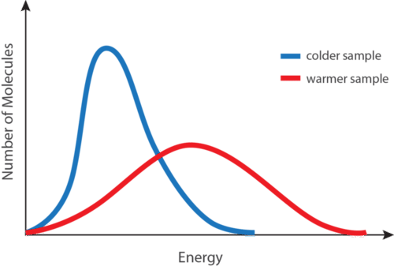

The blue curve shown above (**Figure** [above](#x-ck12-SW50Q2gtMTMtMDUtS0UtZGlzdHJpYnV0aW9u)) is for a sample of matter at a relatively low temperature, while the red curve is for a sample at a relatively high temperature. In both cases, most of the particles have intermediate kinetic energies, close to the average. Notice that as temperature increases, the range of kinetic energies increases and the distribution curve “flattens out.”

At a given temperature, the particles of any substance have the same average kinetic energy. At room temperature, the molecules in a sample of liquid water have the same average kinetic energy as the molecules in a sample of oxygen gas or the ions in a sample of sodium chloride.

You can see an exciting demonstration of the relationship between kinetic energy and temperature by watching a piece of nitrocellulose ignite from the compression of air at http://www.youtube.com/watch?v=jsQlfxdZ9ys.

You can visualize the motion of gas molecules indirectly by watching glass beads move in mercury gas at http://www.youtube.com/watch?v=26dAsmFWz24.

### Absolute Zero

As a sample of matter is continually cooled, the average kinetic energy of its particles decreases. Eventually, one would expect the particles to stop moving completely. **Absolute zero** _is the temperature at which the motion of particles theoretically ceases_. Absolute zero has never been attained in the laboratory, but temperatures on the order of 1 × 10_−10_ K have been achieved. The Kelvin temperature scale is based on this theoretical limit, so absolute zero is equal to 0 K. The Kelvin temperature of a substance is directly proportional to the average kinetic energy of the particles of the substance. For example, the particles in a sample of hydrogen gas at 200 K have twice the average kinetic energy as the particles in a hydrogen sample at 100 K.

You can learn more about the relationship between average kinetic energy and temperature at http://www.grc.nasa.gov/WWW/k-12/airplane/temptr.html.

You can view a simulation of the molecular motion of gas molecules as heat is added at http://www.dlt.ncssm.edu/core/Chapter11-Thermochemistry/Chapter11-Animations/KineticEnergy-Gas.html.

Lesson Summary
--------------

* The kinetic-molecular theory describes all matter, but it is especially useful for explaining the behavior of gases. Gas particles are assumed to occupy an insignificant volume compared to the space between particles. Particles undergo random linear motion and collide elastically with one another and with their container.
* Gas pressure results from the collisions of gas particles with an object. Pressure is measured with a barometer or a manometer. Conversions between pressure units can be performed by using dimensional analysis.
* The temperature of a substance in Kelvin is directly proportional to the average kinetic energy of the particles in that substance.

Lesson Review Questions
-----------------------

### Reviewing Concepts

1.  How are gases different from liquids and solids in terms of the distance between the particles?
2.  Which of the following are behaviors of a gas that can be explained by the kinetic-molecular theory?
    1.  Gases are compressible.
    2.  Gases exert pressure.
    3.  All particles of a gas sample move at the same speed.
    4.  Gas particles can exchange kinetic energy when they collide.
    5.  Gas particles move in a curved-line path.
3.  What is an elastic collision?
4.  List several common units of gas pressure.
5.  How high does a column of mercury rise when inverted in a dish of mercury at sea level? Why do you suppose that mercury is used to measure atmospheric pressure rather than water?
6.  Would it be more or less difficult to drink water through a straw on the summit of Mt. Everest than it would be at sea level? Explain.
7.  How does the average kinetic energy of an air sample near a campfire compare to air that is far away from it?

### Problems

8.  Perform the indicated conversions for the following pressure measurements.
    1.  1.721 atm to mmHg
    2.  559 torr to kPa
    3.  91.1 kPa to atm
    4.  2320 mmHg to atm
9.  A manometer is attached to an enclosed gas sample, as shown above (**Figure** [above](#x-ck12-SW50Q2gtMTMtMDQtTWFub21ldGVy)). The mercury rises 20 mm higher on the side of the U-tube that is open to the air. The atmospheric pressure is 752 mmHg. What is the pressure of the gas sample in the bulb?
10. A sample of neon gas is at −25°C. What would be its Celsius temperature when the average kinetic energy of the particles is tripled?
11. The density of water is approximately 1/14th that of mercury. If the atmospheric pressure at a certain location is 750. mmHg, to what height (in m) would a column of water rise?

Further Reading / Supplemental Links
------------------------------------

* Kinetic-Molecular Theory, http://students.ed.uiuc.edu/mrayon/kmt.html
* Measuring Gas Pressure, http://www.wisc-online.com/objects/ViewObject.aspx?ID=GCH5004
* Air pressure not only affects us here on Earth, but also planes flying in the atmosphere. You can participate in a simulation at http://www.grc.nasa.gov/WWW/k-12/airplane/atmosi.html.
* Strength of atmospheric pressure:
    * Atmospheric pressure is stronger than you think! Watch a video that demonstrates a stick being broken by atmospheric pressure at http://www.youtube.com/watch?v=dpFb08pLw0E.
    * You can watch a demonstration of atmospheric pressure crushing a can at http://www.youtube.com/watch?v=R5sZQFmX-jA.
    * Another great demonstration of the strength of atmospheric pressure is the crushing of this can (a big can—not a soda can!) http://www.youtube.com/watch?v=Jcl0A8Mu9xk.
    * If you are still not convinced about the strength of atmospheric pressure, watch this demonstration of water remaining inside an inverted Erlenmeyer flask http://www.youtube.com/watch?v=ZgMCz4RQYas.
* We may think it is cold in the winter and hot in the summer, but this simulation may change your mind about the temperature scale with which we are familiar http://www.pbs.org/wgbh/nova/physics/sense-of-scale-absolute-zero.html.
* You can view an interactive timeline of the experiments leading to the determination of absolute zero at http://www.pbs.org/wgbh/nova/physics/milestones-in-cold-research.html.
* You can participate in a simulation of the cascade process used to reach ultra-low temperatures at http://www.pbs.org/wgbh/nova/physics/reaching-ultra-low-temperatures.html.
* Watch a video of condensing oxygen gas using liquid nitrogen at http://www.youtube.com/watch?v=maEi67gjtRQ.

Points to Consider
------------------

The particles of a liquid are much closer together than the particles of a gas, resulting in far different behaviors for liquids as compared to gases.

* How does the kinetic energy of the particles in a liquid relate to the rate of evaporation of the liquid?
* How is the boiling point of a liquid defined?

</article>

### 13.2 Liquids

<article>

Lesson Objectives
-----------------

* Describe a liquid according to the kinetic-molecular theory.
* Describe how a liquid exhibits surface tension.
* Describe the evaporation of a liquid and its relationship to the kinetic energy of the evaporating particles.
* Define vapor pressure and understand its relationship to intermolecular forces and to the temperature of the liquid.
* Describe the process of boiling and differentiate between boiling point and normal boiling point.
* Use a vapor pressure curve to determine boiling points at different atmospheric pressures.

Lesson Vocabulary
-----------------

* boiling point
* condensation
* evaporation
* fluid
* normal boiling point
* surface tension
* vapor pressure
* vaporization

Check Your Understanding
------------------------

### Recalling Prior Knowledge

* What is the kinetic-molecular theory?
* What makes gases different from liquids and solids?

Gases are easy to study because of the extremely large distances between the gas particles. Because there is so much space between particles, intermolecular forces can largely be ignored, which vastly simplifies any analysis of the motion exhibited by individual particles. In this lesson, we begin to study the properties of liquids and discover the importance of a liquid’s intermolecular attractive forces.

Properties of Liquids
---------------------

The primary difference between liquids and gases is that the particles of a liquid are much closer together, and there is very little empty space between them. Liquids are essentially not compressible and are far denser than gases. According to the kinetic-molecular theory for gases, any attractive forces between the particles of a gas are so minor that they can be ignored in most cases. For liquids, the intermolecular attractive forces are the only thing that keeps the particles close together. Liquids and solids are referred to as the condensed states of matter. One way in which liquids and gases are similar is that they are both fluids. A **fluid** _is a substance that is capable of flowing from one place to another and takes the shape of its container_.

### Surface Tension

Molecules within a liquid are pulled equally in all directions by intermolecular forces. However, molecules at the surface are pulled downward and sideways by other liquid molecules, but not upward away from the surface. The overall effect is that the surface molecules are pulled into the liquid, creating a surface that is tightened like a film (**Figure** [below](#x-ck12-SW50Q2gtMTMtMDgtU3VyZmFjZS1UZW5zaW9u) (A)). The **surface tension** _of a liquid is a measure of the elastic force in the liquid’s surface_. Liquids that have strong intermolecular forces, like the hydrogen bonding in water, exhibit the greatest surface tension. Surface tension allows objects that are denser than water, such as the paper clip shown below (**Figure** [below](#x-ck12-SW50Q2gtMTMtMDgtU3VyZmFjZS1UZW5zaW9u) (B)), to nonetheless float on its surface. It is also responsible for the beading up of water droplets on a freshly waxed car, because there are no attractions between the polar water molecules and the nonpolar wax.

 Molecules at the surface of a liquid are pulled downward into the liquid, creating a tightened surface. (B) Surface tension allows a paper clip to float on water’s surface.")

### Evaporation

A puddle of water left undisturbed eventually disappears. The liquid molecules escape into the gas phase, becoming water vapor. **Vaporization** _is the process in which a liquid is converted to a gas_. **Evaporation** _is the conversion of a liquid to its vapor form below the boiling temperature of the liquid_ (**Figure** [below](#x-ck12-SW50Q2gtMTMtMDktRXZhcG9yYXRpb24.)). If the water is instead kept in a closed container, the water vapor molecules do not have a chance to escape into the surroundings and so the water level does not change. As some water molecules become vapor, an equal number of water vapor molecules condense back into the liquid state. **Condensation** _is the change of state from a gas to a liquid_.

A given liquid will evaporate more quickly when it is heated. This is because the heating process results in a greater fraction of the liquid’s molecules having the necessary kinetic energy to escape the surface of the liquid. The figure below (**Figure** [below](#x-ck12-SW50Q2gtMTMtMTAtS0UtZGlzdHJpYnV0aW9uLTI.)) shows the kinetic energy distribution of liquid molecules at two temperatures. The number of molecules that have the required kinetic energy to evaporate are shown in the shaded area under the curve at the right. The higher temperature liquid (T2) has more molecules that are capable of escaping into the vapor phase than the lower temperature liquid (T1).

Vapor Pressure
--------------

When a partially filled container of liquid is sealed with a stopper, some liquid molecules at the surface evaporate into the vapor phase. However, the vapor molecules cannot escape from the container. Over time, some of the molecules lose energy through collisions with other molecules or with the walls of the container. At this point, the less energetic vapor molecules are trapped by the attractive forces of the molecules in the liquid, and they begin to condense back into the liquid form. Eventually, the system reaches a point where the rate of evaporation is equal to the rate of condensation (**Figure** [below](#x-ck12-SW50Q2gtMTMtMTEtVmFwb3ItcHJlc3N1cmU.)). This is called a dynamic equilibrium between the liquid and vapor phases.

______$\mathrm{H_2O}(l) \rightleftharpoons \mathrm{H_2O}(g)$__

$\mathrm{H_2O}(l) \rightleftharpoons \mathrm{H_2O}(g)$__

__$\mathrm{H_2O}(l) \rightleftharpoons \mathrm{H_2O}(g)$__

$\mathrm{H_2O}(l) \rightleftharpoons \mathrm{H_2O}(g)$__

____$\mathrm{H_2O}(l) \rightleftharpoons \mathrm{H_2O}(g)$__

$\mathrm{H_2O}(l) \rightleftharpoons \mathrm{H_2O}(g)$__

__$\mathrm{H_2O}(l) \rightleftharpoons \mathrm{H_2O}(g)$__

$\mathrm{H_2O}(l) \rightleftharpoons \mathrm{H_2O}(g)$

The forward direction represents the evaporation process, while the reverse direction represents the condensation process.

Because they cannot escape the container, the vapor molecules above the surface of the liquid exert a pressure on the walls of the container. The **vapor pressure** _is a measure of the pressure exerted by the vapor that forms above its liquid form in a sealed container_. Vapor pressure is considered a property of the liquid and is constant for a given substance at a set temperature. The vapor pressure of a substance at a given temperature is based on the strength of its intermolecular forces. A liquid with weak intermolecular forces evaporates more easily and has a high vapor pressure. A liquid with stronger intermolecular forces does not evaporate easily and, thus, has a lower vapor pressure. For example, diethyl ether is a nonpolar liquid with weak dispersion forces. Its vapor pressure at 20°C is 58.96 kPa. Water is a polar liquid whose molecules are attracted to one another by relatively strong hydrogen bonding. The vapor pressure of water at 20°C is only 2.33 kPa, far less than that of diethyl ether.

Vapor pressure can be measured by the use of a manometer (**Figure** [below](#x-ck12-Q2gtMTMtMDItMDktTWFub21ldGVy)).

### Vapor Pressure and Temperature

Vapor pressure is dependent upon temperature. When the liquid in a closed container is heated, more molecules escape the liquid phase and evaporate. The greater number of vapor molecules strike the container walls more frequently, resulting in an increase in pressure. The table below (**Table** [below](#x-ck12-dGFibGU6VGFibGUtMTMuMQ..)) shows the relationship between temperature and vapor pressure for three different liquids.

|     |     |     |     |     |     |     |
| --- | --- | --- | --- | --- | --- | --- |Vapor Pressure (in kPa) of Three Liquids at Different Temperatures
|     | 0°C | 20°C | 40°C | 60°C | 80°C | 100°C |
| --- | --- | --- | --- | --- | --- | --- |
| Water | 0.61 | 2.33 | 7.37 | 19.92 | 47.34 | 101.33 |
| Ethanol | 1.63 | 5.85 | 18.04 | 47.02 | 108.34 | 225.75 |
| Diethyl ether | 24.70 | 58.96 | 122.80 | 230.65 | 399.11 | 647.87 |

Notice that the temperature dependence of the vapor pressure is not linear. From 0°C to 80°C, the vapor pressure of water increases by 46.73 kPa, but it increases by another 53.99 kPa in a span of only twenty degrees from 80°C to 100°C.

Watch a video lecture about vapor pressure at http://www.khanacademy.org/science/chemistry/states-of-matter/v/vapor-pressure.

Watch a simulation of vapor pressure at http://www.dlt.ncssm.edu/core/Chapter10-Intermolecular_Forces/Chapter10-Animations/VaporPressure.html.

You can participate in an online lab, the _Dumas Molar Mass Lab_, that determines the molar mass of a volatile liquid at http://www.youtube.com/watch?v=0UJXa9Hd88I&feature=player_embedded. The document that accompanies this lab is found at http://www.dlt.ncssm.edu/core/Chapter7-Gas_Laws/Chapter7-Labs/Dumas_Molar_Mass_web_01-02.doc.

### Boiling Point

As a liquid is heated, the average kinetic energy of its particles increases. The rate of evaporation increases as more and more molecules are able to escape the liquid’s surface into the vapor phase. Eventually, a point is reached when the molecules all throughout the liquid have enough kinetic energy to vaporize. At this point, the liquid begins to boil. The **boiling point** _is the temperature at which the vapor pressure of a liquid is equal to the external pressure_. The figure below (**Figure** [below](#x-ck12-SW50Q2gtMTMtMTMtRXZhcC12cy1ib2lsaW5n)) illustrates the boiling of a liquid.

The **normal boiling point** of a liquid _is the temperature at which the vapor pressure of the liquid is equal to the standard atmospheric pressure of 760 mmHg_. Because atmospheric pressure can change based on location, the boiling point of a liquid changes with the external pressure. The normal boiling point is a constant because it is defined relative to a standard pressure (760 mmHg, or 1 atm, or 101.3 kPa). The boiling points of various liquids can be illustrated by vapor pressure curves (**Figure** [below](#x-ck12-SW50Q2gtMTMtMTQtVmFwb3ItcHJlc3N1cmUtY3VydmU.)). A vapor pressure curve is a graph of vapor pressure as a function of temperature. To find the normal boiling point of a liquid, a horizontal line is drawn from the left at a pressure equal to the standard pressure. The temperature at which that line intersects with the vapor pressure curve of a liquid is the boiling point of that liquid.

As stated earlier, boiling points are affected by external pressure. At higher altitudes, the atmospheric pressure is lower. With less pressure pushing down on the surface of the liquid, it boils at a lower temperature. This can also be seen from the vapor pressure curves. If one draws a horizontal line at a lower vapor pressure, it intersects each curve at a lower temperature. The boiling point of water is 100°C at sea level, where the atmospheric pressure is close to the standard value. In Denver, CO, at 1600 m above sea level, the atmospheric pressure is only about 640 mmHg, so water boils at about 95°C. On the summit of Mt. Everest, the atmospheric pressure is about 255 mmHg, so water boils at only 70°C. On the other hand, water boils at temperatures greater than 100°C if the external pressure is higher than the standard value. Pressure cookers do not allow the water vapor to escape, so the total pressure inside the cooker increases. Since water now boils at a temperature above 100°C, the food cooks more quickly.

The effect of decreased air pressure can be demonstrated by placing a beaker of water in a vacuum chamber. At a low enough pressure, about 20 mmHg, water will boil at room temperature!

Watch a video demonstration showing the relationship between vapor pressure and concentration at http://www.youtube.com/watch?v=PXYorrMu0Mw.

Watch a video demonstration of the effect of changing pressure on the boiling point of water at http://www.youtube.com/watch?v=Cshd5MVGpfk (1:23).

!?[video](https://www.youtube.com/watch?v=Cshd5MVGpfk)

Lesson Summary
--------------

* Intermolecular forces keep the particles of liquids close together, but, due to relatively loose associations between any two particles, liquids are still able to flow freely.
* Surface tension is a property of liquids that makes it slightly more favorable for a liquid to minimize its surface area. This can lead to interesting properties, such as the ability of certain objects to float on the surface of a liquid even if they are denser than that liquid.
* Molecules of a liquid evaporate even when the temperature of the liquid is below its boiling point. Molecules with high kinetic energies escape the surface of the liquid, leaving the remaining liquid cooler than it was before.
* The vapor pressure of a liquid is determined by the strength of the intermolecular forces between its particles. Vapor pressure increases as temperature increases due to an increased rate of evaporation. The relationship between vapor pressure and temperature is shown on a vapor pressure curve.
* The boiling of a liquid occurs when its vapor pressure is equal to the external pressure.

Lesson Review Questions
-----------------------

### Reviewing Concepts

1.  Explain why gases are compressible, while liquids are almost completely incompressible.
2.  Explain how a molecule of a liquid evaporates in terms of its kinetic energy. Why does the rate of evaporation increase with temperature?
3.  When a highly volatile (evaporates rapidly) liquid such as acetone is spilled on your skin, it feels cold even if the liquid is originally at room temperature. Explain why this is true.
4.  A liquid in a closed container has a constant vapor pressure. What can be said about the rate of evaporation of the liquid compared to the rate of condensation of the vapor?
5.  Explain how the boiling point of a liquid varies with the atmospheric pressure.
6.  What is the difference between boiling point and normal boiling point?
7.  Liquid A has weaker intermolecular forces than liquid B.
    1.  Which liquid has the higher vapor pressure?
    2.  Which liquid has a higher normal boiling point?
    3.  Which liquid would demonstrate greater surface tension?

### Problems

8.  Use the vapor pressure curve of water to answer the following questions. 
    
    \[Figure 8\]
    
    1.  What is the vapor pressure of water at 60°C?
    2.  What is water’s temperature when its vapor pressure is 100 mmHg?
    3.  At what temperature would water boil if the external pressure were 500 mmHg?
    4.  The atmospheric pressure is 250 mmHg. Is water a liquid or a gas at a temperature of 80°C?
9.  A mountain climber in a camp at 3000 m above sea level decides to make pasta for dinner. The package states that the pasta should be cooked in boiling water for 10 minutes. How should the climber adjust this cooking time, if at all? Explain.

Further Reading / Supplemental Links
------------------------------------

* Vapor Pressure, ([http://www.wisc-online.com/objects/ViewObject.aspx?ID=GCH4304)](http://www.wisc-online.com/objects/ViewObject.aspx?ID=GCH4304%29)
* Boiling Point of a Liquid, ([http://www.wisc-online.com/objects/ViewObject.aspx?ID=GCH4404)](http://www.wisc-online.com/objects/ViewObject.aspx?ID=GCH4404%29)
* How Pressure Changes Boiling Temperature, ([http://www.wisc-online.com/objects/ViewObject.aspx?ID=ELE2107)](http://www.wisc-online.com/objects/ViewObject.aspx?ID=ELE2107%29)
* Vapor Pressure, ([http://www.chem.purdue.edu/gchelp/liquids/vpress.html)](http://www.chem.purdue.edu/gchelp/liquids/vpress.html%29)
* Watch a video demonstration of vapor pressure and a blue dolphin at http://www.youtube.com/watch?v=KQIxpN9qe8o.
* Need some Christmas fun? Watch a video demonstration of vapor pressure and a Christmas tree ornament at http://www.youtube.com/watch?v=6d3GpZt_PM4.
* Another video demonstration of vapor pressure and temperature using a pulse glass can be seen at http://www.youtube.com/watch?v=w-Yei5vBsxM.
* You can have so much fun with vapor pressure! Watch this drinking duck demonstration at http://www.youtube.com/watch?v=Bzw0kWvfVkA.
* Test your knowledge of vapor pressure and temperature by explaining what happens in these demonstrations:
    * http://www.youtube.com/watch?v=4eKxVRt1XT4
    * http://www.youtube.com/watch?v=cdYgwEnsb58
* You can collect data on a video experiment of the vapor pressure of methanol at http://www.youtube.com/watch?v=XiwKK5NZXKA.
    * The lab document for this experiment can be found at http://www.dlt.ncssm.edu/core/Chapter11-Thermochemistry/Chapter11-Labs/Vapor_Pressure_lab_web_01-02.doc.
* Concord Consortium has a multiple simulations of evaporation and condensation on their Molecular Workbench. If you do not have the Molecular Workbench, download it at http://mw.concord.org/modeler/MW.jnlp. When you open the Molecular Workbench program, click on _Browse entire library_. Next, click on _States of Matter_. You will see a list of simulations.

Points to Consider
------------------

Solids are the other condensed phase of matter, with particles held closely together by attractive forces.

* What are some of the ways in which the particles of a solid are arranged?
* What happens when the temperature of a solid reaches its melting point?

</article>

### 13.3 Solids

<article>

Lesson Objectives
-----------------

* Describe a solid according to the kinetic-molecular theory.
* Understand that a solid also has a vapor pressure, and describe the relationship between the vapor pressure of a solid and sublimation.
* Describe the features of the seven basic crystal systems.
* Define a unit cell.
* List the four classes of crystalline solids and describe the properties of each.
* Describe an amorphous solid.

Lesson Vocabulary
-----------------

* amorphous solid
* crystal
* deposition
* melting point
* sublimation
* unit cell

Check Your Understanding
------------------------

### Recalling Prior Knowledge

* How does the kinetic-molecular theory treat the condensed states of matter differently than it treats gases?
* What happens to the particles of a liquid as they undergo a change of state into a gas?

So far, we have studied gases and liquids. In this lesson, you will gain an understanding of the nature of solids, focusing on the many different ways in which particles can be arranged within ordered solid crystals.

Properties of Solids
--------------------

Solids are similar to liquids in that both are condensed states, with particles that are far closer together than those of a gas. However, while liquids are fluid, solids are not. The particles of most solids are packed tightly together in an orderly arrangement. The motion of individual atoms, ions, or molecules in a solid is restricted to vibrational motion about a fixed point. Solids are almost completely incompressible, and for most substances, their solid form is the densest of the three states of matter.

As a solid is heated, the average kinetic energy of its particles still increases, but due to their relatively fixed positions, this manifests itself as stronger and more rapid vibrations. Eventually, the organization of the particles within the solid structure begins to break down and the solid starts to melt. The **melting point** _is the temperature at which a solid changes into a liquid_. At its melting point, the disruptive vibrations of the particles in the solid overcome the attractive forces operating within the solid. As with boiling points, the melting point of a solid is dependent on the strength of those attractive forces. Sodium chloride (NaCl) is an ionic compound, so it consists of a multitude of strong ionic bonds. Sodium chloride melts at 801°C. Ice (solid H2O) is a molecular compound whose molecules are held together by hydrogen bonds. Though hydrogen bonds are the strongest of the intermolecular forces, they are still much weaker than ionic bonds. The melting point of ice is 0°C.

The melting point of a solid is the same as the freezing point of the corresponding liquid. At that temperature, the solid and liquid states of the substance are in equilibrium. For water, this equilibrium occurs at 0°C.

______$\mathrm{H_2O}(s) \rightleftharpoons \mathrm{H_2O}(l)$__

$\mathrm{H_2O}(s) \rightleftharpoons \mathrm{H_2O}(l)$__

__$\mathrm{H_2O}(s) \rightleftharpoons \mathrm{H_2O}(l)$__

$\mathrm{H_2O}(s) \rightleftharpoons \mathrm{H_2O}(l)$__

____$\mathrm{H_2O}(s) \rightleftharpoons \mathrm{H_2O}(l)$__

$\mathrm{H_2O}(s) \rightleftharpoons \mathrm{H_2O}(l)$__

__$\mathrm{H_2O}(s) \rightleftharpoons \mathrm{H_2O}(l)$__

$\mathrm{H_2O}(s) \rightleftharpoons \mathrm{H_2O}(l)$

You can view a cartoon with a simple explanation of the properties of solids at http://www.abpischools.org.uk/page/modules/solids-liquids-gases/slg2.cfm?age=Age%20range%207-11&subject=Science. Page 2 is specifically about the properties of solids.

### Vapor Pressure of a Solid

In the last lesson, you learned about the vapor pressure of a liquid and its dependence upon temperature. Solids also have a vapor pressure, though it is generally much less than that of a liquid. A snow bank will gradually disappear even if the temperature stays below 0°C. The snow does not melt but, instead, passes directly from the solid state to the vapor state. **Sublimation** _is the change of state from a solid to a gas without passing through the liquid state_.

Iodine is an example of a substance for which sublimation can be readily observed at room temperature, as seen below (**Figure** [below](#x-ck12-Q2gtMTMtMDMtMDEtSW9kaW5l)). Although the vapor pressure of solid iodine at room temperature is actually quite low (< 1 mmHg), its vapor is a distinctive purple color and has a very strong scent, making it easy to detect.

The following video shows the sublimation of iodine in a beaker. The beaker is covered with an evaporating dish filled with ice water, and the dark iodine crystals are deposited on the outside of that dish. **Deposition** _is the change of state from a gas to a solid_.

http://www.youtube.com/watch?v=4fAOI6BeMZY (3:52)

&nbsp;

!?[video](https://www.youtube.com/watch?v=4fAOI6BeMZY)

Carbon dioxide is another substance that sublimes at atmospheric pressures. Carbon dioxide in the solid state is known as dry ice. Dry ice is very cold (−78°C), so it is used as a coolant for goods such as ice cream that must remain frozen during shipment. Because the dry ice sublimes rather than melting, there is no liquid mess associated with its change of state as the dry ice warms.

Crystalline Solids
------------------

The majority of solids are crystalline in nature. A **crystal** _is a substance in which the particles are arranged in an orderly, repeating, three-dimensional pattern_. Particles of a solid crystal may be ions, atoms, or molecules, depending on the type of substance. The three-dimensional arrangement of a solid crystal is referred to as the crystal lattice. The general nature of crystal lattices of ionic compounds was introduced in the chapter, _Ionic and Metallic Bonding_. Different arrangements of the particles within a crystal cause them to adopt several different shapes.

### Crystal Systems

Crystals are classified into general categories based on their shapes. A crystal is defined by its faces, which intersect with one another at specific angles, which are characteristic of the given substance. The seven crystal systems are shown below (**Table** [below](#x-ck12-dGFibGU6SW50Q2gtMTMtMTctQ3J5c3RhbHM.)), along with an example of each. The edge lengths of a crystal are represented by the letters a, b, and c. The angles at which the faces intersect are represented by the Greek letters α, β, and γ. Each of the seven crystal systems differs in terms of the angles between the faces and in the number of edges of equal length on each face.

|     |     |     |
| --- | --- | --- |Seven Basic Crystal Systems and an Example of Each
| Crystal System | Diagram | Example |
| --- | --- | --- |
| **Cubic**  a = b = c; α = β = γ = 90° |   \[Figure 2. |   \[Figure 3\]  **Pyrite** |
| **Tetragonal**  a = b ≠ c; α = β = γ = 90° |   \[Figure 4. |   \[Figure 5\]  **Wulfenite** |
| **Orthorhombic**  a ≠ b ≠ c; α = β = γ = 90° |   \[Figure 6. |   \[Figure 7\]  **Aragonite** |
| **Monoclinic**  a ≠ b ≠ c; α ≠ 90° = β = γ |   \[Figure 8. |   \[Figure 9\]  **Azurite** |
| **Rhombohedral**  a = b = c; α = β = γ ≠ 90° |   \[Figure 10. |   \[Figure 11\]  **Calcite** |
| **Triclinic**  a ≠ b ≠ c; α ≠ β ≠ γ ≠ 90° | 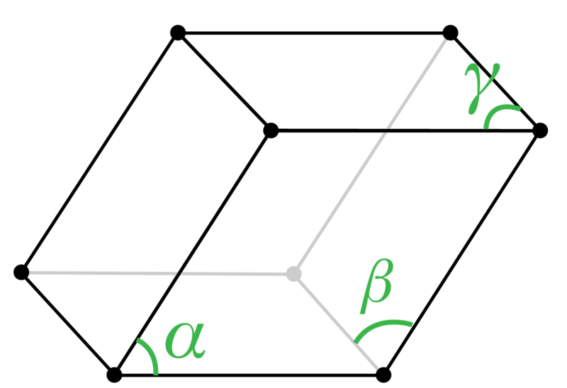  \[Figure 12. |   \[Figure 13\]  **Microcline** |
| **Hexagonal**  a = b ≠ c; α = β = 90°, γ = 120° |   \[Figure 14. |   \[Figure 15\]  **Beryl** |

### Unit Cells

A **unit cell** _is the smallest portion of a crystal lattice that shows the three-dimensional pattern of the entire crystal_. A crystal can be thought of as the same unit cell repeated over and over in three dimensions. Illustrated below (**Figure** [below](#x-ck12-SW50Q2gtMTMtMTctQ3J5c3RhbC1sYXR0aWNlLXVuaXQtY2VsbA..)) is the relationship of a unit cell to the entire crystal lattice.

Unit cells occur in many different varieties. As one example, the cubic crystal system is composed of three different types of unit cells: (1) simple cubic, (2) face-centered cubic, and (3) body-centered cubic. These are shown in three different ways below (**Figure** [below](#x-ck12-SW50Q2gtMTMtMTgtQ3ViaWNz)).

### Classes of Crystalline Solids

Crystalline substances can also be described by the types of particles in them and the types of chemical bonding that take place between the particles. There are four types of crystals: (1) ionic, (2) metallic, (3) covalent network, and (4) molecular. Properties and several examples of each type are listed and described below (**Table** [below](#x-ck12-dGFibGU6VGFibGUtMTMuMg..)).

---

&nbsp;

|     |     |     |     |
| --- | --- | --- | --- |Crystalline Solids – Melting and Boiling Points
| Type of Crystalline Solid | Examples (formulas) | Normal Melting Point (°C) | Normal Boiling Point (°C) |
| --- | --- | --- | --- |
| Ionic | NaCl  CaF2 | 801  1418 | 1413  2533 |
| Metallic | Hg  Na  Au  W | −39  371  1064  3410 | 630  883  2856  5660 |
| Covalent network | B  C (diamond)  SiO2 | 2076  3500  1600 | 3927  3930  2230 |
| Molecular | H2  I2  NH3  H2O | −259  114  \-78  0 | −253  184  \-33  100 |

1.  **Ionic crystals**—The ionic crystal structure, discussed in the chapter _Ionic and Metallic Bonding_, consists of alternating positively charged cations and negatively charged anions. The ions may either be monatomic or polyatomic. Generally, ionic crystals form from a combination of metal cations and Group 16 or 17 nonmetal anions, although nonmetallic polyatomic ions are also common components of ionic crystals. Ionic crystals are hard and brittle and have high melting points. Ionic compounds do not conduct electricity as solids, but they do conduct when molten or dissolved in water.
2.  **Metallic crystals**—Metallic crystals, also discussed in the chapter _Ionic and Metallic Bonding_, consist of metal cations surrounded by a “sea” of mobile valence electrons. These electrons, also referred to as delocalized electrons, do not belong to any one atom and are capable of moving through the entire crystal. As a result, metals are good conductors of electricity. As seen in the table above (**Table** [above](#x-ck12-dGFibGU6VGFibGUtMTMuMg..)), metallic crystals can have a wide range of melting points.
3.  **Covalent network crystals**—A covalent network crystal consists of atoms at the lattice points of the crystal, with each atom being covalently bonded to its nearest neighbor atoms. The covalently bonded network is three-dimensional and contains a very large number of atoms. Network solids include diamond (**Figure** [below](#x-ck12-SW50Q2gtMTMtMDMtMTgtRGlhbW9uZA..)), quartz, many metalloids, and oxides of transition metals and metalloids. Network solids are hard and brittle, with extremely high melting and boiling points. Being composed of atoms rather than ions, they do not conduct electricity well in any state.
4.  **Molecular crystals**—Molecular crystals typically consist of molecules at the lattice points of the crystal, held together by relatively weak intermolecular forces. The intermolecular forces may be dispersion forces in the case of nonpolar substances or dipole-dipole forces in the case of polar substances. Some molecular crystals, such as ice, have molecules held together by hydrogen bonds. When one of the noble gases is cooled and solidified, the lattice points are individual atoms rather than molecules. However, because the atoms are held together by dispersion forces and not by covalent or metallic bonds, the properties of such a crystal are most similar to the crystals of molecular substances. In all cases, the intermolecular forces holding the particles together are far weaker than either ionic or covalent bonds. As a result, the melting and boiling points of molecular crystals are much lower. Lacking ions or free electrons, molecular crystals are poor electrical conductors.

Amorphous Solids
----------------

Unlike a crystalline solid, an **amorphous solid** _is a solid that lacks an ordered internal structure_. Some examples of amorphous solids include rubber, plastic, and gels. Glass is a very important amorphous solid that is made by cooling a mixture of materials in such a way that it does not crystallize. Glass is sometimes referred to as a supercooled liquid rather than a solid. If you have ever watched a glassblower in action, you have noticed that he takes advantage of the fact that amorphous solids do not have a distinct melting point like crystalline solids do. Instead, as glass is heated, it slowly softens and can be shaped into all sorts of interesting forms. When a glass object shatters, it does so in a very irregular way. In contrast, a crystalline solid always breaks along specific planes as dictated by its crystal system.

Lesson Summary
--------------

* The particles of most solids are packed tightly together in an orderly arrangement. The motion of individual atoms, ions, or molecules in a solid is restricted to vibrational motion about a fixed point. Solids are almost completely incompressible and are the densest of the three states of matter.

* Solids, like liquids, have a vapor pressure, though generally much less than that of a liquid. Like liquids, the vapor pressure of a solid increases with temperature. The process in which a solid changes directly to a gas without passing through the liquid phase is called sublimation. All substances undergo sublimation that is temperature and pressure dependent.

* Crystal classification is based on its shape. A crystal is defined by its faces, which intersect with one another at specific angles and are characteristics of the given substance. The seven crystal systems are: cubic, tetragonal, orthorhombic, monoclinic, rhombohedral, triclinic, and hexagonal.

* Unit cells are the smallest portion of a crystal lattice showing the three-dimensional pattern of the entire crystal.

* There are four classes of crystalline solids: ionic, metallic, covalent network, and molecular. Crystalline substances can be described by the types of particles in them and the types of chemical bonding that takes place between the particles.

* Unlike crystalline solids, amorphous solids are solids that lack ordered internal structures.

Lesson Review Questions
-----------------------

### Reviewing Concepts

1.  How are the particles arranged in most solids?
2.  Describe what happens when a solid is heated to its melting point. What phases are in equilibrium at the melting point?
3.  Wet clothes can be hung on a clothesline in sub-freezing temperatures, and they will still dry. Explain.
4.  What accounts for the differences between the seven basic crystal systems?
5.  Explain the difference between a crystal lattice and a unit cell.
6.  What are three kinds of unit cells that would be classified as having a cubic crystal system?

### Problems

7.  Use the table above (**Table** [above](#x-ck12-dGFibGU6SW50Q2gtMTMtMTctQ3J5c3RhbHM.)) to identify which crystal system or systems fit the following criteria.
    1.  The lengths of all edges are the same.
    2.  All angles between faces are 90°.
    3.  No faces intersect at 90° angles, and no two edges are the same length.
8.  From the given descriptions, identify each of the following as an ionic crystal, a metallic crystal, a covalent network crystal, or a molecular crystal.
    1.  Substance A melts at 125°C and does not conduct electricity as either a solid or a liquid.
    2.  Substance B is very hard and melts at 3440°C. It does not conduct electricity either as a solid or a liquid.
    3.  Substance C is hard and brittle and melts at 1720°C. It does not conduct electricity as a solid, but it does conduct as a liquid.
    4.  Substance D is malleable and conducts electricity well as a solid. It melts at 1135°C.
9.  Identify whether the solid form of each of the following substances is an ionic crystal, a metallic crystal, a covalent network crystal, or a molecular crystal.
    1.  Mn
    2.  MgBr2
    3.  Xe
    4.  NH4Cl
    5.  CO2
    6.  As
    7.  Pd
    8.  SiC
10. Use the figure above (**Figure** [above](#x-ck12-SW50Q2gtMTMtMTgtQ3ViaWNz)) to list the three kinds of cubic unit cells in order from least densely packed to most densely packed.

Further Reading / Supplemental Links
------------------------------------

* Crystallography of Gemstones: The Crystal System, ([http://www.allaboutgemstones.com/crystalline_structures.html)](http://www.allaboutgemstones.com/crystalline_structures.html%29)
* Lesley E. Smart; Elaine A. Moore, _Solid State Chemistry: An Introduction (3rd edition)_. CRC Press, 2005.
* Donald E. Sands, _Introduction to Crystallography_, Dover Publications, 1994.
* You can see a crystalline solid form in your kitchen by growing rock candy. Find this activity at http://www.amnh.org/explore/ology/earth/?pop=29446#http://www.amnh.org/ology/features/stufftodo_earth/rockcandy_main.php.

References
----------

For the table above (**Table** [above](#x-ck12-dGFibGU6SW50Q2gtMTMtMTctQ3J5c3RhbHM.)),

* All diagrams created by CK-12 Foundation - Christopher Auyeung. CC-BY-NC-SA 3.0.
* Pyrite: Teravolt. http://en.wikipedia.org/wiki/File:Pyrite_Cubes.JPG. CC-BY 3.0.
* Tetragonal: Courtesy of the "Minerals in Your World Project" by the US Geological Survey and the Mineral Information Institute. http://commons.wikimedia.org/wiki/File:WulfeniteUSGOV.jpg. Public Domain.
* Christoph Radtke. http://commons.wikimedia.org/wiki/File:Aragonite_-_crystal_ball.jpg. Public Domain.
* Stephanie Clifford (Flickr: sdixclifford). http://www.flickr.com/photos/30486689@N08/3561497998/. CC-BY 2.0.
* Mike Beauregard (Flickr: subarcticmike). http://www.flickr.com/photos/31856336@N03/3108675089/. CC-BY 2.0.
* Courtesy of the "Minerals in Your World Project" by the US Geological Survey and the Mineral Information Institute. http://commons.wikimedia.org/wiki/File:Feldspar%28Microcline%29USGOV.jpg. Public Domain.
* Parent Géry. http://commons.wikimedia.org/wiki/File:H%C3%A9liodore_2_%28Russie%29_.jpg. Public Domain.

Points to Consider
------------------

As part of the discussions about the three states of matter, you have seen how matter undergoes changes from one state to another.

* Under what conditions of temperature and pressure do the various changes of state occur?
* What is a phase diagram, and how can it be used to understand the nature of a given substance?

&nbsp;

</article>

### 13.4 Changes of State

<article>

Lesson Objectives
-----------------

* Interpret heating and cooling curves.
* Know the terms for the six different changes of state.
* Describe the general features of a phase diagram, including the triple point and the critical point.

Lesson Vocabulary
-----------------

* critical pressure
* critical temperature
* phase diagram
* triple point

Check Your Understanding
------------------------

### Recalling Prior Knowledge

* What are the names for the various changes of state that matter can undergo?
* How does an increase in pressure affect the nature of a gas?

Throughout this chapter, we have examined the nature of solids, liquids, and gases using the kinetic-molecular theory. In this lesson, we look more closely at changes of state and the temperatures and pressures at which those changes occur.

Heating Curves
--------------

Imagine that you have a block of ice that is at a temperature of −30°C, well below its melting point. The ice is in a closed container. As heat is steadily added to the ice block, the water molecules will begin to vibrate faster and faster as they absorb kinetic energy. Eventually, when the ice has warmed to 0°C, the added energy will start to break apart the hydrogen bonding that keeps the water molecules in place when it is in the solid form. As the ice melts, its temperature does not rise. All of the energy that is being put into the ice goes into the melting process and not into any increase in temperature. During the melting process, the two states—solid and liquid—are in equilibrium with one another. If the system were isolated at that point and no energy was allowed to enter or leave, the ice-water mixture at 0°C would remain. Temperature is always constant during a change of state.

Continued heating of the water after the ice has completely melted will now increase the kinetic energy of the liquid molecules, and the temperature will once again begin to rise. Assuming that the atmospheric pressure is standard, the temperature will rise steadily until it reaches 100°C. At this point, the added energy from the heat will cause the liquid to begin to vaporize. As with the previous state change, the temperature will remain steady at 100°C while the intermolecular hydrogen bonds are being broken and water molecules pass from the liquid to the gas state. Once all the liquid has completely boiled, continued heating of the steam (remember, the container is closed) will increase its temperature above 100°C.

The experiment described above can be summarized in a graph called a heating curve (**Figure** [below](#x-ck12-SW50Q2gtMTMtMjAtSGVhdGluZy1DdXJ2ZQ..)).

The change of state behavior for any substance can be represented with a heating curve of this type. The melting and boiling points of the substance can be determined by the horizontal plateaus on the curve. Of course, other substances would have melting and boiling points that are different from those of water. One exception to this exact form for a heating curve would be for a substance such as carbon dioxide, which sublimes rather than melts at standard pressure. The heating curve for carbon dioxide would have only one plateau, at its sublimation temperature.

The entire experiment could also be run in reverse. Steam above 100°C could be steadily cooled down to 100°C, at which point it would condense to liquid water. The water could then be cooled to 0°C, at which point continued cooling would freeze the water to ice. The ice could then be cooled to some point below 0°C. This could be diagrammed in a cooling curve that would be the reverse of the heating curve.

### Summary of State Changes

All of the changes of state that occur between solid, liquid, and gas are summarized in the diagram below (**Figure** [below](#x-ck12-SW50Q2gtMTMtMjEtU3RhdGVzLW9mLU1hdHRlcg..)). Freezing is the opposite of melting, and both represent the equilibrium between the solid and liquid states. Condensation is the opposite of vaporization, and both represent the equilibrium between the liquid and gas states. Deposition is the opposite of sublimation, and both represent the equilibrium between the solid and gas states.

You can experiment with pressure, temperature, and phases using this simulation http://www.pbs.org/wgbh/nova/physics/states-of-matter.html. A document to guide you with questions can be found at https://docs.google.com/open?id=0B_ZuEGrhVEfMWkJQQkE4TFlrS28.

A video experiment of boiling _t_\-butanol can be seen at http://www.youtube.com/watch?v=HSvFBANRlyk&feature=player_embedded.

Phase Diagrams
--------------

The relationships among the solid, liquid, and vapor (gas) states of a substance can be shown as a function of temperature and pressure in a single diagram. A **phase diagram** _is a graph showing the conditions of temperature and pressure under which a substance exists in the solid, liquid, and gas phases_. Examine the general phase diagram shown below (**Figure** [below](#x-ck12-SW50Q2gtMTMtMjItUGhhc2UtRGlhZ3JhbQ..)). In each of the three colored regions of the diagram, the substance is in a single state (or phase). The dark lines that act as the boundary between those regions represent the conditions under which the two phases are in equilibrium.

 of a substance as a function of its temperature and pressure.")

Find the X on the pressure axis, and presume that the value of X is the standard pressure of 1 atm. As one moves left to right across the red line, the temperature of the solid substance is being increased while the pressure remains constant. When point A is reached, the substance melts. Because we are looking at data corresponding to the standard pressure of 1 atm, temperature B on the horizontal axis represents the normal melting point of the substance. Moving farther to the right, the substance boils at point Y, so point C on the horizontal axis represents the normal boiling point of the substance. As the temperature increases at a constant pressure, the substance changes from solid to liquid to gas.

Start right above point B on the temperature axis and follow the red line vertically. At very low pressure, the particles of the substance are far apart from one another and the substance is in the gas state. As the pressure is increased, the particles of the substance are forced closer and closer together. Eventually the particles are pushed so close together that attractive forces cause the substance to condense into the liquid state. Continually increasing the pressure on the liquid will eventually cause the substance to solidify. For the majority of substances, the solid state is denser than the liquid state, so putting a liquid under great pressure will cause it to turn into a solid.

The line segment R−S represents the process of sublimation, where the substance changes directly from a solid to a gas. At a sufficiently low pressure, the liquid phase does not exist. The point labeled TP is called the triple point. The **triple point** _is the only temperature/pressure pairing at which the solid, liquid, and vapor states of a substance can all coexist at equilibrium_. The phase diagram for water is shown below (**Figure** [below](#x-ck12-SW50Q2gtMTMtMjQtV2F0ZXItUGhhc2UtRGlhZ3JhbQ..)).

Notice one key difference between the general phase diagram and the phase diagram for water. In water’s diagram, the slope of the line between the solid and liquid states is negative rather than positive. The reason is that water is an unusual substance in that its solid state is less dense than the liquid state. Ice floats in liquid water. Therefore, a pressure change has the opposite effect on those two phases. If ice is relatively near its melting point, it can be changed into liquid water by the application of pressure. The water molecules are actually closer together in the liquid phase than they are in the solid phase.

The phenomenon of melting ice by pressure can be demonstrated in a relatively simple experiment. In the following video, a thin metal wire is weighted at both ends and placed over a block of ice. The pressure of the wire on the ice melts it. When the pressure is removed, the water refreezes.

http://www.youtube.com/watch?v=2mimXPlD2OU (2:16)

!?[video](https://www.youtube.com/watch?v=2mimXPlD2OU)

Refer again to water’s phase diagram. Notice point E, labeled the critical point. What does that mean? At 373.99°C, particles of water in the gas phase are moving very, very rapidly. At any temperature higher than that, the gas phase cannot be made to liquefy, no matter how much pressure is applied to the gas. The **critical temperature (Tc)** _of a substance is the highest temperature at which the substance can possibly exist as a liquid_. The **critical pressure (Pc)** _is the pressure that must be applied to the gas at the critical temperature in order to turn it into a liquid_. For water, the critical pressure is very high, 217.75 atm. The critical point is the intersection point of the critical temperature and the critical pressure.

An animated heating curve that will help you understand how molecules look at each section of a heating curve can be viewed at http://www.dlt.ncssm.edu/core/Chapter11-Thermochemistry/Chapter11-Animations/HeatingCurve.html.

Lesson Summary
--------------

* Changes of state can be described by a heating curve, which shows how a substance progresses from solid to liquid to gas as energy is added. The temperature of the substance is always constant during a change of state.
* A phase diagram shows the states of matter of a substance as a function of temperature and pressure. Boundaries between regions on a phase diagram represent the conditions at which equilibrium exists between two states.
* The triple point represents the one combination of temperature and pressure where all three states of matter can coexist at equilibrium. The critical point occurs at the highest temperature at which the substance is capable of existing in the liquid state.

Lesson Review Questions
-----------------------

### Reviewing Concepts

1.  Explain why a liquid stays at a constant temperature while it is boiling, even though heat is still being added.
2.  Does a change in pressure have a greater effect on the melting point of a substance or on the boiling point of the substance?
3.  For each change of state listed below, state whether energy is being added or being removed from the substance.
    1.  freezing
    2.  sublimation
    3.  vaporization
    4.  condensation
    5.  melting
    6.  deposition
4.  Referring to the terms in question three, match each change of state with its reverse process.
5.  What would it mean if the line between the solid and liquid regions of a phase diagram was exactly vertical?
6.  Explain the significance of the critical point.

### Problems

7.  Shown below is the phase diagram for carbon dioxide, CO2. 
    
    \[Figure 5\]
    
    1.  What are the temperature and pressure at the triple point of CO2?
    2.  What state is CO2 in at a temperature of −20°C and a pressure of 1 atm?
    3.  Explain, using the diagram, why CO2 sublimes rather than melts at standard pressure.
    4.  What phase change occurs when CO2 at 70 atm is heated from −60°C to 10°C?
    5.  What phase change occurs when CO2 at −80°C is pressurized from 0.2 atm to 4 atm?
    6.  What are the temperature and pressure at the critical point of CO2?
    7.  Is solid CO2 more dense or less dense than liquid CO2?

Further Reading / Supplemental Links
------------------------------------

* Phase Diagrams, ([http://www.wisc-online.com/objects/ViewObject.aspx?ID=GCH6304)](http://www.wisc-online.com/objects/ViewObject.aspx?ID=GCH6304%29)
* Phase Diagrams of Pure Substances, ([http://www.chemguide.co.uk/physical/phaseeqia/phasediags.html)](http://www.chemguide.co.uk/physical/phaseeqia/phasediags.html%29)

_Frostbite Theater_ has several exciting demonstrations of state changes that use liquid nitrogen:

* If you like balloons, you can watch _Instant Liquid Nitrogen Balloon Party_ at http://education.jlab.org/frost/instant_balloon.html. The explanation for this phenomenon is demonstrated at http://education.jlab.org/frost/balloon.html.
* Shattering Flowers http://education.jlab.org/frost/carnation.html.
* Giant Koosh Ball http://education.jlab.org/frost/giant_koosh_ball.html
* Watch an egg melt after it was frozen with liquid nitrogen at http://education.jlab.org/frost/freeze_egg.html.
* Which is colder - dry ice or liquid nitrogen? http://education.jlab.org/frost/dry_ice_and_nitrogen.html.
* Watch _Shattering Pennies_ at http://education.jlab.org/frost/pennies_and_nitrogen.html.
* Watch liquid nitrogen freeze at http://education.jlab.org/frost/freeze_liquid_nitrogen.html.
* Watch when happens when Starburst candy is frozen in liquid nitrogen at http://education.jlab.org/frost/starburst.html.
* Is antifreeze any match for liquid nitrogen? http://education.jlab.org/frost/antifreeze.html.
* Watch _Liquid Nitrogen and the Tea Kettle Mystery_ at http://education.jlab.org/frost/live_tea_kettle.html.
* Watch _Squealing Dry Ice_ at http://education.jlab.org/frost/squealing_dry_ice.html.

The phase changes of dry ice are exciting! Watch a video demonstration at http://www.youtube.com/watch?v=wTMmGaS4r-k&feature=player_embedded.

A video experiment demonstrating the cooling curve of _t_\-butanol is located at http://www.youtube.com/watch?v=-2IldvWaIE8&feature=player_embedded. The accompanying document for this lab can be downloaded from http://www.dlt.ncssm.edu/core/Chapter11-Thermochemistry/Chapter11-Labs/CoolingCurve_t-butanol_web_01-02.doc.

Points to Consider
------------------

The description of a gas, according to the kinetic-molecular theory, is that gas particles are very far apart from one another and so the particles do not interact with each other. This description leads to a set of mathematical relationships concerning the amount, temperature, pressure, and volume of a gas sample.

* How would the pressure of an enclosed sample of gas be affected if more gas were added?
* How would the pressure of an enclosed sample of gas be affected if the temperature were increased?
* How would the pressure of an enclosed sample of gas be affected if the volume of the container were increased?

</article>

## 14.0 The Behavior of Gases

<article>

_Image copyright Bob Orsillo, 2014. www.shutterstock.com. Used under license from Shutterstock.com._

</article>

### 14.1 Gas Properties

<article>

Lesson Objectives
-----------------

* Describe how a gas can be compressed.
* Identify three factors that affect gas pressure. Describe the effects according to the kinetic-molecular theory.

Lesson Vocabulary
-----------------

* compressibility

Check Your Understanding
------------------------

### Recalling Prior Knowledge

* What is the kinetic-molecular theory as it pertains to gases?
* What is responsible for a gas exerting pressure?
* How is temperature defined?

The behavior of gases is relatively easy to describe because of the large space that exists between the particles. Because there is so much space between particles, intermolecular forces can largely be ignored, which vastly simplifies any analysis of the motion exhibited by individual particles. In this lesson, we will begin our study of the effect that volume, temperature, and amount has on the pressure of an enclosed gas.

Compressibility
---------------

Scuba diving is a form of underwater diving in which a diver carries his own breathing gas, usually in the form of a tank of compressed air. The pressure in most commonly used scuba tanks ranges from 200 to 300 atmospheres. Gases are unlike other states of matter in that a gas expands to fill the shape and volume of its container. For this reason, gases can also be compressed so that a relatively large amount of gas can be forced into a small container. If the air in a typical scuba tank were transferred to a container at the standard pressure of 1 atm, the volume of that container would need to be about 2500 liters (**Figure** [below](#x-ck12-SW50Q2gtMTQtMDEtU2N1YmEtRGl2ZXI.)).

**Compressibility** _is a measure of how much a given volume of matter decreases when placed under pressure_. As discussed in the chapter _States of Matter_, the kinetic-molecular explains why gases are more compressible than either liquids or solids. Gases are compressible because most of the volume of a gas is composed of the large amounts of empty space between the gas particles. At room temperature and standard pressure, the average distance between gas molecules is about ten times the diameter of the molecules themselves. When a gas is compressed, as when the scuba tank is being filled, the gas particles are forced closer together.

Factors Affecting Gas Pressure
------------------------------

Recall from the kinetic-molecular theory that gas particles move randomly and in straight lines until they elastically collide with other gas particles or with one of the walls of their container. It is these collisions with the walls of the container that define the pressure of the gas. Four variables are used to describe the condition of a gas. They are pressure (P), volume (V), temperature (T), and the amount of the gas, as measured by the number of moles of gas particles (n). We will examine separately how the volume, temperature, and amount of gas each affect the pressure of an enclosed gas sample.

### Amount of Gas

The pressure of the air in a basketball has to be adjusted so that the ball bounces to the correct height (**Figure** [below](#x-ck12-SW50Q2gtMTQtMDItQmFza2V0YmFsbA..)). Before a game, the officials check the ball by dropping it from shoulder height and seeing how far back up it bounces. What would the official do if the ball did not bounce up as far as it is supposed to? What would he do if it bounced too high?

The pressure inside a container is dependent on the amount of gas inside the container. If the basketball does not bounce high enough, the official could remedy the situation by using a hand pump and adding more air to the ball. Conversely, if it bounces too high, he could let some air out of the ball. Illustrated below (**Figure** [below](#x-ck12-SW50Q2gtMTQtMDMtUHJlc3N1cmUtdnMtcGFydGljbGUtbnVtYmVy)) is what happens when air is added to a rigid container. A rigid container is one that is incapable of expanding or contracting. A steel canister is an example of a rigid container.

The canister on the left contains a gas at a certain pressure. The attached air pump is then used to double the amount of gas in the canister. Since the canister cannot expand, the increased number of air molecules will strike the inside walls of the canister twice as frequently as they did before. The result is that the pressure inside the canister doubles. As you might imagine, if more and more air is continually added to a rigid container, it may eventually burst. Reducing the number of molecules in a rigid container has the opposite effect, and the pressure decreases.

The air in a fully inflated car tire is at a higher pressure than the air outside the tire. What happens if you press on the tiny valve stem of the tire (**Figure** [below](#x-ck12-SW50Q2gtMTQtMDQtVGlyZQ..))? You hear the distinctive hissing noise as the air rushes out of the tire. A gas will move from an area of higher pressure to an area of lower pressure until the pressures are equal. If you continue to press on that valve stem, the tire will eventually go flat.

### Volume

Pressure is also affected by the volume of the container. If the volume of a container is decreased, the gas molecules have less space in which to move around. As a result, they will strike the walls of the container more often, resulting in an increase in pressure.

The figure below (**Figure** [below](#x-ck12-SW50Q2gtMTQtMDUtQm95bGUtbGF3)) shows a cylinder of gas whose volume is controlled by an adjustable piston. On the left, the piston is pulled mostly out, and the gauge reads a certain pressure. On the right, the piston has been pushed down so that the volume available to the sample of gas has been cut in half. As a result, the pressure of the gas doubles. Increasing the volume of the container would have the opposite effect—the pressure of the gas would decrease.

### Temperature

It would be very inadvisable to place a can of soup over a campfire without venting the can. As the can heats up, it may explode. The kinetic-molecular theory explains why. The air inside the rigid can of soup is given more kinetic energy by the heat coming from the campfire. The added kinetic energy causes the air molecules to move faster, so they impact the container walls more frequently and with more force. The increase in pressure inside may eventually exceed the strength of the can, causing it to explode. An additional factor is that the heated soup will have a higher vapor pressure (more water molecules escaping into the gas phase), adding more gas molecules and therefore more pressure to the inside of the can.

Shown below (**Figure** [below](#x-ck12-SW50Q2gtMTQtMDYtUHJlc3N1cmUtVGVtcGVyYXR1cmU.)) is a cylinder of gas on the left that is at room temperature (300 K). On the right, the cylinder has been heated until the Kelvin temperature has doubled to 600 K. The kinetic energy of the gas molecules increases, so collisions with the walls of the container are now more forceful than they were before. As a result, the pressure of the gas doubles. Decreasing the temperature would have the opposite effect, and the pressure of an enclosed gas would decrease.

Lesson Summary
--------------

* Gases are compressible because of the large amounts of empty space between the particles.
* The condition of a gas sample can be described by four variables: pressure, volume, temperature, and amount of gas. The pressure of an enclosed gas will increase if the amount of gas is increased, the volume is decreased, or the temperature is increased.

Lesson Review Questions
-----------------------

### Reviewing Concepts

1.  Why are gases easy to compress? Why are solids and liquids difficult to compress?
2.  Compare the characteristics of a rigid container and a flexible container. Explain how each type of container would respond if more gas is added to it.
3.  The amount of gas in a rigid container is tripled. What happens to the gas pressure?
4.  The volume of a rigid container is reduced to one fourth of its original size. What happens to the pressure of the gas inside?
5.  The Kelvin temperature of the gas in a rigid container is increased by a factor of 10. How does the pressure inside the container change?
6.  Explain what happens to a basketball if it is taken outside and used on a cold winter day.

### Problems

7.  A student places a small amount of water in an empty aluminum can and heats it until the water is boiling. Then she quickly turns the can upside down and plunges it into a cold-water bath. The can immediately collapses inward. Describe this experiment according to the kinetic-molecular theory.
8.  Explain the noise that occurs when a vacuum-packed item such as a can of potato chips is opened.
9.  Liquid nitrogen is an extremely cold liquid (77 K) used for storage purposes. What would happen to an inflated balloon placed in a container of liquid nitrogen for several minutes? What would happen when the balloon was removed?

Further Reading / Supplemental Links
------------------------------------

* Pressure and the Gas Laws, (http://www.indiana.edu/~geog109/topics/10_Forces&Winds/GasPressWeb/PressGasLaws.html)
* Gas Laws, (http://chemed.chem.purdue.edu/genchem/topicreview/bp/ch4/gaslaws3.html)
* Simulations to help you understand gas properties:
    * Balloons and Buoyancy http://phet.colorado.edu/en/simulation/balloons-and-buoyancy.
    * Gas Properties http://phet.colorado.edu/en/simulation/gas-properties

Points to Consider
------------------

The relationships between pressure, volume, temperature, and amount of gas can be treated mathematically in a set of equations called the gas laws.

* How many gas laws must there be if each law includes the relationship between two of the variables?
* Can a single gas law relate all of the variables to one another?

</article>

### 14.2 Gas Laws

<article>

Lesson Objectives
-----------------

* Use Boyle’s law to calculate pressure-volume changes at constant temperature.
* Use Charles’s law to calculate volume-temperature changes at constant pressure.
* Use Gay-Lussac’s law to calculate pressure-temperature changes at constant volume.
* Use the combined gas law to solve problems in which pressure, volume, and temperature all change.
* Use Avogadro’s law to calculate volume-number of moles changes at constant temperature and pressure.

Lesson Vocabulary
-----------------

* Avogadro’s law
* Boyle’s law
* Charles’s law
* Combined gas law
* Gay-Lussac’s law

Check Your Understanding
------------------------

### Recalling Prior Knowledge

* How does the pressure of a confined gas respond when its volume is decreased?
* How does the pressure of a confined gas respond when its temperature is increased?
* How does the pressure of a confined gas respond when more gas is added to the container?

According to the kinetic-molecular theory of gases, the volume of gas particles is negligible and any attractive forces between particles can be ignored. When these simplifying assumptions hold true, a series of simple empirical relationships called the gas laws, which relate pressure, volume, amount, and temperature, can also be mathematically derived.

Boyle’s Law
-----------

Robert Boyle (1627-1691), an English chemist (**Figure** [below](#x-ck12-SW50Q2gtMTQtMDctUm9iZXJ0LUJveWxl)), discovered that doubling the pressure of an enclosed sample of gas while keeping its temperature constant caused the volume of the gas to be reduced by half. **Boyle’s Law** _states that the volume of a given mass of gas varies inversely with the pressure when the temperature is kept constant_. An inverse relationship means that as one variable increases in value, the other variable decreases.

Mathematically, Boyle’s Law can be expressed by the following equation:

______P × V = k__

P × V = k__

__P × V = k__

P × V = k__

____P × V = k__

P × V = k__

__P × V = k__

P × V = k

The k is a constant for a given sample of gas and depends only on the amount of the gas and the temperature. The table below (**Table** [below](#x-ck12-dGFibGU6VGFibGUtMTQuMQ..)) shows pressure and volume data for a set amount of gas at a constant temperature. The third column represents the value of the constant (k) for this data, which is always equal to the pressure multiplied by the volume. As one of the variables changes, the other changes in such a way that the product of P × V always remains the same. In this particular case, that constant is 500 atm•mL.

|     |     |     |
| --- | --- | --- |Pressure-Volume Data
| Pressure (atm) | Volume (mL) | P × V = k (atm•mL) |
| --- | --- | --- |
| 0.5 | 1000 | 500 |
| 0.625 | 800 | 500 |
| 1.0 | 500 | 500 |
| 2.0 | 250 | 500 |
| 5.0 | 100 | 500 |
| 8.0 | 62.5 | 500 |
| 10.0 | 50  | 500 |

A graph of the data in the table above (**Table** [above](#x-ck12-dGFibGU6VGFibGUtMTQuMQ..)) further illustrates the inverse relationship described by Boyle’s Law (**Figure** [below](#x-ck12-SW50Q2gtMTQtMDgtQm95bGUtbGF3LWdyYXBo)). Volume is plotted on the x-axis, and the corresponding pressure is indicated on the y-axis.

---

&nbsp;

Boyle’s Law can be used to compare changing conditions for a gas. We use P1 and V1 to stand for the initial pressure and initial volume of a gas. After a change has been made, P2 and V2 stand for the final pressure and volume. The mathematical relationship of Boyle’s Law becomes:

______P1 × V1 = P2 × V2__

P1 × V1 = P2 × V2__

__P1 × V1 = P2 × V2__

P1 × V1 = P2 × V2__

____P1 × V1 = P2 × V2__

P1 × V1 = P2 × V2__

__P1 × V1 = P2 × V2__

P1 × V1 = P2 × V2

This equation can be used to calculate any one of the four quantities if the other three are known.

**Sample Problem 14.1: Boyle’s Law**

When a certain sample of oxygen gas is placed in a 425 mL container, its pressure is equal to 387 kPa. The gas is allowed to expand into a 1.75 L container. Calculate the new pressure of the gas.

_Step 1: List the known quantities and plan the problem._

Known

* P1 = 387 kPa
* V1 = 425 mL
* V2 = 1.75 L = 1750 mL

Unknown

* P2 = ? kPa

Use Boyle’s Law to solve for the unknown pressure (P2). It is important that the two volumes (V1 and V2) are expressed in the same units, so V2 has been converted to mL.

_Step 2: Solve._

First, rearrange the equation algebraically to solve for P2.

______$\mathrm{P_2=\dfrac{P_1 \times V_1}{V_2}}$__

$\mathrm{P_2=\dfrac{P_1 \times V_1}{V_2}}$__

__$\mathrm{P_2=\dfrac{P_1 \times V_1}{V_2}}$__

$\mathrm{P_2=\dfrac{P_1 \times V_1}{V_2}}$__

____$\mathrm{P_2=\dfrac{P_1 \times V_1}{V_2}}$__

$\mathrm{P_2=\dfrac{P_1 \times V_1}{V_2}}$__

__$\mathrm{P_2=\dfrac{P_1 \times V_1}{V_2}}$__

$\mathrm{P_2=\dfrac{P_1 \times V_1}{V_2}}$

Now, substitute the known quantities into the equation and solve.

______$\mathrm{P_2=\dfrac{387 \ kPa \times 425 \ mL}{1750 \ mL}=94.0 \ kPa}$__

$\mathrm{P_2=\dfrac{387 \ kPa \times 425 \ mL}{1750 \ mL}=94.0 \ kPa}$__

__$\mathrm{P_2=\dfrac{387 \ kPa \times 425 \ mL}{1750 \ mL}=94.0 \ kPa}$__

$\mathrm{P_2=\dfrac{387 \ kPa \times 425 \ mL}{1750 \ mL}=94.0 \ kPa}$__

____$\mathrm{P_2=\dfrac{387 \ kPa \times 425 \ mL}{1750 \ mL}=94.0 \ kPa}$__

$\mathrm{P_2=\dfrac{387 \ kPa \times 425 \ mL}{1750 \ mL}=94.0 \ kPa}$__

__$\mathrm{P_2=\dfrac{387 \ kPa \times 425 \ mL}{1750 \ mL}=94.0 \ kPa}$__

$\mathrm{P_2=\dfrac{387 \ kPa \times 425 \ mL}{1750 \ mL}=94.0 \ kPa}$

_Step 3: Think about your result._

The volume has increased to slightly over four times its original value, so the pressure is decreased approximately fourfold. The pressure is in kPa, and the correctly rounded value has three significant figures.

**_Practice Problem_**

1.  What is the new volume of a sample of neon if 5.23 L of the gas, which was originally at 214 mmHg, is compressed until the pressure increases to 796 mmHg?
2.  When a balloon containing 635 mL of air is taken from sea level (at standard pressure) to a higher altitude, the balloon expands to 829 mL. What is the air pressure at this new altitude (in atm)?

If you need more information on Boyle's Law, NASA explains it at http://www.grc.nasa.gov/WWW/k-12/airplane/boyle.html.

You can watch an animation of Boyle's Law at http://www.dlt.ncssm.edu/core/Chapter7-Gas_Laws/Chapter7-Animations/BoylesLaw.html.

Boyle's Law has an interesting application—the potato gun. As the volume of air decreases in a PVC pipe, pressure builds and causes a potato plug to launch. Watch this at http://www.youtube.com/watch?v=OolForRzsRk.

A Boyle's Law lab can be viewed at http://www.youtube.com/watch?v=LVE4PUHqPjk&feature=player_embedded. The document that accompanies this lab is found at http://www.dlt.ncssm.edu/core/Chapter7-Gas_Laws/Chapter7-Labs/Boyle%27s_Law_CBL_web_01-02.doc.

Boyle's Law demonstrations can be seen at http://www.youtube.com/watch?v=N5xft2fIqQU.

Charles’s Law
-------------

In the last lesson, “Gas Properties,” you learned that raising the temperature of a gas enclosed in a rigid container results in an increase in pressure. However, what if the container is flexible? A balloon that is heated will expand in response to an increase in the kinetic energy of the enclosed gas molecules. The molecules strike the inside walls of the balloon with more force, pushing them outward. Illustrated below (**Figure** [below](#x-ck12-SW50Q2gtMTQtMDktQ2hhcmxlcy1sYXc.)) is the relationship between temperature and volume.

French physicist Jacques Charles (1746-1823) studied the effect of temperature on the volume of a gas at constant pressure. **Charles’s Law** _states that the volume of a given mass of gas varies directly with the absolute temperature of the gas when the pressure is kept constant_. The absolute temperature is temperature measured with the Kelvin scale. The Kelvin scale must be used because zero on the Kelvin scale corresponds to a complete stoppage of molecular motion.

Mathematically, the direct relationship of Charles’s Law can be represented by the following equation:

______$\mathrm{\dfrac{V}{T}=k}$__

$\mathrm{\dfrac{V}{T}=k}$__

__$\mathrm{\dfrac{V}{T}=k}$__

$\mathrm{\dfrac{V}{T}=k}$__

____$\mathrm{\dfrac{V}{T}=k}$__

$\mathrm{\dfrac{V}{T}=k}$__

__$\mathrm{\dfrac{V}{T}=k}$__

$\mathrm{\dfrac{V}{T}=k}$

As with Boyle’s Law, k is constant only for a given gas sample. The table below (**Table** [below](#x-ck12-dGFibGU6VGFibGUtMTQuMg..)) shows temperature and volume data for a set amount of gas at a constant pressure. The third column is the constant for this particular data set and is always equal to the volume divided by the Kelvin temperature.

|     |     |     |
| --- | --- | --- |Temperature-Volume Data
| Temperature (K) | Volume (mL) | V / T = k (mL/K) |
| --- | --- | --- |
| 50  | 20  | 0.40 |
| 100 | 40  | 0.40 |
| 150 | 60  | 0.40 |
| 200 | 80  | 0.40 |
| 300 | 120 | 0.40 |
| 500 | 200 | 0.40 |
| 1000 | 400 | 0.40 |

When this data is graphed, the result is a straight line, indicative of a direct relationship, shown below (**Figure** [below](#x-ck12-SW50Q2gtMTQtMTAtQ2hhcmxlcy1sYXctZ3JhcGg.)).

Notice that the line goes exactly toward the origin, meaning that as the absolute temperature of the gas approaches zero, its volume approaches zero. However, when a gas is brought to extremely cold temperatures, its molecules would eventually condense into the liquid state before reaching absolute zero. The temperature at which this change into the liquid state occurs varies for different gases.

Charles’s Law can also be used to compare changing conditions for a gas. We will use V1 and T1 to stand for the initial volume and temperature of a gas, while V2 and T2 stand for the final volume and temperature. The mathematical relationship of Charles’s Law becomes:

______$\mathrm{\dfrac{V_1}{T_1}=\dfrac{V_2}{T_2}}$__

$\mathrm{\dfrac{V_1}{T_1}=\dfrac{V_2}{T_2}}$__

__$\mathrm{\dfrac{V_1}{T_1}=\dfrac{V_2}{T_2}}$__

$\mathrm{\dfrac{V_1}{T_1}=\dfrac{V_2}{T_2}}$__

____$\mathrm{\dfrac{V_1}{T_1}=\dfrac{V_2}{T_2}}$__

$\mathrm{\dfrac{V_1}{T_1}=\dfrac{V_2}{T_2}}$__

__$\mathrm{\dfrac{V_1}{T_1}=\dfrac{V_2}{T_2}}$__

$\mathrm{\dfrac{V_1}{T_1}=\dfrac{V_2}{T_2}}$

This equation can be used to calculate any one of the four quantities if the other three are known. The direct relationship will only hold if the temperatures are expressed in Kelvin; temperatures in degrees Celsius will not work. Recall that the relationship between these two scales is K=°C+273.

**Sample Problem 14.2: Charles’s Law**

A balloon is filled to a volume of 2.20 L at a temperature of 22°C. The balloon is then heated to a temperature of 71°C. Find the new volume of the balloon.

_Step 1: List the known quantities and plan the problem._

Known

* V1 = 2.20 L
* T1 = 22°C = 295 K
* T2 = 71°C = 344 K

Unknown

* V2 = ? L

Use Charles’s law to solve for the unknown volume (V2). The temperatures have first been converted to Kelvin.

_Step 2: Solve._

First, rearrange the equation algebraically to solve for V2.

______$\mathrm{V_2=\dfrac{V_1 \times T_2}{T_1}}$__

$\mathrm{V_2=\dfrac{V_1 \times T_2}{T_1}}$__

__$\mathrm{V_2=\dfrac{V_1 \times T_2}{T_1}}$__

$\mathrm{V_2=\dfrac{V_1 \times T_2}{T_1}}$__

____$\mathrm{V_2=\dfrac{V_1 \times T_2}{T_1}}$__

$\mathrm{V_2=\dfrac{V_1 \times T_2}{T_1}}$__

__$\mathrm{V_2=\dfrac{V_1 \times T_2}{T_1}}$__

$\mathrm{V_2=\dfrac{V_1 \times T_2}{T_1}}$

Now substitute the known quantities into the equation and solve.

______$\mathrm{V_2=\dfrac{2.20 \ L \times 344 \ K}{295 \ K}=2.57 \ L}$__

$\mathrm{V_2=\dfrac{2.20 \ L \times 344 \ K}{295 \ K}=2.57 \ L}$__

__$\mathrm{V_2=\dfrac{2.20 \ L \times 344 \ K}{295 \ K}=2.57 \ L}$__

$\mathrm{V_2=\dfrac{2.20 \ L \times 344 \ K}{295 \ K}=2.57 \ L}$__

____$\mathrm{V_2=\dfrac{2.20 \ L \times 344 \ K}{295 \ K}=2.57 \ L}$__

$\mathrm{V_2=\dfrac{2.20 \ L \times 344 \ K}{295 \ K}=2.57 \ L}$__

__$\mathrm{V_2=\dfrac{2.20 \ L \times 344 \ K}{295 \ K}=2.57 \ L}$__

$\mathrm{V_2=\dfrac{2.20 \ L \times 344 \ K}{295 \ K}=2.57 \ L}$

_Step 3: Think about your result._

The volume increases as the temperature increases. The result has three significant figures.

**_Practice Problem_**

3.  A 465 mL sample of gas at 55°C is cooled to standard temperature (0°C). What is its new volume?
4.  To what Celsius temperature does 750. mL of gas originally at −12°C need to be heated to bring the volume to 2.10 L?

Watch an animation of Charles's Law at http://www.dlt.ncssm.edu/core/Chapter7-Gas_Laws/Chapter7-Animations/CharlesLaw.html.

A balloon cooled in liquid nitrogen illustrates Charles's Law at http://www.youtube.com/watch?v=Gi5wPnkBEYI.

You can watch an experiment of Charles's Law at http://www.youtube.com/watch?v=5M8GR6_zIps. The accompanying lab document is found at http://www.dlt.ncssm.edu/core/Chapter7-Gas_Laws/Chapter7-Labs/Charles_Law_Lab_web_01-02.doc.

Watch popping film canisters at http://education.jlab.org/frost/canister.html.

Gay-Lussac’s Law
----------------

When the temperature of a sample of gas in a rigid container is increased, the pressure of the gas increases as well. The increase in kinetic energy results in the molecules of gas striking the walls of the container with more force, resulting in a greater pressure. French chemist, Joseph Gay-Lussac (1778-1850), discovered the relationship between the pressure of a gas and its absolute temperature. **Gay-Lussac’s Law** _states that the pressure of a given mass of gas varies directly with the absolute temperature of the gas when the volume is kept constant_. Gay-Lussac’s Law is very similar to Charles’s Law, with the only difference being the type of container. Whereas the container in a Charles’s Law experiment is flexible, it is rigid in a Gay-Lussac’s Law experiment.

The mathematical expressions for Gay-Lussac’s Law are likewise similar to those of Charles’s Law:

______$\mathrm{\dfrac{P}{T}=k}$ and $\mathrm{\dfrac{P_1}{T_1}=\dfrac{P_2}{T_2}}$__

$\mathrm{\dfrac{P}{T}=k}$ and $\mathrm{\dfrac{P_1}{T_1}=\dfrac{P_2}{T_2}}$__

__$\mathrm{\dfrac{P}{T}=k}$ and $\mathrm{\dfrac{P_1}{T_1}=\dfrac{P_2}{T_2}}$__

$\mathrm{\dfrac{P}{T}=k}$ and $\mathrm{\dfrac{P_1}{T_1}=\dfrac{P_2}{T_2}}$__

____$\mathrm{\dfrac{P}{T}=k}$ and $\mathrm{\dfrac{P_1}{T_1}=\dfrac{P_2}{T_2}}$__

$\mathrm{\dfrac{P}{T}=k}$ and $\mathrm{\dfrac{P_1}{T_1}=\dfrac{P_2}{T_2}}$__

__$\mathrm{\dfrac{P}{T}=k}$ and $\mathrm{\dfrac{P_1}{T_1}=\dfrac{P_2}{T_2}}$__

$\mathrm{\dfrac{P}{T}=k}$ and $\mathrm{\dfrac{P_1}{T_1}=\dfrac{P_2}{T_2}}$

A graph of pressure vs. temperature also illustrates a direct relationship. As a gas is cooled at constant volume, its pressure continually decreases until the gas condenses to a liquid.

**Sample Problem 14.3: Gay-Lussac’s Law**

The gas in an aerosol can is under a pressure of 3.00 atm at a temperature of 25°C. It is dangerous to dispose of an aerosol can by incineration. What would the pressure in the aerosol can be at a temperature of 845°C?

_Step 1: List the known quantities and plan the problem._

Known

* P1 = 3.00 atm
* T1 = 25°C = 298 K
* T2 = 845°C = 1118 K

Unknown

* P2 = ? atm

Use Gay-Lussac’s law to solve for the unknown pressure (P2). The temperatures have first been converted to Kelvin.

_Step 2: Solve._

First, rearrange the equation algebraically to solve for P2.

______$\mathrm{P_2=\dfrac{P_1 \times T_2}{T_1}}$__

$\mathrm{P_2=\dfrac{P_1 \times T_2}{T_1}}$__

__$\mathrm{P_2=\dfrac{P_1 \times T_2}{T_1}}$__

$\mathrm{P_2=\dfrac{P_1 \times T_2}{T_1}}$__

____$\mathrm{P_2=\dfrac{P_1 \times T_2}{T_1}}$__

$\mathrm{P_2=\dfrac{P_1 \times T_2}{T_1}}$__

__$\mathrm{P_2=\dfrac{P_1 \times T_2}{T_1}}$__

$\mathrm{P_2=\dfrac{P_1 \times T_2}{T_1}}$

Now, substitute the known quantities into the equation and solve.

______$\mathrm{P_2=\dfrac{3.00 \ atm \times 1118 \ K}{298 \ K}=11.3 \ atm}$__

$\mathrm{P_2=\dfrac{3.00 \ atm \times 1118 \ K}{298 \ K}=11.3 \ atm}$__

__$\mathrm{P_2=\dfrac{3.00 \ atm \times 1118 \ K}{298 \ K}=11.3 \ atm}$__

$\mathrm{P_2=\dfrac{3.00 \ atm \times 1118 \ K}{298 \ K}=11.3 \ atm}$__

____$\mathrm{P_2=\dfrac{3.00 \ atm \times 1118 \ K}{298 \ K}=11.3 \ atm}$__

$\mathrm{P_2=\dfrac{3.00 \ atm \times 1118 \ K}{298 \ K}=11.3 \ atm}$__

__$\mathrm{P_2=\dfrac{3.00 \ atm \times 1118 \ K}{298 \ K}=11.3 \ atm}$__

$\mathrm{P_2=\dfrac{3.00 \ atm \times 1118 \ K}{298 \ K}=11.3 \ atm}$

_Step 3: Think about your result._

The pressure increases dramatically due to the large increase in temperature.

**_Practice Problem_**

5.  The pressure in a car tire is 217 kPa at 24°C. After being driven on a hot summer day, the pressure in the tire increases to 258 kPa. What is the Celsius temperature of the air in the tire?
6.  A gas sample originally at −39°C is heated to standard temperature (0°C), at which point its pressure is measured to be 808 mmHg. What was the original pressure of the gas?

Watch a simulation of Gay-Lussac's Law at http://www.dlt.ncssm.edu/core/Chapter7-Gas_Laws/Chapter7-Animations/Gay-Lussac%27sLaw.html.

A video of a Gay-Lussac's Law lab is at http://www.youtube.com/watch?v=1pVVZGOBIVg&feature=player_embedded. The accompanying document for this lab is found at http://www.dlt.ncssm.edu/core/Chapter7-Gas_Laws/Chapter7-Labs/Gay_Lussac's_Law_web_01-02.doc.

Learn more about Gay-Lussac's Law and Charles's Law at http://www.grc.nasa.gov/WWW/k-12/airplane/glussac.html.

The Combined Gas Law
--------------------

To this point, we have examined the relationships between any two of the variables P, V, and T, while the third variable is held constant. However, situations can also arise where all three variables change. The **combined gas law** _expresses the relationship between the pressure, volume, and absolute temperature of a fixed amount of gas_. For a combined gas law problem, only the amount of gas is held constant.

______$\mathrm{\dfrac{P \times V}{T}=k}$ and $\mathrm{\dfrac{P_1 \times V_1}{T_1}=\dfrac{P_2 \times V_2}{T_2}}$__

$\mathrm{\dfrac{P \times V}{T}=k}$ and $\mathrm{\dfrac{P_1 \times V_1}{T_1}=\dfrac{P_2 \times V_2}{T_2}}$__

__$\mathrm{\dfrac{P \times V}{T}=k}$ and $\mathrm{\dfrac{P_1 \times V_1}{T_1}=\dfrac{P_2 \times V_2}{T_2}}$__

$\mathrm{\dfrac{P \times V}{T}=k}$ and $\mathrm{\dfrac{P_1 \times V_1}{T_1}=\dfrac{P_2 \times V_2}{T_2}}$__

____$\mathrm{\dfrac{P \times V}{T}=k}$ and $\mathrm{\dfrac{P_1 \times V_1}{T_1}=\dfrac{P_2 \times V_2}{T_2}}$__

$\mathrm{\dfrac{P \times V}{T}=k}$ and $\mathrm{\dfrac{P_1 \times V_1}{T_1}=\dfrac{P_2 \times V_2}{T_2}}$__

__$\mathrm{\dfrac{P \times V}{T}=k}$ and $\mathrm{\dfrac{P_1 \times V_1}{T_1}=\dfrac{P_2 \times V_2}{T_2}}$__

$\mathrm{\dfrac{P \times V}{T}=k}$ and $\mathrm{\dfrac{P_1 \times V_1}{T_1}=\dfrac{P_2 \times V_2}{T_2}}$

**Sample Problem 14.4: Combined Gas Law**

2.00 L of a gas at 35°C and 0.833 atm is brought to standard temperature and pressure (STP). What will be the new gas volume?

_Step 1: List the known quantities and plan the problem._

Known

* P1 = 0.833 atm
* V1 = 2.00 L
* T1 = 35°C = 308 K
* P2 = 1.00 atm
* T2 = 0°C = 273 K

Unknown

* V2 = ? L

Use the combined gas law to solve for the unknown volume (V2). STP is 273 K and 1 atm. The temperatures have been converted to Kelvin.

_Step 2: Solve._

First, rearrange the equation algebraically to solve for V2.

______$\mathrm{V_2=\dfrac{P_1 \times V_1 \times T_2}{P_2 \times T_1}}$__

$\mathrm{V_2=\dfrac{P_1 \times V_1 \times T_2}{P_2 \times T_1}}$__

__$\mathrm{V_2=\dfrac{P_1 \times V_1 \times T_2}{P_2 \times T_1}}$__

$\mathrm{V_2=\dfrac{P_1 \times V_1 \times T_2}{P_2 \times T_1}}$__

____$\mathrm{V_2=\dfrac{P_1 \times V_1 \times T_2}{P_2 \times T_1}}$__

$\mathrm{V_2=\dfrac{P_1 \times V_1 \times T_2}{P_2 \times T_1}}$__

__$\mathrm{V_2=\dfrac{P_1 \times V_1 \times T_2}{P_2 \times T_1}}$__

$\mathrm{V_2=\dfrac{P_1 \times V_1 \times T_2}{P_2 \times T_1}}$

Now substitute the known quantities into the equation and solve.

______$\mathrm{V_2=\dfrac{0.833 \ atm \times 2.00 \ L \times 273 \ K}{1.00 \ atm \times 308 \ K}=1.48 \ L}$__

$\mathrm{V_2=\dfrac{0.833 \ atm \times 2.00 \ L \times 273 \ K}{1.00 \ atm \times 308 \ K}=1.48 \ L}$__

__$\mathrm{V_2=\dfrac{0.833 \ atm \times 2.00 \ L \times 273 \ K}{1.00 \ atm \times 308 \ K}=1.48 \ L}$__

$\mathrm{V_2=\dfrac{0.833 \ atm \times 2.00 \ L \times 273 \ K}{1.00 \ atm \times 308 \ K}=1.48 \ L}$__

____$\mathrm{V_2=\dfrac{0.833 \ atm \times 2.00 \ L \times 273 \ K}{1.00 \ atm \times 308 \ K}=1.48 \ L}$__

$\mathrm{V_2=\dfrac{0.833 \ atm \times 2.00 \ L \times 273 \ K}{1.00 \ atm \times 308 \ K}=1.48 \ L}$__

__$\mathrm{V_2=\dfrac{0.833 \ atm \times 2.00 \ L \times 273 \ K}{1.00 \ atm \times 308 \ K}=1.48 \ L}$__

$\mathrm{V_2=\dfrac{0.833 \ atm \times 2.00 \ L \times 273 \ K}{1.00 \ atm \times 308 \ K}=1.48 \ L}$

_Step 3: Think about your result._

Both the increase in pressure and the decrease in temperature cause the volume of the gas sample to decrease. Since both changes are relatively small, the volume does not decrease dramatically.

**_Practice Problem_**

7.  A 400. mL sample of gas at 15°C and 113 kPa is heated to 227°C while expanding into a 900. mL container. What is the new pressure of the gas in kPa?

It may seem challenging to remember all the different gas laws introduced so far. Fortunately, Boyle’s, Charles’s, and Gay-Lussac’s Laws can all be easily derived from the combined gas law. For example, consider a situation where a change occurs in the volume and pressure of a gas while the temperature is being held constant. In that case, it can be said that T1 = T2. Look at the combined gas law and cancel the T variable out from both sides of the equation. What is left over is Boyle’s Law: P1 × V1 = P2 × V2. Likewise, if the pressure is constant, then P1 = P2, and canceling P out of the equation leaves Charles’s Law. If the volume is constant, then V1 = V2, and canceling V out of the equation leaves Gay-Lussac’s Law.

Avogadro’s Law
--------------

You have learned about Avogadro’s hypothesis: equal volumes of any gas at the same temperature and pressure contain the same number of molecules. It follows that the volume of a gas is directly proportional to the number of moles of gas present in the sample. **Avogadro’s Law** _states that the volume of a gas is directly proportional to the number of moles of gas when the temperature and pressure are held constant_. The mathematical expression of Avogadro’s Law is

______$\mathrm{V=k \times n}$ and $\mathrm{\dfrac{V_1}{n_1}=\dfrac{V_2}{n_2}}$__

$\mathrm{V=k \times n}$ and $\mathrm{\dfrac{V_1}{n_1}=\dfrac{V_2}{n_2}}$__

__$\mathrm{V=k \times n}$ and $\mathrm{\dfrac{V_1}{n_1}=\dfrac{V_2}{n_2}}$__

$\mathrm{V=k \times n}$ and $\mathrm{\dfrac{V_1}{n_1}=\dfrac{V_2}{n_2}}$__

____$\mathrm{V=k \times n}$ and $\mathrm{\dfrac{V_1}{n_1}=\dfrac{V_2}{n_2}}$__

$\mathrm{V=k \times n}$ and $\mathrm{\dfrac{V_1}{n_1}=\dfrac{V_2}{n_2}}$__

__$\mathrm{V=k \times n}$ and $\mathrm{\dfrac{V_1}{n_1}=\dfrac{V_2}{n_2}}$__

$\mathrm{V=k \times n}$ and $\mathrm{\dfrac{V_1}{n_1}=\dfrac{V_2}{n_2}}$

where n is the number of moles of gas, and k is a constant. Avogadro’s Law can be observed whenever you blow up a balloon. The volume of the balloon increases as you add more gas particles to the balloon by blowing it up.

If the container holding the gas is rigid rather than flexible, pressure can be substituted for volume in Avogadro’s Law. Adding gas to a rigid container makes the pressure increase.

**Sample Problem 14.5: Avogadro’s Law**

A balloon has been filled to a volume of 1.90 L with 0.0920 mol of helium gas. If an additional 0.0210 mol of helium is added to the balloon while the temperature and pressure are held constant, what is the new volume of the balloon?

_Step 1: List the known quantities and plan the problem._

Known

* V1 = 1.90 L
* n1 = 0.0920 mol
* n2 = 0.0920 + 0.0210 = 0.1130 mol

Unknown

* V2 = ? L

Note that the final number of moles has to be calculated by adding the original number of moles to the moles of added helium. Use Avogadro’s Law to solve for the final volume.

_Step 2: Solve._

First, rearrange the equation algebraically to solve for V2.

______$\mathrm{V_2=\dfrac{V_1 \times n_2}{n_1}}$__

$\mathrm{V_2=\dfrac{V_1 \times n_2}{n_1}}$__

__$\mathrm{V_2=\dfrac{V_1 \times n_2}{n_1}}$__

$\mathrm{V_2=\dfrac{V_1 \times n_2}{n_1}}$__

____$\mathrm{V_2=\dfrac{V_1 \times n_2}{n_1}}$__

$\mathrm{V_2=\dfrac{V_1 \times n_2}{n_1}}$__

__$\mathrm{V_2=\dfrac{V_1 \times n_2}{n_1}}$__

$\mathrm{V_2=\dfrac{V_1 \times n_2}{n_1}}$

Now, substitute the known quantities into the equation and solve.

______$\mathrm{V_2=\dfrac{1.90 \ L \times 0.1130 \ mol}{0.0920 \ mol}=2.33 \ L}$__

$\mathrm{V_2=\dfrac{1.90 \ L \times 0.1130 \ mol}{0.0920 \ mol}=2.33 \ L}$__

__$\mathrm{V_2=\dfrac{1.90 \ L \times 0.1130 \ mol}{0.0920 \ mol}=2.33 \ L}$__

$\mathrm{V_2=\dfrac{1.90 \ L \times 0.1130 \ mol}{0.0920 \ mol}=2.33 \ L}$__

____$\mathrm{V_2=\dfrac{1.90 \ L \times 0.1130 \ mol}{0.0920 \ mol}=2.33 \ L}$__

$\mathrm{V_2=\dfrac{1.90 \ L \times 0.1130 \ mol}{0.0920 \ mol}=2.33 \ L}$__

__$\mathrm{V_2=\dfrac{1.90 \ L \times 0.1130 \ mol}{0.0920 \ mol}=2.33 \ L}$__

$\mathrm{V_2=\dfrac{1.90 \ L \times 0.1130 \ mol}{0.0920 \ mol}=2.33 \ L}$

_Step 3: Think about your result._

Since a relatively small amount of additional helium was added to the balloon, its volume increases slightly.

**_Practice Problem_**

8.  2.50 g of CO2 gas is confined in a rigid cylinder at a pressure of 4.65 atm. If 0.42 g of gas is released from the cylinder, what is the new pressure?

Watch a simulation of Avagadro's Law at http://www.dlt.ncssm.edu/core/Chapter7-Gas_Laws/Chapter7-Animations/Avogadro%27sLaw.html.

Lesson Summary
--------------

* As the pressure of a gas increases, its volume decreases if the temperature is held constant.
* As the absolute temperature of a gas increases, its volume also increases if the pressure is held constant.
* As the absolute temperature of a gas increases, its pressure also increases if the volume is held constant.
* The combined gas law is used when the pressure, volume, and temperature of a gas all change.
* As the number of moles of gas increases, its volume increases if the pressure and temperature are held constant.

Lesson Review Questions
-----------------------

### Reviewing Concepts

1.  Why is it necessary to use Kelvin temperatures in all gas law calculations that involve temperature?
2.  Explain the difference between a direct and an inverse relationship.

### Problems

3.  2.20 L of air at 1.10 atm is allowed to expand to fill a 6.30 L container. Find the final pressure.
4.  A balloon is inflated to a volume of 1.25 L. If the temperature of the air inside is cooled from 35°C to 15°C, what will be the final volume of the balloon?
5.  A sample of nitrogen in a rigid container that is originally at 25.0°C and 98.0 kPa is heated until the pressure is 177 kPa. What is the final temperature in Kelvin? In degrees Celsius?
6.  A 5.25 L sample of oxygen gas at 720. torr and 35°C is compressed to a volume of 3.80 L while being heated to 78°C. What is the new pressure?
7.  3.30 moles of a gas occupies 95.0 L. If the gas is allowed to escape until the volume is 41.0 L, how many moles of the gas remain?
8.  400.0 mL of helium is held in a container at 1.1 atm and a temperature of –5.0°C. If the gas then escapes into a 2.0 L container while the pressure drops to 0.90 atm, what is the final temperature of the helium in degrees Celsius?
9.  A 250. mL sample of air at STP is injected into an evacuated sphere with a radius of 7.00 cm. The temperature is measured to be 20.0°C. What is the pressure inside the sphere, measured in atm? (The volume of a sphere is (4/3)πr_3_).
10. 2.0 liters of hydrogen is held in a rigid container at STP. If the temperature is dropped to –65.0°C, what is the resulting pressure in mmHg?
11. 870 mL of gas at a pressure of 47.4 kPa is brought to standard pressure. If the temperature remains constant, what is the final volume?

Further Reading / Supplemental Links
------------------------------------

&nbsp;

Points to Consider
------------------

There is one equation that relates the pressure to the volume, temperature, and number of moles when the gas is assumed to be ideal.

* In what situations is the ideal gas law more useful than the other gas laws?
* Under what conditions can a gas be assumed to be ideal?

&nbsp;

</article>

### 14.3 Ideal Gases

<article>

Lesson Objectives
-----------------

* Know the ideal gas law, and know which of the different values for the ideal gas constant to use in a given situation.
* Use the ideal gas law to calculate the pressure, volume, temperature, or number of moles of an ideal gas when the other three quantities are known.
* Use the ideal gas law to calculate the molar mass or the density of a gas.
* Use the ideal gas law in stoichiometry problems involving gases that are not at STP.
* Explain the conditions under which real gases are most ideal or least ideal.

Lesson Vocabulary
-----------------

* ideal gas constant
* ideal gas law
* real gas

Check Your Understanding
------------------------

### Recalling Prior Knowledge

* What assumptions from the kinetic-molecular theory of gases are not capable of being precisely followed?
* How is molar volume used in stoichiometry and gas density calculations?

The combined gas law is useful for analyzing situations where a gas at a certain initial set of conditions is changed to a new set of conditions. In this lesson, you are introduced to the ideal gas law, which is useful for studying a quantity of gas under any given conditions of temperature and pressure.

Ideal Gas Law
-------------

A number of relationships between the four variables that are used to describe gases—P, V, T, and n—have been established with the gas laws from the previous lesson. The combined gas law shows that the pressure of a gas is inversely proportional to volume and directly proportional to temperature. Avogadro’s Law shows that volume or pressure is directly proportional to the number of moles of gas. Putting these together leaves us with the following equation.

______$\mathrm{\dfrac{P_1 \times V_1}{T_1 \times n_1}=\dfrac{P_2 \times V_2}{T_2 \times n_2}}$__

$\mathrm{\dfrac{P_1 \times V_1}{T_1 \times n_1}=\dfrac{P_2 \times V_2}{T_2 \times n_2}}$__

__$\mathrm{\dfrac{P_1 \times V_1}{T_1 \times n_1}=\dfrac{P_2 \times V_2}{T_2 \times n_2}}$__

$\mathrm{\dfrac{P_1 \times V_1}{T_1 \times n_1}=\dfrac{P_2 \times V_2}{T_2 \times n_2}}$__

____$\mathrm{\dfrac{P_1 \times V_1}{T_1 \times n_1}=\dfrac{P_2 \times V_2}{T_2 \times n_2}}$__

$\mathrm{\dfrac{P_1 \times V_1}{T_1 \times n_1}=\dfrac{P_2 \times V_2}{T_2 \times n_2}}$__

__$\mathrm{\dfrac{P_1 \times V_1}{T_1 \times n_1}=\dfrac{P_2 \times V_2}{T_2 \times n_2}}$__

$\mathrm{\dfrac{P_1 \times V_1}{T_1 \times n_1}=\dfrac{P_2 \times V_2}{T_2 \times n_2}}$

As with the other gas laws, we can also say that (P × V) / (T × n) is equal to a constant. The constant can be evaluated, provided that the gas being described is considered to be ideal.

The **ideal gas law** _is a single equation which relates the pressure, volume, temperature, and number of moles for any ideal gas_. If we substitute in the variable R for the constant, the equation becomes:

______$\mathrm{\dfrac{P \times V}{T \times n}=R}$__

$\mathrm{\dfrac{P \times V}{T \times n}=R}$__

__$\mathrm{\dfrac{P \times V}{T \times n}=R}$__

$\mathrm{\dfrac{P \times V}{T \times n}=R}$__

____$\mathrm{\dfrac{P \times V}{T \times n}=R}$__

$\mathrm{\dfrac{P \times V}{T \times n}=R}$__

__$\mathrm{\dfrac{P \times V}{T \times n}=R}$__

$\mathrm{\dfrac{P \times V}{T \times n}=R}$

The ideal gas law is conventionally rearranged to look this way, with the multiplication signs omitted:

______PV=nRT__

PV=nRT__

__PV=nRT__

PV=nRT__

____PV=nRT__

PV=nRT__

__PV=nRT__

PV=nRT

_The variable R in the equation is called the_ **ideal gas constant**.

### Evaluating the Ideal Gas Constant

The value of R, the ideal gas constant, depends on the units chosen for pressure, temperature, and volume in the ideal gas equation. It is necessary to use Kelvin for the temperature, and it is conventional to use units of liters for the volume. However, pressure is commonly measured in one of three units: kPa, atm, or mmHg. The numerical value of R depends on the units in which pressure is expressed.

We will demonstrate how R is calculated when the pressure is measured in kPa. Recall from the chapter, “The Mole,” that the volume of 1.00 mol of any gas at STP is measured to be 22.414 L. We can substitute 101.325 kPa for pressure, 22.414 L for volume, and 273.15 K for temperature into the ideal gas equation and solve for R.

______$\mathrm{R=\dfrac{PV}{nT}=\dfrac{101.325 \ kPa \times 22.414 \ L}{1.000 \ mol \times 273.15 \ K} = 8.314 \ kPa \cdot L / K \cdot mol}$__

$\mathrm{R=\dfrac{PV}{nT}=\dfrac{101.325 \ kPa \times 22.414 \ L}{1.000 \ mol \times 273.15 \ K} = 8.314 \ kPa \cdot L / K \cdot mol}$__

__$\mathrm{R=\dfrac{PV}{nT}=\dfrac{101.325 \ kPa \times 22.414 \ L}{1.000 \ mol \times 273.15 \ K} = 8.314 \ kPa \cdot L / K \cdot mol}$__

$\mathrm{R=\dfrac{PV}{nT}=\dfrac{101.325 \ kPa \times 22.414 \ L}{1.000 \ mol \times 273.15 \ K} = 8.314 \ kPa \cdot L / K \cdot mol}$__

____$\mathrm{R=\dfrac{PV}{nT}=\dfrac{101.325 \ kPa \times 22.414 \ L}{1.000 \ mol \times 273.15 \ K} = 8.314 \ kPa \cdot L / K \cdot mol}$__

$\mathrm{R=\dfrac{PV}{nT}=\dfrac{101.325 \ kPa \times 22.414 \ L}{1.000 \ mol \times 273.15 \ K} = 8.314 \ kPa \cdot L / K \cdot mol}$__

__$\mathrm{R=\dfrac{PV}{nT}=\dfrac{101.325 \ kPa \times 22.414 \ L}{1.000 \ mol \times 273.15 \ K} = 8.314 \ kPa \cdot L / K \cdot mol}$__

$\mathrm{R=\dfrac{PV}{nT}=\dfrac{101.325 \ kPa \times 22.414 \ L}{1.000 \ mol \times 273.15 \ K} = 8.314 \ kPa \cdot L / K \cdot mol}$

This is the value of R that should be used in the ideal gas equation when the pressure is given in kPa. The table below (**Table** [below](#x-ck12-dGFibGU6VGFibGUtMTQuMw..)) shows a summary of this and the other possible values of R. It is important to choose the correct value of R to use for a given problem.

|     |     |     |     |     |
| --- | --- | --- | --- | --- |Values of the Ideal Gas Constant
| Unit of P | Unit of V | Unit of n | Unit of T | Value and unit of R |
| --- | --- | --- | --- | --- |
| kPa | L   | mol | K   | 8.314 J/K•mol |
| atm | L   | mol | K   | 0.08206 L•atm/K•mol |
| mmHg | L   | mol | K   | 62.36 L•mmHg/K•mol |

Notice that the unit for R when the pressure is in kPa has been changed to J/K•mol. A kilopascal multiplied by a liter is equal to the SI unit for energy, a joule (J).

**Sample Problem 14.6: Ideal Gas Law**

What volume is occupied by 3.760 g of oxygen gas at a pressure of 88.4 kPa and a temperature of 19°C? Assume the oxygen acts as an ideal gas.

_Step 1: List the known quantities and plan the problem._

Known

* P = 88.4 kPa
* T = 19°C = 292 K
* mass of O2 = 3.760 g
* molar mass of O2 = 32.00 g/mol
* R = 8.314 J/K•mol

Unknown

* V = ? L

In order to use the ideal gas law, the number of moles of O2 (n) must be found from the given mass and the molar mass. Then, use PV = nRT to solve for the volume of the sample.

_Step 2: Solve._

______$\mathrm{3.760\:g \times \dfrac{1\:mol\:O_2}{32.00\:g\:O_2}=0.1175\:mol\:O_2}$__

$\mathrm{3.760\:g \times \dfrac{1\:mol\:O_2}{32.00\:g\:O_2}=0.1175\:mol\:O_2}$__

__$\mathrm{3.760\:g \times \dfrac{1\:mol\:O_2}{32.00\:g\:O_2}=0.1175\:mol\:O_2}$__

$\mathrm{3.760\:g \times \dfrac{1\:mol\:O_2}{32.00\:g\:O_2}=0.1175\:mol\:O_2}$__

____$\mathrm{3.760\:g \times \dfrac{1\:mol\:O_2}{32.00\:g\:O_2}=0.1175\:mol\:O_2}$__

$\mathrm{3.760\:g \times \dfrac{1\:mol\:O_2}{32.00\:g\:O_2}=0.1175\:mol\:O_2}$__

__$\mathrm{3.760\:g \times \dfrac{1\:mol\:O_2}{32.00\:g\:O_2}=0.1175\:mol\:O_2}$__

$\mathrm{3.760\:g \times \dfrac{1\:mol\:O_2}{32.00\:g\:O_2}=0.1175\:mol\:O_2}$

Rearrange the ideal gas law and solve for V.

______$\mathrm{V=\dfrac{nRT}{P}=\dfrac{0.1175 \ mol \times 8.314 \ J/K \cdot mol \times 292 \ K}{88.4 \ kPa}=3.23 \ L \ O_2}$__

$\mathrm{V=\dfrac{nRT}{P}=\dfrac{0.1175 \ mol \times 8.314 \ J/K \cdot mol \times 292 \ K}{88.4 \ kPa}=3.23 \ L \ O_2}$__

__$\mathrm{V=\dfrac{nRT}{P}=\dfrac{0.1175 \ mol \times 8.314 \ J/K \cdot mol \times 292 \ K}{88.4 \ kPa}=3.23 \ L \ O_2}$__

$\mathrm{V=\dfrac{nRT}{P}=\dfrac{0.1175 \ mol \times 8.314 \ J/K \cdot mol \times 292 \ K}{88.4 \ kPa}=3.23 \ L \ O_2}$__

____$\mathrm{V=\dfrac{nRT}{P}=\dfrac{0.1175 \ mol \times 8.314 \ J/K \cdot mol \times 292 \ K}{88.4 \ kPa}=3.23 \ L \ O_2}$__

$\mathrm{V=\dfrac{nRT}{P}=\dfrac{0.1175 \ mol \times 8.314 \ J/K \cdot mol \times 292 \ K}{88.4 \ kPa}=3.23 \ L \ O_2}$__

__$\mathrm{V=\dfrac{nRT}{P}=\dfrac{0.1175 \ mol \times 8.314 \ J/K \cdot mol \times 292 \ K}{88.4 \ kPa}=3.23 \ L \ O_2}$__

$\mathrm{V=\dfrac{nRT}{P}=\dfrac{0.1175 \ mol \times 8.314 \ J/K \cdot mol \times 292 \ K}{88.4 \ kPa}=3.23 \ L \ O_2}$

_Step 3: Think about your result._

The number of moles of oxygen is far less than one mole, so the volume should be fairly small compared to molar volume (22.4 L/mol) since the pressure and temperature are reasonably close to standard. The result has three significant figures because of the values for T and P. Since a joule (J) = kPa•L, the units cancel correctly, leaving a volume in liters.

**_Practice Problem_**

1.  At what Celsius temperature does 0.815 mol of an ideal gas occupy 33.7 L at a pressure of 108.1 kPa?
2.  What is the pressure (in atm) in a 850. mL flask that holds 9.44 g of chlorine gas (Cl2) at 11°C?

### Finding Molar Mass and Density

A chemical reaction is performed that produces a gas, which is then collected. After determining the mass and volume of the collected sample, the molar mass of the unknown gas can be found using the ideal gas law, provided the temperature and pressure of the gas are also known.

**Sample Problem 14.6: Molar Mass and the Ideal Gas Law**

A certain reaction occurs, producing a gaseous oxide of nitrogen. The gas has a mass of 1.211 g and occupies a volume of 677 mL. The temperature in the laboratory is 23°C and the air pressure is 0.987 atm. Calculate the molar mass of the gas and deduce its formula. Assume the gas is ideal.

_Step 1: List the known quantities and plan the problem._

Known

* mass = 1.211 g
* V = 677 mL = 0.677 L
* T = 23°C = 296 K
* P = 0.987 atm
* R = 0.08206 L•atm/K•mol

Unknown

* n = ? mol
* molar mass = ? g/mol

First, the ideal gas law will be used to solve for the moles of unknown gas (n). Then, the mass of the gas divided by the moles will give the molar mass.

_Step 2: Solve._

______$\mathrm{n=\dfrac{PV}{RT}=\dfrac{0.987 \ atm \times 0.677 \ L}{0.08206 \ L \cdot atm/K \cdot mol \times 296 \ K}=0.0275 \ mol}$__

$\mathrm{n=\dfrac{PV}{RT}=\dfrac{0.987 \ atm \times 0.677 \ L}{0.08206 \ L \cdot atm/K \cdot mol \times 296 \ K}=0.0275 \ mol}$__

__$\mathrm{n=\dfrac{PV}{RT}=\dfrac{0.987 \ atm \times 0.677 \ L}{0.08206 \ L \cdot atm/K \cdot mol \times 296 \ K}=0.0275 \ mol}$__

$\mathrm{n=\dfrac{PV}{RT}=\dfrac{0.987 \ atm \times 0.677 \ L}{0.08206 \ L \cdot atm/K \cdot mol \times 296 \ K}=0.0275 \ mol}$__

____$\mathrm{n=\dfrac{PV}{RT}=\dfrac{0.987 \ atm \times 0.677 \ L}{0.08206 \ L \cdot atm/K \cdot mol \times 296 \ K}=0.0275 \ mol}$__

$\mathrm{n=\dfrac{PV}{RT}=\dfrac{0.987 \ atm \times 0.677 \ L}{0.08206 \ L \cdot atm/K \cdot mol \times 296 \ K}=0.0275 \ mol}$__

__$\mathrm{n=\dfrac{PV}{RT}=\dfrac{0.987 \ atm \times 0.677 \ L}{0.08206 \ L \cdot atm/K \cdot mol \times 296 \ K}=0.0275 \ mol}$__

$\mathrm{n=\dfrac{PV}{RT}=\dfrac{0.987 \ atm \times 0.677 \ L}{0.08206 \ L \cdot atm/K \cdot mol \times 296 \ K}=0.0275 \ mol}$

Now divide the mass of the sample (in g) by the amount (in mol) to get the molar mass.

______$\mathrm{molar \ mass=\dfrac{1.211 \ g}{0.0275 \ mol}=44.0 \ g/mol}$__

$\mathrm{molar \ mass=\dfrac{1.211 \ g}{0.0275 \ mol}=44.0 \ g/mol}$__

__$\mathrm{molar \ mass=\dfrac{1.211 \ g}{0.0275 \ mol}=44.0 \ g/mol}$__

$\mathrm{molar \ mass=\dfrac{1.211 \ g}{0.0275 \ mol}=44.0 \ g/mol}$__

____$\mathrm{molar \ mass=\dfrac{1.211 \ g}{0.0275 \ mol}=44.0 \ g/mol}$__

$\mathrm{molar \ mass=\dfrac{1.211 \ g}{0.0275 \ mol}=44.0 \ g/mol}$__

__$\mathrm{molar \ mass=\dfrac{1.211 \ g}{0.0275 \ mol}=44.0 \ g/mol}$__

$\mathrm{molar \ mass=\dfrac{1.211 \ g}{0.0275 \ mol}=44.0 \ g/mol}$

Since nitrogen has a molar mass of 14 g/mol, and oxygen has a molar mass of 16 g/mol, the formula N2O would produce the correct molar mass.

_Step 3: Think about your result._

The R value that includes units of atm was chosen for this problem. The calculated molar mass corresponds to a reasonable molecular formula for a compound composed of nitrogen and oxygen.

**_Practice Problem_**

3.  Determine the molar mass of a gas if 4.91 g of the gas occupies a volume of 2.85 L at a pressure of 812 mmHg and a temperature of 29°C. Which of the noble gases would be consistent with this data?

The ideal gas law can be used to find the density of a gas at conditions that are not standard. For example, we will determine the density of ammonia (NH3) at 0.913 atm and 20°C, assuming the ammonia acts as an ideal gas. First, the molar mass of ammonia is calculated from its formula to be 17.04 g/mol. Next, assume exactly 1 mol of ammonia (n = 1) and calculate the volume that such an amount would occupy at the given temperature and pressure.

______$\mathrm{V=\dfrac{nRT}{P}=\dfrac{1.00 \ mol \times 0.08206 \ L \cdot atm/K \cdot mol \times 293 \ K}{0.913 \ atm}=26.3 \ L}$__

$\mathrm{V=\dfrac{nRT}{P}=\dfrac{1.00 \ mol \times 0.08206 \ L \cdot atm/K \cdot mol \times 293 \ K}{0.913 \ atm}=26.3 \ L}$__

__$\mathrm{V=\dfrac{nRT}{P}=\dfrac{1.00 \ mol \times 0.08206 \ L \cdot atm/K \cdot mol \times 293 \ K}{0.913 \ atm}=26.3 \ L}$__

$\mathrm{V=\dfrac{nRT}{P}=\dfrac{1.00 \ mol \times 0.08206 \ L \cdot atm/K \cdot mol \times 293 \ K}{0.913 \ atm}=26.3 \ L}$__

____$\mathrm{V=\dfrac{nRT}{P}=\dfrac{1.00 \ mol \times 0.08206 \ L \cdot atm/K \cdot mol \times 293 \ K}{0.913 \ atm}=26.3 \ L}$__

$\mathrm{V=\dfrac{nRT}{P}=\dfrac{1.00 \ mol \times 0.08206 \ L \cdot atm/K \cdot mol \times 293 \ K}{0.913 \ atm}=26.3 \ L}$__

__$\mathrm{V=\dfrac{nRT}{P}=\dfrac{1.00 \ mol \times 0.08206 \ L \cdot atm/K \cdot mol \times 293 \ K}{0.913 \ atm}=26.3 \ L}$__

$\mathrm{V=\dfrac{nRT}{P}=\dfrac{1.00 \ mol \times 0.08206 \ L \cdot atm/K \cdot mol \times 293 \ K}{0.913 \ atm}=26.3 \ L}$

Now, the density can be calculated by dividing the mass of one mole of ammonia by the volume above.

______$\mathrm{density=\dfrac{17.04 \ g}{26.3 \ L}=0.647 \ g/L}$__

$\mathrm{density=\dfrac{17.04 \ g}{26.3 \ L}=0.647 \ g/L}$__

__$\mathrm{density=\dfrac{17.04 \ g}{26.3 \ L}=0.647 \ g/L}$__

$\mathrm{density=\dfrac{17.04 \ g}{26.3 \ L}=0.647 \ g/L}$__

____$\mathrm{density=\dfrac{17.04 \ g}{26.3 \ L}=0.647 \ g/L}$__

$\mathrm{density=\dfrac{17.04 \ g}{26.3 \ L}=0.647 \ g/L}$__

__$\mathrm{density=\dfrac{17.04 \ g}{26.3 \ L}=0.647 \ g/L}$__

$\mathrm{density=\dfrac{17.04 \ g}{26.3 \ L}=0.647 \ g/L}$

As a point of comparison, this density is slightly less than the density of ammonia at STP, which is equal to (17.04 g/mol)/(22.4 L/mol) = 0.761 g/L. It makes sense that the density should be lower than at STP, since both the increase in temperature (from 0°C to 20°C) and the decrease in pressure (from 1 atm to 0.913 atm) would cause the NH3 molecules to spread out a bit farther from one another.

Video lectures are extremely helpful in learning about ideal gases. You can find five successive lectures at:

* http://www.khanacademy.org/science/chemistry/ideal-gas-laws/v/ideal-gas-equation--pv-nrt
* http://www.khanacademy.org/science/chemistry/ideal-gas-laws/v/ideal-gas-equation-example-1
* http://www.khanacademy.org/science/chemistry/ideal-gas-laws/v/ideal-gas-equation-example-2
* http://www.khanacademy.org/science/chemistry/ideal-gas-laws/v/ideal-gas-equation-example-3
* http://www.khanacademy.org/science/chemistry/ideal-gas-laws/v/ideal-gas-example-4

Gas Stoichiometry
-----------------

In the chapter _Stoichiometry_, you learned how to use molar volume to solve stoichiometry problems for chemical reactions involving one or more gases at STP. Now, we can use the ideal gas law to expand our treatment of chemical reactions to solve stoichiometry problems for reactions that occur at any temperature and pressure.

**Sample Problem 14.7: Gas Stoichiometry and the Ideal Gas Law**

What volume of carbon dioxide is produced by the combustion of 25.21 g of ethanol (C2H5OH) at 54°C and 728 mmHg? Assume the gas is ideal.

Before using the ideal gas law, it is necessary to write and balance the chemical equation. Recall that in combustion reactions, the given substance reacts with O2 to form CO2 and H2O. Here is the balanced equation for the combustion of ethanol:

______$\mathrm{C_2H_5OH}{(l)}+3\text{O}_{2}{(g)} \rightarrow 2\text{CO}_{2}{(g)}+3\mathrm{H_2O}{(l)}$__

$\mathrm{C_2H_5OH}{(l)}+3\text{O}_{2}{(g)} \rightarrow 2\text{CO}_{2}{(g)}+3\mathrm{H_2O}{(l)}$__

__$\mathrm{C_2H_5OH}{(l)}+3\text{O}_{2}{(g)} \rightarrow 2\text{CO}_{2}{(g)}+3\mathrm{H_2O}{(l)}$__

$\mathrm{C_2H_5OH}{(l)}+3\text{O}_{2}{(g)} \rightarrow 2\text{CO}_{2}{(g)}+3\mathrm{H_2O}{(l)}$__

____$\mathrm{C_2H_5OH}{(l)}+3\text{O}_{2}{(g)} \rightarrow 2\text{CO}_{2}{(g)}+3\mathrm{H_2O}{(l)}$__

$\mathrm{C_2H_5OH}{(l)}+3\text{O}_{2}{(g)} \rightarrow 2\text{CO}_{2}{(g)}+3\mathrm{H_2O}{(l)}$__

__$\mathrm{C_2H_5OH}{(l)}+3\text{O}_{2}{(g)} \rightarrow 2\text{CO}_{2}{(g)}+3\mathrm{H_2O}{(l)}$__

$\mathrm{C_2H_5OH}{(l)}+3\text{O}_{2}{(g)} \rightarrow 2\text{CO}_{2}{(g)}+3\mathrm{H_2O}{(l)}$

_Step 1: List the known quantities and plan the problem._

Known

* mass of C2H5OH = 25.21 g
* molar mass of C2H5OH = 46.08 g/mol
* P = 728 mmHg
* T = 54°C = 327 K

Unknown

* volume of CO2 = ? L

The number of moles of carbon dioxide gas is first calculated by stoichiometry. Then, the ideal gas law is used to calculate the volume of CO2 produced.

_Step 2: Solve._

______$\mathrm{25.21 \ g \ C_2H_5OH \times \dfrac{1 \ mol \ C_2H_5OH}{46.08 \ g \ C_2H_5OH} \times \dfrac{2 \ mol \ CO_2}{1 \ mol \ C_2H_5OH}=1.094 \ mol \ CO_2}$__

$\mathrm{25.21 \ g \ C_2H_5OH \times \dfrac{1 \ mol \ C_2H_5OH}{46.08 \ g \ C_2H_5OH} \times \dfrac{2 \ mol \ CO_2}{1 \ mol \ C_2H_5OH}=1.094 \ mol \ CO_2}$__

__$\mathrm{25.21 \ g \ C_2H_5OH \times \dfrac{1 \ mol \ C_2H_5OH}{46.08 \ g \ C_2H_5OH} \times \dfrac{2 \ mol \ CO_2}{1 \ mol \ C_2H_5OH}=1.094 \ mol \ CO_2}$__

$\mathrm{25.21 \ g \ C_2H_5OH \times \dfrac{1 \ mol \ C_2H_5OH}{46.08 \ g \ C_2H_5OH} \times \dfrac{2 \ mol \ CO_2}{1 \ mol \ C_2H_5OH}=1.094 \ mol \ CO_2}$__

____$\mathrm{25.21 \ g \ C_2H_5OH \times \dfrac{1 \ mol \ C_2H_5OH}{46.08 \ g \ C_2H_5OH} \times \dfrac{2 \ mol \ CO_2}{1 \ mol \ C_2H_5OH}=1.094 \ mol \ CO_2}$__

$\mathrm{25.21 \ g \ C_2H_5OH \times \dfrac{1 \ mol \ C_2H_5OH}{46.08 \ g \ C_2H_5OH} \times \dfrac{2 \ mol \ CO_2}{1 \ mol \ C_2H_5OH}=1.094 \ mol \ CO_2}$__

__$\mathrm{25.21 \ g \ C_2H_5OH \times \dfrac{1 \ mol \ C_2H_5OH}{46.08 \ g \ C_2H_5OH} \times \dfrac{2 \ mol \ CO_2}{1 \ mol \ C_2H_5OH}=1.094 \ mol \ CO_2}$__

$\mathrm{25.21 \ g \ C_2H_5OH \times \dfrac{1 \ mol \ C_2H_5OH}{46.08 \ g \ C_2H_5OH} \times \dfrac{2 \ mol \ CO_2}{1 \ mol \ C_2H_5OH}=1.094 \ mol \ CO_2}$

The moles of ethanol (n) is now substituted into PV=nRT to solve for the volume.

______$\mathrm{V=\dfrac{nRT}{P}=\dfrac{1.094 \ mol \times 62.36 \ L \cdot mmHg/K \cdot mol \times 327 \ K}{728 \ mmHg}=30.6 \ L}$__

$\mathrm{V=\dfrac{nRT}{P}=\dfrac{1.094 \ mol \times 62.36 \ L \cdot mmHg/K \cdot mol \times 327 \ K}{728 \ mmHg}=30.6 \ L}$__

__$\mathrm{V=\dfrac{nRT}{P}=\dfrac{1.094 \ mol \times 62.36 \ L \cdot mmHg/K \cdot mol \times 327 \ K}{728 \ mmHg}=30.6 \ L}$__

$\mathrm{V=\dfrac{nRT}{P}=\dfrac{1.094 \ mol \times 62.36 \ L \cdot mmHg/K \cdot mol \times 327 \ K}{728 \ mmHg}=30.6 \ L}$__

____$\mathrm{V=\dfrac{nRT}{P}=\dfrac{1.094 \ mol \times 62.36 \ L \cdot mmHg/K \cdot mol \times 327 \ K}{728 \ mmHg}=30.6 \ L}$__

$\mathrm{V=\dfrac{nRT}{P}=\dfrac{1.094 \ mol \times 62.36 \ L \cdot mmHg/K \cdot mol \times 327 \ K}{728 \ mmHg}=30.6 \ L}$__

__$\mathrm{V=\dfrac{nRT}{P}=\dfrac{1.094 \ mol \times 62.36 \ L \cdot mmHg/K \cdot mol \times 327 \ K}{728 \ mmHg}=30.6 \ L}$__

$\mathrm{V=\dfrac{nRT}{P}=\dfrac{1.094 \ mol \times 62.36 \ L \cdot mmHg/K \cdot mol \times 327 \ K}{728 \ mmHg}=30.6 \ L}$

_Step 3: Think about your result._

The mass of ethanol is slightly more than one half mole, meaning that the mole ratio results in slightly more than one mole of carbon dioxide being produced. Because of the elevated temperature and reduced pressure compared to STP, the resulting volume is larger than 22.4 L.

**_Practice Problem_**

4.  Solid copper(II) oxide decomposes to produce copper and oxygen gas. 168 L of oxygen gas is collected at 38°C and 91.4 kPa. Find the mass of copper(II) oxide that decomposed.

Real Gases and Ideal Gases
--------------------------

An ideal gas is one that follows the gas laws at all conditions of temperature and pressure. To do so, the gas would need to completely abide by the kinetic-molecular theory. The gas particles would need to occupy zero volume, and they would need to exhibit no attractive forces whatsoever toward each other. Since neither of those conditions can be true, there is no such thing as a truly ideal gas. A **real gas** _is a gas that does not behave according to the assumptions of the kinetic-molecular theory_. Fortunately, at the conditions of temperature and pressure that are normally encountered in a laboratory, real gases tend to behave very much like ideal gases.

Under what conditions do gases behave least ideally? When a gas is put under high pressure, its molecules are forced closer together, and the empty space between the particles is diminished. A decrease in the empty space means the assumption that the volume of the particles themselves is negligible is less valid. When a gas is cooled, the decrease in the kinetic energy of the particles causes them to slow down. If the particles are moving at slower speeds, the attractive forces between them are more prominent. Put another way, continued cooling of the gas will eventually turn it into a liquid, and a liquid is certainly not an ideal gas anymore (**Figure** [below](#x-ck12-SW50Q2gtMTQtMTEtTGlxdWlkLU5pdHJvZ2Vu)). In summary, a real gas deviates most from an ideal gas at low temperatures and high pressures. Gases are most ideal at high temperature and low pressure.

Shown below (**Figure** [below](#x-ck12-SW50Q2gtMTQtMTItUmVhbC1HYXNlcw..)) is a graph of PV/RT plotted against pressure for 1 mol of a gas at three different temperatures: 200 K, 500 K, and 1000 K. An ideal gas would have a value of 1 for that ratio at all temperatures and pressures, and the graph would simply be a horizontal line, which is clearly not the case. As the pressure begins to rise, the attractive forces become more significant, causing the volume of the gas to be less than expected and the value of PV/RT drops under 1. At very high pressures, the volume occupied by the particles themselves starts to become significant, and the value of PV/RT rises above 1. Notice that the magnitude of the deviation from ideality is greatest for the gas at 200 K and smallest at 1000 K.

The ideality of a gas also depends on the strength and type of intermolecular attractive forces that exist between the particles. Gases whose attractive forces are weak, are more ideal than those with strong attractive forces. At the same temperature and pressure, neon is more ideal than water vapor because neon’s atoms are only attracted to one another by weak dispersion forces, while water vapor’s molecules are attracted to each other by relatively stronger hydrogen bonds. Helium is a more ideal gas than neon because it has even weaker dispersion forces, due to its smaller number of electrons per particle.

Lesson Summary
--------------

* The ideal gas law is derived from the combined gas law and allows the number of moles of a gas to be evaluated in a single equation along with pressure, volume, and temperature. The value of the ideal gas constant depends upon the unit of pressure that is used in the problem.
* The ideal gas law can be used to calculate pressure, volume, temperature, or number of moles of a gas when three of the variables are known and the gas is not undergoing a change in conditions.
* The ideal gas law can also be used to calculate the density of a gas and to perform stoichiometry problems with chemical reactions that involve one or more gases.
* Real gases deviate most from ideal behavior at low temperature and high pressure. Strong intermolecular attractive forces between the gas particles results in larger deviations from ideality at a given temperature and pressure.

Lesson Review Questions
-----------------------

### Reviewing Concepts

1.  Explain why it is impossible for a truly ideal gas to exist.
2.  Under what conditions of temperature and pressure are gases most ideal? Explain.

### Problems

3.  What is the volume of 1.50 moles of an ideal gas at 94.5 kPa and 320. K?
4.  At what Celsius temperature does 10.5 g of methane gas (CH4) under a pressure of 1.77 atm occupy 35.6 L? Assume the methane is ideal.
5.  22.0 grams of helium occupies 8.80 L at a temperature of 67.0°C. Calculate the pressure in kPa.
6.  A 3.40 L sample of nitrogen gas (N2) is at 920. mmHg pressure and a temperature of 400 K. Calculate the mass of the sample.
7.  A student obtains a canister filled with one of the noble gases, but the label is illegible. She determines that the mass of the gas is 382.7 grams. The canister’s volume is 35.00 L and the pressure and temperature are 320. kPa and 22°C. Find the molar mass. Which noble gas is it?
8.  What is the density of xenon gas under the following conditions?
    1.  at STP
    2.  at 43.2 mmHg and −89°C
9.  At what Celsius temperature does F2 gas have a density of 1.15 g/L when the pressure is 1.07 atm?
10. Which gas below would you expect to be the most ideal? The least ideal? Explain your answers.
    1.  H2 at 200 K
    2.  H2 at 400 K
    3.  NH3 at 200 K
    4.  NH3 at 400 K
11. The reaction of carbon with sulfur dioxide produces carbon disulfide and carbon monoxide. $\text{5C}{(s)}+2\text{SO}_2{(g)} \rightarrow \text{CS}_2{(l)}+4\text{CO}{(g)}$
    1.  What volume of SO2 at 138 kPa and 224°C is required to react completely with 325 g of carbon?
    2.  A certain reaction produces 42.2 L of CO at 812 mmHg and 500 K. What mass of CS2 was also produced in the reaction?
    3.  21.98 g of carbon is reacted with 19.40 L of SO2 at 0.893 atm and 315°C. Determine the limiting reactant. What mass of CS2 will be produced?

Further Reading / Supplemental Links
------------------------------------

* Ideal Gas Law, (http://www.wisc-online.com/Objects/ViewObject.aspx?ID=GCH5804)
* Real Gases, (http://www.wisc-online.com/Objects/ViewObject.aspx?ID=GCH5904)
* The Ideal Gas Law, (http://www.sciencegeek.net/Chemistry/taters/Unit5IdealGasLaw.htm)

Points to Consider
------------------

Dalton’s law is a gas law that deals with mixtures of gases. In a gas mixture, all of the particles are still relatively far apart, so the different gases in the mixture are assumed to interact with one another only during brief collisions.

* How do you determine the pressure of one particular gas when that gas is part of a mixture of gases?
* In the laboratory, gases are often collected by bubbling the gas into a water-filled container. What adjustment needs to be made to determine the amount of a gas when it is collected in this way?

</article>

### 14.4 Gas Mixtures and Molecular Speeds

<article>

Lesson Objectives
-----------------

* Use Dalton’s law and mole fraction to calculate the partial pressure of a gas in a mixture.
* Calculate the pressure of a gas that has been collected by water displacement in order to determine the volume of the dry gas.
* Define diffusion and effusion.
* Use Graham’s law to calculate the velocity ratios of two gases based on their molar masses.

Lesson Vocabulary
-----------------

* Dalton’s law of partial pressures
* diffusion
* effusion
* mole fraction
* partial pressure

Check Your Understanding
------------------------

### Recalling Prior Knowledge

* Do gas molecules interact with one another as they exert pressure?
* How is the vapor pressure of water related to its temperature?
* How is kinetic energy related to the mass and velocity of a moving object?

The gas laws that have been introduced so far have applied to a pure gas. In this lesson, you will learn about Dalton’s Law, which is important for dealing with mixtures of gases. In addition, the velocities of gas molecules will be studied by use of Graham’s Law.

Dalton’s Law
------------

Gas pressure results from collisions between gas particles and the walls of their container. If more gas is added to a rigid container, the gas pressure increases. This is true whether the newly added gas is the same as the original gas or a different one; the identities of the gases do not matter. John Dalton, the English chemist who proposed the atomic theory, also studied mixtures of gases. He found that each gas in a mixture exerts a pressure independently of every other gas in the mixture. For example, our atmosphere is composed of about 78% nitrogen and 21% oxygen, with smaller amounts of several other gases making up the rest. Since nitrogen makes up 78% of the gas particles in a given sample of air, it exerts 78% of the pressure. If the overall atmospheric pressure is 1.00 atm, then the pressure of just the nitrogen in the air is 0.78 atm. The pressure of the oxygen in the air is 0.21 atm.

The **partial pressure** _of a gas is the contribution that one gas makes to the total pressure when the gas is part of a mixture_. The partial pressure of a gas is indicated by a P with a subscript that is the symbol or formula of that gas. The partial pressure of nitrogen is represented by $\text{P}_{\text{N}_2}$. **Dalton’s law of partial pressures** _states that the total pressure of a mixture of gases is equal to the sum of all of the partial pressures of the component gases_. Dalton’s law can be expressed with the following equation:

______PTotal = P1 + P2 + P3 ...__

PTotal = P1 + P2 + P3 ...__

__PTotal = P1 + P2 + P3 ...__

PTotal = P1 + P2 + P3 ...__

____PTotal = P1 + P2 + P3 ...__

PTotal = P1 + P2 + P3 ...__

__PTotal = P1 + P2 + P3 ...__

PTotal = P1 + P2 + P3 ...

The figure below (**Figure** [below](#x-ck12-SW50Q2gtMTQtMTMtRGFsdG9uLUxhdw..)) shows two gases that are in separate, equal-sized containers at the same temperature and pressure. Each exerts a different pressure, P1 and P2, reflective of the number of particles in the container. On the right, the two gases are combined into the same container, with no volume change. The total pressure of the gas mixture is equal to the sum of the individual pressures. If P1 = 300 mmHg and P2 = 500 mmHg, then PTotal = 800 mmHg.

### Mole Fraction

One way to express relative amounts of substances in a mixture is with the mole fraction. **Mole fraction (X)** _is the ratio of moles of one substance in a mixture to the total number of moles of all substances_. For a mixture of two substances, A and B, the mole fractions of each would be written as follows:

______$\mathrm{X_A=\dfrac{mol \ A}{mol \ A+mol \ B}}$ and $\mathrm{X_B=\dfrac{mol \ B}{mol \ A+mol \ B}}$__

$\mathrm{X_A=\dfrac{mol \ A}{mol \ A+mol \ B}}$ and $\mathrm{X_B=\dfrac{mol \ B}{mol \ A+mol \ B}}$__

__$\mathrm{X_A=\dfrac{mol \ A}{mol \ A+mol \ B}}$ and $\mathrm{X_B=\dfrac{mol \ B}{mol \ A+mol \ B}}$__

$\mathrm{X_A=\dfrac{mol \ A}{mol \ A+mol \ B}}$ and $\mathrm{X_B=\dfrac{mol \ B}{mol \ A+mol \ B}}$__

____$\mathrm{X_A=\dfrac{mol \ A}{mol \ A+mol \ B}}$ and $\mathrm{X_B=\dfrac{mol \ B}{mol \ A+mol \ B}}$__

$\mathrm{X_A=\dfrac{mol \ A}{mol \ A+mol \ B}}$ and $\mathrm{X_B=\dfrac{mol \ B}{mol \ A+mol \ B}}$__

__$\mathrm{X_A=\dfrac{mol \ A}{mol \ A+mol \ B}}$ and $\mathrm{X_B=\dfrac{mol \ B}{mol \ A+mol \ B}}$__

$\mathrm{X_A=\dfrac{mol \ A}{mol \ A+mol \ B}}$ and $\mathrm{X_B=\dfrac{mol \ B}{mol \ A+mol \ B}}$

If a mixture consists of 0.50 mol A and 1.00 mol B, then the mole fraction of A would be XA = 0.5/1.5 = 0.33. Similarly, the mole fraction of B would be XB = 1.0/1.5 = 0.67.

Mole fraction is a useful quantity for analyzing gas mixtures in conjunction with Dalton’s law of partial pressures. Consider the following situation: A 20.0 liter vessel contains 1.0 mol of hydrogen gas at a pressure of 600 mmHg. Another 20.0 liter vessel contains 3.0 mol of helium at a pressure of 1800 mmHg. These two gases are mixed together in an identical 20.0 liter vessel. Because each will exert its own pressure according to Dalton’s law, we can express the partial pressures as follows:

______$\mathrm{P_{H_2}=X_{H_2} \times P_{Total}}$ and $\mathrm{P_{He}=X_{He} \times P_{Total}}$__

$\mathrm{P_{H_2}=X_{H_2} \times P_{Total}}$ and $\mathrm{P_{He}=X_{He} \times P_{Total}}$__

__$\mathrm{P_{H_2}=X_{H_2} \times P_{Total}}$ and $\mathrm{P_{He}=X_{He} \times P_{Total}}$__

$\mathrm{P_{H_2}=X_{H_2} \times P_{Total}}$ and $\mathrm{P_{He}=X_{He} \times P_{Total}}$__

____$\mathrm{P_{H_2}=X_{H_2} \times P_{Total}}$ and $\mathrm{P_{He}=X_{He} \times P_{Total}}$__

$\mathrm{P_{H_2}=X_{H_2} \times P_{Total}}$ and $\mathrm{P_{He}=X_{He} \times P_{Total}}$__

__$\mathrm{P_{H_2}=X_{H_2} \times P_{Total}}$ and $\mathrm{P_{He}=X_{He} \times P_{Total}}$__

$\mathrm{P_{H_2}=X_{H_2} \times P_{Total}}$ and $\mathrm{P_{He}=X_{He} \times P_{Total}}$

The partial pressure of a gas in a mixture is equal to its mole fraction multiplied by the total pressure. For our mixture of hydrogen and helium:

______$\mathrm{X_{H_2}=\dfrac{1.0 \ mol}{1.0 \ mol+3.0 \ mol}=0.25}$ and $\mathrm{X_{He}=\dfrac{3.0 \ mol}{1.0 \ mol+3.0 \ mol}=0.75}$__

$\mathrm{X_{H_2}=\dfrac{1.0 \ mol}{1.0 \ mol+3.0 \ mol}=0.25}$ and $\mathrm{X_{He}=\dfrac{3.0 \ mol}{1.0 \ mol+3.0 \ mol}=0.75}$__

__$\mathrm{X_{H_2}=\dfrac{1.0 \ mol}{1.0 \ mol+3.0 \ mol}=0.25}$ and $\mathrm{X_{He}=\dfrac{3.0 \ mol}{1.0 \ mol+3.0 \ mol}=0.75}$__

$\mathrm{X_{H_2}=\dfrac{1.0 \ mol}{1.0 \ mol+3.0 \ mol}=0.25}$ and $\mathrm{X_{He}=\dfrac{3.0 \ mol}{1.0 \ mol+3.0 \ mol}=0.75}$__

____$\mathrm{X_{H_2}=\dfrac{1.0 \ mol}{1.0 \ mol+3.0 \ mol}=0.25}$ and $\mathrm{X_{He}=\dfrac{3.0 \ mol}{1.0 \ mol+3.0 \ mol}=0.75}$__

$\mathrm{X_{H_2}=\dfrac{1.0 \ mol}{1.0 \ mol+3.0 \ mol}=0.25}$ and $\mathrm{X_{He}=\dfrac{3.0 \ mol}{1.0 \ mol+3.0 \ mol}=0.75}$__

__$\mathrm{X_{H_2}=\dfrac{1.0 \ mol}{1.0 \ mol+3.0 \ mol}=0.25}$ and $\mathrm{X_{He}=\dfrac{3.0 \ mol}{1.0 \ mol+3.0 \ mol}=0.75}$__

$\mathrm{X_{H_2}=\dfrac{1.0 \ mol}{1.0 \ mol+3.0 \ mol}=0.25}$ and $\mathrm{X_{He}=\dfrac{3.0 \ mol}{1.0 \ mol+3.0 \ mol}=0.75}$

The total pressure according to Dalton’s law is 600 mmHg + 1800 mmHg = 2400 mmHg. So, each partial pressure will be:

______$\mathrm{P_{H_2}=0.25 \times 2400 \ mmHg=600 \ mmHg}$__

$\mathrm{P_{H_2}=0.25 \times 2400 \ mmHg=600 \ mmHg}$__

__$\mathrm{P_{H_2}=0.25 \times 2400 \ mmHg=600 \ mmHg}$__

$\mathrm{P_{H_2}=0.25 \times 2400 \ mmHg=600 \ mmHg}$__

____$\mathrm{P_{He}=0.75 \times 2400 \ mmHg=1800 \ mmHg}$__

$\mathrm{P_{He}=0.75 \times 2400 \ mmHg=1800 \ mmHg}$__

__$\mathrm{P_{He}=0.75 \times 2400 \ mmHg=1800 \ mmHg}$__

$\mathrm{P_{He}=0.75 \times 2400 \ mmHg=1800 \ mmHg}$

The partial pressures of each gas in the mixture do not change, since they were mixed into the same size vessel and the temperature was not altered.

**Sample Problem 14.8: Dalton’s Law**

A flask contains a mixture of 1.24 moles of hydrogen gas and 2.91 moles of oxygen gas. If the total pressure is 104 kPa, what is the partial pressure of each gas?

_Step 1: List the known quantities and plan the problem._

Known

* 1.24 mol H2
* 2.91 mol O2
* PTotal = 104 kPa

Unknown

* $\text{P}_{\text{H}_2}$ = ? kPa
* $\text{P}_{\text{O}_2}$ = ? kPa

First, the mole fraction of each gas can be determined. Then, the partial pressure can be calculated by multiplying the mole fraction by the total pressure.

_Step 2: Solve._

______$\mathrm{X_{H_2}=\dfrac{1.24 \ mol}{1.24 \ mol+2.91 \ mol}=0.299}$__

$\mathrm{X_{H_2}=\dfrac{1.24 \ mol}{1.24 \ mol+2.91 \ mol}=0.299}$__

__$\mathrm{X_{H_2}=\dfrac{1.24 \ mol}{1.24 \ mol+2.91 \ mol}=0.299}$__

$\mathrm{X_{H_2}=\dfrac{1.24 \ mol}{1.24 \ mol+2.91 \ mol}=0.299}$__

____$\mathrm{P_{O_2}=0.701 \times 104 \ kPa=72.9 \ kPa}$__

$\mathrm{P_{O_2}=0.701 \times 104 \ kPa=72.9 \ kPa}$__

__$\mathrm{P_{O_2}=0.701 \times 104 \ kPa=72.9 \ kPa}$__

$\mathrm{P_{O_2}=0.701 \times 104 \ kPa=72.9 \ kPa}$

_Step 3: Think about your result._

The hydrogen is slightly less than one third of the mixture, so it exerts slightly less than one third of the total pressure.

**_Practice Problem_**

1.  A mixture of 0.249 mol He, 0.812 mol Ne, and 0.429 mol Ar are mixed into a container at a total pressure of 1.340 atm. Calculate the partial pressure of each gas.

### Collecting a Gas by Water Displacement

Gases that are produced in laboratory experiments are often collected by a technique called water displacement (**Figure** [below](#x-ck12-SW50Q2gtMTQtMTQtV2F0ZXItRGlzcGxhY2VtZW50)). A bottle is filled with water and placed upside-down in a pan of water. The reaction flask is fitted with rubber tubing that is fed under the bottle of water. As the gas is produced in the reaction flask, it exits through the rubber tubing and displaces the water in the bottle. When the bottle is full of the gas, it can be sealed with a lid.

Note that if the water level inside the bottle is the same as the water level outside the bottle, the pressure of the gas in the bottle must be equal to the ambient atmospheric pressure outside the bottle. If the levels are different, the difference in height can be used to determine the difference in pressure between the enclosed sample and the external atmosphere. In this book, we will assume that the bottle is adjusted so that the inner and outer water levels are equal.

However, the collected gas will not be pure. Because it is collected over water, the gas will be mixed with water vapor due to evaporation. Dalton’s law can be used to calculate the amount of the desired gas by subtracting the contribution of the water vapor.

______$\text{P}_{\text{Total}} = \text{P}_\text{g} + \text{P}_{\text{H}_2\text{O}}$__

$\text{P}_{\text{Total}} = \text{P}_\text{g} + \text{P}_{\text{H}_2\text{O}}$__

__$\text{P}_{\text{Total}} = \text{P}_\text{g} + \text{P}_{\text{H}_2\text{O}}$__

$\text{P}_{\text{Total}} = \text{P}_\text{g} + \text{P}_{\text{H}_2\text{O}}$__

____$\text{P}_\text{g} = \text{P}_{\text{Total}} - \text{P}_{\text{H}_2\text{O}}$__

$\text{P}_\text{g} = \text{P}_{\text{Total}} - \text{P}_{\text{H}_2\text{O}}$__

__$\text{P}_\text{g} = \text{P}_{\text{Total}} - \text{P}_{\text{H}_2\text{O}}$__

$\text{P}_\text{g} = \text{P}_{\text{Total}} - \text{P}_{\text{H}_2\text{O}}$

In order to solve a problem, it is necessary to know the vapor pressure of water at the temperature of the collection vessel (**Table** [below](#x-ck12-dGFibGU6VGFibGUtMTQuNA..)). Sample Problem 14.9 illustrates the use of Dalton’s law when a gas is collected over water.

|     |     |     |     |
| --- | --- | --- | --- |Vapor Pressure of Water (mmHg) at Selected Temperatures (°C)
| Temperature (°C) | Vapor Pressure (mmHg) | Temperature (°C) | Vapor Pressure (mmHg) |
| --- | --- | --- | --- |
| 0   | 4.58 | 40  | 55.32 |
| 5   | 6.54 | 45  | 71.88 |
| 10  | 9.21 | 50  | 92.51 |
| 15  | 12.79 | 55  | 118.04 |
| 20  | 17.54 | 60  | 149.38 |
| 25  | 23.76 | 65  | 187.54 |
| 30  | 31.82 | 70  | 233.7 |
| 35  | 42.18 |     |     |

**Sample Problem 14.9: Gas Collected by Water Displacement**

A certain experiment generates 2.58 L of hydrogen gas, which is collected over water. The temperature is 20°C and the atmospheric pressure is 98.60 kPa. Find the volume that the dry hydrogen would occupy at STP.

_Step 1: List the known quantities and plan the problem._

Known

* VTotal = 2.58 L
* T = 20°C = 293 K
* PTotal = 98.60 kPa = 739.7 mmHg

Unknown

* $\text{V}_{\text{H}_2}$ at STP = ? L

The atmospheric pressure is converted from kPa to mmHg in order to match units with the table above (**Table** [above](#x-ck12-dGFibGU6VGFibGUtMTQuNA..)). The sum of the pressures of the hydrogen and the water vapor is equal to the atmospheric pressure. The pressure of the hydrogen is found by subtraction. Then, the volume of the gas at STP can be calculated by using the combined gas law.

_Step 2: Solve._

______$\text{P}_{\text{H}_2} = \text{P}_{\text{Total}} - \text{P}_{\text{H}_2\text{O}} = 739.7 \ \text{mmHg} - 17.54 \ \text{mmHg} = 722.2 \ \text{mmHg}$__

$\text{P}_{\text{H}_2} = \text{P}_{\text{Total}} - \text{P}_{\text{H}_2\text{O}} = 739.7 \ \text{mmHg} - 17.54 \ \text{mmHg} = 722.2 \ \text{mmHg}$__

__$\text{P}_{\text{H}_2} = \text{P}_{\text{Total}} - \text{P}_{\text{H}_2\text{O}} = 739.7 \ \text{mmHg} - 17.54 \ \text{mmHg} = 722.2 \ \text{mmHg}$__

$\text{P}_{\text{H}_2} = \text{P}_{\text{Total}} - \text{P}_{\text{H}_2\text{O}} = 739.7 \ \text{mmHg} - 17.54 \ \text{mmHg} = 722.2 \ \text{mmHg}$__

____$\text{P}_{\text{H}_2} = \text{P}_{\text{Total}} - \text{P}_{\text{H}_2\text{O}} = 739.7 \ \text{mmHg} - 17.54 \ \text{mmHg} = 722.2 \ \text{mmHg}$__

$\text{P}_{\text{H}_2} = \text{P}_{\text{Total}} - \text{P}_{\text{H}_2\text{O}} = 739.7 \ \text{mmHg} - 17.54 \ \text{mmHg} = 722.2 \ \text{mmHg}$__

__$\text{P}_{\text{H}_2} = \text{P}_{\text{Total}} - \text{P}_{\text{H}_2\text{O}} = 739.7 \ \text{mmHg} - 17.54 \ \text{mmHg} = 722.2 \ \text{mmHg}$__

$\text{P}_{\text{H}_2} = \text{P}_{\text{Total}} - \text{P}_{\text{H}_2\text{O}} = 739.7 \ \text{mmHg} - 17.54 \ \text{mmHg} = 722.2 \ \text{mmHg}$

Now the combined gas law is used, solving for V2, the volume of hydrogen at STP.

______$\mathrm{V_2=\dfrac{P_1 \times V_1 \times T_2}{P_2 \times T_1}=\dfrac{722.2 \ mmHg \times 2.58 \ L \times 273 \ K}{760 \ mmHg \times 293 \ K}=2.28 \ L \ H_2}$__

$\mathrm{V_2=\dfrac{P_1 \times V_1 \times T_2}{P_2 \times T_1}=\dfrac{722.2 \ mmHg \times 2.58 \ L \times 273 \ K}{760 \ mmHg \times 293 \ K}=2.28 \ L \ H_2}$__

__$\mathrm{V_2=\dfrac{P_1 \times V_1 \times T_2}{P_2 \times T_1}=\dfrac{722.2 \ mmHg \times 2.58 \ L \times 273 \ K}{760 \ mmHg \times 293 \ K}=2.28 \ L \ H_2}$__

$\mathrm{V_2=\dfrac{P_1 \times V_1 \times T_2}{P_2 \times T_1}=\dfrac{722.2 \ mmHg \times 2.58 \ L \times 273 \ K}{760 \ mmHg \times 293 \ K}=2.28 \ L \ H_2}$__

____$\mathrm{V_2=\dfrac{P_1 \times V_1 \times T_2}{P_2 \times T_1}=\dfrac{722.2 \ mmHg \times 2.58 \ L \times 273 \ K}{760 \ mmHg \times 293 \ K}=2.28 \ L \ H_2}$__

$\mathrm{V_2=\dfrac{P_1 \times V_1 \times T_2}{P_2 \times T_1}=\dfrac{722.2 \ mmHg \times 2.58 \ L \times 273 \ K}{760 \ mmHg \times 293 \ K}=2.28 \ L \ H_2}$__

__$\mathrm{V_2=\dfrac{P_1 \times V_1 \times T_2}{P_2 \times T_1}=\dfrac{722.2 \ mmHg \times 2.58 \ L \times 273 \ K}{760 \ mmHg \times 293 \ K}=2.28 \ L \ H_2}$__

$\mathrm{V_2=\dfrac{P_1 \times V_1 \times T_2}{P_2 \times T_1}=\dfrac{722.2 \ mmHg \times 2.58 \ L \times 273 \ K}{760 \ mmHg \times 293 \ K}=2.28 \ L \ H_2}$

_Step 3: Think about your result._

If the hydrogen gas were to be collected at STP and without the presence of the water vapor, its volume would be 2.28 L. This is less than the actual collected volume because some of that is water vapor. The conversion to its dry volume at STP is useful for stoichiometry purposes.

**_Practice Problem_**

2.  845 mL of oxygen gas is collected over water at 25°C. The atmospheric pressure is 754.3 mmHg. Calculate the volume of the dry oxygen gas at STP.

Graham’s Law
------------

When a person opens a bottle of perfume in one corner of a large room, it doesn’t take very long for the scent to spread throughout the entire room. Molecules of the perfume evaporate and the vapor spreads out to fill the entire space. **Diffusion** _is the tendency of molecules to move from an area of high concentration to an area of low concentration until the concentration is uniform_. While gases diffuse rather quickly, liquids diffuse much more slowly (**Figure** [below](#x-ck12-SW50Q2gtMTQtMTUtRGlmZnVzaW9u)). Solids essentially do not diffuse.

Another related process is effusion. **Effusion** _is the process of a confined gas escaping through a tiny hole in its container_. Effusion can be observed by the fact that a helium-filled balloon will stop floating and sink to the floor after a day or so. This is because the helium gas effuses through tiny pores in the balloon. Both diffusion and effusion are related to the speed at which various gas molecules move. Gases that have a lower molar mass effuse and diffuse at a faster rate than gases that have a higher molar mass.

Scottish chemist, Thomas Graham (1805-1869), studied the rates of effusion and diffusion for various gases. **Graham’s Law** _states that the rate of effusion or diffusion of a gas is inversely proportional to the square root of the molar mass of the gas_. Graham’s Law can be understood by comparing two gases (A and B) at the same temperature, meaning the gases have the same average kinetic energy. The kinetic energy of a moving object is given by the equation $\text{KE} = \frac{1}{2}\text{mv}^2$, where $m$ is mass and $v$ is velocity. Setting the kinetic energies of the two gases equal to one another gives:

______$\frac{1}{2}\text{m}_{\text{A}}\text{v}_{\text{A}}^2 = \frac{1}{2}\text{m}_{\text{B}}\text{v}_{\text{B}}^2$__

$\frac{1}{2}\text{m}_{\text{A}}\text{v}_{\text{A}}^2 = \frac{1}{2}\text{m}_{\text{B}}\text{v}_{\text{B}}^2$__

__$\frac{1}{2}\text{m}_{\text{A}}\text{v}_{\text{A}}^2 = \frac{1}{2}\text{m}_{\text{B}}\text{v}_{\text{B}}^2$__

$\frac{1}{2}\text{m}_{\text{A}}\text{v}_{\text{A}}^2 = \frac{1}{2}\text{m}_{\text{B}}\text{v}_{\text{B}}^2$__

____$\frac{1}{2}\text{m}_{\text{A}}\text{v}_{\text{A}}^2 = \frac{1}{2}\text{m}_{\text{B}}\text{v}_{\text{B}}^2$__

$\frac{1}{2}\text{m}_{\text{A}}\text{v}_{\text{A}}^2 = \frac{1}{2}\text{m}_{\text{B}}\text{v}_{\text{B}}^2$__

__$\frac{1}{2}\text{m}_{\text{A}}\text{v}_{\text{A}}^2 = \frac{1}{2}\text{m}_{\text{B}}\text{v}_{\text{B}}^2$__

$\frac{1}{2}\text{m}_{\text{A}}\text{v}_{\text{A}}^2 = \frac{1}{2}\text{m}_{\text{B}}\text{v}_{\text{B}}^2$

The equation can be rearranged to solve for the ratio of the velocity of gas A to the velocity of gas B ($\text{v}_{\text{A}} / \text{v}_{\text{B}}$).

______$\dfrac{\text{v}_{\text{A}}^2}{\text{v}_{\text{B}}^2}=\dfrac{\text{m}_{\text{B}}}{\text{m}_{\text{A}}}$ which becomes $\dfrac{\text{v}_{\text{A}}}{\text{v}_{\text{B}}}=\sqrt{\dfrac{\text{m}_{\text{B}}}{\text{m}_\text{A}}}$__

$\dfrac{\text{v}_{\text{A}}^2}{\text{v}_{\text{B}}^2}=\dfrac{\text{m}_{\text{B}}}{\text{m}_{\text{A}}}$ which becomes $\dfrac{\text{v}_{\text{A}}}{\text{v}_{\text{B}}}=\sqrt{\dfrac{\text{m}_{\text{B}}}{\text{m}_\text{A}}}$__

__$\dfrac{\text{v}_{\text{A}}^2}{\text{v}_{\text{B}}^2}=\dfrac{\text{m}_{\text{B}}}{\text{m}_{\text{A}}}$ which becomes $\dfrac{\text{v}_{\text{A}}}{\text{v}_{\text{B}}}=\sqrt{\dfrac{\text{m}_{\text{B}}}{\text{m}_\text{A}}}$__

$\dfrac{\text{v}_{\text{A}}^2}{\text{v}_{\text{B}}^2}=\dfrac{\text{m}_{\text{B}}}{\text{m}_{\text{A}}}$ which becomes $\dfrac{\text{v}_{\text{A}}}{\text{v}_{\text{B}}}=\sqrt{\dfrac{\text{m}_{\text{B}}}{\text{m}_\text{A}}}$__

____$\dfrac{\text{v}_{\text{A}}^2}{\text{v}_{\text{B}}^2}=\dfrac{\text{m}_{\text{B}}}{\text{m}_{\text{A}}}$ which becomes $\dfrac{\text{v}_{\text{A}}}{\text{v}_{\text{B}}}=\sqrt{\dfrac{\text{m}_{\text{B}}}{\text{m}_\text{A}}}$__

$\dfrac{\text{v}_{\text{A}}^2}{\text{v}_{\text{B}}^2}=\dfrac{\text{m}_{\text{B}}}{\text{m}_{\text{A}}}$ which becomes $\dfrac{\text{v}_{\text{A}}}{\text{v}_{\text{B}}}=\sqrt{\dfrac{\text{m}_{\text{B}}}{\text{m}_\text{A}}}$__

__$\dfrac{\text{v}_{\text{A}}^2}{\text{v}_{\text{B}}^2}=\dfrac{\text{m}_{\text{B}}}{\text{m}_{\text{A}}}$ which becomes $\dfrac{\text{v}_{\text{A}}}{\text{v}_{\text{B}}}=\sqrt{\dfrac{\text{m}_{\text{B}}}{\text{m}_\text{A}}}$__

$\dfrac{\text{v}_{\text{A}}^2}{\text{v}_{\text{B}}^2}=\dfrac{\text{m}_{\text{B}}}{\text{m}_{\text{A}}}$ which becomes $\dfrac{\text{v}_{\text{A}}}{\text{v}_{\text{B}}}=\sqrt{\dfrac{\text{m}_{\text{B}}}{\text{m}_\text{A}}}$

For the purposes of comparing the rates of effusion or diffusion for two gases at the same temperature, the molar masses of each gas can be used in the equation for $m$.

**Sample Problem 14.10: Graham’s Law**

Calculate the ratio of diffusion rates for ammonia gas (NH3) and hydrogen chloride (HCl) at the same temperature and pressure.

_Step 1: List the known quantities and plan the problem._

Known

* molar mass of NH3 = 17.04 g/mol
* molar mass of HCl = 36.46 g/mol

Unknown

* velocity ratio $\text{v}_{\text{NH}_3}/\text{v}_\text{HCl}$

Substitute the molar masses of the gases into Graham’s law and solve for the ratio.

_Step 2: Solve._

______$\mathrm{\dfrac{v_{NH_3}}{v_{HCl}}=\sqrt{\dfrac{36.46 \ g/mol}{17.04 \ g/mol}}=1.46}$__

$\mathrm{\dfrac{v_{NH_3}}{v_{HCl}}=\sqrt{\dfrac{36.46 \ g/mol}{17.04 \ g/mol}}=1.46}$__

__$\mathrm{\dfrac{v_{NH_3}}{v_{HCl}}=\sqrt{\dfrac{36.46 \ g/mol}{17.04 \ g/mol}}=1.46}$__

$\mathrm{\dfrac{v_{NH_3}}{v_{HCl}}=\sqrt{\dfrac{36.46 \ g/mol}{17.04 \ g/mol}}=1.46}$__

____$\mathrm{\dfrac{v_{NH_3}}{v_{HCl}}=\sqrt{\dfrac{36.46 \ g/mol}{17.04 \ g/mol}}=1.46}$__

$\mathrm{\dfrac{v_{NH_3}}{v_{HCl}}=\sqrt{\dfrac{36.46 \ g/mol}{17.04 \ g/mol}}=1.46}$__

__$\mathrm{\dfrac{v_{NH_3}}{v_{HCl}}=\sqrt{\dfrac{36.46 \ g/mol}{17.04 \ g/mol}}=1.46}$__

$\mathrm{\dfrac{v_{NH_3}}{v_{HCl}}=\sqrt{\dfrac{36.46 \ g/mol}{17.04 \ g/mol}}=1.46}$

The rate of diffusion of ammonia is 1.46 times faster than the rate of diffusion of hydrogen chloride.

_Step 3: Think about your result._

Since ammonia has a smaller molar mass than hydrogen chloride, the velocity of its molecules is greater, and the velocity ratio is larger than 1.

**_Practice Problem_**

3.  Determine the ratio of effusion rates for hydrogen gas and argon gas at the same temperature and pressure.
4.  A certain gas is observed to diffuse 3.32 times slower than helium. Calculate the molar mass of the gas.

The relative rates of diffusion for ammonia and hydrogen chloride from Sample Problem 14.10 can be observed in a simple experiment. Cotton balls are soaked with solutions of ammonia and hydrogen chloride (hydrochloric acid) and attached to two different rubber stoppers. These are simultaneously plugged into either end of a long glass tube. The vapors of each travel down the tube at different rates. Where the vapors meet, they react to form ammonium chloride (NH4Cl), a white solid that appears in the glass tube as a ring (**Figure** [below](#x-ck12-SW50Q2gtMTQtMTYtQW1tb25pdW0tQ2hsb3JpZGU.)).

The ring of ammonium chloride appears closer to the HCl end of the tube, indicating that the ammonia vapor has diffused faster than the hydrogen chloride vapor.

Lesson Summary
--------------

* According to Dalton’s law, the sum of the individual partial pressures of the gases in a mixture is equal to the total gas pressure.
* The partial pressure of a gas in a mixture can be calculated by multiplying its mole fraction by the total pressure.
* The pressure of a gas that has been collected by water displacement is determined by subtracting the vapor pressure of water at that temperature from the total pressure of the sample.
* Diffusion is the net movement of molecules from an area of high concentration to an area of lower concentration. Effusion is the process of a gas escaping from a tiny hole in its container. Graham’s Law allows the relative rates of diffusion or effusion for various gases to be calculated from the molar masses of the gases. Lighter gases move at a faster rate than heavier gases, resulting in faster diffusion and effusion rates.

Lesson Review Questions
-----------------------

### Reviewing Concepts

1.  Explain what is meant by the term partial pressure.
2.  What is a mole fraction? What must be the sum of the mole fractions for all substances in a mixture?
3.  Why does a gas displace water when bubbled into it?

### Problems

4.  Hydrogen, nitrogen, and oxygen gases are mixed into a container with a total pressure of 767 mmHg. If the partial pressure of the hydrogen is 85 mmHg, and the partial pressure of the nitrogen is 517 mmHg, what is the partial pressure of the oxygen?
5.  On the summit of Mount McKinley, the highest mountain in North America, the atmospheric pressure on a certain day is about 338 mmHg. Given that the mole fraction of oxygen in Earth’s atmosphere is 0.2095, what is the partial pressure of oxygen on the summit of Mount McKinley?
6.  Rank the following gases by their average velocities at a given temperature, from slowest to fastest: Ar, SO2, N2, CH4, Kr.
7.  A mixture is made of 32.5 g of helium gas and 38.7 g of neon gas.
    1.  Calculate the mole fraction of each of the two gases.
    2.  The total pressure in the container is 278 kPa. Calculate the partial pressure of each gas.
8.  2.20 liters of gas is collected over water at a temperature of 30°C and a total pressure of 98.05 kPa. Find the volume that the dry form of this gas would occupy at STP.
9.  What is the ratio of the effusion rates for oxygen gas and xenon gas when both gases are at the same temperature and pressure?
10. At a certain temperature and pressure, the average velocity of N2 molecules is 524 m/s. What is the average velocity of O2 molecules at the same temperature and pressure?
11. Water can be made to decompose into hydrogen and oxygen gases by passing an electrical current through it. $2\text{H}_2\text{O}{(l)} \rightarrow 2\text{H}_2{(g)}+\text{O}_2{(g)}$ A 50.0 g sample of water completely decomposes in a sealed 10.0 L container that was previously under vacuum. The temperature is 25°C. Determine the partial pressure (in atm) of both gases produced in the reaction.

Further Reading / Supplemental Links
------------------------------------

* Dalton’s Law of Partial Pressure and Mole Fractions, (http://www.kentchemistry.com/links/GasLaws/dalton.htm)
* Graham’s Law of Effusion, (http://www.kentchemistry.com/links/GasLaws/GrahamsLaw.htm)

Points to Consider
------------------

Many chemical reactions take place between reactants that have been dissolved in water. A thorough understanding of the properties of water is essential to an analysis of reactions that occur in aqueous solution.

* How does the shape of a water molecule affect its polarity and its properties?
* How do the properties of water change when it freezes to ice?

</article>

## 15.0 Water

<article>

_Image copyright Olinchuk, 2014. www.shutterstock.com. Used under license from Shutterstock.com._

</article>

### 15.1 Properties of Water

<article>

Lesson Objectives
-----------------

* Describe the structure and polarity of a water molecule.
* Describe the hydrogen bonding that occurs in water and ice.
* Discuss the unique properties of water and ice.

Check Your Understanding
------------------------

### Recalling Prior Knowledge

* What is the molecular geometry of the water molecule?
* What is hydrogen bonding?

Water is one of the most abundant and critically important substances on Earth. In this lesson, we begin a thorough look at the physical properties of water.

Structure of Water
------------------

Water is everywhere on our planet. Oceans, rivers, and lakes cover about 75% of the Earth’s surface. Large quantities of water are frozen in the polar regions and in glaciers. Water is an essential component of all organisms: between 70% and 90% of the mass of living things is water. The chemical reactions of most biological processes take place in water-based solutions. The water cycle (**Figure** [below](#x-ck12-SW50Q2gtMTUtMDEtV2F0ZXItQ3ljbGU.)) describes the continuous movement of water on, above, and below the surface of the Earth. Water changes between the solid, liquid, and vapor states at various points throughout the cycle. In order to better understand the importance of water, we begin by examining its structure.

### Structure of Water

As discussed in earlier chapters, water is a simple molecule consisting of one oxygen atom bonded to two different hydrogen atoms. Because of the higher electronegativity of the oxygen atom, the bonds are polar covalent. The oxygen atom attracts the shared electrons of the covalent bonds to a significantly greater extent than the hydrogen atoms. As a result, the oxygen atom acquires a partial negative charge (δ−), while the hydrogen atoms each acquire a partial positive charge (δ+). The molecule adopts a bent structure because of the two lone pairs of electrons on the oxygen atom. The H-O-H bond angle is about 105°, slightly smaller than the ideal 109.5° of an _sp__3_ hybridized atomic orbital (**Figure** [below](#x-ck12-SW50Q2gtMTUtMDItV2F0ZXItTW9sZWN1bGU.)).

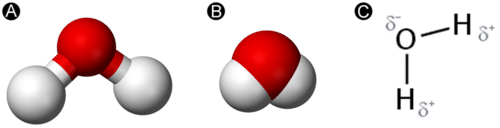

The bent shape of the water molecule is critical because the polar O-H bonds do not cancel one another, so the molecule as a whole is polar. The figure below (**Figure** [below](#x-ck12-SW50Q2gtMTUtMDMtV2F0ZXItbmV0LXBvbGFyaXR5)) illustrates the net polarity of the water molecule. The oxygen is the negative end of the molecule, while the area between the hydrogen atoms is the positive end of the molecule.

Polar molecules attract one another by dipole-dipole forces; the positive end of one molecule is attracted to the negative end of a nearby molecule. In the case of water, the highly polar O-H bonds leave very little electron density around the hydrogen atoms. Each hydrogen atom is strongly attracted to the lone-pair electrons on the oxygen atom of an adjacent molecule. These are called hydrogen bonds, and they are stronger than conventional dipole-dipole forces (**Figure** [below](#x-ck12-SW50Q2gtMTUtMDQtSHlkcm9nZW4tQm9uZA..)).

Because each oxygen atom has two lone pairs, it can make hydrogen bonds to the hydrogen atoms of two other molecules. The figure below (**Figure** [below](#x-ck12-SW50Q2gtMTUtMDUtSC1ib25kLXRldHJhaGVkcmFs)) shows the result—an approximately tetrahedral geometry around each oxygen atom consisting of two covalent bonds and two hydrogen bonds.

### Structure of Ice

Liquid water is a fluid. The hydrogen bonds in liquid water constantly break and reform as the water molecules tumble past one another. As water cools, its molecular motion slows, and the molecules move gradually closer to one another. The density of any liquid increases as its temperature decreases. For most liquids, this continues as the liquid freezes, and the solid state is denser than the liquid state. However, water behaves differently. It actually reaches its highest density at about 4°C (**Table** [below](#x-ck12-dGFibGU6VGFibGUtMTUuMQ..)).

---

&nbsp;

|     |     |
| --- | --- |Densities of Water and Ice
| Temperature (°C) | Density (g/cm_3_) |
| --- | --- |
| 100 (liquid) | 0.9584 |
| 50  | 0.9881 |
| 25  | 0.9971 |
| 10  | 0.9997 |
| 4   | 1.000 |
| 0 (liquid) | 0.9998 |
| 0 (solid) | 0.9168 |

Between 4°C and 0°C, the density of water gradually decreases as the hydrogen bonds begin to form a network characterized by a generally hexagonal structure with open spaces in the middle of the hexagons (**Figure** [below](#x-ck12-SW50Q2gtMTUtMDYtTGlxdWlkLXZzLWljZQ..)).

 consists of molecules connected by hydrogen bonds that are short-lived, since water is a fluid. In ice (right), the hydrogen bonds become rigid, resulting in an interconnected, hexagonally shaped molecular framework.")

Ice is less dense than liquid water, so it floats. Ponds or lakes begin to freeze at the surface, closer to the cold air. A layer of ice forms, but it does not sink as it would if water did not freeze in this unique structure, which is dictated by its shape, polarity, and hydrogen bonding. If the ice were to sink as it froze, entire lakes would freeze solid. Since the ice does not sink, liquid water remains under the ice all winter long. This is important, as fish and other organisms are capable of surviving through winter (**Figure** [below](#x-ck12-SW50Q2gtMTUtMDctSWNlLUZpc2hpbmc.)). Ice is one of only very few solids that is less dense than its liquid form.

Properties of Water
-------------------

Compared to other molecular compounds of relatively low molar mass, ice melts at a very high temperature. A great deal of energy is required to break apart the hydrogen-bonded network of ice and return it to the liquid state. Likewise, the boiling point of water is very high. Most molecular compounds of similar molar mass are gases at room temperature.

### Surface Tension

Surface tension was discussed in the chapter, _States of Matter_. Water has a high surface tension because of its strong intermolecular hydrogen bonds. Surface tension can be seen by the curved meniscus that forms when water is in a thin column, such as a graduated cylinder or a buret (**Figure** [below](#x-ck12-SW50Q2gtMTUtMDgtTWVuaXNjdXM.)).

 forms because of water’s hydrogen bonding. The diagram on the right shows the correct way to use a graduated cylinder to measure the volume of a liquid.")

### Vapor Pressure

The hydrogen bonding between liquid water molecules also explains water’s unusually low vapor pressure for a molecule of its size. Relatively few molecules of water are capable of escaping the surface of the liquid and entering the vapor phase. Because evaporation is slow, the resulting vapor exerts a low pressure in a closed container. Low vapor pressure is an important physical property of water that prevents lakes, oceans, and other large bodies of water from evaporating at a much faster rate.

Lesson Summary
--------------

* Water is a molecular compound consisting of polar molecules that have a bent shape. The oxygen atom acquires a partial negative charge, while the hydrogen atoms acquire partial positive charges.
* Hydrogen bonding between water molecules is responsible for its high surface tension, low vapor pressure, and high melting and boiling points relative to other molecular substances with similar molar masses.
* The rigid hydrogen bonds in ice form an open network that causes the solid form of water to be less dense than its liquid form. As a result, ice floats in liquid water.

Lesson Review Questions
-----------------------

### Reviewing Concepts

1.  What is the shape of a water molecule?
2.  What physical property of an element determines whether it acquires a positive or negative partial charge when participating in a polar covalent bond?
3.  How many hydrogen bonds is each water molecule capable of making?
4.  Why is ice less dense than water?
5.  Discuss the environmental consequences if ice were denser than water.
6.  How does the vapor pressure of water at a given temperature compare to that of other substances with similar molar masses? Explain. How does this affect the rate of evaporation of bodies of water?

### Problems

7.  Use the table above (**Table** [above](#x-ck12-dGFibGU6VGFibGUtMTUuMQ..)) to answer the following.
    1.  What is the volume of 100.0 g of water at 100°C?
    2.  What is the volume of 100.0 g of water at 4°C?
    3.  What is the volume of 100.0 g of water at 0°C?
    4.  What is the volume of 100.0 g of ice at 0°C?
8.  A completely full bottle of boiling water is placed in the freezer. Discuss what happens as the water cools and eventually freezes.
9.  Explain which property of water is responsible for each of the following phenomena.
    1.  An asphalt road breaks apart as water seeps into small cracks and freezes.
    2.  A bottle of gasoline evaporates more quickly than a bottle of water.
    3.  Water forms nearly spherical drops as it slowly drips out of a faucet.

Further Reading / Supplemental Links
------------------------------------

* Walter Wick, _A Drop of Water: A Book of Science and Wonder_. Scholastic Press, 1997.
* The Hydrogen Bond, (http://www.wisc-online.com/Objects/ViewObject.aspx?ID=GCH1004)
* Yves Marechal, _The Hydrogen Bond and the Water Molecule: The Physics and Chemistry of Water, Aqueous and Bio Media_. Elsevier Science, 2006.
* John Gregory, _Particles in Water: Properties and Processes_. CRC Press, 2005.

Points to Consider
------------------

Water is often referred to as the universal solvent because it is capable of dissolving so many different substances.

* How does the structure of water aid it in its ability to dissolve solids?
* What is the nature of solutions made from ionic and molecular compounds?

</article>

### 15.2 Aqueous Solutions

<article>

Lesson Objectives
-----------------

* Define a solution and describe the parts of a solution.
* Describe how an aqueous solution is formed from both ionic compounds and molecular compounds.
* Explain the reasons why some compounds are insoluble in water.
* Write equations for the dissociation of ionic compounds in water.
* Distinguish between strong electrolytes, weak electrolytes, and nonelectrolytes.

Lesson Vocabulary
-----------------

* aqueous solution
* dissociation
* electrolyte
* hydration
* immiscible
* miscible
* nonelectrolyte
* solute
* solution
* solvation
* solvent
* strong electrolyte
* weak electrolyte

Check Your Understanding
------------------------

### Recalling Prior Knowledge

* What makes a water molecule polar?
* What is the difference between a homogeneous and a heterogeneous mixture?

Water is called the universal solvent because it is capable of dissolving so many different things. The geological processes of erosion and weathering are a direct result of water’s dissolving power. In this lesson, we begin to examine aqueous solutions and how they form.

Forming a Solution
------------------

When one substance dissolves into another, a solution is formed. A **solution** _is a homogeneous mixture consisting of a solute dissolved into a solvent_. The **solute** _is the substance that is being dissolved_, while the **solvent** _is the dissolving medium_. Solutions can be formed with many different types and forms of solutes and solvents. In this chapter, we will focus on solutions where the solvent is water. An **aqueous solution** _is water that contains one or more dissolved substances_. The dissolved substances in an aqueous solution may be solids, gases, or other liquids.

In order to be a true solution, a mixture must be stable. When sugar is fully dissolved into water, it can stand for an indefinite amount of time, and the sugar will not settle out of the solution. Further, if the sugar-water solution is passed through a filter, it will remain unchanged (**Figure** [below](#x-ck12-SW50Q2gtMTUtMDktRmlsdGVy)). The dissolved sugar particles will pass through the filter along with the water. This is because the dissolved particles in a solution are very small, usually less than 1 nm in diameter. Solute particles can be atoms, ions, or molecules, depending on the type of substance that has been dissolved.

### The Dissolving Process

Water typically dissolves most ionic compounds and polar molecules. Nonpolar molecules, such as those found in grease or oil, do not dissolve in water. We will first examine the process that occurs when an ionic compound, such as table salt (sodium chloride), dissolves in water.

Water molecules move about continuously due to their kinetic energy. When a crystal of sodium chloride is placed into water, the water’s molecules collide with the crystal lattice. Recall that the crystal lattice is composed of alternating positive and negative ions. Water is attracted to the sodium chloride crystal because water is polar; it has both a positive and a negative end. The positively charged sodium ions in the crystal attract the oxygen end of the water molecules because they are partially negative. The negatively charged chloride ions in the crystal attract the hydrogen end of the water molecules because they are partially positive. The action of the polar water molecules takes the crystal lattice apart (**Figure** [below](#x-ck12-SW50Q2gtMTUtMDktRGlzc29sdmluZw..)).

After coming apart from the crystal, _the individual ions are then surrounded by solvent particles in a process called_ **solvation**. Note in the **Figure** [above](#x-ck12-SW50Q2gtMTUtMDktRGlzc29sdmluZw..) that the individual Na_+_ ions are surrounded by water molecules with the oxygen atom oriented near the positive ion. Likewise, the chloride ions are surrounded by water molecules with the opposite orientation. **Hydration** _is the process of solute particles being surrounded by water molecules arranged in a specific manner_. Hydration helps to stabilize aqueous solutions by preventing the positive and negative ions from coming back together and forming a precipitate.

Table sugar is made of the molecular compound sucrose (C12H22O11). Solid sugar consists of individual sugar molecules held together by intermolecular attractive forces. When water dissolves sugar, it separates the individual sugar molecules by disrupting the attractive forces, but it _does not break the covalent bonds_ between the carbon, hydrogen, and oxygen atoms. Dissolved sugar molecules are also hydrated. The hydration shell around a molecule of sucrose is arranged so that its partially negative oxygen atoms are near the partially positive hydrogen atoms in the solvent, and vice versa.

### Insoluble Compounds

Not all compounds dissolve well in water. Some ionic compounds, such as calcium carbonate (CaCO3) and silver chloride (AgCl), are nearly insoluble. This is because the attractions between the ions in the crystal lattice are stronger than the attraction that the water molecules have for the ions. As a result, the crystal remains intact.

Nonpolar compounds also do not dissolve in water. The attractive forces that operate between the particles in a nonpolar compound are weak dispersion forces. In order for a nonpolar molecule to dissolve in water, it would need to break up some of the hydrogen bonds between adjacent water molecules. In the case of an ionic substance, these favorable interactions are replaced by other attractive interactions between the ions and the partial charges on water. However, interactions between nonpolar molecules and water are less favorable than the interactions that water makes with itself. When a nonpolar liquid such as oil is mixed with water, two separate layers form, because the liquids will not dissolve into each other (**Figure** [below](#x-ck12-SW50Q2gtMTUtMTAtV2F0ZXItT2ls)). When a polar liquid like ethanol is mixed with water, they completely blend and dissolve into one another. _Liquids that dissolve in one another in all proportions are said to be_ **miscible**. _Liquids that do not dissolve in one another are called_ **immiscible**. The general rule for deciding if one substance is capable of dissolving another is “like dissolves like,” where the property being compared is the overall polarity of the substance. For example, a nonpolar solid such as iodine will dissolve in nonpolar lighter fluid, but it will not dissolve in polar water.

Electrolytes and Nonelectrolytes
--------------------------------

An **electrolyte** _is a compound that conducts an electric current when it is dissolved in water or melted_. In order to conduct a current, a substance must contain mobile ions that can move from one electrode to the other. All ionic compounds are electrolytes. When ionic compounds dissolve, they break apart into ions, which are then able to conduct a current. Even insoluble ionic compounds, such as CaCO3, are considered electrolytes because they can conduct a current in the molten (melted) state.

A **nonelectrolyte** _is a compound that does not conduct an electric current in either aqueous solution or in the molten state_. Many molecular compounds, such as sugar or ethanol, are nonelectrolytes. When these compounds dissolve in water, they do not produce ions. Illustrated below (**Figure** [below](#x-ck12-SW50Q2gtMTUtMTEtTGlnaHRidWxi)) is the difference between an electrolyte and a nonelectrolyte.

### Dissociation

Earlier, you saw how an ionic crystal lattice breaks apart when it is dissolved in water. **Dissociation** _is the separation of ions that occurs when a solid ionic compound dissolves_. Simply undo the crisscross method that you learned when writing chemical formulas for ionic compounds, and you are left with the components of an ionic dissociation equation. The subscripts for the ions in the chemical formulas become the coefficients of the respective ions on the product side of the equation. Shown below are dissociation equations for NaCl, Ca(NO3)2 (**Figure** [below](#x-ck12-SW50Q2gtMTUtMTItQ2FsY2l1bS1OaXRyYXRl)), and (NH4)3PO4.

______NaCl(_s_) → Na_+_(_aq_) + Cl_\-_(_aq_)__

NaCl(_s_) → Na_+_(_aq_) + Cl_\-_(_aq_)__

__NaCl(_s_) → Na_+_(_aq_) + Cl_\-_(_aq_)__

NaCl(_s_) → Na_+_(_aq_) + Cl_\-_(_aq_)__

____(NH4)3PO4(_s_) → 3NH4_+_(_aq_) + PO4_3-_(_aq_)__

(NH4)3PO4(_s_) → 3NH4_+_(_aq_) + PO4_3-_(_aq_)__

__(NH4)3PO4(_s_) → 3NH4_+_(_aq_) + PO4_3-_(_aq_)__

(NH4)3PO4(_s_) → 3NH4_+_(_aq_) + PO4_3-_(_aq_)

One formula unit of sodium chloride dissociates into one sodium ion and one chloride ion. The calcium nitrate formula unit dissociates into one calcium ion and two nitrate ions, because the 2+ charge of each calcium ion requires two nitrate ions (each with a charge of 1-) to form an electrically neutral compound. The ammonium phosphate formula unit dissociates into three ammonium ions and one phosphate ion.

Do not confuse the subscripts of the atoms within the polyatomic ion for the subscripts that result from the crisscrossing of the charges that make the original compound neutral. The 3 subscript of the nitrate ion and the 4 subscript of the ammonium ion are part of the polyatomic ion and remain a part of the ionic formula after the compound dissociates. Notice that the compounds are solids (_s_) that become ions when dissolved in water, producing an aqueous solution (_aq_).

Nonelectrolytes do not dissociate when forming an aqueous solution. An equation can still be written that simply shows the solid going into solution. For example, the process of dissolving sucrose in water can be written as follows:

______C12H22O11(_s_) → C12H22O11(_aq_)__

C12H22O11(_s_) → C12H22O11(_aq_)__

__C12H22O11(_s_) → C12H22O11(_aq_)__

C12H22O11(_s_) → C12H22O11(_aq_)__

____C12H22O11(_s_) → C12H22O11(_aq_)__

C12H22O11(_s_) → C12H22O11(_aq_)__

__C12H22O11(_s_) → C12H22O11(_aq_)__

C12H22O11(_s_) → C12H22O11(_aq_)

### Strong and Weak Electrolytes

Some polar molecular compounds are nonelectrolytes when they are in their pure state but become electrolytes when they are dissolved in water. Hydrogen chloride (HCl) is a gas in its pure molecular state and is a nonelectrolyte. However, when HCl is dissolved in water, it conducts a current well because the HCl molecule ionizes into hydrogen and chloride ions.

______HCl(_g_) → H_+_(_aq_) + Cl_\-_(_aq_)__

HCl(_g_) → H_+_(_aq_) + Cl_\-_(_aq_)__

__HCl(_g_) → H_+_(_aq_) + Cl_\-_(_aq_)__

HCl(_g_) → H_+_(_aq_) + Cl_\-_(_aq_)__

____HCl(_g_) → H_+_(_aq_) + Cl_\-_(_aq_)__

HCl(_g_) → H_+_(_aq_) + Cl_\-_(_aq_)__

__HCl(_g_) → H_+_(_aq_) + Cl_\-_(_aq_)__

HCl(_g_) → H_+_(_aq_) + Cl_\-_(_aq_)

When HCl is dissolved into water, it is called hydrochloric acid. Ionic compounds and some polar compounds are completely broken apart into ions and thus conduct a current very well. A **strong electrolyte** _is a solution in which a large fraction of the dissolved solute exists as ions_.

Some other polar molecular compounds become electrolytes upon being dissolved into water but do not ionize to a very great extent. For example, nitrous acid only partially ionizes into hydrogen ions and nitrite ions when dissolved in water. Aqueous nitrous acid is composed of only about 5% ions and 95% intact nitrous acid molecules. A **weak electrolyte** _is a solution in which only a small fraction of the dissolved solute exists as ions_. The equation showing the ionization of a weak electrolyte utilizes a double arrow, indicating an equilibrium between the reactants and products.

______$\text{HNO}_2{(aq)} \rightleftharpoons \text{H}^+{(aq)}+\text{NO}^-_2{(aq)}$__

$\text{HNO}_2{(aq)} \rightleftharpoons \text{H}^+{(aq)}+\text{NO}^-_2{(aq)}$__

__$\text{HNO}_2{(aq)} \rightleftharpoons \text{H}^+{(aq)}+\text{NO}^-_2{(aq)}$__

$\text{HNO}_2{(aq)} \rightleftharpoons \text{H}^+{(aq)}+\text{NO}^-_2{(aq)}$__

____$\text{HNO}_2{(aq)} \rightleftharpoons \text{H}^+{(aq)}+\text{NO}^-_2{(aq)}$__

$\text{HNO}_2{(aq)} \rightleftharpoons \text{H}^+{(aq)}+\text{NO}^-_2{(aq)}$__

__$\text{HNO}_2{(aq)} \rightleftharpoons \text{H}^+{(aq)}+\text{NO}^-_2{(aq)}$__

$\text{HNO}_2{(aq)} \rightleftharpoons \text{H}^+{(aq)}+\text{NO}^-_2{(aq)}$

Lesson Summary
--------------

* A solution is a homogeneous mixture in which a solute is dissolved by a solvent. Solutions that have water as the solvent are called aqueous solutions.
* Water is able to dissolve many ionic compounds because of the attraction between the polar water molecules and the ions in the crystal lattice. Water can also dissolve some solid molecular compounds by disrupting the intermolecular attractive forces. Some compounds are insoluble in water because the forces holding the solute particles together are too strong to be overcome.
* Ionic compounds are electrolytes because they dissociate into ions when dissolved in water. Many molecular compounds are nonelectrolytes. Polar molecular compounds may be either strong or weak electrolytes, depending on the extent of their ionization in aqueous solution.

Lesson Review Questions
-----------------------

### Reviewing Concepts

1.  Identify the solvent and the solute for a solution of sugar in water.
2.  Why is water a good solvent for most ionic and polar covalent compounds but not for nonpolar compounds?
3.  What is the difference between solvation and hydration?
4.  What type of particles must be present in a solution for it to conduct electricity?
5.  When iron(III) nitrate dissolves in water, what ion is attracted to the oxygen atom of the water molecule? What ion is attracted to the hydrogen atoms?
6.  How is a weak electrolyte different from a strong electrolyte? What types of compounds can be weak electrolytes?
7.  What types of liquids are miscible with water? What types are immiscible?

### Problems

8.  Which of the following would dissolve in water and which would not? Explain each choice.
    1.  CH4
    2.  HBr
    3.  AgCl
    4.  K2SO4
    5.  I2
    6.  NH4Cl
9.  Write dissociation equations for the following strong electrolytes.
    1.  CoCl3
    2.  NH4Br
    3.  Al(NO3)3
    4.  Na2CO3
    5.  ZnSO4
    6.  Li2S
10. Hydrogen fluoride gas is a polar covalent molecular compound that dissolves in water to form a weak electrolyte. Write the equation for this process.
11. Methanol (CH3OH) is a nonelectrolyte, but it is miscible with water. Write an equation for the dissolution of methanol in water.

Further Reading / Supplemental Links
------------------------------------

* Inquiry in Action/ Chemistry Review: Dissolving, (http://www.inquiryinaction.org/chemistryreview/dissolving/)

Points to Consider
------------------

Water is capable of interacting with some substances without forming a true solution.

* What are suspensions and colloids?
* How can a colloid be distinguished from a solution?

</article>

### 15.3 Colloids and Suspensions

<article>

Lesson Objectives
-----------------

* Describe the properties of a suspension.
* Describe the properties of a colloid and distinguish from a solution or a suspension.

Lesson Vocabulary
-----------------

* colloid
* emulsion
* suspension
* Tyndall effect

Check Your Understanding
------------------------

### Recalling Prior Knowledge

* What are the identifying characteristics of a heterogeneous mixture?
* What prevents oil and water from being miscible?

Solutions are homogeneous mixtures, meaning that a solution is completely uniform throughout. There are two other types of mixtures that are related to a solution, but which are heterogeneous. In this lesson, you will learn the distinguishing characteristics of suspensions and colloids.

Suspensions
-----------

Take a glass of water and throw in a handful of sand or dirt. Stir it and stir it and stir it. Have you made a solution? Sand and dirt do not dissolve in water, and, though it may look homogeneous for a few moments, the sand or dirt gradually sinks to the bottom of the glass (**Figure** [below](#x-ck12-SW50Q2gtMTUtMTMtU2VkaW1lbnQ.)).

. The diameter for the dispersed particles in a suspension, such as the sand in the suspension described above, is typically at least 1000 times greater than those in a solution. Unlike a solution, the dispersed particles can be separated from the dispersion medium by filtering. Suspensions are still considered heterogeneous because the different substances in the mixture will not remain uniformly dispersed if they are not actively being mixed.")

Colloids
--------

A colloid is a heterogeneous mixture in which the dispersed particles are intermediate in size between those of a solution and a suspension. The particles are spread evenly throughout the dispersion medium, which can be a solid, liquid, or gas. Because the dispersed particles of a colloid are not as large as those of a suspension, they do not settle out upon standing. The table below (**Table** [below](#x-ck12-dGFibGU6VGFibGUtMTUuMg..)) summarizes the properties and distinctions between solutions, colloids, and suspensions.

|     |     |     |
| --- | --- | --- |Properties of Solutions, Colloids, and Suspensions
| Solutions | Colloids | Suspensions |
| --- | --- | --- |
| Homogeneous | Heterogeneous | Heterogeneous |
| Particle size: 0.01-1 nm; atoms, ions, or molecules | Particle size: 1-1000 nm, dispersed; large molecules or aggregates | Particle size: over 1000 nm, suspended; large particles or aggregates |
| Do not separate on standing | Do not separate on standing | Particles settle out |
| Cannot be separated by filtration | Cannot be separated by filtration | Can be separated by filtration |
| Do not scatter light | Scatter light (Tyndall effect) | May either scatter light or be opaque |

Colloids are unlike solutions because their dispersed particles are much larger than those of a solution. The dispersed particles of a colloid cannot be separated by filtration, but they scatter light, a phenomenon called the Tyndall effect.

---

&nbsp;

### Tyndall Effect

Colloids are often confused with true homogeneous solutions because the individual dispersed particles of a colloid cannot be seen. When light is passed through a true solution, the dissolved particles are too small to deflect the light. However, the dispersed particles of a colloid, being larger, do deflect light (**Figure** [below](#x-ck12-SW50Q2gtMTUtMTQtVHluZGFsbC1FZmZlY3Q.)). The **Tyndall effect** _is the scattering of visible light by colloidal particles_. You have undoubtedly “seen” a light beam as it passes through fog, smoke, or a scattering of dust particles suspended in air. All three are examples of colloids. Suspensions may scatter light, but if the number of suspended particles is sufficiently large, the suspension may simply be opaque, and the light scattering will not occur.

 Light passes first through a colorless solution and is not scattered. When it passes through a diluted milk solution, the light is scattered by colloidal particles, an observation called the Tyndall effect. (B) The Tyndall effect allows sunlight to be seen as it passes through a fine mist.")

### Examples of Colloids

Listed below (**Table** [below](#x-ck12-dGFibGU6VGFibGUtMTUuMw..)) are examples of colloidal systems, most of which are very familiar. Some of these are shown below (**Figure** [below](#x-ck12-SW50Q2gtMTUtMTUtQ29sbG9pZHM.)). The dispersed phase describes the particles, while the dispersion medium is the material in which the particles are distributed.

|     |     |     |     |
| --- | --- | --- | --- |Classes of Colloids
| Class of Colloid | Dispersed Phase | Dispersion Medium | Examples |
| --- | --- | --- | --- |
| Sol and gel | solid | liquid | paint, jellies, blood, gelatin, mud |
| Solid aerosol | solid | gas | smoke, dust in air |
| Solid emulsion | liquid | solid | cheese, butter |
| Liquid emulsion | liquid | liquid | milk, mayonnaise |
| Liquid aerosol | liquid | gas | fog, mist, clouds, aerosol spray |
| Foam | gas | solid | marshmallow |
| Foam | gas | liquid | whipped cream, shaving cream |

 gelatin dessert (gel); (B) smoke (solid aerosol); (C) butter (solid emulsion); (D) mayonnaise (liquid emulsion); (E) fog (liquid aerosol); (F) marshmallows (foam); (G) whipped cream (foam).")

Another property of a colloidal system is observed when the colloids are studied under a light microscope. The colloids scintillate, reflecting brief flashes of light because the colloidal particles move in a rapid and random fashion. This phenomenon, called Brownian motion, is caused by collisions between the small colloidal particles and the molecules of the dispersion medium.

### Emulsions

Butter and mayonnaise are examples of a class of colloids called emulsions. An **emulsion** _is a colloidal dispersion of a liquid in either a liquid or a solid_. A stable emulsion requires an emulsifying agent to be present. Mayonnaise is made in part of oil and vinegar. Since oil is nonpolar, and vinegar is a polar aqueous solution, the two do not mix and would quickly separate into layers. However, the addition of egg yolk causes the mixture to become stable and not separate. Egg yolk is capable of interacting with both the polar vinegar and the nonpolar oil. The egg yolk is called the emulsifying agent. Soap acts as an emulsifying agent between grease and water. Grease cannot be simply rinsed off your hands or another surface because it is insoluble in water. However, the soap stabilizes a grease-water mixture because one end of a soap molecule is polar, and the other end is nonpolar. This allows the grease to be removed from your hands or your clothing by washing with soapy water.

Lesson Summary
--------------

* Suspensions and colloids are heterogeneous mixtures. A suspension is identifiable because its particles are large and settle out of the dispersing medium due to the effects of gravity.
* The dispersed particles of a colloid are intermediate in size between those of a solution and a suspension. Colloids are distinguishable from solutions because of the light scattering phenomenon called the Tyndall effect. Gels, aerosols, foams, and emulsions are some classes of colloids.

Lesson Review Questions
-----------------------

### Reviewing Concepts

1.  How can you distinguish between a suspension and a solution?
2.  How big are the particles in a colloid compared to those of a suspension and a solution?
3.  What is the Tyndall effect? Why don’t solutions demonstrate the Tyndall effect?
4.  Explain the difference between the dispersed phase and the dispersing medium of a colloid.
5.  Explain the difference between an emulsion and an emulsifying agent.
6.  If you add a large spoonful of salt to a glass of standing water, the salt sinks to the bottom. Is this a suspension? Explain.

### Problems

7.  Identify each of the following descriptions or examples as being representative of a solution, suspension, or colloid. More than one answer may apply.
    1.  dispersed particles can be filtered out
    2.  heterogeneous
    3.  particles are not visible to the unaided eye
    4.  paint
    5.  lemonade with no pulp
    6.  particle size larger than 1 nm
    7.  milk
    8.  particles do not settle upon standing
    9.  fog

Further Reading / Supplemental Links
------------------------------------

* Types of Mixtures – Solutions, Suspensions, Colloids, (http://www.edinformatics.com/math_science/mixtures.htm)

Points to Consider
------------------

Solutions have a wide array of properties and uses. While some solutes are very soluble in certain solvents, some other solutes are not.

* How is solubility measured?
* What factors affect solubility?

</article>

## 16.0 Solutions

<article>

_Image copyright dextroza, 2014. www.shutterstock.com. Used under license from Shutterstock.com._

</article>

### 16.1 Solubility

<article>

Lesson Objectives
-----------------

* List examples of solutions made from different solute-solvent combinations.
* List and explain three factors that affect the rate of dissolving of a solid solute in a liquid solvent.
* Explain solution equilibrium and distinguish between saturated, unsaturated, and supersaturated solutions.
* Explain the effects of temperature on the solubility of solids and gases. Use a solubility curve to determine the solubilities of substances at various temperatures.
* Use Henry’s law and explain the effect of pressure on the solubility of gases.

Lesson Vocabulary
-----------------

* Henry’s law
* recrystallization
* saturated solution
* solubility
* solution equilibrium
* supersaturated solution
* unsaturated solution

Check Your Understanding
------------------------

### Recalling Prior Knowledge

* What is a solvent and what is a solute?
* How does a liquid solvent dissolve a solid solute?

Solutions are of great importance in chemical reactions. In this lesson, you will learn about the factors that affect the solubility of substances and the rate of dissolving.

Solution Components
-------------------

The focus in the chapter _Water_ was on water and its role in the formation of aqueous solutions. We examined the primary characteristics of a solution, how water is able to dissolve solid solutes, and we differentiated between a solution, a suspension, and a colloid. There are many examples of solutions that do not involve water at all, or solutions that involve solutes that are not solids. The table below (**Table** [below](#x-ck12-dGFibGU6VGFibGUtMTYuMQ..)) summarizes the possible combinations of solute-solvent states, along with examples of each.

|     |     |     |
| --- | --- | --- |Solute-Solvent Combinations
| Solute State | Solvent State | Example |
| --- | --- | --- |
| liquid | gas | water in air |
| gas | gas | oxygen in nitrogen (gas mixture) |
| solid | liquid | salt in water |
| liquid | liquid | alcohol in water |
| gas | liquid | carbon dioxide in water |
| solid | solid | zinc in copper (brass alloy) |
| liquid | solid | mercury in silver and tin (dental amalgam) |

Our air is a homogeneous mixture of many different gases and, therefore, qualifies as a solution. Solid-solid solutions, such as brass, bronze, and sterling silver, are called alloys. Fish depend on oxygen gas that is dissolved in the water found in oceans, lakes, and rivers (**Figure** [below](#x-ck12-SW50Q2gtMTYtMDEtQXF1YXJpdW0.)). While solid-liquid and aqueous solutions comprise the majority of solutions encountered in the chemistry laboratory, it is important to be aware of the other possibilities.

Rate of Dissolving
------------------

We know that the dissolving of a solid by water depends upon the collisions that occur between the solvent molecules and the particles in the solid crystal. Anything that can be done to increase the frequency of those collisions and/or to give those collisions more energy will increase the rate of dissolving. Imagine that you were trying to dissolve some sugar in a glassful of tea. A packet of granulated sugar would dissolve faster than a cube of sugar. The rate of dissolving would be increased by stirring, or agitating the solution. Finally, the sugar would dissolve faster in hot tea than it would in cold tea.

### Surface Area

The rate at which a solute dissolves depends upon the size of the solute particles. Dissolving is a surface phenomenon, since it depends on solvent molecules colliding with the outer surface of the solute. A given quantity of solute dissolves faster when it is ground into small particles than if it is in the form of a large chunk, because more surface is exposed. The packet of granulated sugar exposes far more surface area to the solvent and dissolves more quickly than the sugar cube.

### Agitation of the Solution

Dissolving sugar in water will occur more quickly if the water is stirred. The stirring allows fresh solvent molecules to continually be in contact with the solute. If it is not stirred, then the water right at the surface of the solute becomes saturated with dissolved sugar molecules, meaning that it is more difficult for additional solute to dissolve. The sugar cube would eventually dissolve because random motions of the water molecules would bring enough fresh solvent into contact with the sugar, but the process would take much longer. It is important to realize that neither stirring nor breaking up a solute affect the overall amount of solute that dissolves. It only affects the rate of dissolving.

### Temperature

Heating up the solvent gives the molecules more kinetic energy. The more rapid motion means that the solvent molecules collide with the solute with greater frequency, and the collisions occur with more force. Both factors increase the rate at which the solute dissolves. As we will see in the next section, a temperature change not only affects the rate of dissolving, but it also affects the amount of solute that can be dissolved.

Types of Solutions
------------------

Table salt (NaCl) readily dissolves in water. Suppose that you have a beaker of water to which you add some salt, stirring until it dissolves. Then you add more, and that dissolves as well. If you keep adding more and more salt, eventually you will reach a point at which no more of the salt will dissolve, no matter how long or how vigorously you stir it. Why? On the molecular level, we know that the action of the water causes the individual ions to break apart from the salt crystal and enter the solution, where they remain hydrated by water molecules. What also happens is that some of the dissolved ions collide back again with the crystal and remain there. **Recrystallization** _is the process of dissolved solute returning to the solid state_. At some point, the rate at which the solid salt is dissolving becomes equal to the rate at which the dissolved solute is recrystallizing. When that point is reached, the total amount of dissolved salt remains unchanged. **Solution equilibrium** _is the physical state described by the opposing processes of dissolution and recrystallization occurring at the same rate_. The solution equilibrium for the dissolving of sodium chloride can be represented by one of two equations.

______$\text{NaCl}{(s)} \rightleftharpoons \text{NaCl}{(aq)}$__

$\text{NaCl}{(s)} \rightleftharpoons \text{NaCl}{(aq)}$__

__$\text{NaCl}{(s)} \rightleftharpoons \text{NaCl}{(aq)}$__

$\text{NaCl}{(s)} \rightleftharpoons \text{NaCl}{(aq)}$__

____$\text{NaCl}{(s)} \rightleftharpoons \text{NaCl}{(aq)}$__

$\text{NaCl}{(s)} \rightleftharpoons \text{NaCl}{(aq)}$__

__$\text{NaCl}{(s)} \rightleftharpoons \text{NaCl}{(aq)}$__

$\text{NaCl}{(s)} \rightleftharpoons \text{NaCl}{(aq)}$

While this shows the change of state back and forth between solid and aqueous solution, the preferred equation also shows the dissociation that occurs as an ionic solid dissolves.

______$\text{NaCl}{(s)} \rightleftharpoons \text{Na}^+{(aq)}+\text{Cl}^-{(aq)}$__

$\text{NaCl}{(s)} \rightleftharpoons \text{Na}^+{(aq)}+\text{Cl}^-{(aq)}$__

__$\text{NaCl}{(s)} \rightleftharpoons \text{Na}^+{(aq)}+\text{Cl}^-{(aq)}$__

$\text{NaCl}{(s)} \rightleftharpoons \text{Na}^+{(aq)}+\text{Cl}^-{(aq)}$__

____$\text{NaCl}{(s)} \rightleftharpoons \text{Na}^+{(aq)}+\text{Cl}^-{(aq)}$__

$\text{NaCl}{(s)} \rightleftharpoons \text{Na}^+{(aq)}+\text{Cl}^-{(aq)}$__

__$\text{NaCl}{(s)} \rightleftharpoons \text{Na}^+{(aq)}+\text{Cl}^-{(aq)}$__

$\text{NaCl}{(s)} \rightleftharpoons \text{Na}^+{(aq)}+\text{Cl}^-{(aq)}$

When the solution equilibrium point is reached and no more solute will dissolve, the solution is said to be saturated. A **saturated solution** _is a solution that contains the maximum amount of solute that is capable of being dissolved_. At 20°C, the maximum amount of NaCl that will dissolve in 100. g of water is 36.0 g. If any more NaCl is added past that point, it will not dissolve because the solution is saturated. What if more water is added to the solution instead? Now, more NaCl would be capable of dissolving, since there is additional solvent present. An **unsaturated solution** _is a solution that contains less than the maximum amount of solute that is capable of being dissolved_. The figure below (**Figure** [below](#x-ck12-SW50Q2gtMTYtMDItU2F0dXJhdGVk)) illustrates the above process, and shows the distinction between unsaturated and saturated.

How can you tell if a solution is saturated or unsaturated? If more solute is added and it does not dissolve, then the original solution was saturated. If the added solute dissolves, then the original solution was unsaturated. A solution that has been allowed to reach equilibrium, but still has extra undissolved solute at the bottom of the container, must be saturated (**Figure** [below](#x-ck12-SW50Q2gtMTYtMDMtU2FsdC1XYXRlcg..)).

 with undissolved solute remaining at the bottom of the measuring cup.")

### Solubility Values

The **solubility** _of a substance is the amount of that substance that is required to form a saturated solution in a given amount of solvent at a specified temperature_. Solubility is often measured as grams of solute per 100 g of solvent. The solubility of sodium chloride in water is 36.0 g per 100 g water at 20°C. The temperature must be specified because solubility varies with temperature. For gases, the pressure must also be specified. Solubility is specific for a particular solvent. In other words, the solubility of sodium chloride would be different in another solvent. For the purposes of this text, the solubility of a substance will refer to aqueous solubility unless otherwise specified. Solubilities for different solutes have a very wide variation, as can be seen by the data presented below (**Table** [below](#x-ck12-dGFibGU6VGFibGUtMTYuMg..)).

|     |     |     |     |     |     |     |
| --- | --- | --- | --- | --- | --- | --- |Solubility of Solutes at Different Temperatures (in g/100 g H
| Substance | 0°C | 20°C | 40°C | 60°C | 80°C | 100°C |
| --- | --- | --- | --- | --- | --- | --- |
| AgNO3 | 122 | 216 | 311 | 440 | 585 | 733 |
| Ba(OH)2 | 1.67 | 3.89 | 8.22 | 20.94 | 101.4 | —   |
| C12H22O11 | 179 | 204 | 238 | 287 | 362 | 487 |
| Ca(OH)2 | 0.189 | 0.173 | 0.141 | 0.121 | —   | 0.07 |
| KCl | 28.0 | 34.2 | 40.1 | 45.8 | 51.3 | 56.3 |
| KI  | 128 | 144 | 162 | 176 | 192 | 206 |
| KNO3 | 13.9 | 31.6 | 61.3 | 106 | 167 | 245 |
| LiCl | 69.2 | 83.5 | 89.8 | 98.4 | 112 | 128 |
| NaCl | 35.7 | 35.9 | 36.4 | 37.1 | 38.0 | 39.2 |
| NaNO3 | 73  | 87.6 | 102 | 122 | 148 | 180 |
| CO2 (1 atm) | 0.335 | 0.169 | 0.0973 | 0.058 | —   | —   |
| O2 (1 atm) | 0.00694 | 0.00537 | 0.00308 | 0.00227 | 0.00138 | 0.00 |

Factors Affecting Solubility
----------------------------

The solubility of a solid or a liquid solute in a solvent is affected by the temperature, while the solubility of a gaseous solute is affected by both the temperature and the pressure of the gas. We will examine the effects of temperature and pressure separately.

### Temperature

The solubility of the majority of solid substances increases as the temperature increases. However, the effect is difficult to predict and varies widely from one solute to another. The temperature dependence of solubility can be visualized with the help of a solubility curve, which is a graph of the solubility vs. temperature. Examine the solubility curves shown below (**Figure** [below](#x-ck12-SW50Q2gtMTYtMDQtU29sdWJpbGl0eS1DdXJ2ZXM.)).

Notice how the temperature dependence of NaCl is fairly flat, meaning that an increase in temperature has relatively little effect on the solubility of NaCl. The curve for KNO3, on the other hand, is very steep; an increase in temperature dramatically increases the solubility of KNO3.

Several substances listed on the graph—HCl, NH3, and SO2—have solubilities that decrease as the temperature increases. These substances are all gases over the indicated temperature range when at standard pressure. When a solvent with a gas dissolved in it is heated, the kinetic energy of both the solvent and solute increases. As the kinetic energy of the gaseous solute increases, its molecules have a greater tendency to escape the attraction of the solvent molecules and return back to the gas phase. As a result, the solubility of a gas decreases as the temperature increases. This has some profound environmental consequences. Industrial plants situated near bodies of water often use that water as a coolant, returning the warmer water back to the lake or river. This increases the overall temperature of the water, which lowers the quantity of dissolved oxygen, affecting the survival of fish and other organisms.

Solubility curves can be used to determine if a given solution is saturated or unsaturated. Suppose that 80 g of KNO3 is added to 100 g of water at 30°C. According to the solubility curve, approximately 48 g of KNO3 will dissolve at 30°C. This means that the solution will be saturated, since 48 g is less than 80 g. We can also determine that there will be 80 – 48 = 32 g of undissolved KNO3 remaining at the bottom of the container. Now, suppose that this saturated solution is heated to 60°C. According to the curve, the solubility of KNO3 at 60°C is about 107 g. The solution is now unsaturated, since it still contains only the original 80 g of solute, all of which is now dissolved. Then, suppose the solution is cooled all the way down to 0°C. The solubility at 0°C is about 14 g, meaning that 80 – 14 = 66 g of the KNO3 will recrystallize.

Some solutes, such as sodium acetate, do not recrystallize easily. Suppose an exactly saturated solution of sodium acetate is prepared at 50°C. As it cools back to room temperature, crystals do not immediately appear in the solution, even though the solubility of sodium acetate is lower at room temperature. A **supersaturated solution** _is a solution that contains more than the maximum amount of solute that is capable of being dissolved at a given temperature_. The recrystallization of the excess dissolved solute in a supersaturated solution can be initiated by the addition of a tiny crystal of solute, called a seed crystal. The seed crystal provides a nucleation site on which the excess dissolved crystals can begin to grow. Recrystallization from a supersaturated solution is typically very fast.

This video shows the rapid recrystallization that occurs after a sodium acetate seed crystal is added to a supersaturated solution: http://www.youtube.com/watch?v=0wifFbGDv4I (1:07).

!?[video](https://www.youtube.com/watch?v=0wifFbGDv4I)

### Pressure

Pressure has very little effect on the solubility of solids or liquids, but it has a significant effect on the solubility of gases. Gas solubility increases as the partial pressure of a gas above the liquid increases. Suppose a certain volume of water is in a closed container with the space above it occupied by carbon dioxide gas at standard pressure. Some of the CO2 molecules come into contact with the surface of the water and dissolve into the liquid. Now suppose that more CO2 is added to the space above the container, causing a pressure increase. More CO2 molecules are now in contact with the water, so more of them dissolve. Thus the solubility increases as the pressure increases. As with a solid, the CO2 that is undissolved reaches an equilibrium with the dissolved CO2, represented by the following equation.

______$\text{CO}_{2}{(g)} \rightleftharpoons \text{CO}_{2}{(aq)}$__

$\text{CO}_{2}{(g)} \rightleftharpoons \text{CO}_{2}{(aq)}$__

__$\text{CO}_{2}{(g)} \rightleftharpoons \text{CO}_{2}{(aq)}$__

$\text{CO}_{2}{(g)} \rightleftharpoons \text{CO}_{2}{(aq)}$__

____$\text{CO}_{2}{(g)} \rightleftharpoons \text{CO}_{2}{(aq)}$__

$\text{CO}_{2}{(g)} \rightleftharpoons \text{CO}_{2}{(aq)}$__

__$\text{CO}_{2}{(g)} \rightleftharpoons \text{CO}_{2}{(aq)}$__

$\text{CO}_{2}{(g)} \rightleftharpoons \text{CO}_{2}{(aq)}$

At equilibrium, the rate of gaseous CO2 dissolving is equal to the rate of dissolved CO2 coming out of the solution.

When carbonated beverages are packaged, they are done so under high CO2 pressure so that a large amount of carbon dioxide dissolves in the liquid. When the bottle is open, the equilibrium is disrupted because the CO2 pressure above the liquid decreases. Immediately, bubbles of CO2 rapidly exit the solution and escape out of the top of the open bottle. The amount of dissolved CO2 decreases. If the bottle is left open for an extended period of time, the beverage becomes “flat” as more and more CO2 comes out of the liquid.

The relationship of gas solubility to pressure is described by Henry’s Law, named after English chemist, William Henry (1774-1836). **Henry’s Law** _states that the solubility of a gas in a liquid is directly proportional to the partial pressure of the gas above the liquid_. Henry’s Law can be written as follows:

______$\mathrm{\dfrac{S_1}{P_1}=\dfrac{S_2}{P_2}}$__

$\mathrm{\dfrac{S_1}{P_1}=\dfrac{S_2}{P_2}}$__

__$\mathrm{\dfrac{S_1}{P_1}=\dfrac{S_2}{P_2}}$__

$\mathrm{\dfrac{S_1}{P_1}=\dfrac{S_2}{P_2}}$__

____$\mathrm{\dfrac{S_1}{P_1}=\dfrac{S_2}{P_2}}$__

$\mathrm{\dfrac{S_1}{P_1}=\dfrac{S_2}{P_2}}$__

__$\mathrm{\dfrac{S_1}{P_1}=\dfrac{S_2}{P_2}}$__

$\mathrm{\dfrac{S_1}{P_1}=\dfrac{S_2}{P_2}}$

S1 and P1 are the solubility and partial pressure of a certain gas at an initial set of conditions; S2 and P2 are the solubility and partial pressure of the same gas under a different set of conditions. Solubilities of gases are typically reported in g/L, as seen in Sample Problem 16.1.

**Sample Problem 16.1: Henry's Law**

The solubility of a certain gas in water is 0.745 g/L at standard pressure. What is its solubility when the pressure of the gas present above the solution is raised to 4.50 atm? The temperature is constant at 20°C.

_Step 1: List the known quantities and plan the problem._

Known

* S1 = 0.745 g/L
* P1 = 1.00 atm
* P2 = 4.50 atm

Unknown

* S2 = ? g/L

Substitute into Henry’s law and solve for S2.

_Step 2: Solve._

______$\mathrm{S_2=\dfrac{S_1 \times P_2}{P_1}=\dfrac{0.745 \ g/L \times 4.50 \ atm}{1.00 \ atm}=3.35 \ g/L}$__

$\mathrm{S_2=\dfrac{S_1 \times P_2}{P_1}=\dfrac{0.745 \ g/L \times 4.50 \ atm}{1.00 \ atm}=3.35 \ g/L}$__

__$\mathrm{S_2=\dfrac{S_1 \times P_2}{P_1}=\dfrac{0.745 \ g/L \times 4.50 \ atm}{1.00 \ atm}=3.35 \ g/L}$__

$\mathrm{S_2=\dfrac{S_1 \times P_2}{P_1}=\dfrac{0.745 \ g/L \times 4.50 \ atm}{1.00 \ atm}=3.35 \ g/L}$__

____$\mathrm{S_2=\dfrac{S_1 \times P_2}{P_1}=\dfrac{0.745 \ g/L \times 4.50 \ atm}{1.00 \ atm}=3.35 \ g/L}$__

$\mathrm{S_2=\dfrac{S_1 \times P_2}{P_1}=\dfrac{0.745 \ g/L \times 4.50 \ atm}{1.00 \ atm}=3.35 \ g/L}$__

__$\mathrm{S_2=\dfrac{S_1 \times P_2}{P_1}=\dfrac{0.745 \ g/L \times 4.50 \ atm}{1.00 \ atm}=3.35 \ g/L}$__

$\mathrm{S_2=\dfrac{S_1 \times P_2}{P_1}=\dfrac{0.745 \ g/L \times 4.50 \ atm}{1.00 \ atm}=3.35 \ g/L}$

_Step 3: Think about your result._

The solubility is increased to 4.5 times its original value, which makes sense for a direct relationship.

**_Practice Problem_**

1.  The solubility of a gas is 1.67 g/L at a pressure of 1230 mmHg. At what pressure will the solubility be 1.12 g/L?

Lesson Summary
--------------

* Solutions can consist of solutes and solvents that are solids, liquids, or gases.
* The rate at which a solid solute dissolves in a liquid solvent increases when the surface area of the solute is increased, the mixture is agitated, or the temperature is raised.
* The maximum amount of solute capable of dissolving in a solvent is called its solubility. Solutions can be unsaturated, saturated, or supersaturated, depending on the amount of solute dissolved relative to its solubility at the given temperature.
* Solubility is dependent on temperature. For solids, solubility generally increases with an increase in temperature. For gases, solubility decreases with an increase in temperature.
* Henry’s Law describes the direct relationship between the solubility of a gas in a liquid and the pressure of the gas.

Lesson Review Questions
-----------------------

### Reviewing Concepts

1.  What determines how fast a substance will dissolve in a given solvent?
2.  What is the requirement for reaching solution equilibrium?
3.  What are two things that you could do to change an unsaturated solid/liquid solution into a saturated solution?
4.  A given solution is clear and colorless. A single crystal of solute is added to the solution. Describe what happens in each of the following situations.
    1.  The original solution was saturated.
    2.  The original solution was unsaturated.
    3.  The original solution was supersaturated.
5.  Explain how a supersaturated solution must be prepared.
6.  Under which set of conditions is the solubility of a gas in a liquid the greatest?
    1.  low temperature and low pressure
    2.  low temperature and high pressure
    3.  high temperature and low pressure
    4.  high temperature and high pressure

### Problems

7.  List the original states (solid, liquid, or gas) of the solute and solvent that are combined to make each of the following solutions.
    1.  an alloy
    2.  salt water
    3.  carbonated water
    4.  oil in gasoline

Use the solubility curve from the text (**Figure** [above](#x-ck12-SW50Q2gtMTYtMDQtU29sdWJpbGl0eS1DdXJ2ZXM.)) to answer questions 8-10.

8.  Answer the following:
    1.  How many grams of NH4Cl are required to make a saturated solution in 100 g of water at 70°C?
    2.  How many grams of NH4Cl could be dissolved in 200 g of water at 70°C?
    3.  At what temperature is a solution of 50 grams of KNO3 dissolved in 100 grams of water a saturated solution?
    4.  Which two substances in the above graph have the same solubility at 85°C?
    5.  How many grams of NaNO3 can be dissolved in 100 grams of water to make a saturated solution at 25°C?
    6.  How much KI can be dissolved in 5 grams of water at 20°C to make a saturated solution?
9.  An exactly saturated solution of KClO3 is prepared at 90°C using 100 grams of water. If the solution is cooled to 20°C, how many grams of KClO3 will recrystallize?
10. Indicate whether the following solutions are unsaturated, saturated, or supersaturated. Assume that all three could potentially form a supersaturated solution.
    1.  22 grams of KClO3 is dissolved in 100 g of water at 50°C.
    2.  60 grams of KNO3 is dissolved in 100 g of water at 50°C.
    3.  50 grams of NaCl is dissolved in 100 g of water at 50°C.
11. The solubility of a gas in water is 3.28 g/L at 304 kPa. What is its solubility at standard pressure?

Further Reading / Supplemental Links
------------------------------------

* Solubility of Things, http://www.solubilityofthings.com/
* Solubility Curves, http://www.kentchemistry.com/links/Kinetics/SolubilityCurves.htm
* Henry’s Law, http://www.kentchemistry.com/links/Kinetics/HenrysLaw.htm

Points to Consider
------------------

Solutions are prepared by dissolving a certain amount of solute in a certain amount of solvent. The concentration of a solution is a quantitative measure of how much solute has been dissolved.

* What are the ways in which the concentration of a solution can be calculated?
* What happens to the concentration of a solution when additional solvent is added?

</article>

### 16.2 Solution Concentration

<article>

Lesson Objectives
-----------------

* Use the terms concentrated and dilute to describe the relative concentration of a solution.
* Calculate the concentration of a solution as either a mass percent or a volume percent.
* Calculate the molarity of a solution. Use molarity to calculate the mass of solute needed to prepare a particular solution.
* Calculate the molarity of a diluted solution. Use the dilution equation to calculate the volume of a concentrated stock solution required for a particular dilution.
* Calculate the molality of a solution and distinguish molality from molarity.

Lesson Vocabulary
-----------------

* concentrated
* concentration
* dilute
* molality
* molarity

Check Your Understanding
------------------------

### Recalling Prior Knowledge

* How is percent by mass of a compound calculated?
* How are grams of a substance converted to moles?

So far, you have studied how solutions can form and the limits to the amount of solute that can possibly dissolve in a solvent at a given temperature and pressure. In this lesson, you will learn how to quantitatively express the amount of solute present in any solution.

Percent Solutions
-----------------

There are several ways to express the amount of solute present in a solution. The **concentration** _of a solution is a measure of the amount of solute that has been dissolved in a given amount of solvent or solution_. A **concentrated** _solution is one that has a relatively large amount of dissolved solute_. A **dilute** _solution is one that has a relatively small amount of dissolved solute_. However, these terms are relative, and we need to be able to express concentration in a more exact, quantitative manner. Still, concentrated and dilute are useful as terms to compare one solution to another (**Figure** [below](#x-ck12-SW50Q2gtMTYtMDYtUmVkLUR5ZQ..)). Also, be aware that the terms “concentrate” and “dilute” can be used as verbs. If you were to heat a solution, causing the solvent to evaporate, you would be concentrating it, because the ratio of solute to solvent would be increasing. If you were to add more water to an aqueous solution, you would be diluting it because the ratio of solute to solvent would be decreasing.

 to the most concentrated (on the right).")

One way to describe the concentration of a solution is by the percent of the solution that is composed of the solute. This percentage can be determined in one of two ways: (1) the mass of the solute divided by the mass of the solution, or (2) the volume of the solute divided by the volume of the solution. Because these methods generally result in slightly different values, it is important to always indicate whether a given percentage was calculated "by mass" or "by volume."

### Mass Percent

When the solute in a solution is a solid, a convenient way to express the concentration is a mass percent (mass/mass), which is the grams of solute per 100 g of solution.

______$\text{Percent by mass}=\dfrac{\text{mass of solute}}{\text{mass of solution}} \times 100\%$__

$\text{Percent by mass}=\dfrac{\text{mass of solute}}{\text{mass of solution}} \times 100\%$__

__$\text{Percent by mass}=\dfrac{\text{mass of solute}}{\text{mass of solution}} \times 100\%$__

$\text{Percent by mass}=\dfrac{\text{mass of solute}}{\text{mass of solution}} \times 100\%$__

____$\text{Percent by mass}=\dfrac{\text{mass of solute}}{\text{mass of solution}} \times 100\%$__

$\text{Percent by mass}=\dfrac{\text{mass of solute}}{\text{mass of solution}} \times 100\%$__

__$\text{Percent by mass}=\dfrac{\text{mass of solute}}{\text{mass of solution}} \times 100\%$__

$\text{Percent by mass}=\dfrac{\text{mass of solute}}{\text{mass of solution}} \times 100\%$

Suppose that a solution was prepared by dissolving 25.0 g of sugar into 100 g of water. The percent by mass would be calculated as follows:

______$\text{Percent by mass}=\dfrac{25 \ \text{g sugar}}{125 \ \text{g solution}} \times 100\%=20. \ \text{sugar}$__

$\text{Percent by mass}=\dfrac{25 \ \text{g sugar}}{125 \ \text{g solution}} \times 100\%=20. \ \text{sugar}$__

__$\text{Percent by mass}=\dfrac{25 \ \text{g sugar}}{125 \ \text{g solution}} \times 100\%=20. \ \text{sugar}$__

$\text{Percent by mass}=\dfrac{25 \ \text{g sugar}}{125 \ \text{g solution}} \times 100\%=20. \ \text{sugar}$__

____$\text{Percent by mass}=\dfrac{25 \ \text{g sugar}}{125 \ \text{g solution}} \times 100\%=20. \ \text{sugar}$__

$\text{Percent by mass}=\dfrac{25 \ \text{g sugar}}{125 \ \text{g solution}} \times 100\%=20. \ \text{sugar}$__

__$\text{Percent by mass}=\dfrac{25 \ \text{g sugar}}{125 \ \text{g solution}} \times 100\%=20. \ \text{sugar}$__

$\text{Percent by mass}=\dfrac{25 \ \text{g sugar}}{125 \ \text{g solution}} \times 100\%=20. \ \text{sugar}$

Sometimes, you may want to make a particular amount of solution with a certain percent by mass and will need to calculate what mass of the solute is needed. For example, let's say you need to make 3000 g of a sodium chloride solution that is 5% by mass. You can rearrange and solve for the mass of solute.

______$$
\begin{align*}
\text{mass of solute}&=\dfrac{\text{percent by mass}}{100\%} \times \text{mass of solution}\\
&= \dfrac{5\%}{100\%} \times 3000 \ \text{g}\\
&=150 \ \text{g NaCl}
\end{align*}
$$__

$$
\begin{align*}
\text{mass of solute}&=\dfrac{\text{percent by mass}}{100\%} \times \text{mass of solution}\\
&= \dfrac{5\%}{100\%} \times 3000 \ \text{g}\\
&=150 \ \text{g NaCl}
\end{align*}
$$__

__$$
\begin{align*}
\text{mass of solute}&=\dfrac{\text{percent by mass}}{100\%} \times \text{mass of solution}\\
&= \dfrac{5\%}{100\%} \times 3000 \ \text{g}\\
&=150 \ \text{g NaCl}
\end{align*}
$$__

$$
\begin{align*}
\text{mass of solute}&=\dfrac{\text{percent by mass}}{100\%} \times \text{mass of solution}\\
&= \dfrac{5\%}{100\%} \times 3000 \ \text{g}\\
&=150 \ \text{g NaCl}
\end{align*}
$$__

____$$
\begin{align*}
\text{mass of solute}&=\dfrac{\text{percent by mass}}{100\%} \times \text{mass of solution}\\
&= \dfrac{5\%}{100\%} \times 3000 \ \text{g}\\
&=150 \ \text{g NaCl}
\end{align*}
$$__

$$
\begin{align*}
\text{mass of solute}&=\dfrac{\text{percent by mass}}{100\%} \times \text{mass of solution}\\
&= \dfrac{5\%}{100\%} \times 3000 \ \text{g}\\
&=150 \ \text{g NaCl}
\end{align*}
$$__

__$$
\begin{align*}
\text{mass of solute}&=\dfrac{\text{percent by mass}}{100\%} \times \text{mass of solution}\\
&= \dfrac{5\%}{100\%} \times 3000 \ \text{g}\\
&=150 \ \text{g NaCl}
\end{align*}
$$__

$$
\begin{align*}
\text{mass of solute}&=\dfrac{\text{percent by mass}}{100\%} \times \text{mass of solution}\\
&= \dfrac{5\%}{100\%} \times 3000 \ \text{g}\\
&=150 \ \text{g NaCl}
\end{align*}
$$

You would need to weigh out 150 g of NaCl and add it to 2850 g of water. Notice that it was necessary to subtract the mass of the NaCl (150 g) from the mass of solution (3000 g) to calculate the mass of the water that would need to be added.

### Volume Percent

The percentage of solute in a solution can more easily be determined by volume when the solute and solvent are both liquids. The volume of the solute divided by the volume of solution expressed as a percent, yields the percent by volume (volume/volume) of the solution. If a solution is made by taking 40. mL of ethanol and adding enough water to make 240. mL of solution, the percent by volume is:

______$$
\begin{align*}
\text{Percent by volume}&=\dfrac{\text{volume of solute}}{\text{volume of solution}} \times 100. \\
&=\dfrac{40 \ \text{mL ethanol}}{240 \ \text{mL solution}} \times 100. \\
&=16.7. \ \text{ethanol}
\end{align*}
$$__

$$
\begin{align*}
\text{Percent by volume}&=\dfrac{\text{volume of solute}}{\text{volume of solution}} \times 100. \\
&=\dfrac{40 \ \text{mL ethanol}}{240 \ \text{mL solution}} \times 100. \\
&=16.7. \ \text{ethanol}
\end{align*}
$$__

__$$
\begin{align*}
\text{Percent by volume}&=\dfrac{\text{volume of solute}}{\text{volume of solution}} \times 100. \\
&=\dfrac{40 \ \text{mL ethanol}}{240 \ \text{mL solution}} \times 100. \\
&=16.7. \ \text{ethanol}
\end{align*}
$$__

$$
\begin{align*}
\text{Percent by volume}&=\dfrac{\text{volume of solute}}{\text{volume of solution}} \times 100. \\
&=\dfrac{40 \ \text{mL ethanol}}{240 \ \text{mL solution}} \times 100. \\
&=16.7. \ \text{ethanol}
\end{align*}
$$__

____$$
\begin{align*}
\text{Percent by volume}&=\dfrac{\text{volume of solute}}{\text{volume of solution}} \times 100. \\
&=\dfrac{40 \ \text{mL ethanol}}{240 \ \text{mL solution}} \times 100. \\
&=16.7. \ \text{ethanol}
\end{align*}
$$__

$$
\begin{align*}
\text{Percent by volume}&=\dfrac{\text{volume of solute}}{\text{volume of solution}} \times 100. \\
&=\dfrac{40 \ \text{mL ethanol}}{240 \ \text{mL solution}} \times 100. \\
&=16.7. \ \text{ethanol}
\end{align*}
$$__

__$$
\begin{align*}
\text{Percent by volume}&=\dfrac{\text{volume of solute}}{\text{volume of solution}} \times 100. \\
&=\dfrac{40 \ \text{mL ethanol}}{240 \ \text{mL solution}} \times 100. \\
&=16.7. \ \text{ethanol}
\end{align*}
$$__

$$
\begin{align*}
\text{Percent by volume}&=\dfrac{\text{volume of solute}}{\text{volume of solution}} \times 100. \\
&=\dfrac{40 \ \text{mL ethanol}}{240 \ \text{mL solution}} \times 100. \\
&=16.7. \ \text{ethanol}
\end{align*}
$$

Frequently, ingredient labels on food products and medicines have amounts listed as percentages (**Figure** [below](#x-ck12-SW50Q2gtMTYtMDctTGFiZWwtaHlkcm9nZW4tcGVyb3hpZGU.)).

It should be noted that, unlike in the case of mass, you cannot simply add together the volumes of solute and solvent to get the final solution volume. When adding a solute and solvent together, mass is conserved, but volume is not. In the example above, a solution was made by starting with 40 mL of ethanol and adding enough water to make 240 mL of solution. Simply mixing 40 mL of ethanol and 200 mL of water would not give you the same result, as the final volume would probably not be exactly 240 mL.

Molarity
--------

Chemists primarily need the concentration of solutions to be expressed in a way that accounts for the number of particles present that could react according to a particular chemical equation. Since percentage measurements are based on either mass or volume, they are generally not useful for chemical reactions. A concentration unit based on moles is preferable. The **molarity (M)** _of a solution is the number of moles of solute dissolved in one liter of solution_. To calculate the molarity of a solution, you divide the moles of solute by the volume of the solution expressed in liters.

______$\text{Molarity (M)}=\dfrac{\text{moles of solute}}{\text{liters of solution}}=\dfrac{\text{mol}}{\text{L}}$__

$\text{Molarity (M)}=\dfrac{\text{moles of solute}}{\text{liters of solution}}=\dfrac{\text{mol}}{\text{L}}$__

__$\text{Molarity (M)}=\dfrac{\text{moles of solute}}{\text{liters of solution}}=\dfrac{\text{mol}}{\text{L}}$__

$\text{Molarity (M)}=\dfrac{\text{moles of solute}}{\text{liters of solution}}=\dfrac{\text{mol}}{\text{L}}$__

____$\text{Molarity (M)}=\dfrac{\text{moles of solute}}{\text{liters of solution}}=\dfrac{\text{mol}}{\text{L}}$__

$\text{Molarity (M)}=\dfrac{\text{moles of solute}}{\text{liters of solution}}=\dfrac{\text{mol}}{\text{L}}$__

__$\text{Molarity (M)}=\dfrac{\text{moles of solute}}{\text{liters of solution}}=\dfrac{\text{mol}}{\text{L}}$__

$\text{Molarity (M)}=\dfrac{\text{moles of solute}}{\text{liters of solution}}=\dfrac{\text{mol}}{\text{L}}$

Note that the volume is in liters of solution and not liters of solvent. When a molarity is reported, the unit is the symbol M, which is read as “molar”. For example, a solution labeled as 1.5 M NH3 is a “1.5 molar solution of ammonia.”

**Sample Problem 16.2: Calculating Molarity**

A solution is prepared by dissolving 42.23 g of NH4Cl into enough water to make 500.0 mL of solution. Calculate its molarity.

_Step 1: List the known quantities and plan the problem._

Known

* mass of NH4Cl = 42.23 g
* molar mass of NH4Cl = 53.50 g/mol
* volume of solution = 500.0 mL = 0.5000 L

Unknown

* molarity = ? M

The mass of the ammonium chloride is first converted to moles. Then, the molarity is calculated by dividing by liters. Note that the given volume has been converted to liters.

_Step 2: Solve._

______$\text{42.23 g NH}_4\text{Cl} \times \dfrac{1 \ \text{mol NH}_4\text{Cl}}{53.50 \ \text{g NH}_4\text{Cl}}=0.7893\ \text{mol NH}_4\text{Cl}$__

$\text{42.23 g NH}_4\text{Cl} \times \dfrac{1 \ \text{mol NH}_4\text{Cl}}{53.50 \ \text{g NH}_4\text{Cl}}=0.7893\ \text{mol NH}_4\text{Cl}$__

__$\text{42.23 g NH}_4\text{Cl} \times \dfrac{1 \ \text{mol NH}_4\text{Cl}}{53.50 \ \text{g NH}_4\text{Cl}}=0.7893\ \text{mol NH}_4\text{Cl}$__

$\text{42.23 g NH}_4\text{Cl} \times \dfrac{1 \ \text{mol NH}_4\text{Cl}}{53.50 \ \text{g NH}_4\text{Cl}}=0.7893\ \text{mol NH}_4\text{Cl}$__

____$\dfrac{0.7893 \ \text{mol NH}_4\text{Cl}}{0.5000 \ \text{L}}=1.579 \ \text{M}$__

$\dfrac{0.7893 \ \text{mol NH}_4\text{Cl}}{0.5000 \ \text{L}}=1.579 \ \text{M}$__

__$\dfrac{0.7893 \ \text{mol NH}_4\text{Cl}}{0.5000 \ \text{L}}=1.579 \ \text{M}$__

$\dfrac{0.7893 \ \text{mol NH}_4\text{Cl}}{0.5000 \ \text{L}}=1.579 \ \text{M}$

_Step 3: Think about your result._

The molarity is 1.579 M, meaning that a liter of the solution would contain 1.579 moles of NH4Cl. Having four significant figures is appropriate.

**_Practice Problem_**

1.  What is the molarity of a solution for which 250. mL of the solution contains 10.0 g of Pb(NO3)2?

In a laboratory situation, a chemist must frequently prepare a given volume of a solution with a specific molarity. The first task is to calculate the mass of the solute that is necessary. The molarity equation can be rearranged to solve for moles, which can then be converted to grams, as shown in Sample Problem 16.3.

**Sample Problem 16.3: Finding the Necessary Mass of Solute**

A chemist needs to prepare 3.00 L of a 0.250 M solution of potassium permanganate (KMnO4). What mass of KMnO4 does she need to make the solution?

_Step 1: List the known quantities and plan the problem._

Known

* molarity = 0.250 M
* volume = 3.00 L
* molar mass of KMnO4 = 158.04 g/mol

Unknown

* mass of KMnO4 = ? g

Moles of solute is calculated by multiplying molarity by liters. Then, moles is converted to grams.

_Step 2: Solve._

______$0.250 \ \text{M KMnO}_4 \times 3.00 \ \text{L solution}=0.750 \ \text{mol KMnO}_4$__

$0.250 \ \text{M KMnO}_4 \times 3.00 \ \text{L solution}=0.750 \ \text{mol KMnO}_4$__

__$0.250 \ \text{M KMnO}_4 \times 3.00 \ \text{L solution}=0.750 \ \text{mol KMnO}_4$__

$0.250 \ \text{M KMnO}_4 \times 3.00 \ \text{L solution}=0.750 \ \text{mol KMnO}_4$__

____$0.750 \ \text{mol KMnO}_4 \times \dfrac{158.04 \ \text{g KMnO}_4}{1 \ \text{mol KMnO}_4}=119 \ \text{g KMnO}_4$__

$0.750 \ \text{mol KMnO}_4 \times \dfrac{158.04 \ \text{g KMnO}_4}{1 \ \text{mol KMnO}_4}=119 \ \text{g KMnO}_4$__

__$0.750 \ \text{mol KMnO}_4 \times \dfrac{158.04 \ \text{g KMnO}_4}{1 \ \text{mol KMnO}_4}=119 \ \text{g KMnO}_4$__

$0.750 \ \text{mol KMnO}_4 \times \dfrac{158.04 \ \text{g KMnO}_4}{1 \ \text{mol KMnO}_4}=119 \ \text{g KMnO}_4$

_Step 3: Think about your result._

When 119 g of potassium permanganate is dissolved in enough water to make 3.00 L of solution, the molarity is 0.250 M.

**_Practice Problem_**

2.  What mass of CaCl2 is needed to make 600. mL of a 0.380 M solution?

### Preparing Solutions

If you are attempting to prepare 1.00 L of a 1.00 M solution of NaCl, you would obtain 58.44 g of sodium chloride. However you cannot simply add the sodium chloride to 1.00 L of water. After the solute dissolves, the volume of the solution will be slightly greater than a liter because the hydrated sodium and chloride ions take up space in the solution. Instead, a volumetric flask needs to be used. Volumetric flasks come in a variety of sizes (**Figure** [below](#x-ck12-SW50Q2gtMTYtMDgtVm9sdW1ldHJpYy1GbGFza3M.)) and are designed so that a chemist can precisely and accurately prepare a solution of one specific volume.

In other words, you cannot use a 1-liter volumetric flask to make 500 mL of a solution. It can only be used to prepare 1 liter of a solution. The steps to follow when preparing a solution with a 1-liter volumetric flask are outlined and shown below (**Figure** [below](#x-ck12-SW50Q2gtMTYtMDktU29sdXRpb24tUHJlcGFyYXRpb24.)).

1.  The appropriate mass of solute is weighed out and added to a volumetric flask that has been about half-filled with distilled water.
2.  The solution is swirled until all of the solute dissolves.
3.  More distilled water is carefully added up to the line etched on the neck of the flask.
4.  The flask is capped and inverted several times to completely mix the solution.

 Weigh out the correct mass of solute. (B) Dissolve the solute into the desired solvent in a partially filled volumetric flask. (C) Add more solvent until the fill line on the flask is reached, and then mix.")

Dilutions
---------

When additional water is added to an aqueous solution, the concentration of that solution decreases. This is because the number of moles of the solute does not change, but the total volume of the solution increases. We can set up an equality between the moles of the solute before the dilution (1) and the moles of the solute after the dilution (2).

______mol1 = mol2__

mol1 = mol2__

__mol1 = mol2__

mol1 = mol2__

____mol1 = mol2__

mol1 = mol2__

__mol1 = mol2__

mol1 = mol2

Since the moles of solute in a solution is equal to the molarity multiplied by the volume in liters, we can set those equal.

______M1 × L1 = M2 × L2__

M1 × L1 = M2 × L2__

__M1 × L1 = M2 × L2__

M1 × L1 = M2 × L2__

____M1 × L1 = M2 × L2__

M1 × L1 = M2 × L2__

__M1 × L1 = M2 × L2__

M1 × L1 = M2 × L2

Finally, because the two sides of the equation are set equal to one another, the volume can be in any units we choose, as long as that unit is the same on both sides. Our equation for calculating the molarity of a diluted solution becomes:

______M1 × V1 = M2 × V2__

M1 × V1 = M2 × V2__

__M1 × V1 = M2 × V2__

M1 × V1 = M2 × V2__

____M1 × V1 = M2 × V2__

M1 × V1 = M2 × V2__

__M1 × V1 = M2 × V2__

M1 × V1 = M2 × V2

Suppose that you have 100. mL of a 2.0 M solution of HCl. You dilute the solution by adding enough water to make the solution volume 500. mL. The new molarity can easily be calculated by using the above equation and solving for M2.

______$\mathrm{M_2=\dfrac{M_1 \times V_1}{V_2}=\dfrac{2.0 M \times 100. mL}{500. mL}=0.40 \ M \ HCl}$__

$\mathrm{M_2=\dfrac{M_1 \times V_1}{V_2}=\dfrac{2.0 M \times 100. mL}{500. mL}=0.40 \ M \ HCl}$__

__$\mathrm{M_2=\dfrac{M_1 \times V_1}{V_2}=\dfrac{2.0 M \times 100. mL}{500. mL}=0.40 \ M \ HCl}$__

$\mathrm{M_2=\dfrac{M_1 \times V_1}{V_2}=\dfrac{2.0 M \times 100. mL}{500. mL}=0.40 \ M \ HCl}$__

____$\mathrm{M_2=\dfrac{M_1 \times V_1}{V_2}=\dfrac{2.0 M \times 100. mL}{500. mL}=0.40 \ M \ HCl}$__

$\mathrm{M_2=\dfrac{M_1 \times V_1}{V_2}=\dfrac{2.0 M \times 100. mL}{500. mL}=0.40 \ M \ HCl}$__

__$\mathrm{M_2=\dfrac{M_1 \times V_1}{V_2}=\dfrac{2.0 M \times 100. mL}{500. mL}=0.40 \ M \ HCl}$__

$\mathrm{M_2=\dfrac{M_1 \times V_1}{V_2}=\dfrac{2.0 M \times 100. mL}{500. mL}=0.40 \ M \ HCl}$

The solution has been diluted by a factor of five, since the new volume is five times as great as the original volume. Consequently, the molarity is one-fifth of its original value.

Another common dilution problem involves deciding how much of a highly concentrated solution is required to make a desired quantity of solution with a lower concentration. The highly concentrated solution is typically referred to as the stock solution.

**Sample Problem 16.4: Dilution of a Stock Solution**

Nitric acid (HNO3) is a powerful and corrosive acid. When ordered from a chemical supply company, its molarity is 16 M. How much of the stock solution of nitric acid needs to be used to make 8.00 L of a 0.50 M solution?

_Step 1: List the known quantities and plan the problem._

Known

* stock HNO3 (M1) = 16 M
* V2 = 8.00 L
* M2 = 0.50 M

Unknown

* volume of stock HNO3 (V1) = ? L

The unknown in the equation is V1, the necessary volume of the concentrated stock solution.

_Step 2: Solve._

______$\mathrm{V_1=\dfrac{M_2 \times V_2}{M_1}=\dfrac{0.50 \ M \times 8.00 \ L}{16 \ M}=0.25 \ L=250 \ mL}$__

$\mathrm{V_1=\dfrac{M_2 \times V_2}{M_1}=\dfrac{0.50 \ M \times 8.00 \ L}{16 \ M}=0.25 \ L=250 \ mL}$__

__$\mathrm{V_1=\dfrac{M_2 \times V_2}{M_1}=\dfrac{0.50 \ M \times 8.00 \ L}{16 \ M}=0.25 \ L=250 \ mL}$__

$\mathrm{V_1=\dfrac{M_2 \times V_2}{M_1}=\dfrac{0.50 \ M \times 8.00 \ L}{16 \ M}=0.25 \ L=250 \ mL}$__

____$\mathrm{V_1=\dfrac{M_2 \times V_2}{M_1}=\dfrac{0.50 \ M \times 8.00 \ L}{16 \ M}=0.25 \ L=250 \ mL}$__

$\mathrm{V_1=\dfrac{M_2 \times V_2}{M_1}=\dfrac{0.50 \ M \times 8.00 \ L}{16 \ M}=0.25 \ L=250 \ mL}$__

__$\mathrm{V_1=\dfrac{M_2 \times V_2}{M_1}=\dfrac{0.50 \ M \times 8.00 \ L}{16 \ M}=0.25 \ L=250 \ mL}$__

$\mathrm{V_1=\dfrac{M_2 \times V_2}{M_1}=\dfrac{0.50 \ M \times 8.00 \ L}{16 \ M}=0.25 \ L=250 \ mL}$

_Step 3: Think about your result._

250 mL of the stock HNO3 solution needs to be diluted with water to a final volume of 8.00 L. The dilution from 16 M to 0.5 M is a factor of 32.

**_Practice Problems_**

3.  125 mL of a 2.55 M solution of Zn(NO3)2 is diluted with water to make the final volume 197 mL. Calculate the new molarity.
4.  What volume of a 1.50 M solution of KCl needs to be diluted in order to prepare 2.40 L of a 0.0750 M solution?

Dilutions can be performed in the laboratory with various tools, depending on the volumes required and the desired accuracy. The image below (**Figure** [below](#x-ck12-SW50Q2gtMTYtMTAtUGlwZXR0ZXM.)) illustrates the use of two different types of pipettes. The use of a calibrated pipette instead of a graduated cylinder improves accuracy. In the figure on the right, the student is using a micropipette, which is designed to quickly and accurately dispense very small volumes. Micropipettes are adjustable and come in a variety of sizes.

 A graduated glass pipette is used to perform a dilution. (B) A micropipette is used to deliver small volumes of a liquid.")

Molality
--------

A final way to express the concentration of a solution is by its molality. The **molality (****_m_****)** _of a solution is the moles of solute divided by the kilograms of solvent_. A solution that contains 1.0 mol of NaCl dissolved in 1.0 kg of water is a “one molal” solution of sodium chloride. The symbol for molality is a lower-case m written in italics.

______$\mathrm{Molality} \ (m)=\mathrm{\dfrac{moles \ of \ solute}{kilograms \ of \ solvent}=\dfrac{mol}{kg}}$__

$\mathrm{Molality} \ (m)=\mathrm{\dfrac{moles \ of \ solute}{kilograms \ of \ solvent}=\dfrac{mol}{kg}}$__

__$\mathrm{Molality} \ (m)=\mathrm{\dfrac{moles \ of \ solute}{kilograms \ of \ solvent}=\dfrac{mol}{kg}}$__

$\mathrm{Molality} \ (m)=\mathrm{\dfrac{moles \ of \ solute}{kilograms \ of \ solvent}=\dfrac{mol}{kg}}$__

____$\mathrm{Molality} \ (m)=\mathrm{\dfrac{moles \ of \ solute}{kilograms \ of \ solvent}=\dfrac{mol}{kg}}$__

$\mathrm{Molality} \ (m)=\mathrm{\dfrac{moles \ of \ solute}{kilograms \ of \ solvent}=\dfrac{mol}{kg}}$__

__$\mathrm{Molality} \ (m)=\mathrm{\dfrac{moles \ of \ solute}{kilograms \ of \ solvent}=\dfrac{mol}{kg}}$__

$\mathrm{Molality} \ (m)=\mathrm{\dfrac{moles \ of \ solute}{kilograms \ of \ solvent}=\dfrac{mol}{kg}}$

Molality differs from molarity only in the denominator. While molarity is based on the liters of _solution_, molality is based on the kilograms of _solvent_. Concentrations expressed in molality are used when studying properties of solutions related to vapor pressure and temperature changes, as you will see in the subsequent lesson. Molality is used because its value does not change with changes in temperature. The volume of a solution, on the other hand, is slightly dependent upon temperature.

**Sample Problem 16.5: Calculating Molality**

Determine the molality of a solution prepared by dissolving 28.60 g of glucose (C6H12O6) in 250. g of water.

_Step 1: List the known quantities and plan the problem._

Known

* mass of solute = 28.60 g C6H12O6
* mass of solvent = 250. g = 0.250 kg
* molar mass of C6H12O6 = 180.18 g/mol

Unknown

* molality = ? _m_

Convert grams of glucose to moles and convert the mass of the solvent from grams to kilograms.

_Step 2: Solve._

______$\mathrm{28.60 \ g \ C_6H_{12}O_6 \times \dfrac{1 \ mol \ C_6H_{12}O_6}{180.18 \ g \ C_6H_{12}O_6}=0.1587 \ mol \ C_6H_{12}O_6}$__

$\mathrm{28.60 \ g \ C_6H_{12}O_6 \times \dfrac{1 \ mol \ C_6H_{12}O_6}{180.18 \ g \ C_6H_{12}O_6}=0.1587 \ mol \ C_6H_{12}O_6}$__

__$\mathrm{28.60 \ g \ C_6H_{12}O_6 \times \dfrac{1 \ mol \ C_6H_{12}O_6}{180.18 \ g \ C_6H_{12}O_6}=0.1587 \ mol \ C_6H_{12}O_6}$__

$\mathrm{28.60 \ g \ C_6H_{12}O_6 \times \dfrac{1 \ mol \ C_6H_{12}O_6}{180.18 \ g \ C_6H_{12}O_6}=0.1587 \ mol \ C_6H_{12}O_6}$__

____$\mathrm{\dfrac{0.1587 \ mol \ C_6H_{12}O_6}{0.250 \ kg \ H_2O}}=0.635 \ m \ \mathrm{C_6H_{12}O_6}$__

$\mathrm{\dfrac{0.1587 \ mol \ C_6H_{12}O_6}{0.250 \ kg \ H_2O}}=0.635 \ m \ \mathrm{C_6H_{12}O_6}$__

__$\mathrm{\dfrac{0.1587 \ mol \ C_6H_{12}O_6}{0.250 \ kg \ H_2O}}=0.635 \ m \ \mathrm{C_6H_{12}O_6}$__

$\mathrm{\dfrac{0.1587 \ mol \ C_6H_{12}O_6}{0.250 \ kg \ H_2O}}=0.635 \ m \ \mathrm{C_6H_{12}O_6}$

_Step 3: Think about your result_.

The answer represents the moles of glucose per kilogram of water and has three significant figures.

**_Practice Problem_**

5.  Calculate the molality of a solution containing 2.25 g of LiNO3 dissolved in 600. g of water.

Molality and molarity have very similar values for dilute aqueous solutions because the density of those solutions is relatively close to 1.0 g/mL. This means that 1.0 L of solution has a mass of just about 1.0 kg. As the solution becomes more concentrated, its density will not be as close to 1.0 g/ml, and the molality value will be different than the molarity. For solutions with solvents other than water, the molality will be very different than the molarity. Make sure that you are paying attention to which quantity is being used in a given problem.

Lesson Summary
--------------

* Concentrated and dilute are qualitative terms that reflect the relative concentration of a solution, which is the amount of solute dissolved in a given amount of solvent.
* The mass percent of a solution is the mass of the solute divided by the mass of the solution. The volume percent of a solution is the volume of the solute divided by the volume of the solution.
* The molarity of a solution is the moles of solute divided by the volume of the solution in liters. Molarity is the most commonly used way to express the concentration of a solution that is used in a chemical reaction.
* Dilution is the process of adding solvent to a solution in order to decrease its concentration. The dilution equation can be used to calculate the molarity of diluted solutions or to determine the volume of a stock solution needed for a dilution.
* Molality is the moles of solute divided by the kilograms of solvent.

Lesson Review Questions
-----------------------

### Reviewing Concepts

1.  How is a concentrated solution different from a dilute solution?
2.  Answer the following:
    1.  As the temperature of a solution increases, what happens to its molarity? Explain.
    2.  Why does temperature not affect the molality of a solution?

### Problems

3.  What is the mass percent of an aqueous solution prepared by dissolving 12.0 g of solute into 40.0 g of water?
4.  What is the volume percent of a solution prepared by adding enough water to 200. mL of acetone to make a total volume of 1.60 L?
5.  Calculate the molarities of the following solutions.
    1.  87.2 g of Na2SO4 in enough water to make 500. mL of solution
    2.  61.8 g of NH3 in enough water to make 7.00 L of solution
    3.  100. mL of ethanol (C2H5OH) in 500. mL of solution (The density of ethanol is 0.789 g/mL.)
6.  How many moles of KF are contained in 180.0 mL of a 0.250 M solution?
7.  Calculate how many grams of each solute would be required in order to make the given solution.
    1.  3.40 L of a 0.780 M solution of iron(III) chloride, FeCl3
    2.  60.0 mL of a 4.10 M solution of calcium acetate, Ca(CH3COO)2
8.  What volume of a 0.500 M solution of NaI could be prepared with 113 g of solid NaI?
9.  Calculate the molarity of the solutions prepared from the following dilutions.
    1.  125 mL of 2.00 M HCl is diluted to a volume of 4.00 L.
    2.  1.85 mL of 6.30 M AgNO3 is diluted to a volume of 5.00 mL.
10. What volume of 12 M HCl is required to prepare 6.00 L of a 0.300 M solution?
11. What is the molality of the following solutions?
    1.  171.9 g of Sr(NO3)2 is dissolved in 1.44 kg of water.
    2.  0.883 g of K3PO4 is dissolved in 40.0 g of water.
12. A copper wire is dipped into 250. mL of a 0.500 M solution of AgNO3. The following single-replacement reaction occurs. $\text{Cu}(s)+2\text{AgNO}_{3}{(aq)} \rightarrow \text{Cu(NO}_{3}{)}_{2}{(aq)}+2\text{Ag}(s)$ Assuming all of the dissolved AgNO3 reacts, what mass of the copper wire is consumed? (Hint: solve for the moles of AgNO3 using the molarity equation, then apply stoichiometry to find the mass of Cu.)

Further Reading / Supplemental Links
------------------------------------

* Molarity, http://www.wisc-online.com/Objects/ViewObject.aspx?ID=GCH1204
* Solution Molarity, http://www.kentchemistry.com/links/Math/molarity.htm
* Molality, http://www.kentchemistry.com/links/Math/molality.htm

Points to Consider
------------------

Some of the physical properties of a solvent are altered by the process of dissolving a solute into that solvent. The vapor pressure, freezing point, and boiling point of a solution are different than that of a pure solvent.

* How is the vapor pressure of a solvent affected when a solute is dissolved?
* How can the freezing and boiling points of a solution be calculated?

</article>

### 16.3 Colligative Properties

<article>

Lesson Objectives
-----------------

* Define a colligative property and identify three colligative properties of solutions.
* Differentiate between the effects that an electrolyte has on the colligative properties of a solution compared to a nonelectrolyte.
* Calculate the freezing and boiling points of a solution of known molality.
* Use freezing or boiling point information to calculate the molar mass of an unknown solute.

Lesson Vocabulary
-----------------

* boiling point elevation
* colligative property
* freezing point depression
* molal boiling-point elevation constant
* molal freezing-point depression constant

Check Your Understanding
------------------------

### Recalling Prior Knowledge

* What is vapor pressure?
* How are melting and boiling points determined from a phase diagram?

Solvents have physical properties that can be affected by the process of dissolving a solute into the solvent. In this lesson, you will learn how the vapor pressure, freezing point, and boiling point of a solvent change when a solution is formed.

Vapor Pressure Lowering
-----------------------

A **colligative property** _is a property of a solution that depends only on the number of solute particles dissolved in the solution and not on their identity_. Recall that the vapor pressure of a liquid is determined by how easily its molecules are able to escape the surface of the liquid and enter the gaseous phase. When a liquid evaporates easily, it will have a relatively large number of its molecules in the gas phase and, thus, will have a high vapor pressure. Liquids that do not evaporate easily have a lower vapor pressure. The image below (**Figure** [below](#x-ck12-SW50Q2gtMTYtMTEtU29sdXRpb24.)) shows the surface of a pure solvent compared to a solution. In the picture on the left, the surface is entirely occupied by liquid molecules, some of which will evaporate and form a vapor. On the right, a nonvolatile solute has been dissolved into the solvent. Nonvolatile means that the solute itself has little tendency to evaporate. Because some of the surface is now occupied by solute particles, there is less room for solvent molecules. This results in less solvent being able to evaporate. The addition of a nonvolatile solute results in a lowering of the vapor pressure of the solvent.

The lowering of the vapor pressure depends on the number of solute particles that have been dissolved. The chemical nature of the solute is not important because the vapor pressure is merely a physical property of the solvent. The only requirement is that the solute does not undergo a chemical reaction with the solvent and does not itself escape into the gaseous phase.

While the chemical nature of the solute is not a factor, it is necessary to take into account whether the solute is an electrolyte or a nonelectrolyte. Recall that ionic compounds are strong electrolytes that dissociate into ions when they dissolve. This results in a larger number of dissolved particles. For example, consider two different solutions of equal concentration. One is made from the ionic compound sodium chloride, while the other is made from the molecular compound glucose. The following equations show what happens when these solutes dissolve.

______$\text{NaCl}{(s)} \rightarrow \text{Na}^+{(aq)}+\text{Cl}^-{(aq)}$ 2 dissolved particles__

$\text{NaCl}{(s)} \rightarrow \text{Na}^+{(aq)}+\text{Cl}^-{(aq)}$ 2 dissolved particles__

__$\text{NaCl}{(s)} \rightarrow \text{Na}^+{(aq)}+\text{Cl}^-{(aq)}$ 2 dissolved particles__

$\text{NaCl}{(s)} \rightarrow \text{Na}^+{(aq)}+\text{Cl}^-{(aq)}$ 2 dissolved particles__

____$\text{C}_6\text{H}_{12}\text{O}_{6}{(s)} \rightarrow \text{C}_6\text{H}_{12}\text{O}_{6}{(aq)}$ 1 dissolved particle__

$\text{C}_6\text{H}_{12}\text{O}_{6}{(s)} \rightarrow \text{C}_6\text{H}_{12}\text{O}_{6}{(aq)}$ 1 dissolved particle__

__$\text{C}_6\text{H}_{12}\text{O}_{6}{(s)} \rightarrow \text{C}_6\text{H}_{12}\text{O}_{6}{(aq)}$ 1 dissolved particle__

$\text{C}_6\text{H}_{12}\text{O}_{6}{(s)} \rightarrow \text{C}_6\text{H}_{12}\text{O}_{6}{(aq)}$ 1 dissolved particle

The sodium chloride dissociates into two ions, while the glucose does not dissociate. Therefore, equal concentrations of each solution will result in twice as many dissolved particles in the case of the sodium chloride. The vapor pressure of the solvent in the sodium chloride solution will be lowered twice as much as that of the solvent in the glucose solution.

Freezing Point Depression
-------------------------

The image below (**Figure** [below](#x-ck12-SW50Q2gtMTYtMTItRGVwcmVzc2lvbg..)) shows the phase diagram for a pure solvent and how it changes when a solute is added to it. The solute lowers the vapor pressure of the solvent, resulting in a lower freezing point for the solution compared to the pure solvent. The **freezing point depression** _is the difference in temperature between the freezing point of a pure solvent and that of a solution_. On the graph, the freezing point depression is represented by ΔTf.

 is lower than the vapor pressure of a pure solvent (purple). As a result, the freezing point of a solvent decreases when any solute is dissolved into it.")

When a pure solvent freezes, its particles become more ordered as the intermolecular forces that operate between the molecules fix each molecule in place. In the case of water, hydrogen bonds become more rigid and generate the hexagonally shaped network of molecules that characterizes the structure of ice. By dissolving a solute into the liquid solvent, this ordering process is disrupted. As a result, more energy must be removed from the solution in order to freeze it, and the freezing point of the solution is lower than that of the pure solvent.

In calculations involving colligative properties, the concentration of the solute will be measured by its molality. Molality is used rather than molarity because the molality of a solution is independent of its temperature. Recall that molality is defined as the moles of solute divided by the kilograms of solvent. Molarity is the moles of solute divided by the volume of the solution. While mass does not depend on temperature, the volume of the solution increases with temperature. As a liquid is heated, its molecules move slightly farther apart from one another, and the volume slightly increases.

The magnitude of the freezing point depression is directly proportional to the molality of the solution. The equation is:

______ΔTf = Kf × _m___

ΔTf = Kf × _m___

__ΔTf = Kf × _m___

ΔTf = Kf × _m___

____ΔTf = Kf × _m___

ΔTf = Kf × _m___

__ΔTf = Kf × _m___

ΔTf = Kf × _m_

The proportionality constant, Kf, is called the **molal freezing-point depression constant**. _It is a constant that is equal to the change in the freezing point for a 1-molal solution of a nonvolatile molecular solute_. For water, the value of Kf is −1.86 °C/_m_. Consequently, the freezing temperature of a 1-molal aqueous solution of any nonvolatile molecular solute is −1.86°C. Every solvent has a unique molal freezing-point depression constant. A few of these are listed below (**Table** [below](#x-ck12-dGFibGU6VGFibGUtMTYuMw..)), along with a related value for the boiling point called Kb, which will be discussed in the next section.

|     |     |     |     |     |
| --- | --- | --- | --- | --- |Molal Freezing-Point and Boiling-Point Constants
| Solvent | Normal freezing point (°C) | Molal freezing-point depression constant, Kf (°C/_m_) | Normal boiling point (°C) | Molal boiling-point elevation constant, Kb (°C/_m_) |
| --- | --- | --- | --- | --- |
| Acetic acid | 16.6 | −3.90 | 117.9 | 3.07 |
| Camphor | 178.8 | −39.7 | 207.4 | 5.61 |
| Naphthalene | 80.2 | −6.94 | 217.7 | 5.80 |
| Phenol | 40.9 | −7.40 | 181.8 | 3.60 |
| Water | 0.00 | −1.86 | 100.00 | 0.512 |

Sample Problem 16.6 shows how the freezing point of a solution can be calculated.

---

&nbsp;

**Sample Problem 16.6: Freezing Point Depression in a Solution of a Nonelectrolyte**

Ethylene glycol (C2H6O2) is a molecular compound that is used in many commercial anti-freezes. An aqueous solution of ethylene glycol is used in vehicle radiators to prevent the water in the radiator from freezing by lowering its freezing point. Calculate the freezing point of a solution of 400. g of ethylene glycol in 500. g of water.

_Step 1: List the known quantities and plan the problem._

Known

* mass of C2H6O2 = 400. g
* molar mass of C2H6O2 = 62.08 g/mol
* mass of H2O = 500. g = 0.500 kg
* Kf (H2O) = −1.86 °C/_m_

Unknown

* Tf of solution = ? °C

This is a three-step problem. First, calculate the moles of ethylene glycol. Then, calculate the molality of the solution. Finally, calculate the freezing point depression.

_Step 2: Solve._

______$\text{400. g C}_2\text{H}_6\text{O}_2 \times \dfrac{\text{1 mol C}_2\text{H}_6\text{O}_2}{62.08 \ \text{g C}_2\text{H}_6\text{O}_2}=6.44 \ \text{mol C}_2\text{H}_6\text{O}_2$__

$\text{400. g C}_2\text{H}_6\text{O}_2 \times \dfrac{\text{1 mol C}_2\text{H}_6\text{O}_2}{62.08 \ \text{g C}_2\text{H}_6\text{O}_2}=6.44 \ \text{mol C}_2\text{H}_6\text{O}_2$__

__$\text{400. g C}_2\text{H}_6\text{O}_2 \times \dfrac{\text{1 mol C}_2\text{H}_6\text{O}_2}{62.08 \ \text{g C}_2\text{H}_6\text{O}_2}=6.44 \ \text{mol C}_2\text{H}_6\text{O}_2$__

$\text{400. g C}_2\text{H}_6\text{O}_2 \times \dfrac{\text{1 mol C}_2\text{H}_6\text{O}_2}{62.08 \ \text{g C}_2\text{H}_6\text{O}_2}=6.44 \ \text{mol C}_2\text{H}_6\text{O}_2$__

____Tf = -24.0°C__

Tf = -24.0°C__

__Tf = -24.0°C__

Tf = -24.0°C

The normal freezing point of water is 0.0°C. Therefore, since the freezing point decreases by 24.0°C, the freezing point of the solution is −24.0°C.

_Step 3: Think about your result._

The freezing point of the water decreases by a large amount, protecting the radiator from damage due to the expansion of water when it freezes. There are three significant figures in the result.

**_Practice Problem_**

1.  Calculate the freezing point of a solution prepared by dissolving 27.56 g of glucose (C6H12O6) into 125 g of water.

Colligative properties have practical applications, such as the salting of roads in cold-weather climates (**Figure** [below](#x-ck12-SW50Q2gtMTYtMTMtRGVpY2luZw..)). By applying salt to an icy road, the melting point of the ice is decreased, and the ice will melt more quickly, making driving safer. Sodium chloride (NaCl) and, either calcium chloride (CaCl2), or magnesium chloride (MgCl2), are used most frequently, either alone or in a mixture. Sodium chloride is the least expensive option, but it is less effective because it only dissociates into two ions instead of three.

Boiling Point Elevation
-----------------------

The figure below (**Figure** [below](#x-ck12-SW50Q2gtMTYtMTQtRWxldmF0aW9u)) shows, again, the phase diagram of a solution and the effect that the lowered vapor pressure has on the boiling point of the solution compared to the solvent. In this case, the solution has a higher boiling point than the pure solvent. Since the vapor pressure of the solution is lower, more heat must be supplied to the solution to bring its vapor pressure up to the pressure of the external atmosphere. The **boiling point elevation** _is the difference in temperature between the boiling point of the pure solvent and that of the solution_. On the graph, the boiling point elevation is represented by ΔTb.

The magnitude of the boiling point elevation is also directly proportional to the molality of the solution. The equation is:

______ΔTb = Kb × _m___

ΔTb = Kb × _m___

__ΔTb = Kb × _m___

ΔTb = Kb × _m___

____ΔTb = Kb × _m___

ΔTb = Kb × _m___

__ΔTb = Kb × _m___

ΔTb = Kb × _m_

The proportionality constant, Kb, is called the **molal boiling-point elevation constant**. _It is a constant that is equal to the change in the boiling point for a 1-molal solution of a nonvolatile molecular solute_. For water, the value of Kb is 0.512 °C/_m_. The boiling temperature of a 1-molal aqueous solution of any nonvolatile molecular solute is 100.512°C.

Electrolytes and Colligative Properties
---------------------------------------

As discussed earlier, ionic compounds are electrolytes that dissociate into two or more ions as they dissolve. This must be taken into account when calculating the freezing and boiling points of electrolyte solutions. Sample Problem 16.7 demonstrates how to calculate the freezing point and boiling point of a solution of calcium chloride. Calcium chloride dissociates into three ions according to the following equation:

______CaCl2(_s_) → Ca_2+_(_aq_) + 2Cl_\-_(_aq_)__

CaCl2(_s_) → Ca_2+_(_aq_) + 2Cl_\-_(_aq_)__

__CaCl2(_s_) → Ca_2+_(_aq_) + 2Cl_\-_(_aq_)__

CaCl2(_s_) → Ca_2+_(_aq_) + 2Cl_\-_(_aq_)__

____CaCl2(_s_) → Ca_2+_(_aq_) + 2Cl_\-_(_aq_)__

CaCl2(_s_) → Ca_2+_(_aq_) + 2Cl_\-_(_aq_)__

__CaCl2(_s_) → Ca_2+_(_aq_) + 2Cl_\-_(_aq_)__

CaCl2(_s_) → Ca_2+_(_aq_) + 2Cl_\-_(_aq_)

The values of the freezing point depression and the boiling point elevation for a solution of CaCl2 will be three times greater than they would be for an equal molality of a nonelectrolyte.

**Sample Problem 16.7: Freezing and Boiling Point of an Electrolyte**

Determine the freezing and boiling point of a solution prepared by dissolving 82.20 g of calcium chloride in 400. g of water.

_Step 1: List the known quantities and plan the problem._

Known

* mass of CaCl2 = 82.20 g
* molar mass of CaCl2 = 110.98 g/mol
* mass of H2O = 400. g = 0.400 kg
* Kf (H2O) = −1.86 °C/_m_
* Kb (H2O) = 0.512 °C/_m_
* CaCl2 dissociates into 3 ions

Unknown

* Tf = ? °C
* Tb = ? °C

First, calculate the moles of CaCl2. This result is then used to calculate the molality of the solution. The freezing and boiling points are determined after, including multiplying by 3 for the three ions.

_Step 2: Solve._

______$\mathrm{82.20 \ g \ CaCl_2 \times \dfrac{1 \ mol \ CaCl_2}{110.98 \ g \ CaCl_2}=0.7407 \ mol \ CaCl_2}$__

$\mathrm{82.20 \ g \ CaCl_2 \times \dfrac{1 \ mol \ CaCl_2}{110.98 \ g \ CaCl_2}=0.7407 \ mol \ CaCl_2}$__

__$\mathrm{82.20 \ g \ CaCl_2 \times \dfrac{1 \ mol \ CaCl_2}{110.98 \ g \ CaCl_2}=0.7407 \ mol \ CaCl_2}$__

$\mathrm{82.20 \ g \ CaCl_2 \times \dfrac{1 \ mol \ CaCl_2}{110.98 \ g \ CaCl_2}=0.7407 \ mol \ CaCl_2}$__

____Tb\=102.84°C__

Tb\=102.84°C__

__Tb\=102.84°C__

Tb\=102.84°C

_Step 3: Think about your result._

Since the normal boiling point of water is 100.00°C, the calculated result for ΔTb must be added to 100.00 to find the new boiling point.

**_Practice Problem_**

2.  Calculate the freezing and boiling points of a solution prepared by dissolving 20.0 g of Al(NO3)3 in 100.0 g of water.

### Calculating Molar Mass

In the laboratory, freezing point or boiling point data can be used to determine the molar mass of an unknown solute. The Kf or Kb of the solvent must be known. It also must be known whether the solute is an electrolyte or a nonelectrolyte. If the solvent is an electrolyte, you would need to know the number of ions that are produced when it dissociates.

**Sample Problem 16.8: Molar Mass from Freezing Point Depression**

38.7 g of a nonelectrolyte is dissolved into 218 g of water. The freezing point of the solution is measured to be −5.53°C. Calculate the molar mass of the solute.

_Step 1: List the known quantities and plan the problem._

Known

* ΔTf = −5.53°C
* mass of H2O = 218 g = 0.218 kg
* mass of solute = 38.7 g
* Kf (H2O) = −1.86°C/_m_

Unknown

* molar mass of solute = ? g/mol

Use the freeing point depression (ΔTf) to calculate the molality of the solution. Then use the molality equation to calculate the moles of solute. Then divide the grams of solute by the moles to determine the molar mass.

_Step 2: Solve._

______$m=\mathrm{\dfrac{\Delta T_f}{K_f}=\dfrac{-5.53^\circ C}{-1.86^\circ C/m}=2.97\:}m$__

$m=\mathrm{\dfrac{\Delta T_f}{K_f}=\dfrac{-5.53^\circ C}{-1.86^\circ C/m}=2.97\:}m$__

__$m=\mathrm{\dfrac{\Delta T_f}{K_f}=\dfrac{-5.53^\circ C}{-1.86^\circ C/m}=2.97\:}m$__

$m=\mathrm{\dfrac{\Delta T_f}{K_f}=\dfrac{-5.53^\circ C}{-1.86^\circ C/m}=2.97\:}m$__

____$\mathrm{\dfrac{38.7 \ g}{0.648 \ mol}=59.7 \ g/mol}$__

$\mathrm{\dfrac{38.7 \ g}{0.648 \ mol}=59.7 \ g/mol}$__

__$\mathrm{\dfrac{38.7 \ g}{0.648 \ mol}=59.7 \ g/mol}$__

$\mathrm{\dfrac{38.7 \ g}{0.648 \ mol}=59.7 \ g/mol}$

_Step 3: Think about your result._

The molar mass of the unknown solute is 59.7 g/mol. Knowing the molar mass is an important step in determining the identity of an unknown substance. A similar problem could be done with the change in boiling point.

**_Practice Problem_**

3.  26.80 g of an unknown alkali metal chloride (MCl) is dissolved in 100. g of water. The boiling point of the solution is measured to be 103.7°C. Calculate the molar mass of the compound and determine the identity of M. (Hint: Make sure to account for the fact that MCl is an electrolyte.)

Lesson Summary
--------------

* The colligative properties of a solution depend only on the number of dissolved particles and not on the chemical nature of the solute. When a solute dissolves in a solvent, the vapor pressure decreases, the freezing point decreases, and the boiling point increases.
* Electrolytes are compounds that dissociate when they dissolve. Since more particles are produced, the effect on the colligative properties is greater for electrolyte solutions than for nonelectrolyte solutions.
* Freezing points and boiling points can be calculated for solutions of known molality by using the molal freezing-point depression and boiling-point elevation constants.
* The molar mass of an unknown solute can be determined from either its freezing point depression or boiling point elevation.

Lesson Review Questions
-----------------------

### Reviewing Concepts

1.  State the effect that dissolving a solute has on each of the following physical properties of a solvent.
    1.  vapor pressure
    2.  freezing point
    3.  boiling point
2.  Explain why the colligative properties of a solvent are affected more by the dissolving of an electrolyte compared to an equal amount of a nonelectrolyte.
3.  Are the values of Kf and Kb dependent on the identity of the solvent, the solute, or both? Explain.

### Problems

4.  Find the freezing and boiling point of a 0.760 _m_ aqueous solution of a nonelectrolyte.
5.  Calculate the freezing and boiling point of a solution prepared by dissolving 54.2 g of the nonelectrolyte urea, CO(NH2)2, in 455 g of water.
6.  An aqueous solution of a nonelectrolyte boils at 100.82°C. What is the molality of this solution?
7.  A solution is prepared by dissolving 114 grams of NaCl in 475 grams of water. Find the freezing and boiling points of this solution.
8.  A solution of KBr is observed to freeze at −3.35°C. What would be the freezing temperature of an equal molality solution of K3PO4? Explain.
9.  How many grams of CaCl2 should be added to 1.60 kg of water in order to prepare a solution that boils at 102.58°C?
10. Arrange the following in order from the highest freezing point to the lowest. All solutions are aqueous.
    1.  0.35 _m_ Zn(NO3)2
    2.  pure water
    3.  0.30 _m_ Al2(SO4)3
    4.  0.60 _m_ CsCl
    5.  0.85 _m_ C6H12O6
11. A certain aqueous solution is observed to boil at 104.14°C. What is the freezing point of this solution?
12. Calculate the molar mass of a nonelectrolyte solute if dissolving 4.87 g of it in 80.0 g of water results in a solution that freezes at −2.96°C.

Further Reading / Supplemental Links
------------------------------------

* Colligative Properties, (http://www.kentchemistry.com/links/Math/colligativeprop.htm)
* Boiling Point Elevation and Freezing Point Depression Calculations, (http://www.kentchemistry.com/links/Math/BPFP.htm)

Points to Consider
------------------

Many chemical reactions take place in aqueous solutions, and many of those reactions involve electrolytes that dissociate in solution.

* Which types of reactions most often involve ionic substances?
* How can reactions between ionic substances be shown most succinctly?

</article>

### 16.4 Net Ionic Equations

<article>

Lesson Objectives
-----------------

* Write net ionic equations for double-replacement reactions that produce precipitates, gases, or molecular compounds.
* Write net ionic equations for single-replacement reactions.
* Use the solubility rules to predict precipitate formation.

Lesson Vocabulary
-----------------

* ionic equation
* molecular equation
* net ionic equation
* spectator ion

Check Your Understanding
------------------------

### Recalling Prior Knowledge

* What are the five types of chemical reactions?
* What is dissociation?

Several types of reactions were introduced in the chapter _Chemical Reactions_: combination, decomposition, single-replacement, double-replacement, and combustion. Single-replacement and double-replacement reactions occur most frequently in aqueous solution. In this lesson, you will learn about various ways to depict these chemical reactions.

Aqueous Reactions
-----------------

When ionic compounds are dissolved into water, the polar water molecules break apart the solid crystal lattice, resulting in the hydrated ions being evenly distributed through the water. As you have learned, this process is called dissociation, and it is the reason that ionic compounds tend to be strong electrolytes. When two different ionic compounds that have been dissolved in water are mixed, a chemical reaction may occur between certain pairs of the hydrated ions.

Consider the double-replacement reaction that occurs when a solution of sodium chloride is mixed with a solution of silver nitrate. The driving force behind this reaction is the formation of the silver chloride precipitate.

______$\mathrm{NaCl}{(aq)}+\mathrm{AgNO}_{3}{(aq)} \rightarrow \mathrm{NaNO}_{3}{(aq)}+\mathrm{AgCl}{(s)}$__

$\mathrm{NaCl}{(aq)}+\mathrm{AgNO}_{3}{(aq)} \rightarrow \mathrm{NaNO}_{3}{(aq)}+\mathrm{AgCl}{(s)}$__

__$\mathrm{NaCl}{(aq)}+\mathrm{AgNO}_{3}{(aq)} \rightarrow \mathrm{NaNO}_{3}{(aq)}+\mathrm{AgCl}{(s)}$__

$\mathrm{NaCl}{(aq)}+\mathrm{AgNO}_{3}{(aq)} \rightarrow \mathrm{NaNO}_{3}{(aq)}+\mathrm{AgCl}{(s)}$__

____$\mathrm{NaCl}{(aq)}+\mathrm{AgNO}_{3}{(aq)} \rightarrow \mathrm{NaNO}_{3}{(aq)}+\mathrm{AgCl}{(s)}$__

$\mathrm{NaCl}{(aq)}+\mathrm{AgNO}_{3}{(aq)} \rightarrow \mathrm{NaNO}_{3}{(aq)}+\mathrm{AgCl}{(s)}$__

__$\mathrm{NaCl}{(aq)}+\mathrm{AgNO}_{3}{(aq)} \rightarrow \mathrm{NaNO}_{3}{(aq)}+\mathrm{AgCl}{(s)}$__

$\mathrm{NaCl}{(aq)}+\mathrm{AgNO}_{3}{(aq)} \rightarrow \mathrm{NaNO}_{3}{(aq)}+\mathrm{AgCl}{(s)}$

This is called a molecular equation. A **molecular equation** _is an equation in which the formulas of the compounds are written as though all substances exist as molecules_. However, there is a better way to show what is happening in this reaction. All of the aqueous compounds can be written as ions because they are actually present in the water as dissociated ions.

$\mathrm{Na}^+{(aq)}+\text{Cl}^-{(aq)}+\text{Ag}^+{(aq)}+\text{NO}^-_{3}{(aq)} \rightarrow \text{Na}^+{(aq)}+\text{NO}^-_{3}{(aq)}+\text{AgCl}{(s)}$

This equation is called an **ionic equation**: _an equation in which dissolved ionic compounds are shown as free ions_.

If you look carefully at the last equation, you will notice that the sodium ion and the nitrate ion appear unchanged on both sides of the equation. When the two solutions are mixed, neither the Na_+_ nor the NO3_−_ ions participate in the reaction. Although they are still present in the solution, they do not need to be included when describing the chemical reaction that occurs upon mixing.

$\cancel{\text{Na}^+{(aq)}}+\text{Cl}^-{(aq)}+\text{Ag}^+{(aq)}+\cancel{\text{NO}^-_{3}{(aq)}} \rightarrow \cancel{\text{Na}^+{(aq)}}+\cancel{\text{NO}^-_{3}{(aq)}}+\text{AgCl}{(s)}$

A **spectator ion** _is an ion that does not take part in the chemical reaction and is found in solution both before and after the reaction_. In the above reaction, the sodium ion and the nitrate ion are both spectator ions. The equation can now be written without the spectator ions.

______$\text{Ag}^+{(aq)}+\text{Cl}^-{(aq)} \rightarrow \text{AgCl}{(s)}$__

$\text{Ag}^+{(aq)}+\text{Cl}^-{(aq)} \rightarrow \text{AgCl}{(s)}$__

__$\text{Ag}^+{(aq)}+\text{Cl}^-{(aq)} \rightarrow \text{AgCl}{(s)}$__

$\text{Ag}^+{(aq)}+\text{Cl}^-{(aq)} \rightarrow \text{AgCl}{(s)}$__

____$\text{Ag}^+{(aq)}+\text{Cl}^-{(aq)} \rightarrow \text{AgCl}{(s)}$__

$\text{Ag}^+{(aq)}+\text{Cl}^-{(aq)} \rightarrow \text{AgCl}{(s)}$__

__$\text{Ag}^+{(aq)}+\text{Cl}^-{(aq)} \rightarrow \text{AgCl}{(s)}$__

$\text{Ag}^+{(aq)}+\text{Cl}^-{(aq)} \rightarrow \text{AgCl}{(s)}$

The **net ionic equation** _is the chemical equation that shows only those elements, compounds, and ions that are directly involved in the chemical reaction_. Notice that in writing the net ionic equation, the positively charged silver cation was written first on the reactant side, followed by the negatively charged chloride anion. This is somewhat customary because that is the order in which the ions must be written in the silver chloride product. However, it is not absolutely necessary to order the reactants in this way.

Net ionic equations must be balanced by both mass and charge. An equation that is balanced by mass has equal amounts of each element on both sides. Balancing by charge means that the total charge is the same on both sides of the equation. In the above equation, the overall charge is zero, or neutral, on both sides of the equation. As a general rule, if you balance the molecular equation properly, the net ionic equation will end up being balanced by both mass and charge.

**Sample Problem 16.9: Writing and Balancing Net Ionic Equations**

When aqueous solutions of copper(II) chloride and potassium phosphate are mixed, a precipitate of copper(II) phosphate is formed. Write a balanced net ionic equation for this reaction.

_Step 1: Plan the problem._

Write and balance the molecular equation first, making sure that all formulas are correct. Then write the ionic equation, showing all aqueous substances as ions. Carry through any coefficients. Finally, eliminate spectator ions, and write the net ionic equation.

_Step 2: Solve._

Molecular equation:

______$\text{3CuCl}_{2}{(aq)}+2\text{K}_3\text{PO}_{4}{(aq)} \rightarrow 6\text{KCl}{(aq)}+\text{Cu}_3(\text{PO}_4)_{2}{(s)}$__

$\text{3CuCl}_{2}{(aq)}+2\text{K}_3\text{PO}_{4}{(aq)} \rightarrow 6\text{KCl}{(aq)}+\text{Cu}_3(\text{PO}_4)_{2}{(s)}$__

__$\text{3CuCl}_{2}{(aq)}+2\text{K}_3\text{PO}_{4}{(aq)} \rightarrow 6\text{KCl}{(aq)}+\text{Cu}_3(\text{PO}_4)_{2}{(s)}$__

$\text{3CuCl}_{2}{(aq)}+2\text{K}_3\text{PO}_{4}{(aq)} \rightarrow 6\text{KCl}{(aq)}+\text{Cu}_3(\text{PO}_4)_{2}{(s)}$__

____$\text{3CuCl}_{2}{(aq)}+2\text{K}_3\text{PO}_{4}{(aq)} \rightarrow 6\text{KCl}{(aq)}+\text{Cu}_3(\text{PO}_4)_{2}{(s)}$__

$\text{3CuCl}_{2}{(aq)}+2\text{K}_3\text{PO}_{4}{(aq)} \rightarrow 6\text{KCl}{(aq)}+\text{Cu}_3(\text{PO}_4)_{2}{(s)}$__

__$\text{3CuCl}_{2}{(aq)}+2\text{K}_3\text{PO}_{4}{(aq)} \rightarrow 6\text{KCl}{(aq)}+\text{Cu}_3(\text{PO}_4)_{2}{(s)}$__

$\text{3CuCl}_{2}{(aq)}+2\text{K}_3\text{PO}_{4}{(aq)} \rightarrow 6\text{KCl}{(aq)}+\text{Cu}_3(\text{PO}_4)_{2}{(s)}$

Ionic equation:

$\text{3Cu}^{2+}{(aq)}+6\text{Cl}^-{(aq)}+6\text{K}^+{(aq)}+2\text{PO}^{3-}_{4}{(aq)} \rightarrow 6\text{K}^+{(aq)}+6\text{Cl}^-{(aq)}+\text{Cu}_3(\text{PO}_4)_{2}{(s)}$

Notice that the balancing is carried through when writing the dissociated ions. For example, there are six chloride ions on the reactant side because the coefficient of 3 is multiplied by the subscript of 2 in the copper(II) chloride formula. The spectator ions are K_+_ and Cl_−_ and can be eliminated.

Net ionic equation:

______$\text{3Cu}^{2+}{(aq)}+2\text{PO}^{3-}_{4}{(aq)} \rightarrow \text{Cu}_3(\text{PO}_4)_{2}{(s)}$__

$\text{3Cu}^{2+}{(aq)}+2\text{PO}^{3-}_{4}{(aq)} \rightarrow \text{Cu}_3(\text{PO}_4)_{2}{(s)}$__

__$\text{3Cu}^{2+}{(aq)}+2\text{PO}^{3-}_{4}{(aq)} \rightarrow \text{Cu}_3(\text{PO}_4)_{2}{(s)}$__

$\text{3Cu}^{2+}{(aq)}+2\text{PO}^{3-}_{4}{(aq)} \rightarrow \text{Cu}_3(\text{PO}_4)_{2}{(s)}$__

____$\text{3Cu}^{2+}{(aq)}+2\text{PO}^{3-}_{4}{(aq)} \rightarrow \text{Cu}_3(\text{PO}_4)_{2}{(s)}$__

$\text{3Cu}^{2+}{(aq)}+2\text{PO}^{3-}_{4}{(aq)} \rightarrow \text{Cu}_3(\text{PO}_4)_{2}{(s)}$__

__$\text{3Cu}^{2+}{(aq)}+2\text{PO}^{3-}_{4}{(aq)} \rightarrow \text{Cu}_3(\text{PO}_4)_{2}{(s)}$__

$\text{3Cu}^{2+}{(aq)}+2\text{PO}^{3-}_{4}{(aq)} \rightarrow \text{Cu}_3(\text{PO}_4)_{2}{(s)}$

_Step 3: Think about your result._

For a precipitation reaction, the net ionic equation always shows the two ions that come together to form the precipitate. The equation is balanced by mass and charge.

**_Practice Problem_**

1.  Write the net ionic equation for the reaction of calcium nitrate with lithium hydroxide. The products are aqueous lithium nitrate and a calcium hydroxide precipitate.

Some other double-replacement reactions do not produce a precipitate as one of the products. The production of a gas and/or a molecular compound such as water may also drive the reaction. For example, consider the reaction of a solution of sodium carbonate with a solution of hydrochloric acid (HCl). The products of the reaction are aqueous sodium chloride, carbon dioxide, and water. The balanced molecular equation is:

______$\text{Na}_2\text{CO}_{3}{(aq)}+2\text{HCl}{(aq)} \rightarrow 2\text{NaCl}{(aq)}+\text{CO}_{2}{(g)}+\text{H}_2\text{O}{(l)}$__

$\text{Na}_2\text{CO}_{3}{(aq)}+2\text{HCl}{(aq)} \rightarrow 2\text{NaCl}{(aq)}+\text{CO}_{2}{(g)}+\text{H}_2\text{O}{(l)}$__

__$\text{Na}_2\text{CO}_{3}{(aq)}+2\text{HCl}{(aq)} \rightarrow 2\text{NaCl}{(aq)}+\text{CO}_{2}{(g)}+\text{H}_2\text{O}{(l)}$__

$\text{Na}_2\text{CO}_{3}{(aq)}+2\text{HCl}{(aq)} \rightarrow 2\text{NaCl}{(aq)}+\text{CO}_{2}{(g)}+\text{H}_2\text{O}{(l)}$__

____$\text{Na}_2\text{CO}_{3}{(aq)}+2\text{HCl}{(aq)} \rightarrow 2\text{NaCl}{(aq)}+\text{CO}_{2}{(g)}+\text{H}_2\text{O}{(l)}$__

$\text{Na}_2\text{CO}_{3}{(aq)}+2\text{HCl}{(aq)} \rightarrow 2\text{NaCl}{(aq)}+\text{CO}_{2}{(g)}+\text{H}_2\text{O}{(l)}$__

__$\text{Na}_2\text{CO}_{3}{(aq)}+2\text{HCl}{(aq)} \rightarrow 2\text{NaCl}{(aq)}+\text{CO}_{2}{(g)}+\text{H}_2\text{O}{(l)}$__

$\text{Na}_2\text{CO}_{3}{(aq)}+2\text{HCl}{(aq)} \rightarrow 2\text{NaCl}{(aq)}+\text{CO}_{2}{(g)}+\text{H}_2\text{O}{(l)}$

The ionic equation is:

$\text{2Na}^+{(aq)}+\text{CO}^{2-}_{3}{(aq)}+2\text{H}^+{(aq)}+2\text{Cl}^-{(aq)} \rightarrow 2\text{Na}^+{(aq)}+2\text{Cl}^-{(aq)}+\text{CO}_{2}{(g)}+\text{H}_2\text{O}{(l)}$

The sodium and chloride ions are spectator ions, making the final net ionic equation:

______$\text{2H}^+{(aq)}+\text{CO}^{2-}_{3}{(aq)} \rightarrow \text{CO}_{2}{(g)}+\text{H}_2\text{O}{(l)}$__

$\text{2H}^+{(aq)}+\text{CO}^{2-}_{3}{(aq)} \rightarrow \text{CO}_{2}{(g)}+\text{H}_2\text{O}{(l)}$__

__$\text{2H}^+{(aq)}+\text{CO}^{2-}_{3}{(aq)} \rightarrow \text{CO}_{2}{(g)}+\text{H}_2\text{O}{(l)}$__

$\text{2H}^+{(aq)}+\text{CO}^{2-}_{3}{(aq)} \rightarrow \text{CO}_{2}{(g)}+\text{H}_2\text{O}{(l)}$__

____$\text{2H}^+{(aq)}+\text{CO}^{2-}_{3}{(aq)} \rightarrow \text{CO}_{2}{(g)}+\text{H}_2\text{O}{(l)}$__

$\text{2H}^+{(aq)}+\text{CO}^{2-}_{3}{(aq)} \rightarrow \text{CO}_{2}{(g)}+\text{H}_2\text{O}{(l)}$__

__$\text{2H}^+{(aq)}+\text{CO}^{2-}_{3}{(aq)} \rightarrow \text{CO}_{2}{(g)}+\text{H}_2\text{O}{(l)}$__

$\text{2H}^+{(aq)}+\text{CO}^{2-}_{3}{(aq)} \rightarrow \text{CO}_{2}{(g)}+\text{H}_2\text{O}{(l)}$

You will obtain the correct net ionic equation for any reaction as long as you follow the steps in the examples.

A single-replacement reaction is one in which a pure, neutral element replaces another element in a compound. A neutral element would not carry a charge, so it will not be a spectator ion. The example below shows the reaction of solid magnesium metal with aqueous silver nitrate to form aqueous magnesium nitrate and silver metal.

Balanced molecular equation:

______$\text{Mg}{(s)}+2\text{AgNO}_{3}{(aq)} \rightarrow \text{Mg(NO}_{3}{)}_{2}{(aq)}+2\text{Ag}{(s)}$__

$\text{Mg}{(s)}+2\text{AgNO}_{3}{(aq)} \rightarrow \text{Mg(NO}_{3}{)}_{2}{(aq)}+2\text{Ag}{(s)}$__

__$\text{Mg}{(s)}+2\text{AgNO}_{3}{(aq)} \rightarrow \text{Mg(NO}_{3}{)}_{2}{(aq)}+2\text{Ag}{(s)}$__

$\text{Mg}{(s)}+2\text{AgNO}_{3}{(aq)} \rightarrow \text{Mg(NO}_{3}{)}_{2}{(aq)}+2\text{Ag}{(s)}$__

____$\text{Mg}{(s)}+2\text{AgNO}_{3}{(aq)} \rightarrow \text{Mg(NO}_{3}{)}_{2}{(aq)}+2\text{Ag}{(s)}$__

$\text{Mg}{(s)}+2\text{AgNO}_{3}{(aq)} \rightarrow \text{Mg(NO}_{3}{)}_{2}{(aq)}+2\text{Ag}{(s)}$__

__$\text{Mg}{(s)}+2\text{AgNO}_{3}{(aq)} \rightarrow \text{Mg(NO}_{3}{)}_{2}{(aq)}+2\text{Ag}{(s)}$__

$\text{Mg}{(s)}+2\text{AgNO}_{3}{(aq)} \rightarrow \text{Mg(NO}_{3}{)}_{2}{(aq)}+2\text{Ag}{(s)}$

Ionic equation:

______$\text{Mg}{(s)}+2\text{Ag}^+{(aq)}+2\text{NO}^-_{3}{(aq)} \rightarrow \text{Mg}^{2+}{(aq)}+2\text{NO}^-_{3}{(aq)}+2\text{Ag}{(s)}$__

$\text{Mg}{(s)}+2\text{Ag}^+{(aq)}+2\text{NO}^-_{3}{(aq)} \rightarrow \text{Mg}^{2+}{(aq)}+2\text{NO}^-_{3}{(aq)}+2\text{Ag}{(s)}$__

__$\text{Mg}{(s)}+2\text{Ag}^+{(aq)}+2\text{NO}^-_{3}{(aq)} \rightarrow \text{Mg}^{2+}{(aq)}+2\text{NO}^-_{3}{(aq)}+2\text{Ag}{(s)}$__

$\text{Mg}{(s)}+2\text{Ag}^+{(aq)}+2\text{NO}^-_{3}{(aq)} \rightarrow \text{Mg}^{2+}{(aq)}+2\text{NO}^-_{3}{(aq)}+2\text{Ag}{(s)}$__

____$\text{Mg}{(s)}+2\text{Ag}^+{(aq)}+2\text{NO}^-_{3}{(aq)} \rightarrow \text{Mg}^{2+}{(aq)}+2\text{NO}^-_{3}{(aq)}+2\text{Ag}{(s)}$__

$\text{Mg}{(s)}+2\text{Ag}^+{(aq)}+2\text{NO}^-_{3}{(aq)} \rightarrow \text{Mg}^{2+}{(aq)}+2\text{NO}^-_{3}{(aq)}+2\text{Ag}{(s)}$__

__$\text{Mg}{(s)}+2\text{Ag}^+{(aq)}+2\text{NO}^-_{3}{(aq)} \rightarrow \text{Mg}^{2+}{(aq)}+2\text{NO}^-_{3}{(aq)}+2\text{Ag}{(s)}$__

$\text{Mg}{(s)}+2\text{Ag}^+{(aq)}+2\text{NO}^-_{3}{(aq)} \rightarrow \text{Mg}^{2+}{(aq)}+2\text{NO}^-_{3}{(aq)}+2\text{Ag}{(s)}$

The only spectator ion is the nitrate ion, so the net ionic equation is:

______$\text{Mg}{(s)}+2\text{Ag}^+{(aq)} \rightarrow \text{Mg}^{2+}{(aq)}+2\text{Ag}{(s)}$__

$\text{Mg}{(s)}+2\text{Ag}^+{(aq)} \rightarrow \text{Mg}^{2+}{(aq)}+2\text{Ag}{(s)}$__

__$\text{Mg}{(s)}+2\text{Ag}^+{(aq)} \rightarrow \text{Mg}^{2+}{(aq)}+2\text{Ag}{(s)}$__

$\text{Mg}{(s)}+2\text{Ag}^+{(aq)} \rightarrow \text{Mg}^{2+}{(aq)}+2\text{Ag}{(s)}$__

____$\text{Mg}{(s)}+2\text{Ag}^+{(aq)} \rightarrow \text{Mg}^{2+}{(aq)}+2\text{Ag}{(s)}$__

$\text{Mg}{(s)}+2\text{Ag}^+{(aq)} \rightarrow \text{Mg}^{2+}{(aq)}+2\text{Ag}{(s)}$__

__$\text{Mg}{(s)}+2\text{Ag}^+{(aq)} \rightarrow \text{Mg}^{2+}{(aq)}+2\text{Ag}{(s)}$__

$\text{Mg}{(s)}+2\text{Ag}^+{(aq)} \rightarrow \text{Mg}^{2+}{(aq)}+2\text{Ag}{(s)}$

Notice that the overall charge on both sides of the equation is now +2, instead of zero, like it was in the previous examples. This is typical for a single-replacement reaction. Because both sides of the reaction carry the same total charge, it is still balanced. This type of single-replacement reaction is called a metal replacement. Other common categories of single-replacement reactions are hydrogen replacement and halogen replacement. These were discussed in the chapter, _Chemical Reactions_.

Predicting Precipitates
-----------------------

Some combinations of aqueous reactants result in the formation of a solid precipitate as a product. However, some combinations will not produce such a product. If solutions of sodium nitrate and ammonium chloride are mixed, no reaction occurs. One could write a molecular equation showing a double-replacement reaction, but both products, sodium chloride and ammonium nitrate, are soluble and would remain in the solution as ions. Every ion is a spectator ion, so there is no net ionic equation.

It is useful to be able to predict when a precipitate will form from a given mixture of ions. To do so, you can use a set of guidelines called the solubility rules (**Table** [below](#x-ck12-dGFibGU6VGFibGUtMTYuNA..)).

|     |     |
| --- | --- |Solubility Rules for Ionic Compounds in Water
| Solubility | Ionic Compound |
| --- | --- |
| **Soluble** | Compounds containing the alkali metal ions (Li_+_, Na_+_, K_+_, Rb_+_, Cs_+_) or the ammonium ion (NH4_+_) |
| **Soluble** | Compounds containing the nitrate ion (NO3_−_), acetate ion (CH3COO_−_), chlorate ion (ClO3_−_), or bicarbonate ion (HCO3_−_) |
| **Mostly soluble** | Compounds containing the chloride ion (Cl_−_), bromide ion (Br_−_), or iodide ion (I_−_)  Exceptions are those compounds that also contain silver (Ag_+_), mercury(I) (Hg2_2+_), or lead(II) (Pb_2+_) |
| **Mostly soluble** | Compounds containing the sulfate ion (SO4_2−_)  Exceptions are the sulfate salts of silver (Ag_+_), calcium (Ca_2+_), strontium (Sr_2+_), barium (Ba_2+_), mercury(I) (Hg2_2+_), or lead(II) (Pb_2+_) ions |
| **Mostly insoluble** | Compounds containing the carbonate ion (CO3_2−_), phosphate ion (PO4_3−_), chromate ion (CrO4_2−_), sulfide ion (S_2−_), or silicate ion (SiO3_2-_)  Exceptions are those compounds that also contain the alkali metals or ammonium |
| **Mostly insoluble** | Compounds containing the hydroxide ion (OH_−_)  Exceptions are hydroxide salts of the alkali metals and the barium ion (Ba_2+_) |

As an example of how to use the solubility rules, predict if a precipitate will form when solutions of cesium bromide and lead(II) nitrate are mixed.

______$\text{Cs}^+{(aq)}+\text{Br}^-{(aq)}+\text{Pb}^{2+}{(aq)}+2\text{NO}^-_{3}{(aq)} \rightarrow \ ?$__

$\text{Cs}^+{(aq)}+\text{Br}^-{(aq)}+\text{Pb}^{2+}{(aq)}+2\text{NO}^-_{3}{(aq)} \rightarrow \ ?$__

__$\text{Cs}^+{(aq)}+\text{Br}^-{(aq)}+\text{Pb}^{2+}{(aq)}+2\text{NO}^-_{3}{(aq)} \rightarrow \ ?$__

$\text{Cs}^+{(aq)}+\text{Br}^-{(aq)}+\text{Pb}^{2+}{(aq)}+2\text{NO}^-_{3}{(aq)} \rightarrow \ ?$__

____$\text{Cs}^+{(aq)}+\text{Br}^-{(aq)}+\text{Pb}^{2+}{(aq)}+2\text{NO}^-_{3}{(aq)} \rightarrow \ ?$__

$\text{Cs}^+{(aq)}+\text{Br}^-{(aq)}+\text{Pb}^{2+}{(aq)}+2\text{NO}^-_{3}{(aq)} \rightarrow \ ?$__

__$\text{Cs}^+{(aq)}+\text{Br}^-{(aq)}+\text{Pb}^{2+}{(aq)}+2\text{NO}^-_{3}{(aq)} \rightarrow \ ?$__

$\text{Cs}^+{(aq)}+\text{Br}^-{(aq)}+\text{Pb}^{2+}{(aq)}+2\text{NO}^-_{3}{(aq)} \rightarrow \ ?$

The potential precipitates from a double-replacement reaction are cesium nitrate and lead(II) bromide. According to the solubility rules table, cesium nitrate is soluble because all compounds containing the nitrate ion, as well as all compounds containing the alkali metal ions, are soluble. Most compounds containing the bromide ion are soluble, but lead(II) is an exception. Therefore, the cesium and nitrate ions are spectator ions and the lead(II) bromide is a precipitate. The balanced net ionic reaction is:

______$\text{Pb}^{2+}{(aq)}+2\text{Br}^-{(aq)} \rightarrow \text{PbBr}_{2}{(s)}$__

$\text{Pb}^{2+}{(aq)}+2\text{Br}^-{(aq)} \rightarrow \text{PbBr}_{2}{(s)}$__

__$\text{Pb}^{2+}{(aq)}+2\text{Br}^-{(aq)} \rightarrow \text{PbBr}_{2}{(s)}$__

$\text{Pb}^{2+}{(aq)}+2\text{Br}^-{(aq)} \rightarrow \text{PbBr}_{2}{(s)}$__

____$\text{Pb}^{2+}{(aq)}+2\text{Br}^-{(aq)} \rightarrow \text{PbBr}_{2}{(s)}$__

$\text{Pb}^{2+}{(aq)}+2\text{Br}^-{(aq)} \rightarrow \text{PbBr}_{2}{(s)}$__

__$\text{Pb}^{2+}{(aq)}+2\text{Br}^-{(aq)} \rightarrow \text{PbBr}_{2}{(s)}$__

$\text{Pb}^{2+}{(aq)}+2\text{Br}^-{(aq)} \rightarrow \text{PbBr}_{2}{(s)}$

Lesson Summary
--------------

* Single-replacement and double-replacement reactions often take place in aqueous solution, in which dissociated ionic compounds are more accurately represented as free ions.
* Spectator ions do not participate directly in the chemical reaction. An equation that shows only the substances in the reaction is called a net ionic equation. Net ionic equations must be balanced by both mass and charge.
* The solubility rules can be used to predict whether a precipitate is produced from a given mixture of ions.

Lesson Review Questions
-----------------------

### Reviewing Concepts

1.  Substances that are in which state(s) in a molecular equation are broken down into ions to make an ionic equation?
2.  One or more of three possible types of products are generally formed in a double-replacement reaction. What are they?
3.  What happens to a spectator ion during a chemical reaction?
4.  Which statement below is true concerning a net ionic equation?
    1.  The overall charge on both sides of the equation must be zero.
    2.  The overall charge on both sides of the equation must be equal.
5.  Use the solubility rules to determine whether each of the following compounds is soluble or insoluble in water.
    1.  (NH4)3PO4
    2.  CaBr2
    3.  AgBr
    4.  Li2SO4
    5.  Mn(OH)2
    6.  SrCO3
    7.  Pt(NO3)2
    8.  Fe2(CrO4)3

### Problems

6.  Write a balanced net ionic equation for the reactions represented by each of the following unbalanced molecular equations:
    1.  $\text{Na}_3\text{PO}_4{(aq)}+\text{Fe(NO}_3)_3{(aq)} \rightarrow \text{NaNO}_3{(aq)}+\text{FePO}_4{(s)}$
    2.  $\text{HCl}{(aq)}+\text{Mg(OH)}_2{(s)} \rightarrow \text{MgCl}_2{(aq)}+\text{H}_2\text{O}{(l)}$
    3.  $\text{Na}{(s)}+\text{H}_2\text{O}{(l)} \rightarrow \text{NaOH}{(aq)}+\text{H}_{2}{(g)}$
    4.  $\text{K}_2\text{S}{(aq)}+\text{HBr}{(aq)} \rightarrow \text{KBr}{(aq)}+\text{H}_2\text{S}{(g)}$
7.  Will a precipitate form when aqueous solutions of the following salts are mixed? If so, write the formula of the precipitate.
    1.  CaCl2 and Mg(NO3)2
    2.  K2CrO4 and MgI2
    3.  NaCH3COO and Ni(ClO3)2
    4.  Ba(OH)2 and Al2(SO4)3
8.  Finish the molecular equations below, balance them, and then write a corresponding net ionic equation. You will need to use the solubility rules to determine whether any of the products will precipitate.
    1.  $\text{Na}_2\text{CO}_3{(aq)}+\text{ZnCl}_2{(aq)} \rightarrow$
    2.  $\text{NH}_4\text{Cl}{(aq)}+\text{Pb(NO}_3)_2{(aq)} \rightarrow$
    3.  $\text{Al}{(s)}+\text{HI}{(aq)} \rightarrow$
    4.  $\text{HCl}{(aq)}+\text{Ba(OH)}_2{(aq)} \rightarrow$
    5.  $\text{Zn}{(s)}+\text{Fe(NO}_3)_3{(aq)} \rightarrow$
    6.  $\text{Cl}_2{(g)}+\text{KBr}{(aq)} \rightarrow$
9.  Write a balanced net ionic equation from each of the word equations below.
    1.  Aqueous cobalt(III) chloride reacts with aqueous ammonium sulfate to produce aqueous ammonium chloride and solid cobalt(III) sulfate.
    2.  Aluminum metal reacts with a solution of copper(II) acetate to produce aqueous aluminum acetate and copper metal.
    3.  Nickel metal reacts with sulfuric acid (H2SO4) to produce aqueous nickel(II) sulfate and hydrogen gas.
10. Write a balanced net ionic equation for each of the following situations. You will need to determine the products first.
    1.  Aqueous solutions of potassium hydroxide and chromium(III) chloride are mixed.
    2.  Magnesium metal is dipped into a solution of lead(II) nitrate.
    3.  Solid iron(III) hydroxide is added to a solution of hydrochloric acid.
    4.  Fluorine gas is bubbled into a solution of sodium iodide.

Further Reading / Supplemental Links
------------------------------------

* Formula, Total & Net Ionic Equations, http://www.kentchemistry.com/links/Kinetics/netionic.htm
* Precipitation Reactions, http://www.wisc-online.com/Objects/ViewObject.aspx?ID=GCH2904

Points to Consider
------------------

Heat and energy are important concepts in chemistry, as most chemical reactions are accompanied by a transfer of energy.

* What is heat, and how does a transfer of heat occur?
* How do different substances respond to an input or loss of heat?

</article>

## 17.0 Thermochemistry

<article>

</article>

### 17.1 Heat Flow

<article>

Lesson Objectives
-----------------

* Describe how chemical potential energy relates to heat and work.
* Describe the law of conservation of energy and how heat flows between system and surroundings during both endothermic and exothermic processes.
* Use the specific heat equation to perform calculations that relate mass, specific heat, change in temperature, and the amount of heat absorbed or released.

Lesson Vocabulary
-----------------

* calorie
* chemical potential energy
* endothermic
* exothermic
* heat
* heat capacity
* law of conservation of energy
* specific heat
* surroundings
* system
* thermochemistry

Check Your Understanding
------------------------

### Recalling Prior Knowledge

* What is energy?
* What is temperature, and what is its relationship to energy?

Chemical reactions are accompanied by transfers of energy. Keeping track of heat flow and energy requirements is important for a full understanding of chemical processes. In this lesson, you are introduced to heat, energy, and the specific heat of substances.

Heat and Work
-------------

Energy is the capacity for doing work or supplying heat. When you fill your car with gasoline, you are providing it with potential energy. **Chemical potential energy** _is the energy stored in the chemical bonds of a substance_. The various chemicals in gasoline contain a large amount of chemical potential energy that is released when the gasoline is burned in a controlled way in the engine of the car. The release of that energy does two things. Some of the potential energy is transformed into work, which is used to move the car (**Figure** [below](#x-ck12-SW50Q2gtMTctMDEtRHJhZ3N0ZXI.)). At the same time, some of the potential energy is converted to heat, making the car’s engine very hot. The energy changes of a system occur as either heat or work, or some combination of both.

**Heat** _is energy that is transferred from one object or substance to another because of a difference in temperature between them_. Heat always flows from an object at a higher temperature to an object at a lower temperature (**Figure** [below](#x-ck12-SW50Q2gtMTctMDItSGVhdC1UcmFuc2Zlcg..)). The flow of heat will continue until the two objects are at the same temperature.

 Object A starts with a higher temperature than object B. No heat flows when the objects are isolated from each other. (B) When brought into contact, heat flows from A to B until the temperatures of the two objects are the same.")

**Thermochemistry** _is the study of energy changes that occur during chemical reactions and during changes of state_. When chemical reactions occur, some chemical bonds are broken, while new chemical bonds form. As a result of the rearrangement of atoms, the total chemical potential energy of the system either increases or decreases.

Exothermic and Endothermic Processes
------------------------------------

When physical or chemical changes occur, they are generally accompanied by a transfer of energy. The **law of conservation of energy** _states that in any physical or chemical process, energy is neither created nor destroyed_. In other words, the entire energy in the universe is conserved. In order to better understand the energy changes taking place during a reaction, we need to define two parts of the universe, called the system and the surroundings. The **system** _is the specific portion of matter in a given space that is being studied during an experiment or an observation_. The **surroundings** _is everything in the universe that is not part of the system_. In practical terms for a laboratory chemist, the system is generally the reaction being investigated, while the surroundings include the immediate vicinity within the room. During most processes, energy is exchanged between the system and the surroundings. If the system loses a certain amount of energy, that same amount of energy is gained by the surroundings. If the system gains a certain amount of energy, that energy is supplied by the surroundings.

In the study of thermochemical processes, things are viewed from the point of view of the system. A chemical reaction or physical change is **endothermic** _if heat is absorbed by the system from the surroundings_. In the course of an endothermic process, the system gains heat from the surroundings, so the temperature of the surroundings decreases. The quantity of heat for a process is represented by the letter q. The sign of q for an endothermic process is positive because the system is gaining heat. A chemical reaction or physical change is **exothermic** _if heat is released by the system into the surroundings_. Because the surroundings are gaining heat from the system, the temperature of the surroundings increases. The sign of q for an exothermic process is negative because the system is losing heat. The difference between an endothermic reaction and an exothermic reaction is illustrated below (**Figure** [below](#x-ck12-SW50Q2gtMTctMDMtRW5kb3RoZXJtaWMtRXhvdGhlcm1pYw..)).

 In an endothermic reaction, heat flows from the surroundings into the system, decreasing the temperature of the surroundings. (B) In an exothermic reaction, heat flows from the system into the surroundings, increasing the temperature of the surroundings.")

### Units of Heat

Heat flow is measured in one of two common units: the calorie and the joule. The joule (J), introduced in the chapter _Measurements_, is the SI unit of energy. The calorie is familiar because it is commonly used when referring to the amount of energy contained within food. A calorie (cal) is the quantity of heat required to raise the temperature of 1 gram of water by 1°C. For example, raising the temperature of 100 g of water from 20°C to 22°C would require 100 × 2 = 200 cal.

Calories contained within food are actually kilocalories (kcal). In other words, if a certain snack contains 85 food calories, it actually contains 85 kcal or 85,000 cal. In order to make the distinction, the dietary calorie is written with a capital C.

______1 kilocalorie = 1 Calorie = 1000 calories__

1 kilocalorie = 1 Calorie = 1000 calories__

__1 kilocalorie = 1 Calorie = 1000 calories__

1 kilocalorie = 1 Calorie = 1000 calories__

____1 kilocalorie = 1 Calorie = 1000 calories__

1 kilocalorie = 1 Calorie = 1000 calories__

__1 kilocalorie = 1 Calorie = 1000 calories__

1 kilocalorie = 1 Calorie = 1000 calories

To say that the snack “contains” 85 calories means that 85 kcal of energy are released when that snack is processed by your body.

Heat changes in chemical reactions are typically measured in joules rather than calories. The conversion between a joule and a calorie is shown below.

______1 J = 0.2390 cal or 1 cal = 4.184 J__

1 J = 0.2390 cal or 1 cal = 4.184 J__

__1 J = 0.2390 cal or 1 cal = 4.184 J__

1 J = 0.2390 cal or 1 cal = 4.184 J__

____1 J = 0.2390 cal or 1 cal = 4.184 J__

1 J = 0.2390 cal or 1 cal = 4.184 J__

__1 J = 0.2390 cal or 1 cal = 4.184 J__

1 J = 0.2390 cal or 1 cal = 4.184 J

We can calculate the amount of heat released in kilojoules when a 400. calorie hamburger is digested.

______$\mathrm{400. \ Cal=400. \ kcal \times \dfrac{4.184 \ kJ}{1 \ kcal}=1.67 \times 10^3 \ kJ}$__

$\mathrm{400. \ Cal=400. \ kcal \times \dfrac{4.184 \ kJ}{1 \ kcal}=1.67 \times 10^3 \ kJ}$__

__$\mathrm{400. \ Cal=400. \ kcal \times \dfrac{4.184 \ kJ}{1 \ kcal}=1.67 \times 10^3 \ kJ}$__

$\mathrm{400. \ Cal=400. \ kcal \times \dfrac{4.184 \ kJ}{1 \ kcal}=1.67 \times 10^3 \ kJ}$__

____$\mathrm{400. \ Cal=400. \ kcal \times \dfrac{4.184 \ kJ}{1 \ kcal}=1.67 \times 10^3 \ kJ}$__

$\mathrm{400. \ Cal=400. \ kcal \times \dfrac{4.184 \ kJ}{1 \ kcal}=1.67 \times 10^3 \ kJ}$__

__$\mathrm{400. \ Cal=400. \ kcal \times \dfrac{4.184 \ kJ}{1 \ kcal}=1.67 \times 10^3 \ kJ}$__

$\mathrm{400. \ Cal=400. \ kcal \times \dfrac{4.184 \ kJ}{1 \ kcal}=1.67 \times 10^3 \ kJ}$

Heat Capacity and Specific Heat
-------------------------------

If a swimming pool and a bucket, both full of water at the same temperature, were subjected to the same input of heat energy, the bucket of water would certainly rise in temperature more quickly than the swimming pool. **Heat capacity** _is the amount of heat required to raise the temperature of an object by 1°C_. The heat capacity of an object depends both on its mass and its chemical composition. Because of its much larger mass, the swimming pool of water has a larger heat capacity than the bucket of water.

Different substances respond to heat in different ways. If a metal chair sits in the bright sun on a hot day, it may become quite hot to the touch. An equal mass of water in the same sun will not become nearly as hot. Water is very resistant to changes in temperature, while metals in general are not. The **specific heat** _of a substance is the amount of energy required to raise the temperature of 1 gram of the substance by 1°C_. The table below (**Table** [below](#x-ck12-dGFibGU6VGFibGUtMTcuMQ..)) lists the specific heats of some common substances. The symbol for specific heat is cp, with the p subscript referring to the fact that specific heats are measured at constant pressure. The units for specific heat can either be joules per gram per degree (J/g•°C) or calories per gram per degree (cal/g•°C). This text will use J/g•°C for specific heat. Note that the specific heat of a substance depends not only on its identity but also its state. For example, ice, liquid water, and steam all have different specific heat values.

|     |     |
| --- | --- |Specific Heats of Some Common Substances
| Substance | Specific Heat (J/g•°C) |
| --- | --- |
| Water (_l_) | 4.18 |
| Water (_s_) | 2.06 |
| Water (_g_) | 1.87 |
| Ammonia (_g_) | 2.09 |
| Ethanol (_l_) | 2.44 |
| Aluminum (_s_) | 0.897 |
| Carbon, graphite (_s_) | 0.709 |
| Copper (_s_) | 0.385 |
| Gold (_s_) | 0.129 |
| Iron (_s_) | 0.449 |
| Lead (_s_) | 0.129 |
| Mercury (_l_) | 0.140 |
| Silver (_s_) | 0.233 |

Notice that water has a very high specific heat compared to most other substances. Water is commonly used as a coolant for machinery because it is able to absorb large quantities of heat (**Figure** [below](#x-ck12-SW50Q2gtMTctMDQtUG93ZXItUGxhbnQ.)). Coastal climates are much more moderate than inland climates because of the presence of the ocean. Water in lakes or oceans absorbs heat from the air on hot days and releases it back into the air on cool days.

### Specific Heat Calculations

The specific heat of a substance can be used to calculate the temperature change that a given substance will undergo when it is either heated or cooled. The equation that relates heat (q) to specific heat (cp), mass (m), and temperature change (ΔT) is shown below.

______q = m × cp × ΔT__

q = m × cp × ΔT__

__q = m × cp × ΔT__

q = m × cp × ΔT__

____q = m × cp × ΔT__

q = m × cp × ΔT__

__q = m × cp × ΔT__

q = m × cp × ΔT

The heat that is either absorbed or released is measured in joules. The mass is measured in grams. The change in temperature is given by ΔT = Tf – Ti, where Tf is the final temperature and Ti is the initial temperature.

**Sample Problem 17.1: Calculating Specific Heat**

A 15.0 g piece of cadmium metal absorbs 134 J of heat as its temperature is increased from 24.0°C to 62.7°C. Calculate the specific heat of cadmium.

_Step 1: List the known quantities and plan the problem._

Known

* heat = q = 134 J
* mass = m = 15.0 g
* ΔT = 62.7°C – 24.0°C = 38.7°C

Unknown

* cp of cadmium = ? J/g•°C

The specific heat equation can be rearranged to solve for the specific heat.

_Step 2: Solve._

______$\mathrm{c_p=\dfrac{q}{m \times \Delta T}=\dfrac{134 \ J}{15.0 \ g \times 38.7^\circ C}=0.231 \ J/g\cdot^\circ C}$__

$\mathrm{c_p=\dfrac{q}{m \times \Delta T}=\dfrac{134 \ J}{15.0 \ g \times 38.7^\circ C}=0.231 \ J/g\cdot^\circ C}$__

__$\mathrm{c_p=\dfrac{q}{m \times \Delta T}=\dfrac{134 \ J}{15.0 \ g \times 38.7^\circ C}=0.231 \ J/g\cdot^\circ C}$__

$\mathrm{c_p=\dfrac{q}{m \times \Delta T}=\dfrac{134 \ J}{15.0 \ g \times 38.7^\circ C}=0.231 \ J/g\cdot^\circ C}$__

____$\mathrm{c_p=\dfrac{q}{m \times \Delta T}=\dfrac{134 \ J}{15.0 \ g \times 38.7^\circ C}=0.231 \ J/g\cdot^\circ C}$__

$\mathrm{c_p=\dfrac{q}{m \times \Delta T}=\dfrac{134 \ J}{15.0 \ g \times 38.7^\circ C}=0.231 \ J/g\cdot^\circ C}$__

__$\mathrm{c_p=\dfrac{q}{m \times \Delta T}=\dfrac{134 \ J}{15.0 \ g \times 38.7^\circ C}=0.231 \ J/g\cdot^\circ C}$__

$\mathrm{c_p=\dfrac{q}{m \times \Delta T}=\dfrac{134 \ J}{15.0 \ g \times 38.7^\circ C}=0.231 \ J/g\cdot^\circ C}$

_Step 3: Think about your result._

The specific heat of cadmium, a metal, is fairly close to the specific heats of other metals in the table above (**Table** [above](#x-ck12-dGFibGU6VGFibGUtMTcuMQ..)). The result has three significant figures.

**_Practice Problems_**

1.  How much heat is required to raise the temperature of 13.7 g of aluminum from 25.2°C to 61.9°C?
2.  A 274 g sample of air is heated with 2250 J of heat, and its temperature rises by 8.11°C. What is the specific heat of air at these conditions?

Since most specific heats are known, they can be used to determine the final temperature attained by a substance when it is either heated or cooled. Suppose that a 60.0 g sample of water at 23.52°C was cooled by the removal of 813 J of heat. The change in temperature can be calculated using the specific heat equation.

______$\mathrm{\Delta T=\dfrac{q}{c_p \times m}=\dfrac{-813 \ J}{4.18 \ J/g\cdot^\circ C \times 60.0 \ g}=-3.24^\circ C}$__

$\mathrm{\Delta T=\dfrac{q}{c_p \times m}=\dfrac{-813 \ J}{4.18 \ J/g\cdot^\circ C \times 60.0 \ g}=-3.24^\circ C}$__

__$\mathrm{\Delta T=\dfrac{q}{c_p \times m}=\dfrac{-813 \ J}{4.18 \ J/g\cdot^\circ C \times 60.0 \ g}=-3.24^\circ C}$__

$\mathrm{\Delta T=\dfrac{q}{c_p \times m}=\dfrac{-813 \ J}{4.18 \ J/g\cdot^\circ C \times 60.0 \ g}=-3.24^\circ C}$__

____$\mathrm{\Delta T=\dfrac{q}{c_p \times m}=\dfrac{-813 \ J}{4.18 \ J/g\cdot^\circ C \times 60.0 \ g}=-3.24^\circ C}$__

$\mathrm{\Delta T=\dfrac{q}{c_p \times m}=\dfrac{-813 \ J}{4.18 \ J/g\cdot^\circ C \times 60.0 \ g}=-3.24^\circ C}$__

__$\mathrm{\Delta T=\dfrac{q}{c_p \times m}=\dfrac{-813 \ J}{4.18 \ J/g\cdot^\circ C \times 60.0 \ g}=-3.24^\circ C}$__

$\mathrm{\Delta T=\dfrac{q}{c_p \times m}=\dfrac{-813 \ J}{4.18 \ J/g\cdot^\circ C \times 60.0 \ g}=-3.24^\circ C}$

Since the water was being cooled, heat is removed from the system. Therefore, q is negative, and the temperature decreases. The final temperature is:

______Tf = 23.52°C - 3.24°C = 20.28°C__

Tf = 23.52°C - 3.24°C = 20.28°C__

__Tf = 23.52°C - 3.24°C = 20.28°C__

Tf = 23.52°C - 3.24°C = 20.28°C__

____Tf = 23.52°C - 3.24°C = 20.28°C__

Tf = 23.52°C - 3.24°C = 20.28°C__

__Tf = 23.52°C - 3.24°C = 20.28°C__

Tf = 23.52°C - 3.24°C = 20.28°C

Lesson Summary
--------------

* Chemical potential energy is stored within the chemical bonds of substances and can be converted into work and heat as chemical reactions occur.
* Heat flows between system and surroundings due to a difference in temperature. Processes in which the system absorbs heat are called endothermic, while processes in which the system releases heat are referred to as exothermic.
* Heat capacity depends on the mass, identity, and physical state of a substance. Specific heat is the amount of heat required to raise the temperature of 1 gram of a substance by 1°C. Water has a very high specific heat compared to other substances.
* One equation is used to relate the heat absorbed or released by a substance to its specific heat, mass, and change in temperature.

Lesson Review Questions
-----------------------

### Reviewing Concepts

1.  What is one potential use for substances that have a large amount of chemical potential energy? What happens to that energy?
2.  Describe what happens when two objects that have different temperatures come into contact with one another.
3.  Describe the difference between an endothermic and an exothermic reaction.
4.  Two different reactions are performed in two identical test tubes. In reaction A, the test tube becomes very warm as the reaction occurs. In reaction B, the test tube becomes cold. Which reaction is endothermic and which is exothermic? Explain.
5.  What is the sign of q for an endothermic process? For an exothermic process?
6.  Classify the following as endothermic or exothermic processes.
    1.  boiling water
    2.  running a race
    3.  burning paper
    4.  water freezing

### Problems

7.  Make the following energy conversions.
    1.  345 cal to Cal
    2.  86.8 cal to J
    3.  217 J to cal
    4.  1.39 × 10_4_ cal to kJ
8.  98.3 J of heat is supplied to 12.28 g of a substance, and its temperature rises by 5.42°C. What is the specific heat of the substance?
9.  755 J of heat is supplied to 34.0 g of water, and an additional 755 J of heat is supplied to 34.0 g of iron. If both samples are originally at 20.0°C, calculate the final temperature of the water and the iron. Comment on the difference in your answers, and explain why water is used as a coolant in a car radiator.
10. A quantity of ethanol is cooled from 47.9°C to 12.3°C and releases 3.12 kJ of heat. What is the mass of the ethanol sample?
11. How much heat is absorbed as 7.56 g of ice is heated from −30.0°C to its normal melting point?
12. A 25.70 g bar of gold at 23.20°C is brought into direct contact with a 19.87 g bar of silver at 81.93°C. Heat is allowed to flow from the silver to the gold until both are at the same temperature. Assuming no heat is lost to the surroundings, calculate the final temperature of the metals.

Further Reading / Supplemental Links
------------------------------------

* Energy in Chemical Reactions, http://www.wisc-online.com/Objects/ViewObject.aspx?ID=GCH8705
* Endothermic and Exothermic Processes, http://www.kentchemistry.com/links/Matter/EndoExo.htm
* Heat Flow, http://www.kentchemistry.com/links/Energy/heatflow.htm
* Specific Heat, http://www.kentchemistry.com/links/Energy/SpecificHeat.htm

Points to Consider
------------------

A complete understanding of a chemical reaction requires knowledge of the amount of heat that is absorbed or released during the reaction.

* How can heat be shown in the chemical equation?
* How can the heat involved in a reaction be used in stoichiometry calculations?

</article>

### 17.2 Thermochemical Equations

<article>

Lesson Objectives
-----------------

* Define enthalpy, and know the conditions under which the enthalpy change in a reaction is equal to the heat absorbed or released.
* Describe the principles behind calorimetry, and be able to calculate the heat absorbed or released during a process that occurs in a calorimeter.
* Write and solve problems with thermochemical equations.

Lesson Vocabulary
-----------------

* calorimeter
* calorimetry
* enthalpy
* heat of reaction
* thermochemical equation

Check Your Understanding
------------------------

### Recalling Prior Knowledge

* How is specific heat used in calculating the heat absorbed or released in a process?
* What relationships are shown in a balanced chemical equation?

Heat is either absorbed or released during chemical reactions. In this lesson, you will learn about how heat changes are measured in the lab and how quantities of heat are represented in a chemical equation.

Enthalpy
--------

Heat changes in chemical reactions are most often measured in the laboratory under conditions in which the reacting system is open to the atmosphere. In that case, the system is at a constant pressure. **Enthalpy (H)** _is the heat content of a system at constant pressure_. Chemists routinely measure changes in the enthalpy of a chemical system as reactants are converted into products. The heat that is absorbed or released by a reaction at constant pressure is the same as the enthalpy change, which is given the symbol ΔH. Unless otherwise specified, all reactions in this text are assumed to take place at constant pressure. Therefore, heat and enthalpy change will be used interchangeably, and q = ΔH.

### Calorimetry

**Calorimetry** _is the measurement of the transfer of heat into or out of a system during a chemical reaction or physical process_. A **calorimeter** _is an insulated container that is used to measure heat changes_. The reactions that can most easily be analyzed in a calorimetry experiment involve only liquids or aqueous solutions. A frequently used and inexpensive calorimeter is a set of nested foam cups fitted with a lid to limit the heat exchange between the liquid in the cup and the air in the surroundings (**Figure** [below](#x-ck12-SW50Q2gtMTctMDUtQ2Fsb3JpbWV0ZXI.)). In a typical calorimetry experiment, specific volumes of the reactants are dispensed into separate containers, and the temperature of each is measured. They are then mixed into the calorimeter, which starts the reaction. The reactant mixture is stirred until the reaction is complete, and the temperature of the reaction is continuously monitored.

The key to all calorimetry experiments is the assumption that there is no heat exchange between the insulated calorimeter and the room. Consider the case of a reaction taking place between aqueous reactants. The water in which the solids have been dissolved is the surroundings, while the dissolved substances are the system. The temperature change that is measured is the temperature change that is occurring in the surroundings. If the temperature of the water increases as the reaction occurs, the reaction is exothermic. Heat was released by the system into the surrounding water. An endothermic reaction absorbs heat from the surroundings, so the temperature of the water decreases as heat leaves the surroundings to enter the system.

The temperature change of the water is measured in the experiment, and the specific heat of water can be used to calculate the heat absorbed by the surroundings (qsurr).

______qsurr = m × cp × ΔT__

qsurr = m × cp × ΔT__

__qsurr = m × cp × ΔT__

qsurr = m × cp × ΔT__

____qsurr = m × cp × ΔT__

qsurr = m × cp × ΔT__

__qsurr = m × cp × ΔT__

qsurr = m × cp × ΔT

In this equation, m is the mass of the water, cp is the specific heat of the water, and ΔT is Tf – Ti. The heat absorbed by the surroundings is equal, but opposite in sign, to the heat released by the system. Because the heat change is determined at constant pressure, the heat released by the system (qsys) is equal to the enthalpy change (ΔH).

______qsys = ΔH = -qsurr = -(m × cp × ΔT)__

qsys = ΔH = -qsurr = -(m × cp × ΔT)__

__qsys = ΔH = -qsurr = -(m × cp × ΔT)__

qsys = ΔH = -qsurr = -(m × cp × ΔT)__

____qsys = ΔH = -qsurr = -(m × cp × ΔT)__

qsys = ΔH = -qsurr = -(m × cp × ΔT)__

__qsys = ΔH = -qsurr = -(m × cp × ΔT)__

qsys = ΔH = -qsurr = -(m × cp × ΔT)

The sign of ΔH is positive for an endothermic reaction and negative for an exothermic reaction.

**Sample Problem 17.2: Calorimetry and Enthalpy Changes**

In an experiment, 25.0 mL of 1.00 M HCl at 25.0°C is added to 25.0 mL of 1.00 M NaOH at 25.0°C in a foam cup calorimeter. As the reaction occurs, the temperature of the solution rises to 32.0°C. Calculate the enthalpy change (ΔH) in kJ for this reaction. Assume the densities of the solutions are 1.00 g/mL and that their specific heats are the same as that of pure water.

_Step 1: List the known quantities and plan the problem._

Known

* cp = 4.18 J/g•°C
* Vfinal = 25.0 mL + 25.0 mL = 50.0 mL
* ΔT = 32.0°C – 25.0°C = 7.0°
* Density = 1.00 g/mL

Unknown

* ΔH = ? kJ

The volume and density can be used to find the mass of the solution after mixing. Then, calculate the change in enthalpy by using ΔH = qsys = −qsurr = −(m × cp × ΔT).

_Step 2: Solve._

______$\mathrm{m=50.0 \ mL \times \dfrac{1.00 \ g}{1 \ mL}=50.0 \ g}$__

$\mathrm{m=50.0 \ mL \times \dfrac{1.00 \ g}{1 \ mL}=50.0 \ g}$__

__$\mathrm{m=50.0 \ mL \times \dfrac{1.00 \ g}{1 \ mL}=50.0 \ g}$__

$\mathrm{m=50.0 \ mL \times \dfrac{1.00 \ g}{1 \ mL}=50.0 \ g}$__

____ΔH = −(m × cp × ΔT) = -(50.0 g × 4.18 J/g•°C × 7.0°C) = -1463 J = -1.5 kJ__

ΔH = −(m × cp × ΔT) = -(50.0 g × 4.18 J/g•°C × 7.0°C) = -1463 J = -1.5 kJ__

__ΔH = −(m × cp × ΔT) = -(50.0 g × 4.18 J/g•°C × 7.0°C) = -1463 J = -1.5 kJ__

ΔH = −(m × cp × ΔT) = -(50.0 g × 4.18 J/g•°C × 7.0°C) = -1463 J = -1.5 kJ

_Step 3: Think about the result._

The enthalpy change is negative because the reaction releases heat to the surroundings, causing the temperature of the water to rise.

**_Practice Problems_**

1.  A rock is heated and dropped into a foam cup calorimeter containing 35.0 mL of water at 21.4°C. The temperature of the water rises to 24.8°C. How many joules of heat were released by the rock?
2.  A 100.0 g sample of an unknown metal is heated to 95.00°C. This hot metal is then placed into a foam cup calorimeter containing 50.0 g of water at 20.00°C. The water and metal come to a final temperature of 31.67°C. Calculate the specific heat of the metal, and use the table above (**Table** [above](#x-ck12-dGFibGU6VGFibGUtMTcuMQ..)) to identify it.

Heats of Reaction
-----------------

When methane gas is combusted, heat is released, making the reaction exothermic. Specifically, the combustion of 1 mol of methane releases 890.4 kilojoules of heat energy. This information can be shown as part of the balanced equation.

______$\text{CH}_{4}{(g)}+2\text{O}_{2}{(g)} \rightarrow \text{CO}_{2}{(g)}+2\text{H}_2\text{O}{(l)}+890.4 \ \text{kJ}$__

$\text{CH}_{4}{(g)}+2\text{O}_{2}{(g)} \rightarrow \text{CO}_{2}{(g)}+2\text{H}_2\text{O}{(l)}+890.4 \ \text{kJ}$__

__$\text{CH}_{4}{(g)}+2\text{O}_{2}{(g)} \rightarrow \text{CO}_{2}{(g)}+2\text{H}_2\text{O}{(l)}+890.4 \ \text{kJ}$__

$\text{CH}_{4}{(g)}+2\text{O}_{2}{(g)} \rightarrow \text{CO}_{2}{(g)}+2\text{H}_2\text{O}{(l)}+890.4 \ \text{kJ}$__

____$\text{CH}_{4}{(g)}+2\text{O}_{2}{(g)} \rightarrow \text{CO}_{2}{(g)}+2\text{H}_2\text{O}{(l)}+890.4 \ \text{kJ}$__

$\text{CH}_{4}{(g)}+2\text{O}_{2}{(g)} \rightarrow \text{CO}_{2}{(g)}+2\text{H}_2\text{O}{(l)}+890.4 \ \text{kJ}$__

__$\text{CH}_{4}{(g)}+2\text{O}_{2}{(g)} \rightarrow \text{CO}_{2}{(g)}+2\text{H}_2\text{O}{(l)}+890.4 \ \text{kJ}$__

$\text{CH}_{4}{(g)}+2\text{O}_{2}{(g)} \rightarrow \text{CO}_{2}{(g)}+2\text{H}_2\text{O}{(l)}+890.4 \ \text{kJ}$

The equation tells us that 1 mol of methane combines with 2 mol of oxygen to produce 1 mol of carbon dioxide and 2 mol of water. In the process, 890.4 kJ is released, so it is written as a product of the reaction. A **thermochemical equation** _is a chemical equation that includes the enthalpy change of the reaction_. The process in the above thermochemical equation can be shown visually below (**Figure** [below](#x-ck12-SW50Q2gtMTctMDYtRW50aGFscGllcw..) (A)).

 As reactants are converted to products in an exothermic reaction, enthalpy is released into the surroundings. The enthalpy change of the reaction is negative. (B) As reactants are converted to products in an endothermic reaction, enthalpy is absorbed from the surroundings. The enthalpy change of the reaction is positive.")

In the combustion of methane example, the enthalpy change is negative because heat is being released by the system. Therefore, the overall enthalpy of the system decreases. The **heat of reaction** _is the enthalpy change for a chemical reaction_. In the case above, the heat of reaction is −890.4 kJ. The thermochemical reaction can also be written in this way:

______$\text{CH}_{4}{(g)}+2\text{O}_{2}{(g)} \rightarrow \text{CO}_{2}{(g)}+2\text{H}_2\text{O}{(l)} \ \ \ \Delta \text{H}=-890.4 \ \text{kJ}$__

$\text{CH}_{4}{(g)}+2\text{O}_{2}{(g)} \rightarrow \text{CO}_{2}{(g)}+2\text{H}_2\text{O}{(l)} \ \ \ \Delta \text{H}=-890.4 \ \text{kJ}$__

__$\text{CH}_{4}{(g)}+2\text{O}_{2}{(g)} \rightarrow \text{CO}_{2}{(g)}+2\text{H}_2\text{O}{(l)} \ \ \ \Delta \text{H}=-890.4 \ \text{kJ}$__

$\text{CH}_{4}{(g)}+2\text{O}_{2}{(g)} \rightarrow \text{CO}_{2}{(g)}+2\text{H}_2\text{O}{(l)} \ \ \ \Delta \text{H}=-890.4 \ \text{kJ}$__

____$\text{CH}_{4}{(g)}+2\text{O}_{2}{(g)} \rightarrow \text{CO}_{2}{(g)}+2\text{H}_2\text{O}{(l)} \ \ \ \Delta \text{H}=-890.4 \ \text{kJ}$__

$\text{CH}_{4}{(g)}+2\text{O}_{2}{(g)} \rightarrow \text{CO}_{2}{(g)}+2\text{H}_2\text{O}{(l)} \ \ \ \Delta \text{H}=-890.4 \ \text{kJ}$__

__$\text{CH}_{4}{(g)}+2\text{O}_{2}{(g)} \rightarrow \text{CO}_{2}{(g)}+2\text{H}_2\text{O}{(l)} \ \ \ \Delta \text{H}=-890.4 \ \text{kJ}$__

$\text{CH}_{4}{(g)}+2\text{O}_{2}{(g)} \rightarrow \text{CO}_{2}{(g)}+2\text{H}_2\text{O}{(l)} \ \ \ \Delta \text{H}=-890.4 \ \text{kJ}$

Heats of reaction are typically measured in kilojoules. It is important to include the physical states of the reactants and products in a thermochemical equation, because the value of ΔH depends on those states.

Endothermic reactions absorb energy from the surroundings as the reaction occurs. When 1 mol of calcium carbonate decomposes into 1 mol of calcium oxide and 1 mol of carbon dioxide, 177.8 kJ of heat is absorbed. This process is shown visually above (**Figure** [above](#x-ck12-SW50Q2gtMTctMDYtRW50aGFscGllcw..) (B)). When heat is absorbed during a reaction, it can be written as a reactant. The thermochemical reaction is shown below.

______$\text{CaCO}_{3}{(s)}+\text{177.8 kJ} \rightarrow \text{CaO}{(s)}+\text{CO}_{2}{(g)}$__

$\text{CaCO}_{3}{(s)}+\text{177.8 kJ} \rightarrow \text{CaO}{(s)}+\text{CO}_{2}{(g)}$__

__$\text{CaCO}_{3}{(s)}+\text{177.8 kJ} \rightarrow \text{CaO}{(s)}+\text{CO}_{2}{(g)}$__

$\text{CaCO}_{3}{(s)}+\text{177.8 kJ} \rightarrow \text{CaO}{(s)}+\text{CO}_{2}{(g)}$__

____$\text{CaCO}_{3}{(s)}+\text{177.8 kJ} \rightarrow \text{CaO}{(s)}+\text{CO}_{2}{(g)}$__

$\text{CaCO}_{3}{(s)}+\text{177.8 kJ} \rightarrow \text{CaO}{(s)}+\text{CO}_{2}{(g)}$__

__$\text{CaCO}_{3}{(s)}+\text{177.8 kJ} \rightarrow \text{CaO}{(s)}+\text{CO}_{2}{(g)}$__

$\text{CaCO}_{3}{(s)}+\text{177.8 kJ} \rightarrow \text{CaO}{(s)}+\text{CO}_{2}{(g)}$

The reaction is endothermic, so the sign of the enthalpy change is positive.

______$\text{CaCO}_{3}{(s)} \rightarrow \text{CaO}{(s)}+\text{CO}_{2}{(g)} \ \ \ \Delta \text{H}=177.8 \ \text{kJ}$__

$\text{CaCO}_{3}{(s)} \rightarrow \text{CaO}{(s)}+\text{CO}_{2}{(g)} \ \ \ \Delta \text{H}=177.8 \ \text{kJ}$__

__$\text{CaCO}_{3}{(s)} \rightarrow \text{CaO}{(s)}+\text{CO}_{2}{(g)} \ \ \ \Delta \text{H}=177.8 \ \text{kJ}$__

$\text{CaCO}_{3}{(s)} \rightarrow \text{CaO}{(s)}+\text{CO}_{2}{(g)} \ \ \ \Delta \text{H}=177.8 \ \text{kJ}$__

____$\text{CaCO}_{3}{(s)} \rightarrow \text{CaO}{(s)}+\text{CO}_{2}{(g)} \ \ \ \Delta \text{H}=177.8 \ \text{kJ}$__

$\text{CaCO}_{3}{(s)} \rightarrow \text{CaO}{(s)}+\text{CO}_{2}{(g)} \ \ \ \Delta \text{H}=177.8 \ \text{kJ}$__

__$\text{CaCO}_{3}{(s)} \rightarrow \text{CaO}{(s)}+\text{CO}_{2}{(g)} \ \ \ \Delta \text{H}=177.8 \ \text{kJ}$__

$\text{CaCO}_{3}{(s)} \rightarrow \text{CaO}{(s)}+\text{CO}_{2}{(g)} \ \ \ \Delta \text{H}=177.8 \ \text{kJ}$

### Stoichiometry and Thermochemical Equations

Chemistry problems that involve enthalpy changes can be solved by techniques similar to stoichiometry problems. Refer again to the combustion reaction of methane. Since the reaction of 1 mol of methane releases 890.4 kJ, the reaction of 2 mol of methane would release 2 × 890.4 kJ = 1781 kJ. The reaction of 0.5 mol of methane would release 890.4 kJ / 2 = 445.2 kJ. As with other stoichiometry problems, the moles of a reactant or product can be linked to mass or volume.

**Sample Problem 17.3: Calculating Enthalpy Changes**

Sulfur dioxide gas reacts with oxygen to form sulfur trioxide in an exothermic reaction according to the following thermochemical equation.

______$2\text{SO}_{2}{(g)}+\text{O}_{2}{(g)} \rightarrow 2\text{SO}_{3}{(g)}+198 \ \text{kJ}$__

$2\text{SO}_{2}{(g)}+\text{O}_{2}{(g)} \rightarrow 2\text{SO}_{3}{(g)}+198 \ \text{kJ}$__

__$2\text{SO}_{2}{(g)}+\text{O}_{2}{(g)} \rightarrow 2\text{SO}_{3}{(g)}+198 \ \text{kJ}$__

$2\text{SO}_{2}{(g)}+\text{O}_{2}{(g)} \rightarrow 2\text{SO}_{3}{(g)}+198 \ \text{kJ}$__

____$2\text{SO}_{2}{(g)}+\text{O}_{2}{(g)} \rightarrow 2\text{SO}_{3}{(g)}+198 \ \text{kJ}$__

$2\text{SO}_{2}{(g)}+\text{O}_{2}{(g)} \rightarrow 2\text{SO}_{3}{(g)}+198 \ \text{kJ}$__

__$2\text{SO}_{2}{(g)}+\text{O}_{2}{(g)} \rightarrow 2\text{SO}_{3}{(g)}+198 \ \text{kJ}$__

$2\text{SO}_{2}{(g)}+\text{O}_{2}{(g)} \rightarrow 2\text{SO}_{3}{(g)}+198 \ \text{kJ}$

Calculate the enthalpy change that occurs when 58.0 g of sulfur dioxide is reacted with excess oxygen.

_Step 1: List the known quantities and plan the problem._

Known

* mass of SO2 = 58.0 g
* molar mass of SO2 = 64.07 g/mol
* ΔH = −198 kJ for the reaction of 2 mol SO2

Unknown

* ΔH = ? kJ

The calculation requires two steps. First, the mass of SO2 is converted to moles. Then, mol SO2 is multiplied by the conversion factor (−198 kJ/2 mol SO2).

_Step 2: Solve._

______$\Delta \text{H}=58.0 \ \text{g SO}_2 \times \dfrac{1 \ \text{mol SO}_2}{64.07 \ \text{g SO}_2} \times \dfrac{-198 \ \text{kJ}}{2 \ \text{mol SO}_2}=-89.6 \ \text{kJ}$__

$\Delta \text{H}=58.0 \ \text{g SO}_2 \times \dfrac{1 \ \text{mol SO}_2}{64.07 \ \text{g SO}_2} \times \dfrac{-198 \ \text{kJ}}{2 \ \text{mol SO}_2}=-89.6 \ \text{kJ}$__

__$\Delta \text{H}=58.0 \ \text{g SO}_2 \times \dfrac{1 \ \text{mol SO}_2}{64.07 \ \text{g SO}_2} \times \dfrac{-198 \ \text{kJ}}{2 \ \text{mol SO}_2}=-89.6 \ \text{kJ}$__

$\Delta \text{H}=58.0 \ \text{g SO}_2 \times \dfrac{1 \ \text{mol SO}_2}{64.07 \ \text{g SO}_2} \times \dfrac{-198 \ \text{kJ}}{2 \ \text{mol SO}_2}=-89.6 \ \text{kJ}$__

____$\Delta \text{H}=58.0 \ \text{g SO}_2 \times \dfrac{1 \ \text{mol SO}_2}{64.07 \ \text{g SO}_2} \times \dfrac{-198 \ \text{kJ}}{2 \ \text{mol SO}_2}=-89.6 \ \text{kJ}$__

$\Delta \text{H}=58.0 \ \text{g SO}_2 \times \dfrac{1 \ \text{mol SO}_2}{64.07 \ \text{g SO}_2} \times \dfrac{-198 \ \text{kJ}}{2 \ \text{mol SO}_2}=-89.6 \ \text{kJ}$__

__$\Delta \text{H}=58.0 \ \text{g SO}_2 \times \dfrac{1 \ \text{mol SO}_2}{64.07 \ \text{g SO}_2} \times \dfrac{-198 \ \text{kJ}}{2 \ \text{mol SO}_2}=-89.6 \ \text{kJ}$__

$\Delta \text{H}=58.0 \ \text{g SO}_2 \times \dfrac{1 \ \text{mol SO}_2}{64.07 \ \text{g SO}_2} \times \dfrac{-198 \ \text{kJ}}{2 \ \text{mol SO}_2}=-89.6 \ \text{kJ}$

_Step 3: Think about your result._

The mass of sulfur dioxide is slightly less than 1 mol. Since 198 kJ is released for every 2 mol of SO2 that reacts, the heat released when about 1 mol reacts is one half of 198. The 89.6 kJ is slightly less than half of 198. The sign of ΔH is negative because the reaction is exothermic.

**_Practice Problem_**

3.  Given the reaction below for the decomposition of mercury(II) oxide:
    1.  What is ΔH when 0.750 mol of HgO fully reacts?
    2.  A certain reaction produces 28.4 g of Hg. How much heat was absorbed in this reaction?
    3.  What volume of oxygen gas at STP is produced in a reaction that absorbs 432 kJ of heat?

Lesson Summary
--------------

* Enthalpy is the heat content of a system. When a chemical reaction or physical process occurs at constant pressure, the heat absorbed or released by the system is equal to the enthalpy change of the system.
* A calorimeter is an insulated device used in the laboratory to measure the enthalpy change during a reaction.
* Thermochemical equations show the heat that is either absorbed or released during a reaction. The enthalpy change (ΔH) for a reaction can be used as a conversion factor in solving problems.

Lesson Review Questions
-----------------------

### Reviewing Concepts

1.  What experimental condition is required for the heat change in a reaction to be numerically equal to the enthalpy change (ΔH)?
2.  Why is a foam cup used as a calorimeter rather than a glass beaker?
3.  What are some possible sources of error that would be present in an experiment where a foam cup is used as a calorimeter?
4.  When 1 mol of nitrogen gas reacts with 3 mol of hydrogen gas, 2 mol of ammonia gas is produced and 92.6 kJ of heat is released. Write the thermochemical equation.

### Problems

5.  Given the following reaction for the formation of water from hydrogen and oxygen gases: What is the ΔH for the following reactions?
    1.  $\text{H}_{2}{(g)}+1/2 \text{O}_{2}{(g)} \rightarrow \text{H}_2\text{O}{(l)}$
    2.  $2\text{H}_2\text{O}{(l)} \rightarrow 2\text{H}_{2}{(g)}+\text{O}_{2}{(g)}$
6.  100. mL of 0.500 M HCl is mixed with 100. mL of 0.500 M NaOH in a foam cup calorimeter. The initial temperatures of both solutions are 22.50°C. After the reaction occurs, the temperature rises to 26.00°C. Calculate the enthalpy change for the reaction. Assume the densities of the solutions are 1.00 g/mL and the specific heat is 4.18 J/g°C.
7.  An ice cube is dropped into a foam cup calorimeter containing 95.0 mL of water at 20.0°C. The temperature drops to 13.7°C as the ice cube melts. How much total heat (in kJ) was released by the water into the ice cube?
8.  66.80 g of lead is heated to 155°C and then placed into a foam cup calorimeter containing 70.0 mL of water at 15.2°C. Assuming no heat loss, calculate the final temperature of the water and lead.
9.  Given the balanced equation below for the highly exothermic reaction of aluminum with oxygen to form aluminum oxide:
    1.  What is the value of ΔH when 1.00 mol of aluminum reacts?
    2.  What is the value of ΔH when 5.23 g of aluminum reacts?
    3.  What is the value of ΔH when 6.17 L of oxygen gas at STP reacts with excess aluminum?
    4.  A certain reaction releases 6881 kJ of heat. What mass of aluminum oxide was produced in the reaction?
10. Propane gas combusts according to the following equation. 45.1 L of propane at 0.915 atm is combusted at 513.°C. How much heat is released in the reaction? Assume the propane is an ideal gas.

Further Reading / Supplemental Links
------------------------------------

* Enthalpy, http://www.wisc-online.com/Objects/ViewObject.aspx?ID=GCH8805
* The Thermochemical Equation, http://science.widener.edu/svb/tutorial/thermoequationscsn7.html

Points to Consider
------------------

Enthalpy changes always accompany changes in state.

* What are the heat of fusion and heat of vaporization, and how can they be used to solve problems?
* What is the heat of solution?

</article>

### 17.3 Heat and Changes of State

<article>

Lesson Objectives
-----------------

* Describe the enthalpy change that occurs as a substance changes between the solid and liquid states.
* Describe the enthalpy change that occurs as a substance changes between the liquid and gas states.
* Calculate the enthalpy change involved in the change of state for any amount of a given substance.
* Calculate the enthalpy changes involved as substances dissolve in water.

Lesson Vocabulary
-----------------

* molar heat of condensation
* molar heat of fusion
* molar heat of solidification
* molar heat of solution
* molar heat of vaporization

Check Your Understanding
------------------------

### Recalling Prior Knowledge

* What happens to the temperature of a system during a change of state?
* What information is contained in a heating or cooling curve?

Enthalpy changes accompany physical processes as well as chemical reactions. In this lesson, you will examine the heat absorbed or released during changes of state as well as the enthalpy change that occurs when a solute is dissolved into a solvent.

Heats of Fusion and Solidification
----------------------------------

Suppose you hold an ice cube in your hand. It feels cold because heat energy leaves your hand and enters the ice cube. What happens to the ice cube? It melts. However, as you learned in an earlier chapter, the temperature during a phase change remains constant. So the heat that is being lost by your hand does not raise the temperature of the ice above its melting temperature of 0°C. Rather, all the heat goes into the change of state. Energy is absorbed during the process of changing ice into water. The water that is produced also remains at 0°C until all of the ice has melted.

All solids absorb heat as they melt to become liquids. The gain of heat in this endothermic process goes into changing the state rather than changing the temperature. The **molar heat of fusion** (ΔHfus) _of a substance is the heat absorbed by one mole of that substance as it is converted from a solid to a liquid_. Since the melting of any substance absorbs heat, it follows that the freezing of any substance releases heat. The **molar heat of solidification** (ΔHsolid) _of a substance is the heat released by one mole of that substance as it is converted from a liquid to a solid_. Since fusion and solidification of a given substance are the exact opposite processes, the numerical value of the molar heat of fusion is the same as the numerical value of the molar heat of solidification, but opposite in sign. In other words, ΔHfus = −ΔHsolid. Shown below (**Figure** [below](#x-ck12-SW50Q2gtMTctMDctUGhhc2UtQ2hhbmdlcw..)) are all of the possible changes of state along with the direction of heat flow during each process.

Every substance has a unique value for its molar heat of fusion, depending on the amount of energy required to disrupt the intermolecular forces present in the solid. When 1 mol of ice at 0°C is converted to 1 mol of liquid water at 0°C, 6.01 kJ of heat are absorbed from the surroundings. When 1 mol of water at 0°C freezes to ice at 0°C, 6.01 kJ of heat are released into the surroundings.

______$\text{H}_2\text{O}{(s)} \rightarrow \text{H}_2\text{O}{(l)} \ \ \ \Delta \text{H}_{\text{fus}}=6.01 \ \text{kJ/mol}$__

$\text{H}_2\text{O}{(s)} \rightarrow \text{H}_2\text{O}{(l)} \ \ \ \Delta \text{H}_{\text{fus}}=6.01 \ \text{kJ/mol}$__

__$\text{H}_2\text{O}{(s)} \rightarrow \text{H}_2\text{O}{(l)} \ \ \ \Delta \text{H}_{\text{fus}}=6.01 \ \text{kJ/mol}$__

$\text{H}_2\text{O}{(s)} \rightarrow \text{H}_2\text{O}{(l)} \ \ \ \Delta \text{H}_{\text{fus}}=6.01 \ \text{kJ/mol}$__

____$\text{H}_2\text{O}{(l)} \rightarrow \text{H}_2\text{O}{(s)} \ \ \ \Delta \text{H}_{\text{solid}}=-6.01 \ \text{kJ/mol}$__

$\text{H}_2\text{O}{(l)} \rightarrow \text{H}_2\text{O}{(s)} \ \ \ \Delta \text{H}_{\text{solid}}=-6.01 \ \text{kJ/mol}$__

__$\text{H}_2\text{O}{(l)} \rightarrow \text{H}_2\text{O}{(s)} \ \ \ \Delta \text{H}_{\text{solid}}=-6.01 \ \text{kJ/mol}$__

$\text{H}_2\text{O}{(l)} \rightarrow \text{H}_2\text{O}{(s)} \ \ \ \Delta \text{H}_{\text{solid}}=-6.01 \ \text{kJ/mol}$

The molar heats of fusion and solidification of a given substance can be used to calculate the heat absorbed or released when various amounts are melted or frozen.

**Sample Problem 17.4: Heat of Fusion**

Calculate the heat absorbed when 31.6 g of ice at 0°C is completely melted.

_Step 1: List the known quantities and plan the problem._

Known

* mass of ice = 31.6 g
* molar mass of H2O = 18.02 g/mol
* molar heat of fusion (H2O) = 6.01 kJ/mol

Unknown

* ΔH = ? J

The mass of ice is first converted to moles. This is then multiplied by the conversion factor of (6.01 kJ/1 mol) in order to find the kJ of heat absorbed.

_Step 2: Solve._

______$\mathrm{31.6 \ g \ ice \times \dfrac{1 \ mol \ ice}{18.02 \ g \ ice} \times \dfrac{6.01 \ kJ}{1 \ mol \ ice}=10.5 \ kJ}$__

$\mathrm{31.6 \ g \ ice \times \dfrac{1 \ mol \ ice}{18.02 \ g \ ice} \times \dfrac{6.01 \ kJ}{1 \ mol \ ice}=10.5 \ kJ}$__

__$\mathrm{31.6 \ g \ ice \times \dfrac{1 \ mol \ ice}{18.02 \ g \ ice} \times \dfrac{6.01 \ kJ}{1 \ mol \ ice}=10.5 \ kJ}$__

$\mathrm{31.6 \ g \ ice \times \dfrac{1 \ mol \ ice}{18.02 \ g \ ice} \times \dfrac{6.01 \ kJ}{1 \ mol \ ice}=10.5 \ kJ}$__

____$\mathrm{31.6 \ g \ ice \times \dfrac{1 \ mol \ ice}{18.02 \ g \ ice} \times \dfrac{6.01 \ kJ}{1 \ mol \ ice}=10.5 \ kJ}$__

$\mathrm{31.6 \ g \ ice \times \dfrac{1 \ mol \ ice}{18.02 \ g \ ice} \times \dfrac{6.01 \ kJ}{1 \ mol \ ice}=10.5 \ kJ}$__

__$\mathrm{31.6 \ g \ ice \times \dfrac{1 \ mol \ ice}{18.02 \ g \ ice} \times \dfrac{6.01 \ kJ}{1 \ mol \ ice}=10.5 \ kJ}$__

$\mathrm{31.6 \ g \ ice \times \dfrac{1 \ mol \ ice}{18.02 \ g \ ice} \times \dfrac{6.01 \ kJ}{1 \ mol \ ice}=10.5 \ kJ}$

_Step 3: Think about your result._

The given quantity is a bit less than 2 moles of ice, so just under 12 kJ of heat is absorbed by the melting process.

**_Practice Problems_**

1.  What mass of ice at 0°C can be melted by the addition of 559 J of heat?
2.  What is ΔH when 250. g of water is frozen?

Heat of Vaporization and Condensation
-------------------------------------

Energy is also absorbed when a liquid is converted into a gas. As with the melting of a solid, the temperature of a boiling liquid remains constant, and the input of energy goes into changing the state. The **molar heat of vaporization** (ΔHvap) _of a substance is the heat absorbed by one mole of that substance as it is converted from a liquid to a gas_. As a gas condenses to a liquid, heat is released. The **molar heat of condensation** (ΔHcond) _of a substance is the heat released by one mole of that substance as it is converted from a gas to a liquid_. Since vaporization and condensation of a given substance are the exact opposite processes, the numerical value of the molar heat of vaporization is the same as the numerical value of the molar heat of condensation, but opposite in sign. In other words, ΔHvap = −ΔHcond.

When 1 mol of water at 100°C and 1 atm pressure is converted to 1 mol of water vapor at 100°C, 40.7 kJ of heat are absorbed from the surroundings. When 1 mol of water vapor at 100°C condenses to liquid water at 100°C, 40.7 kJ of heat are released into the surroundings.

______$\text{H}_2\text{O}{(l)} \rightarrow \text{H}_2\text{O}{(g)} \ \ \ \Delta \text{H}_{\text{vap}}=40.7 \ \text{kJ/mol}$__

$\text{H}_2\text{O}{(l)} \rightarrow \text{H}_2\text{O}{(g)} \ \ \ \Delta \text{H}_{\text{vap}}=40.7 \ \text{kJ/mol}$__

__$\text{H}_2\text{O}{(l)} \rightarrow \text{H}_2\text{O}{(g)} \ \ \ \Delta \text{H}_{\text{vap}}=40.7 \ \text{kJ/mol}$__

$\text{H}_2\text{O}{(l)} \rightarrow \text{H}_2\text{O}{(g)} \ \ \ \Delta \text{H}_{\text{vap}}=40.7 \ \text{kJ/mol}$__

____$\text{H}_2\text{O}{(g)} \rightarrow \text{H}_2\text{O}{(l)} \ \ \ \Delta \text{H}_{\text{cond}}=-40.7 \ \text{kJ/mol}$__

$\text{H}_2\text{O}{(g)} \rightarrow \text{H}_2\text{O}{(l)} \ \ \ \Delta \text{H}_{\text{cond}}=-40.7 \ \text{kJ/mol}$__

__$\text{H}_2\text{O}{(g)} \rightarrow \text{H}_2\text{O}{(l)} \ \ \ \Delta \text{H}_{\text{cond}}=-40.7 \ \text{kJ/mol}$__

$\text{H}_2\text{O}{(g)} \rightarrow \text{H}_2\text{O}{(l)} \ \ \ \Delta \text{H}_{\text{cond}}=-40.7 \ \text{kJ/mol}$

Molar heats of fusion and vaporization for some other substances are given in the table below (**Table** [below](#x-ck12-dGFibGU6VGFibGUtMTcuMg..)).

|     |     |     |
| --- | --- | --- |Molar Heats of Fusion and Vaporization
| Substance | ΔHfus (kJ/mol) | ΔHvap (kJ/mol) |
| --- | --- | --- |
| Ammonia (NH3) | 5.65 | 23.4 |
| Ethanol (C2H5OH) | 4.60 | 43.5 |
| Methanol (CH3OH) | 3.16 | 35.3 |
| Oxygen (O2) | 0.44 | 6.82 |
| Water (H2O) | 6.01 | 40.7 |

Notice that for all substances, the heat of vaporization is substantially higher than the heat of fusion. Much more energy is required to change the state from a liquid to a gas than from a solid to a liquid. This is because of the large separation of the particles in the gas state. The values of the heats of fusion and vaporization are related to the strength of the intermolecular forces. All of the substances listed above (**Table** [above](#x-ck12-dGFibGU6VGFibGUtMTcuMg..)), with the exception of oxygen, are capable of hydrogen bonding. Consequently, the heats of fusion and vaporization of oxygen are far lower than the others.

**Sample Problem 17.5: Heat of Vaporization**

What mass of methanol vapor condenses to a liquid as 20.0 kJ of heat are released?

_Step 1: List the known quantities and plan the problem._

Known

* ΔH = -20.0 kJ
* ΔHcond = −35.3 kJ/mol
* molar mass of CH3OH = 32.05 g/mol

Unknown

* mass of methanol = ? g

First, the amount of heat released in the condensation is multiplied by the conversion factor of (1 mol/−35.3 kJ) to find the moles of methanol that condensed. Then, moles are converted to grams.

_Step 2: Solve._

______$\mathrm{-20.0 \ kJ \times \dfrac{1 \ mol \ CH_3OH}{-35.3 \ kJ} \times \dfrac{32.05 \ g \ CH_3OH}{1 \ mol \ CH_3OH}=18.2 \ g \ CH_3OH}$__

$\mathrm{-20.0 \ kJ \times \dfrac{1 \ mol \ CH_3OH}{-35.3 \ kJ} \times \dfrac{32.05 \ g \ CH_3OH}{1 \ mol \ CH_3OH}=18.2 \ g \ CH_3OH}$__

__$\mathrm{-20.0 \ kJ \times \dfrac{1 \ mol \ CH_3OH}{-35.3 \ kJ} \times \dfrac{32.05 \ g \ CH_3OH}{1 \ mol \ CH_3OH}=18.2 \ g \ CH_3OH}$__

$\mathrm{-20.0 \ kJ \times \dfrac{1 \ mol \ CH_3OH}{-35.3 \ kJ} \times \dfrac{32.05 \ g \ CH_3OH}{1 \ mol \ CH_3OH}=18.2 \ g \ CH_3OH}$__

____$\mathrm{-20.0 \ kJ \times \dfrac{1 \ mol \ CH_3OH}{-35.3 \ kJ} \times \dfrac{32.05 \ g \ CH_3OH}{1 \ mol \ CH_3OH}=18.2 \ g \ CH_3OH}$__

$\mathrm{-20.0 \ kJ \times \dfrac{1 \ mol \ CH_3OH}{-35.3 \ kJ} \times \dfrac{32.05 \ g \ CH_3OH}{1 \ mol \ CH_3OH}=18.2 \ g \ CH_3OH}$__

__$\mathrm{-20.0 \ kJ \times \dfrac{1 \ mol \ CH_3OH}{-35.3 \ kJ} \times \dfrac{32.05 \ g \ CH_3OH}{1 \ mol \ CH_3OH}=18.2 \ g \ CH_3OH}$__

$\mathrm{-20.0 \ kJ \times \dfrac{1 \ mol \ CH_3OH}{-35.3 \ kJ} \times \dfrac{32.05 \ g \ CH_3OH}{1 \ mol \ CH_3OH}=18.2 \ g \ CH_3OH}$

_Step 3: Think about your result._

Condensation is an exothermic process, so the enthalpy change is negative. Slightly more than one half of a mole of methanol has condensed.

**_Practice Problem_**

3.  How much heat is absorbed when 1.00 g of liquid ammonia is vaporized at its boiling point?

### Multi-Step Problems with Changes of State

In the chapter _States of Matter_, you learned about heating curves and how they show the phase changes that a substance undergoes as heat is continuously absorbed.

In the previous lesson, Thermochemical Equations, you learned how to use the specific heat of a substance to calculate the heat absorbed or released as the temperature of the substance changes. It is possible to combine that type of problem with a change of state to solve a problem involving multiple steps. **Figure** [above](#x-ck12-SW50Q2gtMTctMDgtSGVhdGluZy1DdXJ2ZQ..) shows ice at −30°C being converted in a five-step process to gaseous water (steam) at 140°C. It is now possible to calculate the heat absorbed during that entire process. The process and the required calculation is summarized below.

1.  Ice is heated from −30°C to 0°C. The heat absorbed is calculated by using the specific heat of ice and the equation ΔH = m × cp × ΔT.
2.  Ice is melted at 0°C. The heat absorbed is calculated by multiplying the moles of ice by the molar heat of fusion.
3.  Water at 0°C is heated to 100°C. The heat absorbed is calculated by using the specific heat of water and the equation ΔH = m × cp × ΔT.
4.  Water is vaporized to steam at 100°C. The heat absorbed is calculated by multiplying the moles of water by the molar heat of vaporization.
5.  Steam is heated from 100°C to 140°C. The heat absorbed is calculated by using the specific heat of steam and the equation ΔH = m × cp × ΔT.

**Sample Problem 17.6: Multi-Step Problems using a Heating Curve**

Calculate the total amount of heat absorbed (in kJ) when 2.00 mol of ice at −30.0°C is converted to steam at 140.0°C. The required specific heats can be found in the table above (**Table** [above](#x-ck12-dGFibGU6VGFibGUtMTcuMQ..)).

_Step 1: List the known quantities and plan the problem._

Known

* 2.00 mol ice = 36.04 g ice
* cp (ice) = 2.06 J/g•°C
* cp (water) = 4.18 J/g•°C
* cp (steam) = 1.87 J/g•°C
* ΔHfus = 6.01 kJ/mol
* ΔHvap = 40.7 kJ/mol

Unknown

* ΔHtotal = ? kJ

Follow the five steps outlined in the text. Note that the mass of the water is needed for the calculations that involve the specific heat, while the moles of water is needed for the calculations that involve changes of state. All heat quantities must be in kilojoules so that they can be added together to get a total for the five-step process.

_Step 2: Solve._

1.  $\mathrm{\Delta H_1=36.04 \ g \times 2.06 \ J/g\cdot^{\circ}C \times 30^{\circ}C \times \dfrac{1 \ kJ}{1000 \ J}=2.23 \ kJ}$
2.  $\mathrm{\Delta H_2=2.00 \ mol \times \dfrac{6.01 \ kJ}{1 \ mol}=12.0 \ kJ}$
3.  $\mathrm{\Delta H_3=36.04 \ g \times 4.18 \ J/g\cdot^{\circ}C \times 100^{\circ}C \times \dfrac{1 \ kJ}{1000 \ J}=15.1 \ kJ}$
4.  $\mathrm{\Delta H_4=2.00 \ mol \times \dfrac{40.7 \ kJ}{1 \ mol}=81.4 \ kJ}$
5.  $\mathrm{\Delta H_3=36.04 \ g \times 1.87 \ J/g\cdot^{\circ}C \times 40^{\circ}C \times \dfrac{1 \ kJ}{1000 \ J}=2.70 \ kJ}$

$\mathrm{\Delta H_{total}=\Delta H_1+\Delta H_2+\Delta H_3+\Delta H_4+\Delta H_5=113.4 \ kJ}$

_Step 3: Think about your result._

The total heat absorbed as the ice at −30°C is heated to steam at 140°C is 113.4 kJ. By far, the largest absorption of heat comes during the vaporization of the liquid water.

**_Practice Problem_**

4.  Calculate the heat released when 100.0 g of water at 35.0°C is converted to ice at −18.0°C.

Heat of Solution
----------------

Enthalpy changes also occur when a solute undergoes the physical process of dissolving into a solvent. Hot packs and cold packs (**Figure** [below](#x-ck12-SW50Q2gtMTctMDktQ2hlbWljYWwtUGFja3M.)) use this property. Many hot packs use calcium chloride, which releases heat when it dissolves according to the equation below.

______$\text{CaCl}_{2}{(s)} \rightarrow \text{Ca}^{2+}{(aq)}+2\text{Cl}^-{(aq)}+82.8 \ \text{kJ}$__

$\text{CaCl}_{2}{(s)} \rightarrow \text{Ca}^{2+}{(aq)}+2\text{Cl}^-{(aq)}+82.8 \ \text{kJ}$__

__$\text{CaCl}_{2}{(s)} \rightarrow \text{Ca}^{2+}{(aq)}+2\text{Cl}^-{(aq)}+82.8 \ \text{kJ}$__

$\text{CaCl}_{2}{(s)} \rightarrow \text{Ca}^{2+}{(aq)}+2\text{Cl}^-{(aq)}+82.8 \ \text{kJ}$__

____$\text{CaCl}_{2}{(s)} \rightarrow \text{Ca}^{2+}{(aq)}+2\text{Cl}^-{(aq)}+82.8 \ \text{kJ}$__

$\text{CaCl}_{2}{(s)} \rightarrow \text{Ca}^{2+}{(aq)}+2\text{Cl}^-{(aq)}+82.8 \ \text{kJ}$__

__$\text{CaCl}_{2}{(s)} \rightarrow \text{Ca}^{2+}{(aq)}+2\text{Cl}^-{(aq)}+82.8 \ \text{kJ}$__

$\text{CaCl}_{2}{(s)} \rightarrow \text{Ca}^{2+}{(aq)}+2\text{Cl}^-{(aq)}+82.8 \ \text{kJ}$

The **molar heat of solution** (ΔHsoln) of a substance _is the heat absorbed or released when one mole of the substance is dissolved in water_. For calcium chloride, ΔHsoln = −82.8 kJ/mol.

Many cold packs use ammonium nitrate, which absorbs heat from the surroundings when it dissolves.

______$\text{NH}_4\text{NO}_{3}{(s)}+25.7 \ \text{kJ} \rightarrow \text{NH}^+_{4}{(aq)}+ \text{NO}^-_{3}{(aq)}$__

$\text{NH}_4\text{NO}_{3}{(s)}+25.7 \ \text{kJ} \rightarrow \text{NH}^+_{4}{(aq)}+ \text{NO}^-_{3}{(aq)}$__

__$\text{NH}_4\text{NO}_{3}{(s)}+25.7 \ \text{kJ} \rightarrow \text{NH}^+_{4}{(aq)}+ \text{NO}^-_{3}{(aq)}$__

$\text{NH}_4\text{NO}_{3}{(s)}+25.7 \ \text{kJ} \rightarrow \text{NH}^+_{4}{(aq)}+ \text{NO}^-_{3}{(aq)}$__

____$\text{NH}_4\text{NO}_{3}{(s)}+25.7 \ \text{kJ} \rightarrow \text{NH}^+_{4}{(aq)}+ \text{NO}^-_{3}{(aq)}$__

$\text{NH}_4\text{NO}_{3}{(s)}+25.7 \ \text{kJ} \rightarrow \text{NH}^+_{4}{(aq)}+ \text{NO}^-_{3}{(aq)}$__

__$\text{NH}_4\text{NO}_{3}{(s)}+25.7 \ \text{kJ} \rightarrow \text{NH}^+_{4}{(aq)}+ \text{NO}^-_{3}{(aq)}$__

$\text{NH}_4\text{NO}_{3}{(s)}+25.7 \ \text{kJ} \rightarrow \text{NH}^+_{4}{(aq)}+ \text{NO}^-_{3}{(aq)}$

Cold packs are typically used to treat muscle strains and sore joints. The cold pack is activated and applied to the affected area. As the ammonium nitrate dissolves, it absorbs heat from the body and helps limit swelling. For ammonium nitrate, ΔHsoln = 25.7 kJ/mol.

**Sample Problem 17.7: Heat of Solution**

The molar heat of solution, ΔHsoln, of NaOH is −445.1 kJ/mol. In a certain experiment, 5.00 g of NaOH is completely dissolved in 1.000 L of water at 20.0°C in a foam cup calorimeter. Assuming no heat loss, calculate the final temperature of the water.

_Step 1: List the known quantities and plan the problem._

Known

* mass of NaOH = 5.00 g
* molar mass of NaOH = 40.00 g/mol
* ΔHsoln (NaOH) = −445.1 kJ/mol
* mass H2O = 1.000 kg = 1000. g (assumes density = 1.000 g/mL)
* Tinitial (H2O) = 20.0°C
* cp (H2O) = 4.18 J/g•°C

Unknown

* Tfinal of H2O = ? °C

This is a multiple-step problem: 1) the mass of NaOH is converted to moles; 2) the resulting value is multiplied by the molar heat of solution; 3) the heat released in the dissolving process is used with the specific heat equation and the total mass of the solution to calculate ΔT; 4) Tfinal is determined from ΔT.

_Step 2: Solve._

______$\mathrm{5.00 \ g \ NaOH \times \dfrac{1 \ mol \ NaOH}{40.00 \ g \ NaOH} \times \dfrac{-445.1 \ kJ}{1 \ mol \ NaOH} \times \dfrac{1000 \ J}{1 \ kJ}=-5.56 \times 10^4 \ J}$__

$\mathrm{5.00 \ g \ NaOH \times \dfrac{1 \ mol \ NaOH}{40.00 \ g \ NaOH} \times \dfrac{-445.1 \ kJ}{1 \ mol \ NaOH} \times \dfrac{1000 \ J}{1 \ kJ}=-5.56 \times 10^4 \ J}$__

__$\mathrm{5.00 \ g \ NaOH \times \dfrac{1 \ mol \ NaOH}{40.00 \ g \ NaOH} \times \dfrac{-445.1 \ kJ}{1 \ mol \ NaOH} \times \dfrac{1000 \ J}{1 \ kJ}=-5.56 \times 10^4 \ J}$__

$\mathrm{5.00 \ g \ NaOH \times \dfrac{1 \ mol \ NaOH}{40.00 \ g \ NaOH} \times \dfrac{-445.1 \ kJ}{1 \ mol \ NaOH} \times \dfrac{1000 \ J}{1 \ kJ}=-5.56 \times 10^4 \ J}$__

____$\mathrm{T_{final}=20.0^{\circ}C+13.2^{\circ}C=33.2^{\circ}C}$__

$\mathrm{T_{final}=20.0^{\circ}C+13.2^{\circ}C=33.2^{\circ}C}$__

__$\mathrm{T_{final}=20.0^{\circ}C+13.2^{\circ}C=33.2^{\circ}C}$__

$\mathrm{T_{final}=20.0^{\circ}C+13.2^{\circ}C=33.2^{\circ}C}$

_Step 3: Think about your result._

The dissolving process releases a large amount of heat, which causes the temperature of the solution to rise. Care must be taken when preparing concentrated solutions of sodium hydroxide because of the large amounts of heat released.

**_Practice Problem_**

5.  Calculate the final temperature of a solution prepared by dissolving 18.40 g of ammonium nitrate into 250. g of water in a foam cup calorimeter. Both the ammonium nitrate and the water are initially at 22.0°C. Assume that the heat capacity of the solution is the same as that of pure water.

Lesson Summary
--------------

* The molar heat of fusion is the heat absorbed when one mole of a solid melts and is numerically equivalent to the molar heat of solidification, the heat released when one mole of the liquid freezes.
* The molar heat of vaporization is the heat absorbed when one mole of a liquid boils and is numerically equivalent to the molar heat of condensation, the heat released when one mole of the gas condenses.
* Conversion factors can be used to calculate the heat absorbed or released during any change of state. Multiple-step problems, such as ice being transformed into steam, can be solved using specific heats along with heats of fusion and vaporization.
* The molar heat of solution is the heat absorbed or released when one mole of a solute dissolves in water.

Lesson Review Questions
-----------------------

### Reviewing Concepts

1.  How does the molar heat of fusion of a substance compare to the molar heat of solidification?
2.  How does the molar heat of vaporization of a substance compare to the molar heat of condensation?
3.  State the names given to the following changes of state, and classify each as being endothermic or exothermic.
    1.  Ar(_g_) → Ar(_l_)
    2.  KBr(_s_) → KBr(_l_)
    3.  C4H10(_l_) → C4H10(_g_)
    4.  CO2(_s_) → CO2(_g_)
    5.  Br2(_l_) → Br2(_s_)
4.  Explain why the temperature of ice at 0°C does not initially rise when heat is added to it.
5.  The molar heat of solution of ammonia is −30.50 kJ/mol. What happens to the temperature of water when ammonia is added to it?

### Problems

6.  Heats of fusion and vaporization can also be expressed in J/g or kJ/g.
    1.  Use the molar mass of H2O to convert the molar heat of fusion and the molar heat of vaporization of water to kJ/g.
    2.  Calculate the energy required to melt 50.0 g of ice at 0°C and to boil 50.0 g of water at 100°C.
7.  Calculate the quantity of heat that is absorbed or released (in kJ) during each of the following processes.
    1.  655 g of water vapor condenses at 100°C.
    2.  3.25 g of CaCl2(_s_) is dissolved in water.
    3.  8.20 kg of water is frozen.
    4.  40.0 mL of ethanol is vaporized at 78.3°C (its boiling point). The density of ethanol is 0.789 g/mL.
8.  Various systems are each supplied with 9.25 kJ of heat. Calculate the mass of each substance that will undergo the indicated process with this input of heat.
    1.  melt ice at 0°C
    2.  vaporize water at 100°C
    3.  dissolve NH4NO3 in water
    4.  vaporize water originally at 25.0°C
9.  Calculate the total amount of heat (in kJ) absorbed by the process of converting 4.33 g of ice at −60.0°C to steam at 185°C.
10. An ice cube at 0°C was dropped into a foam cup containing 100. g of water at 40.0°C. The final temperature of the water in the cup is 21.2°C. Assuming no heat loss, what was the mass of the ice cube?
11. The molar heat of solution of NaCl is 3.88 kJ/mol. 125 g of NaCl is dissolved in 500. g of water at 20.0°C in a calorimeter. What is the temperature of the solution when the salt has completely dissolved? Assume the specific heat of the solution is the same as that of water.

Further Reading / Supplemental Links
------------------------------------

* Heat of Fusion and Heat of Vaporization, http://www.wisc-online.com/Objects/ViewObject.aspx?ID=GCH4604
* Heat of Fusion of Water, http://www.kentchemistry.com/links/Energy/HeatFusion.htm
* Heat of Vaporization of Water, http://www.kentchemistry.com/links/Energy/HeatVaporization.htm
* Complex Calorimetry Problems, http://www.kentchemistry.com/links/Energy/ComplexCalProblems.htm

Points to Consider
------------------

A formation reaction is a reaction in which elements in their standard states are combined to form a compound.

* How can knowledge of heats of formation be used to determine the enthalpy change for any reaction?
* What does it mean to say that heats of reaction are additive?

</article>

### 17.4 Hess’s Law

<article>

Lesson Objectives
-----------------

* Use Hess’s law of heat summation to add chemical reactions together in such a way as to produce a desired final equation. Calculate the enthalpy change for that final reaction.
* Define the standard heat of formation of a compound.
* Use known values for standard heats of formation to calculate a previously unknown standard heat of reaction.

Lesson Vocabulary
-----------------

* heat of combustion
* Hess’s law of heat summation
* standard heat of formation

Check Your Understanding
------------------------

### Recalling Prior Knowledge

* What is a combustion reaction?
* How does a compound compare to an element?

Calorimetry is an experimental technique used to directly measure a heat of reaction in a laboratory setting. However, many reactions for which it may be desirable to know the heat of reaction are too difficult to perform in a controlled manner. In this lesson, you will learn about two indirect methods that will allow you to find the enthalpy change for almost any chemical reaction.

Adding Heats of Reaction
------------------------

It is sometimes very difficult or even impossible to measure the enthalpy change for a reaction directly in the laboratory. Some reactions take place extremely slowly, making a direct measurement unfeasible. In other cases, a given reaction may be an intermediate step in a series of reactions. Some reactions may be difficult to isolate because multiple side reactions may occur at the same time. Fortunately, it is possible to measure the enthalpy change for a reaction by an indirect method. **Hess’s law of heat summation** _states that if two or more thermochemical equations are added together to give a final equation, then the heats of reaction for those equations can also be added together to give a heat of reaction for the final equation_.

An example will illustrate how Hess’s law can be used. Acetylene (C2H2) is a gas that burns at an extremely high temperature (3300°C) and is used in welding (**Figure** [below](#x-ck12-SW50Q2gtMTctMTAtV2VsZGluZw..)). On paper, acetylene gas can be produced by the reaction of solid carbon (graphite) with hydrogen gas. However, this is not an especially easy reaction for which to measure the total enthalpy change. In contrast, enthalpy changes for combustion reactions are relatively easy to measure. The **heat of combustion** _is the heat released when one mole of a substance is completely reacted with oxygen gas_.

1.  $\text{C}{(s, \ \text{graphite})}+\text{O}_{2}{(g)} \rightarrow \text{CO}_{2}{(g)} \ \ \ \ \ \ \ \ \ \ \ \Delta \text{H}=-393.5 \ \text{kJ}$
2.  $\text{H}_{2}{(g)}+\dfrac{1}{2}\text{O}_{2}{(g)} \rightarrow \text{H}_2\text{O}{(l)} \ \ \ \ \ \ \ \ \ \ \ \ \ \ \ \ \ \ \ \ \ \Delta \text{H}=-285.8 \ \text{kJ}$
3.  $\text{C}_2\text{H}_{2}{(g)}+\dfrac{5}{2}\text{O}_{2}{(g)} \rightarrow 2\text{CO}_{2}{(g)}+\text{H}_2\text{O}{(l)} \ \ \ \Delta \text{H}=-1301.1 \ \text{kJ}$

The combustion reactions are written with fractional coefficients for O2 because the heats of combustion that are found in a table are for the combustion of 1 mol of the given substance. To use Hess’s law, we need to determine how the three equations above can be manipulated so that they can be added together to result in the desired equation (the formation of acetylene from carbon and hydrogen).

In order to do this, we will go through the desired equation, one substance at a time—choosing the combustion reaction from the equations numbered 1-3 above that contains that substance. It may be necessary to either reverse a combustion reaction or multiply it by some factor in order to make it “fit” to the desired equation. The first reactant is carbon, and the in the equation for the desired reaction, the coefficient of the carbon is a 2. We will therefore start by writing the first combustion reaction with all of its coefficients doubled. Because we are doubling the coefficients, we also need to double the value of ΔH, since we are now looking at the heat released when two moles of graphite are combusted instead of just one.

______$2\text{C}{(s, \ \text{graphite})}+2\text{O}_{2}{(g)} \rightarrow 2\text{CO}_{2}{(g)} \ \ \ \ \ \ \Delta \text{H}=2(-393.5) = -787.0 \ \text{kJ}$__

$2\text{C}{(s, \ \text{graphite})}+2\text{O}_{2}{(g)} \rightarrow 2\text{CO}_{2}{(g)} \ \ \ \ \ \ \Delta \text{H}=2(-393.5) = -787.0 \ \text{kJ}$__

__$2\text{C}{(s, \ \text{graphite})}+2\text{O}_{2}{(g)} \rightarrow 2\text{CO}_{2}{(g)} \ \ \ \ \ \ \Delta \text{H}=2(-393.5) = -787.0 \ \text{kJ}$__

$2\text{C}{(s, \ \text{graphite})}+2\text{O}_{2}{(g)} \rightarrow 2\text{CO}_{2}{(g)} \ \ \ \ \ \ \Delta \text{H}=2(-393.5) = -787.0 \ \text{kJ}$__

____$2\text{C}{(s, \ \text{graphite})}+2\text{O}_{2}{(g)} \rightarrow 2\text{CO}_{2}{(g)} \ \ \ \ \ \ \Delta \text{H}=2(-393.5) = -787.0 \ \text{kJ}$__

$2\text{C}{(s, \ \text{graphite})}+2\text{O}_{2}{(g)} \rightarrow 2\text{CO}_{2}{(g)} \ \ \ \ \ \ \Delta \text{H}=2(-393.5) = -787.0 \ \text{kJ}$__

__$2\text{C}{(s, \ \text{graphite})}+2\text{O}_{2}{(g)} \rightarrow 2\text{CO}_{2}{(g)} \ \ \ \ \ \ \Delta \text{H}=2(-393.5) = -787.0 \ \text{kJ}$__

$2\text{C}{(s, \ \text{graphite})}+2\text{O}_{2}{(g)} \rightarrow 2\text{CO}_{2}{(g)} \ \ \ \ \ \ \Delta \text{H}=2(-393.5) = -787.0 \ \text{kJ}$

The second reactant is hydrogen, and its coefficient is a 1, as it is in the second combustion reaction. Therefore, that reaction will be used as written.

______$\text{H}_{2}{(g)}+\dfrac{1}{2}\text{O}_{2}{(g)} \rightarrow \text{H}_2\text{O}{(l)} \ \ \ \ \ \ \ \ \ \ \ \ \ \ \ \ \ \ \ \ \ \ \Delta \text{H}=-285.8 \ \text{kJ}$__

$\text{H}_{2}{(g)}+\dfrac{1}{2}\text{O}_{2}{(g)} \rightarrow \text{H}_2\text{O}{(l)} \ \ \ \ \ \ \ \ \ \ \ \ \ \ \ \ \ \ \ \ \ \ \Delta \text{H}=-285.8 \ \text{kJ}$__

__$\text{H}_{2}{(g)}+\dfrac{1}{2}\text{O}_{2}{(g)} \rightarrow \text{H}_2\text{O}{(l)} \ \ \ \ \ \ \ \ \ \ \ \ \ \ \ \ \ \ \ \ \ \ \Delta \text{H}=-285.8 \ \text{kJ}$__

$\text{H}_{2}{(g)}+\dfrac{1}{2}\text{O}_{2}{(g)} \rightarrow \text{H}_2\text{O}{(l)} \ \ \ \ \ \ \ \ \ \ \ \ \ \ \ \ \ \ \ \ \ \ \Delta \text{H}=-285.8 \ \text{kJ}$__

____$\text{H}_{2}{(g)}+\dfrac{1}{2}\text{O}_{2}{(g)} \rightarrow \text{H}_2\text{O}{(l)} \ \ \ \ \ \ \ \ \ \ \ \ \ \ \ \ \ \ \ \ \ \ \Delta \text{H}=-285.8 \ \text{kJ}$__

$\text{H}_{2}{(g)}+\dfrac{1}{2}\text{O}_{2}{(g)} \rightarrow \text{H}_2\text{O}{(l)} \ \ \ \ \ \ \ \ \ \ \ \ \ \ \ \ \ \ \ \ \ \ \Delta \text{H}=-285.8 \ \text{kJ}$__

__$\text{H}_{2}{(g)}+\dfrac{1}{2}\text{O}_{2}{(g)} \rightarrow \text{H}_2\text{O}{(l)} \ \ \ \ \ \ \ \ \ \ \ \ \ \ \ \ \ \ \ \ \ \ \Delta \text{H}=-285.8 \ \text{kJ}$__

$\text{H}_{2}{(g)}+\dfrac{1}{2}\text{O}_{2}{(g)} \rightarrow \text{H}_2\text{O}{(l)} \ \ \ \ \ \ \ \ \ \ \ \ \ \ \ \ \ \ \ \ \ \ \Delta \text{H}=-285.8 \ \text{kJ}$

The product of the reaction is C2H2, and its coefficient is also a 1. In combustion reaction #3, the acetylene is a reactant. Therefore, we will reverse reaction 3. When the reactants and products are reversed, ΔH for the resulting equation has the same numerical value but the opposite sign.

______$2\text{CO}_{2}{(g)}+\text{H}_2\text{O}{(l)} \rightarrow \text{C}_2\text{H}_{2}{(g)}+\dfrac{5}{2}\text{O}_{2}{(g)} \ \ \ \ \Delta \text{H}=1301.1 \ \text{kJ}$__

$2\text{CO}_{2}{(g)}+\text{H}_2\text{O}{(l)} \rightarrow \text{C}_2\text{H}_{2}{(g)}+\dfrac{5}{2}\text{O}_{2}{(g)} \ \ \ \ \Delta \text{H}=1301.1 \ \text{kJ}$__

__$2\text{CO}_{2}{(g)}+\text{H}_2\text{O}{(l)} \rightarrow \text{C}_2\text{H}_{2}{(g)}+\dfrac{5}{2}\text{O}_{2}{(g)} \ \ \ \ \Delta \text{H}=1301.1 \ \text{kJ}$__

$2\text{CO}_{2}{(g)}+\text{H}_2\text{O}{(l)} \rightarrow \text{C}_2\text{H}_{2}{(g)}+\dfrac{5}{2}\text{O}_{2}{(g)} \ \ \ \ \Delta \text{H}=1301.1 \ \text{kJ}$__

____$2\text{CO}_{2}{(g)}+\text{H}_2\text{O}{(l)} \rightarrow \text{C}_2\text{H}_{2}{(g)}+\dfrac{5}{2}\text{O}_{2}{(g)} \ \ \ \ \Delta \text{H}=1301.1 \ \text{kJ}$__

$2\text{CO}_{2}{(g)}+\text{H}_2\text{O}{(l)} \rightarrow \text{C}_2\text{H}_{2}{(g)}+\dfrac{5}{2}\text{O}_{2}{(g)} \ \ \ \ \Delta \text{H}=1301.1 \ \text{kJ}$__

__$2\text{CO}_{2}{(g)}+\text{H}_2\text{O}{(l)} \rightarrow \text{C}_2\text{H}_{2}{(g)}+\dfrac{5}{2}\text{O}_{2}{(g)} \ \ \ \ \Delta \text{H}=1301.1 \ \text{kJ}$__

$2\text{CO}_{2}{(g)}+\text{H}_2\text{O}{(l)} \rightarrow \text{C}_2\text{H}_{2}{(g)}+\dfrac{5}{2}\text{O}_{2}{(g)} \ \ \ \ \Delta \text{H}=1301.1 \ \text{kJ}$

Now, these three reactions can be summed together. Any substance that appears in equal quantities as a reactant in one equation and a product in another equation, cancels out algebraically. The values for the enthalpy changes are likewise added.

$$
\begin{align*}
2\text{C}{(s,\ \text{graphite})}+\cancel{2\text{O}_{2}{(g)}} & \rightarrow \cancel{2\text{CO}_{2}{(g)}} & & \Delta \text{H}=2(-393.5)=-787.0 \ \text{kJ} \\
\text{H}_{2}{(g)}+\cancel{\frac{1}{2}\text{O}_{2}{(g)}} & \rightarrow \cancel{\text{H}_2\text{O}{(l)}} & & \Delta \text{H}=-285.8 \ \text{kJ} \\
\cancel{2\text{CO}_{2}{(g)}}+\cancel{\text{H}_2\text{O}{(l)}} & \rightarrow \text{C}_2\text{H}_{2}{(g)}+\cancel{\dfrac{5}{2}\text{O}_{2}{(g)}} & & \Delta \text{H}=1301.1 \ \text{kJ} \\
\hline
2\text{C}{(s,\ \text{graphite})}+\text{H}_{2}{(g)} & \rightarrow \text{C}_2\text{H}_{2}{(g)} & & \Delta \text{H}=228.3 \ \text{kJ}
\end{align*}
$$

So the heat of reaction for the combination of carbon with hydrogen to produce acetylene is 228.3 kJ. When one mole of acetylene is produced, 228.3 kJ of heat are absorbed, making the reaction endothermic.

Standard Heat of Formation
--------------------------

A relatively straightforward chemical reaction is one in which elements are combined to form a compound. For example, sodium and chlorine react to form sodium chloride (as seen in the video below), and hydrogen and oxygen combine to form water. Like other reactions, these are accompanied by either the absorption or release of heat. The **standard heat of formation** (ΔHf°) _is the enthalpy change associated with the formation of one mole of a compound from its elements in their standard states_. The standard conditions for thermochemistry are 25°C and 101.3 kPa. Therefore, the standard state of an element is its state at 25°C and 101.3 kPa. For example, iron is a solid, bromine is a liquid, and oxygen is a gas under those conditions. The standard heat of formation of an element in its standard state is by definition equal to zero. ΔHf° = 0 for H2(_g_), N2(_g_), O2(_g_), F2(_g_), Cl2(_g_), Br2(_l_), and I2(_g_), because these elements are most commonly found in their pure form as diatomic molecules. The graphite form of solid carbon is defined as its standard state, so it has a ΔHf° of 0. Because diamond is not the standard state of carbon, it has a non-zero value for ΔHf°. Some standard heats of formation are listed below (**Table** [below](#x-ck12-dGFibGU6VGFibGUtMTcuMw..)).

Elemental sodium (Na) and chlorine gas (Cl2) react to form sodium chloride, releasing 411 kJ of heat for every mole of NaCl produced. This spectacular reaction can be seen in the following video: http://www.youtube.com/watch?v=Ftw7a5ccubs (0:42).

!?[video](https://www.youtube.com/watch?v=Ftw7a5ccubs)

|     |     |     |     |
| --- | --- | --- | --- |Standard Heats of Formation of Selected Substances
| Substance | ΔHf° (kJ/mol) | Substance | ΔHf° (kJ/mol) |
| --- | --- | --- | --- |
| Al2O3(_s_) | −1669.8 | H2O2(_l_) | −187.6 |
| BaCl2(_s_) | −860.1 | KCl(_s_) | −435.87 |
| Br2(_g_) | 30.91 | NH3(_g_) | −46.3 |
| C (_s_, graphite) | 0   | NO(_g_) | 90.4 |
| C (_s_, diamond) | 1.90 | NO2(_g_) | 33.85 |
| CH4(_g_) | −74.85 | NaCl(_s_) | −411.0 |
| C2H5OH(_l_) | −276.98 | O3(_g_) | 142.2 |
| CO(_g_) | −110.5 | P(_s_, white) | 0   |
| CO2(_g_) | −393.5 | P(_s_, red) | −18.4 |
| CaO(_s_) | −635.6 | PbO(_s_) | −217.86 |
| CaCO3(_s_) | −1206.9 | S(rhombic) | 0   |
| HCl(_g_) | −92.3 | S(monoclinic) | 0.30 |
| CuO(_s_) | −155.2 | SO2(_g_) | −296.1 |
| CuSO4(_s_) | −769.86 | SO3(_g_) | −395.2 |
| Fe2O3(_s_) | −822.2 | H2S(_g_) | −20.15 |
| H2O(_g_) | −241.8 | SiO2(_s_, quartz) | −910.7 |
| H2O(_l_) | −285.8 | ZnCl2(_s_) | −415.89 |

An application of Hess’s law allows us to use standard heats of formation to indirectly calculate the heat of reaction for any reaction that occurs at standard conditions. An enthalpy change that occurs specifically under standard conditions is called the standard enthalpy (or heat) of reaction and is given the symbol ΔH°. The standard heat of reaction can be calculated by using the following equation.

______$\mathrm{\Delta H^{\circ} = \Sigma n \Delta H^{\circ}_f (products)- \Sigma n \Delta H^{\circ}_f (reactants)}$__

$\mathrm{\Delta H^{\circ} = \Sigma n \Delta H^{\circ}_f (products)- \Sigma n \Delta H^{\circ}_f (reactants)}$__

__$\mathrm{\Delta H^{\circ} = \Sigma n \Delta H^{\circ}_f (products)- \Sigma n \Delta H^{\circ}_f (reactants)}$__

$\mathrm{\Delta H^{\circ} = \Sigma n \Delta H^{\circ}_f (products)- \Sigma n \Delta H^{\circ}_f (reactants)}$__

____$\mathrm{\Delta H^{\circ} = \Sigma n \Delta H^{\circ}_f (products)- \Sigma n \Delta H^{\circ}_f (reactants)}$__

$\mathrm{\Delta H^{\circ} = \Sigma n \Delta H^{\circ}_f (products)- \Sigma n \Delta H^{\circ}_f (reactants)}$__

__$\mathrm{\Delta H^{\circ} = \Sigma n \Delta H^{\circ}_f (products)- \Sigma n \Delta H^{\circ}_f (reactants)}$__

$\mathrm{\Delta H^{\circ} = \Sigma n \Delta H^{\circ}_f (products)- \Sigma n \Delta H^{\circ}_f (reactants)}$

The symbol Σ is the Greek letter sigma and means “the sum of.” The standard heat of reaction is equal to the sum of all the standard heats of formation of the products minus the sum of all the standard heats of formation of the reactants. The symbol “n” signifies that each heat of formation must first be multiplied by its coefficient in the balanced equation. Sample Problem 17.8 illustrates the use of this equation.

**Sample Problem 17.8: Calculating Standard Heat of Reaction**

Calculate the standard heat of reaction (ΔH°) for the reaction of nitrogen monoxide gas with oxygen to form nitrogen dioxide gas.

_Step 1: List the known quantities and plan the problem._

Known

* ΔHf° for NO(_g_) = 90.4 kJ/mol
* ΔHf° for O2(_g_) = 0 (pure element in its standard state)
* ΔHf° for NO2(_g_) = 33.85 kJ/mol

Unknown

* ΔH° = ? kJ

First, write the balanced equation for the reaction. Then, apply the equation to calculate the standard heat of reaction from the standard heats of formation.

_Step 2: Solve._

The balanced equation is: $2\text{NO}(g)+\text{O}_2(g) \rightarrow 2\text{NO}_2(g)$

Applying the equation from the text:

ΔHf° = \[2 mol NO2 (33.85 kJ/mol)\] - \[2 mol NO (90.4 kJ/mol) + 1 mol O2 (0 kJ/mol)\] = -113 kJ

The standard heat of reaction is −113 kJ.

_Step 3: Think about your result._

The reaction is exothermic, which makes sense, because combustion reactions typically release heat.

**_Practice Problem_**

1.  Calculate ΔH° for the following reactions.
    1.  $\text{CaCO}_3(s) \rightarrow \text{CaO}(s)+\text{CO}_2(g)$
    2.  $7\text{O}_2(g)+4\text{NH}_3(g) \rightarrow 4\text{NO}_2(g)+6\text{H}_2\text{O}(l)$

Lesson Summary
--------------

* Hess’s law of heat summation allows chemical reactions to be added together in such a way as to produce a final desired equation. The heats of reaction for each individual reaction are also added, resulting in the enthalpy change for the final reaction.
* The standard heat of formation is the enthalpy change that occurs when a compound is formed from its elements in their standard states.
* The standard enthalpy change for any reaction is equal to the sum of the heats of formation of the products minus the sum of the heats of formation of the reactants.

Lesson Review Questions
-----------------------

### Reviewing Concepts

1.  What are two reasons why the heat of reaction may not be able to be determined directly?
2.  What are standard conditions for thermochemical problems?
3.  What is the standard heat of formation of an element in its standard state?
4.  For which of the following is the standard heat of formation equal to zero?
    1.  F(_g_)
    2.  F2(_g_)
    3.  He(_l_)
    4.  Hg(_l_)
    5.  CO(_g_)
    6.  Co(_s_)
5.  In general, the more negative the value of the ΔHf° for a compound, the more stable the compound. Explain why this is true. Use the table above (**Table** [above](#x-ck12-dGFibGU6VGFibGUtMTcuMw..)) to choose the more stable substance from each pair below.
    1.  CO(_g_) or CO2(_g_)
    2.  graphite or diamond
    3.  Al2O3 or Fe2O3
    4.  O2(_g_) or O3(_g_)

### Problems

6.  Write the balanced chemical equation for the formation of one mole of solid sodium nitrite, NaNO2, from its elements in their standard states.
7.  Determine ΔH for the reaction below.
8.  Given the heats of reaction for the following combustion reactions: Calculate the enthalpy of formation of methanol from its elements, according to the following equation:
9.  Find the enthalpy change for the reaction below for the formation of phosphorus pentachloride from its elements. Use the thermochemical equations below.
10. Use standard heats of formation from the table above (**Table** [above](#x-ck12-dGFibGU6VGFibGUtMTcuMw..)) to calculate the standard heat of reaction for each of the following.
    1.  $2\text{H}_2\text{O}_{2}{(l)} \rightarrow 2\text{H}_2\text{O}{(l)}+\text{O}_{2}{(g)}$
    2.  $\text{Fe}_2\text{O}_{3}{(s)}+3\text{CO}{(g)} \rightarrow 2\text{Fe}{(s)}+3\text{CO}_{2}{(g)}$
    3.  $\text{C}_2\text{H}_5\text{OH}{(l)}+3\text{O}_{2}{(g)} \rightarrow 2\text{CO}_{2}{(g)}+3\text{H}_2\text{O}{(l)}$

Further Reading / Supplemental Links
------------------------------------

* Hess’s Law, http://www.kentchemistry.com/aplinks/chapters/6thermochem/Hess.htm
* Hess’s Law: The Principle of the Conservation of Energy, http://www.science.uwaterloo.ca/~cchieh/cact/c120/hess.html

Points to Consider
------------------

Chemical reactions proceed at a wide variety of speeds or rates. Some reactions happen almost instantly, as soon as the reactants come into contact with one another, while other reactions may take years to reach completion.

* How do chemical reactions occur on the molecular level?
* What factors influence the rate of a chemical reaction?

</article>

## 18.0 Kinetics

<article>

_Image copyright Anna Baburkina, 2014. www.shutterstock.com. Used under license from Shutterstock.com._

</article>

### 18.1 Rates of Reactions

<article>

Lesson Objectives
-----------------

* Be able to express the rate of a chemical reaction.
* Describe the collision theory as it relates to chemical reactions.
* Draw and analyze a potential energy diagram for a reaction, including heat of reaction, activation energy, and the activated complex.
* Describe and explain various factors that influence the rates of reactions.

Lesson Vocabulary
-----------------

* activated complex
* activation energy
* catalyst
* collision theory
* potential energy diagram
* reaction rate

Check Your Understanding
------------------------

### Recalling Prior Knowledge

* What is a rate?
* How are endothermic and exothermic reactions different from one another?

Chemical kinetics is the study of the rates of chemical reactions. In this lesson, you will learn how to express the rate of a chemical reaction and about various factors that influence reaction rates.

Expressing Reaction Rate
------------------------

Chemical reactions vary widely in the speeds with which they occur. Some reactions occur very quickly. If a lighted match is brought in contact with lighter fluid or another flammable liquid, it erupts into flame instantly and burns fast. Other reactions occur very slowly. A container of milk in the refrigerator will be good to drink for weeks before it begins to turn sour. Millions of years were required for dead plants under Earth’s surface to accumulate and eventually turn into fossil fuels such as coal and oil.

Chemists need to be concerned with the rates at which chemical reactions occur. Rate is another word for speed. If a sprinter takes 11.0 seconds (s) to run a 100 meter (m) dash, his rate or speed is given by the distance traveled divided by the time (**Figure** [below](#x-ck12-SW50Q2gtMTgtMDEtU3ByaW50ZXI.)).

______$\mathrm{speed=\dfrac{distance}{time}=\dfrac{100\:m}{11.0\:s}=9.09\:m/s}$__

$\mathrm{speed=\dfrac{distance}{time}=\dfrac{100\:m}{11.0\:s}=9.09\:m/s}$__

__$\mathrm{speed=\dfrac{distance}{time}=\dfrac{100\:m}{11.0\:s}=9.09\:m/s}$__

$\mathrm{speed=\dfrac{distance}{time}=\dfrac{100\:m}{11.0\:s}=9.09\:m/s}$__

____$\mathrm{speed=\dfrac{distance}{time}=\dfrac{100\:m}{11.0\:s}=9.09\:m/s}$__

$\mathrm{speed=\dfrac{distance}{time}=\dfrac{100\:m}{11.0\:s}=9.09\:m/s}$__

__$\mathrm{speed=\dfrac{distance}{time}=\dfrac{100\:m}{11.0\:s}=9.09\:m/s}$__

$\mathrm{speed=\dfrac{distance}{time}=\dfrac{100\:m}{11.0\:s}=9.09\:m/s}$

The sprinter’s average running rate for the race is 9.09 m/s. We say that it is his average rate because he did not run at that speed for the entire race. At the very beginning of the race, while coming from a standstill, his rate must be slower until he is able to get up to his top speed. His top speed must then be greater than 9.09 m/s so that taken over the entire race, the average ends up at 9.09 m/s.

Chemical reactions can’t be measured in units of meters per second, as that would not make any sense. A **reaction rate** _is the change in concentration of a reactant or product with time_. Suppose that a simple reaction were to take place in which a 1.00 molar (M) aqueous solution of substance A was converted to substance B.

______A(_aq_) → B(_aq_)__

A(_aq_) → B(_aq_)__

__A(_aq_) → B(_aq_)__

A(_aq_) → B(_aq_)__

____A(_aq_) → B(_aq_)__

A(_aq_) → B(_aq_)__

__A(_aq_) → B(_aq_)__

A(_aq_) → B(_aq_)

Suppose that after 20.0 seconds, the concentration of A had dropped from 1.00 M to 0.72 M as it was being converted to substance B. We can express the rate of this reaction as the change in concentration of A divided by the time.

______$\mathrm{rate=- \dfrac{\Delta [A]}{\Delta t}=- \dfrac{[A]_{final}-[A]_{initial}}{\Delta t}}$__

$\mathrm{rate=- \dfrac{\Delta [A]}{\Delta t}=- \dfrac{[A]_{final}-[A]_{initial}}{\Delta t}}$__

__$\mathrm{rate=- \dfrac{\Delta [A]}{\Delta t}=- \dfrac{[A]_{final}-[A]_{initial}}{\Delta t}}$__

$\mathrm{rate=- \dfrac{\Delta [A]}{\Delta t}=- \dfrac{[A]_{final}-[A]_{initial}}{\Delta t}}$__

____$\mathrm{rate=- \dfrac{\Delta [A]}{\Delta t}=- \dfrac{[A]_{final}-[A]_{initial}}{\Delta t}}$__

$\mathrm{rate=- \dfrac{\Delta [A]}{\Delta t}=- \dfrac{[A]_{final}-[A]_{initial}}{\Delta t}}$__

__$\mathrm{rate=- \dfrac{\Delta [A]}{\Delta t}=- \dfrac{[A]_{final}-[A]_{initial}}{\Delta t}}$__

$\mathrm{rate=- \dfrac{\Delta [A]}{\Delta t}=- \dfrac{[A]_{final}-[A]_{initial}}{\Delta t}}$

A bracket around a symbol or formula means the concentration in molarity of that substance. The change in concentration of A is its final concentration minus its initial concentration. Because the concentration of A is decreasing over time, the negative sign is used. Thus, the rate for the reaction is positive, and the units are molarity per second or M/s.

______$\mathrm{rate=- \dfrac{0.72 \ M-1.00 \ M}{20.0 \ s}=- \dfrac{-0.28 \ M}{20.0 \ s}=0.041\:M/s}$__

$\mathrm{rate=- \dfrac{0.72 \ M-1.00 \ M}{20.0 \ s}=- \dfrac{-0.28 \ M}{20.0 \ s}=0.041\:M/s}$__

__$\mathrm{rate=- \dfrac{0.72 \ M-1.00 \ M}{20.0 \ s}=- \dfrac{-0.28 \ M}{20.0 \ s}=0.041\:M/s}$__

$\mathrm{rate=- \dfrac{0.72 \ M-1.00 \ M}{20.0 \ s}=- \dfrac{-0.28 \ M}{20.0 \ s}=0.041\:M/s}$__

____$\mathrm{rate=- \dfrac{0.72 \ M-1.00 \ M}{20.0 \ s}=- \dfrac{-0.28 \ M}{20.0 \ s}=0.041\:M/s}$__

$\mathrm{rate=- \dfrac{0.72 \ M-1.00 \ M}{20.0 \ s}=- \dfrac{-0.28 \ M}{20.0 \ s}=0.041\:M/s}$__

__$\mathrm{rate=- \dfrac{0.72 \ M-1.00 \ M}{20.0 \ s}=- \dfrac{-0.28 \ M}{20.0 \ s}=0.041\:M/s}$__

$\mathrm{rate=- \dfrac{0.72 \ M-1.00 \ M}{20.0 \ s}=- \dfrac{-0.28 \ M}{20.0 \ s}=0.041\:M/s}$

Over the first 20.0 seconds of this reaction, the molarity of A decreases by an average rate of 0.041 M every second. In summary, the rate of a chemical reaction is measured by the change in concentration over time for a reactant or product. The unit of measurement for a reaction rate is molarity per second (M/s).

Collision Theory
----------------

The behavior of the reactant atoms, molecules, or ions is responsible for the rates of a given chemical reaction. **Collision theory** _is a set of principles based around the idea that reactant particles form products when they collide with one another, but only when those collisions have enough kinetic energy and the correct orientation to cause a reaction_. Particles that lack the necessary kinetic energy may collide, but the particles will simply bounce off one another unchanged. The figure below (**Figure** [below](#x-ck12-SW50Q2gtMTgtMDItQ29sbGlzaW9ucw..)) illustrates the difference. In the first collision, the particles bounce off one another, and no rearrangement of atoms has occurred. The second collision occurs with greater kinetic energy, and so the bond between the two red atoms breaks. One red atom bonds with the other molecule as one product, while the single red atom is the other product. The first collision is called an ineffective collision, while the second collision is called an effective collision.

 An ineffective collision is one that does not result in product formation. (B) An effective collision is one in which chemical bonds are broken, and a product is formed.")

Supplying reactant particles with energy causes the bonds between the atoms to vibrate with a greater frequency. This increase in vibrational energy makes a chemical bond more likely to break and a chemical reaction more likely to occur when those particles collide with other particles. Additionally, more energetic particles have more forceful collisions, which also increases the likelihood that a rearrangement of atoms will take place. The **activation energy** _for a reaction is the minimum energy that colliding particles must have in order to undergo a reaction_. Some reactions occur readily at room temperature because most of the reacting particles already have the requisite activation energy at that temperature. Other reactions only occur when heated because the particles do not have enough energy to react unless more is provided by an external source of heat.

### Potential Energy Diagrams

The energy changes that occur during a chemical reaction can be shown in a diagram called a potential energy diagram, sometimes called a reaction progress curve. A **potential energy diagram** _shows the change in the potential energy of a system as reactants are converted into products_. The figure below (**Figure** [below](#x-ck12-SW50Q2gtMTgtMDMtUG90ZW50aWFsLUVuZXJneS1EaWFncmFt)) shows basic potential energy diagrams for an endothermic (left) and an exothermic (right) reaction. Recall that the enthalpy change (ΔH) is positive for an endothermic reaction and negative for an exothermic reaction. This can be seen in the potential energy diagrams. The total potential energy of the system increases for the endothermic reaction as the system absorbs energy from the surroundings. The total potential energy of the system decreases for the exothermic reaction as the system releases energy to the surroundings.

 In an endothermic reaction, the energy of the products is greater than the energy of the reactants, and ΔH is positive. (right) In an exothermic reaction, the energy of the products is lower than the energy of the reactants, and ΔH is negative.")

The activation energy for a reaction is illustrated in the potential energy diagram by the height of the hill between the reactants and the products. For this reason, the activation energy of a reaction is sometimes referred to as the activation energy barrier. Reacting particles must have enough energy so that when they collide, they can overcome this barrier (**Figure** [below](#x-ck12-SW50Q2gtMTgtMDQtQWN0aXZhdGlvbi1FbmVyZ3k.)).

 of a reaction is the barrier that must be overcome in order for the reactants to become products. (A) The activation energy is low, meaning that the reaction is likely to be fast. (B) The activation energy is high, meaning that the reaction is likely to be slow.")

As discussed earlier, reactant particles sometimes collide with one other and yet remain unchanged by the collision. Other times, the collision leads to the formation of products. The state of the particles that is in between the reactants and products is called the activated complex. An **activated complex** _is an unstable arrangement of atoms that exists momentarily at the peak of the activation energy barrier_. Because of its high energy, the activated complex exists only for an extremely short period of time (about 10_−13_ s). The activated complex is equally likely to either reform the original reactants or go on to form the products. The figure below (**Figure** [below](#x-ck12-SW50Q2gtMTgtMDUtQWN0aXZhdGVkLUNvbXBsZXg.)) shows the formation of a possible activated complex between colliding hydrogen and oxygen molecules. Because of their unstable nature and brief existence, very little is known about the exact structures of most activated complexes.

Factors Affecting Reaction Rates
--------------------------------

By their nature, some reactions occur very quickly, while others are very slow. However, certain changes in the reaction conditions can have an effect on the rate of a given chemical reaction. Collision theory can be utilized to explain these rate effects.

### Concentration

Increasing the concentration of one or more of the reacting substances generally increases the reaction rate. When more particles are present in a given amount of space, a greater number of collisions will naturally occur between those particles. Since the rate of a reaction is dependent on the frequency of collisions between the reactants, the rate increases as the concentration increases.

### Pressure

When the pressure of a gas is increased, its particles are forced closer together, decreasing the amount of empty space between them. Therefore, an increase in the pressure of a gas is also an increase in the concentration of the gas. For gaseous reactions, an increase in pressure increases the rate of reaction for the same reasons as described above for an increase in concentration. Higher gas pressure leads to a greater frequency of collisions between reacting particles.

### Surface Area

A large log placed in a fire will burn relatively slowly. If the same mass of wood were added to the fire in the form of small twigs, they would burn much more quickly. This is because the twigs provide a greater surface area than the log does. An increase in the surface area of a reactant increases the rate of a reaction. Surface area is larger when a given amount of a solid is present as smaller particles. A powdered reactant has a greater surface area than the same reactant as a solid chunk. In order to increase the surface area of a substance, it may be ground into smaller particles or dissolved into a liquid. In solution, the dissolved particles are separated from each other and will react more quickly with other reactants. The figure below (**Figure** [below](#x-ck12-SW50Q2gtMTgtMDctRXhwbG9zaXZlLUR1c3Q.)) shows the unfortunate result of high surface area in an unwanted combustion reaction. Small particles of grain dust are very susceptible to rapid reactions with oxygen, which can result in violent explosions and quick-burning fires.

 caused the reaction with oxygen in the air to be violently explosive.")

### Temperature

Raising the temperature of a chemical reaction results in a higher reaction rate. When the reactant particles are heated, they move faster and faster, resulting in a greater frequency of collisions. An even more important effect of the temperature increase is that the collisions occur with a greater force, which means the reactants are more likely to surmount the activation energy barrier and go on to form products. Increasing the temperature of a reaction increases not only the frequency of collisions, but also the percentage of those collisions that are effective, resulting in an increased reaction rate.

Paper is certainly a highly combustible material, but paper does not burn at room temperature because the activation energy for the reaction is too high. The vast majority of collisions between oxygen molecules and the paper are ineffective. However, when the paper is heated by the flame from a match, it reaches a point where the molecules now have enough energy to react. The reaction is very exothermic, so the heat released by the initial reaction will provide enough energy to allow the reaction to continue, even if the match is removed. The paper continues to burn rapidly until it is gone.

### Catalysts

The rates of some chemical reactions can be increased dramatically by introducing certain other substances into the reaction mixture. Hydrogen peroxide is used as a disinfectant for scrapes and cuts, and it can be found in many medicine cabinets as a 3% aqueous solution. Hydrogen peroxide naturally decomposes to produce water and oxygen gas, but the reaction is very slow. A bottle of hydrogen peroxide will last for several years before it needs to be replaced. However, the addition of just a small amount of manganese(IV) oxide to hydrogen peroxide will cause it to decompose completely in just a matter of minutes. A **catalyst** _is a substance that increases the rate of a chemical reaction without being used up in the reaction_. It accomplishes this task by providing an alternate reaction pathway that has a lower activation energy barrier. After the reaction occurs, a catalyst returns to its original state, so catalysts can be used over and over again. Because it is neither a reactant nor a product, a catalyst is shown in a chemical equation by being written above the yield arrow.

______$\mathrm{2H_2O_{2}}{(aq)} \mathrm{\overset{MnO_2}{\rightarrow} 2H_2O}{(l)}\mathrm{+O_{2}}{(g)}$__

$\mathrm{2H_2O_{2}}{(aq)} \mathrm{\overset{MnO_2}{\rightarrow} 2H_2O}{(l)}\mathrm{+O_{2}}{(g)}$__

__$\mathrm{2H_2O_{2}}{(aq)} \mathrm{\overset{MnO_2}{\rightarrow} 2H_2O}{(l)}\mathrm{+O_{2}}{(g)}$__

$\mathrm{2H_2O_{2}}{(aq)} \mathrm{\overset{MnO_2}{\rightarrow} 2H_2O}{(l)}\mathrm{+O_{2}}{(g)}$__

____$\mathrm{2H_2O_{2}}{(aq)} \mathrm{\overset{MnO_2}{\rightarrow} 2H_2O}{(l)}\mathrm{+O_{2}}{(g)}$__

$\mathrm{2H_2O_{2}}{(aq)} \mathrm{\overset{MnO_2}{\rightarrow} 2H_2O}{(l)}\mathrm{+O_{2}}{(g)}$__

__$\mathrm{2H_2O_{2}}{(aq)} \mathrm{\overset{MnO_2}{\rightarrow} 2H_2O}{(l)}\mathrm{+O_{2}}{(g)}$__

$\mathrm{2H_2O_{2}}{(aq)} \mathrm{\overset{MnO_2}{\rightarrow} 2H_2O}{(l)}\mathrm{+O_{2}}{(g)}$

A catalyst works by changing the mechanism of the reaction, which can be thought of as the specific set of smaller steps by which the reactants become products. Reaction mechanisms will be discussed later in this chapter. For now, the important point is that the use of a catalyst lowers the overall activation energy of the reaction (**Figure** [below](#x-ck12-SW50Q2gtMTgtMDgtQ2F0YWx5c3Q.)). With a lower activation energy barrier, a greater percentage of reactant molecules are able to have effective collisions, and the reaction rate increases.

 is unchanged by the presence of the catalyst.")

Catalysts are extremely important parts of many chemical reactions. Enzymes in your body act as nature’s catalysts, allowing important biochemical reactions to occur at reasonable rates. Chemical companies constantly search for new and better catalysts to make reactions go faster and thus make the company more profitable.

Lesson Summary
--------------

* The rate of a chemical reaction is the change in the concentration of a reactant or product as a function of time.
* Reactions occur when reactant particles undergo effective collisions. Collision theory outlines the conditions which need to be met for a reaction to occur.
* In order for a collision to lead to the formation of a product, the colliding particles must have enough energy to surmount the activation energy barrier.
* The progress of a chemical reaction can be shown with a potential energy diagram.
* The rate of a chemical reaction can be increased by increasing the concentration, gas pressure, or surface area of the reactants, increasing the temperature of the reaction, or by the addition of a catalyst.

Lesson Review Questions
-----------------------

### Reviewing Concepts

1.  In what unit is the rate of a chemical reaction typically expressed?
2.  Does every collision between reacting particles lead to the formation of products? Explain.
3.  What two conditions must be met in order for a collision to be effective?
4.  Explain why the activation energy of a reaction is sometimes referred to as a barrier.
5.  Why is it difficult to study activated complexes?
6.  Reaction rates can be affected by changes in concentration, pressure, or surface area. Use collision theory to explain the similarities between the effects that each of these factors has on reaction rate.
7.  What is the effect of a catalyst on the rate of a reaction? Explain how the presence of a catalyst affects the activation energy of a reaction.

### Problems

8.  A 2.50 M solution undergoes a chemical reaction. After 3.00 minutes, the concentration of the solution is 2.15 M. What is the rate of the reaction in M/s?
9.  Zinc metal reacts with hydrochloric acid. Which of the following would result in the highest rate of reaction?
    1.  A solid piece of zinc in 1 M HCl
    2.  A solid piece of zinc in 3 M HCl
    3.  Zinc powder in 1 M HCl
    4.  Zinc powder in 3 M HCl
10. Use the potential energy diagram below to answer the following questions. 
    
    \[Figure 8\]
    
    1.  What is the potential energy of the reactants?
    2.  What is the potential energy of the products?
    3.  What is the heat of reaction (ΔH)?
    4.  What is the potential energy of the activated complex?
    5.  What is the activation energy for the reaction?
    6.  Is the reaction endothermic or exothermic?
    7.  Which of the values in a-e above would be changed by the use of a catalyst in the reaction?

Further Reading / Supplemental Links
------------------------------------

* Potential Energy Diagrams, http://www.kentchemistry.com/links/Kinetics/PEDiagrams.htm
* Factors Affecting Reaction Rates, http://www.kentchemistry.com/links/Kinetics/FactorsAffecting.htm

Points to Consider
------------------

Rate laws provide a quantitative relationship between the rate of a reaction and the concentrations of its reactants.

* How can experiments be designed in order to determine the rate law for a reaction?
* What is a specific rate constant?

</article>

### 18.2 Rate Laws

<article>

Lesson Objectives
-----------------

* Use a rate law to describe the concentration dependence of a reaction rate.
* Determine the rate law for a reaction by analysis of experimental data.
* Calculate the specific rate constant from experimental data.

Lesson Vocabulary
-----------------

* first-order reaction
* rate law
* specific rate constant

Check Your Understanding
------------------------

### Recalling Prior Knowledge

* What is a reaction rate?
* Why does the rate of a reaction depend on the concentrations of the reactants?

The rate of a chemical reaction increases as the concentrations of the reactants increase. The specific relationships between each concentration and the reaction rate are given by a rate law. In this lesson, you will learn how to write and analyze rate laws for various reactions.

Rate Law Concept
----------------

Consider a simple chemical reaction in which reactant A is converted into product B according to the equation below.

______$\mathrm{A \rightarrow B}$__

$\mathrm{A \rightarrow B}$__

__$\mathrm{A \rightarrow B}$__

$\mathrm{A \rightarrow B}$__

____$\mathrm{A \rightarrow B}$__

$\mathrm{A \rightarrow B}$__

__$\mathrm{A \rightarrow B}$__

$\mathrm{A \rightarrow B}$

As seen in the last lesson, the rate of reaction is given by the change in concentration of A as a function of time. If this reaction proceeds by a single-step mechanism, which we will explain more completely later in this chapter, the rate of disappearance of A is also proportional to the concentration of A.

______$\mathrm{- \dfrac{\Delta [A]}{\Delta t} \propto [A]}$__

$\mathrm{- \dfrac{\Delta [A]}{\Delta t} \propto [A]}$__

__$\mathrm{- \dfrac{\Delta [A]}{\Delta t} \propto [A]}$__

$\mathrm{- \dfrac{\Delta [A]}{\Delta t} \propto [A]}$__

____$\mathrm{- \dfrac{\Delta [A]}{\Delta t} \propto [A]}$__

$\mathrm{- \dfrac{\Delta [A]}{\Delta t} \propto [A]}$__

__$\mathrm{- \dfrac{\Delta [A]}{\Delta t} \propto [A]}$__

$\mathrm{- \dfrac{\Delta [A]}{\Delta t} \propto [A]}$

Since the rate of a reaction generally depends upon collision frequency, it stands to reason that as the concentration of A increases, the reaction rate increases. Likewise, as the concentration of A decreases, the reaction rate decreases. The expression for the rate of the reaction can be shown as follows:

______$\mathrm{rate=- \dfrac{\Delta [A]}{\Delta t}}$ or rate = k\[A\]__

$\mathrm{rate=- \dfrac{\Delta [A]}{\Delta t}}$ or rate = k\[A\]__

__$\mathrm{rate=- \dfrac{\Delta [A]}{\Delta t}}$ or rate = k\[A\]__

$\mathrm{rate=- \dfrac{\Delta [A]}{\Delta t}}$ or rate = k\[A\]__

____$\mathrm{rate=- \dfrac{\Delta [A]}{\Delta t}}$ or rate = k\[A\]__

$\mathrm{rate=- \dfrac{\Delta [A]}{\Delta t}}$ or rate = k\[A\]__

__$\mathrm{rate=- \dfrac{\Delta [A]}{\Delta t}}$ or rate = k\[A\]__

$\mathrm{rate=- \dfrac{\Delta [A]}{\Delta t}}$ or rate = k\[A\]

The proportionality between the rate and \[A\] becomes an equal sign by the insertion of a constant (k). A **rate law** _is an expression showing the relationship of the reaction rate to the concentrations of each reactant_. The **specific rate constant (k)** _is the proportionality constant relating the rate of the reaction to the concentrations of the reactants_. The rate law and the specific rate constant for any chemical reaction must be determined experimentally. The value of the rate constant is temperature dependent. A large value for the rate constant means that the reaction is relatively fast, while a small value means that the reaction is relatively slow.

In the reaction described above, the rate of the reaction is directly proportional to the concentration of A, which can also be written as A raised to the first power. That is to say, \[A\] = \[A\]_1_. A **first-order reaction** _is a reaction in which the rate is directly proportional to the concentration a single reactant_. As a first-order reaction proceeds, the rate of the reaction decreases because the concentration of the reactant also decreases (**Figure** [below](#x-ck12-SW50Q2gtMTgtMDktUmF0ZS1HcmFwaA..)). Thus, the graph of concentration versus time is curved. The reaction rate (Δ\[A\]/Δt) at any given time can be determined graphically by the slope of a line that is tangent to the curve at that point. For example, the rate of the reaction at the time where the red line intersects with the black curve is given by:

______$\mathrm{rate=- \dfrac{[A]_{final}-[A]_{initial}}{\Delta t}=- \dfrac{0.35 \ M-0.63 \ M}{3.0 \ s-1.0 \ s}=0.14\:M/s}$__

$\mathrm{rate=- \dfrac{[A]_{final}-[A]_{initial}}{\Delta t}=- \dfrac{0.35 \ M-0.63 \ M}{3.0 \ s-1.0 \ s}=0.14\:M/s}$__

__$\mathrm{rate=- \dfrac{[A]_{final}-[A]_{initial}}{\Delta t}=- \dfrac{0.35 \ M-0.63 \ M}{3.0 \ s-1.0 \ s}=0.14\:M/s}$__

$\mathrm{rate=- \dfrac{[A]_{final}-[A]_{initial}}{\Delta t}=- \dfrac{0.35 \ M-0.63 \ M}{3.0 \ s-1.0 \ s}=0.14\:M/s}$__

____$\mathrm{rate=- \dfrac{[A]_{final}-[A]_{initial}}{\Delta t}=- \dfrac{0.35 \ M-0.63 \ M}{3.0 \ s-1.0 \ s}=0.14\:M/s}$__

$\mathrm{rate=- \dfrac{[A]_{final}-[A]_{initial}}{\Delta t}=- \dfrac{0.35 \ M-0.63 \ M}{3.0 \ s-1.0 \ s}=0.14\:M/s}$__

__$\mathrm{rate=- \dfrac{[A]_{final}-[A]_{initial}}{\Delta t}=- \dfrac{0.35 \ M-0.63 \ M}{3.0 \ s-1.0 \ s}=0.14\:M/s}$__

$\mathrm{rate=- \dfrac{[A]_{final}-[A]_{initial}}{\Delta t}=- \dfrac{0.35 \ M-0.63 \ M}{3.0 \ s-1.0 \ s}=0.14\:M/s}$

The rates of some reactions depend on the concentrations of more than one reactant. Consider a reaction in which a molecule of A collides with a molecule of B to form product C.

______$\mathrm{A+B \rightarrow C}$__

$\mathrm{A+B \rightarrow C}$__

__$\mathrm{A+B \rightarrow C}$__

$\mathrm{A+B \rightarrow C}$__

____$\mathrm{A+B \rightarrow C}$__

$\mathrm{A+B \rightarrow C}$__

__$\mathrm{A+B \rightarrow C}$__

$\mathrm{A+B \rightarrow C}$

Doubling the concentration of A alone would double the reaction rate. Likewise, doubling the concentration of B alone would also double the rate. The rate law must reflect this dependence on the concentrations of both reactants.

______$\mathrm{rate=k[A][B]}$__

$\mathrm{rate=k[A][B]}$__

__$\mathrm{rate=k[A][B]}$__

$\mathrm{rate=k[A][B]}$__

____$\mathrm{rate=k[A][B]}$__

$\mathrm{rate=k[A][B]}$__

__$\mathrm{rate=k[A][B]}$__

$\mathrm{rate=k[A][B]}$

This reaction is said to be first order with respect to A, and first order with respect to B. Overall, it is a second-order reaction. We have again derived this rate law based on the assumption that the reaction proceeds by a single-step mechanism. With real reactions, where we cannot necessarily make this type of assumption, the rate law and the order of a reaction must be determined experimentally.

Determining the Rate Law
------------------------

In order to experimentally determine a rate law, a series of experiments must be performed with various starting concentrations for each reactant. The initial rate is then measured for each of the reactions. Consider the reaction between nitrogen monoxide gas and hydrogen gas to form nitrogen gas and water vapor.

______$\mathrm{2NO}{(g)} \mathrm{+2H_{2}}{(g)} \mathrm{\rightarrow N_{2}}{(g)} \mathrm{+2H_2O}{(g)}$__

$\mathrm{2NO}{(g)} \mathrm{+2H_{2}}{(g)} \mathrm{\rightarrow N_{2}}{(g)} \mathrm{+2H_2O}{(g)}$__

__$\mathrm{2NO}{(g)} \mathrm{+2H_{2}}{(g)} \mathrm{\rightarrow N_{2}}{(g)} \mathrm{+2H_2O}{(g)}$__

$\mathrm{2NO}{(g)} \mathrm{+2H_{2}}{(g)} \mathrm{\rightarrow N_{2}}{(g)} \mathrm{+2H_2O}{(g)}$__

____$\mathrm{2NO}{(g)} \mathrm{+2H_{2}}{(g)} \mathrm{\rightarrow N_{2}}{(g)} \mathrm{+2H_2O}{(g)}$__

$\mathrm{2NO}{(g)} \mathrm{+2H_{2}}{(g)} \mathrm{\rightarrow N_{2}}{(g)} \mathrm{+2H_2O}{(g)}$__

__$\mathrm{2NO}{(g)} \mathrm{+2H_{2}}{(g)} \mathrm{\rightarrow N_{2}}{(g)} \mathrm{+2H_2O}{(g)}$__

$\mathrm{2NO}{(g)} \mathrm{+2H_{2}}{(g)} \mathrm{\rightarrow N_{2}}{(g)} \mathrm{+2H_2O}{(g)}$

The following data (**Table** [below](#x-ck12-dGFibGU6UmF0ZS1MYXc.)) were collected for this reaction at 1280°C.

| Experiment | \[NO\] | \[H2\] | Initial Rate (M/s) |
| --- | --- | --- | --- |
| 1   | 0.0050 | 0.0020 | 1.25 × 10_−5_ |
| 2   | 0.010 | 0.0020 | 5.00 × 10_−5_ |
| 3   | 0.010 | 0.0040 | 1.00 × 10_−4_ |

Notice that the starting concentrations of NO and H2 were varied in a specific way. In order to compare the rates of reaction and determine the order with respect to each reactant, the initial concentration of each reactant must be changed while the other is held constant.

Comparing experiments 1 and 2: the concentration of NO was doubled, while the concentration of H2 was held constant. The initial rate of the reaction quadrupled, since 5.00 × 10_−5_/1.25 × 10_−5_ = 4. Therefore, the order of the reaction with respect to NO is 2. In other words, rate ∝ \[NO\]_2_. Because 2_2_ = 4, doubling the value of \[NO\] increases the rate by a factor of four.

Comparing experiments 2 and 3: the concentration of H2 was doubled while the concentration of NO was held constant. The initial rate of the reaction doubled, since 1.00 × 10_−4_/5.00 × 10_−5_ = 2. Therefore, the order of the reaction with respect to H2 is 1 (rate ∝ \[H2\]_1_). Because 2_1_ = 2, doubling the value of \[H2\] also doubles the reaction rate.

The overall rate law incorporates both of these results into a single equation:

______$\mathrm{rate=k[NO]^2[H_2]}$__

$\mathrm{rate=k[NO]^2[H_2]}$__

__$\mathrm{rate=k[NO]^2[H_2]}$__

$\mathrm{rate=k[NO]^2[H_2]}$__

____$\mathrm{rate=k[NO]^2[H_2]}$__

$\mathrm{rate=k[NO]^2[H_2]}$__

__$\mathrm{rate=k[NO]^2[H_2]}$__

$\mathrm{rate=k[NO]^2[H_2]}$

The sum of the exponents is 2 + 1 = 3, making the reaction third-order overall. Once the rate law for a reaction is determined, the specific rate constant can be found by substituting the data for any of the experiments into the rate law and solving for k.

______$\mathrm{k=\dfrac{rate}{[NO]^2[H_2]}=\dfrac{1.25 \times 10^{-5} \ M/s}{(0.0050 \ M)^2(0.0020 \ M)}=250 \ M^{-2}s^{-1}}$__

$\mathrm{k=\dfrac{rate}{[NO]^2[H_2]}=\dfrac{1.25 \times 10^{-5} \ M/s}{(0.0050 \ M)^2(0.0020 \ M)}=250 \ M^{-2}s^{-1}}$__

__$\mathrm{k=\dfrac{rate}{[NO]^2[H_2]}=\dfrac{1.25 \times 10^{-5} \ M/s}{(0.0050 \ M)^2(0.0020 \ M)}=250 \ M^{-2}s^{-1}}$__

$\mathrm{k=\dfrac{rate}{[NO]^2[H_2]}=\dfrac{1.25 \times 10^{-5} \ M/s}{(0.0050 \ M)^2(0.0020 \ M)}=250 \ M^{-2}s^{-1}}$__

____$\mathrm{k=\dfrac{rate}{[NO]^2[H_2]}=\dfrac{1.25 \times 10^{-5} \ M/s}{(0.0050 \ M)^2(0.0020 \ M)}=250 \ M^{-2}s^{-1}}$__

$\mathrm{k=\dfrac{rate}{[NO]^2[H_2]}=\dfrac{1.25 \times 10^{-5} \ M/s}{(0.0050 \ M)^2(0.0020 \ M)}=250 \ M^{-2}s^{-1}}$__

__$\mathrm{k=\dfrac{rate}{[NO]^2[H_2]}=\dfrac{1.25 \times 10^{-5} \ M/s}{(0.0050 \ M)^2(0.0020 \ M)}=250 \ M^{-2}s^{-1}}$__

$\mathrm{k=\dfrac{rate}{[NO]^2[H_2]}=\dfrac{1.25 \times 10^{-5} \ M/s}{(0.0050 \ M)^2(0.0020 \ M)}=250 \ M^{-2}s^{-1}}$

Notice that the rate law for the reaction does not exactly correspond to the chemical equation for the overall reaction. The coefficients of NO and H2 in the balanced equation are both 2, but the order of the reaction, with respect to H2, is only one. The units for the specific rate constant vary with the order of the reaction.

So far, we have seen reactions that are first- or second-order with respect to a given reactant. Occasionally, the rate of a reaction may not depend on the concentration of one of the reactants at all. In this case, the reaction is said to be zero-order with respect to that reactant. The analysis of reaction mechanisms in the next lesson will illustrate how this is possible.

Lesson Summary
--------------

* The concentration dependence of a reaction rate is shown in an equation called a rate law. The rate of a reaction is equal to a specific rate constant multiplied by the concentration of each reactant raised to some power.
* The specific rate constant is unique for every reaction and is dependent upon temperature. A large rate constant indicates a relatively fast reaction, while a small rate constant indicates a relatively slow reaction.
* Rate laws must be determined experimentally. The order of the reaction with respect to each reactant and the value of the specific rate constant can be determined by a set of experiments in which the concentrations of various reactants are systematically varied.

Lesson Review Questions
-----------------------

### Reviewing Concepts

1.  What is the general relationship between the rate of a reaction and the concentrations of the reactants? Explain.
2.  How does the size of the specific rate constant (k) for a reaction relate to the general speed of the reaction?
3.  A certain reaction is found to depend only upon the concentration of reactant A. How will the rate of the reaction be affected when the initial concentration of A is doubled, given each of the three possibilities for the order of the reaction?
    1.  1st order
    2.  2nd order
    3.  zero order
4.  What are the units of the specific rate constant when the reaction is zero order? 1st order? 2nd order? 3rd order?
5.  When performing a set of experiments to determine a rate law, why are initial rates of reaction measured and compared?
6.  For the reaction A + B → C, the reaction is first-order with respect to A and second-order overall. Write the rate law for the reaction.

### Problems

7.  For the decomposition reaction X → Y + Z, the reaction is first-order with respect to X, and the value of the specific rate constant is 0.0296 s_−1_. Calculate the initial reaction rate when starting with the following concentrations of X.
    1.  \[X\] = 0.410 M
    2.  \[X\] = 0.0223 M
8.  The reaction between the peroxydisulfate ion (S2O8_2−_) and the iodide ion (I_−_) is: 
    
    $$
    \mathrm{S_{2}O^{2-}_{8}}{(aq)} \mathrm{+3I^-}{(aq)} \mathrm{\rightarrow 2SO^{2-}_{4}}{(aq)} \mathrm{+I^-_{3}}{(aq)}
    $$
    
      
    1.  From the following data (**Table** [below](#x-ck12-dGFibGU6U2VjdGlvbi0yLVByb2JsZW0tOA..)), which were collected at a set temperature, determine the rate law and calculate the specific rate constant.
        
        | Experiment | \[S2O8_2−_\] (M) | \[I_−_\] (M) | Initial Rate (M/s) |
        | --- | --- | --- | --- |
        | 1   | 0.080 | 0.034 | 2.2 × 10_−4_ |
        | 2   | 0.080 | 0.017 | 1.1 × 10_−4_ |
        | 3   | 0.16 | 0.017 | 2.2 × 10_−4_ |
        
    2.  What is the initial rate of reaction if the concentrations of both S2O8_2−_ and I_−_ are 0.5 M?
9.  Nitrogen monoxide reacts with hydrogen at elevated temperatures according to the following equation:
    
    $$
    \mathrm{2NO}{(g)} \mathrm{+2H_{2}}{(g)} \mathrm{\rightarrow N_{2}}{(g)} \mathrm{+2H_2O}{(g)}
    $$
    
    .
    
    Determine the rate law from the following data (**Table** [below](#x-ck12-dGFibGU6U2VjdGlvbi0yLVByb2JsZW0tOQ..)), and calculate the rate constant for the temperature at which these experiments were conducted.
    
    | Experiment | \[NO\] (M) | \[H2\] (M) | Initial Rate (M/s) |
    | --- | --- | --- | --- |
    | 1   | 5.0 × 10_−3_ | 2.0 × 10_−3_ | 1.30 × 10_−5_ |
    | 2   | 1.0 × 10_−2_ | 2.0 × 10_−3_ | 5.20 × 10_\-5_ |
    | 3   | 1.0 × 10_−2_ | 4.0 × 10_−3_ | 1.04 × 10_−4_ |
    

Further Reading / Supplemental Links
------------------------------------

* Chemical Kinetics: Differential Rate Laws, http://www.chm.davidson.edu/vce/kinetics/differentialratelaws.html
* Rate Laws and Orders of Reaction, http://www.saskschools.ca/~bisstchem/modules/module4/lesson3/ratelawequation.htm

Points to Consider
------------------

Chemical reactions can generally be broken down into a series of simple steps that convert the reactants into the products. This set of steps is referred to as the reaction mechanism.

* What is the relationship between a reaction mechanism and the rate law for that reaction?
* What is an intermediate in a chemical reaction?

</article>

### 18.3 Reaction Mechanisms

<article>

Lesson Objectives
-----------------

* Describe how the elementary steps of a chemical reaction combine to produce the overall reaction mechanism.
* Be able to identify intermediates and catalysts when they appear in a reaction mechanism.
* Write a rate law for an elementary step, and identify the molecularity of the reaction.
* Identify the rate-determining step of a reaction.
* Analyze the potential energy diagram for a multi-step reaction.

Lesson Vocabulary
-----------------

* elementary step
* intermediate
* molecularity
* rate-determining step
* reaction mechanism

Check Your Understanding
------------------------

### Recalling Prior Knowledge

* What is a rate law?
* What is the effect of using a catalyst on the rate of a reaction?

Chemical reactions rarely occur in one simple step. More commonly, many small steps combine in a specific sequence, resulting in the overall reaction. In this lesson, you will be introduced to reaction mechanisms and how they are related to rate laws.

Elementary Steps
----------------

The overall balanced equation for a chemical reaction does not always tell us how a reaction actually proceeds. In many cases, the overall reaction takes place in a series of small steps. An **elementary step** _(or elementary reaction) is one step in a series of simple reactions that show the progress of a reaction at the molecular level_. A **reaction mechanism** _is the sequence of elementary steps that together comprise an entire chemical reaction_. As an analogy, consider the route that you might take while driving to the grocery store. That route may consist of several turns, similar to the elementary steps. The overall reaction specifies only the beginning point (your house) and the final destination (the store), with no information about the specifics in between.

The reaction mechanism concept can be illustrated by the reaction between nitrogen monoxide and oxygen to form nitrogen dioxide.

______$\mathrm{2NO}{(g)} \mathrm{+O_{2}}{(g)} \mathrm{\rightarrow 2NO_{2}}{(g)}$__

$\mathrm{2NO}{(g)} \mathrm{+O_{2}}{(g)} \mathrm{\rightarrow 2NO_{2}}{(g)}$__

__$\mathrm{2NO}{(g)} \mathrm{+O_{2}}{(g)} \mathrm{\rightarrow 2NO_{2}}{(g)}$__

$\mathrm{2NO}{(g)} \mathrm{+O_{2}}{(g)} \mathrm{\rightarrow 2NO_{2}}{(g)}$__

____$\mathrm{2NO}{(g)} \mathrm{+O_{2}}{(g)} \mathrm{\rightarrow 2NO_{2}}{(g)}$__

$\mathrm{2NO}{(g)} \mathrm{+O_{2}}{(g)} \mathrm{\rightarrow 2NO_{2}}{(g)}$__

__$\mathrm{2NO}{(g)} \mathrm{+O_{2}}{(g)} \mathrm{\rightarrow 2NO_{2}}{(g)}$__

$\mathrm{2NO}{(g)} \mathrm{+O_{2}}{(g)} \mathrm{\rightarrow 2NO_{2}}{(g)}$

It may seem as though this reaction would occur as the result of a collision between two NO molecules and one O2 molecule. However, a careful analysis of the reaction has detected the presence of N2O2 during the reaction. A proposed mechanism for this reaction consists of two elementary steps:

______Step 1: $\mathrm{2NO}{(g)} \mathrm{\rightarrow N_2O_2}{(g)}$__

Step 1: $\mathrm{2NO}{(g)} \mathrm{\rightarrow N_2O_2}{(g)}$__

__Step 1: $\mathrm{2NO}{(g)} \mathrm{\rightarrow N_2O_2}{(g)}$__

Step 1: $\mathrm{2NO}{(g)} \mathrm{\rightarrow N_2O_2}{(g)}$__

____Step 2: $\mathrm{N_2O_2}{(g)} \mathrm{+O_2}{(g)} \mathrm{\rightarrow 2NO_2}{(g)}$__

Step 2: $\mathrm{N_2O_2}{(g)} \mathrm{+O_2}{(g)} \mathrm{\rightarrow 2NO_2}{(g)}$__

__Step 2: $\mathrm{N_2O_2}{(g)} \mathrm{+O_2}{(g)} \mathrm{\rightarrow 2NO_2}{(g)}$__

Step 2: $\mathrm{N_2O_2}{(g)} \mathrm{+O_2}{(g)} \mathrm{\rightarrow 2NO_2}{(g)}$

In the first step, two molecules of NO collide to form a molecule of N2O2. In the second step, that molecule of N2O2 collides with a molecule of O2 to produce two molecules of NO2. The overall chemical reaction is the sum of the two elementary steps:

$$
\begin{align*}
\mathrm{2NO}{(g)} \rightarrow \cancel{\mathrm{N_2O_2}{(g)}} & \\
\cancel{\mathrm{N_2O_2}{(g)}}+\mathrm{O_2}{(g)} \rightarrow \mathrm{2NO_2}{(g)} & \\
\hline
\mathrm{2NO}{(g)}+\mathrm{O_2}{(g)} \rightarrow \mathrm{2NO_2}{(g)} &
\end{align*}
$$

The N2O2 molecule is not part of the overall reaction. It was produced in the first elementary step, then reacts in the second elementary step. An **intermediate** _is a species which appears in the mechanism of a reaction, but not in the overall balanced equation_. An intermediate is always formed in an earlier step of the mechanism and then consumed in a later step.

### Molecularity of a Reaction

The **molecularity** _of an elementary step is the total number of reactant molecules in that step_. In both steps of the reaction mechanism shown above, two reactant molecules collide with one another. These are both bimolecular reactions. Notice that the colliding molecules may be the same (as in step 1 above) or different (as in step 2 above). A unimolecular step is one in which only one molecule is present as a reactant. A termolecular reaction involves three reacting molecules in one elementary step. Termolecular steps are relatively rare because they require the simultaneous collision of three molecules with sufficient energy in the correct orientation, which is a rare event. When termolecular reactions do occur, they tend to be very slow.

Rate Laws and Mechanisms
------------------------

The rate law for a reaction can be determined from knowledge of the reaction mechanism. Consider the following unimolecular elementary reaction:

______A → products__

A → products__

__A → products__

A → products__

____A → products__

A → products__

__A → products__

A → products

Because it occurs in a single elementary step, the rate of product formation will increase linearly with the concentration of A, making the rate of this reaction first-order with respect to A.

______rate=k\[A\]__

rate=k\[A\]__

__rate=k\[A\]__

rate=k\[A\]__

____rate=k\[A\]__

rate=k\[A\]__

__rate=k\[A\]__

rate=k\[A\]

A bimolecular elementary reaction could be one of two types. Either a molecule of A could react with a molecule of B, or two molecules of A could react with each other. In either case, the rate of reaction depends on how frequently the collisions between reactant molecules occur.

$$
\begin{align*}
\mathrm{A+B} & \rightarrow \mathrm{products} & & \mathrm{rate=k[A][B]} \\
\mathrm{2A} & \rightarrow \mathrm{products} & & \mathrm{rate=k[A]^2}
\end{align*}
$$

The reaction order for each reactant in an elementary step is equal to its stoichiometric coefficient in the equation for that step. In the first equation above, each coefficient is a 1, and so the reaction is first-order with respect to A and first-order with respect to B. In the second equation, the coefficient of 2 means the reaction is second-order with respect to A.

The determination of a reaction mechanism can only be made in the laboratory. When a reaction occurs in a sequence of elementary steps, the overall reaction rate is governed by whichever one of those steps is the slowest. The **rate-determining step** _is the slowest step in the reaction mechanism_. To get an idea of how one step is rate determining, imagine driving on a one-lane road where it is not possible to pass another vehicle. The rate of flow of traffic on such a road would be dictated by whichever car is traveling at the lowest speed. The decomposition of hydrogen peroxide is discussed below and illustrates how reaction mechanisms can be determined through experimental studies.

### Decomposition of Hydrogen Peroxide

Recall that a catalyst is a substance that increases the rate of a chemical reaction without being consumed. Catalysts lower the overall activation energy for a reaction by providing an alternative mechanism for the reaction to follow. One such catalyst for the decomposition of hydrogen peroxide is the iodide ion (I_−_).

______$\mathrm{2H_2O_2}{(aq)} \mathrm{\overset{I^-}{\rightarrow}} \mathrm{2H_2O}{(l)}+ \mathrm{O_2}{(g)}$__

$\mathrm{2H_2O_2}{(aq)} \mathrm{\overset{I^-}{\rightarrow}} \mathrm{2H_2O}{(l)}+ \mathrm{O_2}{(g)}$__

__$\mathrm{2H_2O_2}{(aq)} \mathrm{\overset{I^-}{\rightarrow}} \mathrm{2H_2O}{(l)}+ \mathrm{O_2}{(g)}$__

$\mathrm{2H_2O_2}{(aq)} \mathrm{\overset{I^-}{\rightarrow}} \mathrm{2H_2O}{(l)}+ \mathrm{O_2}{(g)}$__

____$\mathrm{2H_2O_2}{(aq)} \mathrm{\overset{I^-}{\rightarrow}} \mathrm{2H_2O}{(l)}+ \mathrm{O_2}{(g)}$__

$\mathrm{2H_2O_2}{(aq)} \mathrm{\overset{I^-}{\rightarrow}} \mathrm{2H_2O}{(l)}+ \mathrm{O_2}{(g)}$__

__$\mathrm{2H_2O_2}{(aq)} \mathrm{\overset{I^-}{\rightarrow}} \mathrm{2H_2O}{(l)}+ \mathrm{O_2}{(g)}$__

$\mathrm{2H_2O_2}{(aq)} \mathrm{\overset{I^-}{\rightarrow}} \mathrm{2H_2O}{(l)}+ \mathrm{O_2}{(g)}$

By experiment, the rate of this reaction is found to be first-order with respect to both H2O2 and I_−_, which makes it second-order overall.

______rate = k\[H2O2\]\[I_\-_\]__

rate = k\[H2O2\]\[I_\-_\]__

__rate = k\[H2O2\]\[I_\-_\]__

rate = k\[H2O2\]\[I_\-_\]__

____rate = k\[H2O2\]\[I_\-_\]__

rate = k\[H2O2\]\[I_\-_\]__

__rate = k\[H2O2\]\[I_\-_\]__

rate = k\[H2O2\]\[I_\-_\]

Based on this experimental rate law, we know that the reaction cannot occur in a single elementary step. If it did, the reaction would be second-order with respect to H2O2, since the coefficient of H2O2 in the balanced equation is 2. A reaction mechanism can be constructed which accounts for the rate law and for the detection of the IO_−_ ion as an intermediate. It consists of two bimolecular elementary steps.

$$
\begin{align*}
& \text{Step 1:}  & \mathrm{H_2O_2}{(aq)} \mathrm{+I^-}{(aq)} & \rightarrow \mathrm{H_2O}{(l)} \mathrm{+IO^-}{(aq)} \\
& \text{Step 2:} &  \mathrm{H_2O_2}{(aq)} \mathrm{+IO^-}{(aq)} & \rightarrow \mathrm{H_2O}{(l)} \mathrm{+O_2}{(g)} \mathrm{+I^-}{(aq)}
\end{align*}
$$

If step 1 is the rate-determining step, then the rate law for that step will be the rate law for the overall reaction.

______rate = k\[H2O2\]\[I_\-_\]__

rate = k\[H2O2\]\[I_\-_\]__

__rate = k\[H2O2\]\[I_\-_\]__

rate = k\[H2O2\]\[I_\-_\]__

____rate = k\[H2O2\]\[I_\-_\]__

rate = k\[H2O2\]\[I_\-_\]__

__rate = k\[H2O2\]\[I_\-_\]__

rate = k\[H2O2\]\[I_\-_\]

The rate law for the slow step of the proposed mechanism agrees with the overall experimentally determined rate law. IO_−_ is present as an intermediate in the reaction. The iodide ion catalyst also appears in the mechanism. It is a reactant in the first elementary step and a product in the second step. By definition, catalysts are not used up in a reaction, so if they are consumed by one step in a mechanism, they must be regenerated by a subsequent step.

Hydrogen peroxide is decomposing all the time, but the addition of solid potassium iodide catalyzes the decomposition of hydrogen peroxide into water and oxygen gas. The effect of adding potassium iodide can be seen in the following video: http://www.youtube.com/watch?v=mtjbg6ZF5K4 (2:06).

!?[video](https://www.youtube.com/watch?v=mtjbg6ZF5K4)

### Potential Energy Diagrams

A potential energy diagram can illustrate the mechanism for a reaction by showing each elementary step of the reaction with its own distinct activation energy (**Figure** [below](#x-ck12-SW50Q2gtMTgtMTItUG90ZW50aWFsLUVuZXJneS1EaWFncmFt)).

The reaction, whose potential energy diagram is shown in the figure above, is a two-step reaction. The activation energy for each step is labeled (Ea1 and Ea2). Additionally, each elementary step has its own activated complex (AC1 and AC2). In between the two activated complexes is a potential energy well that corresponds to the intermediates in this reaction. Unlike activated complexes, intermediates can exist for long enough to be detected and characterized. Note that the overall enthalpy change of the reaction (ΔH) is unaffected by the individual steps, since it depends only on the initial and final states.

Lesson Summary
--------------

* Chemical reactions often consist of a sequence of simpler reactions, called elementary steps. All of the elementary steps of a reaction combine to produce the reaction mechanism.
* Reaction mechanisms must be experimentally determined, and the rate law for the rate-determining step of the mechanism must agree with the rate law for the overall reaction.
* Mechanisms show the presence of intermediates and catalysts, neither of which are present in the balanced equation for the overall reaction.
* A potential energy diagram can show the mechanism of a reaction by a series of peaks and valleys corresponding to each elementary step.

Lesson Review Questions
-----------------------

### Reviewing Concepts

1.  How is an elementary step different from an overall chemical reaction?
2.  Why can a rate law be written based on the equation for an elementary step?
3.  The overall rate for a reaction depends most on which step of the mechanism? Explain.
4.  Classify the following elementary reactions as unimolecular, bimolecular, or termolecular.
    1.  $\mathrm{SO+O_2 \rightarrow SO_2+O}$
    2.  $\mathrm{CH_3NC \rightarrow CH_3CN}$
    3.  $\mathrm{H_2+2I \rightarrow 2HI}$
5.  The equation for the production of ammonia from nitrogen and hydrogen gases is:
    
    $\mathrm{N_2}{(g)} \mathrm{+3H_2}{(g)} \mathrm{\rightarrow 2NH_3}{(g)}$
    
    Why is it unlikely that this reaction proceeds in a single elementary step?
    

### Problems

6.  Given the reaction and experimentally determined rate law below:
    
    $\mathrm{2NO}{(g)} \mathrm{+Cl_2}{(g)} \mathrm{\rightarrow 2NOCl}{(g)} \ \ \ \ \mathrm{rate=k[NO][Cl_2]}$
    
    1.  Why must the mechanism of the reaction consist of more than one step?
    2.  The mechanism below has been proposed for the reaction.
    
    Step 1: $\mathrm{NO}{(g)} \mathrm{+Cl_2}{(g)} \mathrm{\rightarrow NOCl_2}{(g)}$
    
    Step 2: $\mathrm{NOCl_2}{(g)} \mathrm{+NO}{(g)} \mathrm{\rightarrow 2NOCl}{(g)}$
    
    If this mechanism is correct, which step is the rate-determining step? Explain.
    
7.  Consider the following two-step reaction mechanism.
    
    Step 1: $\mathrm{SO_2}{(g)} \mathrm{+NO_2}{(g)} \mathrm{\rightarrow SO_3}{(g)} \mathrm{+NO}{(g)}$
    
    Step 2: $\mathrm{NO}{(g)} \mathrm{+\frac{1}{2}O_2}{(g)} \mathrm{\rightarrow NO_2}{(g)}$
    
    Write the overall reaction. Which substance is an intermediate in the reaction? Which substance is a catalyst?
    
8.  Given the overall reaction below:
    
    $\mathrm{A_2+B+C \rightarrow AB+AC}$
    
    By experiment it is found that doubling the concentration of A2 doubles the rate. Doubling the concentration of B also doubles the rate. Doubling the concentration of C has no effect on the rate.
    
    1.  Write the rate law for the reaction.
    2.  How can changing the concentration of C have no effect on the rate?
    3.  Propose a reaction mechanism that is consistent with the rate law. Indicate the relative speed (fast or slow) of each step.

Further Reading / Supplemental Links
------------------------------------

* Reaction Mechanism – elementary process, http://www.science.uwaterloo.ca/~cchieh/cact/c123/elmntary.html
* Reaction Mechanisms, http://www.chem.arizona.edu/~salzmanr/480a/480ants/reacmech/reacmech.html

Points to Consider
------------------

Many chemical reactions do not proceed entirely to completion. In other words, after some of the products are formed in the reaction, they can recombine to form the reactants again. Such reactions are said to be reversible.

* How can a reversible reaction be shown in a chemical equation?
* What is the relationship between the rate of the forward reaction and the rate of the reverse reaction?

</article>

## 19.0 Equilibrium

<article>

![0](media/388.png "Figure 1: Cave explorers are very familiar with stalactites and stalagmites. These picturesque formations occur as water rich in minerals seeps through the ground and drips from the ceiling of the cave. One of the prominent minerals in the water is calcium carbonate, an ionic compound that is nearly insoluble in water. As the water evaporates, precipitates of calcium carbonate, colored by the presence of other ions, form and harden. Stalactites are the icicle-like structures that hang from the ceiling, while stalagmites grow upward from the ground. When they meet, spectacular columns form, as seen above. The solubility of ionic compounds involves an equilibrium that occurs between the solid compound and the ions in a solution. However, equilibrium is a general concept that applies to more than just precipitation reactions. In this chapter, you will learn about different types of equilibrium and how changes to the reaction conditions can manipulate that equilibrium, thus increasing or decreasing the amount of products formed in a reaction.")

_Image copyright Jason Patrick Ross, 2014. www.shutterstock.com. Used under license from Shutterstock.com._

</article>

### 19.1 The Nature of Equilibrium

<article>

Lesson Objectives
-----------------

* Describe the nature of a reversible reaction.
* Define chemical equilibrium.
* Write chemical equilibrium expressions from balanced chemical equations.
* Calculate the equilibrium constant for a reaction, and perform calculations involving that constant.

Lesson Vocabulary
-----------------

* chemical equilibrium
* equilibrium constant
* reversible reaction

Check Your Understanding
------------------------

### Recalling Prior Knowledge

* What is the rate of a chemical reaction?
* How is concentration usually measured?

When a reaction takes place in both the forward and reverse directions, it is said to be reversible. Reversible reactions can reach a stable state that is referred to as chemical equilibrium. In this lesson, you will learn about the nature of reversible reactions, chemical equilibrium, and how to calculate and use equilibrium constants.

Reversible Reactions
--------------------

Up until this point, we have written the equations for chemical reactions in a way that would seem to indicate that all reactions proceed until all of the reactants have been converted into products. In reality, a great many chemical reactions do not proceed entirely to completion. A **reversible reaction** _is a reaction in which the conversion of reactants to products and the conversion of products to reactants occur simultaneously_. One example of a reversible reaction is the reaction of hydrogen gas and iodine vapor to form hydrogen iodide. The forward and reverse reactions can be written as follows.

______Forward reaction: $\text{H}_2(g)+\text{I}_2(g) \rightarrow 2\text{HI}(g)$__

Forward reaction: $\text{H}_2(g)+\text{I}_2(g) \rightarrow 2\text{HI}(g)$__

__Forward reaction: $\text{H}_2(g)+\text{I}_2(g) \rightarrow 2\text{HI}(g)$__

Forward reaction: $\text{H}_2(g)+\text{I}_2(g) \rightarrow 2\text{HI}(g)$__

____Reverse reaction: $2\text{HI}(g) \rightarrow \text{H}_2(g)+\text{I}_2(g)$__

Reverse reaction: $2\text{HI}(g) \rightarrow \text{H}_2(g)+\text{I}_2(g)$__

__Reverse reaction: $2\text{HI}(g) \rightarrow \text{H}_2(g)+\text{I}_2(g)$__

Reverse reaction: $2\text{HI}(g) \rightarrow \text{H}_2(g)+\text{I}_2(g)$

In the forward reaction, hydrogen and iodine combine to form hydrogen iodide. In the reverse reaction, hydrogen iodide decomposes back into hydrogen and iodine. The two reactions can be combined into one equation by the use of a double arrow.

______$\text{H}_2(g)+\text{I}_2(g) \rightleftharpoons 2\text{HI}(g)$__

$\text{H}_2(g)+\text{I}_2(g) \rightleftharpoons 2\text{HI}(g)$__

__$\text{H}_2(g)+\text{I}_2(g) \rightleftharpoons 2\text{HI}(g)$__

$\text{H}_2(g)+\text{I}_2(g) \rightleftharpoons 2\text{HI}(g)$__

____$\text{H}_2(g)+\text{I}_2(g) \rightleftharpoons 2\text{HI}(g)$__

$\text{H}_2(g)+\text{I}_2(g) \rightleftharpoons 2\text{HI}(g)$__

__$\text{H}_2(g)+\text{I}_2(g) \rightleftharpoons 2\text{HI}(g)$__

$\text{H}_2(g)+\text{I}_2(g) \rightleftharpoons 2\text{HI}(g)$

The double arrow indicates that the reaction is reversible.

When hydrogen and iodine gases are mixed in a sealed container, they begin to react and form hydrogen iodide. At first, only the forward reaction occurs because no HI is present. As the forward reaction proceeds, it begins to slow down as the concentrations of H2 and I2 decrease. As soon as some HI has formed, it begins to decompose back into H2 and I2. The rate of the reverse reaction starts out slow because the concentration of HI is low. Gradually, the rate of the forward reaction decreases, while the rate of the reverse reaction increases. Eventually, the rate at which H2 and I2 combine to produce HI becomes equal to the rate at which HI decomposes back into H2 and I2. When the rates of the forward and reverse reactions have become equal to one another, the reaction has achieved a state of balance. **Chemical equilibrium** _is the state of a system in which the rate of the forward reaction is equal to the rate of the reverse reaction_. The **Figure** [below](#x-ck12-SW50Q2gtMTktMDEtRm9yd2FyZC1SZXZlcnNlLVJlYWN0aW9ucw..) shows this reaction graphically.

Chemical equilibrium can be attained whether the reaction begins with all reactants and no products, all products and no reactants, or some of both. Illustrated in the **Figure** [below](#x-ck12-SW50Q2gtMTktMDItU3RhcnRpbmctQ29uZGl0aW9ucw..) are the changes in the concentrations of H2, I2, and HI for two different initial reaction mixtures. In the situation depicted by the graph on the left, the reaction begins with only H2 and I2 present. There is no HI initially. As the reaction proceeds toward equilibrium, the concentrations of H2 and I2 gradually decrease, while the concentration of HI gradually increases. When the curve levels out and the concentrations all become constant, equilibrium has been reached. After a system has reached equilibrium, the concentrations of all substances remain constant. In the reaction depicted by the graph on the right, the reaction begins with only HI and no H2 or I2. In this case, the concentration of HI gradually decreases, while the concentrations of H2 and I2 gradually increase until equilibrium is again reached. Notice that in both cases, the relative position of equilibrium is the same, as shown by the relative concentrations of reactants and products. The concentration of HI at equilibrium is significantly higher than the concentrations of H2 and I2. This is true whether the reaction began with all reactants or all products. The equilibrium position is a property of the particular reversible reaction and does not depend upon the initial concentrations of the reactants and products.

 The reaction begins with only reactants (H2 and I2) and reaches equilibrium when the concentrations of reactants and products become constant. (B) The same reaction, beginning with only product (HI). The relative concentrations of the reactants and products are the same in both cases.")

### Conditions for Equilibrium and Types of Equilibrium

It may be tempting to think that once equilibrium has been reached, the reaction stops. However, chemical equilibrium is a dynamic process. The forward and reverse reactions continue to occur even after equilibrium has been reached, but, because the rates of the two reactions are equal, there is no net change in the relative amounts of reactants and products for a reaction that is at equilibrium. The conditions and properties of a system at equilibrium are summarized below.

1.  The system must be closed, meaning no substances can enter or leave the system.
2.  Equilibrium is a dynamic process. Even though we don’t observe any changes, both the forward and reverse reactions are still taking place.
3.  The rates of the forward and reverse reactions must be equal.
4.  The amounts of reactants and products do not have to be equal. However, after equilibrium is attained, the amounts of reactants and products will remain constant.

The description of equilibrium in this chapter refers primarily to equilibrium between reactants and products in a chemical reaction. In previous chapters, we introduced the concepts of phase equilibrium and solution equilibrium. A phase equilibrium occurs when a substance is in equilibrium between two states. For example, a stoppered flask of water attains equilibrium when the rate of evaporation is equal to the rate of condensation. A solution equilibrium occurs when a solid substance is in a saturated solution. At this point, the rate of dissolution is equal to the rate of recrystallization. Although these are all different types of transformations, most of the rules regarding equilibrium apply to any situation in which a process occurs reversibly.

The Equilibrium Constant
------------------------

Consider the hypothetical reversible reaction in which reactants A and B react to form products C and D. This equilibrium can be shown below, where the lower case letters represent the coefficients of each substance.

______$\mathrm{aA+bB \rightleftharpoons cC+dD}$__

$\mathrm{aA+bB \rightleftharpoons cC+dD}$__

__$\mathrm{aA+bB \rightleftharpoons cC+dD}$__

$\mathrm{aA+bB \rightleftharpoons cC+dD}$__

____$\mathrm{aA+bB \rightleftharpoons cC+dD}$__

$\mathrm{aA+bB \rightleftharpoons cC+dD}$__

__$\mathrm{aA+bB \rightleftharpoons cC+dD}$__

$\mathrm{aA+bB \rightleftharpoons cC+dD}$

As we have established, the rates of the forward and reverse reactions are the same at equilibrium, and so the concentrations of all of the substances are constant. The **equilibrium constant (Keq)** _is the ratio of the mathematical product of the concentrations of the products to the mathematical product of the concentrations of the reactants for a reaction that is at equilibrium_. Each concentration is raised to the power of its coefficient in the balanced chemical equation. For the general reaction above, the equilibrium constant expression is written as follows:

______$\mathrm{K_{eq}=\dfrac{[C]^c[D]^d}{[A]^a[B]^b}}$__

$\mathrm{K_{eq}=\dfrac{[C]^c[D]^d}{[A]^a[B]^b}}$__

__$\mathrm{K_{eq}=\dfrac{[C]^c[D]^d}{[A]^a[B]^b}}$__

$\mathrm{K_{eq}=\dfrac{[C]^c[D]^d}{[A]^a[B]^b}}$__

____$\mathrm{K_{eq}=\dfrac{[C]^c[D]^d}{[A]^a[B]^b}}$__

$\mathrm{K_{eq}=\dfrac{[C]^c[D]^d}{[A]^a[B]^b}}$__

__$\mathrm{K_{eq}=\dfrac{[C]^c[D]^d}{[A]^a[B]^b}}$__

$\mathrm{K_{eq}=\dfrac{[C]^c[D]^d}{[A]^a[B]^b}}$

The concentrations of each substance, indicated by the square brackets around the formula, are measured in molarity units (mol/L).

The value of the equilibrium constant for any reaction can be determined by experiment. As detailed in the above section, the equilibrium position for a given reaction does not depend on the starting concentrations, so the equilibrium constant has the same value regardless of the initial amounts of each reaction component. It does, however, depend on the temperature of the reaction. Equilibrium is defined as a condition in which the rates of the forward and reverse reactions are equal. A change in temperature will change the rates of both the forward and reverse reactions, but not to the same extent. As a result, the equilibrium constant is altered. For any reaction in which a Keq is given, the temperature should be specified.

The general value of the equilibrium constant gives us information about whether the reactants or the products are favored at equilibrium. Since the product concentrations are in the numerator of the equilibrium expression, a Keq > 1 means that the products are favored over the reactants. A Keq < 1 means that the reactants are favored over the products.

Though it would often seem that the Keq value would have various units depending on the values of the exponents in the expression, the general rule is that any units are dropped. All Keq values will be reported as having no units.

**Sample Problem 19.1: Calculating an Equilibrium Constant**

Equilibrium occurs when nitrogen monoxide gas reacts with oxygen gas to form nitrogen dioxide gas.

______$\mathrm{2NO}{(g)} \mathrm{+O_2}{(g)} \mathrm{\rightleftharpoons 2NO_2}{(g)}$__

$\mathrm{2NO}{(g)} \mathrm{+O_2}{(g)} \mathrm{\rightleftharpoons 2NO_2}{(g)}$__

__$\mathrm{2NO}{(g)} \mathrm{+O_2}{(g)} \mathrm{\rightleftharpoons 2NO_2}{(g)}$__

$\mathrm{2NO}{(g)} \mathrm{+O_2}{(g)} \mathrm{\rightleftharpoons 2NO_2}{(g)}$__

____$\mathrm{2NO}{(g)} \mathrm{+O_2}{(g)} \mathrm{\rightleftharpoons 2NO_2}{(g)}$__

$\mathrm{2NO}{(g)} \mathrm{+O_2}{(g)} \mathrm{\rightleftharpoons 2NO_2}{(g)}$__

__$\mathrm{2NO}{(g)} \mathrm{+O_2}{(g)} \mathrm{\rightleftharpoons 2NO_2}{(g)}$__

$\mathrm{2NO}{(g)} \mathrm{+O_2}{(g)} \mathrm{\rightleftharpoons 2NO_2}{(g)}$

At 230°C, the equilibrium concentrations for a certain experiment are measured to be \[NO\] = 0.0542 M, \[O2\] = 0.127 M, and \[NO2\] = 15.5 M. Calculate the equilibrium constant at this temperature.

_Step 1: List the known values and plan the problem._

Known

* \[NO\] = 0.0542 M
* \[O2\] = 0.127 M
* \[NO2\] = 15.5 M

Unknown

* Keq value

The equilibrium expression is first written according to the general form in the text. The equilibrium values are substituted into the expression, and the value is calculated.

_Step 2: Solve._

______$\mathrm{K_{eq}=\dfrac{[NO_2]^2}{[NO]^2[O_2]}}$__

$\mathrm{K_{eq}=\dfrac{[NO_2]^2}{[NO]^2[O_2]}}$__

__$\mathrm{K_{eq}=\dfrac{[NO_2]^2}{[NO]^2[O_2]}}$__

$\mathrm{K_{eq}=\dfrac{[NO_2]^2}{[NO]^2[O_2]}}$__

____$\mathrm{K_{eq}=\dfrac{[NO_2]^2}{[NO]^2[O_2]}}$__

$\mathrm{K_{eq}=\dfrac{[NO_2]^2}{[NO]^2[O_2]}}$__

__$\mathrm{K_{eq}=\dfrac{[NO_2]^2}{[NO]^2[O_2]}}$__

$\mathrm{K_{eq}=\dfrac{[NO_2]^2}{[NO]^2[O_2]}}$

Substituting in the concentrations at equilibrium:

______$\mathrm{K_{eq}=\dfrac{(15.5)^2}{(0.0542)^2(0.127)}=6.44 \times 10^5}$__

$\mathrm{K_{eq}=\dfrac{(15.5)^2}{(0.0542)^2(0.127)}=6.44 \times 10^5}$__

__$\mathrm{K_{eq}=\dfrac{(15.5)^2}{(0.0542)^2(0.127)}=6.44 \times 10^5}$__

$\mathrm{K_{eq}=\dfrac{(15.5)^2}{(0.0542)^2(0.127)}=6.44 \times 10^5}$__

____$\mathrm{K_{eq}=\dfrac{(15.5)^2}{(0.0542)^2(0.127)}=6.44 \times 10^5}$__

$\mathrm{K_{eq}=\dfrac{(15.5)^2}{(0.0542)^2(0.127)}=6.44 \times 10^5}$__

__$\mathrm{K_{eq}=\dfrac{(15.5)^2}{(0.0542)^2(0.127)}=6.44 \times 10^5}$__

$\mathrm{K_{eq}=\dfrac{(15.5)^2}{(0.0542)^2(0.127)}=6.44 \times 10^5}$

_Step 3: Think about your result._

The equilibrium concentration of the product NO2 is significantly higher than the concentrations of the reactants NO and O2. As a result, the Keq value is much larger than 1, an indication that the product is favored at equilibrium.

**_Practice Problem_**

1.  The Haber process for the production of ammonia results in the equilibrium represented by the reaction: $\text{N}_2(g)+3\text{H}_2(g) \rightleftharpoons 2\text{NH}_3(g)$. At equilibrium at a certain temperature, a 5.0 L flask contains 1.25 mol N2, 0.75 mol H2, and 0.50 mol NH3. Calculate Keq for the reaction at this temperature.

The equilibrium expression only shows those substances whose concentrations are variable during the reaction. A pure solid or a pure liquid does not have a concentration that will vary during a reaction. Therefore, an equilibrium expression omits pure solids and liquids and only shows the concentrations of gases and aqueous solutions. The decomposition of mercury(II) oxide can be shown by the equation below, followed by its equilibrium expression.

______$2\text{HgO}(s) \rightleftharpoons 2\text{Hg}(l)+\text{O}_2(g) \ \ \ \ \text{K}_{\text{eq}}=[\text{O}_2]$__

$2\text{HgO}(s) \rightleftharpoons 2\text{Hg}(l)+\text{O}_2(g) \ \ \ \ \text{K}_{\text{eq}}=[\text{O}_2]$__

__$2\text{HgO}(s) \rightleftharpoons 2\text{Hg}(l)+\text{O}_2(g) \ \ \ \ \text{K}_{\text{eq}}=[\text{O}_2]$__

$2\text{HgO}(s) \rightleftharpoons 2\text{Hg}(l)+\text{O}_2(g) \ \ \ \ \text{K}_{\text{eq}}=[\text{O}_2]$__

____$2\text{HgO}(s) \rightleftharpoons 2\text{Hg}(l)+\text{O}_2(g) \ \ \ \ \text{K}_{\text{eq}}=[\text{O}_2]$__

$2\text{HgO}(s) \rightleftharpoons 2\text{Hg}(l)+\text{O}_2(g) \ \ \ \ \text{K}_{\text{eq}}=[\text{O}_2]$__

__$2\text{HgO}(s) \rightleftharpoons 2\text{Hg}(l)+\text{O}_2(g) \ \ \ \ \text{K}_{\text{eq}}=[\text{O}_2]$__

$2\text{HgO}(s) \rightleftharpoons 2\text{Hg}(l)+\text{O}_2(g) \ \ \ \ \text{K}_{\text{eq}}=[\text{O}_2]$

The stoichiometry of an equation can also be used in a calculation of an equilibrium constant. At 40°C, solid ammonium carbamate decomposes to ammonia and carbon dioxide gases.

______$\text{NH}_4\text{CO}_2\text{NH}_2(s) \rightleftharpoons 2\text{NH}_3(g)+\text{CO}_2(g)$__

$\text{NH}_4\text{CO}_2\text{NH}_2(s) \rightleftharpoons 2\text{NH}_3(g)+\text{CO}_2(g)$__

__$\text{NH}_4\text{CO}_2\text{NH}_2(s) \rightleftharpoons 2\text{NH}_3(g)+\text{CO}_2(g)$__

$\text{NH}_4\text{CO}_2\text{NH}_2(s) \rightleftharpoons 2\text{NH}_3(g)+\text{CO}_2(g)$__

____$\text{NH}_4\text{CO}_2\text{NH}_2(s) \rightleftharpoons 2\text{NH}_3(g)+\text{CO}_2(g)$__

$\text{NH}_4\text{CO}_2\text{NH}_2(s) \rightleftharpoons 2\text{NH}_3(g)+\text{CO}_2(g)$__

__$\text{NH}_4\text{CO}_2\text{NH}_2(s) \rightleftharpoons 2\text{NH}_3(g)+\text{CO}_2(g)$__

$\text{NH}_4\text{CO}_2\text{NH}_2(s) \rightleftharpoons 2\text{NH}_3(g)+\text{CO}_2(g)$

At equilibrium, \[CO2\] is found to be 4.71 × 10_−3_ M. Can the Keq value be calculated from just that information? Because the ammonium carbamate is a solid, it is not present in the equilibrium expression.

______$\text{K}_{\text{eq}} = [\text{NH}_3]^2[\text{CO}_2]$__

$\text{K}_{\text{eq}} = [\text{NH}_3]^2[\text{CO}_2]$__

__$\text{K}_{\text{eq}} = [\text{NH}_3]^2[\text{CO}_2]$__

$\text{K}_{\text{eq}} = [\text{NH}_3]^2[\text{CO}_2]$__

____$\text{K}_{\text{eq}} = [\text{NH}_3]^2[\text{CO}_2]$__

$\text{K}_{\text{eq}} = [\text{NH}_3]^2[\text{CO}_2]$__

__$\text{K}_{\text{eq}} = [\text{NH}_3]^2[\text{CO}_2]$__

$\text{K}_{\text{eq}} = [\text{NH}_3]^2[\text{CO}_2]$

The stoichiometry of the chemical equation indicates that, as the ammonium carbamate decomposes, 2 mol of ammonia gas is produced for every 1 mol of carbon dioxide. If we can assume that all of the ammonia and carbon dioxide present is from the decomposition of ammonium carbamate, the concentration of ammonia at any point will be twice the concentration of carbon dioxide. At equilibrium, \[NH3\] = 2 × (4.71 × 10_−3_) = 9.42 × 10_−3_ M. Substituting these values into the Keq expression:

______$\text{K}_{\text{eq}} = (9.42 \times 10^{-3})^2(4.71 \times 10^{-3}) = 4.18 \times 10^{-7}$__

$\text{K}_{\text{eq}} = (9.42 \times 10^{-3})^2(4.71 \times 10^{-3}) = 4.18 \times 10^{-7}$__

__$\text{K}_{\text{eq}} = (9.42 \times 10^{-3})^2(4.71 \times 10^{-3}) = 4.18 \times 10^{-7}$__

$\text{K}_{\text{eq}} = (9.42 \times 10^{-3})^2(4.71 \times 10^{-3}) = 4.18 \times 10^{-7}$__

____$\text{K}_{\text{eq}} = (9.42 \times 10^{-3})^2(4.71 \times 10^{-3}) = 4.18 \times 10^{-7}$__

$\text{K}_{\text{eq}} = (9.42 \times 10^{-3})^2(4.71 \times 10^{-3}) = 4.18 \times 10^{-7}$__

__$\text{K}_{\text{eq}} = (9.42 \times 10^{-3})^2(4.71 \times 10^{-3}) = 4.18 \times 10^{-7}$__

$\text{K}_{\text{eq}} = (9.42 \times 10^{-3})^2(4.71 \times 10^{-3}) = 4.18 \times 10^{-7}$

### Using Equilibrium Constants

The equilibrium constants are known for a great many reactions. Hydrogen and bromine gases combine to form hydrogen bromide gas. The equation and Keq for this reaction when it is run at 730°C are given below.

______$\text{H}_2(g)+\text{Br}_2(g) \rightleftharpoons 2\text{HBr}(g) \ \ \ \ \text{K}_{\text{eq}}=2.18 \times 10^6$__

$\text{H}_2(g)+\text{Br}_2(g) \rightleftharpoons 2\text{HBr}(g) \ \ \ \ \text{K}_{\text{eq}}=2.18 \times 10^6$__

__$\text{H}_2(g)+\text{Br}_2(g) \rightleftharpoons 2\text{HBr}(g) \ \ \ \ \text{K}_{\text{eq}}=2.18 \times 10^6$__

$\text{H}_2(g)+\text{Br}_2(g) \rightleftharpoons 2\text{HBr}(g) \ \ \ \ \text{K}_{\text{eq}}=2.18 \times 10^6$__

____$\text{H}_2(g)+\text{Br}_2(g) \rightleftharpoons 2\text{HBr}(g) \ \ \ \ \text{K}_{\text{eq}}=2.18 \times 10^6$__

$\text{H}_2(g)+\text{Br}_2(g) \rightleftharpoons 2\text{HBr}(g) \ \ \ \ \text{K}_{\text{eq}}=2.18 \times 10^6$__

__$\text{H}_2(g)+\text{Br}_2(g) \rightleftharpoons 2\text{HBr}(g) \ \ \ \ \text{K}_{\text{eq}}=2.18 \times 10^6$__

$\text{H}_2(g)+\text{Br}_2(g) \rightleftharpoons 2\text{HBr}(g) \ \ \ \ \text{K}_{\text{eq}}=2.18 \times 10^6$

A certain reaction is begun with only HBr. When the reaction mixture reaches equilibrium at 730°C, the concentration of bromine gas is measured to be 0.00243 M. What is the concentration of the H2 and the HBr at equilibrium?

Since the reaction begins with only HBr, and the mole ratio of H2 to Br2 is 1:1, the concentration of H2 at equilibrium is also 0.00243 M. The equilibrium expression can be rearranged to solve for the concentration of HBr at equilibrium.

$$
\begin{align*}
\mathrm{K_{eq}} &=\mathrm{\dfrac{[HBr]^2}{[H_2][Br_2]}} \\
\mathrm{[HBr]} &=\mathrm{\sqrt{K_{eq}[H_2][Br_2]}} \\
&=\sqrt{2.18 \times 10^6(0.00243)(0.00243)}=3.59 \ \text{M}
\end{align*}
$$

Since the value of the equilibrium constant is very high, the concentration of HBr is much greater than that of H2 and Br2 at equilibrium.

Lesson Summary
--------------

* A reversible reaction is one in which products are converted to reactants as well as reactants being converted to products. Equilibrium is achieved when the rate of the forward reaction is equal to the rate of the reverse reaction. Once at equilibrium, the concentrations of all substances remain constant, and no net change occurs in the system.
* An equilibrium constant can be calculated for any reaction. Once a reaction reaches equilibrium, the ratio of the mathematical product of all product concentrations to the mathematical product of all reactant concentrations, each raised to the power of its coefficient, will always be equal to its equilibrium constant at that temperature. Note that solid and liquid reaction components are not included in the calculation of the equilibrium constant, since their concentrations are not dependent on the amount present and thus do not change over the course of the reaction.
* An equilibrium constant greater than 1 indicates that the products of the reaction as written are favored. An equilibrium constant less than 1 indicates that the reactants are favored.

Lesson Review Questions
-----------------------

### Reviewing Concepts

1.  How do the amounts of reactants and products change after a reaction has reached equilibrium?
2.  How does the position of equilibrium depend upon the starting concentrations of all the reactants and products?
3.  What types of substances are not included in equilibrium expressions and why?
4.  In general, which reaction is favored (forward, reverse, or neither) if the value of Keq at a specified temperature is
    1.  equal to 1?
    2.  very small?
    3.  very large?

### Problems

5.  Write Keq expressions for each of the following equilibrium reactions.
    1.  $3\text{O}_2(g) \rightleftharpoons 2\text{O}_3(g)$
    2.  $\text{H}_3\text{PO}_4(aq) \rightleftharpoons 3\text{H}^+(aq)+\text{PO}^{3-}_4(aq)$
    3.  $2\text{NO}_2(g)+7\text{H}_2(g) \rightleftharpoons 2\text{NH}_3(g)+4\text{H}_2\text{O}(l)$
    4.  $2\text{NaHCO}_3(s) \rightleftharpoons \text{Na}_2\text{CO}_3(s)+\text{CO}_2(g)+\text{H}_2\text{O}(g)$
6.  Oxygen reacts with hydrogen chloride to form chlorine gas and water vapor: $4\text{HCl}(g)+\text{O}_2(g) \rightleftharpoons 2\text{Cl}_2(g)+2\text{H}_2\text{O}(g)$. At a certain temperature, the equilibrium mixture consists of 0.0012 M HCl, 3.8 × 10_−4_ M O2, 0.058 M Cl2, and 0.058 M H2O. Calculate the value of the equilibrium constant at this temperature.
7.  At equilibrium at 2500 K, \[HCl\] = 0.0625 M and \[H2\] = \[Cl2\] = 0.00450 M for the reaction: $\text{H}_2(g)+\text{Cl}_2(g) \rightleftharpoons 2\text{HCl}(g)$.
    
    1.  Calculate the equilibrium constant for the reaction as written above.
    2.  Calculate the equilibrium constant for the reaction written instead as:
    
    $2\text{HCl}(g) \rightleftharpoons \text{H}_2(g)+\text{Cl}_2(g)$. What is the relationship of the Keq values in parts a and b?
    
8.  Consider the following reaction: $\text{H}_2\text{S}(aq) \rightleftharpoons \text{H}^+(aq)+\text{HS}^-(aq)$, Keq\=9.5 × 10_\-8_ at 25°C. In a certain equilibrium mixture at 25°C, \[H_+_\] = \[HS_−_\] = 2.7 × 10_−4_ M. Determine the concentration of H2S in this mixture.
9.  Phosphorus pentachloride gas decomposes to phosphorus trichloride and chlorine: $\mathrm{PCl_5}(g) \mathrm{\rightleftharpoons PCl_3}(g) \mathrm{+Cl_2}(g)$. In a certain reaction, 0.500 mol of PCl5 is introduced into a 5.00 L container at 250°C. When the reaction reaches equilibrium, the mixture is analyzed and found to contain 0.194 mol Cl2. Determine the value of Keq at 250°C for this reaction.
10. Nitrogen monoxide combines with chlorine at 400°C to form nitrosyl chloride by the following reaction: $\mathrm{2NO}(g) \mathrm{+Cl_2}(g) \mathrm{\rightleftharpoons 2NOCl}(g)$, Keq\=28.1 at 400°C. In a certain reaction, a quantity of NOCl is allowed to decompose at 400°C until equilibrium is reached. The \[NO\] at equilibrium is 9.40 × 10_−3_ M. Find the concentrations of Cl2 and of NOCl.

Further Reading / Supplemental Links
------------------------------------

* The Equilibrium Constant and the Mass Action Expression, http://www.kentchemistry.com/links/Kinetics/EquilibriumConstant.htm
* Equilibrium Constants: Kc, http://www.chemguide.co.uk/physical/equilibria/kc.html

Points to Consider
------------------

Disruptions to a system at equilibrium can occur in the form of a change in temperature, pressure, or concentrations of one or more of the substances in the equilibrium.

* How does an equilibrium respond to a change in conditions?
* Is the value of the equilibrium constant affected by such changes?

</article>

### 19.2 Le Châtelier’s Principle

<article>

Lesson Objectives
-----------------

* Explain the factors that stress a system at equilibrium, and use Le Châtelier’s principle to predict how the system will respond to each stress.
* Explain how a reaction is able to go to completion.
* Analyze how a change in the concentration of a reaction component can change the equilibrium position but not the value of the equilibrium constant.

Lesson Vocabulary
-----------------

* Le Châtelier’s principle

Check Your Understanding
------------------------

### Recalling Prior Knowledge

* How is equilibrium defined?
* What is an equilibrium constant, and how is it calculated?

A chemical system that is at equilibrium can be disrupted by changes in concentrations, temperature, or pressure. In this lesson, you will learn how to analyze stresses to a system at equilibrium and predict how the system will respond to that stress.

Factors Affecting an Equilibrium System
---------------------------------------

Equilibrium represents a balance between the reactants and the products of a chemical reaction. Changes to the conditions of the system can disturb that equilibrium. When this occurs, the system reacts in such a way as to restore the equilibrium. However, the position of equilibrium will be changed following the disturbance. In other words, the response of the system involves a change in the amounts of the reactants and products. Some will increase and some will decrease until equilibrium is reestablished.

Chemical equilibrium was studied by French chemist Henri Le Châtelier (1850-1936), and his description of how a system at equilibrium responds to a change in conditions has become known as **Le Châtelier’s principle**: _When a chemical system that is at equilibrium is disturbed by a stress, the system will respond by attempting to counteract that stress until a new equilibrium is established_ (**Table** [below](#x-ck12-dGFibGU6TGUtQ2hhdGVsaWVy)). Stresses to a chemical system include changes in the concentrations of reactants or products, changes in the temperature of the system, or changes in the pressure of the system. We will discuss each of these stresses separately. In each case, the change to the equilibrium position will cause either the forward or reverse reaction to be favored over the opposite process. When the forward reaction is favored, the concentrations of the products increase, and the concentrations of the reactants decrease. When the reverse reaction is favored, the concentrations of the products decrease, and the concentrations of the reactants increase.

| Original Equilibrium | Favored Reaction | Result |
| --- | --- | --- |
| $\mathrm{A \rightleftharpoons B}$ | forward: $\mathrm{A \rightarrow B}$ | \[A\] decreases; \[B\] increases |
| $\mathrm{A \rightleftharpoons B}$ | reverse: $\mathrm{A \leftarrow B}$ | \[A\] increases; \[B\] decreases |

### Concentration

A change in the concentration of one of the substances in an equilibrium system typically involves either the addition or the removal of one of the reactants or products. Consider the Haber-Bosch process for the industrial production of ammonia from nitrogen and hydrogen gases:

______$\mathrm{N_2}(g) \mathrm{+3H_2}(g) \mathrm{\rightleftharpoons 2NH_3}(g)$__

$\mathrm{N_2}(g) \mathrm{+3H_2}(g) \mathrm{\rightleftharpoons 2NH_3}(g)$__

__$\mathrm{N_2}(g) \mathrm{+3H_2}(g) \mathrm{\rightleftharpoons 2NH_3}(g)$__

$\mathrm{N_2}(g) \mathrm{+3H_2}(g) \mathrm{\rightleftharpoons 2NH_3}(g)$__

____$\mathrm{N_2}(g) \mathrm{+3H_2}(g) \mathrm{\rightleftharpoons 2NH_3}(g)$__

$\mathrm{N_2}(g) \mathrm{+3H_2}(g) \mathrm{\rightleftharpoons 2NH_3}(g)$__

__$\mathrm{N_2}(g) \mathrm{+3H_2}(g) \mathrm{\rightleftharpoons 2NH_3}(g)$__

$\mathrm{N_2}(g) \mathrm{+3H_2}(g) \mathrm{\rightleftharpoons 2NH_3}(g)$

If the concentration of one substance in a system is increased, the system will respond by favoring the reaction that removes that substance. When more N2 is added, the forward reaction will be favored because the forward reaction uses up N2 and converts it to NH3. Initially, the forward reaction speeds up because one of the reactants is present at a higher concentration, but the rate of the reverse reaction is unaffected. Since the two rates are no longer equal, the system is no longer at equilibrium, and there will be a net shift to the right (producing more NH3) until the two rates are once again balanced. The concentration of NH3 increases, while the concentrations of N2 and H2 decrease. After some time passes, equilibrium is reestablished with new concentrations of all three substances. As illustrated in the **Figure** [below](#x-ck12-SW50Q2gtMTktMDMtUmVzdG9yaW5nLUVxdWlsaWJyaXVt), the new concentration of NH3 is higher than it was originally, because the forward reaction became temporarily favored due to the stress. The new concentration of H2 is lower. The final concentration of N2 is higher than it was in the original equilibrium, but lower than it was immediately after the addition of N2 that disturbed the original equilibrium. By responding in this way, the value of the equilibrium constant for the reaction, Keq, does not change as a result of the stress to the system.

 and the product (NH3). When more N2 is added, the system favors the forward reaction until equilibrium is reestablished.")

Conversely, if more NH3 were added, the reverse reaction would be favored. This “favoring” of a reaction means temporarily speeding up the reaction in that direction until equilibrium is reestablished. Recall that once equilibrium is reestablished, the rates of the forward and reverse reactions are again equal. The addition of NH3 would result in a net increase in the formation of the reactants, N2 and H2.

An equilibrium can also be disrupted by the removal of one of the substances. If the concentration of a substance is decreased, the system will respond by favoring the reaction that replaces that substance. In the industrial Haber-Bosch process, NH3 is removed from the equilibrium system as the reaction proceeds. As a result, the forward reaction is favored so that more NH3 will be produced. The concentrations of N2 and H2 decrease. Continued removal of NH3 will eventually force the reaction to go to completion until all of the reactants are used up. If either N2 or H2 were removed from the equilibrium system, the reverse reaction would be favored, and the concentration of NH3 would decrease.

The effects of changes in concentration on a system at equilibrium are summarized below (**Table** [below](#x-ck12-dGFibGU6U3RyZXNzZXMtUmVzcG9uc2U.)).

| Stress | Response |
| --- | --- |
| addition of reactant | forward reaction favored |
| addition of product | reverse reaction favored |
| removal of reactant | reverse reaction favored |
| removal of product | forward reaction favored |

### Temperature

Increasing or decreasing the temperature of a system at equilibrium is also a stress to the system. The equation for the Haber-Bosch process is written again below, this time as a thermochemical equation:

______$\text{N}_2(g) + 3\text{H}_2(g) \rightleftharpoons 2\text{NH}_3(g) + 91 \ \text{kJ}$__

$\text{N}_2(g) + 3\text{H}_2(g) \rightleftharpoons 2\text{NH}_3(g) + 91 \ \text{kJ}$__

__$\text{N}_2(g) + 3\text{H}_2(g) \rightleftharpoons 2\text{NH}_3(g) + 91 \ \text{kJ}$__

$\text{N}_2(g) + 3\text{H}_2(g) \rightleftharpoons 2\text{NH}_3(g) + 91 \ \text{kJ}$__

____$\text{N}_2(g) + 3\text{H}_2(g) \rightleftharpoons 2\text{NH}_3(g) + 91 \ \text{kJ}$__

$\text{N}_2(g) + 3\text{H}_2(g) \rightleftharpoons 2\text{NH}_3(g) + 91 \ \text{kJ}$__

__$\text{N}_2(g) + 3\text{H}_2(g) \rightleftharpoons 2\text{NH}_3(g) + 91 \ \text{kJ}$__

$\text{N}_2(g) + 3\text{H}_2(g) \rightleftharpoons 2\text{NH}_3(g) + 91 \ \text{kJ}$

The forward reaction is the exothermic direction: the formation of NH3 releases heat. The reverse reaction is the endothermic direction: as NH3 decomposes to N2 and H2, heat is absorbed. An increase in the temperature of a system favors the direction of the reaction that absorbs heat, the endothermic direction. Absorption of heat in this case is a relief of the stress provided by the temperature increase. For the Haber-Bosch process, an increase in temperature favors the reverse reaction. The concentration of NH3 in the system decreases, while the concentrations of N2 and H2 increase.

Conversely, a decrease in the temperature of a system favors the direction of the reaction that releases heat: the exothermic direction. For the Haber-Bosch process, a decrease in temperature favors the forward reaction. The concentration of NH3 in the system increases, while the concentrations of N2 and H2 decrease.

For changes in concentration, the system responds in such a way that the value of the equilibrium constant, Keq, is unchanged. However, a change in temperature shifts the equilibrium and changes the value of Keq. As discussed in the previous section, values of Keq are dependent on the temperature. When the temperature of the system for the Haber-Bosch process is increased, the resultant shift in equilibrium toward the reactants means that the Keq value decreases. When the temperature is decreased, the shift in equilibrium toward the products means that the Keq value increases.

Le Châtelier’s principle, as related to temperature changes, can be illustrated easily by the equilibrium between dinitrogen tetroxide and nitrogen dioxide.

______$\text{N}_2\text{O}_4(g) + \text{heat} \rightleftharpoons 2\text{NO}_2(g)$__

$\text{N}_2\text{O}_4(g) + \text{heat} \rightleftharpoons 2\text{NO}_2(g)$__

__$\text{N}_2\text{O}_4(g) + \text{heat} \rightleftharpoons 2\text{NO}_2(g)$__

$\text{N}_2\text{O}_4(g) + \text{heat} \rightleftharpoons 2\text{NO}_2(g)$__

____$\text{N}_2\text{O}_4(g) + \text{heat} \rightleftharpoons 2\text{NO}_2(g)$__

$\text{N}_2\text{O}_4(g) + \text{heat} \rightleftharpoons 2\text{NO}_2(g)$__

__$\text{N}_2\text{O}_4(g) + \text{heat} \rightleftharpoons 2\text{NO}_2(g)$__

$\text{N}_2\text{O}_4(g) + \text{heat} \rightleftharpoons 2\text{NO}_2(g)$

Dinitrogen tetroxide (N2O4) is colorless, while nitrogen dioxide (NO2) is dark brown in color. When N2O4 breaks down into NO2, heat is absorbed according to the forward reaction above. Therefore, an increase in the temperature of the system will favor the forward reaction, while a decrease in temperature will favor the reverse reaction. By changing the temperature, the equilibrium between colorless N2O4 and brown NO2 can be manipulated, resulting in a visible color change.

The video below shows three sealed glass tubes containing N2O4 and NO2. When one tube is placed in hot water, the equilibrium favors the brown NO2. When another tube is placed in ice cold water, the equilibrium favors the colorless N2O4.

http://www.youtube.com/watch?v=tlGrBcgANSY (0:55)

!?[video](https://www.youtube.com/watch?v=tlGrBcgANSY)

### Pressure

Changing the pressure of an equilibrium system in which gases are involved is also a stress to the system. A change in the pressure on a liquid or a solid has a negligible effect. We will return again to the equilibrium for the Haber-Bosch process. Imagine the gases are contained in a closed system in which the volume of the system is controlled by an adjustable piston as shown in the **Figure** [below](#x-ck12-SW50Q2gtMTktMDUtUGlzdG9ucw..).

 A mixture of nitrogen, hydrogen, and ammonia in equilibrium. (B) When the pressure is increased on the equilibrium mixture, the forward reaction is favored because that results in a reduction of the total moles of gas present. (C) Fewer moles of gas will exert a lower total pressure, so the stress is partially relieved by such a shift.")

On the far left, the reaction system contains primarily N2 and H2, with only one molecule of NH3 present. As the piston is pushed inward, the pressure of the system increases according to Boyle’s Law. This is a stress to the equilibrium. In the middle image, the same number of molecules are now confined to a smaller space, so the pressure has increased. According to Le Châtelier’s principle, the system responds in order to relieve the stress. In the image on the right, the forward reaction has been favored, in which three molecules of N2 combine with nine molecules of H2 to form six molecules of NH3. The overall result is a decrease in the number of gas molecules in the entire system. This decreases the pressure and counteracts the original stress of a pressure increase. When the pressure is increased by decreasing the available volume, the reaction that produces fewer total moles of gas becomes favored. In this case, it is the forward reaction that is favored.

A decrease in pressure on the above system could be achieved by pulling the piston outward, increasing the container volume. The equilibrium would respond by favoring the reverse reaction, in which NH3 decomposes to N2 and H2. This is because the overall number of gas molecules would increase and so would the pressure. When the pressure of a system at equilibrium is decreased by providing more total volume, the reaction that produces more total moles of gas becomes favored. This is summarized in the **Table** [below](#x-ck12-dGFibGU6UHJlc3N1cmUtU3RyZXNzZXM.).

| Stress | Response |
| --- | --- |
| pressure increase | reaction produces fewer gas molecules |
| pressure decrease | reaction produces more gas molecules |

Like changes in concentration, the Keq value for a given reaction is unchanged by a change in pressure.

It is important to remember when analyzing the effect of a pressure change on equilibrium that only gases are affected. If a certain reaction involves liquids or solids, they should be ignored. Calcium carbonate decomposes according to the equilibrium reaction:

______$\mathrm{CaCO_3}(s) \mathrm{\rightleftharpoons CaO}(s) \mathrm{+O_2}(g)$__

$\mathrm{CaCO_3}(s) \mathrm{\rightleftharpoons CaO}(s) \mathrm{+O_2}(g)$__

__$\mathrm{CaCO_3}(s) \mathrm{\rightleftharpoons CaO}(s) \mathrm{+O_2}(g)$__

$\mathrm{CaCO_3}(s) \mathrm{\rightleftharpoons CaO}(s) \mathrm{+O_2}(g)$__

____$\mathrm{CaCO_3}(s) \mathrm{\rightleftharpoons CaO}(s) \mathrm{+O_2}(g)$__

$\mathrm{CaCO_3}(s) \mathrm{\rightleftharpoons CaO}(s) \mathrm{+O_2}(g)$__

__$\mathrm{CaCO_3}(s) \mathrm{\rightleftharpoons CaO}(s) \mathrm{+O_2}(g)$__

$\mathrm{CaCO_3}(s) \mathrm{\rightleftharpoons CaO}(s) \mathrm{+O_2}(g)$

Oxygen is the only gas in the system. An increase in the pressure of the system has no effect on the rate of decomposition of CaCO3, but it speeds the reverse reaction by forcing the oxygen molecules closer together, causing a net shift to the left. When a system contains equal moles of gas on both sides of the equation, pressure has no effect on the equilibrium position, as in the formation of HCl from H2 and Cl2.

______$\mathrm{H_2}(g) \mathrm{+Cl_2}(g) \mathrm{\rightleftharpoons 2HCl}(g)$__

$\mathrm{H_2}(g) \mathrm{+Cl_2}(g) \mathrm{\rightleftharpoons 2HCl}(g)$__

__$\mathrm{H_2}(g) \mathrm{+Cl_2}(g) \mathrm{\rightleftharpoons 2HCl}(g)$__

$\mathrm{H_2}(g) \mathrm{+Cl_2}(g) \mathrm{\rightleftharpoons 2HCl}(g)$__

____$\mathrm{H_2}(g) \mathrm{+Cl_2}(g) \mathrm{\rightleftharpoons 2HCl}(g)$__

$\mathrm{H_2}(g) \mathrm{+Cl_2}(g) \mathrm{\rightleftharpoons 2HCl}(g)$__

__$\mathrm{H_2}(g) \mathrm{+Cl_2}(g) \mathrm{\rightleftharpoons 2HCl}(g)$__

$\mathrm{H_2}(g) \mathrm{+Cl_2}(g) \mathrm{\rightleftharpoons 2HCl}(g)$

### Use of a Catalyst

Since a catalyst speeds up the rate of a reaction, you might think that it would have an effect on the equilibrium position. However, catalysts have equal effects on the forward and reverse rates, so for a system at equilibrium, these two rates remain equal. A system will reach equilibrium more quickly in the presence of a catalyst, but the equilibrium position itself is unaffected.

### Going to Completion

When one of the products of a reaction is removed from the chemical equilibrium system as soon as it is produced, the reverse reaction cannot establish itself, and equilibrium is never reached. Reactions such as these are said to go to completion. Reactions that go to completion tend to produce one of three types of products: (1) an insoluble precipitate, (2) a gas, or (3) a molecular compound such as water. Examples of these reactions are shown below.

1.  Formation of a precipitate: $\mathrm{AgNO_3}(aq) \mathrm{+NaCl}(aq) \mathrm{\rightarrow NaNO_3}(aq) \mathrm{+AgCl}(s)$
2.  Formation of a gas: $\mathrm{Mg}(s) \mathrm{+2HCl}(aq) \mathrm{\rightarrow MgCl_2}(aq) \mathrm{+H_2}(g)$
3.  Formation of water: $\mathrm{HCl}(aq) \mathrm{+NaOH}(aq) \mathrm{\rightarrow NaCl}(aq) \mathrm{+H_2O}(l)$

Response of Keq
--------------------------

Occasionally, when students apply Le Chatelier’s principle to an equilibrium problem involving a change in concentration, they assume that Keq must change. This seems logical, since we talk about “shifting” the equilibrium in one direction or the other. However, Keq is a constant for a given equilibrium at a given temperature, so it must not change. Here is an example of how this works. Consider the simplified equilibrium below:

______$\mathrm{A \rightleftharpoons B}$__

$\mathrm{A \rightleftharpoons B}$__

__$\mathrm{A \rightleftharpoons B}$__

$\mathrm{A \rightleftharpoons B}$__

____$\mathrm{A \rightleftharpoons B}$__

$\mathrm{A \rightleftharpoons B}$__

__$\mathrm{A \rightleftharpoons B}$__

$\mathrm{A \rightleftharpoons B}$

Let’s say we have a 1.0 liter container. At equilibrium, the following amounts are measured:

______A = 0.50 mol__

A = 0.50 mol__

__A = 0.50 mol__

A = 0.50 mol__

____B = 1.0 mol__

B = 1.0 mol__

__B = 1.0 mol__

B = 1.0 mol

The value of Keq is given by:

______$\mathrm{K_{eq}=\dfrac{[B]}{[A]}=\dfrac{1.0 \ M}{0.50 \ M}=2.0}$__

$\mathrm{K_{eq}=\dfrac{[B]}{[A]}=\dfrac{1.0 \ M}{0.50 \ M}=2.0}$__

__$\mathrm{K_{eq}=\dfrac{[B]}{[A]}=\dfrac{1.0 \ M}{0.50 \ M}=2.0}$__

$\mathrm{K_{eq}=\dfrac{[B]}{[A]}=\dfrac{1.0 \ M}{0.50 \ M}=2.0}$__

____$\mathrm{K_{eq}=\dfrac{[B]}{[A]}=\dfrac{1.0 \ M}{0.50 \ M}=2.0}$__

$\mathrm{K_{eq}=\dfrac{[B]}{[A]}=\dfrac{1.0 \ M}{0.50 \ M}=2.0}$__

__$\mathrm{K_{eq}=\dfrac{[B]}{[A]}=\dfrac{1.0 \ M}{0.50 \ M}=2.0}$__

$\mathrm{K_{eq}=\dfrac{[B]}{[A]}=\dfrac{1.0 \ M}{0.50 \ M}=2.0}$

Now we will disturb the equilibrium by adding 0.50 mole of A to the mixture. The equilibrium will shift toward the right, forming more B. Immediately after the addition of A, and before any response, we now have 1.0 mol of A and 1.0 mol of B. The equilibrium then shifts in the forward direction. We will introduce a variable (x), which will represent the change in concentrations as the reaction proceeds. Since the mole ratio of A:B is 1:1, if \[A\] decreases by the x moles, \[B\] increases by the same amount. We can now set up an analysis called ICE, which stands for Initial, Change, and Equilibrium. The values listed in the **Table** [below](#x-ck12-dGFibGU6SUNFLXRhYmxl) represent molar concentrations.

|     | A   | B   |
| --- | --- | --- |
| **I**nitial | 1.0 | 1.0 |
| **C**hange | \-x | +x  |
| **E**quilibrium | 1.0-x | 1.0+x |

At the new equilibrium position, the values for A and B as a function of x can be set equal to the value of the Keq. Then, one can solve for x.

______$\mathrm{K_{eq}=2.0=\dfrac{[B]}{[A]}=\dfrac{1.0+x}{1.0-x}}$__

$\mathrm{K_{eq}=2.0=\dfrac{[B]}{[A]}=\dfrac{1.0+x}{1.0-x}}$__

__$\mathrm{K_{eq}=2.0=\dfrac{[B]}{[A]}=\dfrac{1.0+x}{1.0-x}}$__

$\mathrm{K_{eq}=2.0=\dfrac{[B]}{[A]}=\dfrac{1.0+x}{1.0-x}}$__

____$\mathrm{K_{eq}=2.0=\dfrac{[B]}{[A]}=\dfrac{1.0+x}{1.0-x}}$__

$\mathrm{K_{eq}=2.0=\dfrac{[B]}{[A]}=\dfrac{1.0+x}{1.0-x}}$__

__$\mathrm{K_{eq}=2.0=\dfrac{[B]}{[A]}=\dfrac{1.0+x}{1.0-x}}$__

$\mathrm{K_{eq}=2.0=\dfrac{[B]}{[A]}=\dfrac{1.0+x}{1.0-x}}$

Solving for x:

______2.0(1.0 - x) = 1.0 + x__

2.0(1.0 - x) = 1.0 + x__

__2.0(1.0 - x) = 1.0 + x__

2.0(1.0 - x) = 1.0 + x__

____x = 0.33__

x = 0.33__

__x = 0.33__

x = 0.33

This value for x is now plugged back in to the Equilibrium line of the table, and the final concentrations of A and B after the reaction are calculated.

______\[A\] = 1.0 – x = 0.67 M__

\[A\] = 1.0 – x = 0.67 M__

__\[A\] = 1.0 – x = 0.67 M__

\[A\] = 1.0 – x = 0.67 M__

____\[B\] = 1.0 + x = 1.33 M__

\[B\] = 1.0 + x = 1.33 M__

__\[B\] = 1.0 + x = 1.33 M__

\[B\] = 1.0 + x = 1.33 M

The value of Keq has been maintained since 1.33/0.67 = 2.0. This shows that even though a change in concentration of one of the substances in an equilibrium causes a shift in the equilibrium position, the value of the equilibrium constant does not change.

Lesson Summary
--------------

* A system at equilibrium can be disrupted by a change in concentration of one of the substances or by a change in temperature or pressure. Le Châtelier’s principle states that such a system will respond by attempting to counteract the stress. Either the forward or reverse reaction will temporarily be favored until equilibrium is reestablished.
* A catalyst increases the rate of both the forward and reverse reactions equally and does not change the equilibrium position.
* Reactions in which a product is continually removed from the system do not attain equilibrium and, instead, proceed to completion.
* A change in concentration or pressure does not change the value of the equilibrium constant for a reaction. Only a temperature change alters the equilibrium constant.

Lesson Review Questions
-----------------------

### Reviewing Concepts

1.  What are three stresses that can upset the equilibrium of a chemical system?
2.  Which stress or stresses change the value of the equilibrium constant?
3.  What conditions can drive a reaction to completion?
4.  What must be true of the reaction in order for pressure to have an effect on the equilibrium position?
5.  Does the use of a catalyst influence the position of an equilibrium? Explain.

### Problems

6.  Given the following equilibrium equation: $\mathrm{N_2}(g) \mathrm{+2O_2}(g) \mathrm{+66.2\:kJ \rightleftharpoons 2NO_2}(g)$. Predict the direction of equilibrium that will be favored (forward, reverse, or neither) for each of the following changes.
    1.  N2 is added.
    2.  O2 is removed.
    3.  The temperature is increased.
    4.  The pressure is increased.
    5.  A catalyst is used.
    6.  NO2 is removed.
    7.  The temperature is decreased.
    8.  The system volume is increased.
7.  For the system in question 6, how would the concentration of NO2 at equilibrium be affected by each change?
8.  For the system in question 6, how would the value of Keq be affected by each change?
9.  Given the following reaction for the formation of sulfur trioxide from sulfur dioxide and oxygen: 
    
    $$
    \mathrm{2SO_2}(g) \mathrm{+O_2}(g) \mathrm{\rightleftharpoons 2SO_3}(g) \mathrm{+198\:kJ}
    $$
    
    . What conditions of temperature and pressure would maximize the concentration of SO3 at equilibrium?

Further Reading / Supplemental Links
------------------------------------

* Le Châtelier Principle, http://www.kentchemistry.com/links/LeChatelier.htm
* Le Châtelier’s Principle, http://www.chemguide.co.uk/physical/equilibria/lechatelier.html

Points to Consider
------------------

In a saturated solution with excess solute present, an equilibrium exists between dissolved and undissolved solute.

* How is the equilibrium constant for a solution equilibrium determined?
* What is the relationship between the equilibrium constant and the solubility of various ionic compounds?

</article>

### 19.3 Solubility Equilibrium

<article>

Lesson Objectives
-----------------

* Write solubility product constant expressions for nearly insoluble ionic compounds.
* Calculate the value of Ksp for a compound from its solubility and determine the solubility of a compound with a known Ksp.
* Use the Ksp of a compound to predict whether a precipitate will form when two solutions are mixed together.
* Describe the common ion effect and its relationship to solubility.

Lesson Vocabulary
-----------------

* common ion
* common ion effect
* molar solubility
* solubility product constant

Check Your Understanding
------------------------

### Recalling Prior Knowledge

* What is a saturated solution?
* What is the equilibrium that occurs in a saturated solution?

A saturated aqueous solution is one in which the maximum amount of a solute has been dissolved in a given amount of water. A saturated solution may also have undissolved solute present, in which case an equilibrium exists between the dissolved and undissolved solute. In this lesson, you will learn about that equilibrium and how to calculate and use the solubility product constant.

The Solubility Product Constant
-------------------------------

Ionic compounds have widely differing solubilities. Sodium chloride has a solubility of about 360 g per liter of water at 25°C. Salts of alkali metals tend to be quite soluble. On the other end of the spectrum, the solubility of zinc hydroxide is only 4.2 × 10_−4_ g/L of water at the same temperature. Many ionic compounds containing hydroxide are relatively insoluble. The chapter _Solutions_, summarized a set of rules for predicting the relative solubilities of various ionic compounds in water.

Most ionic compounds that are considered to be insoluble will still dissolve, to a small extent, in water. These “mostly insoluble” compounds are still considered to be strong electrolytes because, essentially, any portion of the compound that dissolves will also dissociate into ions. As an example, silver chloride dissociate, to a small extent, into silver ions and chloride ions upon being added to water.

______$\mathrm{AgCl}(s) \mathrm{\rightleftharpoons Ag^+}(aq) \mathrm{+Cl^-}(aq)$__

$\mathrm{AgCl}(s) \mathrm{\rightleftharpoons Ag^+}(aq) \mathrm{+Cl^-}(aq)$__

__$\mathrm{AgCl}(s) \mathrm{\rightleftharpoons Ag^+}(aq) \mathrm{+Cl^-}(aq)$__

$\mathrm{AgCl}(s) \mathrm{\rightleftharpoons Ag^+}(aq) \mathrm{+Cl^-}(aq)$__

____$\mathrm{AgCl}(s) \mathrm{\rightleftharpoons Ag^+}(aq) \mathrm{+Cl^-}(aq)$__

$\mathrm{AgCl}(s) \mathrm{\rightleftharpoons Ag^+}(aq) \mathrm{+Cl^-}(aq)$__

__$\mathrm{AgCl}(s) \mathrm{\rightleftharpoons Ag^+}(aq) \mathrm{+Cl^-}(aq)$__

$\mathrm{AgCl}(s) \mathrm{\rightleftharpoons Ag^+}(aq) \mathrm{+Cl^-}(aq)$

The process is written as an equilibrium because the dissociation occurs only to a small extent. Therefore, an equilibrium expression can be written for the process. Keep in mind that the solid silver chloride does not have a variable concentration, so it is not included in the equilibrium expression.

______$\mathrm{K_{sp}=[Ag^+][Cl^-]}$__

$\mathrm{K_{sp}=[Ag^+][Cl^-]}$__

__$\mathrm{K_{sp}=[Ag^+][Cl^-]}$__

$\mathrm{K_{sp}=[Ag^+][Cl^-]}$__

____$\mathrm{K_{sp}=[Ag^+][Cl^-]}$__

$\mathrm{K_{sp}=[Ag^+][Cl^-]}$__

__$\mathrm{K_{sp}=[Ag^+][Cl^-]}$__

$\mathrm{K_{sp}=[Ag^+][Cl^-]}$

This equilibrium constant is called the **solubility product constant**, (Ksp) _and is equal to the mathematical product of the ions, each raised to the power of the coefficient of the ion in the dissociation equation_.

The formula of the ionic compound dictates the form of the Ksp expression. For example, the formula of calcium phosphate is Ca3(PO4)2. The dissociation equation and Ksp expression are shown below:

______$\mathrm{Ca_3(PO_4)_2}(s) \mathrm{\rightleftharpoons 3Ca^{2+}}(aq) \mathrm{+2PO^{3-}_4}(aq)$__

$\mathrm{Ca_3(PO_4)_2}(s) \mathrm{\rightleftharpoons 3Ca^{2+}}(aq) \mathrm{+2PO^{3-}_4}(aq)$__

__$\mathrm{Ca_3(PO_4)_2}(s) \mathrm{\rightleftharpoons 3Ca^{2+}}(aq) \mathrm{+2PO^{3-}_4}(aq)$__

$\mathrm{Ca_3(PO_4)_2}(s) \mathrm{\rightleftharpoons 3Ca^{2+}}(aq) \mathrm{+2PO^{3-}_4}(aq)$__

____$\mathrm{K_{sp}=[Ca^{2+}]^3[PO^{3-}_4]^2}$__

$\mathrm{K_{sp}=[Ca^{2+}]^3[PO^{3-}_4]^2}$__

__$\mathrm{K_{sp}=[Ca^{2+}]^3[PO^{3-}_4]^2}$__

$\mathrm{K_{sp}=[Ca^{2+}]^3[PO^{3-}_4]^2}$

Listed below (**Table** [below](#x-ck12-dGFibGU6VGFibGUtMTkuMQ..)) are the solubility product constants for some common nearly insoluble ionic compounds.

|     |     |     |     |
| --- | --- | --- | --- |Solubility Product Constants (25°C)
| Compound | Ksp | Compound | Ksp |
| --- | --- | --- | --- |
| AgBr | 5.0 × 10_−13_ | CuS | 8.0 × 10_−37_ |
| AgCl | 1.8 × 10_−10_ | Fe(OH)2 | 7.9 × 10_−16_ |
| Al(OH)3 | 3.0 × 10_−34_ | Mg(OH)2 | 7.1 × 10_−12_ |
| BaCO3 | 5.0 × 10_−9_ | PbCl2 | 1.7 × 10_\-5_ |
| BaSO4 | 1.1 × 10_−10_ | PbCO3 | 7.4 × 10_\-14_ |
| CaCO3 | 4.5 × 10_−9_ | PbI2 | 7.1 × 10_\-9_ |
| Ca(OH)2 | 6.5 × 10_−6_ | PbSO4 | 6.3 × 10_−7_ |
| Ca3(PO4)2 | 1.2 × 10_−26_ | Zn(OH)2 | 3.0 × 10_−16_ |
| CaSO4 | 2.4 × 10_−5_ | ZnS | 3.0 × 10_−23_ |

### Solubility and Ksp

Solubility is normally expressed in grams of solute per liter of saturated solution. However, solubility can also be expressed as moles per liter. **Molar solubility** _is the number of moles of solute in one liter of a saturated solution_. In other words, the molar solubility of a given compound represents the highest molarity solution that is possible for that compound. The molar mass of a compound is the conversion factor between solubility and molar solubility. Given that the solubility of Zn(OH)2 is 4.2 × 10_−4_ g/L, the molar solubility can be calculated as shown below:

______$\mathrm{\dfrac{4.2 \times 10^{-4} \ \cancel{\text{g}}}{1 \ L} \times \dfrac{1 \ mol}{99.41 \ \cancel{\text{g}}}=4.2 \times 10^{-6} \ mol/L \ (M)}$__

$\mathrm{\dfrac{4.2 \times 10^{-4} \ \cancel{\text{g}}}{1 \ L} \times \dfrac{1 \ mol}{99.41 \ \cancel{\text{g}}}=4.2 \times 10^{-6} \ mol/L \ (M)}$__

__$\mathrm{\dfrac{4.2 \times 10^{-4} \ \cancel{\text{g}}}{1 \ L} \times \dfrac{1 \ mol}{99.41 \ \cancel{\text{g}}}=4.2 \times 10^{-6} \ mol/L \ (M)}$__

$\mathrm{\dfrac{4.2 \times 10^{-4} \ \cancel{\text{g}}}{1 \ L} \times \dfrac{1 \ mol}{99.41 \ \cancel{\text{g}}}=4.2 \times 10^{-6} \ mol/L \ (M)}$__

____$\mathrm{\dfrac{4.2 \times 10^{-4} \ \cancel{\text{g}}}{1 \ L} \times \dfrac{1 \ mol}{99.41 \ \cancel{\text{g}}}=4.2 \times 10^{-6} \ mol/L \ (M)}$__

$\mathrm{\dfrac{4.2 \times 10^{-4} \ \cancel{\text{g}}}{1 \ L} \times \dfrac{1 \ mol}{99.41 \ \cancel{\text{g}}}=4.2 \times 10^{-6} \ mol/L \ (M)}$__

__$\mathrm{\dfrac{4.2 \times 10^{-4} \ \cancel{\text{g}}}{1 \ L} \times \dfrac{1 \ mol}{99.41 \ \cancel{\text{g}}}=4.2 \times 10^{-6} \ mol/L \ (M)}$__

$\mathrm{\dfrac{4.2 \times 10^{-4} \ \cancel{\text{g}}}{1 \ L} \times \dfrac{1 \ mol}{99.41 \ \cancel{\text{g}}}=4.2 \times 10^{-6} \ mol/L \ (M)}$

Solubility data can be used to calculate the Ksp for a given compound. The following steps need to be taken.

1.  Convert from solubility to molar solubility.
2.  Use the dissociation equation to determine the concentration of each of the ions in mol/L.
3.  Apply the Ksp equation.

**Sample Problem 19.2: Calculating Ksp from Solubility**

The solubility of lead(II) fluoride is found experimentally to be 0.533 g/L. Calculate the Ksp for lead(II) fluoride.

_Step 1: List the known quantities and plan the problem._

Known

* solubility of PbF2 = 0.533 g/L
* molar mass of PbF2 = 245.20 g/mol

Unknown

* Ksp of PbF2 = ?

The dissociation equation for PbF2 and the corresponding Ksp expression can be constructed as follows:

______$\mathrm{PbF_2}(s) \mathrm{\rightleftharpoons Pb^{2+}}(aq) \mathrm{+2F^-}(aq) \ \ \ \ \text{K}_{\text{sp}} = [\text{Pb}^{2+}][\text{F}^-]^2$__

$\mathrm{PbF_2}(s) \mathrm{\rightleftharpoons Pb^{2+}}(aq) \mathrm{+2F^-}(aq) \ \ \ \ \text{K}_{\text{sp}} = [\text{Pb}^{2+}][\text{F}^-]^2$__

__$\mathrm{PbF_2}(s) \mathrm{\rightleftharpoons Pb^{2+}}(aq) \mathrm{+2F^-}(aq) \ \ \ \ \text{K}_{\text{sp}} = [\text{Pb}^{2+}][\text{F}^-]^2$__

$\mathrm{PbF_2}(s) \mathrm{\rightleftharpoons Pb^{2+}}(aq) \mathrm{+2F^-}(aq) \ \ \ \ \text{K}_{\text{sp}} = [\text{Pb}^{2+}][\text{F}^-]^2$__

____$\mathrm{PbF_2}(s) \mathrm{\rightleftharpoons Pb^{2+}}(aq) \mathrm{+2F^-}(aq) \ \ \ \ \text{K}_{\text{sp}} = [\text{Pb}^{2+}][\text{F}^-]^2$__

$\mathrm{PbF_2}(s) \mathrm{\rightleftharpoons Pb^{2+}}(aq) \mathrm{+2F^-}(aq) \ \ \ \ \text{K}_{\text{sp}} = [\text{Pb}^{2+}][\text{F}^-]^2$__

__$\mathrm{PbF_2}(s) \mathrm{\rightleftharpoons Pb^{2+}}(aq) \mathrm{+2F^-}(aq) \ \ \ \ \text{K}_{\text{sp}} = [\text{Pb}^{2+}][\text{F}^-]^2$__

$\mathrm{PbF_2}(s) \mathrm{\rightleftharpoons Pb^{2+}}(aq) \mathrm{+2F^-}(aq) \ \ \ \ \text{K}_{\text{sp}} = [\text{Pb}^{2+}][\text{F}^-]^2$

The steps above will be followed to calculate Ksp for PbF2.

_Step 2: Solve._

______molar solubility: $\mathrm{\dfrac{0.533 \ \cancel{\text{g}}}{1 \ L} \times \dfrac{1\ mol}{245.20\ \cancel{\text{g}}}=2.17 \times 10^{-3} \ M}$__

molar solubility: $\mathrm{\dfrac{0.533 \ \cancel{\text{g}}}{1 \ L} \times \dfrac{1\ mol}{245.20\ \cancel{\text{g}}}=2.17 \times 10^{-3} \ M}$__

__molar solubility: $\mathrm{\dfrac{0.533 \ \cancel{\text{g}}}{1 \ L} \times \dfrac{1\ mol}{245.20\ \cancel{\text{g}}}=2.17 \times 10^{-3} \ M}$__

molar solubility: $\mathrm{\dfrac{0.533 \ \cancel{\text{g}}}{1 \ L} \times \dfrac{1\ mol}{245.20\ \cancel{\text{g}}}=2.17 \times 10^{-3} \ M}$__

____molar solubility: $\mathrm{\dfrac{0.533 \ \cancel{\text{g}}}{1 \ L} \times \dfrac{1\ mol}{245.20\ \cancel{\text{g}}}=2.17 \times 10^{-3} \ M}$__

molar solubility: $\mathrm{\dfrac{0.533 \ \cancel{\text{g}}}{1 \ L} \times \dfrac{1\ mol}{245.20\ \cancel{\text{g}}}=2.17 \times 10^{-3} \ M}$__

__molar solubility: $\mathrm{\dfrac{0.533 \ \cancel{\text{g}}}{1 \ L} \times \dfrac{1\ mol}{245.20\ \cancel{\text{g}}}=2.17 \times 10^{-3} \ M}$__

molar solubility: $\mathrm{\dfrac{0.533 \ \cancel{\text{g}}}{1 \ L} \times \dfrac{1\ mol}{245.20\ \cancel{\text{g}}}=2.17 \times 10^{-3} \ M}$

The dissociation equation shows that, for every mole of PbF2 that dissociates, 1 mol of Pb_2+_ and 2 mol of F_−_ are produced. Therefore, at equilibrium, the concentrations of the ions are:

______\[Pb_2+_\] = 2.17 × 10_−3_ M and \[F_−_\] = 2 × 2.17 × 10_−3_ = 4.35 × 10_−3_ M__

\[Pb_2+_\] = 2.17 × 10_−3_ M and \[F_−_\] = 2 × 2.17 × 10_−3_ = 4.35 × 10_−3_ M__

__\[Pb_2+_\] = 2.17 × 10_−3_ M and \[F_−_\] = 2 × 2.17 × 10_−3_ = 4.35 × 10_−3_ M__

\[Pb_2+_\] = 2.17 × 10_−3_ M and \[F_−_\] = 2 × 2.17 × 10_−3_ = 4.35 × 10_−3_ M__

____\[Pb_2+_\] = 2.17 × 10_−3_ M and \[F_−_\] = 2 × 2.17 × 10_−3_ = 4.35 × 10_−3_ M__

\[Pb_2+_\] = 2.17 × 10_−3_ M and \[F_−_\] = 2 × 2.17 × 10_−3_ = 4.35 × 10_−3_ M__

__\[Pb_2+_\] = 2.17 × 10_−3_ M and \[F_−_\] = 2 × 2.17 × 10_−3_ = 4.35 × 10_−3_ M__

\[Pb_2+_\] = 2.17 × 10_−3_ M and \[F_−_\] = 2 × 2.17 × 10_−3_ = 4.35 × 10_−3_ M

Substitute into the equilibrium expression, and solve for Ksp.

______Ksp = (2.17 × 10_\-3_)(4.35 × 10_\-3_)_2_ = 4.11 × 10_\-8___

Ksp = (2.17 × 10_\-3_)(4.35 × 10_\-3_)_2_ = 4.11 × 10_\-8___

__Ksp = (2.17 × 10_\-3_)(4.35 × 10_\-3_)_2_ = 4.11 × 10_\-8___

Ksp = (2.17 × 10_\-3_)(4.35 × 10_\-3_)_2_ = 4.11 × 10_\-8___

____Ksp = (2.17 × 10_\-3_)(4.35 × 10_\-3_)_2_ = 4.11 × 10_\-8___

Ksp = (2.17 × 10_\-3_)(4.35 × 10_\-3_)_2_ = 4.11 × 10_\-8___

__Ksp = (2.17 × 10_\-3_)(4.35 × 10_\-3_)_2_ = 4.11 × 10_\-8___

Ksp = (2.17 × 10_\-3_)(4.35 × 10_\-3_)_2_ = 4.11 × 10_\-8_

_Step 3: Think about your result._

The solubility product constant is significantly less than 1 for a nearly insoluble compound such as PbF2.

**_Practice Problem_**

1.  From the given solubility data, calculate Ksp for each of the following compounds.
    1.  copper(II) iodide, CuI = 4.30 × 10_−4_ g/L
    2.  silver sulfide, Ag2S = 2.84 × 10_−15_ g/L

The known Ksp values from the table above (**Table** [above](#x-ck12-dGFibGU6VGFibGUtMTkuMQ..)) can be used to calculate the solubility of a given compound by following the steps listed below.

1.  Set up an ICE problem (Initial, Change, Equilibrium) in order to use the Ksp value to calculate the concentration of each of the ions. Assume that no ions are initially present in the solution.
2.  The concentrations of the ions can be used to calculate the molar solubility of the compound.
3.  Use the molar mass to convert from molar solubility to solubility in g/L.

The Ksp value of calcium carbonate is 4.5 × 10_−9_. We begin by setting up an ICE table showing the dissociation of CaCO3 into calcium ions and carbonate ions. The variable s will be used to represent the molar solubility of CaCO3. In this case, each formula unit of CaCO3 yields one Ca_2+_ ion and one CO3_2−_ ion. Therefore, the equilibrium concentrations of each ion are equal to s.

|     | $\mathrm{CaCO_3}(s) \mathrm{\rightleftharpoons}$ | $\mathrm{Ca^{2+}}(aq)+$ | $\mathrm{CO^{2-}_3}(aq)$ |
| --- | --- | --- | --- |
| Initial (M) |     | 0.00 | 0.00 |
| Change (M) |     | +s  | +s  |
| Equilibrium (M) |     | s   | s   |

The Ksp expression can be written in terms of s and then used to solve for s.

______$\mathrm{K_{sp}=[Ca^{2+}][CO_3^{2-}]=(s)(s)=s^2}$__

$\mathrm{K_{sp}=[Ca^{2+}][CO_3^{2-}]=(s)(s)=s^2}$__

__$\mathrm{K_{sp}=[Ca^{2+}][CO_3^{2-}]=(s)(s)=s^2}$__

$\mathrm{K_{sp}=[Ca^{2+}][CO_3^{2-}]=(s)(s)=s^2}$__

____$\mathrm{s=\sqrt{K_{sp}}=\sqrt{4.5 \times 10^{-9}}=6.7 \times 10^{-5}\:M}$__

$\mathrm{s=\sqrt{K_{sp}}=\sqrt{4.5 \times 10^{-9}}=6.7 \times 10^{-5}\:M}$__

__$\mathrm{s=\sqrt{K_{sp}}=\sqrt{4.5 \times 10^{-9}}=6.7 \times 10^{-5}\:M}$__

$\mathrm{s=\sqrt{K_{sp}}=\sqrt{4.5 \times 10^{-9}}=6.7 \times 10^{-5}\:M}$

The concentration of each of the ions at equilibrium is 6.7 × 10_−5_ M. We can now use the molar mass to convert from molar solubility to solubility in g/L.

______$\dfrac{6.7 \times 10^{-5}\ \cancel{\text{mol}}}{1 \ \text{L}} \times \dfrac{100.09 \ \text{g}}{1 \ \cancel{\text{mol}}}=6.7 \times 10^{-3} \ \text{g/L}$__

$\dfrac{6.7 \times 10^{-5}\ \cancel{\text{mol}}}{1 \ \text{L}} \times \dfrac{100.09 \ \text{g}}{1 \ \cancel{\text{mol}}}=6.7 \times 10^{-3} \ \text{g/L}$__

__$\dfrac{6.7 \times 10^{-5}\ \cancel{\text{mol}}}{1 \ \text{L}} \times \dfrac{100.09 \ \text{g}}{1 \ \cancel{\text{mol}}}=6.7 \times 10^{-3} \ \text{g/L}$__

$\dfrac{6.7 \times 10^{-5}\ \cancel{\text{mol}}}{1 \ \text{L}} \times \dfrac{100.09 \ \text{g}}{1 \ \cancel{\text{mol}}}=6.7 \times 10^{-3} \ \text{g/L}$__

____$\dfrac{6.7 \times 10^{-5}\ \cancel{\text{mol}}}{1 \ \text{L}} \times \dfrac{100.09 \ \text{g}}{1 \ \cancel{\text{mol}}}=6.7 \times 10^{-3} \ \text{g/L}$__

$\dfrac{6.7 \times 10^{-5}\ \cancel{\text{mol}}}{1 \ \text{L}} \times \dfrac{100.09 \ \text{g}}{1 \ \cancel{\text{mol}}}=6.7 \times 10^{-3} \ \text{g/L}$__

__$\dfrac{6.7 \times 10^{-5}\ \cancel{\text{mol}}}{1 \ \text{L}} \times \dfrac{100.09 \ \text{g}}{1 \ \cancel{\text{mol}}}=6.7 \times 10^{-3} \ \text{g/L}$__

$\dfrac{6.7 \times 10^{-5}\ \cancel{\text{mol}}}{1 \ \text{L}} \times \dfrac{100.09 \ \text{g}}{1 \ \cancel{\text{mol}}}=6.7 \times 10^{-3} \ \text{g/L}$

So the maximum amount of calcium carbonate that is capable of dissolving in 1 liter of water at 25°C is 6.7 × 10_−3_ grams. Note that in the case above, the 1:1 ratio of the ions upon dissociation led to the Ksp being equal to s_2_. This is referred to as a formula of the type AB, where A is the cation and B is the anion. Now let’s consider a formula of the type AB2, such as Fe(OH)2. In this case, the setup of the ICE table would look like the following:

|     | $\mathrm{Fe(OH)_2}(s) \mathrm{\rightleftharpoons}$ | $\mathrm{Fe^{2+}}(aq)+$ | $\mathrm{2OH^-}(aq)$ |
| --- | --- | --- | --- |
| Initial (M) |     | 0.00 | 0.00 |
| Change (M) |     | +s  | +2s |
| Equilibrium (M) |     | s   | 2s  |

______$\mathrm{K_{sp}=[Fe^{2+}][OH^-]^2=(s)(2s)^2=4s^3}$__

$\mathrm{K_{sp}=[Fe^{2+}][OH^-]^2=(s)(2s)^2=4s^3}$__

__$\mathrm{K_{sp}=[Fe^{2+}][OH^-]^2=(s)(2s)^2=4s^3}$__

$\mathrm{K_{sp}=[Fe^{2+}][OH^-]^2=(s)(2s)^2=4s^3}$__

____$\text{s}=\sqrt[3]{\frac{\text{K}_{\text{sp}}}{4}}=\sqrt[3]{\frac{7.9 \times 10^{-16}}{4}}=5.8 \times 10^{-6} \ \text{M}$__

$\text{s}=\sqrt[3]{\frac{\text{K}_{\text{sp}}}{4}}=\sqrt[3]{\frac{7.9 \times 10^{-16}}{4}}=5.8 \times 10^{-6} \ \text{M}$__

__$\text{s}=\sqrt[3]{\frac{\text{K}_{\text{sp}}}{4}}=\sqrt[3]{\frac{7.9 \times 10^{-16}}{4}}=5.8 \times 10^{-6} \ \text{M}$__

$\text{s}=\sqrt[3]{\frac{\text{K}_{\text{sp}}}{4}}=\sqrt[3]{\frac{7.9 \times 10^{-16}}{4}}=5.8 \times 10^{-6} \ \text{M}$

The table below (**Table** [below](#x-ck12-dGFibGU6VGFibGUtMTkuMw..)) shows the relationship between Ksp and molar solubility based on the formula.

| Compound Type | Example | Ksp Expression | Cation | Anion | Ksp in Terms of s |
| --- | --- | --- | --- | --- | --- |
| AB  | CuS | \[Cu_2+_\]\[S_2−_\] | s   | s   | s_2_ |
| AB2 or A2B | Ag2CrO4 | \[Ag_+_\]_2_\[CrO4_2−_\] | 2s  | s   | 4s_3_ |
| AB3 or A3B | Al(OH)3 | \[Al_3+_\]\[OH_−_\]_3_ | s   | 3s  | 27s_4_ |
| A2B3 or A3B2 | Ba3(PO4)2 | \[Ba_2+_\]_3_\[PO4_3−_\]_2_ | 3s  | 2s  | 108s_5_ |

The Ksp expressions in terms of s can be used to solve problems in which the Ksp is used to calculate the molar solubility as in the examples above. Molar solubility can then be converted to solubility in g/L.

Predicting Precipitates
-----------------------

Knowledge of Ksp values will allow you to be able to predict whether or not a precipitate will form when two solutions are mixed together. For example, suppose that a known solution of barium chloride is mixed with a known solution of sodium sulfate. Barium sulfate (**Figure** [below](#x-ck12-SW50Q2gtMTktMDctQmFyaXVtLVN1bGZhdGU.)) is a mostly insoluble compound that could potentially precipitate from the mixture. However, it is first necessary to calculate the ion product, \[Ba_2+_\]\[SO4_2−_\], for the solution. If the value of the ion product is less than the value of the Ksp, then the solution will remain unsaturated. No precipitate will form because the concentrations are not high enough to begin the precipitation process. If the value of the ion product is greater than the value of Ksp, then a precipitate will form. The formation of the precipitate lowers the concentration of each of the ions until the ion product is exactly equal to Ksp, at which point equilibrium is attained.

**Sample Problem 19.3: Predicting Precipitates**

Will a precipitate of barium sulfate form when 10.0 mL of 0.0050 M BaCl2 is mixed with 20.0 mL of 0.0020 M Na2SO4?

_Step 1: List the known quantities and plan the problem._

Known

* concentration of BaCl2 solution = 0.0050 M
* volume of BaCl2 solution = 10.0 mL
* concentration of Na2SO4 solution = 0.0020 M
* volume of Na2SO4 solution = 20.0 mL
* Ksp of BaSO4 = 1.1 × 10_−10_ (**Table** [above](#x-ck12-dGFibGU6VGFibGUtMTkuMQ..))

Unknown

* value of \[Ba_2+_\]\[SO4_2−_\]
* if a precipitate forms

The concentration and volume of each solution that is mixed together must be used to calculate the values of \[Ba_2+_\] and \[SO4_2−_\]. Each individual solution is diluted when they are mixed together. The ion product is calculated and compared to the Ksp to determine whether a precipitate forms.

_Step 2: Solve._

The moles of each ion from the original solutions are calculated by multiplying the molarity by the volume in liters.

______mol Ba_2+_ = 0.0050 M × 0.010 L = 5.0 × 10_\-5_ mol Ba_2+___

mol Ba_2+_ = 0.0050 M × 0.010 L = 5.0 × 10_\-5_ mol Ba_2+___

__mol Ba_2+_ = 0.0050 M × 0.010 L = 5.0 × 10_\-5_ mol Ba_2+___

mol Ba_2+_ = 0.0050 M × 0.010 L = 5.0 × 10_\-5_ mol Ba_2+___

____mol SO4_2-_ = 0.0020 M × 0.020 L = 4.0 × 10_\-5_ mol SO4_2-___

mol SO4_2-_ = 0.0020 M × 0.020 L = 4.0 × 10_\-5_ mol SO4_2-___

__mol SO4_2-_ = 0.0020 M × 0.020 L = 4.0 × 10_\-5_ mol SO4_2-___

mol SO4_2-_ = 0.0020 M × 0.020 L = 4.0 × 10_\-5_ mol SO4_2-_

The concentration of each ion after dilution is then calculated by dividing the moles by the final solution volume of 0.030 L.

______$\mathrm{[Ba^{2+}]=\dfrac{5.0 \times 10^{-5} \ mol}{0.030 \ L}=1.7 \times 10^{-3} \ M}$__

$\mathrm{[Ba^{2+}]=\dfrac{5.0 \times 10^{-5} \ mol}{0.030 \ L}=1.7 \times 10^{-3} \ M}$__

__$\mathrm{[Ba^{2+}]=\dfrac{5.0 \times 10^{-5} \ mol}{0.030 \ L}=1.7 \times 10^{-3} \ M}$__

$\mathrm{[Ba^{2+}]=\dfrac{5.0 \times 10^{-5} \ mol}{0.030 \ L}=1.7 \times 10^{-3} \ M}$__

____$\mathrm{[SO_4^{2-}]=\dfrac{4.0 \times 10^{-5} \ mol}{0.030 \ L}=1.3 \times 10^{-3} \ M}$__

$\mathrm{[SO_4^{2-}]=\dfrac{4.0 \times 10^{-5} \ mol}{0.030 \ L}=1.3 \times 10^{-3} \ M}$__

__$\mathrm{[SO_4^{2-}]=\dfrac{4.0 \times 10^{-5} \ mol}{0.030 \ L}=1.3 \times 10^{-3} \ M}$__

$\mathrm{[SO_4^{2-}]=\dfrac{4.0 \times 10^{-5} \ mol}{0.030 \ L}=1.3 \times 10^{-3} \ M}$

Now, the ion product is calculated.

______\[Ba_2+_\]\[SO4_2-_\] = (1.7 × 10_\-3_)(1.3 × 10_\-3_) = 2.2 × 10_\-6___

\[Ba_2+_\]\[SO4_2-_\] = (1.7 × 10_\-3_)(1.3 × 10_\-3_) = 2.2 × 10_\-6___

__\[Ba_2+_\]\[SO4_2-_\] = (1.7 × 10_\-3_)(1.3 × 10_\-3_) = 2.2 × 10_\-6___

\[Ba_2+_\]\[SO4_2-_\] = (1.7 × 10_\-3_)(1.3 × 10_\-3_) = 2.2 × 10_\-6___

____\[Ba_2+_\]\[SO4_2-_\] = (1.7 × 10_\-3_)(1.3 × 10_\-3_) = 2.2 × 10_\-6___

\[Ba_2+_\]\[SO4_2-_\] = (1.7 × 10_\-3_)(1.3 × 10_\-3_) = 2.2 × 10_\-6___

__\[Ba_2+_\]\[SO4_2-_\] = (1.7 × 10_\-3_)(1.3 × 10_\-3_) = 2.2 × 10_\-6___

\[Ba_2+_\]\[SO4_2-_\] = (1.7 × 10_\-3_)(1.3 × 10_\-3_) = 2.2 × 10_\-6_

Since the ion product is greater than the Ksp, a precipitate of barium sulfate will form.

_Step 3: Think about your result._

Two significant figures are appropriate for the calculated value of the ion product.

**_Practice Problem_**

2.  Calculate the ion product for calcium hydroxide when 20.0 mL of 0.010 M CaCl2 is mixed with 30.0 mL of 0.0040 M KOH. Decide if a precipitate will form.

The Common Ion Effect
---------------------

In a saturated solution of calcium sulfate, an equilibrium exists between the solid calcium sulfate and its ions in solution.

______$\mathrm{CaSO_4}(s) \mathrm{\rightleftharpoons Ca^{2+}}(aq) \mathrm{+SO^{2-}_4}(aq) \ \ \ \ \text{K}_{\text{sp}}=2.4 \times 10^{-5}$__

$\mathrm{CaSO_4}(s) \mathrm{\rightleftharpoons Ca^{2+}}(aq) \mathrm{+SO^{2-}_4}(aq) \ \ \ \ \text{K}_{\text{sp}}=2.4 \times 10^{-5}$__

__$\mathrm{CaSO_4}(s) \mathrm{\rightleftharpoons Ca^{2+}}(aq) \mathrm{+SO^{2-}_4}(aq) \ \ \ \ \text{K}_{\text{sp}}=2.4 \times 10^{-5}$__

$\mathrm{CaSO_4}(s) \mathrm{\rightleftharpoons Ca^{2+}}(aq) \mathrm{+SO^{2-}_4}(aq) \ \ \ \ \text{K}_{\text{sp}}=2.4 \times 10^{-5}$__

____$\mathrm{CaSO_4}(s) \mathrm{\rightleftharpoons Ca^{2+}}(aq) \mathrm{+SO^{2-}_4}(aq) \ \ \ \ \text{K}_{\text{sp}}=2.4 \times 10^{-5}$__

$\mathrm{CaSO_4}(s) \mathrm{\rightleftharpoons Ca^{2+}}(aq) \mathrm{+SO^{2-}_4}(aq) \ \ \ \ \text{K}_{\text{sp}}=2.4 \times 10^{-5}$__

__$\mathrm{CaSO_4}(s) \mathrm{\rightleftharpoons Ca^{2+}}(aq) \mathrm{+SO^{2-}_4}(aq) \ \ \ \ \text{K}_{\text{sp}}=2.4 \times 10^{-5}$__

$\mathrm{CaSO_4}(s) \mathrm{\rightleftharpoons Ca^{2+}}(aq) \mathrm{+SO^{2-}_4}(aq) \ \ \ \ \text{K}_{\text{sp}}=2.4 \times 10^{-5}$

Suppose that some calcium nitrate were added to this saturated solution. Immediately, the concentration of the calcium ion in the solution would increase. As a result, the ion product \[Ca_2+_\]\[SO4_2−_\] would increase to a value that is greater than the Ksp. According to Le Châtelier’s principle, the equilibrium above would shift to the left in order to relieve the stress of the added calcium ion. Additional calcium sulfate would precipitate out of the solution until the ion product, once again, becomes equal to Ksp. Note that in the new equilibrium, the concentrations of the calcium ion and the sulfate ion would no longer be equal to each other. The calcium ion concentration would be larger than the sulfate ion concentration.

This situation describes the common ion effect. A **common ion** _is an ion that is common to more than one salt in a solution_. In the above example, the common ion is Ca_2+_. The **common ion effect** _is a decrease in the solubility of an ionic compound as a result of the addition of a common ion_. Adding calcium ions to a saturated solution of calcium sulfate causes additional CaSO4 to precipitate from the solution, lowering its solubility. The addition of a solution containing sulfate ion, such as potassium sulfate, would result in the same common ion effect.

**Sample Problem 19.4: The Common Ion Effect**

What is the concentration of zinc ion in 1.00 L of a saturated solution of zinc hydroxide to which 0.040 mol of NaOH has been added?

_Step 1: List the known quantities and plan the problem._

Known

* Ksp = 3.0 × 10_−16_ (**Table** [above](#x-ck12-dGFibGU6VGFibGUtMTkuMQ..))
* moles of added NaOH = 0.040 mol
* volume of solution = 1.00 L

Unknown

* \[Zn_2+_\] = ? M

Express the concentrations of the two ions relative to the variable s. The concentration of the zinc ion will be equal to s, while the concentration of the hydroxide ion will be equal to 0.040 + 2s. Note that the value of s in this case is not equal to the value of s when zinc hydroxide is dissolved in pure water.

_Step 2: Solve._

The Ksp expression can be written in terms of the variable s.

______Ksp = \[Zn_2+_\]\[OH_\-_\]_2_ = (s)(0.040+2s)_2___

Ksp = \[Zn_2+_\]\[OH_\-_\]_2_ = (s)(0.040+2s)_2___

__Ksp = \[Zn_2+_\]\[OH_\-_\]_2_ = (s)(0.040+2s)_2___

Ksp = \[Zn_2+_\]\[OH_\-_\]_2_ = (s)(0.040+2s)_2___

____Ksp = \[Zn_2+_\]\[OH_\-_\]_2_ = (s)(0.040+2s)_2___

Ksp = \[Zn_2+_\]\[OH_\-_\]_2_ = (s)(0.040+2s)_2___

__Ksp = \[Zn_2+_\]\[OH_\-_\]_2_ = (s)(0.040+2s)_2___

Ksp = \[Zn_2+_\]\[OH_\-_\]_2_ = (s)(0.040+2s)_2_

Because the value of the Ksp is so small, we can make the assumption that the value of s will be very small compared to 0.040. This simplifies the mathematics involved in solving for s.

______Ksp = (s)(0.040)_2_ = 0.0016s = 3.0 × 10_\-16___

Ksp = (s)(0.040)_2_ = 0.0016s = 3.0 × 10_\-16___

__Ksp = (s)(0.040)_2_ = 0.0016s = 3.0 × 10_\-16___

Ksp = (s)(0.040)_2_ = 0.0016s = 3.0 × 10_\-16___

____$\mathrm{s=\dfrac{K_{sp}}{[OH^-]^2}=\dfrac{3.0 \times 10^{-16}}{0.0016}=1.9 \times 10^{-13}\ M}$__

$\mathrm{s=\dfrac{K_{sp}}{[OH^-]^2}=\dfrac{3.0 \times 10^{-16}}{0.0016}=1.9 \times 10^{-13}\ M}$__

__$\mathrm{s=\dfrac{K_{sp}}{[OH^-]^2}=\dfrac{3.0 \times 10^{-16}}{0.0016}=1.9 \times 10^{-13}\ M}$__

$\mathrm{s=\dfrac{K_{sp}}{[OH^-]^2}=\dfrac{3.0 \times 10^{-16}}{0.0016}=1.9 \times 10^{-13}\ M}$

The concentration of the zinc ion is equal to s, so \[Zn_2+_\] = 1.9 × 10_\-13_ M.

_Step 3: Think about your result._

The relatively high concentration of the common ion, OH_\-_, results in a very low concentration of the zinc ion. The molar solubility of the zinc hydroxide is less in the presence of the common ion than it would be in pure water.

**_Practice Problem_**

3.  Determine the concentration of silver ions in 1.00 L of a saturated solution of silver chloride to which 0.0020 mol of sodium chloride has been added.

Lesson Summary
--------------

* In a saturated solution, an equilibrium exists between the dissolved and undissolved solute, at which point the rate of dissolution is equal to the rate of recrystallization. The equilibrium constant expression for this type of equilibrium is called a solubility product constant (Ksp).
* The Ksp of a compound can be calculated from its solubility (g/L) or molar solubility (mol/L). Known Ksp values can be used to calculate the solubility of a compound.
* When two solutions are mixed, a precipitate may be produced. The starting ion concentrations are used to calculate the ion product, which is then compared to the Ksp. If the ion product is greater than the value of Ksp, a precipitate will form.
* The common ion effect describes a reduction in the solubility of a salt that results from the addition of an ion that is common to both the original solution and the salt being added.

Lesson Review Questions
-----------------------

### Reviewing Concepts

1.  Explain what the following statement means: All ionic compounds are strong electrolytes, no matter how soluble.
2.  What is the relationship between a compound’s solubility and its solubility product constant?
3.  Write the solubility product constant (Ksp) expression for the following compounds.
    1.  NiS
    2.  Ag2CO3
    3.  Fe3(PO4)2
4.  Use the table above (**Table** [above](#x-ck12-dGFibGU6VGFibGUtMTkuMQ..)) to rank the following salts from most to least soluble.
    1.  AgBr
    2.  BaSO4
    3.  ZnS
    4.  PbCO3
5.  How does the addition of lead(II) ions affect the solubility of lead(II) chloride in water?

### Problems

6.  The molar solubility of copper(I) bromide, CuBr, is 2.0 × 10_−4_ M. Calculate the solubility of CuBr in g/L.
7.  Calculate Ksp for the following compounds from the given solubilities at 25°C.
    1.  SrCO3, 5.9 × 10_−3_ g/L
    2.  Ag2SO4, 4.74 g/L
    3.  Cr(OH)3, 3.4 × 10_−6_ g/L
8.  What is the concentration of lead(II) ions and iodide ions in a saturated solution of lead(II) iodide at 25°C? Refer to the table above (**Table** [above](#x-ck12-dGFibGU6VGFibGUtMTkuMQ..)) for the Ksp.
9.  Use the Ksp values listed above (**Table** [above](#x-ck12-dGFibGU6VGFibGUtMTkuMQ..)) to calculate the solubility in g/L of the following compounds.
    1.  Ca3(PO4)2
    2.  PbSO4
    3.  Ca(OH)2
10. Calculate the ion product of silver bromide when 100.0 mL of 0.0020 M AgNO3 is mixed with 100.0 mL of 1.0 × 10_−4_ M KBr. Will a precipitate of AgBr form when the solutions are mixed?
11. Determine the concentration of lead(II) ions in 1.00 L of a saturated solution of PbF2 to which 0.025 mol of fluoride ions has been added. The Ksp of PbF2 is 4.1 × 10_−8_.

Further Reading / Supplemental Links
------------------------------------

* Solubility Product (Ksp), http://www.kentchemistry.com/links/Kinetics/Ksp.htm
* Understanding Chemistry: Solubility Products, http://www.chemguide.co.uk/physical/kspmenu.html#top

Points to Consider
------------------

In the course of an exothermic reaction, heat is released from the system into the surroundings, resulting in a decrease in the enthalpy of the system. This is a favorable reaction because nature prefers a state of lower energy.

* What is meant by the term "driving force" as it relates to chemical reactions?
* What other force is responsible for the occurrence of endothermic reactions, which absorb heat into the system?

</article>

## 20.0 Entropy and Free Energy

<article>

_Sonny Abesamis (Flickr:avrene). www.flickr.com/photos/enerva/8669121231/. CC BY 2.0._

</article>

### 20.1 Entropy

<article>

Lesson Objectives
-----------------

* Identify the two driving forces behind all chemical reactions and physical processes.
* Describe entropy, and be able to predict whether the entropy change for a reaction is increasing or decreasing.
* Calculate the standard entropy change for a reaction from the standard entropies of all substances in the reaction.

Lesson Vocabulary
-----------------

* entropy

Check Your Understanding
------------------------

### Recalling Prior Knowledge

* What is the difference between an endothermic and an exothermic reaction?
* How is chemical stability related to energy?

In the chapter _Thermochemistry_, you learned that chemical reactions either absorb or release energy as they occur. The change in energy is one factor that allows chemists to predict whether a certain reaction will occur. In this lesson, you will learn about a second driving force for chemical reactions called entropy.

Enthalpy as a Driving Force
---------------------------

The vast majority of naturally occurring reactions are exothermic. In an exothermic reaction, the reactants have a relatively high quantity of energy compared to the products. As the reaction proceeds, energy is released into the surroundings. Low energy can be thought of as providing a greater degree of stability to a chemical system. Since the energy of the system decreases during an exothermic reaction, the products of the system are more stable than the reactants. We can say that an exothermic reaction is an energetically favorable reaction.

If the drive toward lower energy were the only consideration for whether a reaction is able to occur, we would expect that endothermic reactions could never occur spontaneously. In an endothermic reaction, energy is absorbed during the reaction, and the products thus have a larger quantity of energy than the reactants. This means that the products are less stable than the reactants. Therefore, the reaction would not occur without some outside influence such as persistent heating. However, endothermic reactions do occur spontaneously, or naturally. There must be another driving force besides enthalpy change which helps promote a spontaneous chemical reaction.

Entropy as a Driving Force
--------------------------

A very simple endothermic process is that of a melting ice cube. Energy is transferred from the room to the ice cube, causing it to change from the solid to the liquid state.

______H2O(_s_) + 6.01 kJ → H2O(_l_)__

H2O(_s_) + 6.01 kJ → H2O(_l_)__

__H2O(_s_) + 6.01 kJ → H2O(_l_)__

H2O(_s_) + 6.01 kJ → H2O(_l_)__

____H2O(_s_) + 6.01 kJ → H2O(_l_)__

H2O(_s_) + 6.01 kJ → H2O(_l_)__

__H2O(_s_) + 6.01 kJ → H2O(_l_)__

H2O(_s_) + 6.01 kJ → H2O(_l_)

The solid state of water, ice, is highly ordered because its molecules are fixed in place. The melting process frees the water molecules from their hydrogen-bonded network and allows them a greater degree of movement. Water is more disordered than ice. The change from the solid to liquid state of any substance corresponds to an increase in the disorder of the system.

There is a tendency in nature for systems to proceed toward a state of greater disorder or randomness. **Entropy** _is a measure of the degree of randomness or disorder of a system_. Entropy is an easy concept to understand when thinking about everyday situations. When the pieces of a jigsaw puzzle are dumped from the box, the pieces naturally hit the table in a very random state. In order to put the puzzle together, a great deal of work must be done in order to overcome the natural entropy of the pieces. The entropy of a room that has been recently cleaned and organized is low. As time goes by, it likely will become more disordered, and thus its entropy will increase (**Figure** [below](#x-ck12-SW50Q2gtMjAtMDEtRGlzb3JkZXI.)). The natural tendency of a system is for its entropy to increase.

Chemical reactions also tend to proceed in such a way as to increase the total entropy of the system. How can you tell if a certain reaction shows an increase or a decrease in entropy? The states of the reactants and products provide certain clues. The general cases below illustrate entropy at the molecular level.

1.  For a given substance, the entropy of the liquid state is greater than the entropy of the solid state. Likewise, the entropy of the gas is greater than the entropy of the liquid. Therefore, entropy increases in processes in which solid or liquid reactants form gaseous products. Entropy also increases when solid reactants form liquid products.
2.  Entropy increases when a substance is broken up into multiple parts. The process of dissolving increases entropy because the solute particles become separated from one another when a solution is formed.
3.  Entropy increases as temperature increases. An increase in temperature means that the particles of the substance have greater kinetic energy. The faster moving particles have more disorder than particles that are moving more slowly at a lower temperature.
4.  Entropy generally increases in reactions in which the total number of product molecules is greater than the total number of reactant molecules. An exception to this rule is when nongaseous products are formed from gaseous reactants.

The examples below will serve to illustrate how the entropy change in a reaction can be predicted.

______Cl2(_g_) → Cl2(_l_)__

The entropy is decreasing because a gas is becoming a liquid.__

__Cl2(_g_) → Cl2(_l_)__

The entropy is decreasing because a gas is becoming a liquid.__

____H2(_g_) + Cl2(_g_) → 2HCl(_g_)__

The entropy change is unknown (but likely not zero) because there are equal numbers of molecules on both sides of the equation, and all are gases.__

__H2(_g_) + Cl2(_g_) → 2HCl(_g_)__

The entropy change is unknown (but likely not zero) because there are equal numbers of molecules on both sides of the equation, and all are gases.

### Standard Entropy

All molecular motion ceases at absolute zero (0 K). Therefore, the entropy of a pure crystalline substance at absolute zero is defined to be equal to zero. As the temperature of the substance increases, its entropy increases because of an increase in molecular motion. The absolute or standard entropy of substances can be measured. The symbol for entropy is S, and the standard entropy of a substance is given by the symbol S°, indicating that the standard entropy is determined under standard conditions. The units for entropy are J/K•mol. Standard entropies for a few substances are shown below (**Table** [below](#x-ck12-dGFibGU6VGFibGUtMjAuMQ..)).

|     |     |
| --- | --- |Standard Entropy Values at 25°C
| Substance | S° (J/K•mol) |
| --- | --- |
| H2(_g_) | 131.0 |
| O2(_g_) | 205.0 |
| H2O(_l_) | 69.9 |
| H2O(_g_) | 188.7 |
| C(graphite) | 5.69 |
| C(diamond) | 2.4 |

The standard entropy change (ΔS°) for a reaction can be calculated from the absolute entropies of the various reaction components, analogous to the way that the enthalpy change of a reaction can be calculated from standard heat of formation values.

______ΔS° = ∑nS°(products) - ∑nS°(reactants)__

ΔS° = ∑nS°(products) - ∑nS°(reactants)__

__ΔS° = ∑nS°(products) - ∑nS°(reactants)__

ΔS° = ∑nS°(products) - ∑nS°(reactants)__

____ΔS° = ∑nS°(products) - ∑nS°(reactants)__

ΔS° = ∑nS°(products) - ∑nS°(reactants)__

__ΔS° = ∑nS°(products) - ∑nS°(reactants)__

ΔS° = ∑nS°(products) - ∑nS°(reactants)

The standard entropy change is equal to the sum of all the standard entropies of the products minus the sum of all the standard entropies of the reactants. The symbol “n” signifies that each entropy must first be multiplied by its coefficient in the balanced equation.

For example, the entropy change for the vaporization of water can be found as follows:

______ΔS° = S°(H2O(_g_)) - S°(H2O(_l_))__

ΔS° = S°(H2O(_g_)) - S°(H2O(_l_))__

__ΔS° = S°(H2O(_g_)) - S°(H2O(_l_))__

ΔS° = S°(H2O(_g_)) - S°(H2O(_l_))__

____ΔS° = 188.7 J/K•mol - 69.9 J/K•mol = 118.8 J/K•mol__

ΔS° = 188.7 J/K•mol - 69.9 J/K•mol = 118.8 J/K•mol__

__ΔS° = 188.7 J/K•mol - 69.9 J/K•mol = 118.8 J/K•mol__

ΔS° = 188.7 J/K•mol - 69.9 J/K•mol = 118.8 J/K•mol

The entropy change for the vaporization of water is positive because the gas state has higher entropy than the liquid state.

The entropy change for the formation of liquid water from gaseous hydrogen and oxygen can also be calculated using this equation.

______2H2(_g_) + O2(_g_) → 2H2O(_l_)__

2H2(_g_) + O2(_g_) → 2H2O(_l_)__

__2H2(_g_) + O2(_g_) → 2H2O(_l_)__

2H2(_g_) + O2(_g_) → 2H2O(_l_)__

____ΔS° = 2(69.9) - \[2(131.0) + 1(205.0)\] = -327 J/K•mol__

ΔS° = 2(69.9) - \[2(131.0) + 1(205.0)\] = -327 J/K•mol__

__ΔS° = 2(69.9) - \[2(131.0) + 1(205.0)\] = -327 J/K•mol__

ΔS° = 2(69.9) - \[2(131.0) + 1(205.0)\] = -327 J/K•mol

The entropy change for this reaction is highly negative because three gaseous molecules are being converted into two liquid molecules. According to the drive toward higher entropy, the formation of water from hydrogen and oxygen is an unfavorable reaction. However, the reaction is also highly exothermic, and the drive toward a decrease in energy allows the reaction to occur.

Lesson Summary
--------------

* The tendency for a reaction or process to result in a lowering of the energy of the system is one of the primary driving forces in chemistry. The majority of naturally occurring reactions are exothermic because the products are lower in energy.
* Entropy is a measure of the disorder of a system. The tendency for a reaction or process to result in an increase in the entropy of the system is another fundamental driving force. The entropy change for a reaction can often be predicted based on the physical states of the substances involved and on the total numbers of reactant and product molecules.
* The standard entropy of a reaction can be calculated from the standard entropies of the reactants and products. A positive entropy change is more favorable than a negative entropy change, but changes in both enthalpy and entropy need to be considered to determine whether a reaction will occur spontaneously.

Lesson Review Questions
-----------------------

### Reviewing Concepts

1.  In a certain reaction, the energy of the reactants is less than the energy of the products. Is the reaction endothermic or exothermic? Do you have enough information to say whether it is favorable or unfavorable?
2.  What are the two driving forces for all chemical reactions and physical processes?
3.  What is entropy and how does it relate to the spontaneity of a reaction?
4.  How does an increase in temperature affect the entropy of a system?
5.  Which system has the greater entropy in each of the following?
    1.  solid sodium chloride or a sodium chloride solution
    2.  bromine liquid or bromine vapor
    3.  25 g of water at 80°C or 25 g of water at 50°C
    4.  liquid mercury or solid mercury
6.  How does the entropy of a system change for each of the following processes?
    1.  A solid melts.
    2.  A liquid freezes.
    3.  A liquid boils.
    4.  A vapor condenses to a liquid.
    5.  Sugar dissolves in water.
    6.  A solid sublimes.
7.  According to the table above (**Table** [above](#x-ck12-dGFibGU6VGFibGUtMjAuMQ..)), which allotrope of carbon, graphite, or diamond, contains more disorder within its structure?
8.  Xenon gas has a larger absolute entropy than neon gas when both are at the same temperature and pressure. Why is this true?

### Problems

9.  Predict the sign of ΔS for each of the following reactions. Explain your reasoning.
    1.  4Na(_s_) + O2(_g_) → 2Na2O(_s_)
    2.  Zn(_s_) + 2H_+_(_aq_) → Zn_2+_(_aq_) + H2(_g_)
    3.  2C2H6(_g_) + 7O2(_g_) → 4CO2(_g_) + 6H2O(_g_)
    4.  H2(_g_) + F2(_g_) → 2HF(_g_)
10. Use the standard entropies listed below to calculate the standard entropy change (ΔS°) for each of the reactions in problem number 6.
    1.  Na(_s_) = 51.05 J/K•mol; O2(_g_) = 205.0 J/K•mol; Na2O(_s_) = 72.8 J/K•mol
    2.  Zn(_s_) = 41.6 J/K•mol; H_+_(_aq_) = 0; Zn_2+_(_aq_) = 106.5 J/K•mol; H2(_g_) = 131.0 J/K•mol
    3.  C2H6(_g_) = 229.5 J/K•mol; O2(_g_) = 205.0 J/K•mol; CO2(_g_) = 213.6 J/K•mol; H2O(_g_) = 188.7 J/K•mol
    4.  H2(_g_) = 131.0 J/K•mol; F2(_g_) = 203.3 J/K•mol; HF(_g_) = 173.5 J/K•mol

Further Reading / Supplemental Links
------------------------------------

* Entropy, http://www.kentchemistry.com/links/Kinetics/entropy.htm
* All About Entropy, The Laws of Thermodynamics, and Order from Disorder, http://www.entropylaw.com/

Points to Consider
------------------

The drives toward lower enthalpy and greater entropy determine whether a chemical reaction is likely to occur under a given set of conditions.

* How can enthalpy and entropy changes be combined into one quantity?
* If a reaction is not spontaneous under one set of conditions, is it possible that it will be spontaneous under some other set of conditions?

</article>

### 20.2 Spontaneous Reactions and Free Energy

<article>

Lesson Objectives
-----------------

* Describe the meaning of a spontaneous reaction in terms of enthalpy and entropy changes.
* Define free energy and calculate the change in free energy for a reaction using known values of the changes in enthalpy and entropy.
* Determine the spontaneity of a reaction based on the value of its change in free energy at various temperatures.

Lesson Vocabulary
-----------------

* free energy
* non-spontaneous reaction
* spontaneous reaction

Check Your Understanding
------------------------

### Recalling Prior Knowledge

* Is an increase or decrease in enthalpy more favorable for a reaction?
* Is an increase or decrease in entropy more favorable for a reaction?

The change in enthalpy and change in entropy of a reaction are the driving forces behind all chemical reactions. In this lesson, we will examine a new function called free energy, which combines enthalpy and entropy and can be used to determine whether or not a given reaction will occur.

Spontaneous Reactions
---------------------

Reactions are favorable when they result in a decrease in the enthalpy and an increase in the entropy of the system. When both of these conditions are met, the reaction is said to be spontaneous at all temperatures. A **spontaneous reaction** _is a reaction that favors the formation of products at the conditions under which the reaction is occurring_. A roaring bonfire (**Figure** [below](#x-ck12-SW50Q2gtMjAtMDItQm9uZmlyZQ..)) is an example of a spontaneous reaction. A fire is certainly exothermic, which means a decrease in the energy of the system as energy is released to the surroundings as heat. The products of a fire are composed mostly of gases such as carbon dioxide and water vapor, so the entropy of the system increases during most combustion reactions. This combination of a decrease in energy and an increase in entropy means that combustion reactions occur spontaneously.

 is gone.")

A **nonspontaneous reaction** _is a reaction that does not favor the formation of products at the given set of conditions_. In order for a reaction to be nonspontaneous, one or both of the driving forces must favor the reactants over the products. In other words, the reaction is endothermic, is accompanied by a decrease in entropy, or both. Our atmosphere is composed primarily of a mixture of nitrogen and oxygen gases. One could write an equation showing these gases undergoing a chemical reaction to form nitrogen monoxide.

______N2(_g_) + O2(_g_) → 2NO(_g_)__

N2(_g_) + O2(_g_) → 2NO(_g_)__

__N2(_g_) + O2(_g_) → 2NO(_g_)__

N2(_g_) + O2(_g_) → 2NO(_g_)__

____N2(_g_) + O2(_g_) → 2NO(_g_)__

N2(_g_) + O2(_g_) → 2NO(_g_)__

__N2(_g_) + O2(_g_) → 2NO(_g_)__

N2(_g_) + O2(_g_) → 2NO(_g_)

Fortunately, this reaction is nonspontaneous at normal temperatures and pressures. It is a highly endothermic reaction with a slightly positive entropy change (ΔS). However, nitrogen monoxide is capable of being produced at very high temperatures, and this reaction has been observed to occur as a result of lightning strikes.

One must be careful not to confuse the term spontaneous with the notion that a reaction occurs rapidly. A spontaneous reaction is one in which product formation is favored, even if the reaction is extremely slow. You do not have to worry about a piece of paper on your desk suddenly bursting into flames, although its combustion is a spontaneous reaction. What is missing is the required activation energy to get the reaction started. If the paper were to be heated to a high enough temperature, it would begin to burn, at which point the reaction would proceed spontaneously until completion.

In a reversible reaction, one reaction direction may be favored over the other. Carbonic acid is present in carbonated beverages. It decomposes spontaneously to carbon dioxide and water according to the following reaction.

______H2CO3(_aq_)  + H2O(_l_)__")

H2CO3(_aq_)  + H2O(_l_)__")

__H2CO3(_aq_)  + H2O(_l_)__")

H2CO3(_aq_)  + H2O(_l_)__")

____H2CO3(_aq_)  + H2O(_l_)__")

H2CO3(_aq_)  + H2O(_l_)__")

__H2CO3(_aq_)  + H2O(_l_)__")

H2CO3(_aq_)  + H2O(_l_)")

If you were to start with pure carbonic acid in water and allow the system to come to equilibrium, more than 99% of the carbonic acid would be converted into carbon dioxide and water. The forward reaction is spontaneous because the products of the forward reaction are favored at equilibrium. In the reverse reaction, carbon dioxide and water are the reactants, and carbonic acid is the product. When carbon dioxide is bubbled into water (**Figure** [below](#x-ck12-SW50Q2gtMjAtMDMtQ2FyYm9uYXRpb24.)), less than 1% is converted to carbonic acid when the reaction reaches equilibrium. The reverse reaction as written above is not spontaneous. This illustrates another important point about spontaneity. Just because a reaction is not spontaneous does not mean that it does not occur at all. Rather, it means that the reactants will be favored over the products at equilibrium, even though some products may indeed form.

Gibbs Free Energy
-----------------

Many chemical reactions and physical processes release energy that can be used to do other things. When the fuel in a car is burned, some of the released energy is used to power the vehicle. Free energy is energy that is available to do work. Spontaneous reactions release free energy as they proceed. Recall that the determining factors for spontaneity of a reaction are the enthalpy and entropy changes that occur for the system. The free energy change of a reaction is a mathematical combination of the enthalpy change and the entropy change.

______ΔG° = ΔH°-TΔS°__

ΔG° = ΔH°-TΔS°__

__ΔG° = ΔH°-TΔS°__

ΔG° = ΔH°-TΔS°__

____ΔG° = ΔH°-TΔS°__

ΔG° = ΔH°-TΔS°__

__ΔG° = ΔH°-TΔS°__

ΔG° = ΔH°-TΔS°

The symbol for free energy is G, in honor of American scientist Josiah Gibbs (1839-1903), who made many contributions to thermodynamics. The change in Gibbs free energy is equal to the change in enthalpy minus the mathematical product of the change in entropy multiplied by the Kelvin temperature. Each thermodynamic quantity in the equation is for substances in their standard states, as indicated by the ° superscripts. While ΔH and ΔG values are generally reported in units of kJ/mol, ΔS is often reported in J/K•mol. Before using this equation, the value for ΔS must be converted to kJ/K•mol so that the units work out correctly.

A spontaneous reaction is one that releases free energy, and so the sign of ΔG must be negative. Since both ΔH and ΔS can be either positive or negative, depending on the characteristics of the particular reaction, there are four different possible combinations. The outcomes for ΔG based on the signs of ΔH and ΔS are outlined below (**Table** [below](#x-ck12-dGFibGU6VGFibGUtMjAuMg..)).

|     |     |     |
| --- | --- | --- |Enthalpy, Entropy, and Free Energy Changes
| ΔH  | ΔS  | ΔG  |
| --- | --- | --- |
| − value (exothermic) | \+ value (disordering) | always negative |
| \+ value (endothermic) | \+ value (disordering) | negative at higher temperatures |
| − value (exothermic) | − value (ordering) | negative at lower temperatures |
| \+ value (endothermic) | − value (ordering) | never negative |

Keep in mind that the temperature in the Gibbs free energy equation is the Kelvin temperature, so it can only have a positive value. When ΔH is negative and ΔS is positive, the sign of ΔG will always be negative, and the reaction will be spontaneous at all temperatures. This corresponds to both driving forces being in favor of product formation. When ΔH is positive and ΔS is negative, the sign of ΔG will always be positive, and the reaction can never be spontaneous. This corresponds to both driving forces working against product formation.

When one driving force favors the reaction, but the other does not, it is the temperature that determines the sign of ΔG. Consider first an endothermic reaction (positive ΔH) that also displays an increase in entropy (positive ΔS). It is the entropy term that favors the reaction. Therefore, as the temperature increases, the TΔS term in the Gibbs free energy equation will begin to predominate and ΔG will become negative. A common example of a process which falls into this category is the melting of ice (**Figure** [below](#x-ck12-SW50Q2gtMjAtMDQtSWNl)). At a relatively low temperature (below 273 K), the melting is not spontaneous because the positive ΔH term “outweighs” the TΔS term. When the temperature rises above 273 K, the process becomes spontaneous because the larger T value has tipped the sign of ΔG over to being negative.

When the reaction is exothermic (negative ΔH) but undergoes a decrease in entropy (negative ΔS), it is the enthalpy term which favors the reaction. In this case, a spontaneous reaction is dependent upon the TΔS term being small relative to the ΔH term, so that ΔG is negative. The freezing of water is an example of this type of process. It is spontaneous only at a relatively low temperature. Above 273 K, the larger TΔS value causes the sign of ΔG to be positive, and freezing does not occur.

**Sample Problem 20.1: Gibbs Free Energy**

Methane gas reacts with water vapor to produce a mixture of carbon monoxide and hydrogen, according to the balanced equation below.

______CH4(_g_) + H2O(_g_) → CO(_g_) + 3H2(_g_)__

CH4(_g_) + H2O(_g_) → CO(_g_) + 3H2(_g_)__

__CH4(_g_) + H2O(_g_) → CO(_g_) + 3H2(_g_)__

CH4(_g_) + H2O(_g_) → CO(_g_) + 3H2(_g_)__

____CH4(_g_) + H2O(_g_) → CO(_g_) + 3H2(_g_)__

CH4(_g_) + H2O(_g_) → CO(_g_) + 3H2(_g_)__

__CH4(_g_) + H2O(_g_) → CO(_g_) + 3H2(_g_)__

CH4(_g_) + H2O(_g_) → CO(_g_) + 3H2(_g_)

ΔH° for the reaction is +206.1 kJ/mol, while ΔS° is +215 J/K•mol. Calculate ΔG° for this reaction at 25°C and determine whether it is spontaneous at that temperature.

_Step 1: List the known values and plan the problem._

Known

* ΔH° = 206.1 kJ/mol
* ΔS° = 215 J/K•mol = 0.215 kJ/K•mol
* T = 25°C = 298 K

Unknown

* ΔG° = ? kJ/mol

Prior to substitution into the Gibbs free energy equation, the entropy change is converted to kJ/K•mol and the temperature to Kelvins.

_Step 2: Solve._

______ΔG° = ΔH° - TΔS° = 206.1 kJ/mol - 298 K(0.215 kJ/K•mol)__

ΔG° = ΔH° - TΔS° = 206.1 kJ/mol - 298 K(0.215 kJ/K•mol)__

__ΔG° = ΔH° - TΔS° = 206.1 kJ/mol - 298 K(0.215 kJ/K•mol)__

ΔG° = ΔH° - TΔS° = 206.1 kJ/mol - 298 K(0.215 kJ/K•mol)__

____ΔG° = +142.0 kJ/mol__

ΔG° = +142.0 kJ/mol__

__ΔG° = +142.0 kJ/mol__

ΔG° = +142.0 kJ/mol

The resulting positive value of ΔG indicates that the reaction is not spontaneous at 25°C.

_Step 3: Think about your result._

The unfavorable increase in enthalpy outweighed the favorable increase in entropy. The reaction will be spontaneous only at a more elevated temperature.

**_Practice Problem_**

1.  For the reaction in Sample Problem 20.1, calculate ΔG at a temperature of 1200. K. Is the reaction spontaneous at that temperature?

Available values for enthalpy and entropy changes are generally measured at the standard conditions of 25°C and 1 atm pressure. They are slightly temperature dependent, so we must use caution when calculating specific ΔG values at temperatures other than 25°C, as in the practice problem above. However, since the values for ΔH and ΔS do not change a great deal, the tabulated values can safely be used when making general predictions about the spontaneity of a reaction at various temperatures.

Lesson Summary
--------------

* A reaction or process is considered to be spontaneous when the formation of products is favored at a given set of conditions.
* Spontaneous reactions release free energy, which can be used to do work.
* A mathematical combination of enthalpy change and entropy change allows the change in free energy to be calculated. A reaction with a negative value for ΔG releases free energy and is thus spontaneous. A reaction with a positive ΔG is nonspontaneous and will not favor the products.
* Some reactions may be spontaneous at some temperatures and nonspontaneous at other temperatures.

Lesson Review Questions
-----------------------

### Reviewing Concepts

1.  What is true about the relative amounts of reactants and products at the end of a spontaneous reaction?
2.  Can a proposed reaction be spontaneous and yet still not be observed to occur? Explain.
3.  The forward reaction is spontaneous for a particular reversible reaction. What can you conclude about the reverse reaction?
4.  Explain how free energy is used to determine whether or not a reaction is spontaneous.
5.  Under what conditions of enthalpy and entropy change is a reaction always spontaneous? Under what conditions is a reaction never spontaneous?
6.  If the entropy change is unfavorable for a certain reaction, is the reaction more likely to be spontaneous at a high temperature or a low temperature?
7.  If the enthalpy change is unfavorable, but the entropy change is favorable, would a high temperature or a low temperature be more likely to lead to a spontaneous reaction?

### Problems

8.  Based on the values of ΔH, ΔS, and T shown below, calculate ΔG and predict whether the reaction will occur spontaneously.
    1.  ΔH = −245 kJ/mol; ΔS = −361 J/K•mol; T = 325 K
    2.  ΔH = +87.6 kJ/mol; ΔS = −112 J/K•mol; T = 295 K
    3.  ΔH = −95.5 kJ/mol; ΔS = +21.9 J/K•mol; T= 15°C
    4.  ΔH = +104.9 kJ/mol; ΔS = +177 J/K•mol; T = 246°C
9.  Referring to problem number 8: Which reaction will be spontaneous at any temperature? Which will be nonspontaneous at any temperature?
10. One mole of mercury(II) oxide decomposes according to the following reaction: $\text{HgO}(s) + 90.7 \ \text{kJ} \rightarrow \text{Hg}(l) + \frac{1}{2}\text{O}_2(g)$.
    1.  Calculate ΔG for the reaction at 25°C and predict whether the reaction is spontaneous or not.
    2.  Calculate ΔG at 800°C and predict whether the reaction is spontaneous at this temperature.
    3.  Assuming the values for ΔH and ΔS do not vary with temperature, calculate the lowest Kelvin temperature at which the reaction would be spontaneous.

Further Reading / Supplemental Links
------------------------------------

* Gibbs Free Energy, http://www.kentchemistry.com/links/Kinetics/Gibbs.htm
* Thermodynamics: Gibbs Free Energy, http://www.chem.tamu.edu/class/majors/tutorialnotefiles/gibbs.htm

Points to Consider
------------------

When a reversible reaction is at equilibrium, the concentrations of the reactants and products are constant, so neither the forward nor reverse reaction is spontaneous (favored).

* How can we determine the conditions under which a certain reaction will be at equilibrium?
* What is the relationship of the free energy change, ΔG, to the equilibrium constant, Keq?

</article>

### 20.3 Free Energy and Equilibrium

<article>

Lesson Objectives
-----------------

* Determine the temperature at which a reversible reaction will achieve equilibrium by using the Gibbs free energy equation.
* Describe the relationship between standard free energy change (ΔG°) and the equilibrium constant (Keq) for reversible reactions.
* Convert between Keq and ΔG° for a reaction at a given temperature.

Check Your Understanding
------------------------

### Recalling Prior Knowledge

* What is the equation that relates enthalpy change, entropy change, and free energy change?
* How is the value of the equilibrium constant for a reaction related to the equilibrium position?

A system is at equilibrium when the rates of the forward and reverse reactions are equal. In this case, neither reaction is spontaneous. In this lesson, you will learn about the relationship of free energy to equilibrium and the equilibrium constant.

Temperature and Free Energy
---------------------------

In the last lesson, you learned how to calculate the free energy change (ΔG) for a reaction when the enthalpy change (ΔH) and the entropy change (ΔS) are known. Consider the reversible reaction in which calcium carbonate decomposes into calcium oxide and carbon dioxide gas. The production of CaO (called quicklime) has been an important reaction for centuries, as shown by the lime kiln below (**Figure** [below](#x-ck12-SW50Q2gtMjAtMDUtTGltZS1LaWxu)).

______$\text{CaCO}_3(s) \rightleftharpoons \text{CaO}(s) + \text{CO}_2(g)$__

$\text{CaCO}_3(s) \rightleftharpoons \text{CaO}(s) + \text{CO}_2(g)$__

__$\text{CaCO}_3(s) \rightleftharpoons \text{CaO}(s) + \text{CO}_2(g)$__

$\text{CaCO}_3(s) \rightleftharpoons \text{CaO}(s) + \text{CO}_2(g)$__

____$\text{CaCO}_3(s) \rightleftharpoons \text{CaO}(s) + \text{CO}_2(g)$__

$\text{CaCO}_3(s) \rightleftharpoons \text{CaO}(s) + \text{CO}_2(g)$__

__$\text{CaCO}_3(s) \rightleftharpoons \text{CaO}(s) + \text{CO}_2(g)$__

$\text{CaCO}_3(s) \rightleftharpoons \text{CaO}(s) + \text{CO}_2(g)$

The ΔH° value for this reaction is 177.8 kJ/mol, and the ΔS° value is 160.5 J/K•mol. The reaction is endothermic with an increase in entropy due to the production of a gas. We can first calculate the ΔG° at 25°C in order to determine if the reaction is spontaneous at room temperature.

______ΔG° = ΔH° - TΔS°__

ΔG° = ΔH° - TΔS°__

__ΔG° = ΔH° - TΔS°__

ΔG° = ΔH° - TΔS°__

____ΔG° = 177.8 kJ/mol - 298 K(0.1605 kJ/K•mol) = 130.0 kJ/mol__

ΔG° = 177.8 kJ/mol - 298 K(0.1605 kJ/K•mol) = 130.0 kJ/mol__

__ΔG° = 177.8 kJ/mol - 298 K(0.1605 kJ/K•mol) = 130.0 kJ/mol__

ΔG° = 177.8 kJ/mol - 298 K(0.1605 kJ/K•mol) = 130.0 kJ/mol

Since ΔG° is a large positive quantity, the reaction strongly favors the reactants, and very little products would be formed. In order to determine a temperature at which ΔG° will become negative, we can first solve the equation for the temperature when ΔG° is equal to zero.

______0=ΔH°-TΔS°__

0=ΔH°-TΔS°__

__0=ΔH°-TΔS°__

0=ΔH°-TΔS°__

____$\text{T}=\dfrac{\Delta \text{H}^\circ}{\Delta \text{S}^\circ}=\dfrac{177.8 \ \text{kJ/mol}}{0.1605 \ \text{kJ/K} \cdot \text{mol}}=1108 \ \text{K}=835^\circ \text{C}$__

$\text{T}=\dfrac{\Delta \text{H}^\circ}{\Delta \text{S}^\circ}=\dfrac{177.8 \ \text{kJ/mol}}{0.1605 \ \text{kJ/K} \cdot \text{mol}}=1108 \ \text{K}=835^\circ \text{C}$__

__$\text{T}=\dfrac{\Delta \text{H}^\circ}{\Delta \text{S}^\circ}=\dfrac{177.8 \ \text{kJ/mol}}{0.1605 \ \text{kJ/K} \cdot \text{mol}}=1108 \ \text{K}=835^\circ \text{C}$__

$\text{T}=\dfrac{\Delta \text{H}^\circ}{\Delta \text{S}^\circ}=\dfrac{177.8 \ \text{kJ/mol}}{0.1605 \ \text{kJ/K} \cdot \text{mol}}=1108 \ \text{K}=835^\circ \text{C}$

At any temperature higher than 835°C, the value of ΔG° will be negative, and the decomposition reaction will be spontaneous.

, an important ingredient in mortar and cement.")

Recall that we are assuming the values for ΔH and ΔS are independent of temperature. Because they actually vary slightly at non-standard temperatures, the point at which the sign of ΔG° switches from being positive to negative (835°C) is an approximation. Also, it is not correct to assume that absolutely no products are formed below 835°C and decomposition suddenly begins once that temperature is reached. Rather, at lower temperatures, the reactants are simply favored to some extent over the products when the reaction is at equilibrium. When this reaction is performed, the amount of products can be detected by monitoring the pressure of the CO2 gas that is produced. Above about 700°C, measurable amounts of CO2 are produced. The pressure of CO2 at equilibrium gradually increases with increasing temperature. Above 835°C, the pressure of CO2 at equilibrium begins to exceed 1 atm, the standard-state pressure. This is an indication that the products of the reaction are now favored above that temperature. When quicklime is manufactured, the CO2 is constantly removed from the reaction mixture as it is produced. This causes the reaction to be driven toward the products according to Le Châtelier’s principle.

### Changes of State

At the temperature at which a change of state occurs, the two states are in equilibrium with one another. For an ice-water system, equilibrium takes place at 0°C, so ΔG° is equal to 0 at that temperature. The heat of fusion of water is known to be equal to 6.01 kJ/mol, and so the Gibbs free energy equation can be solved for the entropy change that occurs during the melting of ice. The symbol ΔSfus represents the entropy change during the melting process, while Tf is the freezing point of water.

______0 = ΔHfus - TfΔSfus__

0 = ΔHfus - TfΔSfus__

__0 = ΔHfus - TfΔSfus__

0 = ΔHfus - TfΔSfus__

____$\mathrm{\Delta S_{fus}=\dfrac{\Delta H_{fus}}{T_f}=\dfrac{6.01 \ kJ/mol}{273 \ K}=0.0220 \ kJ/K \cdot mol=22.0 \ J/K \cdot mol}$__

$\mathrm{\Delta S_{fus}=\dfrac{\Delta H_{fus}}{T_f}=\dfrac{6.01 \ kJ/mol}{273 \ K}=0.0220 \ kJ/K \cdot mol=22.0 \ J/K \cdot mol}$__

__$\mathrm{\Delta S_{fus}=\dfrac{\Delta H_{fus}}{T_f}=\dfrac{6.01 \ kJ/mol}{273 \ K}=0.0220 \ kJ/K \cdot mol=22.0 \ J/K \cdot mol}$__

$\mathrm{\Delta S_{fus}=\dfrac{\Delta H_{fus}}{T_f}=\dfrac{6.01 \ kJ/mol}{273 \ K}=0.0220 \ kJ/K \cdot mol=22.0 \ J/K \cdot mol}$

The entropy change is positive as the solid state changes into the liquid state. A similar calculation can be performed for the vaporization of liquid to gas.

Equilibrium Constant and ΔG
---------------------------

The ΔG value of a reaction tells us whether reactants or products are favored at equilibrium. We also know that the equilibrium constant, Keq, relates the concentrations of all substances in the reaction at equilibrium. It stands to reason that there is a relationship between the values of ΔG° and Keq. A more advanced treatment of thermodynamics yields the following equation:

______ΔG°=-RT ln(Keq)__

ΔG°=-RT ln(Keq)__

__ΔG°=-RT ln(Keq)__

ΔG°=-RT ln(Keq)__

____ΔG°=-RT ln(Keq)__

ΔG°=-RT ln(Keq)__

__ΔG°=-RT ln(Keq)__

ΔG°=-RT ln(Keq)

The variable R is the ideal gas constant (8.314 J/K•mol), T is the Kelvin temperature, and ln(Keq) is the natural logarithm of the equilibrium constant.

When Keq is large, the products of the reaction are favored, so ΔG° should be negative. When Keq is small, the reactants are favored. The natural logarithm of a number less than one is negative, so the sign of ΔG° is positive when Keq < 1. The table below (**Table** [below](#x-ck12-dGFibGU6VGFibGUtMjAuMw..)) summarizes the relationship between ΔG° and Keq.

|     |     |     |     |
| --- | --- | --- | --- |Relationship between ΔG° and K
| Keq | ln(Keq) | ΔG° | Description |
| --- | --- | --- | --- |
| \>1 | positive | negative | Products are favored at equilibrium. |
| 1   | 0   | 0   | Reactants and products are equally favored. |
| <1  | negative | positive | Reactants are favored at equilibrium. |

Knowledge of either the standard free energy change or the equilibrium constant for a reaction allows for the calculation of the other. The following two sample problems illustrate each case.

**Sample Problem 20.2: Gibbs Free Energy and the Equilibrium Constant**

The formation of nitrogen monoxide from nitrogen and oxygen gases is a reaction that strongly favors the reactants at 25°C.

______N2(_g_) + O2(_g_) __")

N2(_g_) + O2(_g_) __")

__N2(_g_) + O2(_g_) __")

N2(_g_) + O2(_g_) __")

____N2(_g_) + O2(_g_) __")

N2(_g_) + O2(_g_) __")

__N2(_g_) + O2(_g_) __")

N2(_g_) + O2(_g_) ")

The actual concentrations of each gas would be difficult to measure, and so the Keq for the reaction can more easily be calculated from the ΔG°, which is equal to 173.4 kJ/mol.

_Step 1: List the known values and plan the problem._

Known

* ΔG° = +173.4 kJ/mol
* R = 8.314 J/K•mol
* T = 25°C = 298 K

Unknown

* Keq = ?

In order to make the units agree, the value of ΔG° will need to be converted to J/mol (173,400 J/mol). To solve for Keq, the inverse of the natural logarithm, e_x_, will be used.

_Step 2: Solve._

______$\Delta \text{G}^\circ=-\text{RT} \ln{\text{K}_{\text{eq}}}$__

$\Delta \text{G}^\circ=-\text{RT} \ln{\text{K}_{\text{eq}}}$__

__$\Delta \text{G}^\circ=-\text{RT} \ln{\text{K}_{\text{eq}}}$__

$\Delta \text{G}^\circ=-\text{RT} \ln{\text{K}_{\text{eq}}}$__

____$\text{K}_{\text{eq}}=\text{e}^\frac{- \Delta \text{G}^\circ}{\text{RT}}=\text{e}^\frac{-173400 \: \text{J/mol}}{8.314 \: \text{J/K} \cdot \text{mol}(298 \: \text{K})}=4.0 \times 10^{-31}$__

$\text{K}_{\text{eq}}=\text{e}^\frac{- \Delta \text{G}^\circ}{\text{RT}}=\text{e}^\frac{-173400 \: \text{J/mol}}{8.314 \: \text{J/K} \cdot \text{mol}(298 \: \text{K})}=4.0 \times 10^{-31}$__

__$\text{K}_{\text{eq}}=\text{e}^\frac{- \Delta \text{G}^\circ}{\text{RT}}=\text{e}^\frac{-173400 \: \text{J/mol}}{8.314 \: \text{J/K} \cdot \text{mol}(298 \: \text{K})}=4.0 \times 10^{-31}$__

$\text{K}_{\text{eq}}=\text{e}^\frac{- \Delta \text{G}^\circ}{\text{RT}}=\text{e}^\frac{-173400 \: \text{J/mol}}{8.314 \: \text{J/K} \cdot \text{mol}(298 \: \text{K})}=4.0 \times 10^{-31}$

_Step 3: Think about your result._

The large positive free energy change leads to a Keq value that is extremely small. Both lead to the conclusion that the reactants are highly favored, and very few product molecules are present at equilibrium.

**Sample Problem 20.3: Free Energy from Ksp**

The solubility product constant (Ksp) of lead(II) iodide is 1.4 × 10_−8_ at 25°C. Calculate ΔG° for the dissociation of lead(II) iodide in water.

______$\text{PbI}_2(s) \rightleftharpoons \text{Pb}^{2+}(aq) + 2\text{I}^-(aq)$__

$\text{PbI}_2(s) \rightleftharpoons \text{Pb}^{2+}(aq) + 2\text{I}^-(aq)$__

__$\text{PbI}_2(s) \rightleftharpoons \text{Pb}^{2+}(aq) + 2\text{I}^-(aq)$__

$\text{PbI}_2(s) \rightleftharpoons \text{Pb}^{2+}(aq) + 2\text{I}^-(aq)$__

____$\text{PbI}_2(s) \rightleftharpoons \text{Pb}^{2+}(aq) + 2\text{I}^-(aq)$__

$\text{PbI}_2(s) \rightleftharpoons \text{Pb}^{2+}(aq) + 2\text{I}^-(aq)$__

__$\text{PbI}_2(s) \rightleftharpoons \text{Pb}^{2+}(aq) + 2\text{I}^-(aq)$__

$\text{PbI}_2(s) \rightleftharpoons \text{Pb}^{2+}(aq) + 2\text{I}^-(aq)$

_Step 1: List the known values and plan the problem._

Known

* Keq = Ksp = 1.4 × 10_−8_
* R = 8.314 J/K•mol
* T = 25°C = 298 K

Unknown

* ΔG° = ? kJ/mol

The equation relating ΔG° to Keq can be solved directly.

_Step 2: Solve._

______ΔG° = -RT ln(Keq)__

ΔG° = -RT ln(Keq)__

__ΔG° = -RT ln(Keq)__

ΔG° = -RT ln(Keq)__

____ΔG° = -(8.314 J/K•mol)(298 K)ln(1.4 × 10_\-8_) = 45,000 J/mol = 45 kJ/mol__

ΔG° = -(8.314 J/K•mol)(298 K)ln(1.4 × 10_\-8_) = 45,000 J/mol = 45 kJ/mol__

__ΔG° = -(8.314 J/K•mol)(298 K)ln(1.4 × 10_\-8_) = 45,000 J/mol = 45 kJ/mol__

ΔG° = -(8.314 J/K•mol)(298 K)ln(1.4 × 10_\-8_) = 45,000 J/mol = 45 kJ/mol

_Step 3: Think about your result._

The large, positive ΔG° indicates that the solid lead(II) iodide is nearly insoluble and is mostly present as a solid at equilibrium.

**_Practice Problem_**

1.  For the Haber-Bosch process at 25°C, ΔH° = −92.6 kJ/mol and ΔS° = −198.5 J/K•mol.

______$\text{N}_2(g) + 3\text{H}_2(g) \rightleftharpoons 2\text{NH}_3(g)$__

$\text{N}_2(g) + 3\text{H}_2(g) \rightleftharpoons 2\text{NH}_3(g)$__

__$\text{N}_2(g) + 3\text{H}_2(g) \rightleftharpoons 2\text{NH}_3(g)$__

$\text{N}_2(g) + 3\text{H}_2(g) \rightleftharpoons 2\text{NH}_3(g)$__

__b. Calculate the value of Keq.__

b. Calculate the value of Keq.

Lesson Summary
--------------

* The value of the free energy change (ΔG) is zero when a reaction is at equilibrium. The Gibbs free energy equation can be used to solve for the temperature, which equals ΔH/ΔS.
* Two states of a substance are in equilibrium with one another during a change of state.
* The standard free energy change for a reversible reaction is related to the equilibrium constant by the equation ΔG° = −RT ln(Keq). A large Keq value corresponds to a negative ΔG°, while a small Keq value corresponds to a positive ΔG°.

Lesson Review Questions
-----------------------

### Reviewing Concepts

1.  What is the general value of ΔG° for a reaction that strongly favors the formation of products? That strongly favors the reactants?
2.  What is the value of ΔG when a reaction is at equilibrium?
3.  A certain reaction has a free energy change of ΔG = +10 kJ/mol at a certain temperature. Does this mean that no products are formed in this reaction? Explain.
4.  A reaction has a negative ΔH°, a negative ΔS°, and a positive ΔG° at a given temperature. In order to make formation of the products more favorable, should the temperature be raised or lowered? Explain.

### Problems

5.  For a certain reaction, ΔH° = −29.2 kJ/mol and ΔS° = −141 J/K•mol. Is the reaction spontaneous at 25°C? If not, at what temperatures would it become spontaneous?
6.  Find the Celsius temperatures at which reactions with the following ΔH° and ΔS° values would be spontaneous.
    1.  ΔH° = +76.5 kJ/mol; ΔS° = +231 J/K•mol
    2.  ΔH° = −50.2 kJ/mol; ΔS° = +97.7 J/K•mol
    3.  ΔH° = +19.1 kJ/mol; ΔS° = −73.0 J/K•mol
7.  For the nearly insoluble compound silver iodide, Ksp = 8.3 × 10_−17_. Calculate ΔG° (in kJ/mol) for the following reaction at 25°C: $\text{AgI}(s) \rightleftharpoons \text{Ag}^+(aq) + \text{I}^-(aq)$.
8.  Calculate the equilibrium constant at 25°C for the following reaction in which hydrogen and bromine combine to form hydrogen bromide. $\text{H}_2(g) + \text{Br}_2(g) \rightleftharpoons 2\text{HBr}(g) \ \ \ \ \Delta \text{G}^\circ = -106.4 \ \text{kJ}$
9.  Aqueous ammonia combines with water in an equilibrium reaction to form the ammonium ion and the hydroxide ion according to the following equation: $\text{NH}_3(aq) + \text{H}_2\text{O}(l) \rightleftharpoons \text{NH}^+_4(aq) + \text{OH}^-(aq)$. For this reaction at 25°C, ΔH° = 3.36 kJ/mol and ΔS° = −78.9 J/K•mol.
    1.  Calculate ΔG° at 25°C.
    2.  Calculate Keq at 25°C.
10. Carbon in the form of diamond can form graphite according to the following equation: $\text{C(diamond)} \rightleftharpoons \text{C(graphite)}$. Use the thermodynamic data below (**Table** [below](#x-ck12-dGFibGU6MjAuMy1Qcm9ibGVtLTEw)).
    
    1.  Calculate the ΔG° for the reaction in which diamond changes to graphite. (Hint: first calculate ΔH° and ΔS° from the data table.)
    2.  Calculate the equilibrium constant, Keq.
    3.  Is the reaction spontaneous at 25°C? If so, do we need to be concerned about diamonds turning into graphite? Explain.
    
    |     |     |     |
    | --- | --- | --- |Graphite and Diamond Thermodynamic Data
    |     | Graphite | Diamond |
    | --- | --- | --- |
    | heat of formation (ΔHf°) | 0   | 1.90 kJ/mol |
    | standard entropy (S°) | 5.69 J/K•mol | 2.4 J/K•mol |
    

Further Reading / Supplemental Links
------------------------------------

* Gibbs Free Energy and Equilibrium, http://www.science.uwaterloo.ca/~cchieh/cact/applychem/gibbsenergy.html
* Free Energy and Equilibrium, http://www.chem1.com/acad/webtext/thermeq/TE5.html

Points to Consider
------------------

Acids and bases are extremely important types of chemical compounds that we use virtually every day.

* What are the physical and chemical properties of acids and bases?
* What types of reactions do acids and bases undergo?

</article>

## 21.0 Acids and Bases

<article>

![0](media/454.png "Figure 1: If you have ever kept an aquarium, you may know that the pH of the water in the aquarium is very important. Most fish are very sensitive to the pH, and it must be monitored and controlled so that they stay healthy. What exactly does pH measure? The pH of a solution is a measure of its acidity. Acids and bases are very common substances that you encounter every day, from citrus fruits and other foods to soaps and cleaners. In many ways, you can think of acids and bases as being the opposite of one another. If a certain solution is highly acidic, its basicity is low. Conversely, a basic solution has a low acidity. The pH scale is a convenient way to keep track of how acidic or basic a given solution is. Environmental scientists, like the one in the image above, test the pH of natural bodies of water on a regular basis. If the pH is not within an ideal range, certain treatments may have to be considered so that the water can remain hospitable to the plants and animals that call it home. In this chapter, you will learn all about the chemistry of acids and bases.")

_Image copyright Shawn Hempel, 2014. www.shutterstock.com. Used under license from Shutterstock.com._

</article>

### 21.1 Acid-Base Definitions

<article>

Lesson Objectives
-----------------

* Describe the properties of acids and bases.
* Define an acid and a base according to the Arrhenius theory.
* Define an acid and a base according to the Brønsted-Lowry theory. Be able to identify the conjugate acid-base pairs in a Brønsted-Lowry acid-base reaction.
* Define an acid and a base according to the Lewis theory.

Lesson Vocabulary
-----------------

* amphoteric
* Arrhenius acid
* Arrhenius base
* Brønsted-Lowry acid
* Brønsted-Lowry base
* conjugate acid
* conjugate acid-base pair
* conjugate base
* hydronium ion
* Lewis acid
* Lewis base
* monoprotic acid
* polyprotic acid

Check Your Understanding
------------------------

### Recalling Prior Knowledge

* What are the rules for naming acids?
* How are bases named?

Acids and bases are classes of compounds that you most likely encounter every day. Common household items such as fruits, juices, soaps, and detergents all contain various acids and bases. In this lesson, you will learn about the properties of acids and bases and several ways to define exactly what is considered an acid or base.

Acid-Base Properties
--------------------

Acids are very common in some of the foods that we eat. Citrus fruits such as oranges and lemons contain citric acid and ascorbic acid, which is better known as vitamin C (**Figure** [below](#x-ck12-SW50Q2gtMjEtMDEtTGVtb24tQW1tb25pYQ..) (A)). Carbonated sodas contain phosphoric acid. Vinegar contains acetic acid. Your own stomach utilizes hydrochloric acid to digest food. Bases are less common as foods, but they are nonetheless present in many household products (**Figure** [below](#x-ck12-SW50Q2gtMjEtMDEtTGVtb24tQW1tb25pYQ..) (B)). Many cleaners contain ammonia, a base. Sodium hydroxide is found in drain cleaner. Antacids, which combat excess stomach acid, are comprised of bases such as magnesium hydroxide or sodium hydrogen carbonate.

 Lemons and other citrus fruits contain citric and ascorbic acids. (B) Ammonia is a base that is present in many household cleaners.")

### Acids

Acids are a distinct class of compounds because of the properties of their aqueous solutions. Those properties are outlined below.

1.  Aqueous solutions of acids are electrolytes, meaning that they conduct an electrical current. Some acids are strong electrolytes because they ionize completely in water, yielding a great many ions. Other acids are weak electrolytes that exist primarily in a non-ionized form when dissolved in water.
2.  Acids have a sour taste. Lemons, vinegar, and sour candies all contain acids.
3.  Acids change the color of certain acid-base indicators. Two common indicators are litmus and phenolphthalein. Litmus turns red in the presence of an acid, while phenolphthalein is colorless.
4.  Acids react with active metals to yield hydrogen gas. Recall that an activity series is a list of metals in descending order of reactivity. Metals that are above hydrogen in the activity series will replace the hydrogen from an acid in a single-replacement reaction, as shown below. $\mathrm{Zn}(s) + \mathrm{H_2SO_4}(aq) \rightarrow \mathrm{ZnSO_4}(aq) + \mathrm{H_2}(g)$
5.  Acids react with bases to produce a salt and water. When equal moles of an acid and a base are combined, the acid is neutralized by the base. Water and an ionic compound called a salt are produced.

### Bases

Bases have properties that mostly contrast with those of acids.

1.  Aqueous solutions of bases are also electrolytes. Bases can be either strong or weak, just as acids can.
2.  Bases often have a bitter taste and are found in foods less frequently than acids. Many bases, like soaps, are slippery to the touch.
3.  Bases also change the color of indicators. Litmus turns blue in the presence of a base (**Figure** [below](#x-ck12-SW50Q2gtMjEtMDItTGl0bXVzLVBhcGVy)), while phenolphthalein turns pink.
4.  Bases do not react with metals in the way that acids do.
5.  Bases react with acids to produce a salt and water.

Arrhenius Acids and Bases
-------------------------

Swedish chemist, Svante Arrhenius (1859-1927), was the first to propose a theory to explain the observed behavior of acids and bases. Because of their ability to conduct a current, he knew that both acids and bases contained ions in solution. An **Arrhenius acid** _is a compound which ionizes to yield hydrogen ions (H_+_) in aqueous solution_. An **Arrhenius base** _is a compound which ionizes to yield hydroxide ions (OH_−_) in aqueous solution_.

### Arrhenius Acids

Acids are molecular compounds with ionizable hydrogen atoms. Only hydrogen atoms that are part of a highly polar covalent bond are ionizable. Hydrogen chloride (HCl) is a gas at room temperature and pressure. The H-Cl bond in hydrogen chloride is a polar bond. The hydrogen atom is electron deficient because of the higher electronegativity of the chlorine atom. Consequently, the hydrogen atom is attracted to the lone pair of electrons in a water molecule when HCl is dissolved in water. The result is that the H-Cl bond breaks, with both bonding electrons remaining with the Cl, forming a chloride ion. The H_+_ ion attaches to the water molecule, forming a polyatomic ion called the hydronium ion. The **hydronium ion (H3O_+_)** can be thought of as _a water molecule with an attached hydrogen ion_.

______HCl(_g_) → H_+_(_aq_) + Cl_\-___

HCl(_g_) → H_+_(_aq_) + Cl_\-___

__HCl(_g_) → H_+_(_aq_) + Cl_\-___

HCl(_g_) → H_+_(_aq_) + Cl_\-___

____HCl(_g_) → H_+_(_aq_) + Cl_\-___

HCl(_g_) → H_+_(_aq_) + Cl_\-___

__HCl(_g_) → H_+_(_aq_) + Cl_\-___

HCl(_g_) → H_+_(_aq_) + Cl_\-_

This is merely a simplification of the previous equation, but it is commonly used. Any hydrogen ions in an aqueous solution will be attached to water molecules as hydronium ions.

Not all hydrogen atoms in molecular compounds are ionizable. In methane (CH4), the hydrogen atoms are covalently bonded to carbon in bonds that are only slightly polar. The hydrogen atoms are not capable of ionizing, and methane has no acidic properties. Acetic acid (CH3COOH) (**Figure** [below](#x-ck12-SW50Q2gtMjEtQWNldGljLUFjaWQ.)) belongs to a class of acids called organic acids. There are four hydrogen atoms in the molecule, but only the one hydrogen that is bonded to an oxygen atom is ionizable.

The **Table** [below](#x-ck12-dGFibGU6VGFibGUtMjEuMQ..) lists some of the more common acids. Recall that the rules for naming acids were covered in the chapter _Chemical Nomenclature_.

|     |     |
| --- | --- |Common Acids
| Acid Name | Formula |
| --- | --- |
| Hydrochloric acid | HCl |
| Nitric acid | HNO3 |
| Sulfuric acid | H2SO4 |
| Phosphoric acid | H3PO4 |
| Acetic acid | CH3COOH |
| Hypochlorous acid | HClO |

A **monoprotic acid** _is an acid that contains only one ionizable hydrogen_. Hydrochloric acid and acetic acid are monoprotic acids. A **polyprotic acid** _is an acid that contains multiple ionizable hydrogens_. Most common polyprotic acids are either diprotic (such as H2SO4) or triprotic (such as H3PO4).

### Arrhenius Bases

Bases are ionic compounds which yield the hydroxide ion (OH_−_) upon dissociating in water. The **Table** [below](#x-ck12-dGFibGU6VGFibGUtMjEuMg..) lists several of the more common bases.

|     |     |
| --- | --- |Common Bases
| Base Name | Formula |
| --- | --- |
| Sodium hydroxide | NaOH |
| Potassium hydroxide | KOH |
| Magnesium hydroxide | Mg(OH)2 |
| Calcium hydroxide | Ca(OH)2 |

All of the bases listed in the table are solids at room temperature. Upon dissolving in water, each dissociates into a metal cation and the hydroxide ion.

______$\mathrm{NaOH}(s) \mathrm{\overset{H_2O}{\rightarrow} Na^+}(aq) + \mathrm{OH^-}(aq)$__

$\mathrm{NaOH}(s) \mathrm{\overset{H_2O}{\rightarrow} Na^+}(aq) + \mathrm{OH^-}(aq)$__

__$\mathrm{NaOH}(s) \mathrm{\overset{H_2O}{\rightarrow} Na^+}(aq) + \mathrm{OH^-}(aq)$__

$\mathrm{NaOH}(s) \mathrm{\overset{H_2O}{\rightarrow} Na^+}(aq) + \mathrm{OH^-}(aq)$__

____$\mathrm{NaOH}(s) \mathrm{\overset{H_2O}{\rightarrow} Na^+}(aq) + \mathrm{OH^-}(aq)$__

$\mathrm{NaOH}(s) \mathrm{\overset{H_2O}{\rightarrow} Na^+}(aq) + \mathrm{OH^-}(aq)$__

__$\mathrm{NaOH}(s) \mathrm{\overset{H_2O}{\rightarrow} Na^+}(aq) + \mathrm{OH^-}(aq)$__

$\mathrm{NaOH}(s) \mathrm{\overset{H_2O}{\rightarrow} Na^+}(aq) + \mathrm{OH^-}(aq)$

Sodium hydroxide is a very caustic substance also known as lye. Lye is used as a rigorous cleaner and is an ingredient in the manufacture of soaps. Care must be taken with strong bases like sodium hydroxide, as exposure can lead to severe burns (**Figure** [below](#x-ck12-SW50Q2gtMjEtMDMtQ2hlbWljYWwtQnVybg..)).

Sodium belongs to the group of elements called the alkali metals. An alkaline solution is another name for a solution that is basic. All alkali metals react readily with water to produce the metal hydroxide and hydrogen gas. The resulting solutions are basic.

______2K(_s_) + 2H2O(_l_) → 2KOH(_aq_) + H2(_g_)__

2K(_s_) + 2H2O(_l_) → 2KOH(_aq_) + H2(_g_)__

__2K(_s_) + 2H2O(_l_) → 2KOH(_aq_) + H2(_g_)__

2K(_s_) + 2H2O(_l_) → 2KOH(_aq_) + H2(_g_)__

____2K(_s_) + 2H2O(_l_) → 2KOH(_aq_) + H2(_g_)__

2K(_s_) + 2H2O(_l_) → 2KOH(_aq_) + H2(_g_)__

__2K(_s_) + 2H2O(_l_) → 2KOH(_aq_) + H2(_g_)__

2K(_s_) + 2H2O(_l_) → 2KOH(_aq_) + H2(_g_)

Bases that consist of an alkali metal cation and the hydroxide anion are all very soluble in water. Compounds of the Group 2 metals (the alkaline earth metals) are also basic. However, these compounds are generally not as soluble in water. Therefore the dissociation reactions for these compounds are shown as equilibrium reactions.

______$\mathrm{Mg(OH)_2}(s) \mathrm{\overset{H_2O}{\rightleftharpoons} Mg^{2+}}(aq) + \mathrm{2OH^-}(aq)$__

$\mathrm{Mg(OH)_2}(s) \mathrm{\overset{H_2O}{\rightleftharpoons} Mg^{2+}}(aq) + \mathrm{2OH^-}(aq)$__

__$\mathrm{Mg(OH)_2}(s) \mathrm{\overset{H_2O}{\rightleftharpoons} Mg^{2+}}(aq) + \mathrm{2OH^-}(aq)$__

$\mathrm{Mg(OH)_2}(s) \mathrm{\overset{H_2O}{\rightleftharpoons} Mg^{2+}}(aq) + \mathrm{2OH^-}(aq)$__

____$\mathrm{Mg(OH)_2}(s) \mathrm{\overset{H_2O}{\rightleftharpoons} Mg^{2+}}(aq) + \mathrm{2OH^-}(aq)$__

$\mathrm{Mg(OH)_2}(s) \mathrm{\overset{H_2O}{\rightleftharpoons} Mg^{2+}}(aq) + \mathrm{2OH^-}(aq)$__

__$\mathrm{Mg(OH)_2}(s) \mathrm{\overset{H_2O}{\rightleftharpoons} Mg^{2+}}(aq) + \mathrm{2OH^-}(aq)$__

$\mathrm{Mg(OH)_2}(s) \mathrm{\overset{H_2O}{\rightleftharpoons} Mg^{2+}}(aq) + \mathrm{2OH^-}(aq)$

These relatively insoluble hydroxides were some of the compounds discussed in the context of the solubility product constant (Ksp). The solubility of magnesium hydroxide is 0.0084 g per liter of water at 25°C. Because of its low solubility, magnesium hydroxide is not as dangerous as sodium hydroxide. In fact, magnesium hydroxide is the active ingredient in a product called milk of magnesia, which is used as an antacid or a mild laxative (**Figure** [below](#x-ck12-SW50Q2gtMjEtMDQtTWlsay1vZi1NYWduZXNpYQ..)).

Brønsted-Lowry Acids and Bases
------------------------------

The Arrhenius definition of acids and bases is somewhat limited. There are some compounds whose properties suggest that they are either acidic or basic, but which do not qualify according to the Arrhenius definition. An example is ammonia (NH3). An aqueous solution of ammonia turns litmus blue, reacts with acids, and displays various other properties that are common for bases. However, it does not contain the hydroxide ion. In 1923, a broader definition of acids and bases was independently proposed by Danish chemist, Johannes Brønsted (1879-1947) and English chemist, Thomas Lowry (1874-1936). A **Brønsted-Lowry acid** _is, a molecule or ion that donates a hydrogen ion in a reaction_. A **Brønsted-Lowry base** _is a molecule or ion that accepts a hydrogen ion in a reaction_. Because the most common isotope of hydrogen consists of a single proton and a single electron, a hydrogen ion (in which the single electron has been removed) is commonly referred to as a proton. As a result, acids and bases are often called proton donors and proton acceptors, respectively, according to the Brønsted-Lowry definition. All substances that are categorized as acids and bases under the Arrhenius definition are also defined as such under the Brønsted-Lowry definition. The new definition, however, includes some substances that are left out according to the Arrhenius definition.

### Brønsted-Lowry Acid-Base Reactions

An acid-base reaction according to the Brønsted-Lowry definition is a transfer of a proton from one molecule or ion to another. When ammonia is dissolved in water, it undergoes the following reversible reaction.

______$\underset{\text{base}}{\text{NH}_3}(aq) + \underset{\text{acid}}{\text{H}_2\text{O}}(l) \rightleftharpoons \underset{\text{acid}}{\text{NH}^+_4}(aq) + \underset{\text{base}}{\text{OH}^-}(aq)$__

$\underset{\text{base}}{\text{NH}_3}(aq) + \underset{\text{acid}}{\text{H}_2\text{O}}(l) \rightleftharpoons \underset{\text{acid}}{\text{NH}^+_4}(aq) + \underset{\text{base}}{\text{OH}^-}(aq)$__

__$\underset{\text{base}}{\text{NH}_3}(aq) + \underset{\text{acid}}{\text{H}_2\text{O}}(l) \rightleftharpoons \underset{\text{acid}}{\text{NH}^+_4}(aq) + \underset{\text{base}}{\text{OH}^-}(aq)$__

$\underset{\text{base}}{\text{NH}_3}(aq) + \underset{\text{acid}}{\text{H}_2\text{O}}(l) \rightleftharpoons \underset{\text{acid}}{\text{NH}^+_4}(aq) + \underset{\text{base}}{\text{OH}^-}(aq)$__

____$\underset{\text{base}}{\text{NH}_3}(aq) + \underset{\text{acid}}{\text{H}_2\text{O}}(l) \rightleftharpoons \underset{\text{acid}}{\text{NH}^+_4}(aq) + \underset{\text{base}}{\text{OH}^-}(aq)$__

$\underset{\text{base}}{\text{NH}_3}(aq) + \underset{\text{acid}}{\text{H}_2\text{O}}(l) \rightleftharpoons \underset{\text{acid}}{\text{NH}^+_4}(aq) + \underset{\text{base}}{\text{OH}^-}(aq)$__

__$\underset{\text{base}}{\text{NH}_3}(aq) + \underset{\text{acid}}{\text{H}_2\text{O}}(l) \rightleftharpoons \underset{\text{acid}}{\text{NH}^+_4}(aq) + \underset{\text{base}}{\text{OH}^-}(aq)$__

$\underset{\text{base}}{\text{NH}_3}(aq) + \underset{\text{acid}}{\text{H}_2\text{O}}(l) \rightleftharpoons \underset{\text{acid}}{\text{NH}^+_4}(aq) + \underset{\text{base}}{\text{OH}^-}(aq)$

In this reaction, the water molecule is donating a proton to the ammonia molecule. The resulting products are the ammonium ion and the hydroxide ion. The water is acting as a Brønsted-Lowry acid, while the ammonia is acting as a Brønsted-Lowry base. The hydroxide ion that is produced causes the solution to be basic.

We can also consider the reverse reaction in the above equation. In that reaction, the ammonium ion donates a proton to the hydroxide ion. The ammonium ion is a Brønsted-Lowry acid, while the hydroxide ion is a Brønsted-Lowry base. Most Brønsted-Lowry acid-base reactions can be analyzed in this way. There is one acid and one base as reactants, and one acid and one base as products.

In the above reaction, water acted as an acid, which may seem a bit unexpected. Water can also act as a base in a Brønsted-Lowry acid-base reaction, as long as it reacts with a substance that is a better proton donor. Shown below is the reaction of water with the hydrogen sulfate ion.

______$\underset{\text{acid}}{\text{HSO}_4^-}(aq) + \underset{\text{base}}{\text{H}_2\text{O}}(l) \rightleftharpoons \underset{\text{acid}}{\text{H}_3\text{O}^+}(aq) + \underset{\text{base}}{\text{SO}^{2-}_4}(aq)$__

$\underset{\text{acid}}{\text{HSO}_4^-}(aq) + \underset{\text{base}}{\text{H}_2\text{O}}(l) \rightleftharpoons \underset{\text{acid}}{\text{H}_3\text{O}^+}(aq) + \underset{\text{base}}{\text{SO}^{2-}_4}(aq)$__

__$\underset{\text{acid}}{\text{HSO}_4^-}(aq) + \underset{\text{base}}{\text{H}_2\text{O}}(l) \rightleftharpoons \underset{\text{acid}}{\text{H}_3\text{O}^+}(aq) + \underset{\text{base}}{\text{SO}^{2-}_4}(aq)$__

$\underset{\text{acid}}{\text{HSO}_4^-}(aq) + \underset{\text{base}}{\text{H}_2\text{O}}(l) \rightleftharpoons \underset{\text{acid}}{\text{H}_3\text{O}^+}(aq) + \underset{\text{base}}{\text{SO}^{2-}_4}(aq)$__

____$\underset{\text{acid}}{\text{HSO}_4^-}(aq) + \underset{\text{base}}{\text{H}_2\text{O}}(l) \rightleftharpoons \underset{\text{acid}}{\text{H}_3\text{O}^+}(aq) + \underset{\text{base}}{\text{SO}^{2-}_4}(aq)$__

$\underset{\text{acid}}{\text{HSO}_4^-}(aq) + \underset{\text{base}}{\text{H}_2\text{O}}(l) \rightleftharpoons \underset{\text{acid}}{\text{H}_3\text{O}^+}(aq) + \underset{\text{base}}{\text{SO}^{2-}_4}(aq)$__

__$\underset{\text{acid}}{\text{HSO}_4^-}(aq) + \underset{\text{base}}{\text{H}_2\text{O}}(l) \rightleftharpoons \underset{\text{acid}}{\text{H}_3\text{O}^+}(aq) + \underset{\text{base}}{\text{SO}^{2-}_4}(aq)$__

$\underset{\text{acid}}{\text{HSO}_4^-}(aq) + \underset{\text{base}}{\text{H}_2\text{O}}(l) \rightleftharpoons \underset{\text{acid}}{\text{H}_3\text{O}^+}(aq) + \underset{\text{base}}{\text{SO}^{2-}_4}(aq)$

Water is capable of being either an acid or a base, a characteristic called amphoterism. An **amphoteric** _substance is one that is capable of acting as either an acid or a base by donating or accepting hydrogen ions_.

### Conjugate Acids and Bases

When a substance that is acting as a Brønsted-Lowry acid donates its proton, it becomes a base in the reverse reaction. In the reaction above, the hydrogen sulfate ion (HSO4_−_) donates a proton to water and becomes a sulfate ion (SO4_2−_). The HSO4_−_ and the SO4_2−_ are linked to one another by the presence or absence of the H_+_ ion. A **conjugate acid-base pair** _is a pair of substances related by the loss or gain of a single hydrogen ion_. A **conjugate acid** _is the particle produced when a base accepts a proton_. The hydrogen sulfate ion is the conjugate acid of the sulfate ion. A **conjugate base** _is the particle produced when an acid donates a proton_. The sulfate ion is the conjugate base of the hydrogen sulfate ion.

A typical Brønsted-Lowry acid-base reaction contains two conjugate acid-base pairs as shown below.

______$\mathrm{HNO_2}(aq) + \mathrm{PO^{3-}_4}(aq) \rightleftharpoons \mathrm{NO^-_2}(aq) + \mathrm{HPO^{2-}_4}(aq)$__

$\mathrm{HNO_2}(aq) + \mathrm{PO^{3-}_4}(aq) \rightleftharpoons \mathrm{NO^-_2}(aq) + \mathrm{HPO^{2-}_4}(aq)$__

__$\mathrm{HNO_2}(aq) + \mathrm{PO^{3-}_4}(aq) \rightleftharpoons \mathrm{NO^-_2}(aq) + \mathrm{HPO^{2-}_4}(aq)$__

$\mathrm{HNO_2}(aq) + \mathrm{PO^{3-}_4}(aq) \rightleftharpoons \mathrm{NO^-_2}(aq) + \mathrm{HPO^{2-}_4}(aq)$__

____$\mathrm{HNO_2}(aq) + \mathrm{PO^{3-}_4}(aq) \rightleftharpoons \mathrm{NO^-_2}(aq) + \mathrm{HPO^{2-}_4}(aq)$__

$\mathrm{HNO_2}(aq) + \mathrm{PO^{3-}_4}(aq) \rightleftharpoons \mathrm{NO^-_2}(aq) + \mathrm{HPO^{2-}_4}(aq)$__

__$\mathrm{HNO_2}(aq) + \mathrm{PO^{3-}_4}(aq) \rightleftharpoons \mathrm{NO^-_2}(aq) + \mathrm{HPO^{2-}_4}(aq)$__

$\mathrm{HNO_2}(aq) + \mathrm{PO^{3-}_4}(aq) \rightleftharpoons \mathrm{NO^-_2}(aq) + \mathrm{HPO^{2-}_4}(aq)$

One conjugate acid-base pair is HNO2 / NO2_−_, while the other pair is HPO4_2−_ / PO4_3−_.

Lewis Acids and Bases
---------------------

Gilbert Lewis (1875-1946) proposed a third theory of acids and bases that is even more general than the Arrhenius and Brønsted-Lowry theories. A **Lewis acid** _is a substance that accepts a pair of electrons to form a covalent bond_. A **Lewis base** _is a substance that donates a pair of electrons to form a covalent bond_. In a Lewis acid-base reaction, a new covalent bond is formed, but both of the electrons in that bond were originally present on the base. A hydrogen ion, which lacks any electrons, can readily accept a pair of electrons to form a covalent bond. It is an acid under both the Brønsted-Lowry and Lewis definitions. Ammonia has a lone pair on its central nitrogen atom. The reaction between ammonia and the hydrogen ion can be depicted as shown below.

Some reactions that do not qualify as acid-base reactions under the other definitions do so under only the Lewis definition. An example is the reaction of ammonia with boron trifluoride.

 summarizes the three acid-base theories.")

|     |     |     |
| --- | --- | --- |Acid-Base Definitions
| Type | Acid | Base |
| --- | --- | --- |
| Arrhenius | H_+_ ions in solution | OH_−_ ions in solution |
| Brønsted-Lowry | H_+_ donor | H_+_ acceptor |
| Lewis | electron-pair acceptor | electron-pair donor |

Lesson Summary
--------------

* Acids and bases have distinct properties. Both are electrolytes and turn indicators a specific color. Acids taste sour, while bases tend to taste bitter. Solutions of acids and bases react with each other to give a neutral solution.
* Arrhenius acids yield H_+_ ions in aqueous solution. Arrhenius bases yield OH_−_ ions in aqueous solution.
* Brønsted-Lowry acids are proton donors, while Brønsted-Lowry bases are proton acceptors. A Brønsted-Lowry acid-base reaction consists of two conjugate acid-base pairs.
* Lewis acids are electron-pair acceptors, while Lewis bases are electron-pair donors.
* The Arrhenius definition of acids and bases is the narrowest definition, while the Lewis definition is the broadest.

Lesson Review Questions
-----------------------

### Reviewing Concepts

1.  Which statement below is true? Explain.
    1.  All Arrhenius bases are also Brønsted-Lowry bases.
    2.  All Brønsted-Lowry bases are also Arrhenius bases.
2.  Classify each of the following as an Arrhenius acid, Arrhenius base, or neither.
    1.  LiOH
    2.  HClO4
    3.  H2C2O4
    4.  CH3COOH
    5.  Sr(OH)2
    6.  CH4
3.  What does it mean to say that a substance is amphoteric?
4.  What must be true about a certain covalent bond in order for a hydrogen atom to be ionizable?
5.  In order to be a Brønsted-Lowry base, a molecule or ion must have a lone pair of electrons. Explain why this is true.

### Problems

6.  Identify each reactant in the following reactions as an acid or a base according to the Brønsted-Lowry theory.
    1.  $\mathrm{HIO_3}(aq) + \mathrm{H_2O}(l) \rightleftharpoons \mathrm{IO^-_3}(aq) + \mathrm{H_3O^+}(aq)$
    2.  $\mathrm{F^-}(aq) + \mathrm{HClO}(aq) \rightleftharpoons \mathrm{HF}(aq) + \mathrm{ClO^-}(aq)$
    3.  $\mathrm{H_2PO^-_4}(aq) + \mathrm{OH^-}(aq) \rightleftharpoons \mathrm{HPO^{2-}_4}(aq) + \mathrm{H_2O}(l)$
    4.  $\mathrm{CO^{2-}_3}(aq) + \mathrm{H_2O}(l) \rightleftharpoons \mathrm{HCO^-_3}(aq) + \mathrm{OH^-}(aq)$
7.  Referring to question 6, identify the conjugate acid-base pairs in each reaction.
8.  Write the formula of each acid’s conjugate base.
    1.  HNO3
    2.  HSO3_−_
    3.  H3AsO4
    4.  HCOOH
9.  Write the formula of each base’s conjugate acid.
    1.  BrO3_−_
    2.  NH3
    3.  CH3COO_−_
    4.  HCO3_−_
10. Explain why the hydrogen phosphate ion (HPO4_2−_) is amphoteric.
11. A positive cation, such as Al_3+_, undergoes a Lewis acid-base reaction with water. Explain, and identify which species is the Lewis acid and which is the Lewis base.

Further Reading / Supplemental Links
------------------------------------

* Acid-Base Theories, http://www.kentchemistry.com/links/AcidsBases/AcidBaseTheories.htm
* Theories of Acids and Bases, http://www.chemguide.co.uk/physical/acidbaseeqia/theories.html

Points to Consider
------------------

The relative acidity or basicity of an aqueous solution is measured using a scale called the pH scale.

* How are the hydrogen and hydroxide ion concentrations related in all aqueous solutions?
* How is the pH of a solution calculated?

</article>

### 21.2 The pH Concept

<article>

Lesson Objectives
-----------------

* Describe the equilibrium process of water ionizing into hydrogen and hydroxide ions, and explain the ion-product constant.
* Calculate the concentration of either the hydrogen ion or the hydroxide ion in water when the other value is known.
* Calculate the pH of an aqueous solution of an acid or a base.
* Calculate the hydrogen-ion concentration of a solution with a known pH.
* Calculate the pOH of acids and bases and know the relationships between pH, pOH, hydrogen-ion concentration, and hydroxide-ion concentration.

Lesson Vocabulary
-----------------

* acidic solution
* basic solution
* ion-product of water
* pH
* pOH
* self-ionization

Check Your Understanding
------------------------

### Recalling Prior Knowledge

* What ion is present in an acidic solution according to the Arrhenius theory?
* What ion is present in a basic solution according to the Arrhenius theory?

The acidity or basicity of a solution is a very important property. Natural bodies of water like lakes and streams have many dissolved components. The acidity of the water is very important to the fish and other organisms that live in the water. The concept of pH is used by chemists to keep track of how acidic or basic aqueous solutions are, and adjusting the pH is important in many practical applications. In this lesson, you will learn the meaning of pH and how to calculate it.

Self-Ionization of Water
------------------------

Water is a molecular compound, so you may not necessarily expect it to break apart into ions. However, sensitive experiments show that water is actually a very weak electrolyte. When two molecules of water collide, there can be a transfer of a hydrogen ion from one molecule to the other. The products are a positively charged hydronium ion and a negatively charged hydroxide ion.

______$\mathrm{H_2O}(l) + \mathrm{H_2O}(l) \rightleftharpoons \mathrm{H_3O^+}(aq) + \mathrm{OH^-}(aq)$__

$\mathrm{H_2O}(l) + \mathrm{H_2O}(l) \rightleftharpoons \mathrm{H_3O^+}(aq) + \mathrm{OH^-}(aq)$__

__$\mathrm{H_2O}(l) + \mathrm{H_2O}(l) \rightleftharpoons \mathrm{H_3O^+}(aq) + \mathrm{OH^-}(aq)$__

$\mathrm{H_2O}(l) + \mathrm{H_2O}(l) \rightleftharpoons \mathrm{H_3O^+}(aq) + \mathrm{OH^-}(aq)$__

____$\mathrm{H_2O}(l) + \mathrm{H_2O}(l) \rightleftharpoons \mathrm{H_3O^+}(aq) + \mathrm{OH^-}(aq)$__

$\mathrm{H_2O}(l) + \mathrm{H_2O}(l) \rightleftharpoons \mathrm{H_3O^+}(aq) + \mathrm{OH^-}(aq)$__

__$\mathrm{H_2O}(l) + \mathrm{H_2O}(l) \rightleftharpoons \mathrm{H_3O^+}(aq) + \mathrm{OH^-}(aq)$__

$\mathrm{H_2O}(l) + \mathrm{H_2O}(l) \rightleftharpoons \mathrm{H_3O^+}(aq) + \mathrm{OH^-}(aq)$

The **self-ionization** _of water is the process in which water ionizes to hydronium ions and hydroxide ions_. As with other aqueous acid-base reactions, the process is often simplified to show the ionization of just one water molecule into a hydrogen ion and a hydroxide ion.

______$\mathrm{H_2O}(l) \rightleftharpoons \mathrm{H^+}(aq) + \mathrm{OH^-}(aq)$__

$\mathrm{H_2O}(l) \rightleftharpoons \mathrm{H^+}(aq) + \mathrm{OH^-}(aq)$__

__$\mathrm{H_2O}(l) \rightleftharpoons \mathrm{H^+}(aq) + \mathrm{OH^-}(aq)$__

$\mathrm{H_2O}(l) \rightleftharpoons \mathrm{H^+}(aq) + \mathrm{OH^-}(aq)$__

____$\mathrm{H_2O}(l) \rightleftharpoons \mathrm{H^+}(aq) + \mathrm{OH^-}(aq)$__

$\mathrm{H_2O}(l) \rightleftharpoons \mathrm{H^+}(aq) + \mathrm{OH^-}(aq)$__

__$\mathrm{H_2O}(l) \rightleftharpoons \mathrm{H^+}(aq) + \mathrm{OH^-}(aq)$__

$\mathrm{H_2O}(l) \rightleftharpoons \mathrm{H^+}(aq) + \mathrm{OH^-}(aq)$

Either equation is adequate, though the first is more accurate, since hydrogen ions in aqueous solution will always be attached to water molecules. Further discussion of acids and acid ionizations in this book will primarily show hydrogen ions in aqueous solution as H_+_, but keep in mind that this is just a commonly used abbreviation for the more accurate hydronium structure.

### The Ion-Product of Water

The self-ionization of water occurs to a very limited extent. In other words, the equilibrium position strongly favors the reactant water molecule. As with other equilibrium reactions, we can write an equilibrium expression for the self-ionization process. The equilibrium constant is referred to as the ion-product for water and is given the symbol Kw.

______Kw = \[H_+_\]\[OH_\-_\]__

Kw = \[H_+_\]\[OH_\-_\]__

__Kw = \[H_+_\]\[OH_\-_\]__

Kw = \[H_+_\]\[OH_\-_\]__

____Kw = \[H_+_\]\[OH_\-_\]__

Kw = \[H_+_\]\[OH_\-_\]__

__Kw = \[H_+_\]\[OH_\-_\]__

Kw = \[H_+_\]\[OH_\-_\]

The **ion-product of water (Kw)** _is the mathematical product of the concentrations of hydrogen ions and hydroxide ions_. Note that H2O is not included in the ion-product expression because it is a pure liquid.

The value of Kw is very small, which is consistent with a reaction that heavily favors the reactants. At 25°C, the experimentally determined value of Kw in pure water is 1.0 × 10_\-14_.

______Kw = \[H_+_\]\[OH_\-_\] = 1.0 × 10_\-14___

Kw = \[H_+_\]\[OH_\-_\] = 1.0 × 10_\-14___

__Kw = \[H_+_\]\[OH_\-_\] = 1.0 × 10_\-14___

Kw = \[H_+_\]\[OH_\-_\] = 1.0 × 10_\-14___

____Kw = \[H_+_\]\[OH_\-_\] = 1.0 × 10_\-14___

Kw = \[H_+_\]\[OH_\-_\] = 1.0 × 10_\-14___

__Kw = \[H_+_\]\[OH_\-_\] = 1.0 × 10_\-14___

Kw = \[H_+_\]\[OH_\-_\] = 1.0 × 10_\-14_

This equation is true for all dilute aqueous solutions at 25°C. As we will see, the relative concentrations of H_+_ and OH_−_ are different in acidic and basic solutions. However, the product of the two concentrations must remain equal to 1.0 × 10_−14_.

In pure water, the concentrations of hydrogen and hydroxide ions are equal to one another. Any aqueous solution in which \[H_+_\]=\[OH_\-_\] is said to be neutral. To find the molarity of each ion in a neutral solution, simply take the square root of Kw.

______\[H_+_\] = \[OH_\-_\] = 1.0 × 10_\-7_ M__

\[H_+_\] = \[OH_\-_\] = 1.0 × 10_\-7_ M__

__\[H_+_\] = \[OH_\-_\] = 1.0 × 10_\-7_ M__

\[H_+_\] = \[OH_\-_\] = 1.0 × 10_\-7_ M__

____\[H_+_\] = \[OH_\-_\] = 1.0 × 10_\-7_ M__

\[H_+_\] = \[OH_\-_\] = 1.0 × 10_\-7_ M__

__\[H_+_\] = \[OH_\-_\] = 1.0 × 10_\-7_ M__

\[H_+_\] = \[OH_\-_\] = 1.0 × 10_\-7_ M

For any neutral solution at 25°C, each of these ions has a concentration of 1.0 × 10_\-7_ M.

An **acidic solution** _is a solution in which the concentration of hydrogen ions is greater than the concentration of hydroxide ions_. For example, hydrogen chloride ionizes to produce H_+_ and Cl_−_ ions upon dissolving in water.

______HCl(_g_) → H_+_(_aq_) + Cl_\-_(_aq_)__

HCl(_g_) → H_+_(_aq_) + Cl_\-_(_aq_)__

__HCl(_g_) → H_+_(_aq_) + Cl_\-_(_aq_)__

HCl(_g_) → H_+_(_aq_) + Cl_\-_(_aq_)__

____HCl(_g_) → H_+_(_aq_) + Cl_\-_(_aq_)__

HCl(_g_) → H_+_(_aq_) + Cl_\-_(_aq_)__

__HCl(_g_) → H_+_(_aq_) + Cl_\-_(_aq_)__

HCl(_g_) → H_+_(_aq_) + Cl_\-_(_aq_)

This increases the concentration of H_+_ ions in the solution. According to Le Châtelier’s principle, the equilibrium represented by $\mathrm{H_2O}(l) \rightleftharpoons \mathrm{H^+}(aq) + \mathrm{OH^-}(aq)$ is forced to the left, toward the reactant. As a result, the concentration of the hydroxide ion decreases.

A **basic solution** _is a solution in which the concentration of hydroxide ions is greater than the concentration of hydrogen ions_. Solid potassium hydroxide dissociates in water to yield potassium ions and hydroxide ions.

______KOH(_s_) → K_+_(_aq_) + OH_\-_(_aq_)__

KOH(_s_) → K_+_(_aq_) + OH_\-_(_aq_)__

__KOH(_s_) → K_+_(_aq_) + OH_\-_(_aq_)__

KOH(_s_) → K_+_(_aq_) + OH_\-_(_aq_)__

____KOH(_s_) → K_+_(_aq_) + OH_\-_(_aq_)__

KOH(_s_) → K_+_(_aq_) + OH_\-_(_aq_)__

__KOH(_s_) → K_+_(_aq_) + OH_\-_(_aq_)__

KOH(_s_) → K_+_(_aq_) + OH_\-_(_aq_)

Now, the increased concentration of the OH_−_ ions requires a decrease in the concentration of the H_+_ ions in order to keep the value of the ion-product \[H_+_\]\[OH_−_\] at its equilibrium value. Sample problem 21.1 illustrates how Kw can be used to find the concentration of either H_+_ or OH_−_ in an aqueous solution when the other concentration is known.

**Sample Problem 21.1: Using Kw in an Aqueous Solution**

Hydrochloric acid (HCl) is a strong acid, meaning that it is essentially 100% ionized in solution. What are the values of \[H_+_\] and \[OH_−_\] in a 2.0 × 10_−3_ M solution of HCl?

_Step 1: List the known values and plan the problem._

Known

* \[HCl\] = 2.0 × 10_−3_ M
* Kw = 1.0 × 10_−14_

Unknown

* \[H_+_\] = ? M
* \[OH_−_\] = ? M

Because HCl is 100% ionized, the concentration of H_+_ ions in solution will be equal to the original concentration of HCl. Each HCl molecule that was originally present ionizes into one H_+_ ion and one Cl_−_ ion. The concentration of OH_−_ can then be determined from \[H_+_\] and Kw.

_Step 2: Solve._

______\[H_+_\] = 2.0 × 10_−3_ M__

\[H_+_\] = 2.0 × 10_−3_ M__

__\[H_+_\] = 2.0 × 10_−3_ M__

\[H_+_\] = 2.0 × 10_−3_ M__

____$\mathrm{[OH^-]=\dfrac{K_w}{[H^+]}=\dfrac{1.0 \times 10^{-14}}{2.0 \times 10^{-3}}=5.0 \times 10^{-12}\:M}$__

$\mathrm{[OH^-]=\dfrac{K_w}{[H^+]}=\dfrac{1.0 \times 10^{-14}}{2.0 \times 10^{-3}}=5.0 \times 10^{-12}\:M}$__

__$\mathrm{[OH^-]=\dfrac{K_w}{[H^+]}=\dfrac{1.0 \times 10^{-14}}{2.0 \times 10^{-3}}=5.0 \times 10^{-12}\:M}$__

$\mathrm{[OH^-]=\dfrac{K_w}{[H^+]}=\dfrac{1.0 \times 10^{-14}}{2.0 \times 10^{-3}}=5.0 \times 10^{-12}\:M}$

_Step 3: Think about your result._

\[H_+_\] is much higher than \[OH_−_\] because the solution is acidic. As with other equilibrium constants, the units for Kw are customarily omitted.

**_Practice Problems_**

1.  State whether the following solutions are acidic or basic.
    1.  \[H_+_\] = 4.0 × 10_−8_ M
    2.  \[OH_−_\] = 3.0 × 10_−5_ M
    3.  \[H_+_\] = 7.1 × 10_−6_ M
2.  A certain aqueous solution has a hydroxide ion concentration of 5.6 × 10_−5_ M. Calculate \[H_+_\] in this solution.

The pH Scale
------------

Expressing the acidity of a solution by using the molarity of the hydrogen ion is cumbersome because the quantities are generally very small. Danish scientist, Søren Sørenson (1868-1939), proposed an easier system for indicating the concentration of H_+_ called the pH scale. The letters pH stand for the power of the hydrogen ion. The **pH** _of a solution is the negative logarithm of the hydrogen-ion concentration_.

______pH = -log\[H_+_\]__

pH = -log\[H_+_\]__

__pH = -log\[H_+_\]__

pH = -log\[H_+_\]__

____pH = -log\[H_+_\]__

pH = -log\[H_+_\]__

__pH = -log\[H_+_\]__

pH = -log\[H_+_\]

In pure water or a neutral solution \[H_+_\] = 1.0 × 10_−7_ M. Substituting this value into the pH expression:

______pH = -log\[1.0 × 10_−7_\] = -(-7.00) = 7.00__

pH = -log\[1.0 × 10_−7_\] = -(-7.00) = 7.00__

__pH = -log\[1.0 × 10_−7_\] = -(-7.00) = 7.00__

pH = -log\[1.0 × 10_−7_\] = -(-7.00) = 7.00__

____pH = -log\[1.0 × 10_−7_\] = -(-7.00) = 7.00__

pH = -log\[1.0 × 10_−7_\] = -(-7.00) = 7.00__

__pH = -log\[1.0 × 10_−7_\] = -(-7.00) = 7.00__

pH = -log\[1.0 × 10_−7_\] = -(-7.00) = 7.00

The pH of pure water or any neutral solution is thus 7.00. Due to the somewhat less intuitive rules for dealing with significant figures in the context of logarithms, only the numbers to the right of the decimal point in the pH value are the significant figures. Since 1.0 × 10_−7_ has two significant figures, the pH can be reported as 7.00.

A logarithmic scale condenses the range of acidity to numbers that are easy to use. For example, a solution in which \[H_+_\] = 1.0 × 10_−4_ M has a hydrogen-ion concentration that is 1000 times higher than in pure water. The pH of such a solution is 4.00, a difference of just 3 pH units. Notice that when \[H_+_\] is written in scientific notation and the coefficient is 1, the pH is simply the exponent with the sign changed. The pH of a solution in which \[H_+_\] = 1 × 10_−2_ M is 2.0 and the pH of a solution in which \[H_+_\] = 1 × 10_−10_ M is 10.0. If the coefficient is not equal to 1, a calculator must be used to find the pH. For example, the pH of a solution in which \[H_+_\] = 2.3 × 10_−5_ M can be found as shown below.

______pH = -log\[2.3 × 10_\-5_\] = 4.64__

pH = -log\[2.3 × 10_\-5_\] = 4.64__

__pH = -log\[2.3 × 10_\-5_\] = 4.64__

pH = -log\[2.3 × 10_\-5_\] = 4.64__

____pH = -log\[2.3 × 10_\-5_\] = 4.64__

pH = -log\[2.3 × 10_\-5_\] = 4.64__

__pH = -log\[2.3 × 10_\-5_\] = 4.64__

pH = -log\[2.3 × 10_\-5_\] = 4.64

As we saw earlier, a solution in which \[H_+_\] is higher than 1 × 10_−7_ M is acidic, while a solution in which \[H_+_\] is lower than 1 × 10_−7_ M is basic. Consequently, solutions with pH values of less than 7 are acidic, while solutions with pH values higher than 7 are basic. The figure below (**Figure** [below](#x-ck12-SW50Q2gtMjEtMDUtcEgtU2NhbGU.)) illustrates this relationship, along with some examples of the pH values for various solutions.

The pH scale is generally presented as running from 0 to 14, though it is possible to have a pH of less than 0 or greater than 14. For example, a highly concentrated 3.0 M solution of HCl has a negative pH.

______pH = -log(3.0) = -0.48__

pH = -log(3.0) = -0.48__

__pH = -log(3.0) = -0.48__

pH = -log(3.0) = -0.48__

____pH = -log(3.0) = -0.48__

pH = -log(3.0) = -0.48__

__pH = -log(3.0) = -0.48__

pH = -log(3.0) = -0.48

When the pH of a solution is known, the concentration of the hydrogen ion can be calculated. The inverse of the logarithm (or antilog) is the 10_x_ key on a calculator.

______\[H_+_\] = 10_\-pH___

\[H_+_\] = 10_\-pH___

__\[H_+_\] = 10_\-pH___

\[H_+_\] = 10_\-pH___

____\[H_+_\] = 10_\-pH___

\[H_+_\] = 10_\-pH___

__\[H_+_\] = 10_\-pH___

\[H_+_\] = 10_\-pH_

For example, suppose that you have a solution with a pH of 9.14. \[H_+_\] can be found as follows:

______\[H_+_\] = 10_\-pH_ = 10_\-9.14_ = 7.24 × 10_\-10_ M__

\[H_+_\] = 10_\-pH_ = 10_\-9.14_ = 7.24 × 10_\-10_ M__

__\[H_+_\] = 10_\-pH_ = 10_\-9.14_ = 7.24 × 10_\-10_ M__

\[H_+_\] = 10_\-pH_ = 10_\-9.14_ = 7.24 × 10_\-10_ M__

____\[H_+_\] = 10_\-pH_ = 10_\-9.14_ = 7.24 × 10_\-10_ M__

\[H_+_\] = 10_\-pH_ = 10_\-9.14_ = 7.24 × 10_\-10_ M__

__\[H_+_\] = 10_\-pH_ = 10_\-9.14_ = 7.24 × 10_\-10_ M__

\[H_+_\] = 10_\-pH_ = 10_\-9.14_ = 7.24 × 10_\-10_ M

### Hydroxide Ion Concentration and pH

As we saw earlier, the hydroxide ion concentration of any aqueous solution is related to the hydrogen ion concentration through the value of Kw. We can use that relationship to calculate the pH of a solution of a base.

**Sample Problem 21.2: The pH of a Base**

Sodium hydroxide is a strong base. Find the pH of a solution prepared by dissolving 1.0 g of NaOH into enough water to make 1.0 L of solution.

_Step 1: List the known values and plan the problem._

Known

* mass of NaOH = 1.0 g
* molar mass of NaOH = 40.00 g/mol
* volume of solution = 1.0 L
* Kw = 1.0 × 10_−14_

Unknown

* pH of solution = ?

First, convert the mass of NaOH to moles. Second, calculate the molarity of the NaOH solution. Because NaOH is a strong base and is soluble in water, all of the dissolved NaOH will be dissociated, so \[OH_−_\] will be equal to the calculated concentration of the NaOH. Third, use Kw to calculate the \[H_+_\] in the solution. Lastly, calculate the pH.

_Step 2: Solve._

______$1.0 \ \cancel{\text{g NaOH}} \times \dfrac{1 \ \text{mol NaOH}}{40.00 \ \cancel{\text{g NaOH}}}=0.025 \ \text{mol NaOH}$__

$1.0 \ \cancel{\text{g NaOH}} \times \dfrac{1 \ \text{mol NaOH}}{40.00 \ \cancel{\text{g NaOH}}}=0.025 \ \text{mol NaOH}$__

__$1.0 \ \cancel{\text{g NaOH}} \times \dfrac{1 \ \text{mol NaOH}}{40.00 \ \cancel{\text{g NaOH}}}=0.025 \ \text{mol NaOH}$__

$1.0 \ \cancel{\text{g NaOH}} \times \dfrac{1 \ \text{mol NaOH}}{40.00 \ \cancel{\text{g NaOH}}}=0.025 \ \text{mol NaOH}$__

____$\text{pH}=-\log[\text{H}^+]=-\log(4.0 \times 10^{-13})=12.40$__

$\text{pH}=-\log[\text{H}^+]=-\log(4.0 \times 10^{-13})=12.40$__

__$\text{pH}=-\log[\text{H}^+]=-\log(4.0 \times 10^{-13})=12.40$__

$\text{pH}=-\log[\text{H}^+]=-\log(4.0 \times 10^{-13})=12.40$

_Step 3: Think about your result._

The solution is basic, so its pH is greater than 7. The reported pH is rounded to two decimal places because the original mass and volume each have two significant figures.

**_Practice Problems_**

3.  Calculate the pH values for solutions with the following concentrations.
    1.  \[H_+_\] = 4.8 × 10_\-4_ M
    2.  \[OH_−_\] = 2.5 × 10_−6_ M
4.  A certain solution has a pH of 1.93. Calculate its \[H_+_\] and \[OH_−_\].

### The pOH Concept

As with the hydrogen-ion concentration, the concentration of the hydroxide ion can be expressed logarithmically by the pOH. The **pOH** _of a solution is the negative logarithm of the hydroxide-ion concentration._

______pOH = -log\[OH_\-_\]__

pOH = -log\[OH_\-_\]__

__pOH = -log\[OH_\-_\]__

pOH = -log\[OH_\-_\]__

____pOH = -log\[OH_\-_\]__

pOH = -log\[OH_\-_\]__

__pOH = -log\[OH_\-_\]__

pOH = -log\[OH_\-_\]

The pH of a solution can be related to the pOH. Consider a solution with pH = 4.0. The \[H_+_\] of the solution would be 1.0 × 10_\-4_ M. Dividing Kw by this value yields an \[OH_−_\] value of 1.0 × 10_−10_ M. The pOH of the solution would therefore be -log(1.0 × 10_\-10_) = 10. This example illustrates the following relationship.

______pH + pOH = 14__

pH + pOH = 14__

__pH + pOH = 14__

pH + pOH = 14__

____pH + pOH = 14__

pH + pOH = 14__

__pH + pOH = 14__

pH + pOH = 14

The pOH scale is similar to the pH scale, in that a pOH of 7 is indicative of a neutral solution. A basic solution has a pOH of less than 7, while an acidic solution has a pOH of greater than 7. The pOH is convenient to use when finding the hydroxide ion concentration from a solution with a known pH.

**Sample Problem 21.3: Using pOH**

Find the hydroxide concentration of a solution with a pH of 4.42.

_Step 1: List the known values and plan the problem._

Known

* pH = 4.42
* pH + pOH = 14

Unknown

* \[OH_−_\] = ? M

First, the pOH is calculated, followed by the \[OH_−_\].

_Step 2: Solve._

______pOH = 14 - pH = 14 - 4.42 = 9.58__

pOH = 14 - pH = 14 - 4.42 = 9.58__

__pOH = 14 - pH = 14 - 4.42 = 9.58__

pOH = 14 - pH = 14 - 4.42 = 9.58__

____\[OH_\-_\] = 10_\-pOH_ = 10_\-9.58_ = 2.6 × 10_\-10_ M__

\[OH_\-_\] = 10_\-pOH_ = 10_\-9.58_ = 2.6 × 10_\-10_ M__

__\[OH_\-_\] = 10_\-pOH_ = 10_\-9.58_ = 2.6 × 10_\-10_ M__

\[OH_\-_\] = 10_\-pOH_ = 10_\-9.58_ = 2.6 × 10_\-10_ M

_Step 3: Think about your result._

The pH is that of an acidic solution, and the resulting hydroxide-ion concentration is less than 1 × 10_−7_ M. The answer has two significant figures because the given pH has two decimal places.

**_Practice Problems_**

5.  Calculate the pOH of a 0.075 M solution of HCl.
6.  What is the hydroxide-ion concentration of a solution with a pH of 12.87?

The diagram below (**Figure** [below](#x-ck12-SW50Q2gtMjEtMDYtUmVsYXRpb25zaGlwcw..)) shows all of the interrelationships between \[H_+_\], \[OH_\-_\], pH, and pOH.

Lesson Summary
--------------

* Water self-ionizes into hydrogen ions and hydroxide ions. The equilibrium constant for this process is referred to as Kw and is equal to 1.0 × 10_\-14_ at 25°C.
* The concentrations of H_+_ and OH_−_ are both equal to 1.0 × 10_−7_ M in pure water. If the H_+_ concentration is higher than the OH_−_ concentration, the solution is acidic. If the OH_−_ concentration is higher than the H_+_ concentration, the solution is basic.
* The pH of a solution is the negative logarithm of the H_+_ ion concentration. Pure water or a neutral solution has a pH of 7.0. Acidic solutions have pH values that are lower than 7, while basic solutions have pH values that are greater than 7.
* The H_+_ ion concentration can be calculated when the pH is known by using the antilog function.
* The pOH scale is based on the concentration of the OH_−_ ion.

Lesson Review Questions
-----------------------

### Reviewing Concepts

1.  Describe the process by which water self-ionizes, and explain why pure water is considered to be neutral.
2.  Explain why the concentrations of the hydrogen ion and the hydroxide ion cannot both be greater than 1 × 10_−7_ M in an aqueous solution.
3.  Indicate whether solutions with the following pH values are acidic, basic, or neutral.
    1.  pH = 9.4
    2.  pH = 7.0
    3.  pH = 5.0
4.  How can the pOH of a solution be determined if its pH is known?

### Problems

5.  Calculate the OH_−_ ion concentration in solutions with the following H_+_ concentrations. Assume a temperature of 25°C. State whether the solution is acidic or basic.
    1.  \[H_+_\] = 2.3 × 10_−4_ M
    2.  \[H_+_\] = 8.7 × 10_−10_ M
6.  Calculate the H_+_ ion concentration in solutions with the following OH_−_ concentrations. Assume a temperature of 25°C. State whether the solution is acidic or basic.
    1.  \[OH_−_\] = 1.9 × 10_−9_ M
    2.  \[OH_−_\] = 0.60 M
7.  Calculate the pH of a solution with each of the following ion concentrations and indicate if the solution is acidic or basic.
    1.  \[H_+_\] = 1.0 × 10_−5_ M
    2.  \[H_+_\] = 2.8 × 10_−11_ M
    3.  \[OH_−_\] = 1.0 × 10_−2_ M
    4.  \[OH_−_\] = 4.4 × 10_−9_ M
8.  Calculate the pOH of the solutions listed in question 7.
9.  Determine \[H_+_\] and \[OH_−_\] in aqueous solutions with the following pH or pOH values.
    1.  pH = 1.87
    2.  pH = 11.15
    3.  pH = −0.95
    4.  pOH = 6.21
    5.  pOH = 14.42
    6.  pOH = 7.03
10. A solution is prepared by dissolving 15.0 grams of NaOH into enough water to make 500.0 mL of solution. Calculate the pH of the solution.
11. You have prepared 1.00 L of a solution with a pH of 5.00. What is the pH of the solution if 0.100 L of additional water is added to it? (Hint: Calculate the moles of H_+_ ions present in the solution.)
12. How much water would need to be added to the original solution in question 11 in order to bring the pH to 6.00?

Further Reading / Supplemental Links
------------------------------------

* pH, http://www.kentchemistry.com/links/AcidsBases/pH.htm
* The Ionic Product for Water, Kw, http://www.chemguide.co.uk/physical/acidbaseeqia/kw.html

Points to Consider
------------------

Acids and bases can be characterized as either strong or weak, based on the extent to which they ionize in water.

* What are acid and base ionization constants?
* How is the pH of a solution containing a weak acid or a weak base calculated?

</article>

### 21.3 Acid and Base Strength

<article>

Lesson Objectives
-----------------

* Explain the difference between a strong acid or base and a weak acid or base.
* Write equilibrium expressions for the ionizations of weak acids and weak bases. Explain how the value of Ka or Kb relates to the strength of the acid or base.
* Calculate an unknown Ka or Kb from the solution concentration and the pH.
* Calculate the expected pH of a solution containing a given concentration of a weak acid or base that has a known Ka or Kb value.

Lesson Vocabulary
-----------------

* acid ionization constant
* base ionization constant
* strong acid
* strong base
* weak acid
* weak base

Check Your Understanding
------------------------

### Recalling Prior Knowledge

* What is meant by the ionization (or dissociation) of a polar or ionic compound that is dissolved in water?
* How is the pH of a solution containing a strong acid or strong base determined?

Some acids, such as sulfuric acid and nitric acid, are strong acids. Working with strong acids requires special care and protective clothing and eyewear. Other acids, such as acetic acid and citric acid, are encountered in many foods and beverages. These weak acids are considerably less dangerous. In this lesson, you will learn about the differences between strong and weak acids and bases.

Strong and Weak Acids and Bases
-------------------------------

Acids are classified as either strong or weak, based on the extent to which they ionize in water. A **strong acid** _is an acid which is completely ionized in aqueous solution_. As we saw earlier, hydrogen chloride (HCl) is a gas as a pure compound, but it ionizes into hydrogen ions and chloride ions upon being dissolved into water.

______$\mathrm{HCl}(g) \rightarrow \mathrm{H^+}(aq) + \mathrm{Cl^-}(aq)$__

$\mathrm{HCl}(g) \rightarrow \mathrm{H^+}(aq) + \mathrm{Cl^-}(aq)$__

__$\mathrm{HCl}(g) \rightarrow \mathrm{H^+}(aq) + \mathrm{Cl^-}(aq)$__

$\mathrm{HCl}(g) \rightarrow \mathrm{H^+}(aq) + \mathrm{Cl^-}(aq)$__

____$\mathrm{HCl}(g) \rightarrow \mathrm{H^+}(aq) + \mathrm{Cl^-}(aq)$__

$\mathrm{HCl}(g) \rightarrow \mathrm{H^+}(aq) + \mathrm{Cl^-}(aq)$__

__$\mathrm{HCl}(g) \rightarrow \mathrm{H^+}(aq) + \mathrm{Cl^-}(aq)$__

$\mathrm{HCl}(g) \rightarrow \mathrm{H^+}(aq) + \mathrm{Cl^-}(aq)$

The directional arrow in the equation above indicates that the HCl reactant is converted completely into the product ions. In other words, there is 100% ionization of HCl.

A **weak acid** _is an acid that ionizes only slightly in aqueous solution_. Acetic acid, the acid found in vinegar, is a very common weak acid. Its ionization is shown below.

______$\mathrm{CH_3COOH}(aq) \rightleftharpoons \mathrm{H^+}(aq) + \mathrm{CH_3COO^-}(aq)$__

$\mathrm{CH_3COOH}(aq) \rightleftharpoons \mathrm{H^+}(aq) + \mathrm{CH_3COO^-}(aq)$__

__$\mathrm{CH_3COOH}(aq) \rightleftharpoons \mathrm{H^+}(aq) + \mathrm{CH_3COO^-}(aq)$__

$\mathrm{CH_3COOH}(aq) \rightleftharpoons \mathrm{H^+}(aq) + \mathrm{CH_3COO^-}(aq)$__

____$\mathrm{CH_3COOH}(aq) \rightleftharpoons \mathrm{H^+}(aq) + \mathrm{CH_3COO^-}(aq)$__

$\mathrm{CH_3COOH}(aq) \rightleftharpoons \mathrm{H^+}(aq) + \mathrm{CH_3COO^-}(aq)$__

__$\mathrm{CH_3COOH}(aq) \rightleftharpoons \mathrm{H^+}(aq) + \mathrm{CH_3COO^-}(aq)$__

$\mathrm{CH_3COOH}(aq) \rightleftharpoons \mathrm{H^+}(aq) + \mathrm{CH_3COO^-}(aq)$

The ionization of acetic acid is incomplete, and so the equation is shown with a double arrow, indicating equilibrium between the reactant and products. The extent of ionization varies for different weak acids, but it is generally less than 10%. A 0.10 M solution of acetic acid is only about 1.3% ionized, meaning that the equilibrium strongly favors the reactants.

Weak acids, like strong acids, ionize to yield the H_+_ ion and a conjugate base. In the examples so far, the conjugate bases are the chloride ion (Cl_−_) and the acetate ion (CH3COO_−_). Because HCl is a strong acid, its conjugate base (Cl_−_) is extremely weak. The chloride ion is essentially incapable of taking the H_+_ ion off of H3O_+_ and becoming HCl again. In general, the stronger the acid, the weaker its conjugate base. Likewise, the weaker the acid, the stronger its conjugate base. The **Table** [below](#x-ck12-dGFibGU6VGFibGUtMjEuNA..) shows a listing of some common acids and their conjugate bases. The acids are listed from strongest at the top to weakest at the bottom, while the order for the conjugate bases is reversed.

|     |     |
| --- | --- |Relative Strengths of Acids and their Conjugate Bases
| Acid | Conjugate Base |
| --- | --- |
| **_Strong Acids_** |     |
| HCl (hydrochloric acid) | Cl_−_ (chloride ion) |
| H2SO4 (sulfuric acid) | HSO4_−_ (hydrogen sulfate ion) |
| HNO3 (nitric acid) | NO3_−_ (nitrate ion) |
| **_Weak Acids_** |     |
| H3PO4 (phosphoric acid) | H2PO4_−_ (dihydrogen phosphate ion) |
| CH3COOH (acetic acid) | CH3COO_−_ (acetate ion) |
| H2CO3 (carbonic acid) | HCO3_−_ (hydrogen carbonate ion) |
| HCN (hydrocyanic acid) | CN_−_ (cyanide ion) |

The top three acids in the table above (**Table** [above](#x-ck12-dGFibGU6VGFibGUtMjEuNA..)) are strong acids and are thus all 100% ionized in solution. The others are weak acids and are only slightly ionized. Phosphoric acid is stronger than acetic acid, so it is ionized to a greater extent. Acetic acid is stronger than carbonic acid, and so on.

### The Acid Ionization Constant, Ka

The ionization for a generic weak acid, HA, can be written in one of two ways.

______$\mathrm{HA}(aq) + \mathrm{H_2O}(l) \rightleftharpoons \mathrm{H_3O^+}(aq) + \mathrm{A^-}(aq)$__

$\mathrm{HA}(aq) + \mathrm{H_2O}(l) \rightleftharpoons \mathrm{H_3O^+}(aq) + \mathrm{A^-}(aq)$__

__$\mathrm{HA}(aq) + \mathrm{H_2O}(l) \rightleftharpoons \mathrm{H_3O^+}(aq) + \mathrm{A^-}(aq)$__

$\mathrm{HA}(aq) + \mathrm{H_2O}(l) \rightleftharpoons \mathrm{H_3O^+}(aq) + \mathrm{A^-}(aq)$__

____$\mathrm{HA}(aq) \rightarrow \mathrm{H^+}(aq) + \mathrm{A^-}(aq)$__

$\mathrm{HA}(aq) \rightarrow \mathrm{H^+}(aq) + \mathrm{A^-}(aq)$__

__$\mathrm{HA}(aq) \rightarrow \mathrm{H^+}(aq) + \mathrm{A^-}(aq)$__

$\mathrm{HA}(aq) \rightarrow \mathrm{H^+}(aq) + \mathrm{A^-}(aq)$

The water molecule is omitted for simplicity in the second case. This will be the way that acid ionization equations will be written for the remainder of the chapter. Because the acid is weak, an equilibrium expression can be written. An **acid ionization constant (Ka)** _is the equilibrium constant for the ionization of an acid_.

______$\mathrm{K_a=\dfrac{[H^+][A^-]}{[HA]}}$__

$\mathrm{K_a=\dfrac{[H^+][A^-]}{[HA]}}$__

__$\mathrm{K_a=\dfrac{[H^+][A^-]}{[HA]}}$__

$\mathrm{K_a=\dfrac{[H^+][A^-]}{[HA]}}$__

____$\mathrm{K_a=\dfrac{[H^+][A^-]}{[HA]}}$__

$\mathrm{K_a=\dfrac{[H^+][A^-]}{[HA]}}$__

__$\mathrm{K_a=\dfrac{[H^+][A^-]}{[HA]}}$__

$\mathrm{K_a=\dfrac{[H^+][A^-]}{[HA]}}$

The acid ionization represents the fraction of the original acid that has been ionized in solution. Therefore, the numerical value of Ka is a reflection of the strength of the acid. Weak acids with relatively higher Ka values are stronger than acids with relatively lower Ka values. Because strong acids are essentially 100% ionized, the concentration of the acid in the denominator is nearly zero and the Ka value approaches infinity. For this reason, Ka values are generally reported only for weak acids.

The **Table** [below](#x-ck12-dGFibGU6VGFibGUtMjEuNQ..) is a listing of acid ionization constants for several acids. Note that polyprotic acids have a distinct ionization constant for each ionization step. Each successive ionization constant for a polyprotic acid is always smaller than the previous one.

|     |     |     |
| --- | --- | --- |Acid Ionization Constants at 25°C
| Name of Acid | Ionization Equation | Ka |
| --- | --- | --- |
| Sulfuric acid | $\mathrm{H_2SO_4 \rightleftharpoons H^+ + HSO^-_4}$  $\mathrm{HSO^-_4 \rightleftharpoons H^+ + SO^{2-}_4}$ | very large  1.3 × 10_−2_ |
| Oxalic acid | $\mathrm{H_2C_2O_4 \rightleftharpoons H^+ + HC_2O^-_4}$  $\mathrm{HC_2O^-_4 \rightleftharpoons H^+ + C_2O^{2-}_4}$ | 6.5 × 10_−2_  6.1 × 10_−5_ |
| Phosphoric acid | $\mathrm{H_3PO_4 \rightleftharpoons H^+ + H_2PO^-_4}$  $\mathrm{H_2PO^-_4 \rightleftharpoons H^+ + HPO^{2-}_4}$  $\mathrm{HPO^{2-}_4 \rightleftharpoons H^+ + PO^{3-}_4}$ | 7.5 × 10_−3_  6.2 × 10_−8_  4.8 × 10_−13_ |
| Hydrofluoric acid | $\mathrm{HF \rightleftharpoons H^+ + F^-}$ | 7.1 × 10_−4_ |
| Nitrous acid | $\mathrm{HNO_2 \rightleftharpoons H^+ + NO_2^-}$ | 4.5 × 10_−4_ |
| Benzoic acid | $\mathrm{C_6H_5COOH \rightleftharpoons H^+ + C_6H_5COO^-}$ | 6.5 × 10_−5_ |
| Acetic acid | $\mathrm{CH_3COOH \rightleftharpoons H^+ + CH_3COO^-}$ | 1.8 × 10_−5_ |
| Carbonic acid | $\mathrm{H_2CO_3 \rightleftharpoons H^+ + HCO^-_3}$  $\mathrm{HCO^-_3 \rightleftharpoons H^+ + CO^{2-}_3}$ | 4.2 × 10_−7_  4.8 × 10_−11_ |
| Hydrocyanic acid | $\mathrm{HCN \rightleftharpoons H^+ + CN^-}$ | 4.9 × 10_−10_ |

### The Base Ionization Constant, Kb

As with acids, bases can either be strong or weak, depending on their extent of ionization. A **strong base** _is a base which ionizes completely in aqueous solution_. The most common strong bases are soluble metal hydroxide compounds, such as potassium hydroxide. Some metal hydroxides are not as strong because they are not as soluble. For example, calcium hydroxide is only slightly soluble in water. However, the portion that does dissolve completely dissociates into ions.

A **weak base** _is a base that ionizes only slightly in aqueous solution_. Recall that a base can be defined as a substance that accepts a hydrogen ion from another substance. When a weak base such as ammonia is dissolved in water, it accepts an H_+_ ion from water, forming the hydroxide ion and the conjugate acid of the base, the ammonium ion.

______$\mathrm{NH_3}(aq) + \mathrm{H_2O}(l) \rightleftharpoons \mathrm{NH^+_4}(aq) + \mathrm{OH^-}(aq)$__

$\mathrm{NH_3}(aq) + \mathrm{H_2O}(l) \rightleftharpoons \mathrm{NH^+_4}(aq) + \mathrm{OH^-}(aq)$__

__$\mathrm{NH_3}(aq) + \mathrm{H_2O}(l) \rightleftharpoons \mathrm{NH^+_4}(aq) + \mathrm{OH^-}(aq)$__

$\mathrm{NH_3}(aq) + \mathrm{H_2O}(l) \rightleftharpoons \mathrm{NH^+_4}(aq) + \mathrm{OH^-}(aq)$__

____$\mathrm{NH_3}(aq) + \mathrm{H_2O}(l) \rightleftharpoons \mathrm{NH^+_4}(aq) + \mathrm{OH^-}(aq)$__

$\mathrm{NH_3}(aq) + \mathrm{H_2O}(l) \rightleftharpoons \mathrm{NH^+_4}(aq) + \mathrm{OH^-}(aq)$__

__$\mathrm{NH_3}(aq) + \mathrm{H_2O}(l) \rightleftharpoons \mathrm{NH^+_4}(aq) + \mathrm{OH^-}(aq)$__

$\mathrm{NH_3}(aq) + \mathrm{H_2O}(l) \rightleftharpoons \mathrm{NH^+_4}(aq) + \mathrm{OH^-}(aq)$

The equilibrium greatly favors the reactants, and the extent of ionization of the ammonia molecule is very small.

An equilibrium expression can be written for the reactions of weak bases with water. Again, because the concentration of liquid water is essentially constant, the water is not included in the expression. A **base ionization constant (Kb)** _is the equilibrium constant for the ionization of a base_. For ammonia, the expression is:

______$\mathrm{K_b=\dfrac{[NH^+_4][OH^-]}{[NH_3]}}$__

$\mathrm{K_b=\dfrac{[NH^+_4][OH^-]}{[NH_3]}}$__

__$\mathrm{K_b=\dfrac{[NH^+_4][OH^-]}{[NH_3]}}$__

$\mathrm{K_b=\dfrac{[NH^+_4][OH^-]}{[NH_3]}}$__

____$\mathrm{K_b=\dfrac{[NH^+_4][OH^-]}{[NH_3]}}$__

$\mathrm{K_b=\dfrac{[NH^+_4][OH^-]}{[NH_3]}}$__

__$\mathrm{K_b=\dfrac{[NH^+_4][OH^-]}{[NH_3]}}$__

$\mathrm{K_b=\dfrac{[NH^+_4][OH^-]}{[NH_3]}}$

The numerical value of Kb is a reflection of the strength of the base. Weak bases with relatively high Kb values are stronger than bases with relatively low Kb values. The **Table** [below](#x-ck12-dGFibGU6VGFibGUtMjEuNg..) lists base ionization constants for several weak bases.

|     |     |     |
| --- | --- | --- |Base Ionization Constants at 25°C
| Name of Base | Ionization Equation | Kb |
| --- | --- | --- |
| Methylamine | $\mathrm{CH_3NH_2 + H_2O \rightleftharpoons CH_3NH^+_3 + OH^-}$ | 5.6 × 10_−4_ |
| Ammonia | $\mathrm{NH_3 + H_2O \rightleftharpoons NH^+_4 + OH^-}$ | 1.8 × 10_−5_ |
| Pyridine | $\mathrm{C_5H_5N + H_2O \rightleftharpoons C_5H_5NH^+ + OH^-}$ | 1.7 × 10_−9_ |
| Acetate ion | $\mathrm{CH_3COO^- + H_2O \rightleftharpoons CH_3COOH + OH^-}$ | 5.6 × 10_−10_ |
| Fluoride ion | $\mathrm{F^- + H_2O \rightleftharpoons HF + OH^-}$ | 1.4 × 10_−11_ |
| Urea | $\mathrm{H_2NCONH_2 + H_2O \rightleftharpoons H_2CONH^+_3 + OH^-}$ | 1.5 × 10_−14_ |

Notice that the conjugate base of a weak acid is also a weak base. For example, the acetate ion has a small tendency to accept a hydrogen ion from water to form acetic acid and the hydroxide ion.

Calculations with Ka and Kb
-------------------------------------------------

The numerical value of Ka or Kb can be determined by experiment. A solution of known concentration is prepared, and its pH is measured with an instrument called a pH meter (**Figure** [below](#x-ck12-SW50Q2gtMjEtMDctcEgtTWV0ZXI.)).

Sample Problem 21.4 shows the steps involved to determine the Ka of formic acid (HCOOH).

**Sample Problem 21.4: Calculation of an Acid Ionization Constant**

A 0.500 M solution of formic acid is prepared, and its pH is measured to be 2.04. Determine the Ka for formic acid.

_Step 1: List the known values and plan the problem._

Known

* initial \[HCOOH\] = 0.500 M
* pH = 2.04

Unknown

* Ka = ?

First, the pH is used to calculate the value of \[H_+_\] at equilibrium. An ICE table is set up in order to determine the concentrations of HCOOH and HCOO_−_ at equilibrium. All concentrations are then substituted into the Ka expression, and the Ka value is calculated.

_Step 2: Solve._

______\[H_+_\] = 10_\-pH_ = 10_\-2.04_ = 9.12 × 10_−3___

\[H_+_\] = 10_\-pH_ = 10_\-2.04_ = 9.12 × 10_−3___

__\[H_+_\] = 10_\-pH_ = 10_\-2.04_ = 9.12 × 10_−3___

\[H_+_\] = 10_\-pH_ = 10_\-2.04_ = 9.12 × 10_−3___

____\[H_+_\] = 10_\-pH_ = 10_\-2.04_ = 9.12 × 10_−3___

\[H_+_\] = 10_\-pH_ = 10_\-2.04_ = 9.12 × 10_−3___

__\[H_+_\] = 10_\-pH_ = 10_\-2.04_ = 9.12 × 10_−3___

\[H_+_\] = 10_\-pH_ = 10_\-2.04_ = 9.12 × 10_−3_

Since each formic acid molecule that ionizes yields one H_+_ ion and one formate ion (HCOO_−_), the concentrations of H_+_ and HCOO_−_ are equal at equilibrium. We assume that the initial concentrations of each ion are zero, resulting in the following ICE table (**Table** [below](#x-ck12-dGFibGU6Rm9ybWljLUFjaWQtSWNlLVRhYmxl)). Although the concentration of H_+_ would technically be 1.0 × 10_−7_ before any dissociation occurs, we can ignore this very small amount because, in this case, it does not make a noticeable contribution to the final value of \[H_+_\].

| Concentrations | \[HCOOH\] | \[H_+_\] | \[HCOO_−_\] |
| --- | --- | --- | --- |
| Initial | 0.500 | 0   | 0   |
| Change | −9.12 × 10_−3_ | +9.12 × 10_−3_ | +9.12 × 10_−3_ |
| Equilibrium | 0.491 | 9.12 × 10_−3_ | 9.12 × 10_−3_ |

Substituting the equilibrium values into the Ka expression gives the following:

______$\mathrm{K_a=\dfrac{[H^+][HCOO^-]}{[HCOOH]}=\dfrac{(9.12 \times 10^{-3})(9.12 \times 10^{-3})}{0.491}=1.7 \times 10^{-4}}$__

$\mathrm{K_a=\dfrac{[H^+][HCOO^-]}{[HCOOH]}=\dfrac{(9.12 \times 10^{-3})(9.12 \times 10^{-3})}{0.491}=1.7 \times 10^{-4}}$__

__$\mathrm{K_a=\dfrac{[H^+][HCOO^-]}{[HCOOH]}=\dfrac{(9.12 \times 10^{-3})(9.12 \times 10^{-3})}{0.491}=1.7 \times 10^{-4}}$__

$\mathrm{K_a=\dfrac{[H^+][HCOO^-]}{[HCOOH]}=\dfrac{(9.12 \times 10^{-3})(9.12 \times 10^{-3})}{0.491}=1.7 \times 10^{-4}}$__

____$\mathrm{K_a=\dfrac{[H^+][HCOO^-]}{[HCOOH]}=\dfrac{(9.12 \times 10^{-3})(9.12 \times 10^{-3})}{0.491}=1.7 \times 10^{-4}}$__

$\mathrm{K_a=\dfrac{[H^+][HCOO^-]}{[HCOOH]}=\dfrac{(9.12 \times 10^{-3})(9.12 \times 10^{-3})}{0.491}=1.7 \times 10^{-4}}$__

__$\mathrm{K_a=\dfrac{[H^+][HCOO^-]}{[HCOOH]}=\dfrac{(9.12 \times 10^{-3})(9.12 \times 10^{-3})}{0.491}=1.7 \times 10^{-4}}$__

$\mathrm{K_a=\dfrac{[H^+][HCOO^-]}{[HCOOH]}=\dfrac{(9.12 \times 10^{-3})(9.12 \times 10^{-3})}{0.491}=1.7 \times 10^{-4}}$

_Step 3: Think about your result._

The value of Ka is consistent with that of a weak acid. Two significant figures are appropriate for the answer, since there are two digits after the decimal point in the reported pH.

**_Practice Problems_**

1.  Hypochlorous acid (HClO) is a weak acid. What is its Ka if a 0.250 M solution of hypochlorous acid has a pH of 4.07?

Similar steps can be taken to determine the Kb of a base. For example, a 0.750 M solution of the weak base ethylamine (C2H5NH2) has a pH of 12.31.

______$\mathrm{C_2H_5NH_2 + H_2O \rightleftharpoons C_2H_5NH^+_3 + OH^-}$__

$\mathrm{C_2H_5NH_2 + H_2O \rightleftharpoons C_2H_5NH^+_3 + OH^-}$__

__$\mathrm{C_2H_5NH_2 + H_2O \rightleftharpoons C_2H_5NH^+_3 + OH^-}$__

$\mathrm{C_2H_5NH_2 + H_2O \rightleftharpoons C_2H_5NH^+_3 + OH^-}$__

____$\mathrm{C_2H_5NH_2 + H_2O \rightleftharpoons C_2H_5NH^+_3 + OH^-}$__

$\mathrm{C_2H_5NH_2 + H_2O \rightleftharpoons C_2H_5NH^+_3 + OH^-}$__

__$\mathrm{C_2H_5NH_2 + H_2O \rightleftharpoons C_2H_5NH^+_3 + OH^-}$__

$\mathrm{C_2H_5NH_2 + H_2O \rightleftharpoons C_2H_5NH^+_3 + OH^-}$

Since one of the products of the ionization reaction is the hydroxide ion, we need to first find the value of \[OH_−_\] at equilibrium. The pOH is 14 – 12.31 = 1.69. \[OH_−_\] is then calculated to be 10_−1.69_ = 2.04 × 10_−2_ M. The ICE table is then set up as shown below (**Table** [below](#x-ck12-dGFibGU6RXRoeWxhbWluaWUtSWNlLVRhYmxl)).

| Concentrations | \[C2H5NH2\] | \[C2H5NH3_+_\] | \[OH_−_\] |
| --- | --- | --- | --- |
| Initial | 0.750 | 0   | 0   |
| Change | −2.04 × 10_−2_ | +2.04 × 10_−2_ | +2.04 × 10_−2_ |
| Equilibrium | 0.730 | 2.04 × 10_−2_ | 2.04 × 10_−2_ |

Substituting into the Kb expression yields the Kb for ethylamine.

______$\mathrm{K_b=\dfrac{[C_2H_5NH^+_3][OH^-]}{[C_2H_5NH_2]}=\dfrac{(2.04 \times 10^{-2})(2.04 \times 10^{-2})}{0.730}=5.7 \times 10^{-4}}$__

$\mathrm{K_b=\dfrac{[C_2H_5NH^+_3][OH^-]}{[C_2H_5NH_2]}=\dfrac{(2.04 \times 10^{-2})(2.04 \times 10^{-2})}{0.730}=5.7 \times 10^{-4}}$__

__$\mathrm{K_b=\dfrac{[C_2H_5NH^+_3][OH^-]}{[C_2H_5NH_2]}=\dfrac{(2.04 \times 10^{-2})(2.04 \times 10^{-2})}{0.730}=5.7 \times 10^{-4}}$__

$\mathrm{K_b=\dfrac{[C_2H_5NH^+_3][OH^-]}{[C_2H_5NH_2]}=\dfrac{(2.04 \times 10^{-2})(2.04 \times 10^{-2})}{0.730}=5.7 \times 10^{-4}}$__

____$\mathrm{K_b=\dfrac{[C_2H_5NH^+_3][OH^-]}{[C_2H_5NH_2]}=\dfrac{(2.04 \times 10^{-2})(2.04 \times 10^{-2})}{0.730}=5.7 \times 10^{-4}}$__

$\mathrm{K_b=\dfrac{[C_2H_5NH^+_3][OH^-]}{[C_2H_5NH_2]}=\dfrac{(2.04 \times 10^{-2})(2.04 \times 10^{-2})}{0.730}=5.7 \times 10^{-4}}$__

__$\mathrm{K_b=\dfrac{[C_2H_5NH^+_3][OH^-]}{[C_2H_5NH_2]}=\dfrac{(2.04 \times 10^{-2})(2.04 \times 10^{-2})}{0.730}=5.7 \times 10^{-4}}$__

$\mathrm{K_b=\dfrac{[C_2H_5NH^+_3][OH^-]}{[C_2H_5NH_2]}=\dfrac{(2.04 \times 10^{-2})(2.04 \times 10^{-2})}{0.730}=5.7 \times 10^{-4}}$

### Calculating the pH of a Weak Acid or Weak Base

The Ka and Kb values have been determined for a great many acids and bases, as shown in the Acid and Base Ionization Constants Tables (**Table** [above](#x-ck12-dGFibGU6VGFibGUtMjEuNQ..) and **Table** [above](#x-ck12-dGFibGU6VGFibGUtMjEuNg..)). These can be used to calculate the pH of any solution of a weak acid or base whose ionization constant is known.

**Sample Problem 21.5: Calculating the pH of a Weak Acid**

Calculate the pH of a 2.00 M solution of nitrous acid (HNO2). The Ka for nitrous acid can be found in the table above (**Table** [above](#x-ck12-dGFibGU6VGFibGUtMjEuNQ..)).

_Step 1: List the known values and plan the problem._

Known

* initial \[HNO2\] = 2.00 M
* Ka = 4.5 × 10_−4_

Unknown

* pH = ?

First, an ICE table is set up with the variable x used to signify the change in concentration of the substance due to ionization of the acid. Then, the Ka expression is used to solve for x and calculate the pH.

_Step 2: Solve._

| Concentrations | \[HNO2\] | \[H_+_\] | \[NO2_−_\] |
| --- | --- | --- | --- |
| Initial | 2.00 | 0   | 0   |
| Change | −x  | +x  | +x  |
| Equilibrium | 2.00 − x | x   | x   |

The Ka expression and value is used to set up an equation to solve for x.

______$\mathrm{K_a=4.5 \times 10^{-4}=\dfrac{(x)(x)}{2.00-x}=\dfrac{x^2}{2.00-x}}$__

$\mathrm{K_a=4.5 \times 10^{-4}=\dfrac{(x)(x)}{2.00-x}=\dfrac{x^2}{2.00-x}}$__

__$\mathrm{K_a=4.5 \times 10^{-4}=\dfrac{(x)(x)}{2.00-x}=\dfrac{x^2}{2.00-x}}$__

$\mathrm{K_a=4.5 \times 10^{-4}=\dfrac{(x)(x)}{2.00-x}=\dfrac{x^2}{2.00-x}}$__

____$\mathrm{K_a=4.5 \times 10^{-4}=\dfrac{(x)(x)}{2.00-x}=\dfrac{x^2}{2.00-x}}$__

$\mathrm{K_a=4.5 \times 10^{-4}=\dfrac{(x)(x)}{2.00-x}=\dfrac{x^2}{2.00-x}}$__

__$\mathrm{K_a=4.5 \times 10^{-4}=\dfrac{(x)(x)}{2.00-x}=\dfrac{x^2}{2.00-x}}$__

$\mathrm{K_a=4.5 \times 10^{-4}=\dfrac{(x)(x)}{2.00-x}=\dfrac{x^2}{2.00-x}}$

The quadratic equation is required to exactly solve this equation for x. However, a simplification can be made because of the fact that relatively little of the weak acid will be ionized at equilibrium. Since the reactants are heavily favored, the value of x will be much less than 2.00, so we can say that 2.00 - x is approximately equal to 2.00.

______$\mathrm{4.5 \times 10^{-4}=\dfrac{x^2}{2.00-x} \approx \dfrac{x^2}{2.00}}$__

$\mathrm{4.5 \times 10^{-4}=\dfrac{x^2}{2.00-x} \approx \dfrac{x^2}{2.00}}$__

__$\mathrm{4.5 \times 10^{-4}=\dfrac{x^2}{2.00-x} \approx \dfrac{x^2}{2.00}}$__

$\mathrm{4.5 \times 10^{-4}=\dfrac{x^2}{2.00-x} \approx \dfrac{x^2}{2.00}}$__

____$\mathrm{x=\sqrt{4.5 \times 10^{-4}(2.00)}=2.9 \times 10^{-2}\:M=[H^+]}$__

$\mathrm{x=\sqrt{4.5 \times 10^{-4}(2.00)}=2.9 \times 10^{-2}\:M=[H^+]}$__

__$\mathrm{x=\sqrt{4.5 \times 10^{-4}(2.00)}=2.9 \times 10^{-2}\:M=[H^+]}$__

$\mathrm{x=\sqrt{4.5 \times 10^{-4}(2.00)}=2.9 \times 10^{-2}\:M=[H^+]}$

Since the variable x represents the hydrogen-ion concentration, the pH of the solution can now be calculated.

______pH = -log\[H_+_\] = -log\[2.9 × 10_\-2_\] = 1.54__

pH = -log\[H_+_\] = -log\[2.9 × 10_\-2_\] = 1.54__

__pH = -log\[H_+_\] = -log\[2.9 × 10_\-2_\] = 1.54__

pH = -log\[H_+_\] = -log\[2.9 × 10_\-2_\] = 1.54__

____pH = -log\[H_+_\] = -log\[2.9 × 10_\-2_\] = 1.54__

pH = -log\[H_+_\] = -log\[2.9 × 10_\-2_\] = 1.54__

__pH = -log\[H_+_\] = -log\[2.9 × 10_\-2_\] = 1.54__

pH = -log\[H_+_\] = -log\[2.9 × 10_\-2_\] = 1.54

Step 3: Think about your result.

The pH of a 2.00 M solution of a strong acid would be equal to –log(2.00) = −0.30. The higher pH of the 2.00 M nitrous acid is consistent with it being a weaker acid.

**_Practice Problem_**

2.  Calculate the pH of a 0.20 M solution of hydrocyanic acid.

The procedure for calculating the pH of a solution of a weak base is similar to that of the weak acid in Sample Problem 21.5. However, the variable x will represent the concentration of the hydroxide ion. The pH is found by taking the negative logarithm to get the pOH, followed by subtracting from 14 to get the pH.

Lesson Summary
--------------

* Strong acids and bases are those that ionize completely in solution. Weak acids and bases ionize only to a very small extent in solution. A stronger acid has a correspondingly weaker conjugate base, and vice-versa.
* The acid ionization constant (Ka) and base ionization constant (Kb) are numerical measures of the strength of acids and bases. The larger the ionization constant, the stronger the acid or base.
* Solutions of known concentration and known pH can be used to find an unknown Ka or Kb.
* For acids or bases with known Ka or Kb, the pH of the solution can be determined as long as the concentration of the solution is also known.

Lesson Review Questions
-----------------------

### Reviewing Concepts

1.  Explain why a strong acid is not the same thing as a concentrated acid.
2.  Acid HX is a strong acid, while HY is a weak acid.
    1.  Compare the relative amounts of HX, H_+_, and X_−_ that are present in solution at equilibrium.
    2.  Compare the relative amounts of HY, H_+_, and Y_−_ that are present in solution at equilibrium.
3.  Write equations for the ionizations of the following acid and base in water.
    1.  bromous acid, HBrO2
    2.  bromite ion, BrO2_−_
4.  Use the table above (**Table** [above](#x-ck12-dGFibGU6VGFibGUtMjEuNQ..)) to list the bases F_−_, CN_−_, and HCO3_−_ in order from weakest to strongest.
5.  Write the Ka expressions for the following weak acids.
    1.  sulfurous acid, H2SO3
    2.  lactic acid, HC3H5O3
6.  Write Kb expressions for the following weak bases.
    1.  carbonate ion, CO3_2-_
    2.  aniline, C6H5NH2

### Problems

7.  A 1.25 M solution of a certain unknown acid has a pH of 4.73. Calculate the Ka of the acid.
8.  A 0.350 M solution of a certain unknown base has a pH of 11.22. Calculate the Kb of the base.
9.  Determine the pH of the following solutions.
    1.  2.40 M benzoic acid
    2.  0.745 M pyridine
10. What concentration of a solution of hydrofluoric acid should be prepared in order to have a pH of 2.00?

Further Reading / Supplemental Links
------------------------------------

* pH of Weak Acids and Bases, http://www.kentchemistry.com/links/AcidsBases/pHWeaks.htm
* Strong and Weak Acids, http://www.chemguide.co.uk/physical/acidbaseeqia/acids.html
* Strong and Weak Bases, http://www.chemguide.co.uk/physical/acidbaseeqia/bases.html

Points to Consider
------------------

Acids and bases react with each other in a reaction called a neutralization.

* What are the products of a neutralization reaction?
* How can a neutralization reaction be used to determine the unknown concentration of an acid or base in an aqueous solution?

</article>

### 21.4 Acid-Base Neutralization

<article>

Lesson Objectives
-----------------

* Write balanced molecular and net ionic equations for acid-base neutralization reactions.
* Know the steps of an acid-base titration experiment.
* Calculate the concentration of an acid or a base from data obtained in a titration.
* Describe the appearance of a titration curve.
* Explain the chemistry of acid-base indicators.

Lesson Vocabulary
-----------------

* end point
* equivalence point
* indicator
* neutralization reaction
* salt
* standard solution
* titration
* titration curve

Check Your Understanding
------------------------

### Recalling Prior Knowledge

* What is a double-replacement reaction?
* How are net ionic equations written?

Your stomach contains hydrochloric acid, which aids in the digestion of food. Occasionally, one can suffer from an excess of stomach acid that leads to nausea or another condition called acid reflux. A simple way to combat excess stomach acid is to ingest an antacid. Antacids (**Figure** [below](#x-ck12-SW50Q2gtMjEtMDgtQW50YWNpZA..)) contain a base like calcium hydroxide that neutralizes the stomach acid. In this lesson, you will learn about acid-base neutralization reactions.

Neutralization Reactions
------------------------

While neutralization reactions are all alike in many ways, it is useful to look at those involving only strong acids and bases separately from those involving a weak acid, a weak base, or both.

### Strong Acid-Strong Base Reactions

When equal amounts of a strong acid such as hydrochloric acid are mixed with a strong base such as sodium hydroxide, the result is a neutral solution. In other words, the products of the reaction do not have the characteristics of either an acid or a base. Here is the balanced molecular equation.

______$\mathrm{HCl}(aq) + \mathrm{NaOH}(aq) \rightarrow \mathrm{NaCl}(aq) + \mathrm{H_2O}(l)$__

$\mathrm{HCl}(aq) + \mathrm{NaOH}(aq) \rightarrow \mathrm{NaCl}(aq) + \mathrm{H_2O}(l)$__

__$\mathrm{HCl}(aq) + \mathrm{NaOH}(aq) \rightarrow \mathrm{NaCl}(aq) + \mathrm{H_2O}(l)$__

$\mathrm{HCl}(aq) + \mathrm{NaOH}(aq) \rightarrow \mathrm{NaCl}(aq) + \mathrm{H_2O}(l)$__

____$\mathrm{HCl}(aq) + \mathrm{NaOH}(aq) \rightarrow \mathrm{NaCl}(aq) + \mathrm{H_2O}(l)$__

$\mathrm{HCl}(aq) + \mathrm{NaOH}(aq) \rightarrow \mathrm{NaCl}(aq) + \mathrm{H_2O}(l)$__

__$\mathrm{HCl}(aq) + \mathrm{NaOH}(aq) \rightarrow \mathrm{NaCl}(aq) + \mathrm{H_2O}(l)$__

$\mathrm{HCl}(aq) + \mathrm{NaOH}(aq) \rightarrow \mathrm{NaCl}(aq) + \mathrm{H_2O}(l)$

A **neutralization reaction** _is a reaction in which an acid and a base react in an aqueous solution to produce a salt and water_. Note that the neutralization reaction above is an example of a double-replacement reaction. The aqueous sodium chloride that is produced in the reaction is called a salt. A **salt** _is an ionic compound composed of a cation from a base and an anion from an acid_. However, because essentially any anion or cation can be paired with hydrogen or hydroxide ions to make an acid or base, the term salt can be used to describe any ionic compound, and the two terms are often used interchangeably.

Recall that chemical reactions occurring in aqueous solution can often be written as a net ionic equation. The full ionic equation for the neutralization of hydrochloric acid with sodium hydroxide is written as follows:

$\mathrm{H^+}(aq) + \mathrm{Cl^-}(aq) + \mathrm{Na^+}(aq) + \mathrm{OH^-}(aq) \rightarrow \mathrm{Na^+}(aq) + \mathrm{Cl^-}(aq) + \mathrm{H_2O}(l)$

Since the acid and base are both strong, they are fully ionized, so they can be written as ions. Because the NaCl product is also water-soluble, it stays dissociated. The sodium and chloride ions are spectator ions, leaving the following net ionic reaction:

______$\mathrm{H^+}(aq) + \mathrm{OH^-}(aq) \rightarrow \mathrm{H_2O}(l)$__

$\mathrm{H^+}(aq) + \mathrm{OH^-}(aq) \rightarrow \mathrm{H_2O}(l)$__

__$\mathrm{H^+}(aq) + \mathrm{OH^-}(aq) \rightarrow \mathrm{H_2O}(l)$__

$\mathrm{H^+}(aq) + \mathrm{OH^-}(aq) \rightarrow \mathrm{H_2O}(l)$__

____$\mathrm{H^+}(aq) + \mathrm{OH^-}(aq) \rightarrow \mathrm{H_2O}(l)$__

$\mathrm{H^+}(aq) + \mathrm{OH^-}(aq) \rightarrow \mathrm{H_2O}(l)$__

__$\mathrm{H^+}(aq) + \mathrm{OH^-}(aq) \rightarrow \mathrm{H_2O}(l)$__

$\mathrm{H^+}(aq) + \mathrm{OH^-}(aq) \rightarrow \mathrm{H_2O}(l)$

All neutralization reactions between a strong acid and a strong base simplify to this net ionic equation.

What if the acid is a diprotic acid, such as sulfuric acid? The balanced molecular equation now involves a 1:2 ratio between acid and base.

______$\mathrm{H_2SO_4}(aq) + \mathrm{2NaOH}(aq) \rightarrow \mathrm{Na_2SO_4}(aq) + \mathrm{2H_2O}(l)$__

$\mathrm{H_2SO_4}(aq) + \mathrm{2NaOH}(aq) \rightarrow \mathrm{Na_2SO_4}(aq) + \mathrm{2H_2O}(l)$__

__$\mathrm{H_2SO_4}(aq) + \mathrm{2NaOH}(aq) \rightarrow \mathrm{Na_2SO_4}(aq) + \mathrm{2H_2O}(l)$__

$\mathrm{H_2SO_4}(aq) + \mathrm{2NaOH}(aq) \rightarrow \mathrm{Na_2SO_4}(aq) + \mathrm{2H_2O}(l)$__

____$\mathrm{H_2SO_4}(aq) + \mathrm{2NaOH}(aq) \rightarrow \mathrm{Na_2SO_4}(aq) + \mathrm{2H_2O}(l)$__

$\mathrm{H_2SO_4}(aq) + \mathrm{2NaOH}(aq) \rightarrow \mathrm{Na_2SO_4}(aq) + \mathrm{2H_2O}(l)$__

__$\mathrm{H_2SO_4}(aq) + \mathrm{2NaOH}(aq) \rightarrow \mathrm{Na_2SO_4}(aq) + \mathrm{2H_2O}(l)$__

$\mathrm{H_2SO_4}(aq) + \mathrm{2NaOH}(aq) \rightarrow \mathrm{Na_2SO_4}(aq) + \mathrm{2H_2O}(l)$

In order for the reaction to be a full neutralization, twice as many moles of NaOH must react with the H2SO4. The sodium sulfate salt is soluble, and so the net ionic reaction is again the same. Different mole ratios can occur when using polyprotic acids or bases that include multiple hydroxide ions per formula unit, such as Ca(OH)2.

### Reactions Involving a Weak Acid or Weak Base

Reactions where at least one of the components is weak do not generally result in a neutral solution. The reaction between weak nitrous acid and strong potassium hydroxide is shown below.

______$\mathrm{HNO_2}(aq) + \mathrm{KOH}(aq) \rightarrow  \mathrm{KNO_2}(aq) + \mathrm{H_2O}(l)$__

$\mathrm{HNO_2}(aq) + \mathrm{KOH}(aq) \rightarrow  \mathrm{KNO_2}(aq) + \mathrm{H_2O}(l)$__

__$\mathrm{HNO_2}(aq) + \mathrm{KOH}(aq) \rightarrow  \mathrm{KNO_2}(aq) + \mathrm{H_2O}(l)$__

$\mathrm{HNO_2}(aq) + \mathrm{KOH}(aq) \rightarrow  \mathrm{KNO_2}(aq) + \mathrm{H_2O}(l)$__

____$\mathrm{HNO_2}(aq) + \mathrm{KOH}(aq) \rightarrow  \mathrm{KNO_2}(aq) + \mathrm{H_2O}(l)$__

$\mathrm{HNO_2}(aq) + \mathrm{KOH}(aq) \rightarrow  \mathrm{KNO_2}(aq) + \mathrm{H_2O}(l)$__

__$\mathrm{HNO_2}(aq) + \mathrm{KOH}(aq) \rightarrow  \mathrm{KNO_2}(aq) + \mathrm{H_2O}(l)$__

$\mathrm{HNO_2}(aq) + \mathrm{KOH}(aq) \rightarrow  \mathrm{KNO_2}(aq) + \mathrm{H_2O}(l)$

In order to write the net ionic equation, the weak acid must be written as a molecule, since it does not ionize to a great extent in water. The base and the salt are fully dissociated.

$\mathrm{HNO_2}(aq) + \mathrm{K^+}(aq) + \mathrm{OH^-}(aq) \rightarrow  \mathrm{K^+}(aq) + \mathrm{NO^-_2}(aq) + \mathrm{H_2O}(l)$

The only spectator ion is the potassium ion, resulting in the net ionic equation:

______$\mathrm{HNO_2}(aq) + \mathrm{OH^-}(aq) \rightarrow \mathrm{NO^-_2}(aq) + \mathrm{H_2O}(l)$__

$\mathrm{HNO_2}(aq) + \mathrm{OH^-}(aq) \rightarrow \mathrm{NO^-_2}(aq) + \mathrm{H_2O}(l)$__

__$\mathrm{HNO_2}(aq) + \mathrm{OH^-}(aq) \rightarrow \mathrm{NO^-_2}(aq) + \mathrm{H_2O}(l)$__

$\mathrm{HNO_2}(aq) + \mathrm{OH^-}(aq) \rightarrow \mathrm{NO^-_2}(aq) + \mathrm{H_2O}(l)$__

____$\mathrm{HNO_2}(aq) + \mathrm{OH^-}(aq) \rightarrow \mathrm{NO^-_2}(aq) + \mathrm{H_2O}(l)$__

$\mathrm{HNO_2}(aq) + \mathrm{OH^-}(aq) \rightarrow \mathrm{NO^-_2}(aq) + \mathrm{H_2O}(l)$__

__$\mathrm{HNO_2}(aq) + \mathrm{OH^-}(aq) \rightarrow \mathrm{NO^-_2}(aq) + \mathrm{H_2O}(l)$__

$\mathrm{HNO_2}(aq) + \mathrm{OH^-}(aq) \rightarrow \mathrm{NO^-_2}(aq) + \mathrm{H_2O}(l)$

The strong hydroxide ion essentially “forces” the weak nitrous acid to become ionized. The hydrogen ion from the acid combines with the hydroxide ion to form water, leaving the nitrite ion as the other product. The resulting solution is not neutral (pH = 7) but, instead, is slightly basic. We will investigate why this is the case in the next lesson.

Reactions can also involve a weak base and strong acid, resulting in a solution that is slightly acidic. The molecular and net ionic equations for the reaction of hydrochloric acid and ammonia are shown below.

______$\mathrm{HCl}(aq) + \mathrm{NH_3}(aq) \rightarrow \mathrm{NH_4Cl}(aq)$__

$\mathrm{HCl}(aq) + \mathrm{NH_3}(aq) \rightarrow \mathrm{NH_4Cl}(aq)$__

__$\mathrm{HCl}(aq) + \mathrm{NH_3}(aq) \rightarrow \mathrm{NH_4Cl}(aq)$__

$\mathrm{HCl}(aq) + \mathrm{NH_3}(aq) \rightarrow \mathrm{NH_4Cl}(aq)$__

____$\mathrm{H^+}(aq) + \mathrm{NH_3}(aq) \rightarrow \mathrm{NH^+_4}(aq)$ (Cl_−_ is spectator ion)__

$\mathrm{H^+}(aq) + \mathrm{NH_3}(aq) \rightarrow \mathrm{NH^+_4}(aq)$ (Cl_−_ is spectator ion)__

__$\mathrm{H^+}(aq) + \mathrm{NH_3}(aq) \rightarrow \mathrm{NH^+_4}(aq)$ (Cl_−_ is spectator ion)__

$\mathrm{H^+}(aq) + \mathrm{NH_3}(aq) \rightarrow \mathrm{NH^+_4}(aq)$ (Cl_−_ is spectator ion)

Reactions between acids and bases that are both weak may result in solutions that are neutral, acidic, or basic.

Titrations
----------

When hydrochloric acid is reacted with sodium hydroxide, an acid/base mole ratio of 1:1 is required for full neutralization.

______$\mathrm{HCl}(aq) + \mathrm{NaOH}(aq) \rightarrow \mathrm{NaCl}(aq) + \mathrm{H_2O}(l)$__

$\mathrm{HCl}(aq) + \mathrm{NaOH}(aq) \rightarrow \mathrm{NaCl}(aq) + \mathrm{H_2O}(l)$__

__$\mathrm{HCl}(aq) + \mathrm{NaOH}(aq) \rightarrow \mathrm{NaCl}(aq) + \mathrm{H_2O}(l)$__

$\mathrm{HCl}(aq) + \mathrm{NaOH}(aq) \rightarrow \mathrm{NaCl}(aq) + \mathrm{H_2O}(l)$__

____$\mathrm{HCl}(aq) + \mathrm{NaOH}(aq) \rightarrow \mathrm{NaCl}(aq) + \mathrm{H_2O}(l)$__

$\mathrm{HCl}(aq) + \mathrm{NaOH}(aq) \rightarrow \mathrm{NaCl}(aq) + \mathrm{H_2O}(l)$__

__$\mathrm{HCl}(aq) + \mathrm{NaOH}(aq) \rightarrow \mathrm{NaCl}(aq) + \mathrm{H_2O}(l)$__

$\mathrm{HCl}(aq) + \mathrm{NaOH}(aq) \rightarrow \mathrm{NaCl}(aq) + \mathrm{H_2O}(l)$

If instead the hydrochloric acid were reacted with barium hydroxide, the mole ratio would be 2:1.

______$\mathrm{2HCl}(aq) + \mathrm{Ba(OH)_2}(aq) \rightarrow \mathrm{BaCl_2}(aq) + \mathrm{2H_2O}(l)$__

$\mathrm{2HCl}(aq) + \mathrm{Ba(OH)_2}(aq) \rightarrow \mathrm{BaCl_2}(aq) + \mathrm{2H_2O}(l)$__

__$\mathrm{2HCl}(aq) + \mathrm{Ba(OH)_2}(aq) \rightarrow \mathrm{BaCl_2}(aq) + \mathrm{2H_2O}(l)$__

$\mathrm{2HCl}(aq) + \mathrm{Ba(OH)_2}(aq) \rightarrow \mathrm{BaCl_2}(aq) + \mathrm{2H_2O}(l)$__

____$\mathrm{2HCl}(aq) + \mathrm{Ba(OH)_2}(aq) \rightarrow \mathrm{BaCl_2}(aq) + \mathrm{2H_2O}(l)$__

$\mathrm{2HCl}(aq) + \mathrm{Ba(OH)_2}(aq) \rightarrow \mathrm{BaCl_2}(aq) + \mathrm{2H_2O}(l)$__

__$\mathrm{2HCl}(aq) + \mathrm{Ba(OH)_2}(aq) \rightarrow \mathrm{BaCl_2}(aq) + \mathrm{2H_2O}(l)$__

$\mathrm{2HCl}(aq) + \mathrm{Ba(OH)_2}(aq) \rightarrow \mathrm{BaCl_2}(aq) + \mathrm{2H_2O}(l)$

Two moles of HCl are required to completely neutralize one mole of Ba(OH)2. In a balanced neutralization equation, the moles of H_+_ ions supplied by the acid will be equal to the moles of OH_−_ ions supplied by the base. The **equivalence point** _is the point in a neutralization reaction where the number of moles of hydrogen ions is equal to the number of moles of hydroxide ions_.

In the laboratory, you may need to determine the concentration of an acid or a base whose concentration is not known. This can be accomplished by performing a controlled neutralization reaction. A **titration** _is an experiment in which a solution, whose concentration is known, is gradually added to a measured volume of another solution in order to determine its concentration_. Many titrations are acid-base neutralization reactions, although other types of titrations can also be performed.

In order to perform an acid-base titration, the chemist must have a way to visually detect that the neutralization reaction has reached the equivalence point. An **indicator** _is a substance that has a distinctly different color when in an acidic or basic solution_. A commonly used indicator for strong acid-strong base titrations is phenolphthalein. Solutions in which a few drops of phenolphthalein have been added, turn from colorless to brilliant pink as the solution turns from acidic to basic (**Figure** [below](#x-ck12-SW50Q2gtMjEtMDktRW5kcG9pbnQ.)). The steps in a titration reaction are outlined below.

1.  A measured volume of an acidic solution whose concentration is unknown is added to an Erlenmeyer flask.
2.  Several drops of an indicator are added to the acid and mixed by swirling the flask.
3.  A buret is filled with a basic solution of known molarity.
4.  The stopcock of the buret is opened and base is slowly added to the acid while the flask is constantly swirled to ensure mixing. The stopcock is closed at the exact point at which the indicator just changes color. If the color change does not remain after swirling, the neutralization reaction has not yet reached completion.

The **standard solution** _is the solution in a titration whose concentration is known_. In the titration described above, the base solution is the standard solution. It is very important in a titration to add the solution from the buret slowly so that the point at which the indicator changes color can be found accurately. The **end point** _of a titration is the point at which the indicator changes color_. When phenolphthalein is the indicator, the end point will be signified by a faint pink color.

### Titration Calculations

At the equivalence point in a neutralization, the moles of acid are equal to the moles of base, assuming they react in a 1:1 ratio according to the balanced neutralization equation.

______moles acid = moles base__

moles acid = moles base__

__moles acid = moles base__

moles acid = moles base__

____moles acid = moles base__

moles acid = moles base__

__moles acid = moles base__

moles acid = moles base

Recall that the molarity (M) of a solution is defined as the moles of the solute divided by the liters of solution (L). The moles of solute are therefore equal to the molarity of a solution multiplied by the volume in liters.

______moles solute = M × L__

moles solute = M × L__

__moles solute = M × L__

moles solute = M × L__

____moles solute = M × L__

moles solute = M × L__

__moles solute = M × L__

moles solute = M × L

We can then set the moles of acid equal to the moles of base.

______MA × VA = MB × VB__

MA × VA = MB × VB__

__MA × VA = MB × VB__

MA × VA = MB × VB__

____MA × VA = MB × VB__

MA × VA = MB × VB__

__MA × VA = MB × VB__

MA × VA = MB × VB

MA is the molarity of the acid, while MB is the molarity of the base. VA and VB are the volumes of the acid and base, respectively.

Suppose that a titration is performed and 20.70 mL of 0.500 M NaOH is required to reach the end point when titrated against 15.00 mL of HCl of unknown concentration. The above equation can be used to solve for the molarity of the acid.

______$\mathrm{M_A=\dfrac{M_B \times V_B}{V_A}=\dfrac{0.500\:M \times 20.70\:mL}{15.00\:mL}=0.690\:M}$__

$\mathrm{M_A=\dfrac{M_B \times V_B}{V_A}=\dfrac{0.500\:M \times 20.70\:mL}{15.00\:mL}=0.690\:M}$__

__$\mathrm{M_A=\dfrac{M_B \times V_B}{V_A}=\dfrac{0.500\:M \times 20.70\:mL}{15.00\:mL}=0.690\:M}$__

$\mathrm{M_A=\dfrac{M_B \times V_B}{V_A}=\dfrac{0.500\:M \times 20.70\:mL}{15.00\:mL}=0.690\:M}$__

____$\mathrm{M_A=\dfrac{M_B \times V_B}{V_A}=\dfrac{0.500\:M \times 20.70\:mL}{15.00\:mL}=0.690\:M}$__

$\mathrm{M_A=\dfrac{M_B \times V_B}{V_A}=\dfrac{0.500\:M \times 20.70\:mL}{15.00\:mL}=0.690\:M}$__

__$\mathrm{M_A=\dfrac{M_B \times V_B}{V_A}=\dfrac{0.500\:M \times 20.70\:mL}{15.00\:mL}=0.690\:M}$__

$\mathrm{M_A=\dfrac{M_B \times V_B}{V_A}=\dfrac{0.500\:M \times 20.70\:mL}{15.00\:mL}=0.690\:M}$

The higher molarity of the acid compared to the base in this case means that a smaller volume of the acid is required to reach the equivalence point.

The above equation works only for neutralizations in which there is a 1:1 ratio between the acid and the base. Sample Problem 21.6 demonstrates a titration problem for which this is not the case.

**Sample Problem 21.6: Titration**

In a titration of sulfuric acid with sodium hydroxide, 32.20 mL of 0.250 M NaOH is required to neutralize 26.60 mL of the H2SO4 solution. Calculate the molarity of the sulfuric acid.

_Step 1: List the known values and plan the problem._

Known

* molarity of the NaOH solution = 0.250 M
* volume of the NaOH solution = 32.20 mL
* volume of the H2SO4 solution = 26.60 mL

Unknown

* molarity of the H2SO4 solution = ?

______Equation: $\mathrm{H_2SO_4}(aq) + \mathrm{2NaOH}(aq) \rightarrow \mathrm{Na_2SO_4}(aq) + \mathrm{2H_2O}(l)$__

Equation: $\mathrm{H_2SO_4}(aq) + \mathrm{2NaOH}(aq) \rightarrow \mathrm{Na_2SO_4}(aq) + \mathrm{2H_2O}(l)$__

__Equation: $\mathrm{H_2SO_4}(aq) + \mathrm{2NaOH}(aq) \rightarrow \mathrm{Na_2SO_4}(aq) + \mathrm{2H_2O}(l)$__

Equation: $\mathrm{H_2SO_4}(aq) + \mathrm{2NaOH}(aq) \rightarrow \mathrm{Na_2SO_4}(aq) + \mathrm{2H_2O}(l)$__

____Equation: $\mathrm{H_2SO_4}(aq) + \mathrm{2NaOH}(aq) \rightarrow \mathrm{Na_2SO_4}(aq) + \mathrm{2H_2O}(l)$__

Equation: $\mathrm{H_2SO_4}(aq) + \mathrm{2NaOH}(aq) \rightarrow \mathrm{Na_2SO_4}(aq) + \mathrm{2H_2O}(l)$__

__Equation: $\mathrm{H_2SO_4}(aq) + \mathrm{2NaOH}(aq) \rightarrow \mathrm{Na_2SO_4}(aq) + \mathrm{2H_2O}(l)$__

Equation: $\mathrm{H_2SO_4}(aq) + \mathrm{2NaOH}(aq) \rightarrow \mathrm{Na_2SO_4}(aq) + \mathrm{2H_2O}(l)$

First, determine the moles of NaOH that were consumed in the reaction. From the mole ratio, calculate the moles of H2SO4 that reacted. Finally, divide the moles of H2SO4 by the volume of the sample of acid to get the molarity.

_Step 2: Solve._

______$\mathrm{mol\:NaOH=M \times L=0.250\:M \times 0.03220\:L=8.05 \times 10^{-3}\:mol\:NaOH}$__

$\mathrm{mol\:NaOH=M \times L=0.250\:M \times 0.03220\:L=8.05 \times 10^{-3}\:mol\:NaOH}$__

__$\mathrm{mol\:NaOH=M \times L=0.250\:M \times 0.03220\:L=8.05 \times 10^{-3}\:mol\:NaOH}$__

$\mathrm{mol\:NaOH=M \times L=0.250\:M \times 0.03220\:L=8.05 \times 10^{-3}\:mol\:NaOH}$__

____$\mathrm{\dfrac{4.03 \times 10^{-3}\:mol\:H_2SO_4}{0.02660\:L}=0.151\:M\:H_2SO_4}$__

$\mathrm{\dfrac{4.03 \times 10^{-3}\:mol\:H_2SO_4}{0.02660\:L}=0.151\:M\:H_2SO_4}$__

__$\mathrm{\dfrac{4.03 \times 10^{-3}\:mol\:H_2SO_4}{0.02660\:L}=0.151\:M\:H_2SO_4}$__

$\mathrm{\dfrac{4.03 \times 10^{-3}\:mol\:H_2SO_4}{0.02660\:L}=0.151\:M\:H_2SO_4}$

_Step 3: Think about your result._

The volume of H2SO4 required is smaller than the volume of NaOH because of the two hydrogen ions contributed by each molecule.

**_Practice Problem_**

1.  What is the concentration of a Ba(OH)2 solution, if 17.25 mL is required to neutralize 19.10 mL of 0.520 M HBr?

### Titration Curves

As base is added to acid at the beginning of a titration, the pH rises very slowly. Nearer to the equivalence point, the pH begins to rapidly increase. If the titration is a strong acid with a strong base, the pH at the equivalence point is equal to 7. A bit past the equivalence point, the rate of change of the pH again slows down. A **titration curve** _is a graphical representation of the pH of a solution during a titration_. The figure below (**Figure** [below](#x-ck12-SW50Q2gtMjEtMTAtVGl0cmF0aW9uLUN1cnZl)) shows two different examples of a strong acid-strong base titration curve. On the left is a titration in which the base is added to the acid, so the pH progresses from low to high. On the right is a titration in which the acid is added to the base. In this case, the pH starts out high and decreases during the titration. In both cases, the equivalence point is reached when the moles of acid and base are equal, and the pH is 7. This also corresponds to the color change of the indicator.

Titration curves can also be generated for weak acid-strong base or strong base-weak acid titrations. The general shapes are similar, but the graph has additional inflection points, and the pH at the equivalence point is not exactly 7. In a weak acid-strong base titration, the pH is greater than 7 at the equivalence point, and it is less than 7 at the equivalence point for a strong acid-weak base titration.

### Indicators

As noted earlier, an acid-base indicator is a substance that displays different colors when in the presence of an acid or a base. How does that work? An indicator is a weak acid that ionizes within a known pH range, usually about 2 pH units. We can represent the protonated form of the indicator molecule as HInd and the deprotonated form as Ind_−_. The following equilibrium exists for the indicator.

______$\underset{(\text{colorless})}{\text{HInd}(aq)} \mathrm{\rightleftharpoons H^+}(aq) \mathrm{+\underset{(pink)}{Ind^-}}(aq)$__

$\underset{(\text{colorless})}{\text{HInd}(aq)} \mathrm{\rightleftharpoons H^+}(aq) \mathrm{+\underset{(pink)}{Ind^-}}(aq)$__

__$\underset{(\text{colorless})}{\text{HInd}(aq)} \mathrm{\rightleftharpoons H^+}(aq) \mathrm{+\underset{(pink)}{Ind^-}}(aq)$__

$\underset{(\text{colorless})}{\text{HInd}(aq)} \mathrm{\rightleftharpoons H^+}(aq) \mathrm{+\underset{(pink)}{Ind^-}}(aq)$__

____$\underset{(\text{colorless})}{\text{HInd}(aq)} \mathrm{\rightleftharpoons H^+}(aq) \mathrm{+\underset{(pink)}{Ind^-}}(aq)$__

$\underset{(\text{colorless})}{\text{HInd}(aq)} \mathrm{\rightleftharpoons H^+}(aq) \mathrm{+\underset{(pink)}{Ind^-}}(aq)$__

__$\underset{(\text{colorless})}{\text{HInd}(aq)} \mathrm{\rightleftharpoons H^+}(aq) \mathrm{+\underset{(pink)}{Ind^-}}(aq)$__

$\underset{(\text{colorless})}{\text{HInd}(aq)} \mathrm{\rightleftharpoons H^+}(aq) \mathrm{+\underset{(pink)}{Ind^-}}(aq)$

According to Le Châtelier’s principle, the addition of H_+_ ions (as in a low pH solution) drives the equilibrium to the left and the protonated HInd predominates. The addition of OH_−_ (as in a high pH solution) decreases the H_+_ concentration and drives the equilibrium to the right, so the deprotonated form Ind_\-_ predominates. To be useful as an indicator, the two forms must be different colors. In the case of phenolphthalein, the protonated form is colorless, while the deprotonated form is pink.

The figure below (**Figure** [below](#x-ck12-SW50Q2gtMjEtMTEtSW5kaWNhdG9ycw..)) shows a variety of acid-base indicators that can be used in titration experiments.

Depending on the pH at the equivalence point, the appropriate indicator must be chosen. For example, bromophenol blue has a yellow color below a pH of about 3 and a blue-violet color above a pH of about 4. Bromophenol blue would not be a good choice as the indicator for a strong acid-strong base titration, because the pH is 7 at the equivalence point. However, it could be used for a strong acid-weak base titration, where the pH at the equivalence point is lower.

Most indicators, as shown above (**Figure** [above](#x-ck12-SW50Q2gtMjEtMTEtSW5kaWNhdG9ycw..)), have two colored forms. A universal indicator makes use of a mixture of indicators so that an entire rainbow of colors is displayed when going from low pH to high pH (**Figure** [below](#x-ck12-SW50Q2gtMjEtMTItVW5pdmVyc2FsLUluZGljYXRvcg..)). A universal indicator is used to make pH paper, which can be used to quickly test solutions for their approximate pH.

Some naturally occurring substances act as acid-base indicators. Red cabbage juice, for example, can be used as a natural indicator (**Figure** [below](#x-ck12-SW50Q2gtMjEtMTMtUmVkLUNhYmJhZ2U.)).

Lesson Summary
--------------

* Acids and bases neutralize each other, forming a salt and water. A strong acid-strong base neutralization results in a neutral solution with a pH of 7.
* A titration is an experiment in which a controlled acid-base neutralization reaction is used to determine the unknown concentration of an acid or a base. The equivalence point is reached when the number of hydrogen ions is equal to the number of hydroxide ions.
* A titration curve shows the pH of a solution during the course of a titration.
* Acid-base indicators are used in a titration in order to detect the end point of the titration.

Lesson Review Questions
-----------------------

### Reviewing Concepts

1.  What are the products of a reaction between an acid and a base?
2.  How are weak acids and strong acids represented differently in the net ionic equation of a neutralization reaction?
3.  What is the pH or approximate pH at the equivalence point for each titration listed below?
    1.  strong acid-weak base
    2.  weak acid-strong base
    3.  strong acid-strong base
4.  A certain titration has its end point at pH = 5. Choose an appropriate indicator for this titration.
5.  For the indicator phenol red, what is the color of HInd? What is the color of Ind_−_?

### Problems

6.  Finish and balance the following molecular equations.
    1.  $\mathrm{HBr}(aq) + \mathrm{Al(OH)_3}(aq) \rightarrow$
    2.  $\mathrm{H_2SO_4}(aq) + \mathrm{LiOH}(aq) \rightarrow$
    3.  $\mathrm{H_3PO_4}(aq) + \mathrm{Sr(OH)_2}(aq) \rightarrow$
7.  Write balanced net ionic equations for the neutralizations below. Assume aqueous solutions unless indicated otherwise.
    1.  Hydrochloric acid + potassium hydroxide
    2.  Hydrocyanic acid (weak acid) + potassium hydroxide
    3.  Nitric acid (strong acid) + solid sodium hydroxide
    4.  Carbonic acid (weak acid) + ammonia (weak base)
8.  What is the molarity of a sodium hydroxide solution if 20.00 mL of it is fully neutralized by each of the following solutions?
    1.  10.00 mL of 0.500 M HCl
    2.  10.00 mL of 0.500 M H2SO4
    3.  10.00 mL of 0.500 M H3PO4
9.  What is the molarity of a solution of phosphoric acid (H3PO4) if 34.27 mL of it is neutralized in a titration by 28.85 mL of 0.350 M barium hydroxide (Ba(OH)2)?
10. 15.52 g of sodium hydroxide is dissolved into enough water to make 1.00 L of solution. Then, 25.00 mL of this solution is titrated against a solution of CH3COOH. If the endpoint is reached after adding 18.05 mL of the CH3COOH solution, what is the molarity of the acid?

Further Reading / Supplemental Links
------------------------------------

* Neutralization, http://www.kentchemistry.com/links/AcidsBases/Neutralization.htm
* Acid Base Titrations, http://www.kentchemistry.com/links/AcidsBases/titration.htm
* pH (Titration) Curves, http://www.chemguide.co.uk/physical/acidbaseeqia/phcurves.html
* Acid-Base Indicators, http://www.chemguide.co.uk/physical/acidbaseeqia/indicators.html

Points to Consider
------------------

Salt solution can be acidic, basic, or neutral.

* How can the acidity or basicity of a salt solution be determined?
* What is a hydrolysis reaction, and how does it affect the pH?

</article>

### 21.5 Salt Solutions

<article>

Lesson Objectives
-----------------

* Predict whether a certain salt solution is acidic, basic, or neutral.
* Write balanced equations for hydrolysis reactions.
* Calculate the pH of a salt solution when the Ka or the Kb of the hydrolyzing ion is known.
* Use equations to show how buffers resist changes in pH by using up additional hydrogen or hydroxide ions.

Lesson Vocabulary
-----------------

* buffer
* buffer capacity
* salt hydrolysis

Check Your Understanding
------------------------

### Recalling Prior Knowledge

* How is the strength of an acid or a base related to its Ka or Kb?
* How is the pH of a weak acid or a weak base calculated?

Many salts are soluble and dissociate completely. The ions produced from the dissociation of a salt are sometimes capable of undergoing reactions with water that change the pH of the solution. In this lesson, you will learn about hydrolysis reactions and about an important class of solutions called buffers.

Hydrolysis of Salts
-------------------

A salt is an ionic compound that is formed when an acid and a base neutralize each other. While it may seem that salt solutions would always be neutral, they can frequently be either acidic or basic.

Consider the salt formed when the weak acid hydrofluoric acid is neutralized by the strong base sodium hydroxide. The molecular and net ionic equations are shown below.

______$\mathrm{HF}(aq) + \mathrm{NaOH}(aq) \rightarrow \mathrm{NaF}(aq)+ \mathrm{H_2O}(l)$__

$\mathrm{HF}(aq) + \mathrm{NaOH}(aq) \rightarrow \mathrm{NaF}(aq)+ \mathrm{H_2O}(l)$__

__$\mathrm{HF}(aq) + \mathrm{NaOH}(aq) \rightarrow \mathrm{NaF}(aq)+ \mathrm{H_2O}(l)$__

$\mathrm{HF}(aq) + \mathrm{NaOH}(aq) \rightarrow \mathrm{NaF}(aq)+ \mathrm{H_2O}(l)$__

____$\mathrm{HF}(aq) + \mathrm{OH^-}(aq) \rightarrow \mathrm{F^-}(aq) + \mathrm{H_2O}(l)$__

$\mathrm{HF}(aq) + \mathrm{OH^-}(aq) \rightarrow \mathrm{F^-}(aq) + \mathrm{H_2O}(l)$__

__$\mathrm{HF}(aq) + \mathrm{OH^-}(aq) \rightarrow \mathrm{F^-}(aq) + \mathrm{H_2O}(l)$__

$\mathrm{HF}(aq) + \mathrm{OH^-}(aq) \rightarrow \mathrm{F^-}(aq) + \mathrm{H_2O}(l)$

Since sodium fluoride is soluble, the sodium ion is a spectator ion in the neutralization reaction. The fluoride ion is capable of reacting to a small extent with water, accepting a proton.

______$\mathrm{F^-}(aq) + \mathrm{H_2O}(l) \rightleftharpoons \mathrm{HF}(aq) + \mathrm{OH^-}(aq)$__

$\mathrm{F^-}(aq) + \mathrm{H_2O}(l) \rightleftharpoons \mathrm{HF}(aq) + \mathrm{OH^-}(aq)$__

__$\mathrm{F^-}(aq) + \mathrm{H_2O}(l) \rightleftharpoons \mathrm{HF}(aq) + \mathrm{OH^-}(aq)$__

$\mathrm{F^-}(aq) + \mathrm{H_2O}(l) \rightleftharpoons \mathrm{HF}(aq) + \mathrm{OH^-}(aq)$__

____$\mathrm{F^-}(aq) + \mathrm{H_2O}(l) \rightleftharpoons \mathrm{HF}(aq) + \mathrm{OH^-}(aq)$__

$\mathrm{F^-}(aq) + \mathrm{H_2O}(l) \rightleftharpoons \mathrm{HF}(aq) + \mathrm{OH^-}(aq)$__

__$\mathrm{F^-}(aq) + \mathrm{H_2O}(l) \rightleftharpoons \mathrm{HF}(aq) + \mathrm{OH^-}(aq)$__

$\mathrm{F^-}(aq) + \mathrm{H_2O}(l) \rightleftharpoons \mathrm{HF}(aq) + \mathrm{OH^-}(aq)$

The fluoride ion is acting as a weak Brønsted-Lowry base. The hydroxide ion that is produced as a result of the above reaction makes the solution slightly basic. **Salt hydrolysis** _is a reaction in which one of the ions from a salt reacts with water, forming either an acidic or basic solution_.

### Salts That Form Basic Solutions

When solid sodium fluoride is dissolved into water, it completely dissociates into sodium ions and fluoride ions. The sodium ions do not react with water, but a minor portion of the fluoride ions will deprotonate water, producing small amounts of hydrofluoric acid and hydroxide ions.

______$\mathrm{F^-}(aq) + \mathrm{H_2O}(l) \rightleftharpoons \mathrm{HF}(aq) + \mathrm{OH^-}(aq)$__

$\mathrm{F^-}(aq) + \mathrm{H_2O}(l) \rightleftharpoons \mathrm{HF}(aq) + \mathrm{OH^-}(aq)$__

__$\mathrm{F^-}(aq) + \mathrm{H_2O}(l) \rightleftharpoons \mathrm{HF}(aq) + \mathrm{OH^-}(aq)$__

$\mathrm{F^-}(aq) + \mathrm{H_2O}(l) \rightleftharpoons \mathrm{HF}(aq) + \mathrm{OH^-}(aq)$__

____$\mathrm{F^-}(aq) + \mathrm{H_2O}(l) \rightleftharpoons \mathrm{HF}(aq) + \mathrm{OH^-}(aq)$__

$\mathrm{F^-}(aq) + \mathrm{H_2O}(l) \rightleftharpoons \mathrm{HF}(aq) + \mathrm{OH^-}(aq)$__

__$\mathrm{F^-}(aq) + \mathrm{H_2O}(l) \rightleftharpoons \mathrm{HF}(aq) + \mathrm{OH^-}(aq)$__

$\mathrm{F^-}(aq) + \mathrm{H_2O}(l) \rightleftharpoons \mathrm{HF}(aq) + \mathrm{OH^-}(aq)$

The pH of the resulting solution can be determined if the Kb of the fluoride ion is known.

**Sample Problem 21.7: Salt Hydrolysis**

20.0 g of sodium fluoride is dissolved in enough water to make 500.0 mL of solution. Calculate the pH of the solution. The Kb of the fluoride ion is 1.4 × 10_−11_.

_Step 1: List the known values and plan the problem._

Known

* mass of NaF = 20.0 g
* molar mass of NaF = 41.99 g/mol
* volume of solution = 0.5000 L
* Kb of F_−_ = 1.4 × 10_−11_

Unknown

* pH of solution = ?

The molarity of the F_−_ solution can be calculated from the mass, molar mass, and solution volume. Since NaF completely dissociates, the molarity of the NaF is equal to the molarity of the F_−_ ion. An ICE table can be used to calculate the concentration of OH_−_ produced, and the pH of the solution can be determined from that value.

_Step 2: Solve._

______$\mathrm{20.0. \cancel{\mathrm{g\:NaF}} \times \dfrac{1. \cancel{\mathrm{mol\:NaF}}}{41.99. \cancel{\mathrm{g\:NaF}}} \times \dfrac{1\:mol\:F^-}{1. \cancel{\mathrm{mol\:NaF}}}=0.476\:mol\:F^-}$__

$\mathrm{20.0. \cancel{\mathrm{g\:NaF}} \times \dfrac{1. \cancel{\mathrm{mol\:NaF}}}{41.99. \cancel{\mathrm{g\:NaF}}} \times \dfrac{1\:mol\:F^-}{1. \cancel{\mathrm{mol\:NaF}}}=0.476\:mol\:F^-}$__

__$\mathrm{20.0. \cancel{\mathrm{g\:NaF}} \times \dfrac{1. \cancel{\mathrm{mol\:NaF}}}{41.99. \cancel{\mathrm{g\:NaF}}} \times \dfrac{1\:mol\:F^-}{1. \cancel{\mathrm{mol\:NaF}}}=0.476\:mol\:F^-}$__

$\mathrm{20.0. \cancel{\mathrm{g\:NaF}} \times \dfrac{1. \cancel{\mathrm{mol\:NaF}}}{41.99. \cancel{\mathrm{g\:NaF}}} \times \dfrac{1\:mol\:F^-}{1. \cancel{\mathrm{mol\:NaF}}}=0.476\:mol\:F^-}$__

____Hydrolysis equation: $\mathrm{F^-}(aq) + \mathrm{H_2O}(l) \mathrm{HF}(aq) + \mathrm{OH^-}(aq)$__

Hydrolysis equation: $\mathrm{F^-}(aq) + \mathrm{H_2O}(l) \mathrm{HF}(aq) + \mathrm{OH^-}(aq)$__

__Hydrolysis equation: $\mathrm{F^-}(aq) + \mathrm{H_2O}(l) \mathrm{HF}(aq) + \mathrm{OH^-}(aq)$__

Hydrolysis equation: $\mathrm{F^-}(aq) + \mathrm{H_2O}(l) \mathrm{HF}(aq) + \mathrm{OH^-}(aq)$

| Concentrations | \[F_−_\] | \[HF\] | \[OH_−_\] |
| --- | --- | --- | --- |
| Initial | 0.953 | 0   | 0   |
| Change | −x  | +x  | +x  |
| Equilibrium | 0.953 − x | x   | x   |

______$\mathrm{K_b=1.4 \times 10^{-11}=\dfrac{(x)(x)}{0.953-x}=\dfrac{x^2}{0.953-x} \approx \dfrac{x^2}{0.953}}$__

$\mathrm{K_b=1.4 \times 10^{-11}=\dfrac{(x)(x)}{0.953-x}=\dfrac{x^2}{0.953-x} \approx \dfrac{x^2}{0.953}}$__

__$\mathrm{K_b=1.4 \times 10^{-11}=\dfrac{(x)(x)}{0.953-x}=\dfrac{x^2}{0.953-x} \approx \dfrac{x^2}{0.953}}$__

$\mathrm{K_b=1.4 \times 10^{-11}=\dfrac{(x)(x)}{0.953-x}=\dfrac{x^2}{0.953-x} \approx \dfrac{x^2}{0.953}}$__

____pH = 14 - 5.44 = 8.56__

pH = 14 - 5.44 = 8.56__

__pH = 14 - 5.44 = 8.56__

pH = 14 - 5.44 = 8.56

_Step 3: Think about your result._

The solution is slightly basic due to the hydrolysis of the fluoride ion.

**_Practice Problem_**

1.  The Kb of the acetate ion (CH3COO_−_) is 5.6 × 10_−10_. Calculate the pH of a 0.200 M solution of sodium acetate.

Salts that are derived from the neutralization of a weak acid (HF) by a strong base (NaOH) will always produce salt solutions that are basic. Now we will see what happens with a salt that is formed from the reaction of a strong acid with a weak base.

### Salts That Form Acidic Solutions

Ammonium chloride (NH4Cl) is a salt that is formed when the strong acid HCl is neutralized by the weak base NH3. Ammonium chloride is soluble in water. The chloride ion cannot undergo an acid-base reaction with water because it is the conjugate base of the strong acid HCl. In other words, the Cl_−_ ion cannot accept a proton from water to form HCl and OH_−_, as the fluoride ion did in the previous section. However, the ammonium ion is capable of reacting slightly with water by acting as a proton donor.

______$\mathrm{NH^+_4}(aq) + \mathrm{H_2O}(l) \rightleftharpoons \mathrm{H_3O^+}(aq) + \mathrm{NH_3}(aq)$__

$\mathrm{NH^+_4}(aq) + \mathrm{H_2O}(l) \rightleftharpoons \mathrm{H_3O^+}(aq) + \mathrm{NH_3}(aq)$__

__$\mathrm{NH^+_4}(aq) + \mathrm{H_2O}(l) \rightleftharpoons \mathrm{H_3O^+}(aq) + \mathrm{NH_3}(aq)$__

$\mathrm{NH^+_4}(aq) + \mathrm{H_2O}(l) \rightleftharpoons \mathrm{H_3O^+}(aq) + \mathrm{NH_3}(aq)$__

____$\mathrm{NH^+_4}(aq) + \mathrm{H_2O}(l) \rightleftharpoons \mathrm{H_3O^+}(aq) + \mathrm{NH_3}(aq)$__

$\mathrm{NH^+_4}(aq) + \mathrm{H_2O}(l) \rightleftharpoons \mathrm{H_3O^+}(aq) + \mathrm{NH_3}(aq)$__

__$\mathrm{NH^+_4}(aq) + \mathrm{H_2O}(l) \rightleftharpoons \mathrm{H_3O^+}(aq) + \mathrm{NH_3}(aq)$__

$\mathrm{NH^+_4}(aq) + \mathrm{H_2O}(l) \rightleftharpoons \mathrm{H_3O^+}(aq) + \mathrm{NH_3}(aq)$

The production of hydronium ions causes the resulting solution to be acidic. The pH of a solution of ammonium chloride can be found in a very similar way to the pH of the sodium fluoride solution in Sample Problem 21.7. However, since ammonium chloride is acting as an acid, it is necessary to know the Ka of NH4_+_, which is 5.6 × 10_−10_. As an example, we will find the pH of a 2.00 M solution of NH4Cl. Because the NH4Cl completely dissociates in water, the concentration of the ammonium ion is also 2.00 M.

______$\mathrm{NH_4Cl}(s) \rightarrow \mathrm{NH^+_4}(aq) + \mathrm{Cl^-}(aq)$__

$\mathrm{NH_4Cl}(s) \rightarrow \mathrm{NH^+_4}(aq) + \mathrm{Cl^-}(aq)$__

__$\mathrm{NH_4Cl}(s) \rightarrow \mathrm{NH^+_4}(aq) + \mathrm{Cl^-}(aq)$__

$\mathrm{NH_4Cl}(s) \rightarrow \mathrm{NH^+_4}(aq) + \mathrm{Cl^-}(aq)$__

____$\mathrm{NH_4Cl}(s) \rightarrow \mathrm{NH^+_4}(aq) + \mathrm{Cl^-}(aq)$__

$\mathrm{NH_4Cl}(s) \rightarrow \mathrm{NH^+_4}(aq) + \mathrm{Cl^-}(aq)$__

__$\mathrm{NH_4Cl}(s) \rightarrow \mathrm{NH^+_4}(aq) + \mathrm{Cl^-}(aq)$__

$\mathrm{NH_4Cl}(s) \rightarrow \mathrm{NH^+_4}(aq) + \mathrm{Cl^-}(aq)$

Again, an ICE table is set up in order to solve for the concentration of the hydronium (or H_+_) ion produced (**Table** [below](#x-ck12-dGFibGU6QW1tb25pdW0tSWNlLVRhYmxl)).

| Concentrations | \[NH4_+_\] | \[H_+_\] | \[NH3\] |
| --- | --- | --- | --- |
| Initial | 2.00 | 0   | 0   |
| Change | −x  | +x  | +x  |
| Equilibrium | 2.00 − x | x   | x   |

Substituting into the Ka expression gives the following:

______$\mathrm{K_a=5.6 \times 10^{-10}=\dfrac{x^2}{2.00-x} \approx \dfrac{x^2}{2.00}}$__

$\mathrm{K_a=5.6 \times 10^{-10}=\dfrac{x^2}{2.00-x} \approx \dfrac{x^2}{2.00}}$__

__$\mathrm{K_a=5.6 \times 10^{-10}=\dfrac{x^2}{2.00-x} \approx \dfrac{x^2}{2.00}}$__

$\mathrm{K_a=5.6 \times 10^{-10}=\dfrac{x^2}{2.00-x} \approx \dfrac{x^2}{2.00}}$__

____pH = -log(3.3 × 10_\-5_) = 4.48__

pH = -log(3.3 × 10_\-5_) = 4.48__

__pH = -log(3.3 × 10_\-5_) = 4.48__

pH = -log(3.3 × 10_\-5_) = 4.48

A salt produced from a strong acid and a weak base yields a solution that is acidic.

### Salts That Form Neutral Solutions

A salt that is derived from the reaction of a strong acid with a strong base forms a solution that has a pH of 7. An example is sodium chloride, formed from the neutralization of HCl by NaOH. A solution of NaCl in water has no acidic or basic properties, since neither ion is capable of reacting with water to produce any appreciable amounts of H3O_+_ or OH_\-_. Other salts that form neutral solutions include potassium nitrate (KNO3) and lithium bromide (LiBr). The table below (**Table** [below](#x-ck12-dGFibGU6U2FsdHM.)) summarizes how to determine the acidity or basicity of a salt solution.

| Salt formed from: | Salt Solution |
| --- | --- |
| Strong acid + Strong base | Neutral |
| Strong acid + Weak base | Acidic |
| Weak acid + Strong base | Basic |

Salts, formed from the reaction of a weak acid and a weak base, are more difficult to analyze because of competing hydrolysis reactions between the cation and the anion. These salts will not be considered in this text.

Buffers
-------

If only 1.0 mL of 0.10 M hydrochloric acid is added to 1.0 L of pure water, the pH drops drastically from 7.0 to 4.0. This is a 1000-fold increase in the acidity of the solution. For many purposes, it is desirable to have a solution that is capable of resisting large changes in pH when relatively small amounts of acid or base are added to them. Such a solution is called a buffer. A **buffer** _is a solution of (1) a weak acid and a salt of its conjugate base, or (2) a weak base and a salt of its conjugate acid_. Both components must be present for the system to resist changes in pH. Commercial buffer solutions are available with a wide variety of pH values.

One example of a buffer is a solution made of acetic acid (a weak acid) and sodium acetate (a salt containing its conjugate base). The pH of a buffer consisting of 0.50 M CH3COOH and 0.50 M CH3COONa is 4.74. If 10.0 mL of 1.0 M HCl is added to 1.0 L of the buffer, the pH only decreases to 4.73. This ability to “soak up” the additional hydrogen ions from the HCl that was added is due to the reaction below.

______$\mathrm{CH_3COO^-}(aq) + \mathrm{H^+}(aq) \rightarrow \mathrm{CH_3COOH}(aq)$__

$\mathrm{CH_3COO^-}(aq) + \mathrm{H^+}(aq) \rightarrow \mathrm{CH_3COOH}(aq)$__

__$\mathrm{CH_3COO^-}(aq) + \mathrm{H^+}(aq) \rightarrow \mathrm{CH_3COOH}(aq)$__

$\mathrm{CH_3COO^-}(aq) + \mathrm{H^+}(aq) \rightarrow \mathrm{CH_3COOH}(aq)$__

____$\mathrm{CH_3COO^-}(aq) + \mathrm{H^+}(aq) \rightarrow \mathrm{CH_3COOH}(aq)$__

$\mathrm{CH_3COO^-}(aq) + \mathrm{H^+}(aq) \rightarrow \mathrm{CH_3COOH}(aq)$__

__$\mathrm{CH_3COO^-}(aq) + \mathrm{H^+}(aq) \rightarrow \mathrm{CH_3COOH}(aq)$__

$\mathrm{CH_3COO^-}(aq) + \mathrm{H^+}(aq) \rightarrow \mathrm{CH_3COOH}(aq)$

Since both the acetate ion and the acetic acid were already present in the buffer, the only thing that changes is the ratio of one to the other. Small changes in that ratio have only very minor effects on the pH.

If 10.0 mL of 1.0 M NaOH were added to another 1.0 L of the same buffer, the pH would only increase to 4.76. In this case the buffer takes up the additional hydroxide ions.

______$\mathrm{CH_3COOH}(aq) + \mathrm{OH^-}(aq) \rightarrow \mathrm{CH_3COO^-}(aq) + \mathrm{H_2O}(l)$__

$\mathrm{CH_3COOH}(aq) + \mathrm{OH^-}(aq) \rightarrow \mathrm{CH_3COO^-}(aq) + \mathrm{H_2O}(l)$__

__$\mathrm{CH_3COOH}(aq) + \mathrm{OH^-}(aq) \rightarrow \mathrm{CH_3COO^-}(aq) + \mathrm{H_2O}(l)$__

$\mathrm{CH_3COOH}(aq) + \mathrm{OH^-}(aq) \rightarrow \mathrm{CH_3COO^-}(aq) + \mathrm{H_2O}(l)$__

____$\mathrm{CH_3COOH}(aq) + \mathrm{OH^-}(aq) \rightarrow \mathrm{CH_3COO^-}(aq) + \mathrm{H_2O}(l)$__

$\mathrm{CH_3COOH}(aq) + \mathrm{OH^-}(aq) \rightarrow \mathrm{CH_3COO^-}(aq) + \mathrm{H_2O}(l)$__

__$\mathrm{CH_3COOH}(aq) + \mathrm{OH^-}(aq) \rightarrow \mathrm{CH_3COO^-}(aq) + \mathrm{H_2O}(l)$__

$\mathrm{CH_3COOH}(aq) + \mathrm{OH^-}(aq) \rightarrow \mathrm{CH_3COO^-}(aq) + \mathrm{H_2O}(l)$

Again, the ratio of acetate ion to acetic acid changes slightly, this time causing a very small increase in the pH.

It is possible to add so much acid or base to a buffer that its ability to resist a significant change in pH is overwhelmed. The **buffer capacity** _is the amount of acid or base that can be added to a buffered solution before a large change in pH occurs_. The buffer capacity is exceeded when the number of moles of H_+_ or OH_−_ that are added to the buffer exceeds the number of moles of the buffer components.

Some common buffer systems are listed below (**Table** [below](#x-ck12-dGFibGU6VGFibGUtMjEuNw..)). Buffers are especially critical in biological systems. For example, the pH of blood must be maintained within a fairly narrow range of about 7.35 to 7.45. There are several buffers at work in blood, but the most important one involves carbonic acid (H2CO3) and the hydrogen carbonate ion (HCO3_−_). The ratio between the two is carefully maintained through metabolic processes so that the pH of blood is nearly constant.

|     |     |     |
| --- | --- | --- |Some Common Buffers
| Buffer system | Buffer components | pH of buffer (equal molarities of both components) |
| --- | --- | --- |
| Acetic acid / acetate ion | CH3COOH / CH3COO_−_ | 4.74 |
| Carbonic acid / hydrogen carbonate ion | H2CO3 / HCO3_−_ | 6.38 |
| Dihydrogen phosphate ion / hydrogen phosphate ion | H2PO4_−_ / HPO4_2−_ | 7.21 |
| Ammonia / ammonium ion | NH3 / NH4_+_ | 9.25 |

Lesson Summary
--------------

* Salt solutions can be acidic, basic, or neutral. Certain ions can undergo acid-base reactions with water, causing a change in the pH of the resulting solution.
* Salts containing anions that are conjugate bases of weak acids can accept hydrogen ions from water to form their conjugate acid and the hydroxide ion. These solutions are slightly basic, and the pH can be calculated if the Kb of the anion is known.
* Salts containing cations that are conjugate acids of weak bases can donate hydrogen ions to water to form their conjugate base and the hydronium ion. These solutions are slightly acidic, and the pH can be calculated if the Ka of the cation is known.
* Salts formed by reacting a strong acid with a strong base do not have sufficiently acidic or basic components, so a solution containing this type of salt will have a pH of 7.
* A buffer is a solution of a weak acid or base together with one of its salts. Buffers resist changes in pH when additional acid or base is added.

Lesson Review Questions
-----------------------

### Reviewing Concepts

1.  What type of salt produces an acidic solution? A basic solution?
2.  Predict whether an aqueous solution of the following salts will be acidic, basic, or neutral.
    1.  K2CO3
    2.  KCl
    3.  NH4NO3
    4.  CsI
    5.  NH4Br
    6.  NaNO2
3.  Explain why an anion derived from the neutralization of a weak acid produces a basic solution when dissolved in water.
4.  Explain why a solution containing both HCN and NaCN is a buffer, but a solution containing both HBr and NaBr is not a buffer.

### Problems

5.  Write balanced net ionic equations showing the hydrolysis of the following salts.
    1.  NaNO2
    2.  NH4NO3
    3.  K2SO3
6.  The Kb of the carbonate ion (CO3_2−_) is 2.1 × 10_−4_. Calculate the pH of a 0.400 M solution of sodium carbonate (Na2CO3).
7.  The Ka of the methyl ammonium ion (CH3NH3_+_) is 2.3 × 10_−11_. Calculate the pH of a 1.50 M solution of methyl ammonium chloride (CH3NH3Cl).
8.  The pH of a 1.00 M solution of a certain salt is measured to be 9.81. Calculate the Kb of the anion of the salt.
9.  Use the buffer between carbonic acid and the hydrogen carbonate ion (H2CO3 / HCO3_−_) to show how a buffer system works. Show with two separate equations how this buffer would respond to small additions of acid or base.
10. Many household bleaches are a 6.0% by mass solution of sodium hypochlorite (NaClO). The Kb of ClO_−_ is 2.9 × 10_−7_. Assuming that the density of the bleach is 1.0 g/mL, calculate the pH of household bleach.

Further Reading / Supplemental Links
------------------------------------

* Hydrolysis of Salts, (http://www.kentchemistry.com/links/AcidsBases/Hydrolysis.htm)
* Buffer Solutions, (http://www.chemguide.co.uk/physical/acidbaseeqia/buffers.html)

Points to Consider
------------------

Acid-base reactions involve the transfer of a hydrogen ion from one substance to another. An oxidation-reduction reaction is another common type of reaction that involves the transfer of one or more electrons from one substance to another.

* How can an oxidation-reduction reaction be recognized?
* What is corrosion, and how does it relate to a transfer of electrons?

</article>

## 22.0 Oxidation-Reduction Reactions

<article>

 oxide), its identity is changed due to a transfer of electrons. In this chapter, you will learn about oxidation and reduction, the general terms given to processes in which electrons are lost or gained by the reacting substances.")

_Image copyright gyn9037, 2014. www.shutterstock.com. Used under license from Shutterstock.com._

</article>

### 22.1 The Nature of Oxidation and Reduction

<article>

Lesson Objectives
-----------------

* Define oxidation and reduction in terms of a gain or loss of oxygen atoms.
* Define oxidation and reduction in terms of a gain or loss of electrons.
* Describe oxidation and reduction as it occurs in both ionic and molecular reactions.
* Identify the oxidizing and reducing agents in a redox reaction.
* Describe corrosion and some of the ways to prevent it or slow it down.

Lesson Vocabulary
-----------------

* corrosion
* half-reaction
* oxidation
* oxidation-reduction (redox) reaction
* oxidizing agent
* reducing agent
* reduction

Check Your Understanding
------------------------

### Recalling Prior Knowledge

* How are cations and anions formed?
* What determines whether a covalent bond between two atoms is represented by equal sharing or unequal sharing of the bonding electrons?

An iron shovel left out in the rain will eventually begin to rust. What is happening to the shovel, and can anything be done to prevent it? In this lesson, you will learn about a class of reactions called oxidation-reduction reactions.

Defining Oxidation and Reduction
--------------------------------

Oxygen is an element that has been known for centuries. In its pure elemental form, oxygen is highly reactive, and it readily makes compounds with most other elements. It is also the most abundant element by mass in the Earth’s crust. The class of reactions called oxidation and reduction were originally defined with respect to the element oxygen.

### Oxygen’s Role in Reactions

Many elements simply combine with oxygen to form the oxide of that element. Heating magnesium in air allows it to combine with oxygen to form magnesium oxide.

______2 Mg(_s_) + O2(_g_) → 2MgO(_s_)__

2 Mg(_s_) + O2(_g_) → 2MgO(_s_)__

__2 Mg(_s_) + O2(_g_) → 2MgO(_s_)__

2 Mg(_s_) + O2(_g_) → 2MgO(_s_)__

____2 Mg(_s_) + O2(_g_) → 2MgO(_s_)__

2 Mg(_s_) + O2(_g_) → 2MgO(_s_)__

__2 Mg(_s_) + O2(_g_) → 2MgO(_s_)__

2 Mg(_s_) + O2(_g_) → 2MgO(_s_)

Many compounds react with oxygen as well, often in very exothermic processes that are generally referred to as combustion reactions. For example, when methane burns, carbon dioxide and water are produced.

______CH4(_g_) + 2O2(_g_) → CO2(_g_) + 2H2O(_g_)__

CH4(_g_) + 2O2(_g_) → CO2(_g_) + 2H2O(_g_)__

__CH4(_g_) + 2O2(_g_) → CO2(_g_) + 2H2O(_g_)__

CH4(_g_) + 2O2(_g_) → CO2(_g_) + 2H2O(_g_)__

____CH4(_g_) + 2O2(_g_) → CO2(_g_) + 2H2O(_g_)__

CH4(_g_) + 2O2(_g_) → CO2(_g_) + 2H2O(_g_)__

__CH4(_g_) + 2O2(_g_) → CO2(_g_) + 2H2O(_g_)__

CH4(_g_) + 2O2(_g_) → CO2(_g_) + 2H2O(_g_)

Carbon dioxide is an oxide of carbon, while water is an oxide of hydrogen. Early scientists viewed oxidation as a process in which a substance was reacted with oxygen to produce one or more oxides. In the previous examples, magnesium and methane are being oxidized.

Oxidation does not necessarily require heating. Iron that is exposed to air and water slowly oxidizes in a process commonly known as rusting. Bleaches contain various compounds such as sodium hypochlorite (NaClO) that can oxidize stains by the transfer of oxygen atoms, making the molecules in the stains more water-soluble and therefore easier to rinse off. Hydrogen peroxide (H2O2) releases oxygen as it spontaneously decomposes. It also acts as a bleach and is used as an antiseptic that kills bacteria by oxidizing them.

The opposite of oxidation is called reduction. Since oxidation was originally defined as the addition of oxygen, reduction was therefore the removal of oxygen from a substance. Many naturally occurring metal ores are present as oxides. The pure metals can be extracted by reduction. For example, pure iron is obtained from iron(III) oxide by reacting it with carbon at high temperatures.

______2Fe2O3(_s_) + 3C(_s_) → 4Fe(_s_) + 3CO2(_g_)__

2Fe2O3(_s_) + 3C(_s_) → 4Fe(_s_) + 3CO2(_g_)__

__2Fe2O3(_s_) + 3C(_s_) → 4Fe(_s_) + 3CO2(_g_)__

2Fe2O3(_s_) + 3C(_s_) → 4Fe(_s_) + 3CO2(_g_)__

____2Fe2O3(_s_) + 3C(_s_) → 4Fe(_s_) + 3CO2(_g_)__

2Fe2O3(_s_) + 3C(_s_) → 4Fe(_s_) + 3CO2(_g_)__

__2Fe2O3(_s_) + 3C(_s_) → 4Fe(_s_) + 3CO2(_g_)__

2Fe2O3(_s_) + 3C(_s_) → 4Fe(_s_) + 3CO2(_g_)

The removal of oxygen from the Fe2O3 means that it is being reduced to Fe. Note that an oxidation process is also occurring simultaneously in this reaction; the carbon reactant is being oxidized to CO2. This is an important concept. Oxidation and reduction must happen together. Neither can happen alone in a reaction.

### The Electron in Redox Reactions

The definitions of oxidation and reduction were eventually broadened to include similar types of reactions that do not necessarily involve oxygen. Oxygen is more electronegative than any element except for fluorine. Therefore, when oxygen is bonded to any element other than fluorine, electrons from the other atom are shifted away from that atom and toward the oxygen atom. An **oxidation-reduction reaction** (sometimes abbreviated as a **redox reaction**) _is a reaction that involves the full or partial transfer of electrons from one reactant to another_. **Oxidation** _involves a full or partial loss of electrons_, while **reduction** _involves a full or partial gain of electrons_.

An easy saying to remember the definitions of oxidation and reduction is “LEO the lion says GER” (**Figure** [below](#x-ck12-SW50Q2gtMjItMDItTGlvbg..))! LEO stands for Losing Electrons is Oxidation, while GER stands for Gaining Electrons is Reduction.

### Redox Reactions and Ionic Compounds

In the course of a chemical reaction between a metal and a nonmetal, electrons are transferred from the metal atoms to the nonmetal atoms. For example, when zinc metal is heated in the presence of sulfur, the compound zinc sulfide is produced (figure below). Two valence electrons from each zinc atom are transferred to each sulfur atom.

______Oxidation: Zn → Zn_2+_ + 2e_\-___

Reduction: S + 2e_\-_ → S_2-___

__Oxidation: Zn → Zn_2+_ + 2e_\-___

Reduction: S + 2e_\-_ → S_2-___

____Oxidation: Zn → Zn_2+_ + 2e_\-___

Reduction: S + 2e_\-_ → S_2-___

__Oxidation: Zn → Zn_2+_ + 2e_\-___

Reduction: S + 2e_\-_ → S_2-_

It is important to remember that the two half-reactions occur simultaneously. The resulting ions that are formed are then attracted to one another, forming an ionic bond.

Redox reactions are also commonly described in terms of oxidizing and reducing agents. In the reaction above, the zinc is being oxidized by losing electrons. However, an isolated ionization would be a very high-energy process, so there must be another substance present to gain those lost electrons. In this case, the electrons are gained by sulfur. In other words, the sulfur is causing the zinc to be oxidized. Consequently, sulfur is referred to as the oxidizing agent. Conversely, the zinc causes the sulfur to gain electrons and become reduced, so zinc is the reducing agent. An **oxidizing agent** _is a substance that causes oxidation by accepting electrons_, and a **reducing agent** _is a substance that causes reduction by losing electrons_. Said another way, the oxidizing agent is the substance that is reduced, while the reducing agent is the substance that is oxidized. Sample Problem 22.1 shows how to analyze a redox reaction.

**Sample Problem 22.1: Oxidation-Reduction Reactions**

When chlorine gas is bubbled into a solution of sodium bromide, a reaction occurs that produces aqueous sodium chloride and elemental bromine. Determine what is being oxidized and what is being reduced. Identify the oxidizing and reducing agents.

______Cl2(_g_) + 2NaBr(_aq_) → 2NaCl(_aq_) + Br2(_l_)__

Cl2(_g_) + 2NaBr(_aq_) → 2NaCl(_aq_) + Br2(_l_)__

__Cl2(_g_) + 2NaBr(_aq_) → 2NaCl(_aq_) + Br2(_l_)__

Cl2(_g_) + 2NaBr(_aq_) → 2NaCl(_aq_) + Br2(_l_)__

____Cl2(_g_) + 2NaBr(_aq_) → 2NaCl(_aq_) + Br2(_l_)__

Cl2(_g_) + 2NaBr(_aq_) → 2NaCl(_aq_) + Br2(_l_)__

__Cl2(_g_) + 2NaBr(_aq_) → 2NaCl(_aq_) + Br2(_l_)__

Cl2(_g_) + 2NaBr(_aq_) → 2NaCl(_aq_) + Br2(_l_)

_Step 1: Plan the problem._

Break the reaction down into a net ionic equation and then into half-reactions. The substance that loses electrons is being oxidized and is the reducing agent. The substance that gains electrons is being reduced and is the oxidizing agent.

_Step 2: Solve._

______Cl2(_g_) + 2Na_+_(_aq_) + 2Br_\-_(_aq_) → 2Na_+_(_aq_) + 2Cl_\-_(_aq_) + Br2(_l_)__

Cl2(_g_) + 2Na_+_(_aq_) + 2Br_\-_(_aq_) → 2Na_+_(_aq_) + 2Cl_\-_(_aq_) + Br2(_l_)__

__Cl2(_g_) + 2Na_+_(_aq_) + 2Br_\-_(_aq_) → 2Na_+_(_aq_) + 2Cl_\-_(_aq_) + Br2(_l_)__

Cl2(_g_) + 2Na_+_(_aq_) + 2Br_\-_(_aq_) → 2Na_+_(_aq_) + 2Cl_\-_(_aq_) + Br2(_l_)__

____Reduction: 2Br_\-_(_aq_) → Br2(_l_) + 2e_\-___

Reduction: 2Br_\-_(_aq_) → Br2(_l_) + 2e_\-___

__Reduction: 2Br_\-_(_aq_) → Br2(_l_) + 2e_\-___

Reduction: 2Br_\-_(_aq_) → Br2(_l_) + 2e_\-_

The Cl2 is being reduced and is the oxidizing agent. The Br_−_ is being oxidized and is the reducing agent.

**_Practice Problems_**

1.  Determine what is being oxidized and what is being reduced in each reaction. Identify the oxidizing and reducing agents.
    1.  2Mg(_s_) + O2(_g_) → 2MgO(_s_)
    2.  Pb(NO3)2(_aq_) + Zn(_s_) → Zn(NO3)2(_aq_) +Pb(_s_)

### Redox Reactions and Molecular Compounds

The loss or gain of electrons is easy to see in a reaction in which ions are formed. However, in many reactions, no such electron transfer occurs. Recall that in a molecular compound, electrons are shared between atoms in a type of bond called a covalent bond. Even though electrons are not completely transferred between atoms, it is still common for reactions involving molecular compounds to be classified as redox reactions.

For example, when hydrogen gas is reacted with oxygen gas, water is formed as the product.

______2H2(_g_) + O2(_g_) → 2H2O(_l_)__

2H2(_g_) + O2(_g_) → 2H2O(_l_)__

__2H2(_g_) + O2(_g_) → 2H2O(_l_)__

2H2(_g_) + O2(_g_) → 2H2O(_l_)__

____2H2(_g_) + O2(_g_) → 2H2O(_l_)__

2H2(_g_) + O2(_g_) → 2H2O(_l_)__

__2H2(_g_) + O2(_g_) → 2H2O(_l_)__

2H2(_g_) + O2(_g_) → 2H2O(_l_)

In the individual hydrogen molecules, a pair of bonding electrons is shared equally between the hydrogen atoms (a nonpolar covalent bond). Likewise, the bonding electrons in the oxygen molecule are also shared equally between the two oxygen atoms. However, when the atoms are rearranged to form the water molecule, the electron sharing is no longer equal. In each hydrogen-oxygen bond in the water molecule, the bonding electrons are more attracted to the oxygen atom than they are to the hydrogen atom. We know this because oxygen has a higher electronegativity than hydrogen.

It is frequently more difficult to identify this type of electron shift than the electron transfer that occurs in an ionic reaction. In the following lesson, we will introduce the concept of oxidation numbers, which provides a way to keep track of relative electron density in both ionic and molecular substances.

Corrosion
---------

Many metals that are exposed to the environment eventually degrade. For example, iron turns to rust when it is exposed for long periods of time to oxygen and water (**Figure** [below](#x-ck12-SW50Q2gtMjItMDMtUnVzdA..)).

Rust is generally a complex mixture of iron oxides, some of which are in the form of hydrates. The equations below show the steps involved in one of the many processes of rust formation.

______2Fe(_s_) + O2(_g_) + 4H_+_(_aq_) → 2Fe_2+_(_aq_) + 2H2O(_l_)__

2Fe(_s_) + O2(_g_) + 4H_+_(_aq_) → 2Fe_2+_(_aq_) + 2H2O(_l_)__

__2Fe(_s_) + O2(_g_) + 4H_+_(_aq_) → 2Fe_2+_(_aq_) + 2H2O(_l_)__

2Fe(_s_) + O2(_g_) + 4H_+_(_aq_) → 2Fe_2+_(_aq_) + 2H2O(_l_)__

____4Fe_2+_(_aq_) + O2(_g_) + 6H2O(_l_) → 2Fe2O3•H2O(_s_) + 8H_+_(_aq_)__

4Fe_2+_(_aq_) + O2(_g_) + 6H2O(_l_) → 2Fe2O3•H2O(_s_) + 8H_+_(_aq_)__

__4Fe_2+_(_aq_) + O2(_g_) + 6H2O(_l_) → 2Fe2O3•H2O(_s_) + 8H_+_(_aq_)__

4Fe_2+_(_aq_) + O2(_g_) + 6H2O(_l_) → 2Fe2O3•H2O(_s_) + 8H_+_(_aq_)

Iron is first oxidized to iron(II) ions by oxygen. In the second step, the iron(II) ions are further oxidized and combine with water and oxygen gas to produce a hydrated form of iron(III) oxide known as rust. Rusting is one of many examples of corrosion. **Corrosion** _is the deterioration of metals by redox processes_. Corrosion causes enormous amounts of damage to buildings, bridges, ships, cars, and other objects. It has been estimated that corrosion costs the U.S. economy over 100 billion dollars each year. A great amount of time and effort is spent on attempts to limit or prevent corrosion.

### Corrosion Resistance

Some metals, such as gold and platinum, do not corrode easily because they are very resistant to oxidation by common substances. Some other metals are easily oxidized, but the resulting metal oxide forms a relatively sturdy coating on the surface of the metal that protects the interior of the structure from additional corrosion. For example, aluminum reacts with oxygen to form aluminum oxide, which remains tightly packed on the surface. The aluminum oxide prevents the interior of the aluminum from corroding. Not all corrosion is due solely to metal oxides. For example, after copper is oxidized by oxygen gas, the resulting copper oxide reacts with carbon dioxide to form copper(II) carbonate. This distinctive green compound is also called patina and prevents the copper underneath from further corrosion (**Figure** [below](#x-ck12-SW50Q2gtMjItMDQtTGliZXJ0eQ..)).

Conversely, the iron oxides that form during the corrosion of iron form a surface that flakes off easily, continually exposing the pure iron underneath to further oxidation. As a result, iron will eventually corrode completely through until the object is destroyed.

One way to prevent corrosion is to protect the surface of the metal. Covering the surface of a metal object with paint or oil will prevent corrosion by sealing the metal off from any surrounding oxygen. Unfortunately, these protective coatings may eventually wear off or get scratched, exposing the metal surface and allowing corrosion to begin. Corrosion-sensitive metals can also be coated with another metal that is resistant to corrosion. A “tin can” is actually made of iron coated with a thin layer of tin, which protects the iron.

Corrosion can also be controlled by connecting the object to be protected to another object made of a metal that corrodes even more readily. When an iron nail is wrapped with a strip of zinc and exposed to water, the zinc is oxidized while the iron remains intact. Zinc is a more active metal than iron, so it is more easily oxidized. However, if the nail remains exposed after all of the zinc is oxidized, the iron will then begin to corrode. The more active metal in this type of setup is sometimes referred to as a sacrificial metal because it is sacrificed to corrosion in order to protect the desired metal from unwanted oxidation. This technique, also called cathodic protection, is commonly used to prevent the hulls of steel ships from rusting. Blocks of zinc or other active metals are attached to the underside of the hull (**Figure** [below](#x-ck12-SW50Q2gtMjItMDUtU2hpcA..)). The zinc blocks preferentially corrode, keeping the hull intact. The zinc blocks must be periodically replaced to maintain the protection of the iron.

Lesson Summary
--------------

* Historically, oxidation was defined as a gain of oxygen, while reduction was described a loss of oxygen.
* The modern definitions of oxidation and reduction have been broadened to include any loss or gain of electrons. This can refer to either a full loss or gain of electrons, as in an ionic reaction, or a partial loss or gain of electrons, as you might see in a molecular reaction.
* An oxidizing agent is reduced in a redox reaction, while a reducing agent is oxidized.
* Oxidation and reduction must occur simultaneously in redox reactions.
* Corrosion refers to the deterioration of metals by a variety of oxidative processes. Prevention of corrosion can be accomplished by protecting the surface or by connecting the metal to something else that is oxidized more readily.

Lesson Review Questions
-----------------------

### Reviewing Concepts

1.  Explain why oxidation and reduction always occur together in a reaction.
2.  What happens to the oxidizing agent in a redox reaction? What happens to the reducing agent?
3.  Use the original definitions of oxidation and reduction to determine whether nitrogen monoxide (NO) is being oxidized or reduced in each equation below.
    1.  2NO(_g_) → N2(_g_) + O2(_g_)
    2.  2NO(_g_) + O2(_g_) → NO2(_g_)
4.  Identify each half-reaction below as an oxidation or a reduction.
    1.  Rb → Rb_+_ + e_\-_
    2.  Te + 2e_\-_ → Te_2-_
    3.  2H_+_ + 2e_\-_ → H2
    4.  P_3-_ → P + 3e_\-_
5.  Based on whether they would prefer to lose or gain electrons, determine whether the following substances are more likely to be oxidizing agents or reducing agents.
    1.  K
    2.  F_\-_
    3.  S
    4.  Cr_3+_
6.  Are metals that experience corrosion being oxidized or reduced? Explain.

### Problems

7.  Determine what is being oxidized and what is being reduced in the following reactions. For molecular compounds, you may need to refer to a table of electronegativities in order to determine the direction in which electrons are shifted.
    1.  4Na(_s_) + O2(_g_) → 2Na2O(_s_)
    2.  6Li(_s_) + N2(_g_) → 2Li3N(_s_)
    3.  2Al(_s_) + 3NiCl2(_aq_) → 2AlCl3(_aq_) + 3Ni(_s_)
    4.  Br2(_l_) + 2KI(_aq_) → 2KBr(_aq_) + I2(_s_)
    5.  N2(_g_) + 3H2(_g_) → 2NH3(_g_)
    6.  C2H4(_g_) + H2(_g_) → C2H6(_g_)
8.  Identify the oxidizing and reducing agents for each reaction in problem 6.
9.  Could lead blocks be attached to the hull of a steel (mostly iron) ship in order to protect the ship from corrosion? Explain why or why not.
10. Predict the products and write a balanced equation for the following redox reactions. Identify the oxidizing and reducing agents for each.
    1.  potassium + chlorine →
    2.  magnesium + hydrochloric acid →
    3.  copper + silver nitrate →
    4.  propane (C3H8) + oxygen →

Further Reading / Supplemental Links
------------------------------------

* What is Redox?, http://www.kentchemistry.com/links/Redox/WhatisRedox.htm
* Definitions of Oxidation and Reduction (Redox), http://www.chemguide.co.uk/inorganic/redox/definitions.html

Points to Consider
------------------

An oxidation number is a number that is assigned to an atom that indicates its degree of oxidation.

* How are oxidation numbers determined?
* How can oxidation numbers assist in determining if a given reaction is a redox reaction?

</article>

### 22.2 Oxidation Numbers

<article>

Lesson Objectives
-----------------

* Use the oxidation number rules to determine the oxidation number of an atom of any element in a pure substance.
* Define oxidation and reduction in terms of a change in oxidation number.
* Identify which atoms are being oxidized and which atoms are being reduced in a redox reaction.
* Know which types of reactions are usually redox reactions and which types are usually not. Use oxidation number changes to decide whether a given reaction involves oxidation and reduction.

Lesson Vocabulary
-----------------

* oxidation number

Check Your Understanding
------------------------

### Recalling Prior Knowledge

* What are the definitions of oxidation and reduction?
* What are the five principal types of chemical reactions?

Keeping track of what is being oxidized and what is being reduced in a redox reaction can sometimes be challenging when ions are not directly involved. In this lesson, you will learn how to give every atom in a molecule an oxidation number. These oxidation numbers will be helpful in identifying and analyzing redox reactions.

Assigning Oxidation Numbers
---------------------------

An **oxidation number** _is a positive or negative number that is assigned to an atom to indicate its degree of oxidation or reduction_. The term oxidation state is often used interchangeably with oxidation number. Recall from the previous lesson that the electron transfer that occurs in a redox reaction may be complete or it may be partial. A partial electron transfer was described as a shift in the electron density near an atom as a result of a change in the other atoms to which it is covalently bonded. That charge shift is based on the relative electronegativities of the atoms involved in the bond.

Overall, the oxidation number of an atom in a molecule is the charge that the atom would have if all polar covalent and ionic bonds resulted in a complete transfer of electrons from the less electronegative atom to the more electronegative one. Oxidation numbers can be assigned by looking at the Lewis structure for a given substance, but for many simpler compounds, they can also be assigned using the set of rules outlined below.

1.  The oxidation number of an atom in a neutral free element is zero. A free element is considered to be any element in an uncombined state, whether monatomic or polyatomic. For example, the oxidation number of each atom in Fe, Li, N2, Ar, and P4 is zero.
2.  The oxidation number of a monatomic (composed of one atom) ion is the same as the charge of the ion. For example, the oxidation numbers of K_+_, Se_2−_, and Au_3+_ are +1, -2, and +3, respectively.
3.  The oxidation number of oxygen in most compounds is −2. One exception is in compounds where oxygen is bonded to fluorine, which is the only element more electronegative than oxygen. In those compounds, oxygen has an oxidation number of either 0, +1, or +2. A second exception is in compounds that contain two oxygen atoms bonded to one another. For example, in the peroxide ion (O2_2−_), each oxygen atom has an oxidation number of −1. Other examples of oxygen in the -1 oxidation state include hydrogen peroxide (H2O2), sodium peroxide (Na2O2), and calcium peroxide (CaO2).
4.  The oxidation number of hydrogen in most compounds is +1. The primary exception is when hydrogen is bonded to a metal in a binary ionic compound called a metal hydride. Examples include sodium hydride (NaH) and magnesium hydride (MgH2). In these compounds, the oxidation number of hydrogen is −1.
5.  The oxidation number of fluorine in all compounds is −1. Other halogens can have variable oxidation numbers depending on the bonding environment.
6.  In a neutral molecule, the sum of the oxidation numbers of all atoms is zero. For example, in H2O, the oxidation numbers of H and O are +1 and −2, respectively. Because there are two hydrogen atoms in the formula, the sum of all the oxidation numbers in H2O is 2(+1) + 1(−2) = 0.
7.  In a polyatomic ion, the sum of the oxidation numbers of all atoms is equal to the overall charge on the ion. For example, in SO4_2−_, the oxidation numbers of S and O are +6 and −2, respectively. The sum of all oxidation numbers in the sulfate ion would be 1(+6) + 4(−2) = −2, which is the charge of the ion.

An examination of the rules for assigning oxidation numbers reveals that there are many elements for which there are no specific rules, such as nitrogen, sulfur, and chlorine. These elements, as well as some others, can have variable oxidation numbers depending on the other atoms to which they are covalently bonded in a molecular compound. It is useful to analyze a few molecules in order to see the strategy to follow in assigning oxidation numbers to other atoms.

Oxidation numbers for the atoms in a binary ionic compound are easy to assign because they are equal to the charge of the ion (rule 2). In FeCl3, the oxidation number of iron is +3, while the oxidation number of chlorine is −1. In Ca3P2, the calcium is +2, while the phosphorus is −3. This is because an ionic compound is in the form of a crystal lattice that is actually composed of these ions.

Assigning oxidation numbers for molecular compounds or for ternary ionic compounds (those with one or more polyatomic ions) is trickier. The key is to remember rule 6: that the sum of all the oxidation numbers for any neutral species must be zero. Make sure to account for any subscripts which appear in the formula. As an example, consider the compound nitric acid, HNO3. According to rule 4, the oxidation number of hydrogen is +1. According to rule 3, the oxidation number of oxygen is −2. There is no rule regarding nitrogen, but its oxidation number can be calculated as follows.

______1(+1) + x + 3(−2) = 0 , where x is the oxidation number of nitrogen__

1(+1) + x + 3(−2) = 0 , where x is the oxidation number of nitrogen__

__1(+1) + x + 3(−2) = 0 , where x is the oxidation number of nitrogen__

1(+1) + x + 3(−2) = 0 , where x is the oxidation number of nitrogen__

____Solving: x = 0 – 1 – (−6) = +5__

Solving: x = 0 – 1 – (−6) = +5__

__Solving: x = 0 – 1 – (−6) = +5__

Solving: x = 0 – 1 – (−6) = +5

The oxidation number of the nitrogen atom in HNO3 is +5. Often when assigning oxidation numbers, it is convenient to write it above the symbol within the formula.

______$\overset{+1}{\text{H}} \overset{+5}{\text{N}} \overset{-2}{\text{O}_3}$__

$\overset{+1}{\text{H}} \overset{+5}{\text{N}} \overset{-2}{\text{O}_3}$__

__$\overset{+1}{\text{H}} \overset{+5}{\text{N}} \overset{-2}{\text{O}_3}$__

$\overset{+1}{\text{H}} \overset{+5}{\text{N}} \overset{-2}{\text{O}_3}$__

____$\overset{+1}{\text{H}} \overset{+5}{\text{N}} \overset{-2}{\text{O}_3}$__

$\overset{+1}{\text{H}} \overset{+5}{\text{N}} \overset{-2}{\text{O}_3}$__

__$\overset{+1}{\text{H}} \overset{+5}{\text{N}} \overset{-2}{\text{O}_3}$__

$\overset{+1}{\text{H}} \overset{+5}{\text{N}} \overset{-2}{\text{O}_3}$

You may wonder if there are any limits on the value of oxidation numbers. The key point to consider is the octet rule. Since nitrogen has 5 valence electrons, the most that it can “lose” while forming bonds in a molecule is 5, so its highest possible oxidation number is +5. Alternatively, it could gain up to 3 electrons, and so its lowest (most negative) possible oxidation number is −3. Similarly, chlorine can have oxidation numbers ranging from −1 to +7.

Now consider the ionic compound sodium thiosulfate, Na2S2O3 (**Figure** [below](#x-ck12-SW50Q2gtMjItMDYtU29kaXVtLVRoaW9zdWxmYXRl)). It contains the thiosulfate polyatomic ion, S2O3_2−_. The sodium is not part of the covalently bonded polyatomic ion, and so its oxidation number is the same as it would be in a binary ionic compound, +1. The sulfur is the atom whose oxidation number is not covered by one of the rules.

______2(+1) + 2(x) + 3(−2) = 0__

2(+1) + 2(x) + 3(−2) = 0__

__2(+1) + 2(x) + 3(−2) = 0__

2(+1) + 2(x) + 3(−2) = 0__

____Solving: x = \[0 – 2 – (−6)\] / 2 = +4 / 2 = +2__

Solving: x = \[0 – 2 – (−6)\] / 2 = +4 / 2 = +2__

__Solving: x = \[0 – 2 – (−6)\] / 2 = +4 / 2 = +2__

Solving: x = \[0 – 2 – (−6)\] / 2 = +4 / 2 = +2

Sulfur has an oxidation number of +2 in Na2S2O3. Notice how the subscript of 2 for the S atom had to be accounted for by dividing the result of the subtraction by 2. When assigning oxidation numbers, you do so for each individual atom. In the above example, the oxidation number of sulfur could also have been determined by looking at just the thiosulfate ion, S2O3_2−_.

______2(x) + 3(−2) = −2.__

2(x) + 3(−2) = −2.__

__2(x) + 3(−2) = −2.__

2(x) + 3(−2) = −2.__

____x = \[−2 – (−6)\] / 2 = +2__

x = \[−2 – (−6)\] / 2 = +2__

__x = \[−2 – (−6)\] / 2 = +2__

x = \[−2 – (−6)\] / 2 = +2

 composed of two sodium ions (Na_+_) for every one thiosulfate ion (S2O3_2−_) (_right_).")

Oxidation-Number Changes in Reactions
-------------------------------------

In the previous lesson, oxidation was defined as a loss of electrons while reduction was defined as a gain of electrons. We can now extend the definition to account for oxidation numbers. Consider the reaction in which methane is combusted, producing carbon dioxide and water. The reaction is shown below, with each atom’s oxidation number written above the symbol.

______$\overset{-4}{\text{C}}\overset{+1}{\text{H}_4}(g) + 2\overset{0}{\text{O}_2}(g) \rightarrow \overset{+4}{\text{C}}\overset{-2}{\text{O}_2}(g) + \overset{+1}{\text{H}_2}\overset{-2}{\text{O}}(g)$__

$\overset{-4}{\text{C}}\overset{+1}{\text{H}_4}(g) + 2\overset{0}{\text{O}_2}(g) \rightarrow \overset{+4}{\text{C}}\overset{-2}{\text{O}_2}(g) + \overset{+1}{\text{H}_2}\overset{-2}{\text{O}}(g)$__

__$\overset{-4}{\text{C}}\overset{+1}{\text{H}_4}(g) + 2\overset{0}{\text{O}_2}(g) \rightarrow \overset{+4}{\text{C}}\overset{-2}{\text{O}_2}(g) + \overset{+1}{\text{H}_2}\overset{-2}{\text{O}}(g)$__

$\overset{-4}{\text{C}}\overset{+1}{\text{H}_4}(g) + 2\overset{0}{\text{O}_2}(g) \rightarrow \overset{+4}{\text{C}}\overset{-2}{\text{O}_2}(g) + \overset{+1}{\text{H}_2}\overset{-2}{\text{O}}(g)$__

____$\overset{-4}{\text{C}}\overset{+1}{\text{H}_4}(g) + 2\overset{0}{\text{O}_2}(g) \rightarrow \overset{+4}{\text{C}}\overset{-2}{\text{O}_2}(g) + \overset{+1}{\text{H}_2}\overset{-2}{\text{O}}(g)$__

$\overset{-4}{\text{C}}\overset{+1}{\text{H}_4}(g) + 2\overset{0}{\text{O}_2}(g) \rightarrow \overset{+4}{\text{C}}\overset{-2}{\text{O}_2}(g) + \overset{+1}{\text{H}_2}\overset{-2}{\text{O}}(g)$__

__$\overset{-4}{\text{C}}\overset{+1}{\text{H}_4}(g) + 2\overset{0}{\text{O}_2}(g) \rightarrow \overset{+4}{\text{C}}\overset{-2}{\text{O}_2}(g) + \overset{+1}{\text{H}_2}\overset{-2}{\text{O}}(g)$__

$\overset{-4}{\text{C}}\overset{+1}{\text{H}_4}(g) + 2\overset{0}{\text{O}_2}(g) \rightarrow \overset{+4}{\text{C}}\overset{-2}{\text{O}_2}(g) + \overset{+1}{\text{H}_2}\overset{-2}{\text{O}}(g)$

In the course of the reaction, the oxidation number of carbon increases from −4 to +4. The oxidation number of oxygen decreases from 0 to −2. A loss of negatively charged electrons corresponds to an increase in oxidation number, while a gain of electrons corresponds to a decrease in oxidation number. Therefore, the atom that is oxidized undergoes an increase in oxidation number, while the atom that is reduced undergoes a decrease in oxidation number. In the reaction above, the hydrogen atoms are neither oxidized nor reduced because their oxidation number remains unchanged. Even though it is the carbon atom in the methane that is oxidized, it is also common to say that the entire methane molecule has been oxidized by the oxygen. The table below (**Table** [below](#x-ck12-dGFibGU6UmVkb3g.)) summarizes the processes of oxidation and reduction.

| **Oxidation** | **Reduction** |
| --- | --- |
| Complete loss of electrons (ionic reaction) | Complete gain of electrons (ionic reaction) |
| Shift of electrons away from an atom in a covalent bond | Shift of electrons toward an atom in a covalent bond |
| Gain of oxygen | Loss of oxygen |
| Loss of hydrogen in a molecular compound | Gain of hydrogen in a molecular compound |
| Increase in oxidation number | Decrease in oxidation number |

**Sample Problem 22.2: Identifying Oxidation and Reduction**

Use changes in oxidation number to determine which atoms are oxidized and which atoms are reduced in the following reaction. Identify the oxidizing and reducing agent.

______Fe2O3(_s_) +3CO(_g_) → 2Fe(_s_) + 3CO2(_g_)__

Fe2O3(_s_) +3CO(_g_) → 2Fe(_s_) + 3CO2(_g_)__

__Fe2O3(_s_) +3CO(_g_) → 2Fe(_s_) + 3CO2(_g_)__

Fe2O3(_s_) +3CO(_g_) → 2Fe(_s_) + 3CO2(_g_)__

____Fe2O3(_s_) +3CO(_g_) → 2Fe(_s_) + 3CO2(_g_)__

Fe2O3(_s_) +3CO(_g_) → 2Fe(_s_) + 3CO2(_g_)__

__Fe2O3(_s_) +3CO(_g_) → 2Fe(_s_) + 3CO2(_g_)__

Fe2O3(_s_) +3CO(_g_) → 2Fe(_s_) + 3CO2(_g_)

_Step 1: Plan the problem._

Use the oxidation number rules to assign oxidation numbers to each atom in the balanced equation. Coefficients do not affect oxidation numbers. The oxidized atom increases in oxidation number, and the reduced atom decreases in oxidation number.

_Step 2: Solve._

______$\overset{+3}{\text{Fe}_2}\overset{-2}{\text{O}_3}(s) + 3\overset{+2}{\text{C}}\overset{-2}{\text{O}}(g) \rightarrow 2\overset{0}{\text{Fe}}(s) + 3\overset{+4}{\text{C}}\overset{-2}{\text{O}_2}(g)$__

$\overset{+3}{\text{Fe}_2}\overset{-2}{\text{O}_3}(s) + 3\overset{+2}{\text{C}}\overset{-2}{\text{O}}(g) \rightarrow 2\overset{0}{\text{Fe}}(s) + 3\overset{+4}{\text{C}}\overset{-2}{\text{O}_2}(g)$__

__$\overset{+3}{\text{Fe}_2}\overset{-2}{\text{O}_3}(s) + 3\overset{+2}{\text{C}}\overset{-2}{\text{O}}(g) \rightarrow 2\overset{0}{\text{Fe}}(s) + 3\overset{+4}{\text{C}}\overset{-2}{\text{O}_2}(g)$__

$\overset{+3}{\text{Fe}_2}\overset{-2}{\text{O}_3}(s) + 3\overset{+2}{\text{C}}\overset{-2}{\text{O}}(g) \rightarrow 2\overset{0}{\text{Fe}}(s) + 3\overset{+4}{\text{C}}\overset{-2}{\text{O}_2}(g)$__

____$\overset{+3}{\text{Fe}_2}\overset{-2}{\text{O}_3}(s) + 3\overset{+2}{\text{C}}\overset{-2}{\text{O}}(g) \rightarrow 2\overset{0}{\text{Fe}}(s) + 3\overset{+4}{\text{C}}\overset{-2}{\text{O}_2}(g)$__

$\overset{+3}{\text{Fe}_2}\overset{-2}{\text{O}_3}(s) + 3\overset{+2}{\text{C}}\overset{-2}{\text{O}}(g) \rightarrow 2\overset{0}{\text{Fe}}(s) + 3\overset{+4}{\text{C}}\overset{-2}{\text{O}_2}(g)$__

__$\overset{+3}{\text{Fe}_2}\overset{-2}{\text{O}_3}(s) + 3\overset{+2}{\text{C}}\overset{-2}{\text{O}}(g) \rightarrow 2\overset{0}{\text{Fe}}(s) + 3\overset{+4}{\text{C}}\overset{-2}{\text{O}_2}(g)$__

$\overset{+3}{\text{Fe}_2}\overset{-2}{\text{O}_3}(s) + 3\overset{+2}{\text{C}}\overset{-2}{\text{O}}(g) \rightarrow 2\overset{0}{\text{Fe}}(s) + 3\overset{+4}{\text{C}}\overset{-2}{\text{O}_2}(g)$

The element carbon is oxidized because its oxidation number increases from +2 to +4. The iron(III) ion within the Fe2O3 is reduced because its oxidation number decreases from +3 to 0. Carbon monoxide (CO) is the reducing agent since it contains the element that is oxidized. Fe2O3 is the oxidizing agent since it contains the ion that is reduced in the reaction.

**_Practice Problem_**

1.  Identify which atom is oxidized and which atom is reduced in the following equations.
    1.  Zn(_s_) + H2SO4(_aq_) → ZnSO4(_aq_) + H2(_g_)
    2.  2Ag2O(_s_) → 4Ag(_s_) + O2(_g_)

### Reactions That are not Redox Reactions

As we have seen, a redox reaction must involve a change in oxidation number for at least two of the atoms involved in the reaction. The oxidized element increases in oxidation number, while the reduced element decreases in oxidation number. Single-replacement reactions are generally redox reactions because two different elements appear as free elements (with an oxidation number of zero) on one side of the equation and as part of a compound on the other side. Therefore, its oxidation number must change. Combustion reactions are redox reactions because elemental oxygen (O2) acts as the oxidizing agent and is, itself, reduced. Most combination and decomposition reactions in which a compound is either formed from, or broken down into, its pure elements are redox reactions.

When aluminum metal comes into contact with bromine, a vigorous reaction occurs and produces aluminum bromide. Combination reactions are redox reactions because free elements are made into a compound.

What types of reactions are not redox reactions? Double-replacement reactions such as the one below are not redox reactions because ions are simply trading partners without any additional transfer of electrons.

______$\overset{+1}{\text{Na}_2}\overset{+6}{\text{S}}\overset{-2}{\text{O}_4}(aq) + \overset{+2}{\text{Ba}}(\overset{+5}{\text{N}}\overset{-2}{\text{O}_3})_2(aq) \rightarrow 2\overset{+1}{\text{Na}}\overset{+5}{\text{N}}\overset{-2}{\text{O}_3}(aq) + \overset{+2}{\text{Ba}}\overset{+6}{\text{S}}\overset{-2}{\text{O}_4}(s)$__

$\overset{+1}{\text{Na}_2}\overset{+6}{\text{S}}\overset{-2}{\text{O}_4}(aq) + \overset{+2}{\text{Ba}}(\overset{+5}{\text{N}}\overset{-2}{\text{O}_3})_2(aq) \rightarrow 2\overset{+1}{\text{Na}}\overset{+5}{\text{N}}\overset{-2}{\text{O}_3}(aq) + \overset{+2}{\text{Ba}}\overset{+6}{\text{S}}\overset{-2}{\text{O}_4}(s)$__

__$\overset{+1}{\text{Na}_2}\overset{+6}{\text{S}}\overset{-2}{\text{O}_4}(aq) + \overset{+2}{\text{Ba}}(\overset{+5}{\text{N}}\overset{-2}{\text{O}_3})_2(aq) \rightarrow 2\overset{+1}{\text{Na}}\overset{+5}{\text{N}}\overset{-2}{\text{O}_3}(aq) + \overset{+2}{\text{Ba}}\overset{+6}{\text{S}}\overset{-2}{\text{O}_4}(s)$__

$\overset{+1}{\text{Na}_2}\overset{+6}{\text{S}}\overset{-2}{\text{O}_4}(aq) + \overset{+2}{\text{Ba}}(\overset{+5}{\text{N}}\overset{-2}{\text{O}_3})_2(aq) \rightarrow 2\overset{+1}{\text{Na}}\overset{+5}{\text{N}}\overset{-2}{\text{O}_3}(aq) + \overset{+2}{\text{Ba}}\overset{+6}{\text{S}}\overset{-2}{\text{O}_4}(s)$__

____$\overset{+1}{\text{Na}_2}\overset{+6}{\text{S}}\overset{-2}{\text{O}_4}(aq) + \overset{+2}{\text{Ba}}(\overset{+5}{\text{N}}\overset{-2}{\text{O}_3})_2(aq) \rightarrow 2\overset{+1}{\text{Na}}\overset{+5}{\text{N}}\overset{-2}{\text{O}_3}(aq) + \overset{+2}{\text{Ba}}\overset{+6}{\text{S}}\overset{-2}{\text{O}_4}(s)$__

$\overset{+1}{\text{Na}_2}\overset{+6}{\text{S}}\overset{-2}{\text{O}_4}(aq) + \overset{+2}{\text{Ba}}(\overset{+5}{\text{N}}\overset{-2}{\text{O}_3})_2(aq) \rightarrow 2\overset{+1}{\text{Na}}\overset{+5}{\text{N}}\overset{-2}{\text{O}_3}(aq) + \overset{+2}{\text{Ba}}\overset{+6}{\text{S}}\overset{-2}{\text{O}_4}(s)$__

__$\overset{+1}{\text{Na}_2}\overset{+6}{\text{S}}\overset{-2}{\text{O}_4}(aq) + \overset{+2}{\text{Ba}}(\overset{+5}{\text{N}}\overset{-2}{\text{O}_3})_2(aq) \rightarrow 2\overset{+1}{\text{Na}}\overset{+5}{\text{N}}\overset{-2}{\text{O}_3}(aq) + \overset{+2}{\text{Ba}}\overset{+6}{\text{S}}\overset{-2}{\text{O}_4}(s)$__

$\overset{+1}{\text{Na}_2}\overset{+6}{\text{S}}\overset{-2}{\text{O}_4}(aq) + \overset{+2}{\text{Ba}}(\overset{+5}{\text{N}}\overset{-2}{\text{O}_3})_2(aq) \rightarrow 2\overset{+1}{\text{Na}}\overset{+5}{\text{N}}\overset{-2}{\text{O}_3}(aq) + \overset{+2}{\text{Ba}}\overset{+6}{\text{S}}\overset{-2}{\text{O}_4}(s)$

Note that the oxidation numbers for each element remain unchanged in the reaction.

Acid-base reactions involve a transfer of a hydrogen ion instead of an electron. Acid-base reactions, like the one below, are also not redox reactions.

______$\overset{+1}{\text{H}}\overset{-1}{\text{F}}(aq) + \overset{-3}{\text{N}}\overset{+1}{\text{H}_3}(aq) \rightarrow \overset{-3}{\text{N}}\overset{+1}{\text{H}_4^+}(aq) + \overset{-1}{\text{F}^-}(aq)$__

$\overset{+1}{\text{H}}\overset{-1}{\text{F}}(aq) + \overset{-3}{\text{N}}\overset{+1}{\text{H}_3}(aq) \rightarrow \overset{-3}{\text{N}}\overset{+1}{\text{H}_4^+}(aq) + \overset{-1}{\text{F}^-}(aq)$__

__$\overset{+1}{\text{H}}\overset{-1}{\text{F}}(aq) + \overset{-3}{\text{N}}\overset{+1}{\text{H}_3}(aq) \rightarrow \overset{-3}{\text{N}}\overset{+1}{\text{H}_4^+}(aq) + \overset{-1}{\text{F}^-}(aq)$__

$\overset{+1}{\text{H}}\overset{-1}{\text{F}}(aq) + \overset{-3}{\text{N}}\overset{+1}{\text{H}_3}(aq) \rightarrow \overset{-3}{\text{N}}\overset{+1}{\text{H}_4^+}(aq) + \overset{-1}{\text{F}^-}(aq)$__

____$\overset{+1}{\text{H}}\overset{-1}{\text{F}}(aq) + \overset{-3}{\text{N}}\overset{+1}{\text{H}_3}(aq) \rightarrow \overset{-3}{\text{N}}\overset{+1}{\text{H}_4^+}(aq) + \overset{-1}{\text{F}^-}(aq)$__

$\overset{+1}{\text{H}}\overset{-1}{\text{F}}(aq) + \overset{-3}{\text{N}}\overset{+1}{\text{H}_3}(aq) \rightarrow \overset{-3}{\text{N}}\overset{+1}{\text{H}_4^+}(aq) + \overset{-1}{\text{F}^-}(aq)$__

__$\overset{+1}{\text{H}}\overset{-1}{\text{F}}(aq) + \overset{-3}{\text{N}}\overset{+1}{\text{H}_3}(aq) \rightarrow \overset{-3}{\text{N}}\overset{+1}{\text{H}_4^+}(aq) + \overset{-1}{\text{F}^-}(aq)$__

$\overset{+1}{\text{H}}\overset{-1}{\text{F}}(aq) + \overset{-3}{\text{N}}\overset{+1}{\text{H}_3}(aq) \rightarrow \overset{-3}{\text{N}}\overset{+1}{\text{H}_4^+}(aq) + \overset{-1}{\text{F}^-}(aq)$

Again, the transfer of an H_+_ ion leaves the oxidation numbers unaffected. In summary, redox reactions can always be recognized by a change in oxidation number for at least two of the atoms in the reaction. Any reaction in which no oxidation numbers change is not a redox reaction.

Lesson Summary
--------------

* The oxidation number of an atom is the charge that atom would have in a molecule if all of the bonding electrons were assigned to the more electronegative element.
* Oxidation results in an increase in the oxidation number of an atom. Reduction results in a decrease in the oxidation number of an atom.
* Redox reactions can be analyzed by oxidation number changes in order to determine what is being oxidized and what is being reduced.
* Combination, decomposition, single-replacement, and combustion reactions are generally redox reactions. Double-replacement reactions, including acid-base reactions, are generally not redox reactions.

Lesson Review Questions
-----------------------

### Reviewing Concepts

1.  What is a free element, and what is the oxidation number for atoms that exist as a free element?
2.  Why is the oxidation number of fluorine always −1, while the oxidation number of chlorine can range from −1 to +7?
3.  What is the highest oxidation number that sulfur can have? The lowest?
4.  What is the oxidation number of the alkali metals when they are present in compounds? The alkaline earth metals?

### Problems

5.  Determine the oxidation numbers of each of the atoms in the following.
    1.  KMnO4
    2.  OF2
    3.  H2C2O4
    4.  Li3PO4
    5.  NaClO
    6.  Br2
    7.  ClF3
    8.  CaH2
    9.  K2O2
6.  Determine the oxidation number of each of the atoms in the following ions.
    1.  NO2_\-_
    2.  Cr2O7_2-_
    3.  IO3_\-_
    4.  BO3_3-_
    5.  HCOO_\-_
7.  In light of the fact that oxygen (O2) acts as an oxidizing agent in most reactions, which of the following compounds would not undergo a reaction with oxygen? Explain.
    1.  NO2
    2.  N2O5
    3.  NO
    4.  N2O
    5.  N2
8.  Use changes in oxidation number to determine which atoms are oxidized and which atoms are reduced in the following reactions. State the change in oxidation number in each case.
    1.  2KClO3(_s_) → 2KCl(_s_) + 3O2(_g_)
    2.  2Al(_s_) + 3Sn(NO3)2(_aq_) → 2Al(NO3)3(_aq_) + 3Sn(_s_)
    3.  2HNO3(_aq_) + 6HI(_aq_) → 2NO(_g_) + 3I2(_s_) + 4H2O(_l_)
    4.  2FeCl3(_aq_) + H2S(_g_) → 2FeCl2(_aq_) + 2HCl(_aq_) + S(_s_)
9.  State whether each reaction below is a redox reaction or a nonredox reaction.
    1.  H2(_g_) + CuO(_s_) → Cu(_s_) + H2O(_l_)
    2.  2Al(_s_) + 3Sn(NO3)2(_aq_) → 2Al(NO3)3(_aq_) + 3Sn(_s_)
    3.  2HNO3(_aq_) + 6HI(_aq_) → 2NO(_g_) + 3I2(_s_) + 4H2O(_l_)
    4.  2FeCl3(_aq_) + H2S(_g_) → 2FeCl2(_aq_) + 2HCl(_aq_) + S(_s_)
10. It was stated that decomposition reactions are generally redox reactions. The decomposition of calcium carbonate shown below is not a redox reaction. Explain why it is not. How is this reaction different from the decomposition reactions specified in the chapter?

Further Reading / Supplemental Links
------------------------------------

* Determining Oxidation Numbers, http://www.kentchemistry.com/links/Redox/oxnumbers.htm
* Identifying Redox Reactions, http://www.kentchemistry.com/links/Redox/redoxrxns.htm
* Oxidation States (Oxidation Numbers), http://www.chemguide.co.uk/inorganic/redox/oxidnstates.html

Points to Consider
------------------

Balancing equations can often be done by inspection, simply counting atoms. However, many redox reactions are quite complex, and a more systematic approach can be helpful.

* How can oxidation numbers be used to help balance redox equations?
* How can redox reactions be broken into half-reactions to make balancing them easier?

</article>

### 22.3 Balancing Redox Reactions

<article>

Lesson Objectives
-----------------

* Balance a redox equation using the oxidation-number-change method.
* Balance a redox equation by breaking it down into oxidation and reduction half-reactions and using the half-reaction method.

Check Your Understanding
------------------------

### Recalling Prior Knowledge

* How are oxidation numbers determined?
* What is a half-reaction, and how can two half-reactions be written from a single redox reaction?

You learned how to balance equations by inspection in an earlier chapter. Redox reactions can be considerably more complex, and balancing solely by inspection can sometimes be nearly impossible. Here you will learn two systematic processes for balancing redox equations.

Oxidation-Number-Change Method
------------------------------

One way to balance redox reactions is by keeping track of the extent to which the oxidation numbers change for each of the atoms. For the oxidation-number-change method, start with the unbalanced skeleton equation. The example below is for the reaction of iron(III) oxide with carbon monoxide. This reaction takes place in blast furnaces during the processing of iron ore into metallic iron (**Figure** [below](#x-ck12-SW50Q2gtMjItMTMtQmxhc3QtRnVybmFjZQ..)).

______$\text{Fe}_2\text{O}_3(s) + \text{CO}(g) \rightarrow \text{Fe}(s) + \text{CO}_2(g)$__

$\text{Fe}_2\text{O}_3(s) + \text{CO}(g) \rightarrow \text{Fe}(s) + \text{CO}_2(g)$__

__$\text{Fe}_2\text{O}_3(s) + \text{CO}(g) \rightarrow \text{Fe}(s) + \text{CO}_2(g)$__

$\text{Fe}_2\text{O}_3(s) + \text{CO}(g) \rightarrow \text{Fe}(s) + \text{CO}_2(g)$__

____$\text{Fe}_2\text{O}_3(s) + \text{CO}(g) \rightarrow \text{Fe}(s) + \text{CO}_2(g)$__

$\text{Fe}_2\text{O}_3(s) + \text{CO}(g) \rightarrow \text{Fe}(s) + \text{CO}_2(g)$__

__$\text{Fe}_2\text{O}_3(s) + \text{CO}(g) \rightarrow \text{Fe}(s) + \text{CO}_2(g)$__

$\text{Fe}_2\text{O}_3(s) + \text{CO}(g) \rightarrow \text{Fe}(s) + \text{CO}_2(g)$

Step 1: Assign oxidation numbers to each of the atoms in the equation.

______$\overset{+3}{\text{Fe}_2}\overset{-2}{\text{O}_3}(s) + \overset{+2}{\text{C}}\overset{-2}{\text{O}}(g) \rightarrow \overset{0}{\text{Fe}}(s) + \overset{+4}{\text{C}}\overset{-2}{\text{O}_2}(g)$__

$\overset{+3}{\text{Fe}_2}\overset{-2}{\text{O}_3}(s) + \overset{+2}{\text{C}}\overset{-2}{\text{O}}(g) \rightarrow \overset{0}{\text{Fe}}(s) + \overset{+4}{\text{C}}\overset{-2}{\text{O}_2}(g)$__

__$\overset{+3}{\text{Fe}_2}\overset{-2}{\text{O}_3}(s) + \overset{+2}{\text{C}}\overset{-2}{\text{O}}(g) \rightarrow \overset{0}{\text{Fe}}(s) + \overset{+4}{\text{C}}\overset{-2}{\text{O}_2}(g)$__

$\overset{+3}{\text{Fe}_2}\overset{-2}{\text{O}_3}(s) + \overset{+2}{\text{C}}\overset{-2}{\text{O}}(g) \rightarrow \overset{0}{\text{Fe}}(s) + \overset{+4}{\text{C}}\overset{-2}{\text{O}_2}(g)$__

____$\overset{+3}{\text{Fe}_2}\overset{-2}{\text{O}_3}(s) + \overset{+2}{\text{C}}\overset{-2}{\text{O}}(g) \rightarrow \overset{0}{\text{Fe}}(s) + \overset{+4}{\text{C}}\overset{-2}{\text{O}_2}(g)$__

$\overset{+3}{\text{Fe}_2}\overset{-2}{\text{O}_3}(s) + \overset{+2}{\text{C}}\overset{-2}{\text{O}}(g) \rightarrow \overset{0}{\text{Fe}}(s) + \overset{+4}{\text{C}}\overset{-2}{\text{O}_2}(g)$__

__$\overset{+3}{\text{Fe}_2}\overset{-2}{\text{O}_3}(s) + \overset{+2}{\text{C}}\overset{-2}{\text{O}}(g) \rightarrow \overset{0}{\text{Fe}}(s) + \overset{+4}{\text{C}}\overset{-2}{\text{O}_2}(g)$__

$\overset{+3}{\text{Fe}_2}\overset{-2}{\text{O}_3}(s) + \overset{+2}{\text{C}}\overset{-2}{\text{O}}(g) \rightarrow \overset{0}{\text{Fe}}(s) + \overset{+4}{\text{C}}\overset{-2}{\text{O}_2}(g)$

Step 2: Identify the atoms that are oxidized and those that are reduced. In the above equation, the carbon atom is being oxidized, since its oxidation number increases from +2 to +4. The iron atom is being reduced, since its oxidation number decreases from +3 to 0.

Step 3: Use a line to connect the atoms that are undergoing a change in oxidation number, and indicate by how many units each oxidation number is changing.

______

\[Figure 1\]__

\[Figure 1\]__

__

\[Figure 1\]__

\[Figure 1\]__

____

\[Figure 1\]__

\[Figure 1\]__

__

\[Figure 1\]__

Step 4: Use coefficients to make the total increase in oxidation number equal to the total decrease in oxidation number. In this case, the least common multiple of 2 and 3 is 6. So the oxidation-number increase should be multiplied by 3, while the oxidation-number decrease should be multiplied by 2. These coefficients are applied to the corresponding formulas in the equation. A 3 is placed in front of CO and CO2, while a 2 is placed in front of Fe on the right side of the equation. The Fe2O3 does not require a coefficient because the subscript of 2 indicates that there are already two iron atoms.

______

\[Figure 2\]__

\[Figure 2\]__

__

\[Figure 2\]__

\[Figure 2\]__

____

\[Figure 2\]__

\[Figure 2\]__

__

\[Figure 2\]__

______$\text{Fe}_2\text{O}_3(s) + 3\text{CO}(g) \rightarrow 2\text{Fe}(s) + 3\text{CO}_2(g)$__

$\text{Fe}_2\text{O}_3(s) + 3\text{CO}(g) \rightarrow 2\text{Fe}(s) + 3\text{CO}_2(g)$__

__$\text{Fe}_2\text{O}_3(s) + 3\text{CO}(g) \rightarrow 2\text{Fe}(s) + 3\text{CO}_2(g)$__

$\text{Fe}_2\text{O}_3(s) + 3\text{CO}(g) \rightarrow 2\text{Fe}(s) + 3\text{CO}_2(g)$__

____$\text{Fe}_2\text{O}_3(s) + 3\text{CO}(g) \rightarrow 2\text{Fe}(s) + 3\text{CO}_2(g)$__

$\text{Fe}_2\text{O}_3(s) + 3\text{CO}(g) \rightarrow 2\text{Fe}(s) + 3\text{CO}_2(g)$__

__$\text{Fe}_2\text{O}_3(s) + 3\text{CO}(g) \rightarrow 2\text{Fe}(s) + 3\text{CO}_2(g)$__

$\text{Fe}_2\text{O}_3(s) + 3\text{CO}(g) \rightarrow 2\text{Fe}(s) + 3\text{CO}_2(g)$

. The carbon monoxide produced reduces the Fe_3+_ ions in the iron ore to metallic iron.")

Half-Reaction Method
--------------------

Another method for balancing redox reactions uses half-reactions. Recall that half-reactions treat oxidation and reduction as two separate processes that are occurring simultaneously. The half-reaction method tends to work better than the oxidation-number method when the substances in the reaction are dissolved in water. The aqueous solution is typically either acidic or basic, so hydrogen ions or hydroxide ions can be added if necessary to balance the atoms and charge.

In general, the half-reactions are first balanced separately by looking just at the number of each atom. Then, electrons are added to each half-reaction in order to balance the charges. Then, all of the species in each half-reaction are multiplied by some factor so that the number of electrons lost in the oxidation is equal to the number of electrons gained in the reduction. Finally, the two half-reactions are added back together. The following example shows the oxidation of Fe_2+_ ions to Fe_3+_ ions by dichromate (Cr2O7_2−_) in acidic solution. The dichromate ions (**Figure** [below](#x-ck12-SW50Q2gtMjItMDgtRGljaHJvbWF0ZQ..)) are reduced to Cr_3+_ ions.

 is a striking orange color. The dichromate ion is a good oxidizing agent because of the +6 oxidation state of the chromium.")

**Step 1**: _Write the unbalanced ionic equation._

______$\text{Fe}^{2+}(aq) + \text{Cr}_2\text{O}_7^{2-}(aq) \rightarrow \text{Fe}^{3+}(aq) + \text{Cr}^{3+}(aq)$__

$\text{Fe}^{2+}(aq) + \text{Cr}_2\text{O}_7^{2-}(aq) \rightarrow \text{Fe}^{3+}(aq) + \text{Cr}^{3+}(aq)$__

__$\text{Fe}^{2+}(aq) + \text{Cr}_2\text{O}_7^{2-}(aq) \rightarrow \text{Fe}^{3+}(aq) + \text{Cr}^{3+}(aq)$__

$\text{Fe}^{2+}(aq) + \text{Cr}_2\text{O}_7^{2-}(aq) \rightarrow \text{Fe}^{3+}(aq) + \text{Cr}^{3+}(aq)$__

____$\text{Fe}^{2+}(aq) + \text{Cr}_2\text{O}_7^{2-}(aq) \rightarrow \text{Fe}^{3+}(aq) + \text{Cr}^{3+}(aq)$__

$\text{Fe}^{2+}(aq) + \text{Cr}_2\text{O}_7^{2-}(aq) \rightarrow \text{Fe}^{3+}(aq) + \text{Cr}^{3+}(aq)$__

__$\text{Fe}^{2+}(aq) + \text{Cr}_2\text{O}_7^{2-}(aq) \rightarrow \text{Fe}^{3+}(aq) + \text{Cr}^{3+}(aq)$__

$\text{Fe}^{2+}(aq) + \text{Cr}_2\text{O}_7^{2-}(aq) \rightarrow \text{Fe}^{3+}(aq) + \text{Cr}^{3+}(aq)$

Notice that the equation is far from balanced, as there are no oxygen atoms on the right side. This will be resolved by the balancing method.

**Step 2**: _Write separate half-reactions for the oxidation and the reduction processes_. Determine the oxidation numbers first, if necessary.

______Oxidation: $\text{Fe}^{2+}(aq) \rightarrow \text{Fe}^{3+}(aq)$__

Oxidation: $\text{Fe}^{2+}(aq) \rightarrow \text{Fe}^{3+}(aq)$__

__Oxidation: $\text{Fe}^{2+}(aq) \rightarrow \text{Fe}^{3+}(aq)$__

Oxidation: $\text{Fe}^{2+}(aq) \rightarrow \text{Fe}^{3+}(aq)$__

____Reduction: $\overset{+6}{\text{Cr}_2}\text{O}_7^{2-}(aq) \rightarrow \text{Cr}^{3+}(aq)$__

Reduction: $\overset{+6}{\text{Cr}_2}\text{O}_7^{2-}(aq) \rightarrow \text{Cr}^{3+}(aq)$__

__Reduction: $\overset{+6}{\text{Cr}_2}\text{O}_7^{2-}(aq) \rightarrow \text{Cr}^{3+}(aq)$__

Reduction: $\overset{+6}{\text{Cr}_2}\text{O}_7^{2-}(aq) \rightarrow \text{Cr}^{3+}(aq)$

**Step 3**: _Balance the atoms in each half-reaction, but ignore hydrogen and oxygen_. In the oxidation half-reaction above, the iron atoms are already balanced. The reduction half-reaction needs to be balanced as follows:

______$\text{Cr}_2\text{O}_7^{2-}(aq) \rightarrow 2\text{Cr}^{3+}(aq)$__

$\text{Cr}_2\text{O}_7^{2-}(aq) \rightarrow 2\text{Cr}^{3+}(aq)$__

__$\text{Cr}_2\text{O}_7^{2-}(aq) \rightarrow 2\text{Cr}^{3+}(aq)$__

$\text{Cr}_2\text{O}_7^{2-}(aq) \rightarrow 2\text{Cr}^{3+}(aq)$__

____$\text{Cr}_2\text{O}_7^{2-}(aq) \rightarrow 2\text{Cr}^{3+}(aq)$__

$\text{Cr}_2\text{O}_7^{2-}(aq) \rightarrow 2\text{Cr}^{3+}(aq)$__

__$\text{Cr}_2\text{O}_7^{2-}(aq) \rightarrow 2\text{Cr}^{3+}(aq)$__

$\text{Cr}_2\text{O}_7^{2-}(aq) \rightarrow 2\text{Cr}^{3+}(aq)$

**Step 4**: _Balance oxygen atoms by adding water molecules to the appropriate side of the equation_. For the reduction half-reaction above, seven H2O molecules will be added to the product side.

______$\text{Cr}_2\text{O}_7^{2-}(aq) \rightarrow 2\text{Cr}^{3+}(aq) + 7\text{H}_2\text{O}(l)$__

$\text{Cr}_2\text{O}_7^{2-}(aq) \rightarrow 2\text{Cr}^{3+}(aq) + 7\text{H}_2\text{O}(l)$__

__$\text{Cr}_2\text{O}_7^{2-}(aq) \rightarrow 2\text{Cr}^{3+}(aq) + 7\text{H}_2\text{O}(l)$__

$\text{Cr}_2\text{O}_7^{2-}(aq) \rightarrow 2\text{Cr}^{3+}(aq) + 7\text{H}_2\text{O}(l)$__

____$\text{Cr}_2\text{O}_7^{2-}(aq) \rightarrow 2\text{Cr}^{3+}(aq) + 7\text{H}_2\text{O}(l)$__

$\text{Cr}_2\text{O}_7^{2-}(aq) \rightarrow 2\text{Cr}^{3+}(aq) + 7\text{H}_2\text{O}(l)$__

__$\text{Cr}_2\text{O}_7^{2-}(aq) \rightarrow 2\text{Cr}^{3+}(aq) + 7\text{H}_2\text{O}(l)$__

$\text{Cr}_2\text{O}_7^{2-}(aq) \rightarrow 2\text{Cr}^{3+}(aq) + 7\text{H}_2\text{O}(l)$

Now, the hydrogen atoms need to be balanced. _In an acidic medium, add hydrogen ions to balance_. In this example, fourteen H_+_ ions will be added to the reactant side.

______$14\text{H}^+(aq) + \text{Cr}_2\text{O}_7^{2-}(aq) \rightarrow 2\text{Cr}^{3+}(aq) + 7\text{H}_2\text{O}(l)$__

$14\text{H}^+(aq) + \text{Cr}_2\text{O}_7^{2-}(aq) \rightarrow 2\text{Cr}^{3+}(aq) + 7\text{H}_2\text{O}(l)$__

__$14\text{H}^+(aq) + \text{Cr}_2\text{O}_7^{2-}(aq) \rightarrow 2\text{Cr}^{3+}(aq) + 7\text{H}_2\text{O}(l)$__

$14\text{H}^+(aq) + \text{Cr}_2\text{O}_7^{2-}(aq) \rightarrow 2\text{Cr}^{3+}(aq) + 7\text{H}_2\text{O}(l)$__

____$14\text{H}^+(aq) + \text{Cr}_2\text{O}_7^{2-}(aq) \rightarrow 2\text{Cr}^{3+}(aq) + 7\text{H}_2\text{O}(l)$__

$14\text{H}^+(aq) + \text{Cr}_2\text{O}_7^{2-}(aq) \rightarrow 2\text{Cr}^{3+}(aq) + 7\text{H}_2\text{O}(l)$__

__$14\text{H}^+(aq) + \text{Cr}_2\text{O}_7^{2-}(aq) \rightarrow 2\text{Cr}^{3+}(aq) + 7\text{H}_2\text{O}(l)$__

$14\text{H}^+(aq) + \text{Cr}_2\text{O}_7^{2-}(aq) \rightarrow 2\text{Cr}^{3+}(aq) + 7\text{H}_2\text{O}(l)$

**Step 5**: _Balance the charges by adding electrons to each half-reaction_. For the oxidation half-reaction, the electrons will need to be added to the product side. For the reduction half-reaction, the electrons will be added to the reactant side. By adding one electron to the product side of the oxidation half-reaction, there is a 2+ total charge on both sides.

______$\text{Fe}^{2+}(aq) \rightarrow \text{Fe}^{3+}(aq) + \text{e}^-$__

$\text{Fe}^{2+}(aq) \rightarrow \text{Fe}^{3+}(aq) + \text{e}^-$__

__$\text{Fe}^{2+}(aq) \rightarrow \text{Fe}^{3+}(aq) + \text{e}^-$__

$\text{Fe}^{2+}(aq) \rightarrow \text{Fe}^{3+}(aq) + \text{e}^-$__

____$\text{Fe}^{2+}(aq) \rightarrow \text{Fe}^{3+}(aq) + \text{e}^-$__

$\text{Fe}^{2+}(aq) \rightarrow \text{Fe}^{3+}(aq) + \text{e}^-$__

__$\text{Fe}^{2+}(aq) \rightarrow \text{Fe}^{3+}(aq) + \text{e}^-$__

$\text{Fe}^{2+}(aq) \rightarrow \text{Fe}^{3+}(aq) + \text{e}^-$

There is a total charge of 12+ on the reactant side of the reduction half-reaction (14 – 2). The product side has a total charge of 6+ due to the two chromium ions (2 × 3). To balance the charge, six electrons need to be added to the reactant side.

______$6\text{e}^- + 14\text{H}^+(aq) + \text{Cr}_2\text{O}_7^{2-}(aq) \rightarrow 2\text{Cr}^{3+}(aq) + 7\text{H}_2\text{O}(l)$__

$6\text{e}^- + 14\text{H}^+(aq) + \text{Cr}_2\text{O}_7^{2-}(aq) \rightarrow 2\text{Cr}^{3+}(aq) + 7\text{H}_2\text{O}(l)$__

__$6\text{e}^- + 14\text{H}^+(aq) + \text{Cr}_2\text{O}_7^{2-}(aq) \rightarrow 2\text{Cr}^{3+}(aq) + 7\text{H}_2\text{O}(l)$__

$6\text{e}^- + 14\text{H}^+(aq) + \text{Cr}_2\text{O}_7^{2-}(aq) \rightarrow 2\text{Cr}^{3+}(aq) + 7\text{H}_2\text{O}(l)$__

____$6\text{e}^- + 14\text{H}^+(aq) + \text{Cr}_2\text{O}_7^{2-}(aq) \rightarrow 2\text{Cr}^{3+}(aq) + 7\text{H}_2\text{O}(l)$__

$6\text{e}^- + 14\text{H}^+(aq) + \text{Cr}_2\text{O}_7^{2-}(aq) \rightarrow 2\text{Cr}^{3+}(aq) + 7\text{H}_2\text{O}(l)$__

__$6\text{e}^- + 14\text{H}^+(aq) + \text{Cr}_2\text{O}_7^{2-}(aq) \rightarrow 2\text{Cr}^{3+}(aq) + 7\text{H}_2\text{O}(l)$__

$6\text{e}^- + 14\text{H}^+(aq) + \text{Cr}_2\text{O}_7^{2-}(aq) \rightarrow 2\text{Cr}^{3+}(aq) + 7\text{H}_2\text{O}(l)$

_Now equalize the electrons by multiplying everything in one or both equations by a coefficient_. In this example, the oxidation half-reaction will be multiplied by six.

______$6\text{Fe}^{2+}(aq) \rightarrow 6\text{Fe}^{3+}(aq) + 6\text{e}^-$__

$6\text{Fe}^{2+}(aq) \rightarrow 6\text{Fe}^{3+}(aq) + 6\text{e}^-$__

__$6\text{Fe}^{2+}(aq) \rightarrow 6\text{Fe}^{3+}(aq) + 6\text{e}^-$__

$6\text{Fe}^{2+}(aq) \rightarrow 6\text{Fe}^{3+}(aq) + 6\text{e}^-$__

____$6\text{Fe}^{2+}(aq) \rightarrow 6\text{Fe}^{3+}(aq) + 6\text{e}^-$__

$6\text{Fe}^{2+}(aq) \rightarrow 6\text{Fe}^{3+}(aq) + 6\text{e}^-$__

__$6\text{Fe}^{2+}(aq) \rightarrow 6\text{Fe}^{3+}(aq) + 6\text{e}^-$__

$6\text{Fe}^{2+}(aq) \rightarrow 6\text{Fe}^{3+}(aq) + 6\text{e}^-$

**Step 6**: _Add the two half-reactions together._ The electrons must cancel. Balance any remaining substances by inspection. Cancel out some or all of the H2O molecules or H+ ions if they appear on both sides of the equation.

$$
\begin{align*}
6\text{Fe}^{2+}(aq) & \rightarrow 6\text{Fe}^{3+}(aq) + \cancel{6\text{e}^-} \\
\cancel{6\text{e}^-} + 14\text{H}^+(aq) + \text{Cr}_2\text{O}_7^{2-}(aq) & \rightarrow 2\text{Cr}^{3+}(aq) + 7\text{H}_2\text{O}(l) \\
\hline
14\text{H}^+(aq) + 6\text{Fe}^{2+}(aq) + \text{Cr}_2\text{O}_7^{2-}(aq) & \rightarrow 6\text{Fe}^{3+}(aq) + 2\text{Cr}^{3+}(aq) + 7\text{H}_2\text{O}(l)
\end{align*}
$$

**Step 7**: _Check the balancing._ In the above equation, there are 14 H, 6 Fe, 2 Cr, and 7 O on both sides. The net charge is 24+ on both sides. The equation is balanced.

### Reactions in Basic Solution

For reactions that occur in basic solution rather than acidic solution, the steps are primarily the same. However, after finishing step 6, add an equal number of OH_−_ ions to both sides of the equation. Combine the H_+_ and OH_−_ to make H2O, and cancel out any water molecules that appear on both sides. Continuing with the example above, we would get the following three steps:

1.  Adding the hydroxide ions: $14\text{OH}^-(aq) + 14\text{H}^+(aq) + 6\text{Fe}^{2+}(aq) + \text{Cr}_2\text{O}_7^{2-}(aq) \rightarrow 6\text{Fe}^{3+}(aq) + 2\text{Cr}^{3+}(aq) + 7\text{H}_2\text{O}(l) + 14\text{OH}^-(aq)$
2.  Combining the hydrogen ions and hydroxide ions to make water: $14\text{H}_2\text{O}(l) + 6\text{Fe}^{2+}(aq) + \text{Cr}_2\text{O}_7^{2-}(aq) \rightarrow 6\text{Fe}^{3+}(aq) + 2\text{Cr}^{3+}(aq) + 7\text{H}_2\text{O}(l) + 14\text{OH}^-(aq)$
3.  Canceling out seven water molecules from both sides to get the final equation: $7\text{H}_2\text{O}(l) + 6\text{Fe}^{2+}(aq) + \text{Cr}_2\text{O}_7^{2-}(aq) \rightarrow 6\text{Fe}^{3+}(aq) + 2\text{Cr}^{3+}(aq) + 14\text{OH}^-(aq)$

The equation is still balanced by atoms and by charge, but the presence of hydroxide ions rather than hydrogen ions means that the reaction takes place in basic solution. Typically, most redox reactions will actually only proceed in one type of solution or the other. The oxidation of Fe_2+_ by Cr2O7_2−_ does not readily occur in basic solution, but it was balanced that way to demonstrate the method.

In summary, the choice of which balancing method to use depends on the kind of reaction. The oxidation-number method works best if the oxidized and reduced species appear only once on each side of the equation and if no acids or bases are present. The half-reaction method is more versatile and works well for reactions involving ions in aqueous solution.

Lesson Summary
--------------

* In the oxidation-number-change method for balancing a redox reaction, the increase in oxidation number by one atom is compared to the decrease in oxidation number of another atom. The total number of electrons lost in the oxidation is then made equal to the total number of electrons gained in the reduction.
* To balance a redox reaction by the half-reaction method, write separate half-reactions for the oxidation and reduction processes. Balance by atoms, adding in water and hydrogen ions if necessary. Put in electrons to balance by charge, equalize the electrons in the two reactions, and add them back together. For basic solutions, add hydroxide ions.

Lesson Review Questions
-----------------------

### Reviewing Concepts

1.  When balancing an equation by the oxidation-number-change method, what must be true about the total change in oxidation number of the oxidized and reduced species?
2.  When balancing an equation by the half-reaction method, what must be true about the number of electrons lost in the oxidation compared to the number of electrons gained in the reduction?
3.  Which method works well for molecular substances?
4.  Which method works well for reactions between ions in aqueous solution?

### Problems

5.  Balance the reactions below using the oxidation-number-change method.
    1.  WO3(_s_) + H2(_g_) → W(_s_) + H2O(_g_)
    2.  SbCl5(_aq_) + KI(_aq_) → SbCl3(_aq_) + KCl(_aq_) +I2(_s_)
    3.  Bi2S3(_s_) + HNO3(_aq_) → Bi(NO3)3(_aq_) + NO(_g_) + S(_s_) + H2O(_l_)
    4.  Cl2(_g_) + KOH(_aq_) → KClO3(_aq_) + KCl(_aq_) + H2O(_l_)
6.  Balance the reactions below using the half-reaction method. All are in acidic solution.
    1.  MnO4_\-_(_aq_) + Cl_\-_(_aq_) → Mn_2+_(_aq_) + Cl2(_g_)
    2.  H2O2(_l_) + Fe_2+_(_aq_) → Fe_3+_(_aq_) + H2O(_l_)
    3.  Cr2O7_2-_(_aq_) + C2O4_2-_(_aq_) → Cr_3+_(_aq_) + CO2(_g_)
7.  Balance the reactions below using the half-reaction method. All are in basic solution.
    1.  CN_\-_(_aq_) + MnO4_\-_(_aq_) → CNO_\-_(_aq_) + MnO2(_s_)
    2.  Bi(OH)3(_s_) + SnO2_2-_(_aq_) → SnO3_2-_(_aq_) + Bi(_s_)
    3.  Br2(_l_) → BrO3_\-_(_aq_) + Br_\-_(_aq_)
8.  Oxalic acid (H2C2O4) is present in many plants and vegetables. In acidic solution, oxalic acid can be oxidized by the permanganate ion (MnO4_−_) according to the following unbalanced equation.
    1.  Balance the equation.
    2.  In a redox titration, 15.0 mL of 0.100 M MnO4_−_ fully reacts with 23.6 mL of a C2O4_2−_ solution. What is the concentration of the oxalate ion?

Further Reading / Supplemental Links
------------------------------------

* Balancing Redox Reactions, (http://www.kentchemistry.com/aplinks/chapters/4chemrxns/BalancingRedox.htm)
* Writing Ionic Equations for Redox Reactions, (http://www.chemguide.co.uk/inorganic/redox/equations.html)

Points to Consider
------------------

A battery is a device that uses a redox reaction to turn chemical energy into electrical energy.

* Why can't a redox reaction directly generate electricity?
* What is an electrochemical cell?

</article>

## 23.0 Electrochemistry

<article>

_Image copyright Oleksiy Mark, 2014. www.shutterstock.com. Used under license from Shutterstock.com._

</article>

### 23.1 Electrochemical Cells

<article>

Lesson Objectives
-----------------

* Use the activity series to identify elements that are more easily oxidized than others, and write oxidation and reduction half-reactions.
* Describe the parts of a voltaic cell and explain how redox reactions are used to generate an electric current.
* Describe the general features of a dry cell, a lead storage battery, and a fuel cell.

Lesson Vocabulary
-----------------

* anode
* battery
* cathode
* electrochemical cell
* electrochemistry
* electrode
* fuel cell
* half-cell
* salt bridge
* voltaic cell

Check Your Understanding
------------------------

### Recalling Prior Knowledge

* What is the activity series, and how is it used?
* What are the features of oxidation and reduction half-reactions?

Batteries are used in a great many devices in the modern world. Batteries are electrochemical cells that take advantage of redox chemical reactions to generate an electric current. In this lesson, you will be introduced to electrochemistry and some of its applications in several different types of electrochemical cells.

Electrochemical Reactions
-------------------------

Chemical reactions either absorb or release energy, and when they are set up in certain ways, that energy can be in the form of electricity. **Electrochemistry** is _a branch of chemistry that deals with the interconversion of chemical energy and electrical energy_. Electrochemistry has many common applications in everyday life. Batteries of all sorts, including those used to power a flashlight, a calculator, or an automobile, rely on chemical reactions to generate electricity. Electricity can also be used to plate objects with decorative metals like gold or chromium. Electrochemistry is also relevant to the transmission of nerve impulses in biological systems. Redox chemistry, the transfer of electrons, is the underlying force behind all electrochemical processes.

### Direct Redox Processes

When a strip of zinc metal is placed into a blue solution of copper(II) sulfate, a reaction immediately begins as the zinc strip begins to darken. If left in the solution for a longer period of time, the zinc will gradually decay as it is oxidized to zinc ions, which enter the solution. Meanwhile, the copper(II) ions from the solution are reduced to copper metal, which eventually causes the blue copper(II) sulfate solution to become colorless.

The process that occurs in this redox reaction is shown below as two separate half-reactions, which can then be combined into the full redox reaction.

$$
\begin{align*}
&\text{Oxidation:} && \text{Zn}(s) \rightarrow \text{Zn}^{2+}(aq) + 2\text{e}^- \\
&\text{Reduction:} && \text{Cu}^{2+}(aq) + 2\text{e}^- \rightarrow \text{Cu}(s) \\
\hline
&\text{Full Reaction:} && \text{Zn}(s) + \text{Cu}^{2+}(aq) \rightarrow \text{Zn}^{2+}(aq) + \text{Cu}(s)
\end{align*}
$$

As you know, the oxidation and reduction processes occur simultaneously. Breaking the process apart into separate oxidation and reduction half-reactions is helpful for analyzing the overall reaction.

Why does this reaction occur spontaneously? In the chapter _Chemical Reactions_, you learned about the activity series, which is a list of elements in descending order of reactivity. An element that is higher in the activity series is capable of displacing an element that is lower on the series in a single-replacement reaction. Now that you have learned about oxidation and reduction, we can look at the activity series in another way. It is a listing of elements in order of ease of oxidation. The elements at the top are the easiest to oxidize, while those at the bottom are the most difficult to oxidize. The table below (**Table** [below](#x-ck12-QWN0aXZpdHlfU2VyaWVzX29mX01ldGFscw..)) shows the activity series together with each element’s oxidation half-reaction.

|     |     |     |
| --- | --- | --- |Activity Series of Metals (in Order of Reactivity)
|     | Element | Oxidation Half Reaction |
| --- | --- | --- |
| Most active or most easily oxidized | Lithium | Li(_s_) → Li_+_(_aq_) + e_\-_ |
|     | Potassium | K(_s_) → K_+_(_aq_) + e_\-_ |
|     | Barium | Ba(_s_) → Ba_2+_(_aq_) + 2e_\-_ |
|     | Calcium | Ca(_s_) → Ca_2+_(_aq_) + 2e_\-_ |
|     | Sodium | Na(_s_) → Na_+_(_aq_) + e_\-_ |
|     | Magnesium | Mg(_s_) → Mg_2+_(_aq_) + 2e_\-_ |
|     | Aluminum | Al(_s_) → Al_3+_(_aq_) + 3e_\-_ |
|     | Zinc | Zn(_s_) → Zn_2+_(_aq_) + 2e_\-_ |
|     | Iron | Fe(_s_) → Fe_2+_(_aq_) + 2e_\-_ |
|     | Nickel | Ni(_s_) → Ni_2+_(_aq_) + 2e_\-_ |
|     | Tin | Sn(_s_) → Sn_2+_(_aq_) + 2e_\-_ |
|     | Lead | Pb(_s_) → Pb_2+_(_aq_) + 2e_\-_ |
|     | Hydrogen | H2(_g_) → 2H_+_(_aq_) + 2e_\-_ |
|     | Copper | Cu(_s_) → Cu_2+_(_aq_) + 2e_\-_ |
|     | Mercury | Hg(_l_) → Hg_2+_(_aq_) + 2e_\-_ |
|     | Silver | Ag(_s_) → Ag_+_(_aq_) + e_\-_ |
|     | Platinum | Pt(_s_) → Pt_2+_(_aq_) + 2e_\-_ |
| Least active or most difficult to oxidize | Gold | Au(_s_) → Au_3+_(_aq_) + 3e_\-_ |

Notice that zinc is listed above copper on the activity series, which means that zinc is more easily oxidized than copper. That is why copper(II) ions can act as an oxidizing agent when put into contact with zinc metal. Ions of any metal that is below zinc, such as lead or silver, would oxidize the zinc in a similar reaction. However, no reaction will occur if a strip of copper metal is placed into a solution of zinc ions, because the zinc ions are not able to oxidize the copper. In other words, such a reaction is nonspontaneous.

______Cu(_s_) + Zn_2+_(_aq_) → NR__

Cu(_s_) + Zn_2+_(_aq_) → NR__

__Cu(_s_) + Zn_2+_(_aq_) → NR__

Cu(_s_) + Zn_2+_(_aq_) → NR__

____Cu(_s_) + Zn_2+_(_aq_) → NR__

Cu(_s_) + Zn_2+_(_aq_) → NR__

__Cu(_s_) + Zn_2+_(_aq_) → NR__

Cu(_s_) + Zn_2+_(_aq_) → NR

The reaction of zinc metal with copper(II) ions described above is called a direct redox process or reaction. The electrons that are transferred in the reaction go directly from the Zn atoms on the surface of the strip to the Cu_2+_ ions that are in the solution adjacent to the zinc strip. In this case, no electricity is generated. Electricity requires the passage of electrons through a conducting medium, such as a wire, in order to do work. This work could be used to light a light bulb, power a refrigerator, or heat a house. When the redox reaction is direct, those electrons cannot be made to do work. Instead, we must separate the oxidation process from the reduction process and force the electrons to travel from one place to another in order for the reaction to proceed. That is the key to the structure of the electrochemical cell. An **electrochemical cell** is _any device that converts chemical energy into electrical energy or electrical energy into chemical energy_.

Voltaic Cells
-------------

In 1800, Italian physicist, Alessandro Volta (1745-1827), constructed the first electrochemical cell that was able to generate a direct current (DC). A **voltaic cell** is _an electrochemical cell that uses a spontaneous redox reaction to produce electrical energy_. There are other types of electrochemical cells that use an external source of electricity to drive an otherwise nonspontaneous reaction. You will learn about these in a later lesson. The figure below (**Figure** [below](#x-ck12-SW50Q2gtMjMtMDItVm9sdGFpYw..)) shows a diagram of a voltaic cell.

The voltaic cell consists of two separate compartments. A **half-cell** is _one part of a voltaic cell in which either the oxidation or reduction half-reaction takes place_. The half-cell on the left consists of a strip of zinc metal immersed in a solution of zinc nitrate. The half-cell on the right consists of a strip of copper metal immersed in a solution of copper(II) nitrate. The strips of metal are called electrodes. An **electrode** is _a conductor in a circuit that is used to carry electrons to a nonmetallic part of the circuit_. The nonmetallic part of the circuit is the electrolytic solutions in which the electrodes are placed. A metal wire connects the two electrodes to one another. In the above figure, that wire is equipped with a switch to open or close the circuit, and a voltmeter to measure the electrical potential generated by the cell. The half-cells are also connected by a salt bridge, the u-shaped tube in the figure. A **salt bridge** is _a tube containing an inert electrolyte that allows the passage of ions between the two half-cells_. Without the salt bridge, the voltaic cell will not function because the circuit will not be complete. The inert electrolyte in the salt bridge is often potassium chloride (KCl) or sodium nitrate (NaNO3).

The various electrochemical processes that take place in a voltaic cell occur simultaneously. It is easiest to describe them in the following steps, using the above zinc-copper cell as an example.

1.  Zinc atoms from the zinc electrode are oxidized to zinc ions. This happens because zinc is higher than copper on the activity series and, therefore, is more easily oxidized. _The electrode at which oxidation occurs_ is called the **anode**. The zinc anode gradually diminishes as the cell operates because zinc metal is being consumed by the reaction. Since zinc ions are a product of the reaction, the zinc ion concentration in the half-cell increases. Because a surplus of electrons is generated at the anode, it is labeled as the negative electrode.
2.  The electrons that are generated at the zinc anode travel through the external wire and register a reading on the voltmeter. They continue to the copper electrode.
3.  Electrons enter the copper electrode where they combine with the copper(II) ions in the solution, reducing them to copper metal._The electrode at which reduction occurs is called the_ **cathode**. The cathode gradually increases in mass because of the production of copper metal. The concentration of copper(II) ions in the half-cell solution decreases. The cathode is the positive electrode.
4.  Ions move through the salt bridge to maintain electrical neutrality in the cell. Negative ions move toward the anode to compensate for the production of positive zinc ions. Positive ions move toward the cathode to compensate for the consumption of positive copper(II) ions.

The two half-reactions can again be added together to provide the overall redox reaction occurring in the voltaic cell.

______Zn(_s_) + Cu_2+_(_aq_) → Zn_2+_(_aq_) + Cu(_s_)__

Zn(_s_) + Cu_2+_(_aq_) → Zn_2+_(_aq_) + Cu(_s_)__

__Zn(_s_) + Cu_2+_(_aq_) → Zn_2+_(_aq_) + Cu(_s_)__

Zn(_s_) + Cu_2+_(_aq_) → Zn_2+_(_aq_) + Cu(_s_)__

____Zn(_s_) + Cu_2+_(_aq_) → Zn_2+_(_aq_) + Cu(_s_)__

Zn(_s_) + Cu_2+_(_aq_) → Zn_2+_(_aq_) + Cu(_s_)__

__Zn(_s_) + Cu_2+_(_aq_) → Zn_2+_(_aq_) + Cu(_s_)__

Zn(_s_) + Cu_2+_(_aq_) → Zn_2+_(_aq_) + Cu(_s_)

Notice in the figure above (**Figure** [above](#x-ck12-SW50Q2gtMjMtMDItVm9sdGFpYw..)) that the reading on the voltmeter is 1.10 volts (V). This will be the electrical potential (voltage) in a zinc-copper cell when the ion concentrations are both 1.0 M. You will learn how to determine cell voltages in the following lesson.

There is a simple shorthand notation used to illustrate a particular electrochemical cell. The cell notation for the zinc-copper cell is shown below.

______Zn(_s_) | Zn_2+_ (1 M) || Cu_2+_ (1 M) | Cu(_s_)__

Zn(_s_) | Zn_2+_ (1 M) || Cu_2+_ (1 M) | Cu(_s_)__

__Zn(_s_) | Zn_2+_ (1 M) || Cu_2+_ (1 M) | Cu(_s_)__

Zn(_s_) | Zn_2+_ (1 M) || Cu_2+_ (1 M) | Cu(_s_)__

____Zn(_s_) | Zn_2+_ (1 M) || Cu_2+_ (1 M) | Cu(_s_)__

Zn(_s_) | Zn_2+_ (1 M) || Cu_2+_ (1 M) | Cu(_s_)__

__Zn(_s_) | Zn_2+_ (1 M) || Cu_2+_ (1 M) | Cu(_s_)__

Zn(_s_) | Zn_2+_ (1 M) || Cu_2+_ (1 M) | Cu(_s_)

The single vertical lines represent the phase boundaries between the metal electrodes and the solutions. The double vertical line represents the salt bridge. The anode is conventionally written on the left and the cathode on the right. The molarities of the half-cell solutions are also indicated.

Types of Voltaic Cells
----------------------

Several variations on the basic voltaic cell presented above are in common use today. A few of those will be described, including the dry cell, the lead storage battery, and the fuel cell.

### Dry Cells

Many common batteries, such as those used in a flashlight or a remote control, are voltaic dry cells. There are several kinds of dry cells in common usage that differ by the substances that are undergoing redox reactions. Shown below (**Figure** [below](#x-ck12-SW50Q2gtMjMtMDMtRHJ5LUNlbGw.)) is a zinc-carbon dry cell.

These batteries are called dry cells because the electrolyte is a paste instead of an aqueous solution. In a zinc-carbon dry cell, the anode is the zinc container, while the cathode is a carbon rod through the center of the cell. The paste is made of manganese(IV) oxide (MnO2), ammonium chloride (NH4Cl), and zinc chloride (ZnCl2), plus just enough water to allow current to flow. The half-reactions for this dry cell are:

$$
\begin{align*}
&\text{Anode (oxidation):} && \text{Zn}(s) \rightarrow \text{Zn}^{2+}(aq) + 2\text{e}^- \\
&\text{Cathode (reduction):} && \text{2MnO}_2(s) + 2\text{NH}_4^+(aq) + 2\text{e}^- \rightarrow \text{Mn}_2\text{O}_3(s) + 2\text{NH}_3(aq) + \text{H}_2\text{O}(l)
\end{align*}
$$

The paste prevents the contents of the dry cell from freely mixing, so a salt bridge is not needed. The carbon rod serves only as a conductor and does not participate in the actual reaction. The voltage produced by a fresh dry cell battery is 1.5 V, but this value decreases somewhat over time as the battery is used up.

An alkaline battery is a variation on the zinc-carbon dry cell. The alkaline battery has no carbon rod and uses a paste of zinc metal and potassium hydroxide instead of a solid metal anode. The cathode half-reaction is the same, but the anode half-reaction is different.

$$
\begin{align*}
&\text{Anode (oxidation):} && \text{Zn}(s) + 2\text{OH}^-(aq) \rightarrow \text{Zn(OH)}_2(s) + 2\text{e}^- \\
&\text{Cathode (reduction):} && \text{2MnO}_2(s) + 2\text{NH}_4^+(aq) + 2\text{e}^- \rightarrow \text{Mn}_2\text{O}_3(s) + 2\text{NH}_3(aq) + \text{H}_2\text{O}(l)
\end{align*}
$$

Alkaline batteries tend to have a longer shelf life, and their voltage does not decrease as much over time.

### Lead Storage Batteries

A **battery** is _a group of electrochemical cells combined together as a source of direct electric current at a constant voltage_. Technically, dry cells are not true batteries, since they consist of only one cell. The lead storage battery is commonly used as the power source in cars and other vehicles. It consists of six identical cells joined together, each of which has a lead anode and a cathode made of lead(IV) oxide (PbO2) packed on a metal plate (**Figure** [below](#x-ck12-SW50Q2gtMjMtMDQtTGVhZC1CYXR0ZXJ5)).

The cathode and anode are both immersed in an aqueous solution of sulfuric acid, which acts as the electrolyte. The cell reactions are:

$$
\begin{align*}
&\text{Anode (oxidation):} && \text{Pb}(s) + \text{SO}_4^{2-}(aq) \rightarrow \text{PbSO}_4(s) + 2\text{e}^- \\
&\text{Cathode (reduction):} && \text{PbO}_2(s) + 4\text{H}^+(aq) + \text{SO}_4^{2-}(aq) + 2\text{e}^- \rightarrow \text{PbSO}_4(s) + 2\text{H}_2\text{O}(l) \\
\hline
&\text{Overall:} && \text{Pb}(s) + \text{PbO}_2(s) + 4\text{H}^+(aq) + 2\text{SO}_4^{2-}(aq) \rightarrow 2\text{PbSO}_4(s) + 2\text{H}_2\text{O}(l)
\end{align*}
$$

Each cell in a lead storage battery produces 2 V, so a total of 12 V is generated by the entire battery. This electrical potential is used to start a car or power a different type of electrical system.

Unlike a dry cell, the lead storage battery is designed to be rechargeable. Note that the forward redox reaction generates solid lead(II) sulfate, which slowly builds up on the plates. Additionally, the concentration of sulfuric acid decreases. When the car is running normally, its generator recharges the battery by forcing the above reactions to run in the opposite, or nonspontaneous direction.

______$2\text{PbSO}_4(s) + 2\text{H}_2\text{O}(l) \rightarrow \text{Pb}(s) + \text{PbO}_2(s) + 4\text{H}^+(aq) + 2\text{SO}_4^{2-}(aq)$__

$2\text{PbSO}_4(s) + 2\text{H}_2\text{O}(l) \rightarrow \text{Pb}(s) + \text{PbO}_2(s) + 4\text{H}^+(aq) + 2\text{SO}_4^{2-}(aq)$__

__$2\text{PbSO}_4(s) + 2\text{H}_2\text{O}(l) \rightarrow \text{Pb}(s) + \text{PbO}_2(s) + 4\text{H}^+(aq) + 2\text{SO}_4^{2-}(aq)$__

$2\text{PbSO}_4(s) + 2\text{H}_2\text{O}(l) \rightarrow \text{Pb}(s) + \text{PbO}_2(s) + 4\text{H}^+(aq) + 2\text{SO}_4^{2-}(aq)$__

____$2\text{PbSO}_4(s) + 2\text{H}_2\text{O}(l) \rightarrow \text{Pb}(s) + \text{PbO}_2(s) + 4\text{H}^+(aq) + 2\text{SO}_4^{2-}(aq)$__

$2\text{PbSO}_4(s) + 2\text{H}_2\text{O}(l) \rightarrow \text{Pb}(s) + \text{PbO}_2(s) + 4\text{H}^+(aq) + 2\text{SO}_4^{2-}(aq)$__

__$2\text{PbSO}_4(s) + 2\text{H}_2\text{O}(l) \rightarrow \text{Pb}(s) + \text{PbO}_2(s) + 4\text{H}^+(aq) + 2\text{SO}_4^{2-}(aq)$__

$2\text{PbSO}_4(s) + 2\text{H}_2\text{O}(l) \rightarrow \text{Pb}(s) + \text{PbO}_2(s) + 4\text{H}^+(aq) + 2\text{SO}_4^{2-}(aq)$

This regenerates the lead, lead(IV) oxide, and sulfuric acid needed for the battery to function properly. Theoretically, a lead storage battery should last forever. In practice, the recharging is not 100% efficient because some of the lead(II) sulfate falls from the electrodes and collects on the bottom of the cells.

### Fuel Cells

The burning of fossil fuels to generate electricity is an inherently inefficient process; it is harmful to the environment as well. The upper limit for a power plant is to convert about 40% of the chemical energy into electricity. Fuel cells offer an alternative approach to extracting chemical energy in a useful form. A **fuel cell** is _an electrochemical cell that requires a continuous supply of reactants to keep functioning_. A diagram for a hydrogen-oxygen fuel cell is shown below (**Figure** [below](#x-ck12-SW50Q2gtMjMtMDUtRnVlbC1DZWxs)).

A typical hydrogen-oxygen fuel cell uses an electrolyte solution containing hot, concentrated potassium hydroxide. The inert electrodes are made of porous carbon. Hydrogen gas is fed into the anode compartment while oxygen gas is fed into the cathode compartment. The gases slowly diffuse through the electrodes, and the following reactions take place.

$$
\begin{align*}
&\text{Anode (oxidation):} && 2\text{H}_2(g) + 4\text{OH}^-(aq) \rightarrow 4\text{H}_2\text{O}(l) + 4\text{e}^- \\
&\text{Cathode (reduction):} && \text{O}_2(g) + 2\text{H}_2\text{O}(l) + 4\text{e}^- \rightarrow 4\text{OH}^-(aq) \\
\hline
&\text{Overall:} && 2\text{H}_2(g) + \text{O}_2(g) \rightarrow 2\text{H}_2\text{O}(l)
\end{align*}
$$

The standard voltage from a hydrogen-oxygen fuel cell is 1.23 V.

A number of other fuels have been developed for fuel cells, including methane, propane, and ammonia. Fuel cells are more efficient than other engines and have been used for many years on space missions. Another advantage to fuel cells is that they produce fewer pollutants, particularly in the case of the hydrogen-oxygen fuel cell, where the only product of the reaction is water. The primary drawback to current fuel cell technology is that fuel cells are very expensive to build and maintain.

Lesson Summary
--------------

* Electrochemistry is the interconversion of chemical energy and electrical energy. Electrochemical reactions are redox reactions.
* The elements at the top of an activity series are the most easily oxidized, while the lowest elements are the most difficult to oxidize.
* A direct redox reaction cannot be used to generate an electric current. The oxidation and reduction half-reactions must be separated, as in a voltaic cell. Voltaic cells use spontaneous redox reactions to generate a current.
* Dry cells, lead storage batteries, and fuel cells are three modern devices that take advantage of electrochemical reactions to produce energy.

Lesson Review Questions
-----------------------

### Reviewing Concepts

1.  What type of reaction drives any electrochemical process?
2.  Manganese metal is more active than cadmium. Which element is more easily oxidized?
3.  What half-reaction occurs at the cathode of a voltaic cell? At the anode?
4.  What substance is oxidized in a typical dry cell? What substance is reduced?
5.  What is the function of the salt bridge of an electrochemical cell? Why should an inert electrolyte be used in the salt bridge?

### Problems

6.  Predict whether a reaction will occur when the metals listed below are immersed into the given solutions. Explain.
    1.  tin into nickel(II) nitrate
    2.  magnesium into lead(II) nitrate
    3.  lead into silver nitrate
    4.  silver into copper(II) chloride
7.  For those experiments in question 6 in which a reaction occurs, write the following.
    1.  the balanced molecular equation
    2.  the balanced net ionic equation
    3.  the oxidation and reduction half-reactions
8.  A voltaic cell is constructed with a strip of aluminum metal immersed in a 1 M solution of aluminum nitrate as one half-cell and a strip of tin metal immersed in a 1 M solution of tin(II) nitrate as the other half-cell. The half-cells are connected by a conducting wire and a salt bridge.
    1.  Write the oxidation half-reaction that will occur when the cell is operating.
    2.  Write the reduction half-reaction that will occur when the cell is operating.
    3.  Write the balanced overall redox reaction.
9.  Depict the voltaic cell from question 8 in shorthand cell notation.
10. What are the primary advantages and disadvantages of fuel cells compared to conventional power plants?

Further Reading / Supplemental Links
------------------------------------

* An Introduction to Redox Equilibria and Electrode Potentials, (http://www.chemguide.co.uk/physical/redoxeqia/introduction.html)
* Chemistry of Batteries, (http:///www.science.uwaterloo.ca/~cchieh/cact/c123/battery.html)

Points to Consider
------------------

The electrical potential of an electrochemical cell is the voltage that the cell produces. It is dependent on the particular oxidation and reduction reactions that take place in the cell.

* What is the standard for measuring half-cell electrical potentials?
* How can the electrochemical cell potential be calculated for any cell?

</article>

### 23.2 Cell Potentials

<article>

Lesson Objectives
-----------------

* Describe how an electrical potential is generated in an electrochemical cell.
* Describe the standard hydrogen electrode and how it is used to determine the standard cell potentials of other half-cells.
* Calculate the standard cell potentials from a table of standard reduction potentials.
* Predict the behavior of oxidizing and reducing agents based on their position in the table of standard reduction potentials.

Lesson Vocabulary
-----------------

* cell potential
* electrical potential
* reduction potential
* standard cell potential
* standard hydrogen electrode

Check Your Understanding
------------------------

### Recalling Prior Knowledge

* What are the parts of an electrochemical cell and how does it work?
* What is the difference between a spontaneous and a nonspontaneous reaction?

Voltaic cells harness energy from spontaneous redox reactions to produce electrical energy. However, not all redox reactions have the same ability to generate an electric current. In this lesson, you will learn about electrical potential and how to determine the potential of various electrochemical cells.

Reduction Potential
-------------------

**Electrical potential** is _a measurement of the ability of a voltaic cell to produce an electric current_. Electrical potential is typically measured in volts (V). Like energy, electrical potential is a relative term; it can only be measured by comparison with something else. The voltage that is produced by a given voltaic cell is the difference in electrical potential between the two half-cells, but it is not possible to measure the electrical potential of an isolated half-cell. For example, if only a zinc half-cell were constructed, no complete redox reaction can occur, so no electrical potential can be measured. It is only when another half-cell is combined with the zinc half-cell that an electrical potential difference, or voltage, can be measured.

The electrical potential of a cell results from a competition for electrons. In the zinc-copper voltaic cell described in the previous lesson, the copper(II) ions were reduced to copper metal. That is because the Cu_2+_ ions have a greater attraction for electrons than the Zn_2+_ ions in the other half-cell. Instead, the zinc metal is oxidized. A **reduction potential** _measures the tendency of a given half-reaction to occur as a reduction in an electrochemical cell_. In a given voltaic cell, the half-cell that has the greater reduction potential is the one in which reduction will occur. In the half-cell with the lower reduction potential, the reverse process (oxidation) will occur. The **cell potential (Ecell)** is _the difference in reduction potential between the two half-cells in an electrochemical cell_.

Standard Cell Potentials
------------------------

The **standard cell potential (E_0_cell)** is _the potential of an electrochemical cell when the temperature is 25°C, all aqueous components are present at a concentration of 1 M, and all gases are at the standard pressure of 1 atm_. The standard cell potential can be calculated by finding the difference between the standard reduction potentials of the two half-cells.

______$\text{E}^0_{\text{cell}}=\text{E}^0_{\text{red}}-\text{E}^0_{\text{oxid}}$__

$\text{E}^0_{\text{cell}}=\text{E}^0_{\text{red}}-\text{E}^0_{\text{oxid}}$__

__$\text{E}^0_{\text{cell}}=\text{E}^0_{\text{red}}-\text{E}^0_{\text{oxid}}$__

$\text{E}^0_{\text{cell}}=\text{E}^0_{\text{red}}-\text{E}^0_{\text{oxid}}$__

____$\text{E}^0_{\text{cell}}=\text{E}^0_{\text{red}}-\text{E}^0_{\text{oxid}}$__

$\text{E}^0_{\text{cell}}=\text{E}^0_{\text{red}}-\text{E}^0_{\text{oxid}}$__

__$\text{E}^0_{\text{cell}}=\text{E}^0_{\text{red}}-\text{E}^0_{\text{oxid}}$__

$\text{E}^0_{\text{cell}}=\text{E}^0_{\text{red}}-\text{E}^0_{\text{oxid}}$

Since the reduction potentials for half-cells cannot be measured independently, it is necessary to establish a standard to serve as a reference. This reference is given a reduction potential of 0 volts by definition. Every other half-cell can then be compared to this standard electrode in order to determine the reduction potential for any half-cell. The **standard hydrogen electrode** is _a reference electrode that is used with another electrode (half-cell) to determine its standard reduction potential_. The standard hydrogen electrode (SHE) is shown below (**Figure** [below](#x-ck12-SW50Q2gtMjMtMDYtSHlkcm9nZW4tRWxlY3Ryb2Rl)).

The electrode itself is made of platinum, which serves as an inert surface upon which the oxidation or reduction reaction takes place. The electrode is then placed in contact with both hydrogen gas (at a pressure of 1 atm) and an acidic solution in which the concentration of H_+_ is 1.0 M. Written as a reduction, the following half-reaction takes place in a SHE:

______$2\text{H}^+(aq) + 2\text{e}^- \rightarrow \text{H}_2(g) \;\;\;\;\;\;\;\;\; \text{E}^0 = 0.00 \ \text{V}$__

$2\text{H}^+(aq) + 2\text{e}^- \rightarrow \text{H}_2(g) \;\;\;\;\;\;\;\;\; \text{E}^0 = 0.00 \ \text{V}$__

__$2\text{H}^+(aq) + 2\text{e}^- \rightarrow \text{H}_2(g) \;\;\;\;\;\;\;\;\; \text{E}^0 = 0.00 \ \text{V}$__

$2\text{H}^+(aq) + 2\text{e}^- \rightarrow \text{H}_2(g) \;\;\;\;\;\;\;\;\; \text{E}^0 = 0.00 \ \text{V}$__

____$2\text{H}^+(aq) + 2\text{e}^- \rightarrow \text{H}_2(g) \;\;\;\;\;\;\;\;\; \text{E}^0 = 0.00 \ \text{V}$__

$2\text{H}^+(aq) + 2\text{e}^- \rightarrow \text{H}_2(g) \;\;\;\;\;\;\;\;\; \text{E}^0 = 0.00 \ \text{V}$__

__$2\text{H}^+(aq) + 2\text{e}^- \rightarrow \text{H}_2(g) \;\;\;\;\;\;\;\;\; \text{E}^0 = 0.00 \ \text{V}$__

$2\text{H}^+(aq) + 2\text{e}^- \rightarrow \text{H}_2(g) \;\;\;\;\;\;\;\;\; \text{E}^0 = 0.00 \ \text{V}$

Depending on the relative electrical potential of the other half-cell that the SHE is combined with, the hydrogen ions may be reduced or the hydrogen gas may be oxidized. In general, reversing a reaction will also reverse the sign of the corresponding electrical potential. However, reversing the above reaction has no effect on the standard potential because the opposite of zero is still zero.

______$\text{H}_2(g) \rightarrow 2\text{H}^+(aq) + 2\text{e}^- \;\;\;\;\;\;\;\;\; \text{E}^0 = 0.00 \ \text{V}$__

$\text{H}_2(g) \rightarrow 2\text{H}^+(aq) + 2\text{e}^- \;\;\;\;\;\;\;\;\; \text{E}^0 = 0.00 \ \text{V}$__

__$\text{H}_2(g) \rightarrow 2\text{H}^+(aq) + 2\text{e}^- \;\;\;\;\;\;\;\;\; \text{E}^0 = 0.00 \ \text{V}$__

$\text{H}_2(g) \rightarrow 2\text{H}^+(aq) + 2\text{e}^- \;\;\;\;\;\;\;\;\; \text{E}^0 = 0.00 \ \text{V}$__

____$\text{H}_2(g) \rightarrow 2\text{H}^+(aq) + 2\text{e}^- \;\;\;\;\;\;\;\;\; \text{E}^0 = 0.00 \ \text{V}$__

$\text{H}_2(g) \rightarrow 2\text{H}^+(aq) + 2\text{e}^- \;\;\;\;\;\;\;\;\; \text{E}^0 = 0.00 \ \text{V}$__

__$\text{H}_2(g) \rightarrow 2\text{H}^+(aq) + 2\text{e}^- \;\;\;\;\;\;\;\;\; \text{E}^0 = 0.00 \ \text{V}$__

$\text{H}_2(g) \rightarrow 2\text{H}^+(aq) + 2\text{e}^- \;\;\;\;\;\;\;\;\; \text{E}^0 = 0.00 \ \text{V}$

### Determining Standard Reduction Potentials

When a standard hydrogen half-cell is connected to a standard copper half-cell and connected to a voltmeter (**Figure** [below](#x-ck12-SW50Q2gtMjMtMDctU3RhbmRhcmQtUG90ZW50aWFscw..) (A)), the reading is 0.34 V.

 The standard hydrogen half-cell is paired with a Cu/Cu_2+_ half-cell. H2 is oxidized, while Cu_2+_ is reduced. (B) The standard hydrogen half-cell is paired with a Zn/Zn_2+_ half-cell. Zn is oxidized, while H_+_ is reduced.")

Observation of the cell shows that the copper(II) ion is reduced to copper metal, while the hydrogen gas is oxidized to hydrogen ions. This is shown below along with the overall reaction taking place in the cell.

$$
\begin{align*}
&\text{Oxidation:} && \text{H}_2(g) \rightarrow 2\text{H}^+(aq) + 2\text{e}^- \\
&\text{Reduction:} && \text{Cu}^{2+} + 2\text{e}^- \rightarrow \text{Cu}(s) \\
\hline
&\text{Overall:} && \text{H}_2(g) + \text{Cu}^{2+}(aq) \rightarrow 2\text{H}^+(aq) + \text{Cu}(s)
\end{align*}
$$

In this particular voltaic cell, the SHE is the anode (where oxidation takes place), while the copper half-cell is the cathode. Electrons flow from the SHE to the copper electrode. The standard cell potential ($\text{E}^0_{\text{cell}}$) is the measured value of 0.34 V, while the potential of the SHE is defined to be zero. This allows us to determine the reduction potential of the copper half-cell.

$$
\begin{align*}
& \text{E}^0_{\text{cell}} = \text{E}^0_{\text{red}} - \text{E}^0_{\text{oxid}} \\
& 0.34 \ \text{V} = \text{E}^0_{\text{Cu}} - 0.00 \ \text{V} \\
& \text{E}^0_{\text{Cu}} = 0.34 \ \text{V} - 0.00 \ \text{V} = +0.34 \ \text{V}
\end{align*}
$$

The standard reduction potential for the Cu_2+_|Cu half-cell is thus equal to +0.34 V. In a similar way, the reduction potential for any half-cell can be determined by connecting it to a SHE and measuring the voltage.

When a standard hydrogen half-cell is connected to a standard zinc half-cell (**Figure** [above](#x-ck12-SW50Q2gtMjMtMDctU3RhbmRhcmQtUG90ZW50aWFscw..) (B)), the measured voltage is 0.76 V. However, it is observed that the zinc electrode is oxidized to zinc ions, while the hydrogen ion is reduced to hydrogen gas.

$$
\begin{align*}
& \text{Oxidation:} && \text{Zn}(s) \rightarrow \text{Zn}^{2+}(aq) + 2\text{e}^- \\
& \text{Reduction:} && 2\text{H}^+(aq) + 2\text{e}^- \rightarrow \text{H}_2(g) \\
\hline
& \text{Overall:} && \text{Zn}(s) + 2\text{H}^+(aq) \rightarrow \text{Zn}^{2+}(aq) + \text{H}_2(g)
\end{align*}
$$

The SHE is now the cathode, while the zinc electrode is the anode. Now it is the E_0_ for the oxidation half-cell that is the unknown in the standard cell potential equation.

$$
\begin{align*}
&\text{E}^0_{\text{cell}} = \text{E}^0_{\text{red}} - \text{E}^0_{\text{oxid}} \\
&0.76 \ \text{V} = 0.00 \ \text{V} - \text{E}^0_{\text{Zn}} \\
&\text{E}^0_{\text{Zn}} = 0.00 \ \text{V} - 0.76 \ \text{V} = -0.76 \ \text{V}
\end{align*}
$$

The standard reduction potential for the Zn_2+_/Zn half-cell is equal to −0.76 V. A negative standard reduction potential for a particular species means that is easier to reduce H_+_ than to reduce that species. A positive standard reduction potential for a species means that it reduces more easily than H_+_. The table below (**Table** [below](#x-ck12-dGFibGU6U3RhbmRhcmRfUmVkdWN0aW9uX1BvdGVudGlhbHM.)) lists many standard reduction potentials under standard conditions. From top to bottom, they are listed in decreasing order of their tendency to occur in the forward direction, as a reduction. Fluorine gas is the most easily reduced, while lithium ions are the most difficult to reduce. Note that this table is the exact opposite of the activity series. Lithium ions are very difficult to reduce, which means that lithium metal is very easy to oxidize.

|     |     |
| --- | --- |Standard Reduction Potentials at 25°C
| Half Reaction | E_o_ (V) |
| --- | --- |
| F2 + 2e_\-_ → 2F_−_ | +2.87 |
| PbO2 + 4H_+_\+ SO4_2−_ + 2e_\-_ → PbSO4 + 2H2O | +1.70 |
| MnO4_−_ + 8H_+_\+ 5e_\-_ → Mn_2+_ + 4H2O | +1.51 |
| Au_3+_ + 3e_\-_ → Au | +1.50 |
| Cl2 + 2e_\-_ → 2Cl_−_ | +1.36 |
| Cr2O7_2−_ + 14H_+_\+ 6e_\-_ → 2Cr_3+_ + 7H2O | +1.33 |
| O2 + 4H_+_\+ 4e_\-_ → 2H2O | +1.23 |
| Br2 + 2e_\-_ → 2Br_−_ | +1.07 |
| NO3_−_ + 4H_+_\+ 3e_\-_ → NO + 2H2O | +0.96 |
| 2Hg_2+_ + 2e_\-_ → Hg2 _2+_ | +0.92 |
| Hg_2+_ + 2e_\-_ → Hg | +0.85 |
| Ag_+_ + e_\-_ → Ag | +0.80 |
| Fe_3+_ + e_\-_ → Fe_2+_ | +0.77 |
| I2 + 2e_\-_ → 2I_−_ | +0.53 |
| Cu_+_ + e_\-_ → Cu | +0.52 |
| O2 + 2H2O + 4e_\-_ → 4OH_−_ | +0.40 |
| Cu_2+_ + 2e_\-_ → Cu | +0.34 |
| Sn_4+_ + 2e_\-_ → Sn_2+_ | +0.13 |
| 2H_+_\+ 2e_\-_ → H2 | 0.00 |
| Pb_2+_ + 2e_\-_ → Pb | −0.13 |
| Sn_2+_ + 2e_\-_ → Sn | −0.14 |
| Ni_2+_ + 2e_\-_ → Ni | −0.25 |
| Co_2+_ + 2e_\-_ → Co | −0.28 |
| PbSO4 + 2e_\-_ → Pb + SO4_2−_ | −0.31 |
| Cd_2+_ + 2e_\-_ → Cd | −0.40 |
| Fe_2+_ + 2e_\-_ → Fe | −0.44 |
| Cr_3+_ + 3e_\-_ → Cr | −0.74 |
| Zn_2+_ + 2e_\-_ → Zn | −0.76 |
| 2H2O + 2e_\-_ → H2 + 2OH_−_ | −0.83 |
| Mn_2+_ + 2e_\-_ → Mn | −1.18 |
| Al_3+_ + 3e_\-_ → Al | −1.66 |
| Be_2+_ + 2e_\-_ → Be | −1.70 |
| Mg_2+_ + 2e_\-_ → Mg | −2.37 |
| Na_+_ + e_\-_ → Na | −2.71 |
| Ca_2+_ + 2e_\-_ → Ca | −2.87 |
| Sr_2+_ + 2e_\-_ → Sr | −2.89 |
| Ba_2+_ + 2e_\-_ → Ba | −2.90 |
| Rb_+_ + e_\-_ → Rb | −2.92 |
| K_+_ + e_\-_ → K | −2.92 |
| Cs_+_ + e_\-_ → Cs | −2.92 |
| Li_+_ + e_\-_ → Li | −3.05 |

Calculating Standard Cell Potentials
------------------------------------

In order to function, any electrochemical cell must consist of two half-cells. The table above (**Table** [above](#x-ck12-dGFibGU6U3RhbmRhcmRfUmVkdWN0aW9uX1BvdGVudGlhbHM.)) can be used to determine the reactions that will occur and the standard cell potential for any combination of two half-cells without actually constructing the cell. The half-cell with the higher reduction potential, according to the table, will undergo reduction, while the half-cell with the lower reduction potential will undergo oxidation. If those specifications are followed, the overall cell potential will be a positive value. The cell potential must be positive in order for the redox reaction in the cell to be spontaneous. If a negative cell potential were calculated, the reaction would not be spontaneous. However, that reaction would be spontaneous in the reverse direction.

**Sample Problem 23.1: Calculating Standard Cell Potentials**

Calculate the standard cell potential of a voltaic cell that uses the Ag|Ag_+_ and Sn|Sn_2+_ half-cell reactions. Write the balanced equation for the overall cell reaction that occurs. Identify the anode and the cathode.

_Step 1: List the known values and plan the problem._

Known

* $\text{E}^0_{\text{Ag}} = +0.80 \ \text{V}$
* $\text{E}^0_{\text{Sn}} = -0.14 \ \text{V}$

Unknown

* $\text{E}^0_{\text{cell}} = ? \ \text{V}$

The silver half-cell will undergo reduction because its standard reduction potential is higher. The tin half-cell will undergo oxidation. The overall cell potential can be calculated by using the equation $\text{E}^0_{\text{cell}} = \text{E}^0_{\text{red}} - \text{E}^0_{\text{oxid}}$.

_Step 2: Solve._

$$
\begin{align*}
& \text{Oxidation (anode):} && \text{Sn}(s)\rightarrow \text{Sn}^{2+}(aq) + 2\text{e}^- \\
& \text{Reduction (cathode):} && \text{Ag}^+(aq) + \text{e}^- \rightarrow \text{Ag}(s)
\end{align*}
$$

Before adding the two reactions together, the number of electrons lost in the oxidation must equal the number of electrons gained in the reduction. The silver half-cell reaction must be multiplied by two. After doing that and adding to the tin half-cell reaction, the overall equation is obtained.

______Overall Equation: Sn(_s_) + 2Ag_+_(_aq_) → Sn_2+_(_aq_) + 2Ag(_s_)__

Overall Equation: Sn(_s_) + 2Ag_+_(_aq_) → Sn_2+_(_aq_) + 2Ag(_s_)__

__Overall Equation: Sn(_s_) + 2Ag_+_(_aq_) → Sn_2+_(_aq_) + 2Ag(_s_)__

Overall Equation: Sn(_s_) + 2Ag_+_(_aq_) → Sn_2+_(_aq_) + 2Ag(_s_)__

____Overall Equation: Sn(_s_) + 2Ag_+_(_aq_) → Sn_2+_(_aq_) + 2Ag(_s_)__

Overall Equation: Sn(_s_) + 2Ag_+_(_aq_) → Sn_2+_(_aq_) + 2Ag(_s_)__

__Overall Equation: Sn(_s_) + 2Ag_+_(_aq_) → Sn_2+_(_aq_) + 2Ag(_s_)__

Overall Equation: Sn(_s_) + 2Ag_+_(_aq_) → Sn_2+_(_aq_) + 2Ag(_s_)

The cell potential is calculated.

______$\text{E}^0_{\text{cell}} = \text{E}^0_{\text{red}} - \text{E}^0_{\text{oxid}} = +0.80 \ \text{V} - (-0.14 \ \text{V}) = +0.94 \ \text{V}$__

$\text{E}^0_{\text{cell}} = \text{E}^0_{\text{red}} - \text{E}^0_{\text{oxid}} = +0.80 \ \text{V} - (-0.14 \ \text{V}) = +0.94 \ \text{V}$__

__$\text{E}^0_{\text{cell}} = \text{E}^0_{\text{red}} - \text{E}^0_{\text{oxid}} = +0.80 \ \text{V} - (-0.14 \ \text{V}) = +0.94 \ \text{V}$__

$\text{E}^0_{\text{cell}} = \text{E}^0_{\text{red}} - \text{E}^0_{\text{oxid}} = +0.80 \ \text{V} - (-0.14 \ \text{V}) = +0.94 \ \text{V}$__

____$\text{E}^0_{\text{cell}} = \text{E}^0_{\text{red}} - \text{E}^0_{\text{oxid}} = +0.80 \ \text{V} - (-0.14 \ \text{V}) = +0.94 \ \text{V}$__

$\text{E}^0_{\text{cell}} = \text{E}^0_{\text{red}} - \text{E}^0_{\text{oxid}} = +0.80 \ \text{V} - (-0.14 \ \text{V}) = +0.94 \ \text{V}$__

__$\text{E}^0_{\text{cell}} = \text{E}^0_{\text{red}} - \text{E}^0_{\text{oxid}} = +0.80 \ \text{V} - (-0.14 \ \text{V}) = +0.94 \ \text{V}$__

$\text{E}^0_{\text{cell}} = \text{E}^0_{\text{red}} - \text{E}^0_{\text{oxid}} = +0.80 \ \text{V} - (-0.14 \ \text{V}) = +0.94 \ \text{V}$

_Step 3: Think about your result._

The standard cell potential is positive, so the reaction is spontaneous as written. Tin is oxidized at the anode, while silver ion is reduced at the cathode. Note that the voltage for the silver ion reduction is not doubled, even though the reduction half-reaction had to be doubled to balance the overall redox equation.

**_Practice Problems_**

1.  For the following cell combinations, write the overall cell reaction and calculate the standard cell potential.
    1.  Cd|Cd_2+_ and Cu|Cu_2+_
    2.  Al|Al_3+_ and Mg|Mg_2+_

### Oxidizing and Reducing Agents

A substance that is capable of being reduced very easily is a strong oxidizing agent. Conversely, a substance that is capable of being oxidized very easily is a strong reducing agent. Of the substances found in the table above (**Table** [above](#x-ck12-dGFibGU6U3RhbmRhcmRfUmVkdWN0aW9uX1BvdGVudGlhbHM.)), fluorine (F2) is the strongest oxidizing agent. It will spontaneously oxidize any of the products from the reduction reactions below it on the table. For example, fluorine will oxidize gold metal according to the following reaction:

______$3\text{F}_2(g) + 2\text{Au}(s) \rightarrow 6\text{F}^-(aq) + 2\text{Au}^{3+}(aq)$__

$3\text{F}_2(g) + 2\text{Au}(s) \rightarrow 6\text{F}^-(aq) + 2\text{Au}^{3+}(aq)$__

__$3\text{F}_2(g) + 2\text{Au}(s) \rightarrow 6\text{F}^-(aq) + 2\text{Au}^{3+}(aq)$__

$3\text{F}_2(g) + 2\text{Au}(s) \rightarrow 6\text{F}^-(aq) + 2\text{Au}^{3+}(aq)$__

____$3\text{F}_2(g) + 2\text{Au}(s) \rightarrow 6\text{F}^-(aq) + 2\text{Au}^{3+}(aq)$__

$3\text{F}_2(g) + 2\text{Au}(s) \rightarrow 6\text{F}^-(aq) + 2\text{Au}^{3+}(aq)$__

__$3\text{F}_2(g) + 2\text{Au}(s) \rightarrow 6\text{F}^-(aq) + 2\text{Au}^{3+}(aq)$__

$3\text{F}_2(g) + 2\text{Au}(s) \rightarrow 6\text{F}^-(aq) + 2\text{Au}^{3+}(aq)$

Lithium metal (Li) is the strongest reducing agent. It is capable of reducing any of the reactants above it on the table. For example, lithium will reduce water according to the following reaction:

______$2\text{Li}(s) + 2\text{H}_2\text{O}(l) \rightarrow 2\text{Li}^+(aq) + 2\text{OH}^-(aq) + \text{H}_2(g)$__

$2\text{Li}(s) + 2\text{H}_2\text{O}(l) \rightarrow 2\text{Li}^+(aq) + 2\text{OH}^-(aq) + \text{H}_2(g)$__

__$2\text{Li}(s) + 2\text{H}_2\text{O}(l) \rightarrow 2\text{Li}^+(aq) + 2\text{OH}^-(aq) + \text{H}_2(g)$__

$2\text{Li}(s) + 2\text{H}_2\text{O}(l) \rightarrow 2\text{Li}^+(aq) + 2\text{OH}^-(aq) + \text{H}_2(g)$__

____$2\text{Li}(s) + 2\text{H}_2\text{O}(l) \rightarrow 2\text{Li}^+(aq) + 2\text{OH}^-(aq) + \text{H}_2(g)$__

$2\text{Li}(s) + 2\text{H}_2\text{O}(l) \rightarrow 2\text{Li}^+(aq) + 2\text{OH}^-(aq) + \text{H}_2(g)$__

__$2\text{Li}(s) + 2\text{H}_2\text{O}(l) \rightarrow 2\text{Li}^+(aq) + 2\text{OH}^-(aq) + \text{H}_2(g)$__

$2\text{Li}(s) + 2\text{H}_2\text{O}(l) \rightarrow 2\text{Li}^+(aq) + 2\text{OH}^-(aq) + \text{H}_2(g)$

Using the table above (**Table** [above](#x-ck12-dGFibGU6U3RhbmRhcmRfUmVkdWN0aW9uX1BvdGVudGlhbHM.)) will allow you to predict whether reactions will occur or not. For example, nickel metal is capable of reducing copper(II) ions, but it is not capable of reducing zinc ions. Nickel (Ni) is below Cu_2+_ but above Zn_2+_ on the table. This means Ni_2+_ can outcompete Zn_2+_ for electrons, but not Cu_2+_. As a result, Cu_2+_ can pull electrons away from neutral Ni, but Zn_2+_ cannot. In order for two species to react spontaneously, they must be in an upper-left to lower-right diagonal orientation on a table of standard reduction potentials, as shown below.

--------------

* The ability of a particular electrochemical cell to generate an electric current is called its electrical potential. Reduction potentials measure the tendency of a substance to be reduced in a redox reaction.
* The standard hydrogen electrode is arbitrarily assigned a standard reduction potential of 0.00 V, and it serves as a reference by which all other half-cell potentials are measured.
* The standard cell potential for any electrochemical cell can be determined by finding the difference in reduction potentials between the two half-cells. The cell potential must be positive for the overall reaction to be spontaneous.
* Reduction potentials can be used to make predictions about whether reactions will occur and whether a particular oxidizing or reducing agent is strong enough for a given purpose.

Lesson Review Questions
-----------------------

### Reviewing Concepts

1.  How can the standard reduction potential of a half-cell be determined?
2.  The reduction potential of A_+_
3.  Use the table above (**Table** [above](#x-ck12-dGFibGU6U3RhbmRhcmRfUmVkdWN0aW9uX1BvdGVudGlhbHM.)) to rank the following reducing agents from strongest to weakest: Pb, Cl_−_, Ca, Fe_2+_, Au, and Cs.
4.  Rank the following oxidizing agents from strongest to weakest: NO3_−_, Al_3+_, Na_+_, Br2, MnO4_−_, and H_+_.

### Problems

5.  Determine whether the following redox reactions will occur spontaneously or not. Calculate the standard cell potential in each case.
    1.  Co(_s_) + Ni_2+_(_aq_) → Co_2+_(_aq_) + Ni(_s_)
    2.  3Sn_2+_(_aq_) + 2Cr_3+_(_aq_) → 3Sn_4+_(_aq_) + 2Cr(_s_)
    3.  6Ag(_s_) + Cr2O7_2-_(_aq_) + 14H_+_(_aq_) → 6Ag_+_(_aq_) + 2Cr_3+_(_aq_) + 7H2O(_l_)
6.  For the following cell combinations, write the overall cell reaction, and calculate the standard cell potential.
    1.  Zn|Zn_2+_ and Mn|Mn_2+_
    2.  Hg|Hg_2+_ and Cr|Cr_3+_
7.  Which of the following is capable of oxidizing bromide ions (Br_−_) to bromine (Br2) under standard state conditions? List all that apply. Pb_2+_(_aq_), Cl2(_g_), Ag_+_(_aq_), Cl_−_(_aq_), H_+_(_aq_), MnO4_−_(_aq_) in acid
8.  Which of the following metals would react with hydrochloric acid? Ni, Co, Cu, Au, Ba
9.  Nitric acid (HNO3) is considered to be an oxidizing acid because the nitrate ion (NO3_−_) is a relatively strong oxidizing agent. Use the table above (**Table** [above](#x-ck12-dGFibGU6U3RhbmRhcmRfUmVkdWN0aW9uX1BvdGVudGlhbHM.)) to write a balanced equation for the reaction that occurs when nitric acid reacts with silver metal. Calculate the standard reduction potential.
10. A Mg|Mg_2+_ half-cell is constructed under standard state conditions and connected to another half-cell. The voltage registered on a voltmeter is 1.97 V. What is a possible identity for the other half-cell?

Further Reading / Supplemental Links
------------------------------------

* The Electrochemical Series, (http://www.chemguide.co.uk/physical/redoxeqia/ecs.html)
* Redox Potentials for Non-Metal and Other Systems, (http://www.chemguide.co.uk/physical/redoxeqia/nonmetal.html)
* Redox Potentials and Simple Test Tube Reactions, (http://www.chemguide.co.uk/physical/redoxeqia/combinations.html)
* Making Predictions Using Redox Potentials (Electrode Potentials), (http://www.chemguide.co.uk/physical/redoxeqia/predict.html)

Points to Consider
------------------

Nonspontaneous redox reactions can be driven to completion by the application of an electric current in a process called electrolysis.

* How does an electrolytic cell work?
* What is electroplating?

</article>

### 23.3 Electrolysis

<article>

Lesson Objectives
-----------------

* Distinguish between voltaic and electrolytic cells.
* Describe a Down’s cell, and identify the products of the electrolysis of molten sodium chloride.
* Describe the reactions that occur during the electrolysis of water.
* Identify the products that would be generated during the electrolysis of an aqueous solution of sodium chloride.
* Describe the process of electroplating.

Lesson Vocabulary
-----------------

* electrolysis
* electrolytic cell
* electroplating

Check Your Understanding
------------------------

### Recalling Prior Knowledge

* What half-reactions occur at the anode and cathode of an electrochemical cell?
* How can you tell from a standard cell potential whether an electrochemical reaction is spontaneous or nonspontaneous under standard conditions?

A nonspontaneous reaction is one in which the reactants are favored over the products under a given set of reaction conditions. However, if a chemical system is supplied with energy from an external source, it is possible to drive a reaction in the nonspontaneous direction. In this lesson, you will learn about this type of electrochemical process, which is called electrolysis.

Electrolytic Cells
------------------

A voltaic cell uses a spontaneous redox reaction to generate an electric current. It is also possible to do the opposite. When an external source of direct current is applied to an electrochemical cell, a reaction that is normally nonspontaneous can be forced to proceed. **Electrolysis** is _the process in which electrical energy is used to cause a nonspontaneous chemical reaction to occur_. Electrolysis is responsible for the metal coatings that appear on many everyday objects, such as gold-plated or silver-plated jewelry and chrome-plated car bumpers.

An **electrolytic cell** is _the apparatus used for carrying out an electrolysis reaction_. The figure below (**Figure** [below](#x-ck12-SW50Q2gtMjMtMTAtRWxlY3Ryb2x5dGljLUNlbGw.)) shows an electrolytic cell composed of Zn|Zn_2+_ and Cu|Cu_2+_ half-cells.

 to drive a nonspontaneous reaction. The copper half-cell undergoes oxidation, while the zinc half-cell undergoes reduction.")

Recall that in the last section, this same pair of half-cells was used as an example of a voltaic cell. In the spontaneous direction, Zn metal is oxidized to Zn_2+_ ions while Cu_2+_ ions are reduced to Cu metal. In a voltaic cell, the zinc electrode would be the anode, and the copper electrode would be the cathode. However, when the same half-cells are connected to a battery via an external wire, the reaction is forced to run in the opposite direction. The zinc electrode is now the cathode and the copper electrode is the anode.

$$
\begin{align*}
&\text{Oxidation (anode):} && \text{Cu}(s) \rightarrow \text{Cu}^{2+}(aq) + 2\text{e}^- &&\text{E}^0 = -0.34 \ \text{V} \\
&\text{Reduction (cathode):} && \text{Zn}^{2+}(aq) + 2\text{e}^- \rightarrow \text{Zn}(s) && \text{E}^0 = -0.76 \ \text{V} \\
\hline
&\text{Overall reaction:} && \text{Cu}(s) + \text{Zn}^{2+}(aq) \rightarrow \text{Cu}^{2+}(aq) + \text{Zn}(s) &&\text{E}^0_{\text{cell}} = -1.10 \ \text{V}
\end{align*}
$$

The standard cell potential is negative, indicating a nonspontaneous reaction. The battery must be capable of delivering at least 1.10 V of direct current in order for the reaction to occur. Another difference between a voltaic cell and an electrolytic cell is the signs that are commonly given to the electrodes. In a voltaic cell, the anode is negative and the cathode is positive. In an electrolytic cell, the anode is positive because it is connected to the positive terminal of the battery. The cathode is negative. Electrons still flow through the cell from the anode to the cathode.

Examples of Electrolysis Reactions
----------------------------------

Several electrolysis reactions are commonly performed on a large scale for the commercial production of certain substances. In this section, we will examine three examples of electrolysis.

### Electrolysis of Molten Sodium Chloride

Molten (liquid) sodium chloride can be electrolyzed to produce sodium metal and chlorine gas. The electrolytic cell used in this process is called a Down’s cell (**Figure** [below](#x-ck12-SW50Q2gtMjMtMTEtRG93bnMtQ2VsbA..)).

In a Down’s cell, the liquid sodium ions are reduced at the cathode to liquid sodium metal. At the anode, liquid chloride ions are oxidized to chlorine gas. The reactions and cell potentials are shown below.

$$
\begin{align*}
&\text{Oxidation (anode):} && 2\text{Cl}^-(l) \rightarrow \text{Cl}_2(g) + 2\text{e}^- &&\text{E}^0 = -1.36 \ \text{V} \\
&\text{Reduction (cathode):} && \text{Na}^+(l) + \text{e}^- \rightarrow \text{Na}(l) && \text{E}^0 = -2.71 \ \text{V} \\
\hline
&\text{Overall reaction:} && 2\text{Na}^+(l) + 2\text{Cl}^-(l) \rightarrow 2\text{Na}(l) + \text{Cl}_2(g) &&\text{E}^0_{\text{cell}} = -4.07 \ \text{V}
\end{align*}
$$

The battery must supply over 4 volts to carry out this electrolysis. This reaction is a major industrial source of chlorine gas, and it is the primary way to obtain pure sodium metal. Chlorine gas is widely used as a disinfectant, such as in swimming pools.

### Electrolysis of Water

The electrolysis of water produces hydrogen and oxygen gases (**Figure** [below](#x-ck12-SW50Q2gtMjMtMTItRWxlY3Ryb2x5c2lz)). The electrolytic cell consists of a pair of platinum electrodes immersed in water containing a small amount of an electrolyte, such as H2SO4. The electrolyte is necessary because pure water does not contain enough ions to effectively conduct a current. At the anode, water is oxidized to oxygen gas and hydrogen ions. At the cathode, water is reduced to hydrogen gas and hydroxide ions.

$$
\begin{align*}
&\text{Oxidation (anode):} && 2\text{H}_2\text{O}(l) \rightarrow \text{O}_2(g) + 4\text{H}^+(aq) + 4\text{e}^- &&\text{E}^0 = -1.23 \ \text{V} \\
&\text{Reduction (cathode):} && 2\text{H}_2\text{O}(l) + 2\text{e}^- \rightarrow \text{H}_2(g) + 2\text{OH}^-(aq) && \text{E}^0 = -0.83 \ \text{V} \\
\hline
&\text{Overall reaction:} && 2\text{H}_2\text{O}(l) \rightarrow \text{O}_2(g) + 2\text{H}_2(g) &&\text{E}^0_{\text{cell}} = -2.06 \ \text{V}
\end{align*}
$$

In order to obtain the overall reaction, the reduction half-reaction was multiplied by two to equalize the electrons. The hydrogen ion and hydroxide ions produced in each reaction combine to form water. The added electrolyte is not consumed in the reaction.

### Electrolysis of Aqueous Sodium Chloride

Earlier we examined the electrolysis of molten sodium chloride. It may be logical to assume that the electrolysis of aqueous sodium chloride, called brine, would yield the same result by the same reactions. However, the reduction reaction that occurs at the cathode does not produce sodium metal because the water is reduced instead. This is because the reduction potential for water is only −0.83 V compared to −2.71 V for the reduction of sodium ions. This makes the reduction of water preferable because its reduction potential is less negative. Chlorine gas is still produced at the anode, just as in the electrolysis of molten NaCl.

$$
\begin{align*}
&\text{Oxidation (anode):} && 2\text{Cl}^-(aq) \rightarrow \text{Cl}_2(g) + 2\text{e}^- &&\text{E}^0 = -1.36 \ \text{V} \\
&\text{Reduction (cathode):} && 2\text{H}_2\text{O}(l) + 2\text{e}^- \rightarrow \text{H}_2(g) + 2\text{OH}^-(aq) && \text{E}^0 = -0.83 \ \text{V} \\
\hline
&\text{Overall reaction:} && 2\text{Cl}^-(aq) \rightarrow \text{O}_2(g) + 2\text{H}_2(g) &&\text{E}^0_{\text{cell}} = -2.06 \ \text{V}
\end{align*}
$$

Since the hydroxide ion is also a product of the net reaction, the important chemical sodium hydroxide (NaOH) is obtained by evaporating the water after the hydrolysis is complete.

Electroplating
--------------

Many decorative objects like jewelry are manufactured with the aid of an electrolytic process. **Electroplating** is _a process in which a metal ion is reduced in an electrolytic cell to deposit the solid metal onto a surface_. Shown below (**Figure** [below](#x-ck12-SW50Q2gtMjMtMTMtRWxlY3Ryb3BsYXRpbmc.)) is a cell in which silver metal is to be plated onto a stainless steel spoon.

The cell consists of a solution of silver nitrate and a strip of silver, which acts as the anode. The spoon is the cathode. The anode is connected to the positive electrode of a battery, while the spoon is connected to the negative electrode.

When the circuit is closed, silver metal from the anode is oxidized, allowing silver ions to enter the solution.

______$\text{Anode:} \;\;\;\;\;\; \text{Ag}(s) \rightarrow \text{Ag}^+(aq) + \text{e}^-$__

$\text{Anode:} \;\;\;\;\;\; \text{Ag}(s) \rightarrow \text{Ag}^+(aq) + \text{e}^-$__

__$\text{Anode:} \;\;\;\;\;\; \text{Ag}(s) \rightarrow \text{Ag}^+(aq) + \text{e}^-$__

$\text{Anode:} \;\;\;\;\;\; \text{Ag}(s) \rightarrow \text{Ag}^+(aq) + \text{e}^-$__

____$\text{Anode:} \;\;\;\;\;\; \text{Ag}(s) \rightarrow \text{Ag}^+(aq) + \text{e}^-$__

$\text{Anode:} \;\;\;\;\;\; \text{Ag}(s) \rightarrow \text{Ag}^+(aq) + \text{e}^-$__

__$\text{Anode:} \;\;\;\;\;\; \text{Ag}(s) \rightarrow \text{Ag}^+(aq) + \text{e}^-$__

$\text{Anode:} \;\;\;\;\;\; \text{Ag}(s) \rightarrow \text{Ag}^+(aq) + \text{e}^-$

Meanwhile, silver ions from the solution are reduced to silver metal on the surface of the cathode, the steel spoon.

______$\text{Cathode:} \;\;\;\;\; \text{Ag}^+(aq) + \text{e}^- \rightarrow \text{Ag}(s)$__

$\text{Cathode:} \;\;\;\;\; \text{Ag}^+(aq) + \text{e}^- \rightarrow \text{Ag}(s)$__

__$\text{Cathode:} \;\;\;\;\; \text{Ag}^+(aq) + \text{e}^- \rightarrow \text{Ag}(s)$__

$\text{Cathode:} \;\;\;\;\; \text{Ag}^+(aq) + \text{e}^- \rightarrow \text{Ag}(s)$__

____$\text{Cathode:} \;\;\;\;\; \text{Ag}^+(aq) + \text{e}^- \rightarrow \text{Ag}(s)$__

$\text{Cathode:} \;\;\;\;\; \text{Ag}^+(aq) + \text{e}^- \rightarrow \text{Ag}(s)$__

__$\text{Cathode:} \;\;\;\;\; \text{Ag}^+(aq) + \text{e}^- \rightarrow \text{Ag}(s)$__

$\text{Cathode:} \;\;\;\;\; \text{Ag}^+(aq) + \text{e}^- \rightarrow \text{Ag}(s)$

The concentration of silver ions in the solution is effectively constant. The electroplating process transfers metal from the anode to the cathode of the cell. Other metals commonly plated onto objects include chromium, gold, copper, and platinum.

Lesson Summary
--------------

* Electrolysis is a process in which a nonspontaneous redox reaction is driven forward by an external power source, such as a battery. The voltage of the battery must be at least as great as the negative cell potential.
* Molten sodium chloride can be electrolyzed in a Down’s cell to yield sodium metal and chlorine gas.
* The electrolysis of water produces hydrogen and oxygen gases.
* When a concentrated aqueous solution of sodium chloride (brine) is electrolyzed, chlorine and hydrogen gases are produced.
* Electroplating is a process by which a solution of metal ions is plated out as a neutral metal surface onto the object used as the cathode.

Lesson Review Questions
-----------------------

### Reviewing Concepts

1.  Distinguish between a voltaic cell and an electrolytic cell, in terms of the nature of the redox reaction.
2.  What sign is assigned to the cathode in a voltaic cell? In an electrolytic cell?
3.  What is produced at the anode of a Down’s cell? At the cathode?
4.  Why can’t sodium metal be manufactured by the electrolysis of brine?
5.  Write the half-reaction that occurs at the cathode during the electroplating of chromium metal from a solution of chromium(III) nitrate.

### Problems

6.  Aluminum metal is obtained by a process that involves the electrolysis of molten aluminum oxide (Al2O3). Write the half-reaction that occurs at the cathode.
7.  Consider the electrolysis of molten potassium bromide.
    1.  Write the equations for the half-reactions that occur at each electrode.
    2.  Write the overall redox reaction.
    3.  Use the Standard Reduction Potentials at 25°C table (in the lesson “Cell Potentials”) to calculate the minimum voltage of the battery used to electrolyze potassium bromide.
8.  Consider the electrolysis of water.
    1.  Write the equation for the overall reaction.
    2.  In a certain electrolysis experiment, 2.20 L of oxygen gas is produced. What volume of hydrogen gas is produced?
9.  During the electrolysis of molten sodium chloride in a Down’s cell, 356 L of chlorine gas is produced at a temperature of 850°C and a pressure of 1.00 atm.
    1.  How many moles of chlorine gas are produced? (Hint: Use ideal gas law with R = 0.0821 L•atm/K•mol)
    2.  How many moles of sodium metal are produced in the same process?
    3.  What mass of sodium is produced?
10. An electrolytic cell is constructed with a Pb|Pb_2+_ anode and a Cd|Cd_2+_ cathode.
    1.  Write the half reactions for each electrode and the overall reaction.
    2.  Calculate the standard cell potential.
    3.  The cell is run for a certain amount of time in which the mass of the lead electrode decreases by 1.00 g. By how much does the mass of the cadmium electrode increase in the same time?

Further Reading / Supplemental Links
------------------------------------

* The Extraction of Metals – An Introduction, (http://www.chemguide.co.uk/inorganic/extraction/introduction.html)
* Electrolytic Cells, (http://chemed.chem.purdue.edu/genchem/topicreview/bp/ch20/faraday.php)

Points to Consider
------------------

Aluminum is widely used in all sorts of modern materials from beverage cans to airplanes.

* Why was pure aluminum metal so difficult and expensive to obtain prior to the development of electrolysis on an industrial scale?
* How much energy savings comes from recycling aluminum instead of producing it from aluminum ore?

</article>

## 24.0 Nuclear Chemistry

<article>

![0](media/548.png "Figure 1: The world’s first nuclear power plants began operations in the 1950s in both the United States and what was then the Soviet Union. There are now over 400 nuclear power plants operating throughout the world. Nuclear power uses the energy released from a process called nuclear fission to turn water into steam, which turns a turbine and generates electricity. Nuclear fission is also responsible for the destructive power of the atomic bomb. In the picture above, the reactors are the dome-shaped structures on the far left and right of the image. The large towers releasing steam are for cooling the heated water before it can be reused or returned to the environment. Nuclear power has been very controversial throughout its history due to the risk of radiation release in the case of an accident and the problems of dealing with the radioactive waste generated by the plant. In this chapter, you will learn about nuclear chemistry. Nuclear reactions involve changes to the nuclei of atoms, whereas ordinary chemical reactions only involve rearrangements of electrons and atoms.")

_Peretz Partensky (Flickr:peretzp). www.flickr.com/photos/ifl/7238289476/. CC BY 2.0._

</article>

### 24.1 Nuclear Radiation

<article>

Lesson Objectives
-----------------

* Explain how radioactivity involves a change in the nucleus of a radioisotope.
* Describe mass defect, and calculate the conversion of mass to energy according to Einstein’s equation.
* Describe the band of stability, the odd-even effect, and magic numbers in terms of their influence on the stability of nuclei.
* Describe and write equations for the primary types of radioactive decay.

Lesson Vocabulary
-----------------

* alpha particle
* band of stability
* beta particle
* gamma ray
* mass defect
* nuclear binding energy
* nuclear reaction
* nucleon
* nuclide
* positron
* radiation
* radioactive decay
* radioactivity
* radioisotope
* transmutation

Check Your Understanding
------------------------

### Recalling Prior Knowledge

* What is the composition of an atomic nucleus?
* What quantities are represented by the terms atomic number and mass number?

Marie Curie (1867-1934) was a Polish scientist who pioneered research into nuclear radiation (**Figure** [below](#x-ck12-SW50Q2gtMjQtMDEtQ3VyaWU.)). She was awarded the Nobel Prize in physics in 1903 along with her husband Pierre and Antoine Henri Becquerel for their work on radioactivity. She was awarded a second Nobel Prize in 1911, this time in chemistry, for her continued research on radioactive elements. In this lesson, you will learn about radioactivity, the reasons why certain elements and isotopes are radioactive, and the most common types of radioactive decay processes.

Radioactivity
-------------

Radioactivity was discovered quite by accident. In 1896, Henri Becquerel was studying the effect of certain uranium salts on photographic film plates. He believed that the salts had an effect on the film only when they had been exposed to sunlight. He accidentally found that uranium salts that had not been exposed to sunlight still had an effect on the photographic plates. The Curies, associates of Becquerel at the time, showed that the uranium was emitting a type of ray that interacted with the film. Marie Curie called this radioactivity. **Radioactivity** _is the spontaneous breakdown of an atom’s nucleus by the emission of particles and/or radiation_. **Radiation** _is the emission of energy through space in the form of particles and/or waves_.

Nuclear reactions are very different from chemical reactions. In chemical reactions, atoms become more stable by participating in a transfer of electrons or by sharing electrons with other atoms. In nuclear reactions, it is the nucleus of the atom that gains stability by undergoing a change of some kind. Some elements have no stable isotopes, which means that any atom of that element is radioactive. For some other elements, only certain isotopes are radioactive. A **radioisotope** _is an isotope of an element that is unstable and undergoes radioactive decay_. The energies that are released in nuclear reactions are many orders of magnitude greater than the energies involved in chemical reactions. Unlike chemical reactions, nuclear reactions are not noticeably affected by changes in environmental conditions, such as temperature or pressure.

The discovery of radioactivity and its effects on the nuclei of elements disproved Dalton’s assumption that atoms are indivisible. A **nuclide** _is a term for an atom with a specific number of protons and neutrons in its nucleus_. As we will see, when nuclides of one type emit radiation, they are changed into different nuclides. Radioactive decay is spontaneous and does not require an input of energy to occur. The stability of a particular nuclide depends on the composition of its nucleus, including the number of protons, the number of neutrons, and the proton-to-neutron ratio.

Nuclear Stability
-----------------

Atoms are made of protons, neutrons, and electrons. According to the well-established Law of Conservation of Mass, it would be reasonable to think that the mass of an atom should be exactly equal to the mass of all of its isolated particles. This turns out to be untrue. An atom of the most common isotope of helium consists of two protons, two neutrons, and two electrons. The combined mass of those six particles is 4.03298 amu. The mass of a helium atom, to the same number of decimal places, is 4.00260 amu. There has somehow been a loss of 0.03038 amu in going from the separated particles to the intact atom. The **mass defect** _of an atom is the difference between the mass of an atom and the sum of the masses of its protons, neutrons, and electrons_.

### Nuclear Binding Energy

If mass is lost as an atom forms from its particles, where does the mass go? Albert Einstein showed that mass and energy are interconvertible according to his famous equation, E = mc_2_. In other words, mass can be converted into energy and energy can be converted into mass. The mass represented by the mass defect undergoes a conversion to energy upon the formation of an atom from its particles. We can use Einstein’s equation to solve for the energy produced when a helium atom is formed. First, the mass defect must be converted into the SI units of kilograms.

______$\mathrm{0.03038 \ amu \times \dfrac{1 \ g}{6.0223 \times 10^{23} \ amu} \times \dfrac{1 \ kg}{1000 \ g} = 5.0446 \times 10^{-29} \ kg}$__

$\mathrm{0.03038 \ amu \times \dfrac{1 \ g}{6.0223 \times 10^{23} \ amu} \times \dfrac{1 \ kg}{1000 \ g} = 5.0446 \times 10^{-29} \ kg}$__

__$\mathrm{0.03038 \ amu \times \dfrac{1 \ g}{6.0223 \times 10^{23} \ amu} \times \dfrac{1 \ kg}{1000 \ g} = 5.0446 \times 10^{-29} \ kg}$__

$\mathrm{0.03038 \ amu \times \dfrac{1 \ g}{6.0223 \times 10^{23} \ amu} \times \dfrac{1 \ kg}{1000 \ g} = 5.0446 \times 10^{-29} \ kg}$__

____$\mathrm{0.03038 \ amu \times \dfrac{1 \ g}{6.0223 \times 10^{23} \ amu} \times \dfrac{1 \ kg}{1000 \ g} = 5.0446 \times 10^{-29} \ kg}$__

$\mathrm{0.03038 \ amu \times \dfrac{1 \ g}{6.0223 \times 10^{23} \ amu} \times \dfrac{1 \ kg}{1000 \ g} = 5.0446 \times 10^{-29} \ kg}$__

__$\mathrm{0.03038 \ amu \times \dfrac{1 \ g}{6.0223 \times 10^{23} \ amu} \times \dfrac{1 \ kg}{1000 \ g} = 5.0446 \times 10^{-29} \ kg}$__

$\mathrm{0.03038 \ amu \times \dfrac{1 \ g}{6.0223 \times 10^{23} \ amu} \times \dfrac{1 \ kg}{1000 \ g} = 5.0446 \times 10^{-29} \ kg}$

The energy is then calculated by multiplying the mass in kilograms by the speed of light in a vacuum (c) squared. The resulting unit of kg•m_2_/s_2_ is equal to the energy unit of a joule (J).

______E = mc_2_ = (5.0446 × 10_\-29_ kg)(3.00 × 10_8_ m/s)_2_ = 4.54 × 10_\-12_ J__

E = mc_2_ = (5.0446 × 10_\-29_ kg)(3.00 × 10_8_ m/s)_2_ = 4.54 × 10_\-12_ J__

__E = mc_2_ = (5.0446 × 10_\-29_ kg)(3.00 × 10_8_ m/s)_2_ = 4.54 × 10_\-12_ J__

E = mc_2_ = (5.0446 × 10_\-29_ kg)(3.00 × 10_8_ m/s)_2_ = 4.54 × 10_\-12_ J__

____E = mc_2_ = (5.0446 × 10_\-29_ kg)(3.00 × 10_8_ m/s)_2_ = 4.54 × 10_\-12_ J__

E = mc_2_ = (5.0446 × 10_\-29_ kg)(3.00 × 10_8_ m/s)_2_ = 4.54 × 10_\-12_ J__

__E = mc_2_ = (5.0446 × 10_\-29_ kg)(3.00 × 10_8_ m/s)_2_ = 4.54 × 10_\-12_ J__

E = mc_2_ = (5.0446 × 10_\-29_ kg)(3.00 × 10_8_ m/s)_2_ = 4.54 × 10_\-12_ J

This quantity is called the **nuclear binding energy**, which is _the energy released when a nucleus is formed from its nucleons_. A **nucleon** _is a nuclear subatomic particle (either a proton or a neutron)_. The nuclear binding energy can also be thought of as the energy required to break apart a nucleus into its individual nucleons.

Overall, larger nuclei tend to have larger nuclear binding energies, because the inclusion of each additional nucleon generally results in an additional release of energy. When comparing the stabilities of different nuclei, a more relevant value than the absolute nuclear binding energy is the nuclear binding energy per nucleon. For example, the nuclear binding energy per nucleon for helium is 4.54 × 10_−12_ J / 4 nucleons = 1.14 × 10_−12_ J/nucleon. Nuclear binding energies per nucleon are shown as a function of mass number in the figure below (**Figure** [below](#x-ck12-SW50Q2gtMjQtMDItQmluZGluZw..)).

Notice that elements of intermediate mass, such as iron, have the highest nuclear binding energies per nucleon and are thus the most stable.

### The Band of Stability

Carbon-12, with six protons and six neutrons, is a stable nucleus, meaning that it does not spontaneously emit radioactivity. Carbon-14, with six protons and eight neutrons, is unstable and naturally radioactive. Among atoms with lower atomic numbers, the ideal ratio of neutrons to protons is approximately 1:1. As the atomic number increases, the stable neutron-proton ratio gradually increases to about 1.5:1 for the heaviest known elements. For example, lead-206 is a stable nucleus that contains 124 neutrons and 82 protons, a ratio of 1.51 to 1.

This observation is shown in the figure below (**Figure** [below](#x-ck12-SW50Q2gtMjQtMDMtQmFuZA..)). The **band of stability** _is the range of stable nuclei on a graph that plots the number of neutrons in a nuclide against the number of protons_. Known stable nuclides are shown with individual black dots, while the 1:1 and 1.5:1 ratios are shown with a solid red line and a dotted red line, respectively.

The band of stability can be explained by a consideration of the forces involved inside the nucleus. Protons within the nucleus repel one another due to electrostatic repulsion. However, another force called the strong nuclear force exists over very short distances within the nucleus. This strong nuclear force allows the nucleus to stay together despite the repulsive electrostatic force. However, as the number of protons increases, so does the electrostatic force. More and more neutrons are necessary so that the attractive nuclear force can overcome the electrostatic repulsion. Beyond the element lead (atomic number 82), the repulsive force is so great that no stable nuclides exist.

It should be noted that just because a nucleus is "unstable" (able to undergo spontaneous radioactive decay) does not mean that it will rapidly decompose. For example, uranium-238 is unstable because it spontaneously decays over time, but if a sample of uranium-238 is allowed to sit for 1000 years, only 0.0000155% of the sample will have decayed. However, other unstable nuclei, such as berkelium-243, will be almost completely gone (>99.9999% decayed) in less than a day.

There are several other characteristics common to stable nuclei. For example, stable nuclei with even numbers of both protons and neutrons are far more common than stable nuclei with odd numbers of one or both of those particles (**Table** [below](#x-ck12-dGFibGU6VGFibGUtMjQuMQ..)).

| **Protons** | **Neutrons** | **Number of Stable Isotopes** |
| --- | --- | --- |
| Odd | Odd | 4   |
| Odd | Even | 50  |
| Even | Odd | 53  |
| Even | Even | 157 |

Nuclei that contain 2, 8, 20, 50, 82, or 126 protons or neutrons are unusually stable for a nucleus of that particular size. For example, there are ten stable isotopes of the element tin (atomic number 50), but only two stable isotopes of antimony (atomic number 51). These numbers are often referred to as _magic numbers_, and their existence lends evidence to the theory that nucleons, like electrons, exist in different energy levels within the nucleus. These numbers are thought to represent filled energy levels, and their stability is analogous to the stable electron configurations of noble gases.

Radioactive Decay
-----------------

Unstable nuclei spontaneously emit radiation in the form of particles and energy. This generally changes the number of protons and/or neutrons in the nucleus, resulting in a more stable nuclide. A **nuclear reaction** _is a reaction that affects the nucleus of an atom_. One type of a nuclear reaction is **radioactive decay**, _a reaction in which a nucleus spontaneously disintegrates into a slightly lighter nucleus, accompanied by the emission of particles, energy, or both_. An example is shown below, in which the nucleus of a polonium atom radioactively decays into a lead nucleus.

______$\mathrm{ ^{210}_{84} Po \rightarrow ^{206}_{82} Pb + ^{4}_{2} He}$__

$\mathrm{ ^{210}_{84} Po \rightarrow ^{206}_{82} Pb + ^{4}_{2} He}$__

__$\mathrm{ ^{210}_{84} Po \rightarrow ^{206}_{82} Pb + ^{4}_{2} He}$__

$\mathrm{ ^{210}_{84} Po \rightarrow ^{206}_{82} Pb + ^{4}_{2} He}$__

____$\mathrm{ ^{210}_{84} Po \rightarrow ^{206}_{82} Pb + ^{4}_{2} He}$__

$\mathrm{ ^{210}_{84} Po \rightarrow ^{206}_{82} Pb + ^{4}_{2} He}$__

__$\mathrm{ ^{210}_{84} Po \rightarrow ^{206}_{82} Pb + ^{4}_{2} He}$__

$\mathrm{ ^{210}_{84} Po \rightarrow ^{206}_{82} Pb + ^{4}_{2} He}$

Note that in a balanced nuclear equation, the sum of the atomic numbers and the sum of the mass numbers must be equal on both sides of the equation. Recall the notation system for isotopes, which shows both the atomic number and mass number along with the chemical symbol.

### Alpha Decay

An **alpha particle (α)** _is a helium nucleus with two protons and two neutrons_. Alpha particles are emitted during some types of radioactive decay. The net charge of an alpha particle is 2+, and its mass is approximately 4 amu. The symbol for an alpha particle in a nuclear equation is usually $\mathrm{ ^{4}_{2} He}$ , though sometimes $\mathrm{ ^{4}_{2} \alpha}$ is used. Alpha decay typically occurs for very heavy nuclei in which the nuclei are unstable due to large numbers of nucleons. For nuclei that undergo alpha decay, their stability is increased by the subtraction of two protons and two neutrons. For example, uranium-238 decays into thorium-234 by the emission of an alpha particle (**Figure** [below](#x-ck12-SW50Q2gtMjQtMDQtQWxwaGEtRGVjYXk.)).

______$\mathrm{ ^{238}_{92} U \rightarrow ^{234}_{90} Th + ^{4}_{2} He}$__

$\mathrm{ ^{238}_{92} U \rightarrow ^{234}_{90} Th + ^{4}_{2} He}$__

__$\mathrm{ ^{238}_{92} U \rightarrow ^{234}_{90} Th + ^{4}_{2} He}$__

$\mathrm{ ^{238}_{92} U \rightarrow ^{234}_{90} Th + ^{4}_{2} He}$__

____$\mathrm{ ^{238}_{92} U \rightarrow ^{234}_{90} Th + ^{4}_{2} He}$__

$\mathrm{ ^{238}_{92} U \rightarrow ^{234}_{90} Th + ^{4}_{2} He}$__

__$\mathrm{ ^{238}_{92} U \rightarrow ^{234}_{90} Th + ^{4}_{2} He}$__

$\mathrm{ ^{238}_{92} U \rightarrow ^{234}_{90} Th + ^{4}_{2} He}$

### Beta Decay

Nuclei above the band of stability are unstable because their neutron to proton ratio is too high. To decrease that ratio, a neutron in the nucleus is capable of turning into a proton and an electron. The electron is immediately ejected at a high speed from the nucleus. A **beta particle (β)** _is a high-speed electron emitted from the nucleus of an atom during some kinds of radioactive decay_ (**Figure** [below](#x-ck12-SW50Q2gtMjQtMDUtQmV0YS1EZWNheQ..)). The symbol for a beta particle in an equation is either  $\mathrm{ ^{\ 0}_{-1} \beta}$ or  $\mathrm{ ^{\ 0}_{-1} e}$. Carbon-14 undergoes beta decay, transmutating into a nitrogen-14 nucleus.

______$\mathrm{ ^{14}_{6} C \rightarrow ^{14}_{7} N + ^{\ 0}_{-1} \beta}$__

$\mathrm{ ^{14}_{6} C \rightarrow ^{14}_{7} N + ^{\ 0}_{-1} \beta}$__

__$\mathrm{ ^{14}_{6} C \rightarrow ^{14}_{7} N + ^{\ 0}_{-1} \beta}$__

$\mathrm{ ^{14}_{6} C \rightarrow ^{14}_{7} N + ^{\ 0}_{-1} \beta}$__

____$\mathrm{ ^{14}_{6} C \rightarrow ^{14}_{7} N + ^{\ 0}_{-1} \beta}$__

$\mathrm{ ^{14}_{6} C \rightarrow ^{14}_{7} N + ^{\ 0}_{-1} \beta}$__

__$\mathrm{ ^{14}_{6} C \rightarrow ^{14}_{7} N + ^{\ 0}_{-1} \beta}$__

$\mathrm{ ^{14}_{6} C \rightarrow ^{14}_{7} N + ^{\ 0}_{-1} \beta}$

Note that beta decay increases the atomic number by one, but the mass number remains the same.

### Positron Emission

Nuclei below the band of stability are unstable because their neutron to proton ratio is too low. One way to increase that ratio is for a proton in the nucleus to turn into a neutron and another particle called a positron. A **positron** _is a particle with the same mass as an electron, but with a positive charge_. Like the beta particle, a positron is immediately ejected from the nucleus upon its formation. The symbol for a positron in an equation is either  $\mathrm{ ^{\ 0}_{+1} \beta}$ or  $\mathrm{ ^{\ 0}_{+1} e}$. For example, potassium-38 emits a positron, becoming argon-38.

______$\mathrm{ ^{38}_{19} K \rightarrow ^{38}_{18} Ar + ^{\ 0}_{+1} \beta}$__

$\mathrm{ ^{38}_{19} K \rightarrow ^{38}_{18} Ar + ^{\ 0}_{+1} \beta}$__

__$\mathrm{ ^{38}_{19} K \rightarrow ^{38}_{18} Ar + ^{\ 0}_{+1} \beta}$__

$\mathrm{ ^{38}_{19} K \rightarrow ^{38}_{18} Ar + ^{\ 0}_{+1} \beta}$__

____$\mathrm{ ^{38}_{19} K \rightarrow ^{38}_{18} Ar + ^{\ 0}_{+1} \beta}$__

$\mathrm{ ^{38}_{19} K \rightarrow ^{38}_{18} Ar + ^{\ 0}_{+1} \beta}$__

__$\mathrm{ ^{38}_{19} K \rightarrow ^{38}_{18} Ar + ^{\ 0}_{+1} \beta}$__

$\mathrm{ ^{38}_{19} K \rightarrow ^{38}_{18} Ar + ^{\ 0}_{+1} \beta}$

Positron emission decreases the atomic number by one, but the mass number remains the same.

### Electron Capture

An alternate way for a nuclide to increase its neutron to proton ratio is by a phenomenon called electron capture. In electron capture, an electron from an inner orbital is captured by the nucleus of the atom and combined with a proton to form a neutron. For example, silver-106 undergoes electron capture to become palladium-106.

______$\mathrm{ ^{106}_{47} Ag + ^{\ 0}_{-1} e \rightarrow ^{106}_{46} Pd}$__

$\mathrm{ ^{106}_{47} Ag + ^{\ 0}_{-1} e \rightarrow ^{106}_{46} Pd}$__

__$\mathrm{ ^{106}_{47} Ag + ^{\ 0}_{-1} e \rightarrow ^{106}_{46} Pd}$__

$\mathrm{ ^{106}_{47} Ag + ^{\ 0}_{-1} e \rightarrow ^{106}_{46} Pd}$__

____$\mathrm{ ^{106}_{47} Ag + ^{\ 0}_{-1} e \rightarrow ^{106}_{46} Pd}$__

$\mathrm{ ^{106}_{47} Ag + ^{\ 0}_{-1} e \rightarrow ^{106}_{46} Pd}$__

__$\mathrm{ ^{106}_{47} Ag + ^{\ 0}_{-1} e \rightarrow ^{106}_{46} Pd}$__

$\mathrm{ ^{106}_{47} Ag + ^{\ 0}_{-1} e \rightarrow ^{106}_{46} Pd}$

Note that the overall result of electron capture is identical to positron emission. The atomic number decreases by one while the mass number remains the same.

### Gamma Ray Emission

**Gamma rays (γ)** _are very high energy electromagnetic waves emitted from a nucleus_. Gamma rays are emitted by a nucleus when nuclear particles undergo transitions between nuclear energy levels. This is analogous to the electromagnetic radiation emitted when excited electrons drop from higher to lower energy levels; the only difference is that nuclear transitions release much more energetic radiation. Gamma ray emission often accompanies the decay of a nuclide by other means.

______$\mathrm{ ^{230}_{90} Th \rightarrow ^{226}_{88} Ra + ^{4}_{2} He} + \gamma$__

$\mathrm{ ^{230}_{90} Th \rightarrow ^{226}_{88} Ra + ^{4}_{2} He} + \gamma$__

__$\mathrm{ ^{230}_{90} Th \rightarrow ^{226}_{88} Ra + ^{4}_{2} He} + \gamma$__

$\mathrm{ ^{230}_{90} Th \rightarrow ^{226}_{88} Ra + ^{4}_{2} He} + \gamma$__

____$\mathrm{ ^{230}_{90} Th \rightarrow ^{226}_{88} Ra + ^{4}_{2} He} + \gamma$__

$\mathrm{ ^{230}_{90} Th \rightarrow ^{226}_{88} Ra + ^{4}_{2} He} + \gamma$__

__$\mathrm{ ^{230}_{90} Th \rightarrow ^{226}_{88} Ra + ^{4}_{2} He} + \gamma$__

$\mathrm{ ^{230}_{90} Th \rightarrow ^{226}_{88} Ra + ^{4}_{2} He} + \gamma$

The emission of gamma radiation has no effect on the atomic number or mass number of the products, but it reduces their energy.

### Summary of Nuclear Radiation

The table below (**Table** [below](#x-ck12-dGFibGU6MjQuMg..)) summarizes the main types of nuclear radiation, including charge, mass, symbol, and penetrating power. Penetrating power refers to the relative ability of the radiation to pass through common materials. Radiation with high penetrating power is potentially more dangerous because it can pass through skin and do cellular damage.

| **Type** | **Mass** | **Charge** | **Penetration Power** | **Shielding** |
| --- | --- | --- | --- | --- |
| Alpha particle | 4 amu | 2+  | Low | Paper, skin |
| Beta particle | ~0  | 1−  | Moderate | Metal foil |
| Positron | ~0  | 1+  | Moderate | Metal foil |
| Gamma ray | 0   | 0   | Very high | Lead, concrete (incomplete) |

Lesson Summary
--------------

* Radioactive nuclides become more stable by emitting radiation in the form of small particles and energy.
* Mass defect is the difference between the mass of an atom and the sum of the masses of its particles. Upon the formation of a nucleus, that mass is converted to energy. The nuclear binding energy released during this process is an indicator of the stability of a nucleus.
* Nuclei tend to be unstable when they are either very large or have a proton to neutron ratio that does not fall within a band of stability. Greater stability comes from an even number of protons and/or neutrons, especially when one or both of these values is equal to certain magic numbers.
* Radioactive decay results in the formation of more stable nuclei. Types of radioactive decay include alpha decay, beta decay, positron emission, electron capture, and gamma ray emission.

Lesson Review Questions
-----------------------

### Reviewing Concepts

1.  How does an unstable nucleus release energy?
2.  Answer the following questions.
    1.  What is the relationship between mass defect and nuclear binding energy?
    2.  How does nuclear binding energy per nucleon relate to nuclear stability?
3.  What changes in atomic number and mass number occur in each of the following types of radioactive decay?
    1.  positron emission
    2.  alpha decay
    3.  beta decay
    4.  electron capture
4.  What kind of radiation is the most penetrating? The least penetrating?

### Problems

5.  Given the following masses for isolated subatomic particles and for a neon-20 atom:
    
    * proton = 1.00728 amu
    * neutron = 1.00866 amu
    * electron = 5.486 × 10_−4_ amu
    * neon-20 = 19.99244 amu
    
    1.  Calculate the mass defect of a neon-20 atom in amu.
    2.  Calculate the nuclear binding energy in J. (Use the conversion 6.0223 × 10_26_ amu = 1 kg)
    3.  Calculate the nuclear binding energy per nucleon in J/nucleon.
6.  Calculate the neutron-proton ratio for the following nuclides. Then, use the figure above (**Figure** [above](#x-ck12-SW50Q2gtMjQtMDMtQmFuZA..)) to determine whether each nuclide is on, above, or below the band of stability.
    1.  $\mathrm{ ^{12}_{6} C}$
    2.  $\mathrm{ ^{13}_{7} N}$
    3.  $\mathrm{ ^{134}_{50} Sn}$
    4.  $\mathrm{ ^{59}_{27 } Co}$
7.  For each pair of nuclides listed below, indicate which one you would expect to be radioactive. Explain.
    1.  $\mathrm{ ^{20}_{10} Ne}$ and $\mathrm{ ^{17}_{10} Ne}$
    2.  $\mathrm{ ^{96}_{42} Mo}$ and $\mathrm{ ^{96}_{43} Tc}$
    3.  $\mathrm{ ^{45}_{20} Ca}$ and $\mathrm{ ^{40}_{20} Ca}$
    4.  $\mathrm{ ^{195}_{80} Hg}$ and $\mathrm{ ^{196}_{80} Hg}$
8.  For each pair of elements listed, predict which one has more stable isotopes. Explain.
    1.  Co or Ni
    2.  Hg or Pb
    3.  Ag or Am
    4.  Sr or Y
9.  Fill in the blanks for each of the nuclear reactions below. State the type of decay in each case.
    1.  $\mathrm{ ^{198}_{79} Au \rightarrow }$ \_\_\_\_\_\_\_ $\mathrm{+ ^{\ 0}_{-1} e}$
    2.  $\mathrm{ ^{57}_{27} Co + ^{\ 0}_{-1}e \rightarrow}$ \_\_\_\_\_\_\_
    3.  $\mathrm{ ^{230}_{92} U \rightarrow }$ \_\_\_\_\_\_\_ $\mathrm{+ ^{4}_{2} He}$
    4.  $\mathrm{ ^{128}_{56} Ba \rightarrow }$ \_\_\_\_\_\_\_ $\mathrm{+ ^{\ 0}_{+1} e}$
    5.  $\mathrm{ ^{131}_{53} I \rightarrow ^{131}_{54} Xe +}$ \_\_\_\_\_\_\_
    6.  $\mathrm{ ^{239}_{94} Pu \rightarrow ^{235}_{92} U +}$ \_\_\_\_\_\_\_
10. Write balanced nuclear reactions for each of the following.
    1.  Francium-220 undergoes alpha decay.
    2.  Arsenic-76 undergoes beta decay.
    3.  Uranium-231 captures an electron.
    4.  Promethium-143 emits a positron.

Further Reading / Supplemental Links
------------------------------------

* The Discovery of Radioactivity, http://www.kentchemistry.com/links/Nuclear/radioactivity.htm
* Alpha, Beta, and Gamma Radiation, http://www.kentchemistry.com/links/Nuclear/AlphaBetaGamma.htm
* Penetrating Power of Ionizing Radiation, http://www.kentchemistry.com/links/Nuclear/penetration.htm

Points to Consider
------------------

The stability of a radioisotope is indicated by its half-life, which is the amount of time required for half of the nuclei in a given sample to undergo a decay process.

* What is the range of half-lives for known isotopes?
* How can half-life be used to determine the age of objects, such as fossils or certain rocks and minerals?

</article>

### 24.2 Half-Life

<article>

Lesson Objectives
-----------------

* Define half-life as it relates to radioactive nuclides and solve half-life problems.
* Describe the general process by which radioactive dating is used to determine the age of various objects.
* Explain the mechanism of a decay series.
* Define and write equations for artificial transmutation processes.

Lesson Vocabulary
-----------------

* artificial transmutation
* decay series
* half-life
* radioactive dating

Check Your Understanding
------------------------

### Recalling Prior Knowledge

* Kinetics is the study of what aspect of chemical reactions?
* What must be balanced in an equation for a nuclear reaction?

The rate of radioactive decay is different for every radioisotope. Less stable nuclei decay at a faster rate than more stable nuclei. In this lesson, you will learn about the half-lives of radioactive nuclei.

Half-Life
---------

The rate of radioactive decay is often characterized by the half-life of a radioisotope. **Half-life (t½)** _is the time required for one half of the nuclei in a sample of radioactive material to decay_. After each half-life has passed, one half of the radioactive nuclei will have transformed into a new nuclide (**Table** [below](#x-ck12-dGFibGU6MjQuMw..)). The rate of decay and the half-life does not depend on the original size of the sample. It also does not depend upon environmental factors such as temperature and pressure.

| **Number of Half-Lives Passed** | **Percentage of Radioisotope Remaining** |
| --- | --- |
| 1   | 50  |
| 2   | 25  |
| 3   | 12.5 |
| 4   | 6.25 |
| 5   | 3.125 |

As an example, iodine-131 is a radioisotope with a half-life of 8 days. It decays by beta particle emission into xenon-131.

______$\mathrm{ ^{131}_{53} I \rightarrow ^{131}_{54} Xe + ^{\ 0}_{-1} e}$__

$\mathrm{ ^{131}_{53} I \rightarrow ^{131}_{54} Xe + ^{\ 0}_{-1} e}$__

__$\mathrm{ ^{131}_{53} I \rightarrow ^{131}_{54} Xe + ^{\ 0}_{-1} e}$__

$\mathrm{ ^{131}_{53} I \rightarrow ^{131}_{54} Xe + ^{\ 0}_{-1} e}$__

____$\mathrm{ ^{131}_{53} I \rightarrow ^{131}_{54} Xe + ^{\ 0}_{-1} e}$__

$\mathrm{ ^{131}_{53} I \rightarrow ^{131}_{54} Xe + ^{\ 0}_{-1} e}$__

__$\mathrm{ ^{131}_{53} I \rightarrow ^{131}_{54} Xe + ^{\ 0}_{-1} e}$__

$\mathrm{ ^{131}_{53} I \rightarrow ^{131}_{54} Xe + ^{\ 0}_{-1} e}$

After eight days have passed, half of the atoms of any sample of iodine-131 will have decayed, and the sample will now be 50% iodine-131 and 50% xenon-131. After another eight days pass (a total of 16 days), the sample will be 25% iodine-131 and 75% xenon-131. This continues until the entire sample of iodine-131 has completely decayed (**Figure** [below](#x-ck12-SW50Q2gtMjQtMDYtSW9kaW5lLURlY2F5)).

Half-lives have a very wide range, from billions of years to fractions of a second. Listed below (**Table** [below](#x-ck12-dGFibGU6MjQuNA..)) are the half-lives of some common and important radioisotopes.

| **Nuclide** | **Half-Life (t½)** | **Decay mode** |
| --- | --- | --- |
| Carbon-14 | 5730 years | β_−_ |
| Cobalt-60 | 5.27 years | β_−_ |
| Francium-220 | 27.5 seconds | α   |
| Hydrogen-3 | 12.26 years | β_−_ |
| Cobalt-60 | 5.27 years | β_−_ |
| Iodine-131 | 8.07 days | β_−_ |
| Nitrogen-16 | 7.2 seconds | β_−_ |
| Phosphorus-32 | 14.3 days | β_−_ |
| Plutonium-239 | 24,100 years | α   |
| Potassium-40 | 1.28 × 10_9_ years | β_−_ and e_\-_ capture |
| Radium-226 | 1600 years | α   |
| Radon-222 | 3.82 days | α   |
| Strontium-90 | 28.1 days | β_−_ |
| Technetium-99 | 2.13 × 10_5_ years | β_−_ |
| Thorium-234 | 24.1 days | β_−_ |
| Uranium-235 | 7.04 × 10_8_ years | α   |
| Uranium-238 | 4.47 × 10_9_ years | α   |

Sample Problem 24.1 illustrates how to use the half-life of a sample to determine the amount of radioisotope that remains after a certain period of time has passed.

**Sample Problem 24.1: Half-Life Calculation**

Strontium-90 has a half-life of 28.1 days. If you start with a 5.00 mg sample of the isotope, how much remains after 140.5 days have passed?

_Step 1: List the known values and plan the problem._

Known

* original mass = 5.00 mg
* t½ = 28.1 days
* time elapsed = 140.5 days

Unknown

* final mass of Sr-90 = ? mg

First, find the number of half-lives that have passed by dividing the time elapsed by the half-life. Then, reduce the amount of Sr-90 by half, once for each half-life.

_Step 2: Solve_.

______number of half lives = $\mathrm{140.5 \ days \times \dfrac{1 \ half-life}{28.1 \ days}}$ = 5 half-lives__

number of half lives = $\mathrm{140.5 \ days \times \dfrac{1 \ half-life}{28.1 \ days}}$ = 5 half-lives__

__number of half lives = $\mathrm{140.5 \ days \times \dfrac{1 \ half-life}{28.1 \ days}}$ = 5 half-lives__

number of half lives = $\mathrm{140.5 \ days \times \dfrac{1 \ half-life}{28.1 \ days}}$ = 5 half-lives__

____mass of Sr-90 = 5.00 mg × ½ × ½ × ½ × ½ × ½ = 0.156 mg__

mass of Sr-90 = 5.00 mg × ½ × ½ × ½ × ½ × ½ = 0.156 mg__

__mass of Sr-90 = 5.00 mg × ½ × ½ × ½ × ½ × ½ = 0.156 mg__

mass of Sr-90 = 5.00 mg × ½ × ½ × ½ × ½ × ½ = 0.156 mg

_Step 3: Think about your result._

According to the table above (**Table** [above](#x-ck12-dGFibGU6MjQuMw..)), the passage of 5 half-lives means that 3.125% of the original Sr-90 remains, and 5.00 mg × 0.03125 = 0.156 mg. The remaining 4.844 mg has decayed by beta particle emission to yttrium-90.

**_Practice Problems_**

1.  The half-life of polonium-218 is 3.0 min. How much of a 0.540 mg sample would remain after 9.0 minutes have passed?
2.  The half-life of hydrogen-3, commonly known as tritium, is 12.26 years. If 4.48 mg of tritium has decayed to 0.280 mg, how much time has passed?

### Radioactive Dating

**Radioactive dating** _is a process by which the approximate age of an object is determined through the use of certain radioactive nuclides_. For example, carbon-14 has a half-life of 5,730 years and is used to measure the age of organic material. The ratio of carbon-14 to carbon-12 in living things remains constant while the organism is alive because fresh carbon-14 is entering the organism whenever it consumes nutrients. When the organism dies, this consumption stops, and no new carbon-14 is added to the organism. As time goes by, the ratio of carbon-14 to carbon-12 in the organism gradually declines, because carbon-14 radioactively decays while carbon-12 is stable. Analysis of this ratio allows archaeologists to estimate the age of organisms that were alive many thousands of years ago. The ages of many rocks and minerals are far greater than the ages of fossils. Uranium-containing minerals that have been analyzed in a similar way have allowed scientists to determine that the Earth is over 4 billion years old.

Decay Series
------------

In many instances, the decay of an unstable radioactive nuclide simply produces another radioactive nuclide. It may take several successive steps to reach a nuclide that is stable. A **decay series** _is a sequence of successive radioactive decays that proceeds until a stable nuclide is reached_. The terms reactant and product are generally not used for nuclear reactions. Instead, the terms parent nuclide and daughter nuclide are used to refer to the starting and ending isotopes in a decay process. The figure below (**Figure** [below](#x-ck12-SW50Q2gtMjQtMDctVXJhbml1bS1EZWNheQ..)) shows the decay series for uranium-238.

In the first step, uranium-238 decays by alpha emission to thorium-234 with a half-life of 4.5 × 10_9_ years. This decreases its atomic number by two. The thorium-234 rapidly decays by beta emission to protactinium-234 (t½ = 24.1 days). The atomic number increases by one. This continues for many more steps until eventually the series ends with the formation of the stable isotope, lead-206.

Artificial Transmutation
------------------------

As we have seen, transmutation occurs when atoms of one element spontaneously decay and are converted to atoms of another element. Artificial **transmutation** _is the bombardment of stable nuclei with charged or uncharged particles in order to cause a nuclear reaction_. The bombarding particles can be protons, neutrons, alpha particles, or larger atoms. Ernest Rutherford performed some of the earliest bombardments, including the bombardment of nitrogen gas with alpha particles to produce the unstable fluorine-18 isotope.

______$\mathrm{ ^{14}_{7}N + ^{4}_{2}He \rightarrow ^{18}_{9}F }$__

$\mathrm{ ^{14}_{7}N + ^{4}_{2}He \rightarrow ^{18}_{9}F }$__

__$\mathrm{ ^{14}_{7}N + ^{4}_{2}He \rightarrow ^{18}_{9}F }$__

$\mathrm{ ^{14}_{7}N + ^{4}_{2}He \rightarrow ^{18}_{9}F }$__

____$\mathrm{ ^{14}_{7}N + ^{4}_{2}He \rightarrow ^{18}_{9}F }$__

$\mathrm{ ^{14}_{7}N + ^{4}_{2}He \rightarrow ^{18}_{9}F }$__

__$\mathrm{ ^{14}_{7}N + ^{4}_{2}He \rightarrow ^{18}_{9}F }$__

$\mathrm{ ^{14}_{7}N + ^{4}_{2}He \rightarrow ^{18}_{9}F }$

Fluorine-18 quickly decays to the stable nuclide oxygen-17 by releasing a proton.

______$\mathrm{ ^{18}_{9}F \rightarrow ^{17}_{8}O+ ^{1}_{1}H }$__

$\mathrm{ ^{18}_{9}F \rightarrow ^{17}_{8}O+ ^{1}_{1}H }$__

__$\mathrm{ ^{18}_{9}F \rightarrow ^{17}_{8}O+ ^{1}_{1}H }$__

$\mathrm{ ^{18}_{9}F \rightarrow ^{17}_{8}O+ ^{1}_{1}H }$__

____$\mathrm{ ^{18}_{9}F \rightarrow ^{17}_{8}O+ ^{1}_{1}H }$__

$\mathrm{ ^{18}_{9}F \rightarrow ^{17}_{8}O+ ^{1}_{1}H }$__

__$\mathrm{ ^{18}_{9}F \rightarrow ^{17}_{8}O+ ^{1}_{1}H }$__

$\mathrm{ ^{18}_{9}F \rightarrow ^{17}_{8}O+ ^{1}_{1}H }$

When beryllium-9 is bombarded with alpha particles, carbon-12 is produced with the release of a neutron.

______$\mathrm{ ^{9}_{4}Be + ^{4}_{2}He \rightarrow ^{12}_{6}C+ ^{1}_{0}n  }$__

$\mathrm{ ^{9}_{4}Be + ^{4}_{2}He \rightarrow ^{12}_{6}C+ ^{1}_{0}n  }$__

__$\mathrm{ ^{9}_{4}Be + ^{4}_{2}He \rightarrow ^{12}_{6}C+ ^{1}_{0}n  }$__

$\mathrm{ ^{9}_{4}Be + ^{4}_{2}He \rightarrow ^{12}_{6}C+ ^{1}_{0}n  }$__

____$\mathrm{ ^{9}_{4}Be + ^{4}_{2}He \rightarrow ^{12}_{6}C+ ^{1}_{0}n  }$__

$\mathrm{ ^{9}_{4}Be + ^{4}_{2}He \rightarrow ^{12}_{6}C+ ^{1}_{0}n  }$__

__$\mathrm{ ^{9}_{4}Be + ^{4}_{2}He \rightarrow ^{12}_{6}C+ ^{1}_{0}n  }$__

$\mathrm{ ^{9}_{4}Be + ^{4}_{2}He \rightarrow ^{12}_{6}C+ ^{1}_{0}n  }$

This nuclear reaction contributed to the discovery of the neutron in 1932 by James Chadwick. A shorthand notation for artificial transmutations can be used. The above reaction would be written as:

______$\mathrm{ ^{9}_{4}Be(\alpha , n) ^{12}_{6}C}$__

$\mathrm{ ^{9}_{4}Be(\alpha , n) ^{12}_{6}C}$__

__$\mathrm{ ^{9}_{4}Be(\alpha , n) ^{12}_{6}C}$__

$\mathrm{ ^{9}_{4}Be(\alpha , n) ^{12}_{6}C}$__

____$\mathrm{ ^{9}_{4}Be(\alpha , n) ^{12}_{6}C}$__

$\mathrm{ ^{9}_{4}Be(\alpha , n) ^{12}_{6}C}$__

__$\mathrm{ ^{9}_{4}Be(\alpha , n) ^{12}_{6}C}$__

$\mathrm{ ^{9}_{4}Be(\alpha , n) ^{12}_{6}C}$

The parent isotope is written first. In the parentheses is the bombarding particle followed by the ejected particle. The daughter isotope is written after the parentheses.

Positively charged particles need to be accelerated to high speeds before colliding with a nucleus in order to overcome the electrostatic repulsion. The necessary acceleration is provided by a combination of electric and magnetic fields. Shown below (**Figure** [below](#x-ck12-SW50Q2gtMjQtMDgtQWNjZWxlcmF0b3I.)) is an aerial view of the Fermi National Accelerator Laboratory in Illinois.

### Transuranium Elements

Many, many radioisotopes that do not occur naturally have been generated by artificial transmutation. The elements technetium and promethium have been produced, since these elements no longer occur in nature. All of their isotopes are radioactive and have half-lives short enough that any amount of the elements that once existed have long since disappeared through natural decay. The **transuranium elements** _are elements with atomic numbers greater than 92_. All isotopes of these elements are radioactive and none occur naturally. Listed below (**Table** [below](#x-ck12-dGFibGU6MjQuNQ..)) are the transuranium elements up through meitnerium, and the reactions by which they were formed.

---

&nbsp;

| Atomic Number | Name | Symbol | Preparation |
| --- | --- | --- | --- |
| 93  | Neptunium | Np  | $\mathrm{^{238}_{92} U + ^{1}_{0}n \rightarrow ^{239}_{93} Np + ^{\ 0}_{-1} \beta}$ |
| 94  | Plutonium | Pu  | $\mathrm{^{239}_{93} Np \rightarrow ^{239}_{94} Pu + ^{\ 0}_{-1} \beta}$ |
| 95  | Americium | Am  | $\mathrm{^{239}_{94} Pu + ^{1}_{0}n \rightarrow ^{240}_{95} Am + ^{\ 0}_{-1} \beta}$ |
| 96  | Curium | Cm  | $\mathrm{^{239}_{94} Pu + ^{4}_{2}\alpha \rightarrow ^{242}_{96} Cm + ^{1}_{0}n }$ |
| 97  | Berkelium | Bk  | $\mathrm{^{241}_{94} Am + ^{4}_{2}\alpha \rightarrow ^{243}_{97} Bk + 2^{1}_{0}n}$ |
| 98  | Californium | Cf  | $\mathrm{^{242}_{96} Cm + ^{4}_{2}\alpha \rightarrow ^{245}_{98} Cf + ^{1}_{0}n }$ |
| 99  | Einsteinium | Es  | $\mathrm{^{238}_{92} U + 15^{1}_{0}n \rightarrow ^{253}_{99} Es + 7^{\ 0}_{-1} \beta}$ |
| 100 | Fermium | Fm  | $\mathrm{^{238}_{92} U + 17^{1}_{0}n \rightarrow ^{253}_{100} Fm + 8^{\ 0}_{-1} \beta}$ |
| 101 | Mendelevium | Md  | $\mathrm{^{253}_{99} Es + ^{4}_{2}\alpha \rightarrow ^{256}_{101} Md + ^{1}_{0}n }$ |
| 102 | Nobelium | No  | $\mathrm{^{246}_{96} Cm + ^{12}_{6}C \rightarrow ^{254}_{102} No+ 4^{1}_{0}n }$ |
| 103 | Lawrencium | Lr  | $\mathrm{^{252}_{98} Cm + ^{10}_{5}B \rightarrow ^{257}_{103} Lr + 5^{1}_{0}n }$ |
| 104 | Rutherfordium | Rf  | $\mathrm{^{249}_{98} Cf + ^{12}_{6}C \rightarrow ^{257}_{104} Rf+ 4^{1}_{0}n }$ |
| 105 | Dubnium | Db  | $\mathrm{^{249}_{98} Cf + ^{15}_{7}N \rightarrow ^{260}_{105} Db+ 4^{1}_{0}n }$ |
| 106 | Seaborgium | Sg  | $\mathrm{^{249}_{98} Cf + ^{18}_{8}O \rightarrow ^{263}_{106} Sg+ 4^{1}_{0}n }$ |
| 107 | Bohrium | Bh  | $\mathrm{^{209}_{83} Bi+ ^{54}_{24}Cr \rightarrow ^{262}_{107} Bh+ ^{1}_{0}n }$ |
| 108 | Hassium | Hs  | $\mathrm{^{208}_{82} Pb+ ^{58}_{26}Fe \rightarrow ^{265}_{108} Hs+ ^{1}_{0}n }$ |
| 109 | Meitnerium | Mt  | $\mathrm{^{209}_{83} Bi+ ^{58}_{26}Fe \rightarrow ^{266}_{109} Mt+ ^{1}_{0}n }$ |

Lesson Summary
--------------

* A half-life is the time it takes for half of a given sample of a radioactive nuclide to decay. Scientists use the half-lives of some naturally occurring radioisotopes to estimate the age of various objects.
* A decay series is a sequence of steps by which a radioactive nuclide decays to a stable nuclide.
* Artificial transmutation is used to produce other nuclides, including the transuranium elements.

Lesson Review Questions
-----------------------

### Reviewing Concepts

1.  What fraction of a radioactive isotope remains after one half-life? Two half-lives? Five half-lives?
2.  When does a decay series end?
3.  What is the difference between natural radioactive decay and artificial transmutation?
4.  Why is an electric field unable to accelerate a neutron?

### Problems

5.  The half-life of protactinium-234 is 6.69 hours. If a 0.812 mg sample of Pa-239 decays for 40.1 hours, what mass of the isotope remains?
6.  2.86 g of a certain radioisotope decays to 0.358 g over a period of 22.8 minutes. What is the half-life of the radioisotope?
7.  Use the table above (**Table** [above](#x-ck12-dGFibGU6MjQuNA..)) to determine the time it takes for 100 mg of carbon-14 to decay to 6.25 mg.
8.  Fill in the blanks in the following radioactive decay series.
    1.  $\mathrm{ ^{232}_{90}Th \overset{\alpha}{\rightarrow} \underline{\hspace{1cm}} \overset{\beta}{\rightarrow} \underline{\hspace{1cm}} \overset{\beta}{\rightarrow} \: ^{228}_{90} Th}$
    2.  $\mathrm{ ^{235}_{92}U \overset{\alpha}{\rightarrow} \underline{\hspace{1cm}} \overset{\beta}{\rightarrow} \underline{\hspace{1cm}} \overset{\alpha}{\rightarrow} \: ^{227}_{89} Ac}$
    3.  $\mathrm{ \underline{\hspace{1cm}} \overset{\alpha}{\rightarrow} \: ^{233}_{91}Pa \overset{\beta}{\rightarrow} \underline{\hspace{1cm}} \overset{\alpha}{\rightarrow} \underline{\hspace{1cm}}}$
9.  Fill in the blanks in the following artificial transmutation reactions.
    1.  $\mathrm{ ^{80}_{34}Se + ^2_1H \rightarrow \underline{\hspace{1cm}} + ^1_1H}$
    2.  $\mathrm{ ^{6}_{3}Li + ^1_0n \rightarrow \: ^{3}_{1}H + \underline{\hspace{1cm}}}$
    3.  $\mathrm{ \underline{\hspace{1cm}} + ^4_2\alpha \rightarrow \: ^{30}_{15}P + ^1_0n}$
10. Write balanced nuclear equations for the following reactions and identify X.
    1.  $\mathrm{ X(p, \alpha) ^{12}_{6}C}$
    2.  $\mathrm{ ^{10}_{5}B(n , \alpha) X}$
    3.  $\mathrm{ X(\alpha , p) ^{109}_{47}Ag}$

Further Reading / Supplemental Links
------------------------------------

* Half-Life, http://www.kentchemistry.com/links/Nuclear/halflife.htm
* Artificial Transmutation, http://www.kentchemistry.com/links/Nuclear/ArtificalTrans.htm
* Particle Accelerators, http://www.kentchemistry.com/links/Nuclear/accelerators.htm

Points to Consider
------------------

Nuclear fission and nuclear fusion are two processes that can occur naturally or through bombardment. Both release tremendous amounts of energy.

* What are two modern applications of nuclear fission?
* Where does nuclear fusion occur naturally?

</article>

### 24.3 Fission and Fusion

<article>

Lesson Objectives
-----------------

* Define fission and explain why energy is released during the fission process.
* Describe a nuclear chain reaction and how it is applied in both a fission bomb and in a nuclear power plant.
* Define fusion and explain the difficulty in using fusion as a controlled energy source.
* Explain how ionizing radiation is measured and how it is detected.
* Describe some uses of radiation in medicine and agriculture.

Vocabulary
----------

* nuclear fission
* chain reaction
* critical mass
* nuclear fusion
* control rod
* moderator
* ionizing radiation
* roentgen
* rem
* Geiger counter
* scintillation counter
* film badge
* radioactive tracer

Check Your Understanding
------------------------

### Recalling Prior Knowledge

* What is nuclear binding energy and how does it relate to the stability of nuclei?
* Why do alpha particles need to be accelerated in order to collide with other nuclei, but neutrons do not?

Common methods of energy production include the burning of fossil fuels, solar power, wind, and hydroelectric. Each has advantages and disadvantages. In this lesson, you will learn about nuclear fission and nuclear fusion, two processes that release tremendous amounts of energy but also present unique challenges.

Nuclear Fission
---------------

According to the graph of nuclear binding energy per nucleon in the lesson “Nuclear Radiation,” the most stable nuclei are of intermediate mass. To become more stable, the heaviest nuclei are capable of splitting into smaller fragments. **Nuclear fission** _is a process in which a very heavy nucleus (mass > 200) splits into smaller nuclei of intermediate mass_. Because the smaller nuclei are more stable, the fission process releases tremendous amounts of energy. Nuclear fission may occur spontaneously or may occur as result of bombardment. When uranium-235 is hit with a slow-moving neutron, it absorbs it and temporarily becomes the very unstable uranium-236. This nucleus splits into two medium-mass nuclei while also emitting more neutrons. The mass of the products is less than the mass of the reactants, with the lost mass being converted to energy.

### Nuclear Chain Reaction

Because the fission process produces more neutrons, a chain reaction can result. A **chain reaction** _is a reaction in which the material that starts the reaction is also one of the products and can start another reaction_. Illustrated below (**Figure** [below](#x-ck12-SW50Q2gtMjQtMDktQ2hhaW4tUmVhY3Rpb24.)) is a nuclear chain reaction for the fission of uranium-235.

The original uranium-235 nucleus absorbs a neutron, splits into a krypton-92 nucleus and a barium-141 nucleus, and releases three more neutrons upon splitting.

______$\mathrm{^{235}_{92}U +^1_0n \rightarrow ^{92}_{36}Kr + ^{141}_{56}Ba + 3 \: ^1_0n}$__

$\mathrm{^{235}_{92}U +^1_0n \rightarrow ^{92}_{36}Kr + ^{141}_{56}Ba + 3 \: ^1_0n}$__

__$\mathrm{^{235}_{92}U +^1_0n \rightarrow ^{92}_{36}Kr + ^{141}_{56}Ba + 3 \: ^1_0n}$__

$\mathrm{^{235}_{92}U +^1_0n \rightarrow ^{92}_{36}Kr + ^{141}_{56}Ba + 3 \: ^1_0n}$__

____$\mathrm{^{235}_{92}U +^1_0n \rightarrow ^{92}_{36}Kr + ^{141}_{56}Ba + 3 \: ^1_0n}$__

$\mathrm{^{235}_{92}U +^1_0n \rightarrow ^{92}_{36}Kr + ^{141}_{56}Ba + 3 \: ^1_0n}$__

__$\mathrm{^{235}_{92}U +^1_0n \rightarrow ^{92}_{36}Kr + ^{141}_{56}Ba + 3 \: ^1_0n}$__

$\mathrm{^{235}_{92}U +^1_0n \rightarrow ^{92}_{36}Kr + ^{141}_{56}Ba + 3 \: ^1_0n}$

Those three neutrons are then able to cause the fission of three more uranium-235 nuclei, each of which release more neutrons, and so on. The chain reaction continues until all of the uranium-235 nuclei have been split, or until the released neutrons escape the sample without striking any more nuclei. If the size of the original sample of uranium-235 is sufficiently small, too many neutrons escape without striking other nuclei, and the chain reaction quickly ceases. The **critical mass** _is the minimum amount of fissionable material needed to sustain a chain reaction_. Atomic bombs and nuclear reactors are two ways to harness the large energy released during nuclear fission.

### Atomic Bomb

In an atomic bomb, or fission bomb, the nuclear chain reaction is designed to be uncontrolled, releasing huge amounts of energy in a short amount of time. A schematic for one type of fission bomb is shown below (**Figure** [below](#x-ck12-SW50Q2gtMjQtMTAtQm9tYg..)). A critical mass of fissionable plutonium is contained within the bomb, but not at a sufficient density. Conventional explosives are used to compress the plutonium, causing it to go critical and trigger a nuclear explosion.

### Nuclear Power Plant

A nuclear power plant (**Figure** [below](#x-ck12-SW50Q2gtMjQtMTEtUG93ZXItUGxhbnQ.)) uses a controlled fission reaction to produce large amounts of heat. The heat is then used to generate electrical energy.

Uranium-235, the usual fissionable material in a nuclear reactor, is first packaged into fuel rods. In order to keep the chain reaction from proceeding unchecked, moveable control rods are placed in between the fuel rods. **Control rods**, _limit the amount of available neutrons by absorbing some of them and preventing the reaction from proceeding too rapidly_. Common control rod materials include alloys with various amounts of silver, indium, cadmium, or boron. A **moderator** _is a material that slows down high-speed neutrons_. This is beneficial because slow-moving neutrons are more efficient at splitting nuclei. Water is often used as a moderator. The heat released by the fission reaction is absorbed by constantly circulating coolant water. The coolant water releases its heat to a steam generator, which turns a turbine and generates electricity. The core of the reactor is surrounded by a containment structure that absorbs radiation.

Controversy abounds over the use of nuclear power. An advantage of nuclear power over the burning of fossil fuels is that it does not emit carbon dioxide or various other conventional pollutants. However, the smaller nuclei produced in the fission process are themselves radioactive and must be disposed of or contained in a safe manner. Containment of this nuclear waste is a challenging problem because the half-lives of the waste products can often be thousands of years. Spent fuel rods are typically stored temporarily on site in large pools of water to cool them before being transported to permanent storage facilities where the waste will be kept forever.

Another risk of nuclear power is that an accident at a nuclear power plant is life-threatening and very harmful to the environment. On April 26, 1986, an accident occurred at the Chernobyl Nuclear Power Plant in Ukraine. Thousands were killed either from the initial effects of the explosion or from radiation-induced cancers in subsequent years. Note that this was not a nuclear explosion, simply a conventional explosion that unfortunately spread radioactive materials into the surrounding environment. Because the fuel rods used in nuclear reactors are not as enriched with radioactive nuclei as the materials used in an atomic bomb, an accidental release of the massive destruction associated with a runaway nuclear reaction is not a major risk factor at nuclear power plants.

Nuclear Fusion
--------------

The lightest nuclei are also not as stable as nuclei of intermediate mass. **Nuclear fusion** _is a process in which light-mass nuclei combine to form a heavier and more stable nucleus_. Fusion produces even more energy than fission. In the sun and other stars, four hydrogen nuclei combine at extremely high temperatures and pressures to produce a helium nucleus. The concurrent loss of mass is converted into extraordinary amounts of energy (**Figure** [below](#x-ck12-SW50Q2gtMjQtMTItRnVzaW9u)).

Fusion is even more appealing than fission as an energy source because no radioactive waste is produced and the only reactant needed is hydrogen. However, fusion reactions only occur at very high temperatures—in excess of 40,000,000°C. No known materials can withstand such temperatures, so there is currently no feasible way to harness nuclear fusion for energy production, although research is ongoing.

Uses of Radiation
-----------------

As we saw earlier, different types of radiation vary in their abilities to penetrate through matter. Alpha particles have very low penetrating ability and are stopped by skin and clothing. Beta particles have a penetrating ability that is about 100 times that of alpha particles. Gamma rays have very high penetrating ability, and great care must be taken to avoid overexposure to gamma rays.

### Exposure and Detection

Radiation emitted by radioisotopes is called ionizing radiation. **Ionizing radiation** _is radiation that has enough energy to knock electrons off the atoms of a bombarded substance and produce ions_. The **roentgen** _is a unit that measures nuclear radiation and is equal to the amount of radiation that produces 2 × 10_9_ ion pairs when it passes through 1 cm_3_ of air_. The primary concern is that ionizing radiation can do damage to living tissues. Radiation damage is measured in rems, which stands for roentgen equivalent man. A **rem** _is the amount of ionizing radiation that does as much damage to human tissue as is done by 1 roentgen of high-voltage x-rays_. Tissue damage from ionizing radiation can cause genetic mutations due to interactions between the radiation and DNA, which can lead to cancer.

You are constantly being bombarded with background radiation from space and from geologic sources that vary depending on where you live. Average exposure is estimated to be about 0.1 rem per year. The maximum permissible dose of radiation exposure for people in the general population is 0.5 rem per year. Some people are naturally at higher risk because of their occupations, so reliable instruments to detect radiation exposure have been developed. A **Geiger counter** _is a device that uses a gas-filled metal tube to detect radiation_ (**Figure** [below](#x-ck12-SW50Q2gtMjQtMTMtR2VpZ2VyLUNvdW50ZXI.)). When the gas is exposed to ionizing radiation, it conducts a current, and the Geiger counter registers this as audible clicks. The frequency of the clicks corresponds to the intensity of the radiation.

A **scintillation counter** _is a device that uses a phosphor-coated surface to detect radiation by the emission of bright bursts of light_. Workers who are at risk of exposure to radiation wear small portable film badges. A **film badge** _consists of several layers of photographic film that can measure the amount of radiation to which the wearer has been exposed_. Film badges are removed and analyzed at periodic intervals to ensure that the person does not become overexposed to radiation on a cumulative basis.

### Medicine and Agriculture

Radioactive nuclides, such as cobalt-60, are frequently used in medicine to treat certain types of cancers. The faster growing cancer cells are exposed to the radiation and are more susceptible to damage than healthy cells. Thus, the cells in the cancerous area are killed by the exposure to high-energy radiation. Radiation treatment is risky because some healthy cells are also killed, and cells at the center of a cancerous tumor can become resistant to the radiation.

**Radioactive tracers** _are radioactive atoms that are incorporated into substances so that the movement of these substances can be tracked by a radiation detector_. Tracers are used in the diagnosis of cancer and other diseases. For example, iodine-131 is used to detect problems with a person’s thyroid. A patient first ingests a small amount of iodine-131. About two hours later, the iodine uptake by the thyroid is determined by a radiation scan of the patient’s throat. In a similar way, technetium-99 is used to detect brain tumors and liver disorders, and phosphorus-32 is used to detect skin cancer.

Radioactive tracers can be used in agriculture to test the effectiveness of various fertilizers. The fertilizer is enriched with a radioisotope, and the uptake of the fertilizer by the plant can be monitored by measuring the emitted radiation levels. Nuclear radiation is also used to prolong the shelf life of produce by killing bacteria and insects that would otherwise cause the food to spoil faster.

Lesson Summary
--------------

* Nuclear fission involves the splitting of large nuclei into nuclei of intermediate size. A chain reaction is self-sustaining and is used in an uncontrolled fashion in an atomic bomb.
* Nuclear power plants use controlled fission to generate electricity from the large amounts of heat produced.
* Nuclear fusion involves combining of small nuclei into larger ones, a process that releases considerably more energy than fission. Fusion powers our sun and other stars but cannot currently be harnessed directly to generate electricity.
* Ionizing radiation is capable of doing cellular damage and is detected by a Geiger counter, scintillation counter, or film badge.
* Radiation is used for various cancer treatments, as a tracer to study other processes, and as a way to prolong the shelf life of food.

Lesson Review Questions
-----------------------

### Reviewing Concepts

1.  Explain the difference between nuclear fission and nuclear fusion.
2.  What is a nuclear chain reaction, and how is it related to the concept of a critical mass?
3.  What is the function of the conventional explosive in an atomic bomb?
4.  Describe the purposes of control rods and moderators in a nuclear power plant.
5.  Why is fusion not used to generate electrical power?
6.  Why are x-rays and the radiation emitted by radioisotopes called ionizing radiation?
7.  Describe two applications of radioisotopes in medicine.
8.  Explain why irradiation of food helps it to last longer.

### Problems

9.  Explain why fusion reactions release more energy than fission reactions. (_Hint_: Use the nuclear binding energy per nucleon graph from the lesson “Nuclear Radiation.”)
10. Fill in the unknown nuclides for the fission and fusion reactions shown below.
    1.  $\mathrm{ ^{235}_{92}U + ^1_0n \rightarrow ^{144}_{55}Cs+ \underline{\hspace{1cm}} +2^1_0n}$
    2.  $\mathrm{ ^{2}_{1}H + ^3_1H \rightarrow + \underline{\hspace{1cm}} +^1_0n}$

Further Reading / Supplemental Links
------------------------------------

* Nuclear Fission, http://www.kentchemistry.com/links/Nuclear/fission.htm
* Nuclear Fusion, http://www.kentchemistry.com/links/Nuclear/fusion.htm
* Nuclear Power Plants, http://www.kentchemistry.com/links/Nuclear/NuclearPP.htm
* Uses of Radioisotopes, http://www.kentchemistry.com/links/Nuclear/radioisotopes.htm

Points to Consider
------------------

Fission and fusion are promising as energy sources, but they are not without difficulties and controversy.

* Do the advantages of nuclear power justify the risk of accidents and the problems associated with the disposal of nuclear waste?
* What methods are being investigated as a way to use controlled nuclear fusion as an energy source?

</article>

## 25.0 Organic Chemistry

<article>

_Image copyright Jaochainoi, 2014. www.shutterstock.com. Used under license from Shutterstock.com._

</article>

### 25.1 Hydrocarbons

<article>

Lesson Objectives
-----------------

* Describe the bonding characteristics of carbon that lead to such a large number of organic compounds.
* Differentiate between aliphatic and aromatic hydrocarbons.
* Describe, name, and draw structures for straight-chain and branched alkanes.
* Differentiate between saturated and unsaturated hydrocarbons.
* Describe alkenes and alkynes.
* Describe the characteristics of structural isomers, geometric isomers, and optical isomers.

Vocabulary
----------

* aliphatic hydrocarbon
* alkane
* alkene
* alkyl group
* alkyne
* aromatic hydrocarbon
* geometric isomer
* hydrocarbon
* optical isomer
* organic compound
* saturated hydrocarbon
* structural isomer
* unsaturated hydrocarbon

Check Your Understanding
------------------------

### Recalling Prior Knowledge

* How many valence electrons does a carbon atom have?
* How does VSEPR theory predict the shapes of molecules?

Gasoline and other fuels, plastics, and synthetic fabrics are just a few examples of everyday products made from substances that are derived from petroleum. In this lesson, you will be introduced to organic chemistry and some of the many compounds that contain carbon.

Carbon
------

At one time in history, it was thought that only living things were capable of synthesizing the carbon-containing compounds present in cells. For that reason, the term organic was applied to those compounds. Eventually, it was proven that carbon-containing compounds could be synthesized from inorganic substances, but the term organic has remained. Currently, _most compounds that contain covalent bonds between carbon and at least one other atom_ are considered **organic compounds**. However, for historical reasons, some oxides of carbon are considered inorganic, such as the carbonate ion (CO3_2-_) and carbon dioxide (CO2). Organic chemistry is the study of organic compounds.

Organic chemistry is a vast and complex subject. There are over a million known organic compounds, which is far more than the number of inorganic compounds. The reason lies with the uniqueness of carbon’s structure and bonding. Carbon has four valence electrons, so it makes four separate covalent bonds when it forms compounds. Carbon has the ability to make strong single, double, or triple covalent bonds with other carbon atoms, so long chains of carbon or ringed structures can be produced. Carbon also readily makes covalent bonds with other elements, primarily hydrogen, oxygen, nitrogen, the halogens, and several other nonmetals. Illustrated below (**Figure** [below](#x-ck12-SW50Q2gtMjUtMDEtT3JnYW5pYy1Db21wb3VuZHM.)) are the ball-and-stick models of two organic compounds.

 Stearic acid is composed of many carbon (black) and hydrogen (white) atoms, along with two oxygen (red) atoms. (B) Methionine is composed of carbon, hydrogen, oxygen, nitrogen (blue), and sulfur (yellow) atoms.")

Hydrocarbons
------------

A **hydrocarbon** _is an organic compound that is made up of only carbon and hydrogen_. A hydrocarbon is the simplest kind of organic molecule and is the basis for all other more complex organic compounds. Hydrocarbons can be divided into two broad categories. **Aliphatic hydrocarbons** _are hydrocarbons that do not contain any aromatic rings_, while **aromatic hydrocarbons** _contain one or more aromatic rings_. We will define and discuss aromatic rings in the next lesson. For now, we turn our attention to various types of aliphatic hydrocarbons.

### Alkanes

An **alkane** _is a hydrocarbon in which there are only single covalent bonds_. The simplest alkane is methane, with the molecular formula CH4. The central carbon atom makes four single covalent bonds to hydrogen atoms.

 a structural formula, (B) a ball-and-stick model, and (C) a space-filling model.")

Shown in **Figure** [above](#x-ck12-SW50Q2gtMjUtMDItTWV0aGFuZQ..) are three different depictions of the methane molecule, each of which is useful for conveying different types of information. On the left is a structural formula, which was introduced in the chapter _Covalent Bonding_. A structural formal clearly shows the bonding pattern of the entire molecule. The disadvantage to a structural formula is that it shows a molecule in only two dimensions and does not give an indication of the shape or bond angles. Recall that the methane molecule is tetrahedral, with H-C-H bond angles of 109.5° and sp_3_ hybridization around the central carbon. In the middle of the **Figure** [above](#x-ck12-SW50Q2gtMjUtMDItTWV0aGFuZQ..) is a ball-and-stick model. This version more clearly represents the geometry of the molecule, but it exaggerates the distances between atoms and is much more difficult to draw than the structural formula. On the right is a space-filling model that gives a more accurate representation of the space being occupied by each of the individual atoms. However, it can be difficult to see all of the atoms in larger, more complex molecules when they are presented in this way. For the most part, this text will use structural formulas when discussing organic molecules.

Alkanes are an example of a class of hydrocarbons called saturated hydrocarbons. A **saturated hydrocarbon** _is a hydrocarbon that contains no double or triple bonds_. It is referred to as saturated because it contains the maximum number of hydrogen atoms that can be added to a given carbon skeleton.

**Straight-Chain Alkanes**

After methane, the next simplest alkane is called ethane (C2H6). The two carbon atoms in ethane are connected by a single covalent bond, and each carbon is also able to bond with three hydrogen atoms. As more carbon atoms are added to the chain, the alkane series progresses to longer and larger compounds. Structural formulas for ethane, propane (C3H8), and butane (C4H10) are shown below.

) are the first ten members of the alkane series.")

|     |     |     |     |
| --- | --- | --- | --- |First Ten Members of the Alkane Series
| Name | Molecular Formula | Condensed Structural Formula | Boiling Point (°C) |
| --- | --- | --- | --- |
| Methane | CH4 | CH4 | −161.0 |
| Ethane | C2H6 | CH3CH3 | −88.5 |
| Propane | C3H8 | CH3CH2CH3 | −42.0 |
| Butane | C4H10 | CH3CH2CH2CH3 | 0.5 |
| Pentane | C5H12 | CH3CH2CH2CH2CH3 | 36.0 |
| Hexane | C6H14 | CH3CH2CH2CH2CH2CH3 | 68.7 |
| Heptane | C7H16 | CH3CH2CH2CH2CH2CH2CH3 | 98.5 |
| Octane | C8H18 | CH3CH2CH2CH2CH2CH2CH2CH3 | 125.6 |
| Nonane | C9H20 | CH3CH2CH2CH2CH2CH2CH2CH2CH3 | 150.7 |
| Decane | C10H22 | CH3CH2CH2CH2CH2CH2CH2CH2CH2CH3 | 174.1 |

Note that the table shows a variation of a structural formula called a condensed structural formula. In this formula, the covalent bonds are understood to exist between each carbon and the hydrogens associated with it as well as between carbons. The table above (**Table** [above](#x-ck12-dGFibGU6VGFibGUtMjUuMQ..)) also shows that the boiling points of the alkanes steadily increase as the length of the carbon chain increases. This is due to an increase in the strength of the attractive London dispersion forces between molecules, which are the only relevant intermolecular forces for nonpolar hydrocarbons.

**Branched Alkanes**

Beginning with butane, there is an alternate structure possible that is not a straight chain. The structural formula below shows a four-carbon structure consisting of a three-carbon chain with a –CH3 group attached to the middle carbon.

2-methylpropane is an example of a branched alkane. The official IUPAC system of nomenclature for branched alkanes follows a set of steps that will be outlined in the following example.

2.  Number the carbon atoms in the parent chain. To do this, start at the end that will give the smallest numbers possible to the carbon atoms where the branches originate. In the example above, the branches are on carbons 3 and 5 when the chain is numbered left-to-right. If it were to be numbered right-to-left, the branches would be on carbons 4 and 6, so the left-to-right order is preferable.
3.  The atoms attached to the parent chain are called substituents. _A substituent that is itself a hydrocarbon is called an_ **alkyl group**. The names of alkyl groups use the same prefixes as the alkanes, but with a –yl suffix. A 1-carbon alkyl group is a methyl group, a 2-carbon alkyl group is an ethyl group, and so on. The substituents are named by placing the number from the parent carbon chain in front of the name of the substituent. In the current example, we have 3-methyl and 5-ethyl substituents.
4.  Use a prefix to indicate the appearance of more than one of the same substituent in the structural formula. Two of the same group is di-, three is tri-, and four is tetra-. Larger numbers use the same prefixes as those used to name straight-chain alkanes. For example, if methyl groups were attached to both carbons 2 and 3, that part of the name would be 2,3-dimethyl. This rule does not apply to the current structure above.
5.  Different substituents are listed in alphabetical order. Ignore any of the prefixes from rule 4. In the current example, the 5-ethyl- comes before the 3-methyl.
6.  Commas are used to separate multiple numbers. Hyphens are used to separate numbers from the names of various substituents. The parent name comes immediately after the last substituent. There are no blank spaces in the name.

The correct name for the above structure according to the IUPAC system is 5-ethyl-3-methyloctane.

If the name of a branched alkane is known, it is relatively easy to draw the structural formula. First, use the parent hydrocarbon name to draw the longest continuous carbon chain. Then, number the carbons and add the substituents onto the correct carbon atoms. Finally, add in hydrogen atoms so that each carbon has four bonds.

**Sample Problem 25.1: Branched Alkanes**

Name the following branched alkane.

Follow the steps in the text. The parent chain is the longest continuous carbon chain. Number the carbons in the parent chain and label each substituent with the number of the carbon to which it is attached. Alphabetize the substituents, and string together the full name of the compound.

_Step 2: Solve._

Note that there is not a substituent on the left-most carbon. Instead, the longest continuous chain happens to contain a bend when drawn in this form. This is most often done either to save space or to trick students on an exam. Because these molecules are not shown three-dimensionally, this “bend” is not really a necessary part of the structure. The longest continuous parent chain is ten carbons in length. It should be numbered right-to-left because that will give the substituents smaller numerical values. There are two methyl groups, both on carbon 4, and a propyl group on carbon 5. The IUPAC name is 4,4-dimethyl-5-propyldecane.

**_Practice Problems_**

1.  Name the following molecule.

____

\[Figure 7\]__

\[Figure 7\]__

__

\[Figure 7\]__

### Alkenes

An **alkene** _is a hydrocarbon with one or more carbon-carbon double covalent bonds_. The simplest alkene is composed of two carbon atoms and is called ethene. Each carbon is bonded to two hydrogen atoms in addition to the double bond between them.

 has three carbons total, while butene (C4H8) has four. The general formula for an alkene with one double bond is CnH2n. Alkenes are called unsaturated hydrocarbons. An **unsaturated hydrocarbon** _is a hydrocarbon that contains less than the maximum number of hydrogen atoms that can possibly bond with the number of carbon atoms present_.")

Starting with butene, there are multiple structural isomers based on where in the chain the double bond occurs. This is illustrated by the condensed structural formulas of 1-butene and 2-butene.

A different type of isomerism is exhibited by the two different molecules that would both be called 2-butene. **Geometric isomers** _are isomers in which all of the atoms are still bonded to the same bonding partners, but the arrangement of atoms in space is different_. Geometric isomers are also referred to as stereoisomers. The double bond in an alkene is not free to rotate because of the nature of the pi bond. Therefore, there are two different ways to construct the 2-butene molecule. Shown below (**Figure** [below](#x-ck12-SW50Q2gtMjUtMDMtQ2lzLVRyYW5zLUJ1dGVuZQ..)) are the two geometric isomers, called _cis_\-2-butene and _trans_\-2-butene.

The _cis_ isomer has the two single hydrogen atoms on the same side of the double bond, while the _trans_ isomer has them on opposite sides. In both molecules, each atom has all of the same bonding partners. In order for geometric isomers to exist, there must be a rigid structure in the molecule to prevent free rotation around a bond. If the double bond in an alkene were capable of rotating, the two geometric isomers above would not be different molecules because the structures would be free to interconvert. In addition, the two carbon atoms must each be attached to two different groups for there to be geometric isomers. Propene (**Figure** [below](#x-ck12-SW50Q2gtMjUtMDQtUHJvcGVuZQ..)) has no geometric isomers because one of the carbon atoms is bonded to two identical hydrogen atoms.

The physical and chemical properties of geometric isomers are generally different. For example, _cis_\-2-butene is slightly more polar than _trans_\-2-butene, so it also has a slightly higher boiling point. Heat or irradiation with light can be used to bring about the conversion of one geometric isomer to another. The input of energy must be large enough to break the pi bond between the two carbon atoms, which is weaker than the sigma bond. At that point, the now single bond is free to rotate, and the isomers can interconvert.

Molecules with multiple double bonds are also quite common. Shown below (**Figure** [below](#x-ck12-SW50Q2gtMjUtMDUtQnV0YWRpZW5l)) is a four-carbon chain with double bonds between carbons 1 and 2 and between carbons 3 and 4. This molecule is called 1,3-butadiene.

### Alkynes

An **alkyne** _is a hydrocarbon with one or more carbon-carbon triple covalent bonds_. The simplest alkyne consists of two carbon atoms and is called ethyne (**Figure** [below](#x-ck12-SW50Q2gtMjUtMDYtRXRoeW5l)).

The ethyne molecule is linear, and each carbon atom is sp hybridized. The general formula of an alkyne with one triple bond is CnH2n−2. Alkynes are also unsaturated hydrocarbons. As with alkenes, alkynes display structural isomerism beginning with 1-butyne and 2-butyne. However, simple alkynes do not have geometric isomers because each carbon involved in the triple bond is bound to only one additional group.

### Optical Isomers

In addition to structural and geometric isomers, there is a third type of isomerism. **Optical isomers** _are molecules that are non-superimposable mirror images of each other_. Most optical isomers have at least one atom, often carbon, that is bonded to four different atoms or groups of atoms. Envision a mirror between the two molecules pictured below (**Figure** [below](#x-ck12-SW50Q2gtMjUtMDctT3B0aWNhbC1Jc29tZXJzLUNoaXJhbGl0eQ..)). The molecules are mirror images of one another, yet it is impossible to rotate one of the molecules and superimpose it on top of the other. Your left and right hand are essentially mirror images of one another, but they also cannot be superimposed.

Lesson Summary
--------------

* Organic chemistry is the chemistry of carbon-containing compounds. Carbon has the unique ability to make long chains and ring structures, resulting in a virtually limitless number of organic compounds.
* Hydrocarbons can be classified as aliphatic or aromatic, depending on the absence or presence of an aromatic ring.
* Alkanes are saturated hydrocarbons. The carbon atoms in an alkane may be arranged in a straight chain, or they may be branched. Alkanes can be named by following a systematic method developed by the IUPAC.
* Alkenes and alkynes are unsaturated hydrocarbons that contain a double or triple covalent bond.
* Isomers are molecules that consist of the same atoms in different arrangements. Isomers may be structural, geometric, or optical.

Lesson Review Questions
-----------------------

### Reviewing Concepts

1.  How many covalent bonds do carbon atoms form in compounds, and why?
2.  What do the terms saturated and unsaturated mean when applied to hydrocarbons?
3.  Give the general formulas for alkanes, alkenes, and alkynes.
4.  Why do alkenes display geometric isomerism, but alkanes do not?
5.  What condition must be met for a given molecule to have an optical isomer?

### Problems

6.  An alkane has 13 carbon atoms. What is its molecular formula?
7.  Name the following hydrocarbons.
    1.  CH3(CH2)3CH3
    2.  CH3CH2CH2CH=CHCH2CH3
    3.  CH≡CCH3
8.  Name the following branched alkanes.
    1.  
        
        \[Figure 15\]
        
    2.  
        
        \[Figure 16\]
        
9.  Draw structural formulas for the following compounds.
    1.  _cis_\-2-pentene
    2.  1-hexyne
    3.  2,2,3,6-tetramethyloctane
    4.  2,4-heptadiene
10. Draw and name all of the possible isomers for C6H14.

Further Reading / Supplemental Links
------------------------------------

* Introduction to Organic Chemistry, http://www.kentchemistry.com/links/organic/Intro.htm
* How To Name Organic Compounds Tutorials: Alkanes, http://www.kentchemistry.com/links/organic/orgonaming1.htm
* How To Name Organic Compounds Tutorials: Alkenes, http://www.kentchemistry.com/links/organic/orgonaming2.htm
* How To Name Organic Compounds Tutorials: Alkynes, http://www.kentchemistry.com/links/organic/orgonaming3.htm

Points to Consider
------------------

Carbon is capable of making ringed structures called cyclic hydrocarbons. Benzene is an unusually stable type of cyclic hydrocarbon that is referred to as an aromatic ring.

* What are cycloalkanes, and how are they named?
* What is the system for naming aromatic compounds with substituents attached to a benzene ring?

</article>

### 25.2 Hydrocarbon Rings

<article>

Lesson Objectives
-----------------

* Describe and name cyclic hydrocarbons.
* Explain how ring strain contributes to the shape of cyclic hydrocarbons. Describe the two primary conformations of cyclohexane.
* Relate the concept of electron delocalization to the structure of benzene.
* Name and write structural formulas for substituted benzene compounds.

Lesson Vocabulary
-----------------

* cyclic hydrocarbon
* cycloalkane
* cycloalkene
* cycloalkyne
* delocalized electrons

Check Your Understanding
------------------------

### Recalling Prior Knowledge

* What are alkanes?
* What is the difference between a sigma bond and a pi bond?

In the last lesson, you learned about straight-chain and branched hydrocarbons. In this lesson, you will see that hydrocarbons can also form cyclic structures.

Cyclic Hydrocarbons
-------------------

A **cyclic hydrocarbon** _is a hydrocarbon in which the carbon chain forms a ring_. A **cycloalkane** _is a cyclic hydrocarbon in which all of the carbon-carbon bonds are single bonds_. Like other alkanes, cycloalkanes are saturated compounds. Cycloalkanes have the general formula of CnH2n. The simplest cycloalkane is cyclopropane, a three-carbon ring (**Figure** [below](#x-ck12-SW50Q2gtMjUtMDgtQ3ljbG9wcm9wYW5l)).

The structural formulas of cyclic hydrocarbons can be represented in multiple ways, two of which are shown above. Each atom can be shown, as in the structure on the left. However, a convenient shorthand is to omit the element symbols and only show the shape, as in the triangle on the right. Carbon atoms are understood to be the vertices of the triangle.

The carbon atoms in cycloalkanes are still _sp_3__ hybridized, with an ideal bond angle of 109.5°. However, due to the triangular structure of cyclopropane, the sum of the three C-C-C bond angles must be 180°, which means that each bond angle is 60°. This major deviation from the ideal angle is called ring strain, and it makes cyclopropane a fairly unstable and reactive molecule. Ring strain is decreased for cyclobutane, which has bond angles of 90°, but it is still significant. In contrast, cyclopentane has bond angles of about 108°. This minimal ring strain makes cyclopentane a much more stable compound.

).")

All three of these depictions of cyclohexane are somewhat misleading because the molecule is not planar. For a planar hexagon, the internal bond angles would each be 120°. In order to reduce the ring strain and attain a bond angle of approximately 109.5°, the molecule is puckered. The puckering of the ring means that every other carbon atom is above and below the plane. Illustrated below (**Figure** [below](#x-ck12-SW50Q2gtMjUtMTAtQ3ljbG9oZXhhbmUtQ29uZm9ybWF0aW9ucw..)) are two possibilities for the puckered cyclohexane molecule. Each of the structures is called a conformation. The conformation on the left is called a boat conformation, while the one on the right is called a chair conformation.

While both conformations reduce the ring strain compared to a planar molecule, the chair is preferred. This is because the chair conformation results in fewer repulsive interactions between the hydrogen atoms. However, interconversion readily occurs between the two conformations.

Larger cycloalkanes also exist, but five- and six-membered rings are among the most common structures found in naturally occurring organic compounds. Cyclic hydrocarbons may also be unsaturated. A **cycloalkene** _is a cyclic hydrocarbon with at least one carbon-carbon double bond_. A **cycloalkyne** _is a cyclic hydrocarbon with at least one carbon-carbon triple bond_. Shown below (**Figure** [below](#x-ck12-SW50Q2gtMjUtMTEtQ3ljbG9hbGtlbmUtQ3ljbG9hbGt5bmU.)) are the simplified structural formulas for cyclohexene and cyclooctyne.

 and cyclooctyne (_right_).")

Aromatic Hydrocarbons
---------------------

Benzene is the parent compound of a large family of organic molecules known as aromatic compounds. Although benzene was discovered in 1826, it was many years before its structure was fully understood. In 1895, German chemist August Kekulé (1829-1896) realized that the benzene molecule could be best represented by a six-membered carbon ring with one hydrogen atom attached to each of the carbon atoms. Unlike cyclohexane, benzene is unsaturated; each carbon atom participates in one double bond. Two different resonance structures with alternating single and double bonds around the ring can be written for benzene.

) shows the structural formulas for vanillin, which is the primary component of vanilla extract, and naphthalene, which is commonly used in mothballs.")

The simplest aromatic compounds are benzene rings with one substituent replacing one of the hydrogen atoms. If this substituent is an alkyl group, it is named first, followed by “benzene.” For example, the molecule shown below (**Figure** [below](#x-ck12-SW50Q2gtMjUtMTMtRXRoeWxiZW56ZW5l)) is called ethylbenzene.

Substituents do not need to be alkyl groups (**Figure** [below](#x-ck12-SW50Q2gtMjUtMTQteEJlbnplbmVz)). If a chlorine atom were substituted for a hydrogen atom, the name would be chlorobenzene. An –NH2 group is called an amino group, so the corresponding molecule is called aminobenzene, often referred to as aniline. An –NO2 group is called a nitro group, so the third example below is nitrobenzene.

).")

 can itself be considered the substituent on a longer chain of carbon atoms. That group is called a _phenyl_ group, so the molecule below is called 2-phenylbutane.")

--------------

* Hydrocarbons can form ringed structures called cyclic hydrocarbons. Cyclopentane and cyclohexane are the most common cycloalkanes because they have the least ring strain.
* Cyclohexane exists in puckered confirmations, such as the chair and boat conformations.
* Benzene is the base structure of aromatic compounds. Benzene has a ring of delocalized electrons, which provides additional stability to the structure.
* Other aromatic compounds can be formed by substituting various groups for one or more of the hydrogen atoms on benzene. Polysubstituted benzene compounds are named by numbering the carbons in the ring.

Lesson Review Questions
-----------------------

### Reviewing Concepts

1.  Name and give the molecular formula for the simple cycloalkane containing a ring of eight carbon atoms.
2.  What is the ideal C−C−C bond angle in a cycloalkane? Which two cycloalkanes come closest to the ideal bond angles?
3.  Which molecule is more reactive: cyclopropane or cyclopentane? Explain.
4.  Both benzene and cyclohexane are six-membered rings. Why is benzene planar while cyclohexane is not?
5.  What makes benzene a stable and fairly unreactive molecule?

### Problems

6.  Name the following molecules.
    1.  
        
        \[Figure 15\]
        
    2.  
        
        \[Figure 16\]
        
    3.  
        
        \[Figure 17\]
        
    4.  
        
        \[Figure 18\]
        
7.  Write structural formulas for the following compounds.
    1.  methylcyclopentane
    2.  1,3,5-trichlorocyclohexane
    3.  cyclooctene
8.  Name the following aromatic molecules.
    
    1.  
        
        \[Figure 19\]
        
    2.  
        
        \[Figure 20\]
        
    3.  
        
        \[Figure 21\]
        
    4.  
        
        \[Figure 22\]
        
    
    Note: In a zigzag line, as in C and D above, each vertex is understood to be a carbon atom. These are called skeletal diagrams. For example, butane would be represented as: 
    
    \[Figure 23\]
    
    .
9.  Draw structural formulas for the following compounds.
    1.  1,3-diaminobenzene
    2.  3,4-diphenylhexane
    3.  _para_\-dichlorobenzene
10. Trinitrotoluene, abbreviated TNT, is commonly used as an explosive. The IUPAC name is 2-methyl-1,3,5-trinitrobenzene. Draw the structural formula for TNT.

Further Reading / Supplemental Links
------------------------------------

* Benzene Series, http://www.kentchemistry.com/links/organic/Benzene.htm
* The Names of Aromatic Compounds, http://www.chemguide.co.uk/basicorg/conventions/names3.html

Points to Consider
------------------

There is a wide variation in the reactivity of organic compounds due to specific groups in the molecule, most of which contain atoms other than hydrogen and carbon. These are called functional groups.

* What are some of the most common functional groups?
* How are functional groups indicated in the name of an organic compound?

</article>

### 25.3 Functional Groups

<article>

Lesson Objectives
-----------------

* Define a functional group and explain the importance of functional groups to organic chemistry.
* Be able to identify the following functional groups in an organic molecule: alkyl halide, alcohol, ether, aldehyde, ketone, carboxylic acid, ester, and amine.
* Know how to name simple molecules containing one of the basic functional groups listed above.
* Relate the properties of organic compounds to their structures and the functional groups that they contain, and describe the uses of some of these compounds.

Lesson Vocabulary
-----------------

* alcohol
* aldehyde
* alkyl halide
* amine
* carboxylic acid
* ester
* ether
* functional group
* ketone

Check Your Understanding
------------------------

### Recalling Prior Knowledge

* What is hydrogen bonding, and how does it relate to the properties of compounds that are able to hydrogen bond?
* What is the Brønsted-Lowry definition of an acid and a base?

A **functional group** _is an atom or group of atoms that is primarily responsible for the properties and reactivity of a given organic compound_. A given functional group undergoes the same type of reactions in every molecule in which it is found. In this lesson, we will give an overview of several major functional groups, concentrating on the structure, nomenclature, and general properties of compounds that contain each group. In the following lesson, we will study organic reactions in more detail.

Alkyl Halides
-------------

An **alkyl halide** _is an organic compound in which one or more halogen atoms are substituted for one or more hydrogen atoms in a hydrocarbon_. The general formulas for organic molecules with functional groups use the letter R to stand for the rest of the molecule outside of the functional group. Because there are four possible halogen atoms (fluorine, chlorine, bromine, or iodine) that can act as the functional group, we can use the general formula R−X to represent an alkyl halide. The rules for naming simple alkyl halides are listed below.

1.  Name the parent compound by finding the longest continuous carbon atom chain that also contains the halogen. Add a prefix for the particular halogen atom. The prefixes for each of the four halogens are _fluoro-_, _chloro-_, _bromo-_, and _iodo-_. If more than one kind of halogen atom is present, put them in alphabetical order. If there is more than one of the same halogen atom in a compound, use the prefixes _di-_, _tri-_, or _tetra-_ before the prefix for the halogen.
2.  As with branched hydrocarbons, start numbering the parent carbon chain on the end that will give the substituents the lowest possible numbers. If there are multiple substituents, it is the sum of the numbers that should be considered. If different halogens are present in equivalent positions, give the lower number to the one that comes first in alphabetical order.
3.  Add the numerical prefix into the name before the halogen prefix.
4.  Separate numbers with commas and separate numbers from names or prefixes with a hyphen. There are no spaces in the name.

Shown below (**Figure** [below](#x-ck12-SW50Q2gtMjUtMTYtQWxreWwtSGFsaWRlLUV4YW1wbGVz)) are some examples of names and structural formulas for a few alkyl halides.

### Properties of Alkyl Halides

Alkyl halides are seldom found in nature but can be prepared from their parent hydrocarbons. A class of simple alkyl halides called chlorofluorocarbons (CFCs) was once very widely used in aerosol sprays and as refrigerants. One such example is CCl3F, called trichlorofluoromethane. Unfortunately, CFCs are harmful to the ozone layer of our upper atmosphere. Ozone is critical in limiting the amount of damaging ultraviolet radiation that reaches Earth. A CFC molecule breaks down in the atmosphere when exposed to solar radiation.

______CCl3F(_g_) $\mathrm{\overset{solar \ radiation}{\longrightarrow}}$ CCl2F(_g_) + Cl(_g_)__

CCl3F(_g_) $\mathrm{\overset{solar \ radiation}{\longrightarrow}}$ CCl2F(_g_) + Cl(_g_)__

__CCl3F(_g_) $\mathrm{\overset{solar \ radiation}{\longrightarrow}}$ CCl2F(_g_) + Cl(_g_)__

CCl3F(_g_) $\mathrm{\overset{solar \ radiation}{\longrightarrow}}$ CCl2F(_g_) + Cl(_g_)__

____CCl3F(_g_) $\mathrm{\overset{solar \ radiation}{\longrightarrow}}$ CCl2F(_g_) + Cl(_g_)__

CCl3F(_g_) $\mathrm{\overset{solar \ radiation}{\longrightarrow}}$ CCl2F(_g_) + Cl(_g_)__

__CCl3F(_g_) $\mathrm{\overset{solar \ radiation}{\longrightarrow}}$ CCl2F(_g_) + Cl(_g_)__

CCl3F(_g_) $\mathrm{\overset{solar \ radiation}{\longrightarrow}}$ CCl2F(_g_) + Cl(_g_)

The free chlorine atoms react readily with molecules of ozone, creating chlorine monoxide and molecular oxygen.

______Cl(_g_) + O3(_g_) → ClO(_g_) + O2(_g_)__

Cl(_g_) + O3(_g_) → ClO(_g_) + O2(_g_)__

__Cl(_g_) + O3(_g_) → ClO(_g_) + O2(_g_)__

Cl(_g_) + O3(_g_) → ClO(_g_) + O2(_g_)__

____Cl(_g_) + O3(_g_) → ClO(_g_) + O2(_g_)__

Cl(_g_) + O3(_g_) → ClO(_g_) + O2(_g_)__

__Cl(_g_) + O3(_g_) → ClO(_g_) + O2(_g_)__

Cl(_g_) + O3(_g_) → ClO(_g_) + O2(_g_)

The ClO is then able to react with isolated oxygen atoms that are also present in the atmosphere, regenerating the free chlorine atoms.

______ClO(_g_) + O(_g_) → Cl(_g_) + O2(_g_)__

ClO(_g_) + O(_g_) → Cl(_g_) + O2(_g_)__

__ClO(_g_) + O(_g_) → Cl(_g_) + O2(_g_)__

ClO(_g_) + O(_g_) → Cl(_g_) + O2(_g_)__

____ClO(_g_) + O(_g_) → Cl(_g_) + O2(_g_)__

ClO(_g_) + O(_g_) → Cl(_g_) + O2(_g_)__

__ClO(_g_) + O(_g_) → Cl(_g_) + O2(_g_)__

ClO(_g_) + O(_g_) → Cl(_g_) + O2(_g_)

If these two reactions are summed together, we can see that chlorine atoms act as a catalyst for the decomposition of ozone to oxygen gas. Since it is regenerated at the end of this pair of reactions, one single chlorine atom can catalyze the destruction of thousands of ozone molecules. Beginning in the late 1970s, ozone depletion was recognized as a significant phenomenon. The most dramatic decrease in ozone occurs seasonally over the continent of Antarctica. The size and duration of the ozone hole steadily increased, with the largest hole recorded in 2006 (**Figure** [below](#x-ck12-SW50Q2gtMjUtMTctQ0ZDLUFlcm9zb2wtT3pvbmUtSG9sZQ..)). Fortunately, most countries have recognized the danger of CFCs and dramatically curtailed their use in recent years. It is hoped that ozone depletion will slow, and that the ozone layer may eventually return to its earlier levels.

 was once used nearly exclusively as a propellant for aerosol sprays. Since CFCs destroy the important ozone layer in Earth’s atmosphere, their use has been largely banned. The image on the right shows the seasonal hole in the ozone layer above Antarctica as of 2006.")

Alcohols
--------

An **alcohol** _is an organic compound that contains one or more hydroxyl (−OH) groups_. The general formula for alcohols is R−OH. Do not confuse alcohols with inorganic bases that contain the hydroxide ion (OH_−_). The –OH group in an alcohol is covalently bonded to a carbon atom and does not ionize in solution. The steps for naming alcohols are listed below.

1.  Name the parent compound by finding the longest continuous carbon atom chain that also contains the hydroxyl group. If there is one hydroxyl group in the molecule, change the final _–e_ in the name of the alkane to _–ol_. If there is more than one hydroxyl group, use the full name of the alkane and add a suffix to indicate the number of hydroxyl groups. For example, two hydroxyl groups is _–diol_, three is _–triol_, etc.
2.  Number the parent carbon chain in a way that makes the sum of hydroxyl numbers as low as possible.
3.  Add the numerical prefix into the name before the name of the alcohol.
4.  Separate numbers with commas, and separate numbers from names or prefixes with hyphens. There are no spaces in the name.

Three examples of alcohols and their IUPAC names are shown below.

The smallest and lightest alcohols (methanol, ethanol, and propanol) are completely soluble in water in all proportions. Recall that water molecules interact with one another through hydrogen bonding, which is an attraction between the lone pair of electrons on the oxygen of one water molecule and an electron-deficient hydrogen atom on another molecule. The hydroxyl group of the alcohol also undergoes hydrogen bonding. In solution, the alcohol molecules and the water molecules form hydrogen bonds with each other, resulting in complete miscibility. However, as the length of the nonpolar hydrocarbon chain increases, the aqueous solubility decreases. The solubilities of 1-butanol, 1-pentanol, and 1-octanol per 100 g of water are 7.4 g, 2.7 g, and 0.06 g, respectively.

Hydrogen bonding also explains the relatively high boiling points of alcohols compared to alkanes of similar molar mass (**Table** [below](#x-ck12-dGFibGU6VGFibGUtMjUuMg..)).

| Compound | Formula | Molar Mass (g/mol) | Boiling Point (°C) |
| --- | --- | --- | --- |
| ethane | CH3CH3 | 30  | −88 |
| methanol | CH3OH | 32  | 64.7 |
| propane | CH3CH2CH3 | 44  | −42.1 |
| ethanol | CH3CH2OH | 46  | 78.3 |

Only weak London dispersion forces hold molecules of nonpolar alkanes together in the liquid phase. Consequently, less energy is required to break these molecules away from the surface of the liquid and turn them into a vapor. The boiling points of small alkanes are low. The stronger hydrogen bonding between alcohol molecules means that more energy is required to convert the liquid to vapor, resulting in significantly higher boiling points. Because all molecules display London dispersion forces, the total strength of the intermolecular forces and, therefore, the boiling point, increases along with molar mass for groups of similar compounds.

Alcohols are commonly found in many everyday materials (**Figure** [below](#x-ck12-SW50Q2gtMjUtMTgtRXhhbXBsZXMtQWxjb2hvbHM.)). Hand sanitizers typically contain ethanol or isopropanol (2-propanol). Isopropanol (rubbing alcohol) is also used as a common antiseptic. Ethylene glycol (1,2-ethanediol) is the active ingredient in most commercial antifreezes. A 50% by volume solution of ethylene glycol freezes at −36°C. Glycerol (1,2,3-propanetriol) is a very viscous alcohol that is frequently used as a moistening agent in cosmetics.

Fermentation is a process in which sugars, such as glucose or fructose, are converted into ethanol and carbon dioxide. Fermentation is used in the production of wine, beer, and other spirits. The ethanol in these beverages, like all simple alcohols, is toxic to some extent. Ethanol is metabolized to acetaldehyde within the body. These compounds are fatal in large enough doses. Methanol is lethal in even smaller doses than ethanol because the body converts it into formaldehyde and formic acid, which are extremely toxic. Ethylene glycol is also quite toxic. Its sweet smell and taste makes it very dangerous to dogs and other animals that may drink spilled antifreeze. Many antifreezes now use the much safer propylene glycol (1,2-propanediol) instead of ethylene glycol.

Ethers
------

An **ether** _is an organic compound in which two hydrocarbon groups are bonded to the same oxygen atom_. An ether is represented by the general formula R−O−R’. The R’ in the formula means that the second hydrocarbon group (R') may be different from the first one (R). The steps for naming ethers are listed below.

1.  The word _ether_ appears at the end of the name.
2.  The two hydrocarbon groups are named using the rules for alkyl substituents, and these names come before the word ether. If the two alkyl groups are the same, the prefix _di_\- is used. If the two alkyl groups are different, they are listed in alphabetical order.
3.  Spaces are left between the names of the alkyl groups (if different) and before the word _ether_.

Shown below are two examples of ethers with their IUPAC names.

Ethers are somewhat soluble in water, but less so than alcohols. The lone pairs of electrons on the oxygen atom of the ether can hydrogen bond with the hydrogen atoms of water molecules. As in the case of alcohols, the solubility is greater for ethers that have shorter R groups. The boiling points of ethers are much lower than the boiling points of alcohols. Ether molecules do not have hydrogen atoms that are covalently bonded to a highly electronegative atom, and so ether molecules cannot hydrogen bond with each other. The weaker intermolecular forces acting between ether molecules result in boiling points that are much closer to alkanes of similar molar mass than to alcohols.

The anesthetic effects of ether were first discovered in the 1840s. Diethyl ether was used as a general anesthetic for patients undergoing surgery for many years. However, ethers are very flammable and have undesirable side effects, such as nausea and vomiting. Safer alternatives to ether are now used in anesthesia, and the primary use of ethers today is as a solvent for other organic compounds.

Aldehydes and Ketones
---------------------

Aldehydes and ketones are two related categories of organic compounds that both contain the _carbonyl group_, shown below.

1.  Name the parent compound by finding the longest continuous chain that contains the carbonyl group. Change the –_e_ at the end of the name of the alkane to –_one_.
2.  Number the carbon atoms in the chain so that the carbonyl group has the lowest possible number.
3.  Add the numerical prefix into the name before the name of the ketone.
4.  Use a hyphen between the number and the name of the ketone.

Aldehydes and ketones can participate in weak hydrogen bonds with water through the carbonyl oxygen atom. The smallest aldehydes and ketones (3 carbons or fewer) are soluble in water in all proportions. As the length of the carbon chain increases, water solubility decreases. Like ethers, aldehydes and ketones cannot hydrogen bond with themselves because they do not contain any hydrogen atoms in sufficiently polar bonds. As a result, their boiling points are generally lower than those of alcohols. However, aldehydes and ketones are polar molecules due to the polarized carbonyl group. The dipole-dipole interactions are stronger than the dispersion forces present in alkanes of a similar size. The boiling points of aldehydes and ketones are intermediate between those of alkanes and alcohols. For example, the boiling points of propane, ethanal, and ethanol (all of which have molar masses in the range of 44-46 g/mol) are −42°C, 20°C, and 78°C, respectively.

Methanal, also known as formaldehyde, was once commonly used as a biological preservative for dead animals. In recent years, formaldehyde has been shown to be a carcinogen, so safer alternatives are often used instead. Aldehydes are also used in the production of resins and plastics. The simplest ketone, propanone, is commonly called acetone. Acetone is a common organic solvent that was once used in most nail polish removers, but it has largely been replaced by other solvents. Aldehydes and ketones are fairly volatile compounds and are commonly found in perfumes and flavorings. For example, the odor and flavor of cinnamon is a result of an aldehyde called cinnamaldehyde. The aroma of raspberries is provided by a ketone simply called raspberry ketone.

----------------

Organic acids such as acetic acid all contain a functional group called a _carboxyl group_.

 in which the carbon is also bonded to a hydroxyl (−OH) group. A **carboxylic acid** _is an organic compound that contains the carboxyl functional group_. The general formula for a carboxylic acid can be abbreviated as –COOH. In addition to the carbonyl oxygen and the hydroxyl group, the carbon atom of the carboxyl group may be attached to a hydrogen atom or to a carbon chain. To name a simple carboxylic acid, find the longest continuous chain that contains the carboxyl group and name the parent chain. Then, change the –_e_ at the end of the name of the alkane to –_oic acid_. Because a carboxyl group must be at the end of a chain, no numbers are needed to indicate its position. If other substituents are present, number the parent chain so that the carboxyl carbon atom is first. Two examples are shown below.")

Carboxylic acids are all weak acids. In aqueous solution, the O−H bond of the hydroxyl group can break, yielding a negative carboxylate ion and the hydrogen ion.

Many carboxylic acids occur naturally in plants and animals. Citrus fruits such as oranges and lemons contain citric acid (**Figure** [below](#x-ck12-SW50Q2gtMjUtMTktQ2l0cmljLUFjaWQtU3RydWN0dXJlLUV4YW1wbGU.)).

Ethanoic and citric acids are frequently added to foods to give them a tart flavor. Benzoic, propanoic, and sorbic acids are used as food preservatives because of their ability to kill microorganisms that can lead to spoilage. Methanoic and ethanoic acids are widely used as starting points for the industrial manufacture of paints, adhesives, and coatings.

Esters
------

An **ester** _is an organic compound that is a derivative of a carboxylic acid in which the hydrogen atom of the hydroxyl group has been replaced with an alkyl group_. The general formula for an ester is shown below.

1.  Identify and name the alkyl group (R’) that has replaced the hydrogen of the hydroxyl group. This is the first part of the ester name.
2.  Name the carboxylic acid portion of the molecule (R-COO), but change the ending of the name from –_oic acid_ to –_oate_. This is the second part of the ester name.
3.  Leave a space between the alkyl group name and the name of the carboxylic acid derivative.

Esters are very commonly found in plants and are responsible for many distinctive odors and flavors. For example, methyl salicylate has the odor and flavor of oil of wintergreen, while propyl ethanoate smells and tastes like a pear (**Figure** [below](#x-ck12-SW50Q2gtMjUtMjAtRXN0ZXJzLUV4YW1wbGVz)).

 is found in the plant that provides oil of wintergreen, which is used in mints and candies. Propyl ethanoate is an ester found in pears.")

At one time, these compounds had to be isolated from their natural sources in order to be used as food additives, but chemists are now able to synthesize these and many other naturally occurring compounds in the laboratory.

Amines
------

An **amine** _is an organic compound in which one or more of the hydrogen atoms of ammonia (NH3) is replaced by an alkyl group_ (**Figure** [below](#x-ck12-SW50Q2gtMjUtMjEtQW1pbmVz)). The general structure of an amine can be abbreviated as R−NH2, where R is a carbon chain. Like alcohols, amines are often referred to as primary, secondary, or tertiary. However, in the case of amines, this classification tells you how many alkyl chains are attached to the nitrogen atom. The nitrogen atom of a primary amine is bonded to two hydrogen atoms and one carbon, the nitrogen atom of a secondary amine is bonded to one hydrogen and two carbons, and the nitrogen atom of a tertiary amine is bonded to three carbon atoms. Recall that alcohols are labeled as primary, secondary, or tertiary, based on how many alkyl chains are attached to the carbon that bears the hydroxyl group.

1.  Name the alkyl groups that are attached to the nitrogen atom of the amine. If there is more than one different alkyl group, put them in alphabetical order. If there are two or three of the same alkyl group, use the _di_− or _tri_− prefix.
2.  Follow the alkyl group name with the suffix –_amine_, with no spaces.

Amines are weak bases due to the presence of a lone pair of electrons on the nitrogen atom. This lone pair can attract the hydrogen atom from a water molecule, causing the bond between it and the oxygen atom to break. The resultant products are the conjugate acid of the amine and the hydroxide ion.

Amines generally have rather pungent or noxious odors. Ammonia can be considered the simplest amine and has a very distinctive smell. Methylamine has an unpleasant odor that is often associated with dead fish. Amines are frequently formed when the proteins in animal cells begin to decompose, so many of them have scents that are associated with death and decay. The toxins that many animals use as a form of defense are often amines as well. Amines are used industrially as dyes and are found in many drugs.

The table below (**Table** [below](#x-ck12-dGFibGU6MjUuMw..)) summarizes the main organic functional groups along with their general formulas.

|     |     |     |
| --- | --- | --- |Functional Groups
| Functional Group | Structure | Compound Classification |
| --- | --- | --- |
| Halogen  \-X (X is F, Cl, Br, I) |   \[Figure 23. | Alkyl halide |
| Hydroxyl  \-OH |   \[Figure 24. | Alcohol |
| Carboxyl    \[Figure 25. | 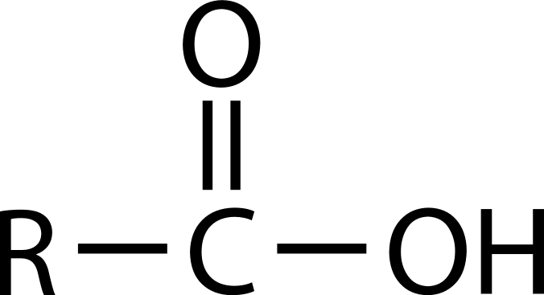  \[Figure 26. | Carboxylic acid |
| Carbonyl    \[Figure 27. |   \[Figure 28\]    \[Figure 29. | Aldehyde  Ketone |
| Ester    \[Figure 30. |   \[Figure 31. | Ester |
| Ether    \[Figure 32. |   \[Figure 33. | Ether |
| Amine    \[Figure 34. |   \[Figure 35\]    \[Figure 36\]    \[Figure 37. | Primary Amine  Secondary Amine  Tertiary Amine |

Lesson Summary
--------------

* A functional group is an atom or group of atoms that is primarily responsible for the properties of the organic compound in which it is present. Organic molecules are given systematic names to identify the identities and locations of functional groups within the molecule.
* Alkyl halides are hydrocarbons in which one or more hydrogen atoms has been replaced by a halogen atom.
* Alcohols contain the hydroxyl functional group and can be primary, secondary, or tertiary.
* Ethers are compounds with an oxygen atom bonded to two alkyl groups.
* Aldehydes and ketones contain the carbonyl functional group. In an aldehyde, the carbonyl is at the end of a carbon chain, while in a ketone, it is in the middle.
* A carboxylic acid contains the carboxyl functional group. They are weak acids because the hydrogen of the hydroxyl group is ionizable.
* In an ester, the hydrogen of a carboxylic acid group is replaced by an alkyl group.
* Amines are derivatives of ammonia that are weak bases due to the lone pair of electrons on the nitrogen atom.

Lesson Review Questions
-----------------------

### Reviewing Concepts

1.  Why are alcohols not considered bases even though they contain an –OH substituent?
2.  Which types of organic compounds from this lesson are capable of intermolecular hydrogen bonding?
3.  Which types of organic compounds from this lesson are capable of hydrogen bonding with water?
4.  Why do amines act as bases?

### Problems

5.  Identify each of the following as an alcohol, aldehyde, ketone, carboxylic acid, ether, ester, amine, or alkyl halide.
    1.  
        
        \[Figure 38\]
        
    2.  
        
        \[Figure 39\]
        
    3.  
        
        \[Figure 40\]
        
    4.  
        
        \[Figure 41\]
        
    5.  
        
        \[Figure 42\]
        
    6.  
        
        \[Figure 43\]
        
    7.  
        
        \[Figure 44\]
        
    8.  
        
        \[Figure 45\]
        
6.  Name each of the compounds from question 5.
7.  Name the following alcohols, and identify each as a primary, secondary, or tertiary alcohol.
    1.  
        
        \[Figure 46\]
        
    2.  
        
        \[Figure 47\]
        
    3.  
        
        \[Figure 48\]
        
8.  Glycerol is an important alcohol used in the cosmetic industry. Its IUPAC name is 1,2,3-propanetriol. Draw the structural formula of glycerol.
9.  Draw and name all of the structural isomers of an alkyl halide with the formula C3H6Cl2.
10. Draw condensed structural formulas for each of the following.
    1.  pentyl methanoate
    2.  ethylpropylamine
    3.  3-heptanone
    4.  2-methylphenol
    5.  octanoic acid
    6.  butanal

Further Reading / Supplemental Links
------------------------------------

* Alcohols, http://www.kentchemistry.com/links/organic/alcohols.htm
* Organic Acids, http://www.kentchemistry.com/links/organic/OrgAcid.htm
* Aldehydes, http://www.kentchemistry.com/links/organic/Aldehydes.htm
* Ketones, http://www.kentchemistry.com/links/organic/Ketones.htm
* Ethers, http://www.kentchemistry.com/links/organic/ethers.htm
* Esters, http://www.kentchemistry.com/links/organic/esters.htm
* Amines, http://www.kentchemistry.com/links/organic/amines.htm
* Halides, http://www.kentchemistry.com/links/organic/halides.htm

Points to Consider
------------------

Common organic chemical reactions can be classified into several broad categories.

* What are some of the most common types of organic reactions?
* How do functional groups give organic compounds their chemical properties?

</article>

### 25.4 Organic Reactions

<article>

Lesson Objectives
-----------------

* Describe and distinguish between substitution reactions and addition reactions, and give examples of each.
* Relate the concepts of oxidation and reduction to organic reactions.
* Describe and give examples of condensation reactions, including esterification.
* Define “polymer,” and describe how polymers are formed by an addition reaction or by a condensation reaction.

Lesson Vocabulary
-----------------

* addition polymer
* addition reaction
* condensation polymer
* condensation reaction
* esterification
* hydration reaction
* hydrogenation
* monomer
* polymer
* saponification
* substitution reaction

Check Your Understanding
------------------------

### Recalling Prior Knowledge

* What is the difference between saturated and unsaturated hydrocarbons?
* How are oxidation and reduction defined with respect to the elements oxygen and hydrogen?

Organic reactions require the breaking of strong covalent bonds, which takes a considerable input of energy. In order for relatively stable organic molecules to react at a reasonable rate, they often must be modified with the use of highly reactive materials or in the presence of a catalyst. In this lesson, you will learn about several general categories of organic reactions.

Substitution Reactions
----------------------

A **substitution reaction** _is a reaction in which one or more atoms in a molecule are replaced with another atom or group of atoms_. Alkyl halides are formed by the substitution of a halogen atom for a hydrogen atom. When methane reacts with chlorine gas, ultraviolet light can act as a catalyst for the reaction.

______$\text{CH}_4(g) + \text{Cl}_2(g) \overset{\text{UV light}}{\longrightarrow} \text{CH}_3\text{Cl}(g) + \text{HCl}(g)$__

$\text{CH}_4(g) + \text{Cl}_2(g) \overset{\text{UV light}}{\longrightarrow} \text{CH}_3\text{Cl}(g) + \text{HCl}(g)$__

__$\text{CH}_4(g) + \text{Cl}_2(g) \overset{\text{UV light}}{\longrightarrow} \text{CH}_3\text{Cl}(g) + \text{HCl}(g)$__

$\text{CH}_4(g) + \text{Cl}_2(g) \overset{\text{UV light}}{\longrightarrow} \text{CH}_3\text{Cl}(g) + \text{HCl}(g)$__

____$\text{CH}_4(g) + \text{Cl}_2(g) \overset{\text{UV light}}{\longrightarrow} \text{CH}_3\text{Cl}(g) + \text{HCl}(g)$__

$\text{CH}_4(g) + \text{Cl}_2(g) \overset{\text{UV light}}{\longrightarrow} \text{CH}_3\text{Cl}(g) + \text{HCl}(g)$__

__$\text{CH}_4(g) + \text{Cl}_2(g) \overset{\text{UV light}}{\longrightarrow} \text{CH}_3\text{Cl}(g) + \text{HCl}(g)$__

$\text{CH}_4(g) + \text{Cl}_2(g) \overset{\text{UV light}}{\longrightarrow} \text{CH}_3\text{Cl}(g) + \text{HCl}(g)$

The reaction produces chloromethane and hydrogen chloride. When the mixture is allowed to react for longer periods of time, further substitution reactions may occur.

______$\text{CH}_3\text{Cl}(g) + \text{Cl}_2(g) \overset{\text{UV light}}{\longrightarrow} \text{CH}_2\text{Cl}_2(g) + \text{HCl}(g)$__

$\text{CH}_3\text{Cl}(g) + \text{Cl}_2(g) \overset{\text{UV light}}{\longrightarrow} \text{CH}_2\text{Cl}_2(g) + \text{HCl}(g)$__

__$\text{CH}_3\text{Cl}(g) + \text{Cl}_2(g) \overset{\text{UV light}}{\longrightarrow} \text{CH}_2\text{Cl}_2(g) + \text{HCl}(g)$__

$\text{CH}_3\text{Cl}(g) + \text{Cl}_2(g) \overset{\text{UV light}}{\longrightarrow} \text{CH}_2\text{Cl}_2(g) + \text{HCl}(g)$__

____$\text{CH}_3\text{Cl}(g) + \text{Cl}_2(g) \overset{\text{UV light}}{\longrightarrow} \text{CH}_2\text{Cl}_2(g) + \text{HCl}(g)$__

$\text{CH}_3\text{Cl}(g) + \text{Cl}_2(g) \overset{\text{UV light}}{\longrightarrow} \text{CH}_2\text{Cl}_2(g) + \text{HCl}(g)$__

__$\text{CH}_3\text{Cl}(g) + \text{Cl}_2(g) \overset{\text{UV light}}{\longrightarrow} \text{CH}_2\text{Cl}_2(g) + \text{HCl}(g)$__

$\text{CH}_3\text{Cl}(g) + \text{Cl}_2(g) \overset{\text{UV light}}{\longrightarrow} \text{CH}_2\text{Cl}_2(g) + \text{HCl}(g)$

The product above is dichloromethane. Further substitution produces trichloromethane and tetrachloromethane, commonly called carbon tetrachloride. A mixture of products occurs in the reaction, with the relative amounts dependent upon the time that the reaction is allowed to proceed. Chlorofluorocarbons are produced by reacting chloroalkanes with HF, because the fluorine atom makes a stronger bond to the carbon atom than chlorine does.

______$\text{CCl}_4(g) + \text{HF}(g) \overset{\text{SbF}_5}{\longrightarrow} \text{CCl}_3\text{F}(g) + \text{HCl}(g)$__

$\text{CCl}_4(g) + \text{HF}(g) \overset{\text{SbF}_5}{\longrightarrow} \text{CCl}_3\text{F}(g) + \text{HCl}(g)$__

__$\text{CCl}_4(g) + \text{HF}(g) \overset{\text{SbF}_5}{\longrightarrow} \text{CCl}_3\text{F}(g) + \text{HCl}(g)$__

$\text{CCl}_4(g) + \text{HF}(g) \overset{\text{SbF}_5}{\longrightarrow} \text{CCl}_3\text{F}(g) + \text{HCl}(g)$__

____$\text{CCl}_4(g) + \text{HF}(g) \overset{\text{SbF}_5}{\longrightarrow} \text{CCl}_3\text{F}(g) + \text{HCl}(g)$__

$\text{CCl}_4(g) + \text{HF}(g) \overset{\text{SbF}_5}{\longrightarrow} \text{CCl}_3\text{F}(g) + \text{HCl}(g)$__

__$\text{CCl}_4(g) + \text{HF}(g) \overset{\text{SbF}_5}{\longrightarrow} \text{CCl}_3\text{F}(g) + \text{HCl}(g)$__

$\text{CCl}_4(g) + \text{HF}(g) \overset{\text{SbF}_5}{\longrightarrow} \text{CCl}_3\text{F}(g) + \text{HCl}(g)$

The fluorine atom substitutes for a chlorine atom in the reaction.

As discussed previously, benzene is a fairly stable and unreactive molecule due to the electron delocalization around the six-membered ring. The treatment of benzene with a halogen in the presence of an iron catalyst causes the substitution of a halogen atom for a hydrogen atom. The resulting molecule is called an aryl halide.

______$\text{C}_6\text{H}_6(l) + \text{Br}_2(l) \overset{\text{FeBr}_3}{\longrightarrow} \text{C}_6\text{H}_5\text{Br}(l) + \text{HBr}(g)$__

\[Figure 1\]__

__$\text{C}_6\text{H}_6(l) + \text{Br}_2(l) \overset{\text{FeBr}_3}{\longrightarrow} \text{C}_6\text{H}_5\text{Br}(l) + \text{HBr}(g)$__

\[Figure 1\]__

____$\text{C}_6\text{H}_6(l) + \text{Br}_2(l) \overset{\text{FeBr}_3}{\longrightarrow} \text{C}_6\text{H}_5\text{Br}(l) + \text{HBr}(g)$__

\[Figure 1\]__

__$\text{C}_6\text{H}_6(l) + \text{Br}_2(l) \overset{\text{FeBr}_3}{\longrightarrow} \text{C}_6\text{H}_5\text{Br}(l) + \text{HBr}(g)$__

______$\text{C}_6\text{H}_6(l) + \text{CH}_3\text{CH}_2\text{Cl}(g) \overset{\text{AlCl}_3}{\longrightarrow} \text{C}_6\text{H}_5\text{CH}_2\text{CH}_3(l) + \text{HCl}(g)$__

\[Figure 2\]__

__$\text{C}_6\text{H}_6(l) + \text{CH}_3\text{CH}_2\text{Cl}(g) \overset{\text{AlCl}_3}{\longrightarrow} \text{C}_6\text{H}_5\text{CH}_2\text{CH}_3(l) + \text{HCl}(g)$__

\[Figure 2\]__

____$\text{C}_6\text{H}_6(l) + \text{CH}_3\text{CH}_2\text{Cl}(g) \overset{\text{AlCl}_3}{\longrightarrow} \text{C}_6\text{H}_5\text{CH}_2\text{CH}_3(l) + \text{HCl}(g)$__

\[Figure 2\]__

__$\text{C}_6\text{H}_6(l) + \text{CH}_3\text{CH}_2\text{Cl}(g) \overset{\text{AlCl}_3}{\longrightarrow} \text{C}_6\text{H}_5\text{CH}_2\text{CH}_3(l) + \text{HCl}(g)$__

______$\text{CH}_3\text{I}(l) + \text{NaOH}(aq) \overset{100^\circ\text{C}}{\longrightarrow} \text{CH}_3\text{OH}(l) + \text{NaI}(aq)$__

$\text{CH}_3\text{I}(l) + \text{NaOH}(aq) \overset{100^\circ\text{C}}{\longrightarrow} \text{CH}_3\text{OH}(l) + \text{NaI}(aq)$__

__$\text{CH}_3\text{I}(l) + \text{NaOH}(aq) \overset{100^\circ\text{C}}{\longrightarrow} \text{CH}_3\text{OH}(l) + \text{NaI}(aq)$__

$\text{CH}_3\text{I}(l) + \text{NaOH}(aq) \overset{100^\circ\text{C}}{\longrightarrow} \text{CH}_3\text{OH}(l) + \text{NaI}(aq)$__

____$\text{CH}_3\text{I}(l) + \text{NaOH}(aq) \overset{100^\circ\text{C}}{\longrightarrow} \text{CH}_3\text{OH}(l) + \text{NaI}(aq)$__

$\text{CH}_3\text{I}(l) + \text{NaOH}(aq) \overset{100^\circ\text{C}}{\longrightarrow} \text{CH}_3\text{OH}(l) + \text{NaI}(aq)$__

__$\text{CH}_3\text{I}(l) + \text{NaOH}(aq) \overset{100^\circ\text{C}}{\longrightarrow} \text{CH}_3\text{OH}(l) + \text{NaI}(aq)$__

$\text{CH}_3\text{I}(l) + \text{NaOH}(aq) \overset{100^\circ\text{C}}{\longrightarrow} \text{CH}_3\text{OH}(l) + \text{NaI}(aq)$

Addition Reactions
------------------

An **addition reaction** _is a reaction in which an atom or molecule is added to an unsaturated molecule, making a single product_. An addition reaction can often be thought of as adding a molecule across the double bond of an alkene or carbonyl or across the triple bond of an alkyne.

One type of addition reaction is called hydrogenation. **Hydrogenation** _is a reaction that occurs when molecular hydrogen is added to an alkene to produce an alkane_. The reaction is typically performed with the use of a transition metal catalyst. For example, ethene reacts with hydrogen to form ethane.

______$\text{CH}_2\text{=CH}_2(g) + \text{H}_2(g) \overset{\text{Pt}}{\longrightarrow} \text{CH}_3\text{CH}_3(g)$__

$\text{CH}_2\text{=CH}_2(g) + \text{H}_2(g) \overset{\text{Pt}}{\longrightarrow} \text{CH}_3\text{CH}_3(g)$__

__$\text{CH}_2\text{=CH}_2(g) + \text{H}_2(g) \overset{\text{Pt}}{\longrightarrow} \text{CH}_3\text{CH}_3(g)$__

$\text{CH}_2\text{=CH}_2(g) + \text{H}_2(g) \overset{\text{Pt}}{\longrightarrow} \text{CH}_3\text{CH}_3(g)$__

____$\text{CH}_2\text{=CH}_2(g) + \text{H}_2(g) \overset{\text{Pt}}{\longrightarrow} \text{CH}_3\text{CH}_3(g)$__

$\text{CH}_2\text{=CH}_2(g) + \text{H}_2(g) \overset{\text{Pt}}{\longrightarrow} \text{CH}_3\text{CH}_3(g)$__

__$\text{CH}_2\text{=CH}_2(g) + \text{H}_2(g) \overset{\text{Pt}}{\longrightarrow} \text{CH}_3\text{CH}_3(g)$__

$\text{CH}_2\text{=CH}_2(g) + \text{H}_2(g) \overset{\text{Pt}}{\longrightarrow} \text{CH}_3\text{CH}_3(g)$

Note that the hydrogenation reaction is also a redox reaction. Ethene is reduced, because the oxidation numbers of the carbon atoms change from −2 to −3 as a result of the reaction.

Vegetable oils consist of long carbon chains with carboxyl groups on the end; these molecules are referred to as fatty acids. The carbon chains of the fatty acids in vegetable oils are unsaturated, usually containing multiple double bonds. When hydrogen gas is blown through a sample of the oil, hydrogen atoms add across the double bonds. This conversion changes the substance from a liquid oil into a solid fat. The word "hydrogenated" on a food product is an indication that oil has been converted into fat by this process. Margarine is manufactured from unsaturated vegetable oil in this way.

Addition reactions are also useful ways to introduce a new functional group into an organic molecule. Alkyl halides can be produced from an alkene by the addition of either the elemental halogen or the hydrogen halide. When the reactant is the halogen, the product is a disubstituted alkyl halide as in the addition of bromine to ethene.

______$\text{CH}_2\text{=CH}_2(g) + \text{Br}_2(l) \rightarrow \text{CH}_2\text{BrCH}_2\text{Br}(g)$__

$\text{CH}_2\text{=CH}_2(g) + \text{Br}_2(l) \rightarrow \text{CH}_2\text{BrCH}_2\text{Br}(g)$__

__$\text{CH}_2\text{=CH}_2(g) + \text{Br}_2(l) \rightarrow \text{CH}_2\text{BrCH}_2\text{Br}(g)$__

$\text{CH}_2\text{=CH}_2(g) + \text{Br}_2(l) \rightarrow \text{CH}_2\text{BrCH}_2\text{Br}(g)$__

______

\[Figure 3\]__

\[Figure 3\]__

__

\[Figure 3\]__

\[Figure 3\]__

____

\[Figure 3\]__

\[Figure 3\]__

__

\[Figure 3\]__

A monosubstituted alkyl halide can be produced by the addition of a hydrogen halide to an alkene. Shown below is the formation of chloroethane.

______$\text{CH}_2\text{=CH}_2(g) \text{HCl}(g) \rightarrow \text{CH}_3\text{CH}_2\text{Cl}(g)$__

$\text{CH}_2\text{=CH}_2(g) \text{HCl}(g) \rightarrow \text{CH}_3\text{CH}_2\text{Cl}(g)$__

__$\text{CH}_2\text{=CH}_2(g) \text{HCl}(g) \rightarrow \text{CH}_3\text{CH}_2\text{Cl}(g)$__

$\text{CH}_2\text{=CH}_2(g) \text{HCl}(g) \rightarrow \text{CH}_3\text{CH}_2\text{Cl}(g)$__

____$\text{CH}_2\text{=CH}_2(g) \text{HCl}(g) \rightarrow \text{CH}_3\text{CH}_2\text{Cl}(g)$__

$\text{CH}_2\text{=CH}_2(g) \text{HCl}(g) \rightarrow \text{CH}_3\text{CH}_2\text{Cl}(g)$__

__$\text{CH}_2\text{=CH}_2(g) \text{HCl}(g) \rightarrow \text{CH}_3\text{CH}_2\text{Cl}(g)$__

$\text{CH}_2\text{=CH}_2(g) \text{HCl}(g) \rightarrow \text{CH}_3\text{CH}_2\text{Cl}(g)$

A **hydration reaction** _is a reaction in which water is added to an alkene_. Hydration reactions can take place when the alkene and water are heated to near 100°C in the presence of a strong acid, which acts as a catalyst. Shown below is the hydration of ethene to produce ethanol.

______$\text{CH}_2\text{=CH}_2(g) + \text{H}_2\text{O}(l) \rightarrow \text{CH}_3\text{CH}_2\text{OH}(g)$__

$\text{CH}_2\text{=CH}_2(g) + \text{H}_2\text{O}(l) \rightarrow \text{CH}_3\text{CH}_2\text{OH}(g)$__

__$\text{CH}_2\text{=CH}_2(g) + \text{H}_2\text{O}(l) \rightarrow \text{CH}_3\text{CH}_2\text{OH}(g)$__

$\text{CH}_2\text{=CH}_2(g) + \text{H}_2\text{O}(l) \rightarrow \text{CH}_3\text{CH}_2\text{OH}(g)$__

____$\text{CH}_2\text{=CH}_2(g) + \text{H}_2\text{O}(l) \rightarrow \text{CH}_3\text{CH}_2\text{OH}(g)$__

$\text{CH}_2\text{=CH}_2(g) + \text{H}_2\text{O}(l) \rightarrow \text{CH}_3\text{CH}_2\text{OH}(g)$__

__$\text{CH}_2\text{=CH}_2(g) + \text{H}_2\text{O}(l) \rightarrow \text{CH}_3\text{CH}_2\text{OH}(g)$__

$\text{CH}_2\text{=CH}_2(g) + \text{H}_2\text{O}(l) \rightarrow \text{CH}_3\text{CH}_2\text{OH}(g)$

Under modest reaction conditions, benzene resists addition reactions, because adding across a double bond in a benzene ring would disrupt the ring of delocalized electrons, greatly destabilizing the molecule. However, under conditions of high temperature and pressure, and with an appropriate catalyst, benzene will slowly react with three molecules of hydrogen to produce cyclohexane.

______$\text{C}_6\text{H}_6 + 3\text{H}_2 \overset{\text{Pt}}{\longrightarrow} \text{C}_6\text{H}_{12}$__

$\text{C}_6\text{H}_6 + 3\text{H}_2 \overset{\text{Pt}}{\longrightarrow} \text{C}_6\text{H}_{12}$__

__$\text{C}_6\text{H}_6 + 3\text{H}_2 \overset{\text{Pt}}{\longrightarrow} \text{C}_6\text{H}_{12}$__

$\text{C}_6\text{H}_6 + 3\text{H}_2 \overset{\text{Pt}}{\longrightarrow} \text{C}_6\text{H}_{12}$__

____

\[Figure 4\]__

\[Figure 4\]__

__

\[Figure 4\]__

-------------------

Oxidation can be defined as the addition of oxygen to a molecule or the removal of hydrogen. Reduction is therefore the addition of hydrogen or the removal of oxygen. Several classes of organic compounds are related to one another by oxidation and reduction reactions. Alkanes, alkenes, and alkynes represent different levels of oxidation of a hydrocarbon. When an alkane is heated in the presence of an appropriate catalyst, it can be oxidized to the corresponding alkene in a reaction called a dehydrogenation reaction. Two hydrogen atoms are removed in the process. The alkene can be further oxidized to an alkyne by the removal of two more hydrogen atoms. This is also considered an oxidation according to the modern definition, because the oxidation number of each carbon atom goes from -3 to -2 to -1.

______oxidation: $\text{CH}_3\text{CH}_3 \overset{-\text{H}_2}{\longrightarrow} \text{CH}_2=\text{CH}_2 \overset{-\text{H}_2}{\longrightarrow} \text{CH}\equiv\text{CH}$__

oxidation: $\text{CH}_3\text{CH}_3 \overset{-\text{H}_2}{\longrightarrow} \text{CH}_2=\text{CH}_2 \overset{-\text{H}_2}{\longrightarrow} \text{CH}\equiv\text{CH}$__

__oxidation: $\text{CH}_3\text{CH}_3 \overset{-\text{H}_2}{\longrightarrow} \text{CH}_2=\text{CH}_2 \overset{-\text{H}_2}{\longrightarrow} \text{CH}\equiv\text{CH}$__

oxidation: $\text{CH}_3\text{CH}_3 \overset{-\text{H}_2}{\longrightarrow} \text{CH}_2=\text{CH}_2 \overset{-\text{H}_2}{\longrightarrow} \text{CH}\equiv\text{CH}$__

____oxidation: $\text{CH}_3\text{CH}_3 \overset{-\text{H}_2}{\longrightarrow} \text{CH}_2=\text{CH}_2 \overset{-\text{H}_2}{\longrightarrow} \text{CH}\equiv\text{CH}$__

oxidation: $\text{CH}_3\text{CH}_3 \overset{-\text{H}_2}{\longrightarrow} \text{CH}_2=\text{CH}_2 \overset{-\text{H}_2}{\longrightarrow} \text{CH}\equiv\text{CH}$__

__oxidation: $\text{CH}_3\text{CH}_3 \overset{-\text{H}_2}{\longrightarrow} \text{CH}_2=\text{CH}_2 \overset{-\text{H}_2}{\longrightarrow} \text{CH}\equiv\text{CH}$__

oxidation: $\text{CH}_3\text{CH}_3 \overset{-\text{H}_2}{\longrightarrow} \text{CH}_2=\text{CH}_2 \overset{-\text{H}_2}{\longrightarrow} \text{CH}\equiv\text{CH}$

The reactions are reversible, so an alkyne can be reduced first to an alkene and then to an alkane. These are addition reactions, as seen in the previous section.

______reduction: $\text{CH}\equiv\text{CH} \overset{+\text{H}_2}{\longrightarrow} \text{CH}_2\text{CH}_2 \overset{+\text{H}_2}{\longrightarrow} \text{CH}_3\text{CH}_3$__

reduction: $\text{CH}\equiv\text{CH} \overset{+\text{H}_2}{\longrightarrow} \text{CH}_2\text{CH}_2 \overset{+\text{H}_2}{\longrightarrow} \text{CH}_3\text{CH}_3$__

__reduction: $\text{CH}\equiv\text{CH} \overset{+\text{H}_2}{\longrightarrow} \text{CH}_2\text{CH}_2 \overset{+\text{H}_2}{\longrightarrow} \text{CH}_3\text{CH}_3$__

reduction: $\text{CH}\equiv\text{CH} \overset{+\text{H}_2}{\longrightarrow} \text{CH}_2\text{CH}_2 \overset{+\text{H}_2}{\longrightarrow} \text{CH}_3\text{CH}_3$__

____reduction: $\text{CH}\equiv\text{CH} \overset{+\text{H}_2}{\longrightarrow} \text{CH}_2\text{CH}_2 \overset{+\text{H}_2}{\longrightarrow} \text{CH}_3\text{CH}_3$__

reduction: $\text{CH}\equiv\text{CH} \overset{+\text{H}_2}{\longrightarrow} \text{CH}_2\text{CH}_2 \overset{+\text{H}_2}{\longrightarrow} \text{CH}_3\text{CH}_3$__

__reduction: $\text{CH}\equiv\text{CH} \overset{+\text{H}_2}{\longrightarrow} \text{CH}_2\text{CH}_2 \overset{+\text{H}_2}{\longrightarrow} \text{CH}_3\text{CH}_3$__

reduction: $\text{CH}\equiv\text{CH} \overset{+\text{H}_2}{\longrightarrow} \text{CH}_2\text{CH}_2 \overset{+\text{H}_2}{\longrightarrow} \text{CH}_3\text{CH}_3$

The alkane is the most reduced form of a hydrocarbon, while the alkyne is the most oxidized form.

Oxidation reactions in organic chemistry often involve the addition of oxygen to a compound, which changes the functional group that is present. The following sequence shows how methane can be oxidized first to methanol, then to methanal, then to methanoic acid, and finally to carbon dioxide.

$\underset{\text{methane}}{\text{CH}_4} \overset{\text{gain of oxygen}}{\longrightarrow} \underset{\text{methanol}}{\text{CH}_3\text{OH}}  \overset{\text{loss of hydrogen}}{\longrightarrow} \underset{\text{methanal}}{\text{CH}_2\text{O}} \overset{\text{gain of oxygen}}{\longrightarrow} \underset{\text{methanoic acid}}{\text{HCOOH}} \overset{\text{loss of hydrogen}}{\longrightarrow} \underset{\text{carbon dioxide}}{\text{CO}_2}$

Each step in the process is either a gain of oxygen or a loss of hydrogen. Each step also releases energy, which explains why the complete combustion of alkanes to carbon dioxide is an extremely exothermic reaction.

The oxidation of an alcohol can produce either an aldehyde or a ketone. Ethanol can be oxidized in the laboratory by slight warming combined with the addition of an oxidizing agent such as the dichromate ion, which catalyzes this reaction in acidic solution. The reaction produces the aldehyde ethanal.

______$\text{CH}_3\text{CH}_2\text{OH} \overset{\text{Cr}_2\text{O}^{2-}_7}{\underset{\text{H}^+}{\longrightarrow}} \text{CH}_3\text{CHO}$__

$\text{CH}_3\text{CH}_2\text{OH} \overset{\text{Cr}_2\text{O}^{2-}_7}{\underset{\text{H}^+}{\longrightarrow}} \text{CH}_3\text{CHO}$__

__$\text{CH}_3\text{CH}_2\text{OH} \overset{\text{Cr}_2\text{O}^{2-}_7}{\underset{\text{H}^+}{\longrightarrow}} \text{CH}_3\text{CHO}$__

$\text{CH}_3\text{CH}_2\text{OH} \overset{\text{Cr}_2\text{O}^{2-}_7}{\underset{\text{H}^+}{\longrightarrow}} \text{CH}_3\text{CHO}$__

____

\[Figure 5\]__

\[Figure 5\]__

__

\[Figure 5\]__

______$\text{CH}_3\text{CHOHCH}_3 \overset{\text{Cr}_2\text{O}^{2-}_7}{\underset{\text{H}^+}{\longrightarrow}} \text{CH}_3\text{COCH}_3$__

$\text{CH}_3\text{CHOHCH}_3 \overset{\text{Cr}_2\text{O}^{2-}_7}{\underset{\text{H}^+}{\longrightarrow}} \text{CH}_3\text{COCH}_3$__

__$\text{CH}_3\text{CHOHCH}_3 \overset{\text{Cr}_2\text{O}^{2-}_7}{\underset{\text{H}^+}{\longrightarrow}} \text{CH}_3\text{COCH}_3$__

$\text{CH}_3\text{CHOHCH}_3 \overset{\text{Cr}_2\text{O}^{2-}_7}{\underset{\text{H}^+}{\longrightarrow}} \text{CH}_3\text{COCH}_3$__

____

\[Figure 6\]__

\[Figure 6\]__

__

\[Figure 6\]__

When a primary alcohol is oxidized to an aldehyde in the presence of water, the reaction can be difficult to stop because the aldehyde can be further oxidized to the corresponding carboxylic acid. For example, the oxidation of ethanal produces ethanoic (acetic) acid.

______$\text{CH}_3\text{CHO} \overset{\text{Cr}_2\text{O}^{2-}_7}{\underset{\text{H}^+}{\longrightarrow}} \text{CH}_3\text{COOH}$__

$\text{CH}_3\text{CHO} \overset{\text{Cr}_2\text{O}^{2-}_7}{\underset{\text{H}^+}{\longrightarrow}} \text{CH}_3\text{COOH}$__

__$\text{CH}_3\text{CHO} \overset{\text{Cr}_2\text{O}^{2-}_7}{\underset{\text{H}^+}{\longrightarrow}} \text{CH}_3\text{COOH}$__

$\text{CH}_3\text{CHO} \overset{\text{Cr}_2\text{O}^{2-}_7}{\underset{\text{H}^+}{\longrightarrow}} \text{CH}_3\text{COOH}$__

____

\[Figure 7\]__

\[Figure 7\]__

__

\[Figure 7\]__

Unlike aldehydes, ketones are resistant to further oxidation because the carbonyl group is in the middle of the carbon chain, so the ketone cannot be converted to a carboxylic acid.

Condensation Reactions
----------------------

A **condensation reaction** _is a reaction in which two molecules combine to form a single molecule_. A small molecule, often water, is usually removed during a condensation reaction. Amino acids are important biological molecules that have an amine functional group on one end of the molecule and a carboxylic acid functional group on the other end. When two amino acids combine in a condensation reaction, a covalent bond forms between the amine nitrogen of one amino acid and the carboxyl carbon of the second amino acid. A molecule of water is then removed as a second product (**Figure** [below](#x-ck12-SW50Q2gtMjUtMjMtQW1pbm8tQWNpZC1Db25kZW5zYXRpb24.)).

.")

This reaction forms a molecule called a dipeptide, and the resulting carbon-nitrogen covalent bond is often called a peptide bond. When repeated numerous times, a long molecule called a protein is eventually produced.

### Esterification

An **esterification** _is a reaction in which an ester is formed from an alcohol and a carboxylic acid_. Esterification is a subcategory of condensation reactions because a water molecule is produced in the reaction. The reaction can be catalyzed by a strong acid, usually sulfuric acid. When the carboxylic acid, butanoic acid, is heated with an excess of methanol and a few drops of sulfuric acid, the ester methyl butanoate is produced. Methyl butanoate has the scent of pineapples. The reaction is shown below with both molecular and structural formulas.

$\text{CH}_3\text{CH}_2\text{CH}_2\text{COOH} + \text{HOCH}_3 \overset{\text{H}_2\text{SO}_4}{\longrightarrow} \text{CH}_3\text{CH}_2\text{CH}_2\text{COOCH}_3 + \text{H}_2\text{O}$

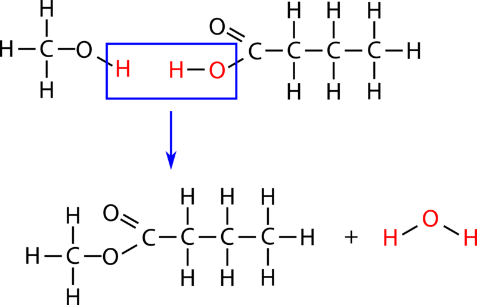

$\mathrm{\underset{ethyl \ ethanoate}{CH_3COOCH_2CH_3} \ + \ NaOH \rightarrow \underset{sodium \ acetate}{CH_3COO^-Na^+} \ + \ \underset{ethanol}{CH_3CH_2OH}}$

The sodium hydroxide is not acting as a catalyst; it is consumed in the reaction. **Saponification** _describes the alkaline hydrolysis reaction of an ester_. The term saponification originally described the hydrolysis of long-chain esters called fatty acid esters to produce soap molecules, which are the salts of fatty acids. One such soap molecule is sodium stearate, formed from the hydrolysis of ethyl stearate.

$\mathrm{\underset{ethyl \ stearate}{C_{17}H_{35}COOC_2H_5} \ + \ NaOH \rightarrow \underset{sodium \ stearate \ (soap)}{C_{17}H_{35}COO^-Na^+} \ + \ C_2H_5OH}$

Polymerization
--------------

Polymers are very different than the other kinds of organic molecules that you have seen so far. Whereas other compounds are of relatively low molar mass, polymers are giant molecules of very high molar mass. Polymers are the primary components of all sorts of plastics and related compounds. A **polymer** _is a large molecule formed of many smaller molecules covalently bonded to one another in a repeating pattern_. The _small molecules that make up the polymer are called_ **monomers**. Polymers are generally formed by either addition or condensation reactions.

### Addition Polymers

An **addition polymer** _is a polymer formed by addition reactions between monomers that contain a double bond_. Molecules of ethene can polymerize with each other under the right conditions to form a polymer called polyethylene.

_______n_CH2\=CH2 → ( CH2\-CH2 ) _n___

_n_CH2\=CH2 → ( CH2\-CH2 ) _n___

___n_CH2\=CH2 → ( CH2\-CH2 ) _n___

_n_CH2\=CH2 → ( CH2\-CH2 ) _n___

_____n_CH2\=CH2 → ( CH2\-CH2 ) _n___

_n_CH2\=CH2 → ( CH2\-CH2 ) _n___

___n_CH2\=CH2 → ( CH2\-CH2 ) _n___

_n_CH2\=CH2 → ( CH2\-CH2 ) _n_

The letter _n_ stands for the number of monomers that are joined in repeated fashion to make the polymer and can have a value in the hundreds or even thousands.

Polyethylene can have different properties depending on the length of the polymer chains and on how efficiently they pack together. Some common products made from different forms of polyethylene include plastic bottles, plastic bags, and harder plastic objects such as pipes.

Several other kinds of unsaturated monomers can be polymerized and find use in common household products. Polypropylene is stiffer than polyethylene and is used in plastic utensils and some other kinds of containers. Polystyrene is used in insulation and in molded items such as coffee cups. Polyvinyl chloride (PVC) is extensively used for plumbing pipes. Polyisoprene is a polymer of isoprene and is better known as rubber. It is produced naturally by rubber trees, but several variants have been developed which demonstrate improvements on the properties of natural rubber.

### Condensation Polymers

A **condensation polymer** _is a polymer formed by condensation reactions_. Monomers of condensation polymers must contain two functional groups so that each monomer can link up with two other monomers. One type of a condensation polymer is called a polyamide. An amide is characterized by the functional group shown below, where the carbon of a carbonyl group is bonded to the nitrogen of an amine.

).")

The polymer that results from the repetition of the condensation reaction is a polyamide called nylon-66. Nylon-66 was first invented in 1935 and has been used for all sorts of products. It and other polyamides are commonly found in fibers, clothing, fishing line, carpeting, and many other products (**Figure** [below](#x-ck12-SW50Q2gtMjUtMjYtTnlsb24tU3BhdHVsYQ..)).

Polyester is another common type of condensation polymer. Recall that esters are formed from the reaction of an alcohol with a carboxylic acid. When both the acid and alcohol have two functional groups, the ester is capable of being polymerized. One such polyester is called polyethylene terephthalate (PET), which is formed from the reaction of ethylene glycol with terephthalic acid. The structure of PET is shown below (**Figure** [below](#x-ck12-SW50Q2gtMjUtSTM5LVBFVC1TdHJ1Y3R1cmU.)).

Lesson Summary
--------------

* Substitution reactions are reactions in which an atom or group of atoms in a molecule is replaced. Among other things, these reactions can be used to make alkyl halides from hydrocarbons.
* In an addition reaction, a molecule is added across a double or triple bond of another organic molecule. Hydrogenation is the process of adding molecular hydrogen, while hydration involves adding water across a double bond to form an alcohol.
* The oxidation of a hydrocarbon can occur by the loss of hydrogen, which makes it unsaturated. The oxidation of an alcohol produces either an aldehyde or a ketone. Further oxidation of an aldehyde produces a carboxylic acid.
* In a condensation reaction, two organic molecules combine, producing a larger molecule while eliminating a molecule of water. Esterification is a type of condensation reaction.
* Polymers are very large molecules made of repeating units called monomers. Polyethylene is a polymer formed by addition reactions. Nylon is a polymer formed by condensation reactions.

Lesson Review Questions
-----------------------

### Reviewing Concepts

1.  Can an addition reaction occur between chlorine and propane? Explain why or why not.
2.  Why does the benzene ring tend to undergo substitution reactions rather than addition reactions?
3.  What is the product of the oxidation of a primary alcohol? A secondary alcohol?
4.  What is the requirement for the structure of the monomers that undergo condensation polymerization?

### Problems

5.  Write the structural formulas and name the products of the following reactions.
    1.  CH3CH=CH2 + Br2 →
    2.  CH4 + I2 →
    3.  CH3CH2CH2CH2Cl + KOH →
    4.  CH3CH=CHCH3 + H2O →
    5.  C6H6 (benzene) + Cl2 →
6.  Write the structure and give the name of the compound that would be formed from the oxidation of each of the following.
    1.  methanol
    2.  3-pentanol
    3.  propanal
7.  Write structures and name the products of the reactions below. Identify the type of reaction represented by both equations.
    1.  CH3CH2OH + HCOOH →
    2.  CH3OH + CH3(CH2)6COOH →
8.  For the following reaction, write the products and name them. CH3CH2CH2COOCH3 + NaOH →
9.  Consider the following reaction. What kind of reaction is this? What type of compound is the organic product and what is its name? CH3CH2CH2OH + CH3OH → CH3CH2CH2\-O-CH3 + H2O
10. Draw the structure of the repeating units in a polymer that has the following monomers.
    1.  1,2-dichloroethene
    2.  propene

Further Reading / Supplemental Links
------------------------------------

* Substitution Reactions, http://www.kentchemistry.com/links/organic/Substitution.htm
* Addition Reactions, http://www.kentchemistry.com/links/organic/Addition.htm
* Esterification, http://www.kentchemistry.com/links/organic/esterification.htm
* Saponification, http://www.kentchemistry.com/links/organic/saponification.htm
* Polymerization, http://www.kentchemistry.com/links/organic/polymerization.htm

Points to Consider
------------------

Chemistry and chemical reactions are key factors in living things.

* How can a basic understanding of organic chemistry provide a foundation for studying biological molecules?
* What are the main categories of biomolecules?

</article>

## 26.0 Biochemistry

<article>

_Image copyright molekuul.be, 2014. www.shutterstock.com. Used under license from Shutterstock.com._

</article>

### 26.1 Carbohydrates

<article>

Lesson Objectives
-----------------

* Describe the general structures of the simple sugars, glucose and fructose.
* Describe how two simple sugars can be linked to form a disaccharide.
* Compare the simple sugar components of sucrose, lactose, and maltose.
* Identify the structure and function of the polysaccharides starch, glycogen, and cellulose.

Lesson Vocabulary
-----------------

* carbohydrates
* disaccharide
* monosaccharide
* polysaccharide

Check Your Understanding
------------------------

### Recalling Prior Knowledge

* What are aldehydes, ketones, and alcohols?
* What is the relationship between monomers and polymers?

Carbohydrates constitute a class of compounds that serves many functions in living organisms. Among the most important is the storage of energy in the form of starch and glycogen. Carbohydrates can also act as structural components, such as cellulose in plants, and are a part of the important genetic molecules DNA and RNA. In this lesson, you will learn about the basic structures and functions of carbohydrates.

Monosaccharides
---------------

Some foods that are high in carbohydrates include bread, pasta, and potatoes. Endurance athletes often prepare for competition by consuming large amounts of carbohydrate-heavy foods to allow them to perform at a high level for long periods of time (**Figure** [below](#x-ck12-SW50Q2gtMjYtMDEtQ2FyYm9oeWRyYXRlcw..)).

The term carbohydrate comes from the fact that the majority of carbohydrates contain carbon, hydrogen, and oxygen in a ratio of 1:2:1, making for an empirical formula of CH2O. This is somewhat misleading, because the molecules are not actually hydrates of carbon at all. **Carbohydrates** _are monomers and polymers of aldehydes and ketones that have multiple hydroxyl groups attached_.

Carbohydrates are the most abundant source of energy found in most foods. The simplest carbohydrates are also called simple sugars and are plentiful in fruits. A **monosaccharide** _is a carbohydrate consisting of one sugar unit_. Common examples of simple sugars or monosaccharides are glucose and fructose. Glucose is also referred to as corn sugar or grape sugar and is abundant in plants and animals. Fructose occurs in many fruits and is also found in honey. They are structural isomers of one another. Glucose has a carbonyl on the end of its chain, so it is an aldehyde, while the carbonyl of fructose is on an interior carbon, making it a ketone (**Figure** [below](#x-ck12-SW50Q2gtMjYtMDItR2x1Y29zZS1GcnVjdG9zZQ..)).

Glucose and fructose are both very soluble in water. In aqueous solution, the predominant forms are not the straight-chain structures shown above (**Figure** [above](#x-ck12-SW50Q2gtMjYtMDItR2x1Y29zZS1GcnVjdG9zZQ..)). Rather, they adopt a cyclic structure (**Figure** [below](#x-ck12-SW50Q2gtMjYtMDMtR2x1Y29zZS1GcnVjdG9zZS1DeWNsaWM.)). Glucose forms a six-membered ring, while fructose forms a five-membered ring. Both rings contain an oxygen atom.

Polysaccharides
---------------

Simple sugars form the foundation for more complex carbohydrates. The cyclic forms of two sugars can be linked together by means of a condensation reaction. The figure below (**Figure** [below](#x-ck12-SW50Q2gtMjYtMDQtU3Vjcm9zZQ..)) shows how a glucose molecule and a fructose molecule combine to form a sucrose molecule. A hydrogen atom from one molecule and a hydroxyl group from the other molecule are eliminated as water, resulting in a covalent bond linking the two sugars together at that point.

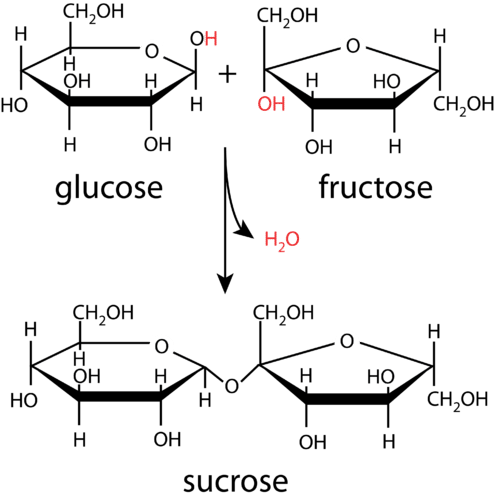

Sucrose, commonly known as table sugar, is an example of a disaccharide. A **disaccharide** _is a carbohydrate formed by the joining of two monosaccharides_. Other common disaccharides include lactose and maltose. Lactose, a component of milk, is formed from glucose and galactose, while maltose is made from two glucose molecules.

Many simple sugars can combine by repeated condensation reactions until a very large molecule is formed. A **polysaccharide** _is a complex carbohydrate polymer formed from the linkage of many monosaccharide monomers_. One of the best-known polysaccharides is starch, the main form of energy storage in plants. Starch is a staple in most human diets; foods such as corn, potatoes, rice, and wheat have very high starch contents. Starch is made of glucose monomers and occurs in both straight-chain and branched forms (**Figure** [below](#x-ck12-SW50Q2gtMjYtMDUtU3RhcmNo)). The straight-chain form is referred to as amylose and consists of hundreds of linked glucose molecules. The branched form of starch is called amylopectin.

Glycogen is an even more highly branched polysaccharide of glucose monomers that is used to store energy in animals (**Figure** [below](#x-ck12-SW50Q2gtMjYtMDYtR2x5Y29nZW4.)). Glycogen is made and stored primarily in the cells of the liver and muscles.

Cellulose is another polymer of glucose, consisting of anywhere from hundreds to over ten thousand monomers. It is the structural component of the cell walls in green plants and is the single most common organic molecule on Earth. Roughly 33% of all plant matter is cellulose. The linkage structure in cellulose is different than that of starch, and, as a result, cellulose is indigestible except by a few microorganisms, some of which live in the digestive tracts of cattle and termites. Illustrated below (**Figure** [below](#x-ck12-SW50Q2gtMjYtMDgtQ2VsbHVsb3Nl)) is a triple strand of cellulose. There is no branching, and the fibers adopt a very stiff rod-like structure with numerous hydrogen bonds between the fibers, adding to its strength. Cellulose is the main component of paper, cardboard, and textiles made from cotton, linen, and other plant fibers.

Lesson Summary
--------------

* Carbohydrates are used to store energy in plants and animals, and they are a major component of many foods.
* Simple sugars or monosaccharides are organic molecules containing multiple hydroxyl groups and either an aldehyde or a ketone. Glucose and fructose are two important simple sugars.
* Two monosaccharides can be joined together in a condensation reaction to form a disaccharide, such as sucrose, lactose, or maltose.
* Starch is a polysaccharide of glucose monomers that stores energy in plants. Glycogen stores energy in animals.
* Cellulose is another polysaccharide of glucose, but it is indigestible to most organisms and serves as a structural component in plants.

Lesson Review Questions
-----------------------

### Reviewing Concepts

1.  What is the origin of the term carbohydrate, and why is it potentially misleading?
2.  What are some of the main functions of carbohydrates in nature?
3.  What functional groups are present in glucose? In fructose?
4.  Describe the reaction by which monosaccharides combine to form a disaccharide.
5.  Which monosaccharides combine to form the following disaccharides?
    1.  lactose
    2.  maltose
    3.  sucrose
6.  What are the two main components of starch? Describe their differences.
7.  What is the difference in function between starch and glycogen?
8.  Starch is digestible while cellulose is not. Explain this difference.

### Problems

9.  Write a molecular equation for the formation of sucrose from simple sugars.
10. 20.0 g of sucrose is dissolved in 100.0 mL of water.
    1.  What is the molarity of the solution?
    2.  If the sucrose were completely hydrolyzed, what mass of glucose could be isolated?

Further Reading / Supplemental Links
------------------------------------

* The Chemistry of Carbohydrates Found in Food, http://www.medbio.info/Horn/Time%201-2/CarbChem1.htm
* Carbohydrates – Chemical Structure, http://www.scientificpsychic.com/fitness/carbohydrates.html

Points to Consider
------------------

Proteins are polymers of another class of biomolecules called amino acids.

* How many naturally occurring amino acids are used to form proteins?
* What is the function of an enzyme in biological reactions?

</article>

### 26.2 Amino Acids and Proteins

<article>

Lesson Objectives
-----------------

* Describe the general structure of an amino acid.
* List the twenty common amino acids found in living organisms.
* Describe how a peptide bond forms.
* Define a protein and differentiate between the four levels of structure of a protein.
* Describe the effect of an enzyme on a biochemical reaction and the general features of its reaction with a substrate.

Lesson Vocabulary
-----------------

* amino acid
* enzyme
* peptide
* peptide bond
* polypeptide
* primary structure
* protein
* quaternary structure
* secondary structure
* tertiary structure

Check Your Understanding
------------------------

### Recalling Prior Knowledge

* What is the structure of the carboxyl functional group?
* What is the structure of the amino functional group?

Foods such as meat and fish are high in protein. Proteins are an essential class of biomolecules that actually make up more than half of the dry weight of your body. In this lesson, you will learn about small molecules called amino acids and how they link together to form larger protein molecules.

Amino Acids
-----------

An **amino acid** _is a compound that contains both an amino group (−NH2) and a carboxyl group (−COOH) in the same molecule_. While an infinite number of amino acids can be imagined, the term most commonly applies to a specific group of 20 amino acids that are used as fundamental building blocks by living organisms. Illustrated below (**Figure** [below](#x-ck12-SW50Q2gtMjYtMDgtQW1pbm8tQWNpZA..)) is the general structure of these amino acids.

. In the 20 most common amino acids found in living organisms, these groups are all bonded to the same carbon atom.")

The amino and carboxyl groups of the basic 20 amino acids are both covalently bonded to a central carbon atom. That carbon atom is also bonded to a hydrogen atom and an R group. It is this R group, referred to as a side chain, that varies from one amino acid to another.

The nature of the side chains accounts for the variability in physical and chemical properties of the different amino acids. Some side chains consist of nonpolar aliphatic or aromatic hydrocarbons. Other side chains are polar, while some are acidic or basic (**Figure** [below](#x-ck12-SW50Q2gtMjYtMDktQW1pbm8tQWNpZHM.)).

. Alanine’s side chain is nonpolar, while threonine’s is polar. Tryptophan is one of several amino acids whose side chain is aromatic. Aspartic acid has an acidic side chain, while lysine has a basic side chain.")

Listed below (**Table** [below](#x-ck12-dGFibGU6VGFibGUtMjYuMQ..)) are the names of the 20 fundamental amino acids in biological organisms along with a three-letter abbreviation that is used when depicting sequences of linked amino acids.

|     |     |     |     |
| --- | --- | --- | --- |Amino Acids and Abbreviations
| Amino acid | Abbreviation | Amino acid | Abbreviation |
| --- | --- | --- | --- |
| Alanine | Ala | Leucine | Leu |
| Arginine | Arg | Lysine | Lys |
| Asparagine | Asn | Methionine | Met |
| Aspartic acid | Asp | Phenylalanine | Phe |
| Cysteine | Cys | Proline | Pro |
| Glutamine | Gln | Serine | Ser |
| Glutamic acid | Glu | Threonine | Thr |
| Glycine | Gly | Tryptophan | Trp |
| Histidine | His | Tyrosine | Tyr |
| Isoleucine | Ile | Valine | Val |

Peptides
--------

A **peptide** _is a combination of amino acids in which the amino group of one amino acid has undergone a condensation reaction with the carboxyl group of another amino acid_. The result is an amide group (**Figure** [below](#x-ck12-SW50Q2gtMjYtMTAtUGVwdGlkZQ..)).

A **peptide bond** _is the amide bond that occurs between the amino nitrogen of one amino acid and the carboxyl carbon of another amino acid_. The resulting molecule is called a dipeptide. Notice that the formation of a peptide bond is completely independent of the identities of the R groups, which do not participate in the condensation reaction, so any two amino acids can be joined together in this fashion.

The dipeptide has a free amino group on one end of the molecule and a free carboxyl group on the other end. Each is capable of extending the chain through the formation of another peptide bond. The particular sequence of amino acids in a longer chain is called an amino acid sequence. By convention, the amino acid sequence is listed in the order such that the free amino group is on the left end of the molecule and the free carboxyl group is on the right end of the molecule. For example, suppose that a sequence of the amino acids glycine, tryptophan, and alanine is formed with the free amino group as part of the glycine unit and the free carboxyl group as part of the alanine unit. The amino acid sequence can be abbreviated as Gly-Trp-Ala. This is a different molecule than Ala-Trp-Gly, in which the free amino and carboxyl groups would be on different amino acids.

Proteins
--------

Longer chains of amino acids are referred to as polypeptides or proteins, depending on their approximate size. In general, a **polypeptide** _is a sequence of ten or more amino acids_, while a **protein** _is a polypeptide with a molecular weight of more than about 10,000 g/mol_. This corresponds to a polypeptide that is longer than about 80-100 amino acids in length, depending on the exact identities of the amino acids used. However, the boundary between these two categories is not definite, and many polypeptides in the 40-100 amino acid range will often be referred to as proteins if they perform functions that are similar to those of other larger proteins.

Proteins are very prevalent in living organisms. Hair, skin, nails, muscles, and the hemoglobin in red blood cells are some of the important parts of your body that are made of different proteins. The wide array of chemical, physiological, and structural properties exhibited by different proteins is a function of their amino acid sequences. Because proteins are so large, the number of possible amino acid sequences is virtually limitless. For example, even a "small" protein that is only 90 amino acids long could have 20_90_ = 1.24 × 10_117_ possible sequences. To put this number in perspective, the entire universe is estimated to contain about 10_80_\-10_82_ atoms.

The three-dimensional structure of a protein is very critical to its function. This structure can be broken down into four levels. The **primary structure** _is the amino acid sequence of the protein_. The amino acid sequence of a given protein is unique and defines the function of that protein. The **secondary structure** _is a highly regular sub-structure of the protein_. The two most common types of protein secondary structure are the alpha helix and the beta sheet (**Figure** [below](#x-ck12-SW50Q2gtMjYtMTEtQWxwaGEtQmV0YQ..)).

The interactions between various nearby amino acids, particularly the hydrogen bonding between the amide groups that connect amino acids together, leads to the adoption of a particular secondary structure. The **tertiary structure** _is the overall three-dimensional structure of the protein_. A typical protein consists of several localized secondary structures (alpha helices or beta sheets) along with other areas in which the structure is less regular. These areas combine to produce the tertiary structure.

Some functional protein complexes consist of more than one protein molecule. For example, hemoglobin is a very large protein found in red blood cells. Its function is to bind and carry oxygen throughout the bloodstream. Hemoglobin consists of four subunits—two α subunits and two β subunits—that come together in a specific way through interactions between the side chains (**Figure** [below](#x-ck12-SW50Q2gtMjYtMTItSGVtb2dsb2Jpbg..)). Each subunit is a single protein strand that is linked together by covalent bonds, while the overall complex is held together by large numbers of intermolecular interactions.

. The other two subunits are also identical to one another and are called the beta subunits (gray). Hemoglobin also contains an atom of iron in the middle of each subunit. Each iron atom is positioned in the center of a smaller organic molecule known as a porphyrin, which is shown in red.")

The **quaternary structure** _of a protein refers to the interactions and orientations of the subunits in that protein_. Some proteins consist of only one subunit and thus do not have a quaternary structure. The **Figure** [below](#x-ck12-SW50Q2gtMjYtMTMtUHJvdGVpbi1TdHJ1Y3R1cmU.) diagrams the four levels of protein structure.

Enzymes
-------

An **enzyme** _is a protein that acts as a biological catalyst_. Recall that a catalyst is a substance that increases the rate of a chemical reaction without itself being consumed in the reaction. Cellular processes consist of many chemical reactions that must occur quickly in order for the cell to function properly. Each of those biochemical reactions is catalyzed by an enzyme. The first enzyme to be isolated was discovered in 1926 by American chemist James Sumner. The enzyme was urease, which catalyzes the hydrolytic decomposition of urea, a component of urine, into ammonia and carbon dioxide.

______$\mathrm{H_2NCONH_2}(aq) \mathrm{+H_2O}(l) \mathrm{\overset {urease}{\rightarrow} 2NH_3}(g) \mathrm{+CO_2}(g)$__

$\mathrm{H_2NCONH_2}(aq) \mathrm{+H_2O}(l) \mathrm{\overset {urease}{\rightarrow} 2NH_3}(g) \mathrm{+CO_2}(g)$__

__$\mathrm{H_2NCONH_2}(aq) \mathrm{+H_2O}(l) \mathrm{\overset {urease}{\rightarrow} 2NH_3}(g) \mathrm{+CO_2}(g)$__

$\mathrm{H_2NCONH_2}(aq) \mathrm{+H_2O}(l) \mathrm{\overset {urease}{\rightarrow} 2NH_3}(g) \mathrm{+CO_2}(g)$__

____$\mathrm{H_2NCONH_2}(aq) \mathrm{+H_2O}(l) \mathrm{\overset {urease}{\rightarrow} 2NH_3}(g) \mathrm{+CO_2}(g)$__

$\mathrm{H_2NCONH_2}(aq) \mathrm{+H_2O}(l) \mathrm{\overset {urease}{\rightarrow} 2NH_3}(g) \mathrm{+CO_2}(g)$__

__$\mathrm{H_2NCONH_2}(aq) \mathrm{+H_2O}(l) \mathrm{\overset {urease}{\rightarrow} 2NH_3}(g) \mathrm{+CO_2}(g)$__

$\mathrm{H_2NCONH_2}(aq) \mathrm{+H_2O}(l) \mathrm{\overset {urease}{\rightarrow} 2NH_3}(g) \mathrm{+CO_2}(g)$

Since that time, thousands of enzymes have been isolated and had their structures determined.

Enzymes catalyze most of the chemical reactions that occur in a cell. A **substrate** _is the molecule or molecules on which the enzyme acts_. In the urease catalyzed reaction above, urea is the substrate. Below (**Figure** [below](#x-ck12-SW50Q2gtMjYtMTQtRW56eW1l)) is a diagram for a typical enzymatic reaction.

The first step in the reaction is that the substrate binds to a specific part of the enzyme molecule. The binding of the substrate is dictated by the shapes of each molecule. Side chains on the enzyme interact with the substrate in a specific way, weakening certain bonds and locking the molecule into a particular orientation. The **active site** _is the region of an enzyme to which the substrate binds_. Enzymes typically have just one active site, which is usually a pocket or crevice formed by the folding pattern of the protein. Because the active site of an enzyme has such a unique shape, only one particular substrate is capable of binding to that enzyme. In other words, each enzyme catalyzes only one chemical reaction with only one substrate. Once the enzyme/substrate complex is formed, the reaction occurs, and the substrate is transformed into products. Finally, the product molecule or molecules are released from the active site. Note that the enzyme is left unaffected by the reaction and is now capable of catalyzing the reaction of another substrate molecule.

### Inhibitors

An **inhibitor** _is a molecule that interferes with the function of an enzyme, either slowing or stopping the chemical reaction catalyzed by that enzyme_. Inhibitors can work in a variety of ways, but one of the most common is illustrated below (**Figure** [below](#x-ck12-SW50Q2gtMjYtMTUtSW5oaWJpdG9y)).

The inhibitor binds competitively at the active site and blocks the substrate from binding. Since no reaction occurs with the inhibitor, the enzyme is prevented from catalyzing the reaction. Cyanide is a potent poison that acts as a competitive inhibitor. It binds to the active site of the enzyme _cytochrome c oxidase_ and interrupts cellular respiration. The binding of the cyanide to the enzyme is almost completely irreversible, and the affected organism dies quickly.

### Cofactors

Some enzymes require the presence of non-protein molecules or ions in order to function properly; these additional components are referred to as cofactors. Cofactors can be inorganic metal ions or small organic molecules. Many vitamins, such as the B vitamins, act as cofactors. Some metal ions that function as cofactors for various enzymes include zinc, magnesium, potassium, and iron.

Lesson Summary
--------------

* Amino acids are the building blocks of proteins. An amino acid has a carboxyl group, an amino group, and a variable side chain all covalently bonded to a central carbon atom. There are twenty fundamental amino acids, each with a unique side chain, that are used as the building blocks of proteins in living organisms.
* Amino acids can undergo a condensation reaction in which the carbon atom of the carboxyl group of one amino acid bonds to the amino nitrogen atom of another amino acid. The result is called a peptide bond. Polypeptides and proteins are long strings of amino acids.
* Proteins have four levels of structure: primary, secondary, tertiary, and quaternary. The structure and function of a protein is ultimately governed by its amino acid sequence.
* Enzymes are proteins that catalyze biochemical reactions. A substrate binds to an enzyme at its active site, where the chemical reaction occurs.

Lesson Review Questions
-----------------------

### Reviewing Concepts

1.  What gives each of the twenty common amino acids its unique structure and properties?
2.  What type of organic reaction is required to form a dipeptide from individual amino acids?
3.  How many peptide bonds are present in the sequence Ala-Glu-Phe-Asn?
4.  Does the amino acid sequence Leu-Ser-His have the same structure as the His-Ser-Leu sequence? Explain why or why not.
5.  Distinguish between the primary structure and the secondary structure of a protein.
6.  Describe the two common secondary structures found in proteins. What interactions are primarily responsible for secondary structure?
7.  Distinguish between the tertiary structure and the quaternary structure of a protein.
8.  Why can a cell function normally even if the concentrations of essential enzymes in the cell are very low?
9.  Explain why multiple different molecules generally cannot act as substrates for a given enzyme.

### Problems

10. Draw the structure of the dipeptide given by the sequence Thr-Asp.

Further Reading / Supplemental Links
------------------------------------

* Introducing Amino Acids, http://www.chemguide.co.uk/organicprops/aminoacids/background.html
* The Structure of Proteins, http://www.chemguide.co.uk/organicprops/aminoacids/proteinstruct.html
* Proteins as Enzymes, http://www.chemguide.co.uk/organicprops/aminoacids/enzymes.html

Points to Consider
------------------

The class of biomolecules called lipids is comprised of fats, oils, and other water-insoluble compounds.

* What is the structure of a triglyceride?
* What are phospholipids?

</article>

### 26.3 Lipids

<article>

Lesson Objectives
-----------------

* Describe the structure of a triglyceride.
* Distinguish between saturated and unsaturated fats.
* Describe the structure of a phospholipid and a lipid bilayer.
* Describe the structure and properties of waxes.

Vocabulary
----------

* lipid
* triglyceride
* saturated fat
* unsaturated fat
* phospholipid
* wax

Check Your Understanding
------------------------

### Recalling Prior Knowledge

* What is an esterification reaction?
* Are polar molecules more soluble in polar solvents or nonpolar solvents?

Certain large molecules, known as fats, are an essential component of a healthy body, though excessive consumption of fats is unhealthy. Fats are one member of a class of biological compounds known as lipids. In this lesson, you will learn about the structure and function of various lipids.

Triglycerides
-------------

**Lipids** _are a class of water-insoluble compounds that includes oils, fats, and waxes_. Oils and fats are based on the same general structure, but fats are solids at room temperature, while oils are liquids. Butter is an example of a fat that is derived from animals. Some oils include olive oil and canola oil, which are obtained from plants. Lipids are an essential part of a healthy diet, though excess dietary fat can be harmful. Lipids store energy in the body and are also needed to keep cell membranes healthy.

One type of lipid is called a **triglyceride**, which is _an ester derived from the condensation reactions of three fatty acid molecules with one molecule of glycerol_.

Glycerol is a triol, an alcohol that contains three hydroxyl functional groups. A fatty acid is a long hydrocarbon chain, generally from 12 to 24 carbons in length, with a carboxyl group on one end. Each of the three fatty acid molecules undergoes an esterification reaction with one of the hydroxyl groups of the glycerol molecule. The result is a large triester molecule referred to as a triglyceride (**Figure** [above](#x-ck12-SW50Q2gtMjYtMTYtVHJpZ2x5Y2VyaWRl)).

Triglycerides are used for long-term storage of energy in the human body. Because of the long carbon chains, triglycerides are nearly nonpolar molecules, so they do not dissolve readily in polar solvents such as water. However, oils and fats are soluble in nonpolar organic solvents, such as hexane or ethers.

Fats may be either saturated or unsaturated. A **saturated fat** _is a fat that consists of triglycerides whose carbon chains consist entirely of carbon-carbon single bonds_. Therefore, the carbon chains are saturated with the maximum number of hydrogen atoms possible. An **unsaturated fat** _is a fat that consists of triglycerides whose carbon chains contain one or more carbon-carbon double bonds_. A fat with one double bond is called monounsaturated, while a fat with multiple double bonds is called polyunsaturated (**Figure** [below](#x-ck12-SW50Q2gtMjYtMTctU2F0dXJhdGlvbg..)).

Unsaturated fats are generally considered to be healthier than saturated fats. One reason is that they contain fewer calories than an equivalent amount of saturated fats. High consumption of saturated fats is linked to an increased risk of cardiovascular disease. Some examples of foods with high concentrations of saturated fats include butter, cheese, lard, and some fatty meats. Foods with higher concentrations of unsaturated fats include nuts, avocado, and foods that contain various vegetable oils, such as canola oil and olive oil. The figure below (**Figure** [below](#x-ck12-SW50Q2gtMjYtMTgtRmF0LVBlcmNlbnRz)) shows the percentages of different types of fat in some common foods.

Phospholipids
-------------

A **phospholipid** _is a lipid that contains a phosphate group and one or more long hydrocarbon chains_. Phospholipids are the primary component of cell membranes. Each phospholipid molecule consists of a hydrophilic (water-loving) head and hydrophobic (water-fearing) tails (**Figure** [below](#x-ck12-SW50Q2gtMjYtMTktUGhvc3Bob2xpcGlk)).

Following the rule of “like dissolves like,” the hydrophilic head of the phospholipid molecule dissolves readily in water. The long carbon chains of a phospholipid are nonpolar, so they avoid water because of their insolubility. In water, phospholipids spontaneously form a double layer called a lipid bilayer, in which the hydrophobic tails of phospholipid molecules are sandwiched between two layers of hydrophilic heads (**Figure** [below](#x-ck12-SW50Q2gtMjYtMjAtUGhvc3Bob2xpcGlkLUJpbGF5ZXI.)). In this way, only the heads of the molecules are exposed to the water, while the hydrophobic tails interact only with each other.

Phospholipid bilayers are critical components of cell membranes. The lipid bilayer acts as a barrier to the passage of molecules and ions in and out of the cell. However, an important function of the cell membrane is to allow selective passage of certain substances. This is accomplished by embedding various protein molecules that span the lipid bilayer (**Figure** [below](#x-ck12-SW50Q2gtMjYtMjEtU2ltcGxpZmllZC1jZWxsLW1lbWJyYW5l)). These proteins form channels through which certain specific ions and molecules are able to move. Many membrane proteins are also attached to carbohydrates on the outside of the lipid bilayer. These carbohydrates serve a number of purposes that we are only beginning to understand, including the ability to provide identifying information about the type of cell to which it is attached.

Waxes
-----

Waxes are another type of lipid molecule. **Waxes** _are esters of long-chain fatty acids and long-chain alcohols_. Waxes are soft solids with low melting points that are insoluble in water. Illustrated below (**Figure** [below](#x-ck12-SW50Q2gtMjYtMjItQ2V0eWwtcGFsbWl0YXRl)) is the structure of cetyl palmitate, a natural wax present in sperm whales.

One of the best-known natural waxes is beeswax, though many other animals and plants also synthesize waxes. Waxes can be found on the leaves of plants and on the skin, hair, or feathers of animals, where they function to keep these structures pliable and waterproof. Humans take advantage of the protective properties of natural and synthetic waxes in such applications as floor polish and car wax.

Lesson Summary
--------------

* Lipids are a class of biomolecules that includes, oils, fats, and waxes. Lipids do not dissolve well in water because of their long carbon chains.
* A triglyceride is derived from the esterification of glycerol with three fatty acids.
* Phospholipids form a bilayer in which only the hydrophilic heads of the molecules are exposed to water. These bilayers form the structure of cell membranes.
* Waxes are soft, low-melting solids formed from long-chain fatty acids and alcohols.

Lesson Review Questions
-----------------------

### Reviewing Concepts

1.  What physical property of lipids is distinctly different from those of other biomolecules, such as carbohydrates and amino acids?
2.  Describe the difference between fats and oils.
3.  Explain how glycerol is capable of undergoing a reaction with three fatty acid molecules in the production of a triglyceride.
4.  Why are fats with one or more double bonds called unsaturated?
5.  How do phospholipids behave in water?
6.  What are the roles of phospholipids and proteins in a cell membrane?
7.  What organic compounds combine to form a wax?

### Problems

8.  What type of organic reaction is capable of turning an unsaturated fat into a saturated fat? Explain.
9.  What are the molecular and condensed structural formulas of the wax formed from the esterification of 1-decanol with octanoic acid? Name the molecule.

Further Reading / Supplemental Links
------------------------------------

* Lipids: Fats, Oils, Waxes, etc., http://biology.clc.uc.edu/courses/bio104/lipids.htm
* Biomolecules: The Lipids, http://www.wisc-online.com/objects/ViewObject.aspx?ID=ap13204

Points to Consider
------------------

Nucleic acids form the genetic material that is passed from generation to generation in the form of deoxyribonucleic acid (DNA).

* What are the structures of nucleic acids?
* How does the nucleic acid sequence of DNA lead to the production of different proteins?

</article>

### 26.4 Nucleic Acids

<article>

Lesson Objectives
-----------------

* Identify the functions of DNA and RNA.
* Describe the structure of a single nucleotide and how that structure leads to the overall structure of DNA and RNA.
* Describe how the base sequence of DNA codes for specific amino acids during protein synthesis.

Lesson Vocabulary
-----------------

* gene
* nucleic acid
* nucleotide

Check Your Understanding
------------------------

### Recalling Prior Knowledge

* What constitutes a hydrogen bond?
* What are amino acids, and how many amino acids are used as the building blocks of proteins?

What is it that makes a frog a frog, a sunflower a sunflower, and a human a human? Genetic material that is passed on from generation to generation carries the instructions that allow the cells of every organism to produce the specific proteins that an organism needs. In this lesson, you will learn about nucleic acids, the molecules that perform this vital function.

DNA and RNA
-----------

Swiss biochemist, Friedrich Miescher, first discovered nitrogen-containing compounds in the nuclei of cells in 1869. The term nucleic acid was used to describe these molecules because they were originally discovered within the nucleus of a cell, and, in their neutral form, the phosphate groups are attached to acidic hydrogens. A **nucleic acid** _is a large biopolymer consisting of many nucleotides_. The two primary nucleic acids found in living cells are deoxyribonucleic acid (DNA) and ribonucleic acid (RNA). DNA is the carrier of genetic information and is ultimately responsible for how cells produce proteins in order to carry out all the functions necessary for life. RNA is a related molecule that is involved in the mechanism by which the information stored in DNA is eventually converted into protein molecules.

The basic units of nucleic acids are called nucleotides. A **nucleotide** _is a molecule that contains a five-carbon sugar, a phosphate group, and a nitrogen-containing base called a nucleobase_. The five-carbon sugar is either ribose, in the case of RNA, or deoxyribose, in the case of DNA. The only difference between the two sugar molecules is that one of the hydroxyl groups of ribose is replaced by a hydrogen atom in deoxyribose (**Figure** [below](#x-ck12-SW50Q2gtMjYtMjMtTnVjbGVpYy1TdWdhcg..)).

The three parts of a DNA nucleotide are assembled as shown below (**Figure** [below](#x-ck12-SW50Q2gtMjYtMjQtTnVjbGVvdGlkZQ..)).

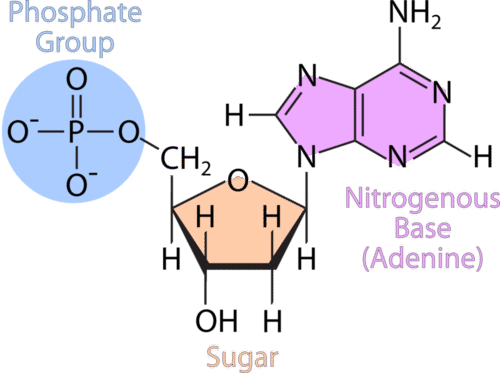

Every DNA and RNA polymer consists of multiple nucleotides strung together into extremely long chains. The only variation in each nucleotide is the identity of the nitrogenous base. The figure above (**Figure** [above](#x-ck12-SW50Q2gtMjYtMjQtTnVjbGVvdGlkZQ..)) shows one example of a nitrogenous base, called adenine. There are only four different nitrogenous bases found in all nucleic acids. The four bases of DNA are adenine, thymine, cytosine, and guanine, abbreviated A, T, C, and G respectively. In RNA, the base thymine is not found, but it is replaced by a different base called uracil, abbreviated U. The other three bases are present in both DNA and RNA.

The specific structure of DNA proved elusive to scientists for many years. In 1953, James Watson and Francis Crick proposed that the structure of DNA consists of two side-by-side polynucleotide chains wrapped into the shape of a double helix. One aspect of this structure is that each nitrogenous base on one of the DNA strands must be paired up with another base on the opposite strand (**Figure** [below](#x-ck12-SW50Q2gtMjYtMjUtQmFzZXM.)). Each adenine base is always paired with a thymine, while each cytosine is paired with a guanine. The bases fit together perfectly from one strand to the other and are also held together by hydrogen bonds. The A-T pairing contains two hydrogen bonds, while the C-G pairing contains three hydrogen bonds. The ends of each strand are labeled either 3’ or 5’ based on the numbering of the deoxyribose sugar ring.

, thymine (T), guanine (G), or cytosine (C). Each strand is then paired to a complimentary strand in such a way that A is paired with T and G is paired with C. The bases are held in place via hydrogen bonds. The double helical structure of DNA is shown on the right.")

The Genetic Code
----------------

Each particular organism contains many protein molecules that are specific to that organism. The particular base sequence of DNA is responsible for the production of all of the different proteins that are present in each and every living thing that has ever inhabited Earth. How does that work? Cells use the unique sequence of DNA bases to decide which proteins to synthesize. A gene is a segment of DNA that carries a code for making a specific polypeptide chain. The cell essentially decodes the DNA in order to make whatever peptides and proteins are needed by that organism.

The genetic code works as a series of three-letter codes. Each sequence of three letters, called a triplet, corresponds to one of the twenty common amino acids. The triplets are read by the cell, one after the other, in the process of protein synthesis. Listed below (**Table** [below](#x-ck12-dGFibGU6VGFibGUtMjYuMg..)) are all of the possible triplets and the amino acid that result from each three-letter code.

|     |     |     |     |
| --- | --- | --- | --- |DNA Triplet Codes for Amino Acids
| 1st Base: A | 1st Base: G | 1st Base: T | 1st Base: C |
| --- | --- | --- | --- |
| AAA Lys | GAA Glu | TAA Stop | CAA Gln |
| AAG Lys | GAG Glu | TAG Stop | CAG Val |
| AAT Asn | GAT Leu | TAT Tyr | CAT His |
| AAC Asn | GAC Asp | TAC Tyr | CAC His |
| AGA Arg | GGA Gly | TGA Stop | CGA Arg |
| AGG Arg | GGG Gly | TGG Trp | CGG Arg |
| AGT Ser | GGT Gly | TGT Cys | CGT Arg |
| AGC Ser | GGC Gly | TGC Cys | CGC Arg |
| ATA Ile | GTA Val | TTA Leu | CTA Leu |
| ATG Met | GTG Val | TTG Leu | CTG Leu |
| ATT Ile | GTT Val | TTT Phe | CTT Leu |
| ATC Ile | GTC Val | TTC Phe | CTC Leu |
| ACA Thr | GCA Ala | TCA Ser | CCA Pro |
| ACG Thr | GCG Ala | TCG Ser | CCG Pro |
| ACT Thr | GCT Ala | TCT Ser | CCT Pro |
| ACC Thr | GCC Ala | TCC Ser | CCC Pro |

For example, the **Table** [above](#x-ck12-dGFibGU6VGFibGUtMjYuMg..) indicates that the DNA code word GCA corresponds to the amino acid alanine, while the DNA code word TCG corresponds to the amino acid serine. Most amino acids are represented by more than one possible triplet code, but each triplet code yields only one amino acid. Three of the DNA code words (TAA, TAG, and TGA) are end or stop code words. When one of those codons is reached, the chain of amino acids is released, and no more are added. Recall that proteins consist of up to a hundred or more amino acids. A protein that contains 120 amino acids would be encoded by a gene that contains 363 DNA base pairs (3 for each amino acid, plus a stop code word).

Even with only four different bases, the number of possible nucleotide sequences in a DNA chain is virtually limitless. The DNA sequence of a particular organism constitutes the genetic blueprint for that organism. This genetic blueprint is found in the nucleus of each cell of the organism and is passed on from parents to offspring. The incredible diversity of life on Earth stems from the differences in the genetic code of every living thing.

Lesson Summary
--------------

* DNA and RNA are biopolymers found in the nuclei of cells. DNA is the carrier of genetic material, while RNA takes part in the translation of that genetic code into specific proteins.
* Nucleotides consist of a phosphate, a 5-membered sugar, and a nitrogen-containing base.
* All DNA nucleotides contain one of four bases: adenine, thymine, guanine, or cytosine. In RNA, uracil is substituted for thymine.
* DNA adopts the structure of a double helix, with hydrogen bonds between base pairs of each of the two strands. The base pairs are A-T (or A-U in RNA) and G-C.
* The genetic code of DNA provides the information needed to generate all of the proteins produced by a particular organism. Each three-member sequence of nucleotides codes for the addition of a specific amino acid to a peptide chain.

Lesson Review Questions
-----------------------

### Reviewing Concepts

1.  What two types of nucleic acids are present in all living cells?
2.  What are the three components of a nucleotide?
3.  How does ribose differ from deoxyribose?
4.  What are the base pairs of DNA? What are the base pairs of RNA?
5.  What connects the base of one nucleotide to its complementary base on the other strand?
6.  How many bases specify an amino acid in the genetic code?

### Problems

7.  A segment of a DNA strand has the base sequence G−C−A−C−T−G−G−A−C. Write the base sequence that would be found on the other strand.
8.  Using the genetic code listed above (**Table** [above](#x-ck12-dGFibGU6VGFibGUtMjYuMg..)), write the amino acid sequence formed by translation of the following sequence into a peptide: T−A−G−G−A−C−C−C−T−A−G−C
9.  Use the table above (**Table** [above](#x-ck12-dGFibGU6VGFibGUtMjYuMg..)) to write a DNA base sequence that codes for the peptide Ala-Gln-Trp. Is there more than one possible answer to this question? Explain.

Further Reading / Supplemental Links
------------------------------------

* DNA - Structure, http://www.chemguide.co.uk/organicprops/aminoacids/dna1.html#top
* Protein Synthesis, http://www.wisc-online.com/Objects/ViewObject.aspx?ID=ap1302

Points to Consider
------------------

DNA must be able to reproduce itself as cells divide so that the genetic material can be passed on. That process is called replication. Next, DNA is transcribed into RNA. Finally, a form of RNA is used to make proteins in a process called translation.

* How does DNA replicate itself during cell division?
* What is the mechanism by which proteins are built in the cell from the genetic code of the DNA?

</article>

## 27.0 Glossary

<article>

</article>

### 27.1 A

<article>

__absolute zero__

The number of representative particles in a mole of any substance; the numerical value is 6.02 × 10_23_.

</article>

### 27.2 B

<article>

__balanced equation__

The amount of acid or base that can be added to buffer solution before a large change in pH occurs.

</article>

### 27.3 C

<article>

__calorimeter__

A cyclic hydrocarbon with at least one carbon-carbon triple bond.

</article>

### 27.4 D

<article>

__Dalton’s law of partial pressures__

A reaction in which the positive and negative ions of two ionic compounds exchange places to form two new compounds.

</article>

### 27.5 E

<article>

__effusion__

Property that depends on the amount of matter in a sample.

</article>

### 27.6 F

<article>

__film badge__

An atom or group of atoms that is primarily responsible for the properties and reactions of a given organic compound.

</article>

### 27.7 G

<article>

__gamma ray (γ)__

A vertical column of the periodic table.

</article>

### 27.8 H

<article>

__half-cell__

A testable conjecture that proposes an answer to a research question.

</article>

### 27.9 I

<article>

__ideal gas__

Atoms that have the same atomic number but different mass numbers, due to a change in the number of neutrons.

</article>

### 27.10 J

<article>

__joule (J)__

SI unit of energy; in terms of base units, a joule is equal to a kg•m_2_/s_2_.

</article>

### 27.11 K

<article>

__ketone__

A theory that explains the states of matter and is based on the idea that matter is composed of tiny particles that are always in motion.

</article>

### 27.12 L

<article>

__lanthanide__

A pair of electrons in a Lewis electron-dot structure that is not shared between atoms.

</article>

### 27.13 M

<article>

__macroscopic__

A carbohydrate consisting of one sugar unit.

</article>

### 27.14 N

<article>

__neutralization reaction__

The nucleus of a given isotope of an element; an atom that is identified by the number of protons and neutrons in its nucleus.

</article>

### 27.15 O

<article>

__octet rule__

Acid that consists of hydrogen, oxygen, and a third element.

</article>

### 27.16 P

<article>

__partial pressure__

Chemistry that is concerned with a greater understanding of the theories behind how matter is changing in chemical reactions.

</article>

### 27.17 Q

<article>

__quantum__

The specific interaction and orientation of the subunits of a protein.

</article>

### 27.18 R

<article>

__radiation__

A unit that measures nuclear radiation and is equal to the amount of radiation that produces 2 × 10_9_ ion pairs when it passes through 1 cm_3_ of air.

</article>

### 27.19 S

<article>

__salt__

The specific portion of matter in a given space that is being studied during an experiment or an observation.

</article>

### 27.20 T

<article>

__temperature__

The scattering of visible light by colloidal particles.

</article>

### 27.21 U

<article>

__unit cell__

A hydrocarbon that contains less than the maximum number of hydrogen atoms that can possibly bond with the number of carbon atoms present.

</article>

### 27.22 V

<article>

__valence bond theory__

Measure of the space occupied by a sample of matter.

</article>

### 27.23 W

<article>

__wavelength ($\lambda$)__

Measure of force that is equal to the gravitational pull on an object.

</article>

